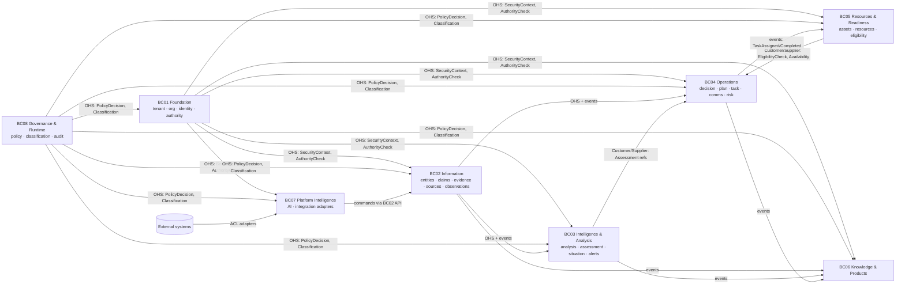

# Bounded Context Map

## العلاقات

| من (upstream) | إلى (downstream) | النمط | العقد | الاتساق |
|---|---|---|---|---|
| BC01 | الكل | Open Host Service + Published Language | `SecurityContext`، `AuthorityCheck(actor, decision_type, scope, at)` | متزامن |
| BC08 | الكل | Open Host Service (PDP) | `PolicyDecision(subject, action, resource, context)`، labels | متزامن، fail-closed |
| BC02 | BC03، BC04، BC06، BC07 | OHS + Domain Events | Entity/Claim/Observation queries (as-of)، events | استعلام متزامن؛ أحداث نهائية الاتساق |
| BC03 | BC04 | Customer / Supplier | Assessment references (versioned URNs) | مرجع لإصدار ثابت |
| BC05 | BC04 | Customer / Supplier | `EligibilityCheck(person, task_type, at)`، availability | متزامن |
| BC04 | BC05 | Domain Events | TaskAssigned، TaskCompleted (تحرير الموارد) | نهائي |
| External | BC07 | Anti-Corruption Layer | adapters → commands على BC02 | نهائي، مع lineage |

## قواعد
1. لا قراءة من مخزن سياق آخر (FIT-01). الوصول عبر OHS أو أحداث أو إسقاطات معلنة.
2. المراجع بين السياقات = URN + (version أو known_at) عند الحاجة لثبات الدليل.
3. BC07 لا يملك بيانات عمل؛ المحولات تكتب عبر أوامر BC02 كأي عميل (REQ-INF-005).
4. AI (R2) يقرأ عبر الإسقاطات المؤمنة فقط (ADR-P06)، ولا يكتب إلا بأوامر تمر بصلاحيات المستخدم وضمن AIL.
