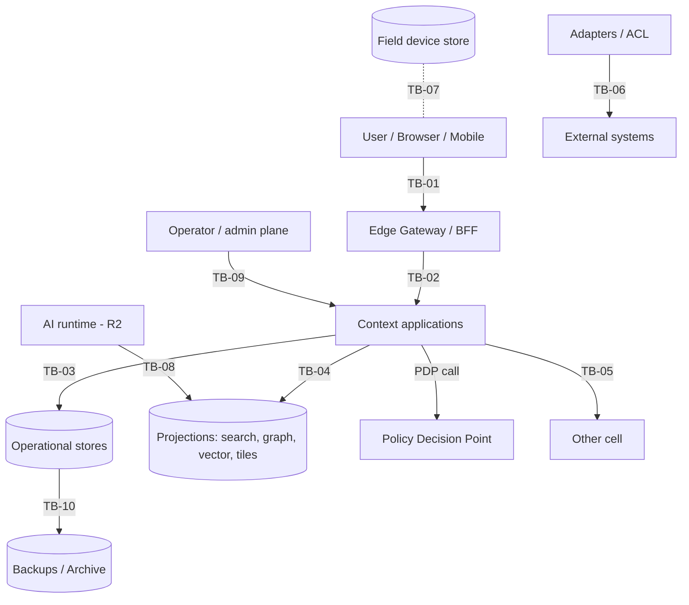

# Trust Boundary Model

| TB | الحد | ما يعبره | الضوابط الإلزامية |
|---|---|---|---|
| TB-01 | المستخدم ↔ البوابة | طلبات مصادقة | OIDC/SAML، TLS 1.3، رموز قصيرة العمر، حماية CSRF، حدود معدل |
| TB-02 | البوابة ↔ التطبيقات | SecurityContext موقّع | mTLS + هوية عبء العمل؛ التطبيقات لا تثق بترويسات غير موقّعة |
| TB-03 | التطبيق ↔ المخازن | استعلامات | حساب خدمة لكل سياق؛ RLS كحاجز ثان؛ لا وصول عابر للسياقات (FIT-01) |
| TB-04 | التطبيق ↔ الإسقاطات | استعلام بفلتر | فلتر النطاق المسموح إلزامي + إعادة فحص (ADR-P06)؛ الإسقاط لا يُسأل مباشرة من الواجهة |
| TB-05 | خلية ↔ خلية | لا شيء افتراضياً | لا مسار بيانات؛ الترحيل فقط بتصدير/استيراد معتمد |
| TB-06 | المنصة ↔ الأنظمة الخارجية | بيانات واردة | ACL، تحقق مخطط، حجر، lineage؛ لا ثقة تلقائية (BRL-013) |
| TB-07 | مخزن الجهاز الميداني | بيانات محلية | تشفير، انتهاء صلاحية، مسح عن بعد، ربط بالجهاز |
| TB-08 | AI ↔ البيانات والأدوات | سياق واسترجاع | صلاحيات المستخدم الطالب فقط، AIL، سجل Context Package (R2) |
| TB-09 | مستوى التشغيل ↔ بيانات المستأجر | إدارة | المشغل لا يقرأ بيانات المستأجر؛ Break-glass بموافقة شخصين ومدة وتدقيق |
| TB-10 | المخازن ↔ النسخ والأرشيف | نسخ | مشفرة بمفاتيح المستأجر؛ الاستعادة عملية مدققة |
