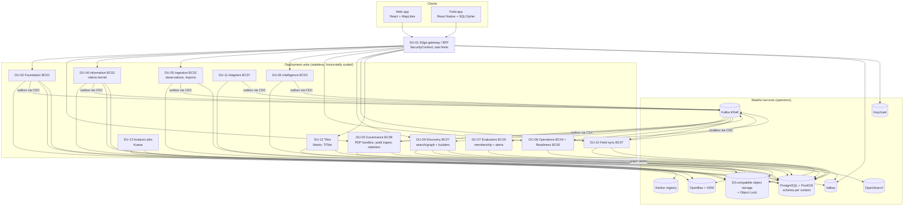

# C4 — Containers (خلية واحدة)

```mermaid
flowchart TB
  subgraph Clients
    WEB[Web app<br/>React + MapLibre]
    MOB[Field app<br/>React Native + SQLCipher]
  end
  GW[DU-01 Edge gateway / BFF<br/>SecurityContext, rate limits]
  subgraph Units["Deployment units (stateless, horizontally scaled)"]
    FND[DU-02 Foundation BC01]
    GOV[DU-03 Governance BC08<br/>PDP bundles, audit ingest, retention]
    INF[DU-04 Information BC02<br/>claims kernel]
    ING[DU-05 Ingestion BC02<br/>observations, imports]
    INT[DU-06 Intelligence BC03]
    EVA[DU-07 Evaluators BC03<br/>membership + alerts]
    OPS[DU-08 Operations BC04 + Readiness BC05]
    DIS[DU-09 Discovery BC07<br/>search/graph + builders]
    FLD[DU-10 Field sync BC07]
    ADP[DU-11 Adapters BC07]
    TIL[DU-12 Tiles<br/>Martin, TiTiler]
    JOB[DU-13 Analysis jobs<br/>Kueue]
  end
  subgraph Data["Stateful services (operators)"]
    PG[(PostgreSQL + PostGIS<br/>schema per context)]
    KF[(Kafka KRaft)]
    OS[(OpenSearch)]
    VK[(Valkey)]
    S3[(S3-compatible object storage<br/>+ Object Lock)]
    KMS[(OpenBao + HSM)]
    KC[(Keycloak)]
    REG[(Harbor registry)]
  end
  WEB & MOB --> GW
  GW --> FND & GOV & INF & ING & INT & OPS & DIS & FLD & TIL
  FND & GOV & INF & ING & INT & EVA & OPS & FLD & ADP --> PG
  FND & GOV & INF & ING & INT & OPS & FLD & ADP -->|outbox via CDC| KF
  KF --> EVA & DIS & GOV & FLD & OPS
  DIS --> OS
  DIS -->|graph tables| PG
  GW & FND & DIS --> VK
  INF & ING & FLD & JOB --> S3
  GOV & INF & FND --> KMS
  GW --> KC
  JOB --> REG
  TIL --> PG & S3
```

**قواعد:** كل وحدة تملك مخطط (schema) سياقها فقط (FIT-01)؛ كل وحدة تحمل مقيّم OPA مضمّناً (TD-08)؛ القراءة العابرة للسياقات عبر OHS أو الأحداث فقط.
