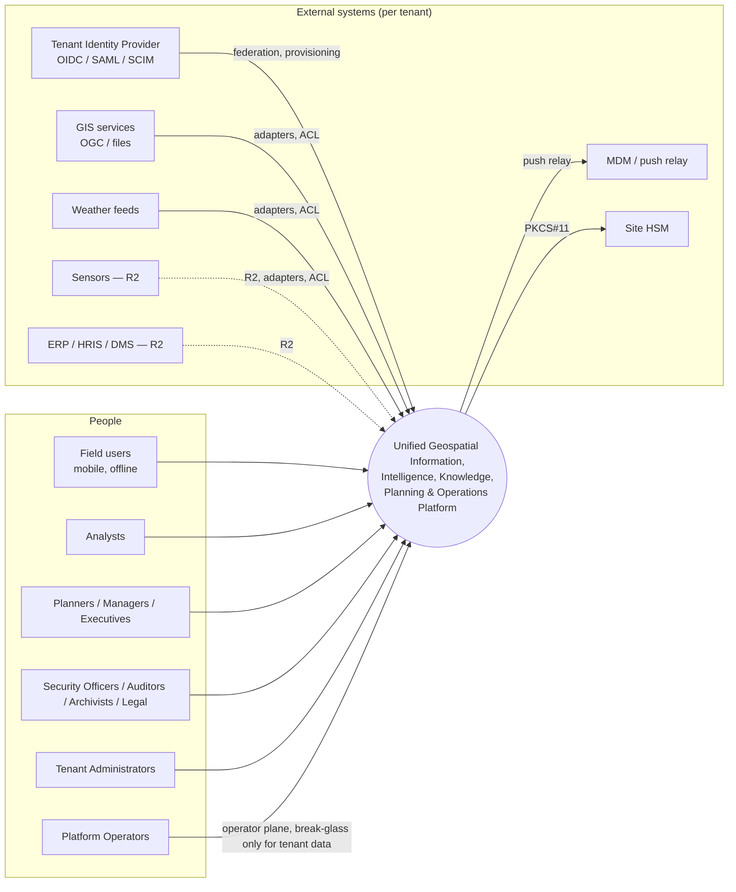

# C4 — System Context

```mermaid
flowchart LR
  subgraph People
    FU[Field users<br/>mobile, offline]
    AN[Analysts]
    PL[Planners / Managers / Executives]
    SO[Security Officers / Auditors / Archivists / Legal]
    AD[Tenant Administrators]
    OP[Platform Operators]
  end
  P((Unified Geospatial Information,<br/>Intelligence, Knowledge,<br/>Planning & Operations Platform))
  subgraph External["External systems (per tenant)"]
    IDP[Tenant Identity Provider<br/>OIDC / SAML / SCIM]
    GIS[GIS services<br/>OGC / files]
    WX[Weather feeds]
    SEN[Sensors — R2]
    ERP[ERP / HRIS / DMS — R2]
    MDM[MDM / push relay]
    HSM[Site HSM]
  end
  FU & AN & PL & SO & AD --> P
  OP -->|operator plane, break-glass only for tenant data| P
  IDP -->|federation, provisioning| P
  GIS & WX -->|adapters, ACL| P
  SEN -.->|R2, adapters, ACL| P
  ERP -.->|R2| P
  P -->|push relay| MDM
  P -->|PKCS#11| HSM
```

الحدود: المنصة لا تعتمد على أي خدمة إنترنت عامة (FIT-12). كل الأنظمة الخارجية داخل حدود المؤسسة أو الولاية.
