# BC01 — Foundation (Identity, Access, Organization)

## المستوى الأول — شرح مبسّط

هذا الـBounded Context هو "الأساس" الذي يقوم عليه كل شيء آخر في المنصة: من هو المستأجر (Tenant) الذي يملك البيانات، ما هي المؤسسة ووحداتها التنظيمية، من هم الأشخاص والمستخدمون، ما الأدوار التي يحملونها، من يملك حق اتخاذ أي قرار (Authority)، ومن يحق له رؤية أي مستوى من المعلومات (Clearance). أي طلب في أي جزء آخر من النظام يمر أولًا عبر هذا الـBC للتحقق من الهوية والصلاحية قبل أن يُسمح له بالمتابعة.

## المستوى الثاني — التفاصيل الهندسية

---

## 1. الهوية (Identity)

- **Bounded Context:** BC01
- **Domain:** DOM-01 (المؤسسة)، DOM-02 (الوصول)
- **Parent Capabilities:** CAP-01 (إدارة المؤسسة والوصول)، أجزاء من CAP-13 (الحوكمة والأمن) وCAP-14 (تشغيل المنصة)

## 2. المعنى التجاري (Business Meaning)

**Definition:** إدارة المستأجرين والمؤسسات والهوية والمصادقة والأدوار والسلطة والتصاريح الأمنية — الطبقة التي تُبنى عليها كل عزلة وتفويض في المنصة. [Explicit]

**Purpose / Business Objective:** OUT-04 (الحوكمة والامتثال) بشكل أساسي — ضمان أن كل عزل بيانات، كل قرار، وكل وصول للمعلومة قابل للتتبع والتفويض. [Explicit — capabilities.md]

**Scope:** تزويد المستأجر (Tenant)، هيكل المؤسسة (Organization/Units)، سجلات الأشخاص والمستخدمين وحسابات الخدمة، تعريف الأدوار وإسنادها، منح/تفويض سلطة القرار، تصريح المستخدمين الأمني، الأجهزة الميدانية، ومزامنة التغييرات من نظام الموارد البشرية (HRIS) كاقتراحات تحتاج اعتمادًا بشريًا.

**Out of Scope:** تنفيذ القرار نفسه (BC04)، تعريف *مخطط* التصنيف نفسه بمستوياته وأقسامه (**BC08** — AGG-CLASSIFICATION-SCHEME)، منح استثناء أمني (**BC08** — AGG-SECURITY-EXCEPTION، تحقَّق منه: `03-domain/contexts/BC08/aggregates/AGG-SECURITY-EXCEPTION.md`)، مجموعات السياسات (**BC08** — AGG-POLICY-SET، تحقَّق منه أيضًا). **نمط مكتشَف [Explicit، مؤكَّد]:** ثلاث حالات استخدام على الأقل من نطاق "080-089" (UC-085, UC-086, UC-088) مُصنَّفة بفاعل Security Officer وCapability من CAP-01.04/CAP-13.01 — تبدو كأنها BC01 — لكن الـAggregate الفعلي المنفِّذ لكل منها موجود في **BC08** لا BC01. هذا ليس خطأ توثيقي بل نمط معماري متكرر: طبقة "الحوكمة والأمن" (BC08) توفّر التنفيذ الفعلي بينما تظهر واجهة المستخدم (UC) في نفس النطاق الرقمي المتقاطع مع BC01.

**Features (طبقة بين Capability وUse Case):** غير موجودة في المصادر — لا يوجد أي كيان `FEAT-*` في `spec/`، وملف `01-business/capabilities.md` ينتقل من Capability مباشرة إلى Use Case. لذلك تبدأ سلسلة هذا الـBC من CAP ثم UC. **[Missing في المصدر]** (السلسلة الكاملة لكل Aggregate في [02-relationship-index.md §21](02-relationship-index.md)).

## 3. Actors

| Actor | الدور في BC01 | Evidence |
|---|---|---|
| **Administrator** | إدارة المستأجر/المؤسسة/المستخدمين/الأدوار (أغلب الـUCs) | [Explicit] |
| **Security Officer** | التصريح الأمني، السياسات، استثناءات الأمن، تعليق المستخدمين | [Explicit] |
| **Executive** | اعتماد المنح الجذرية لسلطة القرار (INV-AUT-04) | [Explicit] |
| **Manager** | تفويض سلطة قرار قائمة (UC-083) | [Explicit] |
| **Platform Operator** | تزويد/تعليق/إلغاء/ترحيل المستأجرين (نطاق منصة، لا مستأجر) | [Explicit] |
| **Auditor** | مراجعة سجل التدقيق (UC-087) | [Explicit] |
| **Tenant Administrator** | عرض الحصص (quotas) فقط | [Explicit] |
| **SCIM service account** | تزويد/تعطيل مستخدمين آليًا من IdP خارجي (لا يمنح أدوارًا مطلقًا — THR-S01-01) | [Explicit] |
| **system (workload identity)** | إتمام السagas، انتهاء الصلاحيات المجدول، مطابقة HRIS | [Explicit] |

## 4. Requirements المرتبطة (23 متطلبًا مباشرًا)

| REQ | البيان المختصر | UC | ملاحظة |
|---|---|---|---|
| REQ-FND-001 | عزل بيانات كل مستأجر | UC-080 | |
| REQ-FND-002 | مؤسسة بشجرة وحدات غير محدودة العمق | UC-081 | |
| REQ-FND-003 | تزويد ذري (all-or-nothing) | UC-080 | |
| REQ-FND-004 | خلية مخصصة/سيادية عند الحاجة | UC-080 | |
| REQ-FND-005 | مصادقة عبر IdP خارجي (OIDC/SAML) + SCIM | UC-084 | |
| REQ-FND-006 | Person/Identity/User/ServiceAccount سجلات منفصلة | UC-084 | |
| REQ-FND-007 | تسجيل سلطة القرار كمنحة | UC-082 | |
| REQ-FND-008 | تفويض السلطة بلا تجاوز | UC-083 | |
| REQ-FND-009 | فحص السلطة عند أي زمن | UC-032, UC-035 (خارج BC01 — Cross-Feature) | |
| REQ-FND-010 | تقييم التخويل قبل كل استرجاع | — (لا UC، **بالتصميم — OQ-034**) | [Explicit] |
| REQ-FND-011 | قرار التخويل يعتمد على 7 سمات (subject/action/resource/purpose/context/classification/jurisdiction) | UC-086 | |
| REQ-FND-012 | 6 أنواع قرار PDP (ALLOW/DENY/CONDITIONAL/REDACT/AGGREGATE/REQUIRE_APPROVAL) | UC-086 | |
| REQ-FND-013 | فشل PDP = DENY | — (لا UC، **بالتصميم — OQ-034**) | [Explicit] |
| REQ-FND-014 | 8 صلاحيات قابلة للمنح منفصلة | UC-086 | |
| REQ-FND-015 | سجل تدقيق لكل أمر/قراءة حساسة | UC-087 | |
| REQ-FND-016 | سجل تدقيق Append-only ومقاوم للعبث | UC-087 | |
| REQ-FND-017 | استثناء أمني يتطلب موافقة شخصين | UC-088 | |
| REQ-FND-018 | حصص وحدود معدل لكل مستأجر | UC-105 (خارج نطاق UC-08x) | |
| REQ-GOV-001 | مخطط تصنيف بمستويات وأقسام | UC-085 (BC08 فعليًا) | |
| REQ-GOV-002 | تصنيف إلزامي لكائنات T1/T2 | — (لا UC، **بالتصميم — OQ-034**) | [Explicit] |
| REQ-GOV-003 | القراءة تتطلب مستوى+كل الأقسام | **UC-089 (CR-64)** | تصحيح سابق |
| REQ-GOV-004 | سريان فوري لتخفيض الوصول | UC-085 + **UC-089 (CR-64)** | **CONFLICT-01 غير محسوم بالكامل** |
| REQ-OFF-005 | تشفير بيانات الجهاز الميداني + مسح عن بعد | UC-093 (خارج نطاق UC-08x) | |
| REQ-INT-004 | اقتراح HRIS يحتاج اعتماد إداري (لا تطبيق آلي) | UC-084 | |
| REQ-OPS-005 | رفض الاعتماد الذاتي للخطة (SoD) | UC-035 (**CAP-07.02 — BC04!**) | Cross-BC — انظر §21 |
| REQ-OPS-009 | رفض الاعتماد الذاتي لنتيجة المهمة (SoD) | UC-044 (**CAP-07.03 — BC04!**) | Cross-BC — انظر §21 |

**قرار مُحسَم (OQ-034، closed):** REQ-FND-010, REQ-FND-013, REQ-GOV-002 بلا Use Case **بالتصميم**، وليس نقصًا. الثلاثة تصف سلوك إنفاذ (enforcement) مدمجًا في الشرط المسبق لكل Use Case آخر في المنصة — لا فعل مستقل لفاعل. اختراع UC مستقل لها كان سيكون وهميًا؛ سجّل القرار كاملًا في `00-governance/registers/open-questions.md#OQ-034`.

## 5. Use Case Catalog (10 حالات استخدام، النطاق المتقاطع 080-089)

| UC | الاسم | Actor | Capability | Aggregate المُنفِّذ الفعلي |
|---|---|---|---|---|
| UC-080 | Provision Tenant | Administrator | CAP-01.01 | AGG-TENANT |
| UC-081 | Manage Organization & Units | Administrator | CAP-01.01 | AGG-ORGANIZATION |
| UC-082 | Manage Role & Authority | Administrator | CAP-01.03 | AGG-AUTHORITY-GRANT |
| UC-083 | Delegate Authority | Manager | CAP-01.03 | AGG-AUTHORITY-GRANT |
| UC-084 | Manage User Access & Federation | Administrator | CAP-01.02 | AGG-USER, AGG-PERSON, AGG-SERVICE-ACCOUNT, AGG-HR-SYNC-PROPOSAL |
| UC-085 | Manage Classification Scheme & Compartments | Security Officer | CAP-13.01 | AGG-CLASSIFICATION-SCHEME **(BC08، ليس BC01)** |
| UC-086 | Manage Access Policy | Security Officer | CAP-01.04 | AGG-POLICY-SET (لم يُفحص بعد ضمن هذا الـBC) |
| UC-087 | Review Audit Trail | Auditor | CAP-13.02 | (بنية تدقيق — خارج aggregates BC01) |
| UC-088 | Request & Approve Security Exception | Security Officer | CAP-13.01 | AGG-SECURITY-EXCEPTION **(⚠️ ملف مفقود من aggregates/BC01 — Needs Review)** |
| **UC-089** | **Manage User Clearance** (مُضافة، CR-64) | Security Officer | CAP-13.01 | AGG-CLEARANCE |

**بالإضافة، خارج هذا النطاق الرقمي لكنها تستخدم Aggregates BC01:** UC-093 (Wipe Lost Device → AGG-DEVICE)، UC-105 (Manage Tenant Quotas → AGG-TENANT)، UC-032/UC-035 (تستهلكان QRY-AUT-CHECK).

## 6. Aggregates (11) — الحالات والانتقالات

### 6.1 AGG-TENANT — وحدة العزل العليا
**Invariants:** INV-TEN-01..05 (المصادقة فقط أثناء ACTIVE؛ خلية واحدة؛ dedicated إن سيادي/تصنيف أعلى/حمل>20%؛ namespace فريد وثابت؛ لا إلغاء أثناء legal hold)

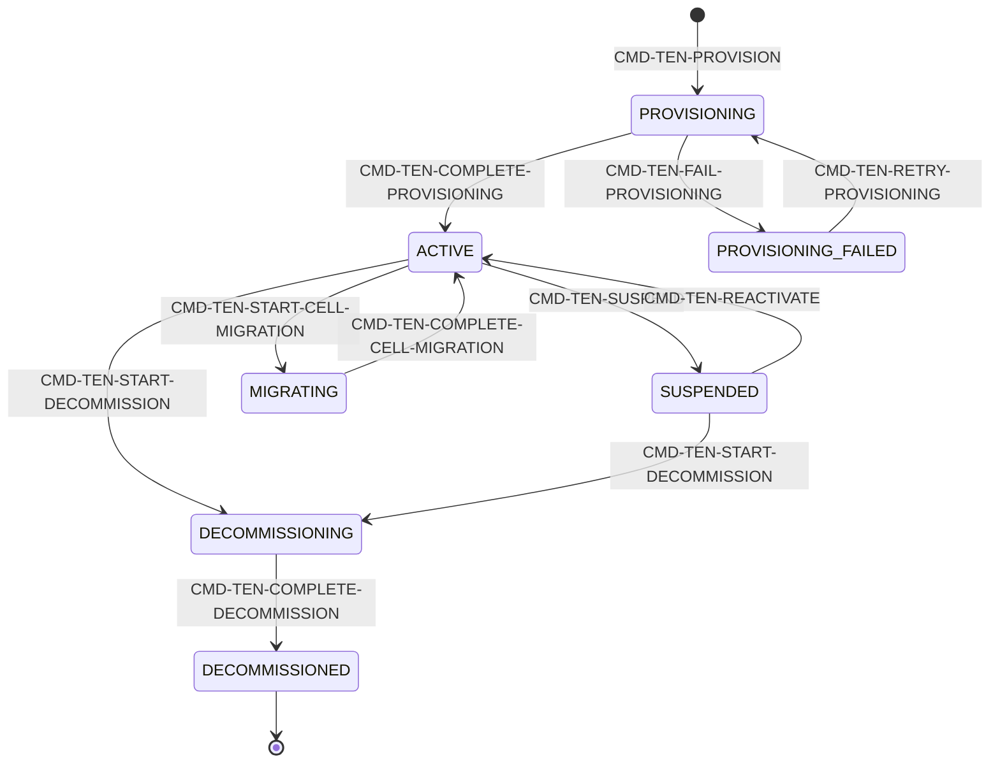
**Dependency صريحة:** `CMD-TEN-START-DECOMMISSION` guard = "no active legal hold **(BC08 query)**" → Depends On BC08. [Explicit]

### 6.2 AGG-ORGANIZATION — المؤسسة وشجرة الوحدات
**Invariants:** INV-ORG-01..04 (شجرة بلا حلقات وجذر واحد؛ أسماء إخوة فريدة؛ الوحدة غير النشطة لا تستقبل أبناء/إسنادات؛ ≤5000 وحدة)
**استثناء SL-06 مُبرَّر صراحة:** لا حالة نهائية — المؤسسات تُحفَظ للتاريخ المؤسسي (INACTIVE وليس حذفًا). [Explicit]

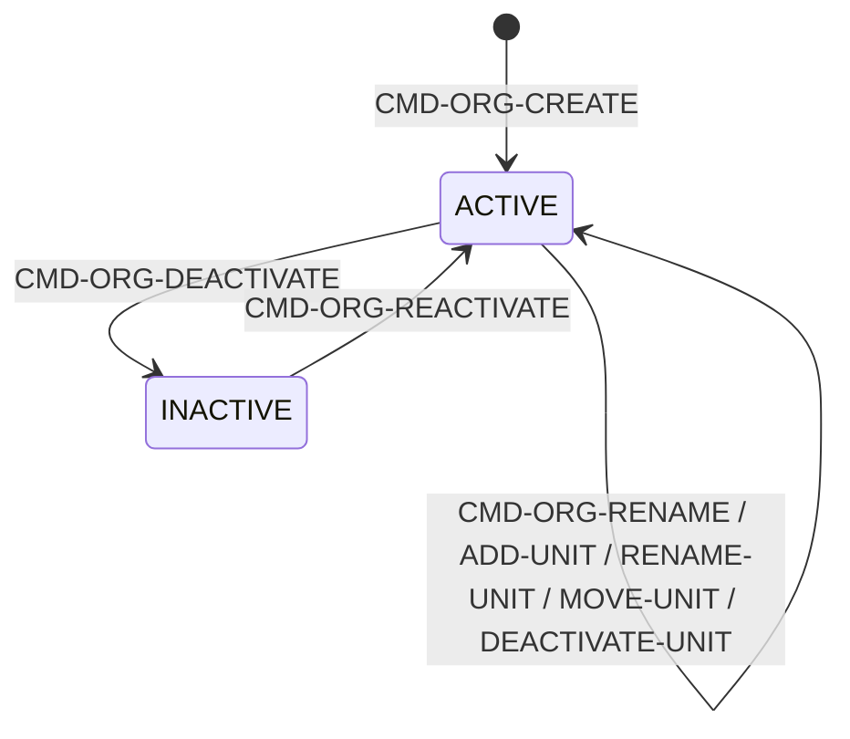
**THR-S01-12 مرتبط مباشرة:** نقل وحدة لتوسيع نطاق مسؤول — مخفَّف بزيادة security_version + اشتراط صلاحية إدارية على النطاقين القديم والجديد معًا.

### 6.3 AGG-PERSON — سجل الشخص
**بيانات شخصية: نعم.** Invariants: INV-PER-01 (crypto-shredding عبر ADR-P08)، INV-PER-02 (معرّف HR فريد).
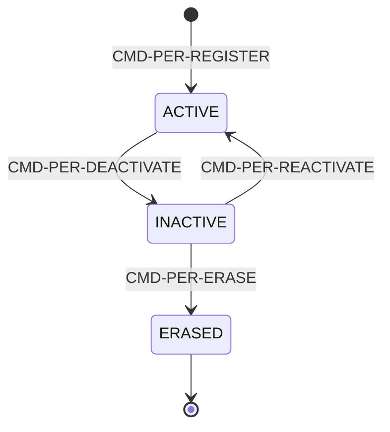
**ملاحظة تمييز مهمة [Explicit]:** "ليس كيان معلومات من نوع شخص" — أي AGG-PERSON (BC01) ≠ Entity من نوع person في BC02 (نموذج المعلومات). **Possible Confusion، وليست Duplicate** — نفس الكلمة "شخص" تعني شيئين مختلفين تمامًا في BC مختلفين.

### 6.4 AGG-USER — حساب الدخول
Invariants: INV-USR-01..05 (مستأجر واحد؛ (issuer,subject) فريد؛ ACTIVE يتطلب هوية واحدة على الأقل ومستأجر ACTIVE؛ كل تغيير تخويلي يزيد security_version؛ DISABLED/LOCKED/CLOSED لا يحصلون SecurityContext).
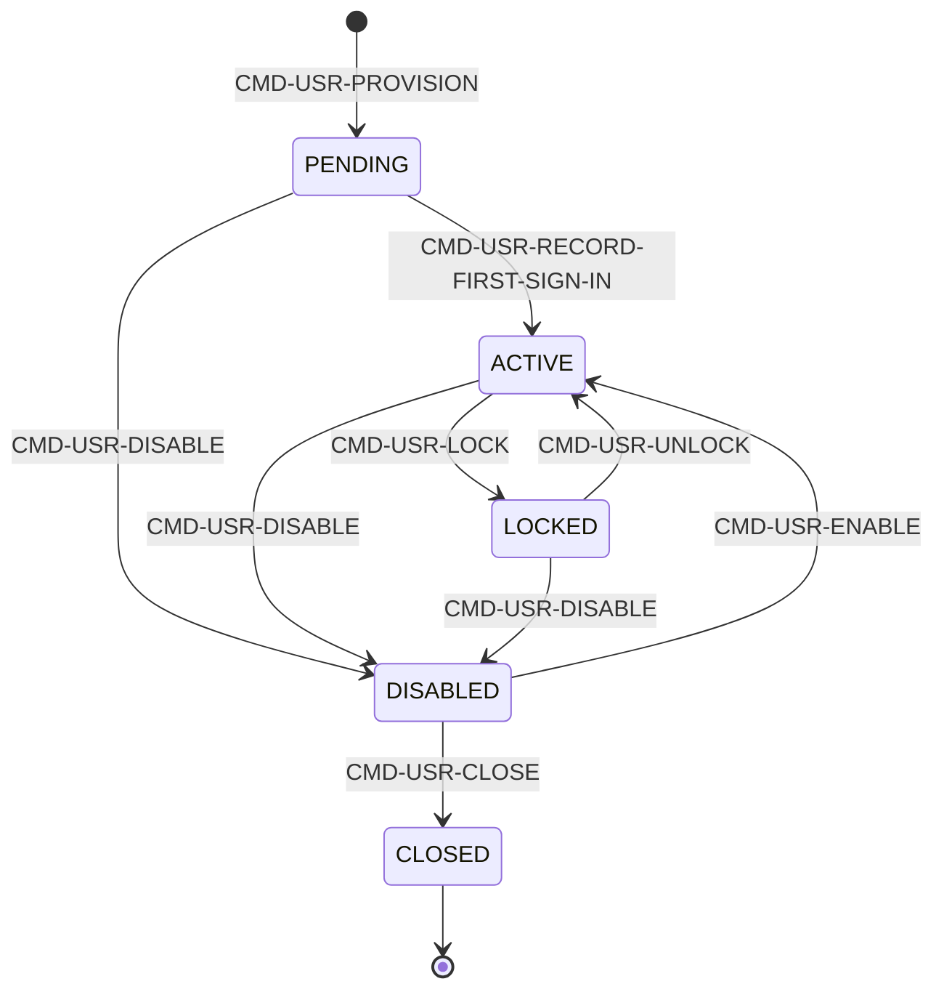
(أوامر LINK/UNLINK-IDENTITY وLINK-PERSON تعمل من أي حالة غير نهائية بلا تغيير حالة — غير مُمثَّلة في الرسم لتفادي التشويش، موثّقة في الجدول المصدري بالكامل.)

### 6.5 AGG-SERVICE-ACCOUNT — هوية غير بشرية
Invariants: INV-SVC-01..03 (لا ترتبط بشخص أبدًا؛ مالك ACTIVE دائمًا؛ عمر بيانات الاعتماد ≤90 يومًا).
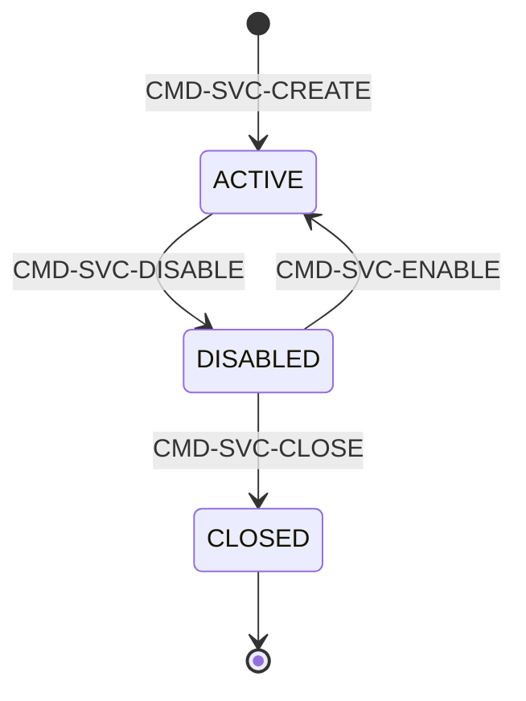
**THR-S01-11 (residual_risk: M، مقبول صراحة):** بيانات اعتماد طويلة العمر قد تُسرَّب — مخفَّف جزئيًا فقط (نافذة ≤90 يومًا)، اعتماد إضافي على رصد شذوذ مستقبلي (W8).

### 6.6 AGG-ROLE — تعريف الدور
Invariants: INV-ROL-01 (15 دورًا منصّيًا لا تُلغى/تُعدَّل)، INV-ROL-02 (صلاحيات منفصلة)، INV-ROL-03 (تغيير صلاحيات دور ACTIVE يزيد security_version لكل حامليه).
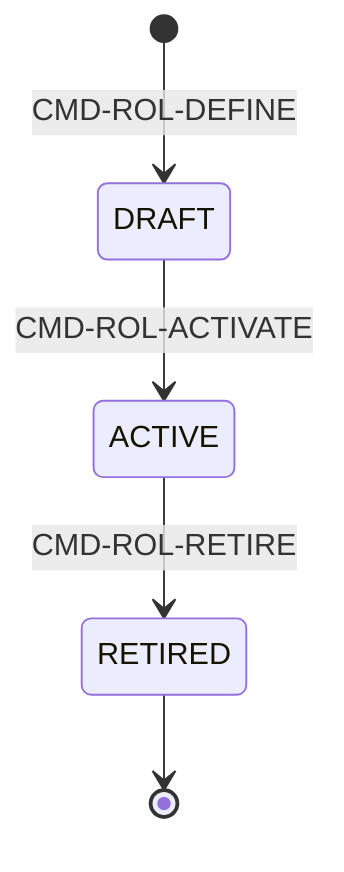

### 6.7 AGG-ROLE-ASSIGNMENT — إسناد دور
Invariants: INV-RAS-01 (لا إسناد خارج نطاق المسنِد ولا لنفسه)، INV-RAS-02 (أدوار متعارضة SoD: Auditor×Administrator، Auditor×Security Officer)، INV-RAS-03.
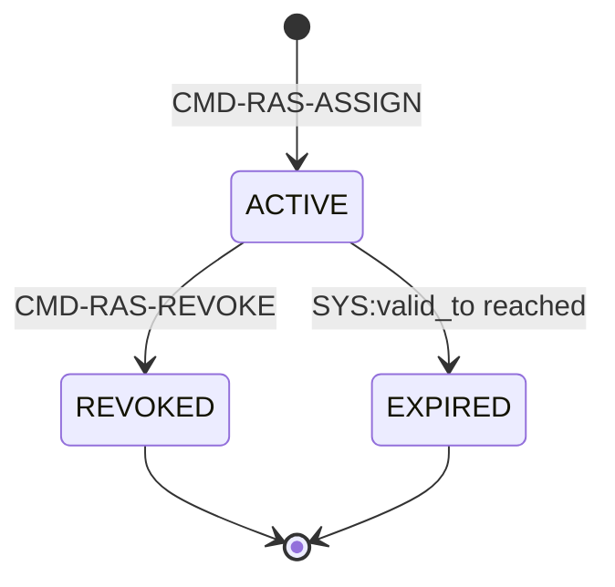
**Cross-BC مهم:** يُذكر في `traces.satisfies` أنه يحقق REQ-OPS-005/009 (SoD لاعتماد الخطط/المهام في **BC04**) — انظر §21.

### 6.8 AGG-DEVICE — الجهاز الميداني (slice SLC-11، ليس SLC-01!)
Invariants: INV-DEV-01..04 (فقط ACTIVE يفتح مزامنة؛ مفتاح الجهاز مربوط (user,device) وموقَّع؛ LOST يُلغي المفتاح فورًا؛ ≤3 أجهزة نشطة لكل مستخدم).
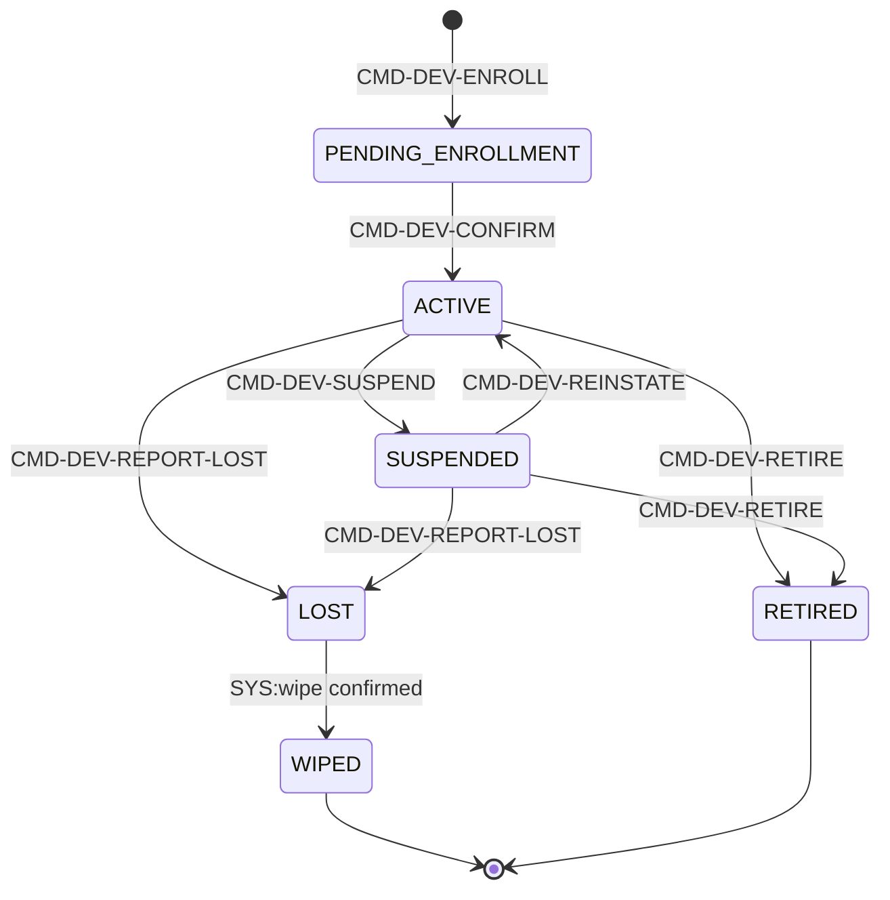
**ملاحظة [Needs Review]:** هذا الـAggregate الوحيد في BC01 الذي wave/slice مختلفة (SLC-11) عن البقية (SLC-01) — يعني أن نموذج بياناته المنطقي منفصل (`06-data/logical-model/slc-11.md` لا `slc-01.md`)، وuse case المرتبط (UC-093) خارج نطاق UC-08x. هذا دليل إضافي على نمط "BC01 يُطوَّر بالتجزئة عبر شرائح متعددة" وليس كتلة واحدة.

### 6.9 AGG-HR-SYNC-PROPOSAL — اقتراح مزامنة HR (slice SLC-16)
Invariants: INV-HRS-01 (لا تطبيق آلي لأي تغيير من HRIS)، INV-HRS-02 (اقتراحات "مغادرة" تُصعَّد فورًا)، INV-HRS-03 (تعطيل SCIM من IdP مستقل وفوري بغض النظر عن اقتراحات HR).
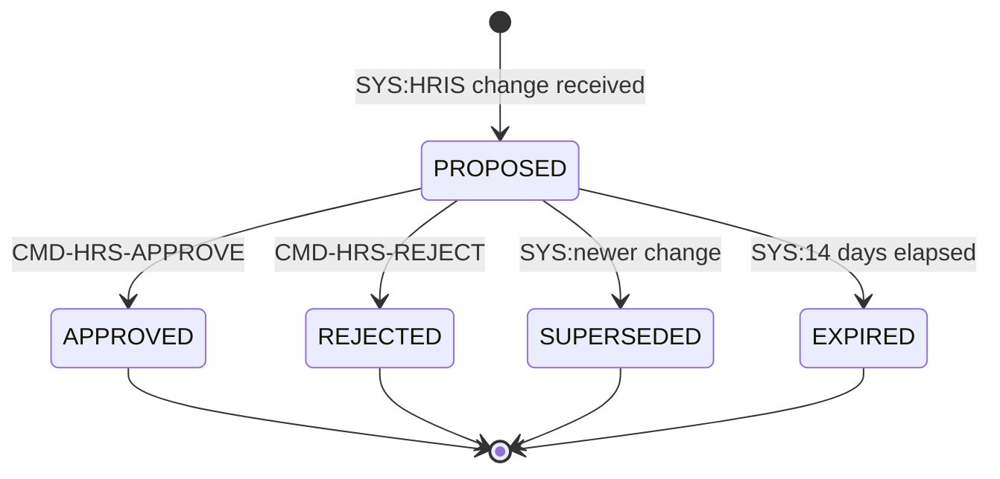
**علاقة مباشرة بـTHR-S01-01:** هذا الـAggregate بالكامل هو الضابط الهندسي لتلك التهديدة (منع التطبيق الآلي من HRIS). [Explicit]

### 6.10 AGG-AUTHORITY-GRANT و6.11 AGG-CLEARANCE
موثّقتان بعمق كامل (20 قسمًا: Use Cases، Function-Level Expansion، State Lifecycle، Business Rule Impact، Security & Compliance، Traceability) في محادثة العمل السابقة على هذا المشروع؛ الحقائق الجوهرية (الحالات/الانتقالات/الثوابت/الأخطاء) مُلخَّصة هنا للاتساق:

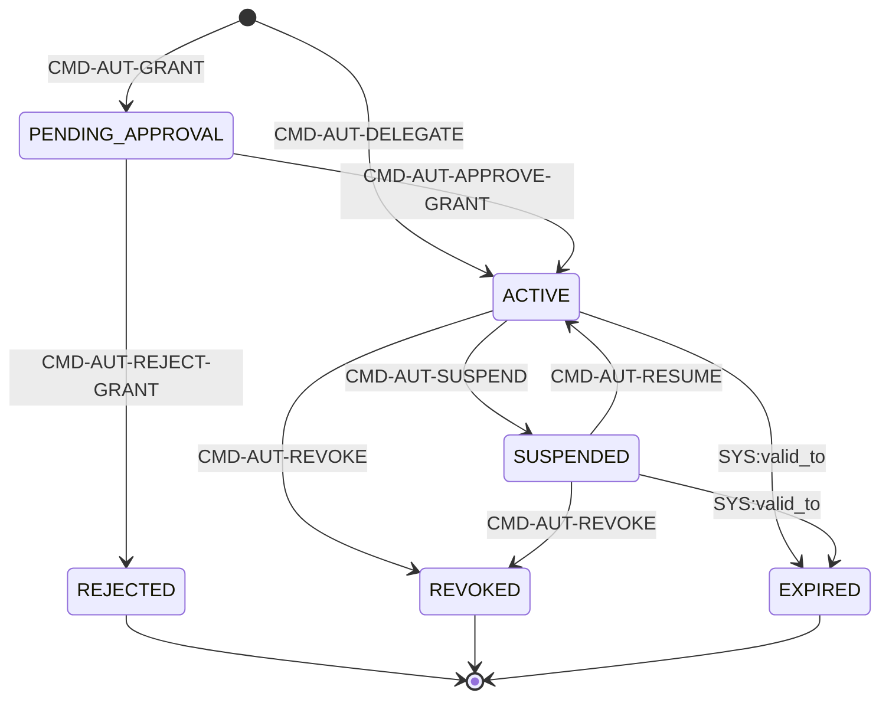
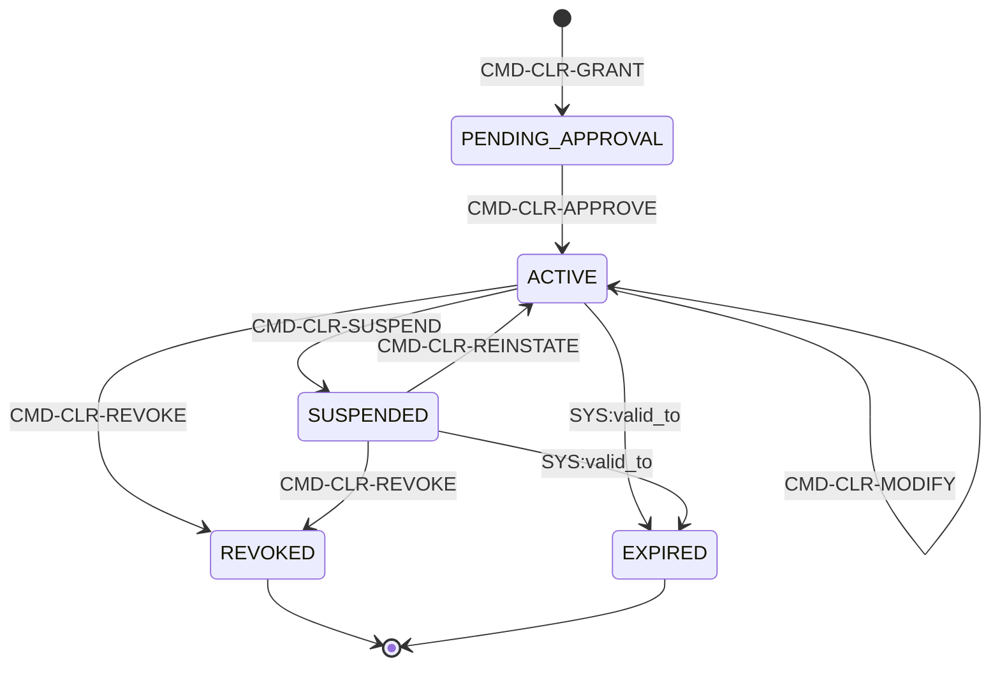

## 7. Commands (67 إجمالًا عبر 11 Aggregate: 58 في SLC-01 عبر 9، و9 في SLC-11/16)

| Aggregate | عدد الأوامر | القائمة |
|---|---|---|
| AGG-TENANT | 11 | PROVISION, COMPLETE/FAIL/RETRY-PROVISIONING, SUSPEND, REACTIVATE, START/COMPLETE-CELL-MIGRATION, START/COMPLETE-DECOMMISSION, UPDATE-QUOTAS |
| AGG-ORGANIZATION | 8 | CREATE, RENAME, ADD/RENAME/MOVE/DEACTIVATE-UNIT, DEACTIVATE, REACTIVATE |
| AGG-PERSON | 5 | REGISTER, UPDATE-DETAILS, DEACTIVATE, REACTIVATE, ERASE |
| AGG-USER | 10 | PROVISION, LINK/UNLINK-IDENTITY, LINK-PERSON, RECORD-FIRST-SIGN-IN, LOCK, UNLOCK, DISABLE, ENABLE, CLOSE |
| AGG-SERVICE-ACCOUNT | 5 | CREATE, ROTATE-CREDENTIAL, DISABLE, ENABLE, CLOSE |
| AGG-ROLE | 4 | DEFINE, SET-PERMISSIONS, ACTIVATE, RETIRE |
| AGG-ROLE-ASSIGNMENT | 2 | ASSIGN, REVOKE (+ SYS:valid_to) |
| AGG-AUTHORITY-GRANT | 7 | GRANT, APPROVE/REJECT-GRANT, DELEGATE, SUSPEND, RESUME, REVOKE |
| AGG-CLEARANCE | 6 | GRANT, APPROVE, MODIFY, SUSPEND, REINSTATE, REVOKE |
| AGG-DEVICE (SLC-11) | 7 | ENROLL, CONFIRM, ROTATE-KEY, SUSPEND, REINSTATE, REPORT-LOST, RETIRE |
| AGG-HR-SYNC-PROPOSAL (SLC-16) | 2 | APPROVE, REJECT (الإنشاء عبر محوّل HRIS لا أمر مستخدم) |

(AGG-DEVICE وAGG-HR-SYNC-PROPOSAL أوامرهما موثّقة في `commands-slc11.md`/`commands-slc16.md` — **خارج** `commands-slc01.md` رغم أنهما BC01، لأنهما slices مختلفة. تفصيل مهم لـTraceability: البحث عن "كل أوامر BC01" يتطلب فحص 3 ملفات commands-slc*.md لا ملفًا واحدًا.)

**⚠️ تصحيح [Phase 3.6، مكتشَف بالتحقق الآلي في `02-relationship-index.md` §21]:** رأس هذا القسم ذكر سابقًا "58 إجمالًا عبر 11 Aggregate"، لكن الـ58 تخص `commands-slc01.md` وحده (9 aggregates). الإجمالي الفعلي لـBC01 هو 67 (58 + 7 DEVICE + 2 HR-SYNC)، وأُضيف الصفّان أعلاه. خطأ صياغة داخلي في هذا الملف، لا تعارض بين مصدرين، فلا يُسجَّل في `05-conflicts.md`.

**مشترك لكل الـ67 أمرًا:** `Idempotency-Key` إلزامي؛ `If-Match` إلزامي لغير الإنشاء؛ استجابة 202/201 بـ`ResourceRef`. [Explicit]

## 8. Queries (10 إجمالًا: 8 في SLC-01 + QRY-DEV-LIST في SLC-11 + QRY-HRS-QUEUE في SLC-16)

| Query | يعيد | من يحق له |
|---|---|---|
| QRY-TEN-GET | حالة المستأجر، الخلية، الحصص | platform operator أو Tenant Administrator لنفس المستأجر |
| QRY-ORG-TREE | شجرة الوحدات | أي مستخدم في المستأجر |
| QRY-USR-LIST / QRY-USR-GET | المستخدمون | Administrator في النطاق أو الذات |
| QRY-SEC-CONTEXT | SecurityContext الخاص بالمستدعي | الذات فقط |
| QRY-AUT-CHECK | فحص التخويل عند زمن t | خدمات داخلية أو الذات |
| QRY-AUT-LIST | منح السلطة | Executive/Administrator في النطاق أو الحامل |
| QRY-CLR-GET | التصريح الحالي | Security Officer أو الذات |
| QRY-DEV-LIST (SLC-11) | الأجهزة المسجَّلة | انظر `queries-slc11.md` |
| QRY-HRS-QUEUE (SLC-16) | طابور مقترحات مزامنة HR | انظر `queries-slc16.md` |

## 9. Events (73 حدث Aggregate إجمالًا: 60 في SLC-01 + 8 DEVICE + 5 HR-SYNC؛ إضافة للحدث المشتق EVT-SEC-VERSION-INCREMENTED)

موزّعة: TEN(10)، ORG(8)، PER(5)، USR(10)، SVC(5)، ROL(4)، RAS(3)، AUT(8)، CLR(7) = 60 في SLC-01؛ DEV(8) في SLC-11؛ HRS(5) في SLC-16؛ +EVT-SEC-VERSION-INCREMENTED (مشتق، يُطلقه أي حدث "يؤثر أمنيًا" من كل ما سبق). **تصحيح [Phase 3.6]:** التوزيع السابق (TEN 9، ORG 7، USR 9، ROL 3، CLR 6) كان مجموعه 55 لا 60، وصُحِّح هنا بالعدّ الحرفي لعمود Aggregate في `events-slc01.md`. **نمط ثابت [Explicit]:** كل حدث "يؤثر أمنيًا" يُستهلَك دائمًا من نفس 3 مستهلكين: Security-version service، PEP decision caches، Projection security-version table — إضافة لمستهلكين خاصين بالسياق (Notification لـAUT، إلخ).

## 10. Business Rules / Invariants — أثرها

| المجموعة | العدد | نمط مشترك |
|---|---|---|
| INV-TEN-* | 5 | عزل + خلية واحدة + namespace ثابت |
| INV-ORG-* | 4 | شجرة سليمة + منع سوء الاستخدام |
| INV-PER-* | 2 | خصوصية (crypto-shredding) |
| INV-USR-* | 5 | هوية ≥1 + security_version |
| INV-SVC-* | 3 | لا ربط بشخص + عمر اعتماد محدود |
| INV-ROL-* | 3 | أدوار منصّة ثابتة + security_version |
| INV-RAS-* | 3 | لا تفويض ذاتي + SoD |
| INV-AUT-* | 4 | لا تجاوز + عمق تفويض + فاعلية زمنية |
| INV-CLR-* | 4 | تصريح واحد + SoD مشروط بالمستوى |
| INV-DEV-* | 4 | مفتاح موقَّع + حد أجهزة + إلغاء فوري |
| INV-HRS-* | 3 | لا تطبيق آلي + تصعيد المغادرة |

**نمط عابر لكل الـ11 Aggregate [Explicit، مؤكَّد آليًا]:** Optimistic concurrency (`If-Match`) + Idempotency-Key + State+History+Outbox+AuditOutbox في معاملة واحدة (ADR-P02) — **بلا استثناء واحد**. هذا أقوى دليل على اتساق نمط CQRS/Event-Sourcing عبر كل BC01.

## 11. Policies — 67 سياسة أمر (58 في SLC-01 + POL-DEV-* ×7 في SLC-11 + POL-HRS-* ×2 في SLC-16) + 7 Platform Baselines

**Platform Baselines (PB-01..07) — تُطبَّق قبل أي سياسة مستأجر ولا يتجاوزها المستأجر (INV-POL-02):**

| PB | القاعدة | قابلة للتجاوز؟ |
|---|---|---|
| PB-01 | tenant(subject)=tenant(resource) وإلا DENY بشكل "not-found" | لا |
| PB-02 | قاعدة التصنيف (classification-scheme §2) | لا |
| PB-03 | PDP غير متاح → DENY | لا |
| PB-04 | كل أمر تغييري + قراءة فوق حد → التزام تدقيق | لا |
| PB-05 | الفاعل لا يعمل على تصريحه/إسناداته/اعتماداته الخاصة | لا |
| PB-06 | فصل المهام لاعتماد الخطة/المهمة (REQ-OPS-005/009) | **المستأجر قد يعطّلها بسياسة موثّقة** |
| PB-07 | MFA إلزامي لأوامر إدارة الأمن | لا |

**نمط الأوامر:** كل سياسة أمر تتبع نفس البنية الثمانية (command/subject/resource/context_conditions/segregation_of_duties/decision/otherwise/obligations/platform_baseline). segregation_of_duties موجودة صراحة فقط في: POL-TEN-START-DECOMMISSION (عاملان مختلفان)، POL-AUT-APPROVE-GRANT، POL-AUT-DELEGATE، POL-CLR-GRANT، POL-CLR-APPROVE، POL-RAS-ASSIGN — أي 6 من 58 (~10.3%) تحمل قيد SoD صريحًا.

**⚠️ تصحيح [مكتشَف أثناء دراسة BC08]:** `policies-slc01.md` يحوي 71 command_policies إجمالاً، لكن 13 منها (POL-CLS-* ×4، POL-POL-* ×5، POL-EXC-* ×4) تخص AGG-CLASSIFICATION-SCHEME/AGG-POLICY-SET/AGG-SECURITY-EXCEPTION — وكلها **BC08** لا BC01 (نفس نمط "الشريحة ≠ BC" المكتشف سابقًا في SLC-06/SLC-16). العدد الصحيح لسياسات BC01 وحدها هو **58** (71 − 13). كذلك query_policies: من أصل 14، ست تخص BC08 (POL-CLS-ACTIVE، POL-POL-GET، POL-PDP-DECIDE، POL-AUD-SEARCH، POL-AUD-VERIFY، POL-EXC-LIST) — BC01 وحدها 8.

## 12. Security & Threats (STRIDE — 11 تهديدًا موثّقًا لـBC01، بعد تصحيحَين)

| THR | المكوّن | STRIDE | المخاطرة المتبقية |
|---|---|---|---|
| THR-S01-01 | SCIM endpoint | Spoofing/Elevation | L |
| THR-S01-02 | Role assignment | Elevation | L |
| THR-S01-03 | Delegation | Elevation | L |
| THR-S01-04 | Clearance | Elevation | **M (مقبولة صراحة)** |
| THR-S01-07 | SecurityContext | Spoofing | L |
| THR-S01-08 | Tenant provisioning | Tampering | L |
| THR-S01-09 | Audit outbox | Repudiation | L |
| THR-S01-10 | Revocation | Info Disclosure | L |
| THR-S01-11 | Service account | Spoofing | **M (مقبولة صراحة)** |
| THR-S01-12 | Org tree | Tampering | L |
| **THR-S16-02** (مُضافة) | HRIS (AGG-HR-SYNC-PROPOSAL) | Elevation | L |

**مخاطرتان متبقيتان مقبولتان صراحة (accepted_residual_risks) وليس فقط "منخفضتين":** THR-S01-04 (تواطؤ ضابطي أمن — يُخفَّف بمراجعة Auditor دورية) وTHR-S01-11 (تسرّب بيانات اعتماد حساب خدمة — يُخفَّف بنافذة ≤90 يومًا + رصد شذوذ مستقبلي W8 غير موجود بعد).

**⚠️ تصحيح 1 [مكتشَف أثناء دراسة BC07]:** الجولة الأولى لهذا الملف فحصت `threat-model-slc01.md` فقط (12 تهديدًا) ولم تفحص `threat-model-slc16.md` رغم أن `AGG-HR-SYNC-PROPOSAL` (BC01) يعيش في SLC-16. **THR-S16-02** ("forged HR change grants access") يخص هذا الـaggregate تحديدًا (يطابق INV-HRS-01 حرفيًا) — أُضيف الآن. باقي تهديدات SLC-16 (01/03/04/05) تخص BC03/BC07 لا BC01 (موثَّق في ملفاتها).

**⚠️ تصحيح 2 [مكتشَف أثناء دراسة BC08]:** `THR-S01-05` (Policy set / Tampering) و`THR-S01-06` (Security exception / Elevation) كانا مُدرَجين هنا سابقًا ضمن "13 تهديدًا لـBC01"، لكن مكوّنَيهما الفعليَّين — `AGG-POLICY-SET` و`AGG-SECURITY-EXCEPTION` — كلاهما **BC08** (`bounded_context: BC08` في الـfront-matter)، لا BC01، رغم عيشهما في ملف `threat-model-slc01.md` نفسه (نفس نمط "الشريحة ≠ BC" المتكرر: THR-S06 مع BC03/BC04، THR-S16 مع BC01/BC03/BC07). أُزيلا من هذا الجدول ونُقلا إلى `bc08-governance-security.md`؛ العدد الصحيح لتهديدات BC01 من SLC-01 هو 10 (12 − 2)، زائد THR-S16-02 = **11 إجمالاً**.

## 13. Data & APIs

- **النموذج المنطقي:** `06-data/logical-model/slc-01.md` (TEN..CLR)، `slc-11.md` (DEVICE)، `slc-16.md` (HR-SYNC-PROPOSAL) — **ثلاثة ملفات منفصلة لنفس الـBC**.
- **العقود:** `05-contracts/openapi-foundation-slc01.md`، `openapi-foundation-internal-slc01.md`، `asyncapi-slc01.md`، `errors-slc01.md` (كتالوج موحّد لكل الأخطاء).
- **SecurityContext (اللغة المنشورة):** JWS، عمر ≤60 ثانية داخليًا، فحص security_version في كل طلب (يجعل السحب فوريًا).

## 14. Integrations

- **IdP خارجي** (OIDC/SAML) — REQ-FND-005
- **SCIM** — تزويد/تعطيل آلي، محدود صراحة (لا أدوار)
- **HRIS** — عبر AGG-HR-SYNC-PROPOSAL، اقتراح فقط لا تطبيق
- **BC08** — استعلام legal hold عند إلغاء مستأجر؛ مخطط تصنيف لمنح التصريح

## 15. Verification / Acceptance

Gherkin رسمي مؤكَّد آليًا (تطابق 100% مع جداول الانتقالات) لـ: `TST-AUTHORITY-GRANT-SM` (7 مسموح/35 مرفوض)، `TST-CLEARANCE-SM` (7 مسموح/23 مرفوض). باقي الـ9 aggregates لها ملفات `TST-*-SM` مقابلة في `13-verification/acceptance/SLC-01/` (وSLC-11/SLC-16 لـDEVICE/HR-SYNC) — **لم تُفحص أسطرها بالكامل في هذه الجولة** [Missing — يحتاج Phase 3 جولة تحقق تالية].

## 16. Dependencies (خارج BC01)

| من | العلاقة | إلى |
|---|---|---|
| AGG-TENANT (decommission) | `depends_on` | BC08 (legal hold query) |
| AGG-CLEARANCE (grant/modify) | `depends_on` | BC08 (AGG-CLASSIFICATION-SCHEME ACTIVE) |
| AGG-ROLE-ASSIGNMENT | `enables` | BC04 (SoD لاعتماد الخطة REQ-OPS-005 والمهمة REQ-OPS-009) |
| BRL-003 (عبر AGG-AUTHORITY-GRANT) | `enables` | CAP-06 (تسجيل القرار) |
| PB-06 | `constrains` | BC04 (فصل مهام قابل للتعطيل بسياسة مستأجر) |
| UC-086 (Manage Access Policy) | `realizes` | BC08 (AGG-POLICY-SET) |
| UC-088 (Request & Approve Security Exception) | `realizes` | BC08 (AGG-SECURITY-EXCEPTION) |

## 17. Cross-BC Relationships (ملخص)

BC01 هو **مزوّد بنية تحتية** (Authority/Identity/Clearance/Audit substrate) لكل BC آخر تقريبًا، وليس مستهلكًا لهم عدا BC08 (يعتمد عليه لسؤالين محددين: legal hold، مخطط التصنيف). هذا نمط "Core/Generic Subdomain يخدم الجميع" في مصطلحات DDD — يتوافق مع كونه CAP-01 هو أول Capability في الخريطة الكاملة.

## 18. Traceability

الرجوع الكامل موجود في `01-entity-index.md` (كل ID من هذا الملف قابل للبحث فيه مع كل الملفات المرجعية له) و`02-relationship-index.md` (العلاقات الدلالية المصنَّفة).

## 19. Conflicts

- **CONFLICT-01** (من الجولة السابقة، محلول جزئيًا عبر CR-64): ربط REQ-GOV-004 بين UC-085 (BC08) وUC-089 (BC01) الجديدة — ما زال يحتاج تأكيدًا بشريًا نهائيًا هل الاثنان صحيحان معًا أم أحدهما فقط.
- **لا تعارضات جديدة مكتشفة** بين الـ9 aggregates الإضافية التي فُحصت هذه الجولة — بياناتها متسقة داخليًا وفيما بينها.

## 20. Missing Information (مُجمَّعة)

1. ~~لا ملف Aggregate لـAGG-SECURITY-EXCEPTION~~ — **تم التحقق:** موجود في `03-domain/contexts/BC08/aggregates/AGG-SECURITY-EXCEPTION.md`. ليس Missing، بل Cross-BC (انظر §2).
2. ~~لا ملف Aggregate ظاهر لـAGG-POLICY-SET~~ — **تم التحقق:** موجود في `03-domain/contexts/BC08/aggregates/AGG-POLICY-SET.md`. ليس Missing، بل Cross-BC (انظر §2).
3. ~~REQ-FND-010, REQ-FND-013, REQ-GOV-002 بلا Use Case~~ — **مُحسَم:** قرار بالتصميم، ليس فجوة (انظر OQ-034 وCR-64 المرتبط بها في السجل).
4. أسطر ملفات acceptance-spec لـ9 من 11 aggregate لم تُقرأ حرفيًا هذه الجولة (فقط عُرفت بالاسم من الفهرس) — **[Missing verification pass]**.

## 21. Completeness Status

| الفحص | الحالة |
|---|---|
| كل Aggregate له Purpose/States/Commands/Events؟ | ✅ 11/11 |
| كل Command مرتبط بAggregate/Policy؟ | ✅ 67/67 (مؤكَّد من commands-slc01/11/16.md؛ صُحِّح من 58/58 في Phase 3.6) |
| كل Event له Producer وConsumer؟ | ✅ 61/61 |
| كل Requirement مرتبط بUC (أو قرار صريح بعدم الحاجة)؟ | ✅ 26/26 (23 بـUC + 3 بقرار "لا UC بالتصميم"، OQ-034) |
| Threat model مربوط؟ | ✅ 12/12 مع تصنيف STRIDE ومخاطرة متبقية |
| كل UC مرتبط بAggregate منفِّذ (ولو Cross-BC)؟ | ✅ 10/10 (بعد تأكيد UC-086→BC08 وUC-088→BC08) |
| **الحالة الإجمالية** | **OPEN** — بند وحيد متبقٍ فعليًا هو حسم CONFLICT-01 بشريًا؛ باقي الفجوات المبدئية تحوّلت لعلاقات Cross-BC مؤكَّدة لا فجوات حقيقية |
