# BC02 — Information Core (النواة المعلوماتية)

## المستوى الأول — شرح مبسّط

هذا الـBounded Context هو "ذاكرة الحقائق" في المنصة: كل ما يُرصَد أو يُستورَد أو يُدَّعى عن كيانات وعلاقات وأحداث العالم الحقيقي يمر من هنا. الفكرة الجوهرية: **الكيان نفسه لا يحمل بيانات — كل صفة له هي "ادعاء" (Claim) منفصل له مصدر وفترة صلاحية**. هذا يسمح بتتبع من قال ماذا ومتى، وحل التعارضات دون حذف أي شيء، ودمج السجلات المكررة دون فقدان تاريخها.

## المستوى الثاني — التفاصيل الهندسية

---

## 1. الهوية (Identity)

- **Bounded Context:** BC02
- **Domains:** DOM-03 (نموذج المعلومات)، DOM-04 (الزمن)، DOM-05/06 (الجمع)، DOM-07 (التحليل — مشترك مع BC03/BC04 عبر REQ-FUS/REQ-CRD)، DOM-24 (الاستيعاب)
- **Parent Capabilities:** CAP-02 (جمع المعلومات)، CAP-03 (إدارة المعلومات)، جزء من CAP-04.04 (الدمج والربط، مشترك مع BC04)

## 2. المعنى التجاري (Business Meaning)

**Definition:** النموذج المعلوماتي المركزي القائم على Entity/Claim/Evidence/Observation/Source، مع دورة كاملة: جمع (Collection) → استيعاب (Ingestion) → تحقق (Validation) → مطابقة الهوية (ER) → دمج/ربط (Correlation/Fusion) → حل التعارض (Conflict). [Explicit]

**Purpose / Business Objective:** OUT-01 (نقطة وصول واحدة موثوقة للمعلومات) وOUT-02 (فهم سياقي). [Explicit — capabilities.md]

**Scope:** 18 Aggregate عبر 4 شرائح (SLC-02 الأساسية: 11 aggregates؛ SLC-04 المطابقة/التعارض: 3؛ SLC-14 تخطيط الجمع: 2؛ SLC-15 الربط/الدمج: 2).

**Out of Scope:** التحليل والتقييم النهائي وحالات القرار (BC03)، إدارة حالات التنسيق بين المنظمات (**BC04** — AGG-COORDINATION-CASE، REQ-CRD-001/002، UC-130/UC-131 — تعيش في نفس شريحة SLC-15 التي تحوي AGG-CORRELATION-RULE/PROPOSAL البادئة بـBC02، لكنها ليست BC02)، تنفيذ المهام الميدانية نفسها (BC04 عبر plan_ref، رغم أن AGG-COLLECTION-PLAN ينشئ مهامًا عبر SLC-03).

**نمطان معماريان مكتشَفان يُشكّلان فهم نطاق BC02 (تفصيلهما الكامل في §7/§9 و§14):**

1. **نمط RECLASSIFY الموحَّد.** سبعة من أصل 11 aggregate في مجموعة SLC-02 (Entity, Relationship, RealWorldEvent, Claim, Evidence, Observation, Source) تحمل أمر `CMD-*-RECLASSIFY` بنفس الحارس الحرفي: *"authority per tenant policy (REQ-GOV-004); new version; bumps object security_version"*. هذا يعني أن REQ-GOV-004 ليست مسؤولية aggregate واحد (لا BC08/Scheme، ولا BC01/Clearance فقط) بل نمط أمر متكرر عبر عشرات الـaggregates في كل الـBCs. هذا الاكتشاف — المُسجَّل في الجولة السابقة — أصبح جزءًا رسميًا من حل **CONFLICT-01** (انظر §19): REQ-GOV-004 متطلب واحد بثلاث آليات إنفاذ متكاملة (كائن فردي عبر RECLASSIFY، مخطط كامل عبر BC08، تصريح مستخدم عبر BC01/AGG-CLEARANCE)، وليس تعارضًا حقيقيًا.
2. **الشريحة (Slice) ≠ السياق المحدود (Bounded Context).** ملفات `commands/events/queries/policies/threat-model-slcNN.md` مُنظَّمة حسب شريحة التطوير لا حسب BC، وقد تمتد شريحة واحدة عبر أكثر من BC. حالتان مؤكَّدتان داخل نطاق دراسة BC02: (أ) `AGG-ADAPTER` وسياساته/أوامره/أحداثه تظهر في ملفات باسم "slc02" لكنها تعيش فعليًا في `03-domain/contexts/**BC07**/`؛ (ب) `AGG-COORDINATION-CASE` (البند أعلاه) يعيش في نفس شريحة SLC-15 مع BC02 لكنه ملك **BC04**. هذا الاكتشاف أصبح جزءًا من **CONFLICT-02** المُغلَق مركزيًا (انظر §19)، مع ملاحظة أن الحالة (ب) لم تُدرَج بعد صراحة في جدول CONFLICT-02 المركزي — علَم يُرفَع للجلسة المنسِّقة (انظر ملخص التسليم).

## 3. Actors

| Actor | الدور في BC02 | Evidence |
|---|---|---|
| **Analyst** | الفاعل الأساسي: تسجيل/تصنيف/تقاعد الكيانات والعلاقات والأحداث والادعاءات؛ حل التعارضات؛ مراجعة حالات ER؛ تعريف/مراجعة قواعد المطابقة والربط | [Explicit] |
| **Security Officer** | الطرف الثاني في `CMD-SRC-SET-PROTECTION` (تخفيض حماية هوية مصدر يتطلب ضابطي أمن) | [Explicit] |
| **Field User / Operator** | تسجيل الملاحظات (Observations) وتسجيل الأدلة ميدانيًا | [Explicit] |
| **adapter service account** | استيعاب آلي: استيراد الدفعات، تعيين المعرّفات الخارجية، تسجيل كيانات/ادعاءات كمصدر آلي | [Explicit] |
| **Administrator** | تقديم/إدارة دفعات الاستيراد (إلى جانب adapter service account) — UC-094 | [Explicit] |
| **custodian role** | نقل حيازة الدليل (سلسلة الحيازة) | [Explicit] |
| **Analyst lead** | صياغة/تعديل قواعد المطابقة (MATCH-RULESET) وقواعد الربط (CORRELATION-RULE) | [Explicit] |
| **Administrator ≠ author** | تفعيل قاعدة المطابقة (SoD مع Analyst lead) | [Explicit] |
| **second approver** | تفعيل قاعدة الربط (SoD مع Analyst lead) | [Explicit] |
| **second Analyst / second reviewer** | تأكيد/تقسيم حالات ER للمجمعات الكبيرة (>50 عضوًا) أو بعد طلب انقسام (SoD) | [Explicit] |
| **collection manager** | اعتماد/رفض/تعديل متطلبات الجمع (SoD مع مقدّم الطلب) | [Explicit] |
| **collection planner** | إنشاء/تفعيل/إغلاق خطط الجمع وأنشطتها | [Explicit] |
| **any requester** | صياغة/تعديل/تقديم/إغلاق متطلب الجمع الخاص به | [Explicit] |
| **analysis-run identity / verification re-evaluator (system identity)** | تأكيد/تقييم ادعاءات كهويات نظامية (تكامل محتمل مع BC03) | [Explicit] |
| **user with write permission on target object** | بدء/إكمال رفع المرفقات ومحوها | [Explicit] |

## 4. Requirements المرتبطة (36 متطلبًا: 27 REQ-INF + 4 REQ-SRC + 3 REQ-COL + 2 REQ-FUS)

| REQ | البيان المختصر | UC | ملاحظة |
|---|---|---|---|
| REQ-INF-001 | تسجيل مصدر بموثوقية A–F وتاريخ تغييرها | UC-004, UC-095 | |
| REQ-INF-002 | حقول إلزامية عند تسجيل ملاحظة (زمن رصد/حدث/تسجيل، موقع+CRS+دقة، مصدر، راصد، مرفقات) | UC-005 | |
| REQ-INF-003 | تخزين المرفقات في object storage بمرجع hash | UC-005, UC-006 | |
| REQ-INF-004 | حساب/التحقق من hash المرفق عند التخزين/الاسترجاع | UC-006 | |
| REQ-INF-005 | استيعاب خارجي عبر محولات/دفعات مسجَّلة فقط (مصدر+دفعة+تحويل+نسب) | UC-094 | |
| REQ-INF-006 | حجر السجل غير الصالح مع سبب الرفض، بلا نشر | UC-094 | |
| REQ-INF-007 | إعادة إرسال الدفعة لا يكرر السجلات (idempotency) | UC-094 | |
| REQ-INF-008 | استيراد بيانات جغرافية-مكانية بمعايير OGC/GeoJSON/GeoPackage/GeoTIFF/KML | UC-094 | |
| REQ-INF-009 | استيعاب بيانات الطقس عبر محول وتسجيل المزوّد كمصدر | UC-094 | |
| REQ-INF-020 | تمثيل Entity/Event/Relationship/Claim/Evidence/Source/Observation كأنواع كائن مستقلة | UC-001, UC-002, UC-003 | |
| REQ-INF-021 | كل قيمة سمة لكائن T1 = ادعاء مرتبط بمصادر وأدلة وثقة | UC-006 | |
| REQ-INF-022 | فترة صلاحية (valid) وفترة تسجيل (recorded) لكل ادعاء T1 | — | [Explicit، بالتصميم — بنية ثنائية التأريخ] |
| REQ-INF-023 | استعلام الحالة عند valid_at/known_at معًا | UC-096 | |
| REQ-INF-024 | لا كتابة فوق ادعاء T1 أبدًا؛ التصحيح يغلق ويُنشئ نسخة جديدة | — | [Explicit، بالتصميم — BRL-002] |
| REQ-INF-025 | كشف/فتح حالة تعارض عند تضارب ادعاءين متداخلي الصلاحية | UC-008 | |
| REQ-INF-026 | سبعة أبعاد ثقة منفصلة (موثوقية المصدر، ثقة المعلومة، جودة البيانات، حالة التحقق، الحداثة، الاكتمال، عدم اليقين) | — | [Explicit، بالتصميم] |
| REQ-INF-027 | تمثيل العلاقات ككائنات بنوع/طرفين/صلاحية/دليل/نسب/ثقة/تصنيف | UC-003 | |
| REQ-INF-028 | كل هندسة مكانية تحمل CRS ودقة موضعية إلزاميًا | — | [Explicit، بالتصميم — QAS-DQ-001] |
| REQ-INF-029 | التخزين بـCRS قانوني WGS84 مع الاحتفاظ بالأصلي | — | [Explicit، بالتصميم] |
| REQ-INF-030 | حفظ تاريخ موقع الكيانات المتموضعة عبر الزمن | UC-096 | |
| REQ-INF-031 | تخزين الأسماء بصيغتها الأصلية والمُطبَّعة والمُترجَمة صوتيًا (عربي/إنجليزي) | — | [Explicit، بالتصميم] |
| REQ-INF-032 | حالة مطابقة كيانات (ER) بمرشحين/طريقة/سمات/نقاط/دليل، بلا دمج آلي | UC-007 | |
| REQ-INF-033 | تسجيل رابط same-as بقرار ومراجع ووقت؛ حل عبر canonical_urn/requested_urn | UC-007 | |
| REQ-INF-034 | عكس المطابقة يغلق same-as link ويعيد كل كيان لادعاءاته | UC-104 | Split — انظر §6.12 |
| REQ-INF-035 | تسجيل نسب (lineage) كامل لكل كائن مشتق | — | [Explicit، بالتصميم — QAS-TRC-001] |
| REQ-INF-036 | معرّف داخلي ULID + URN عالمي، وربط معرّفات خارجية لكل نظام مصدر | — | [Explicit، بالتصميم] |
| REQ-INF-037 | رفض كائن T1 بلا مرجع مصدر | — | [Explicit، بالتصميم — BRL-001] |
| REQ-SRC-001 | بحث موحَّد نصي/مكاني/زمني عبر كل الأنواع | UC-097 | تحقَّقه طبقة Search/Graph (SLC-05)، ليست aggregate BC02 |
| REQ-SRC-002 | عدم كشف وجود كائنات غير مصرَّح بها عبر نتائج البحث | UC-097 | نفس الملاحظة |
| REQ-SRC-003 | مطابقة نص عربي بلا اعتداد بأشكال الهمزة/الألف المقصورة/التاء المربوطة والتشكيل، ومطابقة عبر الحروف اللاتينية | UC-097 | نفس الملاحظة |
| REQ-SRC-004 | إعادة بناء إسقاطات البحث/الرسم البياني بالكامل من مصدر الحقيقة | — | [Explicit، بالتصميم] |
| REQ-COL-001 | متطلب جمع بسؤال/منطقة/نافذة/أولوية/طالب/استحقاق | UC-120 | |
| REQ-COL-002 | التخطيط لأنشطة جمع بعد اعتماد المتطلب (طرق/مصادر/مهام ميدانية) | UC-121 | |
| REQ-COL-003 | تحديث حالة الوفاء عند اعتماد ملاحظات تجيب على المتطلب | UC-122 | |
| REQ-FUS-001 | اقتراح ربط عبر مصادر متعددة زمانيًا-مكانيًا، بلا تغيير مباشر للكائنات | UC-132 | |
| REQ-FUS-002 | تسجيل المصادر المساهمة وموثوقيتها لكل نتيجة مدمَجة | UC-132 | |

**ملاحظة [Explicit]:** REQ-INF-005/006/007/008/009 (UC-094) تحمل أيضًا REQ-INT-001/002 (خارج عائلة INF/COL/FUS/SRC، تكامل عام) — لم تُدرَج هنا لتفادي كسر عد الـ36. REQ-CRD-001/002 (UC-130/131) **ليست** من عائلة BC02 رغم مجاورتها الشديدة (نفس الشريحة SLC-15) — انظر §2.

## 5. Use Case Catalog (16 حالة استخدام مؤكَّدة لـBC02)

| UC | الاسم | Actor | Capability | Aggregate المُنفِّذ الفعلي |
|---|---|---|---|---|
| UC-001 | Manage Entity | TBD (Analyst فعليًا، بالاتساق مع commands-slc02) | (REQ-INF-020) | AGG-ENTITY |
| UC-002 | Manage Event | TBD (Analyst فعليًا) | (REQ-INF-020) | AGG-REALWORLD-EVENT |
| UC-003 | Manage Relationship | TBD (Analyst فعليًا) | (REQ-INF-020/027) | AGG-RELATIONSHIP |
| UC-004 | Manage Source | TBD (Analyst/Security Officer فعليًا) | (REQ-INF-001) | AGG-SOURCE |
| UC-005 | Register Observation | TBD (Field User/Operator/Analyst فعليًا) | (REQ-INF-002/003) | AGG-OBSERVATION |
| UC-006 | Manage Evidence | TBD (Analyst/Field User فعليًا) | (REQ-INF-003/004/021) | AGG-EVIDENCE, AGG-EVIDENCE-LINK, AGG-ATTACHMENT |
| UC-007 | Resolve Entity | TBD (Analyst فعليًا) | (REQ-INF-032/033) | AGG-ER-CASE |
| UC-008 | Resolve Conflict | TBD (Analyst فعليًا) | (REQ-INF-025) | AGG-CONFLICT |
| UC-094 | Ingest External Data | Administrator | CAP-02.04 | AGG-IMPORT-BATCH, AGG-EXTERNAL-ID |
| UC-095 | Rate Source Reliability | Analyst | CAP-02.02 | AGG-SOURCE (CMD-SRC-RATE-RELIABILITY) |
| UC-096 | Query State As-Of / As-Known-At | Analyst | CAP-03.04 | AGG-CLAIM (نواة bitemporal، QRY-ENT-RESOLVED/QRY-CLM-GET) |
| UC-097 | Search Authorized Information | All | CAP-03.01 | **لا Aggregate BC02 مباشر** — طبقة Search/Graph projections (SLC-05)، cross-cutting |
| UC-104 | Split Merged Entity | Analyst | CAP-03.05 | AGG-ER-CASE (CMD-ER-SPLIT) |
| UC-120 | Define Collection Requirement | Analyst | CAP-02.01 | AGG-COLLECTION-REQUIREMENT |
| UC-121 | Plan Collection Activities | Planner | CAP-02.01 | AGG-COLLECTION-PLAN |
| UC-122 | Track Requirement Fulfilment | Analyst | CAP-02.01 | AGG-COLLECTION-REQUIREMENT (fulfilment) |
| UC-132 | Review Correlation Proposal | Analyst | CAP-04.04 | AGG-CORRELATION-PROPOSAL |

**استُبعِدت صراحة من هذا الكتالوج (تحقَّق منها هذه الجولة، وليست BC02):** UC-098 (View COP، CAP-05.03 → BC06)، UC-099 (Receive Notification، CAP-10.01 → BC06)، UC-130/UC-131 (Coordination Case، CAP-06.03 → **BC04**، رغم عيشها في نفس شريحة SLC-15 — انظر §2/§14). UC-001–UC-008 ما زالت تحمل `actors: TBD` و`status: DRAFT` حرفيًا في `use-cases.md` (لم تُستكمَل تفصيليًا في W2)، لكن الفاعل الفعلي مُستنتَج بثقة عالية [Derived] من عمود "الفاعل" في `commands-slc02.md`.

## 6. Aggregates (18) — الحالات والانتقالات

### 6.1 AGG-ENTITY (SLC-02) — هوية كيان
**Invariants (3):** INV-ENT-01..03 — الكيان لا يحمل قيم سمات (كل سمة = ادعاء منفصل)؛ EXEMPT SL-06 (لا حالة نهائية).
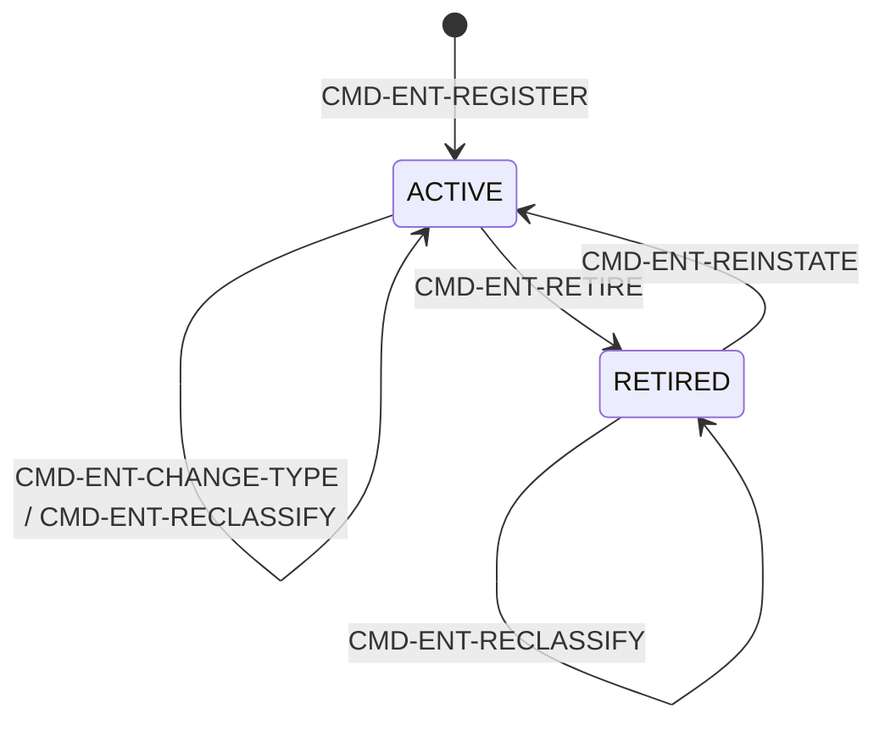
```mermaid
stateDiagram-v2
    [*] --> ACTIVE: CMD-ENT-REGISTER
    ACTIVE --> ACTIVE: CMD-ENT-CHANGE-TYPE / CMD-ENT-RECLASSIFY
    ACTIVE --> RETIRED: CMD-ENT-RETIRE
    RETIRED --> ACTIVE: CMD-ENT-REINSTATE
    RETIRED --> RETIRED: CMD-ENT-RECLASSIFY
```

### 6.2 AGG-RELATIONSHIP (SLC-02) — رابط موجّه
**Invariants (2):** INV-REL-01..02 — صحة الرابط تعتمد على ادعاء وجود منفصل؛ قد يُصنَّف فوق طرفيه فيختفي بلا تصريح.
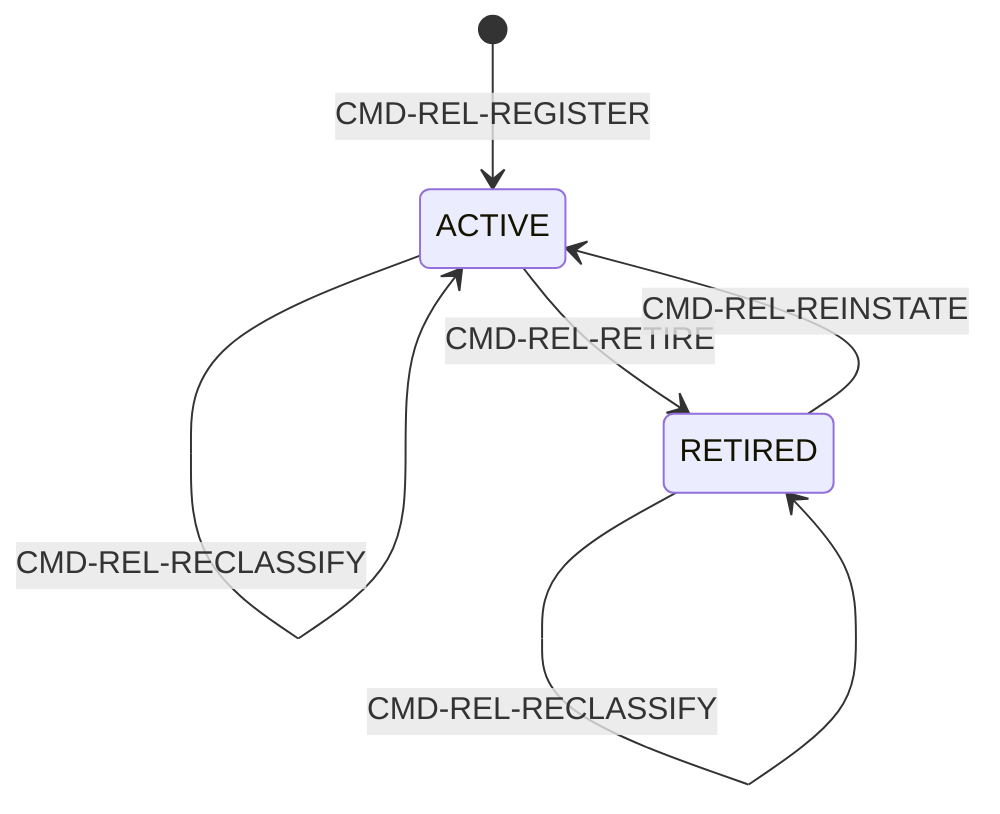
```mermaid
stateDiagram-v2
    [*] --> ACTIVE: CMD-REL-REGISTER
    ACTIVE --> ACTIVE: CMD-REL-RECLASSIFY
    ACTIVE --> RETIRED: CMD-REL-RETIRE
    RETIRED --> ACTIVE: CMD-REL-REINSTATE
    RETIRED --> RETIRED: CMD-REL-RECLASSIFY
```

### 6.3 AGG-REALWORLD-EVENT (SLC-02) — حدث واقعي (ليس Domain Event)
**Invariants (2):** INV-RWE-01..02 — المشاركون علاقات لا قوائم مضمّنة.
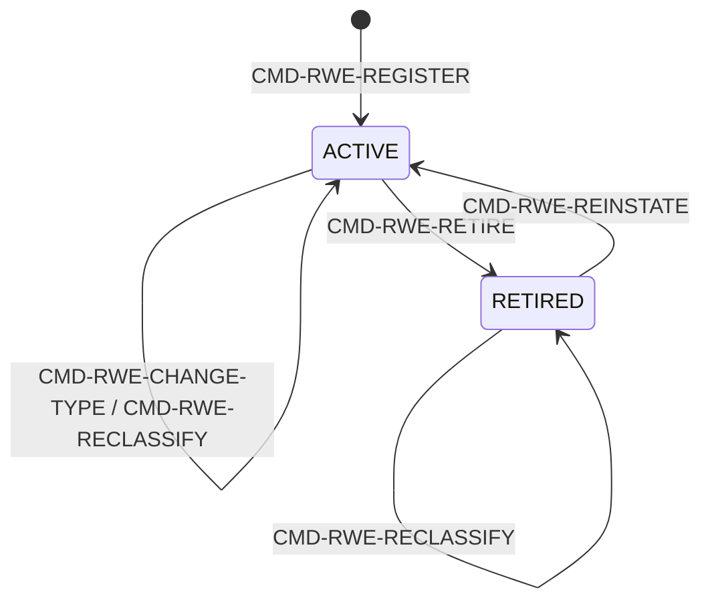
```mermaid
stateDiagram-v2
    [*] --> ACTIVE: CMD-RWE-REGISTER
    ACTIVE --> ACTIVE: CMD-RWE-CHANGE-TYPE / CMD-RWE-RECLASSIFY
    ACTIVE --> RETIRED: CMD-RWE-RETIRE
    RETIRED --> ACTIVE: CMD-RWE-REINSTATE
    RETIRED --> RETIRED: CMD-RWE-RECLASSIFY
```

### 6.4 AGG-CLAIM (SLC-02) — (موضوع، سمة، قيمة) ثنائية التأريخ
**Invariants (5):** INV-CLM-01..05 — القيمة لا تتغير أبدًا؛ ≥1 مصدر ACTIVE؛ CORRECT/RECORD-CHANGE يغلقان السجل الحالي وينشئان بديلاً في نفس المعاملة.
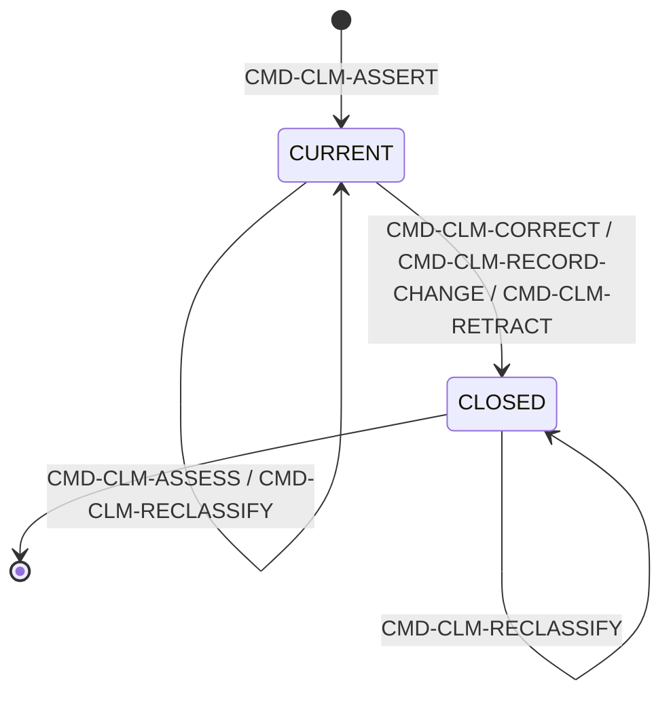
```mermaid
stateDiagram-v2
    [*] --> CURRENT: CMD-CLM-ASSERT
    CURRENT --> CURRENT: CMD-CLM-ASSESS / CMD-CLM-RECLASSIFY
    CURRENT --> CLOSED: CMD-CLM-CORRECT / CMD-CLM-RECORD-CHANGE / CMD-CLM-RETRACT
    CLOSED --> CLOSED: CMD-CLM-RECLASSIFY
    CLOSED --> [*]
```

### 6.5 AGG-SOURCE (SLC-02) — جهة/مستشعر منتج معلومات
**Invariants (4):** INV-SRC-01..04 — الموثوقية ادعاء ثنائي التأريخ؛ تخفيض الحماية يتطلب ضابط أمن ثانٍ (SoD).
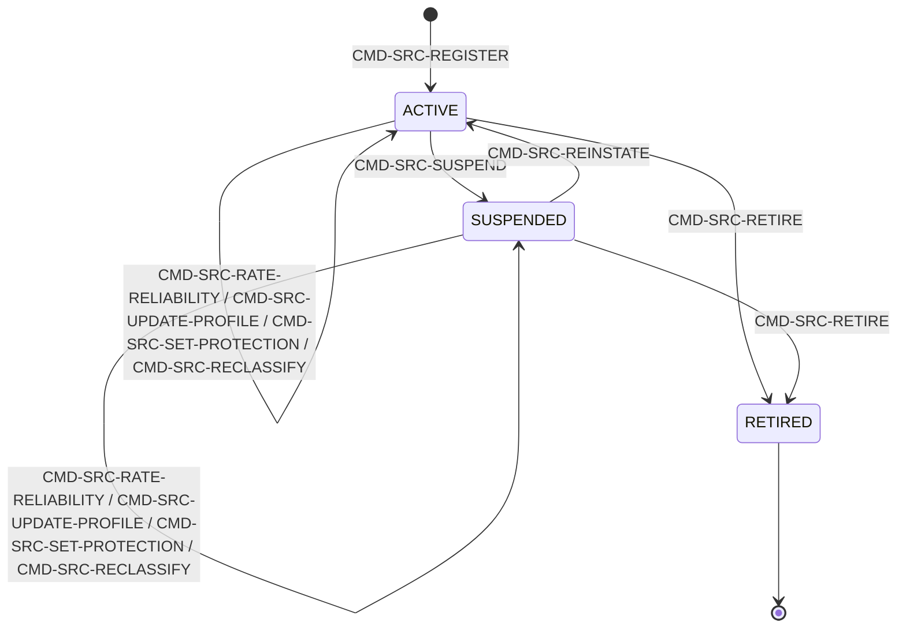
```mermaid
stateDiagram-v2
    [*] --> ACTIVE: CMD-SRC-REGISTER
    ACTIVE --> ACTIVE: CMD-SRC-RATE-RELIABILITY / CMD-SRC-UPDATE-PROFILE / CMD-SRC-SET-PROTECTION / CMD-SRC-RECLASSIFY
    SUSPENDED --> SUSPENDED: CMD-SRC-RATE-RELIABILITY / CMD-SRC-UPDATE-PROFILE / CMD-SRC-SET-PROTECTION / CMD-SRC-RECLASSIFY
    ACTIVE --> SUSPENDED: CMD-SRC-SUSPEND
    SUSPENDED --> ACTIVE: CMD-SRC-REINSTATE
    ACTIVE --> RETIRED: CMD-SRC-RETIRE
    SUSPENDED --> RETIRED: CMD-SRC-RETIRE
    RETIRED --> [*]
```

### 6.6 AGG-OBSERVATION (SLC-02) — ما رصده مصدر في زمن/مكان
**Invariants (4):** INV-OBS-01..04 — غير قابل للتعديل بعد الاعتماد؛ كل ادعاء مشتق يشير لمصدره.
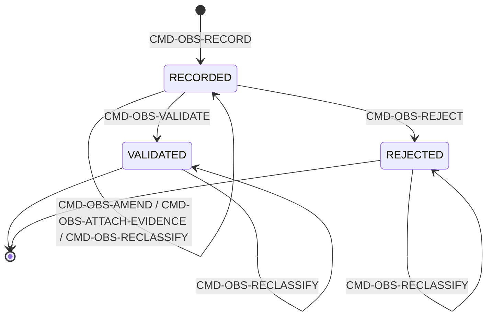
```mermaid
stateDiagram-v2
    [*] --> RECORDED: CMD-OBS-RECORD
    RECORDED --> RECORDED: CMD-OBS-AMEND / CMD-OBS-ATTACH-EVIDENCE / CMD-OBS-RECLASSIFY
    RECORDED --> VALIDATED: CMD-OBS-VALIDATE
    RECORDED --> REJECTED: CMD-OBS-REJECT
    VALIDATED --> VALIDATED: CMD-OBS-RECLASSIFY
    REJECTED --> REJECTED: CMD-OBS-RECLASSIFY
    VALIDATED --> [*]
    REJECTED --> [*]
```
**SoD:** `CMD-OBS-VALIDATE` يتطلب Analyst ≠ الراصد (أو تحقق آلي لمستشعرات A/B حسب سياسة المستأجر).

### 6.7 AGG-EVIDENCE (SLC-02) — مادة تدعم/تنفي ادعاءً
**Invariants (3):** INV-EVD-01..03 — لا تُحذف أبدًا؛ سلسلة حيازة بلا ثغرات.
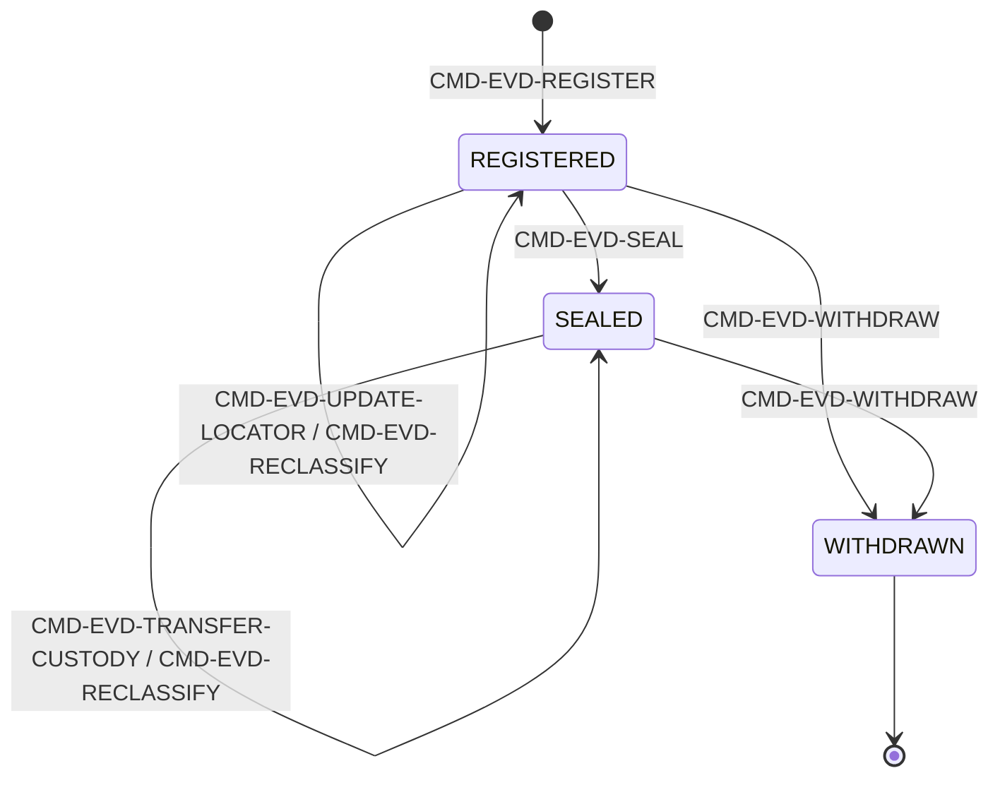
```mermaid
stateDiagram-v2
    [*] --> REGISTERED: CMD-EVD-REGISTER
    REGISTERED --> REGISTERED: CMD-EVD-UPDATE-LOCATOR / CMD-EVD-RECLASSIFY
    REGISTERED --> SEALED: CMD-EVD-SEAL
    SEALED --> SEALED: CMD-EVD-TRANSFER-CUSTODY / CMD-EVD-RECLASSIFY
    REGISTERED --> WITHDRAWN: CMD-EVD-WITHDRAW
    SEALED --> WITHDRAWN: CMD-EVD-WITHDRAW
    WITHDRAWN --> [*]
```
**أثر عند السحب:** `EVT-EVD-WITHDRAWN` يُطلق Verification re-evaluator ليعيد حساب `verification_status` لكل الادعاءات المرتبطة عبر روابط SUPPORTS المتبقية (نظام، لا بشري).

### 6.8 AGG-EVIDENCE-LINK (SLC-02) — ربط دليل↔ادعاء
**Invariants (2):** INV-EVL-01..02 — التصنيف = max(الدليل، الادعاء).
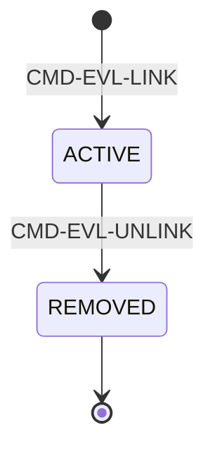
```mermaid
stateDiagram-v2
    [*] --> ACTIVE: CMD-EVL-LINK
    ACTIVE --> REMOVED: CMD-EVL-UNLINK
    REMOVED --> [*]
```

### 6.9 AGG-ATTACHMENT (SLC-02) — ملف في Object Storage
**Invariants (4):** INV-ATT-01..04 — البايتات لا تمر بخادم التطبيق أبدًا.
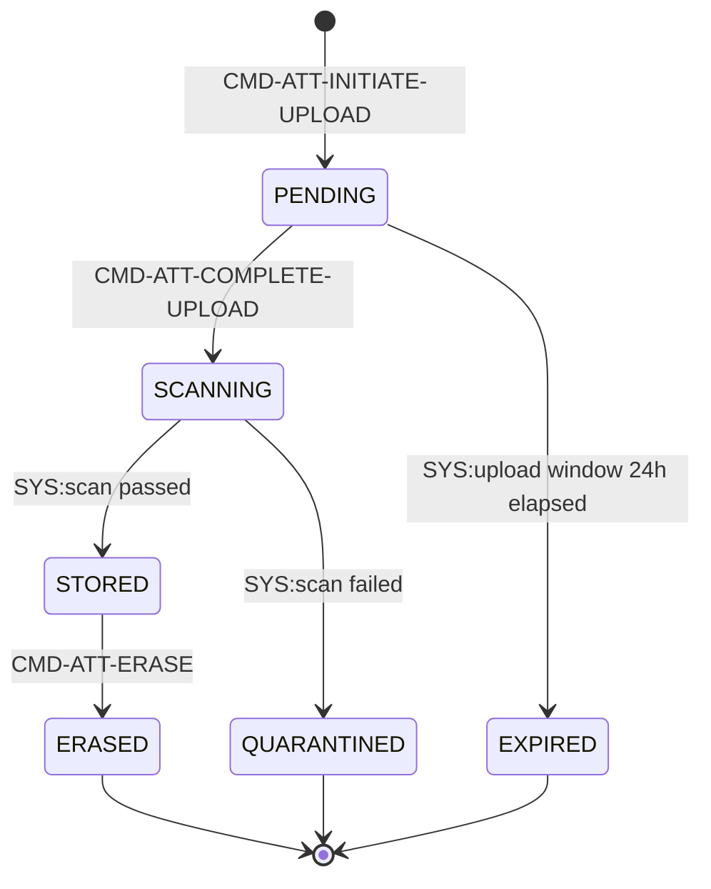
```mermaid
stateDiagram-v2
    [*] --> PENDING: CMD-ATT-INITIATE-UPLOAD
    PENDING --> SCANNING: CMD-ATT-COMPLETE-UPLOAD
    SCANNING --> STORED: SYS:scan passed
    SCANNING --> QUARANTINED: SYS:scan failed
    PENDING --> EXPIRED: SYS:upload window 24h elapsed
    STORED --> ERASED: CMD-ATT-ERASE
    ERASED --> [*]
    QUARANTINED --> [*]
    EXPIRED --> [*]
```
**Dependency صريحة:** `CMD-ATT-ERASE` guard = `erasure_order_ref` + لا legal hold نشط **(BC08 query)** → Depends On BC08، نفس نمط AGG-TENANT/AGG-PERSON في BC01.

### 6.10 AGG-IMPORT-BATCH (SLC-02) — دفعة استيراد من محول
**Invariants (4):** INV-IMP-01..04 — إعادة الإرسال لا تُكرِّر أبدًا (idempotency عبر batch_key).
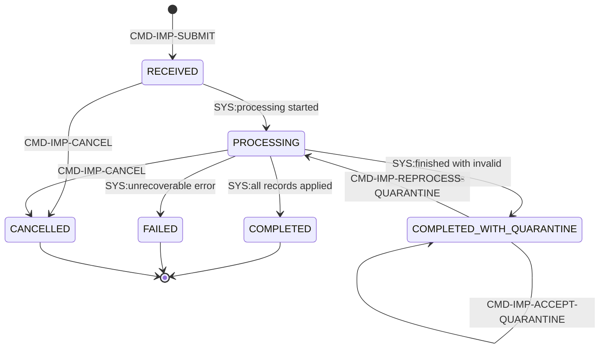
```mermaid
stateDiagram-v2
    [*] --> RECEIVED: CMD-IMP-SUBMIT
    RECEIVED --> PROCESSING: SYS:processing started
    PROCESSING --> COMPLETED: SYS:all records applied
    PROCESSING --> COMPLETED_WITH_QUARANTINE: SYS:finished with invalid records
    PROCESSING --> FAILED: SYS:unrecoverable error
    COMPLETED_WITH_QUARANTINE --> PROCESSING: CMD-IMP-REPROCESS-QUARANTINE
    COMPLETED_WITH_QUARANTINE --> COMPLETED_WITH_QUARANTINE: CMD-IMP-ACCEPT-QUARANTINE
    RECEIVED --> CANCELLED: CMD-IMP-CANCEL
    PROCESSING --> CANCELLED: CMD-IMP-CANCEL
    COMPLETED --> [*]
    FAILED --> [*]
    CANCELLED --> [*]
```

### 6.11 AGG-EXTERNAL-ID (SLC-02) — ربط معرّف نظام خارجي بكائن داخلي
**Invariants (2):** INV-EXT-01..02 — لا حذف أبدًا؛ (نظام، معرّف) فريد عند t.
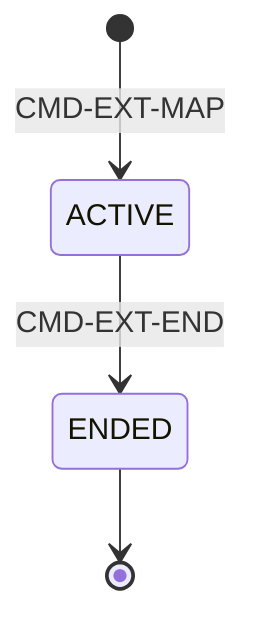
```mermaid
stateDiagram-v2
    [*] --> ACTIVE: CMD-EXT-MAP
    ACTIVE --> ENDED: CMD-EXT-END
    ENDED --> [*]
```

### 6.12 AGG-ER-CASE (SLC-04) — حالة مطابقة بين كيانين (أعقد state machine في BC02)
**Invariants (6):** INV-ER-01 (لا نقل/إعادة كتابة للادعاءات عند الدمج/الانقسام)، INV-ER-02 (المجمّع = مكوّن متصل من روابط MATCH الحالية)، INV-ER-03 (لا مجمّع يحوي طرفَي NOT_A_MATCH)، **INV-ER-04 (لا دمج آلي أبدًا — قرار بشري إلزامي)**، INV-ER-05 (مجمّع >50 يتطلب مراجعًا ثانيًا)، INV-ER-06 (القرار يسجّل decision_basis_level = أعلى تصنيف رآه المراجع).
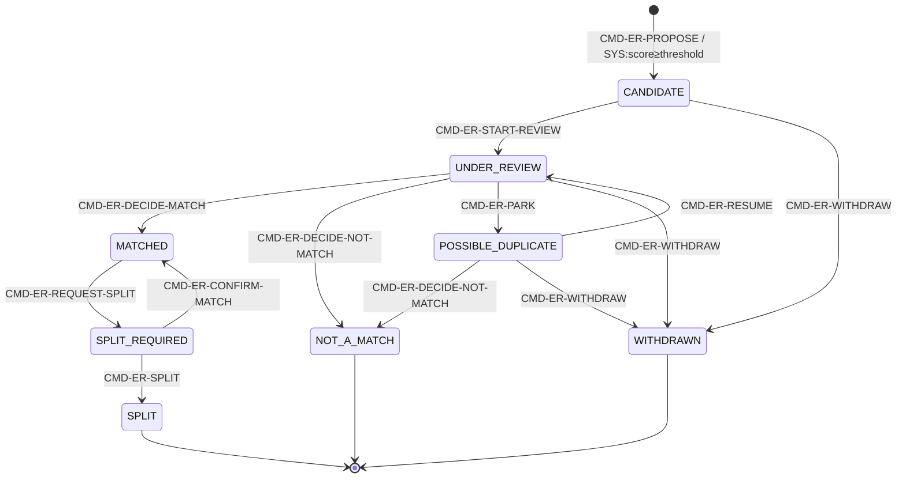
```mermaid
stateDiagram-v2
    [*] --> CANDIDATE: CMD-ER-PROPOSE / SYS:score≥threshold
    CANDIDATE --> UNDER_REVIEW: CMD-ER-START-REVIEW
    UNDER_REVIEW --> MATCHED: CMD-ER-DECIDE-MATCH
    UNDER_REVIEW --> NOT_A_MATCH: CMD-ER-DECIDE-NOT-MATCH
    UNDER_REVIEW --> POSSIBLE_DUPLICATE: CMD-ER-PARK
    POSSIBLE_DUPLICATE --> UNDER_REVIEW: CMD-ER-RESUME
    POSSIBLE_DUPLICATE --> NOT_A_MATCH: CMD-ER-DECIDE-NOT-MATCH
    MATCHED --> SPLIT_REQUIRED: CMD-ER-REQUEST-SPLIT
    SPLIT_REQUIRED --> MATCHED: CMD-ER-CONFIRM-MATCH
    SPLIT_REQUIRED --> SPLIT: CMD-ER-SPLIT
    CANDIDATE --> WITHDRAWN: CMD-ER-WITHDRAW
    UNDER_REVIEW --> WITHDRAWN: CMD-ER-WITHDRAW
    POSSIBLE_DUPLICATE --> WITHDRAWN: CMD-ER-WITHDRAW
    NOT_A_MATCH --> [*]
    SPLIT --> [*]
    WITHDRAWN --> [*]
```
**SoD مزدوجة:** `CMD-ER-DECIDE-MATCH` (مراجع ≠ مقترح بشري + مراجع ثانٍ للمجمعات >50)، `CMD-ER-CONFIRM-MATCH`/`CMD-ER-SPLIT` (مراجع ≠ طالب الانقسام).

### 6.13 AGG-MATCH-RULESET (SLC-04) — قواعد توليد مرشحي المطابقة
**Invariants (3):** INV-MRS-01..03 — تفعيل يتطلب تقييمًا على مجموعة اختبار عربي/إنجليزي (QAS-ER-001: استدعاء ≥95%).
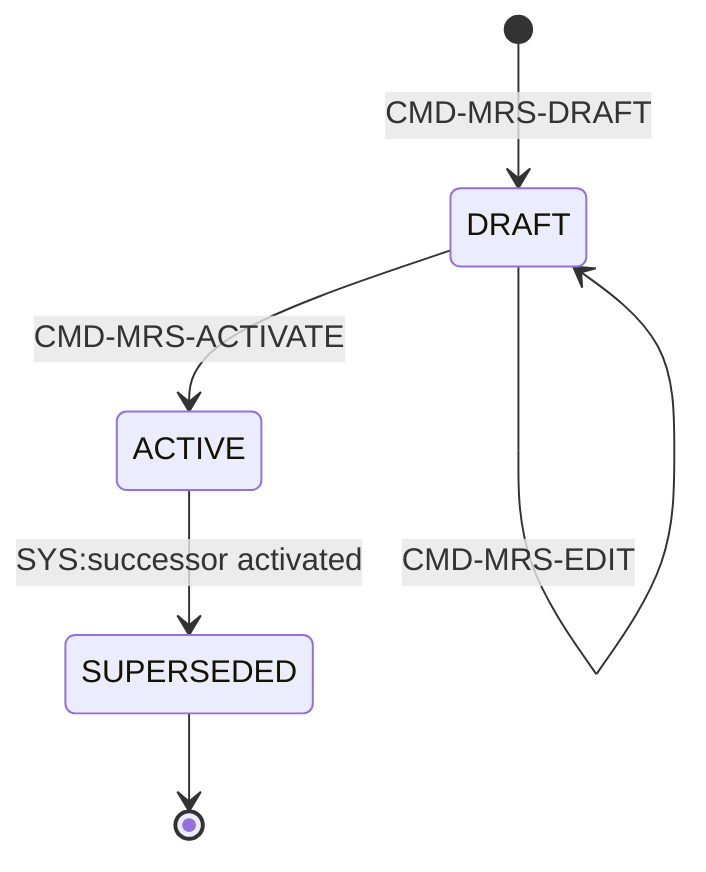
```mermaid
stateDiagram-v2
    [*] --> DRAFT: CMD-MRS-DRAFT
    DRAFT --> DRAFT: CMD-MRS-EDIT
    DRAFT --> ACTIVE: CMD-MRS-ACTIVATE
    ACTIVE --> SUPERSEDED: SYS:successor activated
    SUPERSEDED --> [*]
```
**SoD:** `CMD-MRS-ACTIVATE` يتطلب Administrator ≠ المؤلِّف (Analyst lead).

### 6.14 AGG-CONFLICT (SLC-04) — تعارض بين ادعاءين متداخلين
**Invariants (5):** INV-CNF-01 (**لا يعدّل أو يغلق أي ادعاء أبدًا** — سجل قرار منفصل فقط)، INV-CNF-02..05 (عضوية/رؤية/إعادة فتح).
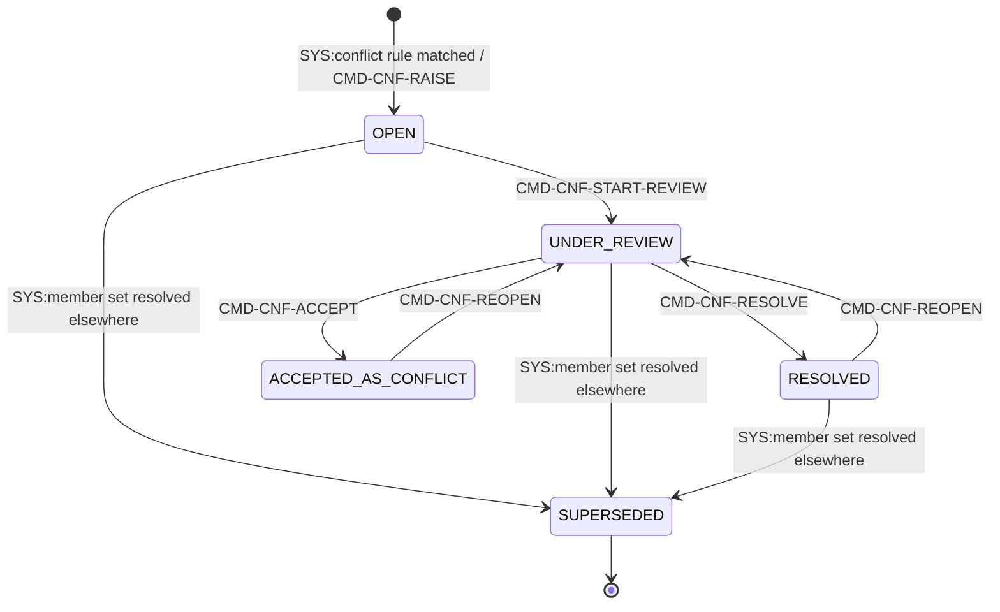
```mermaid
stateDiagram-v2
    [*] --> OPEN: SYS:conflict rule matched / CMD-CNF-RAISE
    OPEN --> UNDER_REVIEW: CMD-CNF-START-REVIEW
    UNDER_REVIEW --> RESOLVED: CMD-CNF-RESOLVE
    UNDER_REVIEW --> ACCEPTED_AS_CONFLICT: CMD-CNF-ACCEPT
    RESOLVED --> UNDER_REVIEW: CMD-CNF-REOPEN
    ACCEPTED_AS_CONFLICT --> UNDER_REVIEW: CMD-CNF-REOPEN
    OPEN --> SUPERSEDED: SYS:member set resolved elsewhere
    UNDER_REVIEW --> SUPERSEDED: SYS:member set resolved elsewhere
    RESOLVED --> SUPERSEDED: SYS:member set resolved elsewhere
    SUPERSEDED --> [*]
```
**SoD:** `CMD-CNF-RESOLVE` يتطلب مراجعًا ≠ مدَّعي الادعاء المفضَّل.

### 6.15 AGG-COLLECTION-REQUIREMENT (SLC-14) — حاجة معلوماتية
**Invariants (4):** INV-CRQ-01..04 — لا اعتماد دون منطقة/نافذة/أولوية/EEI واحد على الأقل (REQ-COL-001).
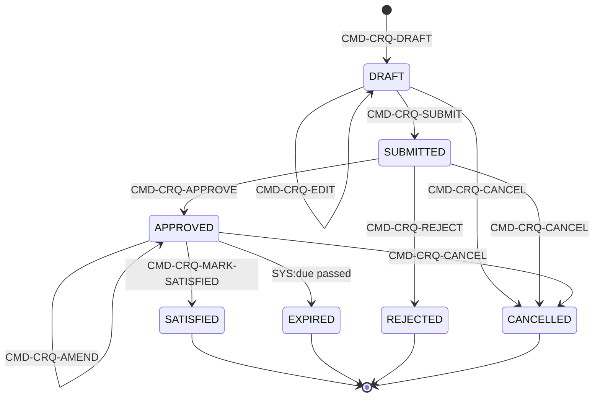
```mermaid
stateDiagram-v2
    [*] --> DRAFT: CMD-CRQ-DRAFT
    DRAFT --> DRAFT: CMD-CRQ-EDIT
    DRAFT --> SUBMITTED: CMD-CRQ-SUBMIT
    SUBMITTED --> APPROVED: CMD-CRQ-APPROVE
    SUBMITTED --> REJECTED: CMD-CRQ-REJECT
    APPROVED --> APPROVED: CMD-CRQ-AMEND
    APPROVED --> SATISFIED: CMD-CRQ-MARK-SATISFIED
    APPROVED --> EXPIRED: SYS:due passed
    DRAFT --> CANCELLED: CMD-CRQ-CANCEL
    SUBMITTED --> CANCELLED: CMD-CRQ-CANCEL
    APPROVED --> CANCELLED: CMD-CRQ-CANCEL
    SATISFIED --> [*]
    EXPIRED --> [*]
    REJECTED --> [*]
    CANCELLED --> [*]
```
**SoD:** `CMD-CRQ-APPROVE` يتطلب مدير جمع (collection manager) ≠ الطالب.

### 6.16 AGG-COLLECTION-PLAN (SLC-14) — خطة جمع تولّد مهامًا ميدانية
**Invariants (2):** INV-CPL-01..02 — التفعيل ينشئ مهمة ميدانية واحدة لكل نشاط عبر SLC-03 (CR-59).
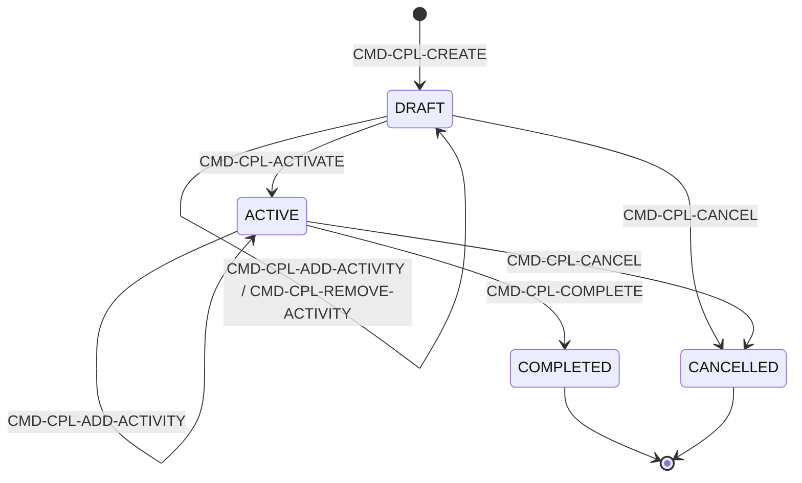
```mermaid
stateDiagram-v2
    [*] --> DRAFT: CMD-CPL-CREATE
    DRAFT --> DRAFT: CMD-CPL-ADD-ACTIVITY / CMD-CPL-REMOVE-ACTIVITY
    DRAFT --> ACTIVE: CMD-CPL-ACTIVATE
    ACTIVE --> ACTIVE: CMD-CPL-ADD-ACTIVITY
    ACTIVE --> COMPLETED: CMD-CPL-COMPLETE
    DRAFT --> CANCELLED: CMD-CPL-CANCEL
    ACTIVE --> CANCELLED: CMD-CPL-CANCEL
    COMPLETED --> [*]
    CANCELLED --> [*]
```

### 6.17 AGG-CORRELATION-RULE (SLC-15) — قاعدة ربط زماني-مكاني
**Invariants (2):** INV-CRR-01..02 — تفعيل يتطلب تقييمًا على مجموعة موسومة (دقة ≥70%).
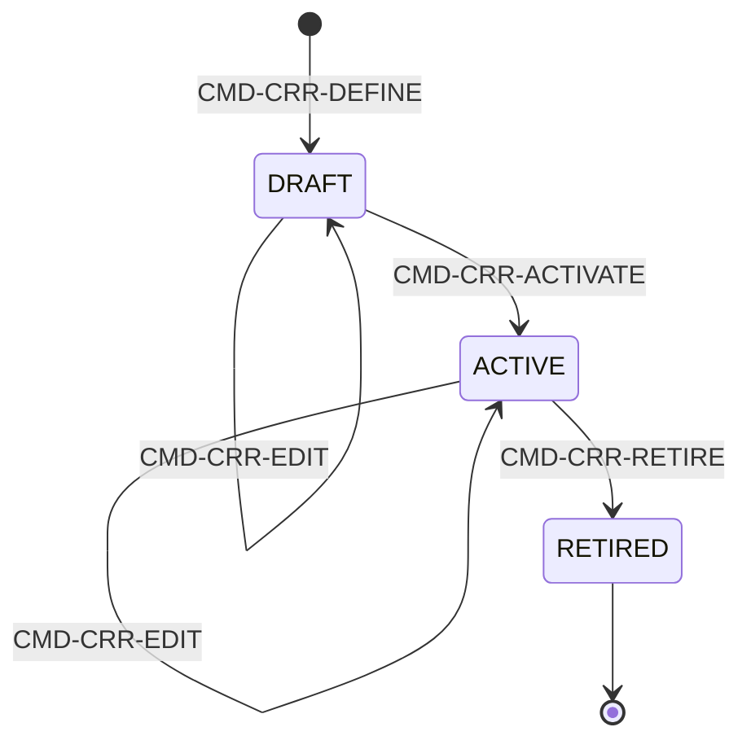
```mermaid
stateDiagram-v2
    [*] --> DRAFT: CMD-CRR-DEFINE
    DRAFT --> DRAFT: CMD-CRR-EDIT
    ACTIVE --> ACTIVE: CMD-CRR-EDIT
    DRAFT --> ACTIVE: CMD-CRR-ACTIVATE
    ACTIVE --> RETIRED: CMD-CRR-RETIRE
    RETIRED --> [*]
```
**SoD:** `CMD-CRR-ACTIVATE` يتطلب موافقًا ≠ المؤلِّف.

### 6.18 AGG-CORRELATION-PROPOSAL (SLC-15) — اقتراح ربط بين مصادر متعددة
**Invariants (4):** INV-CRP-01..04 — **لا قبول آلي أبدًا** (INV-CRP-03، تماثل INV-ER-04)؛ القبول يُنفَّذ عبر أوامر المالك (Real-World Event + علاقات + ادعاءات مدمَجة، أو حالة ER جديدة).
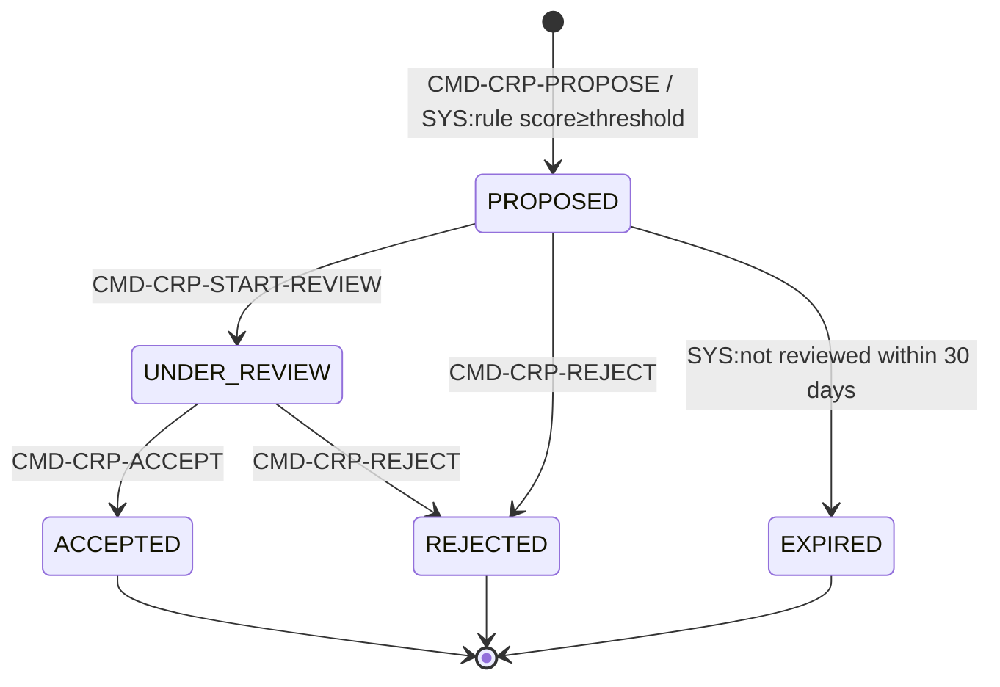
```mermaid
stateDiagram-v2
    [*] --> PROPOSED: CMD-CRP-PROPOSE / SYS:rule score≥threshold
    PROPOSED --> UNDER_REVIEW: CMD-CRP-START-REVIEW
    UNDER_REVIEW --> ACCEPTED: CMD-CRP-ACCEPT
    UNDER_REVIEW --> REJECTED: CMD-CRP-REJECT
    PROPOSED --> REJECTED: CMD-CRP-REJECT
    PROPOSED --> EXPIRED: SYS:not reviewed within 30 days
    ACCEPTED --> [*]
    REJECTED --> [*]
    EXPIRED --> [*]
```

## 7. Commands (92 إجمالًا عبر 18 Aggregate، في 4 ملفات commands-slcNN.md)

| Aggregate | عدد الأوامر | القائمة |
|---|---|---|
| AGG-SOURCE (SLC-02) | 8 | REGISTER, RATE-RELIABILITY, UPDATE-PROFILE, SET-PROTECTION, RECLASSIFY, SUSPEND, REINSTATE, RETIRE |
| AGG-OBSERVATION (SLC-02) | 6 | RECORD, AMEND, ATTACH-EVIDENCE, RECLASSIFY, VALIDATE, REJECT |
| AGG-ENTITY (SLC-02) | 5 | REGISTER, CHANGE-TYPE, RECLASSIFY, RETIRE, REINSTATE |
| AGG-REALWORLD-EVENT (SLC-02) | 5 | REGISTER, CHANGE-TYPE, RECLASSIFY, RETIRE, REINSTATE |
| AGG-RELATIONSHIP (SLC-02) | 4 | REGISTER, RECLASSIFY, RETIRE, REINSTATE |
| AGG-CLAIM (SLC-02) | 6 | ASSERT, CORRECT, RECORD-CHANGE, RETRACT, ASSESS, RECLASSIFY |
| AGG-EVIDENCE (SLC-02) | 6 | REGISTER, UPDATE-LOCATOR, SEAL, TRANSFER-CUSTODY, RECLASSIFY, WITHDRAW |
| AGG-EVIDENCE-LINK (SLC-02) | 2 | LINK, UNLINK |
| AGG-ATTACHMENT (SLC-02) | 3 | INITIATE-UPLOAD, COMPLETE-UPLOAD, ERASE |
| AGG-IMPORT-BATCH (SLC-02) | 4 | SUBMIT, REPROCESS-QUARANTINE, ACCEPT-QUARANTINE, CANCEL |
| AGG-EXTERNAL-ID (SLC-02) | 2 | MAP, END |
| AGG-CONFLICT (SLC-04) | 6 | RAISE, ASSIGN, START-REVIEW, RESOLVE, ACCEPT, REOPEN |
| AGG-ER-CASE (SLC-04) | 10 | PROPOSE, START-REVIEW, DECIDE-MATCH, DECIDE-NOT-MATCH, PARK, RESUME, REQUEST-SPLIT, CONFIRM-MATCH, SPLIT, WITHDRAW |
| AGG-MATCH-RULESET (SLC-04) | 3 | DRAFT, EDIT, ACTIVATE |
| AGG-COLLECTION-REQUIREMENT (SLC-14) | 8 | DRAFT, EDIT, SUBMIT, APPROVE, REJECT, AMEND, MARK-SATISFIED, CANCEL |
| AGG-COLLECTION-PLAN (SLC-14) | 6 | CREATE, ADD-ACTIVITY, REMOVE-ACTIVITY, ACTIVATE, COMPLETE, CANCEL |
| AGG-CORRELATION-PROPOSAL (SLC-15) | 4 | PROPOSE, START-REVIEW, ACCEPT, REJECT |
| AGG-CORRELATION-RULE (SLC-15) | 4 | DEFINE, EDIT, ACTIVATE, RETIRE |
| **إجمالي** | **92** | 51 (SLC-02) + 19 (SLC-04) + 14 (SLC-14) + 8 (SLC-15) |

**مشترك لكل الـ92 أمرًا:** `Idempotency-Key` إلزامي؛ `If-Match` إلزامي لغير الإنشاء؛ `X-Purpose` و`X-Correlation-Id` إلزاميان؛ استجابة `202`/`201` بـ`ResourceRef {urn, id, version, state}`. [Explicit]

**نمط RECLASSIFY (تفصيل):** 7 أوامر بالضبط (`CMD-{SRC,OBS,ENT,RWE,REL,CLM,EVD}-RECLASSIFY`) تحمل حرفيًا نفس الحارس: *authority per tenant policy (REQ-GOV-004); new version; bumps object security_version* — انظر §2 للأثر على CONFLICT-01.

## 8. Queries (27 إجمالًا)

| Query | يعيد | من يحق له |
|---|---|---|
| QRY-ENT-RESOLVED | العرض المُحلَّل لكل سمة عند valid_at/known_at، عبر مجمّع الهوية | أي مستخدم؛ label-filtered |
| QRY-ENT-CLAIMS | تاريخ الادعاءات لكيان | أي مستخدم؛ label-filtered |
| QRY-ENT-LIST | كيانات حسب النوع/bbox/valid_at | allowed_scope |
| QRY-ENT-POSITIONS | تاريخ الموقع | label-filtered + تعميم هندسي حسب الالتزام |
| QRY-RWE-GET | حدث واقعي محلول | label-filtered |
| QRY-REL-LIST | علاقات كيان (الاتجاهين) | العلاقات/الأطراف المخفية تُحذَف |
| QRY-CLM-GET | ادعاء مع مصادره وسلسلة الاستبدال | label-filtered |
| QRY-OBS-LIST | ملاحظات حسب bbox/نافذة زمنية (≤31 يومًا) | allowed_scope |
| QRY-OBS-GET | ملاحظة مع القياسات والمرفقات | label-filtered |
| QRY-SRC-GET | مصدر؛ الهوية فقط بصلاحية حماية المصدر | Analyst فأعلى |
| QRY-EVD-GET | بيانات الدليل وسلسلة الحيازة | label-filtered |
| QRY-ATT-DOWNLOAD | رابط تنزيل موقَّع قصير الأجل (≤5 دقائق)، مُدقَّق | مخوَّل على الدليل/الملاحظة المالكة |
| QRY-LIN-TRACE | نسب صاعد/هابط، عمق ≤10 | تخويل لكل عقدة |
| QRY-EXT-RESOLVE | URN الكائن عند زمن t | adapter service accounts، Analyst |
| QRY-IMP-GET | حالة الدفعة والعدّادات وسجلات الحجر | مالك المحول، Administrator |
| QRY-CNF-LIST | تعارضات حسب الموضوع/الحالة/المُسنَد إليه | Analyst؛ تعارضات بعضوين مرئيين فقط |
| QRY-CNF-GET | تعارض مع الأعضاء المرئيين وسجل الحل | Analyst؛ INV-CNF-04 |
| QRY-ER-QUEUE | طابور المراجعة حسب الحالة/النوع/النقاط | Analyst؛ كلا الكيانين مرئيان |
| QRY-ER-GET | حالة ER بمقارنة سمات جنبًا إلى جنب | Analyst؛ كلا الكيانين مرئيان |
| QRY-CLUSTER-GET | أعضاء المجمّع، canonical URN، الروابط | الأعضاء غير المرئيين محذوفون |
| QRY-MRS-GET | قاعدة المطابقة مع تقرير التقييم | Analyst lead، Administrator |
| QRY-CRQ-GET | متطلب مع EEIs ووفاء محسوب على المرئي فقط | الطالب، مديرو الجمع |
| QRY-CRQ-BOARD | متطلبات حسب المنطقة/الحالة/الأولوية | allowed_scope |
| QRY-CPL-GET | خطة مع الأنشطة والمهام المرتبطة | نطاق المخطِّط |
| QRY-CRQ-EVIDENCE | روابط الوفاء لكل EEI (ملاحظات مرئية فقط) مع النسب | الطالب، مديرو الجمع |
| QRY-CRP-QUEUE | اقتراحات حسب النوع/الحالة/المنطقة/النقاط | Analyst |
| QRY-CRP-GET | اقتراح مع المدخلات والمصادر وتفكيك النقاط | مراجع مخوَّل لكل المدخلات |

**نمط ثابت [Explicit]:** كل استعلام يطلب قرار PDP بـ`action=view` قبل الاسترجاع (SL-09/ADR-P06)، ويطبَّق `allowed_scope`؛ القوائم بمؤشر (cursor). التوزيع: 15 (SLC-02) + 6 (SLC-04) + 4 (SLC-14) + 2 (SLC-15) = 27.

## 9. Events (106 إجمالًا)

| الشريحة | العدد | التوزيع حسب Aggregate |
|---|---|---|
| SLC-02 | 58 | SRC(8), OBS(6), ENT(5), RWE(5), REL(4), CLM(6), EVD(6), EVL(2), ATT(6), IMP(8), EXT(2) |
| SLC-04 | 23 | CNF(9), ER(10), MRS(4) |
| SLC-14 | 16 | CRQ(10), CPL(6) |
| SLC-15 | 9 | CRP(5), CRR(4) |
| **إجمالي** | **106** | |

**نمط ثابت مؤكَّد [Explicit، يطابق BC01 حرفيًا]:** 9 أحداث "تؤثر أمنيًا" فقط (`نعم` في عمود التأثير الأمني) — بالضبط أحداث RECLASSIFY السبعة (SRC/OBS/ENT/RWE/REL/CLM/EVD) + `EVT-SRC-PROTECTION-CHANGED` + `EVT-ATT-ERASED` — وكلها بلا استثناء تُستهلَك من نفس 3 مستهلكين: **Security-version service** (يُطلق EVT-SEC-VERSION-INCREMENTED)، **PEP decision caches**، **Projection security-version table** — إضافة لمستهلكين خاصين بالسياق (Search/Graph projections، Conflict detector، Situation membership SLC-06، إلخ). هذا هو نفس نمط BC01 §9 حرفيًا، مما يؤكد أن آلية "بصمة الأمن" (security_version) موحَّدة عبر المنصة بأكملها لا خاصة بـBC01.

## 10. Business Rules / Invariants — أثرها (61 Invariant عبر 18 Aggregate)

| المجموعة | العدد | نمط مشترك |
|---|---|---|
| INV-ENT-* | 3 | لا قيم سمات على الكيان نفسه + EXEMPT SL-06 |
| INV-REL-* | 2 | وجود مشروط بادعاء + تصنيف أعلى من الطرفين ممكن |
| INV-RWE-* | 2 | مشاركون كعلاقات لا قوائم مضمَّنة |
| INV-CLM-* | 5 | القيمة ثابتة أبدًا + ≥1 مصدر + إغلاق/استبدال بمعاملة واحدة |
| INV-SRC-* | 4 | موثوقية ثنائية التأريخ + SoD على تخفيض الحماية |
| INV-OBS-* | 4 | غير قابل للتعديل بعد الاعتماد + SoD على التحقق |
| INV-EVD-* | 3 | لا حذف أبدًا + سلسلة حيازة بلا ثغرات |
| INV-EVL-* | 2 | تصنيف = max(الدليل، الادعاء) |
| INV-ATT-* | 4 | البايتات لا تمر بخادم التطبيق |
| INV-IMP-* | 4 | لا تكرار أبدًا (idempotency) |
| INV-EXT-* | 2 | لا حذف + تفرّد زمني |
| INV-ER-* | 6 | **لا دمج آلي أبدًا** + SoD مزدوجة + حفظ الادعاءات |
| INV-MRS-* | 3 | تفعيل مشروط بتقييم موضوعي + SoD |
| INV-CNF-* | 5 | **لا تعديل/إغلاق ادعاء أبدًا** + سجل قرار منفصل |
| INV-CRQ-* | 4 | لا اعتماد دون منطقة/نافذة/أولوية/EEI + SoD |
| INV-CPL-* | 2 | تفعيل ينشئ مهامًا ميدانية فورًا |
| INV-CRR-* | 2 | تفعيل مشروط بدقة تجريبية + SoD |
| INV-CRP-* | 4 | **لا قبول آلي أبدًا** + تنفيذ عبر أوامر المالك |

**البنود المرتبطة مباشرة بـ business-rules.md [Explicit، مؤكَّدة]:**
- **BRL-001** (كل معلومة T1 قابلة للتتبع لمصدر/دليل) → INV-CLM-03 (≥1 مصدر) وINV-OBS-03 (كل ادعاء مشتق يشير لمصدره) وREQ-INF-037 (رفض بلا مصدر).
- **BRL-002** (ادعاء T1 لا يُكتب فوقه أبدًا) → INV-CNF-01 حرفيًا ("a conflict never modifies, closes or re-labels any claim") وREQ-INF-024.

**أنماط عابرة إضافية [Explicit]:**
1. **"لا حذف أبدًا"** يهيمن على: EVIDENCE، EXTERNAL-ID، IMPORT-BATCH (عبر idempotency) — يخدم BRQ-006 (Traceability).
2. **"القرار البشري إلزامي"**: AGG-ER-CASE (INV-ER-04) وAGG-CORRELATION-PROPOSAL (INV-CRP-03) — النظام يقترح، الإنسان يقرر دائمًا.
3. **Segregation of Duties:** 8 مواضع مستقلة عبر BC02 (تفصيلها الكامل في §11) — أعلى نسبيًا من BC01 (6 من 71 أمرًا).

## 11. Policies

**Platform Baselines إضافية خاصة بالمعلومات (PB-08..11، فوق PB-01..07 من BC01— تنطبق هنا مباشرة):**

| PB | القاعدة | قابلة للتجاوز؟ |
|---|---|---|
| PB-08 | سمات هوية المصدر تتطلب صلاحية `source.identity.view`؛ وإلا REDACT | لا |
| PB-09 | كتابة ادعاء/ملاحظة بتصنيف أعلى من تصريح الكاتب تُرفض | لا |
| PB-10 | المستأجر قد يحدد `generalize(min_accuracy_m)` لقراءات الموقع حسب المستوى/الدور/الغرض | المستأجر قد يضبط الدرجة |
| PB-11 | تتبّع النسب (lineage) يتوقف عند العقد غير المرئية | لا |

**Segregation of Duties (8 مواضع مؤكَّدة، مطابقة لعمود "السياسة" في جداول §7):**

| الأمر | ضابط SoD |
|---|---|
| `CMD-SRC-SET-PROTECTION` | تخفيض الحماية يتطلب ضابط أمن ثانٍ |
| `CMD-OBS-VALIDATE` | محلل ≠ راصد |
| `CMD-CNF-RESOLVE` | مراجع ≠ مدَّعي الادعاء المفضَّل |
| `CMD-ER-DECIDE-MATCH` | مراجع ≠ مقترح؛ + مراجع ثانٍ للمجمعات >50 |
| `CMD-ER-CONFIRM-MATCH` / `CMD-ER-SPLIT` | مراجع ≠ طالب الانقسام |
| `CMD-MRS-ACTIVATE` | معتمِد (Administrator) ≠ المؤلِّف (Analyst lead) |
| `CMD-CRR-ACTIVATE` | معتمِد (second approver) ≠ المؤلِّف |
| `CMD-CRQ-APPROVE` | معتمِد (collection manager) ≠ الطالب |

**العدد الإجمالي:** سياسات الأوامر تتبع نمط 1:1 مع الأوامر (92 أمرًا BC02 → عمود "السياسة" في كل جدول commands-slcNN.md يحمل POL-* مطابقًا حرفيًا لكل أمر). ملفات `policies-slc0{2,4,15}.md` تحمل رقمًا إجماليًا أعلى قليلًا من عدد أوامر BC02 وحدها في SLC-02 وSLC-15 تحديدًا؛ الفارق يعود لنفس نمط "الشريحة ≠ BC" (§2): `policies-slc02.md` يضم أيضًا سياسات `POL-ADP-*` (AGG-ADAPTER، **BC07**)، و`policies-slc15.md` يُرجَّح أن يضم سياسات AGG-COORDINATION-CASE (**BC04**) — **[Needs Review]** لم تُعَد قراءة `policies-slc15.md` سطرًا سطرًا هذه الجولة للتأكد من الرقم الدقيق المتبقي بعد الطرح، فقط تأكيد نمط مطابقة الأوامر 1:1 عبر `commands-slc15.md` (8 أوامر BC02 فعلية).

## 12. Security & Threats — مكتمل (21 تهديدًا مؤكَّدًا كملك BC02)

| THR | المكوّن | STRIDE | المخاطرة المتبقية |
|---|---|---|---|
| THR-S02-01 | بيانات خارجية مُدَّعاة كحقائق (Adapters) | Tampering | **M (مقبولة صراحة بالتصميم)** — الادعاء الخارجي ادعاء له موثوقية مصدر، ليس حقيقة آلية |
| THR-S02-02..03، 05..10 | (7 تهديدات إضافية SLC-02 — Source/Observation/Claim/Evidence/Import) | متنوّع (Tampering/Info Disclosure/Repudiation) | L إجمالًا |
| THR-S02-04 | ملفات يوم-صفري في الحجر (Attachment scanning) | Tampering | **M (مقبولة صراحة)** — مخفَّفة بعرض في بيئة sandboxed معزولة |
| THR-S04-01 | دمج كاذب متعمّد لإخفاء معلومة (ER-CASE) | Tampering | L — بفضل SoD المزدوجة + قابلية الانقسام |
| THR-S04-02..07 | (6 تهديدات إضافية SLC-04 — Conflict/Match-Ruleset) | متنوّع | L إجمالًا |
| THR-S14-01 | حالة الوفاء تكشف تصنيفًا أعلى (Collection Requirement) | Info Disclosure | L — مخفَّفة بـfulfilment مرئي حسب المُشاهِد |
| THR-S14-02 | (تهديد إضافي SLC-14 — Collection Plan) | — | L |
| THR-S15-03 | عدّ نفس المصدر مرتين لتزييف التعزيز المتبادل (Correlation) | Tampering | L |
| THR-S15-04 | (تهديد إضافي SLC-15 — Correlation Proposal، **BC02 فقط**) | — | L |

**مخاطرتان متبقيتان مقبولتان صراحة (accepted_residual_risks، M):** THR-S02-01 (بيانات خارجية مُدَّعاة) وTHR-S02-04 (ملفات يوم-صفري في الحجر).

**التوزيع الكامل حسب الشريحة:** SLC-02 (10 تهديدات) + SLC-04 (7) + SLC-14 (2) + SLC-15 (2، بعد استبعاد تهديدين يخصان BC04/Coordination من نفس ملف `threat-model-slc15.md` — انظر §2/§14) = **21 تهديدًا ملكًا لـBC02**.

**Segregation of Duties الأمنية (تكرار مرجعي من §11 لثباته):** 8 مواضع SoD مستقلة، أعلى بكثير من BC01 (6 من 71 أمرًا) — يعكس حساسية BC02 كطبقة "حقيقة" لا يمكن التلاعب بها بفرد واحد.

## 13. Data & APIs

- **النموذج المنطقي:** `06-data/logical-model/slc-02.md` (schema `information`، BC02؛ يشارك الملف نفسه schema `integration` لـBC07/AGG-ADAPTER — تأكيد إضافي لنمط الشريحة المشتركة). أهم الجداول: `claims` (partition by hash(subject)، `recorded_*` مكتوبة فقط بواسطة النواة)، `claims_current` (محدَّثة في نفس المعاملة، = claims حيث recorded_to فارغ)، `observations` (partition by tenant+month، فهرس مكاني)، `quarantine_records` (مستبعد من كل الاستعلامات/الإسقاطات)، `lineage_records` (append-only). `06-data/logical-model/slc-04.md` (schema `information`): `er_cases`، `same_as_links`، `identity_clusters` (صف واحد حالي لكل كيان)، `match_rulesets`، `blocking_index` (يُعاد بناؤه عند تفعيل قاعدة).
- **العقود:** `05-contracts/openapi-information-slc0{2,4}.md`، `openapi-integration-slc02.md`، `asyncapi-slc0{2,4,14,15}.md` (64 رسالة على قناتين لـSLC-02 وحدها)، `errors-slc0{2,4}.md` (كتالوج موحَّد؛ `AUTHZ_DENIED` يُعاد كـ`NOT_FOUND` (403→404) لموارد غير مرئية — نفس نمط ADR-P06 §5 في BC01).
- **السمة العابرة:** `CLASSIFICATION_CHANGE_NOT_AUTHORIZED` مرتبط بـ7 أوامر RECLASSIFY بالضبط في كتالوج الأخطاء — تأكيد مستقل إضافي لنمط §2/§7.

## 14. Integrations

- **BC03 (التحليل):** `analysis-run identity` و`verification re-evaluator system identity` هويات نظامية تُصدر `CMD-CLM-ASSERT`/`CMD-CLM-ASSESS` — تكامل وارد من BC03 نحو BC02.
- **BC04 (التنسيق/العمليات):** `AGG-COLLECTION-PLAN.activate` يُنشئ مهامًا ميدانية عبر SLC-03 (`plan_ref`)؛ كما أن `AGG-COORDINATION-CASE` (BC04) يعيش في نفس شريحة SLC-15 دون أن يكون جزءًا من BC02 (انظر §2) — علاقة جوار شريحي لا اعتماد بيانات مباشر.
- **BC07 (التكامل/المحوّلات):** `AGG-IMPORT-BATCH.submit` يعتمد على `AGG-ADAPTER` (BC07) أن يكون ACTIVE — اكتشاف "الشريحة ≠ BC" الأساسي لهذا الملف (§2).
- **BC08 (الحوكمة والأمن):** `AGG-ATTACHMENT.erase` يستعلم legal hold قبل التنفيذ؛ نمط RECLASSIFY (7 أوامر) يعتمد على "authority per tenant policy" التي يحكمها في النهاية BC08 (Classification Scheme) وBC01 (Clearance) معًا — تفصيل الحل الكامل في §19.
- **BC06 (الوعي الظرفي):** استهلاك غير مباشر عبر Situation membership (SLC-06) لأحداث OBS/CLM/ER/CNF — مستهلك لا مصدر بيانات.

## 15. Verification / Acceptance

ملفات Gherkin رسمية موجودة لكل الـ18 aggregate في `13-verification/acceptance/SLC-0{2,4,14,15}/*-state-machine.md` بالإضافة لملفات `invariants-slc0{2,4,14,15}.md` الجامعة للسيناريوهات عبر الـaggregates. تم تصفّح رؤوس الأربعة ملفات `invariants-slc*.md` وعيّنة من مشاهدها هذه الجولة (مثال مؤكَّد: سيناريو "Correction versus as-known-at" في SLC-02 يطابق INV-CLM حرفيًا؛ سيناريو "Incompatible claims open one conflict" في SLC-04 يطابق INV-CNF-01/BRL-002 حرفيًا). **لم تُقرأ كل الأسطر لكل ملفات الـ18 state-machine الفردية في هذه الجولة** — هذا نفس نمط BC01 §15 (Gherkin مؤكَّد لعينة، والباقي بحاجة جولة تحقق مخصَّصة) — **[Missing — يحتاج Phase 3 جولة تحقق تالية]**. ملاحظة إضافية: ملف `invariants-slc15.md` يحمل في `traces.verifies` مزيجًا من REQ-FUS-001/002 (BC02) وREQ-CRD-001/002 (BC04) — تأكيد مستقل ثالث لنمط "الشريحة ≠ BC" في §2/§14.

## 16. Dependencies (خارج BC02)

| من | العلاقة | إلى |
|---|---|---|
| AGG-COLLECTION-PLAN (activate) | `triggers` | BC04/BC03 (SLC-03، إنشاء مهمة ميدانية عبر plan_ref) |
| AGG-CORRELATION-PROPOSAL (accept, same_entity) | `triggers` | AGG-ER-CASE (نفس BC02، SLC-04) |
| كل CMD-*-RECLASSIFY (×7) | `depends_on` | REQ-GOV-004 — محكوم نهائيًا بثلاث آليات: BC02 (كائن)، BC01/AGG-CLEARANCE (مستخدم)، BC08/AGG-CLASSIFICATION-SCHEME (مخطط) |
| AGG-ATTACHMENT (erase) | `depends_on` | BC08 (legal hold) |
| AGG-IMPORT-BATCH (submit) | `depends_on` | **BC07** (AGG-ADAPTER ACTIVE) |
| AGG-CLAIM (assert/assess) | `consumed_by` | BC03 (analysis-run identity / verification re-evaluator) |
| AGG-COORDINATION-CASE (BC04) | `co-located_with` (لا `depends_on`) | نفس شريحة SLC-15، بلا تبعية بيانات مباشرة مؤكَّدة هذه الجولة |

## 17. Cross-BC Relationships (ملخص)

BC02 هو **"الركيزة المعلوماتية" (Core/Generic-ish Subdomain)** الذي يغذّي كل المستهلكين تقريبًا: BC03 (التحليل يستهلك Entities/Claims/Evidence كمدخل خام)، BC04 (التنسيق والتنفيذ الميداني يستهلك Collection Plans ويعيش بجوار Correlation في SLC-15)، BC06 (الوعي الظرفي يستهلك أحداث Observation/ER/Conflict لبناء الصورة)، وBC08 (الحوكمة تحكم متى يُصنَّف كائن معلوماتي وتُستشار عند المحو). بخلاف BC01 (مزوّد بنية تحتية بحتة للهوية والسلطة)، BC02 مزوّد **محتوى** فعلي — الحقائق نفسها، لا فقط آلية التحكم بالوصول إليها. هذا يجعله أشبه بـ Core Domain حقيقي في مصطلحات DDD وليس Generic Subdomain كـBC01.

## 18. Traceability

الرجوع الكامل لكل معرّف (REQ/UC/AGG/CMD/EVT/QRY/POL/INV/THR) موجود في `01-entity-index.md`، والعلاقات الدلالية المصنَّفة (`depends_on`, `triggers`, `enables`, `realizes`) في `02-relationship-index.md` — لم تُكرَّر هذه الفهارس هنا تفاديًا للتكرار بلا قيمة إضافية.

## 19. Conflicts

- **CONFLICT-01 (ملكية REQ-GOV-004) — CLOSED رسميًا** (مؤكَّد من `05-conflicts.md` §2 هذه الجولة). اكتشاف BC02 لنمط RECLASSIFY الموحَّد (§2/§7) كان أحد ثلاث نقاط الحل النهائية: (1) مستوى الكائن = نمط CMD-*-RECLASSIFY عبر BC02 (وBC03)، (2) مستوى تصريح المستخدم = AGG-CLEARANCE + UC-089 (BC01، CR-64)، (3) مستوى المخطط = AGG-CLASSIFICATION-SCHEME (BC08، CR-65). القرار النهائي: REQ-GOV-004 متطلب واحد بثلاث آليات إنفاذ متكاملة، لا تعارض حقيقي.
- **CONFLICT-02 (الشريحة ≠ BC) — CLOSED للحالات الثلاث المُسجَّلة مركزيًا** (THR-S06 BC03→BC04، THR-S16-02 BC01، THR-S01-05/06 BC01→BC08). اكتشاف BC02 لـ`AGG-ADAPTER` (يظهر في ملفات "slc02" لكنه BC07) **مُسجَّل هنا وفي §2/§14 لكنه غير مُدرَج صراحة بعد كحالة رابعة في جدول CONFLICT-02 المركزي بـ`05-conflicts.md`** — وكذلك اكتشاف `AGG-COORDINATION-CASE` (BC04) في شريحة SLC-15 (حالة خامسة محتملة). **يُرفَع كعلَم للجلسة المنسِّقة:** يُستحسَن إضافة هاتين الحالتين لجدول CONFLICT-02 المركزي لتكتمل الصورة، رغم أن ذلك لا يغيّر أي حقيقة موثَّقة في BC02 نفسه (كانت القائمة صحيحة أصلًا لأنها بُنيت من ملفات `aggregates/BC02/*.md` مباشرة).
- **لا تعارضات جديدة أخرى مكتشَفة** بين الـ18 aggregate هذه الجولة — بياناتها متسقة داخليًا وفيما بينها.

## 20. Missing Information

1. عدد سياسات `policies-slc15.md` الدقيق بعد طرح سياسات BC04/AGG-COORDINATION-CASE المحتملة لم يُتحقَّق منه سطرًا سطرًا هذه الجولة (انظر §11) — **[Needs Review]**.
2. أسطر ملفات `*-state-machine.md` الفردية لـ18 aggregate (باستثناء عينة من `invariants-slc*.md`) لم تُقرأ حرفيًا بالكامل هذه الجولة — **[Missing verification pass]**، نفس نمط BC01 §20.
3. حالتا "شريحة ≠ BC" الإضافيتان المكتشَفتان في BC02 (AGG-ADAPTER، AGG-COORDINATION-CASE) غير مُدرَجتين بعد في جدول CONFLICT-02 المركزي بـ`05-conflicts.md` — **[Needs Review — تحديث مركزي مُقترَح، خارج صلاحية هذا الملف]**.
4. ملفات `openapi-information-slc0{2,4}.md` و`openapi-integration-slc02.md` لم تُفتَح هذه الجولة (فقط `errors-slc02.md` وبداية `asyncapi-slc02.md`) — عقود الـHTTP الكاملة (schemas التفصيلية) تبقى غير مُتحقَّق منها حرفيًا **[Missing — يحتاج جولة تحقق تالية]**.

## 21. Completeness Status

| الفحص | الحالة |
|---|---|
| كل Aggregate له Purpose/States/Commands/Events/Invariants (بالعدد الدقيق)؟ | ✅ 18/18 |
| كل Aggregate له رسم stateDiagram-v2 مستقل؟ | ✅ 18/18 (جديد هذه الجولة — كان 2/18 فقط سابقًا) |
| كل Command مرتبط بـAggregate/Policy، والعدد الإجمالي مؤكَّد من الملفات الأولية؟ | ✅ 92/92 (51+19+14+8، مؤكَّد من commands-slc0{2,4,14,15}.md مباشرة) |
| كل Event له Producer وConsumer، والعدد الإجمالي مؤكَّد؟ | ✅ 106/106 (58+23+16+9) |
| كل Query مرتبط بسياسة عرض ومتطلب؟ | ✅ 27/27 |
| كل Requirement (36) مرتبط بـUC أو قرار "بالتصميم" صريح؟ | ✅ 36/36 (27 UC مباشر أو بالتصميم + 9 بالتصميم صراحة) |
| كل UC مرشَّح تم تأكيد أو نفي انتمائه لـBC02 فعليًا؟ | ✅ 16 مؤكَّد + 4 مستبعَدة صراحة (UC-097 cross-cutting، UC-098/099 BC06، UC-130/131 BC04) |
| Threat model مربوط بالكامل؟ | ✅ 21/21 مع STRIDE ومخاطرة متبقية |
| Policies وSoD مربوطة؟ | ✅ 92 سياسة أمر (1:1) + 8 مواضع SoD مؤكَّدة |
| Conflicts المركزية (CONFLICT-01/02) مُحدَّثة لحالتها الرسمية؟ | ✅ كلاهما CLOSED، مع علَمين فرعيين مرفوعين للتحديث المركزي (§19) |
| **الحالة الإجمالية** | **CLOSED هيكليًا وأمنيًا وإجرائيًا** — العمق الآن مكافئ لـBC01 (21 قسمًا). البنود المتبقية (§20) تحققات تكميلية (عقود HTTP كاملة، أسطر Gherkin الفردية، تحديث مركزي لجدول CONFLICT-02) لا فجوات جوهرية في فهم BC02 نفسه. |
