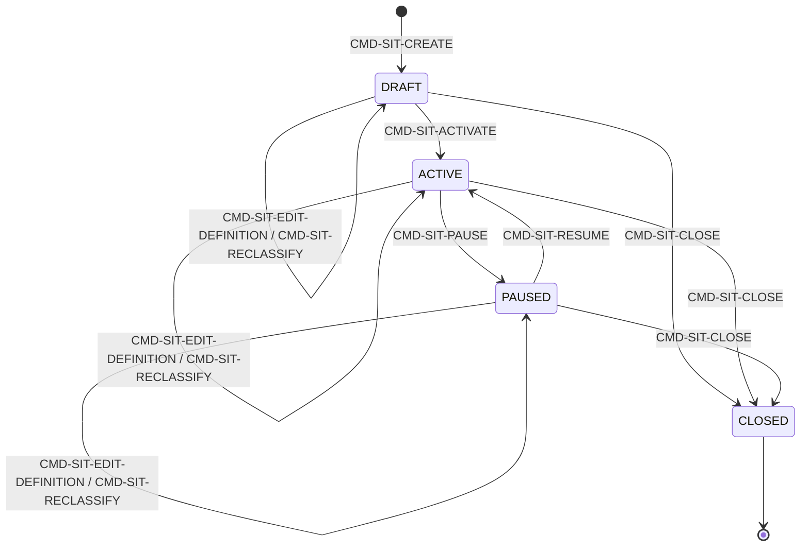
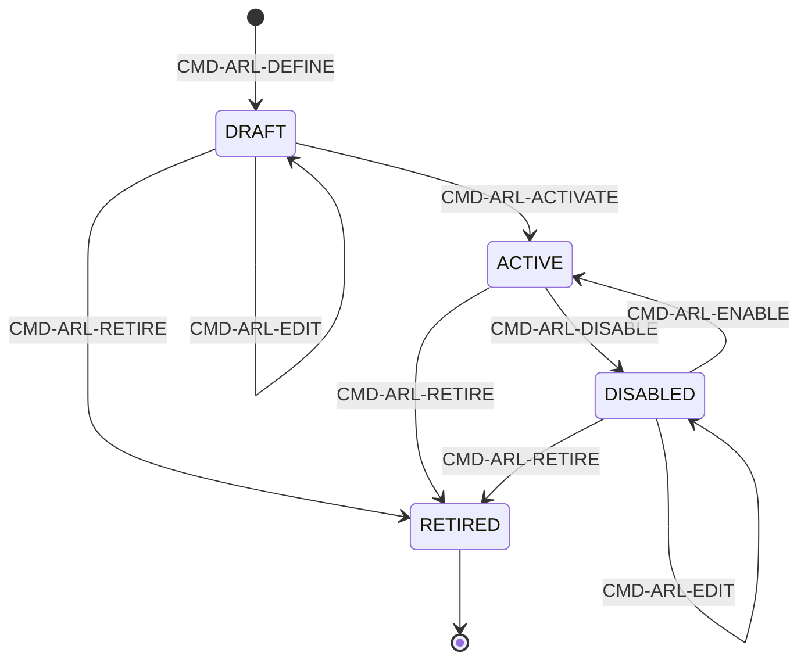
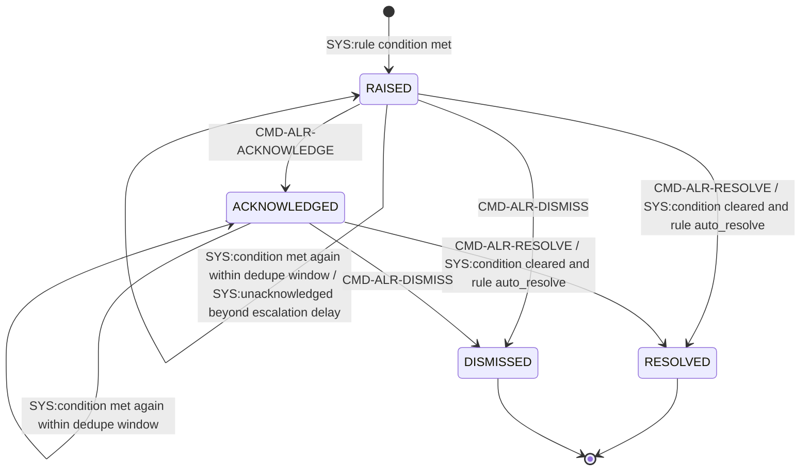
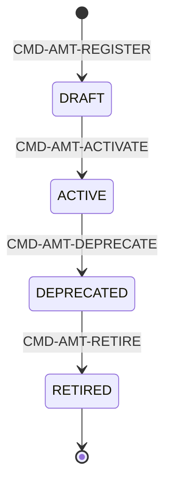
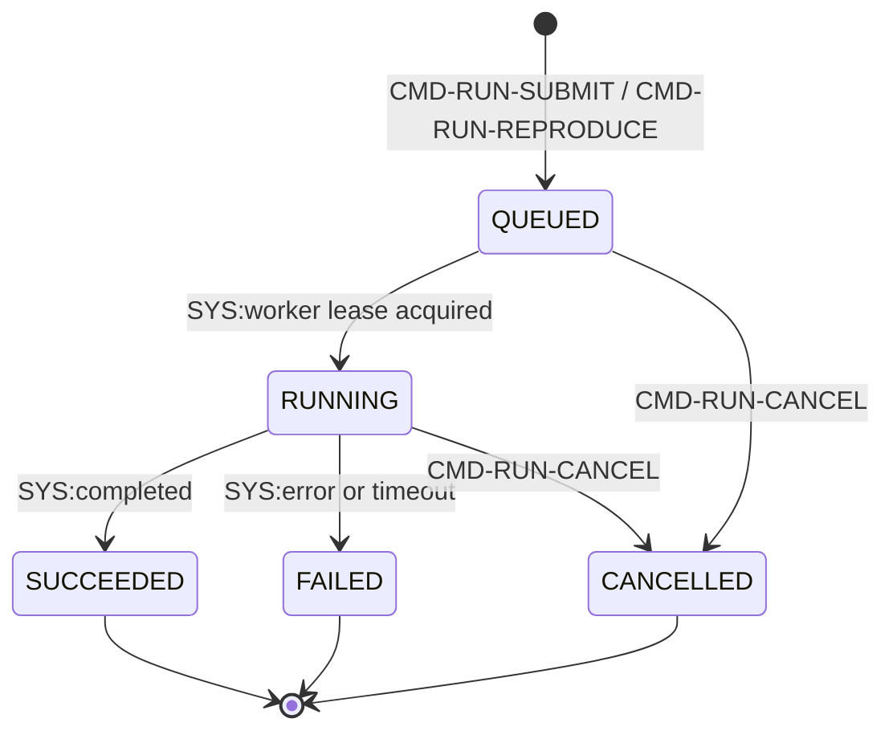
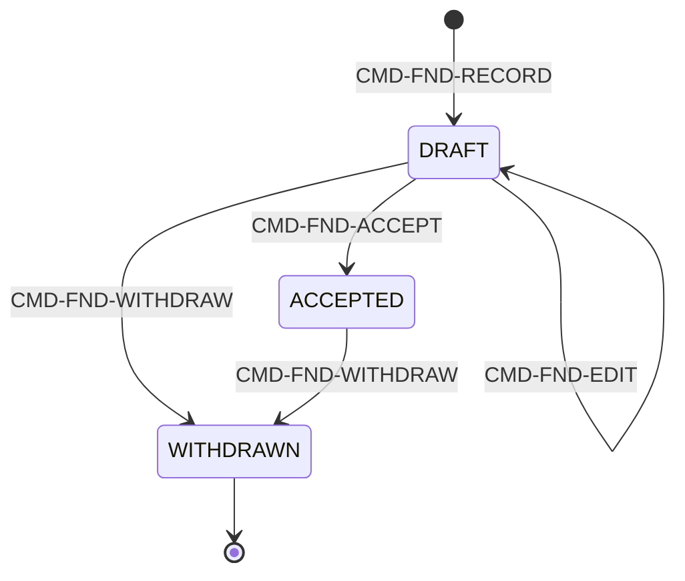
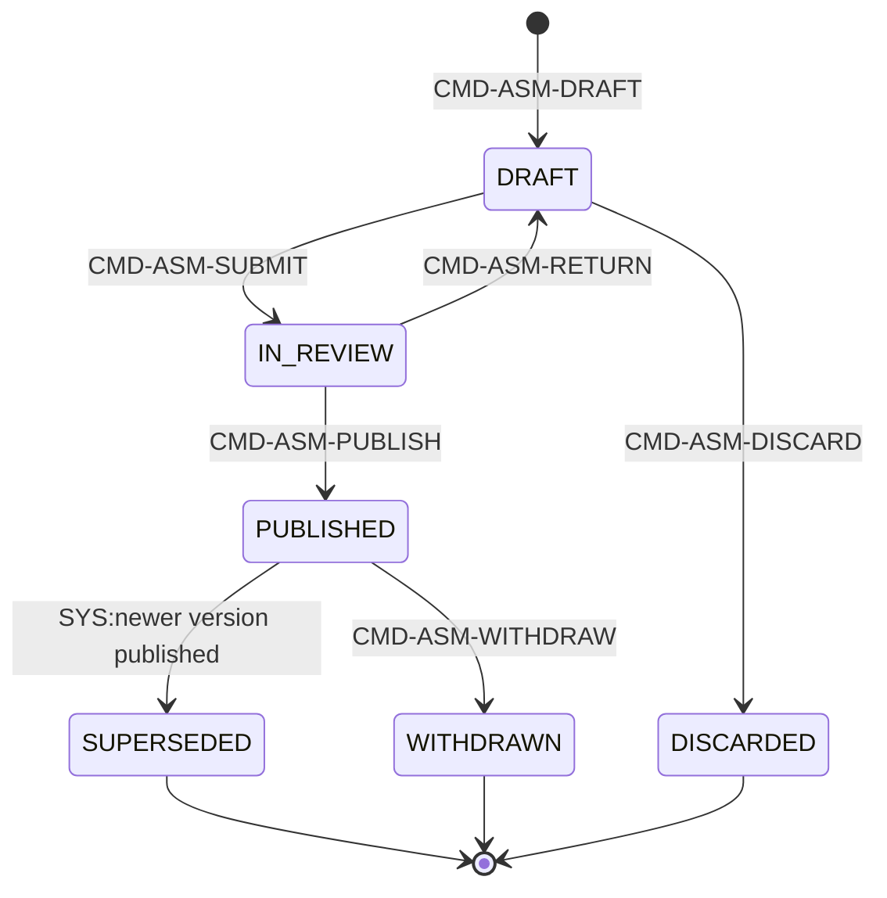
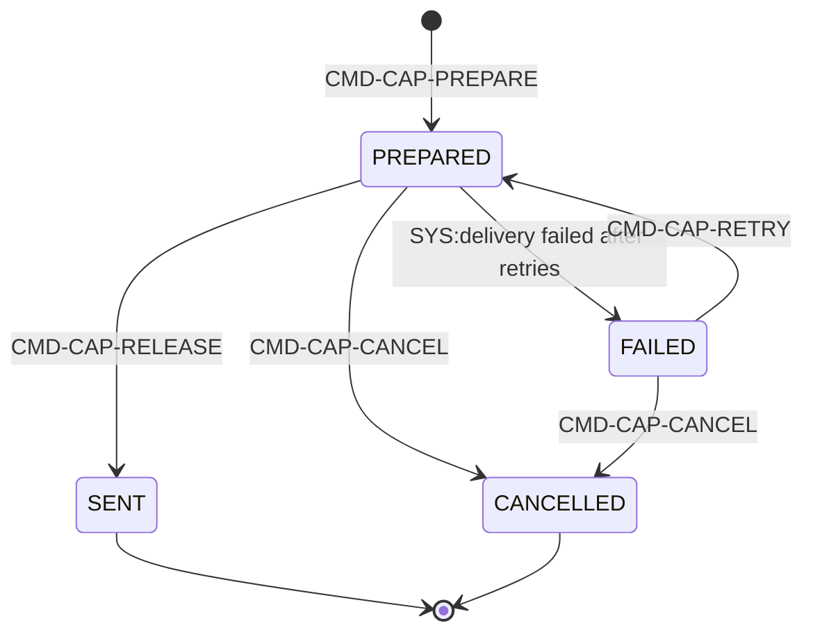

# BC03 — الوعي بالموقف والتحليل (Situational Awareness & Analysis)

## المستوى الأول — شرح مبسّط

هذا الـBC له نصفان مترابطان: **الأول** يراقب الوضع الحالي لحظيًا (مواقف جغرافية-زمنية، قواعد تنبيه، تنبيهات، وتحذيرات معيارية CAP تُرسَل خارجيًا كأرصاد جوية)؛ **الثاني** يحلل الماضي بعمق (حالات تحليل بفرضيات، تشغيلات قابلة لإعادة الإنتاج، نتائج، وتقييمات منشورة نهائية). كلاهما يعتمد على "النظرة الحية" مقابل "الحكم المدروس" — Situational Awareness مقابل Deliberate Analysis.

## المستوى الثاني — التفاصيل الهندسية

---

## 1. الهوية (Identity)

- **Bounded Context:** BC03
- **Domains:** DOM-09 (الوعي بالموقف)، DOM-04 (الزمن)، DOM-07/08 (التحليل)
- **Parent Capabilities:** CAP-05 (الوعي بالموقف: تعريف الموقف CAP-05.01، المراقبة والتنبيه CAP-05.02، صورة العمليات المشتركة CAP-05.03)، CAP-04 (التحليل والتقييم: حالات التحليل CAP-04.01، التنفيذ وإعادة الإنتاج CAP-04.02، إنتاج التقييم CAP-04.03؛ CAP-04.04 الدمج والربط مؤجَّلة لـR2 وخارج نطاق هذه الدراسة)

## 2. المعنى التجاري (Business Meaning)

**Definition:** بناء صورة تشغيلية مشتركة لحظية (Situation/Alert) + خط أنابيب تحليلي كامل قابل لإعادة الإنتاج من السؤال حتى التقييم المنشور. [Explicit]

**Purpose / Business Objective:** OUT-02 (الفهم السياقي — رؤية أي موقف في مكانه وزمانه وعلاقاته) عبر CAP-05، وOUT-03 (قرارات مدعومة بتقييمات وأدلة) عبر CAP-04. [Explicit — capabilities.md]

**Scope:** تعريف الموقف بامتداد جغرافي ونافذة زمنية ومعايير عضوية، تحديث العضوية تلقائيًا وتسجيل سجل التغيير، صورة تشغيلية مشتركة (COP) على الخريطة، قواعد تنبيه وتنبيهات بدورة حياة مدققة بالكامل، حالات تحليل بأسئلة وفرضيات وافتراضات وأدلة مختارة مثبَّتة زمنيًا، سجل طرق تحليل بإصدارات ثابتة، تشغيلات تحليل غير متزامنة قابلة لإعادة الإنتاج، نتائج (Findings) بمراجعة أقران، تقييمات (Assessments) بإصدارات يثبت المنشور منها للأبد، وإصدار تحذيرات خارجية بصيغة CAP 1.2.

**Out of Scope:** تنفيذ القرار نفسه (BC04 — يستهلك فقط إصدارات التقييم المنشورة عبر مرجع مثبَّت)، محتوى الادعاءات/الأدلة الخام ونموذج المعلومات (BC02 — التحليل يستهلكها فقط عبر EvidenceSelection مثبَّتة زمنيًا دون نسخها)، تسليم الإشعارات والاشتراكات (BC04 — AGG-NOTIFICATION وAGG-SUBSCRIPTION، رغم عيشهما في نفس ملف الشريحة SLC-06 مع AGG-SITUATION/AGG-ALERT-RULE/AGG-ALERT — انظر التصحيح أدناه).

**اكتشاف معماري مطوي هنا (CR-29 — "لا God Aggregate"):** `AGG-ANALYSIS-CASE` يذكر صراحة في ملاحظاته: *"Closing CR-29 for AnalysisCase: PRJ§58 listed 12 components in one aggregate; here the case holds only definition-level parts."* وINV-ACS-03 ينص حرفيًا: *"runs, findings and assessments are separate aggregates (CR-29: no God aggregate)."* هذا تصحيح معماري موثَّق أثّر على تقسيم كامل السلسلة التحليلية إلى **5 aggregates منفصلة** (Case/Method/Run/Finding/Assessment) بدل تجميعها في aggregate ضخم واحد — نمط DDD نموذجي (حدود معاملاتية صغيرة وواضحة) طُبِّق بوعي وتم توثيقه كقرار مصحَّح، لا كتصميم افتراضي. الأثر العملي: كل من Run وFinding وAssessment له دورة حياة واتساق معاملاتي مستقل، وتُربَط فيما بينها بمراجع (URNs) لا باحتواء مباشر.

**تصحيح مُطبَّق [مكتشَف أثناء دراسة BC04، محفوظ من الجولة السابقة]:** الجولة الأولى لهذا الملف نسبت لـBC03 كل الـaggregates التي تعيش في ملف شريحة SLC-06، بما فيها `AGG-NOTIFICATION` و`AGG-SUBSCRIPTION`. بالتحقق من `bounded_context:` في الـfront-matter الفعلي، الاثنان **BC04** لا BC03 (نفس نمط "الشريحة ≠ BC" المسجَّل في `05-conflicts.md#CONFLICT-02`، السطر الأول من جدوله). التصحيح انعكس هنا على §7/§9/§11/§12/§16 (الأوامر والأحداث والسياسات والتهديدات المستبعَدة).

**Features (طبقة بين Capability وUse Case):** غير موجودة في المصادر — لا يوجد أي كيان `FEAT-*` في `spec/`، وملف `01-business/capabilities.md` ينتقل من Capability مباشرة إلى Use Case. لذلك تبدأ سلسلة هذا الـBC من CAP ثم UC. **[Missing في المصدر]** (السلسلة الكاملة لكل Aggregate في [02-relationship-index.md §21](02-relationship-index.md)).

## 3. Actors

| Actor | الدور في BC03 | Evidence |
|---|---|---|
| **Analyst** | إنشاء/تعريف المواقف؛ إنشاء وفتح حالات التحليل وتعريف الأسئلة والفرضيات والافتراضات؛ اختيار الأدلة؛ تعريف السيناريوهات؛ تقديم/إعادة إنتاج/إلغاء تشغيلات التحليل؛ تسجيل/تعديل/سحب النتائج؛ صياغة/تعديل/تقديم/تجاهل مسودات التقييم | [Explicit — commands-slc06/07.md] |
| **Manager** | مشارِك في إدارة المواقف (إنشاء/تعديل/تفعيل/إيقاف/إغلاق) مع Analyst | [Explicit — commands-slc06.md] |
| **Analyst lead / Manager** | تعريف قواعد التنبيه وتعديلها وتفعيلها (بعد dry-run) وتعطيلها/تقاعدها | [Explicit — commands-slc06.md] |
| **Security Officer** | إعادة تصنيف الموقف (CMD-SIT-RECLASSIFY) وإعادة تصنيف حالة التحليل (CMD-ACS-RECLASSIFY) | [Explicit — commands-slc06/07.md] |
| **recipient (مستلم التنبيه)** | إقرار/حل/تجاهل التنبيه (لا يحق لغير المستلم أي فعل — NOT_A_RECIPIENT) | [Explicit — AGG-ALERT] |
| **Analysis lead** | تسجيل طريقة تحليل جديدة (register) | [Explicit — commands-slc07.md] |
| **second lead / Administrator** | تفعيل طريقة التحليل (activate) — **يجب أن يختلف عن المسجِّل (SoD)** | [Explicit — INV-AMT بند SEGREGATION_OF_DUTIES] |
| **peer Analyst (مراجع الأقران)** | قبول النتيجة (Finding) — **يجب أن يختلف عن المؤلف (SoD)** | [Explicit — CMD-FND-ACCEPT] |
| **reviewer / Analysis lead** | إرجاع/نشر/سحب التقييم — **الناشر يجب أن يختلف عن المؤلف عند PUBLISH (SoD)** | [Explicit — CMD-ASM-PUBLISH] |
| **alert recipient / duty officer** | إعداد رسالة CAP (تحويل تنبيه داخلي لصيغة خارجية) | [Explicit — commands-slc16.md] |
| **release authority (سلطة الإصدار)** | إصدار رسالة CAP فعليًا للخارج — **يجب أن تختلف عن مُعِدّها (SoD)** | [Explicit — INV-CAP-01، CMD-CAP-RELEASE] |
| **operator** | إعادة محاولة/إلغاء رسالة CAP فاشلة | [Explicit — commands-slc16.md] |
| **Auditor** | مراجعة رسائل CAP الصادرة (QRY-CAP-LIST) | [Explicit — policies-slc16.md] |
| **any user / any user of tenant** | عرض قوائم المواقف والخرائط الأساسية (base-map) ضمن نطاق التصريح | [Explicit — queries-slc06.md] |
| **system (workload identity)** | إعادة تقييم العضوية عند تغيّر الأحداث؛ إطلاق التنبيه آليًا عند تحقق شرط القاعدة؛ تشغيل مهام التحليل؛ نشر EVT-ASM-SUPERSEDED عند نشر إصدار أحدث | [Explicit — SYS: transitions] |

**ملاحظة منهجية [Missing، مُسجَّلة]:** `use-cases.md` يضع القيمة الحرفية `TBD` في حقل `actors` لكل حالات الاستخدام UC-010..016 وUC-020..024 وUC-098 — أي أن الفاعلين أعلاه **مُشتقون [Derived]** من عمود "الفاعل" في ملفات `commands-slc0{6,7,16}.md` (وهو مصدر أدق وأكثر تفصيلاً من use-cases.md نفسه)، لا من use-cases.md مباشرة. انظر §20.

## 4. Requirements المرتبطة (16 متطلبًا مباشرًا)

| REQ | البيان المختصر | UC | ملاحظة |
|---|---|---|---|
| REQ-SIT-001 | تعريف كل موقف بامتداد جغرافي ونافذة زمنية ومعايير إدراج ومالك وتصنيف | UC-020 | |
| REQ-SIT-002 | عند تطابق كائن مع معايير الموقف: تحديث العضوية وتسجيل تغيير | UC-021, UC-022 | |
| REQ-SIT-003 | عرض كل موقف كصورة تشغيلية مشتركة على الخريطة (كيانات/أحداث/مخاطر/مهام/موارد/تقييمات/تنبيهات) | UC-024, UC-098 | |
| REQ-SIT-004 | عند تحقق شرط قاعدة تنبيه: إطلاق تنبيه وإخطار المستخدمين المخوَّلين المشتركين | UC-023 | |
| REQ-SIT-005 | دورة حياة التنبيه (RAISED/ACKNOWLEDGED/RESOLVED/DISMISSED)؛ سبب إلزامي للتجاهل؛ تدقيق كل انتقال | UC-023 | |
| REQ-SIT-006 | عدم كشف الكائن المسبِّب للتنبيه (أو وجوده) لمستخدم غير مخوَّل له | — (لا UC، سلوك إنفاذ) | [Explicit] نمط مشابه لـOQ-034 في BC01: enforcement مدمج بلا فعل مستقل لفاعل، وليس فجوة |
| **REQ-SIT-007** | خدمة طبقات الخريطة مفلترة حسب تخويل الطالب؛ لا مشاركة بلاطات مخزَّنة (tiles) عبر نطاقات تخويل مختلفة | **UC-098** | **[Missing سابقًا — أضيفت هذه الجولة]** انظر §20 |
| REQ-ANL-001 | تسجيل السؤال والنطاق المكاني/الزمني والفرضيات والافتراضات ومراجع الأدلة لكل حالة تحليل | UC-010, UC-011, UC-012 | |
| REQ-ANL-002 | عند تنفيذ تشغيل: تسجيل إصدارات البيانات والمعاملات والخوارزمية وإصدارها والطبقات والمرشحات والنطاق الزمني/المكاني والافتراضات والخطوات والنتائج والمحلل ووقت التنفيذ | UC-013 | |
| REQ-ANL-003 | إعادة تنفيذ تشغيل مسجَّل بنفس المدخلات المسجَّلة ينتج نفس النتائج أو يبلّغ عن المدخلات المختلفة | UC-013 | |
| REQ-ANL-004 | تنفيذ التشغيلات الطويلة كمهام غير متزامنة بحالة وتقدّم وإلغاء وإعادة محاولة | UC-013 | |
| REQ-ANL-005 | تسجيل النتائج والأدلة والافتراضات وعدم اليقين والثقة والمنهجية والقيود والمراجع والإصدار لكل تقييم | UC-014, UC-015 | |
| REQ-ANL-006 | عند نشر تقييم: يصبح ذلك الإصدار ثابتًا؛ أي تغيير لاحق يُنشئ إصدارًا جديدًا | UC-015 | |
| REQ-ANL-007 | السماح بمقارنة سيناريوهات بديلة داخل حالة التحليل | UC-016 | |
| REQ-ANL-008 | إذا استشهد تقييم بدليل لا يملك القارئ صلاحية الاطلاع عليه: حجب ذلك الدليل حسب السياسة، وإظهار الحذف فقط إن سمحت السياسة | — (لا UC، سلوك إنفاذ) | [Explicit] نمط enforcement مشابه لـREQ-SIT-006 |
| REQ-INT-003 | حيث يُفعِّل المستأجر ذلك: تبادل التنبيهات بصيغة Common Alerting Protocol (CAP 1.2) | UC-023 | R2؛ capability=CAP-10.01 (تكامل) — نفس UC-023 يخدم CAP-05.02 وCAP-10.01 معًا (انظر §5) |

**ملاحظة اكتشاف [Explicit، هذه الجولة]:** الجولة الأولى عدّت 15 متطلبًا وفاتها **REQ-SIT-007** (`capability: CAP-05.03`، تُستشهَد بها فعليًا في `queries-slc06.md` عبر QRY-SIT-TILE وQRY-BASE-TILE، وربطها الرسمي في requirements.md هو UC-098 لا أي من UC-020..024). العدد الصحيح لمتطلبات BC03 المباشرة هو **16** لا 15.

## 5. Use Case Catalog (11 حالة استخدام، النطاقان 010-016 و020-024 + UC-098 عابرة)

| UC | الاسم | Actor | Capability | Aggregate المُنفِّذ الفعلي |
|---|---|---|---|---|
| UC-010 | Create Analysis Case | Analyst (owner) | CAP-04.01 | AGG-ANALYSIS-CASE (CMD-ACS-CREATE) |
| UC-011 | Define Analytical Question | Analyst (owner) | CAP-04.01 | AGG-ANALYSIS-CASE (CMD-ACS-DEFINE) |
| UC-012 | Select Evidence | Analyst (owner) | CAP-04.01 | AGG-ANALYSIS-CASE (CMD-ACS-SELECT-EVIDENCE) — يستهلك BC02 عبر EvidenceSelection مثبَّتة |
| UC-013 | Execute Analysis | Analyst | CAP-04.02 | AGG-ANALYSIS-RUN (+ AGG-ANALYSIS-METHOD كسجل طرق) |
| UC-014 | Assess Uncertainty | Analyst | CAP-04.03 | AGG-FINDING / AGG-ASSESSMENT (حقول uncertainty/confidence) |
| UC-015 | Produce Assessment | Analyst → reviewer/Analysis lead | CAP-04.03 | AGG-ASSESSMENT |
| UC-016 | Compare Scenarios | Analyst | CAP-04.01 | AGG-ANALYSIS-CASE (CMD-ACS-DEFINE-SCENARIO) + QRY-SCN-COMPARE |
| UC-020 | Create Situation | Analyst / Manager | CAP-05.01 | AGG-SITUATION |
| UC-021 | Monitor Situation | system (membership evaluator) | CAP-05.02 | AGG-SITUATION (عضوية مُشتقة/إسقاط) |
| UC-022 | Review Situation Change | أي مستخدم مخوَّل للموقف | CAP-05.02 | AGG-SITUATION (سجل التغيير) |
| **UC-023** | **Manage Alert** | recipient (ack/resolve/dismiss) · Analyst lead/Manager (rule) · alert recipient/duty officer + release authority (CAP) | CAP-05.02 **+ CAP-10.01** (رسائل CAP) | **ثلاث aggregates:** AGG-ALERT-RULE، AGG-ALERT، AGG-CAP-MESSAGE |
| UC-024 | Produce Situation View | أي مستخدم مخوَّل | CAP-05.03 | AGG-SITUATION (QRY-SIT-COP) |
| **UC-098** | **View Common Operational Picture** (عابرة للـBCs، actors=All) | All | CAP-05.03 | AGG-SITUATION (QRY-SIT-TILE، QRY-BASE-TILE، QRY-SIT-COP) — **مُضافة هذه الجولة** |

**اكتشاف [Derived، هذه الجولة]:** على عكس نمط BC01 (UC واحد → aggregate في BC مختلف)، الاكتشاف هنا **داخلي**: UC-023 "Manage Alert" وحدها تُنفَّذ فعليًا عبر **ثلاث aggregates منفصلة** (AGG-ALERT-RULE لتعريف القاعدة، AGG-ALERT لدورة حياة التنبيه، AGG-CAP-MESSAGE لتصديره خارجيًا) وتخدم متطلبات من سعتين مختلفتين (CAP-05.02 وCAP-10.01). هذا ليس خطأ بل تجميع منطقي لتدفق عمل واحد ("إدارة تنبيه من الإطلاق حتى التصدير الخارجي") عبر عدة حدود معاملاتية — متسق مع مبدأ CR-29 (لا aggregate ضخم واحد يحتوي كل شيء).

## 6. Aggregates (9) — الحالات والانتقالات

### 6.1 AGG-SITUATION — سياق تشغيلي (SLC-06)
**Invariants:** INV-SIT-01..04 (الأعضاء يبقون مملوكين لسياقاتهم الأصلية، الموقف يخزّن فقط التعريف وسجلات العضوية وسجل التغيير؛ الرؤية حسب تصريح كل عضو على حدة؛ العضوية تُقيَّم مقابل إصدار التعريف الذي كان ACTIVE وقت التقييم — قابلية استعادة تاريخية؛ CLOSED يحتفظ بلقطة نهائية وسجل تغيير)

**ملاحظة:** محتواه **إسقاط لا تخزين مباشر** (ADR-P07) — الموقف لا "يملك" أعضاءه بل يشير إليهم. CMD-SIT-RECLASSIFY يُلغي اشتراك المشتركين غير المخوَّلين للتصنيف الجديد فورًا (نفس نمط أمني موجود في BC01/BC02).

### 6.2 AGG-ALERT-RULE — قاعدة تنبيه (SLC-06)
**Invariants:** INV-ARL-01..03 (القاعدة ACTIVE غير قابلة للتعديل — التعديل يتطلب DISABLED أولًا؛ تصنيف القاعدة ≥ تصنيف البيانات التي تقرؤها، يُنفَّذ عبر حساب تصنيف التنبيه INV-ALR-02؛ قواعد الموقف المُوقَف أو المُغلَق لا تُطلَق)

**ملاحظة:** التفعيل (CMD-ARL-ACTIVATE) يتطلب `dry_run_ref` — تشغيل تجريبي على آخر 24 ساعة من الأحداث مع مراجعة الحجم المتوقع للتنبيهات (DRY_RUN_REQUIRED إن غاب) — ضابط مباشر ضد THR-S06-06 (عاصفة تنبيهات).

### 6.3 AGG-ALERT — تنبيه (SLC-06)
**Invariants:** INV-ALR-01..03 (كل انتقال مُدقَّق REQ-SIT-005؛ تصنيف التنبيه = max(تصنيف القاعدة، تصنيفات الكائنات المُطلِقة)، والمستلمون غير المخوَّلين لا يستلمون شيئًا إطلاقًا لا تنبيهًا محجوبًا REQ-SIT-006؛ إزالة تكرار — تنبيه غير نهائي واحد كحد أقصى لكل (قاعدة، موضوع) ضمن نافذة الإزالة)

**ملاحظة — نمط "عدم الإفصاح الصفري" (INV-ALR-02):** هذا النمط مُستشهَد به في المشروع كنمط أمني عابر: المستلم غير المخوَّل **لا يستلم تنبيهًا محجوب المحتوى** بل لا يستلم أي شيء إطلاقًا — تمامًا كنمط REQ-SIT-006. هذا يميّز BC03 عن أنماط "التحرير الجزئي (Redaction)" الشائعة في BC02/BC08 حيث يُعرَض كائن جزئي؛ هنا الكائن (التنبيه) نفسه غير موجود من منظور المستلم غير المخوَّل.

### 6.4 AGG-ANALYSIS-CASE — حالة تحليل (SLC-07)
**Invariants:** INV-ACS-01..04 (كل اختيار دليل مثبَّت بـknown_at فيصبح قابلًا لإعادة الإنتاج؛ تصنيف الحالة ≥ أعلى تصنيف بين عناصرها المختارة؛ التشغيلات والنتائج والتقييمات aggregates منفصلة — **CR-29: لا God aggregate**؛ الاختيارات والافتراضات لا تُحذَف أبدًا — إلغاء الاختيار/التقاعد يُغلقها بسبب)

```mermaid
stateDiagram-v2
    [*] --> DRAFT: CMD-ACS-CREATE
    DRAFT --> DRAFT: CMD-ACS-DEFINE / CMD-ACS-RECLASSIFY
    DRAFT --> OPEN: CMD-ACS-OPEN
    OPEN --> OPEN: CMD-ACS-DEFINE / ADD-HYPOTHESIS / UPDATE-HYPOTHESIS / ADD-ASSUMPTION / RETIRE-ASSUMPTION / SELECT-EVIDENCE / DESELECT-EVIDENCE / DEFINE-SCENARIO / RECLASSIFY
    OPEN --> CLOSED: CMD-ACS-CLOSE
    CLOSED --> CLOSED: CMD-ACS-RECLASSIFY
    CLOSED --> OPEN: CMD-ACS-REOPEN
    DRAFT --> CANCELLED: CMD-ACS-CANCEL
    OPEN --> CANCELLED: CMD-ACS-CANCEL
    CANCELLED --> [*]
```

**ملاحظة:** انظر §2 للسرد المعماري الكامل لقرار CR-29. `CMD-ACS-CLOSE` يمنع الإغلاق إن وُجدت تشغيلات QUEUED/RUNNING (RUNS_IN_PROGRESS)، و`CMD-ACS-CANCEL` يمنع الإلغاء إن كان هناك تقييم PUBLISHED يستشهد بالحالة (CASE_HAS_PUBLISHED_ASSESSMENT) — قيدان يحميان اتساق السلسلة التحليلية رغم فصلها إلى aggregates متعددة.

### 6.5 AGG-ANALYSIS-METHOD — طريقة تحليل بإصدار (SLC-07)
**Invariants:** INV-AMT-01..02 (إصدار الطريقة ثابت تمامًا — بصمة الصورة وschema المعاملات والكود؛ الإصدار الذي يدعم عملًا منشورًا يبقى قابلًا للتنفيذ، DEPRECATED كحد أقصى لا RETIRED)

**ملاحظة — SoD مباشرة:** `CMD-AMT-ACTIVATE` يشترط `approver ≠ author` (خطأ SEGREGATION_OF_DUTIES) — لا أحد يُفعِّل طريقة سجّلها بنفسه. `CMD-AMT-RETIRE` يمنع التقاعد إن كان أي تشغيل بهذا الإصدار يدعم تقييمًا PUBLISHED أو SUPERSEDED (METHOD_BACKS_PUBLISHED_WORK) — يحافظ على قابلية إعادة الإنتاج للأبد.

### 6.6 AGG-ANALYSIS-RUN — تشغيل تحليل (SLC-07)
**Invariants:** INV-RUN-01..04 (المدخلات مثبَّتة بـknown_at فتعيد التنفيذ رؤية نفس البيانات بالضبط؛ التشغيل يقرأ فقط ما يحق لمقدّمه رؤيته، وتصنيف النتائج ≥ أعلى تصنيف مدخل؛ إعادة الإنتاج تقارن بصمات النتائج وتُبلغ REPRODUCED أو DIFFERENT مع تحديد الاختلاف؛ النتائج SUCCEEDED ثابتة)

**ملاحظة — THR-S07-01 مرتبط مباشرة:** التشغيل "ينفَّذ بصلاحيات مُقدِّمه، أبدًا بصلاحيات النظام" (guard صريح على `SYS:worker lease acquired`) — الضابط الهندسي المباشر لتهديد تجاوز التشغيل لتصريح مُقدِّمه عبر امتيازات العامل.

### 6.7 AGG-FINDING — نتيجة تحليلية (SLC-07)
**Invariants:** INV-FND-01..02 (النتيجة ACCEPTED ثابتة؛ كل نتيجة تتتبَّع إلى تشغيلات أو أدلة — lineage إلزامي)

**ملاحظة — SoD مباشرة:** `CMD-FND-ACCEPT` يشترط `reviewer ≠ author` (مراجعة أقران حقيقية، SEGREGATION_OF_DUTIES). سحب نتيجة (WITHDRAW) يُعلِّم أي تقييم يستشهد بها للمراجعة تلقائيًا — تماسك عبر aggregates منفصلة دون مرجعية مباشرة قسرية.

### 6.8 AGG-ASSESSMENT — تقييم بإصدارات (SLC-07)
**Invariants:** INV-ASM-01..04 (الإصدار PUBLISHED ثابت؛ التغييرات إصدارات جديدة؛ إصدار PUBLISHED واحد بالضبط في كل وقت مع الاحتفاظ بتاريخ الإصدارات؛ مراجع القرارات تُثبِّت الإصدار "URN+version" — الاستبدال لا يغيّر أبدًا ما اعتمد عليه قرار سابق؛ القارئ غير المخوَّل لبعض الأدلة المستشهَد بها يحصل على التقييم مع حجب تلك المراجع حسب السياسة)

**ملاحظة — أهم دورة حياة في BC03:** PUBLISHED ثابت للأبد؛ القرارات (BC04) تُثبِّت الإصدار (INV-ASM-03) فلا يتغير ما اعتمد عليه قرار سابق حتى لو نُشِر إصدار أحدث. `CMD-ASM-PUBLISH` يشترط `reviewer ≠ author` (SoD) وينقل الإصدار PUBLISHED السابق تلقائيًا إلى SUPERSEDED **في نفس المعاملة**.

### 6.9 AGG-CAP-MESSAGE — رسالة CAP صادرة (SLC-16)
**Invariants:** INV-CAP-01..03 (لا شيء يغادر المنصة دون قرار إصدار من شخص غير مُعِدّه؛ محتوى CAP يُولَّد من قالب مراجَع وحقول التنبيه القابلة للإصدار فقط؛ رسائل CAP الواردة تصل عبر adapter كملاحظات من مصدر CAP (SLC-02)، أبدًا كتنبيهات مباشرة)

**ملاحظة — SoD + Dependency:** `CMD-CAP-RELEASE` يشترط `release authority ≠ preparer` (SoD) — نفس نمط CMD-ASM-PUBLISH وCMD-FND-ACCEPT وCMD-AMT-ACTIVATE (أربع نقاط SoD إجمالًا في BC03، انظر §11). INV-CAP-03 يعني أن رسائل CAP **الواردة من مصدر خارجي** ليست من اختصاص هذا الـaggregate إطلاقًا — فقط الصادر.

## 7. Commands (52 إجمالًا عبر 9 Aggregates، بعد استبعاد BC04)

| Aggregate | عدد الأوامر | القائمة |
|---|---|---|
| AGG-SITUATION | 7 | CREATE, EDIT-DEFINITION, ACTIVATE, PAUSE, RESUME, CLOSE, RECLASSIFY |
| AGG-ALERT-RULE | 6 | DEFINE, EDIT, ACTIVATE, DISABLE, ENABLE, RETIRE |
| AGG-ALERT | 3 | ACKNOWLEDGE, RESOLVE, DISMISS (+ 4 انتقالات SYS: بلا أمر بشري) |
| AGG-ANALYSIS-CASE | 14 | CREATE, DEFINE, OPEN, ADD-HYPOTHESIS, UPDATE-HYPOTHESIS, ADD-ASSUMPTION, RETIRE-ASSUMPTION, SELECT-EVIDENCE, DESELECT-EVIDENCE, DEFINE-SCENARIO, CLOSE, REOPEN, CANCEL, RECLASSIFY |
| AGG-ANALYSIS-METHOD | 4 | REGISTER, ACTIVATE, DEPRECATE, RETIRE |
| AGG-ANALYSIS-RUN | 3 | SUBMIT, REPRODUCE, CANCEL |
| AGG-FINDING | 4 | RECORD, EDIT, ACCEPT, WITHDRAW |
| AGG-ASSESSMENT | 7 | DRAFT, EDIT, SUBMIT, RETURN, PUBLISH, WITHDRAW, DISCARD |
| AGG-CAP-MESSAGE | 4 | PREPARE, RELEASE, RETRY, CANCEL |

**مستبعَد من BC03 رغم عيشه في نفس ملفات الشريحة:** أوامر `AGG-NOTIFICATION` (CMD-NTF-MARK-READ) و`AGG-SUBSCRIPTION` (CMD-SUB-SUBSCRIBE/UPDATE-CHANNELS/PAUSE/RESUME/UNSUBSCRIBE) في `commands-slc06.md` — **BC04** لا BC03. كذلك `AGG-INTEGRATION-CONNECTION` (CMD-CON-*) و`AGG-SENSOR-STREAM` (CMD-SNS-*) و`AGG-HR-SYNC-PROPOSAL` (CMD-HRS-*) في `commands-slc16.md` — BC07/BC01 لا BC03؛ فقط CMD-CAP-* (4) من ملف SLC-16 يخص BC03.

**مشترك لكل الـ52 أمرًا:** `Idempotency-Key` إلزامي؛ `If-Match` إلزامي لغير أوامر الإنشاء؛ `X-Purpose` و`X-Correlation-Id` إلزاميان؛ استجابة `202` مع `ResourceRef {urn, id, version, state}` أو `201` للإنشاء. [Explicit]

## 8. Queries (17 إجمالًا)

| Query | يعيد | من يحق له |
|---|---|---|
| QRY-SIT-LIST | مواقف حسب الحالة/المالك/الامتداد المتقاطع مع bbox | أي مستخدم؛ قاعدة تصنيف الموقف |
| QRY-SIT-GET | تعريف الموقف (إصدار عند valid_at)، عدّ الأعضاء المرئيين حسب النوع | مخوَّل لتصنيف الموقف |
| QRY-SIT-COP | الصورة التشغيلية المشتركة: الأعضاء المرئيون بهندسة مُحلَّلة وربما معمَّمة | مخوَّل للموقف؛ فلترة لكل عضو |
| QRY-SIT-CHANGES | سجل تغييرات العضوية (المرئية فقط) منذ مؤشر/وقت | مخوَّل للموقف؛ فلترة لكل عضو |
| QRY-SIT-TILE | بلاطة متجهة (vector tile) لطبقة تشغيلية ضمن نطاق أمان المستدعي | مخوَّل للموقف؛ تخزين مؤقت مفتاحه النطاق (ADR-P06 §6) |
| QRY-BASE-TILE | بلاطة خريطة أساس (طبقات غير مصنَّفة فقط؛ تخزين مؤقت مشترك) | أي مستخدم في المستأجر |
| QRY-ALR-LIST | تنبيهاتي حسب الحالة/الخطورة/الموقف | المستلم؛ قاعدة التصنيف |
| QRY-ACS-GET | الحالة مع السؤال والنطاق والفرضيات والافتراضات والاختيارات المرئية والسيناريوهات | قاعدة تصنيف الحالة؛ الاختيارات مفلترة |
| QRY-ACS-LIST | الحالات حسب المالك/الحالة/الامتداد | allowed_scope |
| QRY-RUN-GET | التشغيل مع المرتكزات والمعاملات والخطوات والحالة والمخرجات وتقرير إعادة الإنتاج | قاعدة تصنيف التشغيل |
| QRY-RUN-ARTIFACT | هدف تنزيل قصير الأجل لمخرج نتيجة | قاعدة تصنيف التشغيل؛ مُدقَّق |
| QRY-SCN-COMPARE | نتائج جنبًا إلى جنب لكل سيناريو مع المدخلات المختلفة | قاعدة تصنيف الحالة |
| QRY-FND-LIST | النتائج مع مصادرها | قاعدة التصنيف |
| QRY-ASM-GET | إصدار التقييم (افتراضيًا: PUBLISHED الحالي؛ أو إصدار/known_at) | قاعدة التصنيف؛ التزام REDACT للمراجع غير المخوَّلة |
| QRY-ASM-VERSIONS | تاريخ الإصدارات بالحالات والأوقات | قاعدة التصنيف |
| QRY-AMT-LIST | الطرق وإصداراتها | أي محلل |
| QRY-CAP-LIST | رسائل CAP الصادرة حسب الحالة | سلطة الإصدار، Auditor |

كل استعلام: PEP يطلب قرار PDP بـ`action=view` ونوع المورد والنطاق، ويطبق `allowed_scope` قبل القراءة (ADR-P06). القوائم بمؤشر (cursor). [Explicit]

## 9. Events (59 إجمالًا)

| الشريحة | العدد | التوزيع حسب Aggregate |
|---|---|---|
| SLC-06 | 19 | SIT (7)، ARL (6)، ALR (6) |
| SLC-07 | 35 | ACS (14)، AMT (4)، RUN (5)، FND (4)، ASM (8) |
| SLC-16 (BC03 فقط) | 5 | CAP (5) |

**حدثان يؤثران أمنيًا [Explicit]:** `EVT-SIT-RECLASSIFIED` و`EVT-ACS-RECLASSIFIED` — كلاهما يستهلكهما نفس الثلاثي الثابت المكتشَف في BC01: Security-version service، PEP decision caches، Projection security-version table، إضافة لمستهلكين خاصين بالسياق (Membership evaluator/Alert evaluator أو Search projection).

**نمط استهلاك ملحوظ آخر:** أحداث AGG-ANALYSIS-RUN (QUEUED/STARTED/SUCCEEDED/FAILED/CANCELLED) تُستهلَك كلها من نفس الثلاثي: Job scheduler/compute workers، Lineage writer (يكتب LineageRecord في **BC02**)، Case owner notification — توثيق مباشر لاعتماد BC03 على البنية التحتية لسلسلة المنشأ في BC02.

المخطط: `05-contracts/asyncapi-slc0{6,7,16}.md`. التسليم at-least-once عبر outbox؛ المستهلكون idempotent عبر inbox (REQ-PLT-006). [Explicit]

## 10. Business Rules / Invariants — أثرها (29 ثابتًا)

| المجموعة | العدد | نمط مشترك |
|---|---|---|
| INV-SIT-* | 4 | إسقاط لا ملكية + رؤية لكل عضو + قابلية استعادة تاريخية |
| INV-ARL-* | 3 | ثبات ACTIVE + تصنيف ≥ مصدر القراءة |
| INV-ALR-* | 3 | تدقيق كل انتقال + **عدم إفصاح صفري (INV-ALR-02)** + إزالة تكرار |
| INV-ACS-* | 4 | تثبيت زمني (known_at) + تصنيف ≥ أعلى مصدر + لا God aggregate (CR-29) + لا حذف |
| INV-AMT-* | 2 | ثبات الإصدار + بقاء قابل للتنفيذ إن دعم عملًا منشورًا |
| INV-RUN-* | 4 | تثبيت المدخلات + تنفيذ بصلاحية المُقدِّم + مقارنة بصمات + ثبات النتائج |
| INV-FND-* | 2 | ثبات ACCEPTED + lineage إلزامي |
| INV-ASM-* | 4 | ثبات PUBLISHED + إصدار واحد نشط + تثبيت مرجع القرار + حجب مراجع غير مخوَّلة |
| INV-CAP-* | 3 | لا صدور دون فصل مهام + قالب مراجَع فقط + الوارد عبر adapter لا مباشرة |

**نمط عابر لكل الـ9 Aggregate [Explicit، مؤكَّد آليًا]:** Optimistic concurrency (`If-Match`) + Idempotency-Key + State+History+Outbox+AuditOutbox في معاملة واحدة (ADR-P02) — بلا استثناء، مطابق تمامًا لنمط BC01.

**نمط "تصنيف ≥ أقصى المصادر" [Derived، عابر لـ7 من 9 aggregates]:** INV-SIT-02، INV-ARL-02، INV-ALR-02، INV-ACS-02، INV-RUN-02، INV-ASM-04، INV-CAP-02 تطبّق جميعها نسخة من نفس القاعدة: تصنيف الكائن المشتق ≥ أقصى تصنيف بين مكوناته/مصادره. هذا هو الميكانيزم الأساسي الذي يمنع "تسريب تصنيف" عبر التجميع أو الاشتقاق في كامل BC03.

**بند بارز مطلوب تسليط الضوء عليه صراحة [حسب توجيه هذه الجولة]:** **INV-ALR-02** ("alert label = max(rule label, labels of triggering objects); only recipients cleared for that label receive it — others receive nothing, not a redacted alert") — يُستشهَد به في مواضع أخرى من المشروع كنمط "عدم الإفصاح الصفري" المرجعي، ويُفرَّق صراحة (انظر §6.3) عن أنماط "الحجب الجزئي/Redaction" الأكثر شيوعًا.

## 11. Policies (52 سياسة أمر + 17 سياسة استعلام لـBC03، بعد التصفية)

**التصفية من ملفات الشريحة المشتركة [Explicit]:**

| الملف | إجمالي command_policies | BC03 منها | المستبعَد |
|---|---|---|---|
| policies-slc06.md | 22 | 16 | 6 (POL-SUB-* ×5 + POL-NTF-MARK-READ ×1 — **BC04**) |
| policies-slc07.md | 32 | 32 | لا شيء (الملف كله BC03) |
| policies-slc16.md | 18 | 4 | 14 (POL-CON-* ×7، POL-SNS-* ×5 — **BC07**؛ POL-HRS-* ×2 — **BC01**) |
| **المجموع** | **72** | **52** | **20** |

نفس التصفية على query_policies: slc06 (8→7، استبعاد POL-NTF-INBOX)، slc07 (9→9، بلا استبعاد)، slc16 (4→1، فقط POL-CAP-LIST). المجموع البشري = 17، مطابق تمامًا لعدد الاستعلامات في §8.

**Segregation of Duties (4 مواضع صريحة فقط من أصل 52 أمرًا، ≈ 7.7%):**

| السياسة | الأمر | شرط SoD |
|---|---|---|
| POL-AMT-ACTIVATE | CMD-AMT-ACTIVATE | `approver ≠ author` |
| POL-FND-ACCEPT | CMD-FND-ACCEPT | `reviewer ≠ author` |
| POL-ASM-PUBLISH | CMD-ASM-PUBLISH | `reviewer ≠ author` |
| POL-CAP-RELEASE | CMD-CAP-RELEASE | `release authority ≠ preparer` |

**ملاحظة دقيقة [مُصحَّحة هذه الجولة]:** `POL-RUN-REPRODUCE` يحمل شرطًا في نفس عمود `segregation_of_duties` ("reproducer cleared for source run label") لكنه فعليًا **شرط تصريح/تصنيف (clearance gate)** لا فصل مهام حقيقي (لا يمنع نفس الشخص من التنفيذ، فقط يتطلب تصريحًا كافيًا) — لم يُحسَب ضمن الأربعة أعلاه لدقة التصنيف، خلافًا لصياغة الجولة السابقة التي عدّته ضمنيًا.

**لا Platform Baselines جديدة خاصة بـBC03** (بخلاف BC02 التي أضافت PB-08..11) — يُستخدَم فقط PB-01..11 الموروثة من BC01.

## 12. Security & Threats (12 تهديدًا يخص BC03 فعليًا، بعد تصحيحين)

| THR | المكوّن | STRIDE | المخاطرة المتبقية |
|---|---|---|---|
| THR-S06-01 | Alert fan-out | Info Disclosure | L |
| THR-S06-03 | Tiles | Info Disclosure | L |
| THR-S06-04 | COP counts | Info Disclosure | L |
| THR-S06-05 | Alert rules | Tampering | L |
| THR-S06-06 | Alert storm | DoS | L |
| THR-S07-01 | Run execution | Elevation | L |
| THR-S07-02 | Method image | Tampering | L |
| THR-S07-03 | Reproduction | Info Disclosure | L |
| THR-S07-04 | Assessment | Tampering | L |
| THR-S07-05 | Citations | Info Disclosure | L |
| THR-S07-06 | Compute | DoS | L |
| THR-S16-01 | Outbound (CAP) | Info Disclosure | L |

**ملاحظة [Explicit]:** كل تهديدات BC03 الـ12 مخاطرتها المتبقية **L (منخفضة)** — لا يوجد أي تهديد مقبول صراحة بمخاطرة M كما في BC01 (THR-S01-04/11).

**⚠️ تصحيح 1 [Explicit، مكتشَف أثناء دراسة BC04، محفوظ من الجولة السابقة]:** الجولة الأولى لهذا الملف نسبت **كل** الـ7 تهديدات في `threat-model-slc06.md` إلى BC03. بالفحص أثناء دراسة BC04 تبيَّن أن **THR-S06-02** (Push payload، controls يشير لـ`INV-NTF-02`) و**THR-S06-07** (Subscription، controls يطابق `INV-SUB-01/02`) تخصان فعليًا **AGG-NOTIFICATION وAGG-SUBSCRIPTION — وهما BC04**، رغم عيشهما في نفس ملف "slc06" مع AGG-SITUATION/AGG-ALERT-RULE/AGG-ALERT (BC03). نفس نمط اختلاط الشريحة عبر BCs المسجَّل رسميًا في `05-conflicts.md#CONFLICT-02` (الصف الأول من جدوله). العدد الصحيح لـBC03 من SLC-06 هو **5** من 7 لا 7.

**⚠️ تصحيح 2 [Explicit، مُكتشَف هذه الجولة]:** رأس هذا القسم في الجولة السابقة ذكر "13 تهديدًا يخص BC03 فعليًا" بينما مجموع صفوف جدوله الفعلي كان 5 (SLC-06) + 6 (SLC-07) + 1 (SLC-16) = **12** لا 13 — تناقض حسابي داخلي بسيط في الصياغة لا في البيانات نفسها (الجدول والاستبعادات كانا صحيحين). صُحِّح العدد الإجمالي هنا إلى **12**.

**استبعاد من SLC-16 (5 تهديدات في الملف، واحد فقط BC03):** THR-S16-02 (HRIS — **BC01**)، THR-S16-03 (DMS — **BC07/BC08**)، THR-S16-04 (Connections — **BC07**)، THR-S16-05 (Sensors — **BC07**، وهو الوحيد بمخاطرة متبقية M مقبولة صراحة، لكنه ليس BC03). فقط THR-S16-01 (Outbound/CAP) يخص BC03.

## 13. Data & APIs

- **النموذج المنطقي:** `06-data/logical-model/slc-06.md` (Situation/AlertRule/Alert — يشارك الملف نفسه مع تعريفات BC04 لـNotification/Subscription)، `slc-07.md` (AnalysisCase..Assessment، خالص لـBC03)، `slc-16.md` (يشارك مع BC01/BC07 — قسم AGG-CAP-MESSAGE فقط يخص BC03).
- **العقود:** `05-contracts/openapi-intelligence-slc06.md`، `openapi-intelligence-slc07.md`، `openapi-operations-slc06.md` (**لم يُتحقَّق بعد إن كان محتواه BC03 أم BC04 بالكامل — انظر §20**)، `asyncapi-slc06.md`، `asyncapi-slc07.md`، `errors-slc06.md`، `errors-slc07.md`؛ ولـSLC-16: `openapi-integration-slc16.md`، `openapi-intelligence-slc16.md`، `asyncapi-slc16.md`، `errors-slc16.md`.
- **نمط مشترك [Explicit]:** كل الاستعلامات تمر عبر PEP/PDP قبل الاسترجاع (ADR-P06)؛ كل الأوامر تحمل Idempotency-Key وIf-Match.

## 14. Integrations

- **BC02** — استهلاك (لا نسخ): `AGG-ANALYSIS-CASE`/`AGG-ANALYSIS-RUN` يستهلكان EvidenceSelection مثبَّتة زمنيًا (known_at)؛ `AGG-SITUATION` يستهلك كيانات/علاقات كأعضاء دون نسخها (ADR-P07)؛ `Lineage writer` يكتب LineageRecord في BC02 عند كل تشغيل تحليل (EVT-RUN-*).
- **BC04** — تصدير: `AGG-ASSESSMENT` يُغذّي طلبات القرار بمراجع مثبَّتة (INV-ASM-03)؛ استيراد ضمني: `AGG-NOTIFICATION`/`AGG-SUBSCRIPTION` (BC04) يستهلكان أحداث SLC-06 (EVT-ALR-*، EVT-SIT-*) لتسليم الإشعارات الفعلي، رغم عيشهما في نفس الشريحة لا نفس الـBC.
- **خارجي (CAP)** — `AGG-CAP-MESSAGE` (SLC-16) يصدّر تنبيهات بصيغة CAP 1.2 لجهة خارجية مسموحة (R2)؛ الوارد يصل حصرًا عبر adapter كملاحظة من مصدر CAP في BC02 (INV-CAP-03) — لا مسار مباشر لـAGG-ALERT.

## 15. Verification / Acceptance

عُثِر على 9 ملفات state-machine acceptance تطابق الـ9 aggregates بالضبط: `SLC-06/situation-state-machine.md`، `alert-rule-state-machine.md`، `alert-state-machine.md`؛ `SLC-07/analysis-case-state-machine.md`، `analysis-method-state-machine.md`، `analysis-run-state-machine.md`، `finding-state-machine.md`، `assessment-state-machine.md`؛ `SLC-16/cap-message-state-machine.md` — إضافة لملفات `invariants-slc0{6,7,16}.md`. **لم تُقرأ أسطرها بالكامل في هذه الجولة** (عُرفت بالاسم والمطابقة مع أسماء الـaggregates فقط) — **[Missing — يحتاج جولة تحقق تالية]**، بنفس تحفُّظ BC01 §15.

## 16. Dependencies (خارج BC03)

| من | العلاقة | إلى |
|---|---|---|
| AGG-ANALYSIS-RUN | `consumes` | BC02 (EvidenceSelection مثبَّتة known_at من AGG-CLAIM/AGG-EVIDENCE) |
| AGG-ANALYSIS-RUN (نجاح) | `produces_into` | BC02 (LineageRecord عبر Lineage writer) |
| AGG-SITUATION (عضوية) | `consumes` | BC02 (كيانات/علاقات كأعضاء، بدون نسخها — ADR-P07) |
| AGG-CAP-MESSAGE (وارد) | `depends_on` | BC02 (رسائل CAP الواردة = ملاحظات من مصدر CAP، **ليست** تنبيهات مباشرة — INV-CAP-03) |
| AGG-ASSESSMENT | `feeds` | BC04 (القرارات تُثبِّت إصدار التقييم — INV-ASM-03) |
| EVT-ALR-*/EVT-SIT-* | `consumed_by` | BC04 (AGG-NOTIFICATION/AGG-SUBSCRIPTION — تسليم فعلي للإشعارات) |
| AGG-ANALYSIS-RUN (تنفيذ) | `constrains_by` | THR-S07-01 — ينفَّذ بصلاحيات مُقدِّمه لا صلاحيات النظام |

## 17. Cross-BC Relationships (ملخص)

BC03 يقع بين طرفين: **مستهلك** لـBC02 (الأدلة والكيانات الخام، مثبَّتة زمنيًا وغير منسوخة)، و**مزوِّد** لـBC04 (Findings/Assessments كمدخل قرار موثوق ومُثبَّت الإصدار عبر INV-ASM-03). كما يشارك ملفات الشريحة (SLC-06 وSLC-16) فعليًا مع BC04/BC01/BC07 لأسباب تنظيم تطوير تاريخية لا حدود معمارية — نمط "الشريحة ≠ BC" الموثَّق مركزيًا في `05-conflicts.md#CONFLICT-02`. تدفق العمل النموذجي: بيانات BC02 → تحليل BC03 (Case→Run→Finding→Assessment) → قرار BC04، بالتوازي مع مسار مراقبة مستقل: مواقف/تنبيهات BC03 (لحظية) → إشعارات BC04 → (اختياريًا) تصدير CAP خارجي.

## 18. Traceability

الرجوع الكامل موجود في `01-entity-index.md` (كل ID من هذا الملف قابل للبحث فيه مع كل الملفات المرجعية له) و`02-relationship-index.md` (العلاقات الدلالية المصنَّفة، بما فيها إدخالات CONFLICT-02 الخاصة بـBC03).

## 19. Conflicts

- **لا تعارضات جديدة تخص BC03 حصريًا اكتُشِفت هذه الجولة.**
- **بند تاريخي محسوم يستحق التذكير [CLOSED]:** إسناد THR-S06-02/THR-S06-07 لـBC03 خطأً (مُصحَّح في §12 أعلاه) هو **الصف الأول** من `05-conflicts.md#CONFLICT-02` ("نمط الشريحة ≠ Bounded Context") — الحالة هناك **CLOSED** رسميًا، والتصحيح مُطبَّق في هذا الملف نفسه كما يذكر السجل المركزي حرفيًا: *"تصحيح مباشر في bc03-situational-awareness.md"*.
- **تناقض حسابي داخلي بسيط [مُصحَّح هذه الجولة، لا يستدعي إدخالًا في سجل CONFLICTS المركزي]:** رأس §12 في الجولة السابقة ذكر "13" بينما مجموع الجدول "12" — صُحِّح هنا دون رفعه لسجل CONFLICT-0x لأنه خطأ صياغة في هذا الملف نفسه لا تعارض بين مصدرين مختلفين.
- **REQ-SIT-007 المفقودة سابقًا (§4/§20)** ليست تعارضًا بل **سهو في التغطية** من الجولة الأولى — صُحِّح هنا بإضافتها، ولا يستدعي هو الآخر إدخالًا في سجل CONFLICTS المركزي لعدم وجود تعارض بين مصدرين (كان غيابًا فقط في هذا الملف).

## 20. Missing Information (مُجمَّعة)

**تحديث Phase 3.7 (2026-09-30):**

- بند 2 (`openapi-operations-slc06.md`): يحوي 7 عمليات كلها لـBC04 (SUB ×5، NTF ×2)، لا لـBC03. عقد BC03 في SLC-06 هو `openapi-intelligence-slc06.md` (SIT، ARL، ALR، BASE — 23 عملية).
- بند 3 (ملفات القبول): التسعة تطابق مصفوفاتها (V1 في [06-verification.md](06-verification.md))، وانتقالات المجدول في AGG-ALERT وAGG-ANALYSIS-RUN وغيرهما لها سيناريوهات الآن (CR-72).
- بند 4 (REQ-SIT-006/REQ-ANL-008): سُجِّل OQ-035 وأُغلق «بالتصميم» — سلوك إنفاذ للإفصاح الصفري داخل كل UC يعرض تنبيهًا أو تقييمًا، مثل OQ-034.
- **يبقى مفتوحًا (فجوة في المصدر لا في التحقق):** حالات الاستخدام الأصلية UC-010..016 وUC-020..024 مسودات اسم فقط (`actors: TBD`، `DRAFT`) في `use-cases.md`. تعبئتها تحتاج جلسة elicitation مع أصحاب العمل لأنها سرد تدفّقات أعمال، لا اشتقاقًا آليًا؛ الفاعلون المشتقون في §3/§5 من هذا الملف يبقون المرجع العملي حتى ذلك الحين.

1. **actors في use-cases.md = "TBD" حرفيًا** لكل الـ13 حالة استخدام المرتبطة بـBC03 (UC-010..016، UC-020..024، UC-098) — الفاعلون في §3/§5 من هذا الملف **مُشتقون [Derived]** من `commands-slc0{6,7,16}.md` لا من use-cases.md مباشرة. **[Missing في المصدر الأصلي]**.
2. **`openapi-operations-slc06.md`** — ملف عقد موجود في `05-contracts/` باسم يوحي بارتباطه بـSLC-06، لكن لم يُفحَص محتواه لتحديد إن كان يخص BC03 (Situation/Alert) أم BC04 (Notification/Subscription) أم كليهما. **[Missing — يحتاج فحصًا]**.
3. **ملفات acceptance (9 state-machine + 3 invariants)** — عُرفت بالاسم والمطابقة مع الـaggregates فقط، لم تُقرأ أسطرها الكاملة هذه الجولة (انظر §15). **[Missing verification pass]**.
4. **REQ-SIT-006 وREQ-ANL-008** بلا Use Case مرتبط بالتصميم (سلوك إنفاذ لا فعل فاعل مستقل) — نمط مشابه لـOQ-034 في BC01، لكنه **لم يُسجَّل رسميًا كقرار OQ مستقل لـBC03** في `00-governance/registers/open-questions.md`. **[Needs Review — هل يستحق تسجيلًا رسميًا مشابهًا لـOQ-034؟]**
5. ~~REQ-SIT-007 غير مربوطة~~ — **تم التصحيح هذه الجولة:** أُضيفت لـ§4 مع UC-098 في §5. لم تعد فجوة.

## 21. Completeness Status

| الفحص | الحالة |
|---|---|
| كل Aggregate له Purpose/States/Commands/Events/Invariants؟ | ✅ 9/9 |
| كل Command مرتبط بـAggregate/Policy مع تصفية BC04/BC01/BC07؟ | ✅ 52/52 (مؤكَّد عبر تقاطع commands-slc0{6,7,16}.md × policies-slc0{6,7,16}.md) |
| كل Query مرتبط بـPolicy؟ | ✅ 17/17 |
| كل Event له Producer وConsumer؟ | ✅ 59/59 |
| كل Requirement مرتبط بـUC (أو سبب صريح لغيابه)؟ | ✅ 16/16 (14 بـUC + 2 بسلوك إنفاذ بالتصميم REQ-SIT-006/REQ-ANL-008) |
| Threat model مربوط ومُصفَّى من BC04/BC01/BC07؟ | ✅ 12/12 مع STRIDE ومخاطرة متبقية (كلها L) |
| كل UC مرتبط بـAggregate منفِّذ فعلي؟ | ✅ 13/13 (بما فيها UC-098 المُضافة هذه الجولة) |
| قرار معماري موثَّق (CR-29) مطابق للتقسيم الفعلي؟ | ✅ مؤكَّد حرفيًا (§2، §6.4) |
| SoD مُحصاة بدقة (فصل حقيقي مقابل شرط تصريح)؟ | ✅ 4/52 فصل حقيقي + 1 شرط تصريح مُميَّز بوضوح (§11) |
| الأثر الوارد من الجولات اللاحقة (BC04) مُطبَّق ومحفوظ حرفيًا؟ | ✅ THR-S06-02/07، استبعاد AGG-NOTIFICATION/AGG-SUBSCRIPTION |
| **الحالة الإجمالية** | **CLOSED بالتحقق (Phase 3.7)** — يبقى فقط `actors: TBD` في مسودات UC الأصلية (فجوة مصدر تحتاج elicitation). (الحالة السابقة قبل Phase 3.7 محفوظة في سجل git) |
