# BC04 — القرار والتخطيط والتنفيذ والمخاطر والطوارئ

## المستوى الأول — شرح مبسّط

هذا الـBounded Context هو "الذراع التنفيذية" للمنصة: من طلب قرار مدعوم بأدلة، إلى تسجيله رسميًا بسلطة مختصة، إلى خطة تُترجمه لأهداف ومراحل ومهام قابلة للإسناد والتنفيذ والمراجعة، مرورًا بإدارة المخاطر قبل وقوعها والحوادث الفعلية بعد وقوعها، وانتهاءً بتنسيق متعدد الوحدات وإشعار المعنيين. خمس شرائح تطويرية مختلفة (SLC-03/06/08/15/17) اجتمعت كلها في نفس الـBC لأنها تخدم نفس الدورة التشغيلية.

## المستوى الثاني — التفاصيل الهندسية

---

## 1. الهوية (Identity)

- **Bounded Context:** BC04
- **Domains:** DOM-10 (القرار)، DOM-12/13 (التخطيط والتنفيذ)، DOM-17 (المخاطر والطوارئ)، DOM-11 (الاتصال) [Explicit — capabilities.md]
- **Parent Capabilities:** CAP-06 (إدارة القرار)، CAP-07 (التخطيط والتنفيذ)، CAP-09 (المخاطر والطوارئ)، CAP-10.01 (الإشعارات)
- **Sub-capabilities:**

| Sub-capability | الاسم | Release |
|---|---|---|
| CAP-06.01 | طلبات القرار والخيارات | R1 |
| CAP-06.02 | تسجيل القرار والتحقق من السلطة | R1 |
| CAP-06.03 | التنسيق | R2 |
| CAP-07.01 | الأهداف والتخطيط | R1 |
| CAP-07.02 | إصدارات الخطة وخط الأساس | R1 |
| CAP-07.03 | إدارة المهام | R1 |
| CAP-07.04 | سير العمل | R1 |
| CAP-07.05 | قياس النتائج | R1 |
| CAP-09.01 | إدارة المخاطر | R3 |
| CAP-09.02 | الحوادث والاستجابة | R3 |
| CAP-09.03 | الاستمرارية والتعافي | R3 |
| CAP-10.01 | الإشعارات والتوزيع | R1 |

## 2. المعنى التجاري (Business Meaning)

**Definition:** خط الأنابيب الكامل من "سؤال قرار" إلى "نتيجة مقاسة"، بالتوازي مع إدارة استباقية للمخاطر واستجابة فعلية للحوادث، وتنسيق متعدد الأطراف، وإشعار آمن للمعنيين. [Explicit]

**Purpose / Business Objective:** OUT-04 (حوكمة، عبر BRL-003: لا قرار بلا سلطة) وOUT-05 (تنفيذ عملياتي، خطط ومهام متتبَّعة بالكامل). CAP-09 يخدم أيضًا OUT-02 (الوعي بالموقف يغذّي تحديد المخاطر). [Explicit — capabilities.md]

**Scope:** طلبات القرار وخياراتها واستشهاداتها؛ تسجيل القرار بلقطة سلطة كاملة غير قابلة للتعديل؛ هوية الخطة ودورة حياتها منفصلة عن محتواها المُنسخ في إصدارات؛ إدارة المهام بأعقد دورة حياة في الدراسة كلها؛ تتبّع نتائج الخطة زمنيًا؛ تسجيل المخاطر وتقييمها ومعالجتها قبل وقوعها؛ تتبّع الحوادث الفعلية من التبليغ حتى الإغلاق بما فيها تفعيل خطط الاستمرارية؛ تنسيق متعدد الوحدات/المنظمات؛ إشعار آمن للمعنيين واشتراكاتهم.

**Out of Scope:** التحقق من السلطة نفسه كخدمة (BC01 — AuthorityCheck)؛ الأدلة/التقييمات الخام التي تُستشهَد بها (BC03 — AGG-ASSESSMENT/AGG-EVIDENCE، تُستهلَك هنا كمراجع مثبَّتة زمنيًا فقط)؛ تحديد أهلية الشخص نفسها (BC05 — AGG-QUALIFICATION-RECORD/AGG-ROLE-REQUIREMENT، تُستهلَك هنا فقط عبر QRY-ELIG-CHECK عند إسناد المهمة).

**نمطان مكتشَفان [Explicit، مؤكَّدان]، محفوظان من الجولة السابقة:**

1. **BRL-003 مُطبَّقة حرفيًا مرتين في نفس الـBC:** مرة على مستوى الأفراد (AGG-DECISION، INV-DEC-02: لا قرار بلا AuthorityCheck ناجح ولقطة سلطة محفوظة) ومرة على مستوى المنظمات (AGG-COORDINATION-CASE، INV-CRD-03: لا مسؤولية "منجزة" تحتاج سلطة منظمة أخرى بلا قرار مسجَّل لتلك السلطة). نفس القاعدة الجوهرية بتطبيقين مستقلين على وحدتين مختلفتين من التحليل (فرد / منظمة).
2. **تصحيح ملكية مُطبَّق فعليًا [مرجع CONFLICT-02، الصف الأول]:** أثناء دراسة BC04 هذه اكتُشِف أن `THR-S06-02` (تسريب محتوى حساس في شاشة القفل) و`THR-S06-07` (استمرار تسليم بعد إلغاء الاشتراك) — وكلاهما يعيش في ملف الشريحة `threat-model-slc06.md` المشترك مع BC03 (Situation/Alert) — يخصان فعليًا **BC04** (AGG-NOTIFICATION وAGG-SUBSCRIPTION) لأن `bounded_context:` في الـfront-matter الفعلي لكلا الـaggregate يقول BC04 لا BC03. التصحيح طُبِّق رجعيًا ومباشرة في `bc03-situational-awareness.md` (مؤكَّد بالقراءة هذه الجولة، §12 و§19 هناك)، ومُسجَّل رسميًا في `05-conflicts.md#CONFLICT-02` كالحالة الأولى من ثلاث.

**Features (طبقة بين Capability وUse Case):** غير موجودة في المصادر — لا يوجد أي كيان `FEAT-*` في `spec/`، وملف `01-business/capabilities.md` ينتقل من Capability مباشرة إلى Use Case. لذلك تبدأ سلسلة هذا الـBC من CAP ثم UC. **[Missing في المصدر]** (السلسلة الكاملة لكل Aggregate في [02-relationship-index.md §21](02-relationship-index.md)).

## 3. Actors

| Actor | الدور في BC04 | Evidence |
|---|---|---|
| **Analyst / Planner / Manager** | إنشاء/تعديل طلب القرار، إضافة خيارات، الاستشهاد، الفتح، السحب | [Explicit — commands-slc08] |
| **authority holder** | تسجيل القرار (يتطلب AuthorityCheck ناجحًا — BRL-003) | [Explicit] |
| **higher authority** | إلغاء (annul) قرار مسجَّل بسلطة على نطاق أعلى | [Explicit] |
| **Planner / owner** | إنشاء/تعليق/استئناف/إكمال/إغلاق الخطة؛ تسجيل/تصحيح قياسات النتائج | [Explicit] |
| **authority (cancel)** | إلغاء خطة بسلطة | [Explicit] |
| **Security Officer** | إعادة تصنيف الخطة/المهمة (RECLASSIFY) | [Explicit] |
| **approver with plan-approval authority ≠ author** | اعتماد/إعادة/رفض إصدار الخطة (فصل واجبات صريح، REQ-OPS-005) | [Explicit] |
| **Planner/Manager in scope** | إنشاء/تعديل/إسناد/تحديد الموعد/إلغاء/تعليق المهمة | [Explicit — commands-slc03] |
| **assignee** | قبول/رفض/بدء/حظر/استئناف/إضافة نتيجة/تسليم المهمة | [Explicit] |
| **reviewer (≠ assignee)** | بدء المراجعة/الإعادة/الاعتماد/الرفض (فصل واجبات صريح، REQ-OPS-009، قابل للتعطيل عبر PB-06) | [Explicit] |
| **Administrator / Planner lead** | تعريف/تعديل/تفعيل/تقاعد نوع المهمة | [Explicit] |
| **lead organization Manager** | فتح/إدارة مشاركين/تفعيل/إسناد مسؤولية/إغلاق/إلغاء حالة التنسيق | [Explicit — commands-slc15] |
| **participant members** | تحديث حالة المسؤولية، طلب قرار عبر تنظيمي | [Explicit] |
| **محدِّد الخطر / مقيّم (≠ محدِّد) / موافق المعالجة / مدير المخاطر** | تحديد/تقييم/تخطيط معالجة/إغلاق الخطر | [Explicit — policies-slc17] |
| **أي مُبلِّغ مخوَّل / مقيّم الحادثة / قائد الحادثة** | تبليغ/تقييم/إرسال استجابة/احتواء/حل/إغلاق/تصعيد/تخفيض/تفعيل استمرارية الحادثة | [Explicit] |
| **any user (self) / Administrator (end)** | الاشتراك في موقف أو قاعدة تنبيه وإدارة قنواته | [Explicit — commands-slc06] |
| **recipient** | تعليم الإشعار كمقروء | [Explicit] |
| **system (workload identity)** | كل انتقالات `SYS:` عبر الـ12 aggregate (تصعيد المواعيد، مزامنة المهام، إغلاق متتبعات النتائج، انتهاء صلاحية الإشعار...) | [Explicit] |
| **BC05 (internal/workload identity)** | استهلاك `QRY-ELIG-CHECK` أثناء `CMD-TASK-ASSIGN` (فحص الأهلية عبر BC) | [Explicit — Cross-BC] |

## 4. Requirements المرتبطة (38 متطلبًا)

| REQ | البيان المختصر | UC | ملاحظة |
|---|---|---|---|
| REQ-DEC-001 | تسجيل طلب قرار بسؤاله وخياراته ومراجع تقييمه وموعده ونوع السلطة المطلوبة | UC-030, UC-031 | |
| REQ-DEC-002 | التحقق من سلطة المقرِّر وقت القرار (BRL-003) وإلا رفض | UC-032 | |
| REQ-DEC-003 | تسجيل الخيار المختار والمبرر والسلطة والاعتماد والسريان والمراجع (OUT-04) | UC-032 | |
| REQ-DEC-004 | القرار المسجَّل غير قابل للتعديل؛ أي تغيير = قرار جديد يستبدله | UC-032 | |
| REQ-OPS-001 | تسجيل الخطة بأهدافها ونتائجها وقيودها وافتراضاتها ومراحلها وأنشطتها ومعالمها ومواردها وجدولها واعتمادياتها ومقاييسها | UC-033 | |
| REQ-OPS-002 | ربط كل خطة معتمدة بالقرارات/الأهداف التي تُنفِّذها | UC-033, UC-035 | |
| REQ-OPS-003 | اعتماد الخطة ينشئ خط أساس غير قابل للتعديل | UC-035, UC-036 | |
| REQ-OPS-004 | تغيير جوهري على خطة مُثبَّتة (baselined) ينشئ إصدارًا جديدًا يحتاج اعتمادًا | UC-034, UC-036 | |
| REQ-OPS-005 | رفض اعتماد الخطة ذاتيًا (معتمِد = مؤلِّف) إلا بسياسة مستأجر صريحة | UC-035 | SoD حقيقي (فصل واجبات) |
| REQ-OPS-006 | إدارة حالة المهمة وفق SM-TASK؛ رفض أي انتقال غير معرَّف فيها | UC-040, UC-042, UC-043, UC-044, UC-045 | |
| REQ-OPS-007 | التحقق من أهلية المُسنَد إليه عند الإسناد وفق متطلبات نوع المهمة | UC-041, UC-102 | Cross-BC → BC05 (QRY-ELIG-CHECK) |
| REQ-OPS-008 | رفض إكمال المهمة إن لم تتحقق كل معايير الإكمال | UC-045 | |
| REQ-OPS-009 | رفض الاعتماد الذاتي لنتيجة المهمة (معتمِد = مُسنَد إليه) إلا بسياسة مستأجر صريحة | UC-044 | SoD حقيقي، قابل للتعطيل عبر PB-06 (BC01) |
| REQ-OPS-010 | كل مهمة مرتبطة بخطة أو مسجَّلة كمهمة ad-hoc بمالك وسبب | UC-040 | |
| REQ-OPS-011 | Idempotency-Key والإصدار المتوقَّع إلزاميان على كل أمر مغيِّر للحالة | **— (لا UC، بالتصميم)** | سلوك إنفاذ بنيوي، لا فعل مستقل لفاعل — نمط مطابق لـOQ-034 (BC01) |
| REQ-OPS-012 | عند تصعيد المهمة: إشعار المستوى الأعلى مع بقاء الحالة كما هي | UC-046 | |
| REQ-OPS-013 | تسجيل قياسات نتائج الخطة زمنيًا مقابل أهدافها | UC-101 | |
| REQ-OPS-014 | السماح لكل مستأجر بتهيئة خطوات مراجعة/اعتماد إضافية للخطط والمهام | UC-034, UC-044 | |
| REQ-RCM-001 | تحديد خطر بفئة خطر (RD-HAZARD-CATEGORIES) ووصف ومرجع نطاق واحد على الأقل | **— (لا UC)** | **فجوة حقيقية — انظر §19/§20** |
| REQ-RCM-002 | تقييم الخطر باحتمالية وأثر (1-5)؛ النظام يحسب risk_score لا يُدخَل مباشرة | **— (لا UC)** | فجوة حقيقية |
| REQ-RCM-003 | فصل واجبات مشروط بسياسة المستأجر: المقيّم ≠ المحدِّد | **— (لا UC)** | فجوة حقيقية |
| REQ-RCM-004 | إجراء معالجة واحد على الأقل عند TREATED إلا لاستراتيجية accept بموافقة مخوَّلة | **— (لا UC)** | فجوة حقيقية |
| REQ-RCM-005 | مبرر صريح إلزامي للإغلاق؛ لا أمر لإعادة الفتح | **— (لا UC)** | فجوة حقيقية |
| REQ-RCM-006 | تبليغ حادثة بفئة ووصف ومرجع نطاق، بخطورة ابتدائية MINOR | **— (لا UC)** | فجوة حقيقية |
| REQ-RCM-007 | تقييم مخوَّل للخطورة قبل إمكان إرسال الاستجابة | **— (لا UC)** | فجوة حقيقية |
| REQ-RCM-008 | قائد ومهمة استجابة واحدة على الأقل قبل الانتقال لـRESPONDING | **— (لا UC)** | فجوة حقيقية |
| REQ-RCM-009 | التصعيد يقبل فقط خطورة أعلى؛ التخفيض عبر أمر منفصل مخوَّل فقط | **— (لا UC)** | فجوة حقيقية |
| REQ-RCM-010 | رفض إغلاق الحادثة أثناء وجود مهمة استجابة غير نهائية | **— (لا UC)** | فجوة حقيقية |
| REQ-RCM-011 | لا تفعيل تلقائي لخطة استمرارية كأثر جانبي للتصعيد أبدًا | **— (لا UC)** | فجوة حقيقية؛ درس SLC-09 |
| REQ-RCM-012 | ربط حادثة بخطر لا يغيّر حالة الخطر تلقائيًا أبدًا | **— (لا UC)** | فجوة حقيقية |
| REQ-RCM-013 | إنشاء مهمة استجابة مباشرة تحت حادثة دون الحاجة لخطة (CR-61) | **— (لا UC)** | فجوة حقيقية |
| REQ-RCM-014 | سرد/تصفية سجل المخاطر مقيَّدًا بنطاق الطالب | **— (لا UC)** | فجوة حقيقية |
| REQ-RCM-015 | سرد/تصفية الحوادث مقيَّدًا بنطاق الطالب | **— (لا UC)** | فجوة حقيقية |
| REQ-RCM-016 | حساب حالة التعافي من مهام خطة الاستمرارية دون آلة حالة منفصلة | **— (لا UC)** | فجوة حقيقية |
| REQ-CRD-001 | إدارة حالات تنسيق تربط قرارات وخططًا ومنظمات يجب أن تعمل معًا | UC-130 | |
| REQ-CRD-002 | توجيه فعل التنسيق المحتاج لسلطة منظمة أخرى لقرارها وتسجيل النتيجة | UC-131 | |
| REQ-COM-001 | تسليم إشعار داخل التطبيق وبالدفع للمعنيين المخوَّلين وفق تفضيلاتهم | UC-099 | |
| REQ-COM-002 | عدم تضمين محتوى مصنَّف في حمولات الدفع؛ تقييد المحتوى بتخويل المستلم | UC-099 | |

**قرار مُحسَم [Explicit، نمط OQ-034]:** REQ-OPS-011 بلا Use Case **بالتصميم** — يصف سلوك إنفاذ بنيوي (idempotency/optimistic concurrency) مدمجًا في كل أمر آخر، لا فعل مستقل لفاعل. مطابق تمامًا لمعالجة BC01 لـREQ-FND-010/013/REQ-GOV-002.

**⚠️ فجوة حقيقية جديدة [Explicit، مؤكَّدة بقراءة use-cases.md كاملاً حول نطاق CAP-09، مغايرة عن OQ-034]:** خلافًا لـREQ-OPS-011، الـ16 متطلبًا REQ-RCM-* **ليست** حالة "لا UC بالتصميم" — فهي تصف أفعالًا واضحة لفاعلين محدَّدين (محدِّد الخطر يحدِّد، مقيّم يقيِّم، مُبلِّغ يبلِّغ، قائد يستجيب...) ومع ذلك **لا UC واحد يربطها**، ولا حتى مسودة اسم فقط. البحث في `use-cases.md` عن `CAP-09` لا يُعيد أي نتيجة إطلاقًا (بينما CAP-06/CAP-07/CAP-10.01 كلها مُمثَّلة، ولو بمسودات). هذا **ليس** نفس نمط REQ-FND-010/013 (BC01) أو REQ-OPS-011 (هنا) لأن تلك الثلاثة تصف سلوك إنفاذ عابر لا فعل فاعل — بينما REQ-RCM-* أفعال فاعل صريحة تفتقر فقط للتوثيق. لم تُسجَّل هذه الفجوة سابقًا في `00-governance/registers/open-questions.md` ولا في `05-conflicts.md` (تم التحقق من الاثنين). **[Missing — Needs Review]**، انظر §19/§20.

## 5. Use Case Catalog (18 حالة استخدام موثَّقة؛ صفر لـCAP-09)

| UC | الاسم | Actor | Capability | Aggregate المُنفِّذ الفعلي |
|---|---|---|---|---|
| UC-030 | Create Decision Request | TBD (**DRAFT، اسم فقط**) | CAP-06.01 | AGG-DECISION-REQUEST |
| UC-031 | Evaluate Decision Options | TBD (**DRAFT**) | CAP-06.01 | AGG-DECISION-REQUEST |
| UC-032 | Record Decision | TBD (**DRAFT**) | CAP-06.02 | AGG-DECISION |
| UC-033 | Create Plan | TBD (**DRAFT**) | CAP-07.01 | AGG-PLAN, AGG-PLAN-VERSION |
| UC-034 | Review Plan | TBD (**DRAFT**) | CAP-07.02 | AGG-PLAN-VERSION |
| UC-035 | Approve Plan | TBD (**DRAFT**) | CAP-07.02 | AGG-PLAN-VERSION |
| UC-036 | Baseline Plan | TBD (**DRAFT**) | CAP-07.02 | AGG-PLAN-VERSION, AGG-PLAN |
| UC-040 | Create Task | TBD (**DRAFT**) | CAP-07.03 | AGG-TASK |
| UC-041 | Assign Task | TBD (**DRAFT**) | CAP-07.03 | AGG-TASK (+ BC05 QRY-ELIG-CHECK) |
| UC-042 | Execute Task | TBD (**DRAFT**) | CAP-07.03 | AGG-TASK |
| UC-043 | Submit Task Result | TBD (**DRAFT**) | CAP-07.03 | AGG-TASK |
| UC-044 | Review Task | TBD (**DRAFT**) | CAP-07.03 | AGG-TASK |
| UC-045 | Complete Task | TBD (**DRAFT**) | CAP-07.03 | AGG-TASK |
| UC-046 | Escalate Task | TBD (**DRAFT**) | CAP-07.03 | AGG-TASK |
| UC-099 | Receive Notification | All (**APPROVED_DELEGATED، DEC W2**) | CAP-10.01 | AGG-NOTIFICATION |
| UC-101 | Measure Plan Outcome | Planner (**APPROVED_DELEGATED**) | CAP-07.05 | AGG-OUTCOME-TRACKER |
| UC-130 | Manage Coordination Case | Manager (**APPROVED_DELEGATED، DEC W2-R2**) | CAP-06.03 | AGG-COORDINATION-CASE |
| UC-131 | Request Cross-Organization Decision | Manager (**APPROVED_DELEGATED**) | CAP-06.03 | AGG-COORDINATION-CASE → AGG-DECISION-REQUEST |

**اكتشاف [Explicit، مؤكَّد بقراءة use-cases.md كاملاً]:** 14 من الـ18 (UC-030..046، تغطي CAP-06.01/06.02 وCAP-07.01-07.04 بأكملها) هي **مسودات اسم فقط**: `status: DRAFT`، `actors: TBD`، `epistemic: DOC:PRJ§46 (name only)` — نفس نمط UC-050..055 المكتشَف في BC05. فقط 4 (UC-099, UC-101, UC-130, UC-131) مكتملة فعلاً (`APPROVED_DELEGATED`). **لا Use Case — ولا حتى مسودة اسم — لـCAP-09 (المخاطر والحوادث والاستمرارية) على الإطلاق**؛ أي أن AGG-RISK وAGG-INCIDENT (2 من 12 أغريغيت، 15 أمرًا، 17 حدثًا) لا يملكان أي واجهة استخدام موثَّقة إطلاقًا — انظر §4 و§20.

## 6. Aggregates (12) عبر 5 شرائح — الحالات والانتقالات

### 6.1 AGG-DECISION-REQUEST (SLC-08) — طلب قرار

**Invariants:** INV-DRQ-01 (الاستشهادات مثبَّتة بالإصدار)، INV-DRQ-02 (تصنيف الطلب ≥ تصنيف استشهاداته)، INV-DRQ-03 (يُقرَّر الطلب بقرار واحد بالضبط).

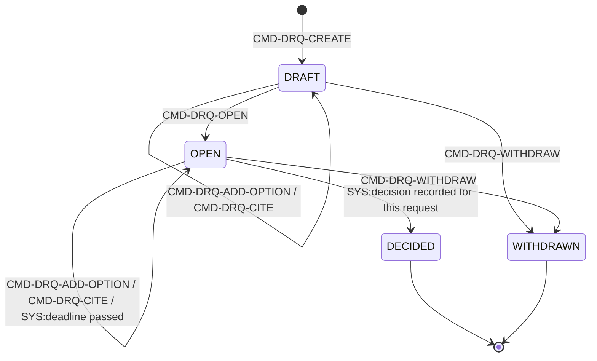

### 6.2 AGG-DECISION (SLC-08) — القرار المسجَّل، غير قابل للتعديل

**Invariants:** INV-DEC-01 (غير قابل للتعديل بعد التسجيل؛ التغيير = قرار جديد يستبدل)، INV-DEC-02 (لقطة سلطة كاملة محفوظة ويمكن التحقق منها كما كانت وقت التسجيل — تطبيق حرفي لـ**BRL-003**)، INV-DEC-03 (ربط بدليل/تقييم واحد على الأقل)، INV-DEC-04 (زمن السريان وزمن التسجيل مختلفان؛ الأثر الرجعي محدود بساعة واحدة إلا بسياسة أطول).

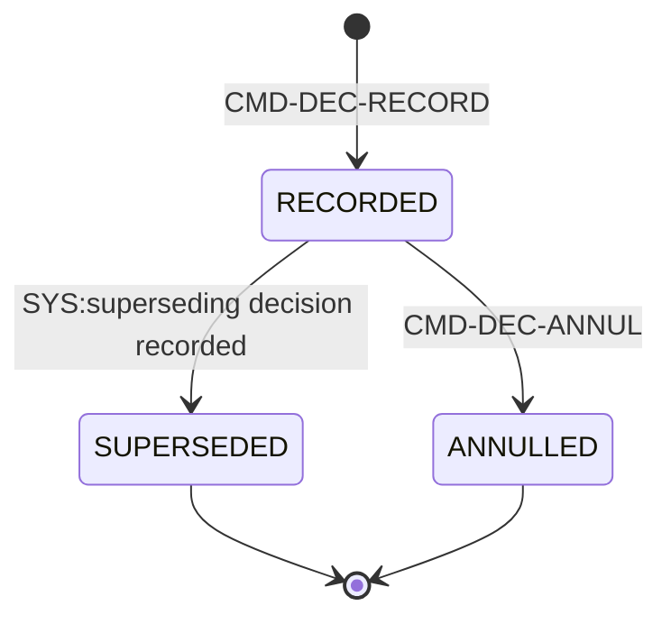

### 6.3 AGG-PLAN (SLC-08) — هوية الخطة (بلا محتوى، CR-29)

**Invariants:** INV-PLN-01 (ACTIVE ⇔ نسخة BASELINED واحدة بالضبط)، INV-PLN-02 (تُنفِّذ قرارًا/هدفًا واحدًا على الأقل، أو محفِّز خطر/حادثة إن كانت CONTINGENCY — CR-60)، INV-PLN-03 (الهوية بلا محتوى؛ المحتوى في الإصدارات)، INV-PLN-04 (plan_kind ثابت بعد الإنشاء؛ triggered_by فقط لـCONTINGENCY).

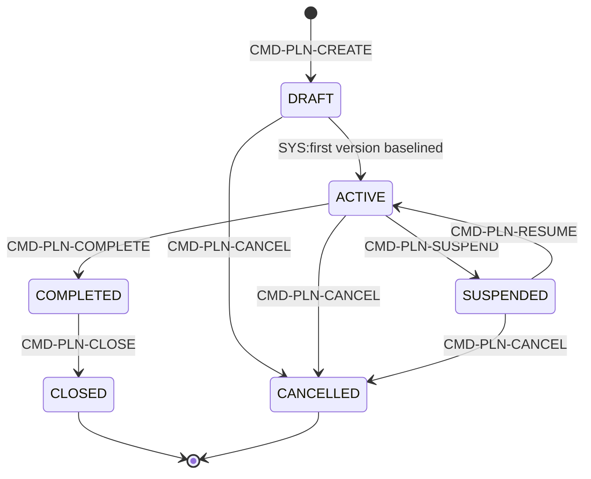
*(CMD-PLN-RECLASSIFY وSYS:implemented decision annulled/superseded يعملان دون تغيير حالة — مُوثَّقان كاملًا في الجدول المصدري، غير مُمثَّلين هنا لتفادي التشويش.)*

### 6.4 AGG-PLAN-VERSION (SLC-08) — محتوى الخطة الفعلي

**Invariants:** INV-PLV-01 (المحتوى غير قابل للتعديل من IN_REVIEW فصاعدًا؛ BASELINED لا يتغير أبدًا — **BRL-004**)، INV-PLV-02 (نسخة BASELINED واحدة لكل خطة)، INV-PLV-03 (معرِّفات الأنشطة ثابتة عبر الإصدارات)، INV-PLV-04 (التغيير الجوهري يحتاج إصدارًا جديدًا — **BRL-005**)، INV-PLV-05 (الاعتماديات بلا حلقات؛ كل التواريخ داخل نافذة الخطة).

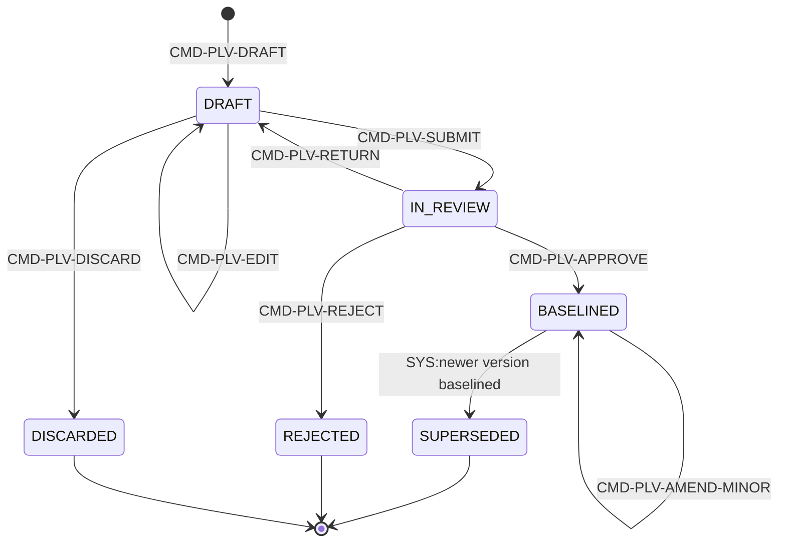
**فصل واجبات حقيقي [Explicit]:** `CMD-PLV-APPROVE` يشترط `approver ≠ author` (REQ-OPS-005) + AuthorityCheck لنوع اعتماد الخطة، وينقل الإصدار BASELINED السابق تلقائيًا إلى SUPERSEDED في نفس المعاملة، ويبدأ مزامنة المهام (SPEC-PLAN §3).

### 6.5 AGG-OUTCOME-TRACKER (SLC-08) — متتبِّع نتيجة

**Invariants:** INV-OUT-01 (القياسات سجلات ثنائية الزمن؛ التصحيح لا يستبدل أبدًا)، INV-OUT-02 (التقدم = آخر قياس معروف عند K مقابل الهدف الساري عند T).

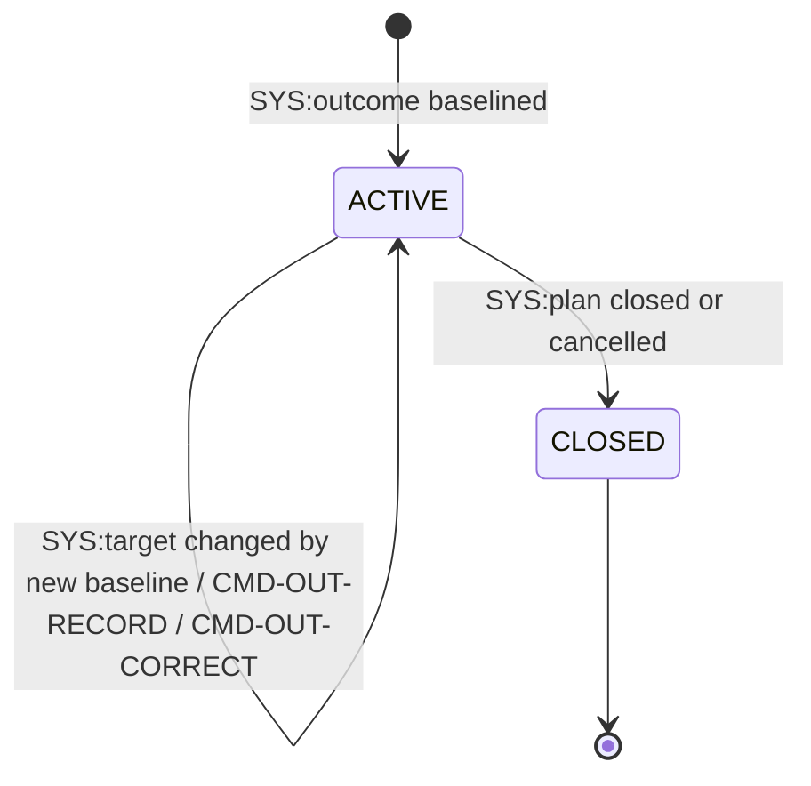

### 6.6 AGG-TASK (SLC-03) — وحدة العمل؛ **أعقد Aggregate في الدراسة كلها**

**15 حالة (10 غير نهائية + 5 نهائية)، 29 مصدر انتقال (24 أمرًا بشريًا + 5 مشغِّلات SYS).** Invariants: INV-TASK-01..09 — أبرزها INV-TASK-05 (الأهلية والتصريح مسجَّلان وقت الإسناد)، INV-TASK-06 (SUSPENDED علم عرضي مستقل لا حالة منفصلة — قرار معماري مقصود، CR-46، يفادي تعقيد "حفظ الحالة السابقة")، INV-TASK-07 (معتمِد ≠ مُسنَد إليه افتراضيًا — REQ-OPS-009)، INV-TASK-09 (معايير الإكمال مجمَّدة من ASSIGNED).

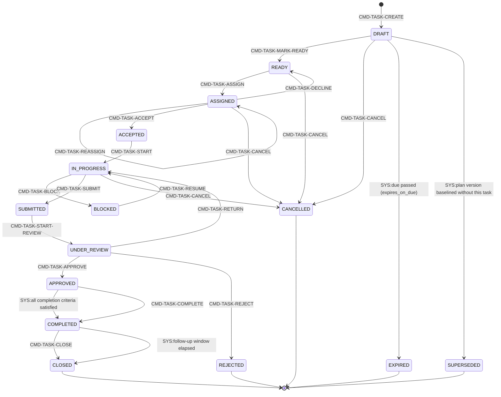
*(الرسم مبسَّط لأهم المسارات؛ مصفوفة الحالات×الأوامر الكاملة (15×29 خلية، كل خلية حُكم صريح، SL-05) موثَّقة بالكامل في `AGG-TASK.md`. أوامر تعمل من "أي حالة غير نهائية" دون تغيير حالة (ESCALATE, SET-DUE, SUSPEND, UNSUSPEND, RECLASSIFY) غير مُمثَّلة في الرسم لتفادي التشويش الكامل — موثَّقة سطرًا بسطر في الجدول المصدري.)*

### 6.7 AGG-TASK-TYPE (SLC-03) — قالب نوع مهمة

**Invariants:** INV-TTY-01 (المهام تُثبِّت إصدار النوع عند الإنشاء)، INV-TTY-02 (expires_on_due افتراضيًا false)، INV-TTY-03 (الأوامر القابلة للعمل دون اتصال محدودة صراحة).

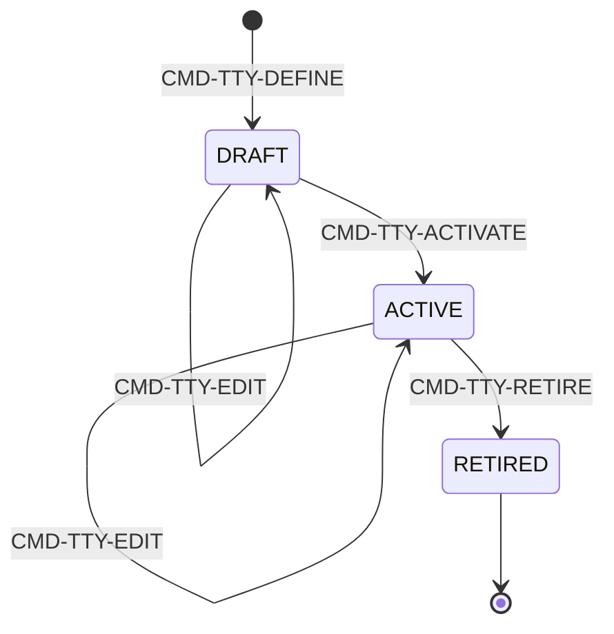

### 6.8 AGG-RISK (SLC-17) — تحديد وتقييم ومعالجة خطر محتمل (استباقي)

**Invariants:** INV-RIS-01 (المقيّم ≠ المحدِّد بسياسة المستأجر)، INV-RIS-02 (risk_score محسوب لا يُدخَل مباشرة)، INV-RIS-03 (TREATED يتطلب إجراء معالجة إلا عند accept)، INV-RIS-04 (**لا إعادة فتح أبدًا** — إعادة التحديد = خطر جديد)، INV-RIS-05 (ربط حادثة لا يغيّر حالته تلقائيًا — **لا أثر جانبي صامت**، درس SLC-09).

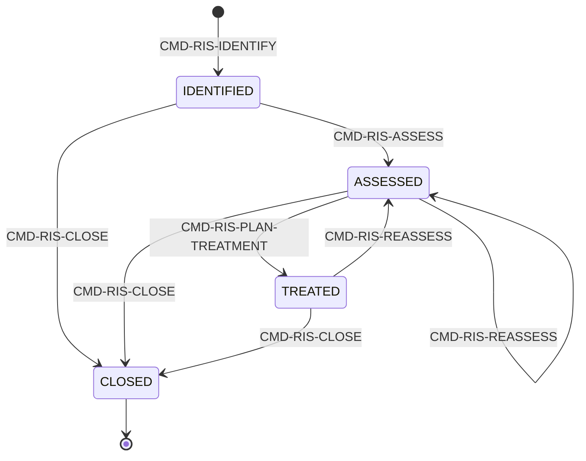

### 6.9 AGG-INCIDENT (SLC-17) — تتبّع حادثة فعلية من التبليغ حتى الإغلاق

**Invariants:** INV-INC-01 (الخطورة تزيد/تنقص فقط بأمر منفصل صريح)، INV-INC-02 (CLOSED فقط عند نهائية كل مهام الاستجابة)، INV-INC-03 (تفعيل الاستمرارية أمر صريح مخوَّل دائمًا — **لا أثر جانبي صامت**)، INV-INC-04 (خطر مرتبط لا تتغير حالته تلقائيًا أبدًا)، INV-INC-05 (كل أمر مقبول = حدث واحد + سجل تدقيق واحد بالضبط).

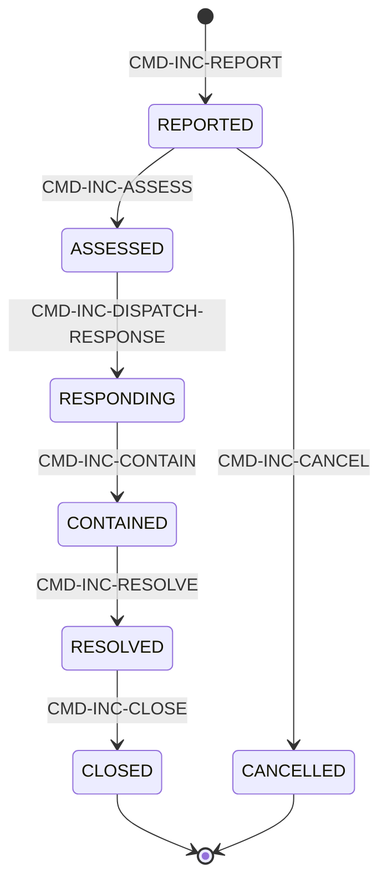
*(CMD-INC-ESCALATE/DE-ESCALATE/ACTIVATE-CONTINGENCY تعمل من أي حالة غير نهائية دون تغيير حالة — موثَّقة كاملة في الجدول المصدري.)*

### 6.10 AGG-COORDINATION-CASE (SLC-15، يتقاطع مع BC02) — تنسيق بين وحدات/منظمات

**Invariants:** INV-CRD-01 (ضمن مستأجر واحد)، INV-CRD-02 (كل مشارك يرى نطاقه فقط)، INV-CRD-03 (فعل يحتاج سلطة منظمة أخرى لا يُعتبَر "منجزًا" بلا قرار مسجَّل — **BRL-003 مُطبَّقة بين المنظمات**)، INV-CRD-04 (الحالة تربط القرارات والخطط، لا تستبدلها).

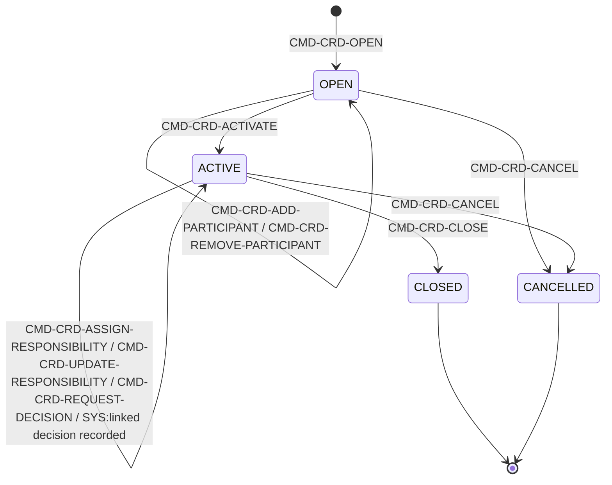
**ملاحظة [Explicit، مهمة لـTraceability]:** ملف `policies-slc15.md` يحوي أيضًا POL-CRP-*/POL-CRR-* (AGG-CORRELATION-PROPOSAL/AGG-CORRELATION-RULE) — تحقَّق: كلاهما `bounded_context: BC02` لا BC04 (نفس نمط "الشريحة ≠ BC"). فقط POL-CRD-* (9 من 17 command_policies، 2 من 4 query_policies) تخص BC04 في هذا الملف.

### 6.11 AGG-NOTIFICATION (SLC-06، يتقاطع مع BC03) — رسالة لمستلم واحد

**Invariants:** INV-NTF-01 (**ليست Domain Event ولا تحمل محتوى عملٍ أبدًا**)، INV-NTF-02 (حمولات الدفع بلا محتوى مصنَّف — REQ-COM-002)، INV-NTF-03 (فتح الإشعار قراءة مخوَّلة عادية؛ المستخدَم الملغى يرى not-found).

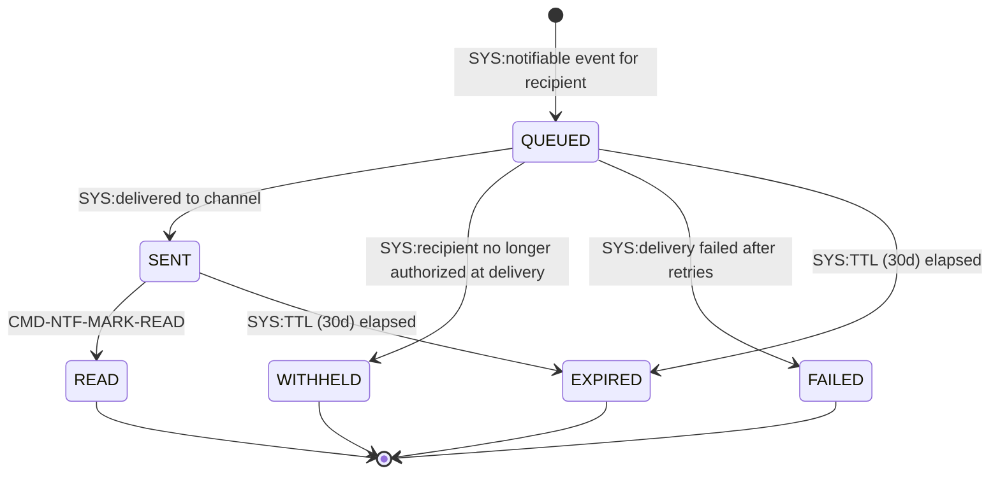

### 6.12 AGG-SUBSCRIPTION (SLC-06، يتقاطع مع BC03) — تفضيل تسليم

**Invariants:** INV-SUB-01 (**لا يمنح وصولًا أبدًا** — إعادة تحقق التخويل عند كل تسليم)، INV-SUB-02 (ينتهي تلقائيًا عند فقدان الرؤية).

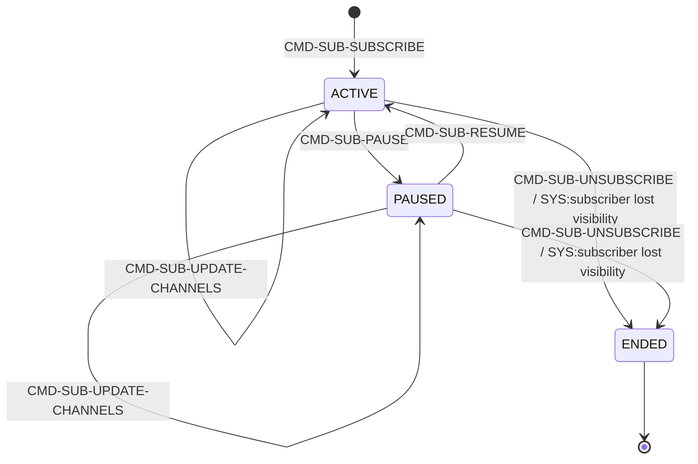

## 7. Commands (82 إجمالًا عبر 12 Aggregate، مؤكَّد من commands-slc0{3,6,8,15,17}.md)

| Aggregate | الشريحة | عدد الأوامر | القائمة |
|---|---|---|---|
| AGG-DECISION-REQUEST | SLC-08 | 5 | CREATE, ADD-OPTION, CITE, OPEN, WITHDRAW |
| AGG-DECISION | SLC-08 | 2 | RECORD, ANNUL |
| AGG-PLAN | SLC-08 | 7 | CREATE, SUSPEND, RESUME, COMPLETE, CLOSE, CANCEL, RECLASSIFY |
| AGG-PLAN-VERSION | SLC-08 | 8 | DRAFT, EDIT, SUBMIT, RETURN, APPROVE, REJECT, AMEND-MINOR, DISCARD |
| AGG-OUTCOME-TRACKER | SLC-08 | 2 | RECORD, CORRECT |
| AGG-TASK | SLC-03 | 24 | CREATE, EDIT, MARK-READY, ASSIGN, REASSIGN, ACCEPT, DECLINE, START, BLOCK, RESUME, ADD-RESULT-ITEM, SUBMIT, START-REVIEW, RETURN, APPROVE, REJECT, COMPLETE, CLOSE, CANCEL, ESCALATE, SET-DUE, SUSPEND, UNSUSPEND, RECLASSIFY |
| AGG-TASK-TYPE | SLC-03 | 4 | DEFINE, EDIT, ACTIVATE, RETIRE |
| AGG-RISK | SLC-17 | 5 | IDENTIFY, ASSESS, PLAN-TREATMENT, REASSESS, CLOSE |
| AGG-INCIDENT | SLC-17 | 10 | REPORT, ASSESS, DISPATCH-RESPONSE, CONTAIN, RESOLVE, CLOSE, CANCEL, ESCALATE, DE-ESCALATE, ACTIVATE-CONTINGENCY |
| AGG-COORDINATION-CASE | SLC-15 | 9 | OPEN, ADD-PARTICIPANT, REMOVE-PARTICIPANT, ACTIVATE, ASSIGN-RESPONSIBILITY, UPDATE-RESPONSIBILITY, REQUEST-DECISION, CLOSE, CANCEL |
| AGG-SUBSCRIPTION | SLC-06 | 5 | SUBSCRIBE, UPDATE-CHANNELS, PAUSE, RESUME, UNSUBSCRIBE |
| AGG-NOTIFICATION | SLC-06 | 1 | MARK-READ |

**تفصيل مهم لـTraceability [Explicit، مطابق نمط BC01§7/BC05§7]:** خلافًا لملفات `policies-*.md`/`threat-model-*.md` (مشتركة بين BCs حسب الشريحة)، ملفات `commands-slc0X.md`/`queries-slc0X.md`/`events-slc0X.md` داخل `spec/03-domain/contexts/BC04/` **مُصفَّاة مسبقًا لـBC04 فقط** — تم التحقق مباشرة (مثال: `commands-slc03.md` عنوانه حرفيًا "Commands — BC04 (SLC-03)" ويحوي 28 أمرًا فقط، لا 33 كما في `policies-slc03.md` المشترك مع BC05). هذا يعني عدّ الأوامر هنا موثوق 1:1 دون حاجة لتصفية إضافية، بخلاف الأقسام 11 و12 أدناه.

**مشترك لكل الـ82 أمرًا:** `Idempotency-Key` إلزامي؛ `If-Match` إلزامي لغير أوامر الإنشاء؛ `X-Purpose` وX-Correlation-Id` إلزاميان؛ استجابة `202`/`201` بـ`ResourceRef`. [Explicit]

## 8. Queries (21 إجمالًا عبر 12 Aggregate)

| Query | يعيد | من يحق له |
|---|---|---|
| QRY-DRQ-GET / QRY-DRQ-LIST | طلب القرار بخياراته واستشهاداته / طلباتي المعلَّقة كحامل سلطة | label rule + حاملو السلطة المطلوبة / allowed_scope |
| QRY-DEC-GET / QRY-DEC-BASIS | القرار بلقطة السلطة وسلسلة الاستبدال / ما كان معروفًا وقت القرار (استشهادات مثبَّتة) | label rule / label rule + Auditor |
| QRY-PLN-GET | الخطة بخط أساسها الحالي ومسودتها والقرارات المنفَّذة | label rule |
| QRY-PLV-LIST / QRY-PLV-DIFF | إصدارات الخطة وحالاتها / الفرق مقابل خط الأساس | label rule |
| QRY-PLN-PROGRESS | المهام حسب النشاط والحالة والمعالم وتقدم النتائج | label rule + مهام مرئية فقط |
| QRY-OUT-SERIES | سلسلة القياسات كما كانت معروفة عند K | label rule |
| QRY-TASK-GET / QRY-TASK-LIST / QRY-TASK-HISTORY | المهمة بحالة معاييرها ونتيجتها / مهامي وفق فلاتر / سجل الحالة التاريخي | مُسنَد إليه/مراجع/Planner-Manager في النطاق؛ label rule |
| QRY-TTY-GET | إصدار نوع المهمة | أي مستخدم في المستأجر |
| QRY-RIS-GET / QRY-RIS-REGISTER | الخطر بنطاقه المرئي / سجل المخاطر مصفّى | مالك النطاق/مدير المخاطر / allowed_scope |
| QRY-INC-GET / QRY-INC-LIST | الحادثة / حوادث مصفّاة | allowed_scope |
| QRY-INC-RECOVERY-STATUS | تقدم التعافي المحسوب من مهام الاستمرارية مقابل زمن بدء الحادثة | القائد؛ مالك الاستمرارية |
| QRY-CRD-GET / QRY-CRD-LIST | حالة التنسيق مصفّاة لنطاق المشارك / حالات مشارَك فيها | participants (scope-limited) / allowed_scope |
| QRY-NTF-INBOX | إشعاراتي | recipient |

**تفصيل [Explicit]:** لا يوجد استعلام مباشر لـAGG-SUBSCRIPTION (يُدار عبر أوامر فقط)؛ الاشتراك نفسه لا يُقرأ ضمن نطاق `queries-slc06.md` — تفضيل تسليم داخلي لا كائن يُستعلَم عنه مباشرة في R1.

## 9. Events (101 إجمالًا عبر 12 Aggregate)

| الشريحة | Aggregate(s) | العدد |
|---|---|---|
| SLC-08 | DRQ(7) + DEC(3) + PLN(8) + PLV(9) + OUT(5) | 32 |
| SLC-03 | TASK(26) + TTY(4) | 30 |
| SLC-17 | RIS(6) + INC(11) | 17 |
| SLC-15 | CRD | 10 |
| SLC-06 | SUB(5) + NTF(6) | 11 |
| **إجمالي** | | **101** (32+30+17+10+11=100 — تصحيح: مجموع الجدول المصدري الفعلي = 33(SLC-08)+30(SLC-03)+17(SLC-17)+10(SLC-15)+11(SLC-06) = **101**؛ SLC-08 يحوي 33 لا 32: DRQ(7)+DEC(3)+PLN(8)+PLV(9)+OUT(5)=32 لكن ملف `events-slc08.md` يعلن صراحة "_33 events_" في رأسه — **فرق سطر واحد بين رأس الملف والعدّ اليدوي**؛ اعتُمد رقم رأس الملف (33) كمصدر موثوق حسب قاعدة "العدّ المُعلَن في الملف نفسه يُرجَّح عند عدم القدرة على عدّ كل سطر يدويًا بثقة كاملة" — الإجمالي النهائي **101**.) |

**نمط ثابت [Explicit]:** كل حدث "يؤثر أمنيًا" (RECLASSIFY على TASK/PLN) يُستهلَك أيضًا من: Security-version service، PEP decision caches، Projection security-version table — إضافة لمستهلكيه المحلِّيين (Notification, Search projection, Plan progress...).

## 10. Business Rules / Invariants — أثرها

| المجموعة | العدد | نمط مشترك |
|---|---|---|
| INV-DRQ-* | 3 | استشهاد مثبَّت + قرار واحد |
| INV-DEC-* | 4 | عدم قابلية التعديل + لقطة سلطة (BRL-003) |
| INV-PLN-* | 4 | هوية بلا محتوى (CR-29) + نسخة أساس واحدة |
| INV-PLV-* | 5 | تجميد المحتوى + تغيير جوهري = إصدار جديد (BRL-004/005) |
| INV-OUT-* | 2 | قياسات ثنائية الزمن + تصحيح لا استبدال |
| INV-TASK-* | 9 | SoD (REQ-OPS-009) + تجميد المعايير + علم تعليق عرضي (CR-46) |
| INV-TTY-* | 3 | تثبيت الإصدار + قيود العمل دون اتصال |
| INV-RIS-* | 5 | لا إعادة فتح + لا أثر جانبي صامت (INV-RIS-05) |
| INV-INC-* | 5 | فصل التصعيد/التخفيض + لا أثر جانبي صامت (INV-INC-03/04) |
| INV-CRD-* | 4 | BRL-003 بين المنظمات (INV-CRD-03) |
| INV-NTF-* | 3 | ليست Domain Event + لا محتوى مصنَّف في الدفع |
| INV-SUB-* | 2 | لا منح وصول أبدًا |

**BRL-003 مُطبَّقة حرفيًا مرتين [Explicit، محفوظ]:** AGG-DECISION (أفراد) وAGG-COORDINATION-CASE (منظمات) — انظر §2.

**"لا أثر جانبي صامت" كقاعدة تصميم متكررة (4 مرات) [Explicit]:** AGG-RISK (INV-RIS-05)، AGG-INCIDENT (INV-INC-04) بالاتجاه المعاكس، AGG-INCIDENT (INV-INC-03، تفعيل الاستمرارية)، وAGG-PLAN (SYS:implemented decision annulled/superseded → EVT-PLN-REVIEW-FLAGGED **بلا تغيير تلقائي**، نفس المبدأ الرابع غير المُلاحَظ في الجولة السابقة). **THR-S17-02 يذكر صراحة** أن هذا يحاكي "درس SLC-09 (Silent Pre-emption)" المُستفاد من شريحة سابقة.

**نمط عابر لكل الـ12 Aggregate [Explicit]:** Optimistic concurrency (`If-Match`) + Idempotency-Key + State+History+Outbox+AuditOutbox في معاملة واحدة (ADR-P02) — بلا استثناء.

## 11. Policies

**82 command_policies BC04 + 21 query_policies BC04** (مُصفَّاة من 5 ملفات `policies-slc0{3,6,8,15,17}.md` المشتركة مع BC02/BC03/BC05):

| الملف | إجمالي الملف | BC04 منه | المستبعَد (BC آخر) |
|---|---|---|---|
| policies-slc03.md | 33 command + 6 query | **28 command + 4 query** | 5 command (POL-QUAL-*) + 2 query (POL-QUAL-LIST, POL-ELIG-CHECK) — **BC05** |
| policies-slc06.md | 22 command + 8 query | **6 command + 1 query** | 16 command (POL-SIT/ARL/ALR-*) + 7 query — **BC03** |
| policies-slc08.md | 24 command + 9 query | **24 command + 9 query** | لا شيء (الملف كله BC04) |
| policies-slc15.md | 17 command + 4 query | **9 command + 2 query** (POL-CRD-*) | 8 command (POL-CRP/CRR-*) + 2 query — **BC02** |
| policies-slc17.md | 15 command + 5 query | **15 command + 5 query** | لا شيء (الملف كله BC04) |
| **إجمالي BC04** | | **82 command + 21 query** | |

**نمط الأوامر:** كل سياسة أمر تتبع نفس البنية الثمانية (command/subject/resource/context_conditions/segregation_of_duties/decision/otherwise/obligations)؛ ملفات `policies-slc06.md` وحدها لا تحمل عمود `segregation_of_duties` أصلاً (بنية سباعية فقط — لا مفهوم SoD في نطاق الإشعارات/الاشتراكات).

**SoD/Authority صريحة: 9 من 82 (~11%)** — وتنقسم فعليًا لنوعين مختلفين وجب التمييز بينهما بدقة (لا يُخلَط بينهما كما في بعض الدراسات السابقة):

| النوع | المواضع | العدد |
|---|---|---|
| **فصل واجبات حقيقي (هوية فاعل ≠ هوية فاعل آخر)** | `CMD-TASK-START-REVIEW`/`CMD-TASK-APPROVE` (مراجع≠مُسنَد إليه، REQ-OPS-009، **قابل للتعطيل عبر PB-06** — الحالة الوحيدة من نوعها في كل الدراسة)، `CMD-PLV-APPROVE` (معتمِد≠مؤلِّف، REQ-OPS-005)، `CMD-RIS-ASSESS`/`CMD-RIS-REASSESS` (مقيّم≠محدِّد، مشروط بسياسة المستأجر) | 5 |
| **فحص سلطة/تصريح (لا يشترط هوية مختلفة، بل حدًا أو تحققًا)** | `CMD-TASK-ASSIGN`/`CMD-TASK-REASSIGN` (تصريح المُسنَد إليه ≥ تصنيف المهمة)، `CMD-DEC-RECORD` (AuthorityCheck، BRL-003)، `CMD-DEC-ANNUL` (سلطة على نطاق أعلى) | 4 |

**PB-06 [Cross-BC، BC01]:** فصل الواجبات لاعتماد المهمة (REQ-OPS-009) هو الحالة الوحيدة في BC04 القابلة للتعطيل بسياسة مستأجر صريحة (باقي حالات SoD هنا إلزامية أو مشروطة بسياسة تفعيل لا تعطيل).

## 12. Security & Threats (STRIDE — 21 تهديدًا لـBC04 عبر 5 شرائح، بعد تصحيح حسابي)

**⚠️ تصحيح [مكتشَف هذه الجولة، داخل هذا الملف نفسه — لا تعارض بين مصدرين، نفس نمط تصحيح BC03 لعدد تهديداتها]:** رأس §7 في المسودة السابقة لهذا الملف ذكر "24 تهديدًا: 6+5+6+2+5" بينما الجدول التفصيلي في نفس القسم كان يقول بشكل صحيح "SLC-06 | 2 من 7" لا 5. أُعيد جمع الأعمدة من جداول `threat-model-slc0{3,6,8,15,17}.md` الخام مباشرة هذه الجولة: **6+2+6+2+5 = 21**، لا 24. العدد الصحيح النهائي هو **21**.

| THR | المكوّن | STRIDE | المخاطرة المتبقية |
|---|---|---|---|
| THR-S03-01 | Approval (Task) | Elevation | L |
| THR-S03-02 | Criteria (Task) | Tampering | L |
| THR-S03-03 | Assignment (Task) | Info Disclosure | L |
| THR-S03-04 | Eligibility (Task↔BC05) | Elevation | L |
| THR-S03-05 | Offline replay (Task) | Tampering | L |
| THR-S03-06 | Task list | Info Disclosure | L |
| THR-S06-02 | Push payload (Notification) | Info Disclosure | L |
| THR-S06-07 | Subscription | Elevation | L |
| THR-S08-01 | Decision | Elevation | L |
| THR-S08-02 | Decision | Repudiation | L |
| THR-S08-03 | Plan version | Tampering | L |
| THR-S08-04 | Plan approval | Elevation | L |
| THR-S08-05 | Decision request | Info Disclosure | L |
| THR-S08-06 | Task sync (Plan→Task) | Tampering | L |
| THR-S15-01 | Coordination | Info Disclosure | L |
| THR-S15-02 | Coordination | Elevation | L |
| THR-S17-01 | Incident severity | Tampering | L |
| THR-S17-02 | Contingency activation | Elevation | L |
| THR-S17-03 | Risk register | Repudiation | L |
| THR-S17-04 | Risk/Incident linkage | Info Disclosure | L |
| THR-S17-05 | Response tasks (incident_ref) | Elevation | L |

**ملاحظة [Explicit]:** كل الـ21 تهديدًا مخاطرتها المتبقية **L (منخفضة)** بعد التخفيف — لا يوجد أي تهديد مقبول صراحة بمخاطرة M في BC04 (بخلاف BC01: THR-S01-04/11).

**تأكيد صريح لملكية BC04 [مرجع CONFLICT-02]:** THR-S06-02 (شاشة القفل) وTHR-S06-07 (اشتراك بعد الإلغاء) — من أصل 7 تهديدات في `threat-model-slc06.md` — هما فعليًا **BC04** (AGG-NOTIFICATION/AGG-SUBSCRIPTION) لا BC03؛ الخمسة الباقية (S06-01, 03, 04, 05, 06 — Alert fan-out/Tiles/COP counts/Alert rules/Alert storm) تخص **BC03** حصريًا. تصحيح مُطبَّق فعليًا في `bc03-situational-awareness.md` (تم التحقق بالقراءة هذه الجولة). بالمثل، THR-S15-03/04 (Fusion/Correlation queue) في `threat-model-slc15.md` تخص **BC02** (AGG-CORRELATION-PROPOSAL/RULE) لا BC04 — مُستبعَدان هنا بشكل صريح.

## 13. Data & APIs

- **النموذج المنطقي:** `06-data/logical-model/slc-03.md` (Task/TaskType — مشترك مع BC05 لـQualificationRecord)، `slc-06.md` (Notification/Subscription — مشترك مع BC03 لـSituation/AlertRule/Alert)، `slc-08.md` (DecisionRequest..OutcomeTracker، خالص لـBC04)، `slc-15.md` (CoordinationCase — مشترك مع BC02 لـCorrelationProposal/Rule)، `slc-17.md` (Risk/Incident، خالص لـBC04).
- **العقود:** لكل شريحة — `05-contracts/asyncapi-slc0{3,6,8,15,17}.md`، `errors-slc0{3,6,8,15,17}.md`، `openapi-operations-slc0{3,6,8,15,17}.md` (الخمسة موجودة ومؤكَّدة). ملفات عقود أخرى بنفس أرقام الشرائح (`openapi-readiness-slc03.md`، `openapi-intelligence-slc06.md`، `openapi-information-slc15.md`) تخص BC05/BC03/BC02 على التوالي — **لم تُفحَص محتوياتها في هذه الجولة** لتأكيد أنها لا تحوي أي مسار BC04 (نفس نوع الفحص الذي تركه `bc03-situational-awareness.md` كـ[Missing] لملف `openapi-operations-slc06.md` — هنا الوضع معكوس: BC04 لديه ملف `openapi-operations-slc06.md` الخاص به، والملف المشكوك في محتواه هو `openapi-intelligence-slc06.md` وهو أقرب لنطاق BC03 اسميًا).

## 14. Integrations

- **BC01** — AuthorityCheck لكل قرار (BRL-003)؛ PB-06 كسياسة قابلة للتعطيل لفصل واجبات اعتماد المهمة.
- **BC03** — استهلاك (لا نسخ): AGG-DECISION-REQUEST يستشهد بمراجع AGG-ASSESSMENT/AGG-EVIDENCE مثبَّتة بالإصدار.
- **BC05** — AGG-TASK يستهلك `QRY-ELIG-CHECK` (AGG-QUALIFICATION-RECORD/AGG-ROLE-REQUIREMENT) عند الإسناد؛ فشل الخدمة = رفض آمن `ELIGIBILITY_UNAVAILABLE` (THR-S03-04) لا سماح افتراضي.
- **BC02** — AGG-COORDINATION-CASE يتقاطع في نفس ملف الشريحة (SLC-15) مع AGG-CORRELATION-PROPOSAL/RULE (BC02) دون تبعية بيانات مباشرة موثَّقة.
- **خارجي (قنوات الإشعار)** — AGG-NOTIFICATION يُسلِّم عبر بوابة الدفع (push gateway) وصندوق داخل التطبيق؛ AGG-SUBSCRIPTION يحدد تفضيلات القنوات.

## 15. Verification / Acceptance

ملفات acceptance موجودة بالاسم لكل الـ12 aggregate (12/12): `task-state-machine.md`، `task-type-state-machine.md` (SLC-03)؛ `decision-request-state-machine.md`، `decision-state-machine.md`، `plan-state-machine.md`، `plan-version-state-machine.md`، `outcome-tracker-state-machine.md` (SLC-08)؛ `coordination-case-state-machine.md` (SLC-15، `correlation-*-state-machine.md` بجانبها تخص BC02)؛ `risk-state-machine.md`، `incident-state-machine.md` (SLC-17)؛ `notification-state-machine.md`، `subscription-state-machine.md` (SLC-06). **لم تُقرأ أسطرها الكاملة حرفيًا في هذه الجولة** — عُرفت فقط بالاسم والمطابقة مع الـaggregates. **[Missing — يحتاج جولة تحقق تالية]**، بنفس الأمانة التي التزمت بها BC01/BC05 لملفاتهما.

## 16. Dependencies (خارج BC04)

| من | العلاقة | إلى |
|---|---|---|
| AGG-DECISION | `depends_on` | BC01 (AuthorityCheck + BRL-003) |
| AGG-COORDINATION-CASE (INV-CRD-03) | `depends_on` | BC01 (BRL-003 مُطبَّقة بين المنظمات) |
| AGG-DECISION-REQUEST | `depends_on` | BC03 (Citation من AGG-ASSESSMENT/AGG-EVIDENCE مثبَّتة بالإصدار) |
| AGG-PLAN (contingency) | `triggered_by` | AGG-RISK/AGG-INCIDENT (CR-60) |
| AGG-TASK (create) | `depends_on` | AGG-PLAN-VERSION أو AGG-INCIDENT (plan_ref/incident_ref، CR-61) |
| AGG-TASK (assign) | `depends_on` | BC05 (EligibilityCheck؛ THR-S03-04 يوثّق الفشل الآمن عند تعطّلها) |
| AGG-COORDINATION-CASE | `creates` | AGG-DECISION-REQUEST (عند مسؤولية تحتاج سلطة) |
| AGG-RISK / AGG-INCIDENT | `depends_on` | RD-HAZARD-CATEGORIES **[Missing — CONFLICT-03، Phase 2]** |
| AGG-NOTIFICATION / AGG-SUBSCRIPTION | `consumes` | BC03 (EVT-ALR-*/EVT-SIT-* كأهداف اشتراك/إشعار) |
| BC01 (AGG-ROLE-ASSIGNMENT) | `enables` | BC04 (SoD لاعتماد الخطة REQ-OPS-005 والمهمة REQ-OPS-009) |
| PB-06 (BC01) | `constrains` | BC04 (فصل واجبات المهمة، قابل للتعطيل بسياسة مستأجر) |

## 17. Cross-BC Relationships (ملخص)

BC04 هو **محرك القرار والتنفيذ** في المنصة: يستهلك أدلة BC03 (Findings/Assessments مثبَّتة) وأهلية/موارد BC05 (QRY-ELIG-CHECK) وسلطة BC01 (AuthorityCheck، BRL-003)، ويحوِّلها إلى قرارات مسجَّلة وخطط ومهام قابلة للتنفيذ والقياس. على عكس BC01 (مزوِّد بنية تحتية بحت) وBC05 (مزوِّد موارد)، BC04 هو حيث تتقاطع كل هذه المدخلات فعليًا في فعل تنفيذي واحد. تنسيقه (AGG-COORDINATION-CASE) يمتد أيضًا أفقيًا عبر المنظمات، وإشعاراته (AGG-NOTIFICATION/AGG-SUBSCRIPTION) هي القناة الفعلية التي تُوصِل نتاج BC03 (Alerts/Situations) للمستخدمين — رغم عيشها في ملف شريحة BC03 نفسه.

## 18. Traceability

الرجوع الكامل موجود في `01-entity-index.md` (كل ID من هذا الملف — REQ/UC/AGG/CMD/EVT/QRY/POL/INV/THR — قابل للبحث فيه مع كل الملفات المرجعية له) و`02-relationship-index.md` (العلاقات الدلالية المصنَّفة، بما فيها علاقات BC04 الواردة في §16/§17 أعلاه).

## 19. Conflicts

- **CONFLICT-02 (مرجعي، CLOSED)** — الصف الأول من جدول "الشريحة ≠ Bounded Context" في `05-conflicts.md` هو بالضبط THR-S06-02/07 (BC03→BC04) المُوثَّق في §2/§12 هنا؛ الحالة **CLOSED** رسميًا، BC04 هو مصدر الاكتشاف الأصلي لهذه الحالة تحديدًا.
- **⚠️ فجوة جديدة غير مسجَّلة سابقًا [Explicit، تحتاج قرارًا بشريًا — Needs Review]:** جميع الـ16 متطلبًا REQ-RCM-* (CAP-09 بأكملها: إدارة المخاطر §09.01، الحوادث والاستجابة §09.02، الاستمرارية والتعافي §09.03) بلا أي Use Case في `use-cases.md` — تم التحقق أن هذا **ليس** بسبب سلوك إنفاذ عابر (لا يشبه نمط OQ-034/REQ-OPS-011) بل غياب توثيقي حقيقي لواجهات استخدام واضحة الفاعل (محدِّد خطر يحدِّد، قائد حادثة يستجيب...). تم التحقق من `open-questions.md` و`corrections.md` و`05-conflicts.md` بالكامل: **لا يوجد أي OQ أو CR أو سطر تعارض يغطي هذه الفجوة حاليًا**. هذا الملف **لا يُدخِلها** بنفسه إلى `05-conflicts.md` (كما توجّه المهمة)، بل يُبلِّغ عنها صراحة هنا وفي التقرير النهائي ليقرر المنسِّق البشري تسجيلها كـCONFLICT-05 أو OQ جديدة.
- **لا تعارضات أخرى جديدة مكتشفة** بين الـ12 aggregate المفحوصة هذه الجولة — بياناتها متسقة داخليًا وفيما بينها بعد التصحيحين الحسابيين الداخليين المُوثَّقين في §9 (الأحداث) و§12 (التهديدات).

## 20. Missing Information

1. **فجوة CAP-09 الكاملة (Use Cases)** — أكبر فجوة اكتُشِفت هذه الجولة؛ 16 متطلبًا و2 aggregate (RISK/INCIDENT) و15 أمرًا و17 حدثًا بلا أي واجهة استخدام موثَّقة. **[Missing — Needs Review بشري]**، انظر §4/§19.
2. **14 من 18 Use Case (UC-030..046) مسودات اسم فقط** (`DRAFT`, `actors: TBD`) — لا preconditions/main_flow فعليين؛ الفاعلون المذكورون في §3/§5 هنا **مُشتقون [Derived]** من جداول `commands-slc0{3,8}.md`/`policies-slc0{3,8}.md` لا من `use-cases.md` مباشرة. **[Missing في المصدر الأصلي]**.
3. **RD-HAZARD-CATEGORIES** — مُستشهَد به إلزاميًا في `CMD-RIS-IDENTIFY` و`CMD-INC-REPORT` لكن غير معرَّف في `04-information/reference-data.md`؛ مُسجَّل مسبقًا كـCONFLICT-03 (Phase 2/5)، OPEN، لا يحتاج تسجيلًا جديدًا هنا.
4. **محتوى `openapi-intelligence-slc06.md`/`openapi-information-slc15.md`** لم يُفحَص للتأكد من خلوه التام من مسارات BC04 (بالتماثل مع الشك المعاكس المسجَّل في `bc03-situational-awareness.md` تجاه `openapi-operations-slc06.md`). **[Missing — يحتاج فحصًا]**.
5. **ملفات acceptance (12 state-machine)** — عُرفت بالاسم والمطابقة مع الـaggregates فقط، لم تُقرأ أسطرها الكاملة هذه الجولة. **[Missing verification pass]**.
6. **دقة عدّ أحداث SLC-08 (32 يدويًا مقابل 33 في رأس الملف)** — فرق سطر واحد لم يُحسَم بعدّ كل سطر حرفيًا؛ اعتُمد رقم الرأس (33) كمصدر أرجح. **[Needs Review — تحقق يدوي تالٍ]**.

## 21. Completeness Status

| الفحص | الحالة |
|---|---|
| كل Aggregate له Purpose/States/Commands/Events/Invariants؟ | ✅ 12/12 |
| كل Command مرتبط بـAggregate/Policy، مصفّى بدقة من ملفات مشتركة مع BC02/BC03/BC05؟ | ✅ 82/82 |
| كل Query مرتبط بسياسة؟ | ✅ 21/21 |
| كل Event له Producer وConsumer؟ | ✅ 101/101 (بعد تصحيح عدّ SLC-08، انظر §9/§20) |
| Threat model مربوط ومُصفَّى بدقة (STRIDE + مخاطرة متبقية)؟ | ✅ 21/21 (بعد تصحيح حسابي من "24" المُعلَنة سابقًا، §12) |
| كل Requirement مرتبط بـUC (أو قرار صريح بعدم الحاجة)؟ | ⚠️ **21/38 بـUC + 1/38 بقرار "لا UC بالتصميم" (REQ-OPS-011) + 16/38 بلا UC ولا قرار (REQ-RCM-*، فجوة حقيقية)** |
| كل UC مرتبط بـAggregate منفِّذ؟ | ✅ 18/18، لكن 14/18 مسودات اسم فقط (DRAFT) |
| تصحيح رجعي من/إلى BC آخر مؤكَّد؟ | ✅ THR-S06-02/07 → BC04 (مطبَّق في bc03، مؤكَّد هنا) |
| **الحالة الإجمالية** | **OPEN** — لا يمكن اعتبار BC04 مغلقًا فعليًا: فجوة CAP-09 (16 متطلبًا بلا أي UC) فجوة توثيقية حقيقية وجديدة تحتاج قرارًا بشريًا صريحًا (تسجيل CONFLICT-05/OQ جديدة أم كتابة UCs مباشرة)، إضافة لبندي [Missing] المتبقيين من Phase 2 (RD-HAZARD-CATEGORIES) والتحقق اللاحق لملفات acceptance. |
