# BC05 — الموارد والجاهزية (Resources, Logistics & Readiness)

## المستوى الأول — شرح مبسّط

هذا الـBounded Context يدير كل ما هو "مادي وملموس وبشري" في الجاهزية التشغيلية: الأصول (معدات، مركبات) وحالتها وصيانتها، مجمعات موارد قابلة للقياس (وقود، ذخيرة...) وتخصيصها بأولوية عند التنافس، طلبات الإمداد وشحنها الفعلي، كفاءات وتأهيل الأفراد، وأخيرًا تمارين تدريبية كاملة (سيناريو → تمرين → محاكاة → تقييم) لقياس الجاهزية الفعلية لا الافتراضية. هذا الـBC هو "الركيزة المادية/البشرية" التي تستهلكها BC04 (إدارة المهام) كل مرة تحتاج للتحقق: هل يوجد أصل متاح؟ هل الشخص مؤهل؟ هل توجد سعة كافية من المورد؟

## المستوى الثاني — التفاصيل الهندسية

---

## 1. الهوية (Identity)

- **Bounded Context:** BC05
- **Domain:** DOM-14، DOM-15، DOM-16، DOM-18، DOM-19 [Explicit — capabilities.md]
- **Parent Capability:** CAP-08 (الموارد والجاهزية)
- **Outcome:** OUT-05
- **Sub-capabilities:**

| Sub-capability | الاسم | Release |
|---|---|---|
| CAP-08.01 | إدارة الأصول | R2 |
| CAP-08.02 | تخصيص الموارد | R2 |
| CAP-08.03 | الإمداد | R3 |
| CAP-08.04 | الكفاءة والأهلية | R1 (الأهلية فقط) |
| CAP-08.05 | التدريب والتمارين | R3 |

## 2. المعنى التجاري (Business Meaning)

**Definition:** إدارة الأصول المادية وحيازتها وصيانتها، مجمعات الموارد القابلة للقياس وتخصيصها التنافسي، طلبات الإمداد وشحنها الفعلي، سجلات الكفاءة والتأهيل وفحص الأهلية، ومتطلبات الأدوار والتمارين التدريبية الكاملة (سيناريو→تمرين→محاكاة→تقييم). [Explicit]

**Purpose / Business Objective:** OUT-05 — ضمان أن القرار التشغيلي (BC04) يُبنى دائمًا على معرفة دقيقة وحيّة بما هو متاح فعلاً من أصول وموارد وأفراد مؤهلين، لا على افتراض. [Derived — capabilities.md + أنماط guard المتكررة "asset available"/"eligibility checked" عبر كل الـaggregates]

**Scope:** تسجيل الأصول وحالتها وشهاداتها وصيانتها وحجزها وإسنادها؛ مجمعات الموارد ودفاتر سعتها وتخصيصها واستهلاكها ومصادرتها بقرار سلطة؛ متطلبات الجاهزية لكل دور؛ سجلات الكفاءة/التأهيل/الشهادة للأشخاص؛ طلبات الإمداد وشحنها؛ سيناريوهات وتمارين ومحاكاة تدريبية مع تقييم فردي لكل مشارك.

**Out of Scope:** تنفيذ المهمة نفسها التي تستهلك الأصل/المورد (**BC04** — AGG-TASK)؛ قرار المصادرة أو التخلص كسلطة (يُسجَّل هنا كأثر لكنه يصدر من **BC04**/**BC08**)؛ تعريف *فئات* البيانات المرجعية RD-* نفسها (خارج أي BC — ملف `04-information/reference-data.md` غائب الفئات المطلوبة، انظر أدناه).

**اكتشافان سرديان مهمان [Explicit، مؤكَّدان من مصادر متعددة]:**

1. **BC05 هو المصدر الأكبر بلا منازع لفجوة RD-* من Phase 2.** ست فئات بيانات مرجعية مفقودة من `reference-data.md` مُستشهَد بها كحارس إلزامي عبر النظام؛ **خمس من الست** مصدرها BC05 وحده: `RD-ASSET-TYPES` (AGG-ASSET)، `RD-CONDITION-GRADES` (AGG-ASSET)، `RD-RESOURCE-TYPES` (AGG-RESOURCE-POOL)، `RD-LOGISTICS-ITEM-TYPES` (AGG-LOGISTICS-REQUEST)، `RD-EXERCISE-TYPES` (AGG-SCENARIO). السادسة (`RD-HAZARD-CATEGORIES`) من BC04. هذه الفجوة مسجَّلة رسميًا كـ **CONFLICT-03** في `05-conflicts.md` (OPEN) — انظر §19/§20.
2. **نمط "الإنشاء المرتبط بنفس المعاملة" (CR-62) يتكرر 3 مرات داخل BC05 نفسه:** `AGG-LOGISTICS-REQUEST` ← ينشئ `AGG-ALLOCATION` تلقائيًا (CR-62 الأصلي، INV-LGR-01)؛ `AGG-SHIPMENT` ← يُنشأ من `CMD-LGR-DISPATCH`؛ `AGG-SIMULATION` ← يُنشأ آليًا من `CMD-EXR-START` (ملف AGG-SIMULATION نفسه يصفه بأنه "نمط CR-62 مكرَّر"). هذا يعني أن CR-62 لم يعد تصحيحًا لحالة واحدة بل **نمط تصميم معتمد رسميًا** يُطبَّق عمدًا لضمان عدم انفصال كيانين مرتبطين وجوديًا.

**Features (طبقة بين Capability وUse Case):** غير موجودة في المصادر — لا يوجد أي كيان `FEAT-*` في `spec/`، وملف `01-business/capabilities.md` ينتقل من Capability مباشرة إلى Use Case. لذلك تبدأ سلسلة هذا الـBC من CAP ثم UC. **[Missing في المصدر]** (السلسلة الكاملة لكل Aggregate في [02-relationship-index.md §21](02-relationship-index.md)).

## 3. Actors

| Actor | الدور في BC05 | Evidence |
|---|---|---|
| **Resource Manager** | تسجيل/حالة/حيازة/شهادات/فقدان الأصل؛ الصيانة؛ الحجز؛ الإسناد؛ مجمعات الموارد؛ سجلات الكفاءة/التأهيل | [Explicit — commands-slc09/slc03] |
| **disposal authority** | التخلص من أصل (CMD-AST-DISPOSE) | [Explicit] |
| **Security Officer** | إعادة تصنيف الأصل (CMD-AST-RECLASSIFY) | [Explicit] |
| **technician** | تنفيذ الصيانة (start/complete) | [Explicit] |
| **Planner** | حجز/إسناد الأصل؛ طلب/تحرير تخصيص المورد؛ تسجيل الاستهلاك | [Explicit] |
| **allocation authority** | اعتماد/رفض/مصادرة تخصيص المورد (approver ≠ requester — INV-ALC-04) | [Explicit] |
| **task assignee** | تسجيل استهلاك فعلي على تخصيص ملتزم | [Explicit] |
| **Training Manager** | تعريف متطلبات الدور؛ سجلات الكفاءة/التأهيل؛ تعريف/تعديل السيناريو؛ تخطيط التمرين | [Explicit] |
| **Administrator** | تعريف متطلبات الدور (بديل Training Manager) | [Explicit] |
| **Exercise Director** | تفعيل/تقاعد السيناريو (فصل واجبات: معتمِد≠مؤلِّف)؛ تخطيط/جدولة/بدء/إلغاء التمرين | [Explicit] |
| **Exercise Controller** | بدء المحاكاة (داخليًا عبر النظام)، تسليم الحقن، إيقاف/استئناف/إنهاء/إجهاض المحاكاة | [Explicit] |
| **Evaluator** | تسجيل تقييم مشارك (مقيِّم ≠ مشارك — INV-SIM-03) | [Explicit] |
| **Logistics Officer** | طلب/إلغاء طلب إمداد | [Explicit] |
| **dispatcher** | إرسال طلب الإمداد (dispatch)؛ تخطيط/مغادرة/إلغاء الشحنة | [Explicit] |
| **carrier operator** | تسجيل نقاط الحركة؛ الإبلاغ عن تلف/فقد الشحنة | [Explicit] |
| **receiving party** | تأكيد تسليم الشحنة | [Explicit] |
| **Manager** | فحص الأهلية (UC-102)؛ استعلام الجاهزية | [Explicit] |
| **system (workload identity)** | إصدار CMD-SIM-START ضمن معاملة CMD-EXR-START؛ انتهاء صلاحية الحجز المعلَّق تلقائياً؛ الانتقالات المدفوعة بأحداث (SYS:) عبر كل الأغلفة | [Explicit] |
| **BC04 (internal/workload identity)** | استهلاك QRY-ELIG-CHECK لفحص أهلية الإسناد؛ استهلاك EVT-ALC-*/EVT-ASG-* للإشعار وتتبع تقدم الخطة | [Explicit] |

## 4. Requirements المرتبطة (45 متطلبًا — الأكبر عددًا بين كل BCs المدروسة حتى الآن)

| REQ | البيان المختصر | UC | ملاحظة |
|---|---|---|---|
| REQ-RDY-001 | تسجيل كفاءات/مؤهلات/شهادات كل شخص بفترات صلاحية | UC-102 | R1 |
| REQ-RDY-002 | فحص الأهلية يعيد 8 حالات ممكنة مع الأسباب (أوراكل 40 حالة) | UC-102 | R1 |
| REQ-RES-001 | تسجيل كل أصل بنوعه وملكيته وحائزه وحالته وموقعه وقدراته وشهاداته وصيانته | UC-050 | R2، DRAFT |
| REQ-RES-002 | سلسلة حيازة الأصل متصلة بلا ثغرات (gapless custody) | UC-053 | R2، DRAFT |
| REQ-RES-003 | التوفر = IN_SERVICE ∧ شهادات سارية ∧ لا تعارض صيانة/حجز/إسناد | UC-051, UC-053 | R2، DRAFT |
| REQ-RES-004 | نافذة الصيانة (PLANNED/IN_PROGRESS) تحجب التوفر مباشرة | UC-051 | R2، DRAFT |
| REQ-RES-005 | الموقع كادعاءات ثنائية الزمن على الكيان المرتبط في BC02، لا عمود مباشر | UC-050 | R2، DRAFT |
| REQ-RES-006 | مجمع موارد بسعة متسلسلة زمنياً (time series)، تاريخ محفوظ | UC-054 | R2، DRAFT |
| REQ-RES-007 | التزام كمية من مجمع لمهمة/نشاط في نافذة زمنية عبر دفتر سعة | UC-054 | R2، DRAFT |
| REQ-RES-008 | حل التنافس بالأولوية ثم وقت الطلب داخل نافذة الترتيب لكل مجمع | UC-054 | R2، DRAFT |
| REQ-RES-009 | المصادرة (pre-emption) فقط بقرار مسجَّل بسلطة؛ لا مصادرة آلية أبدًا؛ إخطار الملاك | UC-054 | R2، DRAFT |
| REQ-RES-010 | تسجيل استهلاك فعلي على التخصيص، وتعليم أي تجاوز عن الالتزام | UC-055 | R2، DRAFT |
| REQ-RES-011 | تحرير الالتزام تلقائياً عند انتهاء المهمة المرتبطة (SLC-03 events) | UC-054 | R2، DRAFT |
| REQ-RES-012 | فصل واجبات: المعتمِد ≠ الطالب؛ شهادات الأصل تُطابق متطلبات نوع المهمة | UC-053, UC-054 | R2، DRAFT |
| REQ-RES-013 | جاهزية دور تُحسب من سجلات صالحة عند زمن t (as-of readiness) | UC-102 | R2 (الأداة)، لكن UC مصدره R1 |
| REQ-RES-014 | حجز أصل لنافذة زمنية بلا تداخل؛ الحجز المعلَّق ينتهي تلقائياً خلال 24 ساعة | UC-052 | R2، DRAFT |
| REQ-LOG-001 | طلب كمية صنف إمداد لوجهة + إصدار طلب تخصيص مرتبط بنفس المعاملة (CR-62) | **—** | R3، **بلا أي UC** |
| REQ-LOG-002 | انتقال حالة الطلب (APPROVED) مدفوع حصريًا بحدث نظام من التخصيص المرتبط | **—** | R3، **بلا أي UC** |
| REQ-LOG-003 | انتقال حالة الطلب (PENDING_APPROVAL/REJECTED) مدفوع حصريًا بأحداث التخصيص المرتبط | **—** | R3، **بلا أي UC** |
| REQ-LOG-004 | تخطيط شحنة من طلب معتمد بكمية لا تتجاوز التزام التخصيص | **—** | R3، **بلا أي UC** |
| REQ-LOG-005 | مغادرة الشحنة (IN_TRANSIT) تتطلب تأكيد الناقل ونقطة حركة أولى | **—** | R3، **بلا أي UC** |
| REQ-LOG-006 | نقاط حركة الشحنة append-only بلا تعديل أو حذف أبدًا | **—** | R3، **بلا أي UC** |
| REQ-LOG-007 | تسليم/تلف/فقد الشحنة بكمية لا تتجاوز المخطط؛ أي نقص يُسجَّل صراحة | **—** | R3، **بلا أي UC** |
| REQ-LOG-008 | FULFILLED فقط إذا التسليم = الكمية المطلوبة بالكامل؛ غير ذلك PARTIALLY_FULFILLED دائمًا | **—** | R3، **بلا أي UC** |
| REQ-LOG-009 | الإلغاء يُحرر التخصيص الملتزم أو يترك المعلَّق لانتهاء صلاحيته؛ لا إلغاء بعد المغادرة | **—** | R3، **بلا أي UC** |
| REQ-LOG-010 | استرجاع طلب/طلبات الإمداد مع مرجع التخصيص والشحنة المرتبطين | **—** | R3، **بلا أي UC** |
| REQ-LOG-011 | استرجاع الشحنة/الشحنات بالحالة والكمية المسلَّمة/التالفة/المفقودة | **—** | R3، **بلا أي UC** |
| REQ-LOG-012 | سجل نقاط حركة الشحنة الكامل بالترتيب الزمني | **—** | R3، **بلا أي UC** |
| REQ-LOG-013 | هوية صنف الإمداد تُحل من كتالوج مرجعي لكل مستأجر (RD-LOGISTICS-ITEM-TYPES)، لا قائمة ثابتة | **—** | R3، **بلا أي UC**؛ يغذّي CONFLICT-03 |
| REQ-LOG-014 | تنافس طلبات الإمداد على نفس المجمع يُحل بنفس آلية SLC-09 بالضبط (بلا قاعدة لوجستية منفصلة) | **—** | R3، **بلا أي UC** |
| REQ-TRX-001 | تعريف سيناريو بموقف وأهداف وكفاءات مستهدفة وحقن مرتبة، DRAFT→ACTIVE→RETIRED، فصل واجبات عند التفعيل | **—** | R3، **بلا أي UC** |
| REQ-TRX-002 | تعديل سيناريو ACTIVE ينشئ نسخة جديدة؛ التمارين المخطَّطة سابقًا تحتفظ بمرجعها المجمَّد | **—** | R3، **بلا أي UC** |
| REQ-TRX-003 | تخطيط تمرين يتطلب سيناريو ACTIVE في لحظة التخطيط، ومرجعه يتجمَّد بعدها | **—** | R3، **بلا أي UC** |
| REQ-TRX-004 | جدولة التمرين تتطلب نافذة زمنية صحيحة وموقعًا ومشاركين مؤكَّدين | **—** | R3، **بلا أي UC** |
| REQ-TRX-005 | بدء التمرين ينشئ محاكاة مرتبطة تلقائياً بنفس المعاملة (CR-62) | **—** | R3، **بلا أي UC** |
| REQ-TRX-006 | نتيجة التمرين النهائية (COMPLETED/ABORTED) تُشتق حصرًا من المحاكاة المرتبطة؛ لا أمر بشري يحدِّدها مباشرة | **—** | R3، **بلا أي UC** |
| REQ-TRX-007 | إلغاء التمرين ممكن فقط قبل بدء التنفيذ الفعلي (PLANNED/SCHEDULED) | **—** | R3، **بلا أي UC** |
| REQ-TRX-008 | تسليم الحقن أثناء المحاكاة append-only ومتزايد زمنيًا بصرامة | **—** | R3، **بلا أي UC** |
| REQ-TRX-009 | تسجيل تقييم لكل مشارك بفصل واجبات: المقيِّم ≠ المشارك | **—** | R3، **بلا أي UC** |
| REQ-TRX-010 | اكتمال المحاكاة يتطلب تقييمًا واحدًا على الأقل لكل مشارك في التمرين المرتبط | **—** | R3، **بلا أي UC** |
| REQ-TRX-011 | إجهاض المحاكاة ممكن من أي حالة غير نهائية بسبب موثَّق | **—** | R3، **بلا أي UC** |
| REQ-TRX-012 | سجل التأهيل يمكنه الاستشهاد بمحاكاة مكتملة كدليل، دون أي تغيير في مخطط SLC-03 | **—** | R3، **بلا أي UC** |
| REQ-TRX-013 | محاكاة مكتملة يمكن استخدامها كمصدر نهائي لتقرير ما بعد الحدث (AAR) ككائن معرفة في **BC06** (CR-63) | **—** | R3، **بلا أي UC**؛ Cross-BC → BC06 |
| REQ-TRX-014 | إتاحة سرد/تصفية السيناريوهات والتمارين والمحاكاة ضمن النطاق المرئي للمستدعي | **—** | R3، **بلا أي UC** |
| REQ-TRX-015 | جدول زمني كامل مرتب لتسليم الحقن والتقييمات لمحاكاة معيّنة | **—** | R3، **بلا أي UC** |

**اكتشاف رئيسي جديد [Explicit، مؤكَّد من use-cases.md وrequirements.md معًا]:** من أصل 45 متطلبًا، **29 متطلبًا (كل REQ-LOG-* وREQ-TRX-*، أي CAP-08.03 وCAP-08.05 بالكامل) لا يملك أي Use Case على الإطلاق** — الحقل `use_cases` فيها جميعًا هو "—" حرفيًا في المصدر. التفاصيل في §5.

## 5. Use Case Catalog (7 حالات استخدام فقط لـ45 متطلبًا و13 aggregate)

| UC | الاسم | Actor | الحالة/الدليل المعرفي | Aggregate المُنفِّذ الفعلي |
|---|---|---|---|---|
| UC-050 | Register Asset | TBD | **DRAFT**، `epistemic: DOC:PRJ§46 (name only)` — اسم فقط، بلا actors/preconditions/main_flow فعليين | AGG-ASSET |
| UC-051 | Check Availability | TBD | DRAFT، اسم فقط | AGG-ASSET (+ AGG-MAINTENANCE-ORDER قراءة) |
| UC-052 | Reserve Asset | TBD | DRAFT، اسم فقط | AGG-ASSET-RESERVATION |
| UC-053 | Assign Asset | TBD | DRAFT، اسم فقط | AGG-ASSET-ASSIGNMENT |
| UC-054 | Allocate Resource | TBD | DRAFT، اسم فقط | AGG-RESOURCE-POOL / AGG-ALLOCATION |
| UC-055 | Record Consumption | TBD | DRAFT، اسم فقط | AGG-ALLOCATION |
| **UC-102** | **Check Eligibility** | **Manager** | **APPROVED_DELEGATED، `epistemic: DEC (W2)`** — الوحيدة المكتملة فعليًا | AGG-QUALIFICATION-RECORD / AGG-ROLE-REQUIREMENT (قراءة فقط، لا آلية أهلية جديدة) |

**اكتشاف رئيسي [Explicit، مؤكَّد بقراءة use-cases.md كاملاً حول نطاق CAP-08]:**

- UC-050 إلى UC-055 (6 حالات، `value_stream: VS03`) هي **مسودات اسم فقط**: `status: DRAFT`، `epistemic: DOC:PRJ§46 (name only)`، وكل حقل actors/preconditions/main_flow يحمل القيمة الحرفية `TBD`. لا حتى حقل `capability` صريح فيها (يُستدل ربطها بـCAP-08.01/08.02 فقط عبر حقل `requirements`).
- UC-102 وحدها مكتملة فعلاً (`DEC (W2)`, `APPROVED_DELEGATED`, actor=Manager محدَّد) وتغطي حصراً CAP-08.04 (الأهلية).
- **لا يوجد أي Use Case — ولا حتى مسودة اسم — لـ CAP-08.03 (الإمداد) ولا CAP-08.05 (التدريب والتمارين).** أي أن 5 من 13 aggregate (AGG-LOGISTICS-REQUEST، AGG-SHIPMENT، AGG-SCENARIO، AGG-EXERCISE، AGG-SIMULATION — 38% من aggregates BC05) لا تملك أي واجهة استخدام موثَّقة إطلاقًا في `use-cases.md`، رغم امتلاكها 25 أمرًا (36% من أوامر BC05) وأدق الثوابت توثيقًا في كل الملف (INV-LGR-*, INV-SHP-*, INV-SCN-*, INV-EXR-*, INV-SIM-*). هذا يعكس على الأرجح ترتيب الإصدارات (R3 لم تصل بعد لمرحلة اشتقاق Use Cases من الـUC elicitation)، لكنه فجوة توثيقية حقيقية يجب تسجيلها (انظر §20).

## 6. Aggregates (13) عبر 4 شرائح — الحالات والانتقالات

### 6.1 AGG-ASSET (SLC-09) — أصل مادي
**Invariants:** INV-AST-01 (التوفر = IN_SERVICE ∧ شهادات سارية ∧ لا تعارض صيانة/حجز/إسناد)، INV-AST-02 (سلسلة حيازة متصلة بلا ثغرات)، INV-AST-03 (الموقع كادعاءات ثنائية الزمن على الكيان المرتبط في BC02، لا عمود مباشر)، INV-AST-04 (شهادة منتهية تُعطِّل التوفر فورًا عند وقت القراءة).

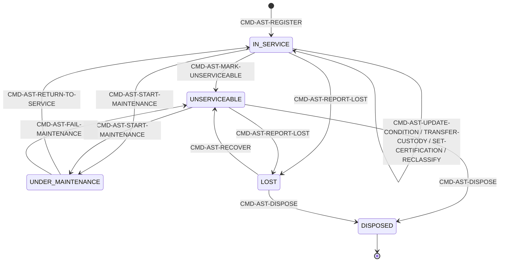
**Dependency صريحة:** `CMD-AST-DISPOSE` guard = "no legal hold" → Depends On **BC08**؛ الموقع (INV-AST-03) يعتمد على كيان مرتبط في **BC02**. [Explicit]

### 6.2 AGG-ASSET-RESERVATION (SLC-09) — حجز أصل
**Invariants:** INV-RSV-01 (لا تداخل زمني بين حجزين HELD/CONFIRMED لنفس الأصل)، INV-RSV-02 (HELD تنتهي تلقائيًا خلال 24 ساعة إن لم تُؤكَّد).

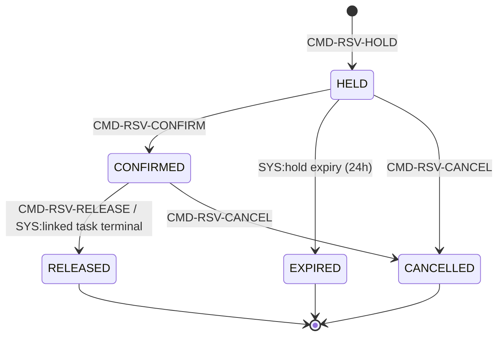

### 6.3 AGG-ASSET-ASSIGNMENT (SLC-09) — إسناد فعلي للاستخدام
**Invariants:** INV-ASG-01 (إسناد ACTIVE واحد فقط لكل أصل)، INV-ASG-02 (يحترم BRL-007: شهادات وتفويض حيازة).

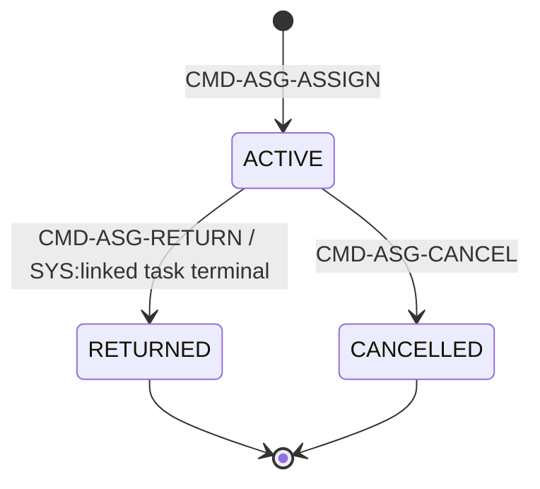

### 6.4 AGG-MAINTENANCE-ORDER (SLC-09) — أمر صيانة
**Invariants:** INV-MNT-01 (نافذة PLANNED/IN_PROGRESS تحجب التوفر)، INV-MNT-02 (لا تداخل بين أمرَي صيانة غير نهائيَّين لنفس الأصل).
> ملاحظة مصدرية: التكامل مع نظام CMMS خارجي عبر adapter مؤجَّل (R2-Q2).

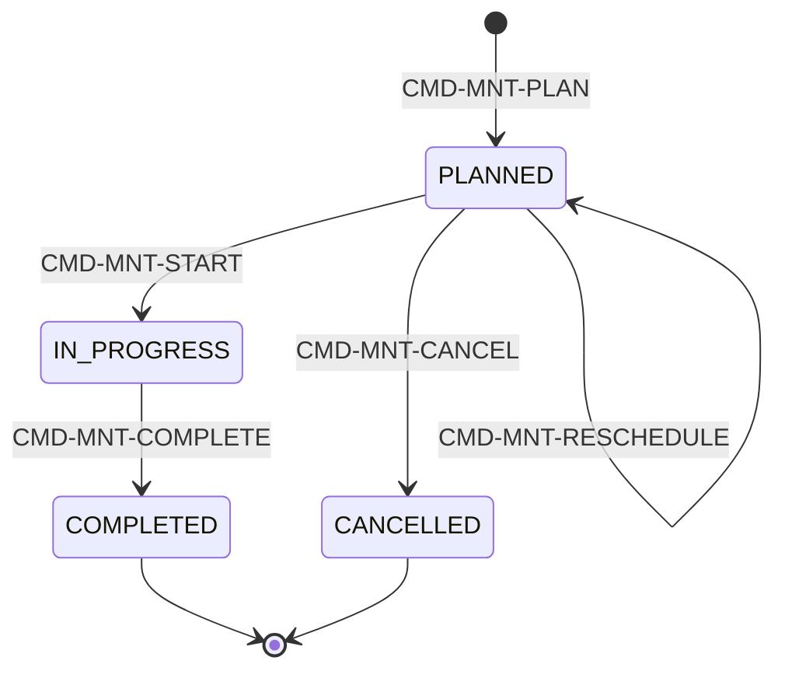

### 6.5 AGG-RESOURCE-POOL (SLC-09) — مجمع موارد قابلة للقياس
**Invariants:** INV-RPL-01 (السعة سلسلة زمنية bitemporal)، INV-RPL-02 (Σ الكمية الملتزمة ≤ السعة لكل ساعة عبر دفتر السعة — SPEC-ALLOCATION §2).

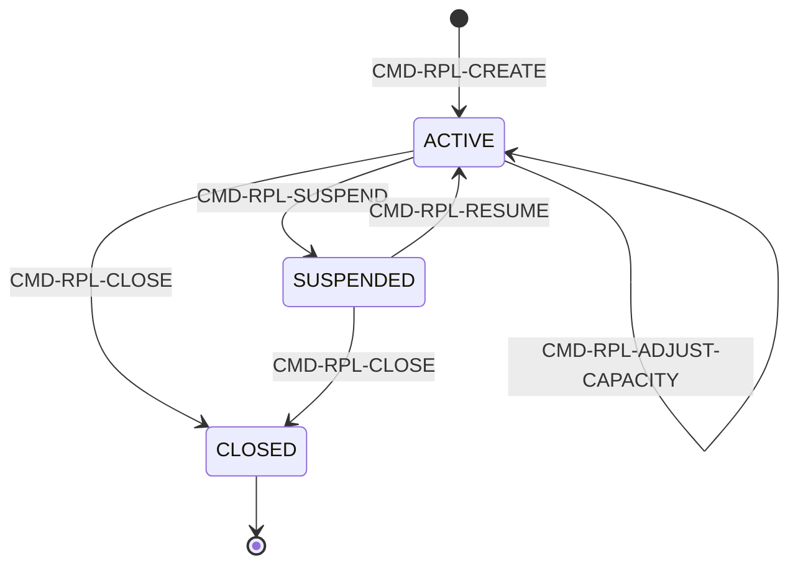

### 6.6 AGG-ALLOCATION (SLC-09) — قلب نظام التنافس على الموارد
**Invariants:** INV-ALC-01 (الكمية الملتزمة محجوزة في دفتر السعة لكل ساعة من نافذتها)، INV-ALC-02 (حل التنافس بالأولوية ثم وقت الطلب)، INV-ALC-03 (**المصادرة فقط بقرار مسجَّل بسلطة — لا أثر جانبي آليًا أبدًا**)، INV-ALC-04 (المعتمِد ≠ الطالب عند وجوب الاعتماد).

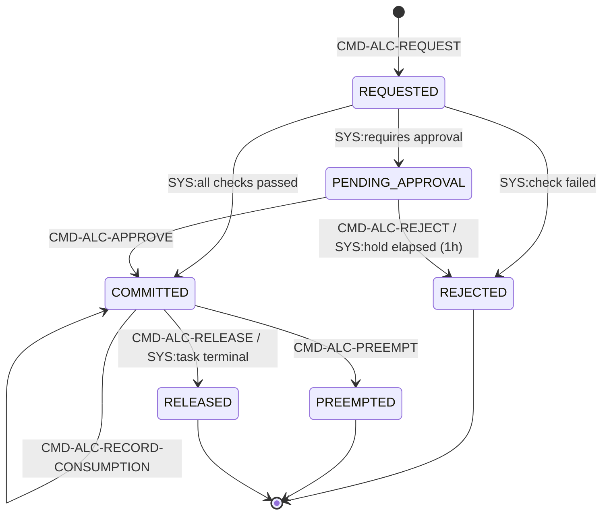

### 6.7 AGG-ROLE-REQUIREMENT (SLC-09) — متطلبات جاهزية دور
**Invariants:** INV-RRQ-01 (مجموعة متطلبات ACTIVE واحدة فقط لكل دور)، INV-RRQ-02 (الجاهزية تُحسب من سجلات صالحة عند زمن t — as-of readiness).

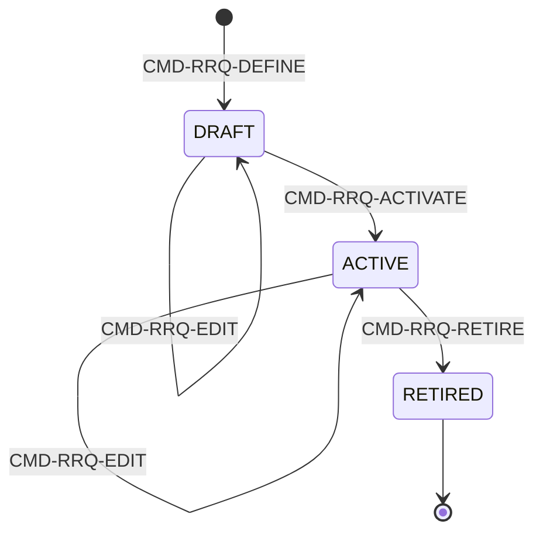
**فصل واجبات صريح:** `CMD-RRQ-ACTIVATE` يتطلب معتمِد ≠ مؤلِّف (SEGREGATION_OF_DUTIES).

### 6.8 AGG-QUALIFICATION-RECORD (SLC-03، بيانات شخصية: نعم) — سجل كفاءة/تأهيل/شهادة
**ملاحظة تحقُّق [Explicit، مُهمة]:** `bounded_context: BC05` صراحة رغم عيشه في SLC-03 المشتركة مع AGG-TASK/AGG-TASK-TYPE (BC04) — **لا يُعاد إسناده لـ BC04**، تمامًا كما تحققنا من AGG-ROLE-REQUIREMENT أعلاه (يعيش فعليًا في SLC-09 لا SLC-03، حسب front-matter الملف).

**Invariants:** INV-QUAL-01 (الأهلية تُقيَّم عند الزمن المطلوب حتى لو تأخر انتقال EXPIRED)، INV-QUAL-02 (لا حذف أبدًا؛ التاريخ يدعم as-of eligibility).

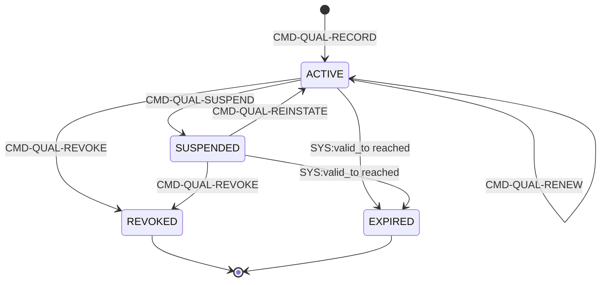

### 6.9 AGG-LOGISTICS-REQUEST (SLC-18) — طلب إمداد
**Invariants (5 — الأكثر كثافة في BC05):** INV-LGR-01 (**CR-62**: كل طلب REQUESTED يُنشئ بالضبط تخصيصًا مرتبطًا واحدًا بنفس المعاملة)، INV-LGR-02 (الإرسال (IN_TRANSIT) فقط من APPROVED وطالما التخصيص المرتبط لا يزال COMMITTED)، INV-LGR-03 (FULFILLED فقط عند تسليم الكمية كاملة؛ أي نقص = PARTIALLY_FULFILLED دائمًا، **لا يُخفى أبدًا**)، INV-LGR-04 (الإلغاء يُحرر أو يترك التخصيص المرتبط لينتهي، لا يُترك COMMITTED معلَّقًا)، INV-LGR-05 (الاستهلاك يُسجَّل فقط من نتائج شحن مؤكَّدة، لا تقديريًا عند الإرسال).

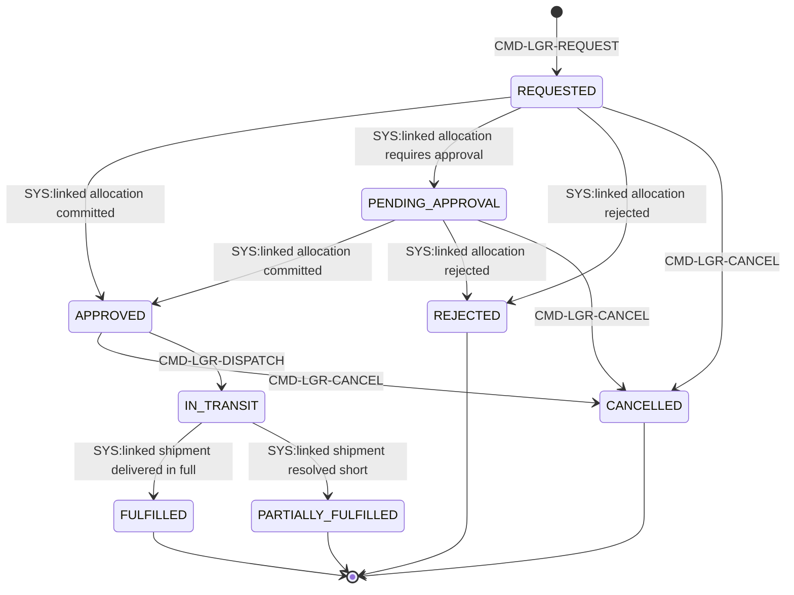

### 6.10 AGG-SHIPMENT (SLC-18) — شحنة فعلية
**Invariants:** INV-SHP-01 (نقاط حركة append-only بلا ثغرة زمنية، مطابقة نمط سلسلة الحيازة INV-AST-02)، INV-SHP-02 (الكمية المسلَّمة/التالفة/المفقودة لا تتجاوز المخطَّطة؛ النقص يُسجَّل صراحة لا يُقرَّب لأعلى)، INV-SHP-03 (المغادرة تتطلب التخصيص المرتبط COMMITTED لكمية الشحن على الأقل)، INV-SHP-04 (الإلغاء فقط قبل المغادرة؛ بعدها لا نهاية إلا DELIVERED/DAMAGED/LOST).

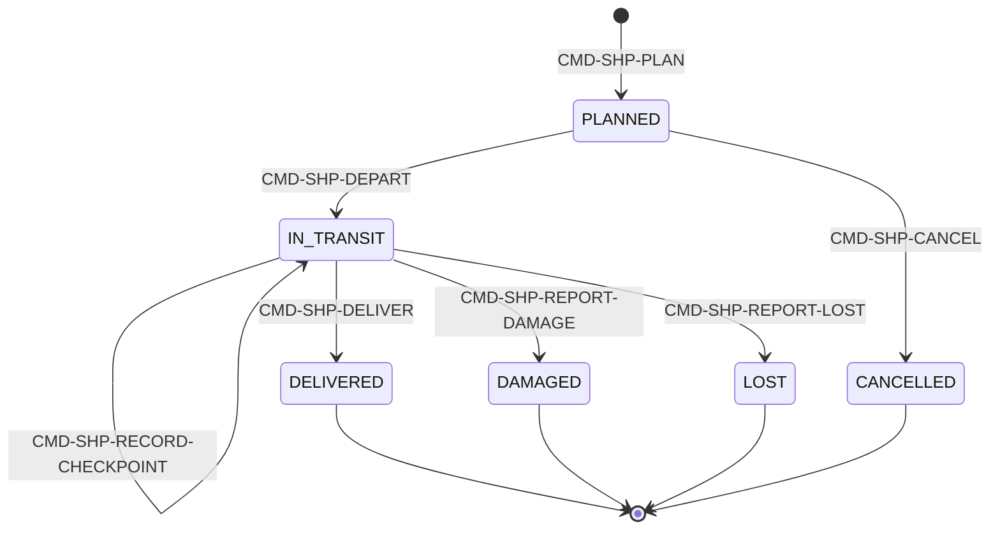

### 6.11 AGG-SCENARIO (SLC-19) — تعريف تمرين قابل لإعادة الاستخدام
**Invariants:** INV-SCN-01 (الحقن مرتَّبة بإزاحة متزايدة بصرامة، لا تزامن ولا تراجع)، INV-SCN-02 (الكفاءات المستهدفة تُرجع لرموز RD-COMPETENCIES، لا كتالوج مخترَع).

**فصل واجبات صريح:** `CMD-SCN-ACTIVATE` يتطلب معتمِد ≠ مؤلِّف.

### 6.12 AGG-EXERCISE (SLC-19) — حدث تدريبي مجدوَل
**Invariants:** INV-EXR-01 (يُخطَّط فقط ضد سيناريو ACTIVE في لحظته؛ المرجع يتجمَّد ولا يتأثر بتعديلات لاحقة)، INV-EXR-02 (**النتيجة النهائية COMPLETED/ABORTED تُشتق حصرًا من المحاكاة المرتبطة — لا أمر بشري يحدِّدها مباشرة إطلاقًا**).

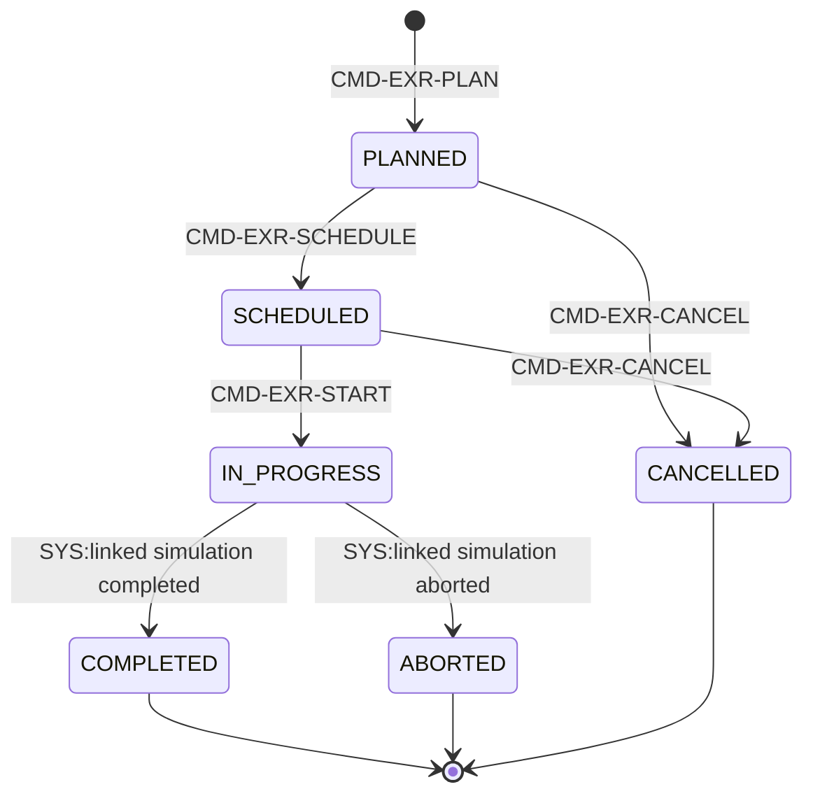

### 6.13 AGG-SIMULATION (SLC-19) — التنفيذ الفعلي للتمرين
**Invariants:** INV-SIM-01 (تسليم الحقن append-only ومتزايد زمنيًا بصرامة، مطابقة نمط INV-SHP-01)، INV-SIM-02 (الاكتمال يتطلب تقييمًا واحدًا على الأقل لكل مشارك في التمرين المرتبط)، INV-SIM-03 (المقيِّم ≠ المشارك — فصل واجبات، مطابق نمط CMD-RRQ-ACTIVATE).

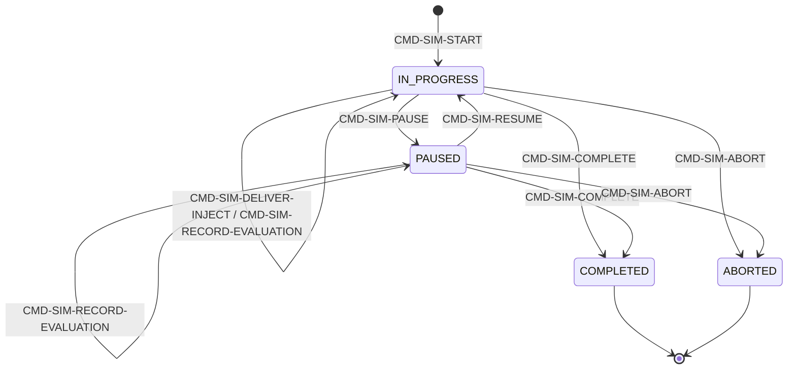
**ملاحظة تصميم [Explicit]:** `CMD-SIM-START` نفسه أمر `internal: true` يصدره النظام ضمن نفس معاملة `CMD-EXR-START` — موصوف بالكامل في `commands-slc19.md` (ليس أثرًا جانبيًا غير موثَّق).

## 7. Commands (69 إجمالًا عبر 13 Aggregate و4 ملفات commands-slc0{3,9,18,19}.md)

| Aggregate | الشريحة | عدد الأوامر | القائمة |
|---|---|---|---|
| AGG-ASSET | SLC-09 | 12 | REGISTER, UPDATE-CONDITION, MARK-UNSERVICEABLE, START-MAINTENANCE, RETURN-TO-SERVICE, FAIL-MAINTENANCE, TRANSFER-CUSTODY, SET-CERTIFICATION, REPORT-LOST, RECOVER, DISPOSE, RECLASSIFY |
| AGG-MAINTENANCE-ORDER | SLC-09 | 5 | PLAN, RESCHEDULE, START, COMPLETE, CANCEL |
| AGG-ASSET-RESERVATION | SLC-09 | 4 | HOLD, CONFIRM, RELEASE, CANCEL |
| AGG-ASSET-ASSIGNMENT | SLC-09 | 3 | ASSIGN, RETURN, CANCEL |
| AGG-RESOURCE-POOL | SLC-09 | 5 | CREATE, ADJUST-CAPACITY, SUSPEND, RESUME, CLOSE |
| AGG-ALLOCATION | SLC-09 | 6 | REQUEST, APPROVE, REJECT, RECORD-CONSUMPTION, PREEMPT, RELEASE |
| AGG-ROLE-REQUIREMENT | SLC-09 | 4 | DEFINE, EDIT, ACTIVATE, RETIRE |
| AGG-QUALIFICATION-RECORD | SLC-03 | 5 | RECORD, RENEW, SUSPEND, REINSTATE, REVOKE |
| AGG-LOGISTICS-REQUEST | SLC-18 | 3 | REQUEST, DISPATCH, CANCEL |
| AGG-SHIPMENT | SLC-18 | 7 | PLAN, DEPART, RECORD-CHECKPOINT, DELIVER, REPORT-DAMAGE, REPORT-LOST, CANCEL |
| AGG-SCENARIO | SLC-19 | 4 | DEFINE, EDIT, ACTIVATE, RETIRE |
| AGG-EXERCISE | SLC-19 | 4 | PLAN, SCHEDULE, START, CANCEL |
| AGG-SIMULATION | SLC-19 | 7 | START (internal), DELIVER-INJECT, RECORD-EVALUATION, PAUSE, RESUME, COMPLETE, ABORT |

**تفصيل مهم لـTraceability [Explicit، مطابق نمط BC01 §7]:** ملف `commands-slc03.md` يحوي 5 أوامر BC05 (CMD-QUAL-*) ضمن 33 سطرًا إجماليًا — الباقي (28 أمرًا: CMD-TASK-*، CMD-TTY-*) يخص **BC04** (AGG-TASK/AGG-TASK-TYPE) في نفس الشريحة SLC-03. نفس نمط "الشريحة ≠ BC" المكتشف سابقًا (BC01§11، CONFLICT-02).

**مشترك لكل الـ69 أمرًا:** `Idempotency-Key` إلزامي؛ `If-Match` إلزامي لغير أوامر الإنشاء؛ `X-Purpose` و`X-Correlation-Id` إلزاميان؛ استجابة 202/201 بـ`ResourceRef`. [Explicit]

## 8. Queries (20 إجمالًا عبر 4 ملفات queries-slc0{3,9,18,19}.md)

| Query | يعيد | من يحق له |
|---|---|---|
| QRY-QUAL-LIST | سجلات التأهيل عند زمن t | Manager/Resource Manager في النطاق؛ الذات |
| QRY-ELIG-CHECK | نتيجة فحص الأهلية (شخص، نسخة نوع مهمة، زمن) + أسباب | Planner/Manager في النطاق؛ BC04 (هوية عبء عمل داخلية) |
| QRY-AST-GET | الأصل بحالته وشهاداته وسلسلة حيازته والكيان المرتبط | قاعدة label |
| QRY-AST-AVAILABILITY | الأصول المتاحة بنوع/قدرة في نافذة، مع أسباب الحجب المرئية | allowed_scope |
| QRY-MNT-SCHEDULE | أوامر الصيانة حسب الأصل/النافذة/الحالة | نطاق مالك الأصل |
| QRY-POL-TIMELINE | السعة والملتزم والمتاح لكل ساعة في نافذة | نطاق المجمع |
| QRY-ALC-LIST | التخصيصات حسب المجمع/المهمة/الخطة/الحالة | النطاق |
| QRY-READINESS | جاهزية شخص/وحدة لدور عند زمن t مع الفجوات | Manager/Training Manager في النطاق؛ الذات |
| QRY-LGR-GET | طلب الإمداد مع مراجع التخصيص والشحنة المرتبطين | قاعدة label؛ allowed_scope |
| QRY-LGR-LIST | طلبات الإمداد حسب الصنف/الوجهة/الحالة/الأولوية | allowed_scope |
| QRY-SHP-GET | الشحنة بحالتها الحالية وكمية التسليم/التلف/الفقد | allowed_scope |
| QRY-SHP-LIST | الشحنات حسب طلب الإمداد/الناقل/الحالة/النافذة | allowed_scope |
| QRY-SHP-TRACKING | سجل نقاط حركة الشحنة الكامل بالترتيب | allowed_scope |
| QRY-SCN-GET | السيناريو مع حقنه وكفاءاته المستهدفة | allowed_scope |
| QRY-SCN-LIST | السيناريوهات حسب نوع التمرين/الحالة | allowed_scope |
| QRY-EXR-GET | التمرين مع مرجع السيناريو المجمَّد والمشاركين والحالة | allowed_scope |
| QRY-EXR-LIST | التمارين حسب السيناريو/الحالة/النافذة | allowed_scope |
| QRY-SIM-GET | المحاكاة بحالتها وملخص التقييم | allowed_scope |
| QRY-SIM-LIST | المحاكاة حسب التمرين/الحالة/النافذة | allowed_scope |
| QRY-SIM-TIMELINE | الجدول الزمني الكامل لتسليم الحقن والتقييمات | allowed_scope |

كل استعلام: PEP يطلب قرار PDP بـ`action=view` قبل الاسترجاع (ADR-P06)؛ القوائم بمؤشر (cursor). [Explicit]

## 9. Events (78 إجمالًا عبر 4 ملفات events-slc0{3,9,18,19}.md)

| المجموعة | الشريحة | العدد | القائمة (أسماء مختصرة) |
|---|---|---|---|
| AGG-ASSET | SLC-09 | 11 | REGISTERED, CONDITION-UPDATED, UNSERVICEABLE, MAINTENANCE-STARTED, RETURNED-TO-SERVICE, CUSTODY-TRANSFERRED, CERTIFICATION-SET, REPORTED-LOST, RECOVERED, DISPOSED, **RECLASSIFIED (يؤثر أمنياً)** |
| AGG-MAINTENANCE-ORDER | SLC-09 | 5 | PLANNED, RESCHEDULED, STARTED, COMPLETED, CANCELLED |
| AGG-ASSET-RESERVATION | SLC-09 | 5 | HELD, CONFIRMED, EXPIRED, RELEASED, CANCELLED |
| AGG-ASSET-ASSIGNMENT | SLC-09 | 3 | ASSIGNED, RETURNED, CANCELLED |
| AGG-RESOURCE-POOL | SLC-09 | 5 | CREATED, CAPACITY-ADJUSTED, SUSPENDED, RESUMED, CLOSED |
| AGG-ALLOCATION | SLC-09 | 7 | REQUESTED, COMMITTED, APPROVAL-REQUIRED, REJECTED, CONSUMED, PREEMPTED, RELEASED |
| AGG-ROLE-REQUIREMENT | SLC-09 | 4 | DEFINED, EDITED, ACTIVATED, RETIRED |
| AGG-QUALIFICATION-RECORD | SLC-03 | 6 | RECORDED, RENEWED, SUSPENDED, REINSTATED, REVOKED, EXPIRED |
| AGG-LOGISTICS-REQUEST | SLC-18 | 8 | REQUESTED, APPROVED, PENDING-APPROVAL, REJECTED, DISPATCHED, FULFILLED, PARTIALLY-FULFILLED, CANCELLED |
| AGG-SHIPMENT | SLC-18 | 7 | PLANNED, DEPARTED, CHECKPOINT-RECORDED, DELIVERED, DAMAGED, LOST, CANCELLED |
| AGG-SCENARIO | SLC-19 | 4 | DEFINED, EDITED, ACTIVATED, RETIRED |
| AGG-EXERCISE | SLC-19 | 6 | PLANNED, SCHEDULED, STARTED, COMPLETED, ABORTED, CANCELLED |
| AGG-SIMULATION | SLC-19 | 7 | STARTED, INJECT-DELIVERED, EVALUATION-RECORDED, PAUSED, RESUMED, COMPLETED, ABORTED |

**نمط ملاحَظ [Explicit]:** من أصل 78 حدثًا، **حدث واحد فقط** (`EVT-AST-RECLASSIFIED`) مُعلَّم "يؤثر أمنياً" (يستهلكه Security-version service + PEP decision caches + Projection security-version table إضافة لمستهلكيه العاديين). هذا يعكس أن BC05، خلافًا لـBC01، ليس بنية تحتية أمنية بل مستهلك تصنيف فقط عند إعادة تصنيف أصل واحد.

## 10. Business Rules / Invariants — أثرها (36 ثابتًا عبر 13 Aggregate)

| المجموعة | العدد | نمط مشترك |
|---|---|---|
| INV-AST-* | 4 | توفر مركَّب + سلسلة حيازة + موقع كادعاءات لا عمود |
| INV-RSV-* | 2 | لا تداخل زمني + انتهاء تلقائي للحجز المعلَّق |
| INV-ASG-* | 2 | إسناد نشط واحد + احترام شهادات/تفويض الحيازة |
| INV-MNT-* | 2 | نافذة تحجب التوفر + لا تداخل أوامر صيانة |
| INV-RPL-* | 2 | سعة زمنية + دفتر التزام لا يتجاوز السعة |
| INV-ALC-* | 4 | حجز دفتري + أولوية/وقت + **لا مصادرة آلية أبدًا** + فصل واجبات الاعتماد |
| INV-RRQ-* | 2 | مجموعة نشطة واحدة + جاهزية as-of |
| INV-QUAL-* | 2 | تقييم عند الزمن المطلوب + لا حذف أبدًا |
| INV-LGR-* | 5 | **CR-62** + إرسال مشروط بالتزام + FULFILLED صارم + إلغاء نظيف + استهلاك من نتائج مؤكَّدة فقط |
| INV-SHP-* | 4 | append-only + كمية لا تتجاوز المخطَّط + مغادرة مشروطة بالتزام + لا إلغاء بعد المغادرة |
| INV-SCN-* | 2 | حقن مرتَّبة بصرامة + كفاءات من كتالوج مرجعي |
| INV-EXR-* | 2 | مرجع سيناريو مجمَّد + **نتيجة نهائية بلا تدخل بشري إطلاقاً** |
| INV-SIM-* | 3 | append-only + اكتمال مشروط بتقييم الجميع + فصل واجبات التقييم |

**نمط عابر لكل الـ13 Aggregate [Explicit، مؤكَّد آليًا]:** Optimistic concurrency (`If-Match`) + Idempotency-Key + State+History+Outbox+AuditOutbox في معاملة واحدة (ADR-P02) — بلا استثناء واحد، مطابق تمامًا لنمط BC01.

**اكتشاف "لا أثر جانبي صامت" يمتد لنمط ثالث متمم [Explicit، مؤكَّد]:** BC04 أظهر "لا تغيير حالة تلقائي بدون أمر صريح" (INV-RIS-05/INV-INC-04). BC05 يُظهر هنا نقيضه المتمم بوضوح مضاعف: `INV-EXR-02` تنص أن **لا إنسان يحدد النتيجة النهائية للتمرين إطلاقًا** — يجب أن تأتي حصرًا من `AGG-SIMULATION`؛ وحارس `INV-ALC-03` يمنع أي مصادرة آلية بلا قرار سلطة مسجَّل. أي: أحيانًا القاعدة هي "لا أتمتة" (BC04، وALC-03 هنا)، وأحيانًا العكس "لا تدخل بشري" (EXR-02) — كل حالة محسومة بوعي حسب طبيعة الثقة المطلوبة (قرار بشري حرج يحتاج مساءلة، مقابل نتيجة موضوعية قابلة للتزييف إن تُرِكت للبشر).

## 11. Policies — 69 سياسة أمر BC05 (بعد استبعاد ما ليس BC05) + 20 سياسة استعلام

**التحقق من ملف SLC-03 المشترك [Explicit، نمط "الشريحة ≠ BC" يتكرر]:** `policies-slc03.md` يحوي **33** command_policies إجمالاً، لكن **28 منها** (POL-TASK-* ×24، POL-TTY-* ×4) تخص **AGG-TASK/AGG-TASK-TYPE — BC04** لا BC05. سياسات BC05 وحدها في هذا الملف هي الخمس **POL-QUAL-\*** (RECORD/RENEW/SUSPEND/REINSTATE/REVOKE). كذلك query_policies: من أصل 6 في الملف، سياستان فقط BC05 (POL-QUAL-LIST، POL-ELIG-CHECK)؛ الأربع الباقية (POL-TASK-GET/LIST/HISTORY، POL-TTY-GET) BC04.

| الشريحة | command_policies (BC05 فقط) | query_policies (BC05 فقط) |
|---|---|---|
| SLC-03 | 5 / 33 في الملف | 2 / 6 في الملف |
| SLC-09 | 39 (الملف بأكمله BC05) | 6 (الملف بأكمله BC05) |
| SLC-18 | 10 (الملف بأكمله BC05) | 5 (الملف بأكمله BC05) |
| SLC-19 | 15 (الملف بأكمله BC05) | 7 (الملف بأكمله BC05) |
| **الإجمالي BC05** | **69** | **20** |

هذان الإجماليان (69 أمرًا، 20 استعلامًا) يطابقان تمامًا عدد الأوامر والاستعلامات الموثَّقة في §7/§8 — فحص اتساق داخلي ناجح.

**فصل الواجبات (SoD) — 4 مواضع فقط من 69 (~5.8%):**

| Policy | القيد |
|---|---|
| POL-ALC-APPROVE | approver ≠ requester |
| POL-RRQ-ACTIVATE | approver ≠ author |
| POL-SCN-ACTIVATE | approver ≠ author |
| POL-SIM-RECORD-EVALUATION | evaluator ≠ participant |

**⚠️ ملاحظة مؤكَّدة صراحة [Explicit]: صفر SoD في SLC-18 بالكامل.** لا سياسة واحدة من الـ10 في AGG-LOGISTICS-REQUEST/AGG-SHIPMENT تحمل قيد segregation_of_duties — الإمداد بأكمله مدفوع بأحداث نظام من التخصيص المرتبط (SLC-09) أو بأفعال تنفيذية (dispatch/depart/deliver) لا قرارات بشرية مستقلة تحتاج فصل واجبات. هذا يتسق مع INV-LGR-01/02 (لا حالة APPROVED يضعها إنسان مباشرة).

## 12. Security & Threats (14 تهديدًا، كلها BC05 خالصًا — لا مزيج مع BCs أخرى)

| THR | المكوّن | STRIDE | المخاطرة المتبقية |
|---|---|---|---|
| THR-S09-01 | Allocation (self-approval/pre-emption) | Elevation | L |
| THR-S09-02 | Asset custody (إنكار الاستلام) | Repudiation | L |
| THR-S09-03 | Availability (كشف مهام مخفية عبر الحجب) | Info Disclosure | L |
| THR-S09-04 | Capacity ledger (تعديل مباشر يتجاوز الالتزامات) | Tampering | L |
| THR-S18-01 | ربط Logistics Request↔Allocation (CR-62) | Tampering | L |
| THR-S18-02 | كمية التسليم (إخفاء نقص كـ"تم بالكامل") | Repudiation | L |
| THR-S18-03 | الإرسال مقابل دفتر السعة (تجاوز آلية التنافس) | Elevation | L |
| THR-S18-04 | نقاط حركة الشحنة (إدراج/تعديل خارج الترتيب) | Tampering | L |
| THR-S18-05 | إلغاء أثناء النقل (إخفاء خسارة فعلية) | Repudiation | L |
| THR-S19-01 | تجميد Scenario↔Exercise (INV-EXR-01) | Tampering | L |
| THR-S19-02 | تفويض نتيجة Exercise↔Simulation (يُشابه CR-62/SLC-18) | Elevation | L |
| THR-S19-03 | تسجيل تقييم (مشارك يُقيِّم نفسه) | Repudiation | L |
| THR-S19-04 | اكتمال محاكاة دون تقييم كامل للمشاركين | Repudiation | L |
| THR-S19-05 | تسلسل تسليم الحقن (إدراج/تأخير مزوَّر) | Tampering | L |

**نمط أمني مميز لهذا الـBC [Derived]:** جميع التهديدات الـ14 مخاطرتها المتبقية **L** بعد الضوابط — ولا توجد مخاطرة متبقية مقبولة صراحة بدرجة M كما في BC01 (THR-S01-04/11). الغالبية العظمى من النوع Tampering/Repudiation حول "إخفاء نقص أو فشل" (تسليم جزئي، إلغاء أثناء النقل، تقييم غائب، مصادرة/اعتماد بلا سلطة) — نمط مختلف نوعيًا عن تركيز BC01-04 الأعلى على Elevation/Info Disclosure المرتبط بالهوية والتخويل.

## 13. Data & APIs

- **النموذج المنطقي:** `06-data/logical-model/slc-03.md` (QUALIFICATION-RECORD، مشترك مع BC04)، `slc-09.md` (ASSET..ROLE-REQUIREMENT)، `slc-18.md` (LOGISTICS-REQUEST، SHIPMENT)، `slc-19.md` (SCENARIO، EXERCISE، SIMULATION) — **أربعة ملفات منفصلة لنفس الـBC**، مطابق نمط BC01 (3 ملفات لـ11 aggregate). [تأكيد وجود فقط — لم تُقرأ الأسطر بالكامل هذه الجولة]
- **العقود:** `05-contracts/openapi-readiness-slc03.md`، `openapi-operations-slc03.md`، `asyncapi-slc03.md`، `errors-slc03.md`؛ `openapi-readiness-slc09.md`، `asyncapi-slc09.md`، `errors-slc09.md`؛ `openapi-readiness-slc18.md`، `asyncapi-slc18.md`، `errors-slc18.md`؛ `openapi-readiness-slc19.md`، `asyncapi-slc19.md`، `errors-slc19.md`. [تأكيد وجود فقط]
- **مواصفة الأهلية (SPEC-ELIGIBILITY، مقروءة كاملة):** `EligibilityCheck(person, task_type_version, at)` يقيِّم كل متطلب (code, min_level, supervision_allowed) إلى واحدة من 7 نتائج ممكنة (ELIGIBLE, REQUIRES_SUPERVISION, EXPIRED, REQUIRES_CERTIFICATION, REQUIRES_TRAINING, UNKNOWN, NOT_ELIGIBLE)، ثم تُجمَّع بترتيب أسبقية "الأسوأ يغلب": `NOT_ELIGIBLE > EXPIRED > REQUIRES_CERTIFICATION > REQUIRES_TRAINING > UNKNOWN > REQUIRES_SUPERVISION > ELIGIBLE`. تعذُّر الوصول لـBC05 من BC04 عند الإسناد → رفض `ELIGIBILITY_UNAVAILABLE` (**fail-closed** — لا إسناد دون تحقق).

## 14. Integrations

- **BC02** — موقع الأصل كادعاءات ثنائية الزمن على الكيان المرتبط (INV-AST-03)، لا عمود مباشر في BC05.
- **BC04** — استهلاك QRY-ELIG-CHECK عند إسناد المهمة (fail-closed)؛ استهلاك EVT-ALC-*/EVT-ASG-* لتتبع تقدم الخطة والإشعارات؛ قرار المصادرة/التخلص يصدر كقرار BC04 مسجَّل قبل تنفيذه في BC05 (CMD-ALC-PREEMPT/CMD-AST-DISPOSE).
- **BC08** — استعلام legal hold قبل CMD-AST-DISPOSE؛ سلطة إعادة التصنيف (CMD-AST-RECLASSIFY) عبر Security Officer.
- **BC06 (Knowledge Management)** — REQ-TRX-013: محاكاة مكتملة (AGG-SIMULATION) يمكن استخدامها كمصدر نهائي لتقرير ما بعد الحدث (AAR) ككائن معرفة نوعه lesson، عبر CR-63، دون أي تغيير في مخطط AGG-KNOWLEDGE-OBJECT.
- **SLC-03 الداخلية (BC04)** — AGG-QUALIFICATION-RECORD يمكنه الاستشهاد بمحاكاة مكتملة (SLC-19) كدليل تأهيل عبر حقل `evidence:urn` العام دون تعديل مخطط (REQ-TRX-012).

## 15. Verification / Acceptance

تأكَّد وجود ملفات `*-state-machine.md` لكل الـ13 aggregate: `SLC-03/qualification-record-state-machine.md` (1)، `SLC-09/{asset,asset-assignment,asset-reservation,maintenance-order,resource-pool,allocation,role-requirement}-state-machine.md` (7)، `SLC-18/{logistics-request,shipment}-state-machine.md` (2)، `SLC-19/{scenario,exercise,simulation}-state-machine.md` (3)، بالإضافة لملفات `invariants-slc0{3,9,18,19}.md`. **[Missing — needs verification pass]**: لم تُقرأ أسطر أي من هذه الملفات الـ13 حرفيًا في هذه الجولة — الوجود مؤكَّد فقط عبر فهرسة الدليل (Glob)، لا محتوى فعلي (مطابقة الحالات/الانتقالات المرسومة في §6 لم تُتحقَّق آليًا ضد الأوراكل الرسمي كما فُعل في BC01 §15 لـTST-AUTHORITY-GRANT-SM).

## 16. Dependencies (خارج BC05)

| من | العلاقة | إلى |
|---|---|---|
| AGG-ASSET (location, INV-AST-03) | `depends_on` | BC02 (ادعاءات على الكيان المرتبط) |
| AGG-ASSET (dispose) | `depends_on` | BC08 (فحص legal hold) |
| AGG-ASSET (reclassify) | `depends_on` | BC08/Security Officer (سلطة التصنيف) |
| AGG-ALLOCATION (pre-empt) | `depends_on` | BC04 (قرار مسجَّل، لا آلي أبدًا) |
| AGG-TASK (BC04، assign) | `depends_on` | BC05 (QRY-ELIG-CHECK — فشل آمن fail-closed موثَّق في BC04 عند التعطل) |
| AGG-EXERCISE (role_ref) | `consumes` | AGG-ROLE-REQUIREMENT (قراءة فقط، بلا آلية أهلية جديدة) |
| AGG-QUALIFICATION-RECORD (evidence) | `may_cite` | AGG-SIMULATION (محاكاة مكتملة كدليل، REQ-TRX-012) |
| AGG-SIMULATION (COMPLETED) | `may_source` | BC06 / AGG-KNOWLEDGE-OBJECT (AAR، CR-63، REQ-TRX-013) |

## 17. Cross-BC Relationships (ملخص)

BC05 هو **الركيزة المادية/البشرية للجاهزية** (physical/human readiness substrate) التي تستهلكها BC04 كل مرة يحتاج فيها لتحقق من التوفر (الأصل)، الأهلية (الشخص)، أو السعة (المورد) قبل الالتزام بمهمة أو قرار. خلافًا لـBC01 (بنية تحتية أمنية يخدم بها الجميع)، فإن BC05 **مستهلَك** بشكل رئيسي من BC04 وليس مزوِّدًا لخدمة عابرة لكل الـBCs — علاقته الصادرة الوحيدة المهمة خارج BC04 هي نحو BC06 (AAR من المحاكاة) ونحو BC02/BC08 (الموقع والحيازة/التصنيف). هذا يتوافق مع كون CAP-08 "قدرة تمكينية تشغيلية" لا "قدرة حوكمة" في خريطة الـCapabilities.

## 18. Traceability

الرجوع الكامل موجود في `01-entity-index.md` (كل ID من هذا الملف — الأصول، السياسات، الأحداث، الثوابت — قابل للبحث فيه مع كل الملفات المرجعية له) و`02-relationship-index.md` (العلاقات الدلالية المصنَّفة، بما فيها روابط BC05 الصادرة نحو BC02/BC04/BC06/BC08 المذكورة في §14/§16).

## 19. Conflicts

- **CONFLICT-03 (فجوة بيانات مرجعية RD-*، OPEN)** — BC05 هو **مركز هذا التعارض**: خمس من الست فئات RD-* المفقودة من `04-information/reference-data.md` مصدرها BC05 (`RD-ASSET-TYPES`, `RD-CONDITION-GRADES`, `RD-RESOURCE-TYPES`, `RD-LOGISTICS-ITEM-TYPES`, `RD-EXERCISE-TYPES`؛ السادسة `RD-HAZARD-CATEGORIES` من BC04). **لا يُعاد فتح النقاش هنا** — القرار المطلوب (استنباط القيم من نقاط الاستخدام مقابل تركها فجوة حتى ورشة عمل مخصَّصة) مُسجَّل في `05-conflicts.md §4` وينتظر قرارًا بشريًا صريحًا لم يُطلَب بعد.
- **CONFLICT-04 (نطاق AGG-ERASURE-REQUEST مقابل personal_data:true في BC05، OPEN)** — يمسّ BC05 مباشرة: `AGG-QUALIFICATION-RECORD` (BC05) يحمل `personal_data: true` صراحة في الـfront-matter (مؤكَّد في هذه الجولة §6.8)، لكن `AGG-ERASURE-REQUEST.SCOPED` (BC08) يبحث صراحة عن مفاتيح الموضوع في BC01 وBC02 فقط — لا يذكر BC05. غير محسوم: هل هذا تصميم مقصود (سجلات التأهيل تُدار عبر `AGG-RETENTION-SCHEDULE`/`AGG-DISPOSITION-RUN` لا عبر "الحق في المحو" الفردي لأنها بيانات تشغيلية لا هوية)، أم سهو حقيقي في نطاق SCOPED. **لا حسم من أي ملف مصدر فُحص هذه الجولة أو سابقًا** — مسجَّل في `05-conflicts.md §5`.
- **لا تعارضات جديدة مكتشفة** هذه الجولة بين الـ13 aggregate أنفسهم — بياناتهم متسقة داخليًا وفيما بينها (فحوصات الاتساق العددي في §7/§11 نجحت جميعها).

## 20. Missing Information (مُجمَّعة)

1. **فجوة RD-* (CONFLICT-03)** — 5 من 6 فئات بيانات مرجعية مفقودة مصدرها BC05: `RD-ASSET-TYPES`, `RD-CONDITION-GRADES`, `RD-RESOURCE-TYPES`, `RD-LOGISTICS-ITEM-TYPES`, `RD-EXERCISE-TYPES`. [Missing — قرار بشري مطلوب، انظر §19]
2. **نطاق AGG-ERASURE-REQUEST مقابل AGG-QUALIFICATION-RECORD (CONFLICT-04)** — غير محسوم هل الاستبعاد من SCOPED مقصود أم سهو. [Needs Review]
3. **29 من 45 متطلبًا (كل REQ-LOG-* وREQ-TRX-*) بلا أي Use Case موثَّق** — لا حتى مسودة اسم؛ اكتشاف جديد هذه الجولة (§5). هذا يخص كامل CAP-08.03 وCAP-08.05. [Missing — يحتاج جولة elicitation لاحقة، على الأرجح مؤجَّلة فعليًا لأن كليهما R3]
4. **6 حالات استخدام (UC-050..055) مسودات اسم فقط (`status: DRAFT`, `epistemic: DOC:PRJ§46 (name only)`)** — بلا actors/preconditions/main_flow فعليين، خلافًا لحالات BC01 المكتملة (`DEC (W2)`, `APPROVED_DELEGATED`). [Missing — يحتاج جولة elicitation لاحقة لـCAP-08.01/08.02]
5. **13 ملف acceptance state-machine (SLC-03/09/18/19) مؤكَّد وجودها لكن لم تُقرأ أسطرها** — لم تُفحص مطابقتها الحرفية لجداول الحالات×الأوامر الموثَّقة في هذا الملف §6. [Missing — يحتاج جولة تحقق تالية، مطابق BC01 §20 بند 4]
6. **النموذج المنطقي وملفات العقود (§13) مؤكَّدة الوجود فقط عبر فهرسة الدليل** — لم تُقرأ محتوياتها لمطابقة الحمولات (payloads) الموثَّقة في commands-slc*.md. [Missing — يحتاج جولة تحقق تالية]

## 21. Completeness Status

| الفحص | الحالة |
|---|---|
| كل Aggregate له Purpose/States/Commands/Events؟ | ✅ 13/13 |
| كل Command مرتبط بAggregate/Policy؟ | ✅ 69/69 (مؤكَّد من commands-slc0{3,9,18,19}.md وpolicies-slc0{3,9,18,19}.md، بعد استبعاد سياسات BC04 المشتركة في SLC-03) |
| كل Event له Producer وConsumer؟ | ✅ 78/78 |
| كل Requirement مرتبط بUC؟ | ❌ **16/45 فقط** (REQ-RDY×2 وREQ-RES×14 لها UC؛ REQ-LOG×14 وREQ-TRX×15 = 29 بلا أي UC) — فجوة حقيقية موثَّقة في §5/§20، لا قرار "بالتصميم" مثل OQ-034 في BC01 |
| Threat model مربوط؟ | ✅ 14/14 مع تصنيف STRIDE ومخاطرة متبقية (كلها L) |
| كل UC مرتبط بAggregate منفِّذ (ولو Cross-BC)؟ | ✅ 7/7 (الموجودة فعلاً؛ لا UC آخر تحت CAP-08 ليُربَط) |
| فحوصات الاتساق العددي (أوامر/سياسات، استعلامات/سياسات استعلام) | ✅ 69=69، 20=20 |
| **الحالة الإجمالية** | **OPEN** — البنود الحقيقية المتبقية: قرار بشري على CONFLICT-03 وCONFLICT-04، وفجوة توثيقية حقيقية (لا "بالتصميم") في تغطية Use Cases لـCAP-08.03/08.05 وجزء من CAP-08.01/08.02 (مسودات DRAFT فقط)، بالإضافة لجولة تحقق تالية على ملفات acceptance/العقود/النموذج المنطقي |
