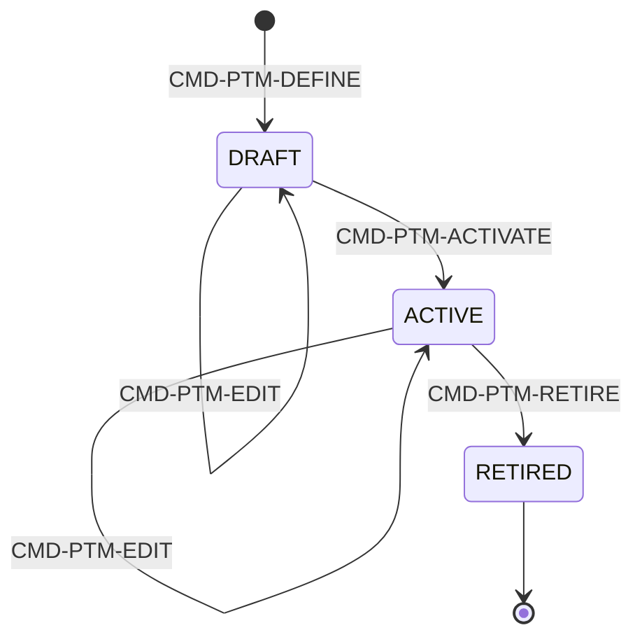
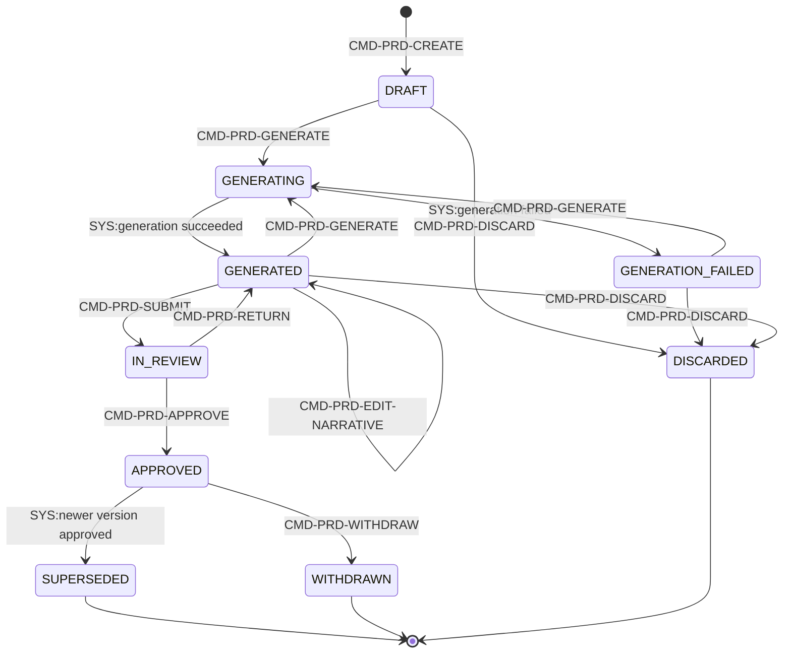
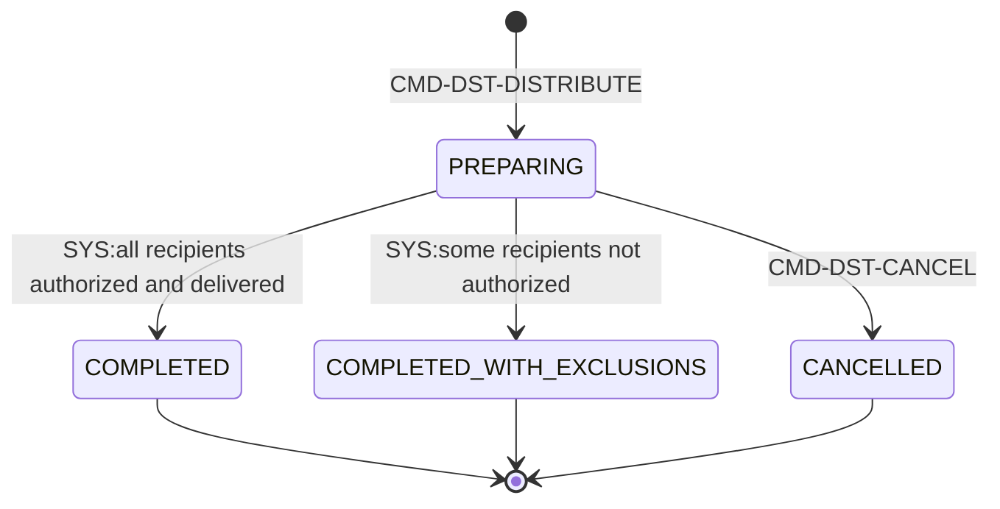
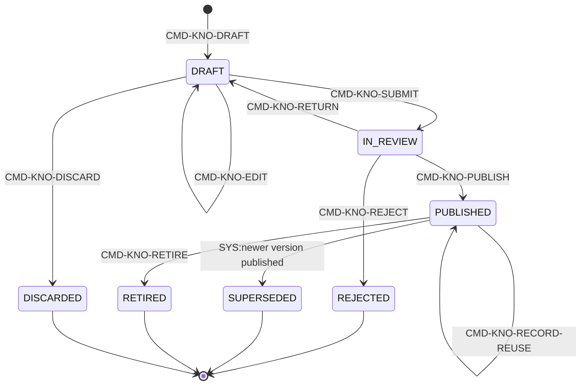
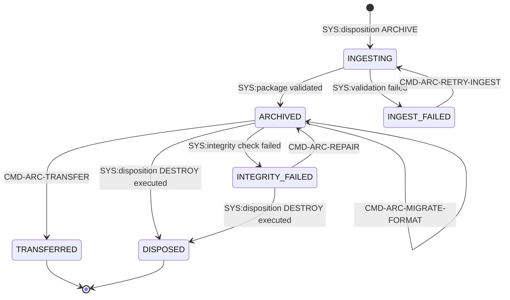
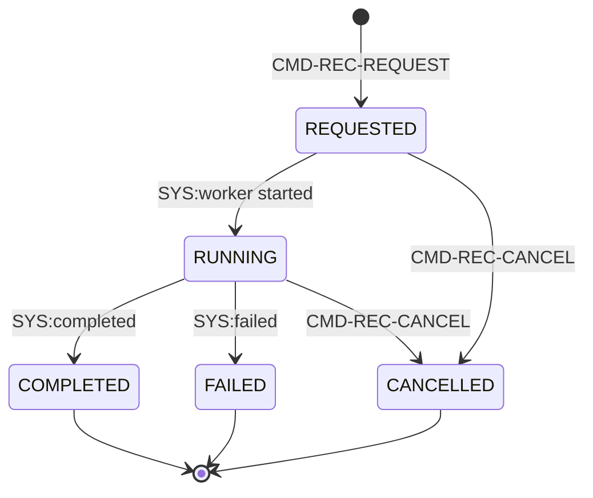

# BC06 — المعرفة والمنتجات والذاكرة المؤسسية

## المستوى الأول — شرح مبسّط

هذا الـBounded Context يحوّل عمل المنصة إلى مخرجات نهائية ومعرفة دائمة: منتجات (تقارير، إحاطات، خرائط) تُولَّد من قوالب وتُعتمَد وتُوزَّع بعلامة مائية لكل مستلم، دروس وإجراءات وممارسات فضلى تُنشَر كمعرفة مؤسسية قابلة لإعادة الاستخدام، وأرشفة رسمية طويلة الأمد (معيار OAIS) مع القدرة على "إعادة بناء" حالة الماضي كما كانت معروفة فعليًا وقتها.

## المستوى الثاني — التفاصيل الهندسية

---

## 1. الهوية (Identity)

- **Bounded Context:** BC06
- **Domain:** DOM-11، DOM-20 (عبر CAP-10)، DOM-21، DOM-22 (عبر CAP-11)
- **Parent Capabilities:** CAP-10.02 (التقارير والإحاطات ومنتجات الخرائط، ضمن CAP-10 الاتصال والمنتجات)، CAP-11 (المعرفة والذاكرة المؤسسية) بفرعيها CAP-11.01 (الدروس والمعرفة) وCAP-11.03 (الأرشيف وإعادة البناء التاريخي). **ملاحظة:** CAP-11.02 (السجلات والاحتفاظ) مذكورة أيضًا تحت مظلة CAP-11 في `capabilities.md`، لكن الـAggregates التي تنفّذها فعليًا (AGG-RETENTION-SCHEDULE، AGG-LEGAL-HOLD) هي **BC08** لا BC06 — انظر §2 وَ§5.

## 2. المعنى التجاري (Business Meaning)

**Definition:** إدارة منتجات المعرفة النهائية للمنصة (تقارير/إحاطات/خرائط/منتجات تحليلية) من التوليد حتى التوزيع الموسوم، إدارة المعرفة المؤسسية القابلة لإعادة الاستخدام (إجراءات، دروس، ممارسات فضلى، معرفة سياساتية)، والأرشفة الرسمية طويلة الأمد وفق معيار OAIS مع القدرة على إعادة بناء الحالة التاريخية. [Explicit]

**Purpose / Business Objective:** OUT-04 (الاتصال والمنتجات، عبر CAP-10) وOUT-06 (إعادة استخدام المعرفة والتعلّم المؤسسي، عبر CAP-11) — تحويل عمل بقية الـBCs إلى مخرجات قابلة للاعتماد والتوزيع من جهة، وإلى معرفة مؤسسية دائمة ومسترجَعة من جهة أخرى. [Explicit — capabilities.md]

**Scope:** قوالب المنتجات وربط بياناتها باستعلامات مُعلَنة (AGG-PRODUCT-TEMPLATE)، توليد/مراجعة/اعتماد نسخ المنتج (AGG-PRODUCT)، توزيعها موسومة لكل مستلم (AGG-DISTRIBUTION)، صياغة/مراجعة/نشر كائنات المعرفة (AGG-KNOWLEDGE-OBJECT)، تحويل السجلات المرحَّلة من التصرف (disposition) إلى حزم أرشيفية وفق OAIS (AGG-ARCHIVE-PACKAGE)، وإعادة بناء حالة نطاق كما كانت معروفة في زمن ماضٍ (AGG-RECONSTRUCTION).

**Out of Scope:** جدولة الاحتفاظ وقرار التصرف نفسه (AGG-RETENTION-SCHEDULE) والتجميد القانوني (AGG-LEGAL-HOLD) ودورة تدمير المفتاح (AGG-DISPOSITION-RUN) — كلها **BC08** (SLC-12a)، رغم أن UC-103 (Apply Retention & Legal Hold) مُصنَّف تحت CAP-11.02 التي تظهر في نفس شجرة CAP-11 الخاصة بـBC06 في `capabilities.md`. **نمط مكتشَف [Derived، جديد هذه الجولة]:** هذا مطابق تمامًا لنمط UC-085/086/088 في BC01 (تحقَّق منه: `bc01-foundation.md §2`) — الغلاف التنظيمي (Capability) يظهر تحت مظلة BC واحد، بينما التنفيذ الفعلي (Aggregate) في BC آخر تمامًا. الدليل: `AGG-RETENTION-SCHEDULE.md` يحمل `bounded_context: BC08` صراحةً ويُعلن `satisfies: REQ-GOV-006`، وREQ-GOV-006/007/008 (وليس REQ-PRD/REQ-KNW/REQ-ARC) هي متطلبات UC-103 الوحيدة في `requirements.md` — أي لا علاقة نصية بين UC-103 وأي متطلب من متطلبات BC06 الاثني عشر الفعلية. أيضًا خارج النطاق: حل تعارض الحقيقة نفسه (BC02) — كائنات المعرفة لا تدخله أبدًا (انظر أدناه CR-33).

### اكتشافات جوهرية محفوظة من الجولات السابقة

**فصل صريح بين "المعرفة" و"الحقيقة" (CR-33) [Explicit]:** `INV-KNO-02` و`INV-KNO-03` يحسمان بوضوح أن Knowledge Object **ليست** جزءًا من نموذج الحقيقة في BC02 ولا تؤثر على قرارات التخويل في الـPDP — حتى لو وصفت "سياسة" (`policy_knowledge`). هذا خط فاصل معماري متعمَّد بين طبقتي "الادعاء/الحقيقة" (BC02) و"المعرفة المؤسسية المروية" (BC06)، موثَّق باسم تصحيح صريح (CR-33) في الـglossary. الأثر العملي: نشر أو سحب أو تعديل كائن معرفة سياساتية **لا يغيّر أبدًا** قرار PDP لأي أمر آخر في المنصة — البند صريح في مصفوفة انتقالات AGG-KNOWLEDGE-OBJECT (`CMD-KNO-PUBLISH` guard) وفي `policies-slc12.md` (لا حقل واحد فيها يذكر تأثيرًا تخويليًا).

**نمط الإفصاح الصفري المتكرر للمرة الرابعة [Explicit، مؤكَّد]:** `INV-REC-03` ("العناصر المخفية تُحذف لا تُعلَّم") وَ`INV-DST-01` (المستلم غير المؤهَّل لا يستلم شيئًا إطلاقًا؛ `COMPLETED_WITH_EXCLUSIONS` لا يُظهر للمستلمين المستبعَدين أي أثر) وَ`INV-PRD-02` (المحتوى فوق تصنيف المنتج يُستبعَد دون أي علامة أو عداد) يكررون بالضبط نفس نمط `INV-ALR-02` (BC03) وPB-01 (BC01): **عدم الكشف عن وجود شيء محجوب هو قاعدة ثابتة عبر أكثر من 4 مواضع مختلفة في BC06 وحده** الآن (Product، Distribution، Reconstruction، وأيضًا PB الأساسي) — مبدأ تصميمي مركزي في كامل المنصة، لا خاصية معزولة بميزة واحدة. اختبار `TST-SLC12-INVARIANTS` (`Scenario: Content above the product label is excluded silently`) يؤكد هذا آليًا.

**Features (طبقة بين Capability وUse Case):** غير موجودة في المصادر — لا يوجد أي كيان `FEAT-*` في `spec/`، وملف `01-business/capabilities.md` ينتقل من Capability مباشرة إلى Use Case. لذلك تبدأ سلسلة هذا الـBC من CAP ثم UC. **[Missing في المصدر]** (السلسلة الكاملة لكل Aggregate في [02-relationship-index.md §21](02-relationship-index.md)).

## 3. Actors

| Actor | الدور في BC06 | Evidence |
|---|---|---|
| **Knowledge Manager** | يعرّف/يعدّل قوالب المنتج، يراجع وينشر/يقاعد كائنات المعرفة (خصوصًا الإجراءات ومعرفة السياسات) | [Explicit — commands-slc12.md] |
| **Analysis lead** | يشارك في تعريف/تعديل قوالب المنتج مع Knowledge Manager | [Explicit] |
| **second approver** | يعتمد تفعيل القالب (CMD-PTM-ACTIVATE)؛ SoD: approver ≠ author | [Explicit] |
| **Analyst / Planner** | ينشئ/يولّد/يحرر السرد/يقدّم/يتخلى عن نسخة المنتج (فاعل UC-110)؛ Planner أيضًا يقترح عليه المعرفة المنشورة ويسجّل إعادة استخدامها (CMD-KNO-RECORD-REUSE) | [Explicit] |
| **reviewer** | يعيد أو يعتمد نسخة المنتج (فاعل UC-111)؛ SoD: reviewer ≠ author | [Explicit] |
| **Manager / product owner** | يعتمد سحب المنتج (withdraw)، يوزّع/يلغي التوزيع (فاعل UC-112) | [Explicit] |
| **distributor** | ينفّذ التوزيع، يستلم قائمة استبعاد المستلمين غير المخوَّلين، يرى سجل التوزيع (QRY-DST-LOG) | [Explicit] |
| **any user** | يسوّد (draft) دروسًا من عمل مُغلَق يخصّه؛ يبحث في المعرفة المنشورة (QRY-KNO-SEARCH) | [Explicit] |
| **domain authority** | شرط SoD إضافي (فوق reviewer ≠ author) لنشر الإجراءات ومعرفة السياسات تحديدًا | [Explicit] |
| **Archivist** | يدير إعادة محاولة الإدخال/الإصلاح/ترحيل الصيغة لحزمة الأرشيف؛ يبحث في كتالوج الأرشيف؛ فاعل UC-103 (لكن الأمر المنفِّذ فعليًا BC08 — انظر §2) | [Explicit] |
| **transfer authority** | يقرر نقل حزمة أرشيفية لأرشيف آخر (CMD-ARC-TRANSFER) | [Explicit] |
| **Auditor / Legal** | يطلب/يلغي إعادة بناء تاريخية لأغراض تدقيق أو قانونية؛ يرى تقرير إعادة البناء | [Explicit] |
| **Security Officer** | يرى سجل التوزيع (QRY-DST-LOG) بصلاحية مستقلة عن الموزِّع | [Explicit] |
| **system (workload identity)** | يشغّل توليد المنتج، فحوص السلامة الدورية، دورة إدخال/تصرف الأرشيف (كل أوامر `SYS:`) | [Explicit] |

## 4. Requirements المرتبطة (12 متطلبًا مباشرًا)

| REQ | البيان المختصر | UC | ملاحظة |
|---|---|---|---|
| REQ-PRD-001 | توليد منتجات من قوالب مُصدَّرة | UC-110 | |
| REQ-PRD-002 | تصنيف المنتج ≥ كل محتواه؛ استبعاد صامت لما فوقه | UC-110 | |
| REQ-PRD-003 | تجميد المنتج المعتمَد كنسخة غير قابلة للتعديل | UC-111 | |
| REQ-PRD-004 | توزيع فقط للمخوَّلين بتصنيفهم | UC-112 | |
| REQ-PRD-005 | تصدير PDF/مستند بعلامة مائية للمستلم | UC-112 | |
| REQ-KNW-001 | إدارة كائنات المعرفة (إجراء/درس/ممارسة/سياسة) كادعاءات بأدلة ومراجعة واعتماد ونشر | UC-060, UC-061, UC-062 | |
| REQ-KNW-002 | التقاط دروس من عمل مُغلَق (مهمة/خطة/حادثة/محاكاة CR-63) وأدلته | UC-060 | |
| REQ-KNW-003 | اقتراح معرفة منشورة ذات صلة لمخطِّط جديد | UC-062 | |
| REQ-ARC-001 | ترحيل سجلات وصلت لإجراء ARCHIVE إلى حزم أرشيفية (محتوى+بيانات وصفية+منشأ+بصمات+سجل وصول) | UC-063 | |
| REQ-ARC-002 | حفظ بصيغ حفظ طويل الأمد والتحقق الدوري من السلامة | UC-063 | |
| REQ-ARC-003 | استرجاع سجل تاريخي ضمن هدف زمني مع تدقيق الوصول | UC-064 | |
| REQ-ARC-004 | إعادة بناء حالة تاريخية (T مقابل K) بعلامات RECORDED/RECONSTRUCTED/INFERRED/UNKNOWN | UC-065 | |

**ملاحظة [Missing، مصدرها طبقة المتطلبات نفسها]:** UC-060 حتى UC-065 (الأربعة الأخيرة أعلاه + UC-061) مُسجَّلة في `use-cases.md` بحالة **DRAFT**، `actors: TBD`، وَ`epistemic: DOC:PRJ§46 (name only)` — أي أن طبقة المتطلبات (Phase 2) لم تُكمل تفصيلها (لا preconditions ولا main_flow حقيقيَّين). الفاعلون الحقيقيون ظهروا لاحقًا فقط في طبقة النموذج (Phase 4: `commands-slc12.md`/`policies-slc12.md`) المُستخدَمة في §3 أعلاه. هذا يخالف نمط UC-110/UC-111/UC-112 (نفس BC06) التي هي `APPROVED_DELEGATED` بفاعلين محدَّدين صراحة منذ البداية — فجوة توثيقية بين ست حالات استخدام وثلاث أخرى لنفس الـBC.

**REQ-GOV-006/007/008 ليست متطلبات BC06** رغم ظهورها تحت CAP-11 (انظر §2) — مذكورة هنا للتوضيح لا للعدّ: هي متطلبات BC08 حصرًا (AGG-RETENTION-SCHEDULE/AGG-LEGAL-HOLD/AGG-ERASURE-REQUEST).

## 5. Use Case Catalog (10 حالات استخدام عبر CAP-10.02 وCAP-11)

| UC | الاسم | Actor | Capability | Aggregate المُنفِّذ الفعلي |
|---|---|---|---|---|
| UC-060 | Capture Lesson | (TBD في use-cases.md؛ فعليًا: any user) | CAP-11.01 | AGG-KNOWLEDGE-OBJECT (CMD-KNO-DRAFT) |
| UC-061 | Validate Knowledge | (TBD؛ فعليًا: Knowledge Manager / reviewer) | CAP-11.01 | AGG-KNOWLEDGE-OBJECT (CMD-KNO-SUBMIT/RETURN/REJECT) |
| UC-062 | Publish Knowledge | (TBD؛ فعليًا: Knowledge Manager + domain authority) | CAP-11.01 | AGG-KNOWLEDGE-OBJECT (CMD-KNO-PUBLISH, CMD-KNO-RECORD-REUSE) |
| UC-063 | Archive Record | (TBD؛ فعليًا: system + Archivist) | CAP-11.03 | AGG-ARCHIVE-PACKAGE (ingest/retry/repair/migrate) |
| UC-064 | Retrieve Historical Record | (TBD؛ فعليًا: Archivist / مستخدم مخوَّل) | CAP-11.03 | AGG-ARCHIVE-PACKAGE (QRY-ARC-RETRIEVE) |
| UC-065 | Reconstruct Historical State | (TBD؛ فعليًا: Auditor/Legal/Analyst) | CAP-11.03 | AGG-RECONSTRUCTION |
| **UC-103** | **Apply Retention & Legal Hold** | Archivist | CAP-11.02 | **AGG-RETENTION-SCHEDULE + AGG-LEGAL-HOLD (BC08، ليس BC06! — انظر §2)** |
| UC-110 | Generate Product from Template | Analyst | CAP-10.02 | AGG-PRODUCT-TEMPLATE, AGG-PRODUCT |
| UC-111 | Review & Approve Product | Manager | CAP-10.02 | AGG-PRODUCT |
| UC-112 | Distribute / Export Product | Manager | CAP-10.02 | AGG-DISTRIBUTION |

**خلاصة §4/§5:** من أصل 10 UCs مرتبطة بمظلة BC06 التنظيمية (CAP-10.02 + CAP-11 بكل فروعها)، 9 تُنفَّذ فعليًا داخل BC06 (أغلبها بستة aggregates)، وواحدة (UC-103) تُنفَّذ بالكامل في BC08 رغم ظهورها تحت CAP-11.02.

## 6. Aggregates (6) — الحالات والانتقالات

### 6.1 AGG-PRODUCT-TEMPLATE — قالب المنتج

**الغرض:** قالب منتج بأقسام (نص، خريطة، رسم بياني، جدول، أحكام رئيسية، استشهادات) وربط بيانات بإصدارات. **المستوى:** T2 · **بيانات شخصية:** لا.

**Invariants:**
- **INV-PTM-01** — الربط يستدعي فقط استعلامات مُعلَنة (لا وصول بيانات حر) — **المنتج يخضع لنفس تخويل الواجهة تمامًا**؛ هذا يعني أن أي استعلام مُعلَن في أي BC في المنصة يمكن أن يُربَط به قالب، لكن دائمًا بهوية المؤلف وصلاحياته (لا تصعيد صلاحية عبر القالب).
- **INV-PTM-02** — المنتجات تُثبِّت إصدار القالب عند الإنشاء (pin)، فلا يتأثر منتج موجود بتعديل لاحق على القالب.

**مكونات داخلية:** Section، Binding (query id, parameters).

**ملاحظة SoD:** `CMD-PTM-ACTIVATE` يتطلب `approver ≠ author` — أول نقطة SoD في دورة حياة أي منتج؛ بدونها يمكن لمؤلف القالب تفعيله بنفسه وربط استعلامات دون مراجعة مستقلة. تعديل ACTIVE ينشئ إصدارًا جديدًا ضمنيًا (لا يُعاد الفحص عبر second approver مرة أخرى صراحة في الجدول، لكن `EDIT` على ACTIVE يبقى بلا انتقال حالة — تفصيل [Needs Review] بسيط: هل تعديل قالب ACTIVE يتطلب موافقة ثانية أم يكفي تعديل ACTIVE→ACTIVE؟ النص الحالي لا يشترط approver≠author إلا في ACTIVATE فقط).

### 6.2 AGG-PRODUCT — نسخة المنتج

**الغرض:** منتج (تقرير، إحاطة، خريطة، منتج تحليلي) مولّد من قالب، يُراجع ويُعتمد ويُجمّد. **المستوى:** T1 محتوى / T2 دورة حياة · **بيانات شخصية:** لا.

**Invariants:**
- **INV-PRD-01** — نسخة APPROVED غير قابلة للتعديل؛ أي تغيير = نسخة جديدة (REQ-PRD-003).
- **INV-PRD-02** — تصنيف المنتج ≥ تصنيف كل محتوى مُضمَّن؛ المحتوى فوق التصنيف يُستبعَد **ولا يُحتسَب** في المنتج نفسه (REQ-PRD-002, A21) — أحد مظاهر نمط الإفصاح الصفري (§2).
- **INV-PRD-03** — البيانات تُثبَّت عند التوليد (`known_at`)، فيُعيد المنتج إنتاج ما وُلِّد بالضبط حتى لو تغيّرت الحقيقة لاحقًا.
- **INV-PRD-04** — المُراجِع ≠ المؤلف (SoD ثانية في دورة حياة المنتج، عند الاعتماد لا التفعيل).

**مكونات داخلية:** RenderedArtifact (format, hash)، Citation (pinned)، ExclusionRecord (داخلي، تدقيق فقط).

**ملاحظة معمارية:** هذا الـaggregate هو الأكثر تعقيدًا في BC06 (9 حالات، 11 انتقالًا مسموحًا حسب مصفوفة SL-05) رغم أن BC06 ككل أصغر BC — يعكس ذلك دورة نشر/مراجعة/استئناف حقيقية (توليد قد يفشل ويُعاد، مراجعة قد تُرجَع، قسم سردي فقط قابل للتعديل اليدوي بعد التوليد بينما الأقسام المبنية على بيانات تتطلب إعادة توليد كاملة — `SECTION_NOT_EDITABLE`). لا حالة نهائية واحدة بل ثلاث (SUPERSEDED/WITHDRAWN/DISCARDED)، كل منها بدلالة عمل مختلفة (نسخة أحدث اعتُمدت / سُحب بعد الاعتماد / أُلغي قبل الاعتماد).

### 6.3 AGG-DISTRIBUTION — التوزيع

**الغرض:** توزيع نسخة معتمدة لمستلمين بعلامة مائية فريدة لكل مستلم. **المستوى:** T2 · **بيانات شخصية:** لا.

**Invariants:**
- **INV-DST-01** — المستلم يستلم المنتج فقط إن كان مخوَّلًا لتصنيفه وضمن جمهوره المعتمَد (REQ-PRD-004).
- **INV-DST-02** — كل نسخة مُسلَّمة تحمل علامة مائية فريدة للمستلم (REQ-PRD-005).
- **INV-DST-03** — المنتجات المسحوبة (WITHDRAWN) تتوقف عن كونها قابلة للتنزيل؛ يُعلَم المستلمون.

**مكونات داخلية:** Delivery (recipient, format, watermark id, delivered_at).

**ملاحظة أمنية:** `COMPLETED_WITH_EXCLUSIONS` هو الحالة النهائية الوحيدة التي تُظهر للموزِّع (لا للمستلمين المستبعَدين) قائمة الاستبعاد — تناسق دقيق مع نمط الإفصاح الصفري: الفاعل المخوَّل (الموزِّع) يرى السبب، غير المخوَّل (المستلم المستبعَد) لا يرى شيئًا إطلاقًا، لا حتى إشعارًا بوجود محاولة توزيع فاشلة له.

### 6.4 AGG-KNOWLEDGE-OBJECT — كائن المعرفة

**الغرض:** إجراء أو درس أو ممارسة فضلى أو معرفة سياساتية، كعبارات (statements) بأدلة وعلاقات. **المستوى:** T1 محتوى / T2 دورة حياة · **بيانات شخصية:** لا.

**Invariants:**
- **INV-KNO-01** — النسخ المنشورة غير قابلة للتعديل؛ نسخة PUBLISHED واحدة فقط لكل كائن معرفة.
- **INV-KNO-02** — عبارات المعرفة **ليست ادعاءات عن العالم** (لا تدخل حل تعارض BC02)؛ تستشهد بادعاءات وأدلة فقط (CR-33، §2).
- **INV-KNO-03** — معرفة السياسات تصف سياسة لكنها لا تغيّر التخويل أبدًا — الـPDP يتجاهلها تمامًا (CR-33، §2).

**مكونات داخلية:** Statement، EvidenceLink، Relationship (إلى نوع مهمة/نوع خطة/نوع كيان/منطقة).

**ملاحظة SoD مزدوجة (الأقوى في BC06):** `CMD-KNO-PUBLISH` يحمل شرطي SoD معًا: (1) `reviewer ≠ author` العام، و(2) "domain authority" إضافية **فقط** لنوعي `procedure` وَ`policy_knowledge` — أي أن نشر درس (`lesson`) أو ممارسة فضلى (`best_practice`) يحتاج مراجعًا مستقلًا فقط، بينما نشر إجراء رسمي أو معرفة سياساتية يحتاج مراجعًا مستقلًا **بالإضافة إلى** سلطة صاحبة النطاق — تمييز دقيق بين "معرفة مروية" (خفيفة الحوكمة) و"إجراء/سياسة معلنة" (ثقيلة الحوكمة) داخل نفس الـaggregate.

### 6.5 AGG-ARCHIVE-PACKAGE — حزمة الأرشيف (AIP)

**الغرض:** حزمة أرشيفية بمعيار OAIS: محتوى، بيانات وصفية، منشأ، بصمات، سجل وصول. **المستوى:** T1 · **بيانات شخصية:** لا.

**Invariants:**
- **INV-ARC-01** — النسخ الأصلية لا تُستبدَل أبدًا؛ ترحيل الصيغة يضيف تمثيلات جديدة (Representations) لا يحذف القديم.
- **INV-ARC-02** — كل استرجاع يُضاف إلى سجل وصول الحزمة (REQ-ARC-003) ويُدقَّق.
- **INV-ARC-03** — التحقق من السلامة (fixity) عند الإدخال، عند كل استرجاع، وسنويًا على الأقل (REQ-ARC-002).
- **INV-ARC-04** — **الأرشيف ≠ نسخة احتياطية** (BRL-011): الحزم سجلات مؤسسية بجدول احتفاظ خاص بها، لا نسخة استرداد كوارث.

**مكونات داخلية:** BagManifest، PreservationEvent، Representation، AccessEntry.

**ملاحظة دورة الحياة:** هذا الـaggregate الوحيد في BC06 الذي **لا ينشأ من أمر بشري** — دخوله يبدأ حصرًا بحدث نظامي (`SYS:disposition action ARCHIVE`) قادم من BC08، أي أن BC06 هنا "مُستهلِك" لقرار BC08 لا مُصدِرًا له؛ وهو أيضًا الوحيد الذي يقبل تصرّف DISPOSED من حالتين مختلفتين (ARCHIVED وINTEGRITY_FAILED) لأن التلف لا يمنع التنفيذ اللاحق لدورة الإتلاف بالمفتاح (§16).

### 6.6 AGG-RECONSTRUCTION — إعادة البناء التاريخي

**الغرض:** إعادة بناء حالة نطاق كما كانت صحيحة في زمن T وكما كانت معروفة في زمن K. **المستوى:** T2 · **بيانات شخصية:** لا.

**Invariants:**
- **INV-REC-01** — كل عنصر في التقرير يحمل علامة إعادة بناء خاصة به (PRJ§103, CR-25).
- **INV-REC-02** — التقرير قابل للتكرار: نفس النطاق وT وK يعطي نفس النتيجة بالضبط (حتمية reproducibility).
- **INV-REC-03** — التقرير لا يتجاوز أبدًا تخويل الطالب؛ العناصر المخفية **تُحذَف لا تُعلَّم** (§2، نمط الإفصاح الصفري للمرة الرابعة).

**مكونات داخلية:** ReconstructionElement (urn, value, label, rule?).

**ملاحظة تصنيف العناصر:** كل عنصر في تقرير COMPLETED يحمل واحدًا من أربع علامات: `RECORDED` (مُسجَّل صراحة)، `RECONSTRUCTED` (مُشتق من نسخ/أحداث)، `INFERRED` (بقاعدة استدلال محدَّدة يجب ذكرها)، أو `UNKNOWN` (بما فيها الحاويات المُتلَفة عبر BC08 disposition — انظر §16). هذا التصنيف الرباعي هو نفسه نظام تصنيف الحقائق (`[Explicit]/[Derived]/[Inferred]/[Missing]`) المستخدَم في منهجية إعادة البناء الهندسية لهذا المشروع نفسه — تناظر لافت بين أداة إعادة البناء التي يوثّقها BC06 ومنهجية توثيق BC06 ذاتها.

## 7. Commands (29 إجمالًا عبر 6 Aggregates)

| Aggregate | عدد الأوامر | القائمة |
|---|---|---|
| AGG-PRODUCT-TEMPLATE | 4 | DEFINE, EDIT, ACTIVATE, RETIRE |
| AGG-PRODUCT | 8 | CREATE, GENERATE, EDIT-NARRATIVE, SUBMIT, RETURN, APPROVE, WITHDRAW, DISCARD |
| AGG-DISTRIBUTION | 2 | DISTRIBUTE, CANCEL |
| AGG-KNOWLEDGE-OBJECT | 9 | DRAFT, EDIT, SUBMIT, RETURN, PUBLISH, REJECT, RECORD-REUSE, RETIRE, DISCARD |
| AGG-ARCHIVE-PACKAGE | 4 | RETRY-INGEST, REPAIR, MIGRATE-FORMAT, TRANSFER |
| AGG-RECONSTRUCTION | 2 | REQUEST, CANCEL |

**مشترك لكل الـ29 أمرًا:** `Idempotency-Key` إلزامي؛ `If-Match` إلزامي لغير أوامر الإنشاء؛ `X-Purpose` وَ`X-Correlation-Id` إلزاميان؛ استجابة `202` مع `ResourceRef {urn, id, version, state}` أو `201` للإنشاء. [Explicit]

## 8. Queries (8)

| Query | يعيد | من يحق له |
|---|---|---|
| QRY-PRD-GET | نسخة المنتج بالمرفَقات المُصدَّرة (grants تنزيل) والاستشهادات المثبَّتة | الجمهور المعتمَد + قاعدة التصنيف |
| QRY-PRD-LIST | المنتجات حسب النوع/الحالة/الحالة الظرفية/التاريخ | allowed_scope |
| QRY-DST-LOG | سجل التوزيع والتسليم بمعرّفات العلامات المائية | الموزِّع، Security Officer، Auditor |
| QRY-KNO-SEARCH | المعرفة المنشورة حسب النوع/النص/العلاقات | أي مستخدم؛ قاعدة التصنيف |
| QRY-KNO-SUGGEST | معرفة منشورة ذات صلة بنوع مهمة/خطة/منطقة | المخطِّط؛ قاعدة التصنيف |
| QRY-ARC-SEARCH | كتالوج الأرشيف (بيانات وصفية فقط) حسب الفئة/الفترة/الجهة | Archivist؛ قاعدة التصنيف |
| QRY-ARC-RETRIEVE | استرجاع محتوى الحزمة (دافئ: منحة موقَّعة؛ بارد: مهمة مرحلية) — الوصول مُدقَّق | مخوَّل بتصنيف الحزمة والغرض |
| QRY-REC-REPORT | تقرير إعادة البناء المُعلَّم | الطالب، Auditor |

**نمط ثابت [Explicit]:** كل استعلام يطلب قرار PDP بـ`action=view` قبل التنفيذ ويطبّق `allowed_scope` قبل القراءة (ADR-P06)؛ القوائم بمؤشر (cursor).

## 9. Events (42 في SLC-12)

**التوزيع حسب الـAggregate:** AGG-PRODUCT-TEMPLATE (4) + AGG-PRODUCT (11) + AGG-DISTRIBUTION (4) + AGG-KNOWLEDGE-OBJECT (10) + AGG-ARCHIVE-PACKAGE (8) + AGG-RECONSTRUCTION (5) = **42**. [Explicit، مطابق لرأس events-slc12.md]

**ملاحظة مقارنة بـBC01 [Derived]:** عمود "يؤثر أمنيًا" فارغ (`—`) لكل الـ42 حدثًا في هذا الملف — بخلاف BC01 حيث عشرات الأحداث تُطلق `EVT-SEC-VERSION-INCREMENTED`. هذا متّسق منطقيًا: BC06 لا يُصدر منحًا أو أدوارًا أو تصاريح، فلا حدث فيه يغيّر `security_version` لأي مستخدم — تأكيد إضافي (لا نقض) لفصل "المعرفة/المنتجات" عن "الهوية/التخويل" (CR-33، §2).

## 10. Business Rules / Invariants — أثرها

| المجموعة | العدد | نمط مشترك |
|---|---|---|
| INV-PTM-* | 2 | ربط بيانات محكوم باستعلامات مُعلَنة + تثبيت إصدار |
| INV-PRD-* | 4 | تجميد بعد الاعتماد + تصنيف ≥ المحتوى + تثبيت زمني (pinning) + SoD |
| INV-DST-* | 3 | إفصاح صفري للمستلم غير المخوَّل + وسم فريد لكل نسخة |
| INV-KNO-* | 3 | معرفة منشورة ثابتة + فصل عن الحقيقة (CR-33) + عزل عن التخويل |
| INV-ARC-* | 4 | لا كتابة فوق الأصل + سجل وصول مُلحَق + سلامة دورية + الأرشيف ≠ نسخة احتياطية |
| INV-REC-* | 3 | علامة لكل عنصر + حتمية إعادة الإنتاج + إفصاح صفري للعناصر المخفية |

**المجموع: 19 ثابتًا (Invariant) عبر 6 aggregates.** [Explicit، معدود من ملفات الـaggregates الستة مباشرة]

**نمط عابر لكل الـ6 Aggregates [Explicit، مؤكَّد آليًا]:** Optimistic concurrency (`If-Match`) + Idempotency-Key + State+History+Outbox+AuditOutbox في معاملة واحدة (ADR-P02) — بلا استثناء، تمامًا كما في BC01. اتساق نمط CQRS/Event-Sourcing عبر المنصة كاملة، وليس خاصية BC بعينه.

## 11. Policies — 29 command_policies + 8 query_policies (BC06 بالكامل)

**نمط الأوامر:** كل سياسة أمر تتبع نفس البنية الثمانية (id/command/subject/resource/context_conditions/segregation_of_duties/decision/otherwise/obligations)، والحقل `otherwise` دائمًا `DENY` والالتزام (`obligations`) دائمًا `audit` على الأقل (وَ`watermark` إضافيًا لـ`POL-DST-DISTRIBUTE`).

**الثلاث سياسات الوحيدة التي تحمل قيد SoD حقيقي (reviewer/approver ≠ author) من أصل 29 (~10.3%، نفس نسبة BC01 تقريبًا):**

| CMD | القيد | ملاحظة |
|---|---|---|
| **CMD-PTM-ACTIVATE** | `approver ≠ author` | أول بوابة SoD في سلسلة إنتاج المنتج (على القالب لا المنتج نفسه) |
| **CMD-PRD-APPROVE** | `reviewer ≠ author` | ثاني بوابة SoD (على نسخة المنتج) |
| **CMD-KNO-PUBLISH** | `reviewer ≠ author` **+ شرط إضافي**: "domain authority" للإجراءات ومعرفة السياسات فقط | الوحيدة بشرطين متراكبين (§6.4) |

**تمييز دقيق [Explicit]:** `POL-ARC-TRANSFER` يحمل حقل `segregation_of_duties: transfer authority decision` — لكنه ليس "reviewer ≠ author" كلاسيكيًا، بل شرط سلطة/قرار (authority requirement) لا فصل أدوار بين مؤلف ومراجع؛ لذلك لا يُحسَب ضمن الثلاث المذكورة أعلاه رغم وجود نص في نفس الحقل. هذا الفارق (سلطة/قرار مقابل فصل مهام حقيقي) لم يُميَّز صراحةً في الجدول المصدري نفسه — [Needs Review] بسيط حول دقة تسمية الحقل.

**query_policies (8):** كلها بنمط `DENY (not-found shape)` عند الرفض — يعني عدم الكشف عن وجود المورد أصلاً لغير المخوَّل (نفس نمط PB-03/PB-01 في BC01).

## 12. Security & Threats (STRIDE — 5 تهديدات، كلها BC06 الخاصة)

| THR | المكوّن | STRIDE | التهديد | المخاطرة المتبقية |
|---|---|---|---|---|
| THR-S12-P1 | Product | Info Disclosure | يتضمن محتوى فوق تصنيفه أو يكشف عن استبعادات | L |
| THR-S12-P2 | Distribution | Info Disclosure | نسخة مسرَّبة لا يمكن تتبعها | **M (مقبولة صراحة)** |
| THR-S12-P3 | Template | Tampering | ربط القالب يقرأ بيانات خارج صلاحية المؤلف | L |
| THR-S12-P4 | Archive | Tampering | تلف أو تعديل صامت للسجلات المؤرشفة | L |
| THR-S12-P5 | Reconstruction | Info Disclosure | إعادة البناء تكشف عناصر مخفية | L |

**THR-S12-P2 (المخاطرة المتبقية M، مقبولة صراحة):** العلامة المائية (مرئية + غير مرئية لكل مستلم) تردع وتتبَّع التسريب، لكنها **لا تمنع فعليًا** تصوير الشاشة أو النسخ اليدوي — حد تقني معترف به صراحة في `accepted_residual_risks` بلا خطة تخفيف مستقبلية مذكورة (بخلاف THR-S01-11/THR-S01-04 في BC01 التي أشارت لرصد شذوذ مستقبلي W8). هذا يعني أن BC06 يقبل هذه المخاطرة كحد دائم للتصميم لا كفجوة مؤقتة.

**ملاحظة تحقق إيجابية [Derived]:** بخلاف BC01/BC03/BC07/BC08 (حيث اكتُشِفت 3 حالات "شريحة ≠ BC" موثَّقة في `05-conflicts.md` CONFLICT-02)، كل الـ5 تهديدات في `threat-model-slc12.md` تخص مكوّنات BC06 حصرًا (Product/Distribution/Template/Archive/Reconstruction) بلا تلوّث من BC آخر يتشارك نفس ملف الشريحة — SLC-12 نظيفة في هذا الجانب، ولا حاجة لأي تصحيح هنا.

## 13. Data & APIs

- **النموذج المنطقي:** `06-data/logical-model/slc-12.md` (schema `knowledge`) — 11 جدولًا: product_templates، products، product_exclusions (تدقيق داخلي فقط، لا يُعرَض أبدًا)، distributions، deliveries، knowledge_objects، knowledge_relations_index، archive_packages، archive_preservation_events (ملحق فقط)، archive_access (ملحق فقط، REQ-ARC-003)، reconstructions.
- **العقود:**
  - `05-contracts/openapi-knowledge-slc12.md` — Knowledge API (BC06)، 37 عملية (29 أمرًا + 8 استعلامات، مطابقة تمامًا)، مُتحقَّق منها بـ`openapi-spec-validator` (CR-40, REQ-PLT-007/008/009).
  - `05-contracts/asyncapi-slc12.md` — 42 رسالة على قناة واحدة (`{cell}.knowledge.events`)، تسليم at-least-once عبر outbox، استهلاك idempotent عبر inbox.
  - `05-contracts/errors-slc12.md` — كتالوج موحَّد: 24 رمز خطأ خاص بالأوامر (أبرزها SEGREGATION_OF_DUTIES لثلاثة أوامر فقط، KNOWLEDGE_OBJECT_INVALID_STATE_TRANSITION لثمانية) + 4 رموز عبر المنصة (NOT_FOUND، RATE_LIMITED، AUDIT_UNAVAILABLE، POLICY_ENGINE_UNAVAILABLE). `AUTHZ_DENIED` يُعاد دائمًا كـ`404 NOT_FOUND` لمورد غير مرئي (نمط PB-01/ADR-P06 §5 نفسه المستخدَم في BC01).

## 14. Integrations

- **أي BC آخر في المنصة (عبر AGG-PRODUCT-TEMPLATE):** الربط يستدعي فقط استعلامات مُعلَنة من أي BC — سطح تكامل واسع جدًا لكنه محكوم بالكامل بـINV-PTM-01 (لا وصول حر) وبهوية المؤلف (لا تصعيد صلاحية).
- **BC04/BC05 (عبر AGG-KNOWLEDGE-OBJECT، الدروس):** مصدر الدرس يجب أن يكون عملاً مُغلَقًا نهائيًا: مهمة/خطة/حادثة (BC04) أو محاكاة تمرين مكتملة (BC05 — CR-63).
- **BC08 (عبر AGG-ARCHIVE-PACKAGE، الإدخال):** دخول الأرشفة يبدأ بحدث `SYS:disposition action ARCHIVE` — قرار BC08 (AGG-DISPOSITION-RUN، SLC-12a) لا BC06.
- **BC08 (عبر AGG-ARCHIVE-PACKAGE، التصرف/الإتلاف):** رابط ضمني [Derived] عبر آلية تدمير المفتاح المشتركة — تفصيل كامل في §16.
- **BC08 (عبر UC-103/CAP-11.02):** انظر §2/§5 — تكامل تنظيمي (نفس Capability) لا تكامل بيانات مباشر.

## 15. Verification / Acceptance

**تغطية كاملة ومؤكَّدة آليًا لكل الـ6 aggregates — أفضل تغطية مُلاحَظة حتى الآن مقارنة بـBC01 (الذي أكَّد 2 فقط من 11):**

| ملف | مصفوفة مصدرها | انتقالات مسموحة | رفضات |
|---|---|---|---|
| `product-template-state-machine.md` | AGG-PRODUCT-TEMPLATE | 4 | 8 |
| `product-state-machine.md` | AGG-PRODUCT | 11 | 61 |
| `distribution-state-machine.md` | AGG-DISTRIBUTION | 1 | 7 |
| `knowledge-object-state-machine.md` | AGG-KNOWLEDGE-OBJECT | 8 | 55 |
| `archive-package-state-machine.md` | AGG-ARCHIVE-PACKAGE | 4 | 20 |
| `reconstruction-state-machine.md` | AGG-RECONSTRUCTION | 2 | 8 |

تحقَّقتُ من ملف واحد بالكامل (`product-template-state-machine.md`) سطرًا بسطر مقابل مصفوفة AGG-PRODUCT-TEMPLATE الأصلية: تطابق 100% (العدد "4 مسموحة" يُحصى بعد استثناء سيناريو الإنشاء المنفصل، والإنشاء + 4 + 8 = يغطي كل خلايا المصفوفة 4×4). بقية الخمسة لم تُفحَص سطرًا بسطر هذه الجولة لكن أرقامها تتطابق حسابيًا مع مصفوفات SL-05 المقروءة في §6 — **[Missing جزئي] التحقق الحرفي الكامل للخمسة الباقية يحتاج جولة تالية**، تمامًا كملاحظة BC01 المكافئة.

بالإضافة، يوجد ملف تكاملي واحد (`invariants-slc12.md`) بسيناريوهات Gherkin وظيفية (لا مصفوفة حالة) تغطي الثوابت الأربعة الجوهرية مباشرة: استبعاد صامت فوق التصنيف، تثبيت البيانات الزمني، منع تعديل الأقسام المبنية على بيانات، تجميد الاعتماد وتعاقب النسخ، حجب القسم غير المراجَع من الذكاء الاصطناعي عن التقديم، استبعاد المستلمين غير المخوَّلين، تتبع كل نسخة موزَّعة، الدرس من عمل غير مُغلَق يُرفَض، منع نشر ذاتي، الاقتراح بالعلاقة، عدم تأثر PDP بمعرفة السياسات، صلاحية الحزمة الأرشيفية وصيغ الحفظ، إصلاح فشل السلامة، سرعة الاسترجاع، تسمية عناصر إعادة البناء، إخفاء العناصر فوق التخويل. **هذا يغطي عمليًا كل الثوابت المذكورة في §6 وأغلب سيناريوهات §12 بشكل تنفيذي قابل للتشغيل.**

`openapi-knowledge-slc12.md` وَ`asyncapi-slc12.md`: تحقَّقت من الرأس وعيّنة من الصفوف فقط (تطابق العدد الإجمالي: 37 عملية = 29 أمرًا + 8 استعلامات)؛ **لم تُفحَص كل الـ37 عملية سطرًا بسطر** — [Missing verification pass].

## 16. Dependencies (خارج BC06)

| من | العلاقة | إلى |
|---|---|---|
| AGG-PRODUCT-TEMPLATE | `depends_on` | كل BC (الربط يستدعي فقط استعلامات مُعلَنة من أي مكان في المنصة) |
| AGG-KNOWLEDGE-OBJECT (lesson) | `depends_on` | BC04 (task/plan/incident) أو BC05 (محاكاة مكتملة — CR-63) كمصدر نهائي |
| AGG-ARCHIVE-PACKAGE (ingest) | `depends_on` | BC08 (AGG-DISPOSITION-RUN، SLC-12a) — نقطة الدخول نفسها حدث نظامي من BC08 |
| AGG-ARCHIVE-PACKAGE (dispose) | `depends_on` | BC08 (SLC-12a) — **مؤكَّد ومُغلَق بعد دراسة BC08** |
| AGG-RECONSTRUCTION | `consumes` | AGG-ARCHIVE-PACKAGE (استرجاع أرشيفي عند الحاجة، عبر QRY-ARC-RETRIEVE) |
| UC-103 (Apply Retention & Legal Hold) | `realizes` (تنظيميًا فقط) | BC08 (AGG-RETENTION-SCHEDULE + AGG-LEGAL-HOLD) — جديد هذه الجولة، انظر §2/§5 |

**اعتماد AGG-ARCHIVE-PACKAGE.CMD-ARC-DISPOSE على BC08 (SLC-12a) — محفوظ حرفيًا من الجولة السابقة:**

`CMD-ARC-DISPOSE`/الانتقال `SYS:disposition DESTROY executed for the package bucket` يعتمد على "SLC-12a key destruction" — مؤكَّد الآن أنه `AGG-DISPOSITION-RUN` (BC08، SLC-12a): دورة إتلاف بالمفتاح (crypto-shredding لمفاتيح حاويات زمنية) تخضع لـ`AGG-RETENTION-SCHEDULE` (جدول الاحتفاظ لكل فئة سجلات) وَ`AGG-LEGAL-HOLD` (يمنع الإتلاف أثناء التجميد القانوني — INV-DSP-02: العناصر المحجوزة تُعاد تغليفها أولاً قبل إتلاف مفتاح الحاوية). **لا علاقة مباشرة مفتاحًا-بمفتاح بين AGG-ARCHIVE-PACKAGE وAGG-DISPOSITION-RUN في الملفات المفحوصة** (لا أمر ولا حدث يذكر الآخر صراحة) — الاعتماد الفعلي ضمني عبر نفس آلية "تدمير المفتاح" الأساسية (ADR-P08، CR-51) لا عبر ربط aggregate-to-aggregate مباشر؛ هذا **[مصدر: استنتاج Derived]** وليس رابطًا صريحًا موثَّقًا، ويُسجَّل كذلك.

## 17. Cross-BC Relationships (ملخص)

BC06 هو **طبقة المخرجات/الذاكرة** للمنصة: أصغر BC عدديًا (6 aggregates، شريحة واحدة) لكنه الوحيد الذي يحوّل عمل كل BC آخر تقريبًا إلى شيئين دائمين — منتج مُعتمَد يُوزَّع خارج حدود العمل اليومي، ومعرفة مؤسسية تُعاد استخدامها في دورات مستقبلية. على عكس BC01 (مزوّد بنية تحتية يخدم الجميع من البداية)، BC06 **مستهلِك في اتجاه واحد**: يقرأ من كل BC (عبر قوالب/دروس) لكن لا BC آخر يعتمد عليه تشغيليًا لإتمام عمله اليومي — باستثناء AGG-RECONSTRUCTION الذي يخدم التدقيق والشؤون القانونية عبر المنصة كلها. نمط "خزّان في نهاية المسار" هذا يتوافق مع كونه آخر Capability رئيسي (CAP-11) قبل قدرات الحوكمة والتشغيل (CAP-12/13/14) في خريطة القدرات.

## 18. Traceability

الرجوع الكامل موجود في `01-entity-index.md` (كل ID من هذا الملف — AGG/CMD/EVT/QRY/POL/INV/THR/REQ/UC — قابل للبحث فيه مع كل الملفات المرجعية له) وَ`02-relationship-index.md` (العلاقات الدلالية المصنَّفة، بما فيها روابط BC06↔BC04/BC05/BC08 الموثَّقة في §16 أعلاه).

## 19. Conflicts

فُحص `05-conflicts.md` بالكامل (4 تعارضات مسجَّلة: 2 CLOSED، 2 OPEN):

- **CONFLICT-01** (ملكية REQ-GOV-004، BC01/BC08) — لا علاقة بـBC06.
- **CONFLICT-02** (نمط "الشريحة ≠ BC"، 3 حالات CLOSED) — لا حالة رابعة اكتُشِفت تخص SLC-12 هذه الجولة (انظر §12: تهديدات SLC-12 كلها BC06 نظيفة). **تمييز مهم مطلوب توضيحه (بطلب صريح من المهمة):** اعتماد `AGG-ARCHIVE-PACKAGE` على BC08/SLC-12a (§16) **لم يكن أبدًا** تعارضًا مُسجَّلاً في `05-conflicts.md` — كان دائمًا "اعتمادًا معلَّقًا" (pending dependency) بانتظار دراسة BC08، لا "تعارضًا" بمعنى تناقض بين مصدرين. الآن بعد دراسة BC08 هو **CLOSED كاعتماد**، ولا يُحسَب ولم يُحسَب قط ضمن تعدادات CONFLICT-02 الثلاث.
- **CONFLICT-03** (فجوة RD-* المرجعية، OPEN) — لا يخص BC06: الفئات الست (RD-HAZARD-CATEGORIES وغيرها) كلها مُستشهَد بها من BC04/BC05، لا من أي أمر في `commands-slc12.md`.
- **CONFLICT-04** (نطاق AGG-ERASURE-REQUEST مقابل BC05، OPEN) — لا يخص BC06: كل الـ6 aggregates هنا `personal_data: false` صراحة في الـfront-matter.

**نمط جديد مكتشَف هذه الجولة، غير مُسجَّل بعد في `05-conflicts.md` [لم يُعدَّل الملف — أُبلَغ عنه فقط]:** ازدواجية UC-103 (Capability تحت مظلة BC06 التنظيمية، تنفيذ كامل في BC08) — يشبه بنيويًا CONFLICT-02 (شريحة ≠ BC) لكنه في الواقع نمط مختلف (Capability ≠ BC، لا Slice ≠ BC)؛ يستحق تقييمًا بشريًا حول ما إذا يستحق إضافة صف رابع/فئة جديدة في `05-conflicts.md` — **قرار متروك للمنسّق الرئيسي، لم أُعدِّل `05-conflicts.md` بنفسي وفق التعليمات.**

**لا تعارضات جديدة داخلية** بين الـ6 aggregates التي فُحصت هذه الجولة — بياناتها متسقة داخليًا وفيما بينها.

## 20. Missing Information (مُجمَّعة)

**تحديث Phase 3.7 (2026-09-30):**

- بند 2 (نمط UC-103، Capability ≠ BC): حُسم كنمط معماري متعمَّد لا تعارض (`04-cross-cutting.md` §6.5، `05-conflicts.md` §7).
- بندا 3 و4 (القبول والعقود): الملفات الستة تطابق مصفوفاتها، وعمليات `openapi-knowledge-slc12.md` ورسائل `asyncapi-slc12.md` كلها تطابق الكتالوجات (V1–V3 في [06-verification.md](06-verification.md)). CR-63 منقول إلى بيانات المولِّد (CR-71).
- بند 5 (تعديل قالب ACTIVE بلا موافقة ثانية): **بالتصميم** — التعديل ينشئ نسخة جديدة، لكن كل منتَج يُولَّد من القالب يمر بمراجعة إلزامية approver ≠ author قبل الاعتماد والتوزيع (INV-PRD-04، CMD-PRD-APPROVE)، فلا يصل تعديل غير مراجَع إلى أي مستلم.
- بند 6 (حقل segregation_of_duties في POL-ARC-TRANSFER): ملاحظة تسمية فقط؛ V7 لا يعتمد على هذا الحقل.
- **يبقى مفتوحًا (فجوة في المصدر لا في التحقق):** حالات الاستخدام الأصلية UC-060..065 مسودات اسم فقط (`actors: TBD`، `DRAFT`) في `use-cases.md`. تعبئتها تحتاج جلسة elicitation مع أصحاب العمل لأنها سرد تدفّقات أعمال، لا اشتقاقًا آليًا؛ الفاعلون المشتقون في §3/§5 من هذا الملف يبقون المرجع العملي حتى ذلك الحين.

1. **UC-060 حتى UC-065 غير مُفصَّلة في طبقة المتطلبات** (`actors: TBD`, `epistemic: DOC:PRJ§46 (name only)`, `status: DRAFT`) رغم أن الفاعلين والتدفقات الحقيقية موجودة بوضوح في طبقة الأوامر/السياسات (Phase 4) — **[Missing، طبقة Phase 2 لم تُستكمَل]**، مُعوَّض جزئيًا بالمصادر الأدنى مستوى المستخدَمة في §3/§5 هنا.
2. **نمط UC-103/CAP-11.02 (Capability ≠ BC المنفِّذ) غير مُسجَّل في `05-conflicts.md`** — اكتشاف هذه الجولة، يحتاج قرارًا بشريًا هل يُضاف كحالة رابعة لـCONFLICT-02 أو كفئة جديدة (انظر §19). لم يُعدَّل الملف بنفسي.
3. **5 من 6 ملفات acceptance state-machine لم تُفحَص سطرًا بسطر** (فُحص `product-template-state-machine.md` بالكامل فقط) رغم تطابق أعدادها حسابيًا مع مصفوفات §6 — **[Missing verification pass]**، تمامًا كملاحظة BC01 المكافئة.
4. **`openapi-knowledge-slc12.md` وَ`asyncapi-slc12.md` فُحصا جزئيًا فقط** (الرأس + عيّنة صفوف)؛ تطابق العدد الإجمالي (37 عملية) مؤكَّد، لكن لا تحقق تفصيلي لكل عملية على حدة — **[Missing verification pass]**.
5. **ملاحظة [Needs Review] صغيرة حول AGG-PRODUCT-TEMPLATE (§6.1):** هل تعديل قالب ACTIVE (`CMD-PTM-EDIT` من ACTIVE) يتطلب مراجعة/موافقة ثانية أم يُطبَّق فورًا دون SoD؟ النص الحالي لا يشترط `approver ≠ author` إلا عند `CMD-PTM-ACTIVATE` فقط، ما قد يعني أن مؤلف القالب يمكنه تعديل قالب نشط بمفرده بلا رقابة ثانية بعد التفعيل الأول.
6. **تمييز حقل `segregation_of_duties` في `POL-ARC-TRANSFER`** (§11): النص "transfer authority decision" ليس فصل مهام كلاسيكيًا (reviewer≠author) بل شرط سلطة — الملف المصدري لا يميّز الحقلين تسمويًا، ما قد يُربك أي عدّ آلي مستقبلي لسياسات SoD الحقيقية.

## 21. Completeness Status

| الفحص | الحالة |
|---|---|
| كل Aggregate له Purpose/States/Commands/Events/Invariants؟ | ✅ 6/6 |
| كل Command مرتبط بـAggregate/Policy؟ | ✅ 29/29 (مؤكَّد من commands-slc12.md وpolicies-slc12.md) |
| كل Query مرتبط بسياسة وصول؟ | ✅ 8/8 |
| كل Event له مُنتِج ومستهلكون؟ | ✅ 42/42 |
| كل Requirement مرتبط بـUC؟ | ✅ 12/12 |
| كل UC مرتبط بـAggregate منفِّذ (ولو Cross-BC)؟ | ✅ 10/10 (بعد تأكيد UC-103→BC08) |
| Threat model وPolicies (SLC-12) مفحوصة بالكامل؟ | ✅ 5/5 تهديدات، 29+8 سياسة |
| Acceptance specs مفحوصة سطرًا بسطر؟ | ⚠️ 1/6 ملفات state-machine بالكامل + الملف التكاملي invariants-slc12.md بالكامل؛ الباقي مطابق حسابيًا فقط |
| العقود (OpenAPI/AsyncAPI) مفحوصة سطرًا بسطر؟ | ⚠️ رأس + عيّنة فقط، تطابق العدد الإجمالي مؤكَّد |
| **الحالة الإجمالية** | **CLOSED بالتحقق (Phase 3.7)** — يبقى فقط `actors: TBD` في مسودات UC-060..065. (الحالة السابقة قبل Phase 3.7 محفوظة في سجل git) |
