# BC07 — التكامل، مساعدة الذكاء الاصطناعي، الاكتشاف، والمزامنة الميدانية

## المستوى الأول — شرح مبسّط

هذا الـBounded Context هو "الجسور": جسر إلى الأنظمة الخارجية (ERP/HRIS/DMS/CMMS/حساسات) عبر محولات لا تكتب إليها أبدًا، جسر إلى الذكاء الاصطناعي بحيث لا يرى النموذج إلا ما يخوَّل للمستخدم رؤيته ولا يغيّر شيئًا دون مراجعة بشرية، جسر البحث والفهرسة (إسقاطات بحث/رسم بياني) المبنية دائمًا من مصدر الحقيقة الحقيقي لا كمصدر بديل، وجسر للعمل الميداني بلا اتصال إنترنت مع مزامنة لاحقة آمنة موقَّعة.

## المستوى الثاني — التفاصيل الهندسية

---

## 1. الهوية (Identity)

- **Bounded Context:** BC07
- **Domain:** DOM-23 (الذكاء الاصطناعي) بالكامل تقريبًا [Explicit — CAP-12 front-matter]؛ وأجزاء من نطاقات CAP-02 (DOM-05, DOM-06, DOM-24 — يغطي التكامل الخارجي CAP-02.04 والعمل الميداني دون اتصال CAP-02.03) وCAP-03 (DOM-03, DOM-04, DOM-07 — يغطي الاكتشاف/البحث CAP-03.01). ربط دقيق على مستوى الـsub-capability الواحدة غير متاح في المصدر (`capabilities.md` يذكر النطاقات على مستوى CAP الأب فقط) — [Derived، بحاجة تحقق إن أُريد ربط دقيق أضيق].
- **Parent Capabilities:** CAP-12 (المساعدة بالذكاء الاصطناعي: CAP-12.01 الاسترجاع والإجابة المؤرَّضة، CAP-12.02 الصياغة والتلخيص، CAP-12.03 الاستخراج والترجمة، CAP-12.04 تقييم AI وحوكمته) — [Explicit]، بالإضافة إلى CAP-02.03 (العمل دون اتصال)، CAP-02.04 (التكامل والاستيعاب)، وCAP-03.01 (الكيانات والعلاقات — بحث/اكتشاف) [Explicit، مقتطَف من use-cases.md].

## 2. المعنى التجاري (Business Meaning)

**Definition:** طبقة تجمع أربعة مجالات هندسية مختلفة تمامًا لا علاقة تصميمية مباشرة بينها سوى أنها جميعًا "تواجه الخارج" أو "تُعزِّز" بيانات المنصة الأساسية دون أن تكون هي نفسها مصدر الحقيقة: (أ) التكامل مع الأنظمة الخارجية (ERP/HRIS/DMS/CMMS/حساسات) عبر محولات مسجَّلة، (ب) مساعدة الذكاء الاصطناعي المؤرَّضة والمحكومة، (ج) البحث والفهرسة (إسقاطات قابلة لإعادة البناء الكاملة)، (د) المزامنة الميدانية دون اتصال. [Explicit، مؤكَّد عبر front-matter الـ13 aggregate وملفات الشرائح الخمس]

**Purpose / Business Objective:** OUT-01 (الوعي والفهم) وOUT-03 (السرعة والكفاءة) بشكل أساسي عبر CAP-12، مع OUT-01/OUT-02 عبر CAP-02/CAP-03. [Explicit — capabilities.md]

**اكتشاف "أربعة مجالات تحت سقف واحد" [Derived، مؤكَّد]:** لا يوجد رابط معماري مباشر (لا aggregate مشترك، لا invariant مشترك) بين AGG-ADAPTER/AGG-SENSOR-STREAM (تكامل)، وAGG-AI-* (ذكاء اصطناعي)، وAGG-PROJECTION-VERSION (بحث)، وAGG-SYNC-*/AGG-PRELOAD-PACKAGE (مزامنة). الرابط الوحيد هو تنظيمي/رقمي: خمس شرائح تطوير (SLC-02 جزئيًا، SLC-05، SLC-10، SLC-11 جزئيًا، SLC-16 جزئيًا) وُزِّعت تاريخيًا على BC07 دون أن تُبنى بالضرورة كمجال أعمال واحد متماسك. هذا نمط "Application/Supporting Subdomain متعدد" أكثر منه "Core Subdomain" واحدًا بمصطلحات DDD.

**نمط "الشريحة ≠ BC" (SLC-02 slice≠BC) [Explicit، حاسم لهذا الـBC تحديدًا]:** ملفات `commands-slc02.md` و`policies-slc02.md` و`threat-model-slc02.md` داخل `spec/03-domain/contexts/BC07/` تحمل الاسم "slc02" لكنها **لا تخص BC07 بالكامل إطلاقًا** — التحقق من الـfront-matter الفعلي لكل أمر/سياسة/تهديد كشف أن SLC-02 بأغلبيتها الساحقة (51 من 57 سياسة أمر، و9 من 10 تهديدات) تخص **BC02** (AGG-SOURCE/OBSERVATION/ENTITY/CLAIM/EVIDENCE/RELATIONSHIP/REALWORLD-EVENT/ATTACHMENT/IMPORT-BATCH/EXTERNAL-ID)، وBC07 لا يملك من SLC-02 سوى **AGG-ADAPTER وحده** (6 أوامر من 63 في ملف الأوامر الكامل، و6 سياسات من 57). لولا التحقق الحرفي من `bounded_context:` في كل aggregate، كان يمكن بسهولة إما (أ) نسب كل SLC-02 لـBC07 خطأً، أو (ب) العكس. هذا هو نفس الدرس المسجَّل في `05-conflicts.md#CONFLICT-02` (CONFLICT-02، الحالات 1–3)، وBC07 يضيف له حالة رابعة غير رسمية (SLC-02 نفسها لم تُدرَج في جدول CONFLICT-02 الرسمي لأنها لم تُسبِّب سوء إسناد فعليًا — فقط احتمالية له — لكنها تستحق التوثيق هنا).

**Scope:** تسجيل وتشغيل محولات التكامل الخارجي؛ اتصالات الأنظمة الخارجية (ERP/HRIS/DMS/CMMS/بوابات حساسات)؛ تدفقات قياسات الحساسات؛ معالجة طلبات الذكاء الاصطناعي المؤرَّضة من الاستلام حتى التوليد؛ مراجعة/قبول نتائج AI القابلة للمراجعة بشريًا؛ توجيه عمليات AI لنماذج إنتاجية بحدود استقلالية؛ سجل أدوات AI المسموح استدعاؤها؛ دورة حياة نُسخ النماذج وتقييمها؛ إسقاطات البحث/الرسم البياني القابلة لإعادة البناء بالكامل؛ جلسات مزامنة الأجهزة الميدانية؛ تعارضات المزامنة؛ حزم البيانات المُحمَّلة مسبقًا للعمل دون اتصال.

**Out of Scope:** تنفيذ الكتابة الفعلية للبيانات المستوعَبة (BC02 — AGG-CLAIM/OBSERVATION/ENTITY، إلخ)؛ تعريف مخطط التصنيف (BC08)؛ تحرير/اعتماد القرار الناتج عن اقتراح AI بعد قبوله (BC04/BC02 عبر أوامر المالك الفعلية، AGG-AI-RESULT يستدعيها فقط)؛ إدارة الجهاز الميداني نفسه (AGG-DEVICE **BC01**، وليس BC07، رغم أن AGG-SYNC-SESSION وAGG-PRELOAD-PACKAGE يعتمدان عليه مباشرة)؛ رسائل التنبيه CAP (AGG-CAP-MESSAGE **BC03**، رغم عيشها في نفس ملف `threat-model-slc16.md`/`policies-slc16.md`)؛ اقتراحات مزامنة HR (AGG-HR-SYNC-PROPOSAL **BC01**، رغم عيشها في نفس SLC-16 أيضًا).

## 3. Actors

| Actor | الدور في BC07 | Evidence |
|---|---|---|
| **any authorized user** | تقديم/إلغاء طلب AI (CMD-AIR-SUBMIT/CANCEL)؛ استعلامات البحث (QRY-SRCH-*) | [Explicit] |
| **reviewer authorized on target** | بدء مراجعة/قبول (كليًا أو جزئيًا)/رفض نتيجة AI قابلة للمراجعة | [Explicit] |
| **AI platform engineer** | تسجيل/تقييم/رفع لمرحلة تجريبية/إهمال نُسخ النماذج؛ تسجيل أدوات AI | [Explicit] |
| **AI governance authority** | اعتماد/ترقية/إعادة نُسخ النماذج (≠ المسجِّل/المرقِّي)؛ صياغة/تفعيل توجيه AI وتفعيل مجموعات التقييم (≠ المؤلِّف) | [Explicit] |
| **Security Officer** | تفعيل/تعطيل أدوات AI؛ اعتماد اتصال تكامل (≠ الطالب، GOV-005)؛ إلغاء حزمة محمَّلة مسبقًا | [Explicit] |
| **Administrator** | تسجيل/تحديث/تعليق/استئناف/تقاعد المحول (Adapter)؛ اعتماده من إداري ثانٍ؛ إلغاء حزمة محمَّلة مسبقًا | [Explicit] |
| **integration engineer** | تسجيل/اختبار اتصال تكامل؛ تسجيل/ضبط جودة/تفعيل/إيقاف/تقاعد تدفق حساس | [Explicit] |
| **Platform Operator** | إنشاء/ترقية/تقاعد/إلغاء بناء إصدار الإسقاط (بحث/رسم بياني) — عملية منصّة لا مستأجر | [Explicit] |
| **field user + field device** | فتح/رفع دفعة جلسة مزامنة؛ طلب/تأكيد تنزيل/إلغاء حزمة محمَّلة مسبقًا | [Explicit] |
| **reviewer: task owner/Planner, Analyst** | تعيين/إعادة تطبيق/تجاهل/حل تعارض مزامنة يدويًا | [Explicit] |
| **Auditor** | استعلام بيانات طلب AI الوصفية؛ استعلام قائمة نُسخ النماذج | [Explicit] |
| **finance** | استعلام استهلاك AI (ساعات GPU، التكلفة) — فاعل غير معتاد لم يظهر بهذا الشكل الصريح في أي BC سابق | [Explicit، QRY-AI-USAGE] |
| **discovery service (workload identity)** | استعلام داخلي فقط (`QRY-LABEL-CHECK`) للتحقق من الرؤية أثناء إعادة الفحص بعد الفهرسة | [Explicit] |

**ملاحظة [Missing]:** use-cases.md يترك حقل `actors` كـ`TBD` صراحةً لخمسة حالات استخدام أساسية بالذكاء الاصطناعي (UC-070 حتى UC-074) — الفاعلون أعلاه لعمليات AI مُستنتَجون من جداول سياسات الأوامر (`policies-slc10.md`) لا من use-cases.md نفسه. انظر §20.

## 4. Requirements المرتبطة (23 متطلبًا، بعد تصحيحَين هذه الجولة)

**⚠️ تصحيح [مكتشَف هذه الجولة]:** المسودة السابقة ذكرت "24 متطلبًا: REQ-AI-001..013، REQ-OFF-001..006، REQ-INT-001..004، REQ-SRC-004". بعد قراءة `requirements.md` سطرًا سطرًا لكل بند:
1. **REQ-AI-014 كان مفقودًا تمامًا من العدّ السابق.** نصّه: "إسقاط متجهي (vector) للمحتوى المخوَّل بنفس تصنيفات الأمان وتصفية البحث المسبقة" — يخص `AGG-PROJECTION-VERSION` (النوع `vector`) وUC-071. أُضيف الآن.
2. **REQ-INT-004 لا يخص BC07 إطلاقًا رغم اسمه.** `capability: CAP-01.02` (لا CAP-02.04)، ونصّه عن اقتراح HRIS لتغيير دور/تنظيم — يحقّقه فعليًا `AGG-HR-SYNC-PROPOSAL` (**BC01**)، وهو مُدرَج بالفعل في جدول §4 لملف `bc01-foundation.md`. إدراجه هنا كان ازدواجًا خاطئًا؛ أُزيل.
النتيجة الصافية: 24 − 1 (إزالة REQ-INT-004) + 1 (إضافة REQ-AI-014) = **23**.

| REQ | البيان المختصر | UC | ملاحظة |
|---|---|---|---|
| REQ-AI-001 | معالجة كل طلب AI عبر: هوية، سياسة، استرجاع مخوَّل، حزمة سياق، نموذج، تأريض، تسجيل كل خطوة | UC-070, UC-071, UC-072 | |
| REQ-AI-002 | حزمة السياق تُبنى فقط من بيانات مسترجَعة بتخويل المستخدم الطالب | UC-071 | |
| REQ-AI-003 | أدلة غير كافية ⇒ "Insufficient Evidence" لا إجابة مُخترَعة | UC-072 | |
| REQ-AI-004 | كل عبارة AI تحمل استشهادات (ادعاء/دليل/مصدر/مرجع سياق) | UC-072 | |
| REQ-AI-005 | كل مسودة AI مُوسَمة كمخرج AI ويُمنع نشرها دون مراجعة بشرية | UC-073, UC-074 | |
| REQ-AI-006 | استخراج AI ينشئ ادعاءات مقترَحة بمصدرها المستند ووكيلها النموذج، معلَّقة لقبول بشري | UC-072, UC-073 | |
| REQ-AI-007 | ترجمة عربي↔إنجليزي دون استبدال النص الأصلي | UC-072 | |
| REQ-AI-008 | إنفاذ مصفوفة استقلالية AI — الحد الأقصى AIL3 في R2، AIL5 محظور | UC-074 | |
| REQ-AI-009 | دورة حياة النموذج: REGISTERED→EVALUATING→APPROVED→STAGED→PRODUCTION→MONITORED→DEPRECATED→RETIRED | — (لا UC) | [Missing — انظر §20] |
| REQ-AI-010 | ترقية نموذج للإنتاج تتطلب تقرير تقييم (تأريض/استشهاد/هلوسة/كمون/تكلفة) واعتماد بشري | — (لا UC) | [Missing — انظر §20] |
| REQ-AI-011 | تشغيل محلي افتراضيًا؛ نموذج خارجي فقط بسياسة مستأجر ولبيانات غير مصنَّفة فقط | — (لا UC) | [Missing — انظر §20] |
| REQ-AI-012 | محتوى مسترجَع يحمل تعليمات ⇒ يُعامَل كبيانات، لا يغيّر أدوات/صلاحيات/مستلمين | UC-071 | INV-AIR-02 |
| REQ-AI-013 | تسجيل كل أداة متاحة لتشغيلات AI بصلاحيتها ومستوى استقلاليتها | — (لا UC) | [Missing — انظر §20] |
| **REQ-AI-014** (مُضافة هذه الجولة) | إسقاط متجهي للمحتوى المخوَّل بنفس تصنيفات الأمان وتصفية البحث | UC-071 | AGG-PROJECTION-VERSION (vector) |
| REQ-OFF-001 | تسجيل ملاحظات/صور/تحديث مهام دون اتصال ≥72 ساعة | UC-090 | |
| REQ-OFF-002 | تحميل مسبق لبيانات منطقة مخوَّلة، يحترم تخويل وقت التنزيل وينتهي بسياسة المستأجر | UC-090 | |
| REQ-OFF-003 | عند إعادة الاتصال: استلام أوامر الجهاز بترتيبها الأصلي بأوقات الجهاز؛ وقت التسجيل = وقت الاستلام | UC-091 | |
| REQ-OFF-004 | تعارض مزامنة ⇒ مراجعة، لا Last-Write-Wins لـT1/T2 | UC-092 | |
| REQ-OFF-005 | تشفير بيانات الجهاز الميداني + دعم المسح عن بعد | UC-093 (BC01 — AGG-DEVICE أساسًا) | AGG-PRELOAD-PACKAGE مساهم ثانوي (traces) |
| REQ-OFF-006 | استئناف مزامنة منقطعة دون تكرار أوامر | UC-091 | |
| REQ-INT-001 | تكامل ERP/HRIS/DMS عبر محولات مسجَّلة، دون جعل الأنظمة الخارجية مصدر حقيقة | UC-094 | |
| REQ-INT-002 | استيعاب تدفقات حساسات عبر محولات إلى ملاحظات بمعدلات WL-06a | UC-094 | |
| REQ-SRC-004 | إعادة بناء كل إسقاط بحث/رسم بياني من مصدر الحقيقة دون فقد بيانات | — (لا UC، اختبار إعادة بناء مباشر) | [Needs Review — نمط شبيه بـOQ-034 لم يُحسَم رسميًا لـBC07] |

**~~REQ-INT-004~~ (مُزالة):** كانت مُدرَجة خطأً؛ هي BC01 حصرًا (انظر أعلاه). **~~REQ-INT-003~~ لم تكن مُدرَجة أصلًا وهذا صحيح:** `capability: CAP-10.01`، تخص `AGG-CAP-MESSAGE` (**BC03**)، رغم عيشها في نفس عائلة الترقيم "REQ-INT-*".

## 5. Use Case Catalog

| UC | الاسم | Actor | Capability | Aggregate المُنفِّذ الفعلي |
|---|---|---|---|---|
| UC-070 | Submit AI Request | **TBD في المصدر** [Inferred: any authorized user] | CAP-12.01 | AGG-AI-REQUEST |
| UC-071 | Retrieve Authorized Context | **TBD في المصدر** [Inferred: any authorized user، نظام الاسترجاع] | CAP-12.01 | AGG-AI-REQUEST، AGG-PROJECTION-VERSION (vector) |
| UC-072 | Generate AI Result | **TBD في المصدر** [Inferred: نظام التوليد] | CAP-12.01/.03 | AGG-AI-REQUEST → AGG-AI-RESULT |
| UC-073 | Review AI Result | **TBD في المصدر** [Inferred: reviewer authorized on target] | CAP-12.02/.03 | AGG-AI-RESULT |
| UC-074 | Approve AI-Assisted Result | **TBD في المصدر** [Inferred: reviewer، مقيَّد بـAGG-AI-ROUTING] | CAP-12.01/.02 | AGG-AI-RESULT، AGG-AI-ROUTING (سقف AIL) |
| UC-090 | Capture Observation Offline | Field User | CAP-02.03 | (BC02 AGG-OBSERVATION فعليًا؛ BC07 يوفّر AGG-PRELOAD-PACKAGE كسابقة تخويل) |
| UC-091 | Synchronize Field Device | Field User | CAP-02.03 | AGG-SYNC-SESSION |
| UC-092 | Review Synchronization Conflict | Analyst | CAP-03.06 | AGG-SYNC-CONFLICT |
| UC-093 | Wipe Lost Device | Security Officer | CAP-02.03 | AGG-DEVICE **(BC01، ليس BC07)** — AGG-PRELOAD-PACKAGE مساهم ثانوي عبر REVOKE |
| UC-094 | Ingest External Data | Administrator (اسميًا) | CAP-02.04 | AGG-ADAPTER، AGG-INTEGRATION-CONNECTION، AGG-SENSOR-STREAM — **تباين مع الفاعل الاسمي:** أوامر الاتصال/التدفق فعليًا لـ"integration engineer" لا Administrator (انظر §3) |
| UC-097 | Search Authorized Information | All | CAP-03.01 | AGG-PROJECTION-VERSION (search/graph) — لا يذكر REQ-SRC-004 صراحةً رغم أنه الأساس التشغيلي للإسقاط |

**لا UC مخصَّصة مكتشَفة لـ:** AGG-AI-ROUTING، AGG-AI-TOOL، AGG-MODEL-VERSION، AGG-EVAL-SUITE بشكل مباشر (تُدار عبر مسارات حوكمة/تشغيل داخلية لا واجهة مستخدم نهائي مُمثَّلة في use-cases.md) — نمط شبيه بحالة BC01/OQ-034 لكنه **غير محسوم رسميًا بقرار مسجَّل** لـBC07؛ انظر §20.

## 6. Aggregates (13) — الحالات والانتقالات

### 6.1 AGG-ADAPTER (SLC-02) — محول تكامل
**Invariants:** INV-ADP-01 (يكتب فقط عبر أوامر BC02 بهوية حساب خدمته)، INV-ADP-02 (نُسخ التحويل غير قابلة للتعديل)، INV-ADP-03 (مربوط بمصدر واحد فقط).
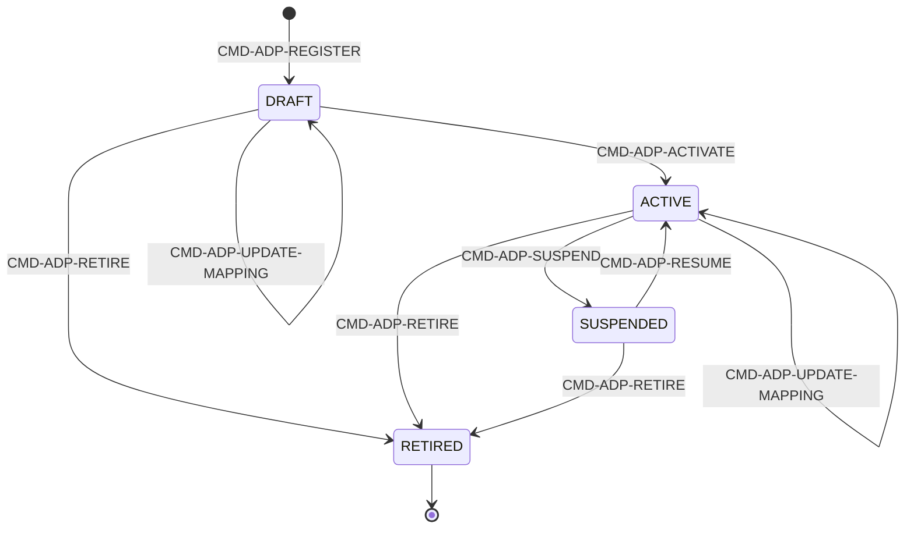

### 6.2 AGG-INTEGRATION-CONNECTION (SLC-16) — اتصال بنظام خارجي
**Invariants:** INV-CON-01 (قاعدة allow-list واحدة معتمَدة من ضابط أمن ≠ الطالب)، INV-CON-02 (لا كتابة إلى ERP/HRIS/DMS/CMMS في R2 — BRL-013، الوحيد المسموح خروجًا هو CAP)، INV-CON-03 (بيانات الاعتماد لا تظهر أبدًا خارج OpenBao).
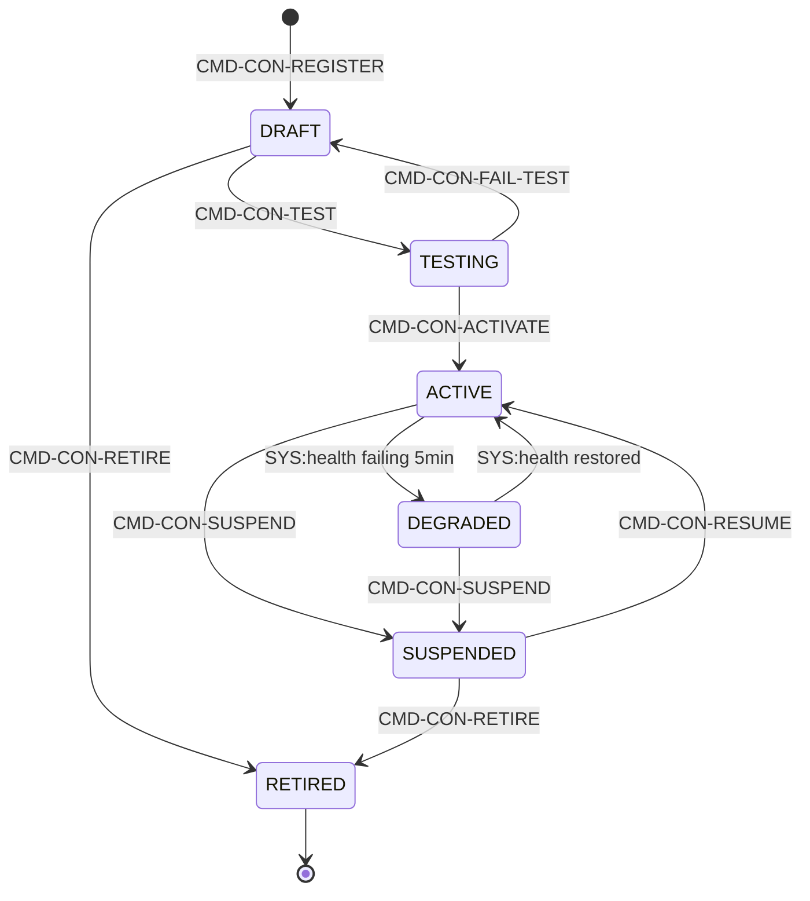

### 6.3 AGG-SENSOR-STREAM (SLC-16) — تدفق قياسات حساس
**Invariants:** INV-SNS-01 (القراءات تدخل فقط كملاحظات عبر دفعات BC02، ≤1000/دفعة)، INV-SNS-02 (مخالفات الجودة توسم البيانات ولا تُسقطها أبدًا)، INV-SNS-03 (وقت الحساس observed_at منفصل عن وقت الاستلام recorded_from).
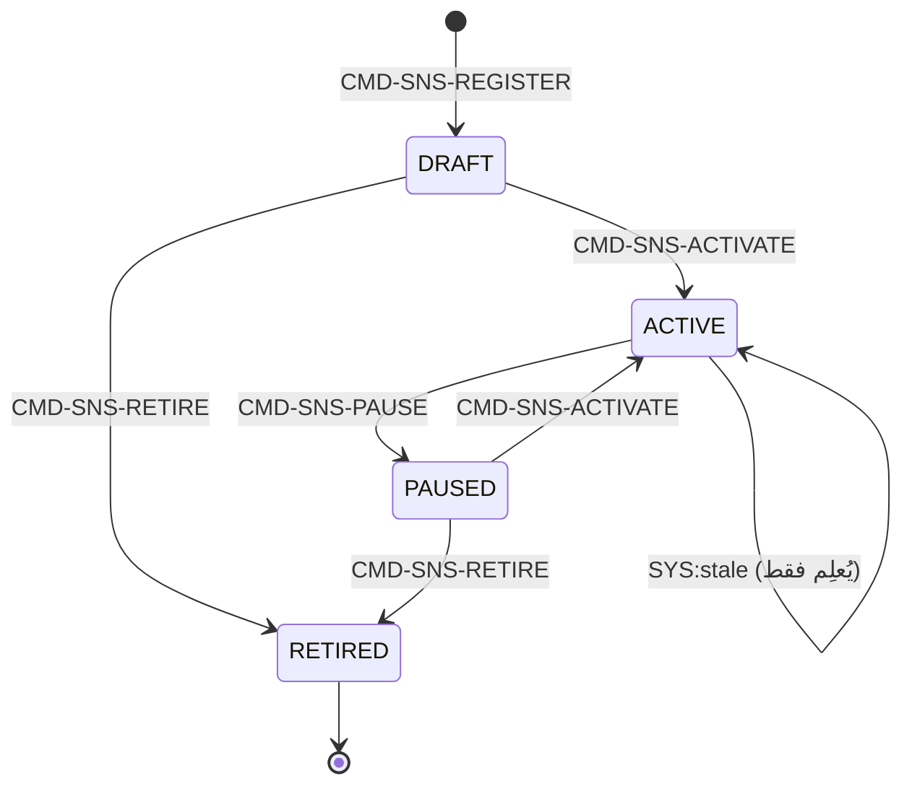

### 6.4 AGG-AI-REQUEST (SLC-10) — طلب ذكاء اصطناعي (الأعقد أمنيًا في BC07)
**Invariants:** INV-AIR-01 (حزمة السياق تحوي فقط ما يرى المستخدم وقت الطلب)، **INV-AIR-02 (المبدأ الأمني الأهم في BC07 — انظر §10)**، INV-AIR-03 (كل عبارة مكتملة تحمل استشهادًا واحدًا على الأقل)، INV-AIR-04 (تسجيل الطلب وهاش الحزمة والنموذج والمخرج)، INV-AIR-05 (لا سياق مصنَّف لنموذج خارجي).
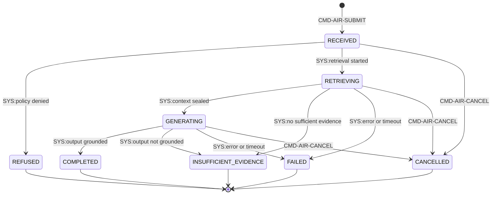

### 6.5 AGG-AI-RESULT (SLC-10) — مخرج AI قابل للمراجعة
**Invariants:** INV-AIRS-01 (لا تغيير حالة عمل بلا إنسان يقبل، AIL≤3 في R2)، INV-AIRS-02 (الآثار المقبولة تحتفظ بالنسب إلى الطلب/حزمة السياق/نسخة النموذج)، INV-AIRS-03 (نتائج المراجعة تُغذّي مجموعة بيانات التقييم).
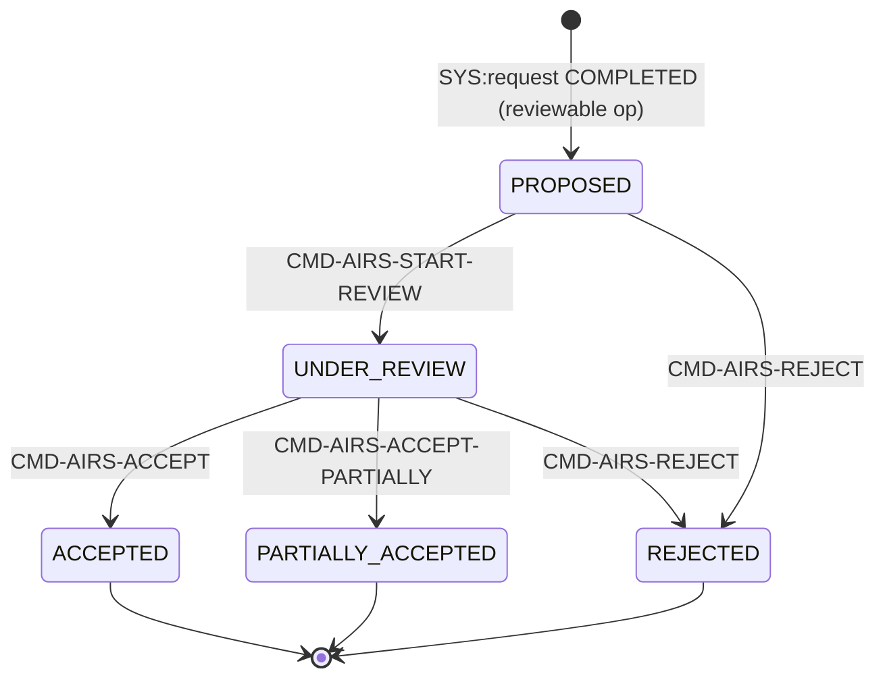

### 6.6 AGG-AI-ROUTING (SLC-10) — توجيه عمليات AI للمستأجر
**Invariants:** INV-RTG-01 (سقف AIL لكل عملية لا يتجاوز مصفوفة الاستقلالية أبدًا — AIL5 غير قابل للتحقق إطلاقًا)، INV-RTG-02 (قوالب التعليمات مُصدَرة وثابتة بمجرد الاستشهاد بها)، INV-RTG-03 (توجيه ACTIVE واحد بالضبط لكل مستأجر).
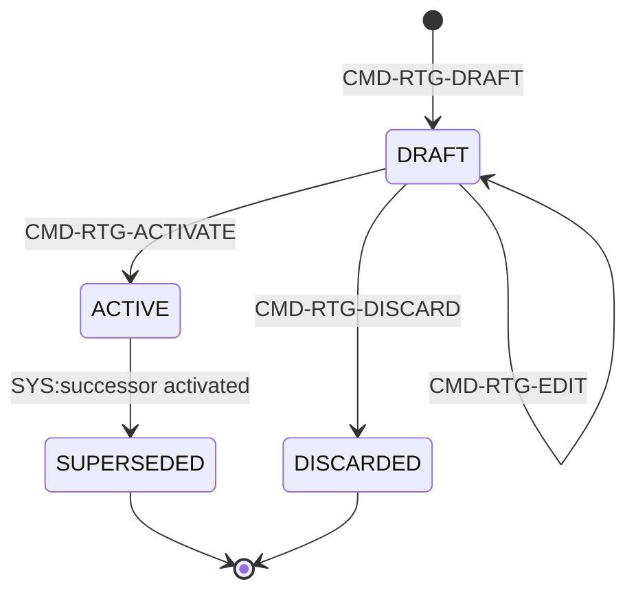

### 6.7 AGG-AI-TOOL (SLC-10) — أداة يمكن لتشغيل AI استدعاؤها
**Invariants:** INV-TOL-01 (لا أداة "كتابة" في R2؛ أدوات "اقتراح" فقط تُنشئ AI-Result للمراجعة)، INV-TOL-02 (تعمل بسلطة المستخدم الطالب عبر واجهات المنصة نفسها)، INV-TOL-03 (لا وصول لشبكات خارجية أبدًا — FIT-12).
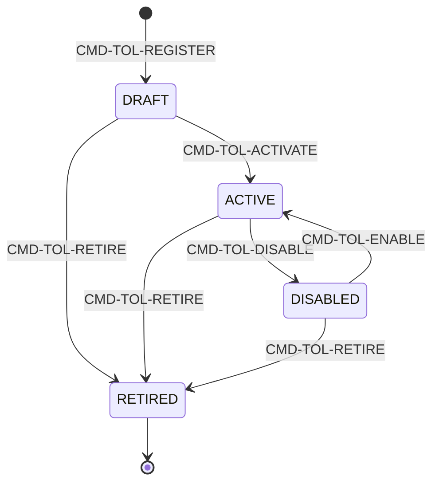

### 6.8 AGG-MODEL-VERSION (SLC-10) — نسخة نموذج
**Invariants:** INV-MDL-01 (فقط PRODUCTION يخدم الإنتاج؛ STAGED حصة تجريبية فقط)، INV-MDL-02 (الاعتماد يتطلب تقرير تقييم يحقق عتبات صارمة؛ المعتمِد ≠ المسجِّل)، INV-MDL-03 (سجلات النماذج لا تُحذف أبدًا).
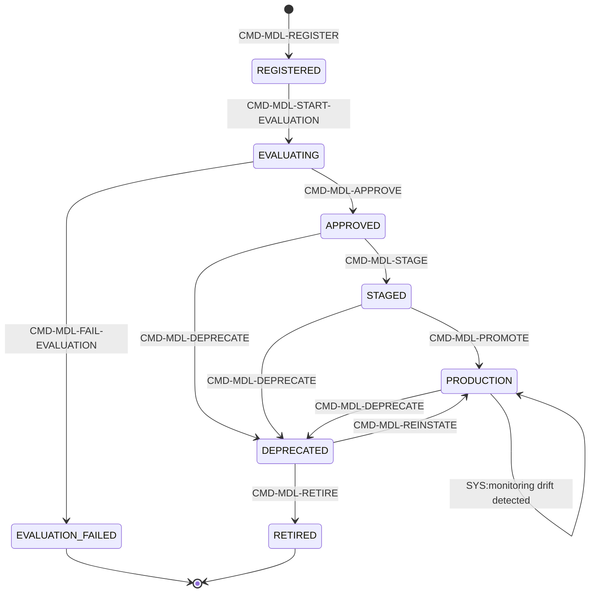

### 6.9 AGG-EVAL-SUITE (SLC-10) — مجموعة تقييم AI
**Invariants:** INV-EVS-01 (ثابتة بمجرد ACTIVE؛ كل تقرير يسمي إصدار المجموعة)، INV-EVS-02 (تتضمن عينات المستأجر قبل خدمة نموذج له).
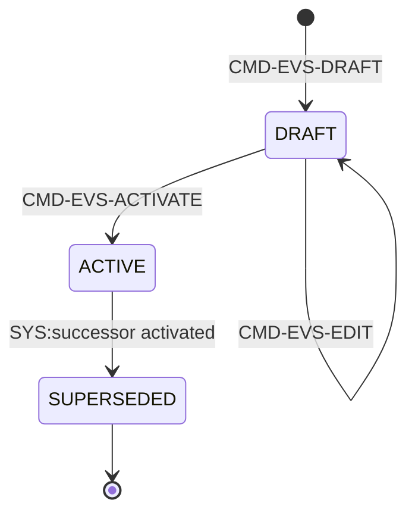

### 6.10 AGG-PROJECTION-VERSION (SLC-05) — إصدار فهرس بحث/رسم بياني (T3، عملياتي بحت)
**Invariants:** INV-PRJ-01 (ليست مصدر حقيقة أبدًا؛ كل مستند قابل لإعادة الإنتاج من السياقات المالكة — يكرر مبدأ INV-SIT-01 في BC03 حرفيًا)، INV-PRJ-02 (ACTIVE واحد فقط لكل (مجموعة مستأجرين، نوع)؛ الترقية ذرية عبر تبديل alias)، INV-PRJ-03 (كل مستند يحمل تصنيفات الأمان الكاملة)، INV-PRJ-04 (تغيير التطبيع/المخطط/نموذج التضمين يتطلب إصدارًا جديدًا، لا إعادة تحليل في المكان).
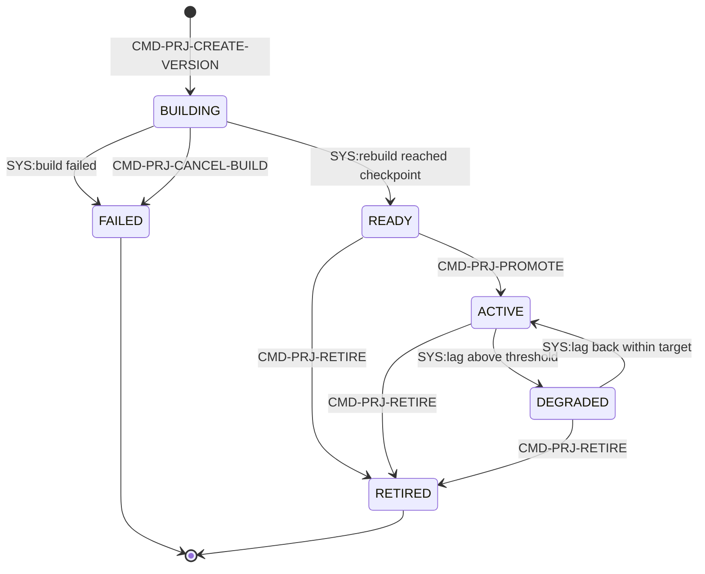

### 6.11 AGG-SYNC-SESSION (SLC-11) — جلسة مزامنة جهاز
**Invariants:** INV-SYN-01 (الأوامر تُطبَّق بترتيب seq الجهاز؛ client_command_id يجعل إعادة التسليم مُتكرِّرًا آمنًا)، INV-SYN-02 (وقت التسجيل = استلام الخادم)، INV-SYN-03 (البوابة تطبّق الأوامر عبر واجهات السياق المالك بسياق أمان المستخدم المفوَّض — لا تجاوز أبدًا)، INV-SYN-04 (لا Last-Write-Wins لـT1/T2 — أي base_version مختلف = تعارض).
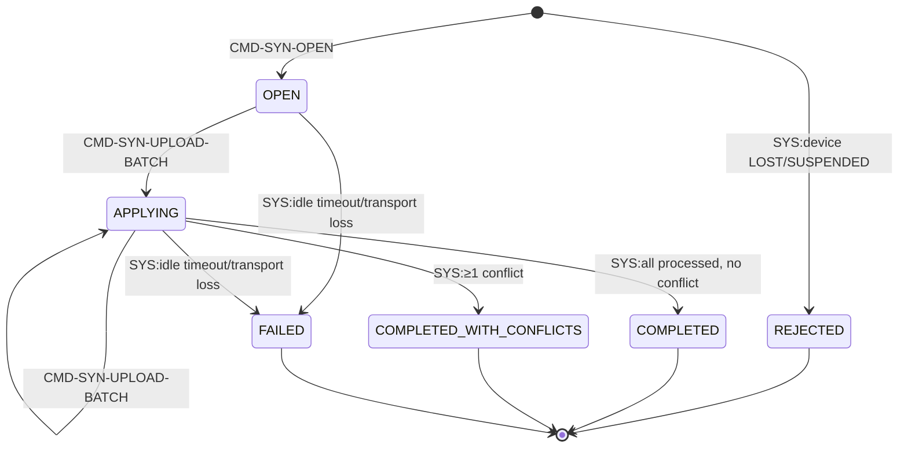

### 6.12 AGG-SYNC-CONFLICT (SLC-11) — تعارض مزامنة (CF-05)
**Invariants:** INV-SCF-01 (الأمر الميداني الأصلي ووقت الجهاز يُحفَظان كدليل)، INV-SCF-02 (إعادة التطبيق لا تتجاوز آلة حالة/حراس/سياسات المالك أبدًا)، INV-SCF-03 (أوامر بعد وقت إعلان الفقدان تُفتح كتعارض دائمًا، لا تُطبَّق آليًا أبدًا).
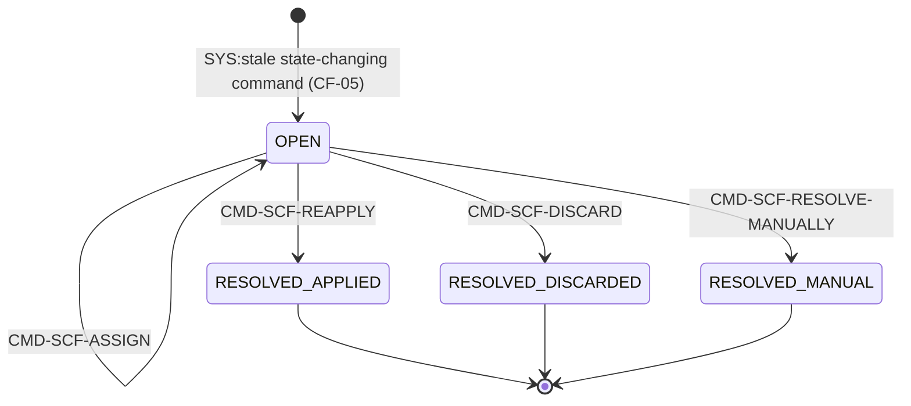

### 6.13 AGG-PRELOAD-PACKAGE (SLC-11) — حزمة بيانات دون اتصال
**Invariants:** INV-PKG-01 (المحتوى لا يتجاوز تخويل المستخدم وقت البناء ولا سقف المستأجر لدون اتصال)، INV-PKG-02 (الحزم تنتهي؛ البيانات المنتهية/المُلغاة غير قابلة للقراءة على الجهاز)، INV-PKG-03 (أي تغيير في security_version المستخدم يُلغي كل حزمه فورًا).
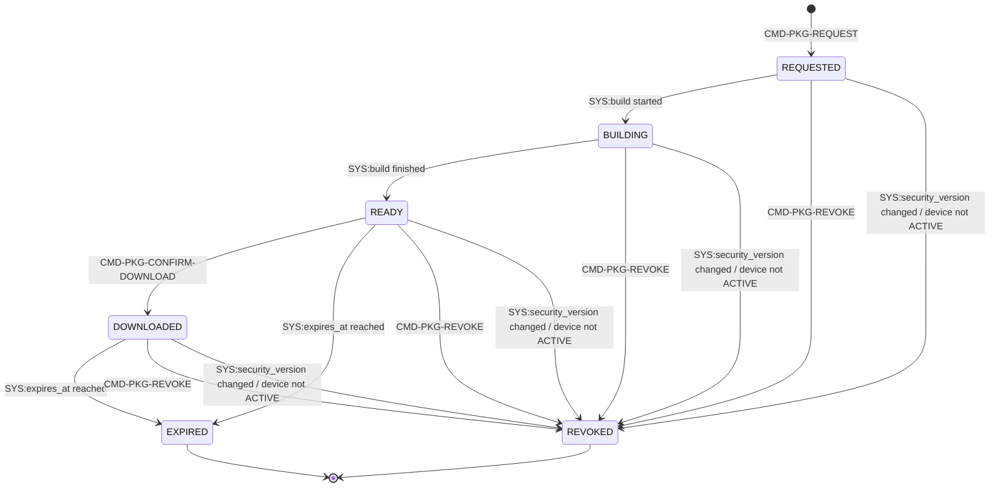

## 7. Commands (58 إجمالًا عبر 13 Aggregate، عبر 5 ملفات commands-slcNN.md)

| Aggregate | Slice | عدد الأوامر | القائمة |
|---|---|---|---|
| AGG-ADAPTER | SLC-02 | 6 | REGISTER, UPDATE-MAPPING, ACTIVATE, SUSPEND, RESUME, RETIRE |
| AGG-PROJECTION-VERSION | SLC-05 | 4 | CREATE-VERSION, PROMOTE, RETIRE, CANCEL-BUILD |
| AGG-AI-REQUEST | SLC-10 | 2 | SUBMIT, CANCEL |
| AGG-AI-RESULT | SLC-10 | 5 | START-REVIEW, ACCEPT, ACCEPT-PARTIALLY, REJECT (+ SYS:proposed) |
| AGG-MODEL-VERSION | SLC-10 | 9 | REGISTER, START-EVALUATION, APPROVE, FAIL-EVALUATION, STAGE, PROMOTE, DEPRECATE, REINSTATE, RETIRE |
| AGG-AI-ROUTING | SLC-10 | 4 | DRAFT, EDIT, ACTIVATE, DISCARD |
| AGG-AI-TOOL | SLC-10 | 5 | REGISTER, ACTIVATE, DISABLE, ENABLE, RETIRE |
| AGG-EVAL-SUITE | SLC-10 | 3 | DRAFT, EDIT, ACTIVATE (SLC-10 مجموع: 2+5+9+4+3=27) |
| AGG-PRELOAD-PACKAGE | SLC-11 | 3 | REQUEST, CONFIRM-DOWNLOAD, REVOKE |
| AGG-SYNC-SESSION | SLC-11 | 2 | OPEN, UPLOAD-BATCH |
| AGG-SYNC-CONFLICT | SLC-11 | 4 | ASSIGN, REAPPLY, DISCARD, RESOLVE-MANUALLY (SLC-11 مجموع: 3+2+4=9) |
| AGG-INTEGRATION-CONNECTION | SLC-16 | 7 | REGISTER, TEST, ACTIVATE, FAIL-TEST, SUSPEND, RESUME, RETIRE |
| AGG-SENSOR-STREAM | SLC-16 | 5 | REGISTER, SET-QUALITY-RULES, ACTIVATE, PAUSE, RETIRE (SLC-16 BC07 مجموع: 7+5=12) |

**تحقق الجمع:** 6(SLC-02) + 4(SLC-05) + 27(SLC-10) + 9(SLC-11) + 12(SLC-16) = **58**. [Explicit، مؤكَّد من كل 5 ملفات commands-slcNN.md بعد تصفية الأوامر غير-BC07 من الملفات المشتركة SLC-02/SLC-11/SLC-16]

**مشترك لكل الـ58 أمرًا:** `Idempotency-Key` إلزامي؛ `If-Match` إلزامي لغير الإنشاء؛ `X-Purpose` و`X-Correlation-Id` إلزاميان؛ استجابة 202/201 بـ`ResourceRef`. [Explicit]

## 8. Queries (19 في الكتالوجات + 1 استعلام داخلي بحت = 20)

| Query | يعيد | من يحق له |
|---|---|---|
| QRY-ADP-GET | المحول ونُسخ التحويل | Administrator |
| QRY-SRCH-QUERY | بحث موحَّد (نص+نوع+مضلَّع/زمن+فلاتر+facets) على الحقائق المرئية فقط | أي مستخدم؛ تصفية مسبقة + إعادة فحص |
| QRY-SRCH-SUGGEST | إكمال تلقائي من الحقائق المرئية فقط | أي مستخدم |
| QRY-GRAPH-NEIGHBORHOOD | عقد/حواف ضمن عمق ≤3 | أي مستخدم؛ تخويل لكل عقدة/حافة |
| QRY-GRAPH-PATHS | مسارات بين كيانين، ≤4 قفزات، عبر المرئي فقط | أي مستخدم؛ تخويل لكل عقدة/حافة |
| QRY-PRJ-STATUS | حالة إصدارات الإسقاط وتأخرها | platform operator |
| QRY-LABEL-CHECK (داخلي، خارج الكتالوج الظاهر) | رؤية الفاعل الممرَّر في سياق الطلب | هوية عبء عمل خدمة الاكتشاف فقط |
| QRY-AIR-GET | الطلب مع الإجابة والاستشهادات (المرئية فقط) والحالة | الطالب؛ Auditor (بيانات وصفية) |
| QRY-AIR-CONTEXT | عناصر حزمة السياق (للتدقيق والمراجعة) | الطالب إن مخوَّل؛ Auditor |
| QRY-AIRS-QUEUE | نتائج AI القابلة للمراجعة حسب الحالة/العملية/الهدف | المراجعون المخوَّلون على الأهداف |
| QRY-MDL-LIST | نُسخ النماذج مع الحالة وملخص التقييم | حوكمة AI، Auditor |
| QRY-RTG-ACTIVE | التوجيه النشط للمستأجر | حوكمة AI، Security Officer |
| QRY-TOL-LIST | سجل الأدوات | حوكمة AI، Security Officer |
| QRY-AI-USAGE | ساعات GPU، الطلبات، مؤشرات التكلفة | Administrator، finance |
| QRY-PKG-GET | بيان الحزمة وهدف التنزيل | مالك الحزمة (جهاز+مستخدم) |
| QRY-SYN-DELTA | تغييرات المهام، تحديثات الحزم، قائمة المسح، إشعارات التعارض | جهاز+مستخدم الجلسة |
| QRY-SCF-LIST | تعارضات المزامنة المفتوحة | المراجعون المخوَّلون |
| QRY-SCF-GET | المغلَّف الأصلي، لقطة الحالة الحالية، سبب الرفض | المراجع المخوَّل |
| QRY-CON-LIST | الاتصالات مع الحالة والصحة وقاعدة allow-list | integration engineers، Security Officer |
| QRY-SNS-LIST | التدفقات مع المعدل والقِدَم وعدد مخالفات الجودة | integration engineers، Analyst |

**تحقق الجمع:** 1(SLC-02)+5(SLC-05 ظاهر)+7(SLC-10)+4(SLC-11)+2(SLC-16) = 19 ظاهرة في use-cases API، +1 داخلي بحت (QRY-LABEL-CHECK) = **20**.

## 9. Events (82 إجمالًا عبر 5 ملفات events-slcNN.md)

| Slice | العدد | التوزيع |
|---|---|---|
| SLC-02 (AGG-ADAPTER) | 6 | REGISTERED, MAPPING-UPDATED, ACTIVATED, SUSPENDED, RESUMED, RETIRED |
| SLC-05 (AGG-PROJECTION-VERSION) | 7 | BUILD-STARTED, READY, FAILED, PROMOTED, DEGRADED, RECOVERED, RETIRED |
| SLC-10 (6 aggregates AI) | 37 | AIR(8) + AIRS(5) + MDL(10) + RTG(5) + TOL(5) + EVS(4) |
| SLC-11 (3 aggregates مزامنة) | 17 | PKG(6) + SYN(6) + SCF(5) |
| SLC-16 (2 aggregates BC07 من الملف) | 15 | CON(9) + SNS(6) |

**المجموع: 6+7+37+17+15 = 82.** [Explicit، معدود سطرًا سطرًا من كل ملف بعد تصفية الأحداث غير-BC07]

**أحداث "تؤثر أمنيًا" (نعم في عمود `يؤثر أمنياً`) — تستهلكها دائمًا نفس الثلاثة: Security-version service، PEP decision caches، Projection security-version table:** EVT-RTG-ACTIVATED، EVT-TOL-ACTIVATED، EVT-TOL-DISABLED، EVT-CON-ACTIVATED، EVT-CON-SUSPENDED. نفس النمط الثابت المكتشَف في BC01 (EVT-SEC-VERSION-INCREMENTED كمُشتق من أي حدث مؤثر أمنيًا) يتكرر هنا حرفيًا.

## 10. Business Rules / Invariants — أثرها

| المجموعة | العدد | نمط مشترك |
|---|---|---|
| INV-ADP-* | 3 | كتابة عبر BC02 فقط + نُسخ ثابتة |
| INV-CON-* | 3 | لا كتابة خارجية (BRL-013) + اعتماد Security Officer منفصل + اعتماد OpenBao |
| INV-SNS-* | 3 | توسيم لا إسقاط + فصل زمن الحساس عن زمن الاستلام |
| **INV-AIR-*** | 5 | **INV-AIR-02 هو المبدأ الأمني الأبرز في BC07 كله** |
| INV-AIRS-* | 3 | لا أثر بلا قبول بشري + نسب + تغذية التقييم |
| INV-RTG-* | 3 | سقف AIL لا يُتجاوَز + توجيه ACTIVE واحد |
| INV-TOL-* | 3 | لا كتابة + لا شبكة خارجية |
| INV-MDL-* | 3 | PRODUCTION فقط يخدم + معتمِد≠مسجِّل + لا حذف |
| INV-EVS-* | 2 | ثبات بعد التفعيل + عينات المستأجر |
| INV-PRJ-* | 4 | ليست مصدر حقيقة أبدًا + ACTIVE واحد + تصنيفات كاملة |
| INV-SYN-* | 4 | ترتيب seq + لا Last-Write-Wins لـT1/T2 |
| INV-SCF-* | 3 | دليل محفوظ + لا تجاوز حراس المالك + لا تطبيق آلي بعد LOST |
| INV-PKG-* | 3 | لا تجاوز تخويل وقت البناء + إلغاء فوري عند تغيير security_version |

**INV-AIR-02 بالتفصيل [Explicit، أهم اكتشاف مبدئي في BC07]:** "retrieved content is data: it can never add tools, change recipients, widen scope or raise AIL" — أول مبدأ دفاعي صريح ضد Prompt Injection في المنصة كلها (مؤكَّد في THR-S10-02). تمييز صارم "بيانات" مقابل "تعليمات" لم يظهر بهذا الوضوح في أي BC سابق لأنه خاص بمخاطر LLM تحديدًا.

**نمط "المُسقَط ليس مصدر حقيقة" يتكرر عبر BC مختلف [Derived، مؤكَّد للمرة الثانية]:** `INV-PRJ-01` يكرر حرفيًا نفس مبدأ `INV-SIT-01` في BC03 (الموقف "يخزّن فقط تعريفًا وعضوية، الأعضاء يبقون مملوكين لسياقاتهم") — مبدأ "لا نسخ للحقيقة، فقط إسقاطات قابلة لإعادة البناء" مؤكَّد الآن عبر BC مختلف تمامًا.

## 11. Policies — 58 سياسة أمر (BC07 فقط) + 20 سياسة استعلام + Platform Baselines PB-12..14

**تسلسل Platform Baselines الكامل عبر المنصة (PB-01..14):**

| المجموعة | من | إلى | BC المصدر |
|---|---|---|---|
| PB-01..07 | عامة (تخويل/تصنيف/تدقيق/SoD) | BC01 | الأساس |
| PB-08..11 | معلومات (هوية مصدر، تصنيف كتابة، تعميم موقع، قطع نسب) | BC02 | حماية المصادر والموقع — تُطبَّق على كتابات AGG-ADAPTER/AGG-SENSOR-STREAM عبر BC02 لأنها تكتب عبر أوامره |
| **PB-12** | **AI requests execute and retrieve with the requesting user's authorization only** | **BC07** | تخويل الاسترجاع |
| **PB-13** | **classified context never sent to external models** | **BC07** | منع السياق المصنَّف خارجيًا |
| **PB-14** | **AIL5 forbidden; R2 maximum AIL3** | **BC07** | سقف الاستقلالية |

**SoD (6 مواضع مؤكَّدة + حالة سابعة حدّية):**

| الأمر | Aggregate | شرط SoD |
|---|---|---|
| CMD-ADP-ACTIVATE | AGG-ADAPTER | approver ≠ author |
| CMD-CON-ACTIVATE | AGG-INTEGRATION-CONNECTION | Security Officer ≠ requester (GOV-005) |
| CMD-MDL-APPROVE | AGG-MODEL-VERSION | approver ≠ registrar |
| CMD-MDL-PROMOTE | AGG-MODEL-VERSION | approver ≠ stager |
| CMD-RTG-ACTIVATE | AGG-AI-ROUTING | approver ≠ author |
| CMD-EVS-ACTIVATE | AGG-EVAL-SUITE | approver ≠ author |

**حالة سابعة حدّية [Needs Review، ملاحظة دقة جديدة]:** `POL-TOL-ACTIVATE` يحمل حقل `segregation_of_duties: Security Officer` — لكنه لا يتبع نمط "X ≠ Y" الصريح، بل يشترط أن يكون المفعِّل Security Officer تحديدًا (دور مختلف عن AI platform engineer المسجِّل) دون اشتراط أنهما شخصين مختلفين بالضرورة إن جمع أحدهم الدورين. صُنِّفت كـ"فصل أدوار" (RBAC) لا "فصل واجبات" (SoD) كلاسيكي بمعنى "لا يعتمد نفسه" — ولذلك لم تُحسَب ضمن الستة أعلاه، لكنها تستحق تمييزًا صريحًا هنا بدل إغفالها.

**صفر SoD في:** AGG-SENSOR-STREAM، AGG-PRELOAD-PACKAGE، AGG-SYNC-SESSION، AGG-SYNC-CONFLICT، AGG-AI-REQUEST، AGG-AI-RESULT (عمليات ذاتية/تقنية أو محكومة بمراجعة بشرية أصلاً لا فصل واجبات إضافي).

**تحذير Slice≠BC مؤكَّد على مستوى السياسات [Explicit]:** `policies-slc02.md` يحوي 57 سياسة أمر، منها **6 فقط** (POL-ADP-*) لـBC07 والباقي (51) لـBC02. `policies-slc16.md` يحوي 18 سياسة أمر، منها **12** (POL-CON-*×7 + POL-SNS-*×5) لـBC07، و2 (POL-HRS-*) لـBC01، و4 (POL-CAP-*) لـBC03. `policies-slc11.md` يحوي 16 سياسة أمر، منها **9** لـBC07 (POL-PKG-*×3 + POL-SYN-*×2 + POL-SCF-*×4) و7 (POL-DEV-*) لـBC01.

## 12. Security & Threats (STRIDE + OWASP LLM — 23 تهديدًا لـBC07، بعد تصحيح)

**⚠️ تصحيح [مكتشَف هذه الجولة]:** المسودة السابقة ذكرت "26 تهديدًا، الأكبر لأي BC حتى الآن" لكن جمع التوزيع المذكور فعليًا (SLC-05: 8 + SLC-10: 6 + SLC-11: 6 + SLC-16: 3) يساوي **23** لا 26 — خطأ جمع حسابي بسيط في المسودة الأولى لم يُتحقَّق منه رقميًا. العدد الصحيح المؤكَّد بإعادة الجمع هذه الجولة هو **23**. يبقى BC07 أكبر BC من حيث عدد التهديدات المسندة له مباشرة رغم التصحيح (BC01: 11، على سبيل المقارنة).

| المجموعة (Slice) | العدد | نمط STRIDE المهيمن |
|---|---|---|
| SLC-05 (بحث/فهرسة) | 8 | Info Disclosure يهيمن بالكامل تقريبًا (7 من 8) |
| SLC-10 (AI + OWASP LLM) | 6 | متوازن: Info Disclosure(2)، Elevation(1)، Tampering(2)، — |
| SLC-11 (مزامنة ميدانية) | 6 | متنوع: Info Disclosure، Spoofing، Repudiation، Tampering×2، Elevation |
| SLC-16 (BC07 من أصل 5) | 3 | Info Disclosure(1)، Tampering(2) |
| **المجموع** | **23** | |

**تهديدات SLC-10 بالتفصيل (STRIDE + OWASP LLM):**

| THR | المكوّن | STRIDE | المخاطرة المتبقية |
|---|---|---|---|
| THR-S10-01 | استرجاع السياق | Info Disclosure | L |
| THR-S10-02 | المحتوى المسترجَع | Elevation (Prompt Injection غير المباشر) | L |
| THR-S10-03 | المخرَج | Info Disclosure (تسريب عبر روابط) | L |
| THR-S10-04 | المخرَج | Tampering (هلوسة) | **M (مقبولة صراحة)** |
| THR-S10-05 | سلسلة توريد النموذج | Tampering | L |
| THR-S10-06 | تعدد المستأجرين | Info Disclosure (تسرّب عبر ذاكرة تخزين مؤقت/ضبط دقيق) | L |

**تهديدات SLC-16 الخاصة بـBC07 (3 من 5، بعد توزيع كامل تم تأكيده):**

| THR | المكوّن | STRIDE | المخاطرة المتبقية |
|---|---|---|---|
| THR-S16-03 | DMS (عبر AGG-INTEGRATION-CONNECTION) | Info Disclosure | L |
| THR-S16-04 | Connections (نفس الـaggregate) | Tampering | L |
| THR-S16-05 | Sensors (عبر AGG-SENSOR-STREAM) | Tampering | **M (مقبولة صراحة)** |

**توزيع SLC-16 الكامل (5/5 محسوم):** BC01(1: THR-S16-02 HRIS) + BC03(1: THR-S16-01 Outbound/CAP) + BC07(3: THR-S16-03/04/05) = 5. [Explicit، مؤكَّد]

**مخاطرتان متبقيتان M مقبولتان صراحة (accepted_residual_risks) — بلا تغيير عن المسودة السابقة:**
- **THR-S10-04** (هلوسة مقدَّمة كحقيقة): "grounding reduces but cannot eliminate wrong statements; effects always need human acceptance (AIL ≤ 3)"
- **THR-S05-08** (قناة توقيت متبقية): "residual timing channel from index-internal filter cost — accepted; monitored in inference suite"

بالإضافة، ثلاث مخاطرات M أخرى مقبولة صراحة داخل تفاصيل الشرائح: THR-S11-05 (ساعة جهاز مُتلاعَب بها، تُخفَّف بعلم انحراف + SoD تحقق + تعزيز مصدر)، THR-S16-05 (بوابة حساس مخترَقة، تُخفَّف بموثوقية المصدر والتعزيز)، وTHR-S02-01/04/07 (خارج BC07 — تخص BC02 من نفس ملف SLC-02).

**نمط OWASP LLM صريح [Explicit]:** ملف `threat-model-slc10.md` يحمل حقل `not_in_R2` صراحة: لا ضبط دقيق (fine-tuning) على بيانات المستأجر، لا تنفيذ أداة مستقل ذاتيًا، لا نموذج خارجي للبيانات المصنَّفة — هذه قيود تصميم صريحة موثَّقة كجزء من الـthreat model نفسه لا كملاحظة هامشية.

## 13. Data & APIs

- **النموذج المنطقي:** `06-data/logical-model/slc-02.md` (ADAPTER جزء منه فقط)، `slc-05.md` (PROJECTION-VERSION)، `slc-10.md` (الـ6 aggregates AI)، `slc-11.md` (SYNC-SESSION/CONFLICT/PRELOAD-PACKAGE)، `slc-16.md` (INTEGRATION-CONNECTION/SENSOR-STREAM جزء منه فقط) — **خمسة ملفات منفصلة لنفس الـBC**، مطابقة تمامًا لعدد ملفات الأوامر/السياسات/التهديدات. [مسار موجود، لم تُقرأ محتوياته بالكامل هذه الجولة — انظر §20]
- **العقود:** `05-contracts/openapi-integration-slc02.md`، `openapi-integration-slc16.md`، `openapi-discovery-slc05.md`، `openapi-ai-slc10.md`، `openapi-field-slc11.md`، بالإضافة إلى `asyncapi-slcNN.md` و`errors-slcNN.md` لكل شريحة من الخمس. [مسارات موجودة ومؤكَّدة عبر فحص الدليل — لم تُقرأ محتوياتها بالكامل هذه الجولة]

## 14. Integrations

هذا القسم محوري لهوية BC07 — القائمة الصريحة:

- **محولات أنظمة خارجية (Adapters):** ERP، HRIS، DMS، CMMS — تُسجَّل عبر AGG-ADAPTER، تكتب حصرًا عبر أوامر BC02 بهوية حساب خدمة (INV-ADP-01)؛ لا كتابة مباشرة أبدًا.
- **اتصالات الأنظمة الخارجية (Connections):** AGG-INTEGRATION-CONNECTION يدير الاتصال الفعلي (بروتوكول، اتجاه، allow-list) لخمسة أنواع أنظمة: erp, hris, dms, cmms, sensor_gateway، بالإضافة إلى cap_endpoint (الوحيد المسموح بالخروج outbound في R2 — INV-CON-02).
- **تدفقات الحساسات (Sensor Streams):** AGG-SENSOR-STREAM يستوعب قياسات عبر بوابة حساس مرتبطة باتصال، بمعدل متوقَّع وقواعد جودة (توسيم لا إسقاط).
- **مزودو نماذج الذكاء الاصطناعي:** AGG-MODEL-VERSION يسجّل نُسخ نماذج محلية افتراضيًا (`hosting: local`) مع مسار محكوم لنموذج خارجي (`external_allowed`) مقيَّد ببيانات غير مصنَّفة وسياسة مستأجر فقط (PB-13).
- **مزامنة الأجهزة الميدانية:** AGG-SYNC-SESSION يطبّق أوامر الجهاز عبر واجهات السياق المالك بسياق أمان المستخدم المفوَّض، معتمدًا على AGG-DEVICE (**BC01**) ليكون ACTIVE.
- **HRIS كتكامل مصدره BC01 لا BC07:** AGG-HR-SYNC-PROPOSAL يعيش في نفس SLC-16 لكنه BC01 — ليس تكرارًا لدور Adapter/Connection بل مسارًا منفصلاً تمامًا (اقتراح تغيير دور/تنظيم، لا استيعاب بيانات).

## 15. Verification / Acceptance

تأكَّد وجود ملفات `*-state-machine.md` لكل الـ13 aggregate عبر أدلة `13-verification/acceptance/SLC-{02,05,10,11,16}/` (فحص وجود الملفات فقط عبر الدليل، وليس قراءة محتواها سطرًا سطرًا):

| Slice | ملفات state-machine BC07 الموجودة |
|---|---|
| SLC-02 | adapter-state-machine.md (1) |
| SLC-05 | projection-version-state-machine.md (1) |
| SLC-10 | ai-request, ai-result, ai-routing, ai-tool, eval-suite, model-version (6) |
| SLC-11 | sync-session, sync-conflict, preload-package (3) — (device-state-machine.md موجود لكنه BC01) |
| SLC-16 | integration-connection, sensor-stream (2) — (cap-message-state-machine.md وhr-sync-proposal-state-machine.md موجودان لكنهما BC03/BC01) |

**المجموع: 1+1+6+3+2 = 13 ملفًا، مطابق تمامًا لعدد الـ13 aggregate.** [Explicit — تطابق مُشجِّع، لكن **لم تُفحص أسطر أي من هذه الملفات الـ13 حرفيًا في هذه الجولة**] — [Missing — يحتاج جولة تحقق تالية لتأكيد نسب Gherkin/جداول الانتقالات المطابقة كما فُعِل فعليًا لـTST-AUTHORITY-GRANT-SM/TST-CLEARANCE-SM في BC01].

## 16. Dependencies (خارج BC07)

| من | العلاقة | إلى |
|---|---|---|
| AGG-ADAPTER | `writes_through` | BC02 (فقط عبر أوامرها، أبدًا مباشرة — INV-ADP-01) |
| AGG-SENSOR-STREAM | `writes_through` | BC02 (دفعات CMD-OBS-RECORD، ≤1000/دفعة) |
| AGG-AI-REQUEST | `depends_on` | كل BC (الاسترجاع المؤرَّض يقرأ من أي سياق مرئي للمستخدم) |
| AGG-AI-RESULT (accept) | `calls` | أوامر مالكة عبر BCs أخرى (مثال: `CMD-CLM-ASSERT` في BC02، `CMD-ER-PROPOSE`) |
| AGG-SYNC-SESSION | `depends_on` | BC01 (AGG-DEVICE — الجهاز يجب أن يكون ACTIVE، ليس LOST/SUSPENDED) |
| AGG-PROJECTION-VERSION | `derives_from` | كل BC (كل مستند قابل لإعادة الإنتاج من السياقات المالكة، INV-PRJ-01) |
| PB-12..14 | `constrains` | كل BC آخر (وصول AI مقيَّد بتخويل المستخدم الطالب فقط، لا سياق مصنَّف خارجيًا، سقف AIL3) |
| PB-08..11 (BC02) | `constrains` | AGG-ADAPTER، AGG-SENSOR-STREAM (كتاباتهما تمر عبر قواعد BC02 هذه) |
| AGG-HR-SYNC-PROPOSAL (BC01) | يعيش في نفس SLC-16 | لا علاقة تنفيذية مباشرة مع BC07 — تمييز توضيحي لا اعتماد فعلي |
| AGG-CAP-MESSAGE (BC03) | يعيش في نفس SLC-16 | لا علاقة تنفيذية مباشرة مع BC07 — نفس التمييز |

## 17. Cross-BC Relationships (ملخص)

BC07 هو **طبقة "المواجهة الخارجية + تعزيز AI"** التي تلامس تقريبًا كل BC آخر عبر وصول مقيَّد صارم: AGG-AI-REQUEST يقرأ (لا يكتب أبدًا مباشرة) من أي سياق مرئي للمستخدم الطالب عبر كل BC؛ AGG-AI-RESULT عند القبول يستدعي أوامر المالك الفعلية في BCs أخرى فيصبح "وكيلًا" (agent) موسومًا في نسب التغيير لا مصدرًا مستقلًا للحقيقة؛ AGG-ADAPTER وAGG-SENSOR-STREAM يكتبان حصرًا عبر أوامر BC02؛ AGG-PROJECTION-VERSION يُعيد بناء كل شيء من كل BC كإسقاط قابل للتخلص منه لا كنسخة موازية. هذا نمط "Conformist/Anticorruption مزدوج" بمصطلحات DDD: BC07 يتوافق تمامًا مع نماذج البيانات المملوكة من غيره (لا يفرض نموذجه) لكنه يحمي حدوده الخاصة بثلاثة مبادئ صريحة غير مسبوقة قبل هذا الـBC: "البيانات لا يمكنها التصعيد" (INV-AIR-02)، "لا نسخ للحقيقة" (INV-PRJ-01، مكرَّر من BC03)، و"لا كتابة للخارج" (INV-CON-02/BRL-013).

## 18. Traceability

الرجوع الكامل موجود في `01-entity-index.md` (كل ID من هذا الملف — 13 aggregate، 58 أمر، 82 حدث، 20 استعلام، 23 تهديد — قابل للبحث فيه مع كل الملفات المرجعية له) و`02-relationship-index.md` (العلاقات الدلالية المصنَّفة، بما فيها نمط "الشريحة ≠ BC" المسجَّل في §7/§19 منه).

## 19. Conflicts

فُحص `spec/17-system-study/05-conflicts.md` بالكامل (4 تعارضات مسجَّلة: CONFLICT-01 وCONFLICT-02 مُغلَقان، CONFLICT-03 وCONFLICT-04 مفتوحان):

- **لا تعارض من الأربعة يخص BC07 كموضوع أساسي.** CONFLICT-03 (فجوة RD-* المرجعية) يخص BC04/BC05 حصرًا. CONFLICT-04 (نطاق AGG-ERASURE-REQUEST) يخص BC05/BC08 حصرًا.
- **CONFLICT-02 (نمط الشريحة ≠ BC) يذكر BC07 كمساهم في اكتشافه لا كطرف نزاع:** دراسة BC07 هي التي اكتشفت THR-S16-02 المفقود بالكامل (الحالة #2 في جدول CONFLICT-02) وصحَّحته في `bc01-foundation.md` رجعيًا؛ هذا موثَّق ومُغلَق بالفعل، لا يحتاج فتحًا جديدًا هنا.
- **لا تعارضات جديدة اكتُشفت** في هذه الجولة بين الـ13 aggregate وملفاتها الخمس، خلاف التصحيحين العدديين الموثَّقين في §4 و§12 (وهما تصحيحا دقة/جمع لا تعارضات مصدرية بمعنى CONFLICT-0X).

## 20. Missing Information (مُجمَّعة هذه الجولة)

1. **actors: TBD صراحة في use-cases.md لخمس حالات استخدام أساسية بالذكاء الاصطناعي (UC-070..074).** الفاعلون المذكورون في §3/§5 لهذه الحالات مُستنتَجون [Inferred] من `policies-slc10.md` لا موثَّقون مباشرة في use-cases.md نفسه. **[Missing — يحتاج تحديث use-cases.md من فريق آخر، هذا الملف لا يُعدِّله].**
2. **لا Use Case مخصَّصة لـAGG-AI-ROUTING، AGG-AI-TOOL، AGG-MODEL-VERSION، AGG-EVAL-SUITE.** يُحتمَل أن يكون هذا "بالتصميم" (عمليات حوكمة/تشغيل داخلية بلا واجهة مستخدم نهائي، شبيهًا بنمط OQ-034 في BC01) لكن **لا قرار مسجَّل رسميًا بهذا الخصوص لـBC07** كما حدث لـBC01. [Needs Review — يستحق فتح OQ مماثل في `00-governance/registers/open-questions.md`، لكن هذا خارج صلاحية هذا الملف — يُبلَّغ فقط].
3. **REQ-SRC-004 وREQ-AI-009/010/011/013 بلا Use Case.** نفس نمط "بالتصميم" المحتمَل، لكن غير محسوم رسميًا لـBC07 (بخلاف REQ-FND-010/013 وREQ-GOV-002 في BC01 التي حُسمت عبر OQ-034 صراحة). [Needs Review].
4. **محتوى ملفات `06-data/logical-model/slc-0{2,5,10,11,16}.md` و`05-contracts/*` لم يُقرأ سطرًا سطرًا** — تأكَّد وجود المسارات فقط. [Missing — جولة تحقق تالية].
5. **محتوى ملفات `*-state-machine.md` الـ13 لم يُقرأ سطرًا سطرًا** — تأكَّد وجود الملفات ومطابقة عددها لعدد الـaggregates فقط (13=13)، دون تأكيد تطابق حرفي لكل جدول انتقالات مع الأصل كما فُعِل لـBC01. [Missing — جولة تحقق تالية].
6. **POL-TOL-ACTIVATE (§11) صياغة حدّية بين RBAC وSoD الكلاسيكي** — تحتاج توضيحًا من صاحب السياسة الأصلي إن كانت "Security Officer فقط" تعني أيضًا "≠ المسجِّل" ضمنيًا أم لا. [Needs Review].

## 21. Completeness Status

| الفحص | الحالة |
|---|---|
| كل Aggregate له Purpose/States/Commands/Events؟ | ✅ 13/13 (front-matter `bounded_context` مُتحقَّق فرديًا لكل واحد) |
| كل Command مرتبط بـAggregate/Policy؟ | ✅ 58/58 (مؤكَّد من 5 ملفات commands-slcNN.md بعد تصفية غير-BC07) |
| كل Event له Producer وConsumer؟ | ✅ 82/82 |
| كل Query مرتبط بسياسة؟ | ✅ 20/20 (19 ظاهر + 1 داخلي) |
| كل Requirement مرتبط بـUC (أو مُعلَّم بوضوح كفجوة)؟ | ⚠️ 10/23 بلا UC — بعضها [Needs Review] لا "بالتصميم" محسوم (بخلاف BC01) |
| Threat model مربوط ومُعاد جمعه رقميًا؟ | ✅ 23/23 مع تصنيف STRIDE ومخاطرة متبقية (بعد تصحيح 26→23) |
| كل UC مرتبط بـAggregate منفِّذ (ولو Cross-BC)؟ | ✅ لكل UC مذكور في §5، مع تمييز صريح لحالات Cross-BC (UC-093→BC01، UC-090→BC02 أساسًا) |
| Policies مفحوصة ومُصفَّاة بدقة من الملفات المشتركة (Slice≠BC)؟ | ✅ SLC-02 (6/57)، SLC-11 (9/16)، SLC-16 (12/18) |
| **الحالة الإجمالية** | **OPEN** — بندان يحتاجان قرارًا بشريًا/عملًا من فريق آخر (actors: TBD في use-cases.md؛ فتح OQ مماثل لـOQ-034 لـBC07)؛ باقي الفجوات هي جولات تحقق تالية (قراءة logical-model/contracts/state-machines سطرًا سطرًا) لا فجوات مصدرية حرجة |
