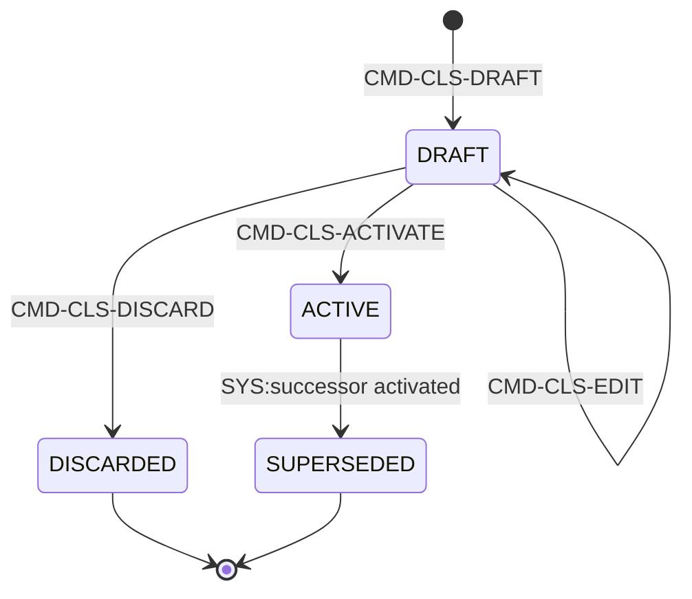
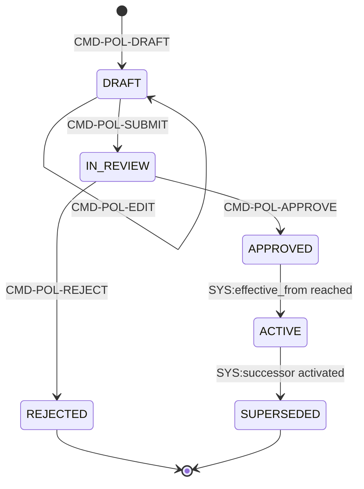
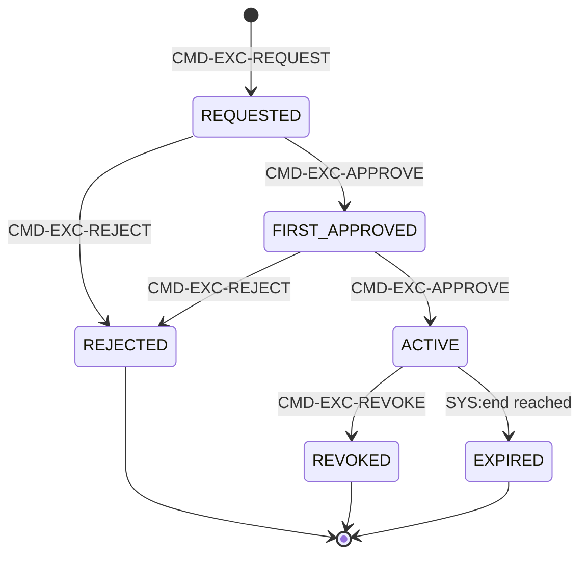
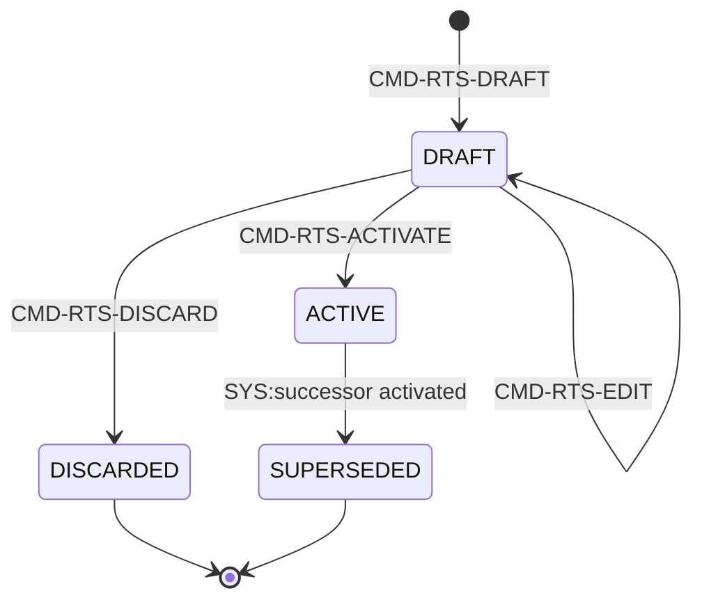
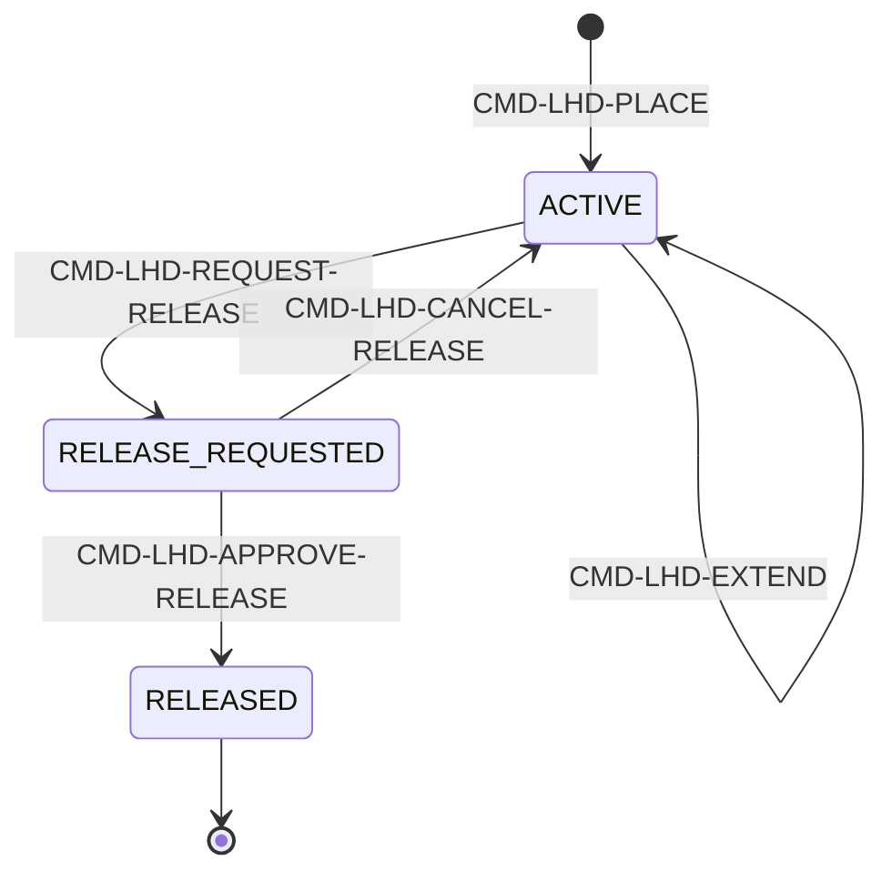
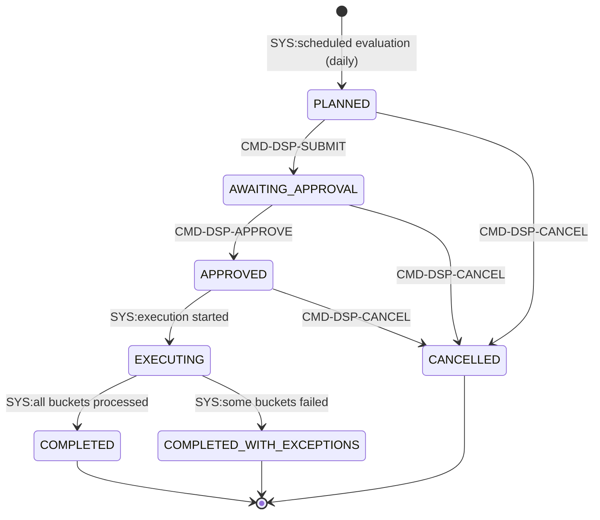
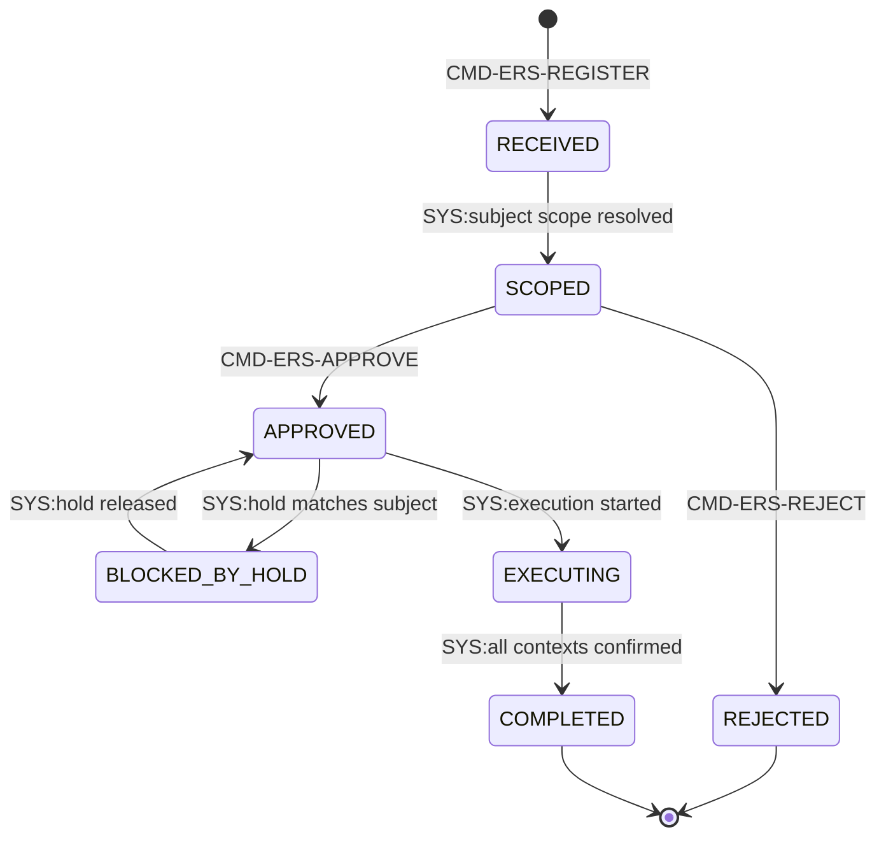

# BC08 — الحوكمة والأمن ودورة حياة البيانات (Classification, Policy, Retention, Legal Hold, Disposition, Erasure)

## المستوى الأول — شرح مبسّط

هذا الـBC هو "الطبقة التي تحكم كل الطبقات الأخرى": نظام تصنيف كل مستأجر (المستويات والمقصورات) ومجموعة سياساته (جداول قرار فوق الأساس الثابت للمنصة)، استثناءات أمنية مؤقتة موثّقة بموافقة شخصين، ثم دورة حياة البيانات الكاملة من الطرف الآخر: جدول احتفاظ يحدد متى يُتلَف كل نوع سجل، تجميد قانوني يوقف ذلك مؤقتًا عند نزاع، دورة إتلاف فعلية عبر تدمير المفاتيح لا حذف الصفوف، وطلب محو خاص ببيانات شخص محدد (الحق في النسيان).

## المستوى الثاني — التفاصيل الهندسية

---

## 1. الهوية

- **Bounded Context:** BC08
- **Domain:** DOM-25 (الحوكمة والأمن والامتثال)
- **Parent Capabilities:** CAP-13.01 (التصنيف والسياسات)، CAP-13.03 (الخصوصية والاحتفاظ — محو البيانات الشخصية)، CAP-13.04 (السيادة وإقامة البيانات — REQ-GOV-005، لا aggregate خاص بها)، CAP-11.02 (السجلات والاحتفاظ — الاحتفاظ والتجميد القانوني)

## 2. المعنى التجاري (Business Meaning)

**Definition:** الطبقة التي تحكم التصنيف والسياسات والاستثناءات الأمنية من جهة، ودورة حياة البيانات الكاملة (احتفاظ، تجميد قانوني، إتلاف، محو) من جهة أخرى — "الحارس الأخير" الذي يتحكم بكل قرار وصول عابر للمنصة وبكل عملية إتلاف/محو لا رجعة فيها. [Explicit]

**Purpose / Business Objective:** OUT-04 (الحوكمة والامتثال)، مع امتداد صريح لـOUT-06 (المعرفة والذاكرة المؤسسية) عبر CAP-11.02. [Derived — من capabilities.md]

**Scope:** تعريف مخطط التصنيف (مستويات/مقصورات/caveats) لكل مستأجر، مجموعة سياسات المستأجر (تُقيِّد الأساس الثابت للمنصة لا تتجاوزه)، طلب/اعتماد استثناء أمني مؤقت، جدول احتفاظ يغطي كل فئات السجلات، تجميد قانوني يوقف الإتلاف/المحو مؤقتًا، دورة تشغيل الإتلاف الفعلي (Disposition Run)، وطلب محو بيانات شخص محدد (Erasure Request).

**Out of Scope:** تنفيذ قرار PDP نفسه لكل طلب فردي (البنية التحتية عبر المنصة كلها، لا aggregate واحد)، تصريح المستخدم الفردي (Clearance — **BC01**، AGG-CLEARANCE)، حدود الولاية القضائية على مستوى النشر الفعلي (REQ-GOV-005 — بنية تحتية، لا aggregate).

**ملاحظة معمارية [Explicit، مؤكَّد]:** شريحة SLC-01 **مشتركة** بين BC01 وBC08 — ثلاثة aggregates من الشريحة نفسها (AGG-CLASSIFICATION-SCHEME، AGG-POLICY-SET، AGG-SECURITY-EXCEPTION) تحمل `bounded_context: BC08` صراحة رغم عيشها في نفس ملفات `commands-slc01.md`/`queries-slc01.md`/`events-slc01.md`/`policies-slc01.md`/`threat-model-slc01.md` التي توثِّق أيضًا BC01. أما SLC-12a فخالصة BC08 بالكامل (4 aggregates).

**قصة CR-65 / إغلاق CONFLICT-01 نهائيًا [Explicit]:** الفحص الأخير المتبقي من CR-64's residual_note كان: هل يُفترض أن يُعلن `AGG-CLASSIFICATION-SCHEME.md` صراحة `satisfies: REQ-GOV-004`؟ التحقق المباشر من traces الملف يؤكد أن الإجابة نعم وأنها **مُطبَّقة فعليًا في المصدر** — `INV-CLS-04` ("تفعيل المخطط يزيد security_version لكل الفاعلين في المستأجر") هو آلية إنفاذ REQ-GOV-004 على مستوى المخطط بأكمله. هذا يُغلِق سلسلة ثلاث نقاط إنفاذ موثَّقة الآن جميعًا صراحة: (أ) نمط `CMD-*-RECLASSIFY` لكل كائن على حدة (BC02 وBC03)، (ب) `AGG-CLEARANCE` (BC01، CR-64، UC-089) لجانب تصريح المستخدم، (ج) `AGG-CLASSIFICATION-SCHEME` (BC08، CR-65) لجانب المخطط بأكمله. انظر §19 للتفصيل الكامل المرجعي.

**Features (طبقة بين Capability وUse Case):** غير موجودة في المصادر — لا يوجد أي كيان `FEAT-*` في `spec/`، وملف `01-business/capabilities.md` ينتقل من Capability مباشرة إلى Use Case. لذلك تبدأ سلسلة هذا الـBC من CAP ثم UC. **[Missing في المصدر]** (السلسلة الكاملة لكل Aggregate في [02-relationship-index.md §21](02-relationship-index.md)).

## 3. Actors

| Actor | الدور في BC08 | Evidence |
|---|---|---|
| **Security Officer** | صياغة/اعتماد مخطط التصنيف ومجموعة السياسات؛ اعتماد/رفض/إلغاء الاستثناءات الأمنية (لا يعتمد طلبه الخاص) | [Explicit] |
| **any authorized requester** | تقديم طلب استثناء أمني (لا يعتمده) | [Explicit] |
| **Archivist** | صياغة/تعديل/إسقاط جدول الاحتفاظ؛ تقديم/إلغاء تشغيلة الإتلاف (Disposition Run) | [Explicit] |
| **Legal/Compliance authority** | اعتماد جدول الاحتفاظ؛ وضع/تمديد/طلب واعتماد وإلغاء الإفراج عن التجميد القانوني؛ اعتماد تشغيلة الإتلاف (≠ مُقدِّمها) | [Explicit] |
| **Privacy officer / Legal** | تسجيل طلب محو (Erasure Request) | [Explicit] |
| **Legal authority (≠ registrar)** | اعتماد/رفض طلب المحو | [Explicit] |
| **Auditor** | قراءة السياسات الفعّالة، سجل التدقيق، قوائم الاستثناءات/الاحتفاظ/التجميد/الإتلاف/المحو (رقابة فقط، لا تعديل) | [Explicit] |
| **internal PEPs / workload identity** | استدعاء قرار PDP (`QRY-PDP-DECIDE`) وفحص التجميد (`QRY-LHD-CHECK`) لكل طلب عبر المنصة | [Explicit] |
| **owner contexts (workload identity)** | استهلاك أحداث BC08 لتحديث ذاكرة التخزين المؤقت (HoldCheck cache، PEP caches) وتنفيذ الإتلاف/المحو الفعلي (Key manager) | [Explicit] |

**مصدر التحقق:** جداول `subject` في `commands-slc01.md`/`commands-slc12a.md` (BC08) وأعمدة "من يحق له" في `queries-slc01.md`/`queries-slc12a.md`، متطابقة مع أعمدة `actors` في `use-cases.md` لـUC-085/086/088/089/103.

## 4. Requirements المرتبطة (9 مباشرة: REQ-GOV-001..009 + 3 مُستهلَكة من BC01: REQ-FND-011/012/017)

| REQ | البيان المختصر | UC | ملاحظة |
|---|---|---|---|
| REQ-GOV-001 | مخطط تصنيف بمستويات/مقصورات/caveats لكل مستأجر | UC-085 | AGG-CLASSIFICATION-SCHEME |
| REQ-GOV-002 | تصنيف إلزامي لكائنات T1/T2 | — (لا UC، بالتصميم — OQ-034، مثل BC01 §4) | ينفَّذ عبر كل الـBCs عند الإنشاء، لا aggregate خاص بـBC08 |
| REQ-GOV-003 | القراءة تتطلب مستوى المستخدم + كل مقصورات الكائن | UC-089 (**BC01**، CR-64) | AGG-CLEARANCE (BC01) + بنية المخطط (BC08) |
| REQ-GOV-004 | سريان فوري لتخفيض الوصول من لحظة التغيير عبر كل المسارات | UC-085 + UC-089 (BC01، CR-64) | **CONFLICT-01 — CLOSED (CR-65)**؛ AGG-CLASSIFICATION-SCHEME.INV-CLS-04 هو نقطة الإنفاذ الثالثة — انظر §2 و§19 |
| REQ-GOV-005 | حدود الولاية القضائية — لا نقل بيانات خارجها إلا بسياسة مستأجر صريحة | — (لا UC، لا aggregate) | **[Missing، مُسجَّل لا يحتاج تصحيحًا]** ضابط بنية تحتية/نشر خارج نطاق الـdomain model بالكامل |
| REQ-GOV-006 | جدول احتفاظ يغطي كل فئة سجلات | UC-103 | AGG-RETENTION-SCHEDULE + AGG-DISPOSITION-RUN |
| REQ-GOV-007 | التجميد القانوني يمنع الإتلاف/المحو/التعديل حتى الإفراج | UC-103 | AGG-LEGAL-HOLD + AGG-DISPOSITION-RUN + AGG-ERASURE-REQUEST (INV-ERS-02) |
| REQ-GOV-008 | محو بيانات الشخص الشخصية بشكل غير قابل للاسترجاع من كل مكان | UC-103 | AGG-ERASURE-REQUEST |
| REQ-GOV-009 | كل تغيير سياسة/تهيئة مُوثَّق بالإصدار والتدقيق والتوقيت الزمني ويسري من وقته الفعّال | UC-086 | AGG-CLASSIFICATION-SCHEME + AGG-POLICY-SET |
| REQ-FND-011 | قرار التخويل يعتمد على 7 سمات (subject/action/resource/purpose/context/classification/jurisdiction) | UC-086 | مُستهلَك من BC01 — AGG-POLICY-SET هو الأساس الثابت للمنصة الذي يُقيَّم القرار مقابله |
| REQ-FND-012 | 6 أنواع قرار PDP (ALLOW/DENY/CONDITIONAL/REDACT/AGGREGATE/REQUIRE_APPROVAL) | UC-086 | AGG-POLICY-SET |
| REQ-FND-017 | استثناء أمني يتطلب موافقة شخصين متمايزين وينتهي آليًا عند الانقضاء | UC-088 | AGG-SECURITY-EXCEPTION |

**ملاحظة REQ-GOV-005 [مُحسَم، ليس فجوة]:** لا aggregate ولا use case مخصَّص — يُنفَّذ كضابط بنية تحتية/نشر (deployment topology) خارج نطاق الـdomain model بالكامل. مُسجَّل هنا للاكتمال فقط (مطابق لقرار OQ-034 الأسلوبي في bc01-foundation.md §4 بخصوص REQ-FND-010/013/REQ-GOV-002).

## 5. Use Case Catalog (4 حالات استخدام تُنفَّذ فعليًا في BC08 + إشارة إلى 2 مُنفَّذتين في BC01)

| UC | الاسم | Actor | Capability | Aggregate المُنفِّذ الفعلي |
|---|---|---|---|---|
| UC-085 | Manage Classification Scheme & Compartments | Security Officer | CAP-13.01 | AGG-CLASSIFICATION-SCHEME |
| UC-086 | Manage Access Policy | Security Officer | CAP-01.04 | AGG-POLICY-SET |
| UC-088 | Request & Approve Security Exception | Security Officer (+ any authorized requester) | CAP-13.01 | AGG-SECURITY-EXCEPTION |
| UC-103 | Apply Retention & Legal Hold | Archivist | CAP-11.02 | AGG-RETENTION-SCHEDULE + AGG-LEGAL-HOLD + AGG-DISPOSITION-RUN + AGG-ERASURE-REQUEST |

**بالإضافة، لعدم الخلط [Explicit، مؤكَّد من bc01-foundation.md §5]:** **UC-089 (Manage User Clearance، CR-64)** — رغم أنها تحمل `capability: CAP-13.01` (نفس فئة UC-085/088) وتُحقِّق REQ-GOV-003/004 (متطلبات BC08-relevant)، فهي **تُنفَّذ فعليًا في BC01** عبر `AGG-CLEARANCE` لا في BC08. لا يوجد أي aggregate باسم Clearance في BC08؛ إيرادها هنا كان سيكون سوء إسناد مطابق لنمط "الشريحة/رقم النطاق ≠ BC" المتكرر عبر الدراسة (انظر §19، CONFLICT-02). UC-087 (Review Audit Trail، CAP-13.02) أيضًا خارج aggregates BC08 — بنية تدقيق عابرة للمنصة لا aggregate واحد.

## 6. Aggregates (7) — الحالات والانتقالات

### 6.1 AGG-CLASSIFICATION-SCHEME (SLC-01، مشتركة مع BC01)
**Invariants:** INV-CLS-01 (نسخة ACTIVE واحدة بالضبط لكل مستأجر)، INV-CLS-02 (رتب المستويات مرتبة صراحة وفريدة؛ الرموز غير قابلة للتغيير)، INV-CLS-03 (المستويات/المقصورات/الـcaveats تُهمَّش لا تُحذَف)، INV-CLS-04 (**التفعيل يزيد security_version لكل الفاعلين في المستأجر** — نقطة إنفاذ REQ-GOV-004 المُضافة بـCR-65).

**ملاحظة الحارس [Explicit]:** `CMD-CLS-ACTIVATE` guard يتضمن "previous ACTIVE → SUPERSEDED in same transaction" — أي الانتقال ACTIVE→SUPERSEDED يحدث ضمنيًا كجزء ذري من تفعيل النسخة التالية، لا كأمر مستقل.

### 6.2 AGG-POLICY-SET (SLC-01، مشتركة مع BC01)
**Invariants:** INV-POL-01 (نسخة ACTIVE واحدة؛ الأساس الثابت للمنصة يُطبَّق دائمًا فوقها)، INV-POL-02 (سياسة المستأجر تُقيِّد فقط، إلا معاملات مُعلَنة صراحة قابلة للتهيئة مثل مفتاح SoD)، INV-POL-03 (لا اعتماد ذاتي من المؤلف)، INV-POL-04 (كل نسخة تحمل اختبارات جداول قرار يجب أن تنجح قبل المراجعة).

### 6.3 AGG-SECURITY-EXCEPTION (SLC-01، مشتركة مع BC01)
**Invariants:** INV-EXC-01 (التفعيل يتطلب موافقَين متمايزَين، كلاهما ≠ الطالب — REQ-FND-017)، INV-EXC-02 (لا تُطبَّق أبدًا على قواعد الأساس الثابت للمنصة)، INV-EXC-03 (حد أقصى 30 يومًا؛ التجديد = طلب جديد).

### 6.4 AGG-RETENTION-SCHEDULE (SLC-12a، خالصة BC08)
**Invariants:** INV-RTS-01 (نسخة ACTIVE واحدة تغطي كل فئات السجلات)، INV-RTS-02 (التقصير الرجعي يتطلب قرارًا قانونيًا صريحًا مُسجَّلًا من المعتمِد)، INV-RTS-03 (غير قابلة للتعديل بعد التفعيل).

### 6.5 AGG-LEGAL-HOLD (SLC-12a، خالصة BC08)
**Invariants:** INV-LHD-01 (أثناء ACTIVE أو RELEASE_REQUESTED لا إتلاف/محو/تدمير مفتاح لأي سجل مطابق — REQ-GOV-007)، INV-LHD-02 (التجميد لا يمنع أبدًا التغييرات المُصدَرة؛ التاريخ محفوظ، يمنع الإجراءات المدمِّرة فقط)، INV-LHD-03 (النطاق يتوسع فقط أثناء ACTIVE؛ التضييق = إفراج + تجميد جديد)، INV-LHD-04 (**الإفراج يتطلب سلطتين قانونيتين متمايزتين**).

### 6.6 AGG-DISPOSITION-RUN (SLC-12a، خالصة BC08)
**Invariants:** INV-DSP-01 (الإتلاف بالمفتاح — crypto-shredding لمفاتيح حاويات زمنية لفئة سجلات — يصل للمخازن التشغيلية والإسقاطات والأرشيف والنسخ الاحتياطية، ADR-P08/CR-51)، INV-DSP-02 (**لا تدمير لمفتاح حاوية بها عنصر محجوز — يُعاد تغليفه أولاً**)، INV-DSP-03 (كل تدمير يُسجَّل في سجل تدمير مفاتيح append-only تستخدمه بوابة الاستعادة)، INV-DSP-04 (الشواهد tombstones تحتفظ بحقائق غير شخصية فقط).

*(قلب دورة حياة البيانات؛ الاعتماد يتطلب فاصل مهام صريح (submitter ≠ approver) والتحقق من HoldCheck مرتين: عند الترشيح وعند الاعتماد.)*

### 6.7 AGG-ERASURE-REQUEST (SLC-12a، خالصة BC08، بيانات شخصية!)
**Invariants:** INV-ERS-01 (التنفيذ يدمّر المفاتيح لا الصفوف — تصبح البيانات غير قابلة للقراءة في كل مكان بما فيها النسخ الاحتياطية عبر بوابة الاستعادة، CR-51)، INV-ERS-02 (يُحجَب أثناء أي تجميد قانوني يخص الشخص)، INV-ERS-03 (حقائق التدقيق تبقى بمرجع شخص مُستعار الهوية pseudonymous)، INV-ERS-04 (الاعتماد والتسجيل بشخصين مختلفين).

*(الوحيد في BC08 الذي يحمل `personal_data: true`؛ يبحث النطاق (SCOPED) في BC01 (الأشخاص) وBC02 (كيانات بادعاءات شخصية) قبل التنفيذ — انظر §19 CONFLICT-04 بخصوص BC05.)*

**اكتشاف مشترك [Explicit]:** `AGG-DISPOSITION-RUN` و`AGG-ERASURE-REQUEST` يستخدمان **نفس آلية crypto-shredding بالضبط** (تدمير مفتاح لا حذف صف)، بفرق المستوى فقط: الأول بمستوى حاوية زمنية لفئة سجلات كاملة (مجدول يوميًا)، والثاني بمستوى مفتاح شخص واحد محدد (بطلب صريح). كلاهما يخضعان لنفس فحص HoldCheck قبل التنفيذ؛ التجميد القانوني يتفوق على كليهما بلا استثناء (INV-LHD-01).

## 7. Commands (28 إجمالًا عبر 7 Aggregates)

| Aggregate | عدد الأوامر | القائمة |
|---|---|---|
| AGG-CLASSIFICATION-SCHEME | 4 | DRAFT, EDIT, ACTIVATE, DISCARD |
| AGG-POLICY-SET | 5 | DRAFT, EDIT, SUBMIT, APPROVE, REJECT |
| AGG-SECURITY-EXCEPTION | 4 | REQUEST, APPROVE, REJECT, REVOKE |
| AGG-RETENTION-SCHEDULE | 4 | DRAFT, EDIT, ACTIVATE, DISCARD |
| AGG-LEGAL-HOLD | 5 | PLACE, EXTEND, REQUEST-RELEASE, APPROVE-RELEASE, CANCEL-RELEASE |
| AGG-DISPOSITION-RUN | 3 | SUBMIT, APPROVE, CANCEL |
| AGG-ERASURE-REQUEST | 3 | REGISTER, APPROVE, REJECT |

**مشترك لكل الـ28 أمرًا:** `Idempotency-Key` إلزامي؛ `If-Match` إلزامي لغير أوامر الإنشاء؛ `X-Purpose` و`X-Correlation-Id` إلزاميان؛ استجابة `202` بـ`ResourceRef {urn, id, version, state}` أو `201` للإنشاء. [Explicit — مطابق تمامًا لنمط BC01 §7]

**تفصيل Traceability [Explicit]:** أوامر SLC-01 (13) موثَّقة في `commands-slc01.md` (ملف مشترك مع BC01)؛ أوامر SLC-12a (15) في `commands-slc12a.md` (خالص BC08) — نفس نمط "البحث عن كل أوامر BC يتطلب فحص أكثر من ملف واحد" المكتشَف سابقًا في BC01 (AGG-DEVICE/AGG-HR-SYNC-PROPOSAL).

## 8. Queries (11 إجمالًا: 6 في SLC-01 + 5 في SLC-12a)

| Query | يعيد | من يحق له |
|---|---|---|
| QRY-CLS-ACTIVE | المخطط الفعّال (labels فقط) | أي مستخدم في المستأجر |
| QRY-POL-GET | نسخة مجموعة السياسات (الجداول والاختبارات) | Security Officer, Auditor |
| QRY-PDP-DECIDE | DecisionRequest → DecisionResponse | internal PEPs فقط (workload identity) |
| QRY-AUD-SEARCH | سجلات التدقيق بالفاعل/المورد/الزمن/معرّف الترابط | Auditor, Security Officer (مُدقَّق هو نفسه) |
| QRY-AUD-VERIFY | بدء تحقق سلامة التدقيق (async job) | Auditor |
| QRY-EXC-LIST | الاستثناءات حسب الحالة | Security Officer, Auditor |
| QRY-RTS-ACTIVE | جدول الاحتفاظ الفعّال بقواعده | Archivist, Legal, Auditor |
| QRY-LHD-LIST | التجميدات حسب الحالة والنطاق | Legal, Archivist, Auditor |
| QRY-LHD-CHECK | HoldCheck OHS: هل محجوز؟ مع معرّفات التجميد | owner contexts (workload identity); Archivist |
| QRY-DSP-GET | تشغيلة الإتلاف بملخص المرشَّحين والاستثناءات والشهادة | Archivist, Legal, Auditor |
| QRY-ERS-GET | طلب المحو بعدّادات النطاق والتأكيدات والشهادة (لا بيانات شخصية) | Legal, Auditor |

**نمط ثابت [Explicit]:** كل استعلام يمر عبر PEP يطلب قرار PDP بـ`action=view` ونوع المورد والنطاق، ويطبق `allowed_scope` قبل القراءة (ADR-P06)؛ القوائم بمؤشر (cursor) — مطابق تمامًا لنمط BC01 §8.

## 9. Events (43 إجمالًا: 18 في SLC-01 + 25 في SLC-12a)

| Aggregate | العدد | يؤثر أمنيًا |
|---|---|---|
| AGG-CLASSIFICATION-SCHEME | 5 (DRAFTED, EDITED, ACTIVATED, DISCARDED, SUPERSEDED) | ACTIVATED فقط |
| AGG-POLICY-SET | 7 (DRAFTED, EDITED, SUBMITTED, APPROVED, REJECTED, ACTIVATED, SUPERSEDED) | ACTIVATED فقط |
| AGG-SECURITY-EXCEPTION | 6 (REQUESTED, FIRST-APPROVED, ACTIVATED, REJECTED, REVOKED, EXPIRED) | ACTIVATED/REVOKED/EXPIRED |
| AGG-RETENTION-SCHEDULE | 5 (DRAFTED, EDITED, ACTIVATED, DISCARDED, SUPERSEDED) | — |
| AGG-LEGAL-HOLD | 5 (PLACED, EXTENDED, RELEASE-REQUESTED, RELEASED, RELEASE-CANCELLED) | — |
| AGG-DISPOSITION-RUN | 7 (PLANNED, SUBMITTED, APPROVED, EXECUTING, COMPLETED, COMPLETED-WITH-EXCEPTIONS, CANCELLED) | — |
| AGG-ERASURE-REQUEST | 8 (RECEIVED, SCOPED, APPROVED, REJECTED, BLOCKED, UNBLOCKED, EXECUTING, COMPLETED) | — |

**نمط "مستهلِك الحدث الأمني" [Explicit، مؤكَّد]:** كل حدث "يؤثر أمنيًا" من SLC-01 (EVT-CLS-ACTIVATED، EVT-POL-ACTIVATED، EVT-EXC-ACTIVATED/REVOKED/EXPIRED) يُستهلَك دائمًا من نفس 3 مستهلكين: Security-version service (EVT-SEC-VERSION-INCREMENTED)، PEP decision caches، Projection security-version table — نفس النمط المكتشَف في BC01 §9. أحداث SLC-12a (لا "يؤثر أمنيًا" أيًّا منها بنفس التصنيف) تُستهلَك بدلًا من ذلك عبر مسار مختلف تمامًا: Key manager (تدمير مفتاح الحاوية/الموضوع)، Owner contexts (تطهير ذاكرة تخزين مؤقت للنص الصريح والإسقاطات)، HoldCheck cache (كل الملّاك)، Disposition planner، Erasure executor، وBC01/BC02 (تأكيد النطاق والمحو). المخطط الكامل: `05-contracts/asyncapi-slc01.md`/`asyncapi-slc12a.md`؛ التسليم at-least-once عبر outbox، والمستهلكون idempotent عبر inbox (REQ-PLT-006).

## 10. Business Rules / Invariants — أثرها (26 ثابتًا عبر 7 مجموعات)

| المجموعة | العدد | نمط مشترك |
|---|---|---|
| INV-CLS-* | 4 | نسخة ACTIVE واحدة + رتب ثابتة + تهميش لا حذف + سريان security_version فوري |
| INV-POL-* | 4 | نسخة ACTIVE واحدة + تقييد الأساس الثابت فقط + لا اعتماد ذاتي + اختبارات إلزامية |
| INV-EXC-* | 3 | موافقتان متمايزتان + استثناء الأساس الثابت + حد زمني 30 يومًا |
| INV-RTS-* | 3 | تغطية كاملة + تقصير رجعي بقرار قانوني صريح + ثبات بعد التفعيل |
| INV-LHD-* | 4 | منع الإتلاف لا التغيير + توسّع فقط أثناء ACTIVE + إفراج بسلطتين |
| INV-DSP-* | 4 | إتلاف بالمفتاح لا بالصف + استثناء المحجوز (إعادة تغليف) + سجل تدمير append-only + شواهد غير شخصية |
| INV-ERS-* | 4 | إتلاف بالمفتاح + حجب أثناء التجميد + تدقيق مُستعار الهوية + اعتماد/تسجيل بشخصين |

**نمط عابر [Explicit، مؤكَّد]:** نفس نمط BC01 §10 بلا استثناء — Optimistic concurrency (`If-Match`) + Idempotency-Key + State+History+Outbox+AuditOutbox في معاملة واحدة (ADR-P02) عبر كل الـ7 aggregates.

## 11. Policies (28 سياسة أمر إجمالًا: 13 من SLC-01 + 15 من SLC-12a)

**من SLC-01 (`policies-slc01.md`، ملف مشترك مع BC01 — 13 من أصل 71 سياسة أمر في الملف تخص BC08):**

| Aggregate | عدد سياسات الأوامر | SoD صريح |
|---|---|---|
| AGG-CLASSIFICATION-SCHEME | 4 (POL-CLS-DRAFT/EDIT/ACTIVATE/DISCARD) | POL-CLS-ACTIVATE (approver ≠ drafter) |
| AGG-POLICY-SET | 5 (POL-POL-DRAFT/EDIT/SUBMIT/APPROVE/REJECT) | POL-POL-APPROVE (approver ≠ author) |
| AGG-SECURITY-EXCEPTION | 4 (POL-EXC-REQUEST/APPROVE/REJECT/REVOKE) | POL-EXC-APPROVE (approver ∉ {requester, first approver}) |

كذلك من query_policies في نفس الملف (14 إجمالًا، 6 تخص BC08): POL-CLS-ACTIVE، POL-POL-GET، POL-PDP-DECIDE، POL-AUD-SEARCH، POL-AUD-VERIFY، POL-EXC-LIST.

**من SLC-12a (`policies-slc12a.md`، خالص BC08 — 15 سياسة أمر + 5 query_policies):**

| Aggregate | عدد سياسات الأوامر | SoD صريح |
|---|---|---|
| AGG-RETENTION-SCHEDULE | 4 (POL-RTS-DRAFT/EDIT/ACTIVATE/DISCARD) | POL-RTS-ACTIVATE (approver ≠ drafter) |
| AGG-LEGAL-HOLD | 5 (POL-LHD-PLACE/EXTEND/REQUEST-RELEASE/APPROVE-RELEASE/CANCEL-RELEASE) | POL-LHD-APPROVE-RELEASE (approver ≠ requester) |
| AGG-DISPOSITION-RUN | 3 (POL-DSP-SUBMIT/APPROVE/CANCEL) | POL-DSP-APPROVE (approver ≠ submitter) |
| AGG-ERASURE-REQUEST | 3 (POL-ERS-REGISTER/APPROVE/REJECT) | POL-ERS-APPROVE (approver ≠ registrar) |

**نمط "فصل المهام بشخصين مختلفين" في ذروته [Explicit، مؤكَّد — أعلى كثافة SoD في كل الدراسة]:** من أصل 13 سياسة أمر في SLC-01، 3 تحمل SoD صريح (~23%)؛ من أصل 15 في SLC-12a، 4 تحمل SoD صريح (~27%) — بينما BC01 (§11) لا يتجاوز 6 من 58 (~10%). AGG-SECURITY-EXCEPTION يتطلب فعليًا 3 أشخاص مختلفين إجماليًا (طالب + موافقان متمايزان، INV-EXC-01)؛ باقي الـ6 aggregates الأخرى تفرض ≠ صريحة بين مُصدِر الفعل ومُعتمِده في كل نقطة اعتماد حرجة تقريبًا — منطقي: هذا BC هو "الحارس الأخير" الذي يتحكم بإتلاف/محو/تجميد بيانات لا رجعة فيها.

## 12. Security & Threats (7 تهديدات BC08: 2 من SLC-01 المشتركة + 5 من SLC-12a الخالصة)

| THR | المكوّن | STRIDE | المخاطرة المتبقية |
|---|---|---|---|
| THR-S01-05 (من SLC-01، BC08 فعليًا) | Policy set | Tampering | L |
| THR-S01-06 (من SLC-01، BC08 فعليًا) | Security exception | Elevation | L |
| THR-S12-01 | Disposition | Tampering (premature destruction to hide evidence) | L |
| THR-S12-02 | Legal hold | Elevation (hold released by one person) | L |
| THR-S12-03 | Key store backup | Info Disclosure (old backup revives destroyed data) | L |
| THR-S12-04 | Erasure | Repudiation (erasure claimed but plaintext remains) | L |
| THR-S12-05 | Schedule | Tampering (retention silently shortened) | L |

**لا مخاطرة متبقية متوسطة/عالية مقبولة صراحة في BC08** (خلافًا لـBC01: THR-S01-04/11 كلاهما M) — يعكس هذا طابع "الحارس الأخير": أي مخاطرة متبقية أعلى من L لم تُقبَل، بل عولجت بضابط إضافي (موافقتان، بوابة استعادة، إلخ). [Explicit، مؤكَّد من `accepted_residual_risks` في threat-model-slc01.md/slc12a.md — القسمان يخصان كليهما فقط THR-S01-04/11 المنسوبين لـBC01]

**⚠️ تصحيح [مكتشَف أثناء دراسة BC08، مُطبَّق رجعيًا]:** `THR-S01-05` (Policy set/Tampering) و`THR-S01-06` (Security exception/Elevation) كانا مُدرَجين سابقًا ضمن "13 تهديدًا لـBC01" في `bc01-foundation.md`، لكن مكوّنَيهما الفعليَّين — `AGG-POLICY-SET` و`AGG-SECURITY-EXCEPTION` — كلاهما BC08 صراحة في الـfront-matter، رغم عيشهما في ملف الشريحة SLC-01 المشترك. **تم تصحيح ذلك رجعيًا** في `bc01-foundation.md §12 "تصحيح 2"`: BC01 أصبح 11 تهديدًا (10 من SLC-01 + THR-S16-02)، وBC08 أضاف هذين التهديدين لنفسه هنا. نفس النمط طبَّق تصحيح مواز على `policies-slc01.md`: من أصل 71 command_policy، 13 تخص BC08 — صُحِّح عدد BC01 من 71 إلى 58 (انظر §19 CONFLICT-02).

## 13. Data & APIs

- **النموذج المنطقي:**
  - `06-data/logical-model/slc-01.md` (BC08 subset، جداول: `classification_schemes` (تنويع tenant_id+scheme_version، قيد: نسخة ACTIVE واحدة فقط لكل مستأجر)، `policy_sets` (tenant_id+policy_version، قيد: approver ≠ author)، `security_exceptions` + `security_exception_approvals` (قيد: ends_at − starts_at ≤ 30 يومًا؛ موافقون متمايزون ≠ الطالب)).
  - `06-data/logical-model/slc-12a.md` (كامل، schema `governance`؛ key store لكل خلية): `retention_schedules`، `legal_holds` + `hold_index` (فهرس سريع لـHoldCheck)، `disposition_runs` + `tombstones` (حقائق غير شخصية فقط)، `erasure_requests` (لا بيانات شخصية مُخزَّنة — `subject_refs` مُستعارة الهوية)، `key_store.deks` و`key_store.destruction_log` (append-only، مُستنسَخ، يُعاد تشغيله عبر بوابة الاستعادة).
- **العقود:** `05-contracts/openapi-governance-slc01.md` (مسارات `/api/v1/governance/classification-schemes*`، `/policy-sets*`، `/security-exceptions*`، `/policy-decisions`، `/audit-records`، `/audit-integrity-checks`)، `openapi-governance-slc12a.md` (مسارات `/retention-schedules*`، `/legal-holds*`، `/disposition-runs*`، `/erasure-requests*`، `/hold-checks`)، `asyncapi-slc01.md`/`asyncapi-slc12a.md`، `errors-slc01.md`/`errors-slc12a.md` (كتالوج أخطاء موحَّد بما فيها `SEGREGATION_OF_DUTIES`، `HOLD_INVALID`، `SCHEDULE_INCOMPLETE`، `ERASURE_INVALID`).

## 14. Integrations

- **كل BCs الأخرى تقريبًا (PDP/PEP):** كل قرار تخويل عبر المنصة يُقيَّم مقابل مجموعة السياسة الفعّالة (`AGG-POLICY-SET`) فوق الأساس الثابت، ويحترم مخطط التصنيف الفعّال (`AGG-CLASSIFICATION-SCHEME`) ونسخة security_version المُصدَرة منه.
- **BC01 (Foundation):** AGG-ERASURE-REQUEST يبحث عن مفاتيح الأشخاص (Person) لتحديد نطاق SCOPED؛ AGG-CLASSIFICATION-SCHEME تُستهلَك من AGG-CLEARANCE (BC01) عند منح/تعديل تصريح.
- **BC02 (Information Model):** AGG-ERASURE-REQUEST يبحث عن كيانات بادعاءات شخصية (entities of type person) ضمن نفس عملية SCOPED؛ نمط CMD-*-RECLASSIFY في BC02 يستشهد بنفس حارس REQ-GOV-004.
- **كل مُصدِري السجلات (BC03..BC07):** AGG-RETENTION-SCHEDULE وAGG-DISPOSITION-RUN يطبَّقان على كل فئة سجلات معروفة في المنصة بغض النظر عن الـBC المالك.

## 15. Verification / Acceptance

- **Property-based (مفحوصة بالكامل):** `13-verification/invariant-properties-slc01.md` يحوي P-11 (نسخة ACTIVE واحدة بالضبط لكل من SCHEME وPOLICY-SET)، P-12 (ACTIVE exception ⇒ موافقان متمايزان ≠ المُقدِّم ∧ المدة ≤ 30 يومًا)، P-13 (أي حدث security-affecting ⇒ security_version يزيد، يشمل CLS وPOL). `invariant-properties-slc12a.md` يحوي P-121..P-125 كاملة (لا سجل محجوز يصبح غير مقروء؛ K مُتلَف غير قابل للاستخدام عبر بوابة الاستعادة؛ كل حاوية مُتلَفة تجاوزت الاحتفاظ؛ قاعدة واحدة بالضبط لكل فئة؛ التجميد لا يمنع إصدارًا جديدًا).
- **Acceptance state-machine (مفحوص كقوائم أسماء فقط):** `13-verification/acceptance/SLC-01/` يحوي `classification-scheme-state-machine.md`، `policy-set-state-machine.md`، `security-exception-state-machine.md`، و`invariants-slc01.md` (BC08 subset ضمن ملف مشترك)؛ `13-verification/acceptance/SLC-12a/` يحوي `retention-schedule-state-machine.md`، `legal-hold-state-machine.md`، `disposition-run-state-machine.md`، `erasure-request-state-machine.md`، و`invariants-slc12a.md`. **[Missing — needs verification pass]** لم تُقرأ أسطر Gherkin الفعلية لأي من هذه الملفات السبعة في هذه الجولة ولا الجولة السابقة — فقط وُجدت أسماؤها في الفهرس، بخلاف BC01 الذي فحص محتوى TST-AUTHORITY-GRANT-SM وTST-CLEARANCE-SM سطرًا سطرًا.

## 16. Dependencies (خارج BC08)

| من | العلاقة | إلى |
|---|---|---|
| AGG-CLASSIFICATION-SCHEME (ACTIVATE) | `enables` | كل الـBCs (security_version يُستهلَك في كل PEP/PDP check) |
| AGG-POLICY-SET (ACTIVE) | `enables` | كل الـBCs (كل قرار PDP يُقيَّم مقابل السياسة الفعّالة فوق الأساس الثابت) |
| AGG-SECURITY-EXCEPTION (ACTIVE) | `modifies` | تقييم PDP للمستأجر (استثناء مؤقت من قاعدة سياسة واحدة، أبدًا من الأساس الثابت) |
| AGG-DISPOSITION-RUN | `depends_on` | AGG-RETENTION-SCHEDULE (المرشِّح) + AGG-LEGAL-HOLD (HoldCheck مرتين) |
| AGG-ERASURE-REQUEST | `depends_on` | BC01 (تحديد مفاتيح الأشخاص) + BC02 (كيانات بادعاءات شخصية) + AGG-LEGAL-HOLD (HoldCheck) |
| AGG-ARCHIVE-PACKAGE (BC06، dispose) | `depends_on` (ضمنيًا [Derived]) | AGG-DISPOSITION-RUN (آلية تدمير المفتاح المشتركة؛ لا رابط صريح بين الملفين) |
| AGG-ASSET (BC05، disposal) | `depends_on` | AGG-LEGAL-HOLD (ذُكر في bc05 §7 كاعتماد BC08) |
| AGG-CLEARANCE (BC01) | `depends_on` | AGG-CLASSIFICATION-SCHEME (ACTIVE، عند المنح/التعديل — مذكور أيضًا في bc01-foundation.md §16) |

## 17. Cross-BC Relationships (ملخص)

BC08 هو **"الحارس الأخير" لدورة حياة البيانات والحوكمة العابرة للمنصة**: كل BC آخر تقريبًا يعتمد عليه (لتصنيف الوصول عبر PDP/PEP، ولخضوع سجلاته لجدول الاحتفاظ/التجميد/الإتلاف)، بينما هو نفسه يعتمد على عدد محدود جدًا من الـBCs الأخرى فقط للبحث عن مفاتيح الموضوع (BC01 للأشخاص، BC02 للكيانات ذات الادعاءات الشخصية) عند تنفيذ محو. هذا نمط "Generic Subdomain يخدم الجميع من الطرف الآخر لدورة الحياة" في مصطلحات DDD — يكمّل BC01 (الذي يخدم من طرف الهوية/الوصول) ليغلقا معًا حلقة الحوكمة الكاملة: BC01 يقرر *من* يملك الوصول، BC08 يقرر *ماذا يُصنَّف وماذا يُتلَف ومتى*.

## 18. Traceability

الرجوع الكامل موجود في `01-entity-index.md` (كل ID من هذا الملف — 7 aggregates، 28 command، 11 query، 43 event، 26 invariant، 28 policy، 7 threat — قابل للبحث فيه مع كل الملفات المرجعية له) و`02-relationship-index.md` (العلاقات الدلالية المصنَّفة، بما فيها سلسلة REQ-GOV-004 الثلاثية المذكورة في §7/§19 من ذلك الملف).

## 19. Conflicts

- **CONFLICT-01 — ملكية REQ-GOV-004 (كائن BC08 مقابل مستخدم BC01) — CLOSED (CR-65):** حُسم نهائيًا عبر ثلاث نقاط إنفاذ موثَّقة صراحة الآن جميعًا في المصدر: (أ) نمط `CMD-*-RECLASSIFY` لكل كائن على حدة (BC02/BC03)، (ب) `AGG-CLEARANCE` (BC01، CR-64، UC-089)، (ج) `AGG-CLASSIFICATION-SCHEME` (BC08، INV-CLS-04، `traces.satisfies` مُصحَّحة بـCR-65 — تم التحقق المباشر من الملف في هذه الجولة، §2 أعلاه). لا حاجة لتفكيك REQ-GOV-004 إلى متطلبات فرعية. مرجع: `05-conflicts.md §2`.
- **CONFLICT-02 — نمط "الشريحة ≠ Bounded Context" — CLOSED (الحالة #3 من 3):** THR-S01-05/THR-S01-06 + 13 سياسة أمر (POL-CLS/POL-POL/POL-EXC) كانت مُسنَدة خطأً لـBC01 رغم أن مكوّناتها BC08 صراحة في الـfront-matter؛ صُحِّح في `bc01-foundation.md` (13→11 تهديدًا، 71→58 سياسة لـBC01 وحدها) — انظر §12 أعلاه. مرجع: `05-conflicts.md §3`.
- **CONFLICT-04 — نطاق AGG-ERASURE-REQUEST مقابل `personal_data: true` في BC05 — OPEN [Needs Review]:** `AGG-ERASURE-REQUEST.SCOPED` يبحث صراحةً عن مفاتيح الموضوع في BC01 (الأشخاص) وBC02 (كيانات بادعاءات شخصية) **فقط** — لا يذكر BC05، رغم أن `AGG-QUALIFICATION-RECORD` (BC05) يحمل `personal_data: true` في الـfront-matter الخاص به. لا حسم من أي ملف مصدر مفحوص؛ لم يُذكَر BC05 صراحةً بالاستبعاد ولا بالتضمين. **يحتاج قرارًا بشريًا** من بين ثلاثة خيارات: (أ) توسيع نطاق SCOPED ليشمل BC05 صراحةً، (ب) توثيق سبب استبعاد متعمَّد إن وُجد (مثلًا: "بيانات التأهيل تخضع لجدول الاحتفاظ لا لطلب المحو الفردي" — لأنها بيانات تشغيلية مرتبطة بجاهزية لا هوية)، أو (ج) تأكيد أنه سهو حقيقي يحتاج CR جديد. **BC08 (AGG-ERASURE-REQUEST) هو الطرف المركزي في هذا التعارض** — أي قرار يعدِّل حارس SCOPED مباشرة في هذا الملف. مرجع: `05-conflicts.md §5`.

## 20. Missing Information

**تحديث Phase 3.7 (2026-09-30):**

- التحقق سطرًا بسطر: ملفات القبول السبعة تطابق مصفوفاتها، وانتقالات المجدول (الإتلاف، المحو، التجميد) لها سيناريوهات الآن (V1، V1b في [06-verification.md](06-verification.md)؛ CR-72).
- نطاق AGG-ERASURE-REQUEST يشمل BC05 الآن (CR-69، CONFLICT-04 مغلق).

1. REQ-GOV-005 (حدود الولاية القضائية) بلا aggregate ولا use case — **مُحسَم كقرار تصميم لا فجوة** (بنية تحتية/نشر خارج نطاق الـdomain model، انظر §4).
2. أسطر ملفات acceptance Gherkin الفعلية لكل الـ7 aggregates (`classification-scheme-state-machine.md` حتى `erasure-request-state-machine.md`) لم تُقرأ حرفيًا في أي جولة حتى الآن — فقط عُرفت بالاسم من الفهرس. **[Missing verification pass]** — انظر §15.
3. **CONFLICT-04 (مُكرَّر هنا للربط المباشر، انظر §19 للتفصيل الكامل):** نطاق SCOPED في AGG-ERASURE-REQUEST لا يذكر BC05 (AGG-QUALIFICATION-RECORD، `personal_data: true`) — [Needs Review] بشري، لم يُحسَم بعد.
4. لا ضمانة قاطعة أن لا حالة رابعة من نمط "الشريحة ≠ BC" (CONFLICT-02) موجودة في ملفات لم تُفحَص تقاطعيًا بعد — الدرس المنهجي (التحقق من `bounded_context:` في الـfront-matter لكل aggregate مباشرة) طُبِّق بدءًا من BC03 فصاعدًا فقط.

## 21. Completeness Status

| الفحص | الحالة |
|---|---|
| كل Aggregate له Purpose/States/Commands/Events/Invariants/مخطط Mermaid؟ | ✅ 7/7 (كل الـ7 لهم مخطط حالة مستقل الآن، لا 2 فقط كما في الجولة السابقة) |
| كل Command مرتبط بAggregate/Policy؟ | ✅ 28/28 (مؤكَّد من commands-slc01.md + commands-slc12a.md) |
| كل Event له Producer وConsumer؟ | ✅ 43/43 |
| كل Requirement مرتبط بUC (أو قرار صريح بعدم الحاجة)؟ | ✅ 12/12 (9 مباشرة REQ-GOV + 3 مُستهلَكة من BC01؛ REQ-GOV-002/005 بقرار "بالتصميم" مطابق لـOQ-034) |
| Threat model وPolicies (كلا الشريحتين) مفحوصة بالكامل؟ | ✅ (28 سياسة أمر، 7 تهديدات، مع تصحيحين رجعيين مُطبَّقين ومُتحقَّق منهما في هذه الجولة) |
| كل UC مرتبط بAggregate منفِّذ فعلي (ولو Cross-BC)؟ | ✅ 4/4 مباشرة (UC-085/086/088/103) + توضيح صريح لعدم انتماء UC-089/UC-087 |
| CONFLICT-01/OQ-034 مُغلَق نهائيًا ومُتحقَّق منه في المصدر؟ | ✅ (CR-65، تم التحقق المباشر من `traces.satisfies` في AGG-CLASSIFICATION-SCHEME.md هذه الجولة) |
| CONFLICT-04 موثَّق بوضوح كسؤال مفتوح؟ | ✅ (OPEN، لا حسم مُدَّعى) |
| Verification/Acceptance مفحوصة سطرًا بسطر؟ | ❌ **[Missing]** — أسماء الملفات فقط، لا المحتوى (انظر §15/§20) |
| **الحالة الإجمالية** | **CLOSED (Phase 3.7)** — لا بنود مفتوحة. (الحالة السابقة قبل Phase 3.7 محفوظة في سجل git) |
