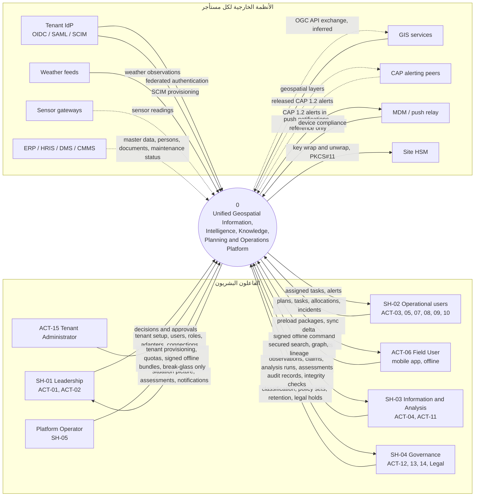

# 01 — نظرة عامة على النظام

هذه الوثيقة نقطة الدخول إلى جزء التحليل: ما المشكلة، وما الأهداف، وما داخل النظام وما خارجه، ومع من يتبادل البيانات. لا تضيف قرارًا؛ كل حقيقة فيها محالة إلى مصدرها في `spec/`. التصنيف المعرفي كما في `00-index.md` §1: ما لم يُعلَّم فهو صريح في المصدر، و**[Derived]** مشتق بالعد أو الجمع، و**[Inferred]** استنتاج، و**[Missing]** غائب عن المصادر، و**[Needs Review]** تعارض بين مصدرين.

## 1. تعريف النظام وبيان المشكلة

| البند | المحتوى | المصدر |
|---|---|---|
| التعريف | منصة مؤسسية متكاملة لإدارة دورة حياة المعلومات والمعرفة والعمليات، تربط المعلومات الجغرافية والزمنية والوثائقية والتشغيلية بالأحداث والمصادر والأدلة والعلاقات والموارد والتحليلات والخطط والمهام والنتائج | `system-definition.md` §1 |
| الاسم في المعمارية | Unified Geospatial Information, Intelligence, Knowledge, Planning & Operations Platform | `12-solution/c4-context.md` |
| المشكلة | المعلومات الجغرافية والتشغيلية موزعة على أنظمة منفصلة فلا توجد صورة موقف موثوقة واحدة؛ القرارات لا تُتتبع إلى أدلتها؛ التنفيذ لا يرتبط بالقرار الذي أطلقه؛ الدروس تضيع | `system-definition.md` §2 (DEC:Q1) |
| الراعي | مالك المشروع؛ صلاحية القرار مفوّضة للدراسة، والمصادقة مطلوبة عند G6 | `system-definition.md` §8 |

كل شق من المشكلة يقابله هدف في §2: الصورة الموحدة ← OUT-01 وOUT-02؛ تتبع القرار إلى الدليل ← OUT-03 وOUT-04؛ ربط التنفيذ بالقرار ← OUT-05؛ ضياع الدروس ← OUT-06 **[Inferred]**.

## 2. الأهداف (Business Outcomes)

ستة نتائج أعمال. أولويات السنة الأولى: OUT-02 ← OUT-04 ← OUT-05 (`system-definition.md` §3)، والبقية ثانوية. خط الأساس لكل المقاييس **يُقاس عند بدء Pilot** (`outcomes.md`).

| المعرّف | النتيجة | أولوية السنة 1 | المقياس ← الهدف |
|---|---|---|---|
| OUT-01 | وضوح المعلومات (Information Visibility) | ثانوية | زمن إتاحة الملاحظة في البحث بعد تسجيلها ← p95 ≤ 30s؛ نسبة المصادر المصرّح بها المدمجة والقابلة للبحث ← ≥ 90% من مصادر النطاق |
| OUT-02 | الفهم السياقي (Contextual Understanding) | **1** | زمن بناء صورة موقف لحدث جديد ← انخفاض ≥ 50% عن خط أساس Pilot؛ نسبة عناصر الموقف ذات موقع وزمن صالحين ← ≥ 98% |
| OUT-03 | الفهم التحليلي (Analytical Understanding) | ثانوية | نسبة التقييمات ذات Lineage كامل ← 100% لكائنات T1؛ نسبة Analysis Runs القابلة لإعادة الإنتاج ← 100% |
| OUT-04 | دعم القرار (Decision Support) | **2** | نسبة القرارات المربوطة بتقييم أو دليل وبسلطة مختصة ← 100%؛ زمن دورة القرار ← انخفاض ≥ 30% عن خط الأساس |
| OUT-05 | التنفيذ المنسق (Coordinated Execution) | **3** | نسبة المهام المرتبطة بخطة وقرار ← 100%؛ نسبة إنجاز المهام في موعدها ← تحسن ≥ 20% عن خط الأساس |
| OUT-06 | التعلم المؤسسي (Institutional Learning) | ثانوية | مراجعات ما بعد الحدث للعمليات الكبرى المغلقة ← ≥ 1 لكل عملية؛ نسبة الدروس المعتمدة المعاد استخدامها في خطط لاحقة ← تُقاس في R2 |

**[Missing]** حقل `contributing_requirements` لكل النتائج الست ما زال `TBD (CR-30)` في `outcomes.md`؛ الربط العكسي من النتيجة إلى المتطلبات يمر حاليًا عبر القدرات (§4، عمود النتائج).

## 3. أصحاب المصلحة والفاعلون

خمس مجموعات و15 فاعلًا بشريًا (`01-business/stakeholders.md`). التفصيل (الأدوار، الأوامر والاستعلامات لكل فاعل، مصفوفة الفاعل × العملية) في [02-actors-roles.md](02-actors-roles.md).

| المجموعة | الفاعلون |
|---|---|
| SH-01 القيادة (Leadership) | ACT-01 Executive، ACT-02 Manager |
| SH-02 المستخدمون التشغيليون (Operational Users) | ACT-03 Planner، ACT-05 Operator، ACT-06 Field User، ACT-07 Resource Manager، ACT-08 Logistics User، ACT-09 Risk Manager، ACT-10 Training Manager |
| SH-03 مستخدمو المعلومات والتحليل | ACT-04 Analyst، ACT-11 Knowledge Manager |
| SH-04 الحوكمة (Governance) | ACT-12 Archivist، ACT-13 Security Officer، ACT-14 Auditor |
| SH-05 فرق المنصة (Platform Teams) | ACT-15 Administrator |

- **فاعلون نظاميون داخليون:** AI، Workflow، Policy، Event Bus، Scheduler، Search، Notification (`stakeholders.md` `internal_system_actors`).
- **مشغّل المنصة (Platform Operator):** يظهر في `c4-context.md` وفي سياسات `08-security/policies-slc01.md` (`POL-TEN-PROVISION`: «Platform Operator (platform tenant)») وفي `UC-078`، ولا معرّف `ACT-*` له؛ نسبته إلى SH-05 **[Inferred]** (وكذلك في `02-actors-roles.md` كدور منصة `PLT-OPS`).
- **الجهة القانونية/الامتثال:** ترد في `decision_rights` (Retention / Legal hold) وفي `c4-context.md` (Legal) وفي `dependencies.md` (DEP-HUM-004)، ولا معرّف `ACT-*` لها.
- **[Missing]** `decision_rights` لكل المجموعات الخمس `UNKNOWN` في `stakeholders.md`؛ حقوق القرار معرّفة لكل قرار (سبعة قرارات RACI) لا لكل مجموعة.

## 4. القدرات وتحقيقها في السياقات

14 قدرة من المستوى الأول و54 قدرة فرعية **[Derived]** (عدٌّ من `capabilities.md`). السياق المحقِّق مشتق من ربط القدرة بالنطاقات (`capabilities.md`) ثم النطاق بالسياق (`03-domain/domains.md`) **[Derived]**.

| القدرة | الاسم | فرعية | الإصدار (الفرعيات) | النطاقات | السياق | النتائج |
|---|---|---|---|---|---|---|
| CAP-01 | إدارة المؤسسة والوصول | 4 | R1 كلها | DOM-01، DOM-02 | BC01 | OUT-04 |
| CAP-02 | جمع المعلومات | 4 | R1؛ عدا .01 تخطيط الجمع R2 | DOM-05، DOM-06، DOM-24 | BC02، BC07 | OUT-01 |
| CAP-03 | إدارة المعلومات | 7 | R1 كلها | DOM-03، DOM-04، DOM-07 | BC02، BC03 | OUT-01، OUT-02 |
| CAP-04 | التحليل والتقييم | 4 | R1؛ عدا .04 الدمج والربط R2 | DOM-07، DOM-08 | BC03 | OUT-03 |
| CAP-05 | الوعي بالموقف | 3 | R1 كلها | DOM-09، DOM-04 | BC03، BC02 | OUT-02 |
| CAP-06 | إدارة القرار | 3 | R1؛ عدا .03 التنسيق R2 | DOM-10 | BC04 | OUT-04 |
| CAP-07 | التخطيط والتنفيذ | 5 | R1 كلها | DOM-12، DOM-13 | BC04 | OUT-05 |
| CAP-08 | الموارد والجاهزية | 5 | .01 و.02 R2؛ .04 R1 (الأهلية فقط)؛ .03 و.05 R3 | DOM-14، 15، 16، 18، 19 | BC05 | OUT-05 |
| CAP-09 | المخاطر والطوارئ | 3 | R3 كلها | DOM-17 | BC04 (CR-42) | OUT-02، OUT-05 |
| CAP-10 | الاتصال والمنتجات | 2 | .01 R1 (إشعارات)؛ .02 R2 | DOM-11، DOM-20 | BC04، BC06 | OUT-04 |
| CAP-11 | المعرفة والذاكرة المؤسسية | 3 | .02 R1 (الاحتفاظ والتجميد)؛ .01 و.03 R2 | DOM-21، DOM-22 | BC06 | OUT-06 |
| CAP-12 | المساعدة بالذكاء الاصطناعي | 4 | R2 كلها | DOM-23 | BC07 | OUT-01، OUT-03 |
| CAP-13 | الحوكمة والأمن والامتثال | 4 | R1 كلها | DOM-25 | BC08 | OUT-04 |
| CAP-14 | تشغيل المنصة | 3 | R1 كلها | DOM-26 | BC08 | — |

أسماء السياقات: BC01 Foundation، BC02 Information، BC03 Intelligence & Analysis، BC04 Operations، BC05 Resources & Readiness، BC06 Knowledge & Products، BC07 Platform Intelligence، BC08 Governance & Runtime (`domains.md`). ملاحظة: رسالة CAP الصادرة (`AGG-CAP-MESSAGE`، ضمن CAP-10.01 عبر REQ-INT-003) تقع في BC03 لا في BC04 مالك DOM-11 (`03-domain/contexts/BC03/aggregates/AGG-CAP-MESSAGE.md`).

## 5. النطاق حسب الإصدار

| الإصدار | الشرائح | ما يسلّمه | حالة البوابة G6 | المصدر |
|---|---|---|---|---|
| **R1** | SLC-01 المستأجرون والهوية والتنظيم والتخويل والتدقيق؛ SLC-02 المصدر ← الملاحظة ← الكيان/الادعاء ← الدليل؛ SLC-03 دورة حياة المهمة + Outbox؛ SLC-04 التعارض ومطابقة الكيانات؛ SLC-05 البحث المؤمّن وإسقاطات الرسم؛ SLC-06 الموقف والتنبيهات؛ SLC-07 التحليل ← التقييم؛ SLC-08 القرار ← الخطة ← المهام؛ SLC-11 جزئيًا (التقاط الملاحظات وحالة المهام فقط)؛ SLC-12a جداول الاحتفاظ والتجميد القانوني | الأساس المؤسسي والنواة المعلوماتية والتحليل والقرار والتخطيط والتنفيذ والعمل الميداني دون اتصال؛ واجهة ويب + جوال ميداني | READY (delegated)؛ SLC-12a بقيم قانونية معلقة على UNK-002 | `system-definition.md` §4؛ `14-slices/slices.md` |
| **R2** | SLC-09 الأصول والموارد والتخصيص والجاهزية الكاملة؛ SLC-10 AI المؤرّض (AIL ≤ 3)؛ SLC-12 المنتجات والمعرفة والأرشيف وإعادة البناء؛ SLC-14 متطلبات الجمع وتخطيطه؛ SLC-15 التنسيق والربط/الدمج؛ SLC-16 تكاملات المؤسسة (ERP، HRIS، DMS، الحساسات، CAP) | ترتيب التصميم: SLC-09 ← 12 ← 10 ← 14 ← 15 ← 16؛ وحدات نشر جديدة DU-14 وDU-15 وDU-16 | DESIGN_COMPLETE؛ G6 محجوبة حتى مراجعة Pilot R1 (RSK-027)؛ SLC-16 أيضًا حتى UNK-021 | `release-2-scope.md` §1–§3؛ `deployment-units.md` |
| **R3** | SLC-17 المخاطر والطوارئ (CAP-09.*، BC04)؛ SLC-18 الإمداد (CAP-08.03، BC05)؛ SLC-19 التدريب والكفاءة والتمارين (CAP-08.05، BC05) — فُكِّكت من SLC-13 (CR-67) | لا سياق جديد (R3-Q1) ولا وحدة نشر جديدة (R3-Q6)؛ «الاتصالات الموسعة» غير مفكَّكة (UNK-022) | DESIGN_COMPLETE؛ G6 محجوبة حتى مراجعة Pilot R1 **و**R2 (RSK-028) | `release-3-scope.md` §1–§4 |
| **خارج النطاق** | — | استقلالية AI الكاملة (AIL5)؛ واجهة سطح المكتب مؤجلة (R1 = ويب + جوال)؛ لا كتابة إلى ERP/HRIS/DMS/CMMS في R2 (الأنظمة مصادر لا مستودعات حقيقة) | — | `system-definition.md` §4؛ `assumptions.md` ASM-003؛ `AGG-INTEGRATION-CONNECTION` INV-CON-02 |

**[Missing]** `system-definition.md` يضع SLC-11 في R1 «جزئيًا» و`slices.md` يحدد الجزء (التقاط الملاحظات وحالة المهام)، لكن لا `release-2-scope.md` ولا `release-3-scope.md` يسند باقي الشريحة إلى إصدار.

## 6. حدود النظام

| داخل الحدود | خارج الحدود |
|---|---|
| السياقات الثمانية BC01..BC08 في 16 وحدة نشر DU-01..DU-16 (`deployment-units.md`) | مزودو الهوية لدى المستأجرين (التحقق من المستخدم نفسه) |
| العملاء: تطبيق الويب (React + MapLibre) وتطبيق الجوال الميداني بمخزن مشفر (SQLCipher) (`c4-containers.md`، TD-16) | أنظمة المؤسسة: GIS، الطقس، الحساسات، ERP، HRIS، DMS، CMMS، نقاط CAP (`c4-context.md`، `enterprise-integration-spec.md`) |
| الخدمات ذات الحالة في كل خلية: PostgreSQL/PostGIS، Kafka، OpenSearch، Valkey، مخزن الكائنات، OpenBao، Keycloak كوسيط اتحاد، سجل Harbor (`cell-architecture.md` §2، TD-01..TD-12) | HSM الموقع (مفاتيح KEK) ومنصة MDM / مرحّل الدفع (`c4-context.md`) |
| المحوّلات (DU-11) كطبقة ACL عند الحد TB-06 | الجهة القانونية والامتثال ومورّدو HSM/MDM (قرار شراء لكل موقع — `RATIFICATION-PACKAGE.md` §7) |

قواعد الحد:

- **لا اعتماد على خدمات إنترنت عامة** وقت التشغيل أو البناء (FIT-12، `13-verification/fitness-functions.md`)؛ كل الأنظمة الخارجية داخل حدود المؤسسة أو الولاية (`c4-context.md`). النماذج اللغوية تعمل محليًا (W1 Q20، TD-18).
- **الخلية = حد النشر:** عنقود Kubernetes وكل الخدمات ذات الحالة في موقع واحد وولاية واحدة؛ لا مسار بيانات بين الخلايا (TB-05)؛ ملفات shared / dedicated / sovereign بنفس الكود (`cell-architecture.md` §1).
- **الخروج الشبكي ممنوع افتراضيًا**؛ لكل اتصال قاعدة سماح واحدة في egress gateway يعتمدها ضابط أمن غير الطالب، وأي اتصال خارج القائمة تنبيه أمني P1 (`cell-architecture.md` §3؛ INV-CON-01).
- **مستوى التشغيل (operator plane):** المشغّل لا يقرأ بيانات المستأجر؛ الوصول إليها Break-glass فقط بموافقة شخصين ومدة وتدقيق (TB-09 في `trust-boundaries.md`؛ THR-014).
- **الأنظمة الخارجية مصادر لا مستودعات حقيقة** (BRL-013): ما يدخل يصبح ادعاءات أو ملاحظات أو أدلة بموثوقية مصدرها، ولا ثقة تلقائية (TB-06).

## 7. الأنظمة الخارجية

قائمة الأنظمة الثمانية من `stakeholders.md` (`external_systems`) و`dependencies.md` (DEP-EXT-001..008)، مضافًا إليها ما تذكره المعمارية (MDM، HSM) ومواصفة التكامل (CMMS، CAP). العقود الفعلية لكل مستأجر تُجمع عند التهيئة (W1 Q24)، وهي مجهولة لـERP/HRIS/DMS/CMMS (UNK-021).

| النظام | الاتجاه | البروتوكول / العقد | المالك في المنصة | الإصدار | المصدر |
|---|---|---|---|---|---|
| مزود الهوية (IdP) | وارد | OIDC / SAML للمصادقة، SCIM للتزويد (إنشاء/تعطيل خلال 5 دقائق)؛ Keycloak لكل خلية وسيط اتحاد | BC01: `AGG-USER` (`CMD-USR-PROVISION` بـ`source: scim`، `CMD-USR-LINK-IDENTITY`) عبر حساب خدمة SCIM؛ DU-01 وDU-02 | R1 (إلزامي) | REQ-FND-005؛ TD-09؛ `BC01/commands-slc01.md`؛ `openapi-foundation-slc01.md` |
| GIS | وارد | OGC API Features/Maps/Tiles، WMS/WFS، GeoJSON، GeoPackage، GeoTIFF/COG، KML | BC07 `AGG-ADAPTER` ← BC02 `AGG-IMPORT-BATCH` و`AGG-EXTERNAL-ID`؛ DU-11 وDU-05 | R1 | REQ-INF-005، REQ-INF-008؛ W1 Q25؛ `openapi-integration-slc02.md`، `openapi-information-slc02.md` |
| GIS (تبادل صادر) | صادر | OGC API Features/Tiles عبر pygeoapi | DU-12 **[Inferred]** | R1 **[Inferred]** | TD-10 («for exchange»)؛ لا يظهر في `c4-context.md` |
| الطقس | وارد | محوّل مسجل؛ المزود يُسجَّل كمصدر (`AGG-SOURCE`) | BC07 `AGG-ADAPTER` ← BC02 | R1 | REQ-INF-009؛ W1 Q24 |
| الحساسات (بوابة حساسات) | وارد | دفعات ملاحظات ≤ 1,000 idempotent؛ زمن الحساس `observed_at` | BC07 `AGG-SENSOR-STREAM` + `AGG-INTEGRATION-CONNECTION`؛ DU-11 | R2 (SLC-16) | REQ-INT-002؛ `openapi-integration-slc16.md`؛ `enterprise-integration-spec.md` §2 |
| ERP | وارد فقط | دفعات استيراد ← ادعاءات على كيانات (External ID)؛ التعارض ← `AGG-CONFLICT` | BC07 `AGG-INTEGRATION-CONNECTION` + `AGG-ADAPTER`؛ BC02 | R2 (SLC-16) | REQ-INT-001؛ `enterprise-integration-spec.md` §2 |
| HRIS | وارد فقط | أشخاص ووحدات ومناصب ← Person + **مقترحات** أدوار (لا تغيير صلاحيات آلي) | BC01 `AGG-HR-SYNC-PROPOSAL` (`openapi-foundation-slc16.md`) + BC07 `AGG-INTEGRATION-CONNECTION` | R2 (SLC-16) | REQ-INT-001، REQ-INT-004 |
| DMS | وارد فقط | وثائق وبياناتها ← مرفقات (فحص محلي) + أدلة + External ID | BC02 `AGG-ATTACHMENT`، `AGG-EVIDENCE` عبر محوّل | R2 (SLC-16) | `enterprise-integration-spec.md` §2 |
| CMMS | وارد | المحوّل يستدعي أوامر `AGG-MAINTENANCE-ORDER` بهوية خدمة («إن وُجد») | BC05 عبر محوّل BC07 | R2 | R2-Q2؛ `enterprise-integration-spec.md` §2 |
| نقاط CAP (جهات تنبيه أخرى) | وارد وصادر | CAP 1.2؛ اختياري لكل مستأجر؛ الإصدار بسلطة ≠ المُعِد؛ المخرج الوحيد في R2 | BC03 `AGG-CAP-MESSAGE` (`openapi-intelligence-slc16.md`)؛ الوارد عبر محوّل كملاحظات | R2 | REQ-INT-003؛ R2-Q9؛ INV-CON-02 |
| MDM / مرحّل الدفع | صادر (الدفع)؛ وارد (امتثال الجهاز) | حمولة الدفع = URN + عنوان من قائمة آمنة التصنيف؛ سحب احتياطي ≤ 60 ث عند غياب المرحّل | BC04 `AGG-NOTIFICATION`؛ BC01 `AGG-DEVICE` (`mdm_ref`، «MDM compliance») | R1 | INV-NTF-02؛ QAS-OPS-003؛ RSK-023؛ `c4-context.md` |
| HSM الموقع | صادر (طلبات تغليف المفاتيح) | PKCS#11؛ KEK في HSM، DEK مغلفة في مخزن مفاتيح PostgreSQL | OpenBao Transit، تستدعيه DU-02 وDU-03 وDU-04 | R1 | TD-07؛ `c4-containers.md`؛ ADR-P08 |
| واجهات خارجية أخرى (External APIs) | **[Missing]** | UNKNOWN (UNK-010) | **[Missing]** | R2 | DEP-EXT-008؛ W1 Q24 |

الأحداث الخارجية متوافقة مع غلاف CloudEvents، والزمن بـISO 8601 (W1 Q25). كل اتصال يحتفظ بنقطة تقدم، ويعالج تراكم 4 ساعات خلال ساعة بعد الانقطاع (QAS-INT-001، `enterprise-integration-spec.md` §3). التصميم التفصيلي للمحوّلات في `20-integration-design.md` (المرحلة 4).

## 8. مخطط السياق (DFD المستوى 0)

النظام عملية واحدة (0)، والكيانات الخارجية مجموعات الفاعلين والأنظمة الخارجية. الخط المتقطع = R2. أسماء التدفقات بالإنجليزية كما في العقود.

| # | التدفق | من ← إلى | الإصدار | المصدر |
|---|---|---|---|---|
| F-01 | decisions and approvals | القيادة ← النظام | R1 | `stakeholders.md` `decision_rights` (Business Decision، Plan approval)؛ CAP-06.02 |
| F-02 | situation picture, assessments, notifications | النظام ← القيادة | R1 | CAP-05.03، CAP-04.03، CAP-10.01 |
| F-03 | plans, tasks, allocations, incidents | التشغيليون ← النظام | R1؛ التخصيص R2؛ الحوادث R3 | CAP-07.01..03، CAP-08.02، CAP-09.02 |
| F-04 | assigned tasks, alerts | النظام ← التشغيليون | R1 | CAP-07.03، CAP-05.02؛ `AGG-NOTIFICATION` |
| F-05 | signed offline command batches, attachments | الميداني ← النظام | R1 | `field-sync-protocol.md` §1–§3؛ `openapi-field-slc11.md` (`sync-sessions`، `upload-batch`) |
| F-06 | preload packages, sync delta | النظام ← الميداني | R1 | `AGG-PRELOAD-PACKAGE`؛ `openapi-field-slc11.md` (`preload-packages`، `sync-sessions/{session_id}/delta`) |
| F-07 | observations, claims, analysis runs, assessments | المحللون ← النظام | R1 | `openapi-information-slc02.md`؛ CAP-02.03، CAP-03.02، CAP-04.02..03 |
| F-08 | secured search, graph, lineage | النظام ← المحللون | R1 | `openapi-discovery-slc05.md` (`search-queries`، `graph/paths`)؛ `lineage/{object_urn}` في `openapi-information-slc02.md` |
| F-09 | classification, policy sets, retention, legal holds | الحوكمة ← النظام | R1 | `openapi-governance-slc01.md`؛ `openapi-governance-slc12a.md` |
| F-10 | audit records, integrity checks | النظام ← الحوكمة | R1 | `openapi-governance-slc01.md` (`audit-records`، `audit-integrity-checks`) |
| F-11 | tenant setup, users, roles, adapters, connections | المسؤول ← النظام | R1؛ الاتصالات R2 | `openapi-foundation-slc01.md`؛ `openapi-integration-slc02.md`؛ `openapi-integration-slc16.md` |
| F-12 | tenant provisioning, quotas, signed offline bundles, break-glass only | المشغّل ← النظام | R1 | `POL-TEN-PROVISION` في `policies-slc01.md`؛ TD-17 (Zarf)؛ TB-09؛ `c4-context.md` |
| F-13 | federated authentication | IdP ← النظام | R1 | REQ-FND-005؛ TD-09؛ `c4-context.md` («federation») |
| F-14 | SCIM provisioning | IdP ← النظام | R1 | REQ-FND-005؛ `CMD-USR-PROVISION` (`source: scim`)؛ `c4-context.md` («provisioning») |
| F-15 | geospatial layers | GIS ← النظام | R1 | REQ-INF-008؛ `c4-context.md` («adapters, ACL») |
| F-16 | OGC API exchange | النظام ← GIS | **[Inferred]** | TD-10 (pygeoapi «for exchange»)؛ غائب عن `c4-context.md` |
| F-17 | weather observations | الطقس ← النظام | R1 | REQ-INF-009 |
| F-18 | sensor readings | الحساسات ← النظام | R2 | REQ-INT-002؛ `AGG-SENSOR-STREAM`؛ `openapi-integration-slc16.md` |
| F-19 | master data, persons, documents, maintenance status | ERP/HRIS/DMS/CMMS ← النظام | R2 | REQ-INT-001، REQ-INT-004؛ `enterprise-integration-spec.md` §2؛ `c4-context.md` (ERP «R2») |
| F-20 | CAP 1.2 alerts in | نقاط CAP ← النظام | R2 | `enterprise-integration-spec.md` §2 (CAP وارد)؛ REQ-INT-003 |
| F-21 | released CAP 1.2 alerts | النظام ← نقاط CAP | R2 | `AGG-CAP-MESSAGE`؛ `openapi-intelligence-slc16.md`؛ `enterprise-integration-spec.md` §4 |
| F-22 | push notifications, reference only | النظام ← MDM | R1 | `c4-context.md` («push relay»)؛ INV-NTF-02 |
| F-23 | device compliance | MDM ← النظام | R1 | `AGG-DEVICE` (`CMD-DEV-CONFIRM`: «hardware attestation valid (or MDM compliance)»)؛ `mdm_ref` في `CMD-DEV-ENROLL` |
| F-24 | key wrap and unwrap, PKCS#11 | النظام ← HSM | R1 | TD-07؛ `c4-context.md` («PKCS#11») |

التفكيك إلى المستوى 1 (DFD 1) حسب تيارات القيمة في `06-process-models.md`.

## 9. القيود والافتراضات والمجهولات

### 9.1 القيود

| القيد | المحتوى | المصدر |
|---|---|---|
| بيئة معزولة كخط أساس | محايدة لبيئة النشر؛ الأشد هو air-gapped: لا SaaS خارجية، AI محلي؛ تثبيت وترقية بحزم موقّعة offline | `system-definition.md` §5؛ W1 Q20؛ FIT-12؛ TD-17 |
| متعدد المستأجرين من اليوم الأول | Tenant > Organization؛ نشر مشترك أو مخصص أو سيادي بنفس الكود | `system-definition.md` §5 (Q6، Q32)؛ ADR-P04 |
| نطاق الحجم | انظر الجدول أدناه؛ كل مكوّن يثبت 10× نطاق Pilot دون تغيير معماري؛ إعادة المعايرة إن تجاوز الواقع 50% من نطاق التصميم | `07-quality/scale-envelope.md`؛ ASM-010 |
| اللغة | عربية أساسية + إنجليزية؛ RTL وعرض هجري (islamic-umalqura) | `system-definition.md` §5 (Q15)؛ TD-16 |
| الواجهات | ويب متجاوب + جوال ميداني | `system-definition.md` §5 (Q10) |
| البساطة التشغيلية | قيد ملزم لأن الفريق صغير في البداية؛ فريق هندسي واحد 6–10 مهندسين في R1 | `system-definition.md` §6؛ ASM-008، ASM-009 |
| الحالة القانونية الأشد | التصميم للحالة الأشد حتى تأكيد الولاية الفعلية؛ الخلية في ولاية واحدة، والنسخ الاحتياطية وDR في نفس الولاية | `system-definition.md` §6؛ `cell-architecture.md` §3 |
| Scale-Ready, not Scale-First | SR-00: لا تعقيد قبل أن يثبت القياس حاجته | `system-definition.md` §6؛ `scale-envelope.md` |

| البعد | Pilot | التصميم | مسار النمو |
|---|---|---|---|
| المستخدمون (الكلي) | 500 | 50,000 | 500,000 |
| المستخدمون المتزامنون | 100 | 5,000 | 50,000 |
| المستأجرون | 1–3 | 100 | 1000+ (خلايا) |
| الأحداث/ث (مستدام / ذروة) | 100 / TBD | 5,000 / 50,000 | partitioned scale-out / backpressure |
| الكيانات والادعاءات / الملاحظات | TBD | 1e8 / 1e9 | تقسيم بالمستأجر / بالزمن والمستأجر |
| مدة العمل دون اتصال | 72h | 7d | — |

### 9.2 الافتراضات المفتوحة

| المعرّف | الافتراض | الحالة | المصدر |
|---|---|---|---|
| ASM-005 | فريق قادر على تشغيل حزمة متعددة القواعد (8 خدمات ذات حالة لكل خلية) | open — RSK-026 | `registers/assumptions.md` |
| ASM-010 | أرقام نطاق التصميم أهداف تصميم لا توقعات طلب | adopted_for_design | `registers/assumptions.md` |
| RSK-027 / RSK-028 | كل قيمة رقمية في R2 وR3 تُعاد معايرتها بعد Pilot R1 (وR2 لـR3) | open | `release-2-scope.md` §3؛ `release-3-scope.md` §3 |

### 9.3 المجهولات

| المعرّف | السؤال | الأثر | الحالة | المصدر |
|---|---|---|---|---|
| UNK-002 | الولاية القانونية الفعلية ومتطلبات إقامة البيانات | يحجب G8 لا التصميم؛ قيم SLC-12a القانونية معلقة | partially_closed_non_blocking_for_design | `system-definition.md` §7؛ `registers/unknowns.md` |
| UNK-012 | الميزانية والفريق والجدول | حجم مجمع GPU (R2-Q5) | partially_closed_non_blocking_for_design | المصدران أعلاه |
| UNK-021 | أنظمة ERP/HRIS/DMS/CMMS الفعلية لكل مستأجر وواجهاتها | يحجب G6 لـSLC-16 | open | `registers/unknowns.md`؛ `slices.md` |
| UNK-022 | «الاتصالات الموسعة» في R3 غير مفكَّكة إلى قدرة | لا يحجب بقية R3 | open (low) | `registers/unknowns.md`؛ `release-3-scope.md` §1 |
| — | مورّد HSM ومنصة MDM لكل موقع | قبل G8 | open (قرار شراء) | `RATIFICATION-PACKAGE.md` §7؛ RSK-023 |

### 9.4 ملاحظات على اتساق المصادر

| # | الملاحظة | المصادر | التصنيف |
|---|---|---|---|
| N-01 | الحساسات في R2 (W1 Q24، SLC-16، REQ-INT-002)، لكن `c4-context.md` يرسمها بخط متصل مع GIS والطقس دون علامة R2 (خلافًا لـERP) | `W1-answers.md` Q24؛ `12-solution/c4-context.md` | محسوم (CR-81): خط متقطع بعلامة R2 |
| N-02 | تخفيف RSK-028 ما زال «لا تصميم شرائح R3 قبل مراجعة Pilot R1»، بينما صُمِّمت SLC-17..19 بتفويض المالك وهي DESIGN_COMPLETE | `registers/risks.md` RSK-028؛ `release-3-scope.md` §3؛ `slices.md` | محسوم (CR-81): ملاحظة مؤرخة في RSK-028؛ قيد G6 لشرائح R3 باقٍ |
| N-03 | ترويسة `slices.md` تقول «18 items» والملف يحوي 21 شريحة (SLC-00..SLC-19 مع SLC-12a وSLC-13 المُستبدلة) | `14-slices/slices.md` | محسوم (CR-81): 21 |
| N-04 | تبادل OGC API الصادر وارد في TD-10 وغائب عن مخطط C4 السياقي | `technology-decisions.md` TD-10؛ `c4-context.md` | **[Inferred]** في F-16 |

## 10. خريطة هذه الدراسة

| لتعرف… | اقرأ |
|---|---|
| الفهرس، الاصطلاحات، المراحل، مشكلات المصادر S-01..S-11 | [00-index.md](00-index.md) |
| الفاعلون والأدوار ومصفوفة الفاعل × العملية | [02-actors-roles.md](02-actors-roles.md) |
| المتطلبات الوظيفية وسيناريوهات الجودة وأولوياتها | [03-requirements-analysis.md](03-requirements-analysis.md) |
| حالات الاستخدام ومخططاتها لكل BC | [04-use-cases.md](04-use-cases.md) |
| قصص المستخدم وضوابط القبول لكل نوع عملية | [05-user-stories/00-guide.md](05-user-stories/00-guide.md) |
| تيارات القيمة، Activity وSwimlane وDFD 1 | [06-process-models.md](06-process-models.md) |
| النموذج المفاهيمي وخريطة السياقات | [07-domain-model.md](07-domain-model.md) |
| مخططات الحالات (89) | [08-state-models.md](08-state-models.md) |
| قواعد العمل والثوابت وموقع تنفيذها | [09-business-rules.md](09-business-rules.md) |
| المعمارية: المحركات والأنماط وC4 مستوى 1 و2 | [10-architecture-overview.md](10-architecture-overview.md) |
| Hexagonal داخل كل وحدة نشر | [11-hexagonal-reference.md](11-hexagonal-reference.md) |
| هيكلية المستودع | [13-project-structure.md](13-project-structure.md) |
| اصطلاحات الواجهات وكتالوج العمليات (611) | [14-api-design.md](14-api-design.md) |
| الأحداث والـtopics والمستهلكون | [15-event-design.md](15-event-design.md) |
| مخطط قاعدة البيانات | [16-database-schema.md](16-database-schema.md) |

ملفات التصميم الأخرى (12، 17..23) تأتي في المرحلة 4، وملفات الجاهزية للتنفيذ (24..27) في المرحلة 5 (`00-index.md` §2). ترتيب القراءة المقترح للتحليل: 01 ← 02 ← 03 ← 04 ← 06 ← 07، ثم 08 و09 عند الحاجة إلى تفاصيل السلوك **[Inferred]**.
