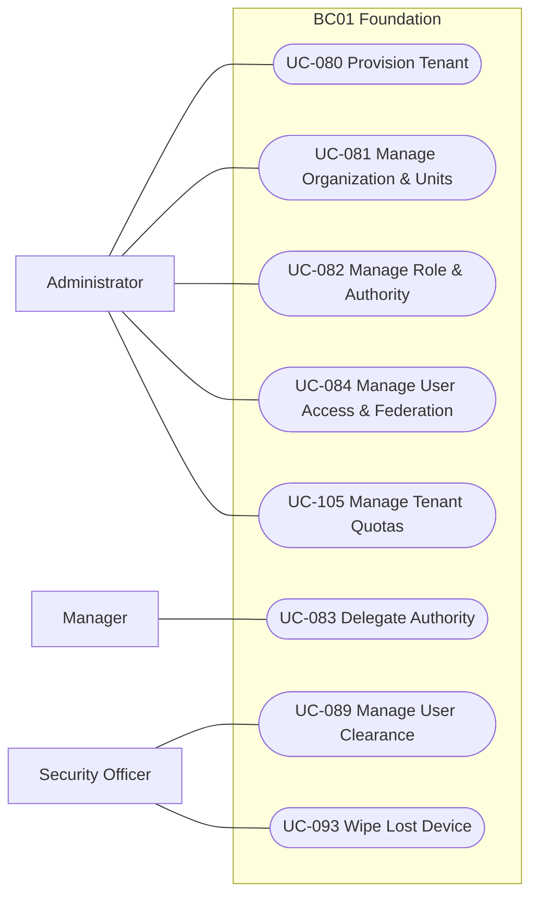
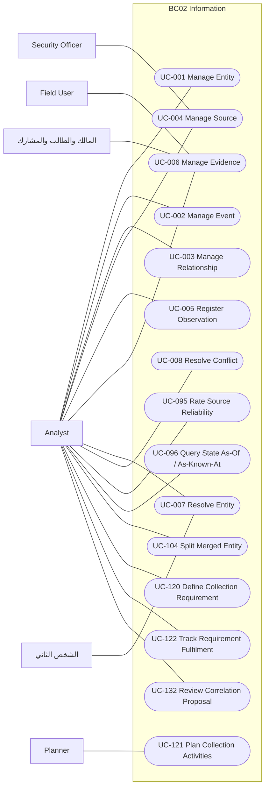
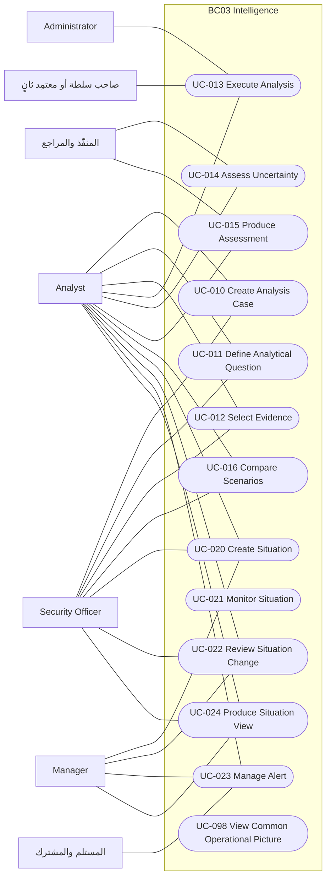
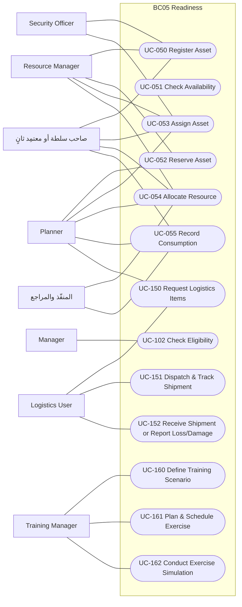
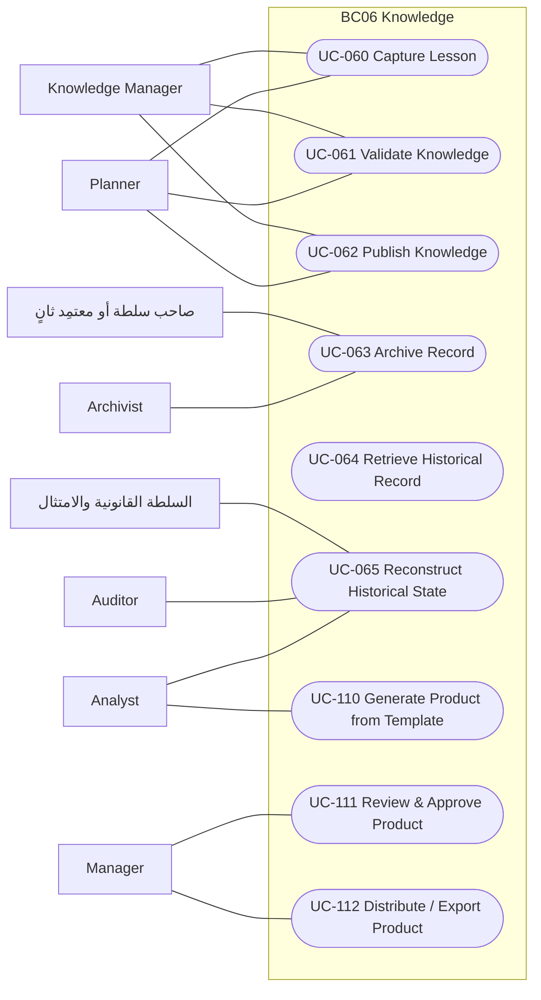
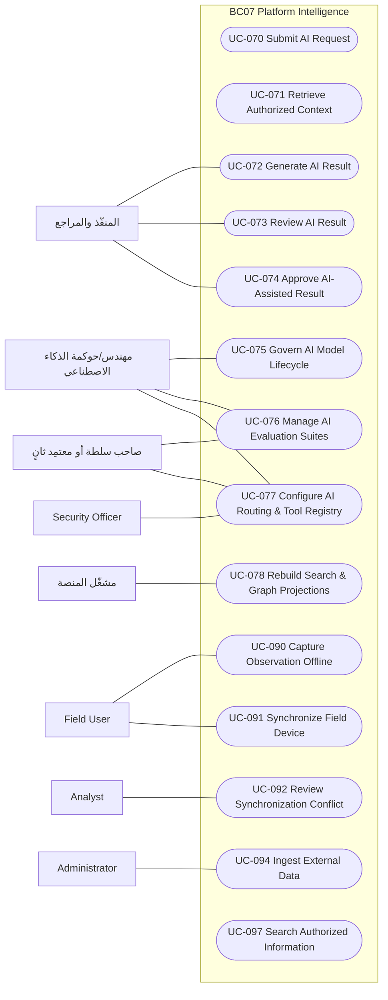
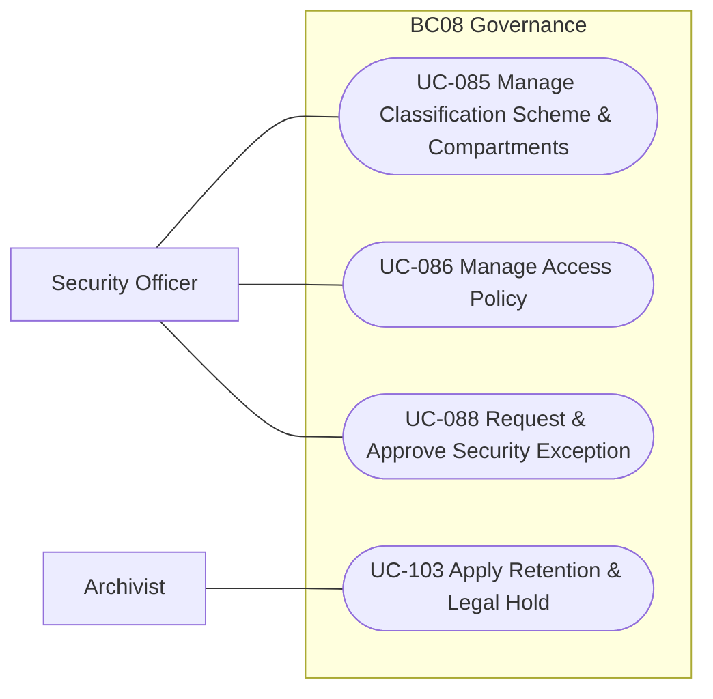

```mermaid
flowchart LR
  ACT_02["Manager"]
  ACT_03["Planner"]
  ACT_04["Analyst"]
  ACT_09["Risk Manager"]
  ACT_13["Security Officer"]
  ACT_15["Administrator"]
  AUTH_GRANT["صاحب سلطة أو معتمِد ثانٍ"]
  REL_INCIDENT["أدوار الحادثة"]
  REL_OWNER["المالك والطالب والمشارك"]
  REL_RECIPIENT["المستلم والمشترك"]
  REL_RISK["أدوار الخطر"]
  REL_TASK["المنفّذ والمراجع"]
  subgraph BC04["BC04 Operations"]
    UC030(["UC-030 Create Decision Request"])
    UC031(["UC-031 Evaluate Decision Options"])
    UC032(["UC-032 Record Decision"])
    UC033(["UC-033 Create Plan"])
    UC034(["UC-034 Review Plan"])
    UC035(["UC-035 Approve Plan"])
    UC036(["UC-036 Baseline Plan"])
    UC040(["UC-040 Create Task"])
    UC041(["UC-041 Assign Task"])
    UC042(["UC-042 Execute Task"])
    UC043(["UC-043 Submit Task Result"])
    UC044(["UC-044 Review Task"])
    UC045(["UC-045 Complete Task"])
    UC046(["UC-046 Escalate Task"])
    UC099(["UC-099 Receive Notification"])
    UC101(["UC-101 Measure Plan Outcome"])
    UC130(["UC-130 Manage Coordination Case"])
    UC131(["UC-131 Request Cross-Organization Decision"])
    UC140(["UC-140 Identify & Assess Risk"])
    UC141(["UC-141 Treat & Close Risk"])
    UC142(["UC-142 Report & Assess Incident"])
    UC143(["UC-143 Command Incident Response"])
    UC144(["UC-144 Activate Contingency & Track Recovery"])
  end
  ACT_02 --- UC030
  ACT_03 --- UC030
  ACT_04 --- UC030
  ACT_02 --- UC031
  ACT_03 --- UC031
  ACT_04 --- UC031
  AUTH_GRANT --- UC032
  ACT_03 --- UC033
  ACT_13 --- UC033
  AUTH_GRANT --- UC033
  REL_OWNER --- UC033
  ACT_03 --- UC034
  AUTH_GRANT --- UC034
  ACT_03 --- UC035
  ACT_13 --- UC035
  AUTH_GRANT --- UC035
  REL_OWNER --- UC035
  ACT_03 --- UC036
  ACT_13 --- UC036
  AUTH_GRANT --- UC036
  REL_OWNER --- UC036
  ACT_02 --- UC040
  ACT_03 --- UC040
  REL_OWNER --- UC040
  REL_TASK --- UC040
  ACT_02 --- UC041
  ACT_03 --- UC041
  ACT_15 --- UC041
  REL_OWNER --- UC041
  REL_TASK --- UC041
  ACT_02 --- UC042
  ACT_03 --- UC042
  REL_OWNER --- UC042
  REL_TASK --- UC042
  ACT_02 --- UC043
  ACT_03 --- UC043
  REL_OWNER --- UC043
  REL_TASK --- UC043
  ACT_02 --- UC044
  ACT_03 --- UC044
  ACT_15 --- UC044
  REL_OWNER --- UC044
  REL_TASK --- UC044
  ACT_02 --- UC045
  ACT_03 --- UC045
  REL_OWNER --- UC045
  REL_TASK --- UC045
  ACT_02 --- UC046
  ACT_03 --- UC046
  REL_OWNER --- UC046
  REL_TASK --- UC046
  REL_RECIPIENT --- UC099
  ACT_03 --- UC101
  ACT_02 --- UC130
  ACT_02 --- UC131
  REL_RISK --- UC140
  ACT_09 --- UC141
  REL_RISK --- UC141
  REL_INCIDENT --- UC142
  REL_INCIDENT --- UC143
  REL_INCIDENT --- UC144
```

# حالات الاستخدام

101 حالة استخدام من `02-requirements/use-cases.md`، مجمعة حسب السياق، بمخطط حالات استخدام لكل سياق ومواصفة لكل حالة.

## 1. ما الذي أضافه هذا الملف إلى المصدر

الكتالوج المعتمد يترك الفاعلين والمسار الرئيسي **TBD** في 51 حالة (ويكتفي بالإحالة إلى الشريحة في أغلب الباقي)، لأن التدفقات التفصيلية أُجِّلت إلى W4 ثم كُتبت كآلات حالات في الـAggregates. هذا الملف يشتقها منها **[Derived]**:

| الحقل | من أين يُشتق |
|---|---|
| السياق | الـAggregates التي تحقق متطلبات الحالة (`traces.satisfies`)؛ السياق الأكثر تكرارًا بينها |
| الـAggregates | الرئيسية: ما يطابق عنوانها عنوان الحالة؛ وإن لم يطابق شيء فكل ما يحقق متطلباتها. الباقي «مشاركة» |
| الفاعلون | أدوار أوامر الـAggregates الرئيسية بعد تصنيفها (`02-actors-roles.md`)؛ إن ذكرها المصدر فالمصدر أولًا |
| القدرة | من المصدر، وإلا من قدرات متطلباتها |
| المسار الرئيسي | «المسار السعيد» في آلة حالات كل Aggregate رئيسي: من الإنشاء، في كل حالة أول انتقال في الجدول لا يلغي ولا يرفض ولا يرجع ولا ينهي السجل، حتى حالة نهائية. كل خطوة: الفاعل، الأمر، الانتقال، الحدث |
| المسارات البديلة | الانتقالات السالبة (إلغاء، رفض، إرجاع، سحب…) وإنهاء السجل (retire، unlink، التصحيح بالاستبدال) |
| الاستثناءات | رموز الرفض لكل أمر في قصته (`05-user-stories/`) |

**حدود الاشتقاق:** المسار السعيد تسلسل ممكن لا التسلسل الوحيد، ولا يعبّر عن التوازي بين الـAggregates؛ وترتيب الـAggregates في الحالة الواحدة أبجدي. التدفقات بين السياقات مفصلة في `06-process-models.md`.

## 2. المخططات والمواصفات

Mermaid لا يملك رمز حالة استخدام UML؛ المخططات `flowchart` بالفاعلين عقدًا مستطيلة وحالات الاستخدام عقدًا بيضاوية داخل حد السياق.

<!-- BEGIN GENERATED: build_analysis_design.py -->

### 2.1 الملخص

| السياق | حالات الاستخدام | R1 | R2 | R3 | فاعلوها في المصدر | مشتقة الفاعلين |
|---|---|---|---|---|---|---|
| BC01 | 8 | 8 | 0 | 0 | 8 | 0 |
| BC02 | 15 | 11 | 4 | 0 | 7 | 8 |
| BC03 | 13 | 13 | 0 | 0 | 1 | 12 |
| BC04 | 23 | 16 | 2 | 5 | 9 | 14 |
| BC05 | 13 | 1 | 6 | 6 | 7 | 6 |
| BC06 | 9 | 0 | 9 | 0 | 3 | 6 |
| BC07 | 14 | 6 | 8 | 0 | 9 | 5 |
| BC08 | 4 | 4 | 0 | 0 | 4 | 0 |
| — | 2 | 1 | 0 | 1 | 2 | 0 |

### 2.2 مخططات حالات الاستخدام

لكل سياق: الفاعلون (يسارًا) وحالات الاستخدام التي يشاركون فيها. الفاعلون من المصدر إن ذكرهم، وإلا من أدوار أوامر الـAggregates الرئيسية للحالة **[Derived]**. الأدوار العامة (أي مستخدم، هويات النظام) محذوفة من المخططات لتبقى مقروءة، ومذكورة في جدول كل حالة.

#### BC01 — Foundation — الأساس

#### BC02 — Information — نواة المعلومات

#### BC03 — Intelligence — الوعي والتحليل

#### BC04 — Operations — التخطيط والتنفيذ

#### BC05 — Readiness — الموارد والجاهزية

#### BC06 — Knowledge — المعرفة والمنتجات

#### BC07 — Platform Intelligence — التكامل والذكاء الاصطناعي

#### BC08 — Governance — الحوكمة والأمن

### 2.3 مواصفة كل حالة استخدام

#### BC01 — Foundation — الأساس

##### UC-080 — Provision Tenant

| تيار القيمة | القدرة | الإصدار | الحالة | المتطلبات |
|---|---|---|---|---|
| cross-cutting | CAP-01.01 | R1 | APPROVED_DELEGATED | REQ-FND-001, REQ-FND-003, REQ-FND-004 |

- **الفاعلون:** Administrator (المصدر) — **[Needs Review]**: سياسات أوامرها لا تمنح Administrator؛ تمنح: مشغّل المنصة, هويات النظام والخدمات
- **الـAggregates:** `AGG-TENANT`
- **الشروط المسبقة:** المستخدم مصادَق عليه داخل المستأجر، وقرار السياسة يسمح بكل خطوة (ADR-P17) **[Derived]**
- **المسار الرئيسي** **[Derived]** — مسار لكل Aggregate رئيسي؛ ترتيب الـAggregates وتداخلها في `06-process-models.md`:
  - **AGG-TENANT:**
    1. Platform Operator (platform tenant): `CMD-TEN-PROVISION` (∅ → PROVISIONING) ⇐ `EVT-TEN-PROVISIONING-STARTED`
    2. workload identity: scheduler / provisioning saga: `CMD-TEN-COMPLETE-PROVISIONING` (PROVISIONING → ACTIVE) ⇐ `EVT-TEN-ACTIVATED`
- **مسارات بديلة (إلغاء، رفض، إرجاع، إنهاء…):** `CMD-TEN-FAIL-PROVISIONING` → PROVISIONING_FAILED، `CMD-TEN-SUSPEND` → SUSPENDED، `CMD-TEN-START-CELL-MIGRATION` → MIGRATING، `CMD-TEN-START-DECOMMISSION` → DECOMMISSIONING، `CMD-TEN-COMPLETE-DECOMMISSION` → DECOMMISSIONED
- **الاستثناءات:** رموز الرفض لكل خطوة في قصة أمرها (`05-user-stories/`، Scenario Outline «is rejected»).

##### UC-081 — Manage Organization & Units

| تيار القيمة | القدرة | الإصدار | الحالة | المتطلبات |
|---|---|---|---|---|
| cross-cutting | CAP-01.01 | R1 | APPROVED_DELEGATED | REQ-FND-002 |

- **الفاعلون:** Administrator (المصدر)
- **الـAggregates:** `AGG-ORGANIZATION`
- **الشروط المسبقة:** المستخدم مصادَق عليه داخل المستأجر، وقرار السياسة يسمح بكل خطوة (ADR-P17) **[Derived]**
- **المسار الرئيسي** **[Derived]** — مسار لكل Aggregate رئيسي؛ ترتيب الـAggregates وتداخلها في `06-process-models.md`:
  - **AGG-ORGANIZATION:**
    1. Administrator with org scope ⊇ target: `CMD-ORG-CREATE` (∅ → ACTIVE) ⇐ `EVT-ORG-CREATED`
- **مسارات بديلة (إلغاء، رفض، إرجاع، إنهاء…):** `CMD-ORG-DEACTIVATE` → INACTIVE
- **الاستثناءات:** رموز الرفض لكل خطوة في قصة أمرها (`05-user-stories/`، Scenario Outline «is rejected»).

##### UC-082 — Manage Role & Authority

| تيار القيمة | القدرة | الإصدار | الحالة | المتطلبات |
|---|---|---|---|---|
| cross-cutting | CAP-01.03 | R1 | APPROVED_DELEGATED | REQ-FND-007 |

- **الفاعلون:** Administrator (المصدر) — **[Needs Review]**: سياسات أوامرها لا تمنح Administrator؛ تمنح: Executive, صاحب سلطة أو معتمِد ثانٍ
- **الـAggregates:** `AGG-AUTHORITY-GRANT`
- **الشروط المسبقة:** المستخدم مصادَق عليه داخل المستأجر، وقرار السياسة يسمح بكل خطوة (ADR-P17) **[Derived]**
- **المسار الرئيسي** **[Derived]** — مسار لكل Aggregate رئيسي؛ ترتيب الـAggregates وتداخلها في `06-process-models.md`:
  - **AGG-AUTHORITY-GRANT:**
    1. holder of permission authority.grant in scope: `CMD-AUT-GRANT` (∅ → PENDING_APPROVAL) ⇐ `EVT-AUT-GRANT-REQUESTED`
    2. Executive in scope: `CMD-AUT-APPROVE-GRANT` (PENDING_APPROVAL → ACTIVE) ⇐ `EVT-AUT-GRANTED`
- **مسارات بديلة (إلغاء، رفض، إرجاع، إنهاء…):** `CMD-AUT-REJECT-GRANT` → REJECTED، `CMD-AUT-SUSPEND` → SUSPENDED، `CMD-AUT-REVOKE` → REVOKED
- **الاستثناءات:** رموز الرفض لكل خطوة في قصة أمرها (`05-user-stories/`، Scenario Outline «is rejected»).

##### UC-083 — Delegate Authority

| تيار القيمة | القدرة | الإصدار | الحالة | المتطلبات |
|---|---|---|---|---|
| cross-cutting | CAP-01.03 | R1 | APPROVED_DELEGATED | REQ-FND-008 |

- **الفاعلون:** Manager (المصدر) — **[Needs Review]**: سياسات أوامرها لا تمنح Manager؛ تمنح: Executive, صاحب سلطة أو معتمِد ثانٍ
- **الـAggregates:** `AGG-AUTHORITY-GRANT`
- **الشروط المسبقة:** المستخدم مصادَق عليه داخل المستأجر، وقرار السياسة يسمح بكل خطوة (ADR-P17) **[Derived]**
- **المسار الرئيسي** **[Derived]** — مسار لكل Aggregate رئيسي؛ ترتيب الـAggregates وتداخلها في `06-process-models.md`:
  - **AGG-AUTHORITY-GRANT:**
    1. holder of permission authority.grant in scope: `CMD-AUT-GRANT` (∅ → PENDING_APPROVAL) ⇐ `EVT-AUT-GRANT-REQUESTED`
    2. Executive in scope: `CMD-AUT-APPROVE-GRANT` (PENDING_APPROVAL → ACTIVE) ⇐ `EVT-AUT-GRANTED`
- **مسارات بديلة (إلغاء، رفض، إرجاع، إنهاء…):** `CMD-AUT-REJECT-GRANT` → REJECTED، `CMD-AUT-SUSPEND` → SUSPENDED، `CMD-AUT-REVOKE` → REVOKED
- **الاستثناءات:** رموز الرفض لكل خطوة في قصة أمرها (`05-user-stories/`، Scenario Outline «is rejected»).

##### UC-084 — Manage User Access & Federation

| تيار القيمة | القدرة | الإصدار | الحالة | المتطلبات |
|---|---|---|---|---|
| cross-cutting | CAP-01.02 | R1 | APPROVED_DELEGATED | REQ-FND-005, REQ-FND-006, REQ-INT-004 |

- **الفاعلون:** Administrator (المصدر)
- **الـAggregates:** `AGG-USER`؛ مشاركة عبر المتطلبات نفسها: `AGG-HR-SYNC-PROPOSAL`, `AGG-PERSON`, `AGG-SERVICE-ACCOUNT`
- **الشروط المسبقة:** المستخدم مصادَق عليه داخل المستأجر، وقرار السياسة يسمح بكل خطوة (ADR-P17) **[Derived]**
- **المسار الرئيسي** **[Derived]** — مسار لكل Aggregate رئيسي؛ ترتيب الـAggregates وتداخلها في `06-process-models.md`:
  - **AGG-USER:**
    1. Administrator with scope ⊇ user's units · SCIM service account: `CMD-USR-PROVISION` (∅ → PENDING) ⇐ `EVT-USR-PROVISIONED`
    2. workload identity: scheduler / provisioning saga: `CMD-USR-RECORD-FIRST-SIGN-IN` (PENDING → ACTIVE) ⇐ `EVT-USR-ACTIVATED`
- **مسارات بديلة (إلغاء، رفض، إرجاع، إنهاء…):** `CMD-USR-LOCK` → LOCKED، `CMD-USR-DISABLE` → DISABLED
- **الاستثناءات:** رموز الرفض لكل خطوة في قصة أمرها (`05-user-stories/`، Scenario Outline «is rejected»).

##### UC-089 — Manage User Clearance

| تيار القيمة | القدرة | الإصدار | الحالة | المتطلبات |
|---|---|---|---|---|
| cross-cutting | CAP-13.01 | R1 | APPROVED_DELEGATED | REQ-GOV-003, REQ-GOV-004 |

- **الفاعلون:** Security Officer (المصدر)
- **الـAggregates:** `AGG-CLEARANCE`؛ مشاركة عبر المتطلبات نفسها: `AGG-CLASSIFICATION-SCHEME`
- **النطاق في المصدر:** `AGG-CLEARANCE`: approve, grant, modify, reinstate, revoke, suspend
- **الشروط المسبقة:** المستخدم مصادَق عليه داخل المستأجر، وقرار السياسة يسمح بكل خطوة (ADR-P17) **[Derived]**
- **المسار الرئيسي** **[Derived]** — مسار لكل Aggregate رئيسي؛ ترتيب الـAggregates وتداخلها في `06-process-models.md`:
  - **AGG-CLEARANCE:**
    1. Security Officer: `CMD-CLR-GRANT` (∅ → PENDING_APPROVAL) ⇐ `EVT-CLR-REQUESTED`
    2. Security Officer: `CMD-CLR-APPROVE` (PENDING_APPROVAL → ACTIVE) ⇐ `EVT-CLR-GRANTED`
- **مسارات بديلة (إلغاء، رفض، إرجاع، إنهاء…):** `CMD-CLR-SUSPEND` → SUSPENDED، `CMD-CLR-REVOKE` → REVOKED
- **الاستثناءات:** رموز الرفض لكل خطوة في قصة أمرها (`05-user-stories/`، Scenario Outline «is rejected»).

##### UC-093 — Wipe Lost Device

| تيار القيمة | القدرة | الإصدار | الحالة | المتطلبات |
|---|---|---|---|---|
| cross-cutting | CAP-02.03 | R1 | APPROVED_DELEGATED | REQ-OFF-005 |

- **الفاعلون:** Security Officer (المصدر)
- **الـAggregates:** `AGG-DEVICE`؛ مشاركة عبر المتطلبات نفسها: `AGG-PRELOAD-PACKAGE`
- **الشروط المسبقة:** المستخدم مصادَق عليه داخل المستأجر، وقرار السياسة يسمح بكل خطوة (ADR-P17) **[Derived]**
- **المسار الرئيسي** **[Derived]** — مسار لكل Aggregate رئيسي؛ ترتيب الـAggregates وتداخلها في `06-process-models.md`:
  - **AGG-DEVICE:**
    1. user: `CMD-DEV-ENROLL` (∅ → PENDING_ENROLLMENT) ⇐ `EVT-DEV-ENROLL-REQUESTED`
    2. Administrator / MDM policy: `CMD-DEV-CONFIRM` (PENDING_ENROLLMENT → ACTIVE) ⇐ `EVT-DEV-ACTIVATED`
- **مسارات بديلة (إلغاء، رفض، إرجاع، إنهاء…):** `CMD-DEV-SUSPEND` → SUSPENDED، `CMD-DEV-REPORT-LOST` → LOST، `CMD-DEV-RETIRE` → RETIRED
- **الاستثناءات:** رموز الرفض لكل خطوة في قصة أمرها (`05-user-stories/`، Scenario Outline «is rejected»).

##### UC-105 — Manage Tenant Quotas

| تيار القيمة | القدرة | الإصدار | الحالة | المتطلبات |
|---|---|---|---|---|
| cross-cutting | CAP-14.03 | R1 | APPROVED_DELEGATED | REQ-FND-018 |

- **الفاعلون:** Administrator (المصدر) — **[Needs Review]**: سياسات أوامرها لا تمنح Administrator؛ تمنح: مشغّل المنصة, هويات النظام والخدمات
- **الـAggregates:** `AGG-TENANT`
- **الشروط المسبقة:** المستخدم مصادَق عليه داخل المستأجر، وقرار السياسة يسمح بكل خطوة (ADR-P17) **[Derived]**
- **المسار الرئيسي** **[Derived]** — مسار لكل Aggregate رئيسي؛ ترتيب الـAggregates وتداخلها في `06-process-models.md`:
  - **AGG-TENANT:**
    1. Platform Operator (platform tenant): `CMD-TEN-PROVISION` (∅ → PROVISIONING) ⇐ `EVT-TEN-PROVISIONING-STARTED`
    2. workload identity: scheduler / provisioning saga: `CMD-TEN-COMPLETE-PROVISIONING` (PROVISIONING → ACTIVE) ⇐ `EVT-TEN-ACTIVATED`
- **مسارات بديلة (إلغاء، رفض، إرجاع، إنهاء…):** `CMD-TEN-FAIL-PROVISIONING` → PROVISIONING_FAILED، `CMD-TEN-SUSPEND` → SUSPENDED، `CMD-TEN-START-CELL-MIGRATION` → MIGRATING، `CMD-TEN-START-DECOMMISSION` → DECOMMISSIONING، `CMD-TEN-COMPLETE-DECOMMISSION` → DECOMMISSIONED
- **الاستثناءات:** رموز الرفض لكل خطوة في قصة أمرها (`05-user-stories/`، Scenario Outline «is rejected»).

#### BC02 — Information — نواة المعلومات

##### UC-001 — Manage Entity

| تيار القيمة | القدرة | الإصدار | الحالة | المتطلبات |
|---|---|---|---|---|
| VS01 | CAP-03 **[Derived]** | R1 | DRAFT | REQ-INF-020 |

- **الفاعلون:** Analyst, هويات النظام والخدمات **[Derived]**
- **الـAggregates:** `AGG-ENTITY`؛ مشاركة عبر المتطلبات نفسها: `AGG-REALWORLD-EVENT`
- **الشروط المسبقة:** المستخدم مصادَق عليه داخل المستأجر، وقرار السياسة يسمح بكل خطوة (ADR-P17) **[Derived]**
- **المسار الرئيسي** **[Derived]** — مسار لكل Aggregate رئيسي؛ ترتيب الـAggregates وتداخلها في `06-process-models.md`:
  - **AGG-ENTITY:**
    1. Analyst · adapter service account: `CMD-ENT-REGISTER` (∅ → ACTIVE) ⇐ `EVT-ENT-REGISTERED`
- **مسارات بديلة (إلغاء، رفض، إرجاع، إنهاء…):** `CMD-ENT-RETIRE` → RETIRED
- **الاستثناءات:** رموز الرفض لكل خطوة في قصة أمرها (`05-user-stories/`، Scenario Outline «is rejected»).

##### UC-002 — Manage Event

| تيار القيمة | القدرة | الإصدار | الحالة | المتطلبات |
|---|---|---|---|---|
| VS01 | CAP-03 **[Derived]** | R1 | DRAFT | REQ-INF-020 |

- **الفاعلون:** Analyst, هويات النظام والخدمات **[Derived]**
- **الـAggregates:** `AGG-REALWORLD-EVENT`؛ مشاركة عبر المتطلبات نفسها: `AGG-ENTITY`
- **الشروط المسبقة:** المستخدم مصادَق عليه داخل المستأجر، وقرار السياسة يسمح بكل خطوة (ADR-P17) **[Derived]**
- **المسار الرئيسي** **[Derived]** — مسار لكل Aggregate رئيسي؛ ترتيب الـAggregates وتداخلها في `06-process-models.md`:
  - **AGG-REALWORLD-EVENT:**
    1. Analyst · adapter service account: `CMD-RWE-REGISTER` (∅ → ACTIVE) ⇐ `EVT-RWE-REGISTERED`
- **مسارات بديلة (إلغاء، رفض، إرجاع، إنهاء…):** `CMD-RWE-RETIRE` → RETIRED
- **الاستثناءات:** رموز الرفض لكل خطوة في قصة أمرها (`05-user-stories/`، Scenario Outline «is rejected»).

##### UC-003 — Manage Relationship

| تيار القيمة | القدرة | الإصدار | الحالة | المتطلبات |
|---|---|---|---|---|
| VS01 | CAP-03 **[Derived]** | R1 | DRAFT | REQ-INF-020, REQ-INF-027 |

- **الفاعلون:** Analyst, هويات النظام والخدمات **[Derived]**
- **الـAggregates:** `AGG-RELATIONSHIP`؛ مشاركة عبر المتطلبات نفسها: `AGG-ENTITY`, `AGG-REALWORLD-EVENT`
- **الشروط المسبقة:** المستخدم مصادَق عليه داخل المستأجر، وقرار السياسة يسمح بكل خطوة (ADR-P17) **[Derived]**
- **المسار الرئيسي** **[Derived]** — مسار لكل Aggregate رئيسي؛ ترتيب الـAggregates وتداخلها في `06-process-models.md`:
  - **AGG-RELATIONSHIP:**
    1. Analyst · adapter service account: `CMD-REL-REGISTER` (∅ → ACTIVE) ⇐ `EVT-REL-REGISTERED`
- **مسارات بديلة (إلغاء، رفض، إرجاع، إنهاء…):** `CMD-REL-RETIRE` → RETIRED
- **الاستثناءات:** رموز الرفض لكل خطوة في قصة أمرها (`05-user-stories/`، Scenario Outline «is rejected»).

##### UC-004 — Manage Source

| تيار القيمة | القدرة | الإصدار | الحالة | المتطلبات |
|---|---|---|---|---|
| VS01 | CAP-02 **[Derived]** | R1 | DRAFT | REQ-INF-001 |

- **الفاعلون:** Analyst, Security Officer **[Derived]**
- **الـAggregates:** `AGG-SOURCE`
- **الشروط المسبقة:** المستخدم مصادَق عليه داخل المستأجر، وقرار السياسة يسمح بكل خطوة (ADR-P17) **[Derived]**
- **المسار الرئيسي** **[Derived]** — مسار لكل Aggregate رئيسي؛ ترتيب الـAggregates وتداخلها في `06-process-models.md`:
  - **AGG-SOURCE:**
    1. Analyst: `CMD-SRC-REGISTER` (∅ → ACTIVE) ⇐ `EVT-SRC-REGISTERED`
- **مسارات بديلة (إلغاء، رفض، إرجاع، إنهاء…):** `CMD-SRC-SUSPEND` → SUSPENDED، `CMD-SRC-RETIRE` → RETIRED
- **الاستثناءات:** رموز الرفض لكل خطوة في قصة أمرها (`05-user-stories/`، Scenario Outline «is rejected»).

##### UC-005 — Register Observation

| تيار القيمة | القدرة | الإصدار | الحالة | المتطلبات |
|---|---|---|---|---|
| VS01 | CAP-02 **[Derived]** | R1 | DRAFT | REQ-INF-002, REQ-INF-003 |

- **الفاعلون:** Analyst, هويات النظام والخدمات **[Derived]**
- **الـAggregates:** `AGG-OBSERVATION`؛ مشاركة عبر المتطلبات نفسها: `AGG-ATTACHMENT`, `AGG-EVIDENCE`
- **الشروط المسبقة:** المستخدم مصادَق عليه داخل المستأجر، وقرار السياسة يسمح بكل خطوة (ADR-P17) **[Derived]**
- **المسار الرئيسي** **[Derived]** — مسار لكل Aggregate رئيسي؛ ترتيب الـAggregates وتداخلها في `06-process-models.md`:
  - **AGG-OBSERVATION:**
    1. Field User / Operator / Analyst / adapter service account: `CMD-OBS-RECORD` (∅ → RECORDED) ⇐ `EVT-OBS-RECORDED`
    2. Analyst: `CMD-OBS-VALIDATE` (RECORDED → VALIDATED) ⇐ `EVT-OBS-VALIDATED`
- **مسارات بديلة (إلغاء، رفض، إرجاع، إنهاء…):** `CMD-OBS-REJECT` → REJECTED
- **الاستثناءات:** رموز الرفض لكل خطوة في قصة أمرها (`05-user-stories/`، Scenario Outline «is rejected»).

##### UC-006 — Manage Evidence

| تيار القيمة | القدرة | الإصدار | الحالة | المتطلبات |
|---|---|---|---|---|
| VS01 | CAP-02, CAP-03 **[Derived]** | R1 | DRAFT | REQ-INF-003, REQ-INF-004, REQ-INF-021 |

- **الفاعلون:** Analyst, Field User, المالك والطالب والمشارك **[Derived]**
- **الـAggregates:** `AGG-EVIDENCE`, `AGG-EVIDENCE-LINK`؛ مشاركة عبر المتطلبات نفسها: `AGG-ATTACHMENT`, `AGG-CLAIM`, `AGG-ENTITY`
- **الشروط المسبقة:** المستخدم مصادَق عليه داخل المستأجر، وقرار السياسة يسمح بكل خطوة (ADR-P17) **[Derived]**
- **المسار الرئيسي** **[Derived]** — مسار لكل Aggregate رئيسي؛ ترتيب الـAggregates وتداخلها في `06-process-models.md`:
  - **AGG-EVIDENCE:**
    1. Analyst · Field User: `CMD-EVD-REGISTER` (∅ → REGISTERED) ⇐ `EVT-EVD-REGISTERED`
    2. Analyst: `CMD-EVD-SEAL` (REGISTERED → SEALED) ⇐ `EVT-EVD-SEALED`
  - **AGG-EVIDENCE-LINK:**
    1. Analyst: `CMD-EVL-LINK` (∅ → ACTIVE) ⇐ `EVT-EVL-LINKED`
- **مسارات بديلة (إلغاء، رفض، إرجاع، إنهاء…):** `CMD-EVD-WITHDRAW` → WITHDRAWN، `CMD-EVL-UNLINK` → REMOVED
- **الاستثناءات:** رموز الرفض لكل خطوة في قصة أمرها (`05-user-stories/`، Scenario Outline «is rejected»).

##### UC-007 — Resolve Entity

| تيار القيمة | القدرة | الإصدار | الحالة | المتطلبات |
|---|---|---|---|---|
| VS01 | CAP-03 **[Derived]** | R1 | DRAFT | REQ-INF-032, REQ-INF-033 |

- **الفاعلون:** Analyst, الشخص الثاني **[Derived]**
- **الـAggregates:** `AGG-ER-CASE`؛ مشاركة عبر المتطلبات نفسها: `AGG-MATCH-RULESET`
- **الشروط المسبقة:** المستخدم مصادَق عليه داخل المستأجر، وقرار السياسة يسمح بكل خطوة (ADR-P17) **[Derived]**
- **المسار الرئيسي** **[Derived]** — مسار لكل Aggregate رئيسي؛ ترتيب الـAggregates وتداخلها في `06-process-models.md`:
  - **AGG-ER-CASE:**
    1. النظام: «candidate generator score ≥ propose threshold» (∅ → CANDIDATE) ⇐ `EVT-ER-PROPOSED`
    2. Analyst: `CMD-ER-START-REVIEW` (CANDIDATE → UNDER_REVIEW) ⇐ `EVT-ER-REVIEW-STARTED`
    3. Analyst: `CMD-ER-DECIDE-MATCH` (UNDER_REVIEW → MATCHED) ⇐ `EVT-ER-MATCHED`
- **مسارات بديلة (إلغاء، رفض، إرجاع، إنهاء…):** `CMD-ER-DECIDE-NOT-MATCH` → NOT_A_MATCH، `CMD-ER-PARK` → POSSIBLE_DUPLICATE، `CMD-ER-REQUEST-SPLIT` → SPLIT_REQUIRED، `CMD-ER-SPLIT` → SPLIT، `CMD-ER-WITHDRAW` → WITHDRAWN
- **الاستثناءات:** رموز الرفض لكل خطوة في قصة أمرها (`05-user-stories/`، Scenario Outline «is rejected»).

##### UC-008 — Resolve Conflict

| تيار القيمة | القدرة | الإصدار | الحالة | المتطلبات |
|---|---|---|---|---|
| VS01 | CAP-03 **[Derived]** | R1 | DRAFT | REQ-INF-025 |

- **الفاعلون:** Analyst **[Derived]**
- **الـAggregates:** `AGG-CONFLICT`
- **الشروط المسبقة:** المستخدم مصادَق عليه داخل المستأجر، وقرار السياسة يسمح بكل خطوة (ADR-P17) **[Derived]**
- **المسار الرئيسي** **[Derived]** — مسار لكل Aggregate رئيسي؛ ترتيب الـAggregates وتداخلها في `06-process-models.md`:
  - **AGG-CONFLICT:**
    1. النظام: «conflict rule matched» (∅ → OPEN) ⇐ `EVT-CNF-DETECTED`
    2. Analyst: `CMD-CNF-START-REVIEW` (OPEN → UNDER_REVIEW) ⇐ `EVT-CNF-REVIEW-STARTED`
    3. Analyst: `CMD-CNF-RESOLVE` (UNDER_REVIEW → RESOLVED) ⇐ `EVT-CNF-RESOLVED`
- **مسارات بديلة (إلغاء، رفض، إرجاع، إنهاء…):** `CMD-CNF-REOPEN` → UNDER_REVIEW
- **الاستثناءات:** رموز الرفض لكل خطوة في قصة أمرها (`05-user-stories/`، Scenario Outline «is rejected»).

##### UC-095 — Rate Source Reliability

| تيار القيمة | القدرة | الإصدار | الحالة | المتطلبات |
|---|---|---|---|---|
| cross-cutting | CAP-02.02 | R1 | APPROVED_DELEGATED | REQ-INF-001 |

- **الفاعلون:** Analyst (المصدر)
- **الـAggregates:** `AGG-SOURCE`
- **الشروط المسبقة:** المستخدم مصادَق عليه داخل المستأجر، وقرار السياسة يسمح بكل خطوة (ADR-P17) **[Derived]**
- **المسار الرئيسي** **[Derived]** — مسار لكل Aggregate رئيسي؛ ترتيب الـAggregates وتداخلها في `06-process-models.md`:
  - **AGG-SOURCE:**
    1. Analyst: `CMD-SRC-REGISTER` (∅ → ACTIVE) ⇐ `EVT-SRC-REGISTERED`
- **مسارات بديلة (إلغاء، رفض، إرجاع، إنهاء…):** `CMD-SRC-SUSPEND` → SUSPENDED، `CMD-SRC-RETIRE` → RETIRED
- **الاستثناءات:** رموز الرفض لكل خطوة في قصة أمرها (`05-user-stories/`، Scenario Outline «is rejected»).

##### UC-096 — Query State As-Of / As-Known-At

| تيار القيمة | القدرة | الإصدار | الحالة | المتطلبات |
|---|---|---|---|---|
| cross-cutting | CAP-03.04 | R1 | APPROVED_DELEGATED | REQ-INF-023, REQ-INF-030 |

- **الفاعلون:** Analyst (المصدر)
- **الـAggregates:** **[Missing]** — لا Aggregate يحقق متطلباتها
- **الشروط المسبقة:** المستخدم مصادَق عليه داخل المستأجر، وقرار السياسة يسمح بكل خطوة (ADR-P17) **[Derived]**
- **المسار الرئيسي** **[Derived]**: الفاعل يستدعي `QRY-ENT-POSITIONS` (Position history in [from,to) as known_at)، `QRY-ENT-RESOLVED` (Resolved view per predicate at valid_at/known_at (value, CO…)؛ النتيجة مقيدة بـ`allowed_scope` ومعاد فحصها (C-READ).
- **الاستثناءات:** رموز الرفض لكل خطوة في قصة أمرها (`05-user-stories/`، Scenario Outline «is rejected»).

##### UC-104 — Split Merged Entity

| تيار القيمة | القدرة | الإصدار | الحالة | المتطلبات |
|---|---|---|---|---|
| cross-cutting | CAP-03.05 | R1 | APPROVED_DELEGATED | REQ-INF-034 |

- **الفاعلون:** Analyst (المصدر)
- **الـAggregates:** `AGG-ER-CASE`
- **الشروط المسبقة:** المستخدم مصادَق عليه داخل المستأجر، وقرار السياسة يسمح بكل خطوة (ADR-P17) **[Derived]**
- **المسار الرئيسي** **[Derived]** — مسار لكل Aggregate رئيسي؛ ترتيب الـAggregates وتداخلها في `06-process-models.md`:
  - **AGG-ER-CASE:**
    1. النظام: «candidate generator score ≥ propose threshold» (∅ → CANDIDATE) ⇐ `EVT-ER-PROPOSED`
    2. Analyst: `CMD-ER-START-REVIEW` (CANDIDATE → UNDER_REVIEW) ⇐ `EVT-ER-REVIEW-STARTED`
    3. Analyst: `CMD-ER-DECIDE-MATCH` (UNDER_REVIEW → MATCHED) ⇐ `EVT-ER-MATCHED`
- **مسارات بديلة (إلغاء، رفض، إرجاع، إنهاء…):** `CMD-ER-DECIDE-NOT-MATCH` → NOT_A_MATCH، `CMD-ER-PARK` → POSSIBLE_DUPLICATE، `CMD-ER-REQUEST-SPLIT` → SPLIT_REQUIRED، `CMD-ER-SPLIT` → SPLIT، `CMD-ER-WITHDRAW` → WITHDRAWN
- **الاستثناءات:** رموز الرفض لكل خطوة في قصة أمرها (`05-user-stories/`، Scenario Outline «is rejected»).

##### UC-120 — Define Collection Requirement

| تيار القيمة | القدرة | الإصدار | الحالة | المتطلبات |
|---|---|---|---|---|
| cross-cutting | CAP-02.01 | R2 | APPROVED_DELEGATED | REQ-COL-001 |

- **الفاعلون:** Analyst (المصدر)
- **الـAggregates:** `AGG-COLLECTION-REQUIREMENT`
- **الشروط المسبقة:** المستخدم مصادَق عليه داخل المستأجر، وقرار السياسة يسمح بكل خطوة (ADR-P17) **[Derived]**
- **المسار الرئيسي** **[Derived]** — مسار لكل Aggregate رئيسي؛ ترتيب الـAggregates وتداخلها في `06-process-models.md`:
  - **AGG-COLLECTION-REQUIREMENT:**
    1. Analyst / any requester: `CMD-CRQ-DRAFT` (∅ → DRAFT) ⇐ `EVT-CRQ-DRAFTED`
    2. Analyst / any requester: `CMD-CRQ-SUBMIT` (DRAFT → SUBMITTED) ⇐ `EVT-CRQ-SUBMITTED`
    3. collection manager: `CMD-CRQ-APPROVE` (SUBMITTED → APPROVED) ⇐ `EVT-CRQ-APPROVED`
    4. Analyst / any requester: `CMD-CRQ-MARK-SATISFIED` (APPROVED → SATISFIED) ⇐ `EVT-CRQ-SATISFIED`
- **مسارات بديلة (إلغاء، رفض، إرجاع، إنهاء…):** `CMD-CRQ-REJECT` → REJECTED، `CMD-CRQ-CANCEL` → CANCELLED
- **الاستثناءات:** رموز الرفض لكل خطوة في قصة أمرها (`05-user-stories/`، Scenario Outline «is rejected»).

##### UC-121 — Plan Collection Activities

| تيار القيمة | القدرة | الإصدار | الحالة | المتطلبات |
|---|---|---|---|---|
| cross-cutting | CAP-02.01 | R2 | APPROVED_DELEGATED | REQ-COL-002 |

- **الفاعلون:** Planner (المصدر)
- **الـAggregates:** `AGG-COLLECTION-PLAN`
- **الشروط المسبقة:** المستخدم مصادَق عليه داخل المستأجر، وقرار السياسة يسمح بكل خطوة (ADR-P17) **[Derived]**
- **المسار الرئيسي** **[Derived]** — مسار لكل Aggregate رئيسي؛ ترتيب الـAggregates وتداخلها في `06-process-models.md`:
  - **AGG-COLLECTION-PLAN:**
    1. collection planner: `CMD-CPL-CREATE` (∅ → DRAFT) ⇐ `EVT-CPL-CREATED`
    2. collection planner: `CMD-CPL-ACTIVATE` (DRAFT → ACTIVE) ⇐ `EVT-CPL-ACTIVATED`
    3. النظام: «all activity tasks terminal» (ACTIVE → COMPLETED) ⇐ `EVT-CPL-COMPLETED`
- **مسارات بديلة (إلغاء، رفض، إرجاع، إنهاء…):** `CMD-CPL-CANCEL` → CANCELLED
- **الاستثناءات:** رموز الرفض لكل خطوة في قصة أمرها (`05-user-stories/`، Scenario Outline «is rejected»).

##### UC-122 — Track Requirement Fulfilment

| تيار القيمة | القدرة | الإصدار | الحالة | المتطلبات |
|---|---|---|---|---|
| cross-cutting | CAP-02.01 | R2 | APPROVED_DELEGATED | REQ-COL-003 |

- **الفاعلون:** Analyst (المصدر)
- **الـAggregates:** `AGG-COLLECTION-REQUIREMENT`
- **الشروط المسبقة:** المستخدم مصادَق عليه داخل المستأجر، وقرار السياسة يسمح بكل خطوة (ADR-P17) **[Derived]**
- **المسار الرئيسي** **[Derived]**: الفاعل يستدعي `QRY-CRQ-EVIDENCE` (Fulfilment links per EEI (visible observations only) with l…)، `QRY-CRQ-GET` (Requirement with EEIs and fulfilment computed over observat…)؛ النتيجة مقيدة بـ`allowed_scope` ومعاد فحصها (C-READ).
- **الاستثناءات:** رموز الرفض لكل خطوة في قصة أمرها (`05-user-stories/`، Scenario Outline «is rejected»).

##### UC-132 — Review Correlation Proposal

| تيار القيمة | القدرة | الإصدار | الحالة | المتطلبات |
|---|---|---|---|---|
| cross-cutting | CAP-04.04 | R2 | APPROVED_DELEGATED | REQ-FUS-001, REQ-FUS-002 |

- **الفاعلون:** Analyst (المصدر)
- **الـAggregates:** `AGG-CORRELATION-PROPOSAL`, `AGG-CORRELATION-RULE`
- **الشروط المسبقة:** المستخدم مصادَق عليه داخل المستأجر، وقرار السياسة يسمح بكل خطوة (ADR-P17) **[Derived]**
- **المسار الرئيسي** **[Derived]** — مسار لكل Aggregate رئيسي؛ ترتيب الـAggregates وتداخلها في `06-process-models.md`:
  - **AGG-CORRELATION-PROPOSAL:**
    1. النظام: «correlation rule score ≥ threshold» (∅ → PROPOSED) ⇐ `EVT-CRP-PROPOSED`
    2. Analyst: `CMD-CRP-START-REVIEW` (PROPOSED → UNDER_REVIEW) ⇐ `EVT-CRP-REVIEW-STARTED`
    3. Analyst: `CMD-CRP-ACCEPT` (UNDER_REVIEW → ACCEPTED) ⇐ `EVT-CRP-ACCEPTED`
  - **AGG-CORRELATION-RULE:**
    1. Analyst lead: `CMD-CRR-DEFINE` (∅ → DRAFT) ⇐ `EVT-CRR-DEFINED`
    2. second approver: `CMD-CRR-ACTIVATE` (DRAFT → ACTIVE) ⇐ `EVT-CRR-ACTIVATED`
- **مسارات بديلة (إلغاء، رفض، إرجاع، إنهاء…):** `CMD-CRP-REJECT` → REJECTED، `CMD-CRR-RETIRE` → RETIRED
- **الاستثناءات:** رموز الرفض لكل خطوة في قصة أمرها (`05-user-stories/`، Scenario Outline «is rejected»).

#### BC03 — Intelligence — الوعي والتحليل

##### UC-010 — Create Analysis Case

| تيار القيمة | القدرة | الإصدار | الحالة | المتطلبات |
|---|---|---|---|---|
| VS02 | CAP-04 **[Derived]** | R1 | DRAFT | REQ-ANL-001 |

- **الفاعلون:** Analyst, Security Officer **[Derived]**
- **الـAggregates:** `AGG-ANALYSIS-CASE`
- **الشروط المسبقة:** المستخدم مصادَق عليه داخل المستأجر، وقرار السياسة يسمح بكل خطوة (ADR-P17) **[Derived]**
- **المسار الرئيسي** **[Derived]** — مسار لكل Aggregate رئيسي؛ ترتيب الـAggregates وتداخلها في `06-process-models.md`:
  - **AGG-ANALYSIS-CASE:**
    1. Analyst: `CMD-ACS-CREATE` (∅ → DRAFT) ⇐ `EVT-ACS-CREATED`
    2. Analyst: `CMD-ACS-OPEN` (DRAFT → OPEN) ⇐ `EVT-ACS-OPENED`
    3. Analyst: `CMD-ACS-CLOSE` (OPEN → CLOSED) ⇐ `EVT-ACS-CLOSED`
- **مسارات بديلة (إلغاء، رفض، إرجاع، إنهاء…):** `CMD-ACS-REOPEN` → OPEN، `CMD-ACS-CANCEL` → CANCELLED
- **الاستثناءات:** رموز الرفض لكل خطوة في قصة أمرها (`05-user-stories/`، Scenario Outline «is rejected»).

##### UC-011 — Define Analytical Question

| تيار القيمة | القدرة | الإصدار | الحالة | المتطلبات |
|---|---|---|---|---|
| VS02 | CAP-04 **[Derived]** | R1 | DRAFT | REQ-ANL-001 |

- **الفاعلون:** Analyst, Security Officer **[Derived]**
- **الـAggregates:** `AGG-ANALYSIS-CASE`
- **الشروط المسبقة:** المستخدم مصادَق عليه داخل المستأجر، وقرار السياسة يسمح بكل خطوة (ADR-P17) **[Derived]**
- **المسار الرئيسي** **[Derived]** — مسار لكل Aggregate رئيسي؛ ترتيب الـAggregates وتداخلها في `06-process-models.md`:
  - **AGG-ANALYSIS-CASE:**
    1. Analyst: `CMD-ACS-CREATE` (∅ → DRAFT) ⇐ `EVT-ACS-CREATED`
    2. Analyst: `CMD-ACS-OPEN` (DRAFT → OPEN) ⇐ `EVT-ACS-OPENED`
    3. Analyst: `CMD-ACS-CLOSE` (OPEN → CLOSED) ⇐ `EVT-ACS-CLOSED`
- **مسارات بديلة (إلغاء، رفض، إرجاع، إنهاء…):** `CMD-ACS-REOPEN` → OPEN، `CMD-ACS-CANCEL` → CANCELLED
- **الاستثناءات:** رموز الرفض لكل خطوة في قصة أمرها (`05-user-stories/`، Scenario Outline «is rejected»).

##### UC-012 — Select Evidence

| تيار القيمة | القدرة | الإصدار | الحالة | المتطلبات |
|---|---|---|---|---|
| VS02 | CAP-04 **[Derived]** | R1 | DRAFT | REQ-ANL-001 |

- **الفاعلون:** Analyst, Security Officer **[Derived]**
- **الـAggregates:** `AGG-ANALYSIS-CASE`
- **الشروط المسبقة:** المستخدم مصادَق عليه داخل المستأجر، وقرار السياسة يسمح بكل خطوة (ADR-P17) **[Derived]**
- **المسار الرئيسي** **[Derived]** — مسار لكل Aggregate رئيسي؛ ترتيب الـAggregates وتداخلها في `06-process-models.md`:
  - **AGG-ANALYSIS-CASE:**
    1. Analyst: `CMD-ACS-CREATE` (∅ → DRAFT) ⇐ `EVT-ACS-CREATED`
    2. Analyst: `CMD-ACS-OPEN` (DRAFT → OPEN) ⇐ `EVT-ACS-OPENED`
    3. Analyst: `CMD-ACS-CLOSE` (OPEN → CLOSED) ⇐ `EVT-ACS-CLOSED`
- **مسارات بديلة (إلغاء، رفض، إرجاع، إنهاء…):** `CMD-ACS-REOPEN` → OPEN، `CMD-ACS-CANCEL` → CANCELLED
- **الاستثناءات:** رموز الرفض لكل خطوة في قصة أمرها (`05-user-stories/`، Scenario Outline «is rejected»).

##### UC-013 — Execute Analysis

| تيار القيمة | القدرة | الإصدار | الحالة | المتطلبات |
|---|---|---|---|---|
| VS02 | CAP-04 **[Derived]** | R1 | DRAFT | REQ-ANL-002, REQ-ANL-003, REQ-ANL-004 |

- **الفاعلون:** Analyst, Administrator, صاحب سلطة أو معتمِد ثانٍ **[Derived]**
- **الـAggregates:** `AGG-ANALYSIS-METHOD`, `AGG-ANALYSIS-RUN`
- **الشروط المسبقة:** المستخدم مصادَق عليه داخل المستأجر، وقرار السياسة يسمح بكل خطوة (ADR-P17) **[Derived]**
- **المسار الرئيسي** **[Derived]** — مسار لكل Aggregate رئيسي؛ ترتيب الـAggregates وتداخلها في `06-process-models.md`:
  - **AGG-ANALYSIS-METHOD:**
    1. Analysis lead: `CMD-AMT-REGISTER` (∅ → DRAFT) ⇐ `EVT-AMT-REGISTERED`
    2. second lead or Administrator: `CMD-AMT-ACTIVATE` (DRAFT → ACTIVE) ⇐ `EVT-AMT-ACTIVATED`
  - **AGG-ANALYSIS-RUN:**
    1. Analyst: `CMD-RUN-SUBMIT` (∅ → QUEUED) ⇐ `EVT-RUN-QUEUED`
    2. النظام: «worker lease acquired» (QUEUED → RUNNING) ⇐ `EVT-RUN-STARTED`
    3. النظام: «completed» (RUNNING → SUCCEEDED) ⇐ `EVT-RUN-SUCCEEDED`
- **مسارات بديلة (إلغاء، رفض، إرجاع، إنهاء…):** `CMD-AMT-DEPRECATE` → DEPRECATED، `CMD-AMT-RETIRE` → RETIRED، `CMD-RUN-CANCEL` → CANCELLED
- **الاستثناءات:** رموز الرفض لكل خطوة في قصة أمرها (`05-user-stories/`، Scenario Outline «is rejected»).

##### UC-014 — Assess Uncertainty

| تيار القيمة | القدرة | الإصدار | الحالة | المتطلبات |
|---|---|---|---|---|
| VS02 | CAP-04 **[Derived]** | R1 | DRAFT | REQ-ANL-005 |

- **الفاعلون:** Analyst, المنفّذ والمراجع **[Derived]**
- **الـAggregates:** `AGG-ASSESSMENT`؛ مشاركة عبر المتطلبات نفسها: `AGG-FINDING`
- **الشروط المسبقة:** المستخدم مصادَق عليه داخل المستأجر، وقرار السياسة يسمح بكل خطوة (ADR-P17) **[Derived]**
- **المسار الرئيسي** **[Derived]** — مسار لكل Aggregate رئيسي؛ ترتيب الـAggregates وتداخلها في `06-process-models.md`:
  - **AGG-ASSESSMENT:**
    1. Analyst: `CMD-ASM-DRAFT` (∅ → DRAFT) ⇐ `EVT-ASM-DRAFTED`
    2. Analyst: `CMD-ASM-SUBMIT` (DRAFT → IN_REVIEW) ⇐ `EVT-ASM-SUBMITTED`
    3. reviewer / Analysis lead: `CMD-ASM-PUBLISH` (IN_REVIEW → PUBLISHED) ⇐ `EVT-ASM-PUBLISHED`
- **مسارات بديلة (إلغاء، رفض، إرجاع، إنهاء…):** `CMD-ASM-RETURN` → DRAFT، `CMD-ASM-WITHDRAW` → WITHDRAWN، `CMD-ASM-DISCARD` → DISCARDED
- **الاستثناءات:** رموز الرفض لكل خطوة في قصة أمرها (`05-user-stories/`، Scenario Outline «is rejected»).

##### UC-015 — Produce Assessment

| تيار القيمة | القدرة | الإصدار | الحالة | المتطلبات |
|---|---|---|---|---|
| VS02 | CAP-04 **[Derived]** | R1 | DRAFT | REQ-ANL-005, REQ-ANL-006 |

- **الفاعلون:** Analyst, المنفّذ والمراجع **[Derived]**
- **الـAggregates:** `AGG-ASSESSMENT`؛ مشاركة عبر المتطلبات نفسها: `AGG-FINDING`
- **الشروط المسبقة:** المستخدم مصادَق عليه داخل المستأجر، وقرار السياسة يسمح بكل خطوة (ADR-P17) **[Derived]**
- **المسار الرئيسي** **[Derived]** — مسار لكل Aggregate رئيسي؛ ترتيب الـAggregates وتداخلها في `06-process-models.md`:
  - **AGG-ASSESSMENT:**
    1. Analyst: `CMD-ASM-DRAFT` (∅ → DRAFT) ⇐ `EVT-ASM-DRAFTED`
    2. Analyst: `CMD-ASM-SUBMIT` (DRAFT → IN_REVIEW) ⇐ `EVT-ASM-SUBMITTED`
    3. reviewer / Analysis lead: `CMD-ASM-PUBLISH` (IN_REVIEW → PUBLISHED) ⇐ `EVT-ASM-PUBLISHED`
- **مسارات بديلة (إلغاء، رفض، إرجاع، إنهاء…):** `CMD-ASM-RETURN` → DRAFT، `CMD-ASM-WITHDRAW` → WITHDRAWN، `CMD-ASM-DISCARD` → DISCARDED
- **الاستثناءات:** رموز الرفض لكل خطوة في قصة أمرها (`05-user-stories/`، Scenario Outline «is rejected»).

##### UC-016 — Compare Scenarios

| تيار القيمة | القدرة | الإصدار | الحالة | المتطلبات |
|---|---|---|---|---|
| VS02 | CAP-04 **[Derived]** | R1 | DRAFT | REQ-ANL-007 |

- **الفاعلون:** Analyst, Security Officer **[Derived]**
- **الـAggregates:** `AGG-ANALYSIS-CASE`
- **الشروط المسبقة:** المستخدم مصادَق عليه داخل المستأجر، وقرار السياسة يسمح بكل خطوة (ADR-P17) **[Derived]**
- **المسار الرئيسي** **[Derived]** — مسار لكل Aggregate رئيسي؛ ترتيب الـAggregates وتداخلها في `06-process-models.md`:
  - **AGG-ANALYSIS-CASE:**
    1. Analyst: `CMD-ACS-CREATE` (∅ → DRAFT) ⇐ `EVT-ACS-CREATED`
    2. Analyst: `CMD-ACS-OPEN` (DRAFT → OPEN) ⇐ `EVT-ACS-OPENED`
    3. Analyst: `CMD-ACS-CLOSE` (OPEN → CLOSED) ⇐ `EVT-ACS-CLOSED`
- **مسارات بديلة (إلغاء، رفض، إرجاع، إنهاء…):** `CMD-ACS-REOPEN` → OPEN، `CMD-ACS-CANCEL` → CANCELLED
- **الاستثناءات:** رموز الرفض لكل خطوة في قصة أمرها (`05-user-stories/`، Scenario Outline «is rejected»).

##### UC-020 — Create Situation

| تيار القيمة | القدرة | الإصدار | الحالة | المتطلبات |
|---|---|---|---|---|
| VS01/VS02 | CAP-05 **[Derived]** | R1 | DRAFT | REQ-SIT-001 |

- **الفاعلون:** Manager, Analyst, Security Officer **[Derived]**
- **الـAggregates:** `AGG-SITUATION`
- **الشروط المسبقة:** المستخدم مصادَق عليه داخل المستأجر، وقرار السياسة يسمح بكل خطوة (ADR-P17) **[Derived]**
- **المسار الرئيسي** **[Derived]** — مسار لكل Aggregate رئيسي؛ ترتيب الـAggregates وتداخلها في `06-process-models.md`:
  - **AGG-SITUATION:**
    1. Analyst / Manager: `CMD-SIT-CREATE` (∅ → DRAFT) ⇐ `EVT-SIT-CREATED`
    2. Analyst / Manager: `CMD-SIT-CLOSE` (DRAFT, ACTIVE, PAUSED → CLOSED) ⇐ `EVT-SIT-CLOSED`
- **مسارات بديلة (إلغاء، رفض، إرجاع، إنهاء…):** `CMD-SIT-PAUSE` → PAUSED
- **الاستثناءات:** رموز الرفض لكل خطوة في قصة أمرها (`05-user-stories/`، Scenario Outline «is rejected»).

##### UC-021 — Monitor Situation

| تيار القيمة | القدرة | الإصدار | الحالة | المتطلبات |
|---|---|---|---|---|
| VS01/VS02 | CAP-05 **[Derived]** | R1 | DRAFT | REQ-SIT-002 |

- **الفاعلون:** حسب سياسة كل استعلام **[Derived]**
- **الـAggregates:** `AGG-SITUATION`
- **الشروط المسبقة:** المستخدم مصادَق عليه داخل المستأجر، وقرار السياسة يسمح بكل خطوة (ADR-P17) **[Derived]**
- **المسار الرئيسي** **[Derived]**: الفاعل يستدعي `QRY-SIT-CHANGES` (Membership change log (visible members only) since cursor/t…)؛ النتيجة مقيدة بـ`allowed_scope` ومعاد فحصها (C-READ).
- **الاستثناءات:** رموز الرفض لكل خطوة في قصة أمرها (`05-user-stories/`، Scenario Outline «is rejected»).

##### UC-022 — Review Situation Change

| تيار القيمة | القدرة | الإصدار | الحالة | المتطلبات |
|---|---|---|---|---|
| VS01/VS02 | CAP-05 **[Derived]** | R1 | DRAFT | REQ-SIT-002 |

- **الفاعلون:** Manager, Analyst, Security Officer **[Derived]**
- **الـAggregates:** `AGG-SITUATION`
- **الشروط المسبقة:** المستخدم مصادَق عليه داخل المستأجر، وقرار السياسة يسمح بكل خطوة (ADR-P17) **[Derived]**
- **المسار الرئيسي** **[Derived]** — مسار لكل Aggregate رئيسي؛ ترتيب الـAggregates وتداخلها في `06-process-models.md`:
  - **AGG-SITUATION:**
    1. Analyst / Manager: `CMD-SIT-CREATE` (∅ → DRAFT) ⇐ `EVT-SIT-CREATED`
    2. Analyst / Manager: `CMD-SIT-CLOSE` (DRAFT, ACTIVE, PAUSED → CLOSED) ⇐ `EVT-SIT-CLOSED`
- **مسارات بديلة (إلغاء، رفض، إرجاع، إنهاء…):** `CMD-SIT-PAUSE` → PAUSED
- **الاستثناءات:** رموز الرفض لكل خطوة في قصة أمرها (`05-user-stories/`، Scenario Outline «is rejected»).

##### UC-023 — Manage Alert

| تيار القيمة | القدرة | الإصدار | الحالة | المتطلبات |
|---|---|---|---|---|
| VS01/VS02 | CAP-05, CAP-10 **[Derived]** | R1 | DRAFT | REQ-INT-003, REQ-SIT-004, REQ-SIT-005 |

- **الفاعلون:** Manager, Analyst, المستلم والمشترك **[Derived]**
- **الـAggregates:** `AGG-ALERT`, `AGG-ALERT-RULE`؛ مشاركة عبر المتطلبات نفسها: `AGG-CAP-MESSAGE`
- **الشروط المسبقة:** المستخدم مصادَق عليه داخل المستأجر، وقرار السياسة يسمح بكل خطوة (ADR-P17) **[Derived]**
- **المسار الرئيسي** **[Derived]** — مسار لكل Aggregate رئيسي؛ ترتيب الـAggregates وتداخلها في `06-process-models.md`:
  - **AGG-ALERT:**
    1. النظام: «rule condition met» (∅ → RAISED) ⇐ `EVT-ALR-RAISED`
    2. recipient: `CMD-ALR-RESOLVE` (RAISED, ACKNOWLEDGED → RESOLVED) ⇐ `EVT-ALR-RESOLVED`
  - **AGG-ALERT-RULE:**
    1. Analyst lead / Manager: `CMD-ARL-DEFINE` (∅ → DRAFT) ⇐ `EVT-ARL-DEFINED`
    2. Analyst lead / Manager: `CMD-ARL-ACTIVATE` (DRAFT → ACTIVE) ⇐ `EVT-ARL-ACTIVATED`
- **مسارات بديلة (إلغاء، رفض، إرجاع، إنهاء…):** `CMD-ARL-DISABLE` → DISABLED، `CMD-ARL-RETIRE` → RETIRED
- **الاستثناءات:** رموز الرفض لكل خطوة في قصة أمرها (`05-user-stories/`، Scenario Outline «is rejected»).

##### UC-024 — Produce Situation View

| تيار القيمة | القدرة | الإصدار | الحالة | المتطلبات |
|---|---|---|---|---|
| VS01/VS02 | CAP-05 **[Derived]** | R1 | DRAFT | REQ-SIT-003 |

- **الفاعلون:** Manager, Analyst, Security Officer **[Derived]**
- **الـAggregates:** `AGG-SITUATION`
- **الشروط المسبقة:** المستخدم مصادَق عليه داخل المستأجر، وقرار السياسة يسمح بكل خطوة (ADR-P17) **[Derived]**
- **المسار الرئيسي** **[Derived]** — مسار لكل Aggregate رئيسي؛ ترتيب الـAggregates وتداخلها في `06-process-models.md`:
  - **AGG-SITUATION:**
    1. Analyst / Manager: `CMD-SIT-CREATE` (∅ → DRAFT) ⇐ `EVT-SIT-CREATED`
    2. Analyst / Manager: `CMD-SIT-CLOSE` (DRAFT, ACTIVE, PAUSED → CLOSED) ⇐ `EVT-SIT-CLOSED`
- **مسارات بديلة (إلغاء، رفض، إرجاع، إنهاء…):** `CMD-SIT-PAUSE` → PAUSED
- **الاستثناءات:** رموز الرفض لكل خطوة في قصة أمرها (`05-user-stories/`، Scenario Outline «is rejected»).

##### UC-098 — View Common Operational Picture

| تيار القيمة | القدرة | الإصدار | الحالة | المتطلبات |
|---|---|---|---|---|
| cross-cutting | CAP-05.03 | R1 | APPROVED_DELEGATED | REQ-SIT-003, REQ-SIT-007 |

- **الفاعلون:** All (المصدر)
- **الـAggregates:** `AGG-SITUATION`
- **الشروط المسبقة:** المستخدم مصادَق عليه داخل المستأجر، وقرار السياسة يسمح بكل خطوة (ADR-P17) **[Derived]**
- **المسار الرئيسي** **[Derived]**: الفاعل يستدعي `QRY-BASE-TILE` (Base-map tile (layers marked unclassified only; shared cach…)، `QRY-SIT-COP` (Common operational picture: visible members (entities, even…)، `QRY-SIT-TILE` (Vector tile of operational layer for the caller's security…)؛ النتيجة مقيدة بـ`allowed_scope` ومعاد فحصها (C-READ).
- **الاستثناءات:** رموز الرفض لكل خطوة في قصة أمرها (`05-user-stories/`، Scenario Outline «is rejected»).

#### BC04 — Operations — التخطيط والتنفيذ

##### UC-030 — Create Decision Request

| تيار القيمة | القدرة | الإصدار | الحالة | المتطلبات |
|---|---|---|---|---|
| VS02/VS03 | CAP-06 **[Derived]** | R1 | DRAFT | REQ-DEC-001 |

- **الفاعلون:** Manager, Planner, Analyst **[Derived]**
- **الـAggregates:** `AGG-DECISION-REQUEST`
- **الشروط المسبقة:** المستخدم مصادَق عليه داخل المستأجر، وقرار السياسة يسمح بكل خطوة (ADR-P17) **[Derived]**
- **المسار الرئيسي** **[Derived]** — مسار لكل Aggregate رئيسي؛ ترتيب الـAggregates وتداخلها في `06-process-models.md`:
  - **AGG-DECISION-REQUEST:**
    1. Analyst / Planner / Manager: `CMD-DRQ-CREATE` (∅ → DRAFT) ⇐ `EVT-DRQ-CREATED`
    2. Analyst / Planner / Manager: `CMD-DRQ-OPEN` (DRAFT → OPEN) ⇐ `EVT-DRQ-OPENED`
    3. النظام: «decision recorded for this request» (OPEN → DECIDED) ⇐ `EVT-DRQ-DECIDED`
- **مسارات بديلة (إلغاء، رفض، إرجاع، إنهاء…):** `CMD-DRQ-WITHDRAW` → WITHDRAWN
- **الاستثناءات:** رموز الرفض لكل خطوة في قصة أمرها (`05-user-stories/`، Scenario Outline «is rejected»).

##### UC-031 — Evaluate Decision Options

| تيار القيمة | القدرة | الإصدار | الحالة | المتطلبات |
|---|---|---|---|---|
| VS02/VS03 | CAP-06 **[Derived]** | R1 | DRAFT | REQ-DEC-001 |

- **الفاعلون:** Manager, Planner, Analyst **[Derived]**
- **الـAggregates:** `AGG-DECISION-REQUEST`
- **الشروط المسبقة:** المستخدم مصادَق عليه داخل المستأجر، وقرار السياسة يسمح بكل خطوة (ADR-P17) **[Derived]**
- **المسار الرئيسي** **[Derived]** — مسار لكل Aggregate رئيسي؛ ترتيب الـAggregates وتداخلها في `06-process-models.md`:
  - **AGG-DECISION-REQUEST:**
    1. Analyst / Planner / Manager: `CMD-DRQ-CREATE` (∅ → DRAFT) ⇐ `EVT-DRQ-CREATED`
    2. Analyst / Planner / Manager: `CMD-DRQ-OPEN` (DRAFT → OPEN) ⇐ `EVT-DRQ-OPENED`
    3. النظام: «decision recorded for this request» (OPEN → DECIDED) ⇐ `EVT-DRQ-DECIDED`
- **مسارات بديلة (إلغاء، رفض، إرجاع، إنهاء…):** `CMD-DRQ-WITHDRAW` → WITHDRAWN
- **الاستثناءات:** رموز الرفض لكل خطوة في قصة أمرها (`05-user-stories/`، Scenario Outline «is rejected»).

##### UC-032 — Record Decision

| تيار القيمة | القدرة | الإصدار | الحالة | المتطلبات |
|---|---|---|---|---|
| VS02/VS03 | CAP-01, CAP-06 **[Derived]** | R1 | DRAFT | REQ-FND-009, REQ-DEC-002, REQ-DEC-003, REQ-DEC-004 |

- **الفاعلون:** صاحب سلطة أو معتمِد ثانٍ **[Derived]**
- **الـAggregates:** `AGG-DECISION`؛ مشاركة عبر المتطلبات نفسها: `AGG-AUTHORITY-GRANT`
- **الشروط المسبقة:** المستخدم مصادَق عليه داخل المستأجر، وقرار السياسة يسمح بكل خطوة (ADR-P17) **[Derived]**
- **المسار الرئيسي** **[Derived]** — مسار لكل Aggregate رئيسي؛ ترتيب الـAggregates وتداخلها في `06-process-models.md`:
  - **AGG-DECISION:**
    1. authority holder: `CMD-DEC-RECORD` (∅ → RECORDED) ⇐ `EVT-DEC-RECORDED`
- **مسارات بديلة (إلغاء، رفض، إرجاع، إنهاء…):** `CMD-DEC-ANNUL` → ANNULLED
- **الاستثناءات:** رموز الرفض لكل خطوة في قصة أمرها (`05-user-stories/`، Scenario Outline «is rejected»).

##### UC-033 — Create Plan

| تيار القيمة | القدرة | الإصدار | الحالة | المتطلبات |
|---|---|---|---|---|
| VS02/VS03 | CAP-07 **[Derived]** | R1 | DRAFT | REQ-OPS-001, REQ-OPS-002 |

- **الفاعلون:** Planner, Security Officer, صاحب سلطة أو معتمِد ثانٍ, المالك والطالب والمشارك **[Derived]**
- **الـAggregates:** `AGG-PLAN`, `AGG-PLAN-VERSION`
- **الشروط المسبقة:** المستخدم مصادَق عليه داخل المستأجر، وقرار السياسة يسمح بكل خطوة (ADR-P17) **[Derived]**
- **المسار الرئيسي** **[Derived]** — مسار لكل Aggregate رئيسي؛ ترتيب الـAggregates وتداخلها في `06-process-models.md`:
  - **AGG-PLAN:**
    1. Planner / owner: `CMD-PLN-CREATE` (∅ → DRAFT) ⇐ `EVT-PLN-CREATED`
    2. النظام: «first version baselined» (DRAFT → ACTIVE) ⇐ `EVT-PLN-ACTIVATED`
    3. Planner / owner: `CMD-PLN-COMPLETE` (ACTIVE → COMPLETED) ⇐ `EVT-PLN-COMPLETED`
    4. Planner / owner: `CMD-PLN-CLOSE` (COMPLETED → CLOSED) ⇐ `EVT-PLN-CLOSED`
  - **AGG-PLAN-VERSION:**
    1. Planner: `CMD-PLV-DRAFT` (∅ → DRAFT) ⇐ `EVT-PLV-DRAFTED`
    2. Planner: `CMD-PLV-SUBMIT` (DRAFT → IN_REVIEW) ⇐ `EVT-PLV-SUBMITTED`
    3. approver with plan-approval authority ≠ author: `CMD-PLV-APPROVE` (IN_REVIEW → BASELINED) ⇐ `EVT-PLV-BASELINED`
- **مسارات بديلة (إلغاء، رفض، إرجاع، إنهاء…):** `CMD-PLN-SUSPEND` → SUSPENDED، `CMD-PLN-CANCEL` → CANCELLED، `CMD-PLV-RETURN` → DRAFT، `CMD-PLV-REJECT` → REJECTED، `CMD-PLV-DISCARD` → DISCARDED
- **الاستثناءات:** رموز الرفض لكل خطوة في قصة أمرها (`05-user-stories/`، Scenario Outline «is rejected»).

##### UC-034 — Review Plan

| تيار القيمة | القدرة | الإصدار | الحالة | المتطلبات |
|---|---|---|---|---|
| VS02/VS03 | CAP-07 **[Derived]** | R1 | DRAFT | REQ-OPS-004, REQ-OPS-014 |

- **الفاعلون:** Planner, صاحب سلطة أو معتمِد ثانٍ **[Derived]**
- **الـAggregates:** `AGG-PLAN-VERSION`؛ مشاركة عبر المتطلبات نفسها: `AGG-TASK-TYPE`
- **الشروط المسبقة:** المستخدم مصادَق عليه داخل المستأجر، وقرار السياسة يسمح بكل خطوة (ADR-P17) **[Derived]**
- **المسار الرئيسي** **[Derived]** — مسار لكل Aggregate رئيسي؛ ترتيب الـAggregates وتداخلها في `06-process-models.md`:
  - **AGG-PLAN-VERSION:**
    1. Planner: `CMD-PLV-DRAFT` (∅ → DRAFT) ⇐ `EVT-PLV-DRAFTED`
    2. Planner: `CMD-PLV-SUBMIT` (DRAFT → IN_REVIEW) ⇐ `EVT-PLV-SUBMITTED`
    3. approver with plan-approval authority ≠ author: `CMD-PLV-APPROVE` (IN_REVIEW → BASELINED) ⇐ `EVT-PLV-BASELINED`
- **مسارات بديلة (إلغاء، رفض، إرجاع، إنهاء…):** `CMD-PLV-RETURN` → DRAFT، `CMD-PLV-REJECT` → REJECTED، `CMD-PLV-DISCARD` → DISCARDED
- **الاستثناءات:** رموز الرفض لكل خطوة في قصة أمرها (`05-user-stories/`، Scenario Outline «is rejected»).

##### UC-035 — Approve Plan

| تيار القيمة | القدرة | الإصدار | الحالة | المتطلبات |
|---|---|---|---|---|
| VS02/VS03 | CAP-01, CAP-07 **[Derived]** | R1 | DRAFT | REQ-FND-009, REQ-OPS-002, REQ-OPS-003, REQ-OPS-005 |

- **الفاعلون:** Planner, Security Officer, صاحب سلطة أو معتمِد ثانٍ, المالك والطالب والمشارك **[Derived]**
- **الـAggregates:** `AGG-PLAN`, `AGG-PLAN-VERSION`؛ مشاركة عبر المتطلبات نفسها: `AGG-AUTHORITY-GRANT`, `AGG-ROLE-ASSIGNMENT`
- **الشروط المسبقة:** المستخدم مصادَق عليه داخل المستأجر، وقرار السياسة يسمح بكل خطوة (ADR-P17) **[Derived]**
- **المسار الرئيسي** **[Derived]** — مسار لكل Aggregate رئيسي؛ ترتيب الـAggregates وتداخلها في `06-process-models.md`:
  - **AGG-PLAN:**
    1. Planner / owner: `CMD-PLN-CREATE` (∅ → DRAFT) ⇐ `EVT-PLN-CREATED`
    2. النظام: «first version baselined» (DRAFT → ACTIVE) ⇐ `EVT-PLN-ACTIVATED`
    3. Planner / owner: `CMD-PLN-COMPLETE` (ACTIVE → COMPLETED) ⇐ `EVT-PLN-COMPLETED`
    4. Planner / owner: `CMD-PLN-CLOSE` (COMPLETED → CLOSED) ⇐ `EVT-PLN-CLOSED`
  - **AGG-PLAN-VERSION:**
    1. Planner: `CMD-PLV-DRAFT` (∅ → DRAFT) ⇐ `EVT-PLV-DRAFTED`
    2. Planner: `CMD-PLV-SUBMIT` (DRAFT → IN_REVIEW) ⇐ `EVT-PLV-SUBMITTED`
    3. approver with plan-approval authority ≠ author: `CMD-PLV-APPROVE` (IN_REVIEW → BASELINED) ⇐ `EVT-PLV-BASELINED`
- **مسارات بديلة (إلغاء، رفض، إرجاع، إنهاء…):** `CMD-PLN-SUSPEND` → SUSPENDED، `CMD-PLN-CANCEL` → CANCELLED، `CMD-PLV-RETURN` → DRAFT، `CMD-PLV-REJECT` → REJECTED، `CMD-PLV-DISCARD` → DISCARDED
- **الاستثناءات:** رموز الرفض لكل خطوة في قصة أمرها (`05-user-stories/`، Scenario Outline «is rejected»).

##### UC-036 — Baseline Plan

| تيار القيمة | القدرة | الإصدار | الحالة | المتطلبات |
|---|---|---|---|---|
| VS02/VS03 | CAP-07 **[Derived]** | R1 | DRAFT | REQ-OPS-003, REQ-OPS-004 |

- **الفاعلون:** Planner, Security Officer, صاحب سلطة أو معتمِد ثانٍ, المالك والطالب والمشارك **[Derived]**
- **الـAggregates:** `AGG-PLAN`, `AGG-PLAN-VERSION`
- **الشروط المسبقة:** المستخدم مصادَق عليه داخل المستأجر، وقرار السياسة يسمح بكل خطوة (ADR-P17) **[Derived]**
- **المسار الرئيسي** **[Derived]** — مسار لكل Aggregate رئيسي؛ ترتيب الـAggregates وتداخلها في `06-process-models.md`:
  - **AGG-PLAN:**
    1. Planner / owner: `CMD-PLN-CREATE` (∅ → DRAFT) ⇐ `EVT-PLN-CREATED`
    2. النظام: «first version baselined» (DRAFT → ACTIVE) ⇐ `EVT-PLN-ACTIVATED`
    3. Planner / owner: `CMD-PLN-COMPLETE` (ACTIVE → COMPLETED) ⇐ `EVT-PLN-COMPLETED`
    4. Planner / owner: `CMD-PLN-CLOSE` (COMPLETED → CLOSED) ⇐ `EVT-PLN-CLOSED`
  - **AGG-PLAN-VERSION:**
    1. Planner: `CMD-PLV-DRAFT` (∅ → DRAFT) ⇐ `EVT-PLV-DRAFTED`
    2. Planner: `CMD-PLV-SUBMIT` (DRAFT → IN_REVIEW) ⇐ `EVT-PLV-SUBMITTED`
    3. approver with plan-approval authority ≠ author: `CMD-PLV-APPROVE` (IN_REVIEW → BASELINED) ⇐ `EVT-PLV-BASELINED`
- **مسارات بديلة (إلغاء، رفض، إرجاع، إنهاء…):** `CMD-PLN-SUSPEND` → SUSPENDED، `CMD-PLN-CANCEL` → CANCELLED، `CMD-PLV-RETURN` → DRAFT، `CMD-PLV-REJECT` → REJECTED، `CMD-PLV-DISCARD` → DISCARDED
- **الاستثناءات:** رموز الرفض لكل خطوة في قصة أمرها (`05-user-stories/`، Scenario Outline «is rejected»).

##### UC-040 — Create Task

| تيار القيمة | القدرة | الإصدار | الحالة | المتطلبات |
|---|---|---|---|---|
| VS03 | CAP-07 **[Derived]** | R1 | DRAFT | REQ-OPS-006, REQ-OPS-010 |

- **الفاعلون:** Manager, Planner, المالك والطالب والمشارك, المنفّذ والمراجع **[Derived]**
- **الـAggregates:** `AGG-TASK`
- **الشروط المسبقة:** المستخدم مصادَق عليه داخل المستأجر، وقرار السياسة يسمح بكل خطوة (ADR-P17) **[Derived]**
- **المسار الرئيسي** **[Derived]** — مسار لكل Aggregate رئيسي؛ ترتيب الـAggregates وتداخلها في `06-process-models.md`:
  - **AGG-TASK:**
    1. Planner/Manager in scope: `CMD-TASK-CREATE` (∅ → DRAFT) ⇐ `EVT-TASK-CREATED`
    2. Planner/Manager in scope: `CMD-TASK-MARK-READY` (DRAFT → READY) ⇐ `EVT-TASK-READIED`
    3. Planner/Manager in scope: `CMD-TASK-ASSIGN` (READY → ASSIGNED) ⇐ `EVT-TASK-ASSIGNED`
    4. assignee: `CMD-TASK-ACCEPT` (ASSIGNED → ACCEPTED) ⇐ `EVT-TASK-ACCEPTED`
    5. assignee: `CMD-TASK-START` (ACCEPTED → IN_PROGRESS) ⇐ `EVT-TASK-STARTED`
    6. assignee: `CMD-TASK-SUBMIT` (IN_PROGRESS → SUBMITTED) ⇐ `EVT-TASK-SUBMITTED`
    7. reviewer role in scope: `CMD-TASK-START-REVIEW` (SUBMITTED → UNDER_REVIEW) ⇐ `EVT-TASK-REVIEW-STARTED`
    8. reviewer: `CMD-TASK-APPROVE` (UNDER_REVIEW → APPROVED) ⇐ `EVT-TASK-APPROVED`
    9. النظام: «all completion criteria satisfied» (APPROVED → COMPLETED) ⇐ `EVT-TASK-COMPLETED`
    10. owner / Planner: `CMD-TASK-CLOSE` (COMPLETED → CLOSED) ⇐ `EVT-TASK-CLOSED`
- **مسارات بديلة (إلغاء، رفض، إرجاع، إنهاء…):** `CMD-TASK-DECLINE` → READY، `CMD-TASK-BLOCK` → BLOCKED، `CMD-TASK-RETURN` → IN_PROGRESS، `CMD-TASK-REJECT` → REJECTED، `CMD-TASK-CANCEL` → CANCELLED
- **الاستثناءات:** رموز الرفض لكل خطوة في قصة أمرها (`05-user-stories/`، Scenario Outline «is rejected»).

##### UC-041 — Assign Task

| تيار القيمة | القدرة | الإصدار | الحالة | المتطلبات |
|---|---|---|---|---|
| VS03 | CAP-07 **[Derived]** | R1 | DRAFT | REQ-OPS-007 |

- **الفاعلون:** Manager, Planner, Administrator, المالك والطالب والمشارك, المنفّذ والمراجع **[Derived]**
- **الـAggregates:** `AGG-TASK`, `AGG-TASK-TYPE`
- **الشروط المسبقة:** المستخدم مصادَق عليه داخل المستأجر، وقرار السياسة يسمح بكل خطوة (ADR-P17) **[Derived]**
- **المسار الرئيسي** **[Derived]** — مسار لكل Aggregate رئيسي؛ ترتيب الـAggregates وتداخلها في `06-process-models.md`:
  - **AGG-TASK:**
    1. Planner/Manager in scope: `CMD-TASK-CREATE` (∅ → DRAFT) ⇐ `EVT-TASK-CREATED`
    2. Planner/Manager in scope: `CMD-TASK-MARK-READY` (DRAFT → READY) ⇐ `EVT-TASK-READIED`
    3. Planner/Manager in scope: `CMD-TASK-ASSIGN` (READY → ASSIGNED) ⇐ `EVT-TASK-ASSIGNED`
    4. assignee: `CMD-TASK-ACCEPT` (ASSIGNED → ACCEPTED) ⇐ `EVT-TASK-ACCEPTED`
    5. assignee: `CMD-TASK-START` (ACCEPTED → IN_PROGRESS) ⇐ `EVT-TASK-STARTED`
    6. assignee: `CMD-TASK-SUBMIT` (IN_PROGRESS → SUBMITTED) ⇐ `EVT-TASK-SUBMITTED`
    7. reviewer role in scope: `CMD-TASK-START-REVIEW` (SUBMITTED → UNDER_REVIEW) ⇐ `EVT-TASK-REVIEW-STARTED`
    8. reviewer: `CMD-TASK-APPROVE` (UNDER_REVIEW → APPROVED) ⇐ `EVT-TASK-APPROVED`
    9. النظام: «all completion criteria satisfied» (APPROVED → COMPLETED) ⇐ `EVT-TASK-COMPLETED`
    10. owner / Planner: `CMD-TASK-CLOSE` (COMPLETED → CLOSED) ⇐ `EVT-TASK-CLOSED`
  - **AGG-TASK-TYPE:**
    1. Administrator / Planner lead: `CMD-TTY-DEFINE` (∅ → DRAFT) ⇐ `EVT-TTY-DEFINED`
    2. Administrator / Planner lead: `CMD-TTY-ACTIVATE` (DRAFT → ACTIVE) ⇐ `EVT-TTY-ACTIVATED`
- **مسارات بديلة (إلغاء، رفض، إرجاع، إنهاء…):** `CMD-TASK-DECLINE` → READY، `CMD-TASK-BLOCK` → BLOCKED، `CMD-TASK-RETURN` → IN_PROGRESS، `CMD-TASK-REJECT` → REJECTED، `CMD-TASK-CANCEL` → CANCELLED، `CMD-TTY-RETIRE` → RETIRED
- **الاستثناءات:** رموز الرفض لكل خطوة في قصة أمرها (`05-user-stories/`، Scenario Outline «is rejected»).

##### UC-042 — Execute Task

| تيار القيمة | القدرة | الإصدار | الحالة | المتطلبات |
|---|---|---|---|---|
| VS03 | CAP-07 **[Derived]** | R1 | DRAFT | REQ-OPS-006 |

- **الفاعلون:** Manager, Planner, المالك والطالب والمشارك, المنفّذ والمراجع **[Derived]**
- **الـAggregates:** `AGG-TASK`
- **الشروط المسبقة:** المستخدم مصادَق عليه داخل المستأجر، وقرار السياسة يسمح بكل خطوة (ADR-P17) **[Derived]**
- **المسار الرئيسي** **[Derived]** — مسار لكل Aggregate رئيسي؛ ترتيب الـAggregates وتداخلها في `06-process-models.md`:
  - **AGG-TASK:**
    1. Planner/Manager in scope: `CMD-TASK-CREATE` (∅ → DRAFT) ⇐ `EVT-TASK-CREATED`
    2. Planner/Manager in scope: `CMD-TASK-MARK-READY` (DRAFT → READY) ⇐ `EVT-TASK-READIED`
    3. Planner/Manager in scope: `CMD-TASK-ASSIGN` (READY → ASSIGNED) ⇐ `EVT-TASK-ASSIGNED`
    4. assignee: `CMD-TASK-ACCEPT` (ASSIGNED → ACCEPTED) ⇐ `EVT-TASK-ACCEPTED`
    5. assignee: `CMD-TASK-START` (ACCEPTED → IN_PROGRESS) ⇐ `EVT-TASK-STARTED`
    6. assignee: `CMD-TASK-SUBMIT` (IN_PROGRESS → SUBMITTED) ⇐ `EVT-TASK-SUBMITTED`
    7. reviewer role in scope: `CMD-TASK-START-REVIEW` (SUBMITTED → UNDER_REVIEW) ⇐ `EVT-TASK-REVIEW-STARTED`
    8. reviewer: `CMD-TASK-APPROVE` (UNDER_REVIEW → APPROVED) ⇐ `EVT-TASK-APPROVED`
    9. النظام: «all completion criteria satisfied» (APPROVED → COMPLETED) ⇐ `EVT-TASK-COMPLETED`
    10. owner / Planner: `CMD-TASK-CLOSE` (COMPLETED → CLOSED) ⇐ `EVT-TASK-CLOSED`
- **مسارات بديلة (إلغاء، رفض، إرجاع، إنهاء…):** `CMD-TASK-DECLINE` → READY، `CMD-TASK-BLOCK` → BLOCKED، `CMD-TASK-RETURN` → IN_PROGRESS، `CMD-TASK-REJECT` → REJECTED، `CMD-TASK-CANCEL` → CANCELLED
- **الاستثناءات:** رموز الرفض لكل خطوة في قصة أمرها (`05-user-stories/`، Scenario Outline «is rejected»).

##### UC-043 — Submit Task Result

| تيار القيمة | القدرة | الإصدار | الحالة | المتطلبات |
|---|---|---|---|---|
| VS03 | CAP-07 **[Derived]** | R1 | DRAFT | REQ-OPS-006 |

- **الفاعلون:** Manager, Planner, المالك والطالب والمشارك, المنفّذ والمراجع **[Derived]**
- **الـAggregates:** `AGG-TASK`
- **الشروط المسبقة:** المستخدم مصادَق عليه داخل المستأجر، وقرار السياسة يسمح بكل خطوة (ADR-P17) **[Derived]**
- **المسار الرئيسي** **[Derived]** — مسار لكل Aggregate رئيسي؛ ترتيب الـAggregates وتداخلها في `06-process-models.md`:
  - **AGG-TASK:**
    1. Planner/Manager in scope: `CMD-TASK-CREATE` (∅ → DRAFT) ⇐ `EVT-TASK-CREATED`
    2. Planner/Manager in scope: `CMD-TASK-MARK-READY` (DRAFT → READY) ⇐ `EVT-TASK-READIED`
    3. Planner/Manager in scope: `CMD-TASK-ASSIGN` (READY → ASSIGNED) ⇐ `EVT-TASK-ASSIGNED`
    4. assignee: `CMD-TASK-ACCEPT` (ASSIGNED → ACCEPTED) ⇐ `EVT-TASK-ACCEPTED`
    5. assignee: `CMD-TASK-START` (ACCEPTED → IN_PROGRESS) ⇐ `EVT-TASK-STARTED`
    6. assignee: `CMD-TASK-SUBMIT` (IN_PROGRESS → SUBMITTED) ⇐ `EVT-TASK-SUBMITTED`
    7. reviewer role in scope: `CMD-TASK-START-REVIEW` (SUBMITTED → UNDER_REVIEW) ⇐ `EVT-TASK-REVIEW-STARTED`
    8. reviewer: `CMD-TASK-APPROVE` (UNDER_REVIEW → APPROVED) ⇐ `EVT-TASK-APPROVED`
    9. النظام: «all completion criteria satisfied» (APPROVED → COMPLETED) ⇐ `EVT-TASK-COMPLETED`
    10. owner / Planner: `CMD-TASK-CLOSE` (COMPLETED → CLOSED) ⇐ `EVT-TASK-CLOSED`
- **مسارات بديلة (إلغاء، رفض، إرجاع، إنهاء…):** `CMD-TASK-DECLINE` → READY، `CMD-TASK-BLOCK` → BLOCKED، `CMD-TASK-RETURN` → IN_PROGRESS، `CMD-TASK-REJECT` → REJECTED، `CMD-TASK-CANCEL` → CANCELLED
- **الاستثناءات:** رموز الرفض لكل خطوة في قصة أمرها (`05-user-stories/`، Scenario Outline «is rejected»).

##### UC-044 — Review Task

| تيار القيمة | القدرة | الإصدار | الحالة | المتطلبات |
|---|---|---|---|---|
| VS03 | CAP-07 **[Derived]** | R1 | DRAFT | REQ-OPS-006, REQ-OPS-009, REQ-OPS-014 |

- **الفاعلون:** Manager, Planner, Administrator, المالك والطالب والمشارك, المنفّذ والمراجع **[Derived]**
- **الـAggregates:** `AGG-TASK`, `AGG-TASK-TYPE`؛ مشاركة عبر المتطلبات نفسها: `AGG-PLAN-VERSION`, `AGG-ROLE-ASSIGNMENT`
- **الشروط المسبقة:** المستخدم مصادَق عليه داخل المستأجر، وقرار السياسة يسمح بكل خطوة (ADR-P17) **[Derived]**
- **المسار الرئيسي** **[Derived]** — مسار لكل Aggregate رئيسي؛ ترتيب الـAggregates وتداخلها في `06-process-models.md`:
  - **AGG-TASK:**
    1. Planner/Manager in scope: `CMD-TASK-CREATE` (∅ → DRAFT) ⇐ `EVT-TASK-CREATED`
    2. Planner/Manager in scope: `CMD-TASK-MARK-READY` (DRAFT → READY) ⇐ `EVT-TASK-READIED`
    3. Planner/Manager in scope: `CMD-TASK-ASSIGN` (READY → ASSIGNED) ⇐ `EVT-TASK-ASSIGNED`
    4. assignee: `CMD-TASK-ACCEPT` (ASSIGNED → ACCEPTED) ⇐ `EVT-TASK-ACCEPTED`
    5. assignee: `CMD-TASK-START` (ACCEPTED → IN_PROGRESS) ⇐ `EVT-TASK-STARTED`
    6. assignee: `CMD-TASK-SUBMIT` (IN_PROGRESS → SUBMITTED) ⇐ `EVT-TASK-SUBMITTED`
    7. reviewer role in scope: `CMD-TASK-START-REVIEW` (SUBMITTED → UNDER_REVIEW) ⇐ `EVT-TASK-REVIEW-STARTED`
    8. reviewer: `CMD-TASK-APPROVE` (UNDER_REVIEW → APPROVED) ⇐ `EVT-TASK-APPROVED`
    9. النظام: «all completion criteria satisfied» (APPROVED → COMPLETED) ⇐ `EVT-TASK-COMPLETED`
    10. owner / Planner: `CMD-TASK-CLOSE` (COMPLETED → CLOSED) ⇐ `EVT-TASK-CLOSED`
  - **AGG-TASK-TYPE:**
    1. Administrator / Planner lead: `CMD-TTY-DEFINE` (∅ → DRAFT) ⇐ `EVT-TTY-DEFINED`
    2. Administrator / Planner lead: `CMD-TTY-ACTIVATE` (DRAFT → ACTIVE) ⇐ `EVT-TTY-ACTIVATED`
- **مسارات بديلة (إلغاء، رفض، إرجاع، إنهاء…):** `CMD-TASK-DECLINE` → READY، `CMD-TASK-BLOCK` → BLOCKED، `CMD-TASK-RETURN` → IN_PROGRESS، `CMD-TASK-REJECT` → REJECTED، `CMD-TASK-CANCEL` → CANCELLED، `CMD-TTY-RETIRE` → RETIRED
- **الاستثناءات:** رموز الرفض لكل خطوة في قصة أمرها (`05-user-stories/`، Scenario Outline «is rejected»).

##### UC-045 — Complete Task

| تيار القيمة | القدرة | الإصدار | الحالة | المتطلبات |
|---|---|---|---|---|
| VS03 | CAP-07 **[Derived]** | R1 | DRAFT | REQ-OPS-006, REQ-OPS-008 |

- **الفاعلون:** Manager, Planner, المالك والطالب والمشارك, المنفّذ والمراجع **[Derived]**
- **الـAggregates:** `AGG-TASK`
- **الشروط المسبقة:** المستخدم مصادَق عليه داخل المستأجر، وقرار السياسة يسمح بكل خطوة (ADR-P17) **[Derived]**
- **المسار الرئيسي** **[Derived]** — مسار لكل Aggregate رئيسي؛ ترتيب الـAggregates وتداخلها في `06-process-models.md`:
  - **AGG-TASK:**
    1. Planner/Manager in scope: `CMD-TASK-CREATE` (∅ → DRAFT) ⇐ `EVT-TASK-CREATED`
    2. Planner/Manager in scope: `CMD-TASK-MARK-READY` (DRAFT → READY) ⇐ `EVT-TASK-READIED`
    3. Planner/Manager in scope: `CMD-TASK-ASSIGN` (READY → ASSIGNED) ⇐ `EVT-TASK-ASSIGNED`
    4. assignee: `CMD-TASK-ACCEPT` (ASSIGNED → ACCEPTED) ⇐ `EVT-TASK-ACCEPTED`
    5. assignee: `CMD-TASK-START` (ACCEPTED → IN_PROGRESS) ⇐ `EVT-TASK-STARTED`
    6. assignee: `CMD-TASK-SUBMIT` (IN_PROGRESS → SUBMITTED) ⇐ `EVT-TASK-SUBMITTED`
    7. reviewer role in scope: `CMD-TASK-START-REVIEW` (SUBMITTED → UNDER_REVIEW) ⇐ `EVT-TASK-REVIEW-STARTED`
    8. reviewer: `CMD-TASK-APPROVE` (UNDER_REVIEW → APPROVED) ⇐ `EVT-TASK-APPROVED`
    9. النظام: «all completion criteria satisfied» (APPROVED → COMPLETED) ⇐ `EVT-TASK-COMPLETED`
    10. owner / Planner: `CMD-TASK-CLOSE` (COMPLETED → CLOSED) ⇐ `EVT-TASK-CLOSED`
- **مسارات بديلة (إلغاء، رفض، إرجاع، إنهاء…):** `CMD-TASK-DECLINE` → READY، `CMD-TASK-BLOCK` → BLOCKED، `CMD-TASK-RETURN` → IN_PROGRESS، `CMD-TASK-REJECT` → REJECTED، `CMD-TASK-CANCEL` → CANCELLED
- **الاستثناءات:** رموز الرفض لكل خطوة في قصة أمرها (`05-user-stories/`، Scenario Outline «is rejected»).

##### UC-046 — Escalate Task

| تيار القيمة | القدرة | الإصدار | الحالة | المتطلبات |
|---|---|---|---|---|
| VS03 | CAP-07 **[Derived]** | R1 | DRAFT | REQ-OPS-012 |

- **الفاعلون:** Manager, Planner, المالك والطالب والمشارك, المنفّذ والمراجع **[Derived]**
- **الـAggregates:** `AGG-TASK`
- **الشروط المسبقة:** المستخدم مصادَق عليه داخل المستأجر، وقرار السياسة يسمح بكل خطوة (ADR-P17) **[Derived]**
- **المسار الرئيسي** **[Derived]** — مسار لكل Aggregate رئيسي؛ ترتيب الـAggregates وتداخلها في `06-process-models.md`:
  - **AGG-TASK:**
    1. Planner/Manager in scope: `CMD-TASK-CREATE` (∅ → DRAFT) ⇐ `EVT-TASK-CREATED`
    2. Planner/Manager in scope: `CMD-TASK-MARK-READY` (DRAFT → READY) ⇐ `EVT-TASK-READIED`
    3. Planner/Manager in scope: `CMD-TASK-ASSIGN` (READY → ASSIGNED) ⇐ `EVT-TASK-ASSIGNED`
    4. assignee: `CMD-TASK-ACCEPT` (ASSIGNED → ACCEPTED) ⇐ `EVT-TASK-ACCEPTED`
    5. assignee: `CMD-TASK-START` (ACCEPTED → IN_PROGRESS) ⇐ `EVT-TASK-STARTED`
    6. assignee: `CMD-TASK-SUBMIT` (IN_PROGRESS → SUBMITTED) ⇐ `EVT-TASK-SUBMITTED`
    7. reviewer role in scope: `CMD-TASK-START-REVIEW` (SUBMITTED → UNDER_REVIEW) ⇐ `EVT-TASK-REVIEW-STARTED`
    8. reviewer: `CMD-TASK-APPROVE` (UNDER_REVIEW → APPROVED) ⇐ `EVT-TASK-APPROVED`
    9. النظام: «all completion criteria satisfied» (APPROVED → COMPLETED) ⇐ `EVT-TASK-COMPLETED`
    10. owner / Planner: `CMD-TASK-CLOSE` (COMPLETED → CLOSED) ⇐ `EVT-TASK-CLOSED`
- **مسارات بديلة (إلغاء، رفض، إرجاع، إنهاء…):** `CMD-TASK-DECLINE` → READY، `CMD-TASK-BLOCK` → BLOCKED، `CMD-TASK-RETURN` → IN_PROGRESS، `CMD-TASK-REJECT` → REJECTED، `CMD-TASK-CANCEL` → CANCELLED
- **الاستثناءات:** رموز الرفض لكل خطوة في قصة أمرها (`05-user-stories/`، Scenario Outline «is rejected»).

##### UC-099 — Receive Notification

| تيار القيمة | القدرة | الإصدار | الحالة | المتطلبات |
|---|---|---|---|---|
| cross-cutting | CAP-10.01 | R1 | APPROVED_DELEGATED | REQ-COM-001, REQ-COM-002 |

- **الفاعلون:** All (المصدر)
- **الـAggregates:** `AGG-NOTIFICATION`؛ مشاركة عبر المتطلبات نفسها: `AGG-SUBSCRIPTION`
- **الشروط المسبقة:** المستخدم مصادَق عليه داخل المستأجر، وقرار السياسة يسمح بكل خطوة (ADR-P17) **[Derived]**
- **المسار الرئيسي** **[Derived]** — مسار لكل Aggregate رئيسي؛ ترتيب الـAggregates وتداخلها في `06-process-models.md`:
  - **AGG-NOTIFICATION:**
    1. النظام: «notifiable event for recipient» (∅ → QUEUED) ⇐ `EVT-NTF-QUEUED`
    2. النظام: «delivered to channel» (QUEUED → SENT) ⇐ `EVT-NTF-SENT`
    3. recipient: `CMD-NTF-MARK-READ` (SENT → READ) ⇐ `EVT-NTF-READ`
- **الاستثناءات:** رموز الرفض لكل خطوة في قصة أمرها (`05-user-stories/`، Scenario Outline «is rejected»).

##### UC-101 — Measure Plan Outcome

| تيار القيمة | القدرة | الإصدار | الحالة | المتطلبات |
|---|---|---|---|---|
| cross-cutting | CAP-07.05 | R1 | APPROVED_DELEGATED | REQ-OPS-013 |

- **الفاعلون:** Planner (المصدر)
- **الـAggregates:** `AGG-OUTCOME-TRACKER`
- **الشروط المسبقة:** المستخدم مصادَق عليه داخل المستأجر، وقرار السياسة يسمح بكل خطوة (ADR-P17) **[Derived]**
- **المسار الرئيسي** **[Derived]** — مسار لكل Aggregate رئيسي؛ ترتيب الـAggregates وتداخلها في `06-process-models.md`:
  - **AGG-OUTCOME-TRACKER:**
    1. النظام: «outcome baselined» (∅ → ACTIVE) ⇐ `EVT-OUT-TRACKER-CREATED`
- **الاستثناءات:** رموز الرفض لكل خطوة في قصة أمرها (`05-user-stories/`، Scenario Outline «is rejected»).

##### UC-130 — Manage Coordination Case

| تيار القيمة | القدرة | الإصدار | الحالة | المتطلبات |
|---|---|---|---|---|
| cross-cutting | CAP-06.03 | R2 | APPROVED_DELEGATED | REQ-CRD-001 |

- **الفاعلون:** Manager (المصدر)
- **الـAggregates:** `AGG-COORDINATION-CASE`
- **الشروط المسبقة:** المستخدم مصادَق عليه داخل المستأجر، وقرار السياسة يسمح بكل خطوة (ADR-P17) **[Derived]**
- **المسار الرئيسي** **[Derived]** — مسار لكل Aggregate رئيسي؛ ترتيب الـAggregates وتداخلها في `06-process-models.md`:
  - **AGG-COORDINATION-CASE:**
    1. lead organization Manager: `CMD-CRD-OPEN` (∅ → OPEN) ⇐ `EVT-CRD-OPENED`
    2. lead organization Manager: `CMD-CRD-ACTIVATE` (OPEN → ACTIVE) ⇐ `EVT-CRD-ACTIVATED`
    3. lead organization Manager: `CMD-CRD-CLOSE` (ACTIVE → CLOSED) ⇐ `EVT-CRD-CLOSED`
- **مسارات بديلة (إلغاء، رفض، إرجاع، إنهاء…):** `CMD-CRD-CANCEL` → CANCELLED
- **الاستثناءات:** رموز الرفض لكل خطوة في قصة أمرها (`05-user-stories/`، Scenario Outline «is rejected»).

##### UC-131 — Request Cross-Organization Decision

| تيار القيمة | القدرة | الإصدار | الحالة | المتطلبات |
|---|---|---|---|---|
| cross-cutting | CAP-06.03 | R2 | APPROVED_DELEGATED | REQ-CRD-002 |

- **الفاعلون:** Manager (المصدر)
- **الـAggregates:** `AGG-COORDINATION-CASE`
- **الشروط المسبقة:** المستخدم مصادَق عليه داخل المستأجر، وقرار السياسة يسمح بكل خطوة (ADR-P17) **[Derived]**
- **المسار الرئيسي** **[Derived]** — مسار لكل Aggregate رئيسي؛ ترتيب الـAggregates وتداخلها في `06-process-models.md`:
  - **AGG-COORDINATION-CASE:**
    1. lead organization Manager: `CMD-CRD-OPEN` (∅ → OPEN) ⇐ `EVT-CRD-OPENED`
    2. lead organization Manager: `CMD-CRD-ACTIVATE` (OPEN → ACTIVE) ⇐ `EVT-CRD-ACTIVATED`
    3. lead organization Manager: `CMD-CRD-CLOSE` (ACTIVE → CLOSED) ⇐ `EVT-CRD-CLOSED`
- **مسارات بديلة (إلغاء، رفض، إرجاع، إنهاء…):** `CMD-CRD-CANCEL` → CANCELLED
- **الاستثناءات:** رموز الرفض لكل خطوة في قصة أمرها (`05-user-stories/`، Scenario Outline «is rejected»).

##### UC-140 — Identify & Assess Risk

| تيار القيمة | القدرة | الإصدار | الحالة | المتطلبات |
|---|---|---|---|---|
| VS04 | CAP-09.01 | R3 | APPROVED_DELEGATED | REQ-RCM-001, REQ-RCM-002, REQ-RCM-003, REQ-RCM-014 |

- **الفاعلون:** محدِّد الخطر (تحديد) · مقيّم (تقييم، إعادة تقييم) (المصدر)
- **الـAggregates:** `AGG-RISK`
- **النطاق في المصدر:** `AGG-RISK`: assess, identify, reassess
- **الشروط المسبقة:** المستخدم مصادَق عليه داخل المستأجر، وقرار السياسة يسمح بكل خطوة (ADR-P17) **[Derived]**
- **المسار الرئيسي** **[Derived]** — مسار لكل Aggregate رئيسي؛ ترتيب الـAggregates وتداخلها في `06-process-models.md`:
  - **AGG-RISK:**
    1. محدِّد الخطر: `CMD-RIS-IDENTIFY` (∅ → IDENTIFIED) ⇐ `EVT-RIS-IDENTIFIED`
    2. مقيّم: `CMD-RIS-ASSESS` (IDENTIFIED → ASSESSED) ⇐ `EVT-RIS-ASSESSED`
- **الاستثناءات:** رموز الرفض لكل خطوة في قصة أمرها (`05-user-stories/`، Scenario Outline «is rejected»).

##### UC-141 — Treat & Close Risk

| تيار القيمة | القدرة | الإصدار | الحالة | المتطلبات |
|---|---|---|---|---|
| VS04 | CAP-09.01 | R3 | APPROVED_DELEGATED | REQ-RCM-004, REQ-RCM-005 |

- **الفاعلون:** موافق المعالجة (تخطيط المعالجة) · مدير المخاطر (إغلاق) (المصدر)
- **الـAggregates:** `AGG-RISK`
- **النطاق في المصدر:** `AGG-RISK`: close, plan treatment
- **الشروط المسبقة:** المستخدم مصادَق عليه داخل المستأجر، وقرار السياسة يسمح بكل خطوة (ADR-P17) **[Derived]**
- **المسار الرئيسي** **[Derived]** — مسار لكل Aggregate رئيسي؛ ترتيب الـAggregates وتداخلها في `06-process-models.md`:
  - **AGG-RISK:**
    1. موافق المعالجة مخوَّل: `CMD-RIS-PLAN-TREATMENT` (ASSESSED → TREATED) ⇐ `EVT-RIS-TREATMENT-PLANNED`
    2. مدير المخاطر: `CMD-RIS-CLOSE` (IDENTIFIED, ASSESSED, TREATED → CLOSED) ⇐ `EVT-RIS-CLOSED`
- **الاستثناءات:** رموز الرفض لكل خطوة في قصة أمرها (`05-user-stories/`، Scenario Outline «is rejected»).

##### UC-142 — Report & Assess Incident

| تيار القيمة | القدرة | الإصدار | الحالة | المتطلبات |
|---|---|---|---|---|
| VS04 | CAP-09.02 | R3 | APPROVED_DELEGATED | REQ-RCM-006, REQ-RCM-007, REQ-RCM-015 |

- **الفاعلون:** أي مُبلِّغ مخوَّل (تبليغ، إلغاء) · مقيّم الحادثة (تقييم) (المصدر)
- **الـAggregates:** `AGG-INCIDENT`
- **النطاق في المصدر:** `AGG-INCIDENT`: assess, cancel, report
- **الشروط المسبقة:** المستخدم مصادَق عليه داخل المستأجر، وقرار السياسة يسمح بكل خطوة (ADR-P17) **[Derived]**
- **المسار الرئيسي** **[Derived]** — مسار لكل Aggregate رئيسي؛ ترتيب الـAggregates وتداخلها في `06-process-models.md`:
  - **AGG-INCIDENT:**
    1. أي مُبلِّغ مخوَّل: `CMD-INC-REPORT` (∅ → REPORTED) ⇐ `EVT-INC-REPORTED`
    2. مقيّم الحادثة: `CMD-INC-ASSESS` (REPORTED → ASSESSED) ⇐ `EVT-INC-ASSESSED`
- **مسارات بديلة (إلغاء، رفض، إرجاع، إنهاء…):** `CMD-INC-CANCEL` → CANCELLED
- **الاستثناءات:** رموز الرفض لكل خطوة في قصة أمرها (`05-user-stories/`، Scenario Outline «is rejected»).

##### UC-143 — Command Incident Response

| تيار القيمة | القدرة | الإصدار | الحالة | المتطلبات |
|---|---|---|---|---|
| VS04 | CAP-09.02 | R3 | APPROVED_DELEGATED | REQ-RCM-008, REQ-RCM-009, REQ-RCM-010, REQ-RCM-012, REQ-RCM-013 |

- **الفاعلون:** قائد الحادثة (المصدر)
- **الـAggregates:** `AGG-INCIDENT`
- **النطاق في المصدر:** `AGG-INCIDENT`: close, contain, de escalate, dispatch response, escalate, resolve
- **الشروط المسبقة:** المستخدم مصادَق عليه داخل المستأجر، وقرار السياسة يسمح بكل خطوة (ADR-P17) **[Derived]**
- **المسار الرئيسي** **[Derived]** — مسار لكل Aggregate رئيسي؛ ترتيب الـAggregates وتداخلها في `06-process-models.md`:
  - **AGG-INCIDENT:**
    1. قائد الحادثة: `CMD-INC-DISPATCH-RESPONSE` (ASSESSED → RESPONDING) ⇐ `EVT-INC-RESPONSE-DISPATCHED`
    2. قائد الحادثة: `CMD-INC-CONTAIN` (RESPONDING → CONTAINED) ⇐ `EVT-INC-CONTAINED`
    3. قائد الحادثة: `CMD-INC-RESOLVE` (CONTAINED → RESOLVED) ⇐ `EVT-INC-RESOLVED`
    4. قائد الحادثة: `CMD-INC-CLOSE` (RESOLVED → CLOSED) ⇐ `EVT-INC-CLOSED`
- **الاستثناءات:** رموز الرفض لكل خطوة في قصة أمرها (`05-user-stories/`، Scenario Outline «is rejected»).

##### UC-144 — Activate Contingency & Track Recovery

| تيار القيمة | القدرة | الإصدار | الحالة | المتطلبات |
|---|---|---|---|---|
| VS04 | CAP-09.03 | R3 | APPROVED_DELEGATED | REQ-RCM-011, REQ-RCM-016 |

- **الفاعلون:** قائد الحادثة (المصدر)
- **الـAggregates:** `AGG-INCIDENT`
- **النطاق في المصدر:** `AGG-INCIDENT`: activate contingency
- **الشروط المسبقة:** المستخدم مصادَق عليه داخل المستأجر، وقرار السياسة يسمح بكل خطوة (ADR-P17) **[Derived]**
- **المسار الرئيسي** **[Derived]** — مسار لكل Aggregate رئيسي؛ ترتيب الـAggregates وتداخلها في `06-process-models.md`:
- **الاستثناءات:** رموز الرفض لكل خطوة في قصة أمرها (`05-user-stories/`، Scenario Outline «is rejected»).

#### BC05 — Readiness — الموارد والجاهزية

##### UC-050 — Register Asset

| تيار القيمة | القدرة | الإصدار | الحالة | المتطلبات |
|---|---|---|---|---|
| VS03 | CAP-08 **[Derived]** | R2 | DRAFT | REQ-RES-001, REQ-RES-005 |

- **الفاعلون:** Resource Manager, Security Officer, صاحب سلطة أو معتمِد ثانٍ **[Derived]**
- **الـAggregates:** `AGG-ASSET`
- **الشروط المسبقة:** المستخدم مصادَق عليه داخل المستأجر، وقرار السياسة يسمح بكل خطوة (ADR-P17) **[Derived]**
- **المسار الرئيسي** **[Derived]** — مسار لكل Aggregate رئيسي؛ ترتيب الـAggregates وتداخلها في `06-process-models.md`:
  - **AGG-ASSET:**
    1. Resource Manager: `CMD-AST-REGISTER` (∅ → IN_SERVICE) ⇐ `EVT-AST-REGISTERED`
    2. Resource Manager: `CMD-AST-START-MAINTENANCE` (IN_SERVICE, UNSERVICEABLE → UNDER_MAINTENANCE) ⇐ `EVT-AST-MAINTENANCE-STARTED`
- **مسارات بديلة (إلغاء، رفض، إرجاع، إنهاء…):** `CMD-AST-MARK-UNSERVICEABLE` → UNSERVICEABLE، `CMD-AST-RETURN-TO-SERVICE` → IN_SERVICE، `CMD-AST-FAIL-MAINTENANCE` → UNSERVICEABLE، `CMD-AST-REPORT-LOST` → LOST، `CMD-AST-RECOVER` → UNSERVICEABLE، `CMD-AST-DISPOSE` → DISPOSED
- **الاستثناءات:** رموز الرفض لكل خطوة في قصة أمرها (`05-user-stories/`، Scenario Outline «is rejected»).

##### UC-051 — Check Availability

| تيار القيمة | القدرة | الإصدار | الحالة | المتطلبات |
|---|---|---|---|---|
| VS03 | CAP-08 **[Derived]** | R2 | DRAFT | REQ-RES-003, REQ-RES-004 |

- **الفاعلون:** حسب سياسة كل استعلام **[Derived]**
- **الـAggregates:** `AGG-ASSET`, `AGG-ASSET-ASSIGNMENT`, `AGG-MAINTENANCE-ORDER`
- **الشروط المسبقة:** المستخدم مصادَق عليه داخل المستأجر، وقرار السياسة يسمح بكل خطوة (ADR-P17) **[Derived]**
- **المسار الرئيسي** **[Derived]**: الفاعل يستدعي `QRY-AST-AVAILABILITY` (Assets of type/capability available in a window (and option…)، `QRY-MNT-SCHEDULE` (Maintenance orders by asset, window, state)؛ النتيجة مقيدة بـ`allowed_scope` ومعاد فحصها (C-READ).
- **الاستثناءات:** رموز الرفض لكل خطوة في قصة أمرها (`05-user-stories/`، Scenario Outline «is rejected»).

##### UC-052 — Reserve Asset

| تيار القيمة | القدرة | الإصدار | الحالة | المتطلبات |
|---|---|---|---|---|
| VS03 | CAP-08 **[Derived]** | R2 | DRAFT | REQ-RES-014 |

- **الفاعلون:** Planner, Resource Manager **[Derived]**
- **الـAggregates:** `AGG-ASSET-RESERVATION`
- **الشروط المسبقة:** المستخدم مصادَق عليه داخل المستأجر، وقرار السياسة يسمح بكل خطوة (ADR-P17) **[Derived]**
- **المسار الرئيسي** **[Derived]** — مسار لكل Aggregate رئيسي؛ ترتيب الـAggregates وتداخلها في `06-process-models.md`:
  - **AGG-ASSET-RESERVATION:**
    1. Planner / Resource Manager: `CMD-RSV-HOLD` (∅ → HELD) ⇐ `EVT-RSV-HELD`
    2. Planner / Resource Manager: `CMD-RSV-CONFIRM` (HELD → CONFIRMED) ⇐ `EVT-RSV-CONFIRMED`
    3. Planner / Resource Manager: `CMD-RSV-RELEASE` (CONFIRMED → RELEASED) ⇐ `EVT-RSV-RELEASED`
- **مسارات بديلة (إلغاء، رفض، إرجاع، إنهاء…):** `CMD-RSV-CANCEL` → CANCELLED
- **الاستثناءات:** رموز الرفض لكل خطوة في قصة أمرها (`05-user-stories/`، Scenario Outline «is rejected»).

##### UC-053 — Assign Asset

| تيار القيمة | القدرة | الإصدار | الحالة | المتطلبات |
|---|---|---|---|---|
| VS03 | CAP-08 **[Derived]** | R2 | DRAFT | REQ-RES-002, REQ-RES-003, REQ-RES-012 |

- **الفاعلون:** Planner, Resource Manager, Security Officer, صاحب سلطة أو معتمِد ثانٍ **[Derived]**
- **الـAggregates:** `AGG-ASSET`, `AGG-ASSET-ASSIGNMENT`؛ مشاركة عبر المتطلبات نفسها: `AGG-ALLOCATION`
- **الشروط المسبقة:** المستخدم مصادَق عليه داخل المستأجر، وقرار السياسة يسمح بكل خطوة (ADR-P17) **[Derived]**
- **المسار الرئيسي** **[Derived]** — مسار لكل Aggregate رئيسي؛ ترتيب الـAggregates وتداخلها في `06-process-models.md`:
  - **AGG-ASSET:**
    1. Resource Manager: `CMD-AST-REGISTER` (∅ → IN_SERVICE) ⇐ `EVT-AST-REGISTERED`
    2. Resource Manager: `CMD-AST-START-MAINTENANCE` (IN_SERVICE, UNSERVICEABLE → UNDER_MAINTENANCE) ⇐ `EVT-AST-MAINTENANCE-STARTED`
  - **AGG-ASSET-ASSIGNMENT:**
    1. Resource Manager / Planner: `CMD-ASG-ASSIGN` (∅ → ACTIVE) ⇐ `EVT-ASG-ASSIGNED`
- **مسارات بديلة (إلغاء، رفض، إرجاع، إنهاء…):** `CMD-AST-MARK-UNSERVICEABLE` → UNSERVICEABLE، `CMD-AST-RETURN-TO-SERVICE` → IN_SERVICE، `CMD-AST-FAIL-MAINTENANCE` → UNSERVICEABLE، `CMD-AST-REPORT-LOST` → LOST، `CMD-AST-RECOVER` → UNSERVICEABLE، `CMD-AST-DISPOSE` → DISPOSED، `CMD-ASG-RETURN` → RETURNED، `CMD-ASG-CANCEL` → CANCELLED
- **الاستثناءات:** رموز الرفض لكل خطوة في قصة أمرها (`05-user-stories/`، Scenario Outline «is rejected»).

##### UC-054 — Allocate Resource

| تيار القيمة | القدرة | الإصدار | الحالة | المتطلبات |
|---|---|---|---|---|
| VS03 | CAP-08 **[Derived]** | R2 | DRAFT | REQ-RES-006, REQ-RES-007, REQ-RES-008, REQ-RES-009, REQ-RES-011, REQ-RES-012 |

- **الفاعلون:** Planner, Resource Manager, صاحب سلطة أو معتمِد ثانٍ, المنفّذ والمراجع **[Derived]**
- **الـAggregates:** `AGG-ALLOCATION`, `AGG-RESOURCE-POOL`؛ مشاركة عبر المتطلبات نفسها: `AGG-ASSET-ASSIGNMENT`
- **الشروط المسبقة:** المستخدم مصادَق عليه داخل المستأجر، وقرار السياسة يسمح بكل خطوة (ADR-P17) **[Derived]**
- **المسار الرئيسي** **[Derived]** — مسار لكل Aggregate رئيسي؛ ترتيب الـAggregates وتداخلها في `06-process-models.md`:
  - **AGG-RESOURCE-POOL:**
    1. Resource Manager: `CMD-RPL-CREATE` (∅ → ACTIVE) ⇐ `EVT-RPL-CREATED`
    2. Resource Manager: `CMD-RPL-CLOSE` (ACTIVE, SUSPENDED → CLOSED) ⇐ `EVT-RPL-CLOSED`
- **مسارات بديلة (إلغاء، رفض، إرجاع، إنهاء…):** `CMD-RPL-SUSPEND` → SUSPENDED
- **الاستثناءات:** رموز الرفض لكل خطوة في قصة أمرها (`05-user-stories/`، Scenario Outline «is rejected»).

##### UC-055 — Record Consumption

| تيار القيمة | القدرة | الإصدار | الحالة | المتطلبات |
|---|---|---|---|---|
| VS03 | CAP-08 **[Derived]** | R2 | DRAFT | REQ-RES-010 |

- **الفاعلون:** Planner, صاحب سلطة أو معتمِد ثانٍ, المنفّذ والمراجع **[Derived]**
- **الـAggregates:** `AGG-ALLOCATION`
- **الشروط المسبقة:** المستخدم مصادَق عليه داخل المستأجر، وقرار السياسة يسمح بكل خطوة (ADR-P17) **[Derived]**
- **المسار الرئيسي** **[Derived]** — مسار لكل Aggregate رئيسي؛ ترتيب الـAggregates وتداخلها في `06-process-models.md`:
- **الاستثناءات:** رموز الرفض لكل خطوة في قصة أمرها (`05-user-stories/`، Scenario Outline «is rejected»).

##### UC-102 — Check Eligibility

| تيار القيمة | القدرة | الإصدار | الحالة | المتطلبات |
|---|---|---|---|---|
| cross-cutting | CAP-08.04 | R1 | APPROVED_DELEGATED | REQ-OPS-007, REQ-RDY-001, REQ-RDY-002, REQ-RES-013 |

- **الفاعلون:** Manager (المصدر)
- **الـAggregates:** `AGG-QUALIFICATION-RECORD`, `AGG-ROLE-REQUIREMENT`, `AGG-TASK`, `AGG-TASK-TYPE`
- **الشروط المسبقة:** المستخدم مصادَق عليه داخل المستأجر، وقرار السياسة يسمح بكل خطوة (ADR-P17) **[Derived]**
- **المسار الرئيسي** **[Derived]**: الفاعل يستدعي `QRY-ELIG-CHECK` (EligibilityCheck(person, task_type version, at) → status +…)، `QRY-QUAL-LIST` (Qualification records as of t)، `QRY-READINESS` (Readiness of a person or unit for a role at time t, with ga…)؛ النتيجة مقيدة بـ`allowed_scope` ومعاد فحصها (C-READ).
- **الاستثناءات:** رموز الرفض لكل خطوة في قصة أمرها (`05-user-stories/`، Scenario Outline «is rejected»).

##### UC-150 — Request Logistics Items

| تيار القيمة | القدرة | الإصدار | الحالة | المتطلبات |
|---|---|---|---|---|
| cross-cutting | CAP-08.03 | R3 | APPROVED_DELEGATED | REQ-LOG-001, REQ-LOG-002, REQ-LOG-003, REQ-LOG-010, REQ-LOG-013, REQ-LOG-014 |

- **الفاعلون:** Logistics Officer / Planner (request, cancel) (المصدر)
- **الـAggregates:** `AGG-LOGISTICS-REQUEST`
- **النطاق في المصدر:** `AGG-LOGISTICS-REQUEST`: cancel, request
- **الشروط المسبقة:** المستخدم مصادَق عليه داخل المستأجر، وقرار السياسة يسمح بكل خطوة (ADR-P17) **[Derived]**
- **المسار الرئيسي** **[Derived]** — مسار لكل Aggregate رئيسي؛ ترتيب الـAggregates وتداخلها في `06-process-models.md`:
- **الاستثناءات:** رموز الرفض لكل خطوة في قصة أمرها (`05-user-stories/`، Scenario Outline «is rejected»).

##### UC-151 — Dispatch & Track Shipment

| تيار القيمة | القدرة | الإصدار | الحالة | المتطلبات |
|---|---|---|---|---|
| cross-cutting | CAP-08.03 | R3 | APPROVED_DELEGATED | REQ-LOG-004, REQ-LOG-005, REQ-LOG-011, REQ-LOG-012 |

- **الفاعلون:** dispatcher / carrier operator (المصدر)
- **الـAggregates:** `AGG-LOGISTICS-REQUEST`, `AGG-SHIPMENT`
- **النطاق في المصدر:** `AGG-LOGISTICS-REQUEST`: dispatch؛ `AGG-SHIPMENT`: depart, plan, record checkpoint
- **الشروط المسبقة:** المستخدم مصادَق عليه داخل المستأجر، وقرار السياسة يسمح بكل خطوة (ADR-P17) **[Derived]**
- **المسار الرئيسي** **[Derived]** — مسار لكل Aggregate رئيسي؛ ترتيب الـAggregates وتداخلها في `06-process-models.md`:
  - **AGG-LOGISTICS-REQUEST:**
    1. dispatcher: `CMD-LGR-DISPATCH` (APPROVED → IN_TRANSIT) ⇐ `EVT-LGR-DISPATCHED`
  - **AGG-SHIPMENT:**
    1. dispatcher: `CMD-SHP-PLAN` (∅ → PLANNED) ⇐ `EVT-SHP-PLANNED`
    2. carrier operator · dispatcher: `CMD-SHP-DEPART` (PLANNED → IN_TRANSIT) ⇐ `EVT-SHP-DEPARTED`
- **الاستثناءات:** رموز الرفض لكل خطوة في قصة أمرها (`05-user-stories/`، Scenario Outline «is rejected»).

##### UC-152 — Receive Shipment or Report Loss/Damage

| تيار القيمة | القدرة | الإصدار | الحالة | المتطلبات |
|---|---|---|---|---|
| cross-cutting | CAP-08.03 | R3 | APPROVED_DELEGATED | REQ-LOG-006, REQ-LOG-007, REQ-LOG-008, REQ-LOG-009 |

- **الفاعلون:** dispatcher / carrier operator (المصدر)
- **الـAggregates:** `AGG-SHIPMENT`؛ مشاركة عبر المتطلبات نفسها: `AGG-LOGISTICS-REQUEST`
- **النطاق في المصدر:** `AGG-SHIPMENT`: cancel, deliver, report damage, report lost
- **الشروط المسبقة:** المستخدم مصادَق عليه داخل المستأجر، وقرار السياسة يسمح بكل خطوة (ADR-P17) **[Derived]**
- **المسار الرئيسي** **[Derived]** — مسار لكل Aggregate رئيسي؛ ترتيب الـAggregates وتداخلها في `06-process-models.md`:
  - **AGG-SHIPMENT:**
    1. receiving party: `CMD-SHP-DELIVER` (IN_TRANSIT → DELIVERED) ⇐ `EVT-SHP-DELIVERED`
- **مسارات بديلة (إلغاء، رفض، إرجاع، إنهاء…):** `CMD-SHP-REPORT-DAMAGE` → DAMAGED، `CMD-SHP-REPORT-LOST` → LOST، `CMD-SHP-CANCEL` → CANCELLED
- **الاستثناءات:** رموز الرفض لكل خطوة في قصة أمرها (`05-user-stories/`، Scenario Outline «is rejected»).

##### UC-160 — Define Training Scenario

| تيار القيمة | القدرة | الإصدار | الحالة | المتطلبات |
|---|---|---|---|---|
| VS05 | CAP-08.05 | R3 | APPROVED_DELEGATED | REQ-TRX-001, REQ-TRX-002 |

- **الفاعلون:** Training Manager (define, edit) · Exercise Director (activate, retire) (المصدر)
- **الـAggregates:** `AGG-SCENARIO`
- **النطاق في المصدر:** `AGG-SCENARIO`: activate, define, edit, retire
- **الشروط المسبقة:** المستخدم مصادَق عليه داخل المستأجر، وقرار السياسة يسمح بكل خطوة (ADR-P17) **[Derived]**
- **المسار الرئيسي** **[Derived]** — مسار لكل Aggregate رئيسي؛ ترتيب الـAggregates وتداخلها في `06-process-models.md`:
  - **AGG-SCENARIO:**
    1. Training Manager: `CMD-SCN-DEFINE` (∅ → DRAFT) ⇐ `EVT-SCN-DEFINED`
    2. Exercise Director: `CMD-SCN-ACTIVATE` (DRAFT → ACTIVE) ⇐ `EVT-SCN-ACTIVATED`
- **مسارات بديلة (إلغاء، رفض، إرجاع، إنهاء…):** `CMD-SCN-RETIRE` → RETIRED
- **الاستثناءات:** رموز الرفض لكل خطوة في قصة أمرها (`05-user-stories/`، Scenario Outline «is rejected»).

##### UC-161 — Plan & Schedule Exercise

| تيار القيمة | القدرة | الإصدار | الحالة | المتطلبات |
|---|---|---|---|---|
| VS05 | CAP-08.05 | R3 | APPROVED_DELEGATED | REQ-TRX-003, REQ-TRX-004, REQ-TRX-007, REQ-TRX-014 |

- **الفاعلون:** Exercise Director / Training Manager (المصدر)
- **الـAggregates:** `AGG-EXERCISE`
- **النطاق في المصدر:** `AGG-EXERCISE`: cancel, plan, schedule
- **الشروط المسبقة:** المستخدم مصادَق عليه داخل المستأجر، وقرار السياسة يسمح بكل خطوة (ADR-P17) **[Derived]**
- **المسار الرئيسي** **[Derived]** — مسار لكل Aggregate رئيسي؛ ترتيب الـAggregates وتداخلها في `06-process-models.md`:
  - **AGG-EXERCISE:**
    1. Exercise Director / Training Manager: `CMD-EXR-PLAN` (∅ → PLANNED) ⇐ `EVT-EXR-PLANNED`
    2. Exercise Director / Training Manager: `CMD-EXR-SCHEDULE` (PLANNED → SCHEDULED) ⇐ `EVT-EXR-SCHEDULED`
- **مسارات بديلة (إلغاء، رفض، إرجاع، إنهاء…):** `CMD-EXR-CANCEL` → CANCELLED
- **الاستثناءات:** رموز الرفض لكل خطوة في قصة أمرها (`05-user-stories/`، Scenario Outline «is rejected»).

##### UC-162 — Conduct Exercise Simulation

| تيار القيمة | القدرة | الإصدار | الحالة | المتطلبات |
|---|---|---|---|---|
| VS05 | CAP-08.05 | R3 | APPROVED_DELEGATED | REQ-TRX-005, REQ-TRX-006, REQ-TRX-008, REQ-TRX-009, REQ-TRX-010, REQ-TRX-011, REQ-TRX-015 |

- **الفاعلون:** Exercise Controller (start, deliver inject, pause, resume, complete, abort) · Evaluator (record evaluation) (المصدر)
- **الـAggregates:** `AGG-EXERCISE`, `AGG-SIMULATION`
- **النطاق في المصدر:** `AGG-EXERCISE`: start؛ `AGG-SIMULATION`: abort, complete, evaluation, inject delivery, pause, resume
- **الشروط المسبقة:** المستخدم مصادَق عليه داخل المستأجر، وقرار السياسة يسمح بكل خطوة (ADR-P17) **[Derived]**
- **المسار الرئيسي** **[Derived]** — مسار لكل Aggregate رئيسي؛ ترتيب الـAggregates وتداخلها في `06-process-models.md`:
  - **AGG-EXERCISE:**
    1. Exercise Director / Training Manager: `CMD-EXR-START` (SCHEDULED → IN_PROGRESS) ⇐ `EVT-EXR-STARTED`
  - **AGG-SIMULATION:**
    1. Exercise Controller: `CMD-SIM-RESUME` (PAUSED → IN_PROGRESS) ⇐ `EVT-SIM-RESUMED`
    2. Exercise Controller: `CMD-SIM-COMPLETE` (IN_PROGRESS, PAUSED → COMPLETED) ⇐ `EVT-SIM-COMPLETED`
- **مسارات بديلة (إلغاء، رفض، إرجاع، إنهاء…):** `CMD-SIM-PAUSE` → PAUSED، `CMD-SIM-ABORT` → ABORTED
- **الاستثناءات:** رموز الرفض لكل خطوة في قصة أمرها (`05-user-stories/`، Scenario Outline «is rejected»).

#### BC06 — Knowledge — المعرفة والمنتجات

##### UC-060 — Capture Lesson

| تيار القيمة | القدرة | الإصدار | الحالة | المتطلبات |
|---|---|---|---|---|
| VS06/VS07 | CAP-11 **[Derived]** | R2 | DRAFT | REQ-KNW-001, REQ-KNW-002 |

- **الفاعلون:** Planner, Knowledge Manager, أي مستخدم مخوَّل **[Derived]**
- **الـAggregates:** `AGG-KNOWLEDGE-OBJECT`
- **الشروط المسبقة:** المستخدم مصادَق عليه داخل المستأجر، وقرار السياسة يسمح بكل خطوة (ADR-P17) **[Derived]**
- **المسار الرئيسي** **[Derived]** — مسار لكل Aggregate رئيسي؛ ترتيب الـAggregates وتداخلها في `06-process-models.md`:
  - **AGG-KNOWLEDGE-OBJECT:**
    1. any user: `CMD-KNO-DRAFT` (∅ → DRAFT) ⇐ `EVT-KNO-DRAFTED`
    2. any user: `CMD-KNO-SUBMIT` (DRAFT → IN_REVIEW) ⇐ `EVT-KNO-SUBMITTED`
    3. Knowledge Manager: `CMD-KNO-PUBLISH` (IN_REVIEW → PUBLISHED) ⇐ `EVT-KNO-PUBLISHED`
- **مسارات بديلة (إلغاء، رفض، إرجاع، إنهاء…):** `CMD-KNO-RETURN` → DRAFT، `CMD-KNO-REJECT` → REJECTED، `CMD-KNO-RETIRE` → RETIRED، `CMD-KNO-DISCARD` → DISCARDED
- **الاستثناءات:** رموز الرفض لكل خطوة في قصة أمرها (`05-user-stories/`، Scenario Outline «is rejected»).

##### UC-061 — Validate Knowledge

| تيار القيمة | القدرة | الإصدار | الحالة | المتطلبات |
|---|---|---|---|---|
| VS06/VS07 | CAP-11 **[Derived]** | R2 | DRAFT | REQ-KNW-001 |

- **الفاعلون:** Planner, Knowledge Manager, أي مستخدم مخوَّل **[Derived]**
- **الـAggregates:** `AGG-KNOWLEDGE-OBJECT`
- **الشروط المسبقة:** المستخدم مصادَق عليه داخل المستأجر، وقرار السياسة يسمح بكل خطوة (ADR-P17) **[Derived]**
- **المسار الرئيسي** **[Derived]** — مسار لكل Aggregate رئيسي؛ ترتيب الـAggregates وتداخلها في `06-process-models.md`:
  - **AGG-KNOWLEDGE-OBJECT:**
    1. any user: `CMD-KNO-DRAFT` (∅ → DRAFT) ⇐ `EVT-KNO-DRAFTED`
    2. any user: `CMD-KNO-SUBMIT` (DRAFT → IN_REVIEW) ⇐ `EVT-KNO-SUBMITTED`
    3. Knowledge Manager: `CMD-KNO-PUBLISH` (IN_REVIEW → PUBLISHED) ⇐ `EVT-KNO-PUBLISHED`
- **مسارات بديلة (إلغاء، رفض، إرجاع، إنهاء…):** `CMD-KNO-RETURN` → DRAFT، `CMD-KNO-REJECT` → REJECTED، `CMD-KNO-RETIRE` → RETIRED، `CMD-KNO-DISCARD` → DISCARDED
- **الاستثناءات:** رموز الرفض لكل خطوة في قصة أمرها (`05-user-stories/`، Scenario Outline «is rejected»).

##### UC-062 — Publish Knowledge

| تيار القيمة | القدرة | الإصدار | الحالة | المتطلبات |
|---|---|---|---|---|
| VS06/VS07 | CAP-11 **[Derived]** | R2 | DRAFT | REQ-KNW-001, REQ-KNW-003 |

- **الفاعلون:** Planner, Knowledge Manager, أي مستخدم مخوَّل **[Derived]**
- **الـAggregates:** `AGG-KNOWLEDGE-OBJECT`
- **الشروط المسبقة:** المستخدم مصادَق عليه داخل المستأجر، وقرار السياسة يسمح بكل خطوة (ADR-P17) **[Derived]**
- **المسار الرئيسي** **[Derived]** — مسار لكل Aggregate رئيسي؛ ترتيب الـAggregates وتداخلها في `06-process-models.md`:
  - **AGG-KNOWLEDGE-OBJECT:**
    1. any user: `CMD-KNO-DRAFT` (∅ → DRAFT) ⇐ `EVT-KNO-DRAFTED`
    2. any user: `CMD-KNO-SUBMIT` (DRAFT → IN_REVIEW) ⇐ `EVT-KNO-SUBMITTED`
    3. Knowledge Manager: `CMD-KNO-PUBLISH` (IN_REVIEW → PUBLISHED) ⇐ `EVT-KNO-PUBLISHED`
- **مسارات بديلة (إلغاء، رفض، إرجاع، إنهاء…):** `CMD-KNO-RETURN` → DRAFT، `CMD-KNO-REJECT` → REJECTED، `CMD-KNO-RETIRE` → RETIRED، `CMD-KNO-DISCARD` → DISCARDED
- **الاستثناءات:** رموز الرفض لكل خطوة في قصة أمرها (`05-user-stories/`، Scenario Outline «is rejected»).

##### UC-063 — Archive Record

| تيار القيمة | القدرة | الإصدار | الحالة | المتطلبات |
|---|---|---|---|---|
| VS06/VS07 | CAP-11 **[Derived]** | R2 | DRAFT | REQ-ARC-001, REQ-ARC-002 |

- **الفاعلون:** Archivist, صاحب سلطة أو معتمِد ثانٍ **[Derived]**
- **الـAggregates:** `AGG-ARCHIVE-PACKAGE`
- **الشروط المسبقة:** المستخدم مصادَق عليه داخل المستأجر، وقرار السياسة يسمح بكل خطوة (ADR-P17) **[Derived]**
- **المسار الرئيسي** **[Derived]** — مسار لكل Aggregate رئيسي؛ ترتيب الـAggregates وتداخلها في `06-process-models.md`:
  - **AGG-ARCHIVE-PACKAGE:**
    1. النظام: «disposition action ARCHIVE for a bucket or record set» (∅ → INGESTING) ⇐ `EVT-ARC-INGEST-STARTED`
    2. النظام: «package validated» (INGESTING → ARCHIVED) ⇐ `EVT-ARC-ARCHIVED`
    3. transfer authority: `CMD-ARC-TRANSFER` (ARCHIVED → TRANSFERRED) ⇐ `EVT-ARC-TRANSFERRED`
- **الاستثناءات:** رموز الرفض لكل خطوة في قصة أمرها (`05-user-stories/`، Scenario Outline «is rejected»).

##### UC-064 — Retrieve Historical Record

| تيار القيمة | القدرة | الإصدار | الحالة | المتطلبات |
|---|---|---|---|---|
| VS06/VS07 | CAP-11 **[Derived]** | R2 | DRAFT | REQ-ARC-003 |

- **الفاعلون:** حسب سياسة كل استعلام **[Derived]**
- **الـAggregates:** `AGG-ARCHIVE-PACKAGE`
- **الشروط المسبقة:** المستخدم مصادَق عليه داخل المستأجر، وقرار السياسة يسمح بكل خطوة (ADR-P17) **[Derived]**
- **المسار الرئيسي** **[Derived]**: الفاعل يستدعي `QRY-ARC-RETRIEVE` (Retrieve package content (warm: signed grant; cold: staged…)، `QRY-ARC-SEARCH` (Archive catalogue (metadata only) by class, period, org)؛ النتيجة مقيدة بـ`allowed_scope` ومعاد فحصها (C-READ).
- **الاستثناءات:** رموز الرفض لكل خطوة في قصة أمرها (`05-user-stories/`، Scenario Outline «is rejected»).

##### UC-065 — Reconstruct Historical State

| تيار القيمة | القدرة | الإصدار | الحالة | المتطلبات |
|---|---|---|---|---|
| VS06/VS07 | CAP-11 **[Derived]** | R2 | DRAFT | REQ-ARC-004 |

- **الفاعلون:** Analyst, Auditor, السلطة القانونية والامتثال **[Derived]**
- **الـAggregates:** `AGG-RECONSTRUCTION`
- **الشروط المسبقة:** المستخدم مصادَق عليه داخل المستأجر، وقرار السياسة يسمح بكل خطوة (ADR-P17) **[Derived]**
- **المسار الرئيسي** **[Derived]** — مسار لكل Aggregate رئيسي؛ ترتيب الـAggregates وتداخلها في `06-process-models.md`:
- **الاستثناءات:** رموز الرفض لكل خطوة في قصة أمرها (`05-user-stories/`، Scenario Outline «is rejected»).

##### UC-110 — Generate Product from Template

| تيار القيمة | القدرة | الإصدار | الحالة | المتطلبات |
|---|---|---|---|---|
| cross-cutting | CAP-10.02 | R2 | APPROVED_DELEGATED | REQ-PRD-001, REQ-PRD-002 |

- **الفاعلون:** Analyst (المصدر)
- **الـAggregates:** `AGG-PRODUCT`, `AGG-PRODUCT-TEMPLATE`
- **الشروط المسبقة:** المستخدم مصادَق عليه داخل المستأجر، وقرار السياسة يسمح بكل خطوة (ADR-P17) **[Derived]**
- **المسار الرئيسي** **[Derived]** — مسار لكل Aggregate رئيسي؛ ترتيب الـAggregates وتداخلها في `06-process-models.md`:
  - **AGG-PRODUCT:**
    1. Analyst / Planner: `CMD-PRD-CREATE` (∅ → DRAFT) ⇐ `EVT-PRD-CREATED`
    2. Analyst / Planner: `CMD-PRD-GENERATE` (DRAFT, GENERATED, GENERATION_FAILED → GENERATING) ⇐ `EVT-PRD-GENERATION-STARTED`
    3. النظام: «generation succeeded» (GENERATING → GENERATED) ⇐ `EVT-PRD-GENERATED`
    4. Analyst / Planner: `CMD-PRD-SUBMIT` (GENERATED → IN_REVIEW) ⇐ `EVT-PRD-SUBMITTED`
    5. reviewer: `CMD-PRD-APPROVE` (IN_REVIEW → APPROVED) ⇐ `EVT-PRD-APPROVED`
  - **AGG-PRODUCT-TEMPLATE:**
    1. Knowledge Manager / Analysis lead: `CMD-PTM-DEFINE` (∅ → DRAFT) ⇐ `EVT-PTM-DEFINED`
    2. second approver: `CMD-PTM-ACTIVATE` (DRAFT → ACTIVE) ⇐ `EVT-PTM-ACTIVATED`
- **مسارات بديلة (إلغاء، رفض، إرجاع، إنهاء…):** `CMD-PRD-RETURN` → GENERATED، `CMD-PRD-WITHDRAW` → WITHDRAWN، `CMD-PRD-DISCARD` → DISCARDED، `CMD-PTM-RETIRE` → RETIRED
- **الاستثناءات:** رموز الرفض لكل خطوة في قصة أمرها (`05-user-stories/`، Scenario Outline «is rejected»).

##### UC-111 — Review & Approve Product

| تيار القيمة | القدرة | الإصدار | الحالة | المتطلبات |
|---|---|---|---|---|
| cross-cutting | CAP-10.02 | R2 | APPROVED_DELEGATED | REQ-PRD-003 |

- **الفاعلون:** Manager (المصدر)
- **الـAggregates:** `AGG-PRODUCT`
- **الشروط المسبقة:** المستخدم مصادَق عليه داخل المستأجر، وقرار السياسة يسمح بكل خطوة (ADR-P17) **[Derived]**
- **المسار الرئيسي** **[Derived]** — مسار لكل Aggregate رئيسي؛ ترتيب الـAggregates وتداخلها في `06-process-models.md`:
  - **AGG-PRODUCT:**
    1. Analyst / Planner: `CMD-PRD-CREATE` (∅ → DRAFT) ⇐ `EVT-PRD-CREATED`
    2. Analyst / Planner: `CMD-PRD-GENERATE` (DRAFT, GENERATED, GENERATION_FAILED → GENERATING) ⇐ `EVT-PRD-GENERATION-STARTED`
    3. النظام: «generation succeeded» (GENERATING → GENERATED) ⇐ `EVT-PRD-GENERATED`
    4. Analyst / Planner: `CMD-PRD-SUBMIT` (GENERATED → IN_REVIEW) ⇐ `EVT-PRD-SUBMITTED`
    5. reviewer: `CMD-PRD-APPROVE` (IN_REVIEW → APPROVED) ⇐ `EVT-PRD-APPROVED`
- **مسارات بديلة (إلغاء، رفض، إرجاع، إنهاء…):** `CMD-PRD-RETURN` → GENERATED، `CMD-PRD-WITHDRAW` → WITHDRAWN، `CMD-PRD-DISCARD` → DISCARDED
- **الاستثناءات:** رموز الرفض لكل خطوة في قصة أمرها (`05-user-stories/`، Scenario Outline «is rejected»).

##### UC-112 — Distribute / Export Product

| تيار القيمة | القدرة | الإصدار | الحالة | المتطلبات |
|---|---|---|---|---|
| cross-cutting | CAP-10.02 | R2 | APPROVED_DELEGATED | REQ-PRD-004, REQ-PRD-005 |

- **الفاعلون:** Manager (المصدر)
- **الـAggregates:** `AGG-DISTRIBUTION`
- **الشروط المسبقة:** المستخدم مصادَق عليه داخل المستأجر، وقرار السياسة يسمح بكل خطوة (ADR-P17) **[Derived]**
- **المسار الرئيسي** **[Derived]** — مسار لكل Aggregate رئيسي؛ ترتيب الـAggregates وتداخلها في `06-process-models.md`:
  - **AGG-DISTRIBUTION:**
    1. Manager / product owner: `CMD-DST-DISTRIBUTE` (∅ → PREPARING) ⇐ `EVT-DST-STARTED`
    2. النظام: «all recipients authorized and delivered» (PREPARING → COMPLETED) ⇐ `EVT-DST-COMPLETED`
- **مسارات بديلة (إلغاء، رفض، إرجاع، إنهاء…):** `CMD-DST-CANCEL` → CANCELLED
- **الاستثناءات:** رموز الرفض لكل خطوة في قصة أمرها (`05-user-stories/`، Scenario Outline «is rejected»).

#### BC07 — Platform Intelligence — التكامل والذكاء الاصطناعي

##### UC-070 — Submit AI Request

| تيار القيمة | القدرة | الإصدار | الحالة | المتطلبات |
|---|---|---|---|---|
| cross-cutting | CAP-12 **[Derived]** | R2 | DRAFT | REQ-AI-001 |

- **الفاعلون:** أي مستخدم مخوَّل **[Derived]**
- **الـAggregates:** `AGG-AI-REQUEST`
- **الشروط المسبقة:** المستخدم مصادَق عليه داخل المستأجر، وقرار السياسة يسمح بكل خطوة (ADR-P17) **[Derived]**
- **المسار الرئيسي** **[Derived]** — مسار لكل Aggregate رئيسي؛ ترتيب الـAggregates وتداخلها في `06-process-models.md`:
  - **AGG-AI-REQUEST:**
    1. any authorized user: `CMD-AIR-SUBMIT` (∅ → RECEIVED) ⇐ `EVT-AIR-RECEIVED`
    2. النظام: «retrieval started» (RECEIVED → RETRIEVING) ⇐ `EVT-AIR-RETRIEVING`
    3. النظام: «context package sealed» (RETRIEVING → GENERATING) ⇐ `EVT-AIR-CONTEXT-SEALED`
    4. النظام: «output grounded» (GENERATING → COMPLETED) ⇐ `EVT-AIR-COMPLETED`
- **مسارات بديلة (إلغاء، رفض، إرجاع، إنهاء…):** `CMD-AIR-CANCEL` → CANCELLED
- **الاستثناءات:** رموز الرفض لكل خطوة في قصة أمرها (`05-user-stories/`، Scenario Outline «is rejected»).

##### UC-071 — Retrieve Authorized Context

| تيار القيمة | القدرة | الإصدار | الحالة | المتطلبات |
|---|---|---|---|---|
| cross-cutting | CAP-12 **[Derived]** | R2 | DRAFT | REQ-AI-001, REQ-AI-002, REQ-AI-012, REQ-AI-014 |

- **الفاعلون:** حسب سياسة كل استعلام **[Derived]**
- **الـAggregates:** `AGG-AI-REQUEST`, `AGG-AI-TOOL`
- **الشروط المسبقة:** المستخدم مصادَق عليه داخل المستأجر، وقرار السياسة يسمح بكل خطوة (ADR-P17) **[Derived]**
- **المسار الرئيسي** **[Derived]**: الفاعل يستدعي `QRY-AI-USAGE` (GPU-hours, requests, cost indicators per tenant and operati…)، `QRY-AIR-CONTEXT` (Context package items (URN, version, label) — for audit and…)، `QRY-AIR-GET` (Request with answer, statements and citations (visible only…)؛ النتيجة مقيدة بـ`allowed_scope` ومعاد فحصها (C-READ).
- **الاستثناءات:** رموز الرفض لكل خطوة في قصة أمرها (`05-user-stories/`، Scenario Outline «is rejected»).

##### UC-072 — Generate AI Result

| تيار القيمة | القدرة | الإصدار | الحالة | المتطلبات |
|---|---|---|---|---|
| cross-cutting | CAP-12 **[Derived]** | R2 | DRAFT | REQ-AI-001, REQ-AI-003, REQ-AI-004, REQ-AI-006, REQ-AI-007 |

- **الفاعلون:** المنفّذ والمراجع **[Derived]**
- **الـAggregates:** `AGG-AI-RESULT`؛ مشاركة عبر المتطلبات نفسها: `AGG-AI-REQUEST`
- **الشروط المسبقة:** المستخدم مصادَق عليه داخل المستأجر، وقرار السياسة يسمح بكل خطوة (ADR-P17) **[Derived]**
- **المسار الرئيسي** **[Derived]** — مسار لكل Aggregate رئيسي؛ ترتيب الـAggregates وتداخلها في `06-process-models.md`:
  - **AGG-AI-RESULT:**
    1. النظام: «request COMPLETED for a reviewable operation» (∅ → PROPOSED) ⇐ `EVT-AIRS-PROPOSED`
    2. reviewer authorized on the target: `CMD-AIRS-START-REVIEW` (PROPOSED → UNDER_REVIEW) ⇐ `EVT-AIRS-REVIEW-STARTED`
    3. reviewer authorized on the target: `CMD-AIRS-ACCEPT` (UNDER_REVIEW → ACCEPTED) ⇐ `EVT-AIRS-ACCEPTED`
- **مسارات بديلة (إلغاء، رفض، إرجاع، إنهاء…):** `CMD-AIRS-REJECT` → REJECTED
- **الاستثناءات:** رموز الرفض لكل خطوة في قصة أمرها (`05-user-stories/`، Scenario Outline «is rejected»).

##### UC-073 — Review AI Result

| تيار القيمة | القدرة | الإصدار | الحالة | المتطلبات |
|---|---|---|---|---|
| cross-cutting | CAP-12 **[Derived]** | R2 | DRAFT | REQ-AI-005, REQ-AI-006 |

- **الفاعلون:** المنفّذ والمراجع **[Derived]**
- **الـAggregates:** `AGG-AI-RESULT`
- **الشروط المسبقة:** المستخدم مصادَق عليه داخل المستأجر، وقرار السياسة يسمح بكل خطوة (ADR-P17) **[Derived]**
- **المسار الرئيسي** **[Derived]** — مسار لكل Aggregate رئيسي؛ ترتيب الـAggregates وتداخلها في `06-process-models.md`:
  - **AGG-AI-RESULT:**
    1. النظام: «request COMPLETED for a reviewable operation» (∅ → PROPOSED) ⇐ `EVT-AIRS-PROPOSED`
    2. reviewer authorized on the target: `CMD-AIRS-START-REVIEW` (PROPOSED → UNDER_REVIEW) ⇐ `EVT-AIRS-REVIEW-STARTED`
    3. reviewer authorized on the target: `CMD-AIRS-ACCEPT` (UNDER_REVIEW → ACCEPTED) ⇐ `EVT-AIRS-ACCEPTED`
- **مسارات بديلة (إلغاء، رفض، إرجاع، إنهاء…):** `CMD-AIRS-REJECT` → REJECTED
- **الاستثناءات:** رموز الرفض لكل خطوة في قصة أمرها (`05-user-stories/`، Scenario Outline «is rejected»).

##### UC-074 — Approve AI-Assisted Result

| تيار القيمة | القدرة | الإصدار | الحالة | المتطلبات |
|---|---|---|---|---|
| cross-cutting | CAP-12 **[Derived]** | R2 | DRAFT | REQ-AI-005, REQ-AI-008 |

- **الفاعلون:** المنفّذ والمراجع **[Derived]**
- **الـAggregates:** `AGG-AI-RESULT`؛ مشاركة عبر المتطلبات نفسها: `AGG-AI-REQUEST`, `AGG-AI-ROUTING`
- **الشروط المسبقة:** المستخدم مصادَق عليه داخل المستأجر، وقرار السياسة يسمح بكل خطوة (ADR-P17) **[Derived]**
- **المسار الرئيسي** **[Derived]** — مسار لكل Aggregate رئيسي؛ ترتيب الـAggregates وتداخلها في `06-process-models.md`:
  - **AGG-AI-RESULT:**
    1. النظام: «request COMPLETED for a reviewable operation» (∅ → PROPOSED) ⇐ `EVT-AIRS-PROPOSED`
    2. reviewer authorized on the target: `CMD-AIRS-START-REVIEW` (PROPOSED → UNDER_REVIEW) ⇐ `EVT-AIRS-REVIEW-STARTED`
    3. reviewer authorized on the target: `CMD-AIRS-ACCEPT` (UNDER_REVIEW → ACCEPTED) ⇐ `EVT-AIRS-ACCEPTED`
- **مسارات بديلة (إلغاء، رفض، إرجاع، إنهاء…):** `CMD-AIRS-REJECT` → REJECTED
- **الاستثناءات:** رموز الرفض لكل خطوة في قصة أمرها (`05-user-stories/`، Scenario Outline «is rejected»).

##### UC-075 — Govern AI Model Lifecycle

| تيار القيمة | القدرة | الإصدار | الحالة | المتطلبات |
|---|---|---|---|---|
| cross-cutting | CAP-12.04 | R2 | APPROVED_DELEGATED | REQ-AI-009, REQ-AI-010 |

- **الفاعلون:** AI platform engineer (register, evaluate, stage, deprecate) · AI governance authority (approve, promote, reinstate) (المصدر)
- **الـAggregates:** `AGG-MODEL-VERSION`؛ مشاركة عبر المتطلبات نفسها: `AGG-EVAL-SUITE`
- **النطاق في المصدر:** `AGG-MODEL-VERSION`: approve, deprecate, evaluate, promote, register, reinstate, retire, stage
- **الشروط المسبقة:** المستخدم مصادَق عليه داخل المستأجر، وقرار السياسة يسمح بكل خطوة (ADR-P17) **[Derived]**
- **المسار الرئيسي** **[Derived]** — مسار لكل Aggregate رئيسي؛ ترتيب الـAggregates وتداخلها في `06-process-models.md`:
  - **AGG-MODEL-VERSION:**
    1. AI platform engineer: `CMD-MDL-REGISTER` (∅ → REGISTERED) ⇐ `EVT-MDL-REGISTERED`
- **مسارات بديلة (إلغاء، رفض، إرجاع، إنهاء…):** `CMD-MDL-DEPRECATE` → DEPRECATED، `CMD-MDL-RETIRE` → RETIRED
- **الاستثناءات:** رموز الرفض لكل خطوة في قصة أمرها (`05-user-stories/`، Scenario Outline «is rejected»).

##### UC-076 — Manage AI Evaluation Suites

| تيار القيمة | القدرة | الإصدار | الحالة | المتطلبات |
|---|---|---|---|---|
| cross-cutting | CAP-12.04 | R2 | APPROVED_DELEGATED | REQ-AI-010 |

- **الفاعلون:** AI governance (draft, edit) · second authority (activate) (المصدر)
- **الـAggregates:** `AGG-EVAL-SUITE`؛ مشاركة عبر المتطلبات نفسها: `AGG-MODEL-VERSION`
- **النطاق في المصدر:** `AGG-EVAL-SUITE`: activate, draft, edit
- **الشروط المسبقة:** المستخدم مصادَق عليه داخل المستأجر، وقرار السياسة يسمح بكل خطوة (ADR-P17) **[Derived]**
- **المسار الرئيسي** **[Derived]** — مسار لكل Aggregate رئيسي؛ ترتيب الـAggregates وتداخلها في `06-process-models.md`:
  - **AGG-EVAL-SUITE:**
    1. AI governance: `CMD-EVS-DRAFT` (∅ → DRAFT) ⇐ `EVT-EVS-DRAFTED`
    2. second authority: `CMD-EVS-ACTIVATE` (DRAFT → ACTIVE) ⇐ `EVT-EVS-ACTIVATED`
- **الاستثناءات:** رموز الرفض لكل خطوة في قصة أمرها (`05-user-stories/`، Scenario Outline «is rejected»).

##### UC-077 — Configure AI Routing & Tool Registry

| تيار القيمة | القدرة | الإصدار | الحالة | المتطلبات |
|---|---|---|---|---|
| cross-cutting | CAP-12.01 | R2 | APPROVED_DELEGATED | REQ-AI-011, REQ-AI-013 |

- **الفاعلون:** AI governance authority (routing draft, edit) · second authority (routing activate) · AI platform engineer (tool register) · Security Officer (tool activate, disable) (المصدر)
- **الـAggregates:** `AGG-AI-ROUTING`, `AGG-AI-TOOL`؛ مشاركة عبر المتطلبات نفسها: `AGG-AI-REQUEST`
- **النطاق في المصدر:** `AGG-AI-ROUTING`: activate, discard, draft, edit؛ `AGG-AI-TOOL`: activate, disable, enable, register, retire
- **الشروط المسبقة:** المستخدم مصادَق عليه داخل المستأجر، وقرار السياسة يسمح بكل خطوة (ADR-P17) **[Derived]**
- **المسار الرئيسي** **[Derived]** — مسار لكل Aggregate رئيسي؛ ترتيب الـAggregates وتداخلها في `06-process-models.md`:
  - **AGG-AI-ROUTING:**
    1. AI governance authority: `CMD-RTG-DRAFT` (∅ → DRAFT) ⇐ `EVT-RTG-DRAFTED`
    2. second authority: `CMD-RTG-ACTIVATE` (DRAFT → ACTIVE) ⇐ `EVT-RTG-ACTIVATED`
  - **AGG-AI-TOOL:**
    1. AI platform engineer: `CMD-TOL-REGISTER` (∅ → DRAFT) ⇐ `EVT-TOL-REGISTERED`
    2. Security Officer: `CMD-TOL-ACTIVATE` (DRAFT → ACTIVE) ⇐ `EVT-TOL-ACTIVATED`
- **مسارات بديلة (إلغاء، رفض، إرجاع، إنهاء…):** `CMD-RTG-DISCARD` → DISCARDED، `CMD-TOL-DISABLE` → DISABLED، `CMD-TOL-RETIRE` → RETIRED
- **الاستثناءات:** رموز الرفض لكل خطوة في قصة أمرها (`05-user-stories/`، Scenario Outline «is rejected»).

##### UC-078 — Rebuild Search & Graph Projections

| تيار القيمة | القدرة | الإصدار | الحالة | المتطلبات |
|---|---|---|---|---|
| cross-cutting | CAP-03.01 | R1 | APPROVED_DELEGATED | REQ-SRC-004 |

- **الفاعلون:** Platform Operator (المصدر)
- **الـAggregates:** `AGG-PROJECTION-VERSION`
- **النطاق في المصدر:** `AGG-PROJECTION-VERSION`: create
- **الشروط المسبقة:** المستخدم مصادَق عليه داخل المستأجر، وقرار السياسة يسمح بكل خطوة (ADR-P17) **[Derived]**
- **المسار الرئيسي** **[Derived]** — مسار لكل Aggregate رئيسي؛ ترتيب الـAggregates وتداخلها في `06-process-models.md`:
- **الاستثناءات:** رموز الرفض لكل خطوة في قصة أمرها (`05-user-stories/`، Scenario Outline «is rejected»).

##### UC-090 — Capture Observation Offline

| تيار القيمة | القدرة | الإصدار | الحالة | المتطلبات |
|---|---|---|---|---|
| cross-cutting | CAP-02.03 | R1 | APPROVED_DELEGATED | REQ-OFF-001, REQ-OFF-002 |

- **الفاعلون:** Field User (المصدر)
- **الـAggregates:** `AGG-PRELOAD-PACKAGE`, `AGG-SYNC-SESSION`, `AGG-TASK`
- **الشروط المسبقة:** المستخدم مصادَق عليه داخل المستأجر، وقرار السياسة يسمح بكل خطوة (ADR-P17) **[Derived]**
- **المسار الرئيسي** **[Derived]** — مسار لكل Aggregate رئيسي؛ ترتيب الـAggregates وتداخلها في `06-process-models.md`:
  - **AGG-SYNC-SESSION:**
    1. field device + user: `CMD-SYN-OPEN` (∅ → OPEN) ⇐ `EVT-SYN-OPENED`
    2. field device + user: `CMD-SYN-UPLOAD-BATCH` (OPEN, APPLYING → APPLYING) ⇐ `EVT-SYN-BATCH-RECEIVED`
    3. النظام: «all uploaded commands processed without conflict» (APPLYING → COMPLETED) ⇐ `EVT-SYN-COMPLETED`
  - **AGG-TASK:**
    1. Planner/Manager in scope: `CMD-TASK-CREATE` (∅ → DRAFT) ⇐ `EVT-TASK-CREATED`
    2. Planner/Manager in scope: `CMD-TASK-MARK-READY` (DRAFT → READY) ⇐ `EVT-TASK-READIED`
    3. Planner/Manager in scope: `CMD-TASK-ASSIGN` (READY → ASSIGNED) ⇐ `EVT-TASK-ASSIGNED`
    4. assignee: `CMD-TASK-ACCEPT` (ASSIGNED → ACCEPTED) ⇐ `EVT-TASK-ACCEPTED`
    5. assignee: `CMD-TASK-START` (ACCEPTED → IN_PROGRESS) ⇐ `EVT-TASK-STARTED`
    6. assignee: `CMD-TASK-SUBMIT` (IN_PROGRESS → SUBMITTED) ⇐ `EVT-TASK-SUBMITTED`
    7. reviewer role in scope: `CMD-TASK-START-REVIEW` (SUBMITTED → UNDER_REVIEW) ⇐ `EVT-TASK-REVIEW-STARTED`
    8. reviewer: `CMD-TASK-APPROVE` (UNDER_REVIEW → APPROVED) ⇐ `EVT-TASK-APPROVED`
    9. النظام: «all completion criteria satisfied» (APPROVED → COMPLETED) ⇐ `EVT-TASK-COMPLETED`
    10. owner / Planner: `CMD-TASK-CLOSE` (COMPLETED → CLOSED) ⇐ `EVT-TASK-CLOSED`
- **مسارات بديلة (إلغاء، رفض، إرجاع، إنهاء…):** `CMD-TASK-DECLINE` → READY، `CMD-TASK-BLOCK` → BLOCKED، `CMD-TASK-RETURN` → IN_PROGRESS، `CMD-TASK-REJECT` → REJECTED، `CMD-TASK-CANCEL` → CANCELLED
- **الاستثناءات:** رموز الرفض لكل خطوة في قصة أمرها (`05-user-stories/`، Scenario Outline «is rejected»).

##### UC-091 — Synchronize Field Device

| تيار القيمة | القدرة | الإصدار | الحالة | المتطلبات |
|---|---|---|---|---|
| cross-cutting | CAP-02.03 | R1 | APPROVED_DELEGATED | REQ-OFF-003, REQ-OFF-006 |

- **الفاعلون:** Field User (المصدر)
- **الـAggregates:** `AGG-SYNC-SESSION`
- **الشروط المسبقة:** المستخدم مصادَق عليه داخل المستأجر، وقرار السياسة يسمح بكل خطوة (ADR-P17) **[Derived]**
- **المسار الرئيسي** **[Derived]** — مسار لكل Aggregate رئيسي؛ ترتيب الـAggregates وتداخلها في `06-process-models.md`:
  - **AGG-SYNC-SESSION:**
    1. field device + user: `CMD-SYN-OPEN` (∅ → OPEN) ⇐ `EVT-SYN-OPENED`
    2. field device + user: `CMD-SYN-UPLOAD-BATCH` (OPEN, APPLYING → APPLYING) ⇐ `EVT-SYN-BATCH-RECEIVED`
    3. النظام: «all uploaded commands processed without conflict» (APPLYING → COMPLETED) ⇐ `EVT-SYN-COMPLETED`
- **الاستثناءات:** رموز الرفض لكل خطوة في قصة أمرها (`05-user-stories/`، Scenario Outline «is rejected»).

##### UC-092 — Review Synchronization Conflict

| تيار القيمة | القدرة | الإصدار | الحالة | المتطلبات |
|---|---|---|---|---|
| cross-cutting | CAP-03.06 | R1 | APPROVED_DELEGATED | REQ-OFF-004 |

- **الفاعلون:** Analyst (المصدر)
- **الـAggregates:** `AGG-SYNC-CONFLICT`؛ مشاركة عبر المتطلبات نفسها: `AGG-SYNC-SESSION`
- **الشروط المسبقة:** المستخدم مصادَق عليه داخل المستأجر، وقرار السياسة يسمح بكل خطوة (ADR-P17) **[Derived]**
- **المسار الرئيسي** **[Derived]** — مسار لكل Aggregate رئيسي؛ ترتيب الـAggregates وتداخلها في `06-process-models.md`:
- **الاستثناءات:** رموز الرفض لكل خطوة في قصة أمرها (`05-user-stories/`، Scenario Outline «is rejected»).

##### UC-094 — Ingest External Data

| تيار القيمة | القدرة | الإصدار | الحالة | المتطلبات |
|---|---|---|---|---|
| cross-cutting | CAP-02.04 | R1 | APPROVED_DELEGATED | REQ-INF-005, REQ-INF-006, REQ-INF-007, REQ-INF-008, REQ-INF-009, REQ-INT-001, REQ-INT-002 |

- **الفاعلون:** Administrator (المصدر)
- **الـAggregates:** `AGG-ADAPTER`, `AGG-IMPORT-BATCH`, `AGG-INTEGRATION-CONNECTION`, `AGG-SENSOR-STREAM`
- **الشروط المسبقة:** المستخدم مصادَق عليه داخل المستأجر، وقرار السياسة يسمح بكل خطوة (ADR-P17) **[Derived]**
- **المسار الرئيسي** **[Derived]** — مسار لكل Aggregate رئيسي؛ ترتيب الـAggregates وتداخلها في `06-process-models.md`:
  - **AGG-ADAPTER:**
    1. Administrator: `CMD-ADP-REGISTER` (∅ → DRAFT) ⇐ `EVT-ADP-REGISTERED`
    2. second Administrator: `CMD-ADP-ACTIVATE` (DRAFT → ACTIVE) ⇐ `EVT-ADP-ACTIVATED`
  - **AGG-IMPORT-BATCH:**
    1. adapter service account · Administrator: `CMD-IMP-SUBMIT` (∅ → RECEIVED) ⇐ `EVT-IMP-RECEIVED`
    2. النظام: «processing started» (RECEIVED → PROCESSING) ⇐ `EVT-IMP-PROCESSING-STARTED`
    3. النظام: «all records applied» (PROCESSING → COMPLETED) ⇐ `EVT-IMP-COMPLETED`
  - **AGG-INTEGRATION-CONNECTION:**
    1. integration engineer: `CMD-CON-REGISTER` (∅ → DRAFT) ⇐ `EVT-CON-REGISTERED`
    2. integration engineer: `CMD-CON-TEST` (DRAFT → TESTING) ⇐ `EVT-CON-TEST-STARTED`
    3. Security Officer ≠ requester: `CMD-CON-ACTIVATE` (TESTING → ACTIVE) ⇐ `EVT-CON-ACTIVATED`
  - **AGG-SENSOR-STREAM:**
    1. integration engineer: `CMD-SNS-REGISTER` (∅ → DRAFT) ⇐ `EVT-SNS-REGISTERED`
    2. integration engineer: `CMD-SNS-ACTIVATE` (DRAFT, PAUSED → ACTIVE) ⇐ `EVT-SNS-ACTIVATED`
- **مسارات بديلة (إلغاء، رفض، إرجاع، إنهاء…):** `CMD-ADP-SUSPEND` → SUSPENDED، `CMD-ADP-RETIRE` → RETIRED، `CMD-IMP-CANCEL` → CANCELLED، `CMD-CON-FAIL-TEST` → DRAFT، `CMD-CON-SUSPEND` → SUSPENDED، `CMD-CON-RETIRE` → RETIRED، `CMD-SNS-PAUSE` → PAUSED، `CMD-SNS-RETIRE` → RETIRED
- **الاستثناءات:** رموز الرفض لكل خطوة في قصة أمرها (`05-user-stories/`، Scenario Outline «is rejected»).

##### UC-097 — Search Authorized Information

| تيار القيمة | القدرة | الإصدار | الحالة | المتطلبات |
|---|---|---|---|---|
| cross-cutting | CAP-03.01 | R1 | APPROVED_DELEGATED | REQ-SRC-001, REQ-SRC-002, REQ-SRC-003 |

- **الفاعلون:** All (المصدر)
- **الـAggregates:** `AGG-MATCH-RULESET`
- **الشروط المسبقة:** المستخدم مصادَق عليه داخل المستأجر، وقرار السياسة يسمح بكل خطوة (ADR-P17) **[Derived]**
- **المسار الرئيسي** **[Derived]**: الفاعل يستدعي `QRY-SRCH-QUERY` (Unified search: text + types + polygon/bbox + time window +…)، `QRY-SRCH-SUGGEST` (Autocomplete from visible facts only)؛ النتيجة مقيدة بـ`allowed_scope` ومعاد فحصها (C-READ).
- **الاستثناءات:** رموز الرفض لكل خطوة في قصة أمرها (`05-user-stories/`، Scenario Outline «is rejected»).

#### BC08 — Governance — الحوكمة والأمن

##### UC-085 — Manage Classification Scheme & Compartments

| تيار القيمة | القدرة | الإصدار | الحالة | المتطلبات |
|---|---|---|---|---|
| cross-cutting | CAP-13.01 | R1 | APPROVED_DELEGATED | REQ-GOV-001, REQ-GOV-004 |

- **الفاعلون:** Security Officer (المصدر)
- **الـAggregates:** `AGG-CLASSIFICATION-SCHEME`؛ مشاركة عبر المتطلبات نفسها: `AGG-CLEARANCE`
- **الشروط المسبقة:** المستخدم مصادَق عليه داخل المستأجر، وقرار السياسة يسمح بكل خطوة (ADR-P17) **[Derived]**
- **المسار الرئيسي** **[Derived]** — مسار لكل Aggregate رئيسي؛ ترتيب الـAggregates وتداخلها في `06-process-models.md`:
  - **AGG-CLASSIFICATION-SCHEME:**
    1. Security Officer: `CMD-CLS-DRAFT` (∅ → DRAFT) ⇐ `EVT-CLS-DRAFTED`
    2. Security Officer: `CMD-CLS-ACTIVATE` (DRAFT → ACTIVE) ⇐ `EVT-CLS-ACTIVATED`
- **مسارات بديلة (إلغاء، رفض، إرجاع، إنهاء…):** `CMD-CLS-DISCARD` → DISCARDED
- **الاستثناءات:** رموز الرفض لكل خطوة في قصة أمرها (`05-user-stories/`، Scenario Outline «is rejected»).

##### UC-086 — Manage Access Policy

| تيار القيمة | القدرة | الإصدار | الحالة | المتطلبات |
|---|---|---|---|---|
| cross-cutting | CAP-01.04 | R1 | APPROVED_DELEGATED | REQ-FND-011, REQ-FND-012, REQ-FND-014, REQ-GOV-009 |

- **الفاعلون:** Security Officer (المصدر)
- **الـAggregates:** `AGG-POLICY-SET`؛ مشاركة عبر المتطلبات نفسها: `AGG-CLASSIFICATION-SCHEME`, `AGG-ROLE`, `AGG-ROLE-ASSIGNMENT`
- **الشروط المسبقة:** المستخدم مصادَق عليه داخل المستأجر، وقرار السياسة يسمح بكل خطوة (ADR-P17) **[Derived]**
- **المسار الرئيسي** **[Derived]** — مسار لكل Aggregate رئيسي؛ ترتيب الـAggregates وتداخلها في `06-process-models.md`:
  - **AGG-POLICY-SET:**
    1. Security Officer: `CMD-POL-DRAFT` (∅ → DRAFT) ⇐ `EVT-POL-DRAFTED`
    2. Security Officer: `CMD-POL-SUBMIT` (DRAFT → IN_REVIEW) ⇐ `EVT-POL-SUBMITTED`
    3. Security Officer: `CMD-POL-APPROVE` (IN_REVIEW → APPROVED) ⇐ `EVT-POL-APPROVED`
- **مسارات بديلة (إلغاء، رفض، إرجاع، إنهاء…):** `CMD-POL-REJECT` → REJECTED
- **الاستثناءات:** رموز الرفض لكل خطوة في قصة أمرها (`05-user-stories/`، Scenario Outline «is rejected»).

##### UC-088 — Request & Approve Security Exception

| تيار القيمة | القدرة | الإصدار | الحالة | المتطلبات |
|---|---|---|---|---|
| cross-cutting | CAP-13.01 | R1 | APPROVED_DELEGATED | REQ-FND-017 |

- **الفاعلون:** Security Officer (المصدر)
- **الـAggregates:** `AGG-SECURITY-EXCEPTION`
- **الشروط المسبقة:** المستخدم مصادَق عليه داخل المستأجر، وقرار السياسة يسمح بكل خطوة (ADR-P17) **[Derived]**
- **المسار الرئيسي** **[Derived]** — مسار لكل Aggregate رئيسي؛ ترتيب الـAggregates وتداخلها في `06-process-models.md`:
- **الاستثناءات:** رموز الرفض لكل خطوة في قصة أمرها (`05-user-stories/`، Scenario Outline «is rejected»).

##### UC-103 — Apply Retention & Legal Hold

| تيار القيمة | القدرة | الإصدار | الحالة | المتطلبات |
|---|---|---|---|---|
| cross-cutting | CAP-11.02 | R1 | APPROVED_DELEGATED | REQ-GOV-006, REQ-GOV-007, REQ-GOV-008 |

- **الفاعلون:** Archivist (المصدر)
- **الـAggregates:** `AGG-LEGAL-HOLD`, `AGG-RETENTION-SCHEDULE`؛ مشاركة عبر المتطلبات نفسها: `AGG-ATTACHMENT`, `AGG-DISPOSITION-RUN`, `AGG-ERASURE-REQUEST`, `AGG-PERSON`
- **الشروط المسبقة:** المستخدم مصادَق عليه داخل المستأجر، وقرار السياسة يسمح بكل خطوة (ADR-P17) **[Derived]**
- **المسار الرئيسي** **[Derived]** — مسار لكل Aggregate رئيسي؛ ترتيب الـAggregates وتداخلها في `06-process-models.md`:
  - **AGG-LEGAL-HOLD:**
    1. Legal/Compliance authority: `CMD-LHD-PLACE` (∅ → ACTIVE) ⇐ `EVT-LHD-PLACED`
  - **AGG-RETENTION-SCHEDULE:**
    1. Archivist: `CMD-RTS-DRAFT` (∅ → DRAFT) ⇐ `EVT-RTS-DRAFTED`
    2. Legal/Compliance authority: `CMD-RTS-ACTIVATE` (DRAFT → ACTIVE) ⇐ `EVT-RTS-ACTIVATED`
- **مسارات بديلة (إلغاء، رفض، إرجاع، إنهاء…):** `CMD-LHD-REQUEST-RELEASE` → RELEASE_REQUESTED، `CMD-LHD-CANCEL-RELEASE` → ACTIVE، `CMD-RTS-DISCARD` → DISCARDED
- **الاستثناءات:** رموز الرفض لكل خطوة في قصة أمرها (`05-user-stories/`، Scenario Outline «is rejected»).

#### — — بلا Aggregate مرتبط

##### UC-087 — Review Audit Trail

| تيار القيمة | القدرة | الإصدار | الحالة | المتطلبات |
|---|---|---|---|---|
| cross-cutting | CAP-13.02 | R1 | APPROVED_DELEGATED | REQ-FND-015, REQ-FND-016 |

- **الفاعلون:** Auditor (المصدر)
- **الـAggregates:** **[Missing]** — لا Aggregate يحقق متطلباتها
- **الشروط المسبقة:** المستخدم مصادَق عليه داخل المستأجر، وقرار السياسة يسمح بكل خطوة (ADR-P17) **[Derived]**
- **المسار الرئيسي** **[Derived]** — مسار لكل Aggregate رئيسي؛ ترتيب الـAggregates وتداخلها في `06-process-models.md`:
- **الاستثناءات:** رموز الرفض لكل خطوة في قصة أمرها (`05-user-stories/`، Scenario Outline «is rejected»).

##### UC-163 — Apply Exercise Results

| تيار القيمة | القدرة | الإصدار | الحالة | المتطلبات |
|---|---|---|---|---|
| VS05 | CAP-08.05 | R3 | APPROVED_DELEGATED | REQ-TRX-012, REQ-TRX-013 |

- **الفاعلون:** Resource Manager / Training Manager (qualification evidence) · Knowledge Manager (After Action Review lesson) (المصدر)
- **الـAggregates:** **[Missing]** — لا Aggregate يحقق متطلباتها
- **الشروط المسبقة:** المستخدم مصادَق عليه داخل المستأجر، وقرار السياسة يسمح بكل خطوة (ADR-P17) **[Derived]**
- **المسار الرئيسي** **[Derived]** — مسار لكل Aggregate رئيسي؛ ترتيب الـAggregates وتداخلها في `06-process-models.md`:
- **الاستثناءات:** رموز الرفض لكل خطوة في قصة أمرها (`05-user-stories/`، Scenario Outline «is rejected»).

### 2.4 فجوات التغطية

- **حالات استخدام بلا Aggregate ولا استعلام (2):** UC-087, UC-163
- **Aggregates لا تظهر في أي حالة استخدام (1):** AGG-EXTERNAL-ID

<!-- END GENERATED: build_analysis_design.py -->
