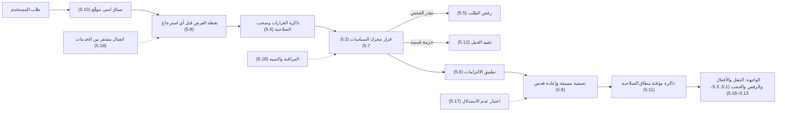

# فحص الوصول قبل كل طلب

<!-- BEGIN GENERATED: doc -->
| البند | القيمة |
|---|---|
| المعرّف | FEAT-ORG-ACCESS-ENFORCE |
| الإصدار | 0.1 |
| الحالة | مسودة |
| القدرة | CAP-01 إدارة المؤسسة والوصول |
| القدرة الفرعية | CAP-01.04 سياسات الوصول (R1) |
| الأدوار | أي مستخدم مخوَّل؛ النظام |
| الشاشات | — |
| حالات الاستخدام | — |
| القصص | 19: 2 من المواصفة، و17 جديدة |
<!-- END GENERATED: doc -->

## 1. نظرة عامة

### 1.1 القيمة

يضمن فحص كل عرض أو بحث أو تصدير أو طلب للخريطة أو للمساعد الذكي قبل جلب البيانات، فيُمنع أو يُحجب جزئيًا ما لا يحق للمستخدم رؤيته ويُرفض الطلب إذا تعذر الفحص.

### 1.2 النطاق

| البند | القيمة |
|---|---|
| المستخدمون | أي مستخدم مخوَّل يرسل طلبًا؛ والنظام: البوابة ونقاط فرض الصلاحية ومحرك السياسات؛ وفريق المنصة وفريق التشغيل وفريق الأمن |
| الشاشات | لا شاشة خاصة بالميزة؛ وتنطبق قواعد الواجهة فيها على كل الشاشات: القائمة والأفعال الظاهرة ورسائل الرفض وعلامة الحجب |
| حالات الاستخدام | فحص كل طلب قبل جلب بياناته، وتطبيق القرار والتزاماته، وتصفية القوائم والبحث دون كشف المحجوب، والرفض حين يتعذر الفحص، ومراقبة ذلك واختباره |
| المتطلبات | فحص الصلاحية قبل كل استرجاع للبيانات (REQ-FND-010)؛ ستة أنواع من القرار مع التزامات تُطبَّق (REQ-FND-012)؛ رفض الطلب إن تعطل محرك السياسات أو أخطأ (REQ-FND-013) |
| خارج النطاق | كتابة السياسات واختبارها وتفعيلها («سياسات الوصول»)؛ تعريف الأدوار وإسنادها؛ التصنيف والتصاريح؛ تسجيل الدخول نفسه («تسجيل الدخول») |

### 1.3 خريطة الميزة

كل طلب يمر بالمسار نفسه: تبني البوابة سياقًا أمنيًا موقّعًا، ثم تسأل نقطة الفرض محرك السياسات قبل أن تلمس أي بيانات، ثم تطبّق القرار والتزاماته، فتصل إلى الواجهة نتيجة مصفّاة أو رفض لا يكشف شيئًا. والشكل 1 يضع القصص على هذا المسار.

**الشكل 1: مسار الطلب في ميزة «فحص الوصول قبل كل طلب»**



## 2. القواعد المشتركة

تنطبق على كل قصص الميزة، فلا تتكرر داخل القصص. وكل قصة تذكر ما يخصها فقط.

### 2.1 السياق المشترك

كل قصة تبدأ من ثلاثة شروط: مستأجر نشط، وحزمة السياسات الأساسية مفعّلة، ومستخدم مسجّل الدخول ومخوَّل. وتشير إليها القصص بخطوة واحدة: «بفرض السياق المشترك للميزة».

### 2.2 الصلاحية وعدم الإفصاح

- من لا يحق له رؤية العنصر يتلقى ردًا بشكل «غير متاح» تمامًا، فلا يعرف أنه موجود.
- من يرى العنصر ولا يحق له الإجراء يتلقى «لا تملك صلاحية هذا الإجراء».

### 2.3 عدم الإفصاح في القراءة

- لا أوامر في الميزة: قصصها استعلامان وقدرات منصة وتشغيل يمر بها كل طلب في المنصة، فلا رفض مشترك للأوامر فيها.
- العنصر غير المرئي لا يدل عليه عدد ولا وجه تصفية ولا ترتيب ولا توقيت ولا رسالة خطأ (ADR-P06، QAS-SEC-002).
- الأمن لا يتدهور إلى السماح: كل عطل في الفحص ينتهي برفض الطلب (القصتان 5.5 و5.12).

## 3. الجودة وتعريف الاكتمال

### 3.1 متطلبات الجودة

<!-- BEGIN GENERATED: quality -->
| المرجع | الموقف | المطلوب |
|---|---|---|
| QAS-PERF-009 | PEP requests a policy decision | p95 ≤ 5 ms with embedded evaluator; ≤ 20 ms remote |
| QAS-SEC-002 | searches, lists, maps or receives alerts touching objects above clearance | 0 leakage in inference suite (counts, facets, ordering, timing, errors) |
| QAS-SEC-003 | removes a user's compartment | effective on next request in every path, independent of index lag |
| QAS-SEC-004 | request the same map tile | 0 cross-scope cache hits |
| QAS-SEC-005 | policy engine unavailable | 100 % fail-closed |
| QAS-SEC-011 | inference test suite on search, suggestions, facets, graph and paths | 0 disclosures of hidden objects, hidden facts, hidden nodes/edges |
<!-- END GENERATED: quality -->

### 3.2 تعريف الاكتمال

القصة مكتملة حين تتحقق الشروط الخمسة:

1. سيناريوهاتها والقواعد المشتركة تمر في الاختبار الآلي.
2. فحوص البنية المعمارية تمر.
3. نصوص الواجهة والرسائل موجودة بالعربية والإنجليزية.
4. مراجعة الكود مكتملة.
5. ما تضيفه القصة نفسها في قسم «القواعد» تحقق.

## 4. فهرس القصص

<!-- BEGIN GENERATED: story-index -->
| المعرّف | القصة | النوع | الحالة |
|---|---|---|---|
| `US-BC01-Q-SEC-CONTEXT` | جلب: Caller's resolved SecurityContext | جلب | مسودة |
| `US-BC08-Q-PDP-DECIDE` | جلب: DecisionRequest → DecisionResponse (authorization-model §2) | جلب | مسودة |
| `US-PLT-ACCESS-ALLOWED-ACTIONS` | إرجاع الأفعال المسموحة مع تفاصيل المورد | منصة | مسودة |
| `US-PLT-ACCESS-DECISION-CACHE` | نفاذ سحب الصلاحية في الطلب التالي | منصة | مسودة |
| `US-PLT-ACCESS-FAIL-CLOSED` | رفض الطلب عند تعذر فحص الصلاحية | منصة | مسودة |
| `US-PLT-ACCESS-OBLIGATIONS` | تطبيق التزامات قرار الوصول | منصة | مسودة |
| `US-PLT-ACCESS-PDP-PERFORMANCE` | قرار الصلاحية خلال خمسة أجزاء من الثانية | منصة | مسودة |
| `US-PLT-ACCESS-PEP-EVERY-PATH` | فحص الصلاحية قبل أي استرجاع للبيانات | منصة | مسودة |
| `US-PLT-ACCESS-QUERY-PREFILTER` | تصفية النتائج دون كشف المحجوب | منصة | مسودة |
| `US-PLT-ACCESS-SECURITY-CONTEXT` | سياق أمني موقّع يرافق كل طلب | منصة | مسودة |
| `US-PLT-ACCESS-SHARED-CACHE` | منع مشاركة النتائج المخزنة بين المستخدمين | منصة | مسودة |
| `US-PLT-ACCESS-STALE-BUNDLE` | تقييد العمل عند تقادم حزمة السياسات | منصة | مسودة |
| `US-PLT-ACCESS-UI-DENIALS` | عرض الرفض دون كشف وجود المورد | منصة | مسودة |
| `US-PLT-ACCESS-UI-LOCAL-STORAGE` | منع حفظ البيانات الحساسة في المتصفح | منصة | مسودة |
| `US-PLT-ACCESS-UI-NAVIGATION` | إظهار مناطق الواجهة حسب صلاحيات المستخدم | منصة | مسودة |
| `US-PLT-ACCESS-UI-REDACTION` | علامة ثابتة للحقل المحجوب | منصة | مسودة |
| `US-OPS-ACCESS-INFERENCE-SUITE` | اختبار عدم الاستدلال واختبار الاختراق | تشغيل | مسودة |
| `US-OPS-ACCESS-MTLS-IDENTITY` | اتصال مشفر بهوية خاصة لكل خدمة | تشغيل | مسودة |
| `US-OPS-ACCESS-PDP-ALERTS` | تنبيهات أداء محرك السياسات وقفزات الرفض | تشغيل | مسودة |
<!-- END GENERATED: story-index -->

## 5. القصص

### 5.1 US-BC01-Q-SEC-CONTEXT — سياقي الأمني: أدواري وتصريحي

| النوع | الإصدار | الأولوية | دون اتصال | الحالة |
|---|---|---|---|---|
| جلب | R1 | Must | لا | مسودة |

> **كـ** أي مستخدم مخوَّل، **أريد** أن تعرف الواجهة أدواري ونطاقاتها وتصريحي الأمني كما يراها النظام الآن، **حتى** ترتّب لي القوائم والأفعال على صلاحياتي الفعلية.

**باختصار:** يطلب المستخدم سياقه الأمني الحالي، فيُعاد له هو وحده: أدواره بنطاقاتها التنظيمية، وتصريحه، وقوة مصادقته، وإصدار الأمن.

#### القواعد

- **من يرى ماذا:** المستخدم يرى سياقه هو فقط، ولا يطلب سياق غيره.
- **ما يُعاد:** المستأجر والخلية، والمستخدم، وأدواره مع نطاق كل دور وشمول وحداته الفرعية، وتصريحه (أعلى مستوى والأقسام)، وطريقة المصادقة وقوتها ووقتها والجهاز، وإصدار الأمن.
- **ما لا يُعاد:** لا صلاحيات محسوبة غير الأدوار والتصريح. والقرار على أي فعل يبقى لمحرك السياسات (القصة 5.10).
- يُرسل الطلب بترويسة الغرض كسائر الطلبات، ولا يُخزَّن الغرض في السياق.

#### معايير القبول

```gherkin
# language: ar
خاصية: سياقي الأمني

  سيناريو: المستخدم يرى أدواره وتصريحه
    بفرض السياق المشترك للميزة
    و للمستخدم دوران في وحدتين وتصريح "سري" بقسمين
    عندما يطلب سياقه الأمني
    اذاً يُعاد الدوران بنطاق كل منهما وتصريحه وأقسامه وإصدار الأمن
    و لا يُعاد أي بيان عن مستخدم آخر

  سيناريو مخطط: رفض خاص بطلب السياق الأمني
    بفرض السياق المشترك للميزة
    لكن <الحالة>
    عندما يطلب سياقه الأمني
    اذاً يُرفض برمز <الرمز> ويرى "<الرسالة>"
    و لا يتغير شيء

    امثلة:
      | الحالة                         | الرمز           | الرسالة                                        |
      | الطلب بلا جلسة دخول            | UNAUTHENTICATED | يلزم تسجيل الدخول. سجّل الدخول ثم أعد المحاولة |
      | انتهت جلسته ولم تُجدَّد         | UNAUTHENTICATED | يلزم تسجيل الدخول. سجّل الدخول ثم أعد المحاولة |
```

<details><summary>المراجع التقنية والتتبع</summary>

<!-- BEGIN GENERATED: refs US-BC01-Q-SEC-CONTEXT -->
| البند | المعرّف | المعنى |
|---|---|---|
| الواجهة البرمجية | `GET /api/v1/foundation/me/security-context` | — |
| الاستعلام | `QRY-SEC-CONTEXT` | Caller's resolved SecurityContext |
| السياسة | `POL-SEC-CONTEXT` | org scope of subject roles ∩ classification rule |
| المتطلب | REQ-FND-010 | The system shall evaluate authorization before retrieving data for every command, query, search, map request,… |
<!-- END GENERATED: refs US-BC01-Q-SEC-CONTEXT -->

</details>

### 5.2 US-BC08-Q-PDP-DECIDE — طلب قرار من محرك السياسات

| النوع | الإصدار | الأولوية | دون اتصال | الحالة |
|---|---|---|---|---|
| جلب | R1 | Must | لا | مسودة |

> **كـ** النظام (نقطة فرض داخلية بهوية خدمة)، **أريد** أن أرسل طلب قرار وأتلقى القرار والتزاماته، **حتى** أطبّقه قبل أن ألمس أي بيانات.

**باختصار:** ترسل نقطة الفرض من يطلب، وماذا يريد أن يفعل، وعلى أي مورد، ولأي غرض، وفي أي سياق، فيعيد محرك السياسات القرار والتزاماته ونطاق القوائم المسموح.

#### القواعد

- **من يُسمح له:** نقاط الفرض الداخلية بهوية خدمة فقط. والطلب بهوية مستخدم يتلقى «غير متاح».
- **البيانات:** خمسة حقول إلزامية: صاحب الطلب (أدواره ووحداته وتصريحه وسماته وجهازه وقوة مصادقته)، والفعل، والمورد (أو نوعه ونطاقه للقوائم والبحث)، والغرض، والسياق (الوقت والولاية ومنطقة الشبكة والعمل دون اتصال).
- **ما يُعاد:** واحد من ستة قرارات: سماح، أو رفض، أو سماح بشرط، أو حجب جزئي، أو تجميع، أو طلب موافقة؛ ومعه الالتزامات، ونطاق مسموح للقوائم والبحث، ورمز السبب، وإصدار السياسة.
- **ترتيب التقييم:** المستأجر أولًا، ثم قاعدة التصنيف، ثم صلاحية الدور في نطاقه، ثم السمات (الغرض والوقت والجهاز والولاية والتحفظات)، ثم فصل المهام، ثم الالتزامات والأشد منها يغلب.
- يقيّم المحرك السياسات النافذة بزمن سريانها.

#### معايير القبول

```gherkin
# language: ar
خاصية: طلب قرار من محرك السياسات

  سيناريو: قرار بالتزاماته لطلب كامل
    بفرض السياق المشترك للميزة
    و نقطة فرض داخلية بهوية خدمة صالحة
    عندما ترسل طلب قرار بصاحب الطلب والفعل والمورد والغرض والسياق
    اذاً يُعاد القرار والتزاماته ورمز السبب وإصدار السياسة
    و يُعاد نطاق مسموح حين يكون المورد قائمة أو بحثًا

  سيناريو: مستأجر مختلف يُرفض أولًا
    بفرض السياق المشترك للميزة
    و المورد في مستأجر غير مستأجر صاحب الطلب
    عندما ترسل نقطة الفرض طلب القرار
    اذاً يكون القرار رفضًا بشكل "غير متاح" قبل تقييم أي قاعدة أخرى

  سيناريو مخطط: رفض خاص بطلب القرار
    بفرض السياق المشترك للميزة
    و <الحالة>
    عندما ترسل نقطة الفرض طلب القرار
    اذاً يُرفض برمز <الرمز> ويرى "<الرسالة>"
    و لا يتغير شيء

    امثلة:
      | الحالة                  | الرمز             | الرسالة                                              |
      | الطلب بلا غرض           | VALIDATION_FAILED | الغرض مطلوب                                          |
      | الطلب بلا مورد          | VALIDATION_FAILED | المورد مطلوب                                         |
      | حجم الطلب فوق المسموح   | PAYLOAD_TOO_LARGE | حجم الطلب أكبر من المسموح. قلّل حجم البيانات أو قسّمها |
```

<details><summary>المراجع التقنية والتتبع</summary>

<!-- BEGIN GENERATED: refs US-BC08-Q-PDP-DECIDE -->
| البند | المعرّف | المعنى |
|---|---|---|
| الواجهة البرمجية | `POST /api/v1/governance/policy-decisions` | — |
| الاستعلام | `QRY-PDP-DECIDE` | DecisionRequest → DecisionResponse (authorization-model §2) |
| السياسة | `POL-PDP-DECIDE` | org scope of subject roles ∩ classification rule |
| المتطلب | REQ-FND-010 | The system shall evaluate authorization before retrieving data for every command, query, search, map request,… |
<!-- END GENERATED: refs US-BC08-Q-PDP-DECIDE -->

</details>

### 5.3 US-PLT-ACCESS-ALLOWED-ACTIONS — إرجاع الأفعال المسموحة مع تفاصيل المورد

| النوع | الإصدار | الأولوية | دون اتصال | الحالة |
|---|---|---|---|---|
| منصة | R1 | Should | لا ينطبق | مسودة |

> **كـ** فريق المنصة، **أريد** أن تعيد تفاصيل المورد الأفعال المسموحة للمستخدم عليه، **حتى** لا تُظهر الواجهة زرًا يرفضه الخادم.

#### القواعد

- اليوم لا تعيد العقود هذه القائمة: تُظهر الواجهة الفعل إن شملته صلاحيات المستخدم في سياقه الأمني (القصة 5.1) وسمحت به حالة المورد المعروضة. وهذا تلميح، والرد بالرفض يبقى الحكم.
- **[Needs Review]** المقترح: حقل اختياري للأفعال المسموحة في ردود التفاصيل فقط، لا في القوائم.
- يُحسب بعد التخويل الكامل على المورد المحمَّل، ويعلّم الفعل الذي يحتاج مصادقة معززة أو موافقة بدل أن يخفيه.
- لا يُخزَّن في ذاكرة مشتركة بين المستخدمين، وهو استشاري لا يغني عن الفحص عند التنفيذ.
- تُقيَّم أفعال المورد دفعة واحدة ضمن ميزانية القرار: 5 ms عند المئين 95 (QAS-PERF-009).

#### معايير القبول

```gherkin
# language: ar
خاصية: الأفعال المسموحة مع تفاصيل المورد

  سيناريو: التفاصيل تحمل الأفعال المسموحة
    بفرض مستخدم يرى موردًا ويحق له تعديله واعتماده بمصادقة معززة
    عندما يطلب تفاصيل المورد
    اذاً تحمل التفاصيل فعل التعديل وفعل الاعتماد معلَّمًا بالحاجة إلى المصادقة المعززة

  سيناريو: القوائم لا تحمل الأفعال
    بفرض مستخدم يطلب قائمة موارد
    عندما تُعاد القائمة
    اذاً لا يُحسب لعناصرها أي فعل مسموح

  سيناريو: الخادم يبقى الحكم
    بفرض فعل ظهر للمستخدم ثم سُحبت صلاحيته قبل التنفيذ
    عندما ينفّذ الفعل
    اذاً يرفضه الخادم ولا يُنفَّذ شيء
```

<details><summary>المراجع التقنية والتتبع</summary>

<!-- BEGIN GENERATED: refs US-PLT-ACCESS-ALLOWED-ACTIONS -->
| البند | المعرّف | المعنى |
|---|---|---|
| المصدر | `21-ui-design.md §6.3` | — |
| الجودة | QAS-PERF-009 | PEP requests a policy decision → p95 ≤ 5 ms with embedded evaluator; ≤ 20 ms remote |
| المصدر | `[Derived]` | — |
<!-- END GENERATED: refs US-PLT-ACCESS-ALLOWED-ACTIONS -->

</details>

### 5.4 US-PLT-ACCESS-DECISION-CACHE — نفاذ سحب الصلاحية في الطلب التالي

| النوع | الإصدار | الأولوية | دون اتصال | الحالة |
|---|---|---|---|---|
| منصة | R1 | Should | لا ينطبق | مسودة |

> **كـ** فريق المنصة، **أريد** أن يسري سحب الصلاحية في الطلب التالي في كل المسارات، **حتى** لا تحمي الذاكرة المؤقتة وصولًا لم يعد مستحقًا.

#### القواعد

- تُخزَّن قرارات السماح فقط، 60 ثانية على الأكثر، بمفتاح يتضمن إصدار الأمن للمستخدم وللمورد.
- كل حدث مؤثر أمنيًا (سحب دور أو قسم أو خفض تصريح أو إعادة تصنيف) يرفع إصدار الأمن، ويُبث على قناة الأولوية فتبطل الذاكرة فورًا في كل نقاط الفرض والفهارس.
- تقارن نقطة الفرض إصدار الأمن في السياق بالقيمة الحالية في كل طلب، فإن كان أقدم أعادت بناء السياق قبل التقييم.
- سحب قسم من مستخدم نافذ في الطلب التالي في كل المسارات، مهما تأخر تحديث الفهارس (QAS-SEC-003).
- رسالة إصدار لا تُطبَّق لا تُوقف ولا تُؤجَّل: تعيد نقطة الفرض بناء السياق من الدليل أو ترفض الطلب.
- إن تأخر بث الإصدارات تُقرأ القيم مباشرة من مخزن الإصدارات، أبطأ لكن صحيحة.

#### معايير القبول

```gherkin
# language: ar
خاصية: نفاذ سحب الصلاحية في الطلب التالي

  سيناريو: سحب قسم يسري في الطلب التالي
    بفرض مستخدم يرى عنصرًا بقسم أمني وقرار السماح له في الذاكرة
    و مسؤول الأمن سحب منه ذلك القسم
    عندما يطلب المستخدم العنصر أو يبحث عنه قبل تحديث الفهارس
    اذاً لا يُعاد له العنصر في أي مسار

  سيناريو: الرفض لا يُخزَّن
    بفرض قرار رفض لطلب مستخدم
    عندما يكرر المستخدم الطلب
    اذاً يُعاد تقييم الطلب ولا يُقرأ قرار من الذاكرة
```

<details><summary>المراجع التقنية والتتبع</summary>

<!-- BEGIN GENERATED: refs US-PLT-ACCESS-DECISION-CACHE -->
| البند | المعرّف | المعنى |
|---|---|---|
| الجودة | QAS-SEC-003 | removes a user's compartment → effective on next request in every path, independent of index lag |
| المصدر | `17-security-design.md §3.5` | — |
| المصدر | `23-crosscutting.md §6.1` | — |
<!-- END GENERATED: refs US-PLT-ACCESS-DECISION-CACHE -->

</details>

### 5.5 US-PLT-ACCESS-FAIL-CLOSED — رفض الطلب عند تعذر فحص الصلاحية

| النوع | الإصدار | الأولوية | دون اتصال | الحالة |
|---|---|---|---|---|
| منصة | R1 | Must | لا ينطبق | مسودة |

> **كـ** فريق المنصة، **أريد** أن يُرفض كل طلب حين يتعذر فحص صلاحيته، **حتى** لا يتحول عطل إلى وصول غير مستحق.

#### القواعد

- تعطل محرك السياسات أو خطؤه أو انقضاء مهلته يعني رفض الطلب، في 100 % من الطلبات المحمية (QAS-SEC-005)، ويُسجَّل كل رفض.
- يرى المستخدم «تعذّر التحقق من الصلاحية الآن، فلم يُنفَّذ الطلب». والطلب قابل للإعادة، فتعيده الواجهة تلقائيًا بتأخير متزايد ثم تعرض الرسالة.
- إن تعطل دليل الهوية والتنظيم، يُقبل السياق الأمني المخزَّن 60 ثانية فقط، ثم تُرفض الطلبات.
- يتحقق من ذلك اختبار فوضى يوقف المحرك، وفشله يوقف البناء (FIT-16).

#### معايير القبول

```gherkin
# language: ar
خاصية: رفض الطلب عند تعذر فحص الصلاحية

  سيناريو: المحرك متوقف
    بفرض أن محرك السياسات متوقف
    عندما يرسل مستخدم أي طلب محمي
    اذاً يُرفض الطلب ويرى "تعذّر التحقق من الصلاحية الآن، فلم يُنفَّذ الطلب"
    و يُسجَّل الرفض
    و لا تُقرأ أي بيانات ولا يتغير شيء

  سيناريو: دليل الهوية متعطل أكثر من 60 ثانية
    بفرض أن دليل الهوية والتنظيم متعطل منذ أكثر من 60 ثانية
    عندما يرسل مستخدم طلبًا
    اذاً يُرفض الطلب ولا يُستعمل سياق أقدم من 60 ثانية
```

<details><summary>المراجع التقنية والتتبع</summary>

<!-- BEGIN GENERATED: refs US-PLT-ACCESS-FAIL-CLOSED -->
| البند | المعرّف | المعنى |
|---|---|---|
| الجودة | QAS-SEC-005 | policy engine unavailable → 100 % fail-closed |
| فحص البنية | FIT-16 | Policy engine failure denies |
| المتطلب | REQ-FND-013 | If the policy decision point is unavailable or returns an error, then the system shall deny the request. |
<!-- END GENERATED: refs US-PLT-ACCESS-FAIL-CLOSED -->

</details>

### 5.6 US-PLT-ACCESS-OBLIGATIONS — تطبيق التزامات قرار الوصول

| النوع | الإصدار | الأولوية | دون اتصال | الحالة |
|---|---|---|---|---|
| منصة | R1 | Must | لا ينطبق | مسودة |

> **كـ** فريق المنصة، **أريد** أن تطبّق نقطة الفرض كل نوع من القرار والتزاماته، **حتى** يحدث ما قررته السياسة فعلًا لا ما تفترضه الواجهة.

#### القواعد

- **سماح:** يُنفَّذ الطلب مع التزاماته.
- **رفض:** «غير متاح» للمورد غير المرئي، و«لا تملك صلاحية هذا الإجراء» للمورد المرئي (القسم 2.2).
- **سماح بشرط:** شروطه التزامات. قبل التنفيذ: المصادقة المعززة، وفحص التجميد القانوني في أوامر المحو. وبعده: تفاصيل التدقيق، والعلامة المائية، والإشعار.
- **حجب جزئي:** تُعاد النتيجة بلا الحقول المحجوبة، مثل البيانات الشخصية لغير الغرض المسموح (القصة 5.16).
- **تجميع:** تُعاد إحصاءات فقط، ولا تُعرض مجموعة أصغر من 5.
- **طلب موافقة:** يُرفض الطلب ويُذكر دور المعتمِد، ولا سير موافقة عام. والاستثناء: طلب تخصيص الموارد ينتقل إلى حالة انتظار الموافقة بدل الرفض.
- تُجمع الالتزامات، والأشد منها يغلب.

#### معايير القبول

```gherkin
# language: ar
خاصية: تطبيق التزامات قرار الوصول

  سيناريو: مصادقة معززة قبل التنفيذ
    بفرض أمر تشترط سياسته المصادقة المعززة وجلسة المستخدم أضعف
    عندما يرسل المستخدم الأمر
    اذاً يُرفض ويرى "هذا الإجراء يحتاج تأكيد هويتك مرة أخرى"
    و لا يُنفَّذ شيء
    و إذا أكّد هويته وأعاد الأمر بالمفتاح نفسه يُنفَّذ مرة واحدة

  سيناريو: طلب موافقة
    بفرض قرار بطلب موافقة لتصدير يتجاوز حده
    عندما يرسل المستخدم الطلب
    اذاً يُرفض ويرى "هذا الإجراء يحتاج موافقة صاحب صلاحية، ولم يُنفَّذ"
    و يُذكر دور المعتمِد

  سيناريو: حجب جزئي
    بفرض قرار بحجب البيانات الشخصية لغرض التحليل
    عندما يعرض المستخدم سجلًا فيه بيانات شخصية
    اذاً يُعاد السجل بلا الحقول الشخصية
```

<details><summary>المراجع التقنية والتتبع</summary>

<!-- BEGIN GENERATED: refs US-PLT-ACCESS-OBLIGATIONS -->
| البند | المعرّف | المعنى |
|---|---|---|
| المصدر | `17-security-design.md §3.4` | — |
| المتطلب | REQ-FND-012 | The system shall return a policy decision of ALLOW, DENY, CONDITIONAL, REDACT, AGGREGATE or REQUIRE_APPROVAL,… |
| حالة الاستخدام | UC-086 | Manage Access Policy |
<!-- END GENERATED: refs US-PLT-ACCESS-OBLIGATIONS -->

</details>

### 5.7 US-PLT-ACCESS-PDP-PERFORMANCE — قرار الصلاحية خلال خمسة أجزاء من الثانية

| النوع | الإصدار | الأولوية | دون اتصال | الحالة |
|---|---|---|---|---|
| منصة | R1 | Should | لا ينطبق | مسودة |

> **كـ** فريق المنصة، **أريد** أن يصدر قرار الصلاحية خلال 5 ms، **حتى** لا يبطئ الفحص قبل كل طلب عمل المستخدمين.

#### القواعد

- الهدف 5 ms عند المئين 95 بمقيّم مضمَّن، و20 ms بخدمة القرار البعيدة، تحت 10,000 قرار في الثانية (QAS-PERF-009).
- تُترجم جداول القرار إلى لغة محرك السياسات، وتُوزَّع حزمًا موقّعة، وتُقيَّم مضمَّنة في كل وحدة (TD-08).
- التقييم الجزئي يُنتج مرشح النطاق المسموح للقوائم والبحث (القصة 5.9).

#### معايير القبول

```gherkin
# language: ar
خاصية: زمن قرار الصلاحية

  سيناريو: المقيّم المضمَّن تحت الحمل
    بفرض حمل 10,000 قرار في الثانية
    عندما تطلب نقاط الفرض قراراتها من المقيّم المضمَّن
    اذاً يكون زمن القرار 5 ms أو أقل عند المئين 95

  سيناريو: خدمة القرار البعيدة
    بفرض الحمل نفسه
    عندما يُطلب القرار من خدمة القرار البعيدة
    اذاً يكون زمنه 20 ms أو أقل عند المئين 95
```

<details><summary>المراجع التقنية والتتبع</summary>

<!-- BEGIN GENERATED: refs US-PLT-ACCESS-PDP-PERFORMANCE -->
| البند | المعرّف | المعنى |
|---|---|---|
| الجودة | QAS-PERF-009 | PEP requests a policy decision → p95 ≤ 5 ms with embedded evaluator; ≤ 20 ms remote |
| القرار التقني | TD-08 | Open Policy Agent: decision tables compiled to Rego; signed bundles; embedded evaluation (WASM/library) in ea… |
<!-- END GENERATED: refs US-PLT-ACCESS-PDP-PERFORMANCE -->

</details>

### 5.8 US-PLT-ACCESS-PEP-EVERY-PATH — فحص الصلاحية قبل أي استرجاع للبيانات

| النوع | الإصدار | الأولوية | دون اتصال | الحالة |
|---|---|---|---|---|
| منصة | R1 | Must | لا ينطبق | مسودة |

> **كـ** فريق المنصة، **أريد** أن يمر كل مسار استرجاع بنقطة فرض قبل الوصول إلى البيانات، **حتى** لا يوجد طريق إلى البيانات يتجاوز الفحص.

#### القواعد

- يشمل الفحص كل أمر واستعلام وبحث وطلب خريطة وتصدير واشتراك في الأحداث واسترجاع للمساعد الذكي (REQ-FND-010).
- الفحص الأولي قبل أي وصول يرد «غير متاح» للمورد، لأن شيئًا لم يُحمَّل بعد. ثم فحص كامل بسمات المورد المحمَّل، ثم التزامات ما قبل التنفيذ.
- خط الأوامر يفرض هذه الخطوات بنيويًا: لا يصل معالج إلى المستودعات أو محرك السياسات إلا عبره (FIT-20).
- اختبار مسار الاستدعاء لا يقبل استدعاء مستودع أو بحث بلا قرار قبله، وفشله يوقف البناء (FIT-03).
- الطلب بين الخدمات يحمل سياق المستخدم الأصلي، ولا ترفع الخدمة صلاحياتها باسمه.
- اختبارات الاختراق لا تجد طريقًا يتجاوز الفحص.

#### معايير القبول

```gherkin
# language: ar
خاصية: فحص الصلاحية قبل أي استرجاع

  سيناريو: مسار بلا قرار يوقف البناء
    بفرض كود جديد يستدعي البحث دون قرار صلاحية قبله
    عندما يُشغَّل اختبار مسار الاستدعاء في البناء
    اذاً يفشل البناء ويُذكر المسار المخالف

  سيناريو: الفحص الأولي قبل أي تحميل
    بفرض مستخدم لا يملك أي صلاحية على نوع المورد
    عندما يطلب موردًا من ذلك النوع
    اذاً يرى "غير متاح"
    و لا يُقرأ المورد من التخزين
```

<details><summary>المراجع التقنية والتتبع</summary>

<!-- BEGIN GENERATED: refs US-PLT-ACCESS-PEP-EVERY-PATH -->
| البند | المعرّف | المعنى |
|---|---|---|
| فحص البنية | FIT-03 | Every retrieval path passes a PEP before data access |
| فحص البنية | FIT-20 | Module-boundary rules (complements FIT-10): no contexts→contexts or services→services imports; platform holds no context ports or business types; migrations touch only their own schema; command handlers reach repositories and the PDP only through the command pipeline; contracts/ equals the contract generator's output |
| القرار المعماري | ADR-P17 | Internal Service Architecture (Hexagonal / Ports & Adapters) |
| المتطلب | REQ-FND-010 | The system shall evaluate authorization before retrieving data for every command, query, search, map request,… |
<!-- END GENERATED: refs US-PLT-ACCESS-PEP-EVERY-PATH -->

</details>

### 5.9 US-PLT-ACCESS-QUERY-PREFILTER — تصفية النتائج دون كشف المحجوب

| النوع | الإصدار | الأولوية | دون اتصال | الحالة |
|---|---|---|---|---|
| منصة | R1 | Should | لا ينطبق | مسودة |

> **كـ** فريق المنصة، **أريد** أن تُصفّى القوائم والبحث بنطاق المستخدم قبل العدّ والترتيب، **حتى** لا يدل أي رقم أو اقتراح على عنصر محجوب.

#### القواعد

- كل وثيقة في الفهارس (البحث والمتجهات والرسم البياني ومعالم البلاطات) تحمل تسمياتها: المستأجر، والمستوى، والأقسام، والتحفظات، والنطاق التنظيمي، وإصدار الأمن.
- يحوّل محرك السياسات صلاحية المستخدم إلى مرشح نطاق مسموح يطبّقه محرك الاستعلام قبل التقييم والعدّ ووجوه التصفية.
- الأعداد ووجوه التصفية والاقتراحات و«هل تقصد» تُحسب من المجموعة المصفّاة فقط. ولا رسالة «N نتيجة مخفية».
- تُعاد مطابقة النتائج مع جدول إصدارات الأمن دفعة واحدة لكل صفحة، فيسري السحب مهما تأخر الفهرس.
- الهدف: صفر إفصاح في مجموعة عدم الاستدلال (QAS-SEC-002، QAS-SEC-011).

#### معايير القبول

```gherkin
# language: ar
خاصية: تصفية النتائج دون كشف المحجوب

  سيناريو: الأعداد والوجوه من المرئي فقط
    بفرض بحث يطابق عناصر مرئية للمستخدم وأخرى فوق تصريحه
    عندما يبحث المستخدم
    اذاً تُعاد العناصر المرئية فقط
    و يُحسب العدد ووجوه التصفية والاقتراحات منها وحدها

  سيناريو: إعادة الفحص تلتقط الفهرس المتأخر
    بفرض عنصر سُحبت رؤيته من المستخدم ولم يُحدَّث الفهرس بعد
    عندما يبحث المستخدم
    اذاً لا يظهر العنصر في النتائج
```

<details><summary>المراجع التقنية والتتبع</summary>

<!-- BEGIN GENERATED: refs US-PLT-ACCESS-QUERY-PREFILTER -->
| البند | المعرّف | المعنى |
|---|---|---|
| الجودة | QAS-SEC-002 | searches, lists, maps or receives alerts touching objects above clearance → 0 leakage in inference suite (cou… |
| الجودة | QAS-SEC-011 | inference test suite on search, suggestions, facets, graph and paths → 0 disclosures of hidden objects, hidde… |
| القرار المعماري | ADR-P06 | Security Inside Projections |
| المصدر | `17-security-design.md §3.3` | — |
<!-- END GENERATED: refs US-PLT-ACCESS-QUERY-PREFILTER -->

</details>

### 5.10 US-PLT-ACCESS-SECURITY-CONTEXT — سياق أمني موقّع يرافق كل طلب

| النوع | الإصدار | الأولوية | دون اتصال | الحالة |
|---|---|---|---|---|
| منصة | R1 | Should | لا ينطبق | مسودة |

> **كـ** فريق المنصة، **أريد** أن يرافق كل طلب سياق أمني موقّع تبنيه البوابة، **حتى** تعرف كل خدمة من يطلب دون أن تثق بما يرسله العميل.

#### القواعد

- تبني البوابة السياق من رمز الدخول وبيانات دليل الهوية والتنظيم، وتوقّعه بمفتاحها في الخلية. وعمره 60 ثانية على الأكثر، وجلسة المستخدم الخارجية 15 دقيقة على الأكثر مع التجديد.
- يُشتق المستأجر من رمز الدخول، ولا يُقرأ أبدًا من جسم الطلب أو مساره.
- يحمل السياق الأدوار والتصريح وقوة المصادقة وإصدار الأمن فقط، بلا صلاحيات محسوبة (القصة 5.1).
- الغرض لا يُخزَّن في السياق، بل يأتي بترويسة في كل طلب وتقيّمه السياسة.
- ترفض الخدمات كل سياق غير موقّع أو منتهٍ، وتعيد بناء السياق إن كان إصدار الأمن فيه أقدم من الحالي.

#### معايير القبول

```gherkin
# language: ar
خاصية: سياق أمني موقّع يرافق كل طلب

  سيناريو: المستأجر من رمز الدخول لا من الطلب
    بفرض مستخدم في مستأجر أول يرسل طلبًا يذكر مستأجرًا ثانيًا في جسمه
    عندما تبني البوابة السياق
    اذاً يكون المستأجر في السياق هو المستأجر الأول

  سيناريو: سياق منتهٍ أو غير موقّع
    بفرض طلب داخلي بسياق انتهى عمره أو بلا توقيع البوابة
    عندما يصل إلى خدمة
    اذاً ترفضه الخدمة ولا تقرأ أي بيانات

  سيناريو: إصدار أمن أقدم
    بفرض سياق إصدار الأمن فيه أقدم من القيمة الحالية
    عندما يصل الطلب إلى نقطة الفرض
    اذاً يُعاد بناء السياق قبل تقييم الطلب
```

<details><summary>المراجع التقنية والتتبع</summary>

<!-- BEGIN GENERATED: refs US-PLT-ACCESS-SECURITY-CONTEXT -->
| البند | المعرّف | المعنى |
|---|---|---|
| المصدر | `23-crosscutting.md §1.1` | — |
| المصدر | `17-security-design.md §2` | — |
<!-- END GENERATED: refs US-PLT-ACCESS-SECURITY-CONTEXT -->

</details>

### 5.11 US-PLT-ACCESS-SHARED-CACHE — منع مشاركة النتائج المخزنة بين المستخدمين

| النوع | الإصدار | الأولوية | دون اتصال | الحالة |
|---|---|---|---|---|
| منصة | R1 | Should | لا ينطبق | مسودة |

> **كـ** فريق المنصة، **أريد** ألا تعيد الذاكرة المؤقتة لمستخدم نتيجة حُسبت لمستخدم بنطاق آخر، **حتى** لا تتسرب البيانات عبر التخزين المؤقت.

#### القواعد

- **[Derived]** لا تُشارك نتيجة استعلام بين مستخدمين إلا إن تضمّن مفتاحها نطاق الصلاحية وإصدار الأمن والغرض ومعاملات الالتزامات (الحجب والتجميع).
- مفتاح البلاطة يتضمن الموقف والطبقة وموضع البلاطة وبصمة نطاق الصلاحية وإصدار البيانات، وتغيّر إصدار الأمن يغيّر المفتاح.
- الطبقات التشغيلية فوق أدنى مستوى تصنيف لا تُشارك أبدًا. وطبقات الأساس المعلَّمة صراحة «غير مصنفة» يجوز مشاركتها.
- لا ذاكرة مشتركة بين المستخدمين للمساعد الذكي.
- **[Needs Review]** عند تعارض قاعدة البلاطات مع القاعدة العامة يغلب الأشد.
- الهدف: صفر إصابة للذاكرة بين نطاقين مختلفين (QAS-SEC-004).

#### معايير القبول

```gherkin
# language: ar
خاصية: منع مشاركة النتائج المخزنة بين المستخدمين

  سيناريو: البلاطة نفسها لمستخدمين بنطاقين مختلفين
    بفرض مستخدمين بأقسام أمنية مختلفة
    عندما يطلبان البلاطة نفسها من طبقة تشغيلية
    اذاً يتلقى كل منهما ما يحق له فقط
    و لا تُعاد لأحدهما نسخة مخزنة للآخر

  سيناريو: طبقة الأساس غير المصنفة
    بفرض طبقة أساس معلَّمة "غير مصنفة"
    عندما يطلبها مستخدمان مختلفان
    اذاً يجوز أن تُعاد لهما النسخة المخزنة نفسها
```

<details><summary>المراجع التقنية والتتبع</summary>

<!-- BEGIN GENERATED: refs US-PLT-ACCESS-SHARED-CACHE -->
| البند | المعرّف | المعنى |
|---|---|---|
| المصدر | `23-crosscutting.md §9` | — |
| الجودة | QAS-SEC-004 | request the same map tile → 0 cross-scope cache hits |
| القرار المعماري | ADR-P06 | Security Inside Projections |
| المصدر | `[Derived]` | — |
<!-- END GENERATED: refs US-PLT-ACCESS-SHARED-CACHE -->

</details>

### 5.12 US-PLT-ACCESS-STALE-BUNDLE — تقييد العمل عند تقادم حزمة السياسات

| النوع | الإصدار | الأولوية | دون اتصال | الحالة |
|---|---|---|---|---|
| منصة | R1 | Should | لا ينطبق | مسودة |

> **كـ** فريق المنصة، **أريد** أن يُقيَّد العمل حين تتقادم حزمة السياسات، **حتى** لا يُتخذ قرار على سياسات ربما تغيرت.

#### القواعد

- حزمة سياسات عمرها أكثر من 5 دقائق: تُرفض كل كتابة، وتُسمح القراءة لما مستواه «داخلي» أو أدنى فقط بالحزمة المخزنة.
- «داخلي» هو المستوى الثاني في مخطط التصنيف الافتراضي، بعد «عام».
- **[Derived]** قراءة ما فوق «داخلي» في هذه الحالة تُرفض بشكل «غير متاح» (القسم 2.3).
- **[Needs Review]** المصادر لا تذكر رمز الرفض للكتابة في هذه الحالة ولا رسالتها.
- ينطلق تنبيه حين يتجاوز عمر الحزمة 120 ثانية، قبل بلوغ حد التقييد (القصة 5.19).

#### معايير القبول

```gherkin
# language: ar
خاصية: تقييد العمل عند تقادم حزمة السياسات

  سيناريو: الكتابة تُرفض والقراءة تُقيَّد
    بفرض حزمة سياسات عمرها 6 دقائق
    عندما يرسل مستخدم أمرًا يغيّر بيانات
    اذاً يُرفض الأمر ولا يتغير شيء
    و يرى المستخدم عنصرًا مستواه "داخلي" إن كان يحق له

  سيناريو: حزمة حديثة
    بفرض حزمة سياسات عمرها دقيقتان
    عندما يرسل مستخدم أمرًا يحق له
    اذاً يُقيَّم الأمر كالمعتاد دون أي تقييد
```

<details><summary>المراجع التقنية والتتبع</summary>

<!-- BEGIN GENERATED: refs US-PLT-ACCESS-STALE-BUNDLE -->
| البند | المعرّف | المعنى |
|---|---|---|
| المصدر | `09-reliability/degradation-slc01.md §matrix` | — |
| المصدر | `23-crosscutting.md §6.2` | — |
<!-- END GENERATED: refs US-PLT-ACCESS-STALE-BUNDLE -->

</details>

### 5.13 US-PLT-ACCESS-UI-DENIALS — عرض الرفض دون كشف وجود المورد

| النوع | الإصدار | الأولوية | دون اتصال | الحالة |
|---|---|---|---|---|
| منصة | R1 | Should | لا ينطبق | مسودة |

> **كـ** فريق المنصة، **أريد** أن تعرض الواجهة كل رفض بحسب حالته ورمزه، **حتى** يعرف المستخدم ما يفعله دون أن يعرف ما لا يحق له.

#### القواعد

- تتصرف الواجهة بحسب حالة الرد ورمزه، لا بحسب نص الرسالة.
- المورد غير المرئي يعرض «غير متاح» بلا تفاصيل، ولا تمييز بين المحذوف والمحجوب. ويسري ذلك على كل رابط إلى مورد.
- الإجراء غير المسموح على مورد مرئي يعرض «لا تملك صلاحية هذا الإجراء»، ومعه رمز السبب إن وُجد.
- **[Needs Review]** رموز السبب قائمة مغلقة تسمّي القاعدة ولا تحمل بيانات المورد، والقائمة نفسها غير معرَّفة في المصادر.
- طلب الموافقة يعرض دور المعتمِد. والمصادقة المعززة تُبقي النموذج مفتوحًا ثم يُعاد الأمر بالمفتاح نفسه.
- انتهاء الجلسة يعيد المستخدم إلى تسجيل الدخول ثم إلى النموذج.

#### معايير القبول

```gherkin
# language: ar
خاصية: عرض الرفض دون كشف وجود المورد

  سيناريو: رابط إلى مورد محجوب
    بفرض رابط إلى مورد لا يحق للمستخدم رؤيته
    عندما يفتح المستخدم الرابط
    اذاً يرى "غير متاح" بلا أي تفصيل
    و لا يختلف ما يراه عن رابط إلى مورد محذوف

  سيناريو: المصادقة المعززة لا تُضيع المدخلات
    بفرض مستخدم ملأ نموذجًا لأمر يشترط المصادقة المعززة
    عندما يُطلب منه تأكيد هويته ويؤكدها
    اذاً يبقى ما أدخله كما هو
    و يُعاد الأمر بالمفتاح نفسه فلا يُنفَّذ مرتين
```

<details><summary>المراجع التقنية والتتبع</summary>

<!-- BEGIN GENERATED: refs US-PLT-ACCESS-UI-DENIALS -->
| البند | المعرّف | المعنى |
|---|---|---|
| المصدر | `21-ui-design.md §6.2` | — |
| القرار المعماري | ADR-P19 | Handling of Authorization Outcomes (403 vs 404, MFA step-up, approval-required) |
| القرار المعماري | ADR-P06 | Security Inside Projections |
<!-- END GENERATED: refs US-PLT-ACCESS-UI-DENIALS -->

</details>

### 5.14 US-PLT-ACCESS-UI-LOCAL-STORAGE — منع حفظ البيانات الحساسة في المتصفح

| النوع | الإصدار | الأولوية | دون اتصال | الحالة |
|---|---|---|---|---|
| منصة | R1 | Should | لا ينطبق | مسودة |

> **كـ** فريق المنصة، **أريد** ألا تحفظ الواجهة بيانات حساسة في تخزين المتصفح، **حتى** لا يبقى شيء منها على جهاز مشترك أو مسروق.

#### القواعد

- في الويب لا تُحفظ في التخزين المحلي إلا مسودات البيانات العابرة، وهي حالة الواجهة وتفضيلاتها التي لا تُدقَّق.
- لا محتوى أعمال في تخزين المتصفح، والجلسة 15 دقيقة على الأكثر.
- في التطبيق الميداني تُحفظ البيانات في قاعدة محلية مشفرة بمفتاح في مخزن مفاتيح الجهاز، ويُفتح التطبيق برمز أو بصمة، ويمكن مسحه عن بعد.
- الواجهة لا تحمل منطق صلاحية: كل قرار يأتي من الخادم.

#### معايير القبول

```gherkin
# language: ar
خاصية: منع حفظ البيانات الحساسة في المتصفح

  سيناريو: لا محتوى أعمال في تخزين المتصفح
    بفرض مستخدم فتح تفاصيل عناصر وملأ نموذجًا في الويب
    عندما يُفحص تخزين المتصفح المحلي
    اذاً لا يوجد فيه إلا حالة الواجهة وتفضيلاتها

  سيناريو: انتهاء الجلسة
    بفرض جلسة ويب خاملة 15 دقيقة
    عندما يحاول المستخدم المتابعة
    اذاً يُطلب منه تسجيل الدخول من جديد
```

<details><summary>المراجع التقنية والتتبع</summary>

<!-- BEGIN GENERATED: refs US-PLT-ACCESS-UI-LOCAL-STORAGE -->
| البند | المعرّف | المعنى |
|---|---|---|
| المصدر | `21-ui-design.md §6.1` | — |
| المصدر | `12-solution/ui-architecture.md` | — |
<!-- END GENERATED: refs US-PLT-ACCESS-UI-LOCAL-STORAGE -->

</details>

### 5.15 US-PLT-ACCESS-UI-NAVIGATION — إظهار مناطق الواجهة حسب صلاحيات المستخدم

| النوع | الإصدار | الأولوية | دون اتصال | الحالة |
|---|---|---|---|---|
| منصة | R1 | Should | لا ينطبق | مسودة |

> **كـ** فريق المنصة، **أريد** أن تظهر مناطق الواجهة حسب صلاحيات المستخدم الفعلية، **حتى** يرى كل مستخدم ما يخص عمله دون جدول ثابت للأدوار.

#### القواعد

- تظهر المنطقة في القائمة إن كان للمستخدم فيها عملية مسموحة واحدة على الأقل.
- تأخذ الواجهة الصلاحيات من سياق المستخدم الأمني (القصة 5.1)، لأن المستأجر يعرّف أدواره بنفسه.
- **[Derived]** التوزيع الافتراضي للشاشات حسب الدور مستنتج، ويتغير بأدوار المستأجر.
- الصفحة الأولى لكل دور هي «عملي»، والبحث الموحد ثابت في الترويسة.
- **[Derived]** الرابط المشارَك يحمل المرشحات والموقع الزمني لا البيانات، ومتلقيه يرى ما تسمح به صلاحيته فقط.
- ظهور المنطقة تلميح: الخادم يبقى الحكم في كل طلب.

#### معايير القبول

```gherkin
# language: ar
خاصية: إظهار مناطق الواجهة حسب الصلاحيات

  سيناريو: منطقة بلا عملية مسموحة لا تظهر
    بفرض مستخدم لا يملك أي عملية في منطقة الإدارة
    عندما تُعرض القائمة
    اذاً لا تظهر منطقة الإدارة
    و تظهر المناطق التي له فيها عملية واحدة على الأقل

  سيناريو: رابط مشارَك
    بفرض رابط يحمل مرشحات قائمة أرسله مستخدم إلى آخر بنطاق أضيق
    عندما يفتحه المتلقي
    اذاً يرى من القائمة ما يحق له فقط
```

<details><summary>المراجع التقنية والتتبع</summary>

<!-- BEGIN GENERATED: refs US-PLT-ACCESS-UI-NAVIGATION -->
| البند | المعرّف | المعنى |
|---|---|---|
| المصدر | `21-ui-design.md §3` | — |
| المصدر | `21-ui-design.md §6.3` | — |
| المصدر | `[Derived]` | — |
<!-- END GENERATED: refs US-PLT-ACCESS-UI-NAVIGATION -->

</details>

### 5.16 US-PLT-ACCESS-UI-REDACTION — علامة ثابتة للحقل المحجوب

| النوع | الإصدار | الأولوية | دون اتصال | الحالة |
|---|---|---|---|---|
| منصة | R1 | Should | لا ينطبق | مسودة |

> **كـ** فريق المنصة، **أريد** أن يظهر الحقل المحجوب بعلامة واحدة ثابتة، **حتى** لا يُستنتج منه طوله أو نوعه.

#### القواعد

- **[Derived]** الحقل المحجوب جزئيًا يُعرض بعلامة «محجوب» ثابتة لا تكشف طوله ولا نوعه.
- مثال: يظهر تقييم المصدر دون هوية المصدر.
- الواجهة تعرض الحجب كما يعيده الخادم، ولا تحجب ولا تكشف بنفسها.
- لا عدادات ولا رسائل تكشف المحجوب.

#### معايير القبول

```gherkin
# language: ar
خاصية: علامة ثابتة للحقل المحجوب

  سيناريو: حقلان محجوبان مختلفان
    بفرض سجل فيه حقلان محجوبان أحدهما نص طويل والآخر تاريخ
    عندما يعرضه المستخدم
    اذاً يظهر الحقلان بعلامة "محجوب" نفسها وبالعرض نفسه
```

<details><summary>المراجع التقنية والتتبع</summary>

<!-- BEGIN GENERATED: refs US-PLT-ACCESS-UI-REDACTION -->
| البند | المعرّف | المعنى |
|---|---|---|
| المصدر | `21-ui-design.md §11` | — |
| القرار المعماري | ADR-P19 | Handling of Authorization Outcomes (403 vs 404, MFA step-up, approval-required) |
| المصدر | `[Derived]` | — |
<!-- END GENERATED: refs US-PLT-ACCESS-UI-REDACTION -->

</details>

### 5.17 US-OPS-ACCESS-INFERENCE-SUITE — اختبار عدم الاستدلال واختبار الاختراق

| النوع | الإصدار | الأولوية | دون اتصال | الحالة |
|---|---|---|---|---|
| تشغيل | R1 | Must | لا ينطبق | مسودة |

> **كـ** فريق الأمن، **أريد** مجموعة اختبار عدم الاستدلال واختبار اختراق قبل كل إصدار، **حتى** أثبت أن المحجوب لا يُستنتج من أي مسار.

#### القواعد

- تحاول المجموعة استنتاج المحجوب من الأعداد ووجوه التصفية والترتيب والتوقيت والأخطاء، في البحث والقوائم والخرائط والتنبيهات والاقتراحات والرسم البياني ومساراته.
- تعمل بمولِّد حالات وقياس للتوقيت، والهدف صفر إفصاح (QAS-SEC-002، QAS-SEC-011).
- تعمل سيناريوهات الأمن في كل بناء، والمجموعة الكاملة على جدول دوري.
- قبل بوابة الإصدار: اختبار اختراق، ومجموعة عدم الاستدلال تحت الحمل. ولا يجد الاختراق طريقًا يتجاوز الفحص (REQ-FND-010).

#### معايير القبول

```gherkin
# language: ar
خاصية: اختبار عدم الاستدلال واختبار الاختراق

  سيناريو: إفصاح واحد يوقف الإصدار
    بفرض أن المجموعة وجدت عددًا يختلف بوجود عنصر محجوب
    عندما تُراجع نتائجها عند بوابة الإصدار
    اذاً لا يُعتمد الإصدار حتى يُصلَح الإفصاح

  سيناريو: صفر إفصاح
    بفرض أن المجموعة واختبار الاختراق لم يجدا أي إفصاح
    عندما تُراجع النتائج عند بوابة الإصدار
    اذاً يُستوفى شرط الأمن في البوابة
```

<details><summary>المراجع التقنية والتتبع</summary>

<!-- BEGIN GENERATED: refs US-OPS-ACCESS-INFERENCE-SUITE -->
| البند | المعرّف | المعنى |
|---|---|---|
| الجودة | QAS-SEC-002 | searches, lists, maps or receives alerts touching objects above clearance → 0 leakage in inference suite (cou… |
| الجودة | QAS-SEC-011 | inference test suite on search, suggestions, facets, graph and paths → 0 disclosures of hidden objects, hidde… |
| المتطلب | REQ-FND-010 | The system shall evaluate authorization before retrieving data for every command, query, search, map request,… |
<!-- END GENERATED: refs US-OPS-ACCESS-INFERENCE-SUITE -->

</details>

### 5.18 US-OPS-ACCESS-MTLS-IDENTITY — اتصال مشفر بهوية خاصة لكل خدمة

| النوع | الإصدار | الأولوية | دون اتصال | الحالة |
|---|---|---|---|---|
| تشغيل | R1 | Should | لا ينطبق | مسودة |

> **كـ** فريق التشغيل، **أريد** أن يكون كل اتصال بين الخدمات مشفرًا بهوية خاصة لكل خدمة، **حتى** لا تُمنح ثقة ضمنية داخل الخلية.

#### القواعد

- كل استدعاء بين الخدمات بتشفير متبادل الهوية، ولكل تطبيق هوية عبء عمل خاصة به.
- كل تطبيق يتحقق من السياق الأمني الموقّع (القصة 5.10). والطلب الداخلي يحمل سياق المستخدم الأصلي، ولا ترفع الخدمة صلاحياتها باسمه.
- الاتصال الخارجي بإصدار التشفير 1.3.
- سياسة الشبكة تمنع كل خروج افتراضيًا، والاستثناء عبر بوابة خروج بقائمة سماح. ومخالفة الخروج تنبيه أمني من الأولوية الأولى.
- **[Needs Review]** منتج الشبكة الخدمية التي تحمل هذا التشفير غير محدد في المصادر.

#### معايير القبول

```gherkin
# language: ar
خاصية: اتصال مشفر بهوية خاصة لكل خدمة

  سيناريو: استدعاء بلا هوية صالحة
    بفرض عبء عمل بلا هوية خدمة صالحة داخل الخلية
    عندما يستدعي خدمة أخرى
    اذاً يُرفض الاتصال ولا تُقرأ أي بيانات

  سيناريو: الخدمة تعمل بصلاحيات المستخدم
    بفرض خدمة تستدعي خدمة أخرى لتلبية طلب مستخدم
    عندما يُقيَّم الطلب الداخلي
    اذاً يُقيَّم بصلاحيات المستخدم الأصلي لا بصلاحيات الخدمة
```

<details><summary>المراجع التقنية والتتبع</summary>

<!-- BEGIN GENERATED: refs US-OPS-ACCESS-MTLS-IDENTITY -->
| البند | المعرّف | المعنى |
|---|---|---|
| المصدر | `17-security-design.md §1` | — |
| المصدر | `22-deployment-design.md §3` | — |
<!-- END GENERATED: refs US-OPS-ACCESS-MTLS-IDENTITY -->

</details>

### 5.19 US-OPS-ACCESS-PDP-ALERTS — تنبيهات أداء محرك السياسات وقفزات الرفض

| النوع | الإصدار | الأولوية | دون اتصال | الحالة |
|---|---|---|---|---|
| تشغيل | R1 | Should | لا ينطبق | مسودة |

> **كـ** فريق التشغيل، **أريد** تنبيهات حين يبطؤ محرك السياسات أو تتقادم حزمته أو يقفز الرفض، **حتى** أتدخل قبل أن يتعطل عمل المستخدمين أو يمر خلل أمني.

#### القواعد

- قفزة في قرارات الرفض أكثر من 5 أضعاف خط الأساس لمستأجر خلال 5 دقائق.
- زمن القرار المضمَّن فوق 5 ms عند المئين 95 لمدة 10 دقائق.
- عمر حزمة السياسات فوق 120 ثانية.
- زمن بناء السياق الأمني فوق 20 ms عند المئين 95، وتأخر بث إصدارات الأمن فوق ثانيتين.
- كل طلب يحمل معرّف ترابط من البوابة، ويُتتبَّع من بناء السياق إلى القرار ثم التنفيذ.
- **[Needs Review]** خطورة كل تنبيه ومن يستقبله غير محددين في المصادر.

#### معايير القبول

```gherkin
# language: ar
خاصية: تنبيهات محرك السياسات وقفزات الرفض

  سيناريو: قفزة في الرفض
    بفرض أن قرارات الرفض لمستأجر بلغت 6 أضعاف خط الأساس خلال 5 دقائق
    عندما تُقيَّم قواعد التنبيه
    اذاً يصل تنبيه إلى فريق التشغيل يذكر المستأجر

  سيناريو: كل المؤشرات تحت حدودها
    بفرض أن زمن القرار وعمر الحزمة والرفض كلها تحت حدودها
    عندما تُقيَّم قواعد التنبيه
    اذاً لا يصل أي تنبيه
```

<details><summary>المراجع التقنية والتتبع</summary>

<!-- BEGIN GENERATED: refs US-OPS-ACCESS-PDP-ALERTS -->
| البند | المعرّف | المعنى |
|---|---|---|
| المصدر | `09-reliability/observability-slc01.md §signals` | — |
<!-- END GENERATED: refs US-OPS-ACCESS-PDP-ALERTS -->

</details>

## 6. التتبع

<!-- BEGIN GENERATED: trace -->
| المتطلب | المعنى | القصص | الاختبار |
|---|---|---|---|
| REQ-FND-010 | The system shall evaluate authorization before retrieving data for every command, query, search, map request,… | `US-BC01-Q-SEC-CONTEXT`، `US-BC08-Q-PDP-DECIDE`، `US-OPS-ACCESS-INFERENCE-SUITE`، `US-PLT-ACCESS-PEP-EVERY-PATH` | TST-SLC01-INVARIANTS، TST-SLC05-INVARIANTS |
| REQ-FND-012 | The system shall return a policy decision of ALLOW, DENY, CONDITIONAL, REDACT, AGGREGATE or REQUIRE_APPROVAL,… | `US-PLT-ACCESS-OBLIGATIONS` | TST-POLICY-SET-SM |
| REQ-FND-013 | If the policy decision point is unavailable or returns an error, then the system shall deny the request. | `US-PLT-ACCESS-FAIL-CLOSED` | TST-SLC01-INVARIANTS |
<!-- END GENERATED: trace -->

## 7. سجل التغييرات

| الإصدار | التاريخ | التغيير |
|---|---|---|
| 0.1 | — | هيكل مولَّد من خريطة الميزات |
| 0.2 | 2026-10-03 | كتابة القصص كاملة بمعيار القصص |
