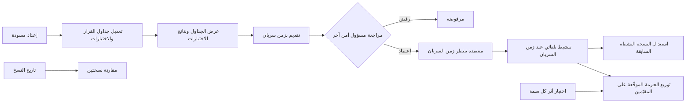
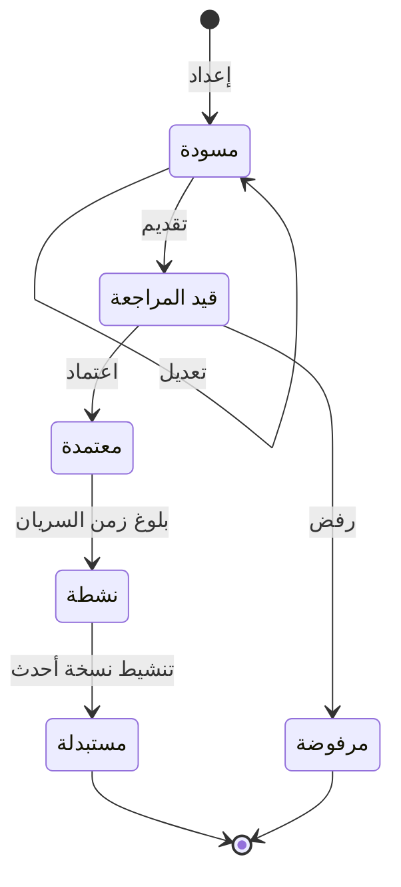

# إدارة سياسات الوصول

<!-- BEGIN GENERATED: doc -->
| البند | القيمة |
|---|---|
| المعرّف | FEAT-ORG-ACCESS-POLICY |
| الإصدار | 0.1 |
| الحالة | مسودة |
| القدرة | CAP-01 إدارة المؤسسة والوصول |
| القدرة الفرعية | CAP-01.04 سياسات الوصول (R1) |
| الأدوار | مسؤول الأمن؛ المدقِّق؛ النظام |
| الشاشات | SCR-68 سياسات الوصول |
| حالات الاستخدام | UC-086 |
| القصص | 13: 8 من المواصفة، و5 جديدة |
<!-- END GENERATED: doc -->

## 1. نظرة عامة

### 1.1 القيمة

يتيح لمسؤول الأمن صياغة قواعد الوصول واختبارها وتقديمها للاعتماد ثم تطبيقها من تاريخ سريان محدد مع حفظ كل نسخة.

### 1.2 النطاق

| البند | القيمة |
|---|---|
| المستخدمون | مسؤول الأمن (يُعدّ النسخة ويختبرها ويقدّمها، ويعتمدها مسؤول أمن آخر أو يرفضها)، والمدقِّق (يطّلع على النسخ وتاريخها)، والنظام (ينشّط النسخة عند زمن سريانها ويستبدل السابقة)، وفريق المنصة (يوزّع الحزم الموقّعة)، وفريق الأمن (يختبر أثر كل سمة) |
| الشاشات | SCR-68 سياسات الوصول: جداول القرار واختباراتها، وتاريخ النسخ ومقارنتها |
| حالات الاستخدام | إدارة سياسة الوصول (UC-086) |
| المتطلبات | قرار الوصول يقوم على الفاعل والإجراء والمورد والغرض والسياق والتصنيف والأقسام والولاية القضائية (REQ-FND-011)؛ القرار سماح أو رفض أو سماح مشروط أو حجب أو تجميع أو طلب موافقة، مع الالتزامات وفرضها (REQ-FND-012)؛ كل تغيير في السياسة له إصدار وتدقيق وزمن، ويُطبَّق من زمن سريانه (REQ-GOV-009) |
| خارج النطاق | تقييم الطلبات وفرض القرار في كل خدمة (ميزة فرض الوصول)؛ مخطط التصنيف والتصاريح والاستثناءات الأمنية؛ الأدوار والصلاحيات وإسنادها؛ سياسة أساس المنصة نفسها، فهي ثابتة لا يغيّرها المستأجر |

### 1.3 خريطة الميزة

**الشكل 1: من المسودة إلى سياسة نافذة في كل المقيّمين**



**الشكل 2: رحلة نسخة مجموعة السياسات**



لكل مستأجر نسخة «نشطة» واحدة بالضبط، وسياسة أساس المنصة تنطبق فوقها دائمًا. و«مستبدلة» و«مرفوضة» حالتان نهائيتان.

### 1.3 خريطة الميزة

**[للكتابة]**

## 2. القواعد المشتركة

تنطبق على كل قصص الميزة، فلا تتكرر داخل القصص. وكل قصة تذكر ما يخصها فقط.

### 2.1 السياق المشترك

كل قصة تبدأ من ثلاثة شروط: مستأجر نشط، وحزمة السياسات الأساسية مفعّلة، ومستخدم مسجّل الدخول ومخوَّل. وتشير إليها القصص بخطوة واحدة: «بفرض السياق المشترك للميزة».

### 2.2 الصلاحية وعدم الإفصاح

- من لا يحق له رؤية العنصر يتلقى ردًا بشكل «غير متاح» تمامًا، فلا يعرف أنه موجود.
- من يرى العنصر ولا يحق له الإجراء يتلقى «لا تملك صلاحية هذا الإجراء».

### 2.3 أوامر تغيير الحالة

- **منع التكرار:** يُرسل كل أمر بمفتاح فريد، فإعادة الطلب نفسه لا تُنفَّذ مرتين.
- **حماية التعديل المتزامن:** يُرسل كل أمر بإصدار البيانات الذي يراه المستخدم. فإن عدّلها غيره في الأثناء، يُرفض الأمر.
- **السجل:** إن نجح الأمر، يُكتب حدثه وسجل التدقيق في المعاملة نفسها.

### 2.4 الرفض المشترك

```gherkin
# language: ar
خاصية: الرفض المشترك لأوامر الميزة

  سيناريو مخطط: رفض مشترك لكل أمر في الميزة
    بفرض السياق المشترك للميزة
    و <الحالة>
    عندما يُرسل المستخدم أي أمر من أوامر الميزة
    اذاً يُرفض برمز <الرمز> ويرى "<الرسالة>"
    و لا يتغير شيء

    امثلة:
      | الحالة                                  | الرمز                  | الرسالة                                                 |
      | العنصر خارج صلاحياته                    | NOT_FOUND              | غير متاح                                                |
      | العنصر مرئي له ولا يحق له الإجراء       | AUTHZ_DENIED           | لا تملك صلاحية هذا الإجراء                              |
      | غيره عدّل العنصر بعد أن فتحه            | VERSION_CONFLICT       | تغيّرت البيانات منذ فتحتها. راجع التغييرات ثم أعد المحاولة |
      | أعاد مفتاح منع التكرار بمحتوى مختلف     | IDEMPOTENCY_KEY_REUSED | طلب مكرر بمحتوى مختلف                                   |
      | البيانات ناقصة أو غير صحيحة             | VALIDATION_FAILED      | بعض البيانات ناقصة أو غير صحيحة. راجع الحقول المعلَّمة      |

  سيناريو: إعادة الطلب نفسه لا تُنفَّذ مرتين
    بفرض السياق المشترك للميزة
    و أمر نجح بمفتاح منع تكرار
    عندما يُعاد الطلب نفسه بالمفتاح نفسه
    اذاً تُعاد النتيجة الأولى ولا يُكتب حدث ثانٍ
```

## 3. الجودة وتعريف الاكتمال

### 3.1 متطلبات الجودة

<!-- BEGIN GENERATED: quality -->
لا متطلبات جودة مرتبطة بمتطلبات هذه الميزة مباشرة. تنطبق متطلبات المنصة العامة (`FEAT-PLT-*`).
<!-- END GENERATED: quality -->

### 3.2 تعريف الاكتمال

القصة مكتملة حين تتحقق الشروط الخمسة:

1. سيناريوهاتها والقواعد المشتركة تمر في الاختبار الآلي.
2. فحوص البنية المعمارية تمر.
3. نصوص الواجهة والرسائل موجودة بالعربية والإنجليزية.
4. مراجعة الكود مكتملة.
5. ما تضيفه القصة نفسها في قسم «القواعد» تحقق.

## 4. فهرس القصص

<!-- BEGIN GENERATED: story-index -->
| المعرّف | القصة | النوع | الحالة |
|---|---|---|---|
| `US-BC08-POL-APPROVE` | اعتماد مجموعة السياسات | أمر | مسودة |
| `US-BC08-POL-DRAFT` | إعداد مسودة مجموعة السياسات | أمر | مسودة |
| `US-BC08-POL-EDIT` | تعديل مجموعة السياسات | أمر | مسودة |
| `US-BC08-POL-REJECT` | رفض مجموعة السياسات | أمر | مسودة |
| `US-BC08-POL-SUBMIT` | تقديم مجموعة السياسات | أمر | مسودة |
| `US-BC08-Q-POL-GET` | جلب: Policy set version with tables and tests | جلب | مسودة |
| `US-DOM-POL-HISTORY` | عرض تاريخ نسخ السياسات وأزمنة سريانها | جلب | مسودة |
| `US-BC08-S-POLICY-SET-01` | تلقائي: effective_from reached (مجموعة السياسات) | نظام | مسودة |
| `US-BC08-S-POLICY-SET-02` | تلقائي: successor activated (مجموعة السياسات) | نظام | مسودة |
| `US-UI-SCR68-POLICY-TESTS` | عرض جداول القرار ونتائج اختباراتها | واجهة | مسودة |
| `US-UI-SCR68-VERSION-COMPARE` | مقارنة نسخ السياسة وموعد سريانها | واجهة | مسودة |
| `US-PLT-POL-BUNDLE-DISTRIBUTION` | توزيع حزمة السياسات الموقعة على المقيّمين | منصة | مسودة |
| `US-OPS-POL-ATTRIBUTE-MATRIX` | اختبار أثر كل سمة على قرار الوصول | تشغيل | مسودة |
<!-- END GENERATED: story-index -->

## 5. القصص

### 5.1 US-BC08-POL-APPROVE — اعتماد نسخة مجموعة السياسات

| النوع | الإصدار | الأولوية | دون اتصال | الحالة |
|---|---|---|---|---|
| أمر | R1 | Must | لا | مسودة |

> **كـ** مسؤول الأمن، **أريد** أن أعتمد نسخة مجموعة السياسات المقدَّمة بعد مراجعتها، **حتى** تُطبَّق من زمن سريانها بموافقة شخص غير كاتبها.

**باختصار:** يعتمد مسؤول أمن غير كاتب النسخة نسخةً «قيد المراجعة» بعد تأكيد هويته، فتصير «معتمدة» وتنتظر زمن سريانها.

#### القواعد

- **متى يُسمح:** النسخة «قيد المراجعة».
- **من يُسمح له:** مسؤول الأمن في المستأجر نفسه، على ألا يكون كاتب النسخة، وبعد تأكيد هويته بمصادقة معززة.
- **الأثر:**
  - تصير النسخة «معتمدة»، ولا يتغير محتواها بعد ذلك.
  - لا تُطبَّق قبل زمن سريانها، وتنشط عنده تلقائيًا (القصة 5.8). وتبقى النسخة النشطة الحالية مطبَّقة حتى ذلك الحين (REQ-GOV-009).
  - يصل حدث الاعتماد إلى موزّع حزم السياسات وإلى فهرس البحث.

#### معايير القبول

```gherkin
# language: ar
خاصية: اعتماد نسخة مجموعة السياسات

  سيناريو: مسؤول أمن يعتمد نسخة كتبها غيره
    بفرض السياق المشترك للميزة
    و نسخة مجموعة سياسات "قيد المراجعة" كتبها مسؤول أمن آخر
    و المستخدم أكّد هويته بمصادقة معززة
    عندما يعتمد النسخة
    اذاً تصبح حالتها "معتمدة"
    و تبقى النسخة النشطة الحالية مطبَّقة حتى زمن سريان النسخة المعتمدة
    و يُسجَّل حدث "اعتُمدت مجموعة السياسات"

  سيناريو مخطط: رفض خاص باعتماد النسخة
    بفرض السياق المشترك للميزة
    و <الحالة>
    عندما يحاول اعتماد النسخة
    اذاً يُرفض برمز <الرمز> ويرى "<الرسالة>"
    و لا يتغير شيء

    امثلة:
      | الحالة                        | الرمز                               | الرسالة                                          |
      | النسخة ليست "قيد المراجعة"    | POLICY_SET_INVALID_STATE_TRANSITION | الوضع الحالي لمجموعة السياسات لا يسمح بهذا الإجراء |
      | المستخدم هو كاتب النسخة       | SEGREGATION_OF_DUTIES               | لا يجوز أن يعتمد الشخص نفسه ما قدّمه أو طلبه     |
      | لم يؤكد هويته بمصادقة معززة   | MFA_STEP_UP_REQUIRED                | هذا الإجراء يحتاج تأكيد هويتك مرة أخرى           |
```

<details><summary>المراجع التقنية والتتبع</summary>

<!-- BEGIN GENERATED: refs US-BC08-POL-APPROVE -->
| البند | المعرّف | المعنى |
|---|---|---|
| الواجهة البرمجية | `POST /api/v1/governance/policy-sets/{id}/actions/approve` | — |
| الأمر | `CMD-POL-APPROVE` | اعتماد مجموعة السياسات |
| السياسة | `POL-POL-APPROVE` | Security Officer؛ tenant match; subject ACTIVE; tenant ACTIVE (except TEN operations by platform) |
| الحدث | `EVT-POL-APPROVED` | يصل إلى: Search/Directory projection (BC01 read model); PDP bundle distributor |
| الكيان | `AGG-POLICY-SET` | مجموعة السياسات |
| الجدول | `governance.policy_sets` | الجدول الرئيسي لمجموعة السياسات |
| وحدة النشر | DU-03 | — |
| المتطلبات | REQ-FND-011، REQ-FND-012 | معانيها في القسم 6. التتبع |
| حالة الاستخدام | UC-086 | Manage Access Policy |
| الاختبار | TST-POLICY-SET-SM، TST-SLC01-INVARIANTS | دورة حالات مجموعة السياسات، وثوابت الشريحة SLC-01 |
<!-- END GENERATED: refs US-BC08-POL-APPROVE -->

</details>

### 5.2 US-BC08-POL-DRAFT — إعداد مسودة نسخة جديدة من مجموعة السياسات

| النوع | الإصدار | الأولوية | دون اتصال | الحالة |
|---|---|---|---|---|
| أمر | R1 | Must | لا | مسودة |

> **كـ** مسؤول الأمن، **أريد** أن أبدأ نسخة جديدة من مجموعة سياسات المستأجر، **حتى** أعدّل قواعد الوصول دون أن أمس النسخة المطبَّقة.

**باختصار:** ينشئ مسؤول الأمن نسخة «مسودة» فارغة أو مبنية على نسخة قائمة، ولا يتغير شيء في النسخة النشطة.

#### القواعد

- **متى يُسمح:** في أي وقت.
- **من يُسمح له:** مسؤول الأمن في المستأجر نفسه.
- **البيانات:** النسخة الأساس التي تُبنى عليها المسودة (اختيارية).
- **الأثر:** تُنشأ نسخة «مسودة» يكون المستخدم كاتبها، فلا يحق له اعتمادها لاحقًا (القصة 5.1). وتبقى النسخة النشطة مطبَّقة كما هي.

#### معايير القبول

```gherkin
# language: ar
خاصية: إعداد مسودة نسخة جديدة من مجموعة السياسات

  سيناريو: مسؤول الأمن يبدأ مسودة من النسخة النشطة
    بفرض السياق المشترك للميزة
    و للمستأجر نسخة "نشطة" من مجموعة السياسات
    عندما يُعدّ مسودة مبنية على النسخة النشطة
    اذاً تُنشأ نسخة حالتها "مسودة" وكاتبها المستخدم
    و تبقى النسخة النشطة مطبَّقة دون تغيير
    و يُسجَّل حدث "أُعدّت مسودة مجموعة السياسات"

  سيناريو مخطط: رفض خاص بإعداد المسودة
    بفرض السياق المشترك للميزة
    و <الحالة>
    عندما يحاول إعداد المسودة
    اذاً يُرفض برمز <الرمز> ويرى "<الرسالة>"
    و لا يتغير شيء

    امثلة:
      | الحالة                            | الرمز             | الرسالة                  |
      | النسخة الأساس المذكورة غير صالحة  | VALIDATION_FAILED | النسخة الأساس غير صحيحة  |
```

<details><summary>المراجع التقنية والتتبع</summary>

<!-- BEGIN GENERATED: refs US-BC08-POL-DRAFT -->
| البند | المعرّف | المعنى |
|---|---|---|
| الواجهة البرمجية | `POST /api/v1/governance/policy-sets` | — |
| الأمر | `CMD-POL-DRAFT` | إعداد مسودة مجموعة السياسات |
| السياسة | `POL-POL-DRAFT` | Security Officer؛ tenant match; subject ACTIVE; tenant ACTIVE (except TEN operations by platform) |
| الحدث | `EVT-POL-DRAFTED` | يصل إلى: Search/Directory projection (BC01 read model); PDP bundle distributor |
| الكيان | `AGG-POLICY-SET` | مجموعة السياسات |
| الجدول | `governance.policy_sets` | الجدول الرئيسي لمجموعة السياسات |
| وحدة النشر | DU-03 | — |
| المتطلبات | REQ-FND-011، REQ-FND-012 | معانيها في القسم 6. التتبع |
| حالة الاستخدام | UC-086 | Manage Access Policy |
| الاختبار | TST-POLICY-SET-SM، TST-SLC01-INVARIANTS | دورة حالات مجموعة السياسات، وثوابت الشريحة SLC-01 |
<!-- END GENERATED: refs US-BC08-POL-DRAFT -->

</details>

### 5.3 US-BC08-POL-EDIT — تعديل جداول القرار واختباراتها في المسودة

| النوع | الإصدار | الأولوية | دون اتصال | الحالة |
|---|---|---|---|---|
| أمر | R1 | Must | لا | مسودة |

> **كـ** مسؤول الأمن، **أريد** أن أعدّل جداول القرار واختباراتها في المسودة، **حتى** تعبّر النسخة عن قواعد الوصول المطلوبة قبل تقديمها.

**باختصار:** يحفظ مسؤول الأمن جداول القرار والاختبارات في نسخة «مسودة»، فيُرفع إصدارها وتبقى «مسودة».

#### القواعد

- **متى يُسمح:** النسخة «مسودة».
- **من يُسمح له:** مسؤول الأمن في المستأجر نفسه.
- **البيانات:**
  - جداول القرار (إلزامية). كل سطر فيها يحدد الفاعل والإجراء والمورد والشرط والقرار، ويجب أن تطابق الجداول البنية المعتمدة.
  - الاختبارات (إلزامية). كل نسخة تحمل اختبارات لجداولها، ونجاحها شرط لتقديمها (القصة 5.5).
- **الأثر:** يُستبدل محتوى المسودة بما أُرسل، ويُرفع إصدارها واحدًا وتبقى حالتها «مسودة».

#### معايير القبول

```gherkin
# language: ar
خاصية: تعديل جداول القرار واختباراتها في المسودة

  سيناريو: حفظ جداول واختبارات صحيحة
    بفرض السياق المشترك للميزة
    و نسخة مجموعة سياسات "مسودة"
    عندما يحفظ جداول قرار تطابق البنية المعتمدة مع اختباراتها
    اذاً يُستبدل محتوى المسودة ويُرفع إصدارها واحدًا
    و تبقى حالتها "مسودة"
    و يُسجَّل حدث "عُدّلت مجموعة السياسات"

  سيناريو مخطط: رفض خاص بتعديل المسودة
    بفرض السياق المشترك للميزة
    و <الحالة>
    عندما يحاول حفظ التعديل
    اذاً يُرفض برمز <الرمز> ويرى "<الرسالة>"
    و لا يتغير شيء

    امثلة:
      | الحالة                              | الرمز                               | الرسالة                                          |
      | النسخة ليست "مسودة"                 | POLICY_SET_INVALID_STATE_TRANSITION | الوضع الحالي لمجموعة السياسات لا يسمح بهذا الإجراء |
      | الجداول لا تطابق البنية المعتمدة    | POLICY_INVALID                      | جداول السياسة غير صحيحة                          |
      | لم يرسل جداول القرار                | VALIDATION_FAILED                   | جداول القرار مطلوبة                              |
      | لم يرسل الاختبارات                  | VALIDATION_FAILED                   | الاختبارات مطلوبة                                |
```

<details><summary>المراجع التقنية والتتبع</summary>

<!-- BEGIN GENERATED: refs US-BC08-POL-EDIT -->
| البند | المعرّف | المعنى |
|---|---|---|
| الواجهة البرمجية | `POST /api/v1/governance/policy-sets/{id}/actions/edit` | — |
| الأمر | `CMD-POL-EDIT` | تعديل مجموعة السياسات |
| السياسة | `POL-POL-EDIT` | Security Officer؛ tenant match; subject ACTIVE; tenant ACTIVE (except TEN operations by platform) |
| الحدث | `EVT-POL-EDITED` | يصل إلى: Search/Directory projection (BC01 read model); PDP bundle distributor |
| الكيان | `AGG-POLICY-SET` | مجموعة السياسات |
| الجدول | `governance.policy_sets` | الجدول الرئيسي لمجموعة السياسات |
| وحدة النشر | DU-03 | — |
| المتطلبات | REQ-FND-011، REQ-FND-012 | معانيها في القسم 6. التتبع |
| حالة الاستخدام | UC-086 | Manage Access Policy |
| الاختبار | TST-POLICY-SET-SM، TST-SLC01-INVARIANTS | دورة حالات مجموعة السياسات، وثوابت الشريحة SLC-01 |
<!-- END GENERATED: refs US-BC08-POL-EDIT -->

</details>

### 5.4 US-BC08-POL-REJECT — رفض نسخة مجموعة السياسات المقدَّمة

| النوع | الإصدار | الأولوية | دون اتصال | الحالة |
|---|---|---|---|---|
| أمر | R1 | Must | لا | مسودة |

> **كـ** مسؤول الأمن، **أريد** أن أرفض نسخة مجموعة السياسات المقدَّمة مع ذكر السبب، **حتى** لا تُطبَّق قواعد وصول لا تصلح.

**باختصار:** يرفض مسؤول الأمن نسخة «قيد المراجعة» بسبب مكتوب، فتصير «مرفوضة» نهائيًا، وتبقى النسخة النشطة كما هي.

#### القواعد

- **متى يُسمح:** النسخة «قيد المراجعة».
- **من يُسمح له:** مسؤول الأمن في المستأجر نفسه. والمصدر لا يشترط فصل المهام في الرفض كما يشترطه في الاعتماد.
- **البيانات:** السبب (إلزامي).
- **الأثر:** تصير النسخة «مرفوضة»، وهي حالة نهائية. ولا تتغير النسخة النشطة، وتغيير القواعد بعد ذلك يكون بمسودة جديدة (القصة 5.2).

#### معايير القبول

```gherkin
# language: ar
خاصية: رفض نسخة مجموعة السياسات المقدَّمة

  سيناريو: مسؤول الأمن يرفض نسخة بسبب
    بفرض السياق المشترك للميزة
    و نسخة مجموعة سياسات "قيد المراجعة"
    عندما يرفضها ويذكر السبب
    اذاً تصبح حالتها "مرفوضة"
    و تبقى النسخة النشطة مطبَّقة دون تغيير
    و يُسجَّل حدث "رُفضت مجموعة السياسات"

  سيناريو مخطط: رفض خاص برفض النسخة
    بفرض السياق المشترك للميزة
    و <الحالة>
    عندما يحاول رفض النسخة
    اذاً يُرفض برمز <الرمز> ويرى "<الرسالة>"
    و لا يتغير شيء

    امثلة:
      | الحالة                      | الرمز                               | الرسالة                                          |
      | النسخة ليست "قيد المراجعة"  | POLICY_SET_INVALID_STATE_TRANSITION | الوضع الحالي لمجموعة السياسات لا يسمح بهذا الإجراء |
      | لم يذكر السبب               | REASON_REQUIRED                     | اذكر السبب                                       |
```

<details><summary>المراجع التقنية والتتبع</summary>

<!-- BEGIN GENERATED: refs US-BC08-POL-REJECT -->
| البند | المعرّف | المعنى |
|---|---|---|
| الواجهة البرمجية | `POST /api/v1/governance/policy-sets/{id}/actions/reject` | — |
| الأمر | `CMD-POL-REJECT` | رفض مجموعة السياسات |
| السياسة | `POL-POL-REJECT` | Security Officer؛ tenant match; subject ACTIVE; tenant ACTIVE (except TEN operations by platform) |
| الحدث | `EVT-POL-REJECTED` | يصل إلى: Search/Directory projection (BC01 read model); PDP bundle distributor |
| الكيان | `AGG-POLICY-SET` | مجموعة السياسات |
| الجدول | `governance.policy_sets` | الجدول الرئيسي لمجموعة السياسات |
| وحدة النشر | DU-03 | — |
| المتطلبات | REQ-FND-011، REQ-FND-012 | معانيها في القسم 6. التتبع |
| حالة الاستخدام | UC-086 | Manage Access Policy |
| الاختبار | TST-POLICY-SET-SM، TST-SLC01-INVARIANTS | دورة حالات مجموعة السياسات، وثوابت الشريحة SLC-01 |
<!-- END GENERATED: refs US-BC08-POL-REJECT -->

</details>

### 5.5 US-BC08-POL-SUBMIT — تقديم نسخة مجموعة السياسات للمراجعة بزمن سريان

| النوع | الإصدار | الأولوية | دون اتصال | الحالة |
|---|---|---|---|---|
| أمر | R1 | Must | لا | مسودة |

> **كـ** مسؤول الأمن، **أريد** أن أقدّم المسودة للمراجعة مع زمن سريانها، **حتى** يراجعها مسؤول أمن آخر ويعتمدها.

**باختصار:** حين تنجح كل اختبارات المسودة ولا تتجاوز قواعدها سياسة أساس المنصة، يقدّمها مسؤول الأمن بزمن سريان، فتصير «قيد المراجعة» ولا يتغير محتواها بعد ذلك.

#### القواعد

- **متى يُسمح:** النسخة «مسودة»، وكل اختباراتها المضمَّنة تنجح، وقواعدها تقيّد سياسة أساس المنصة ولا توسّعها. والاستثناء الوحيد معاملات معلَّمة صراحة قابلة للضبط، مثل تشغيل فصل المهام أو إيقافه.
- **من يُسمح له:** مسؤول الأمن في المستأجر نفسه.
- **البيانات:** زمن السريان (إلزامي): التاريخ والوقت الذي تبدأ منه النسخة إن اعتُمدت.
- **الأثر:** تصير النسخة «قيد المراجعة»، ولا يقبل محتواها تعديلًا. ويصل حدث التقديم إلى موزّع حزم السياسات وإلى فهرس البحث.

> **ملاحظة:** المصدر يعطي رمزًا واحدًا لشرطي التقديم معًا، فتجاوز سياسة أساس المنصة يُرفض برسالة «فشلت اختبارات السياسة» نفسها، ولا رمز له وحده **[Needs Review]**.

#### معايير القبول

```gherkin
# language: ar
خاصية: تقديم نسخة مجموعة السياسات للمراجعة بزمن سريان

  سيناريو: تقديم مسودة نجحت اختباراتها
    بفرض السياق المشترك للميزة
    و نسخة مجموعة سياسات "مسودة" تنجح كل اختباراتها وتقيّد سياسة أساس المنصة فقط
    عندما يقدّمها بزمن سريان
    اذاً تصبح حالتها "قيد المراجعة" ولا يقبل محتواها التعديل
    و يُحفظ زمن السريان مع النسخة
    و يُسجَّل حدث "قُدّمت مجموعة السياسات"

  سيناريو مخطط: رفض خاص بتقديم النسخة
    بفرض السياق المشترك للميزة
    و <الحالة>
    عندما يحاول تقديم النسخة
    اذاً يُرفض برمز <الرمز> ويرى "<الرسالة>"
    و لا يتغير شيء

    امثلة:
      | الحالة                          | الرمز                               | الرسالة                                          |
      | النسخة ليست "مسودة"             | POLICY_SET_INVALID_STATE_TRANSITION | الوضع الحالي لمجموعة السياسات لا يسمح بهذا الإجراء |
      | اختبار واحد على الأقل يفشل      | POLICY_TESTS_FAILED                 | فشلت اختبارات السياسة                            |
      | لم يحدد زمن السريان             | VALIDATION_FAILED                   | زمن السريان مطلوب                                |
```

<details><summary>المراجع التقنية والتتبع</summary>

<!-- BEGIN GENERATED: refs US-BC08-POL-SUBMIT -->
| البند | المعرّف | المعنى |
|---|---|---|
| الواجهة البرمجية | `POST /api/v1/governance/policy-sets/{id}/actions/submit` | — |
| الأمر | `CMD-POL-SUBMIT` | تقديم مجموعة السياسات |
| السياسة | `POL-POL-SUBMIT` | Security Officer؛ tenant match; subject ACTIVE; tenant ACTIVE (except TEN operations by platform) |
| الحدث | `EVT-POL-SUBMITTED` | يصل إلى: Search/Directory projection (BC01 read model); PDP bundle distributor |
| الكيان | `AGG-POLICY-SET` | مجموعة السياسات |
| الجدول | `governance.policy_sets` | الجدول الرئيسي لمجموعة السياسات |
| وحدة النشر | DU-03 | — |
| المتطلبات | REQ-FND-011، REQ-FND-012 | معانيها في القسم 6. التتبع |
| حالة الاستخدام | UC-086 | Manage Access Policy |
| الاختبار | TST-POLICY-SET-SM، TST-SLC01-INVARIANTS | دورة حالات مجموعة السياسات، وثوابت الشريحة SLC-01 |
<!-- END GENERATED: refs US-BC08-POL-SUBMIT -->

</details>

### 5.6 US-BC08-Q-POL-GET — عرض نسخة مجموعة السياسات بجداولها واختباراتها

| النوع | الإصدار | الأولوية | دون اتصال | الحالة |
|---|---|---|---|---|
| جلب | R1 | Must | لا | مسودة |

> **كـ** مسؤول الأمن أو المدقِّق، **أريد** أن أعرض نسخة بعينها من مجموعة السياسات بجداولها واختباراتها، **حتى** أراجع ما تقرره قبل اعتمادها أو بعد تطبيقها.

**باختصار:** تُعاد النسخة المطلوبة كما هي في حالتها الحالية: جداول القرار والاختبارات وحالة النسخة.

#### القواعد

- **من يرى ماذا:** مسؤول الأمن والمدقِّق، ضمن النطاق التنظيمي لأدوارهما وما يسمح به التصنيف. ومن عداهما يتلقى «غير متاح» (§2.2).
- **المرشحات:** معرّف النسخة فقط.

#### معايير القبول

```gherkin
# language: ar
خاصية: عرض نسخة مجموعة السياسات بجداولها واختباراتها

  سيناريو: المدقِّق يعرض النسخة النشطة
    بفرض السياق المشترك للميزة
    و للمستأجر نسخة "نشطة" من مجموعة السياسات
    عندما يطلب المدقِّق عرضها
    اذاً تُعاد جداول القرار والاختبارات وحالة النسخة
    و يُعاد فحص صلاحيته على النتيجة قبل إرسالها

  سيناريو: مستخدم بلا دور مخوَّل
    بفرض السياق المشترك للميزة
    و مستخدم ليس مسؤول أمن ولا مدقِّقًا
    عندما يطلب عرض نسخة موجودة
    اذاً يرى "غير متاح" بالشكل نفسه لنسخة غير موجودة
```

<details><summary>المراجع التقنية والتتبع</summary>

<!-- BEGIN GENERATED: refs US-BC08-Q-POL-GET -->
| البند | المعرّف | المعنى |
|---|---|---|
| الواجهة البرمجية | `GET /api/v1/governance/policy-sets/{version_id}` | — |
| الاستعلام | `QRY-POL-GET` | Policy set version with tables and tests |
| السياسة | `POL-POL-GET` | org scope of subject roles ∩ classification rule |
| الكيان | `AGG-POLICY-SET` | مجموعة السياسات |
| الجدول | `governance.policy_sets` | الجدول الرئيسي لمجموعة السياسات |
| وحدة النشر | DU-03 | — |
| المتطلب | REQ-GOV-009 | The system shall version, audit and time-stamp every policy and configuration change and apply each change fr… |
| حالة الاستخدام | UC-086 | Manage Access Policy |
| الاختبار | TST-POLICY-SET-SM، TST-SLC01-INVARIANTS | دورة حالات مجموعة السياسات، وثوابت الشريحة SLC-01 |
<!-- END GENERATED: refs US-BC08-Q-POL-GET -->

</details>

### 5.7 US-DOM-POL-HISTORY — تاريخ نسخ مجموعة السياسات وأزمنة سريانها

| النوع | الإصدار | الأولوية | دون اتصال | الحالة |
|---|---|---|---|---|
| جلب | R1 | Must | لا | مسودة |

> **كـ** المدقِّق، **أريد** قائمة بكل نسخ مجموعة السياسات وأزمنة سريانها، **حتى** أعرف أي قواعد كانت مطبَّقة في أي وقت.

**باختصار:** تُعرض نسخ مجموعة السياسات للمستأجر مرتبة بزمن السريان، لكل نسخة حالتها وكاتبها ومعتمِدها ومتى نشطت ومتى استُبدلت.

#### القواعد

- **من يرى ماذا:** مسؤول الأمن والمدقِّق، كما في القصة 5.6 **[Derived]**.
- **المرشحات:** حالة النسخة، والمؤشر وحجم الصفحة **[Derived]**.
- كل نسخة تبقى في التاريخ بعد استبدالها أو رفضها، ولا يتغير محتواها (REQ-GOV-009).

> **ملاحظة:** المتطلب يطلب أن يكون التاريخ قابلًا للاستعلام، والمواصفة ليس فيها استعلام لقائمة النسخ، فالقصة كلها **[Derived]** وتحتاج تصحيحًا يضيف الاستعلام (`00-open-questions.md` §5).

#### معايير القبول

```gherkin
# language: ar
خاصية: تاريخ نسخ مجموعة السياسات وأزمنة سريانها

  سيناريو: المدقِّق يعرض تاريخ النسخ
    بفرض السياق المشترك للميزة
    و للمستأجر نسخة "مستبدلة" ونسخة "نشطة" ونسخة "معتمدة" زمن سريانها في المستقبل
    عندما يطلب المدقِّق تاريخ النسخ
    اذاً تُعاد النسخ الثلاث مرتبة بزمن السريان
    و يظهر لكل نسخة حالتها وكاتبها ومعتمِدها ووقت تنشيطها واستبدالها إن وقعا

  سيناريو: التاريخ أطول من صفحة
    بفرض السياق المشترك للميزة
    و نسخ المستأجر أكثر من صفحة
    عندما يطلب الصفحة التالية بالمؤشر
    اذاً تُعاد النسخ التالية دون تكرار ولا فجوة
```

<details><summary>المراجع التقنية والتتبع</summary>

<!-- BEGIN GENERATED: refs US-DOM-POL-HISTORY -->
| البند | المعرّف | المعنى |
|---|---|---|
| الشاشة | SCR-68 | شاشة سياسات الوصول |
| المصدر | `[Derived]` | — |
| المتطلب | REQ-GOV-009 | The system shall version, audit and time-stamp every policy and configuration change and apply each change fr… |
| حالة الاستخدام | UC-086 | Manage Access Policy |
<!-- END GENERATED: refs US-DOM-POL-HISTORY -->

</details>

### 5.8 US-BC08-S-POLICY-SET-01 — تنشيط النسخة المعتمدة عند بلوغ زمن سريانها

| النوع | الإصدار | الأولوية | دون اتصال | الحالة |
|---|---|---|---|---|
| نظام | R1 | Must | لا ينطبق | مسودة |

> **كـ** النظام، **أريد** أن أنشّط النسخة المعتمدة عند بلوغ زمن سريانها، **حتى** تُطبَّق قواعدها من ذلك الوقت لا قبله.

**باختصار:** يتحقق المجدول من النسخ المعتمدة، فإذا بلغت إحداها زمن سريانها صارت «نشطة» في المعاملة التي تُستبدل فيها النسخة السابقة.

#### القواعد

- **متى يحدث:** نسخة «معتمدة» بلغ زمن سريانها.
- **الأثر:**
  - تصير النسخة «نشطة»، وتصير النسخة النشطة السابقة «مستبدلة» (القصة 5.9)، فلا يكون للمستأجر إلا نسخة نشطة واحدة.
  - يُرفع إصدار الأمن فتُبطل ذاكرة القرارات المؤقتة فورًا في كل نقاط الفرض (QAS-SEC-003)، وتُوزَّع الحزمة الجديدة على المقيّمين (القصة 5.12).
  - يُسجَّل حدث «نشطت مجموعة السياسات» وسجل تدقيق بهوية النظام.

#### معايير القبول

```gherkin
# language: ar
خاصية: تنشيط النسخة المعتمدة عند بلوغ زمن سريانها

  سيناريو: بلوغ زمن السريان ينشّط النسخة
    بفرض نسخة "معتمدة" من مجموعة السياسات ونسخة "نشطة" سابقة
    عندما يبلغ الوقت زمن سريان النسخة المعتمدة
    اذاً تصبح النسخة المعتمدة "نشطة" والسابقة "مستبدلة" في المعاملة نفسها
    و تُبطل ذاكرة القرارات المؤقتة في كل نقاط الفرض
    و يُسجَّل حدث "نشطت مجموعة السياسات" وسجل تدقيق بهوية النظام

  سيناريو: قبل زمن السريان لا يتغير شيء
    بفرض نسخة "معتمدة" زمن سريانها بعد ساعة
    عندما يمر المجدول عليها
    اذاً تبقى "معتمدة" وتبقى النسخة النشطة الحالية مطبَّقة
```

<details><summary>المراجع التقنية والتتبع</summary>

<!-- BEGIN GENERATED: refs US-BC08-S-POLICY-SET-01 -->
| البند | المعرّف | المعنى |
|---|---|---|
| المحفِّز | `SYS:effective_from reached` | scheduler; previous ACTIVE → SUPERSEDED |
| الانتقال | APPROVED ← ACTIVE | — |
| الحدث | `EVT-POL-ACTIVATED` | يصل إلى: Security-version service (EVT-SEC-VERSION-INCREMENTED); PEP decision caches; Projection security-ver… |
| الكيان | `AGG-POLICY-SET` | مجموعة السياسات |
| الجدول | `governance.policy_sets` | الجدول الرئيسي لمجموعة السياسات |
| وحدة النشر | DU-03 | — |
| المتطلبات | REQ-FND-011، REQ-FND-012 | معانيها في القسم 6. التتبع |
| حالة الاستخدام | UC-086 | Manage Access Policy |
| الاختبار | TST-POLICY-SET-SM، TST-SLC01-INVARIANTS | دورة حالات مجموعة السياسات، وثوابت الشريحة SLC-01 |
<!-- END GENERATED: refs US-BC08-S-POLICY-SET-01 -->

</details>

### 5.9 US-BC08-S-POLICY-SET-02 — استبدال النسخة النشطة عند تنشيط نسخة أحدث

| النوع | الإصدار | الأولوية | دون اتصال | الحالة |
|---|---|---|---|---|
| نظام | R1 | Must | لا ينطبق | مسودة |

> **كـ** النظام، **أريد** أن أنقل النسخة النشطة إلى «مستبدلة» حين تنشط نسخة أحدث، **حتى** تبقى للمستأجر نسخة نشطة واحدة ويبقى تاريخ ما طُبِّق محفوظًا.

**باختصار:** حين تنشط نسخة أحدث، تصير النسخة التي كانت نشطة «مستبدلة» نهائيًا، ويبقى محتواها كما هو للتاريخ والتدقيق.

#### القواعد

- **متى يحدث:** نشطت نسخة أحدث للمستأجر نفسه (القصة 5.8).
- **الأثر:** تصير النسخة السابقة «مستبدلة»، وهي حالة نهائية. ولا يتغير محتواها ويبقى معروضًا في تاريخ النسخ (القصة 5.7). ويُسجَّل حدث «استُبدلت مجموعة السياسات» وسجل تدقيق بهوية النظام.

#### معايير القبول

```gherkin
# language: ar
خاصية: استبدال النسخة النشطة عند تنشيط نسخة أحدث

  سيناريو: النسخة الأحدث تحل محل النشطة
    بفرض نسخة "نشطة" من مجموعة السياسات
    عندما تنشط نسخة أحدث للمستأجر نفسه
    اذاً تصبح النسخة السابقة "مستبدلة" ويبقى محتواها كما هو
    و يُسجَّل حدث "استُبدلت مجموعة السياسات" وسجل تدقيق بهوية النظام

  سيناريو: اعتماد نسخة أحدث لا يستبدل النشطة وحده
    بفرض نسخة "نشطة" من مجموعة السياسات
    عندما تُعتمد نسخة أحدث زمن سريانها في المستقبل
    اذاً تبقى النسخة الحالية "نشطة" ولا يُسجَّل حدث استبدال
```

<details><summary>المراجع التقنية والتتبع</summary>

<!-- BEGIN GENERATED: refs US-BC08-S-POLICY-SET-02 -->
| البند | المعرّف | المعنى |
|---|---|---|
| المحفِّز | `SYS:successor activated` | system |
| الانتقال | ACTIVE ← SUPERSEDED | — |
| الحدث | `EVT-POL-SUPERSEDED` | يصل إلى: Search/Directory projection (BC01 read model); PDP bundle distributor |
| الكيان | `AGG-POLICY-SET` | مجموعة السياسات |
| الجدول | `governance.policy_sets` | الجدول الرئيسي لمجموعة السياسات |
| وحدة النشر | DU-03 | — |
| المتطلبات | REQ-FND-011، REQ-FND-012 | معانيها في القسم 6. التتبع |
| حالة الاستخدام | UC-086 | Manage Access Policy |
| الاختبار | TST-POLICY-SET-SM، TST-SLC01-INVARIANTS | دورة حالات مجموعة السياسات، وثوابت الشريحة SLC-01 |
<!-- END GENERATED: refs US-BC08-S-POLICY-SET-02 -->

</details>

### 5.10 US-UI-SCR68-POLICY-TESTS — عرض جداول القرار ونتائج اختباراتها

| النوع | الإصدار | الأولوية | دون اتصال | الحالة |
|---|---|---|---|---|
| واجهة | R1 | Must | لا | مسودة |

> **كـ** مسؤول الأمن، **أريد** أن أرى جداول القرار واختباراتها ونتيجة كل اختبار في شاشة واحدة، **حتى** أصحّح القواعد قبل تقديم النسخة.

**باختصار:** تعرض شاشة سياسات الوصول جداول قرار النسخة بأعمدتها، وتحتها اختباراتها، ولكل اختبار نتيجته: ناجح أو فاشل مع القرار المتوقع والقرار الفعلي.

#### القواعد

- أعمدة الجدول: الفاعل، والإجراء، والمورد، والشرط، والقرار.
- القرار واحد من ستة: سماح، أو رفض، أو سماح مشروط، أو حجب حقول، أو تجميع، أو طلب موافقة. ومعه التزاماته إن وُجدت (REQ-FND-012).
- لكل اختبار نتيجته، والقرار المتوقع والفعلي عند الفشل **[Derived]**.
- التحرير متاح في «مسودة» فقط، والمدقِّق يرى الشاشة للقراءة فقط **[Derived]**.
- زر التقديم يظهر حين تكون النسخة «مسودة»، وحكم نجاح الاختبارات للخادم وحده (`21-ui-design.md` §6.3).

#### معايير القبول

```gherkin
# language: ar
خاصية: عرض جداول القرار ونتائج اختباراتها

  سيناريو: مسؤول الأمن يفتح مسودة فيها اختبار فاشل
    بفرض السياق المشترك للميزة
    و نسخة "مسودة" فيها اختبار قراره المتوقع رفض وقراره الفعلي سماح
    عندما يفتحها مسؤول الأمن في شاشة سياسات الوصول
    اذاً يرى جداول القرار بأعمدتها الخمسة
    و يرى الاختبار معلَّمًا بالفشل مع القرارين المتوقع والفعلي

  سيناريو: المدقِّق يرى النسخة للقراءة فقط
    بفرض السياق المشترك للميزة
    و نسخة "نشطة"
    عندما يفتحها المدقِّق
    اذاً يرى الجداول والاختبارات دون أي فعل للتحرير أو التقديم

  سيناريو مخطط: الشاشة تعرض رفض الخادم ولا تفقد التعديل
    بفرض السياق المشترك للميزة
    و <الحالة>
    عندما يرسل مسؤول الأمن الأمر من الشاشة
    اذاً يرى "<الرسالة>" ويبقى ما أدخله في المحرر
    و الرمز المعروض للمطور <الرمز>
    و لا يتغير شيء

    امثلة:
      | الحالة                                 | الرمز               | الرسالة                 |
      | حفظ جداول لا تطابق البنية المعتمدة      | POLICY_INVALID      | جداول السياسة غير صحيحة |
      | تقديم مسودة فيها اختبار فاشل           | POLICY_TESTS_FAILED | فشلت اختبارات السياسة   |
```

<details><summary>المراجع التقنية والتتبع</summary>

<!-- BEGIN GENERATED: refs US-UI-SCR68-POLICY-TESTS -->
| البند | المعرّف | المعنى |
|---|---|---|
| حالة الاستخدام | UC-086 | Manage Access Policy |
| الشاشة | SCR-68 | شاشة سياسات الوصول |
| المصدر | `[Derived]` | — |
| المتطلب | REQ-FND-011 | The system shall base authorization decisions on subject, action, resource, purpose, context, classification,… |
| حالة الاستخدام | UC-086 | Manage Access Policy |
<!-- END GENERATED: refs US-UI-SCR68-POLICY-TESTS -->

</details>

### 5.11 US-UI-SCR68-VERSION-COMPARE — مقارنة نسختين من السياسة وزمن سريان كل منهما

| النوع | الإصدار | الأولوية | دون اتصال | الحالة |
|---|---|---|---|---|
| واجهة | R1 | Must | لا | مسودة |

> **كـ** مسؤول الأمن، **أريد** أن أقارن نسختين من مجموعة السياسات وأرى زمن سريان كل منهما، **حتى** أعرف بدقة ما سيتغير في قرارات الوصول ومتى.

**باختصار:** يختار مسؤول الأمن أو المدقِّق نسختين، فتعرض الشاشة السطور المضافة والمحذوفة والمعدّلة في جداول القرار والاختبارات، مع حالة كل نسخة وزمن سريانها.

#### القواعد

- المقارنة بين أي نسختين يراهما المستخدم من تاريخ النسخ (القصة 5.7) **[Derived]**.
- يُعلَّم كل سطر بأنه مضاف أو محذوف أو معدّل **[Derived]**.
- النسخة «المعتمدة» التي لم يحن زمن سريانها تظهر بعلامة «لم تُطبَّق بعد» مع وقت تطبيقها (REQ-GOV-009).
- الأزمنة بتوقيت المستخدم المحلي ومعها التوقيت العالمي (`21-ui-design.md` §6.1).

#### معايير القبول

```gherkin
# language: ar
خاصية: مقارنة نسختين من السياسة وزمن سريان كل منهما

  سيناريو: مقارنة النسخة النشطة بنسخة معتمدة لاحقة
    بفرض السياق المشترك للميزة
    و نسخة "نشطة" ونسخة "معتمدة" أضافت سطرًا وعدّلت آخر
    عندما يختار مسؤول الأمن النسختين للمقارنة
    اذاً يرى السطر المضاف والسطر المعدّل معلَّمين
    و يرى النسخة المعتمدة بعلامة "لم تُطبَّق بعد" مع زمن سريانها

  سيناريو: نسخة غير مرئية في المقارنة
    بفرض السياق المشترك للميزة
    و رابط مقارنة يشير إلى نسخة لا يحق للمستخدم رؤيتها
    عندما يفتحه
    اذاً يرى "غير متاح" دون أي تفصيل عن النسخة
```

<details><summary>المراجع التقنية والتتبع</summary>

<!-- BEGIN GENERATED: refs US-UI-SCR68-VERSION-COMPARE -->
| البند | المعرّف | المعنى |
|---|---|---|
| حالة الاستخدام | UC-086 | Manage Access Policy |
| الشاشة | SCR-68 | شاشة سياسات الوصول |
| المصدر | `[Derived]` | — |
| المتطلب | REQ-GOV-009 | The system shall version, audit and time-stamp every policy and configuration change and apply each change fr… |
| حالة الاستخدام | UC-086 | Manage Access Policy |
<!-- END GENERATED: refs US-UI-SCR68-VERSION-COMPARE -->

</details>

### 5.12 US-PLT-POL-BUNDLE-DISTRIBUTION — توزيع حزمة السياسات الموقّعة على المقيّمين

| النوع | الإصدار | الأولوية | دون اتصال | الحالة |
|---|---|---|---|---|
| منصة | R1 | Should | لا ينطبق | مسودة |

> **كـ** فريق المنصة، **أريد** أن تصل حزمة السياسات الموقّعة إلى المقيّم المضمَّن في كل وحدة، **حتى** تُقيَّم قرارات الوصول محليًا بسرعة وبالنسخة النافذة.

#### القواعد

- السياسات بيانات لها إصدارات، وتُقيَّم بمقيّم قرار، ولكل خدمة نقطة فرض (ADR-P11).
- جداول القرار تُترجم إلى لغة محرك السياسات، وتُجمع في حزم موقّعة، وتُقيَّم مضمَّنة في كل وحدة (TD-08).
- الهدف 10,000 قرار في الثانية بزمن 5 ms أو أقل عند المئين 95 للمقيّم المضمَّن، و20 ms للمقيّم البعيد (QAS-PERF-009).
- إن صار عمر الحزمة لدى المقيّم أكثر من 5 دقائق، تُرفض كل أوامر الكتابة، وتُسمح القراءة حتى مستوى «داخلي» بالحزمة المخزنة (`degradation-slc01.md`).
- إن تعطل المقيّم أو أخطأ، يُرفض الطلب دائمًا (QAS-SEC-005).
- **[Derived]** المقيّم لا يحمّل حزمة توقيعها غير صحيح، ويبقى على الحزمة السابقة.

#### معايير القبول

```gherkin
# language: ar
خاصية: توزيع حزمة السياسات الموقّعة على المقيّمين

  سيناريو: نسخة جديدة تصل إلى كل المقيّمين
    بفرض نسخة من مجموعة السياسات نشطت للتو
    عندما يوزّع النظام حزمتها الموقّعة
    اذاً يقيّم المقيّم المضمَّن في كل وحدة الطلبات بالنسخة الجديدة
    و يكون زمن القرار 5 ms أو أقل عند المئين 95 تحت 10,000 قرار في الثانية

  سيناريو: حزمة قديمة لدى أحد المقيّمين
    بفرض مقيّم لم تصله حزمة منذ أكثر من 5 دقائق
    عندما يصله أمر كتابة وطلب قراءة لبيانات "داخلية"
    اذاً يُرفض أمر الكتابة
    و يُجاب طلب القراءة بالحزمة المخزنة

  سيناريو: تعطل المقيّم يعني الرفض
    بفرض مقيّم متعطل
    عندما يصله أي طلب
    اذاً يُرفض الطلب ولا يُسمح بشيء
```

<details><summary>المراجع التقنية والتتبع</summary>

<!-- BEGIN GENERATED: refs US-PLT-POL-BUNDLE-DISTRIBUTION -->
| البند | المعرّف | المعنى |
|---|---|---|
| القرار التقني | TD-08 | Open Policy Agent: decision tables compiled to Rego; signed bundles; embedded evaluation (WASM/library) in ea… |
| القرار المعماري | ADR-P11 | Policy Engine & Representation |
| المصدر | `23-crosscutting.md §8` | — |
<!-- END GENERATED: refs US-PLT-POL-BUNDLE-DISTRIBUTION -->

</details>

### 5.13 US-OPS-POL-ATTRIBUTE-MATRIX — اختبار أثر كل سمة على قرار الوصول

| النوع | الإصدار | الأولوية | دون اتصال | الحالة |
|---|---|---|---|---|
| تشغيل | R1 | Must | لا ينطبق | مسودة |

> **كـ** فريق الأمن، **أريد** مصفوفة اختبار تغيّر كل سمة من سمات القرار وحدها، **حتى** أتأكد أن كل سمة تؤثر في القرار حيث تقول السياسة.

#### القواعد

- السمات الثماني: الفاعل، والإجراء، والمورد، والغرض، والسياق، والتصنيف، والأقسام، والولاية القضائية (REQ-FND-011).
- المصفوفة تغطي كل سمة. وتغيير سمة واحدة يغيّر القرار حيث تقول السياسة ذلك، ولا يغيّره في غير ذلك.
- كل نوع من أنواع القرار الستة تنتجه سياسة اختبار، ويظهر فرض التزاماته في الاستجابة أو في سير العمل (REQ-FND-012).
- **[Derived]** تُشغَّل المصفوفة مع كل تغيير في حزمة السياسات قبل إصدارها.

#### معايير القبول

```gherkin
# language: ar
خاصية: اختبار أثر كل سمة على قرار الوصول

  سيناريو: تغيير التصنيف وحده يغيّر القرار
    بفرض طلب يُسمح به لمستخدم تصريحه أعلى من تصنيف المورد
    عندما يُرفع تصنيف المورد فوق تصريحه ولا تتغير أي سمة أخرى
    اذاً يصبح القرار رفضًا

  سيناريو: كل سمة مغطاة
    بفرض مصفوفة اختبار السياسات
    عندما تُشغَّل
    اذاً يوجد لكل سمة من السمات الثماني اختبار يغيّرها وحدها
    و تنجح كل الاختبارات

  سيناريو: كل نوع قرار يُنتَج ويُفرض
    بفرض سياسات اختبار لأنواع القرار الستة
    عندما تُقيَّم
    اذاً يظهر كل نوع منها مرة على الأقل
    و يظهر فرض التزامه، مثل حجب الحقول في الاستجابة أو طلب الموافقة في سير العمل
```

<details><summary>المراجع التقنية والتتبع</summary>

<!-- BEGIN GENERATED: refs US-OPS-POL-ATTRIBUTE-MATRIX -->
| البند | المعرّف | المعنى |
|---|---|---|
| المتطلبات | REQ-FND-011، REQ-FND-012 | معانيها في القسم 6. التتبع |
| حالة الاستخدام | UC-086 | Manage Access Policy |
<!-- END GENERATED: refs US-OPS-POL-ATTRIBUTE-MATRIX -->

</details>

## 6. التتبع

<!-- BEGIN GENERATED: trace -->
| المتطلب | المعنى | القصص | الاختبار |
|---|---|---|---|
| REQ-FND-011 | The system shall base authorization decisions on subject, action, resource, purpose, context, classification,… | `US-BC08-POL-APPROVE`، `US-BC08-POL-DRAFT`، `US-BC08-POL-EDIT`، `US-BC08-POL-REJECT`، `US-BC08-POL-SUBMIT`، `US-BC08-S-POLICY-SET-01`، `US-BC08-S-POLICY-SET-02`، `US-OPS-POL-ATTRIBUTE-MATRIX`، `US-UI-SCR68-POLICY-TESTS` | TST-POLICY-SET-SM، TST-ROLE-ASSIGNMENT-SM |
| REQ-FND-012 | The system shall return a policy decision of ALLOW, DENY, CONDITIONAL, REDACT, AGGREGATE or REQUIRE_APPROVAL,… | `US-BC08-POL-APPROVE`، `US-BC08-POL-DRAFT`، `US-BC08-POL-EDIT`، `US-BC08-POL-REJECT`، `US-BC08-POL-SUBMIT`، `US-BC08-S-POLICY-SET-01`، `US-BC08-S-POLICY-SET-02`، `US-OPS-POL-ATTRIBUTE-MATRIX` | TST-POLICY-SET-SM |
| REQ-GOV-009 | The system shall version, audit and time-stamp every policy and configuration change and apply each change fr… | `US-BC08-Q-POL-GET`، `US-DOM-POL-HISTORY`، `US-UI-SCR68-VERSION-COMPARE` | TST-CLASSIFICATION-SCHEME-SM، TST-POLICY-SET-SM |
<!-- END GENERATED: trace -->

## 7. سجل التغييرات

| الإصدار | التاريخ | التغيير |
|---|---|---|
| 0.1 | — | هيكل مولَّد من خريطة الميزات |
| 0.2 | 2026-10-03 | كتابة القصص كاملة بمعيار القصص |
