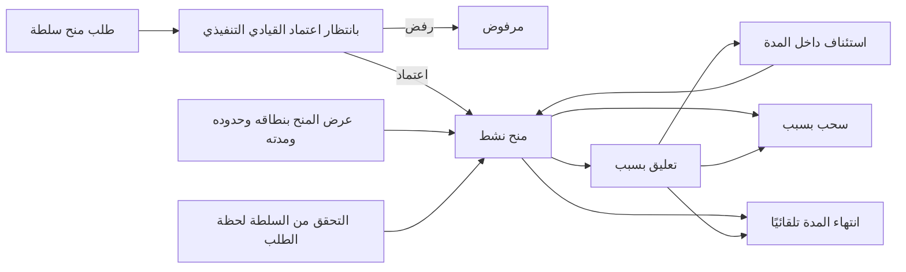
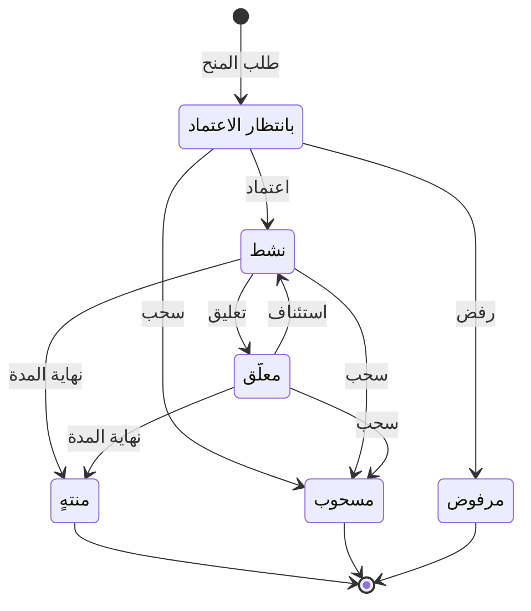

# منح صلاحيات القرار

<!-- BEGIN GENERATED: doc -->
| البند | القيمة |
|---|---|
| المعرّف | FEAT-ORG-AUTHORITY-GRANTS |
| الإصدار | 0.1 |
| الحالة | مسودة |
| القدرة | CAP-01 إدارة المؤسسة والوصول |
| القدرة الفرعية | CAP-01.03 السلطة والتفويض (R1) |
| الأدوار | صاحب السلطة أو المعتمِد الثاني؛ القيادي التنفيذي؛ مسؤول الإدارة؛ النظام |
| الشاشات | SCR-62 المستخدمون والأدوار والسلطة |
| حالات الاستخدام | UC-082، UC-032، UC-035 |
| القصص | 10: 8 من المواصفة، و2 جديدة |
<!-- END GENERATED: doc -->

## 1. نظرة عامة

### 1.1 القيمة

يحدد بوضوح من يملك سلطة اتخاذ كل نوع من القرارات وفي أي نطاق وحدود ومدة، مع اعتماد المنح وتعليقه وسحبه وانتهائه تلقائيًا.

### 1.2 النطاق

| البند | القيمة |
|---|---|
| المستخدمون | صاحب السلطة أو المعتمِد الثاني (يطلب المنح ويعلّقه ويستأنفه ويسحبه)، والقيادي التنفيذي (يعتمد المنح أو يرفضه، ويسحبه في نطاقه)، ومسؤول الإدارة (يطّلع على المنح في نطاقه)، والنظام (ينهي المنح عند نهاية مدته)، وفريق المنصة (يفرض انتهاء المدة لحظة التحقق) |
| الشاشات | SCR-62 المستخدمون والأدوار والسلطة: قائمة المنح وتفاصيله وأفعال الاعتماد |
| حالات الاستخدام | إدارة الأدوار والسلطة (UC-082)، وتسجيل القرار (UC-032) واعتماد الخطة (UC-035) اللذان يتحققان من السلطة |
| المتطلبات | السلطة منح يذكر نوع القرار والنطاق التنظيمي والحدود ومدة الصلاحية، لشخص أو لدور (REQ-FND-007)؛ التفويض لا يتجاوز سلطة المفوِّض (REQ-FND-008)؛ التحقق من السلطة لنوع قرار ونطاق ولحظة زمنية (REQ-FND-009) |
| خارج النطاق | تفويض السلطة من صاحبها إلى غيره (ميزة تفويض السلطة)؛ خدمة التحقق من السلطة نفسها (ميزة فرض الوصول)؛ الأدوار وإسنادها |

### 1.3 خريطة الميزة

**الشكل 1: من طلب المنح إلى سلطة فعالة ثم نهايتها**



**الشكل 2: رحلة منح السلطة**



«منتهٍ» و«مسحوب» و«مرفوض» حالات نهائية. والتفويض ينشئ منحًا «نشطًا» مباشرة، وتغطيه ميزة تفويض السلطة.

## 2. القواعد المشتركة

تنطبق على كل قصص الميزة، فلا تتكرر داخل القصص. وكل قصة تذكر ما يخصها فقط.

### 2.1 السياق المشترك

كل قصة تبدأ من ثلاثة شروط: مستأجر نشط، وحزمة السياسات الأساسية مفعّلة، ومستخدم مسجّل الدخول ومخوَّل. وتشير إليها القصص بخطوة واحدة: «بفرض السياق المشترك للميزة».

### 2.2 الصلاحية وعدم الإفصاح

- من لا يحق له رؤية العنصر يتلقى ردًا بشكل «غير متاح» تمامًا، فلا يعرف أنه موجود.
- من يرى العنصر ولا يحق له الإجراء يتلقى «لا تملك صلاحية هذا الإجراء».

### 2.3 أوامر تغيير الحالة

- **منع التكرار:** يُرسل كل أمر بمفتاح فريد، فإعادة الطلب نفسه لا تُنفَّذ مرتين.
- **حماية التعديل المتزامن:** يُرسل كل أمر بإصدار البيانات الذي يراه المستخدم. فإن عدّلها غيره في الأثناء، يُرفض الأمر.
- **السجل:** إن نجح الأمر، يُكتب حدثه وسجل التدقيق في المعاملة نفسها.

### 2.4 الرفض المشترك

```gherkin
# language: ar
خاصية: الرفض المشترك لأوامر الميزة

  سيناريو مخطط: رفض مشترك لكل أمر في الميزة
    بفرض السياق المشترك للميزة
    و <الحالة>
    عندما يُرسل المستخدم أي أمر من أوامر الميزة
    اذاً يُرفض برمز <الرمز> ويرى "<الرسالة>"
    و لا يتغير شيء

    امثلة:
      | الحالة                                  | الرمز                  | الرسالة                                                 |
      | العنصر خارج صلاحياته                    | NOT_FOUND              | غير متاح                                                |
      | العنصر مرئي له ولا يحق له الإجراء       | AUTHZ_DENIED           | لا تملك صلاحية هذا الإجراء                              |
      | غيره عدّل العنصر بعد أن فتحه            | VERSION_CONFLICT       | تغيّرت البيانات منذ فتحتها. راجع التغييرات ثم أعد المحاولة |
      | أعاد مفتاح منع التكرار بمحتوى مختلف     | IDEMPOTENCY_KEY_REUSED | طلب مكرر بمحتوى مختلف                                   |
      | البيانات ناقصة أو غير صحيحة             | VALIDATION_FAILED      | بعض البيانات ناقصة أو غير صحيحة. راجع الحقول المعلَّمة      |

  سيناريو: إعادة الطلب نفسه لا تُنفَّذ مرتين
    بفرض السياق المشترك للميزة
    و أمر نجح بمفتاح منع تكرار
    عندما يُعاد الطلب نفسه بالمفتاح نفسه
    اذاً تُعاد النتيجة الأولى ولا يُكتب حدث ثانٍ
```

### 2.5 متى يكون المنح فعالًا

- المنح «منحة فعالة» في لحظة ما إذا كان «نشطًا» فيها، وكانت اللحظة داخل مدة صلاحيته، وكان أصله فعالًا في اللحظة نفسها إن كان تفويضًا.
- لذلك لا يكون المنح «بانتظار الاعتماد» ولا «المعلّق» فعالًا. وسحب الأصل يجعل التفويضات المأخوذة منه غير فعالة دون تعديلها.
- كل تغيير يجعل منحًا فعالًا أو غير فعال يرفع إصدار الأمن، فتُبطل ذاكرة القرارات المؤقتة فورًا في كل نقاط الفرض (QAS-SEC-003).

## 3. الجودة وتعريف الاكتمال

### 3.1 متطلبات الجودة

<!-- BEGIN GENERATED: quality -->
لا متطلبات جودة مرتبطة بمتطلبات هذه الميزة مباشرة. تنطبق متطلبات المنصة العامة (`FEAT-PLT-*`).
<!-- END GENERATED: quality -->

### 3.2 تعريف الاكتمال

القصة مكتملة حين تتحقق الشروط الخمسة:

1. سيناريوهاتها والقواعد المشتركة تمر في الاختبار الآلي.
2. فحوص البنية المعمارية تمر.
3. نصوص الواجهة والرسائل موجودة بالعربية والإنجليزية.
4. مراجعة الكود مكتملة.
5. ما تضيفه القصة نفسها في قسم «القواعد» تحقق.

## 4. فهرس القصص

<!-- BEGIN GENERATED: story-index -->
| المعرّف | القصة | النوع | الحالة |
|---|---|---|---|
| `US-BC01-AUT-APPROVE-GRANT` | اعتماد منح السلطة | أمر | مسودة |
| `US-BC01-AUT-GRANT` | إصدار منح السلطة | أمر | مسودة |
| `US-BC01-AUT-REJECT-GRANT` | رفض منح السلطة | أمر | مسودة |
| `US-BC01-AUT-RESUME` | استئناف منح السلطة | أمر | مسودة |
| `US-BC01-AUT-REVOKE` | سحب منح السلطة | أمر | مسودة |
| `US-BC01-AUT-SUSPEND` | تعليق منح السلطة | أمر | مسودة |
| `US-BC01-Q-AUT-LIST` | جلب: Grants by holder / scope / effective at t | جلب | مسودة |
| `US-BC01-S-AUTHORITY-GRANT-01` | تلقائي: valid_to reached (منح السلطة) | نظام | مسودة |
| `US-UI-SCR62-AUTHORITY-GRANTS` | عرض منح السلطة بنطاقها وحدودها ومدتها | واجهة | مسودة |
| `US-PLT-AUT-READTIME-VALIDITY` | فرض انتهاء السلطة لحظة التحقق | منصة | مسودة |
<!-- END GENERATED: story-index -->

## 5. القصص

### 5.1 US-BC01-AUT-APPROVE-GRANT — اعتماد منح السلطة

| النوع | الإصدار | الأولوية | دون اتصال | الحالة |
|---|---|---|---|---|
| أمر | R1 | Must | لا | مسودة |

> **كـ** القيادي التنفيذي، **أريد** أن أعتمد طلب منح السلطة في نطاقي، **حتى** يصبح صاحبه قادرًا على اتخاذ القرارات التي يغطيها المنح.

**باختصار:** يعتمد قيادي تنفيذي في نطاق المنح، غير طالبه، منحًا «بانتظار الاعتماد» بعد تأكيد هويته، فيصير «نشطًا».

#### القواعد

- **متى يُسمح:** المنح «بانتظار الاعتماد».
- **من يُسمح له:** القيادي التنفيذي في النطاق التنظيمي للمنح، على ألا يكون طالب المنح، وبعد تأكيد هويته بمصادقة معززة.
- **الأثر:** يصير المنح «نشطًا»، ويكون فعالًا من بداية مدته (§2.5). ويصل حدث «مُنحت السلطة» إلى خدمة إصدار الأمن وذاكرة القرارات في نقاط الفرض.

> **ملاحظة:** المصدر يجمع شرط «القيادي التنفيذي في النطاق» مع شرط «غير الطالب» تحت رمز فصل المهام، ورسالته لا تناسب غياب صفة القيادي التنفيذي **[Needs Review]**.

#### معايير القبول

```gherkin
# language: ar
خاصية: اعتماد منح السلطة

  سيناريو: قيادي تنفيذي يعتمد منحًا طلبه غيره
    بفرض السياق المشترك للميزة
    و منح سلطة "بانتظار الاعتماد" في نطاق المستخدم طلبه شخص آخر
    و المستخدم أكّد هويته بمصادقة معززة
    عندما يعتمد المنح
    اذاً تصبح حالة المنح "نشط"
    و يُرفع إصدار الأمن لصاحب المنح
    و يُسجَّل حدث "مُنحت السلطة"

  سيناريو مخطط: رفض خاص باعتماد المنح
    بفرض السياق المشترك للميزة
    و <الحالة>
    عندما يحاول اعتماد المنح
    اذاً يُرفض برمز <الرمز> ويرى "<الرسالة>"
    و لا يتغير شيء

    امثلة:
      | الحالة                           | الرمز                                    | الرسالة                                      |
      | المنح ليس "بانتظار الاعتماد"     | AUTHORITY_GRANT_INVALID_STATE_TRANSITION | الوضع الحالي لمنح السلطة لا يسمح بهذا الإجراء |
      | المستخدم هو طالب المنح           | SEGREGATION_OF_DUTIES                    | لا يجوز أن يعتمد الشخص نفسه ما قدّمه أو طلبه |
      | لم يؤكد هويته بمصادقة معززة      | MFA_STEP_UP_REQUIRED                     | هذا الإجراء يحتاج تأكيد هويتك مرة أخرى       |
```

<details><summary>المراجع التقنية والتتبع</summary>

<!-- BEGIN GENERATED: refs US-BC01-AUT-APPROVE-GRANT -->
| البند | المعرّف | المعنى |
|---|---|---|
| الواجهة البرمجية | `POST /api/v1/foundation/authority-grants/{id}/actions/approve-grant` | — |
| الأمر | `CMD-AUT-APPROVE-GRANT` | اعتماد منح السلطة |
| السياسة | `POL-AUT-APPROVE-GRANT` | holder of permission authority.grant in scope \| Executive in scope (approve) \| holder of parent grant (delega… |
| الحدث | `EVT-AUT-GRANTED` | يصل إلى: Security-version service (EVT-SEC-VERSION-INCREMENTED); PEP decision caches; Projection security-ver… |
| الكيان | `AGG-AUTHORITY-GRANT` | منح السلطة |
| الجدول | `foundation.authority_grants` | الجدول الرئيسي لمنح السلطة |
| وحدة النشر | DU-02 | — |
| المتطلبات | REQ-FND-007، REQ-FND-008، REQ-FND-009 | معانيها في القسم 6. التتبع |
| حالات الاستخدام | UC-032، UC-035، UC-082 | Record Decision؛ Approve Plan؛ Manage Role & Authority |
| الاختبار | TST-AUTHORITY-GRANT-SM، TST-SLC01-INVARIANTS | دورة حالات منح السلطة، وثوابت الشريحة SLC-01 |
<!-- END GENERATED: refs US-BC01-AUT-APPROVE-GRANT -->

</details>

### 5.2 US-BC01-AUT-GRANT — طلب منح سلطة

| النوع | الإصدار | الأولوية | دون اتصال | الحالة |
|---|---|---|---|---|
| أمر | R1 | Must | لا | مسودة |

> **كـ** صاحب السلطة أو المعتمِد الثاني، **أريد** أن أطلب منح سلطة لشخص أو لدور بنوع قرار ونطاق وحدود ومدة، **حتى** يُعرف بوضوح من يقرر ماذا وأين وإلى متى.

**باختصار:** يطلب صاحب صلاحية منح السلطة في النطاق منحًا جديدًا، فيُنشأ «بانتظار الاعتماد» ولا يصير فعالًا حتى يعتمده قيادي تنفيذي غيره.

#### القواعد

- **متى يُسمح:** نوع القرار موجود، والوحدة التنظيمية للنطاق نشطة.
- **من يُسمح له:** من يملك صلاحية منح السلطة في النطاق المطلوب.
- **البيانات:**
  - صاحب المنح، مستخدم أو دور (إلزامي).
  - أنواع القرار (إلزامية)، والوحدة التنظيمية للنطاق (إلزامية)، وهل يشمل الوحدات التابعة (إلزامي).
  - الحدود، مثل حد مالي أو حجم (اختيارية).
  - بداية المدة (إلزامية) ونهايتها (اختيارية)، وهل يجوز تفويضه (إلزامي).
- **الأثر:** يُنشأ المنح «بانتظار الاعتماد»، ولا يكون فعالًا قبل اعتماده (القصة 5.1). ويُسجَّل حدث «طُلب منح السلطة».

> **ملاحظة:** المصدر يرفض نوع قرار غير موجود ووحدة غير نشطة بالرمز نفسه لغياب الصلاحية، ورسالته لا تناسبهما **[Needs Review]**.

#### معايير القبول

```gherkin
# language: ar
خاصية: طلب منح سلطة

  سيناريو: طلب منح بنطاق وحدود ومدة
    بفرض السياق المشترك للميزة
    و المستخدم يملك صلاحية منح السلطة في وحدة نشطة
    عندما يطلب منحًا لشخص بنوع قرار وحد مالي وبداية ونهاية للمدة في تلك الوحدة
    اذاً يُنشأ منح حالته "بانتظار الاعتماد"
    و لا يكون المنح فعالًا قبل اعتماده
    و يُسجَّل حدث "طُلب منح السلطة"

  سيناريو مخطط: رفض خاص بطلب المنح
    بفرض السياق المشترك للميزة
    و <الحالة>
    عندما يحاول طلب المنح
    اذاً يُرفض برمز <الرمز> ويرى "<الرسالة>"
    و لا يتغير شيء

    امثلة:
      | الحالة                                    | الرمز             | الرسالة                                      |
      | لا يملك صلاحية منح السلطة في هذا النطاق   | PERMISSION_DENIED | لا تملك صلاحية منح هذه السلطة في هذا النطاق |
      | لم يحدد صاحب المنح                        | VALIDATION_FAILED | صاحب المنح مطلوب                             |
      | لم يحدد أنواع القرار                      | VALIDATION_FAILED | أنواع القرار مطلوبة                          |
      | لم يحدد بداية المدة                       | VALIDATION_FAILED | بداية المدة مطلوبة                           |
```

<details><summary>المراجع التقنية والتتبع</summary>

<!-- BEGIN GENERATED: refs US-BC01-AUT-GRANT -->
| البند | المعرّف | المعنى |
|---|---|---|
| الواجهة البرمجية | `POST /api/v1/foundation/authority-grants` | — |
| الأمر | `CMD-AUT-GRANT` | إصدار منح السلطة |
| السياسة | `POL-AUT-GRANT` | holder of permission authority.grant in scope \| Executive in scope (approve) \| holder of parent grant (delega… |
| الحدث | `EVT-AUT-GRANT-REQUESTED` | يصل إلى: Search/Directory projection (BC01 read model); Notification (delegates informed on revoke/expire) |
| الكيان | `AGG-AUTHORITY-GRANT` | منح السلطة |
| الجدول | `foundation.authority_grants` | الجدول الرئيسي لمنح السلطة |
| وحدة النشر | DU-02 | — |
| المتطلبات | REQ-FND-007، REQ-FND-008، REQ-FND-009 | معانيها في القسم 6. التتبع |
| حالات الاستخدام | UC-032، UC-035، UC-082 | Record Decision؛ Approve Plan؛ Manage Role & Authority |
| الاختبار | TST-AUTHORITY-GRANT-SM، TST-SLC01-INVARIANTS | دورة حالات منح السلطة، وثوابت الشريحة SLC-01 |
<!-- END GENERATED: refs US-BC01-AUT-GRANT -->

</details>

### 5.3 US-BC01-AUT-REJECT-GRANT — رفض طلب منح السلطة

| النوع | الإصدار | الأولوية | دون اتصال | الحالة |
|---|---|---|---|---|
| أمر | R1 | Must | لا | مسودة |

> **كـ** القيادي التنفيذي، **أريد** أن أرفض طلب منح السلطة مع ذكر السبب، **حتى** لا يملك أحد سلطة لا يجب أن يملكها.

**باختصار:** يرفض القيادي التنفيذي منحًا «بانتظار الاعتماد» بسبب مكتوب، فيصير «مرفوضًا» نهائيًا ولا يكون فعالًا أبدًا.

#### القواعد

- **متى يُسمح:** المنح «بانتظار الاعتماد».
- **من يُسمح له:** القيادي التنفيذي في النطاق التنظيمي للمنح.
- **البيانات:** السبب (إلزامي).
- **الأثر:** يصير المنح «مرفوضًا»، وهي حالة نهائية. ويُسجَّل حدث «رُفض منح السلطة».

#### معايير القبول

```gherkin
# language: ar
خاصية: رفض طلب منح السلطة

  سيناريو: قيادي تنفيذي يرفض طلب منح بسبب
    بفرض السياق المشترك للميزة
    و منح سلطة "بانتظار الاعتماد" في نطاق المستخدم
    عندما يرفضه ويذكر السبب
    اذاً تصبح حالة المنح "مرفوض"
    و يُسجَّل حدث "رُفض منح السلطة"

  سيناريو مخطط: رفض خاص برفض المنح
    بفرض السياق المشترك للميزة
    و <الحالة>
    عندما يحاول رفض المنح
    اذاً يُرفض برمز <الرمز> ويرى "<الرسالة>"
    و لا يتغير شيء

    امثلة:
      | الحالة                         | الرمز                                    | الرسالة                                      |
      | المنح ليس "بانتظار الاعتماد"   | AUTHORITY_GRANT_INVALID_STATE_TRANSITION | الوضع الحالي لمنح السلطة لا يسمح بهذا الإجراء |
      | لم يذكر السبب                  | REASON_REQUIRED                          | اذكر السبب                                   |
```

<details><summary>المراجع التقنية والتتبع</summary>

<!-- BEGIN GENERATED: refs US-BC01-AUT-REJECT-GRANT -->
| البند | المعرّف | المعنى |
|---|---|---|
| الواجهة البرمجية | `POST /api/v1/foundation/authority-grants/{id}/actions/reject-grant` | — |
| الأمر | `CMD-AUT-REJECT-GRANT` | رفض منح السلطة |
| السياسة | `POL-AUT-REJECT-GRANT` | holder of permission authority.grant in scope \| Executive in scope (approve) \| holder of parent grant (delega… |
| الحدث | `EVT-AUT-GRANT-REJECTED` | يصل إلى: Search/Directory projection (BC01 read model); Notification (delegates informed on revoke/expire) |
| الكيان | `AGG-AUTHORITY-GRANT` | منح السلطة |
| الجدول | `foundation.authority_grants` | الجدول الرئيسي لمنح السلطة |
| وحدة النشر | DU-02 | — |
| المتطلبات | REQ-FND-007، REQ-FND-008، REQ-FND-009 | معانيها في القسم 6. التتبع |
| حالات الاستخدام | UC-032، UC-035، UC-082 | Record Decision؛ Approve Plan؛ Manage Role & Authority |
| الاختبار | TST-AUTHORITY-GRANT-SM، TST-SLC01-INVARIANTS | دورة حالات منح السلطة، وثوابت الشريحة SLC-01 |
<!-- END GENERATED: refs US-BC01-AUT-REJECT-GRANT -->

</details>

### 5.4 US-BC01-AUT-RESUME — استئناف منح السلطة المعلّق

| النوع | الإصدار | الأولوية | دون اتصال | الحالة |
|---|---|---|---|---|
| أمر | R1 | Must | لا | مسودة |

> **كـ** صاحب السلطة أو المعتمِد الثاني، **أريد** أن أستأنف منح سلطة معلّقًا، **حتى** يعود صاحبه إلى اتخاذ قراراته بعد زوال سبب التعليق.

**باختصار:** يستأنف صاحب صلاحية منح السلطة منحًا «معلّقًا» لم تنتهِ مدته، فيعود «نشطًا».

#### القواعد

- **متى يُسمح:** المنح «معلّق»، ومدته لم تنتهِ.
- **من يُسمح له:** من يملك صلاحية منح السلطة في نطاق المنح.
- **الأثر:** يعود المنح «نشطًا»، ويكون فعالًا من جديد إن كان أصله فعالًا (§2.5). ويُسجَّل حدث «استُؤنف منح السلطة».

#### معايير القبول

```gherkin
# language: ar
خاصية: استئناف منح السلطة المعلّق

  سيناريو: استئناف منح معلّق داخل مدته
    بفرض السياق المشترك للميزة
    و منح سلطة "معلّق" لم تنتهِ مدته
    عندما يستأنفه المستخدم
    اذاً تصبح حالة المنح "نشط"
    و يُرفع إصدار الأمن لصاحب المنح
    و يُسجَّل حدث "استُؤنف منح السلطة"

  سيناريو مخطط: رفض خاص باستئناف المنح
    بفرض السياق المشترك للميزة
    و <الحالة>
    عندما يحاول استئناف المنح
    اذاً يُرفض برمز <الرمز> ويرى "<الرسالة>"
    و لا يتغير شيء

    امثلة:
      | الحالة                                      | الرمز                                    | الرسالة                                      |
      | المنح ليس "معلّق"                           | AUTHORITY_GRANT_INVALID_STATE_TRANSITION | الوضع الحالي لمنح السلطة لا يسمح بهذا الإجراء |
      | انتهت مدة المنح ولم يُسجَّل انتهاؤه بعد     | GRANT_EXPIRED                            | انتهت مدة هذه السلطة                         |
```

<details><summary>المراجع التقنية والتتبع</summary>

<!-- BEGIN GENERATED: refs US-BC01-AUT-RESUME -->
| البند | المعرّف | المعنى |
|---|---|---|
| الواجهة البرمجية | `POST /api/v1/foundation/authority-grants/{id}/actions/resume` | — |
| الأمر | `CMD-AUT-RESUME` | استئناف منح السلطة |
| السياسة | `POL-AUT-RESUME` | holder of permission authority.grant in scope \| Executive in scope (approve) \| holder of parent grant (delega… |
| الحدث | `EVT-AUT-RESUMED` | يصل إلى: Security-version service (EVT-SEC-VERSION-INCREMENTED); PEP decision caches; Projection security-ver… |
| الكيان | `AGG-AUTHORITY-GRANT` | منح السلطة |
| الجدول | `foundation.authority_grants` | الجدول الرئيسي لمنح السلطة |
| وحدة النشر | DU-02 | — |
| المتطلبات | REQ-FND-007، REQ-FND-008، REQ-FND-009 | معانيها في القسم 6. التتبع |
| حالات الاستخدام | UC-032، UC-035، UC-082 | Record Decision؛ Approve Plan؛ Manage Role & Authority |
| الاختبار | TST-AUTHORITY-GRANT-SM، TST-SLC01-INVARIANTS | دورة حالات منح السلطة، وثوابت الشريحة SLC-01 |
<!-- END GENERATED: refs US-BC01-AUT-RESUME -->

</details>

### 5.5 US-BC01-AUT-REVOKE — سحب منح السلطة

| النوع | الإصدار | الأولوية | دون اتصال | الحالة |
|---|---|---|---|---|
| أمر | R1 | Must | لا | مسودة |

> **كـ** صاحب السلطة أو المعتمِد الثاني، **أريد** أن أسحب منح سلطة مع ذكر السبب، **حتى** تتوقف سلطة صاحبه وكل ما فوّضه منها فورًا.

**باختصار:** يسحب مانح السلطة أو مفوِّضها أو القيادي التنفيذي في النطاق منحًا غير منتهٍ بسبب مكتوب، فيصير «مسحوبًا» نهائيًا، وتتوقف معه التفويضات المأخوذة منه.

#### القواعد

- **متى يُسمح:** المنح «بانتظار الاعتماد» أو «نشط» أو «معلّق».
- **من يُسمح له:** من منح السلطة، أو من فوّضها، أو القيادي التنفيذي في نطاق المنح.
- **البيانات:** السبب (إلزامي).
- **الأثر:**
  - يصير المنح «مسحوبًا»، وهي حالة نهائية.
  - تصير التفويضات المأخوذة منه غير فعالة فورًا دون تعديلها (§2.5).
  - يُسجَّل حدث «سُحب منح السلطة»، فيُرفع إصدار الأمن ويُبلَّغ المفوَّض إليهم.

#### معايير القبول

```gherkin
# language: ar
خاصية: سحب منح السلطة

  سيناريو: سحب منح نشط له تفويض
    بفرض السياق المشترك للميزة
    و منح سلطة "نشط" منحه المستخدم ومنه تفويض نشط لشخص آخر
    عندما يسحبه ويذكر السبب
    اذاً تصبح حالة المنح "مسحوب"
    و يصبح التفويض المأخوذ منه غير فعال دون تغيير حالته
    و يُبلَّغ المفوَّض إليه
    و يُسجَّل حدث "سُحب منح السلطة"

  سيناريو مخطط: رفض خاص بسحب المنح
    بفرض السياق المشترك للميزة
    و <الحالة>
    عندما يحاول سحب المنح
    اذاً يُرفض برمز <الرمز> ويرى "<الرسالة>"
    و لا يتغير شيء

    امثلة:
      | الحالة                                  | الرمز                                    | الرسالة                                      |
      | المنح "منتهٍ" أو "مسحوب" أو "مرفوض"     | AUTHORITY_GRANT_INVALID_STATE_TRANSITION | الوضع الحالي لمنح السلطة لا يسمح بهذا الإجراء |
      | لم يذكر السبب                           | REASON_REQUIRED                          | اذكر السبب                                   |
```

<details><summary>المراجع التقنية والتتبع</summary>

<!-- BEGIN GENERATED: refs US-BC01-AUT-REVOKE -->
| البند | المعرّف | المعنى |
|---|---|---|
| الواجهة البرمجية | `POST /api/v1/foundation/authority-grants/{id}/actions/revoke` | — |
| الأمر | `CMD-AUT-REVOKE` | سحب منح السلطة |
| السياسة | `POL-AUT-REVOKE` | holder of permission authority.grant in scope \| Executive in scope (approve) \| holder of parent grant (delega… |
| الحدث | `EVT-AUT-REVOKED` | يصل إلى: Security-version service (EVT-SEC-VERSION-INCREMENTED); PEP decision caches; Projection security-ver… |
| الكيان | `AGG-AUTHORITY-GRANT` | منح السلطة |
| الجدول | `foundation.authority_grants` | الجدول الرئيسي لمنح السلطة |
| وحدة النشر | DU-02 | — |
| المتطلبات | REQ-FND-007، REQ-FND-008، REQ-FND-009 | معانيها في القسم 6. التتبع |
| حالات الاستخدام | UC-032، UC-035، UC-082 | Record Decision؛ Approve Plan؛ Manage Role & Authority |
| الاختبار | TST-AUTHORITY-GRANT-SM، TST-SLC01-INVARIANTS | دورة حالات منح السلطة، وثوابت الشريحة SLC-01 |
<!-- END GENERATED: refs US-BC01-AUT-REVOKE -->

</details>

### 5.6 US-BC01-AUT-SUSPEND — تعليق منح السلطة

| النوع | الإصدار | الأولوية | دون اتصال | الحالة |
|---|---|---|---|---|
| أمر | R1 | Must | لا | مسودة |

> **كـ** صاحب السلطة أو المعتمِد الثاني، **أريد** أن أعلّق منح سلطة نشطًا مع ذكر السبب، **حتى** أوقف استعماله مؤقتًا دون أن أسحبه.

**باختصار:** يعلّق صاحب صلاحية منح السلطة منحًا «نشطًا» بسبب مكتوب، فيصير «معلّقًا» وغير فعال حتى يُستأنف أو تنتهي مدته.

#### القواعد

- **متى يُسمح:** المنح «نشط».
- **من يُسمح له:** من يملك صلاحية منح السلطة في نطاق المنح.
- **البيانات:** السبب (إلزامي).
- **الأثر:** يصير المنح «معلّقًا» وغير فعال (§2.5). ومدته تستمر أثناء التعليق، فإن بلغت نهايتها صار «منتهيًا» (القصة 5.8). ويُسجَّل حدث «عُلّق منح السلطة».

#### معايير القبول

```gherkin
# language: ar
خاصية: تعليق منح السلطة

  سيناريو: تعليق منح نشط بسبب
    بفرض السياق المشترك للميزة
    و منح سلطة "نشط"
    عندما يعلّقه المستخدم ويذكر السبب
    اذاً تصبح حالة المنح "معلّق" ولا يكون فعالًا
    و يُرفع إصدار الأمن لصاحب المنح
    و يُسجَّل حدث "عُلّق منح السلطة"

  سيناريو مخطط: رفض خاص بتعليق المنح
    بفرض السياق المشترك للميزة
    و <الحالة>
    عندما يحاول تعليق المنح
    اذاً يُرفض برمز <الرمز> ويرى "<الرسالة>"
    و لا يتغير شيء

    امثلة:
      | الحالة               | الرمز                                    | الرسالة                                      |
      | المنح ليس "نشط"      | AUTHORITY_GRANT_INVALID_STATE_TRANSITION | الوضع الحالي لمنح السلطة لا يسمح بهذا الإجراء |
      | لم يذكر السبب        | REASON_REQUIRED                          | اذكر السبب                                   |
```

<details><summary>المراجع التقنية والتتبع</summary>

<!-- BEGIN GENERATED: refs US-BC01-AUT-SUSPEND -->
| البند | المعرّف | المعنى |
|---|---|---|
| الواجهة البرمجية | `POST /api/v1/foundation/authority-grants/{id}/actions/suspend` | — |
| الأمر | `CMD-AUT-SUSPEND` | تعليق منح السلطة |
| السياسة | `POL-AUT-SUSPEND` | holder of permission authority.grant in scope \| Executive in scope (approve) \| holder of parent grant (delega… |
| الحدث | `EVT-AUT-SUSPENDED` | يصل إلى: Security-version service (EVT-SEC-VERSION-INCREMENTED); PEP decision caches; Projection security-ver… |
| الكيان | `AGG-AUTHORITY-GRANT` | منح السلطة |
| الجدول | `foundation.authority_grants` | الجدول الرئيسي لمنح السلطة |
| وحدة النشر | DU-02 | — |
| المتطلبات | REQ-FND-007، REQ-FND-008، REQ-FND-009 | معانيها في القسم 6. التتبع |
| حالات الاستخدام | UC-032، UC-035، UC-082 | Record Decision؛ Approve Plan؛ Manage Role & Authority |
| الاختبار | TST-AUTHORITY-GRANT-SM، TST-SLC01-INVARIANTS | دورة حالات منح السلطة، وثوابت الشريحة SLC-01 |
<!-- END GENERATED: refs US-BC01-AUT-SUSPEND -->

</details>

### 5.7 US-BC01-Q-AUT-LIST — قائمة منح السلطة حسب صاحبها ونطاقها وزمن سريانها

| النوع | الإصدار | الأولوية | دون اتصال | الحالة |
|---|---|---|---|---|
| جلب | R1 | Must | لا | مسودة |

> **كـ** القيادي التنفيذي أو مسؤول الإدارة، **أريد** قائمة بمنح السلطة في نطاقي، **حتى** أعرف من يملك أي سلطة وأين وإلى متى.

**باختصار:** تُعاد منح السلطة التي يحق للمستخدم رؤيتها، صفحة بعد صفحة، ولا يكشف أي عدد وجود منح محجوب.

#### القواعد

- **من يرى ماذا:** القيادي التنفيذي ومسؤول الإدارة يريان المنح في نطاقهما التنظيمي وما يسمح به التصنيف، وصاحب المنح يرى منحه.
- **المرشحات:** صاحب المنح، والنطاق، والمنح الفعالة في لحظة معينة، والمؤشر وحجم الصفحة.

> **ملاحظة:** المرشحات الثلاثة الأولى من وصف الاستعلام، ومدخلاته في المواصفة المؤشر وحجم الصفحة فقط **[Needs Review]**.

#### معايير القبول

```gherkin
# language: ar
خاصية: قائمة منح السلطة حسب صاحبها ونطاقها وزمن سريانها

  سيناريو: مسؤول الإدارة يرى منح نطاقه فقط
    بفرض السياق المشترك للميزة
    و منح سلطة داخل نطاق المستخدم وأخرى خارجه
    عندما يطلب قائمة المنح
    اذاً تُعاد المنح داخل نطاقه فقط، ويُعاد فحص صلاحية كل منها
    و لا يكشف أي عدد أو اقتراح وجود منح محجوب

  سيناريو: صاحب المنح يرى منحه
    بفرض السياق المشترك للميزة
    و مستخدم صاحب منح سلطة وليس قياديًا تنفيذيًا ولا مسؤول إدارة
    عندما يطلب قائمة المنح
    اذاً تُعاد المنح التي هو صاحبها فقط
```

<details><summary>المراجع التقنية والتتبع</summary>

<!-- BEGIN GENERATED: refs US-BC01-Q-AUT-LIST -->
| البند | المعرّف | المعنى |
|---|---|---|
| الواجهة البرمجية | `GET /api/v1/foundation/authority-grants` | — |
| الاستعلام | `QRY-AUT-LIST` | Grants by holder / scope / effective at t |
| السياسة | `POL-AUT-LIST` | org scope of subject roles ∩ classification rule |
| الكيان | `AGG-AUTHORITY-GRANT` | منح السلطة |
| الجدول | `foundation.authority_grants` | الجدول الرئيسي لمنح السلطة |
| وحدة النشر | DU-02 | — |
| المتطلب | REQ-FND-007 | The system shall record authority as a grant stating decision type, organizational scope, limits and validity… |
| حالة الاستخدام | UC-082 | Manage Role & Authority |
| الاختبار | TST-AUTHORITY-GRANT-SM، TST-SLC01-INVARIANTS | دورة حالات منح السلطة، وثوابت الشريحة SLC-01 |
<!-- END GENERATED: refs US-BC01-Q-AUT-LIST -->

</details>

### 5.8 US-BC01-S-AUTHORITY-GRANT-01 — انتهاء منح السلطة عند نهاية مدته

| النوع | الإصدار | الأولوية | دون اتصال | الحالة |
|---|---|---|---|---|
| نظام | R1 | Must | لا ينطبق | مسودة |

> **كـ** النظام، **أريد** أن أنهي منح السلطة حين تبلغ مدته نهايتها، **حتى** لا تبقى سلطة بعد وقتها.

**باختصار:** يمر المجدول على المنح «النشطة» و«المعلّقة»، فإذا بلغ أحدها نهاية مدته صار «منتهيًا» نهائيًا.

#### القواعد

- **متى يحدث:** منح «نشط» أو «معلّق» بلغ نهاية مدته.
- **الأثر:** يصير المنح «منتهيًا»، وهي حالة نهائية، وتصير التفويضات المأخوذة منه غير فعالة (§2.5). ويُسجَّل حدث «انتهت السلطة» وسجل تدقيق بهوية النظام، فيُرفع إصدار الأمن ويُبلَّغ المفوَّض إليهم. وإن تأخر المجدول، يبقى المنح غير فعال لحظة التحقق (القصة 5.10).

#### معايير القبول

```gherkin
# language: ar
خاصية: انتهاء منح السلطة عند نهاية مدته

  سيناريو: منح نشط يبلغ نهاية مدته
    بفرض منح سلطة "نشط" نهاية مدته الآن
    عندما يمر المجدول عليه
    اذاً تصبح حالة المنح "منتهٍ"
    و يُسجَّل حدث "انتهت السلطة" وسجل تدقيق بهوية النظام

  سيناريو: منح بلا نهاية مدة لا ينتهي
    بفرض منح سلطة "نشط" بلا نهاية مدة
    عندما يمر المجدول عليه
    اذاً يبقى المنح "نشط" ولا يُسجَّل حدث
```

<details><summary>المراجع التقنية والتتبع</summary>

<!-- BEGIN GENERATED: refs US-BC01-S-AUTHORITY-GRANT-01 -->
| البند | المعرّف | المعنى |
|---|---|---|
| المحفِّز | `SYS:valid_to reached` | system scheduler |
| الانتقال | ACTIVE, SUSPENDED ← EXPIRED | — |
| الحدث | `EVT-AUT-EXPIRED` | يصل إلى: Security-version service (EVT-SEC-VERSION-INCREMENTED); PEP decision caches; Projection security-ver… |
| الكيان | `AGG-AUTHORITY-GRANT` | منح السلطة |
| الجدول | `foundation.authority_grants` | الجدول الرئيسي لمنح السلطة |
| وحدة النشر | DU-02 | — |
| المتطلبات | REQ-FND-007، REQ-FND-008، REQ-FND-009 | معانيها في القسم 6. التتبع |
| حالات الاستخدام | UC-032، UC-035، UC-082 | Record Decision؛ Approve Plan؛ Manage Role & Authority |
| الاختبار | TST-AUTHORITY-GRANT-SM، TST-SLC01-INVARIANTS | دورة حالات منح السلطة، وثوابت الشريحة SLC-01 |
<!-- END GENERATED: refs US-BC01-S-AUTHORITY-GRANT-01 -->

</details>

### 5.9 US-UI-SCR62-AUTHORITY-GRANTS — عرض منح السلطة بنطاقها وحدودها ومدتها

| النوع | الإصدار | الأولوية | دون اتصال | الحالة |
|---|---|---|---|---|
| واجهة | R1 | Must | لا | مسودة |

> **كـ** القيادي التنفيذي، **أريد** أن أرى منح السلطة بنطاقها وحدودها ومدتها وأعتمد المعلّق منها من الشاشة نفسها، **حتى** أحكم على كل طلب وأنا أرى ما يملكه صاحبه.

**باختصار:** تعرض شاشة المستخدمين والأدوار والسلطة لكل منح صاحبه وأنواع قراره ونطاقه وحدوده ومدته وحالته، والقيادي التنفيذي يعتمد منها أو يرفض.

#### القواعد

- يظهر لكل منح: صاحبه (مستخدم أو دور)، وأنواع القرار، والوحدة وهل تشمل التابعة، والحدود، وبداية المدة ونهايتها، وجواز التفويض، والحالة.
- اعتماد المنح ورفضه للقيادي التنفيذي من هذه الشاشة (`21-ui-design.md` §5).
- **[Derived]** علامة «فعال الآن» يحسبها الخادم (§2.5)، ولا تحسبها الواجهة.
- **[Derived]** المنح «بانتظار الاعتماد» في نطاق القيادي التنفيذي تظهر له في أعلى القائمة.
- الأفعال تظهر حسب الدور وحالة المنح، والحكم للخادم (`21-ui-design.md` §6.3).

#### معايير القبول

```gherkin
# language: ar
خاصية: عرض منح السلطة بنطاقها وحدودها ومدتها

  سيناريو: القيادي التنفيذي يرى طلبًا بانتظار اعتماده
    بفرض السياق المشترك للميزة
    و منح سلطة "بانتظار الاعتماد" في نطاق المستخدم
    عندما يفتح شاشة المستخدمين والأدوار والسلطة
    اذاً يرى المنح بصاحبه وأنواع قراره ونطاقه وحدوده ومدته
    و يرى فعلي الاعتماد والرفض

  سيناريو: مسؤول الإدارة يرى المنح دون أفعال الاعتماد
    بفرض السياق المشترك للميزة
    و منح سلطة "بانتظار الاعتماد" في نطاق مسؤول الإدارة
    عندما يفتح الشاشة
    اذاً يرى المنح دون فعلي الاعتماد والرفض

  سيناريو مخطط: الشاشة تعرض رفض الخادم
    بفرض السياق المشترك للميزة
    و <الحالة>
    عندما يرسل القيادي التنفيذي الاعتماد من الشاشة
    اذاً يرى "<الرسالة>" وتُعاد قراءة المنح
    و الرمز المعروض للمطور <الرمز>
    و لا يتغير شيء

    امثلة:
      | الحالة                     | الرمز                 | الرسالة                                      |
      | هو طالب المنح              | SEGREGATION_OF_DUTIES | لا يجوز أن يعتمد الشخص نفسه ما قدّمه أو طلبه |
      | لم يؤكد هويته بعد          | MFA_STEP_UP_REQUIRED  | هذا الإجراء يحتاج تأكيد هويتك مرة أخرى       |
```

<details><summary>المراجع التقنية والتتبع</summary>

<!-- BEGIN GENERATED: refs US-UI-SCR62-AUTHORITY-GRANTS -->
| البند | المعرّف | المعنى |
|---|---|---|
| حالة الاستخدام | UC-082 | Manage Role & Authority |
| الشاشة | SCR-62 | شاشة المستخدمون والأدوار والسلطة |
| المصدر | `21-ui-design.md §5` | — |
| المصدر | `[Derived]` | — |
| المتطلب | REQ-FND-007 | The system shall record authority as a grant stating decision type, organizational scope, limits and validity… |
| حالة الاستخدام | UC-082 | Manage Role & Authority |
<!-- END GENERATED: refs US-UI-SCR62-AUTHORITY-GRANTS -->

</details>

### 5.10 US-PLT-AUT-READTIME-VALIDITY — فرض انتهاء السلطة لحظة التحقق

| النوع | الإصدار | الأولوية | دون اتصال | الحالة |
|---|---|---|---|---|
| منصة | R1 | Must | لا ينطبق | مسودة |

> **كـ** فريق المنصة، **أريد** أن يُحكم على صلاحية المنح لحظة التحقق من السلطة، **حتى** لا تبقى سلطة فعالة بعد نهاية مدتها إن تأخر المجدول.

#### القواعد

- التحقق من السلطة يطبّق تعريف المنحة الفعالة (§2.5) في لحظة الطلب، فالمنح الذي بلغ نهاية مدته غير فعال ولو لم يُسجَّل انتهاؤه بعد.
- إن تعطل المجدول، تبقى إدارة المنح متاحة بفرض الصلاحية لحظة القراءة، وتتأخر أحداث الانتهاء فقط (`degradation-slc01.md`).
- التحقق يصح لأي لحظة سابقة أيضًا، فتُدقَّق القرارات لاحقًا بما كان فعالًا وقتها.

#### معايير القبول

```gherkin
# language: ar
خاصية: فرض انتهاء السلطة لحظة التحقق

  سيناريو: المجدول متوقف والمدة انتهت
    بفرض منح سلطة "نشط" بلغ نهاية مدته
    و المجدول متوقف فلم يُسجَّل انتهاؤه
    عندما يُطلب التحقق من سلطة صاحبه الآن
    اذاً تكون النتيجة أنه لا يملك السلطة

  سيناريو: عودة المجدول تسجّل الانتهاء متأخرًا
    بفرض منح بلغ نهاية مدته أثناء توقف المجدول
    عندما يعود المجدول للعمل
    اذاً تصبح حالة المنح "منتهٍ"
    و يُسجَّل حدث "انتهت السلطة" متأخرًا
```

<details><summary>المراجع التقنية والتتبع</summary>

<!-- BEGIN GENERATED: refs US-PLT-AUT-READTIME-VALIDITY -->
| البند | المعرّف | المعنى |
|---|---|---|
| المصدر | `09-reliability/degradation-slc01.md §matrix` | — |
| المتطلب | REQ-FND-007 | The system shall record authority as a grant stating decision type, organizational scope, limits and validity… |
| حالة الاستخدام | UC-082 | Manage Role & Authority |
<!-- END GENERATED: refs US-PLT-AUT-READTIME-VALIDITY -->

</details>

## 6. التتبع

<!-- BEGIN GENERATED: trace -->
| المتطلب | المعنى | القصص | الاختبار |
|---|---|---|---|
| REQ-FND-007 | The system shall record authority as a grant stating decision type, organizational scope, limits and validity… | `US-BC01-AUT-APPROVE-GRANT`، `US-BC01-AUT-GRANT`، `US-BC01-AUT-REJECT-GRANT`، `US-BC01-AUT-RESUME`، `US-BC01-AUT-REVOKE`، `US-BC01-AUT-SUSPEND`، `US-BC01-Q-AUT-LIST`، `US-BC01-S-AUTHORITY-GRANT-01`، `US-PLT-AUT-READTIME-VALIDITY`، `US-UI-SCR62-AUTHORITY-GRANTS` | TST-AUTHORITY-GRANT-SM |
| REQ-FND-008 | When an authority holder delegates authority, the system shall record delegator, delegate, scope, limits and… | كل قصص الأوامر والنظام في الميزة (7) | TST-AUTHORITY-GRANT-SM، TST-SLC01-INVARIANTS |
| REQ-FND-009 | The system shall provide an authority check returning whether an actor holds authority for a given decision t… | كل قصص الأوامر والنظام في الميزة (7) | TST-AUTHORITY-GRANT-SM، TST-SLC01-INVARIANTS |
<!-- END GENERATED: trace -->

## 7. سجل التغييرات

| الإصدار | التاريخ | التغيير |
|---|---|---|
| 0.1 | — | هيكل مولَّد من خريطة الميزات |
| 0.2 | 2026-10-03 | كتابة القصص كاملة بمعيار القصص |
