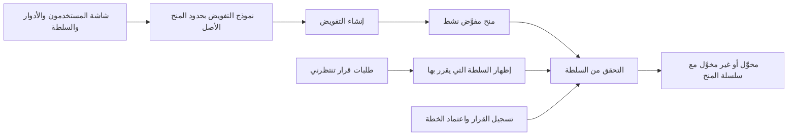

# تفويض السلطة والتحقق منها

<!-- BEGIN GENERATED: doc -->
| البند | القيمة |
|---|---|
| المعرّف | FEAT-ORG-DELEGATION |
| الإصدار | 0.1 |
| الحالة | مسودة |
| القدرة | CAP-01 إدارة المؤسسة والوصول |
| القدرة الفرعية | CAP-01.03 السلطة والتفويض (R1) |
| الأدوار | صاحب السلطة أو المعتمِد الثاني؛ المفوَّض إليه؛ النظام |
| الشاشات | SCR-62 المستخدمون والأدوار والسلطة، SCR-05 طلبات قرار تنتظرني |
| حالات الاستخدام | UC-083، UC-032، UC-035 |
| القصص | 4: 2 من المواصفة، و2 جديدة |
<!-- END GENERATED: doc -->

## 1. نظرة عامة

### 1.1 القيمة

يتيح لصاحب السلطة تفويض جزء من سلطته لغيره لمدة محددة دون تجاوز حدوده، ويتيح للمنصة التأكد قبل أي قرار أن صاحبه مخوّل به.

### 1.2 النطاق

| البند | القيمة |
|---|---|
| المستخدمون | صاحب السلطة الذي يفوِّض جزءًا من منحه، والمفوَّض إليه الذي يقرر بالتفويض، والنظام وخدماته الداخلية التي تتحقق من السلطة |
| الشاشات | SCR-62 المستخدمون والأدوار والسلطة، وSCR-05 طلبات قرار تنتظرني |
| حالات الاستخدام | تفويض السلطة (UC-083)، وتسجيل القرار (UC-032)، واعتماد الخطة (UC-035) |
| المتطلبات | السلطة منح بنوع قرار ونطاق وحدود ومدة (REQ-FND-007)، والتفويض لا يتجاوز سلطة المفوِّض (REQ-FND-008)، والتحقق من السلطة في أي لحظة ولو عبر التفويض (REQ-FND-009) |
| داخل النطاق | إنشاء التفويض من منح نافذ، والتحقق من السلطة الآن أو بأثر رجعي، ونموذج التفويض في شاشة السلطة، وإظهار سلطة المفوَّض إليه عند القرار |
| خارج النطاق | إصدار المنح الأصلي واعتماده ورفضه وتعليقه واستئنافه وسحبه وانتهاؤه (ميزة «منح السلطة»)، وتسجيل القرار نفسه (ميزة «إدارة القرار») واعتماد الخطة (ميزة «اعتماد الخطة») |

### 1.3 خريطة الميزة

**الشكل 1: خريطة التفويض والتحقق من السلطة**



> **ملاحظة:** التفويض ينشئ منحًا جديدًا في حالة «نشط» مباشرة، بلا خطوة اعتماد، لأن الاعتماد يخص المنح الأصلي فقط. وبقية رحلة المنح (التعليق والسحب والانتهاء) في ميزة «منح السلطة».

## 2. القواعد المشتركة

تنطبق على كل قصص الميزة، فلا تتكرر داخل القصص. وكل قصة تذكر ما يخصها فقط.

### 2.1 السياق المشترك

كل قصة تبدأ من ثلاثة شروط: مستأجر نشط، وحزمة السياسات الأساسية مفعّلة، ومستخدم مسجّل الدخول ومخوَّل. وتشير إليها القصص بخطوة واحدة: «بفرض السياق المشترك للميزة».

### 2.2 الصلاحية وعدم الإفصاح

- من لا يحق له رؤية العنصر يتلقى ردًا بشكل «غير متاح» تمامًا، فلا يعرف أنه موجود.
- من يرى العنصر ولا يحق له الإجراء يتلقى «لا تملك صلاحية هذا الإجراء».

### 2.3 أوامر تغيير الحالة

- **منع التكرار:** يُرسل كل أمر بمفتاح فريد، فإعادة الطلب نفسه لا تُنفَّذ مرتين.
- **حماية التعديل المتزامن:** يُرسل كل أمر بإصدار البيانات الذي يراه المستخدم. فإن عدّلها غيره في الأثناء، يُرفض الأمر.
- **السجل:** إن نجح الأمر، يُكتب حدثه وسجل التدقيق في المعاملة نفسها.

### 2.4 الرفض المشترك

```gherkin
# language: ar
خاصية: الرفض المشترك لأوامر الميزة

  سيناريو مخطط: رفض مشترك لكل أمر في الميزة
    بفرض السياق المشترك للميزة
    و <الحالة>
    عندما يُرسل المستخدم أي أمر من أوامر الميزة
    اذاً يُرفض برمز <الرمز> ويرى "<الرسالة>"
    و لا يتغير شيء

    امثلة:
      | الحالة                                  | الرمز                  | الرسالة                                                 |
      | العنصر خارج صلاحياته                    | NOT_FOUND              | غير متاح                                                |
      | العنصر مرئي له ولا يحق له الإجراء       | AUTHZ_DENIED           | لا تملك صلاحية هذا الإجراء                              |
      | غيره عدّل العنصر بعد أن فتحه            | VERSION_CONFLICT       | تغيّرت البيانات منذ فتحتها. راجع التغييرات ثم أعد المحاولة |
      | أعاد مفتاح منع التكرار بمحتوى مختلف     | IDEMPOTENCY_KEY_REUSED | طلب مكرر بمحتوى مختلف                                   |
      | البيانات ناقصة أو غير صحيحة             | VALIDATION_FAILED      | بعض البيانات ناقصة أو غير صحيحة. راجع الحقول المعلَّمة      |

  سيناريو: إعادة الطلب نفسه لا تُنفَّذ مرتين
    بفرض السياق المشترك للميزة
    و أمر نجح بمفتاح منع تكرار
    عندما يُعاد الطلب نفسه بالمفتاح نفسه
    اذاً تُعاد النتيجة الأولى ولا يُكتب حدث ثانٍ
```

## 3. الجودة وتعريف الاكتمال

### 3.1 متطلبات الجودة

<!-- BEGIN GENERATED: quality -->
لا متطلبات جودة مرتبطة بمتطلبات هذه الميزة مباشرة. تنطبق متطلبات المنصة العامة (`FEAT-PLT-*`).
<!-- END GENERATED: quality -->

### 3.2 تعريف الاكتمال

القصة مكتملة حين تتحقق الشروط الخمسة:

1. سيناريوهاتها والقواعد المشتركة تمر في الاختبار الآلي.
2. فحوص البنية المعمارية تمر.
3. نصوص الواجهة والرسائل موجودة بالعربية والإنجليزية.
4. مراجعة الكود مكتملة.
5. ما تضيفه القصة نفسها في قسم «القواعد» تحقق.

## 4. فهرس القصص

<!-- BEGIN GENERATED: story-index -->
| المعرّف | القصة | النوع | الحالة |
|---|---|---|---|
| `US-BC01-AUT-DELEGATE` | تفويض منح السلطة | أمر | مسودة |
| `US-BC01-Q-AUT-CHECK` | جلب: AuthorityCheck(actor, decision_type, scope, at, amount?) | جلب | مسودة |
| `US-UI-SCR05-ACTING-AUTHORITY` | إظهار سلطة المفوَّض إليه عند القرار | واجهة | مسودة |
| `US-UI-SCR62-DELEGATION-FORM` | تفويض السلطة ضمن حدود المفوِّض الظاهرة | واجهة | مسودة |
<!-- END GENERATED: story-index -->

## 5. القصص

### 5.1 US-BC01-AUT-DELEGATE — تفويض السلطة

| النوع | الإصدار | الأولوية | دون اتصال | الحالة |
|---|---|---|---|---|
| أمر | R1 | Must | لا | مسودة |

> **كـ** صاحب السلطة، **أريد** أن أفوِّض جزءًا من سلطتي إلى زميل لمدة محددة، **حتى** تستمر القرارات في غيابي دون أن يتجاوز أحد حدودي.

**باختصار:** يختار صاحب المنح النافذ القابل للتفويض المفوَّض إليه وما يفوِّضه من أنواع القرار والنطاق والحدود والمدة، فيُنشأ منح مفوَّض «نشط» لا يتجاوز المنح الأصل في شيء.

#### القواعد

- **متى يُسمح:** المنح الأصل نافذ الآن (نشط، وفي مدته، وأصله إن وُجد نافذ) وقابل للتفويض. وأنواع القرار والنطاق والحدود والمدة كلها ضمن ما في المنح الأصل. وعمق التفويض لا يتجاوز مستويين.
- **من يُسمح له:** صاحب المنح الأصل، وحسابه نشط. ولا يفوِّض أحد إلى نفسه.
- **البيانات:** المفوَّض إليه، وأنواع القرار، والنطاق التنظيمي وهل يشمل الوحدات التابعة، وبداية المدة ونهايتها، وهل يجوز للمفوَّض إليه التفويض مرة أخرى: كلها إلزامية. والحدود (مبلغ أو حجم) اختيارية. وبداية المدة قبل نهايتها.
- **الأثر:** يُنشأ منح مفوَّض في حالة «نشط» يسجّل المفوِّض والمفوَّض إليه والنطاق والحدود والمدة (REQ-FND-008)، ولا يسري إلا في مدته. ويُسجَّل حدث «فُوِّضت السلطة»، فيرتفع الإصدار الأمني للمفوَّض إليه وتُحدَّث صلاحياته ودليل البحث. وإن سُحب المنح الأصل أو انتهى، يفقد التفويض نفاذه دون أن يُكتب عليه شيء، ويُبلَّغ المفوَّض إليه (ميزة «منح السلطة»).

#### معايير القبول

```gherkin
# language: ar
خاصية: تفويض السلطة

  سيناريو: صاحب السلطة يفوِّض جزءًا من منحه
    بفرض السياق المشترك للميزة
    و للمستخدم منح نافذ قابل للتفويض لاعتماد الخطط في وحدة وتوابعها حتى نهاية الشهر
    عندما يفوِّض اعتماد الخطط في وحدة تابعة إلى زميل لأسبوع داخل تلك المدة
    اذاً يُنشأ منح مفوَّض حالته "نشط" يذكر المفوِّض والمفوَّض إليه والنطاق والحدود والمدة
    و يُسجَّل حدث "فُوِّضت السلطة"

  سيناريو مخطط: رفض خاص بتفويض السلطة
    بفرض السياق المشترك للميزة
    و <الحالة>
    عندما يحاول صاحب السلطة التفويض
    اذاً يُرفض برمز <الرمز> ويرى "<الرسالة>"
    و لا يتغير شيء

    امثلة:
      | الحالة                                        | الرمز                       | الرسالة                                       |
      | النطاق المطلوب أوسع من نطاق المنح الأصل       | AUTHORITY_EXCEEDS_DELEGATOR | لا يمكن تفويض سلطة أوسع مما يملكه المفوِّض      |
      | الحدود أو المدة تتجاوز ما في المنح الأصل       | AUTHORITY_EXCEEDS_DELEGATOR | لا يمكن تفويض سلطة أوسع مما يملكه المفوِّض      |
      | المنح الأصل غير قابل للتفويض أو غير نافذ الآن  | AUTHORITY_EXCEEDS_DELEGATOR | لا يمكن تفويض سلطة أوسع مما يملكه المفوِّض      |
      | المنح الأصل نفسه في المستوى الثاني من التفويض  | AUTHORITY_EXCEEDS_DELEGATOR | لا يمكن تفويض سلطة أوسع مما يملكه المفوِّض      |
      | اختار نفسه مفوَّضًا إليه                        | SEGREGATION_OF_DUTIES       | لا يجوز أن يعتمد الشخص نفسه ما قدّمه أو طلبه  |
      | لم يحدد نهاية المدة                           | VALIDATION_FAILED           | نهاية المدة مطلوبة                            |
      | بداية المدة بعد نهايتها                        | VALIDATION_FAILED           | بداية المدة غير صحيحة                         |
```

> **ملاحظة:** رسالة رفض التفويض إلى النفس عامة لفصل المهام في المسرد، ولا تصف الحالة بدقة **[Needs Review]**.

<details><summary>المراجع التقنية والتتبع</summary>

<!-- BEGIN GENERATED: refs US-BC01-AUT-DELEGATE -->
| البند | المعرّف | المعنى |
|---|---|---|
| الواجهة البرمجية | `POST /api/v1/foundation/authority-grants/{id}/actions/delegate` | — |
| الأمر | `CMD-AUT-DELEGATE` | تفويض منح السلطة |
| السياسة | `POL-AUT-DELEGATE` | holder of permission authority.grant in scope \| Executive in scope (approve) \| holder of parent grant (delega… |
| الحدث | `EVT-AUT-DELEGATED` | يصل إلى: Security-version service (EVT-SEC-VERSION-INCREMENTED); PEP decision caches; Projection security-ver… |
| الكيان | `AGG-AUTHORITY-GRANT` | منح السلطة |
| الجدول | `foundation.authority_grants` | الجدول الرئيسي لمنح السلطة |
| وحدة النشر | DU-02 | — |
| المتطلبات | REQ-FND-007، REQ-FND-008، REQ-FND-009 | معانيها في القسم 6. التتبع |
| حالات الاستخدام | UC-032، UC-035، UC-083 | Record Decision؛ Approve Plan؛ Delegate Authority |
| الاختبار | TST-AUTHORITY-GRANT-SM، TST-SLC01-INVARIANTS | دورة حالات منح السلطة، وثوابت الشريحة SLC-01 |
<!-- END GENERATED: refs US-BC01-AUT-DELEGATE -->

</details>

### 5.2 US-BC01-Q-AUT-CHECK — التحقق من سلطة القرار في نطاق ولحظة

| النوع | الإصدار | الأولوية | دون اتصال | الحالة |
|---|---|---|---|---|
| جلب | R1 | Must | لا | مسودة |

> **كـ** النظام، **أريد** أن أعرف هل يملك شخص سلطة نوع قرار في نطاق ولحظة محددين، ولو عبر التفويض، **حتى** لا يُسجَّل قرار أو اعتماد إلا ممن يملكه ويمكن التحقق منه لاحقًا.

**باختصار:** يُرسل السؤال بالشخص ونوع القرار والنطاق واللحظة، والمبلغ إن وُجد، فيعود الجواب: مخوَّل أم لا، مع السبب وسلسلة المنح التي استند إليها.

#### القواعد

- **من يرى ماذا:** الخدمات الداخلية بهويتها (تسجيل القرار واعتماد الخطة وغيرهما) تسأل عن أي شخص. والمستخدم يسأل عن نفسه فقط. ومن لا يحق له السؤال يتلقى ردًا بشكل «غير متاح». والجواب محسوب داخل نطاقه التنظيمي وتصريحه.
- **البيانات:** الشخص، ونوع القرار، والنطاق، واللحظة: إلزامية. والمبلغ اختياري. واللحظة قد تكون في الماضي، فيُراجَع قرار قديم بالسلطة كما كانت.
- يكون المنح نافذًا في لحظة إذا كان «نشطًا» فيها، وكانت ضمن مدته، وكان أصله (إن وُجد) نافذًا في اللحظة نفسها. فسحب المنح الأصل يُسقط ما فُوِّض منه.
- الجواب يطابق جدول مرجعي من 50 حالة منح وتفويض وزمن (REQ-FND-009).

#### معايير القبول

```gherkin
# language: ar
خاصية: التحقق من السلطة

  سيناريو: سلطة نافذة عبر التفويض
    بفرض السياق المشترك للميزة
    و منح مفوَّض نشط لزميل في اعتماد الخطط بوحدة، وأصله نافذ
    عندما تسأل خدمة اعتماد الخطة عن سلطة الزميل في تلك الوحدة الآن
    اذاً يكون الجواب "مخوَّل" مع سلسلة المنح من الأصل إلى التفويض

  سيناريو: سحب المنح الأصل يُسقط التفويض
    بفرض السياق المشترك للميزة
    و المنح الأصل سُحب أمس والتفويض لم يُكتب عليه شيء
    عندما يُسأل عن سلطة المفوَّض إليه الآن ثم عن سلطته قبل يومين
    اذاً يكون الجواب الأول "غير مخوَّل" والثاني "مخوَّل"

  سيناريو مخطط: رفض خاص بالتحقق من السلطة
    بفرض السياق المشترك للميزة
    و <الحالة>
    عندما يُرسل سؤال التحقق
    اذاً يُرفض برمز <الرمز> ويرى "<الرسالة>"
    و لا يتغير شيء

    امثلة:
      | الحالة                  | الرمز             | الرسالة             |
      | لم يُحدَّد نوع القرار    | VALIDATION_FAILED | نوع القرار مطلوب    |
      | لم تُحدَّد اللحظة        | VALIDATION_FAILED | اللحظة مطلوبة       |
```

> **ملاحظة:** مقارنة المبلغ بحدود المنح غير موصوفة في المصادر إلا بوجود المبلغ في السؤال والحدود في المنح **[Needs Review]**.

<details><summary>المراجع التقنية والتتبع</summary>

<!-- BEGIN GENERATED: refs US-BC01-Q-AUT-CHECK -->
| البند | المعرّف | المعنى |
|---|---|---|
| الواجهة البرمجية | `POST /api/v1/foundation/authority-checks` | — |
| الاستعلام | `QRY-AUT-CHECK` | AuthorityCheck(actor, decision_type, scope, at, amount?) |
| السياسة | `POL-AUT-CHECK` | org scope of subject roles ∩ classification rule |
| الكيان | `AGG-AUTHORITY-GRANT` | منح السلطة |
| الجدول | `foundation.authority_grants` | الجدول الرئيسي لمنح السلطة |
| وحدة النشر | DU-02 | — |
| المتطلب | REQ-FND-009 | The system shall provide an authority check returning whether an actor holds authority for a given decision t… |
| حالات الاستخدام | UC-032، UC-035 | Record Decision؛ Approve Plan |
| الاختبار | TST-AUTHORITY-GRANT-SM، TST-SLC01-INVARIANTS | دورة حالات منح السلطة، وثوابت الشريحة SLC-01 |
<!-- END GENERATED: refs US-BC01-Q-AUT-CHECK -->

</details>

### 5.3 US-UI-SCR05-ACTING-AUTHORITY — إظهار سلطة المفوَّض إليه عند القرار

| النوع | الإصدار | الأولوية | دون اتصال | الحالة |
|---|---|---|---|---|
| واجهة | R1 | Must | لا | مسودة |

> **كـ** المفوَّض إليه، **أريد** أن أرى قبل القرار بأي سلطة أقرر ومن فوَّضني وحتى متى، **حتى** لا أقرر خارج تفويضي.

**باختصار:** حين يفتح المفوَّض إليه طلب قرار في شاشة «طلبات قرار تنتظرني»، تُظهر الشاشة السلطة التي سيقرر بها: المفوِّض والنطاق والحدود ونهاية المدة. والخادم يعيد التحقق عند التسجيل.

#### القواعد

- تُعرض سلسلة المنح التي يعيدها التحقق من السلطة (القصة 5.2) للحظة الحالية، بلغة المستخدم: «تقرر بتفويض من … حتى …» **[Derived]**.
- إن كانت السلطة مباشرة بلا تفويض، يظهر المنح وحده بلا ذكر مفوِّض **[Derived]**.
- إن لم يكن المستخدم مخوَّلًا الآن، يُعطَّل زر القرار ويظهر السبب **[Derived]**. وهذا تلميح، والخادم يبقى الحكم (21-ui-design.md §6.3).
- عند تسجيل القرار تُحفظ سلسلة المنح وعمق التفويض والحدود لقطةً في القرار، فتبقى قابلة للتحقق لاحقًا (ميزة «إدارة القرار»).

#### معايير القبول

```gherkin
# language: ar
خاصية: إظهار سلطة المفوَّض إليه عند القرار

  سيناريو: المفوَّض إليه يفتح طلب قرار
    بفرض السياق المشترك للميزة
    و للمستخدم تفويض نافذ من مديره لاعتماد الخطط حتى نهاية الأسبوع
    عندما يفتح طلب قرار من هذا النوع في نطاق التفويض
    اذاً يرى أنه يقرر بتفويض من مديره ونطاقه وحدوده ونهاية مدته
    و يظهر زر القرار مفعّلًا

  سيناريو مخطط: الخادم يرفض قرارًا انتهى تفويضه بعد فتح الطلب
    بفرض السياق المشترك للميزة
    و <الحالة>
    عندما يسجّل المفوَّض إليه القرار
    اذاً يرى "<الرسالة>" برمز <الرمز>
    و لا يتغير شيء

    امثلة:
      | الحالة                                       | الرمز              | الرسالة                           |
      | سُحب التفويض أو انتهت مدته بعد أن فتح الطلب  | AUTHORITY_REQUIRED | لا تملك السلطة اللازمة لهذا الإجراء |
```

<details><summary>المراجع التقنية والتتبع</summary>

<!-- BEGIN GENERATED: refs US-UI-SCR05-ACTING-AUTHORITY -->
| البند | المعرّف | المعنى |
|---|---|---|
| حالة الاستخدام | UC-083 | Delegate Authority |
| الشاشة | SCR-05 | شاشة طلبات قرار تنتظرني |
| المصدر | `[Derived]` | — |
| المتطلب | REQ-FND-009 | The system shall provide an authority check returning whether an actor holds authority for a given decision t… |
| حالات الاستخدام | UC-032، UC-035 | Record Decision؛ Approve Plan |
<!-- END GENERATED: refs US-UI-SCR05-ACTING-AUTHORITY -->

</details>

### 5.4 US-UI-SCR62-DELEGATION-FORM — تفويض السلطة ضمن حدود المفوِّض الظاهرة

| النوع | الإصدار | الأولوية | دون اتصال | الحالة |
|---|---|---|---|---|
| واجهة | R1 | Must | لا | مسودة |

> **كـ** صاحب السلطة، **أريد** نموذج تفويض يُظهر حدود منحي ولا يعرض ما يتجاوزها، **حتى** أفوِّض صحيحًا من أول مرة.

**باختصار:** في شاشة «المستخدمون والأدوار والسلطة» يفتح صاحب المنح منحه النافذ القابل للتفويض ويختار «تفويض»، فيُفتح نموذج مقيَّد بحدود المنح الأصل.

#### القواعد

- زر «تفويض» يظهر على المنح النافذ القابل للتفويض لصاحبه فقط، ولا يظهر على منح في المستوى الثاني من التفويض **[Derived]**.
- النموذج يعرض حدود المنح الأصل بجانب الحقول **[Derived]**:
  - أنواع القرار من أنواع المنح الأصل فقط، والنطاق من وحدته وتوابعها فقط؛
  - الحدود لا تتجاوز حدوده، والمدة داخل مدته.
- المفوَّض إليه يُختار من المستخدمين، ولا يظهر المستخدم نفسه في القائمة **[Derived]**.
- قائمة المنح تأتي من استعلام المنح حسب صاحبها ونطاقها (21-ui-design.md §4.6). والخادم يبقى الحكم، فإن رفض التفويض تبقى البيانات في النموذج مع رسالة الرفض.

#### معايير القبول

```gherkin
# language: ar
خاصية: نموذج تفويض السلطة

  سيناريو: صاحب السلطة يفتح نموذج التفويض
    بفرض السياق المشترك للميزة
    و للمستخدم منح نافذ قابل للتفويض بنطاق وحدة وتوابعها وحد مالي ومدة
    عندما يختار "تفويض" على هذا المنح
    اذاً يُفتح النموذج وتظهر فيه حدود المنح الأصل
    و لا يعرض النطاق إلا الوحدة وتوابعها، ولا تقبل المدة تاريخًا خارج مدة المنح

  سيناريو مخطط: الخادم يرفض تفويضًا من النموذج
    بفرض السياق المشترك للميزة
    و <الحالة>
    عندما يرسل صاحب السلطة النموذج
    اذاً يرى "<الرسالة>" برمز <الرمز> وتبقى بياناته في النموذج
    و لا يتغير شيء

    امثلة:
      | الحالة                                            | الرمز                       | الرسالة                                  |
      | عُلِّق المنح الأصل أو سُحب بعد فتح النموذج           | AUTHORITY_EXCEEDS_DELEGATOR | لا يمكن تفويض سلطة أوسع مما يملكه المفوِّض |
```

<details><summary>المراجع التقنية والتتبع</summary>

<!-- BEGIN GENERATED: refs US-UI-SCR62-DELEGATION-FORM -->
| البند | المعرّف | المعنى |
|---|---|---|
| حالة الاستخدام | UC-083 | Delegate Authority |
| الشاشة | SCR-62 | شاشة المستخدمون والأدوار والسلطة |
| المصدر | `[Derived]` | — |
| المتطلب | REQ-FND-008 | When an authority holder delegates authority, the system shall record delegator, delegate, scope, limits and… |
| حالة الاستخدام | UC-083 | Delegate Authority |
<!-- END GENERATED: refs US-UI-SCR62-DELEGATION-FORM -->

</details>

## 6. التتبع

<!-- BEGIN GENERATED: trace -->
| المتطلب | المعنى | القصص | الاختبار |
|---|---|---|---|
| REQ-FND-007 | The system shall record authority as a grant stating decision type, organizational scope, limits and validity… | `US-BC01-AUT-DELEGATE` | TST-AUTHORITY-GRANT-SM |
| REQ-FND-008 | When an authority holder delegates authority, the system shall record delegator, delegate, scope, limits and… | `US-BC01-AUT-DELEGATE`، `US-UI-SCR62-DELEGATION-FORM` | TST-AUTHORITY-GRANT-SM، TST-SLC01-INVARIANTS |
| REQ-FND-009 | The system shall provide an authority check returning whether an actor holds authority for a given decision t… | `US-BC01-AUT-DELEGATE`، `US-BC01-Q-AUT-CHECK`، `US-UI-SCR05-ACTING-AUTHORITY` | TST-AUTHORITY-GRANT-SM، TST-SLC01-INVARIANTS |
<!-- END GENERATED: trace -->

## 7. سجل التغييرات

| الإصدار | التاريخ | التغيير |
|---|---|---|
| 0.1 | — | هيكل مولَّد من خريطة الميزات |
| 0.2 | 2026-10-03 | كتابة القصص كاملة بمعيار القصص |
