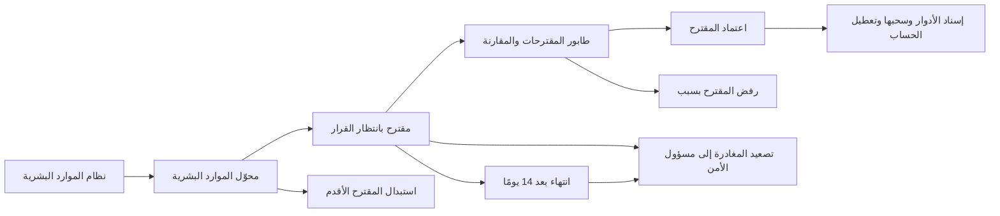
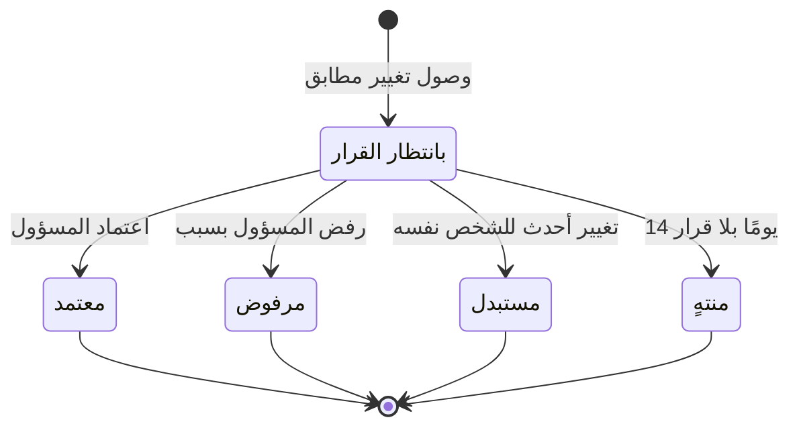

# مزامنة تغييرات الموارد البشرية

<!-- BEGIN GENERATED: doc -->
| البند | القيمة |
|---|---|
| المعرّف | FEAT-ORG-HR-SYNC |
| الإصدار | 0.1 |
| الحالة | مسودة |
| القدرة | CAP-01 إدارة المؤسسة والوصول |
| القدرة الفرعية | CAP-01.02 الهوية والمصادقة والاتحاد (R1) |
| الأدوار | مسؤول الإدارة؛ مسؤول الأمن؛ النظام |
| الشاشات | SCR-06 قوائم المراجعة |
| حالات الاستخدام | UC-084 |
| القصص | 9: 6 من المواصفة، و3 جديدة |
<!-- END GENERATED: doc -->

## 1. نظرة عامة

### 1.1 القيمة

يحوّل تغييرات الوظيفة أو الوحدة القادمة من نظام الموارد البشرية إلى مقترحات يعتمدها المسؤول أو يرفضها قبل أن تتغير صلاحيات أي شخص.

### 1.2 النطاق

| البند | القيمة |
|---|---|
| المستخدمون | مسؤول الإدارة ضمن الوحدات المتأثرة، ومسؤول الأمن للمتابعة والتصعيد، والنظام ومحوّل الموارد البشرية |
| الشاشات | SCR-06 قوائم المراجعة (طابور مقترحات الموارد البشرية في الإصدار الثاني) |
| حالات الاستخدام | إدارة وصول المستخدمين والاتحاد (UC-084) |
| المتطلبات | تغيير الدور أو الوحدة من الموارد البشرية يُقترح على المسؤول ولا يُطبَّق آليًا (REQ-INT-004) |
| داخل النطاق | إنشاء المقترح من تغيير وارد، واستبداله بتغيير أحدث، وانتهاؤه بعد 14 يومًا، واعتماده أو رفضه، وطابور المقترحات وشاشة المقارنة، وتصعيد المغادرة |
| خارج النطاق | تحديث بيانات الشخص من الموارد البشرية (ميزة «سجل الأشخاص»)، وتعطيل الحساب الفوري عبر مزوّد الهوية (ميزة «حسابات المستخدمين»)، وإسناد الأدوار يدويًا (ميزة «إسناد الأدوار للمستخدمين») |

> **ملاحظة:** الميزة كلها في الإصدار الثاني مع تكاملات المؤسسة (01-business/release-2-scope.md)، والقيمة R1 في جدول الوثيقة المولَّد تخالف ذلك **[Needs Review]**.

### 1.3 خريطة الميزة

**الشكل 1: خريطة مزامنة تغييرات الموارد البشرية**



**الشكل 2: رحلة مقترح مزامنة الموارد البشرية**



## 2. القواعد المشتركة

تنطبق على كل قصص الميزة، فلا تتكرر داخل القصص. وكل قصة تذكر ما يخصها فقط.

### 2.1 السياق المشترك

كل قصة تبدأ من ثلاثة شروط: مستأجر نشط، وحزمة السياسات الأساسية مفعّلة، ومستخدم مسجّل الدخول ومخوَّل. وتشير إليها القصص بخطوة واحدة: «بفرض السياق المشترك للميزة».

### 2.2 الصلاحية وعدم الإفصاح

- من لا يحق له رؤية العنصر يتلقى ردًا بشكل «غير متاح» تمامًا، فلا يعرف أنه موجود.
- من يرى العنصر ولا يحق له الإجراء يتلقى «لا تملك صلاحية هذا الإجراء».

### 2.3 أوامر تغيير الحالة

- **منع التكرار:** يُرسل كل أمر بمفتاح فريد، فإعادة الطلب نفسه لا تُنفَّذ مرتين.
- **حماية التعديل المتزامن:** يُرسل كل أمر بإصدار البيانات الذي يراه المستخدم. فإن عدّلها غيره في الأثناء، يُرفض الأمر.
- **السجل:** إن نجح الأمر، يُكتب حدثه وسجل التدقيق في المعاملة نفسها.

### 2.4 الرفض المشترك

```gherkin
# language: ar
خاصية: الرفض المشترك لأوامر الميزة

  سيناريو مخطط: رفض مشترك لكل أمر في الميزة
    بفرض السياق المشترك للميزة
    و <الحالة>
    عندما يُرسل المستخدم أي أمر من أوامر الميزة
    اذاً يُرفض برمز <الرمز> ويرى "<الرسالة>"
    و لا يتغير شيء

    امثلة:
      | الحالة                                  | الرمز                  | الرسالة                                                 |
      | العنصر خارج صلاحياته                    | NOT_FOUND              | غير متاح                                                |
      | العنصر مرئي له ولا يحق له الإجراء       | AUTHZ_DENIED           | لا تملك صلاحية هذا الإجراء                              |
      | غيره عدّل العنصر بعد أن فتحه            | VERSION_CONFLICT       | تغيّرت البيانات منذ فتحتها. راجع التغييرات ثم أعد المحاولة |
      | أعاد مفتاح منع التكرار بمحتوى مختلف     | IDEMPOTENCY_KEY_REUSED | طلب مكرر بمحتوى مختلف                                   |
      | البيانات ناقصة أو غير صحيحة             | VALIDATION_FAILED      | بعض البيانات ناقصة أو غير صحيحة. راجع الحقول المعلَّمة      |

  سيناريو: إعادة الطلب نفسه لا تُنفَّذ مرتين
    بفرض السياق المشترك للميزة
    و أمر نجح بمفتاح منع تكرار
    عندما يُعاد الطلب نفسه بالمفتاح نفسه
    اذاً تُعاد النتيجة الأولى ولا يُكتب حدث ثانٍ
```

### 2.5 قواعد المقترح

- لا يتغير دور أو وحدة أو صلاحية لأي شخص آليًا من نظام الموارد البشرية. كل تغيير يمر باعتماد المسؤول (REQ-INT-004).
- «معتمد» و«مرفوض» و«مستبدل» و«منتهٍ» حالات نهائية، فلا يُقبل على المقترح بعدها اعتماد ولا رفض.
- تعطيل الحساب من مزوّد الهوية يبقى فوريًا ومستقلًا عن المقترحات، ونافذًا خلال 5 دقائق (QAS-SEC-008).
- كل حدث للمقترح يصل إلى إسناد الأدوار وحسابات المستخدمين، وإلى إشعار مسؤول الأمن حين يكون التغيير مغادرة.

```gherkin
# language: ar
خاصية: رفض الاعتماد والرفض على مقترح في حالة نهائية

  سيناريو مخطط: المقترح في حالة نهائية لا يقبل قرارًا
    بفرض السياق المشترك للميزة
    و <الحالة>
    عندما يعتمد المسؤول المقترح أو يرفضه
    اذاً يُرفض برمز <الرمز> ويرى "<الرسالة>"
    و لا يتغير شيء

    امثلة:
      | الحالة                                       | الرمز                                     | الرسالة                                                    |
      | المقترح "منتهٍ" أو "مستبدل" منذ فتحه          | HR_SYNC_PROPOSAL_INVALID_STATE_TRANSITION | الوضع الحالي لمقترح مزامنة الموارد البشرية لا يسمح بهذا الإجراء |
```

> **ملاحظة:** إن تغيّر المقترح بعد أن فتحه المسؤول (اعتمده غيره أو انتهى أو استُبدل) فالرد تعارض الإصدار من الرفض المشترك (§2.4)، لا رمز الحالة.

## 3. الجودة وتعريف الاكتمال

### 3.1 متطلبات الجودة

<!-- BEGIN GENERATED: quality -->
لا متطلبات جودة مرتبطة بمتطلبات هذه الميزة مباشرة. تنطبق متطلبات المنصة العامة (`FEAT-PLT-*`).
<!-- END GENERATED: quality -->

### 3.2 تعريف الاكتمال

القصة مكتملة حين تتحقق الشروط الخمسة:

1. سيناريوهاتها والقواعد المشتركة تمر في الاختبار الآلي.
2. فحوص البنية المعمارية تمر.
3. نصوص الواجهة والرسائل موجودة بالعربية والإنجليزية.
4. مراجعة الكود مكتملة.
5. ما تضيفه القصة نفسها في قسم «القواعد» تحقق.

## 4. فهرس القصص

<!-- BEGIN GENERATED: story-index -->
| المعرّف | القصة | النوع | الحالة |
|---|---|---|---|
| `US-BC01-HRS-APPROVE` | اعتماد مقترح مزامنة الموارد البشرية | أمر | مسودة |
| `US-BC01-HRS-REJECT` | رفض مقترح مزامنة الموارد البشرية | أمر | مسودة |
| `US-BC01-Q-HRS-QUEUE` | جلب: Pending HR proposals by unit and change kind (leave first) | جلب | مسودة |
| `US-BC01-S-HR-SYNC-PROPOSAL-01` | تلقائي: HRIS change received (مقترح مزامنة الموارد البشرية) | نظام | مسودة |
| `US-BC01-S-HR-SYNC-PROPOSAL-02` | تلقائي: newer HR change for the same person (مقترح مزامنة الموارد البشرية) | نظام | مسودة |
| `US-BC01-S-HR-SYNC-PROPOSAL-03` | تلقائي: 14 days without decision (مقترح مزامنة الموارد البشرية) | نظام | مسودة |
| `US-UI-SCR06-HR-PROPOSALS` | مراجعة مقترحات الموارد البشرية بالمقارنة | واجهة | مسودة |
| `US-INT-HRIS-CHANGE-PROPOSALS` | تحويل تغييرات الموارد البشرية إلى مقترحات | تكامل | مسودة |
| `US-INT-HRIS-LEAVER-ESCALATION` | تصعيد مغادرة الموظف إلى المسؤول | تكامل | مسودة |
<!-- END GENERATED: story-index -->

## 5. القصص

### 5.1 US-BC01-HRS-APPROVE — اعتماد مقترح مزامنة الموارد البشرية

| النوع | الإصدار | الأولوية | دون اتصال | الحالة |
|---|---|---|---|---|
| أمر | R2 | Must | لا | مسودة |

> **كـ** مسؤول الإدارة، **أريد** أن أعتمد مقترح تغيير قادمًا من الموارد البشرية بعد مراجعته، **حتى** تتغير أدوار الشخص وفق وظيفته الجديدة بقرار بشري.

**باختصار:** يعتمد المسؤول مقترحًا «بانتظار القرار»، فتُطبَّق تغييراته على الأدوار، وللمغادرة يُعطَّل الحساب أيضًا، ويصير المقترح «معتمدًا».

#### القواعد

- **متى يُسمح:** المقترح «بانتظار القرار»، وكل تغيير فيه يستوفي شروط أمره: إسناد الدور أو سحبه، وتعطيل الحساب في المغادرة.
- **من يُسمح له:** مسؤول الإدارة الذي يشمل نطاقه كل الوحدات التي يمسها المقترح.
- **البيانات:** ملاحظة اختيارية.
- **الأثر:** تُطبَّق التغييرات المقترحة، كلٌّ بشروطه، ويصبح المقترح «معتمدًا». ويُسجَّل حدث «اعتُمد مقترح الموارد البشرية»، فيرتفع الإصدار الأمني للشخص وتُحدَّث صلاحياته. وإن رفض أحد الأوامر تطبيق تغيير، لا يُطبَّق شيء ويبقى المقترح كما هو **[Derived]**.

#### معايير القبول

```gherkin
# language: ar
خاصية: اعتماد مقترح الموارد البشرية

  سيناريو: المسؤول يعتمد مقترح نقل إلى وحدة أخرى
    بفرض السياق المشترك للميزة
    و مقترح "بانتظار القرار" بنقل موظف بين وحدتين في نطاق المسؤول، يسحب دوره القديم ويسند الجديد
    عندما يعتمده المسؤول مع ملاحظة
    اذاً يُسحب الإسناد القديم ويُنشأ الجديد وتصبح حالة المقترح "معتمد"
    و يُسجَّل حدث "اعتُمد مقترح الموارد البشرية" ويرتفع الإصدار الأمني للموظف

  سيناريو مخطط: رفض خاص باعتماد المقترح
    بفرض السياق المشترك للميزة
    و <الحالة>
    عندما يحاول المسؤول اعتماد المقترح
    اذاً يُرفض برمز <الرمز> ويرى "<الرسالة>"
    و لا يتغير شيء

    امثلة:
      | الحالة                                             | الرمز          | الرسالة                                                 |
      | الدور المقترح يتعارض مع دور نشط لدى الموظف          | OWNER_REJECTED | رُفض تطبيق التغيير لأن العنصر المستهدف لا يستوفي شروطه |
      | الوحدة المقترحة لم تعد نشطة                         | OWNER_REJECTED | رُفض تطبيق التغيير لأن العنصر المستهدف لا يستوفي شروطه |
```

<details><summary>المراجع التقنية والتتبع</summary>

<!-- BEGIN GENERATED: refs US-BC01-HRS-APPROVE -->
| البند | المعرّف | المعنى |
|---|---|---|
| الواجهة البرمجية | `POST /api/v1/foundation/hr-sync-proposals/{id}/actions/approve` | — |
| الأمر | `CMD-HRS-APPROVE` | اعتماد مقترح مزامنة الموارد البشرية |
| السياسة | `POL-HRS-APPROVE` | Administrator in scope؛ tenant match |
| الحدث | `EVT-HRS-APPROVED` | يصل إلى: Security-version service (EVT-SEC-VERSION-INCREMENTED); PEP decision caches; Projection security-ver… |
| الكيان | `AGG-HR-SYNC-PROPOSAL` | مقترح مزامنة الموارد البشرية |
| الجدول | `foundation.hr_sync_proposals` | الجدول الرئيسي لمقترح مزامنة الموارد البشرية |
| وحدة النشر | DU-02 | — |
| المتطلب | REQ-INT-004 | When HRIS reports a change of role or organization for a person, the system shall propose the corresponding r… |
| حالة الاستخدام | UC-084 | Manage User Access & Federation |
| الاختبار | TST-HR-SYNC-PROPOSAL-SM، TST-SLC16-INVARIANTS | دورة حالات مقترح مزامنة الموارد البشرية، وثوابت الشريحة SLC-16 |
<!-- END GENERATED: refs US-BC01-HRS-APPROVE -->

</details>

### 5.2 US-BC01-HRS-REJECT — رفض مقترح مزامنة الموارد البشرية

| النوع | الإصدار | الأولوية | دون اتصال | الحالة |
|---|---|---|---|---|
| أمر | R2 | Must | لا | مسودة |

> **كـ** مسؤول الإدارة، **أريد** أن أرفض مقترح تغيير لا أوافق عليه مع ذكر السبب، **حتى** لا تتغير صلاحيات أحد بتغيير خاطئ أو غير مكتمل.

**باختصار:** يرفض المسؤول مقترحًا «بانتظار القرار» بسبب مكتوب، فيصير «مرفوضًا» ولا يتغير أي دور.

#### القواعد

- **متى يُسمح:** المقترح «بانتظار القرار».
- **من يُسمح له:** مسؤول الإدارة الذي يشمل نطاقه الوحدات التي يمسها المقترح.
- **البيانات:** السبب، إلزامي.
- **الأثر:** يصبح المقترح «مرفوضًا» ولا يُطبَّق منه شيء. ويُسجَّل حدث «رُفض مقترح الموارد البشرية».

#### معايير القبول

```gherkin
# language: ar
خاصية: رفض مقترح الموارد البشرية

  سيناريو: المسؤول يرفض مقترحًا بسبب
    بفرض السياق المشترك للميزة
    و مقترح "بانتظار القرار" بتغيير منصب موظف في نطاق المسؤول
    عندما يرفضه مع ذكر السبب
    اذاً تصبح حالة المقترح "مرفوض" ولا يتغير أي دور للموظف
    و يُسجَّل حدث "رُفض مقترح الموارد البشرية"

  سيناريو مخطط: رفض خاص برفض المقترح
    بفرض السياق المشترك للميزة
    و <الحالة>
    عندما يحاول المسؤول رفض المقترح
    اذاً يُرفض برمز <الرمز> ويرى "<الرسالة>"
    و لا يتغير شيء

    امثلة:
      | الحالة          | الرمز           | الرسالة    |
      | لم يذكر السبب   | REASON_REQUIRED | اذكر السبب |
```

<details><summary>المراجع التقنية والتتبع</summary>

<!-- BEGIN GENERATED: refs US-BC01-HRS-REJECT -->
| البند | المعرّف | المعنى |
|---|---|---|
| الواجهة البرمجية | `POST /api/v1/foundation/hr-sync-proposals/{id}/actions/reject` | — |
| الأمر | `CMD-HRS-REJECT` | رفض مقترح مزامنة الموارد البشرية |
| السياسة | `POL-HRS-REJECT` | Administrator in scope؛ tenant match |
| الحدث | `EVT-HRS-REJECTED` | يصل إلى: Role assignments / users (BC01); Security Officer notification (leave) |
| الكيان | `AGG-HR-SYNC-PROPOSAL` | مقترح مزامنة الموارد البشرية |
| الجدول | `foundation.hr_sync_proposals` | الجدول الرئيسي لمقترح مزامنة الموارد البشرية |
| وحدة النشر | DU-02 | — |
| المتطلب | REQ-INT-004 | When HRIS reports a change of role or organization for a person, the system shall propose the corresponding r… |
| حالة الاستخدام | UC-084 | Manage User Access & Federation |
| الاختبار | TST-HR-SYNC-PROPOSAL-SM، TST-SLC16-INVARIANTS | دورة حالات مقترح مزامنة الموارد البشرية، وثوابت الشريحة SLC-16 |
<!-- END GENERATED: refs US-BC01-HRS-REJECT -->

</details>

### 5.3 US-BC01-Q-HRS-QUEUE — طابور مقترحات الموارد البشرية والمغادرة أولًا

| النوع | الإصدار | الأولوية | دون اتصال | الحالة |
|---|---|---|---|---|
| جلب | R2 | Must | لا | مسودة |

> **كـ** مسؤول الإدارة، **أريد** قائمة بالمقترحات التي تنتظر قراري مرتبة والمغادرة أولًا، **حتى** أبدأ بما يمس الوصول أكثر.

**باختصار:** تُعرض المقترحات «بانتظار القرار» مجمّعة بالوحدة ونوع التغيير، والمغادرة في أولها، صفحة بعد صفحة.

#### القواعد

- **من يرى ماذا:** مسؤول الإدارة يرى المقترحات التي تمس وحدات نطاقه، ومسؤول الأمن يراها للمتابعة. ولا يكشف أي عدد أو اقتراح وجود مقترح خارج النطاق.
- **البيانات:** المؤشر وحجم الصفحة. وأنواع التغيير أربعة: التحاق، ومغادرة، ونقل إلى وحدة، وتغيير منصب.
- يُعاد فحص صلاحية كل مقترح في النتيجة قبل عرضه.

#### معايير القبول

```gherkin
# language: ar
خاصية: طابور مقترحات الموارد البشرية

  سيناريو: المغادرة أولًا وداخل النطاق فقط
    بفرض السياق المشترك للميزة
    و مقترحات بانتظار القرار في نطاق المسؤول، منها مغادرة ونقل، وأخرى في وحدات خارجه
    عندما يفتح المسؤول الطابور
    اذاً تظهر مقترحات نطاقه فقط مجمّعة بالوحدة ونوع التغيير والمغادرة أولًا
    و لا يكشف أي عدد وجود مقترح خارج نطاقه

  سيناريو: الصفحة التالية
    بفرض السياق المشترك للميزة
    و المقترحات أكثر من صفحة
    عندما يطلب الصفحة التالية بالمؤشر
    اذاً تُعاد المقترحات التالية دون تكرار ولا فجوة
```

<details><summary>المراجع التقنية والتتبع</summary>

<!-- BEGIN GENERATED: refs US-BC01-Q-HRS-QUEUE -->
| البند | المعرّف | المعنى |
|---|---|---|
| الواجهة البرمجية | `GET /api/v1/foundation/hr-sync-proposals` | — |
| الاستعلام | `QRY-HRS-QUEUE` | Pending HR proposals by unit and change kind (leave first) |
| السياسة | `POL-HRS-QUEUE` | Administrator in scope, Security Officer |
| الكيان | `AGG-HR-SYNC-PROPOSAL` | مقترح مزامنة الموارد البشرية |
| الجدول | `foundation.hr_sync_proposals` | الجدول الرئيسي لمقترح مزامنة الموارد البشرية |
| وحدة النشر | DU-02 | — |
| المتطلب | REQ-INT-004 | When HRIS reports a change of role or organization for a person, the system shall propose the corresponding r… |
| حالة الاستخدام | UC-084 | Manage User Access & Federation |
| الاختبار | TST-HR-SYNC-PROPOSAL-SM، TST-SLC16-INVARIANTS | دورة حالات مقترح مزامنة الموارد البشرية، وثوابت الشريحة SLC-16 |
<!-- END GENERATED: refs US-BC01-Q-HRS-QUEUE -->

</details>

### 5.4 US-BC01-S-HR-SYNC-PROPOSAL-01 — إنشاء مقترح من تغيير وارد من الموارد البشرية

| النوع | الإصدار | الأولوية | دون اتصال | الحالة |
|---|---|---|---|---|
| نظام | R2 | Must | لا ينطبق | مسودة |

> **كـ** النظام، **أريد** أن أحوّل كل تغيير وظيفي وارد من الموارد البشرية إلى مقترح، **حتى** يقرر المسؤول بدل أن تتغير الصلاحيات آليًا.

**باختصار:** حين يصل تغيير لشخص مطابق برقمه الوظيفي، يُترجَم بجدول المقابلة في المستأجر إلى تغييرات أدوار مقترحة، ويُنشأ مقترح «بانتظار القرار».

#### القواعد

- **متى يحدث:** وصل تغيير من الموارد البشرية لشخص يطابقه شخص في المنصة برقمه الوظيفي، ونوع التغيير التحاق أو مغادرة أو نقل إلى وحدة أو تغيير منصب.
- **الأثر:** تُحسب التغييرات المقترحة من جدول المقابلة بين المناصب والأدوار في المستأجر، ويُنشأ المقترح «بانتظار القرار». ويُسجَّل حدث «اقتُرح تغيير من الموارد البشرية» وسجل تدقيق بهوية النظام. ولا يتغير أي دور (§2.5). والمغادرة تُبلَّغ إلى مسؤول الأمن (القصة 5.9).

#### معايير القبول

```gherkin
# language: ar
خاصية: إنشاء مقترح من تغيير الموارد البشرية

  سيناريو: تغيير منصب لشخص مطابق
    بفرض شخص في المنصة يطابقه رقم وظيفي في الموارد البشرية
    عندما يصل تغيير منصبه
    اذاً يُنشأ مقترح "بانتظار القرار" بالأدوار المقترحة من جدول المقابلة
    و يُسجَّل حدث "اقتُرح تغيير من الموارد البشرية" ولا يتغير أي دور

  سيناريو: تغيير بلا شخص مطابق لا يُنشئ مقترحًا
    بفرض تغيير وارد برقم وظيفي لا يطابق أي شخص في المنصة
    عندما يصل التغيير
    اذاً لا يُنشأ مقترح ولا يُسجَّل حدث
```

> **ملاحظة:** مصير التغيير الذي لا يطابق شخصًا غير محدد في المصادر، والمرجح حجره كأي سجل غير صالح في المحوّل **[Needs Review]**.

<details><summary>المراجع التقنية والتتبع</summary>

<!-- BEGIN GENERATED: refs US-BC01-S-HR-SYNC-PROPOSAL-01 -->
| البند | المعرّف | المعنى |
|---|---|---|
| المحفِّز | `SYS:HRIS change received` | person matched to a platform Person by HR identifier; change ∈ {join, leave, move_unit, change_position}; map… |
| الانتقال | ∅ ← PROPOSED | — |
| الحدث | `EVT-HRS-PROPOSED` | يصل إلى: Role assignments / users (BC01); Security Officer notification (leave) |
| الكيان | `AGG-HR-SYNC-PROPOSAL` | مقترح مزامنة الموارد البشرية |
| الجدول | `foundation.hr_sync_proposals` | الجدول الرئيسي لمقترح مزامنة الموارد البشرية |
| وحدة النشر | DU-02 | — |
| المتطلب | REQ-INT-004 | When HRIS reports a change of role or organization for a person, the system shall propose the corresponding r… |
| حالة الاستخدام | UC-084 | Manage User Access & Federation |
| الاختبار | TST-HR-SYNC-PROPOSAL-SM، TST-SLC16-INVARIANTS | دورة حالات مقترح مزامنة الموارد البشرية، وثوابت الشريحة SLC-16 |
<!-- END GENERATED: refs US-BC01-S-HR-SYNC-PROPOSAL-01 -->

</details>

### 5.5 US-BC01-S-HR-SYNC-PROPOSAL-02 — استبدال المقترح بتغيير أحدث للشخص نفسه

| النوع | الإصدار | الأولوية | دون اتصال | الحالة |
|---|---|---|---|---|
| نظام | R2 | Must | لا ينطبق | مسودة |

> **كـ** النظام، **أريد** أن أستبدل المقترح المعلّق حين يصل تغيير أحدث للشخص نفسه، **حتى** لا يعتمد المسؤول تغييرًا تجاوزه الواقع.

**باختصار:** إن وصل تغيير جديد لشخص له مقترح «بانتظار القرار»، يصير المقترح القديم «مستبدلًا»، ويُنشأ للتغيير الجديد مقترحه (القصة 5.4).

#### القواعد

- **متى يحدث:** للشخص مقترح «بانتظار القرار»، ووصل له تغيير أحدث من الموارد البشرية.
- **الأثر:** يصبح المقترح القديم «مستبدلًا» ولا يُطبَّق منه شيء. ويُسجَّل حدث «استُبدل مقترح الموارد البشرية» وسجل تدقيق بهوية النظام. ومن فتح المقترح القديم يتلقى تعارض الإصدار عند القرار (§2.5).

#### معايير القبول

```gherkin
# language: ar
خاصية: استبدال المقترح بتغيير أحدث

  سيناريو: تغيير جديد لشخص له مقترح معلّق
    بفرض مقترح "بانتظار القرار" بنقل موظف إلى وحدة
    عندما يصل تغيير أحدث للموظف نفسه
    اذاً تصبح حالة المقترح القديم "مستبدل"
    و يُسجَّل حدث "استُبدل مقترح الموارد البشرية" وسجل تدقيق بهوية النظام

  سيناريو: المقترح المحسوم لا يُستبدل
    بفرض مقترح "معتمد" لموظف
    عندما يصل تغيير أحدث للموظف نفسه
    اذاً تبقى حالة المقترح "معتمد" ولا يُسجَّل حدث استبدال
```

<details><summary>المراجع التقنية والتتبع</summary>

<!-- BEGIN GENERATED: refs US-BC01-S-HR-SYNC-PROPOSAL-02 -->
| البند | المعرّف | المعنى |
|---|---|---|
| المحفِّز | `SYS:newer HR change for the same person` | system |
| الانتقال | PROPOSED ← SUPERSEDED | — |
| الحدث | `EVT-HRS-SUPERSEDED` | يصل إلى: Role assignments / users (BC01); Security Officer notification (leave) |
| الكيان | `AGG-HR-SYNC-PROPOSAL` | مقترح مزامنة الموارد البشرية |
| الجدول | `foundation.hr_sync_proposals` | الجدول الرئيسي لمقترح مزامنة الموارد البشرية |
| وحدة النشر | DU-02 | — |
| المتطلب | REQ-INT-004 | When HRIS reports a change of role or organization for a person, the system shall propose the corresponding r… |
| حالة الاستخدام | UC-084 | Manage User Access & Federation |
| الاختبار | TST-HR-SYNC-PROPOSAL-SM، TST-SLC16-INVARIANTS | دورة حالات مقترح مزامنة الموارد البشرية، وثوابت الشريحة SLC-16 |
<!-- END GENERATED: refs US-BC01-S-HR-SYNC-PROPOSAL-02 -->

</details>

### 5.6 US-BC01-S-HR-SYNC-PROPOSAL-03 — انتهاء المقترح بعد 14 يومًا بلا قرار

| النوع | الإصدار | الأولوية | دون اتصال | الحالة |
|---|---|---|---|---|
| نظام | R2 | Must | لا ينطبق | مسودة |

> **كـ** النظام، **أريد** أن أنهي المقترح الذي مضى عليه 14 يومًا بلا قرار، **حتى** لا يبقى الطابور مليئًا بتغييرات قديمة، ولا تضيع مغادرة دون متابعة.

**باختصار:** يجعل المجدول المقترح «منتهيًا» بعد 14 يومًا بلا قرار، ويصعّد مقترح المغادرة إلى مسؤول الأمن.

#### القواعد

- **متى يحدث:** المقترح «بانتظار القرار» منذ 14 يومًا.
- **الأثر:** يصبح المقترح «منتهيًا» ولا يُطبَّق منه شيء. ويُسجَّل حدث «انتهى مقترح الموارد البشرية» وسجل تدقيق بهوية النظام. وإن كان مغادرة، يُصعَّد إلى مسؤول الأمن.

#### معايير القبول

```gherkin
# language: ar
خاصية: انتهاء المقترح بعد 14 يومًا

  سيناريو: مقترح مغادرة بلا قرار 14 يومًا
    بفرض مقترح مغادرة "بانتظار القرار" منذ 14 يومًا
    عندما يحين موعده لدى المجدول
    اذاً تصبح حالته "منتهٍ" ويُصعَّد إلى مسؤول الأمن
    و يُسجَّل حدث "انتهى مقترح الموارد البشرية" وسجل تدقيق بهوية النظام

  سيناريو: مقترح حُسم قبل 14 يومًا
    بفرض مقترح "مرفوض" بعد 3 أيام من إنشائه
    عندما يمر 14 يومًا على إنشائه
    اذاً تبقى حالته "مرفوض" ولا يُسجَّل أي حدث
```

<details><summary>المراجع التقنية والتتبع</summary>

<!-- BEGIN GENERATED: refs US-BC01-S-HR-SYNC-PROPOSAL-03 -->
| البند | المعرّف | المعنى |
|---|---|---|
| المحفِّز | `SYS:14 days without decision` | scheduler; escalated to Security Officer for leave events |
| الانتقال | PROPOSED ← EXPIRED | — |
| الحدث | `EVT-HRS-EXPIRED` | يصل إلى: Role assignments / users (BC01); Security Officer notification (leave) |
| الكيان | `AGG-HR-SYNC-PROPOSAL` | مقترح مزامنة الموارد البشرية |
| الجدول | `foundation.hr_sync_proposals` | الجدول الرئيسي لمقترح مزامنة الموارد البشرية |
| وحدة النشر | DU-02 | — |
| المتطلب | REQ-INT-004 | When HRIS reports a change of role or organization for a person, the system shall propose the corresponding r… |
| حالة الاستخدام | UC-084 | Manage User Access & Federation |
| الاختبار | TST-HR-SYNC-PROPOSAL-SM، TST-SLC16-INVARIANTS | دورة حالات مقترح مزامنة الموارد البشرية، وثوابت الشريحة SLC-16 |
<!-- END GENERATED: refs US-BC01-S-HR-SYNC-PROPOSAL-03 -->

</details>

### 5.7 US-UI-SCR06-HR-PROPOSALS — مراجعة مقترحات الموارد البشرية بالمقارنة

| النوع | الإصدار | الأولوية | دون اتصال | الحالة |
|---|---|---|---|---|
| واجهة | R2 | Must | لا | مسودة |

> **كـ** مسؤول الإدارة، **أريد** أن أرى في كل مقترح الأدوار الحالية بجانب المقترحة، **حتى** أقرر وأنا أعرف ما سيتغير بالضبط.

**باختصار:** في قوائم المراجعة يفتح المسؤول مقترحًا من طابور الموارد البشرية، فيرى مقارنة بين الوضع الحالي والمقترح، ثم يعتمد أو يرفض.

#### القواعد

- الطابور مرتب بالمغادرة أولًا (القصة 5.3)، ومقترح المغادرة مميز بعلامة ظاهرة **[Derived]**.
- المقارنة تعرض في عمودين: الوحدة والأدوار الحالية، والوحدة والأدوار المقترحة، مع تمييز ما يُضاف وما يُسحب، ومعها نوع التغيير وتاريخ وصوله **[Derived]**.
- «اعتماد» بملاحظة اختيارية، و«رفض» بحقل سبب إلزامي (21-ui-design.md §6.1).
- بعد القرار يخرج المقترح من الطابور. والطابور في الإصدار الثاني (21-ui-design.md §4.1).

#### معايير القبول

```gherkin
# language: ar
خاصية: مراجعة مقترحات الموارد البشرية بالمقارنة

  سيناريو: المسؤول يفتح مقترح نقل
    بفرض السياق المشترك للميزة
    و مقترح نقل "بانتظار القرار" في نطاق المسؤول
    عندما يفتحه من الطابور
    اذاً يرى الوحدة والأدوار الحالية بجانب المقترحة، والمضاف والمسحوب مميزين
    و يظهر زرا الاعتماد والرفض

  سيناريو مخطط: الخادم يرفض اعتمادًا من الشاشة
    بفرض السياق المشترك للميزة
    و <الحالة>
    عندما يعتمد المسؤول المقترح
    اذاً يرى "<الرسالة>" برمز <الرمز> ويبقى المقترح في الطابور
    و لا يتغير شيء

    امثلة:
      | الحالة                                 | الرمز          | الرسالة                                                 |
      | أحد التغييرات المقترحة لا يستوفي شروطه | OWNER_REJECTED | رُفض تطبيق التغيير لأن العنصر المستهدف لا يستوفي شروطه |
```

<details><summary>المراجع التقنية والتتبع</summary>

<!-- BEGIN GENERATED: refs US-UI-SCR06-HR-PROPOSALS -->
| البند | المعرّف | المعنى |
|---|---|---|
| الشاشة | SCR-06 | شاشة قوائم المراجعة |
| المصدر | `[Derived]` | — |
| المتطلب | REQ-INT-004 | When HRIS reports a change of role or organization for a person, the system shall propose the corresponding r… |
| حالة الاستخدام | UC-084 | Manage User Access & Federation |
<!-- END GENERATED: refs US-UI-SCR06-HR-PROPOSALS -->

</details>

### 5.8 US-INT-HRIS-CHANGE-PROPOSALS — تحويل تغييرات الموارد البشرية إلى مقترحات

| النوع | الإصدار | الأولوية | دون اتصال | الحالة |
|---|---|---|---|---|
| تكامل | R2 | Must | لا ينطبق | مسودة |

> **كـ** مهندس التكامل، **أريد** أن تصل تغييرات المناصب والوحدات من نظام الموارد البشرية إلى المنصة مقترحاتٍ، **حتى** يبقى الوصول مطابقًا للوظيفة دون تطبيق آلي.

**باختصار:** يسحب محوّل الموارد البشرية التغييرات منذ آخر نقطة مؤكدة، ويحوّل كل تغيير التحاق أو مغادرة أو نقل أو تغيير منصب إلى مقترح (القصة 5.4).

#### القواعد

- **متى يحدث:** عند كل سحب من نظام الموارد البشرية عبر اتصاله المسجل والمفعّل.
- **الرسالة المتبادلة:** الرقم الوظيفي للشخص، ونوع التغيير، والوحدة والمنصب. والبيانات الشخصية فيها تُحفظ مشفرة بمفتاح الشخص.
- **الأثر:** يُنشأ مقترح لكل تغيير مطابق، ولا يتغير أي دور (§2.5). والسجل غير الصالح يُحجر بسببه. ونقطة التقدم لا تتقدم إلا بعد تأكيد الدفعة، فانقطاع 4 ساعات لا يفقد شيئًا ويُعالج التراكم خلال ساعة (QAS-INT-001).
- تغيير مزوّر من الموارد البشرية لا يمنح وصولًا، لأنه مقترح يعتمده مسؤول ويمر بشروط كل أمر.

#### معايير القبول

```gherkin
# language: ar
خاصية: تحويل تغييرات الموارد البشرية إلى مقترحات

  سيناريو: دفعة فيها تغيير صالح وسجل غير صالح
    بفرض اتصال مفعّل بنظام الموارد البشرية ونقطة تقدم مؤكدة
    و في النظام تغيير منصب صالح وسجل ينقصه نوع التغيير
    عندما يسحب المحوّل التغييرات
    اذاً يُنشأ مقترح للتغيير الصالح ويُحجر السجل الآخر بسببه
    و تتقدم نقطة التقدم بعد تأكيد الدفعة ولا يتغير أي دور

  سيناريو: انقطاع الاتصال لا يُنشئ شيئًا ولا يفقد شيئًا
    بفرض اتصال بنظام الموارد البشرية منقطع
    عندما يحين موعد السحب
    اذاً لا يُنشأ مقترح ولا تتقدم نقطة التقدم
    و تُسحب التغييرات من آخر نقطة مؤكدة عند عودة الاتصال
```

<details><summary>المراجع التقنية والتتبع</summary>

<!-- BEGIN GENERATED: refs US-INT-HRIS-CHANGE-PROPOSALS -->
| البند | المعرّف | المعنى |
|---|---|---|
| المصدر | `20-integration-design.md §4` | — |
| المتطلب | REQ-INT-004 | When HRIS reports a change of role or organization for a person, the system shall propose the corresponding r… |
| حالة الاستخدام | UC-084 | Manage User Access & Federation |
<!-- END GENERATED: refs US-INT-HRIS-CHANGE-PROPOSALS -->

</details>

### 5.9 US-INT-HRIS-LEAVER-ESCALATION — تصعيد مغادرة الموظف إلى المسؤول

| النوع | الإصدار | الأولوية | دون اتصال | الحالة |
|---|---|---|---|---|
| تكامل | R2 | Should | لا ينطبق | مسودة |

> **كـ** مسؤول الأمن، **أريد** أن أُبلَّغ بكل مغادرة واردة من الموارد البشرية وبكل مغادرة لم يُحسم مقترحها، **حتى** لا يبقى وصول لمن غادر.

**باختصار:** مقترح المغادرة يُميَّز ويُبلَّغ به مسؤول الأمن عند إنشائه، ويُصعَّد إليه إن انتهى بلا قرار. وتعطيل الحساب من مزوّد الهوية يبقى المسار الفوري.

#### القواعد

- **متى يحدث:** عند إنشاء مقترح مغادرة (القصة 5.4)، وعند انتهائه بعد 14 يومًا بلا قرار (القصة 5.6).
- **الرسالة المتبادلة:** إشعار لمسؤول الأمن بالشخص ونوع التغيير ورابط المقترح **[Derived]**.
- **الأثر:** يصل الإشعار إلى مسؤولي الأمن في المستأجر، ويظهر المقترح أول الطابور. ولا يُعطَّل الحساب بالإشعار: يُعطَّل باعتماد المقترح، أو فورًا من مزوّد الهوية خلال 5 دقائق (QAS-SEC-008).

> **ملاحظة:** قناة التصعيد ومهلته قبل الأيام الأربعة عشر لا تذكرها المصادر **[Needs Review]**.

#### معايير القبول

```gherkin
# language: ar
خاصية: تصعيد مغادرة الموظف إلى مسؤول الأمن

  سيناريو: وصول مغادرة من الموارد البشرية
    بفرض موظف له حساب نشط وأدوار نشطة
    عندما يُنشأ مقترح مغادرته من تغيير وارد
    اذاً يُبلَّغ مسؤول الأمن بالمغادرة ويظهر المقترح أول الطابور مميزًا
    و تبقى أدوار الموظف كما هي حتى يُعتمد المقترح

  سيناريو: تغيير غير المغادرة لا يُصعَّد
    بفرض موظف له حساب نشط
    عندما يُنشأ مقترح بتغيير منصبه
    اذاً لا يصل إشعار إلى مسؤول الأمن
```

<details><summary>المراجع التقنية والتتبع</summary>

<!-- BEGIN GENERATED: refs US-INT-HRIS-LEAVER-ESCALATION -->
| البند | المعرّف | المعنى |
|---|---|---|
| المصدر | `20-integration-design.md §4` | — |
| المصدر | `[Derived]` | — |
<!-- END GENERATED: refs US-INT-HRIS-LEAVER-ESCALATION -->

</details>

## 6. التتبع

<!-- BEGIN GENERATED: trace -->
| المتطلب | المعنى | القصص | الاختبار |
|---|---|---|---|
| REQ-INT-004 | When HRIS reports a change of role or organization for a person, the system shall propose the corresponding r… | `US-BC01-HRS-APPROVE`، `US-BC01-HRS-REJECT`، `US-BC01-Q-HRS-QUEUE`، `US-BC01-S-HR-SYNC-PROPOSAL-01`، `US-BC01-S-HR-SYNC-PROPOSAL-02`، `US-BC01-S-HR-SYNC-PROPOSAL-03`، `US-INT-HRIS-CHANGE-PROPOSALS`، `US-UI-SCR06-HR-PROPOSALS` | TST-HR-SYNC-PROPOSAL-SM، TST-SLC16-INVARIANTS |
<!-- END GENERATED: trace -->

## 7. سجل التغييرات

| الإصدار | التاريخ | التغيير |
|---|---|---|
| 0.1 | — | هيكل مولَّد من خريطة الميزات |
| 0.2 | 2026-10-03 | كتابة القصص كاملة بمعيار القصص |
