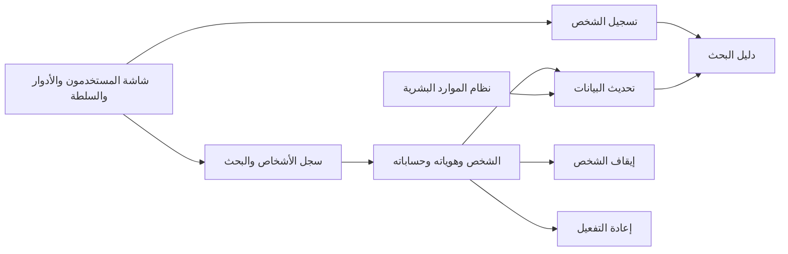
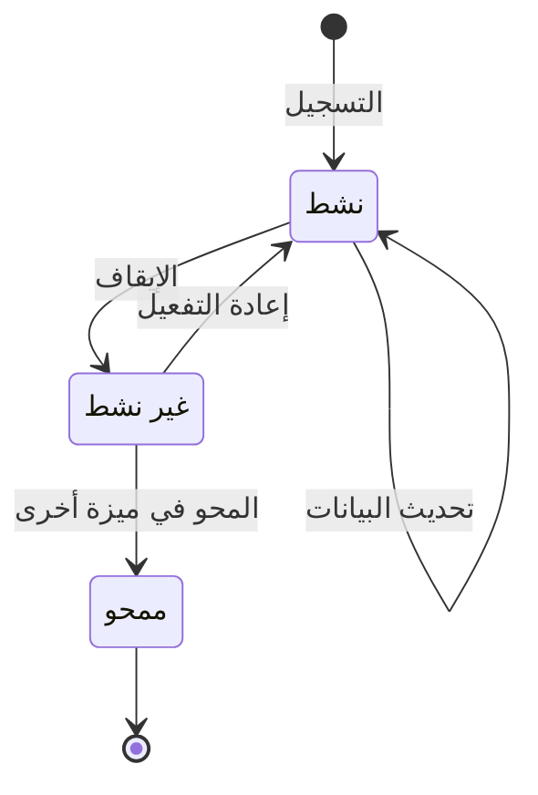

# سجل الأشخاص

<!-- BEGIN GENERATED: doc -->
| البند | القيمة |
|---|---|
| المعرّف | FEAT-ORG-PERSONS |
| الإصدار | 0.1 |
| الحالة | مسودة |
| القدرة | CAP-01 إدارة المؤسسة والوصول |
| القدرة الفرعية | CAP-01.02 الهوية والمصادقة والاتحاد (R1) |
| الأدوار | مسؤول الإدارة |
| الشاشات | SCR-62 المستخدمون والأدوار والسلطة |
| حالات الاستخدام | UC-084 |
| القصص | 7: 4 من المواصفة، و3 جديدة |
<!-- END GENERATED: doc -->

## 1. نظرة عامة

### 1.1 القيمة

يتيح للمسؤول تسجيل الأشخاص العاملين في المؤسسة وتحديث بياناتهم وإيقافهم أو إعادتهم بشكل مستقل عن حساباتهم.

### 1.2 النطاق

| البند | القيمة |
|---|---|
| المستخدمون | مسؤول الإدارة، ومحوّل نظام الموارد البشرية |
| الشاشات | SCR-62 المستخدمون والأدوار والسلطة |
| حالات الاستخدام | إدارة وصول المستخدمين والاتحاد (UC-084) |
| المتطلبات | الشخص والهوية وحساب المستخدم وحساب الخدمة سجلات منفصلة بروابط صريحة (REQ-FND-006) |
| داخل النطاق | تسجيل الشخص، وتحديث أسمائه ووسائل الاتصال به، وإيقافه وإعادة تفعيله، وعرض السجل والبحث فيه، وعرض روابط الشخص بهوياته وحساباته، وتحديث بياناته من نظام الموارد البشرية |
| خارج النطاق | محو الشخص تنفيذًا لأمر محو معتمد (ميزة «المحو»)، وحسابات المستخدمين والهويات (ميزة «حسابات المستخدمين»)، ومقترحات تغيير الأدوار من الموارد البشرية (ميزة «مزامنة تغييرات الموارد البشرية»). والشخص هنا سجل العامل في المنصة، لا كيان المعلومات من نوع شخص |

### 1.3 خريطة الميزة

**الشكل 1: خريطة سجل الأشخاص**



**الشكل 2: رحلة الشخص**



## 2. القواعد المشتركة

تنطبق على كل قصص الميزة، فلا تتكرر داخل القصص. وكل قصة تذكر ما يخصها فقط.

### 2.1 السياق المشترك

كل قصة تبدأ من ثلاثة شروط: مستأجر نشط، وحزمة السياسات الأساسية مفعّلة، ومستخدم مسجّل الدخول ومخوَّل. وتشير إليها القصص بخطوة واحدة: «بفرض السياق المشترك للميزة».

### 2.2 الصلاحية وعدم الإفصاح

- من لا يحق له رؤية العنصر يتلقى ردًا بشكل «غير متاح» تمامًا، فلا يعرف أنه موجود.
- من يرى العنصر ولا يحق له الإجراء يتلقى «لا تملك صلاحية هذا الإجراء».

### 2.3 أوامر تغيير الحالة

- **منع التكرار:** يُرسل كل أمر بمفتاح فريد، فإعادة الطلب نفسه لا تُنفَّذ مرتين.
- **حماية التعديل المتزامن:** يُرسل كل أمر بإصدار البيانات الذي يراه المستخدم. فإن عدّلها غيره في الأثناء، يُرفض الأمر.
- **السجل:** إن نجح الأمر، يُكتب حدثه وسجل التدقيق في المعاملة نفسها.

### 2.4 الرفض المشترك

```gherkin
# language: ar
خاصية: الرفض المشترك لأوامر الميزة

  سيناريو مخطط: رفض مشترك لكل أمر في الميزة
    بفرض السياق المشترك للميزة
    و <الحالة>
    عندما يُرسل المستخدم أي أمر من أوامر الميزة
    اذاً يُرفض برمز <الرمز> ويرى "<الرسالة>"
    و لا يتغير شيء

    امثلة:
      | الحالة                                  | الرمز                  | الرسالة                                                 |
      | العنصر خارج صلاحياته                    | NOT_FOUND              | غير متاح                                                |
      | العنصر مرئي له ولا يحق له الإجراء       | AUTHZ_DENIED           | لا تملك صلاحية هذا الإجراء                              |
      | غيره عدّل العنصر بعد أن فتحه            | VERSION_CONFLICT       | تغيّرت البيانات منذ فتحتها. راجع التغييرات ثم أعد المحاولة |
      | أعاد مفتاح منع التكرار بمحتوى مختلف     | IDEMPOTENCY_KEY_REUSED | طلب مكرر بمحتوى مختلف                                   |
      | البيانات ناقصة أو غير صحيحة             | VALIDATION_FAILED      | بعض البيانات ناقصة أو غير صحيحة. راجع الحقول المعلَّمة      |

  سيناريو: إعادة الطلب نفسه لا تُنفَّذ مرتين
    بفرض السياق المشترك للميزة
    و أمر نجح بمفتاح منع تكرار
    عندما يُعاد الطلب نفسه بالمفتاح نفسه
    اذاً تُعاد النتيجة الأولى ولا يُكتب حدث ثانٍ
```

### 2.5 الشخص الممحو والبيانات الشخصية

- أسماء الشخص ورقمه الوظيفي ووسائل الاتصال به بيانات شخصية تُعلَّم بذلك وتُشفَّر بمفتاح خاص بالشخص، فيُتلَف المفتاح عند المحو.
- «ممحو» حالة نهائية، فلا يُقبل على الشخص بعدها أي أمر من أوامر الميزة.
- كل حدث تسجّله أوامر الميزة يصل إلى دليل البحث في المنصة.

```gherkin
# language: ar
خاصية: رفض أوامر الميزة على الشخص الممحو

  سيناريو مخطط: الشخص الممحو لا يقبل أي أمر
    بفرض السياق المشترك للميزة
    و <الحالة>
    عندما يُرسل المسؤول أي أمر من أوامر الميزة على هذا الشخص
    اذاً يُرفض برمز <الرمز> ويرى "<الرسالة>"
    و لا يتغير شيء

    امثلة:
      | الحالة                        | الرمز                           | الرسالة                              |
      | الشخص "ممحو" منذ فتح صفحته    | PERSON_INVALID_STATE_TRANSITION | الوضع الحالي للشخص لا يسمح بهذا الإجراء |
```

> **ملاحظة:** الأوامر يملكها «مسؤول الإدارة الذي يشمل نطاقه وحدة الشخص»، لكن سجل الشخص لا يحمل وحدة في النموذج المنطقي، فكيف يُحسب النطاق غير محدد **[Needs Review]**.

## 3. الجودة وتعريف الاكتمال

### 3.1 متطلبات الجودة

<!-- BEGIN GENERATED: quality -->
لا متطلبات جودة مرتبطة بمتطلبات هذه الميزة مباشرة. تنطبق متطلبات المنصة العامة (`FEAT-PLT-*`).
<!-- END GENERATED: quality -->

### 3.2 تعريف الاكتمال

القصة مكتملة حين تتحقق الشروط الخمسة:

1. سيناريوهاتها والقواعد المشتركة تمر في الاختبار الآلي.
2. فحوص البنية المعمارية تمر.
3. نصوص الواجهة والرسائل موجودة بالعربية والإنجليزية.
4. مراجعة الكود مكتملة.
5. ما تضيفه القصة نفسها في قسم «القواعد» تحقق.

## 4. فهرس القصص

<!-- BEGIN GENERATED: story-index -->
| المعرّف | القصة | النوع | الحالة |
|---|---|---|---|
| `US-BC01-PER-DEACTIVATE` | إيقاف تفعيل الشخص | أمر | مسودة |
| `US-BC01-PER-REACTIVATE` | إعادة تفعيل الشخص | أمر | مسودة |
| `US-BC01-PER-REGISTER` | تسجيل الشخص | أمر | مسودة |
| `US-BC01-PER-UPDATE-DETAILS` | تحديث بيانات الشخص | أمر | مسودة |
| `US-DOM-PER-LIST` | عرض سجل الأشخاص والبحث فيه | جلب | مسودة |
| `US-UI-SCR62-PERSON-LINKS` | عرض الشخص وهوياته وحساباته المرتبطة | واجهة | مسودة |
| `US-INT-HRIS-PERSON-UPDATE` | تحديث بيانات الأشخاص من الموارد البشرية | تكامل | مسودة |
<!-- END GENERATED: story-index -->

## 5. القصص

### 5.1 US-BC01-PER-DEACTIVATE — إيقاف تفعيل الشخص

| النوع | الإصدار | الأولوية | دون اتصال | الحالة |
|---|---|---|---|---|
| أمر | R1 | Must | لا | مسودة |

> **كـ** مسؤول الإدارة، **أريد** أن أوقف شخصًا لم يعد يعمل أو انقطع عمله مؤقتًا مع ذكر السبب، **حتى** يظهر سجله موقوفًا دون أن يضيع.

**باختصار:** يوقف المسؤول شخصًا «نشطًا» بسبب مكتوب، فيصير «غير نشط» ويبقى سجله قابلًا لإعادة التفعيل.

#### القواعد

- **متى يُسمح:** الشخص «نشط».
- **من يُسمح له:** مسؤول الإدارة ضمن نطاقه (§2.5).
- **البيانات:** السبب، إلزامي.
- **الأثر:** يصبح الشخص «غير نشط»، ويُسجَّل حدث «أُوقف الشخص». والشخص «غير النشط» وحده يقبل المحو لاحقًا (ميزة «المحو»).

> **ملاحظة:** المصادر لا تذكر أثر إيقاف الشخص على حساب المستخدم المرتبط به، وتعطيل الحساب أمر مستقل في ميزة «حسابات المستخدمين» **[Needs Review]**.

#### معايير القبول

```gherkin
# language: ar
خاصية: إيقاف الشخص

  سيناريو: المسؤول يوقف شخصًا نشطًا
    بفرض السياق المشترك للميزة
    و شخص "نشط" ضمن نطاق المسؤول
    عندما يوقفه مع ذكر السبب
    اذاً تصبح حالته "غير نشط"
    و يُسجَّل حدث "أُوقف الشخص"

  سيناريو مخطط: رفض خاص بإيقاف الشخص
    بفرض السياق المشترك للميزة
    و <الحالة>
    عندما يحاول المسؤول إيقاف الشخص
    اذاً يُرفض برمز <الرمز> ويرى "<الرسالة>"
    و لا يتغير شيء

    امثلة:
      | الحالة                          | الرمز                           | الرسالة                              |
      | لم يذكر السبب                   | VALIDATION_FAILED               | السبب مطلوب                          |
      | الشخص "غير نشط" منذ فتح صفحته  | PERSON_INVALID_STATE_TRANSITION | الوضع الحالي للشخص لا يسمح بهذا الإجراء |
```

<details><summary>المراجع التقنية والتتبع</summary>

<!-- BEGIN GENERATED: refs US-BC01-PER-DEACTIVATE -->
| البند | المعرّف | المعنى |
|---|---|---|
| الواجهة البرمجية | `POST /api/v1/foundation/persons/{id}/actions/deactivate` | — |
| الأمر | `CMD-PER-DEACTIVATE` | إيقاف تفعيل الشخص |
| السياسة | `POL-PER-DEACTIVATE` | Administrator with org scope ⊇ person's unit؛ tenant match; subject ACTIVE; tenant ACTIVE (except TEN operati… |
| الحدث | `EVT-PER-DEACTIVATED` | يصل إلى: Search/Directory projection (BC01 read model) |
| الكيان | `AGG-PERSON` | الشخص |
| الجدول | `foundation.persons` | الجدول الرئيسي للشخص |
| وحدة النشر | DU-02 | — |
| المتطلب | REQ-FND-006 | The system shall maintain Person, Identity, User and Service Account as separate records with explicit links. |
| حالة الاستخدام | UC-084 | Manage User Access & Federation |
| الاختبار | TST-PERSON-SM، TST-SLC01-INVARIANTS | دورة حالات الشخص، وثوابت الشريحة SLC-01 |
<!-- END GENERATED: refs US-BC01-PER-DEACTIVATE -->

</details>

### 5.2 US-BC01-PER-REACTIVATE — إعادة تفعيل الشخص

| النوع | الإصدار | الأولوية | دون اتصال | الحالة |
|---|---|---|---|---|
| أمر | R1 | Must | لا | مسودة |

> **كـ** مسؤول الإدارة، **أريد** أن أعيد تفعيل شخص موقوف عاد إلى العمل، **حتى** يُستأنف استخدام سجله نفسه دون تسجيل جديد.

**باختصار:** يعيد المسؤول شخصًا «غير نشط» إلى «نشط» دون أي بيانات إضافية.

#### القواعد

- **متى يُسمح:** الشخص «غير نشط».
- **من يُسمح له:** مسؤول الإدارة ضمن نطاقه (§2.5).
- **البيانات:** لا بيانات.
- **الأثر:** يصبح الشخص «نشطًا» ببياناته السابقة، ويُسجَّل حدث «أُعيد تفعيل الشخص».

#### معايير القبول

```gherkin
# language: ar
خاصية: إعادة تفعيل الشخص

  سيناريو: المسؤول يعيد تفعيل شخص موقوف
    بفرض السياق المشترك للميزة
    و شخص "غير نشط" ضمن نطاق المسؤول
    عندما يعيد تفعيله
    اذاً تصبح حالته "نشط" ببياناته السابقة
    و يُسجَّل حدث "أُعيد تفعيل الشخص"

  سيناريو مخطط: رفض خاص بإعادة تفعيل الشخص
    بفرض السياق المشترك للميزة
    و <الحالة>
    عندما يحاول المسؤول إعادة تفعيل الشخص
    اذاً يُرفض برمز <الرمز> ويرى "<الرسالة>"
    و لا يتغير شيء

    امثلة:
      | الحالة                       | الرمز                           | الرسالة                              |
      | الشخص "نشط" منذ فتح صفحته   | PERSON_INVALID_STATE_TRANSITION | الوضع الحالي للشخص لا يسمح بهذا الإجراء |
```

<details><summary>المراجع التقنية والتتبع</summary>

<!-- BEGIN GENERATED: refs US-BC01-PER-REACTIVATE -->
| البند | المعرّف | المعنى |
|---|---|---|
| الواجهة البرمجية | `POST /api/v1/foundation/persons/{id}/actions/reactivate` | — |
| الأمر | `CMD-PER-REACTIVATE` | إعادة تفعيل الشخص |
| السياسة | `POL-PER-REACTIVATE` | Administrator with org scope ⊇ person's unit؛ tenant match; subject ACTIVE; tenant ACTIVE (except TEN operati… |
| الحدث | `EVT-PER-REACTIVATED` | يصل إلى: Search/Directory projection (BC01 read model) |
| الكيان | `AGG-PERSON` | الشخص |
| الجدول | `foundation.persons` | الجدول الرئيسي للشخص |
| وحدة النشر | DU-02 | — |
| المتطلب | REQ-FND-006 | The system shall maintain Person, Identity, User and Service Account as separate records with explicit links. |
| حالة الاستخدام | UC-084 | Manage User Access & Federation |
| الاختبار | TST-PERSON-SM، TST-SLC01-INVARIANTS | دورة حالات الشخص، وثوابت الشريحة SLC-01 |
<!-- END GENERATED: refs US-BC01-PER-REACTIVATE -->

</details>

### 5.3 US-BC01-PER-REGISTER — تسجيل الشخص

| النوع | الإصدار | الأولوية | دون اتصال | الحالة |
|---|---|---|---|---|
| أمر | R1 | Must | لا | مسودة |

> **كـ** مسؤول الإدارة، **أريد** أن أسجّل شخصًا يعمل في المؤسسة، **حتى** يُبنى عليه حسابه وأدواره لاحقًا دون تكرار.

**باختصار:** يُدخل المسؤول أسماء الشخص، ورقمه الوظيفي ووسائل الاتصال إن وُجدت، فيُنشأ سجل شخص «نشط» مستقل عن أي حساب.

#### القواعد

- **متى يُسمح:** لا يوجد في المستأجر شخص بالرقم الوظيفي نفسه، إن أُدخل رقم.
- **من يُسمح له:** مسؤول الإدارة ضمن نطاقه (§2.5).
- **البيانات:** الأسماء إلزامية، بالعربية والإنجليزية كما يحدد نموذج اللغة. والرقم الوظيفي ووسائل الاتصال اختيارية.
- **الأثر:** يُنشأ الشخص بحالة «نشط»، ويُسجَّل حدث «سُجِّل الشخص». ولا يُنشأ له حساب مستخدم: الحساب سجل منفصل يُربط به لاحقًا (REQ-FND-006).

#### معايير القبول

```gherkin
# language: ar
خاصية: تسجيل الشخص

  سيناريو: المسؤول يسجّل شخصًا برقم وظيفي جديد
    بفرض السياق المشترك للميزة
    و لا يوجد شخص بالرقم الوظيفي المدخل
    عندما يسجّل المسؤول الشخص بأسمائه ورقمه الوظيفي
    اذاً يُنشأ سجل شخص حالته "نشط" بلا حساب مرتبط
    و يُسجَّل حدث "سُجِّل الشخص"

  سيناريو مخطط: رفض خاص بتسجيل الشخص
    بفرض السياق المشترك للميزة
    و <الحالة>
    عندما يحاول المسؤول تسجيل الشخص
    اذاً يُرفض برمز <الرمز> ويرى "<الرسالة>"
    و لا يتغير شيء

    امثلة:
      | الحالة                                  | الرمز             | الرسالة                                |
      | يوجد شخص مسجّل بالرقم الوظيفي نفسه       | PERSON_DUPLICATE  | يوجد شخص مسجّل بالرقم الوظيفي نفسه     |
      | لم يُدخل أي اسم                          | VALIDATION_FAILED | الاسم مطلوب                            |
```

<details><summary>المراجع التقنية والتتبع</summary>

<!-- BEGIN GENERATED: refs US-BC01-PER-REGISTER -->
| البند | المعرّف | المعنى |
|---|---|---|
| الواجهة البرمجية | `POST /api/v1/foundation/persons` | — |
| الأمر | `CMD-PER-REGISTER` | تسجيل الشخص |
| السياسة | `POL-PER-REGISTER` | Administrator with org scope ⊇ person's unit؛ tenant match; subject ACTIVE; tenant ACTIVE (except TEN operati… |
| الحدث | `EVT-PER-REGISTERED` | يصل إلى: Search/Directory projection (BC01 read model) |
| الكيان | `AGG-PERSON` | الشخص |
| الجدول | `foundation.persons` | الجدول الرئيسي للشخص |
| وحدة النشر | DU-02 | — |
| المتطلب | REQ-FND-006 | The system shall maintain Person, Identity, User and Service Account as separate records with explicit links. |
| حالة الاستخدام | UC-084 | Manage User Access & Federation |
| الاختبار | TST-PERSON-SM، TST-SLC01-INVARIANTS | دورة حالات الشخص، وثوابت الشريحة SLC-01 |
<!-- END GENERATED: refs US-BC01-PER-REGISTER -->

</details>

### 5.4 US-BC01-PER-UPDATE-DETAILS — تحديث بيانات الشخص

| النوع | الإصدار | الأولوية | دون اتصال | الحالة |
|---|---|---|---|---|
| أمر | R1 | Must | لا | مسودة |

> **كـ** مسؤول الإدارة، **أريد** أن أصحح أسماء الشخص ووسائل الاتصال به، **حتى** تبقى بياناته صحيحة في كل المنصة.

**باختصار:** يعدّل المسؤول أسماء شخص «نشط» أو وسائل الاتصال به، فتُحفظ بإصدار جديد دون تغيير حالته.

#### القواعد

- **متى يُسمح:** الشخص «نشط».
- **من يُسمح له:** مسؤول الإدارة ضمن نطاقه (§2.5).
- **البيانات:** الأسماء ووسائل الاتصال، وكلاهما اختياري. والرقم الوظيفي لا يُعدَّل بهذا الأمر.
- **الأثر:** تبقى الحالة «نشط» ويرتفع إصدار السجل، ويُحفظ الإصدار السابق في السجل التاريخي. ويُسجَّل حدث «حُدِّثت بيانات الشخص».

#### معايير القبول

```gherkin
# language: ar
خاصية: تحديث بيانات الشخص

  سيناريو: المسؤول يصحح اسم شخص نشط
    بفرض السياق المشترك للميزة
    و شخص "نشط" ضمن نطاق المسؤول
    عندما يصحح اسمه بالإنجليزية
    اذاً يُحفظ الاسم الجديد وتبقى الحالة "نشط" ويرتفع الإصدار
    و يُسجَّل حدث "حُدِّثت بيانات الشخص"

  سيناريو مخطط: رفض خاص بتحديث بيانات الشخص
    بفرض السياق المشترك للميزة
    و <الحالة>
    عندما يحاول المسؤول تحديث بيانات الشخص
    اذاً يُرفض برمز <الرمز> ويرى "<الرسالة>"
    و لا يتغير شيء

    امثلة:
      | الحالة                          | الرمز                           | الرسالة                              |
      | الشخص "غير نشط" منذ فتح صفحته  | PERSON_INVALID_STATE_TRANSITION | الوضع الحالي للشخص لا يسمح بهذا الإجراء |
```

<details><summary>المراجع التقنية والتتبع</summary>

<!-- BEGIN GENERATED: refs US-BC01-PER-UPDATE-DETAILS -->
| البند | المعرّف | المعنى |
|---|---|---|
| الواجهة البرمجية | `POST /api/v1/foundation/persons/{id}/actions/update-details` | — |
| الأمر | `CMD-PER-UPDATE-DETAILS` | تحديث بيانات الشخص |
| السياسة | `POL-PER-UPDATE-DETAILS` | Administrator with org scope ⊇ person's unit؛ tenant match; subject ACTIVE; tenant ACTIVE (except TEN operati… |
| الحدث | `EVT-PER-DETAILS-UPDATED` | يصل إلى: Search/Directory projection (BC01 read model) |
| الكيان | `AGG-PERSON` | الشخص |
| الجدول | `foundation.persons` | الجدول الرئيسي للشخص |
| وحدة النشر | DU-02 | — |
| المتطلب | REQ-FND-006 | The system shall maintain Person, Identity, User and Service Account as separate records with explicit links. |
| حالة الاستخدام | UC-084 | Manage User Access & Federation |
| الاختبار | TST-PERSON-SM، TST-SLC01-INVARIANTS | دورة حالات الشخص، وثوابت الشريحة SLC-01 |
<!-- END GENERATED: refs US-BC01-PER-UPDATE-DETAILS -->

</details>

### 5.5 US-DOM-PER-LIST — عرض سجل الأشخاص والبحث فيه

| النوع | الإصدار | الأولوية | دون اتصال | الحالة |
|---|---|---|---|---|
| جلب | R1 | Must | لا | مسودة |

> **كـ** مسؤول الإدارة، **أريد** أن أتصفح سجل الأشخاص وأبحث فيه، **حتى** أجد الشخص قبل أن أسجّله مرة ثانية أو أعدّل بياناته.

**باختصار:** تُعرض قائمة الأشخاص الذين يقعون في نطاق المسؤول، صفحة بعد صفحة، مع البحث بالاسم أو الرقم الوظيفي والتصفية بالحالة.

#### القواعد

- **من يرى ماذا:** مسؤول الإدارة يرى الأشخاص في نطاقه فقط، ولا يكشف أي عدد أو اقتراح وجود شخص خارجه **[Derived]**.
- **البيانات:** الاسم، والرقم الوظيفي، والحالة («نشط» أو «غير نشط»)، والمؤشر وحجم الصفحة **[Derived]**. والممحو لا يظهر **[Derived]**.
- القائمة بالمؤشر، ولا عدد إجمالي إلا ما يُحسب من المرئي (21-ui-design.md §6.1).

> **ملاحظة:** لا استعلام لقائمة الأشخاص في المواصفة، والقصة كلها **[Derived]** وتحتاج إضافته (00-open-questions.md §5).

#### معايير القبول

```gherkin
# language: ar
خاصية: عرض سجل الأشخاص والبحث فيه

  سيناريو: المسؤول يبحث برقم وظيفي
    بفرض السياق المشترك للميزة
    و أشخاص في نطاق المسؤول وآخرون خارجه
    عندما يبحث برقم وظيفي لشخص داخل نطاقه
    اذاً يظهر ذلك الشخص باسمه وحالته
    و لا تكشف القائمة ولا عددها أي شخص خارج نطاقه

  سيناريو: الصفحة التالية
    بفرض السياق المشترك للميزة
    و الأشخاص في نطاقه أكثر من صفحة
    عندما يطلب الصفحة التالية
    اذاً تُعرض الأسماء التالية دون تكرار ولا فجوة
```

<details><summary>المراجع التقنية والتتبع</summary>

<!-- BEGIN GENERATED: refs US-DOM-PER-LIST -->
| البند | المعرّف | المعنى |
|---|---|---|
| حالة الاستخدام | UC-084 | Manage User Access & Federation |
| الشاشة | SCR-62 | شاشة المستخدمون والأدوار والسلطة |
| المصدر | `[Derived]` | — |
| المتطلب | REQ-FND-006 | The system shall maintain Person, Identity, User and Service Account as separate records with explicit links. |
| حالة الاستخدام | UC-084 | Manage User Access & Federation |
<!-- END GENERATED: refs US-DOM-PER-LIST -->

</details>

### 5.6 US-UI-SCR62-PERSON-LINKS — عرض الشخص وهوياته وحساباته المرتبطة

| النوع | الإصدار | الأولوية | دون اتصال | الحالة |
|---|---|---|---|---|
| واجهة | R1 | Must | لا | مسودة |

> **كـ** مسؤول الإدارة، **أريد** أن أرى في صفحة الشخص حسابه وهوياته المرتبطة، **حتى** أعرف كيف يدخل المنصة دون خلط بين السجلات.

**باختصار:** صفحة الشخص في شاشة «المستخدمون والأدوار والسلطة» تعرض بياناته وحالته، ثم حساب المستخدم المرتبط به إن وُجد، وهويات ذلك الحساب، وحسابات الخدمة التي يملكها.

#### القواعد

- للشخص حساب مستخدم واحد على الأكثر، وللحساب هويات من مزوّد الهوية قد تتعدد. وكل منها يظهر سجلًا مستقلًا برابط إلى صفحته (REQ-FND-006).
- حسابات الخدمة تُعرض تحت الحساب الذي يملكها، لأنها لا ترتبط بشخص **[Derived]**.
- الشخص بلا حساب تظهر صفحته بعبارة «لا حساب مرتبط» **[Derived]**.
- ما لا يحق للمسؤول رؤيته يظهر «غير متاح» دون تفصيل (21-ui-design.md §3).
- أفعال التحديث والإيقاف وإعادة التفعيل تظهر حسب حالة الشخص المعروضة: الأولان للنشط، والثالث لغير النشط **[Derived]**.

#### معايير القبول

```gherkin
# language: ar
خاصية: الشخص وهوياته وحساباته

  سيناريو: شخص بحساب وهويتين
    بفرض السياق المشترك للميزة
    و شخص "نشط" له حساب مستخدم مرتبط بهويتين
    عندما يفتح المسؤول صفحته
    اذاً يرى الحساب والهويتين سجلات منفصلة بروابطها
    و يظهر زرا التحديث والإيقاف دون زر إعادة التفعيل

  سيناريو مخطط: الخادم يرفض فعلًا ظاهرًا
    بفرض السياق المشترك للميزة
    و <الحالة>
    عندما ينفّذ المسؤول الفعل
    اذاً يرى "<الرسالة>" برمز <الرمز>
    و لا يتغير شيء

    امثلة:
      | الحالة                                 | الرمز                           | الرسالة                              |
      | الشخص "غير نشط" وزر التحديث ظاهر خطأً  | PERSON_INVALID_STATE_TRANSITION | الوضع الحالي للشخص لا يسمح بهذا الإجراء |
```

<details><summary>المراجع التقنية والتتبع</summary>

<!-- BEGIN GENERATED: refs US-UI-SCR62-PERSON-LINKS -->
| البند | المعرّف | المعنى |
|---|---|---|
| الشاشة | SCR-62 | شاشة المستخدمون والأدوار والسلطة |
| المصدر | `[Derived]` | — |
| المتطلب | REQ-FND-006 | The system shall maintain Person, Identity, User and Service Account as separate records with explicit links. |
| حالة الاستخدام | UC-084 | Manage User Access & Federation |
<!-- END GENERATED: refs US-UI-SCR62-PERSON-LINKS -->

</details>

### 5.7 US-INT-HRIS-PERSON-UPDATE — تحديث بيانات الأشخاص من الموارد البشرية

| النوع | الإصدار | الأولوية | دون اتصال | الحالة |
|---|---|---|---|---|
| تكامل | R2 | Should | لا ينطبق | مسودة |

> **كـ** مهندس التكامل، **أريد** أن تُحدَّث بيانات الأشخاص من نظام الموارد البشرية، **حتى** لا يُعاد إدخالها يدويًا وتبقى مطابقة لمصدرها.

**باختصار:** يسحب محوّل الموارد البشرية التغييرات منذ آخر نقطة مؤكدة، ويطابق كل شخص برقمه الوظيفي، ويحدّث سجله في المنصة. وتغييرات الأدوار والوحدات لا تطبَّق هنا، بل تصير مقترحات.

#### القواعد

- **متى يحدث:** عند كل سحب من نظام الموارد البشرية عبر اتصاله المسجل.
- **الرسالة المتبادلة:** الرقم الوظيفي للشخص، وأسماؤه، ووسائل الاتصال به **[Derived]**.
- **الأثر:** يُحدَّث الشخص المطابق برقمه الوظيفي بالقواعد نفسها لتحديث البيانات (القصة 5.4). والسجل غير الصالح أو الذي لا يطابق شخصًا يُحجر بسببه **[Derived]**، ونقطة التقدم لا تتقدم إلا بعد تأكيد الدفعة، فانقطاع 4 ساعات لا يفقد شيئًا (QAS-INT-001). وتغيير الدور أو الوحدة يصير مقترحًا (ميزة «مزامنة تغييرات الموارد البشرية»).
- التكامل مع الموارد البشرية في الإصدار الثاني (20-integration-design.md §2).

> **ملاحظة:** سياسات أوامر الشخص لا تسمح إلا لمسؤول الإدارة، ولا تذكر حساب خدمة المحوّل. وإنشاء شخص جديد عند الالتحاق لا تذكره المصادر **[Needs Review]**.

#### معايير القبول

```gherkin
# language: ar
خاصية: تحديث بيانات الأشخاص من الموارد البشرية

  سيناريو: تغيير اسم في نظام الموارد البشرية
    بفرض شخص "نشط" في المنصة برقم وظيفي يطابق سجلًا في نظام الموارد البشرية
    و تغيّر اسمه في نظام الموارد البشرية
    عندما يسحب المحوّل التغييرات
    اذاً يُحدَّث اسم الشخص في المنصة ويُسجَّل حدث "حُدِّثت بيانات الشخص"
    و تتقدم نقطة التقدم بعد تأكيد الدفعة

  سيناريو: سجل بلا شخص مطابق لا يغيّر شيئًا
    بفرض سجل في نظام الموارد البشرية برقم وظيفي لا يطابق أي شخص
    عندما يسحب المحوّل التغييرات
    اذاً لا يُحدَّث أي شخص ويُحجر السجل بسببه
```

<details><summary>المراجع التقنية والتتبع</summary>

<!-- BEGIN GENERATED: refs US-INT-HRIS-PERSON-UPDATE -->
| البند | المعرّف | المعنى |
|---|---|---|
| المصدر | `20-integration-design.md §2` | — |
| المصدر | `20-integration-design.md §4` | — |
<!-- END GENERATED: refs US-INT-HRIS-PERSON-UPDATE -->

</details>

## 6. التتبع

<!-- BEGIN GENERATED: trace -->
| المتطلب | المعنى | القصص | الاختبار |
|---|---|---|---|
| REQ-FND-006 | The system shall maintain Person, Identity, User and Service Account as separate records with explicit links. | `US-BC01-PER-DEACTIVATE`، `US-BC01-PER-REACTIVATE`، `US-BC01-PER-REGISTER`، `US-BC01-PER-UPDATE-DETAILS`، `US-DOM-PER-LIST`، `US-UI-SCR62-PERSON-LINKS` | TST-PERSON-SM، TST-SERVICE-ACCOUNT-SM، TST-USER-SM |
<!-- END GENERATED: trace -->

## 7. سجل التغييرات

| الإصدار | التاريخ | التغيير |
|---|---|---|
| 0.1 | — | هيكل مولَّد من خريطة الميزات |
| 0.2 | 2026-10-03 | كتابة القصص كاملة بمعيار القصص |
