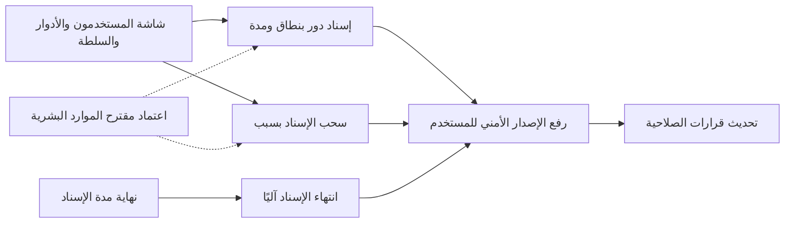
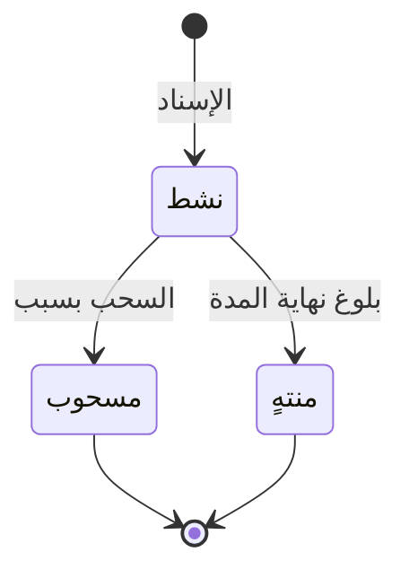

# إسناد الأدوار للمستخدمين

<!-- BEGIN GENERATED: doc -->
| البند | القيمة |
|---|---|
| المعرّف | FEAT-ORG-ROLE-ASSIGNMENT |
| الإصدار | 0.1 |
| الحالة | مسودة |
| القدرة | CAP-01 إدارة المؤسسة والوصول |
| القدرة الفرعية | CAP-01.04 سياسات الوصول (R1) |
| الأدوار | مسؤول الإدارة؛ النظام |
| الشاشات | SCR-62 المستخدمون والأدوار والسلطة |
| حالات الاستخدام | UC-086، UC-035، UC-044 |
| القصص | 4: 3 من المواصفة، و1 جديدة |
<!-- END GENERATED: doc -->

## 1. نظرة عامة

### 1.1 القيمة

يتيح للمسؤول منح المستخدمين أدوارهم في نطاق محدد ولمدة محددة، وسحبها يدويًا أو تلقائيًا عند انتهاء مدتها.

### 1.2 النطاق

| البند | القيمة |
|---|---|
| المستخدمون | مسؤول الإدارة ضمن الوحدات التي يديرها، والنظام عند انتهاء المدة |
| الشاشات | SCR-62 المستخدمون والأدوار والسلطة |
| حالات الاستخدام | إدارة سياسات الوصول (UC-086)، واعتماد الخطة (UC-035)، وإسناد المهمة (UC-044) |
| المتطلبات | قرار الصلاحية يُبنى على الدور والنطاق وبقية سمات الطلب (REQ-FND-011)، وفصل المهام في اعتماد الخطة ومراجعة المهمة يعتمد على الأدوار المسندة (REQ-OPS-005، REQ-OPS-009) |
| داخل النطاق | إسناد دور لمستخدم في نطاق وحدة ولمدة، وسحبه بسبب، وانتهاؤه آليًا عند نهاية مدته، وشاشة الإسنادات ومتابعة انتهائها |
| خارج النطاق | تعريف الأدوار وصلاحياتها (ميزة «الأدوار»)، وحسابات المستخدمين (ميزة «حسابات المستخدمين»)، ومقترحات الإسناد القادمة من الموارد البشرية (ميزة «مزامنة تغييرات الموارد البشرية») |

### 1.3 خريطة الميزة

**الشكل 1: خريطة إسناد الأدوار**



**الشكل 2: رحلة إسناد الدور**



> **ملاحظة:** «مسحوب» و«منتهٍ» حالتان نهائيتان، فلا يُقبل على الإسناد بعدهما أي أمر. ولإعادة الدور يُنشأ إسناد جديد.

## 2. القواعد المشتركة

تنطبق على كل قصص الميزة، فلا تتكرر داخل القصص. وكل قصة تذكر ما يخصها فقط.

### 2.1 السياق المشترك

كل قصة تبدأ من ثلاثة شروط: مستأجر نشط، وحزمة السياسات الأساسية مفعّلة، ومستخدم مسجّل الدخول ومخوَّل. وتشير إليها القصص بخطوة واحدة: «بفرض السياق المشترك للميزة».

### 2.2 الصلاحية وعدم الإفصاح

- من لا يحق له رؤية العنصر يتلقى ردًا بشكل «غير متاح» تمامًا، فلا يعرف أنه موجود.
- من يرى العنصر ولا يحق له الإجراء يتلقى «لا تملك صلاحية هذا الإجراء».

### 2.3 أوامر تغيير الحالة

- **منع التكرار:** يُرسل كل أمر بمفتاح فريد، فإعادة الطلب نفسه لا تُنفَّذ مرتين.
- **حماية التعديل المتزامن:** يُرسل كل أمر بإصدار البيانات الذي يراه المستخدم. فإن عدّلها غيره في الأثناء، يُرفض الأمر.
- **السجل:** إن نجح الأمر، يُكتب حدثه وسجل التدقيق في المعاملة نفسها.

### 2.4 الرفض المشترك

```gherkin
# language: ar
خاصية: الرفض المشترك لأوامر الميزة

  سيناريو مخطط: رفض مشترك لكل أمر في الميزة
    بفرض السياق المشترك للميزة
    و <الحالة>
    عندما يُرسل المستخدم أي أمر من أوامر الميزة
    اذاً يُرفض برمز <الرمز> ويرى "<الرسالة>"
    و لا يتغير شيء

    امثلة:
      | الحالة                                  | الرمز                  | الرسالة                                                 |
      | العنصر خارج صلاحياته                    | NOT_FOUND              | غير متاح                                                |
      | العنصر مرئي له ولا يحق له الإجراء       | AUTHZ_DENIED           | لا تملك صلاحية هذا الإجراء                              |
      | غيره عدّل العنصر بعد أن فتحه            | VERSION_CONFLICT       | تغيّرت البيانات منذ فتحتها. راجع التغييرات ثم أعد المحاولة |
      | أعاد مفتاح منع التكرار بمحتوى مختلف     | IDEMPOTENCY_KEY_REUSED | طلب مكرر بمحتوى مختلف                                   |
      | البيانات ناقصة أو غير صحيحة             | VALIDATION_FAILED      | بعض البيانات ناقصة أو غير صحيحة. راجع الحقول المعلَّمة      |

  سيناريو: إعادة الطلب نفسه لا تُنفَّذ مرتين
    بفرض السياق المشترك للميزة
    و أمر نجح بمفتاح منع تكرار
    عندما يُعاد الطلب نفسه بالمفتاح نفسه
    اذاً تُعاد النتيجة الأولى ولا يُكتب حدث ثانٍ
```

## 3. الجودة وتعريف الاكتمال

### 3.1 متطلبات الجودة

<!-- BEGIN GENERATED: quality -->
لا متطلبات جودة مرتبطة بمتطلبات هذه الميزة مباشرة. تنطبق متطلبات المنصة العامة (`FEAT-PLT-*`).
<!-- END GENERATED: quality -->

### 3.2 تعريف الاكتمال

القصة مكتملة حين تتحقق الشروط الخمسة:

1. سيناريوهاتها والقواعد المشتركة تمر في الاختبار الآلي.
2. فحوص البنية المعمارية تمر.
3. نصوص الواجهة والرسائل موجودة بالعربية والإنجليزية.
4. مراجعة الكود مكتملة.
5. ما تضيفه القصة نفسها في قسم «القواعد» تحقق.

## 4. فهرس القصص

<!-- BEGIN GENERATED: story-index -->
| المعرّف | القصة | النوع | الحالة |
|---|---|---|---|
| `US-BC01-RAS-ASSIGN` | تسجيل إسناد الدور | أمر | مسودة |
| `US-BC01-RAS-REVOKE` | سحب إسناد الدور | أمر | مسودة |
| `US-BC01-S-ROLE-ASSIGNMENT-01` | تلقائي: valid_to reached (إسناد الدور) | نظام | مسودة |
| `US-UI-SCR62-ROLE-ASSIGNMENTS` | إسناد الأدوار بنطاق ومدة ومتابعة انتهائها | واجهة | مسودة |
<!-- END GENERATED: story-index -->

## 5. القصص

### 5.1 US-BC01-RAS-ASSIGN — إسناد الدور

| النوع | الإصدار | الأولوية | دون اتصال | الحالة |
|---|---|---|---|---|
| أمر | R1 | Must | لا | مسودة |

> **كـ** مسؤول الإدارة، **أريد** أن أسند دورًا لمستخدم في نطاق وحدة ولمدة محددة، **حتى** يحصل على الصلاحيات التي يحتاجها عمله فقط.

**باختصار:** يختار المسؤول المستخدم والدور والوحدة وهل تشمل توابعها والمدة، فيُنشأ إسناد «نشط» وتُحدَّث صلاحيات المستخدم.

#### القواعد

- **متى يُسمح:** الدور نشط، وحساب المستخدم غير مغلق، والوحدة نشطة، ولا يملك المستخدم دورًا نشطًا يتعارض مع الدور الجديد. والتعارض الافتراضي: المدقِّق مع مسؤول الإدارة، والمدقِّق مع مسؤول الأمن.
- **من يُسمح له:** مسؤول الإدارة الذي يشمل نطاقه وحدة الإسناد. ولا يسند أحد دورًا لنفسه.
- **البيانات:** المستخدم، والدور، والوحدة، وهل تشمل الوحدات التابعة، وبداية المدة: إلزامية. ونهاية المدة اختيارية، وبدونها يبقى الإسناد حتى يُسحب.
- **الأثر:** يُنشأ الإسناد بحالة «نشط»، ويُسجَّل حدث «أُسند الدور». ويرتفع الإصدار الأمني للمستخدم، فتُبطَل قرارات الصلاحية المحفوظة له ويُحدَّث دليل البحث.

> **ملاحظة:** جدول الانتقالات يعطي رمزًا واحدًا لكل شروط الإسناد (تعارض الأدوار). ورمز رفض الدور غير النشط أو الحساب المغلق أو الوحدة غير النشطة غير محدد **[Needs Review]**. ورسالة فصل المهام في المسرد لا تصف الإسناد إلى النفس بدقة **[Needs Review]**.

#### معايير القبول

```gherkin
# language: ar
خاصية: إسناد الدور

  سيناريو: المسؤول يسند دورًا في وحدة يديرها
    بفرض السياق المشترك للميزة
    و مستخدم نشط بلا دور متعارض، ووحدة نشطة في نطاق المسؤول
    عندما يسند له دور المخطِّط في الوحدة وتوابعها من اليوم حتى نهاية السنة
    اذاً يُنشأ إسناد حالته "نشط" بالنطاق والمدة المحددين
    و يُسجَّل حدث "أُسند الدور" ويرتفع الإصدار الأمني للمستخدم

  سيناريو مخطط: رفض خاص بإسناد الدور
    بفرض السياق المشترك للميزة
    و <الحالة>
    عندما يحاول المسؤول إسناد الدور
    اذاً يُرفض برمز <الرمز> ويرى "<الرسالة>"
    و لا يتغير شيء

    امثلة:
      | الحالة                                    | الرمز                 | الرسالة                                      |
      | للمستخدم دور المدقِّق ويُسند له مسؤول الأمن | SOD_ROLE_CONFLICT     | هذا الدور يتعارض مع دور آخر لدى المستخدم     |
      | المسؤول يسند الدور لنفسه                   | SEGREGATION_OF_DUTIES | لا يجوز أن يعتمد الشخص نفسه ما قدّمه أو طلبه |
      | لم يحدد بداية المدة                        | VALIDATION_FAILED     | بداية المدة مطلوبة                           |
```

<details><summary>المراجع التقنية والتتبع</summary>

<!-- BEGIN GENERATED: refs US-BC01-RAS-ASSIGN -->
| البند | المعرّف | المعنى |
|---|---|---|
| الواجهة البرمجية | `POST /api/v1/foundation/role-assignments` | — |
| الأمر | `CMD-RAS-ASSIGN` | تسجيل إسناد الدور |
| السياسة | `POL-RAS-ASSIGN` | Administrator with scope ⊇ assignment scope؛ tenant match; subject ACTIVE; tenant ACTIVE (except TEN operatio… |
| الحدث | `EVT-RAS-ASSIGNED` | يصل إلى: Security-version service (EVT-SEC-VERSION-INCREMENTED); PEP decision caches; Projection security-ver… |
| الكيان | `AGG-ROLE-ASSIGNMENT` | إسناد الدور |
| الجدول | `foundation.role_assignments` | الجدول الرئيسي لإسناد الدور |
| وحدة النشر | DU-02 | — |
| المتطلب | REQ-FND-011 | The system shall base authorization decisions on subject, action, resource, purpose, context, classification,… |
| حالة الاستخدام | UC-086 | Manage Access Policy |
| الاختبار | TST-ROLE-ASSIGNMENT-SM، TST-SLC01-INVARIANTS | دورة حالات إسناد الدور، وثوابت الشريحة SLC-01 |
<!-- END GENERATED: refs US-BC01-RAS-ASSIGN -->

</details>

### 5.2 US-BC01-RAS-REVOKE — سحب إسناد الدور

| النوع | الإصدار | الأولوية | دون اتصال | الحالة |
|---|---|---|---|---|
| أمر | R1 | Must | لا | مسودة |

> **كـ** مسؤول الإدارة، **أريد** أن أسحب إسناد دور لم يعد المستخدم يحتاجه مع ذكر السبب، **حتى** تزول صلاحياته فورًا ويُعرف لماذا.

**باختصار:** يسحب المسؤول إسنادًا «نشطًا» بسبب مكتوب، فيصير «مسحوبًا» وتُحدَّث صلاحيات المستخدم.

#### القواعد

- **متى يُسمح:** الإسناد «نشط».
- **من يُسمح له:** مسؤول الإدارة الذي يشمل نطاقه وحدة الإسناد.
- **البيانات:** السبب، إلزامي.
- **الأثر:** يصبح الإسناد «مسحوبًا»، وهي حالة نهائية. ويُسجَّل حدث «سُحب إسناد الدور»، ويرتفع الإصدار الأمني للمستخدم فتُبطَل قرارات الصلاحية المحفوظة له.

#### معايير القبول

```gherkin
# language: ar
خاصية: سحب إسناد الدور

  سيناريو: المسؤول يسحب إسنادًا نشطًا
    بفرض السياق المشترك للميزة
    و إسناد "نشط" في وحدة ضمن نطاق المسؤول
    عندما يسحبه مع ذكر السبب
    اذاً تصبح حالته "مسحوب"
    و يُسجَّل حدث "سُحب إسناد الدور" ويرتفع الإصدار الأمني للمستخدم

  سيناريو مخطط: رفض خاص بسحب الإسناد
    بفرض السياق المشترك للميزة
    و <الحالة>
    عندما يحاول المسؤول سحب الإسناد
    اذاً يُرفض برمز <الرمز> ويرى "<الرسالة>"
    و لا يتغير شيء

    امثلة:
      | الحالة                                | الرمز                                    | الرسالة                                    |
      | لم يذكر السبب                         | REASON_REQUIRED                          | اذكر السبب                                 |
      | الإسناد "منتهٍ" منذ فتحه               | ROLE_ASSIGNMENT_INVALID_STATE_TRANSITION | الوضع الحالي لإسناد الدور لا يسمح بهذا الإجراء |
```

<details><summary>المراجع التقنية والتتبع</summary>

<!-- BEGIN GENERATED: refs US-BC01-RAS-REVOKE -->
| البند | المعرّف | المعنى |
|---|---|---|
| الواجهة البرمجية | `POST /api/v1/foundation/role-assignments/{id}/actions/revoke` | — |
| الأمر | `CMD-RAS-REVOKE` | سحب إسناد الدور |
| السياسة | `POL-RAS-REVOKE` | Administrator with scope ⊇ assignment scope؛ tenant match; subject ACTIVE; tenant ACTIVE (except TEN operatio… |
| الحدث | `EVT-RAS-REVOKED` | يصل إلى: Security-version service (EVT-SEC-VERSION-INCREMENTED); PEP decision caches; Projection security-ver… |
| الكيان | `AGG-ROLE-ASSIGNMENT` | إسناد الدور |
| الجدول | `foundation.role_assignments` | الجدول الرئيسي لإسناد الدور |
| وحدة النشر | DU-02 | — |
| المتطلب | REQ-FND-011 | The system shall base authorization decisions on subject, action, resource, purpose, context, classification,… |
| حالة الاستخدام | UC-086 | Manage Access Policy |
| الاختبار | TST-ROLE-ASSIGNMENT-SM، TST-SLC01-INVARIANTS | دورة حالات إسناد الدور، وثوابت الشريحة SLC-01 |
<!-- END GENERATED: refs US-BC01-RAS-REVOKE -->

</details>

### 5.3 US-BC01-S-ROLE-ASSIGNMENT-01 — انتهاء إسناد الدور عند نهاية مدته

| النوع | الإصدار | الأولوية | دون اتصال | الحالة |
|---|---|---|---|---|
| نظام | R1 | Must | لا ينطبق | مسودة |

> **كـ** النظام، **أريد** أن أنهي إسناد الدور عند بلوغ نهاية مدته، **حتى** لا تبقى صلاحية مؤقتة بعد وقتها.

**باختصار:** حين يبلغ إسناد «نشط» نهاية مدته، يجعله المجدول «منتهيًا» وتُحدَّث صلاحيات المستخدم.

#### القواعد

- **متى يحدث:** الإسناد «نشط» وله نهاية مدة، وحلّ موعدها.
- **الأثر:** يصبح الإسناد «منتهيًا»، ويُسجَّل حدث «انتهى إسناد الدور» وسجل تدقيق بهوية النظام. ويرتفع الإصدار الأمني للمستخدم. والإسناد بلا نهاية مدة لا ينتهي آليًا.

#### معايير القبول

```gherkin
# language: ar
خاصية: انتهاء إسناد الدور آليًا

  سيناريو: بلغ الإسناد نهاية مدته
    بفرض إسناد "نشط" تنتهي مدته الآن
    عندما يصل المجدول إلى موعد نهاية المدة
    اذاً تصبح حالته "منتهٍ"
    و يُسجَّل حدث "انتهى إسناد الدور" وسجل تدقيق بهوية النظام

  سيناريو: إسناد بلا نهاية مدة أو مسحوب لا يتغير
    بفرض إسناد "نشط" بلا نهاية مدة، وإسناد آخر "مسحوب" مرت نهاية مدته
    عندما يعمل المجدول
    اذاً تبقى حالتاهما كما هما ولا يُسجَّل أي حدث
```

<details><summary>المراجع التقنية والتتبع</summary>

<!-- BEGIN GENERATED: refs US-BC01-S-ROLE-ASSIGNMENT-01 -->
| البند | المعرّف | المعنى |
|---|---|---|
| المحفِّز | `SYS:valid_to reached` | system scheduler |
| الانتقال | ACTIVE ← EXPIRED | — |
| الحدث | `EVT-RAS-EXPIRED` | يصل إلى: Security-version service (EVT-SEC-VERSION-INCREMENTED); PEP decision caches; Projection security-ver… |
| الكيان | `AGG-ROLE-ASSIGNMENT` | إسناد الدور |
| الجدول | `foundation.role_assignments` | الجدول الرئيسي لإسناد الدور |
| وحدة النشر | DU-02 | — |
| المتطلب | REQ-FND-011 | The system shall base authorization decisions on subject, action, resource, purpose, context, classification,… |
| حالة الاستخدام | UC-086 | Manage Access Policy |
| الاختبار | TST-ROLE-ASSIGNMENT-SM، TST-SLC01-INVARIANTS | دورة حالات إسناد الدور، وثوابت الشريحة SLC-01 |
<!-- END GENERATED: refs US-BC01-S-ROLE-ASSIGNMENT-01 -->

</details>

### 5.4 US-UI-SCR62-ROLE-ASSIGNMENTS — إسناد الأدوار بنطاق ومدة ومتابعة انتهائها

| النوع | الإصدار | الأولوية | دون اتصال | الحالة |
|---|---|---|---|---|
| واجهة | R1 | Should | لا | مسودة |

> **كـ** مسؤول الإدارة، **أريد** أن أرى أدوار المستخدم بنطاقاتها ومددها، وأسند أو أسحب منها في مكان واحد، **حتى** أعرف ما يملكه كل مستخدم ومتى ينتهي.

**باختصار:** في صفحة المستخدم بشاشة «المستخدمون والأدوار والسلطة» جدول بإسناداته، ونموذج إسناد جديد، وزر سحب على كل إسناد نشط.

#### القواعد

- الجدول يعرض لكل إسناد: الدور، والوحدة وهل تشمل توابعها، وبداية المدة ونهايتها، والحالة شارةً **[Derived]**.
- الإسناد الذي تقترب نهاية مدته يُعلَّم **[Derived]**. ومدة التنبيه المسبق لا تذكرها المصادر **[Needs Review]**.
- نموذج الإسناد لا يعرض من الوحدات إلا ما يديره المسؤول، ولا يظهر في صفحة المسؤول نفسه **[Derived]**.
- زر السحب يظهر على الإسناد «النشط» فقط، ويفتح نموذجًا بحقل سبب إلزامي (21-ui-design.md §6.1).
- العرض تلميح، والخادم يبقى الحكم (21-ui-design.md §6.3).

#### معايير القبول

```gherkin
# language: ar
خاصية: إسنادات المستخدم في شاشة الإدارة

  سيناريو: المسؤول يفتح صفحة مستخدم
    بفرض السياق المشترك للميزة
    و للمستخدم إسناد "نشط" ينتهي قريبًا وإسناد "مسحوب"
    عندما يفتح المسؤول صفحته
    اذاً يرى الإسنادين بنطاقيهما ومدتيهما وحالتيهما
    و يُعلَّم الإسناد القريب من الانتهاء ويظهر زر السحب عليه وحده

  سيناريو مخطط: الخادم يرفض إسنادًا من النموذج
    بفرض السياق المشترك للميزة
    و <الحالة>
    عندما يرسل المسؤول نموذج الإسناد
    اذاً يرى "<الرسالة>" برمز <الرمز> وتبقى بياناته في النموذج
    و لا يتغير شيء

    امثلة:
      | الحالة                                 | الرمز             | الرسالة                                  |
      | الدور المختار يتعارض مع دور نشط للمستخدم | SOD_ROLE_CONFLICT | هذا الدور يتعارض مع دور آخر لدى المستخدم |
```

<details><summary>المراجع التقنية والتتبع</summary>

<!-- BEGIN GENERATED: refs US-UI-SCR62-ROLE-ASSIGNMENTS -->
| البند | المعرّف | المعنى |
|---|---|---|
| حالة الاستخدام | UC-086 | Manage Access Policy |
| الشاشة | SCR-62 | شاشة المستخدمون والأدوار والسلطة |
| المصدر | `[Derived]` | — |
<!-- END GENERATED: refs US-UI-SCR62-ROLE-ASSIGNMENTS -->

</details>

## 6. التتبع

<!-- BEGIN GENERATED: trace -->
| المتطلب | المعنى | القصص | الاختبار |
|---|---|---|---|
| REQ-FND-011 | The system shall base authorization decisions on subject, action, resource, purpose, context, classification,… | كل قصص الميزة المأخوذة من المواصفة (3) | TST-POLICY-SET-SM، TST-ROLE-ASSIGNMENT-SM |
<!-- END GENERATED: trace -->

## 7. سجل التغييرات

| الإصدار | التاريخ | التغيير |
|---|---|---|
| 0.1 | — | هيكل مولَّد من خريطة الميزات |
| 0.2 | 2026-10-03 | كتابة القصص كاملة بمعيار القصص |
