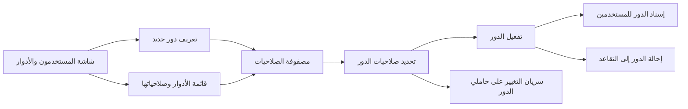
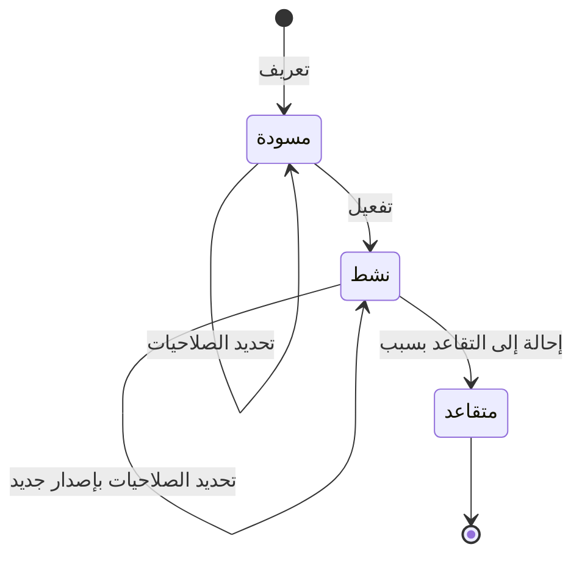

# تعريف الأدوار وصلاحياتها

<!-- BEGIN GENERATED: doc -->
| البند | القيمة |
|---|---|
| المعرّف | FEAT-ORG-ROLES |
| الإصدار | 0.1 |
| الحالة | مسودة |
| القدرة | CAP-01 إدارة المؤسسة والوصول |
| القدرة الفرعية | CAP-01.04 سياسات الوصول (R1) |
| الأدوار | مسؤول الإدارة |
| الشاشات | SCR-62 المستخدمون والأدوار والسلطة |
| حالات الاستخدام | UC-086 |
| القصص | 6: 4 من المواصفة، و2 جديدة |
<!-- END GENERATED: doc -->

## 1. نظرة عامة

### 1.1 القيمة

يتيح للمسؤول تعريف أدوار العمل وتحديد ما يسمح به كل دور من عرض وتعديل وتصدير واعتماد، وتفعيل الأدوار أو إحالتها للتقاعد.

### 1.2 النطاق

| البند | القيمة |
|---|---|
| المستخدمون | مسؤول الإدارة يعرّف الأدوار ويحدد صلاحياتها ويفعّلها ويحيلها إلى التقاعد |
| الشاشات | SCR-62 المستخدمون والأدوار والسلطة: قائمة الأدوار، ومصفوفة صلاحيات الدور |
| حالات الاستخدام | إدارة سياسات الوصول: ما يسمح به كل دور على كل نوع من البيانات |
| المتطلبات | الصلاحيات الثماني (العرض، والتعديل، والتصدير، والمشاركة، والاعتماد، والحذف، والاحتفاظ، والأرشفة) تُمنح كلٌّ منها منفصلة (REQ-FND-014) |
| خارج النطاق | إسناد الأدوار إلى المستخدمين وسحبها (ميزة «إسناد الأدوار للمستخدمين»)، وسياسات الوصول وجداول قرارها (ميزة «إدارة سياسات الوصول»)، وفرض الصلاحية عند كل طلب (ميزة «فحص الوصول قبل كل طلب») |

### 1.3 خريطة الميزة

**الشكل 1: خريطة ميزة الأدوار وصلاحياتها**



يمر الدور بثلاث حالات (الشكل 2). ولا يُسند إلى المستخدمين إلا الدور النشط.

**الشكل 2: رحلة الدور**



## 2. القواعد المشتركة

تنطبق على كل قصص الميزة، فلا تتكرر داخل القصص. وكل قصة تذكر ما يخصها فقط.

### 2.1 السياق المشترك

كل قصة تبدأ من ثلاثة شروط: مستأجر نشط، وحزمة السياسات الأساسية مفعّلة، ومستخدم مسجّل الدخول ومخوَّل. وتشير إليها القصص بخطوة واحدة: «بفرض السياق المشترك للميزة».

### 2.2 الصلاحية وعدم الإفصاح

- من لا يحق له رؤية العنصر يتلقى ردًا بشكل «غير متاح» تمامًا، فلا يعرف أنه موجود.
- من يرى العنصر ولا يحق له الإجراء يتلقى «لا تملك صلاحية هذا الإجراء».

### 2.3 أوامر تغيير الحالة

- **منع التكرار:** يُرسل كل أمر بمفتاح فريد، فإعادة الطلب نفسه لا تُنفَّذ مرتين.
- **حماية التعديل المتزامن:** يُرسل كل أمر بإصدار البيانات الذي يراه المستخدم. فإن عدّلها غيره في الأثناء، يُرفض الأمر.
- **السجل:** إن نجح الأمر، يُكتب حدثه وسجل التدقيق في المعاملة نفسها.

### 2.4 الرفض المشترك

```gherkin
# language: ar
خاصية: الرفض المشترك لأوامر الميزة

  سيناريو مخطط: رفض مشترك لكل أمر في الميزة
    بفرض السياق المشترك للميزة
    و <الحالة>
    عندما يُرسل المستخدم أي أمر من أوامر الميزة
    اذاً يُرفض برمز <الرمز> ويرى "<الرسالة>"
    و لا يتغير شيء

    امثلة:
      | الحالة                                  | الرمز                  | الرسالة                                                 |
      | العنصر خارج صلاحياته                    | NOT_FOUND              | غير متاح                                                |
      | العنصر مرئي له ولا يحق له الإجراء       | AUTHZ_DENIED           | لا تملك صلاحية هذا الإجراء                              |
      | غيره عدّل العنصر بعد أن فتحه            | VERSION_CONFLICT       | تغيّرت البيانات منذ فتحتها. راجع التغييرات ثم أعد المحاولة |
      | أعاد مفتاح منع التكرار بمحتوى مختلف     | IDEMPOTENCY_KEY_REUSED | طلب مكرر بمحتوى مختلف                                   |
      | البيانات ناقصة أو غير صحيحة             | VALIDATION_FAILED      | بعض البيانات ناقصة أو غير صحيحة. راجع الحقول المعلَّمة      |

  سيناريو: إعادة الطلب نفسه لا تُنفَّذ مرتين
    بفرض السياق المشترك للميزة
    و أمر نجح بمفتاح منع تكرار
    عندما يُعاد الطلب نفسه بالمفتاح نفسه
    اذاً تُعاد النتيجة الأولى ولا يُكتب حدث ثانٍ
```

### 2.5 الأدوار النظامية وسريان الصلاحيات

- **الأدوار النظامية:** أدوار الأعمال الخمسة عشر موجودة في كل مستأجر، ولا تُعدَّل صلاحياتها ولا تُحال إلى التقاعد.
- **الصلاحية:** نوع إجراء على نوع من البيانات. وأنواع الإجراء الثمانية تُمنح منفصلة، فمن مُنح الأرشفة دون الحذف لا يستطيع الحذف (REQ-FND-014).
- **السريان:** تغيير صلاحيات دور نشط يحفظ إصدارًا جديدًا له، ويسري على كل حامليه من طلبهم التالي (`17-security-design.md` §3.5).

## 3. الجودة وتعريف الاكتمال

### 3.1 متطلبات الجودة

<!-- BEGIN GENERATED: quality -->
لا متطلبات جودة مرتبطة بمتطلبات هذه الميزة مباشرة. تنطبق متطلبات المنصة العامة (`FEAT-PLT-*`).
<!-- END GENERATED: quality -->

### 3.2 تعريف الاكتمال

القصة مكتملة حين تتحقق الشروط الخمسة:

1. سيناريوهاتها والقواعد المشتركة تمر في الاختبار الآلي.
2. فحوص البنية المعمارية تمر.
3. نصوص الواجهة والرسائل موجودة بالعربية والإنجليزية.
4. مراجعة الكود مكتملة.
5. ما تضيفه القصة نفسها في قسم «القواعد» تحقق.

## 4. فهرس القصص

<!-- BEGIN GENERATED: story-index -->
| المعرّف | القصة | النوع | الحالة |
|---|---|---|---|
| `US-BC01-ROL-ACTIVATE` | تفعيل الدور | أمر | مسودة |
| `US-BC01-ROL-DEFINE` | تعريف الدور | أمر | مسودة |
| `US-BC01-ROL-RETIRE` | إحالة الدور إلى التقاعد | أمر | مسودة |
| `US-BC01-ROL-SET-PERMISSIONS` | تحديد صلاحيات الدور | أمر | مسودة |
| `US-DOM-ROL-LIST` | عرض الأدوار وصلاحياتها | جلب | مسودة |
| `US-UI-SCR62-PERMISSION-MATRIX` | ضبط الصلاحيات الثماني للدور منفصلة | واجهة | مسودة |
<!-- END GENERATED: story-index -->

## 5. القصص

### 5.1 US-BC01-ROL-ACTIVATE — تفعيل الدور

| النوع | الإصدار | الأولوية | دون اتصال | الحالة |
|---|---|---|---|---|
| أمر | R1 | Must | لا | مسودة |

> **كـ** مسؤول الإدارة، **أريد** أن أفعّل دورًا اكتملت صلاحياته، **حتى** يصبح متاحًا للإسناد إلى المستخدمين.

**باختصار:** الدور في المسودة يصبح «نشطًا» حين تكون له صلاحية واحدة على الأقل. ومن بعدها يمكن إسناده.

#### القواعد

- **متى يُسمح:** الدور في حالة «مسودة»، وله صلاحية واحدة على الأقل.
- **من يُسمح له:** مسؤول الإدارة، على مستوى المستأجر كله.
- **الأثر:** يصبح الدور «نشطًا»، ويُسجَّل حدث «فُعِّل الدور». ويصبح متاحًا في ميزة «إسناد الأدوار للمستخدمين».

#### معايير القبول

```gherkin
# language: ar
خاصية: تفعيل الدور

  سيناريو: تفعيل دور له صلاحيات
    بفرض السياق المشترك للميزة
    و دور في حالة "مسودة" له صلاحية واحدة على الأقل
    عندما يفعّل مسؤول الإدارة الدور
    اذاً تصبح حالة الدور "نشط"
    و يُسجَّل حدث "فُعِّل الدور"
    و يظهر الدور بين الأدوار المتاحة للإسناد

  سيناريو مخطط: رفض خاص بتفعيل الدور
    بفرض السياق المشترك للميزة
    و <الحالة>
    عندما يحاول تفعيل الدور
    اذاً يُرفض برمز <الرمز> ويرى "<الرسالة>"
    و لا يتغير شيء

    امثلة:
      | الحالة | الرمز | الرسالة |
      | الدور بلا أي صلاحية | ROLE_EMPTY | أضف صلاحية واحدة على الأقل |
      | الدور "نشط" من قبل | ROLE_INVALID_STATE_TRANSITION | الوضع الحالي للدور لا يسمح بهذا الإجراء |
      | الدور "متقاعد" | ROLE_INVALID_STATE_TRANSITION | الوضع الحالي للدور لا يسمح بهذا الإجراء |
```

<details><summary>المراجع التقنية والتتبع</summary>

<!-- BEGIN GENERATED: refs US-BC01-ROL-ACTIVATE -->
| البند | المعرّف | المعنى |
|---|---|---|
| الواجهة البرمجية | `POST /api/v1/foundation/roles/{id}/actions/activate` | — |
| الأمر | `CMD-ROL-ACTIVATE` | تفعيل الدور |
| السياسة | `POL-ROL-ACTIVATE` | Administrator (tenant-wide)؛ tenant match; subject ACTIVE; tenant ACTIVE (except TEN operations by platform) |
| الحدث | `EVT-ROL-ACTIVATED` | يصل إلى: Search/Directory projection (BC01 read model) |
| الكيان | `AGG-ROLE` | الدور |
| الجدول | `foundation.roles` | الجدول الرئيسي للدور |
| وحدة النشر | DU-02 | — |
| المتطلب | REQ-FND-014 | The system shall treat View, Edit, Export, Share, Approve, Delete, Retain and Archive as separately grantable… |
| حالة الاستخدام | UC-086 | Manage Access Policy |
| الاختبار | TST-ROLE-SM، TST-SLC01-INVARIANTS | دورة حالات الدور، وثوابت الشريحة SLC-01 |
<!-- END GENERATED: refs US-BC01-ROL-ACTIVATE -->

</details>

### 5.2 US-BC01-ROL-DEFINE — تعريف الدور

| النوع | الإصدار | الأولوية | دون اتصال | الحالة |
|---|---|---|---|---|
| أمر | R1 | Must | لا | مسودة |

> **كـ** مسؤول الإدارة، **أريد** أن أعرّف دورًا جديدًا برمز واسم، **حتى** أبدأ تحديد صلاحياته قبل أن يُسند إلى أحد.

**باختصار:** يُنشأ الدور في حالة «مسودة» برمز فريد في المستأجر واسم بالعربية والإنجليزية، وبلا صلاحيات.

#### القواعد

- **متى يُسمح:** الرمز غير مستخدم لدور آخر في المستأجر.
- **من يُسمح له:** مسؤول الإدارة، على مستوى المستأجر كله.
- **البيانات:** الرمز (إلزامي، فريد في المستأجر)، والاسم (إلزامي، بالعربية والإنجليزية).
- **الأثر:** دور جديد في حالة «مسودة». ويُسجَّل حدث «عُرِّف الدور».

#### معايير القبول

```gherkin
# language: ar
خاصية: تعريف الدور

  سيناريو: تعريف دور برمز جديد
    بفرض السياق المشترك للميزة
    و لا يوجد في المستأجر دور بالرمز "DUTY-OFFICER"
    عندما يعرّف مسؤول الإدارة دورًا بالرمز "DUTY-OFFICER" واسم بالعربية والإنجليزية
    اذاً يُنشأ الدور في حالة "مسودة" بلا صلاحيات
    و يُسجَّل حدث "عُرِّف الدور"

  سيناريو مخطط: رفض خاص بتعريف الدور
    بفرض السياق المشترك للميزة
    و <الحالة>
    عندما يحاول تعريف الدور
    اذاً يُرفض برمز <الرمز> ويرى "<الرسالة>"
    و لا يتغير شيء

    امثلة:
      | الحالة | الرمز | الرسالة |
      | الرمز مستخدم لدور آخر في المستأجر | ROLE_CODE_TAKEN | رمز الدور مستخدم |
      | الرمز فارغ | VALIDATION_FAILED | الرمز مطلوب |
      | الاسم فارغ | VALIDATION_FAILED | الاسم مطلوب |
```

<details><summary>المراجع التقنية والتتبع</summary>

<!-- BEGIN GENERATED: refs US-BC01-ROL-DEFINE -->
| البند | المعرّف | المعنى |
|---|---|---|
| الواجهة البرمجية | `POST /api/v1/foundation/roles` | — |
| الأمر | `CMD-ROL-DEFINE` | تعريف الدور |
| السياسة | `POL-ROL-DEFINE` | Administrator (tenant-wide)؛ tenant match; subject ACTIVE; tenant ACTIVE (except TEN operations by platform) |
| الحدث | `EVT-ROL-DEFINED` | يصل إلى: Search/Directory projection (BC01 read model) |
| الكيان | `AGG-ROLE` | الدور |
| الجدول | `foundation.roles` | الجدول الرئيسي للدور |
| وحدة النشر | DU-02 | — |
| المتطلب | REQ-FND-014 | The system shall treat View, Edit, Export, Share, Approve, Delete, Retain and Archive as separately grantable… |
| حالة الاستخدام | UC-086 | Manage Access Policy |
| الاختبار | TST-ROLE-SM، TST-SLC01-INVARIANTS | دورة حالات الدور، وثوابت الشريحة SLC-01 |
<!-- END GENERATED: refs US-BC01-ROL-DEFINE -->

</details>

### 5.3 US-BC01-ROL-RETIRE — إحالة الدور إلى التقاعد

| النوع | الإصدار | الأولوية | دون اتصال | الحالة |
|---|---|---|---|---|
| أمر | R1 | Must | لا | مسودة |

> **كـ** مسؤول الإدارة، **أريد** أن أحيل دورًا لم يعد مستعملًا إلى التقاعد، **حتى** لا يُسند إلى أحد بعد اليوم.

**باختصار:** الدور النشط غير المسند لأي مستخدم يصبح «متقاعدًا» بسبب مكتوب. والأدوار النظامية لا تُحال إلى التقاعد (القسم 2.5).

#### القواعد

- **متى يُسمح:** الدور «نشط»، وليس دورًا نظاميًا، ولا إسناد نشطًا له لأي مستخدم.
- **من يُسمح له:** مسؤول الإدارة، على مستوى المستأجر كله.
- **البيانات:** السبب (إلزامي).
- **الأثر:** يصبح الدور «متقاعدًا»، وهي حالة نهائية. ويُسجَّل حدث «أُحيل الدور إلى التقاعد».

> **ملاحظة:** الدور في المسودة لا يُحال إلى التقاعد، فالانتقال من «مسودة» إلى «متقاعد» غير معرَّف في المصدر.

#### معايير القبول

```gherkin
# language: ar
خاصية: إحالة الدور إلى التقاعد

  سيناريو: إحالة دور غير مسند إلى التقاعد
    بفرض السياق المشترك للميزة
    و دور "نشط" غير نظامي ولا إسناد نشطًا له
    عندما يحيله مسؤول الإدارة إلى التقاعد مع سبب
    اذاً تصبح حالة الدور "متقاعد"
    و يُسجَّل حدث "أُحيل الدور إلى التقاعد"

  سيناريو مخطط: رفض خاص بإحالة الدور إلى التقاعد
    بفرض السياق المشترك للميزة
    و <الحالة>
    عندما يحاول إحالة الدور إلى التقاعد
    اذاً يُرفض برمز <الرمز> ويرى "<الرسالة>"
    و لا يتغير شيء

    امثلة:
      | الحالة | الرمز | الرسالة |
      | الدور نظامي | ROLE_IN_USE | لا يمكن إيقاف الدور: إما دور نظامي، أو مسند حاليًا لمستخدمين |
      | الدور مسند حاليًا لمستخدم | ROLE_IN_USE | لا يمكن إيقاف الدور: إما دور نظامي، أو مسند حاليًا لمستخدمين |
      | الدور في حالة "مسودة" | ROLE_INVALID_STATE_TRANSITION | الوضع الحالي للدور لا يسمح بهذا الإجراء |
      | السبب فارغ | VALIDATION_FAILED | السبب مطلوب |
```

<details><summary>المراجع التقنية والتتبع</summary>

<!-- BEGIN GENERATED: refs US-BC01-ROL-RETIRE -->
| البند | المعرّف | المعنى |
|---|---|---|
| الواجهة البرمجية | `POST /api/v1/foundation/roles/{id}/actions/retire` | — |
| الأمر | `CMD-ROL-RETIRE` | إحالة الدور إلى التقاعد |
| السياسة | `POL-ROL-RETIRE` | Administrator (tenant-wide)؛ tenant match; subject ACTIVE; tenant ACTIVE (except TEN operations by platform) |
| الحدث | `EVT-ROL-RETIRED` | يصل إلى: Search/Directory projection (BC01 read model) |
| الكيان | `AGG-ROLE` | الدور |
| الجدول | `foundation.roles` | الجدول الرئيسي للدور |
| وحدة النشر | DU-02 | — |
| المتطلب | REQ-FND-014 | The system shall treat View, Edit, Export, Share, Approve, Delete, Retain and Archive as separately grantable… |
| حالة الاستخدام | UC-086 | Manage Access Policy |
| الاختبار | TST-ROLE-SM، TST-SLC01-INVARIANTS | دورة حالات الدور، وثوابت الشريحة SLC-01 |
<!-- END GENERATED: refs US-BC01-ROL-RETIRE -->

</details>

### 5.4 US-BC01-ROL-SET-PERMISSIONS — تحديد صلاحيات الدور

| النوع | الإصدار | الأولوية | دون اتصال | الحالة |
|---|---|---|---|---|
| أمر | R1 | Must | لا | مسودة |

> **كـ** مسؤول الإدارة، **أريد** أن أحدد ما يسمح به الدور من إجراءات على كل نوع من البيانات، **حتى** يحصل حاملوه على ما يحتاجونه فقط.

**باختصار:** تُستبدل قائمة صلاحيات الدور في المسودة أو وهو نشط. وفي الدور النشط يُحفظ إصدار جديد ويسري التغيير على حامليه من طلبهم التالي (القسم 2.5).

#### القواعد

- **متى يُسمح:** الدور «مسودة» أو «نشط»، وليس دورًا نظاميًا، وكل صلاحية مطلوبة موجودة في كتالوج الصلاحيات.
- **من يُسمح له:** مسؤول الإدارة، على مستوى المستأجر كله.
- **البيانات:** قائمة الصلاحيات (إلزامية). كل صلاحية نوع إجراء على نوع من البيانات، ونوع الإجراء أحد الثمانية أو رمز أمر بعينه.
- **الأثر:** لا تتغير حالة الدور، ويزيد إصداره. ويُسجَّل حدث «تغيّرت صلاحيات الدور». وفي الدور النشط يرتفع إصدار الأمن لكل حامليه، فتُبطَل قرارات الصلاحية المحفوظة لهم فورًا.

#### معايير القبول

```gherkin
# language: ar
خاصية: تحديد صلاحيات الدور

  سيناريو: تغيير صلاحيات دور نشط يسري على حامليه
    بفرض السياق المشترك للميزة
    و دور "نشط" في إصداره 2 يحمله مستخدمون، وله صلاحيتا العرض والأرشفة على الوثائق
    عندما يزيل مسؤول الإدارة صلاحية الأرشفة ويحفظ
    اذاً يبقى الدور "نشطًا" ويصبح إصداره 3
    و يُسجَّل حدث "تغيّرت صلاحيات الدور"
    و يُرفض طلب الأرشفة التالي من أي حامل للدور

  سيناريو مخطط: رفض خاص بتحديد صلاحيات الدور
    بفرض السياق المشترك للميزة
    و <الحالة>
    عندما يحاول تحديد صلاحيات الدور
    اذاً يُرفض برمز <الرمز> ويرى "<الرسالة>"
    و لا يتغير شيء

    امثلة:
      | الحالة | الرمز | الرسالة |
      | الدور نظامي | SYSTEM_ROLE_LOCKED | الأدوار النظامية لا تُعدَّل |
      | الدور "متقاعد" | ROLE_INVALID_STATE_TRANSITION | الوضع الحالي للدور لا يسمح بهذا الإجراء |
      | صلاحية غير موجودة في الكتالوج | VALIDATION_FAILED | الصلاحيات غير صحيحة |
```

<details><summary>المراجع التقنية والتتبع</summary>

<!-- BEGIN GENERATED: refs US-BC01-ROL-SET-PERMISSIONS -->
| البند | المعرّف | المعنى |
|---|---|---|
| الواجهة البرمجية | `POST /api/v1/foundation/roles/{id}/actions/set-permissions` | — |
| الأمر | `CMD-ROL-SET-PERMISSIONS` | تحديد صلاحيات الدور |
| السياسة | `POL-ROL-SET-PERMISSIONS` | Administrator (tenant-wide)؛ tenant match; subject ACTIVE; tenant ACTIVE (except TEN operations by platform) |
| الحدث | `EVT-ROL-PERMISSIONS-CHANGED` | يصل إلى: Security-version service (EVT-SEC-VERSION-INCREMENTED); PEP decision caches; Projection security-ver… |
| الكيان | `AGG-ROLE` | الدور |
| الجدول | `foundation.roles` | الجدول الرئيسي للدور |
| وحدة النشر | DU-02 | — |
| المتطلب | REQ-FND-014 | The system shall treat View, Edit, Export, Share, Approve, Delete, Retain and Archive as separately grantable… |
| حالة الاستخدام | UC-086 | Manage Access Policy |
| الاختبار | TST-ROLE-SM، TST-SLC01-INVARIANTS | دورة حالات الدور، وثوابت الشريحة SLC-01 |
<!-- END GENERATED: refs US-BC01-ROL-SET-PERMISSIONS -->

</details>

### 5.5 US-DOM-ROL-LIST — عرض الأدوار وصلاحياتها

| النوع | الإصدار | الأولوية | دون اتصال | الحالة |
|---|---|---|---|---|
| جلب | R1 | Must | لا | مسودة |

> **كـ** مسؤول الإدارة، **أريد** قائمة بأدوار المستأجر وصلاحيات كل منها، **حتى** أعرف ما يمنحه كل دور قبل أن أعدّله أو أسنده.

**باختصار:** تُعاد أدوار المستأجر بحالتها وصلاحياتها، صفحةً بعد صفحة. والمواصفة لا تعرّف هذا الاستعلام بعد، فالقصة **[Derived]**.

#### القواعد

- **من يرى ماذا:** مسؤول الإدارة يرى كل أدوار مستأجره **[Derived]**.
- **المرشحات:** الحالة، والرمز أو الاسم، وهل الدور نظامي، والمؤشر والحد **[Derived]**.
- **ما يُعاد لكل دور:** الرمز والاسم والحالة والإصدار، وهل هو نظامي، وصلاحياته موزعة على أنواع الإجراء الثمانية (REQ-FND-014).

#### معايير القبول

```gherkin
# language: ar
خاصية: عرض الأدوار وصلاحياتها

  سيناريو: عرض أدوار المستأجر
    بفرض السياق المشترك للميزة
    و في المستأجر أدوار نظامية وأدوار عرّفها المسؤول بحالات مختلفة
    عندما يطلب مسؤول الإدارة قائمة الأدوار
    اذاً تُعاد أدوار مستأجره فقط صفحةً بعد صفحة
    و يظهر لكل دور حالته وإصداره وهل هو نظامي وصلاحياته

  سيناريو: تصفية الأدوار بالحالة
    بفرض السياق المشترك للميزة
    و في المستأجر أدوار في المسودة
    عندما يطلب مسؤول الإدارة الأدوار بالحالة "مسودة"
    اذاً تُعاد أدوار المسودة فقط
```

<details><summary>المراجع التقنية والتتبع</summary>

<!-- BEGIN GENERATED: refs US-DOM-ROL-LIST -->
| البند | المعرّف | المعنى |
|---|---|---|
| حالة الاستخدام | UC-086 | Manage Access Policy |
| الشاشة | SCR-62 | شاشة المستخدمون والأدوار والسلطة |
| المصدر | `[Derived]` | — |
| المتطلب | REQ-FND-014 | The system shall treat View, Edit, Export, Share, Approve, Delete, Retain and Archive as separately grantable… |
| حالة الاستخدام | UC-086 | Manage Access Policy |
<!-- END GENERATED: refs US-DOM-ROL-LIST -->

</details>

### 5.6 US-UI-SCR62-PERMISSION-MATRIX — ضبط الصلاحيات الثماني للدور منفصلة

| النوع | الإصدار | الأولوية | دون اتصال | الحالة |
|---|---|---|---|---|
| واجهة | R1 | Must | لا | مسودة |

> **كـ** مسؤول الإدارة، **أريد** مصفوفة أضبط فيها كل نوع من الصلاحيات الثماني منفصلًا لكل نوع من البيانات، **حتى** أمنح الدور ما يحتاجه بالضبط دون أن يجرّ نوعٌ نوعًا آخر.

**باختصار:** تعرض المصفوفة أنواع البيانات صفوفًا والصلاحيات الثماني أعمدة، ولكل خلية اختيار مستقل. والحفظ يرسل قائمة الصلاحيات كاملة.

#### القواعد

- لكل خلية اختيار مستقل، فاختيار الأرشفة مثلًا لا يختار الحذف ولا يشترطه (REQ-FND-014).
- الدور النظامي والدور المتقاعد يُعرضان للعرض فقط، بلا زر حفظ.
- حفظ تغيير على دور نشط يسبقه تنبيه بأن التغيير يسري على كل حاملي الدور من طلبهم التالي (القسم 2.5) **[Derived]**.
- زر «تفعيل» في المسودة فقط، ويبقى معطَّلًا حتى تُختار خلية واحدة على الأقل **[Derived]**.
- عند رفض الخادم تعرض الشاشة رسالة المستخدم المعتمدة لرمز الخطأ، ولا يضيع ما اختاره المستخدم.

#### معايير القبول

```gherkin
# language: ar
خاصية: ضبط الصلاحيات الثماني للدور منفصلة

  سيناريو: منح الأرشفة دون الحذف
    بفرض السياق المشترك للميزة
    و مسؤول الإدارة فتح مصفوفة دور في حالة "مسودة"
    عندما يختار خلية الأرشفة للوثائق دون خلية الحذف ويحفظ
    اذاً تُحفظ صلاحية الأرشفة وحدها للوثائق
    و تبقى خلية الحذف غير مختارة

  سيناريو: دور نظامي للعرض فقط
    بفرض السياق المشترك للميزة
    و مسؤول الإدارة فتح مصفوفة دور نظامي
    عندما تُعرض المصفوفة
    اذاً يرى صلاحيات الدور
    لكن لا يستطيع تغيير أي خلية ولا يظهر زر الحفظ

  سيناريو مخطط: استجابة المصفوفة لرفض الخادم
    بفرض السياق المشترك للميزة
    و المصفوفة مفتوحة على دور
    و <الحالة>
    عندما يحفظ المستخدم أو يضغط "تفعيل"
    اذاً تعرض الشاشة "<الرسالة>"
    و تبقى اختيارات المستخدم كما هي
    و لا يتغير شيء

    امثلة:
      | الحالة | الرمز | الرسالة |
      | ضغط "تفعيل" على دور بلا صلاحيات محفوظة | ROLE_EMPTY | أضف صلاحية واحدة على الأقل |
      | صلاحية مختارة أُزيلت من الكتالوج قبل الحفظ | VALIDATION_FAILED | الصلاحيات غير صحيحة |
```

<details><summary>المراجع التقنية والتتبع</summary>

<!-- BEGIN GENERATED: refs US-UI-SCR62-PERMISSION-MATRIX -->
| البند | المعرّف | المعنى |
|---|---|---|
| الشاشة | SCR-62 | شاشة المستخدمون والأدوار والسلطة |
| المصدر | `17-security-design.md §12.2` | — |
| المصدر | `[Derived]` | — |
| المتطلب | REQ-FND-014 | The system shall treat View, Edit, Export, Share, Approve, Delete, Retain and Archive as separately grantable… |
| حالة الاستخدام | UC-086 | Manage Access Policy |
<!-- END GENERATED: refs US-UI-SCR62-PERMISSION-MATRIX -->

</details>

## 6. التتبع

<!-- BEGIN GENERATED: trace -->
| المتطلب | المعنى | القصص | الاختبار |
|---|---|---|---|
| REQ-FND-014 | The system shall treat View, Edit, Export, Share, Approve, Delete, Retain and Archive as separately grantable… | `US-BC01-ROL-ACTIVATE`، `US-BC01-ROL-DEFINE`، `US-BC01-ROL-RETIRE`، `US-BC01-ROL-SET-PERMISSIONS`، `US-DOM-ROL-LIST`، `US-UI-SCR62-PERMISSION-MATRIX` | TST-ROLE-SM |
<!-- END GENERATED: trace -->

## 7. سجل التغييرات

| الإصدار | التاريخ | التغيير |
|---|---|---|
| 0.1 | — | هيكل مولَّد من خريطة الميزات |
| 0.2 | 2026-10-03 | كتابة القصص كاملة بمعيار القصص |
