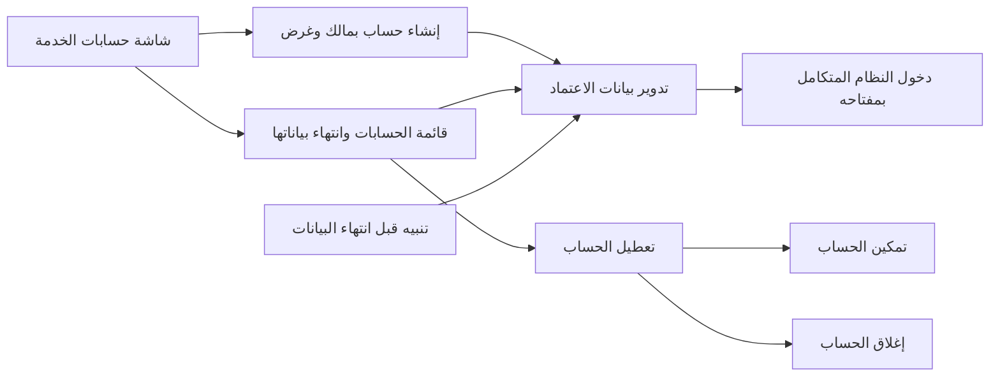
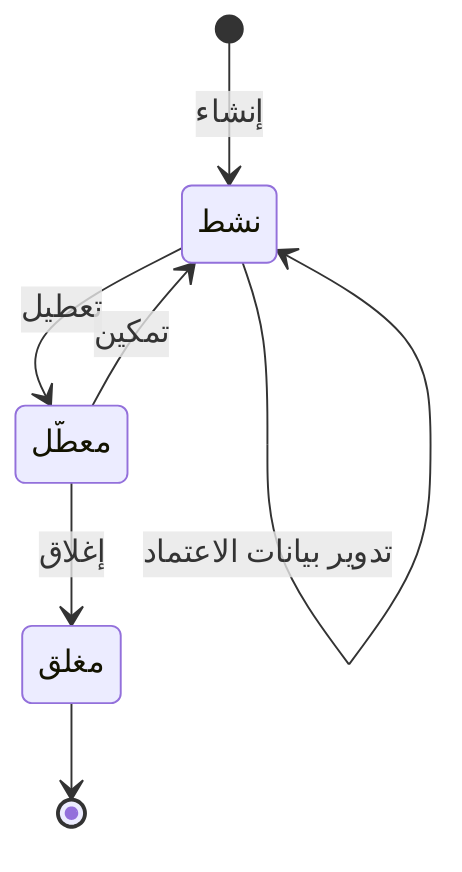

# حسابات الخدمة للأنظمة

<!-- BEGIN GENERATED: doc -->
| البند | القيمة |
|---|---|
| المعرّف | FEAT-ORG-SERVICE-ACCOUNTS |
| الإصدار | 0.1 |
| الحالة | مسودة |
| القدرة | CAP-01 إدارة المؤسسة والوصول |
| القدرة الفرعية | CAP-01.02 الهوية والمصادقة والاتحاد (R1) |
| الأدوار | مسؤول الإدارة |
| الشاشات | SCR-62 المستخدمون والأدوار والسلطة، SCR-65 المحوّلات والاتصالات والحساسات |
| حالات الاستخدام | UC-084 |
| القصص | 9: 5 من المواصفة، و4 جديدة |
<!-- END GENERATED: doc -->

## 1. نظرة عامة

### 1.1 القيمة

يتيح للمسؤول منح الأنظمة المتكاملة حسابات خاصة بها يمكن تعطيلها وتجديد بيانات اعتمادها وإغلاقها دون المساس بحسابات الأشخاص.

### 1.2 النطاق

| البند | القيمة |
|---|---|
| المستخدمون | مسؤول الإدارة ينشئ حسابات الخدمة ويجدد بيانات اعتمادها ويعطّلها ويغلقها، ومهندس التكامل يطّلع عليها من شاشة المحوّلات، والأنظمة المتكاملة تستعملها للدخول |
| الشاشات | SCR-62 المستخدمون والأدوار والسلطة، وSCR-65 المحوّلات والاتصالات والحساسات |
| حالات الاستخدام | إدارة وصول المستخدمين والاتحاد: هوية مستقلة لكل نظام متكامل، لا لشخص |
| المتطلبات | الشخص والهوية وحساب المستخدم وحساب الخدمة سجلات منفصلة بروابط صريحة، وحساب الخدمة بلا شخص (REQ-FND-006) |
| خارج النطاق | حسابات المستخدمين من البشر (ميزة «إدارة حسابات المستخدمين»)، وإعداد المحوّلات واتصالات التكامل نفسها (CAP-03)، وهويات عبء العمل بين خدمات المنصة الداخلية |

### 1.3 خريطة الميزة

**الشكل 1: خريطة ميزة حسابات الخدمة**



يمر حساب الخدمة بثلاث حالات (الشكل 2). ولا يدخل النظام المتكامل إلا بحساب نشط.

**الشكل 2: رحلة حساب الخدمة**



## 2. القواعد المشتركة

تنطبق على كل قصص الميزة، فلا تتكرر داخل القصص. وكل قصة تذكر ما يخصها فقط.

### 2.1 السياق المشترك

كل قصة تبدأ من ثلاثة شروط: مستأجر نشط، وحزمة السياسات الأساسية مفعّلة، ومستخدم مسجّل الدخول ومخوَّل. وتشير إليها القصص بخطوة واحدة: «بفرض السياق المشترك للميزة».

### 2.2 الصلاحية وعدم الإفصاح

- من لا يحق له رؤية العنصر يتلقى ردًا بشكل «غير متاح» تمامًا، فلا يعرف أنه موجود.
- من يرى العنصر ولا يحق له الإجراء يتلقى «لا تملك صلاحية هذا الإجراء».

### 2.3 أوامر تغيير الحالة

- **منع التكرار:** يُرسل كل أمر بمفتاح فريد، فإعادة الطلب نفسه لا تُنفَّذ مرتين.
- **حماية التعديل المتزامن:** يُرسل كل أمر بإصدار البيانات الذي يراه المستخدم. فإن عدّلها غيره في الأثناء، يُرفض الأمر.
- **السجل:** إن نجح الأمر، يُكتب حدثه وسجل التدقيق في المعاملة نفسها.

### 2.4 الرفض المشترك

```gherkin
# language: ar
خاصية: الرفض المشترك لأوامر الميزة

  سيناريو مخطط: رفض مشترك لكل أمر في الميزة
    بفرض السياق المشترك للميزة
    و <الحالة>
    عندما يُرسل المستخدم أي أمر من أوامر الميزة
    اذاً يُرفض برمز <الرمز> ويرى "<الرسالة>"
    و لا يتغير شيء

    امثلة:
      | الحالة                                  | الرمز                  | الرسالة                                                 |
      | العنصر خارج صلاحياته                    | NOT_FOUND              | غير متاح                                                |
      | العنصر مرئي له ولا يحق له الإجراء       | AUTHZ_DENIED           | لا تملك صلاحية هذا الإجراء                              |
      | غيره عدّل العنصر بعد أن فتحه            | VERSION_CONFLICT       | تغيّرت البيانات منذ فتحتها. راجع التغييرات ثم أعد المحاولة |
      | أعاد مفتاح منع التكرار بمحتوى مختلف     | IDEMPOTENCY_KEY_REUSED | طلب مكرر بمحتوى مختلف                                   |
      | البيانات ناقصة أو غير صحيحة             | VALIDATION_FAILED      | بعض البيانات ناقصة أو غير صحيحة. راجع الحقول المعلَّمة      |

  سيناريو: إعادة الطلب نفسه لا تُنفَّذ مرتين
    بفرض السياق المشترك للميزة
    و أمر نجح بمفتاح منع تكرار
    عندما يُعاد الطلب نفسه بالمفتاح نفسه
    اذاً تُعاد النتيجة الأولى ولا يُكتب حدث ثانٍ
```

### 2.5 قواعد حساب الخدمة

- **ليس لشخص:** حساب الخدمة لا يُربط بشخص أبدًا، فتعطيله أو إغلاقه لا يمس حسابات الأشخاص.
- **مالك مسؤول:** لكل حساب خدمة مالك من المستخدمين، حسابه نشط، يُسأل عن استعماله.
- **بيانات الاعتماد:** مفتاح عام يقدّمه النظام المتكامل، والمنصة تحفظ المفتاح العام وبصمته وتاريخ انتهائه فقط. ومدة صلاحيته 90 يومًا على الأكثر (`17-security-design.md` §2).

## 3. الجودة وتعريف الاكتمال

### 3.1 متطلبات الجودة

<!-- BEGIN GENERATED: quality -->
لا متطلبات جودة مرتبطة بمتطلبات هذه الميزة مباشرة. تنطبق متطلبات المنصة العامة (`FEAT-PLT-*`).
<!-- END GENERATED: quality -->

### 3.2 تعريف الاكتمال

القصة مكتملة حين تتحقق الشروط الخمسة:

1. سيناريوهاتها والقواعد المشتركة تمر في الاختبار الآلي.
2. فحوص البنية المعمارية تمر.
3. نصوص الواجهة والرسائل موجودة بالعربية والإنجليزية.
4. مراجعة الكود مكتملة.
5. ما تضيفه القصة نفسها في قسم «القواعد» تحقق.

## 4. فهرس القصص

<!-- BEGIN GENERATED: story-index -->
| المعرّف | القصة | النوع | الحالة |
|---|---|---|---|
| `US-BC01-SVC-CLOSE` | إغلاق حساب الخدمة | أمر | مسودة |
| `US-BC01-SVC-CREATE` | إنشاء حساب الخدمة | أمر | مسودة |
| `US-BC01-SVC-DISABLE` | تعطيل حساب الخدمة | أمر | مسودة |
| `US-BC01-SVC-ENABLE` | تمكين حساب الخدمة | أمر | مسودة |
| `US-BC01-SVC-ROTATE-CREDENTIAL` | تدوير بيانات اعتماد حساب الخدمة | أمر | مسودة |
| `US-DOM-SVC-LIST` | عرض حسابات الخدمة وحالة بيانات اعتمادها | جلب | مسودة |
| `US-UI-SCR62-SERVICE-ACCOUNTS` | إدارة حسابات الخدمة وتجديد بيانات اعتمادها | واجهة | مسودة |
| `US-INT-SVC-KEY-AUTHENTICATION` | مصادقة الأنظمة المتكاملة بمفتاح حساب الخدمة | تكامل | مسودة |
| `US-OPS-SVC-CREDENTIAL-EXPIRY` | تنبيه قبل انتهاء بيانات اعتماد حساب الخدمة | تشغيل | مسودة |
<!-- END GENERATED: story-index -->

## 5. القصص

### 5.1 US-BC01-SVC-CLOSE — إغلاق حساب الخدمة

| النوع | الإصدار | الأولوية | دون اتصال | الحالة |
|---|---|---|---|---|
| أمر | R1 | Must | لا | مسودة |

> **كـ** مسؤول الإدارة، **أريد** أن أغلق حساب خدمة لنظام توقف التكامل معه، **حتى** لا يُستعمل مرة أخرى.

**باختصار:** الحساب المعطَّل يُغلق نهائيًا. والإغلاق لا يكون إلا بعد التعطيل.

#### القواعد

- **متى يُسمح:** الحساب في حالة «معطَّل».
- **من يُسمح له:** مسؤول الإدارة في المستأجر نفسه.
- **الأثر:** يصبح الحساب «مغلقًا»، وهي حالة نهائية. ويُسجَّل حدث «أُغلق حساب الخدمة».

#### معايير القبول

```gherkin
# language: ar
خاصية: إغلاق حساب الخدمة

  سيناريو: إغلاق حساب معطَّل
    بفرض السياق المشترك للميزة
    و حساب خدمة في حالة "معطَّل"
    عندما يغلقه مسؤول الإدارة
    اذاً تصبح حالة الحساب "مغلق"
    و يُسجَّل حدث "أُغلق حساب الخدمة"

  سيناريو مخطط: رفض خاص بإغلاق حساب الخدمة
    بفرض السياق المشترك للميزة
    و <الحالة>
    عندما يحاول إغلاق الحساب
    اذاً يُرفض برمز <الرمز> ويرى "<الرسالة>"
    و لا يتغير شيء

    امثلة:
      | الحالة | الرمز | الرسالة |
      | الحساب "نشط" لم يُعطَّل بعد | SERVICE_ACCOUNT_INVALID_STATE_TRANSITION | الوضع الحالي لحساب الخدمة لا يسمح بهذا الإجراء |
      | الحساب "مغلق" من قبل | SERVICE_ACCOUNT_INVALID_STATE_TRANSITION | الوضع الحالي لحساب الخدمة لا يسمح بهذا الإجراء |
```

<details><summary>المراجع التقنية والتتبع</summary>

<!-- BEGIN GENERATED: refs US-BC01-SVC-CLOSE -->
| البند | المعرّف | المعنى |
|---|---|---|
| الواجهة البرمجية | `POST /api/v1/foundation/service-accounts/{id}/actions/close` | — |
| الأمر | `CMD-SVC-CLOSE` | إغلاق حساب الخدمة |
| السياسة | `POL-SVC-CLOSE` | Administrator؛ tenant match; subject ACTIVE; tenant ACTIVE (except TEN operations by platform) |
| الحدث | `EVT-SVC-CLOSED` | يصل إلى: Search/Directory projection (BC01 read model) |
| الكيان | `AGG-SERVICE-ACCOUNT` | حساب الخدمة |
| الجدول | `foundation.service_accounts` | الجدول الرئيسي لحساب الخدمة |
| وحدة النشر | DU-02 | — |
| المتطلب | REQ-FND-006 | The system shall maintain Person, Identity, User and Service Account as separate records with explicit links. |
| حالة الاستخدام | UC-084 | Manage User Access & Federation |
| الاختبار | TST-SERVICE-ACCOUNT-SM، TST-SLC01-INVARIANTS | دورة حالات حساب الخدمة، وثوابت الشريحة SLC-01 |
<!-- END GENERATED: refs US-BC01-SVC-CLOSE -->

</details>

### 5.2 US-BC01-SVC-CREATE — إنشاء حساب الخدمة

| النوع | الإصدار | الأولوية | دون اتصال | الحالة |
|---|---|---|---|---|
| أمر | R1 | Must | لا | مسودة |

> **كـ** مسؤول الإدارة، **أريد** أن أنشئ حساب خدمة لنظام متكامل باسم ومالك وغرض، **حتى** يكون له هوية خاصة به لا تختلط بحسابات الأشخاص.

**باختصار:** يُنشأ الحساب «نشطًا» مرتبطًا بمالك نشط وغرض مكتوب، ولا يُربط بشخص (القسم 2.5).

#### القواعد

- **متى يُسمح:** المالك مستخدم حسابه نشط، والغرض مذكور.
- **من يُسمح له:** مسؤول الإدارة في المستأجر نفسه.
- **البيانات:** الاسم (إلزامي)، والمالك (إلزامي، مستخدم في المستأجر)، والغرض (إلزامي).
- **الأثر:** حساب خدمة جديد في حالة «نشط». ويُسجَّل حدث «أُنشئ حساب الخدمة».

> **ملاحظة:** الإنشاء لا يحمل مفتاحًا، فيُضاف المفتاح الأول بتدوير بيانات الاعتماد (القصة 5.5) **[Derived]**.

#### معايير القبول

```gherkin
# language: ar
خاصية: إنشاء حساب الخدمة

  سيناريو: إنشاء حساب لمحوّل بمالك نشط
    بفرض السياق المشترك للميزة
    و مستخدم حسابه نشط ليكون مالكًا
    عندما ينشئ مسؤول الإدارة حساب خدمة باسم ومالك وغرض "استيراد سجلات الصيانة"
    اذاً يُنشأ الحساب في حالة "نشط" غير مرتبط بأي شخص
    و يُسجَّل حدث "أُنشئ حساب الخدمة"

  سيناريو مخطط: رفض خاص بإنشاء حساب الخدمة
    بفرض السياق المشترك للميزة
    و <الحالة>
    عندما يحاول إنشاء الحساب
    اذاً يُرفض برمز <الرمز> ويرى "<الرسالة>"
    و لا يتغير شيء

    امثلة:
      | الحالة | الرمز | الرسالة |
      | حساب المالك غير نشط | OWNER_REQUIRED | حدِّد مالكًا نشطًا والغرض |
      | الاسم فارغ | VALIDATION_FAILED | الاسم مطلوب |
      | المالك غير محدد | VALIDATION_FAILED | المالك مطلوب |
      | الغرض فارغ | VALIDATION_FAILED | الغرض مطلوب |
```

<details><summary>المراجع التقنية والتتبع</summary>

<!-- BEGIN GENERATED: refs US-BC01-SVC-CREATE -->
| البند | المعرّف | المعنى |
|---|---|---|
| الواجهة البرمجية | `POST /api/v1/foundation/service-accounts` | — |
| الأمر | `CMD-SVC-CREATE` | إنشاء حساب الخدمة |
| السياسة | `POL-SVC-CREATE` | Administrator؛ tenant match; subject ACTIVE; tenant ACTIVE (except TEN operations by platform) |
| الحدث | `EVT-SVC-CREATED` | يصل إلى: Search/Directory projection (BC01 read model) |
| الكيان | `AGG-SERVICE-ACCOUNT` | حساب الخدمة |
| الجدول | `foundation.service_accounts` | الجدول الرئيسي لحساب الخدمة |
| وحدة النشر | DU-02 | — |
| المتطلب | REQ-FND-006 | The system shall maintain Person, Identity, User and Service Account as separate records with explicit links. |
| حالة الاستخدام | UC-084 | Manage User Access & Federation |
| الاختبار | TST-SERVICE-ACCOUNT-SM، TST-SLC01-INVARIANTS | دورة حالات حساب الخدمة، وثوابت الشريحة SLC-01 |
<!-- END GENERATED: refs US-BC01-SVC-CREATE -->

</details>

### 5.3 US-BC01-SVC-DISABLE — تعطيل حساب الخدمة

| النوع | الإصدار | الأولوية | دون اتصال | الحالة |
|---|---|---|---|---|
| أمر | R1 | Must | لا | مسودة |

> **كـ** مسؤول الإدارة، **أريد** أن أعطّل حساب خدمة، **حتى** أوقف دخول النظام المتكامل فورًا دون أن أفقد الحساب.

**باختصار:** الحساب النشط يصبح «معطَّلًا»، ويمكن تمكينه لاحقًا أو إغلاقه.

#### القواعد

- **متى يُسمح:** الحساب في حالة «نشط».
- **من يُسمح له:** مسؤول الإدارة في المستأجر نفسه.
- **البيانات:** السبب (اختياري).
- **الأثر:** يصبح الحساب «معطَّلًا»، ويُسجَّل حدث «عُطِّل حساب الخدمة». ويُرفض دخول النظام المتكامل به (القصة 5.8) **[Derived]**.

#### معايير القبول

```gherkin
# language: ar
خاصية: تعطيل حساب الخدمة

  سيناريو: تعطيل حساب نشط
    بفرض السياق المشترك للميزة
    و حساب خدمة في حالة "نشط"
    عندما يعطّله مسؤول الإدارة مع سبب "اشتباه بتسرب المفتاح"
    اذاً تصبح حالة الحساب "معطَّل"
    و يُسجَّل حدث "عُطِّل حساب الخدمة" مع السبب

  سيناريو مخطط: رفض خاص بتعطيل حساب الخدمة
    بفرض السياق المشترك للميزة
    و <الحالة>
    عندما يحاول تعطيل الحساب
    اذاً يُرفض برمز <الرمز> ويرى "<الرسالة>"
    و لا يتغير شيء

    امثلة:
      | الحالة | الرمز | الرسالة |
      | الحساب "معطَّل" من قبل | SERVICE_ACCOUNT_INVALID_STATE_TRANSITION | الوضع الحالي لحساب الخدمة لا يسمح بهذا الإجراء |
      | الحساب "مغلق" | SERVICE_ACCOUNT_INVALID_STATE_TRANSITION | الوضع الحالي لحساب الخدمة لا يسمح بهذا الإجراء |
```

<details><summary>المراجع التقنية والتتبع</summary>

<!-- BEGIN GENERATED: refs US-BC01-SVC-DISABLE -->
| البند | المعرّف | المعنى |
|---|---|---|
| الواجهة البرمجية | `POST /api/v1/foundation/service-accounts/{id}/actions/disable` | — |
| الأمر | `CMD-SVC-DISABLE` | تعطيل حساب الخدمة |
| السياسة | `POL-SVC-DISABLE` | Administrator؛ tenant match; subject ACTIVE; tenant ACTIVE (except TEN operations by platform) |
| الحدث | `EVT-SVC-DISABLED` | يصل إلى: Search/Directory projection (BC01 read model) |
| الكيان | `AGG-SERVICE-ACCOUNT` | حساب الخدمة |
| الجدول | `foundation.service_accounts` | الجدول الرئيسي لحساب الخدمة |
| وحدة النشر | DU-02 | — |
| المتطلب | REQ-FND-006 | The system shall maintain Person, Identity, User and Service Account as separate records with explicit links. |
| حالة الاستخدام | UC-084 | Manage User Access & Federation |
| الاختبار | TST-SERVICE-ACCOUNT-SM، TST-SLC01-INVARIANTS | دورة حالات حساب الخدمة، وثوابت الشريحة SLC-01 |
<!-- END GENERATED: refs US-BC01-SVC-DISABLE -->

</details>

### 5.4 US-BC01-SVC-ENABLE — تمكين حساب الخدمة

| النوع | الإصدار | الأولوية | دون اتصال | الحالة |
|---|---|---|---|---|
| أمر | R1 | Must | لا | مسودة |

> **كـ** مسؤول الإدارة، **أريد** أن أمكّن حساب خدمة معطَّلًا، **حتى** يعود النظام المتكامل إلى العمل بعد زوال سبب التعطيل.

**باختصار:** الحساب المعطَّل يعود «نشطًا» إن كان مالكه ما زال نشطًا.

#### القواعد

- **متى يُسمح:** الحساب في حالة «معطَّل»، وحساب مالكه ما زال نشطًا.
- **من يُسمح له:** مسؤول الإدارة في المستأجر نفسه.
- **الأثر:** يصبح الحساب «نشطًا»، ويُسجَّل حدث «مُكِّن حساب الخدمة».

#### معايير القبول

```gherkin
# language: ar
خاصية: تمكين حساب الخدمة

  سيناريو: تمكين حساب مالكه نشط
    بفرض السياق المشترك للميزة
    و حساب خدمة في حالة "معطَّل" وحساب مالكه نشط
    عندما يمكّنه مسؤول الإدارة
    اذاً تصبح حالة الحساب "نشط"
    و يُسجَّل حدث "مُكِّن حساب الخدمة"

  سيناريو مخطط: رفض خاص بتمكين حساب الخدمة
    بفرض السياق المشترك للميزة
    و <الحالة>
    عندما يحاول تمكين الحساب
    اذاً يُرفض برمز <الرمز> ويرى "<الرسالة>"
    و لا يتغير شيء

    امثلة:
      | الحالة | الرمز | الرسالة |
      | حساب المالك لم يعد نشطًا | OWNER_REQUIRED | حدِّد مالكًا نشطًا والغرض |
      | الحساب "نشط" من قبل | SERVICE_ACCOUNT_INVALID_STATE_TRANSITION | الوضع الحالي لحساب الخدمة لا يسمح بهذا الإجراء |
      | الحساب "مغلق" | SERVICE_ACCOUNT_INVALID_STATE_TRANSITION | الوضع الحالي لحساب الخدمة لا يسمح بهذا الإجراء |
```

> **ملاحظة:** لا أمر في المصدر لتغيير مالك حساب الخدمة، فالحساب الذي غادر مالكه يبقى معطَّلًا حتى يُغلق **[Needs Review]**.

<details><summary>المراجع التقنية والتتبع</summary>

<!-- BEGIN GENERATED: refs US-BC01-SVC-ENABLE -->
| البند | المعرّف | المعنى |
|---|---|---|
| الواجهة البرمجية | `POST /api/v1/foundation/service-accounts/{id}/actions/enable` | — |
| الأمر | `CMD-SVC-ENABLE` | تمكين حساب الخدمة |
| السياسة | `POL-SVC-ENABLE` | Administrator؛ tenant match; subject ACTIVE; tenant ACTIVE (except TEN operations by platform) |
| الحدث | `EVT-SVC-ENABLED` | يصل إلى: Search/Directory projection (BC01 read model) |
| الكيان | `AGG-SERVICE-ACCOUNT` | حساب الخدمة |
| الجدول | `foundation.service_accounts` | الجدول الرئيسي لحساب الخدمة |
| وحدة النشر | DU-02 | — |
| المتطلب | REQ-FND-006 | The system shall maintain Person, Identity, User and Service Account as separate records with explicit links. |
| حالة الاستخدام | UC-084 | Manage User Access & Federation |
| الاختبار | TST-SERVICE-ACCOUNT-SM، TST-SLC01-INVARIANTS | دورة حالات حساب الخدمة، وثوابت الشريحة SLC-01 |
<!-- END GENERATED: refs US-BC01-SVC-ENABLE -->

</details>

### 5.5 US-BC01-SVC-ROTATE-CREDENTIAL — تدوير بيانات اعتماد حساب الخدمة

| النوع | الإصدار | الأولوية | دون اتصال | الحالة |
|---|---|---|---|---|
| أمر | R1 | Must | لا | مسودة |

> **كـ** مسؤول الإدارة، **أريد** أن أسجّل لحساب الخدمة مفتاحًا عامًا جديدًا بتاريخ انتهاء، **حتى** يبقى النظام المتكامل يعمل ببيانات اعتماد قصيرة العمر لا يطول ضرر تسربها.

**باختصار:** يُسجَّل للحساب النشط مفتاح عام جديد صالح 90 يومًا على الأكثر. ولا تتغير حالة الحساب.

#### القواعد

- **متى يُسمح:** الحساب في حالة «نشط»، وتاريخ انتهاء المفتاح الجديد بعد 90 يومًا على الأكثر.
- **من يُسمح له:** مسؤول الإدارة في المستأجر نفسه.
- **البيانات:** المفتاح العام (إلزامي)، وتاريخ الانتهاء (إلزامي).
- **الأثر:** تُحفظ للحساب بيانات اعتماد جديدة بالبصمة وتاريخ الانتهاء، ويزيد إصداره. ويُسجَّل حدث «دُوِّرت بيانات اعتماد حساب الخدمة».

> **ملاحظة:** المصدر لا يحدد هل يبقى المفتاح السابق صالحًا حتى انتهائه أم يُلغى عند التدوير **[Needs Review]**.

#### معايير القبول

```gherkin
# language: ar
خاصية: تدوير بيانات اعتماد حساب الخدمة

  سيناريو: تسجيل مفتاح جديد صالح 60 يومًا
    بفرض السياق المشترك للميزة
    و حساب خدمة في حالة "نشط"
    عندما يسجّل مسؤول الإدارة مفتاحًا عامًا جديدًا ينتهي بعد 60 يومًا
    اذاً تُحفظ بيانات الاعتماد الجديدة ببصمة المفتاح وتاريخ انتهائه
    و تبقى حالة الحساب "نشط"
    و يُسجَّل حدث "دُوِّرت بيانات اعتماد حساب الخدمة"

  سيناريو مخطط: رفض خاص بتدوير بيانات الاعتماد
    بفرض السياق المشترك للميزة
    و <الحالة>
    عندما يحاول تسجيل المفتاح الجديد
    اذاً يُرفض برمز <الرمز> ويرى "<الرسالة>"
    و لا يتغير شيء

    امثلة:
      | الحالة | الرمز | الرسالة |
      | تاريخ الانتهاء بعد 120 يومًا | CREDENTIAL_LIFETIME_EXCEEDED | مدة صلاحية بيانات الدخول لا تتجاوز 90 يومًا |
      | الحساب "معطَّل" | SERVICE_ACCOUNT_INVALID_STATE_TRANSITION | الوضع الحالي لحساب الخدمة لا يسمح بهذا الإجراء |
      | الحساب "مغلق" | SERVICE_ACCOUNT_INVALID_STATE_TRANSITION | الوضع الحالي لحساب الخدمة لا يسمح بهذا الإجراء |
      | المفتاح العام فارغ | VALIDATION_FAILED | المفتاح العام مطلوب |
      | تاريخ الانتهاء غير محدد | VALIDATION_FAILED | تاريخ الانتهاء مطلوب |
```

<details><summary>المراجع التقنية والتتبع</summary>

<!-- BEGIN GENERATED: refs US-BC01-SVC-ROTATE-CREDENTIAL -->
| البند | المعرّف | المعنى |
|---|---|---|
| الواجهة البرمجية | `POST /api/v1/foundation/service-accounts/{id}/actions/rotate-credential` | — |
| الأمر | `CMD-SVC-ROTATE-CREDENTIAL` | تدوير بيانات اعتماد حساب الخدمة |
| السياسة | `POL-SVC-ROTATE-CREDENTIAL` | Administrator؛ tenant match; subject ACTIVE; tenant ACTIVE (except TEN operations by platform) |
| الحدث | `EVT-SVC-CREDENTIAL-ROTATED` | يصل إلى: Search/Directory projection (BC01 read model) |
| الكيان | `AGG-SERVICE-ACCOUNT` | حساب الخدمة |
| الجدول | `foundation.service_accounts` | الجدول الرئيسي لحساب الخدمة |
| وحدة النشر | DU-02 | — |
| المتطلب | REQ-FND-006 | The system shall maintain Person, Identity, User and Service Account as separate records with explicit links. |
| حالة الاستخدام | UC-084 | Manage User Access & Federation |
| الاختبار | TST-SERVICE-ACCOUNT-SM، TST-SLC01-INVARIANTS | دورة حالات حساب الخدمة، وثوابت الشريحة SLC-01 |
<!-- END GENERATED: refs US-BC01-SVC-ROTATE-CREDENTIAL -->

</details>

### 5.6 US-DOM-SVC-LIST — عرض حسابات الخدمة وحالة بيانات اعتمادها

| النوع | الإصدار | الأولوية | دون اتصال | الحالة |
|---|---|---|---|---|
| جلب | R1 | Must | لا | مسودة |

> **كـ** مسؤول الإدارة، **أريد** قائمة بحسابات الخدمة ومالكيها وتاريخ انتهاء بيانات اعتمادها، **حتى** أعرف أيها يحتاج تدويرًا أو تعطيلًا.

**باختصار:** تُعاد حسابات الخدمة في المستأجر بحالتها ومالكها وغرضها وانتهاء بيانات اعتمادها، صفحةً بعد صفحة. والمواصفة لا تعرّف هذا الاستعلام بعد، فالقصة **[Derived]**.

#### القواعد

- **من يرى ماذا:** مسؤول الإدارة يرى كل حسابات مستأجره. ومهندس التكامل يراها من شاشة المحوّلات للعرض فقط **[Derived]**.
- **المرشحات:** الحالة، والمالك، والحسابات التي تنتهي بيانات اعتمادها قبل تاريخ، والمؤشر والحد **[Derived]**.
- **ما يُعاد لكل حساب:** الاسم والحالة والمالك والغرض، وبصمة المفتاح الساري وتاريخ انتهائه. ولا يُعاد المفتاح نفسه.

#### معايير القبول

```gherkin
# language: ar
خاصية: عرض حسابات الخدمة وحالة بيانات اعتمادها

  سيناريو: عرض الحسابات بانتهاء بياناتها
    بفرض السياق المشترك للميزة
    و في المستأجر حسابات خدمة نشطة ومعطَّلة
    عندما يطلب مسؤول الإدارة قائمة حسابات الخدمة
    اذاً تُعاد حسابات مستأجره فقط صفحةً بعد صفحة
    و يظهر لكل حساب حالته ومالكه وغرضه وبصمة مفتاحه وتاريخ انتهائه

  سيناريو: الحسابات التي تقترب بياناتها من الانتهاء
    بفرض السياق المشترك للميزة
    و حسابان تنتهي بيانات اعتمادهما خلال أسبوع وحساب بعد شهرين
    عندما يطلب مسؤول الإدارة الحسابات التي تنتهي بياناتها خلال أسبوع
    اذاً يُعاد الحسابان فقط
```

<details><summary>المراجع التقنية والتتبع</summary>

<!-- BEGIN GENERATED: refs US-DOM-SVC-LIST -->
| البند | المعرّف | المعنى |
|---|---|---|
| الشاشة | SCR-62 | شاشة المستخدمون والأدوار والسلطة |
| الشاشة | SCR-65 | شاشة المحوّلات والاتصالات والحساسات |
| المصدر | `[Derived]` | — |
| المتطلب | REQ-FND-006 | The system shall maintain Person, Identity, User and Service Account as separate records with explicit links. |
| حالة الاستخدام | UC-084 | Manage User Access & Federation |
<!-- END GENERATED: refs US-DOM-SVC-LIST -->

</details>

### 5.7 US-UI-SCR62-SERVICE-ACCOUNTS — إدارة حسابات الخدمة وتجديد بيانات اعتمادها

| النوع | الإصدار | الأولوية | دون اتصال | الحالة |
|---|---|---|---|---|
| واجهة | R1 | Should | لا | مسودة |

> **كـ** مسؤول الإدارة، **أريد** قسمًا لحسابات الخدمة أنشئها منه وأجدد مفاتيحها وأعطّلها وأغلقها، **حتى** أدير هويات الأنظمة المتكاملة من مكان واحد.

**باختصار:** يعرض القسم قائمة الحسابات بحالتها وانتهاء بيانات اعتمادها، وأزرار الإجراءات حسب حالة كل حساب. والقسم **[Derived]** من قواعد حساب الخدمة، لأن الشاشة لا تذكر حسابات الخدمة صراحة.

#### القواعد

- يظهر القسم في شاشة المستخدمين والأدوار، ويُفتح من شاشة المحوّلات للعرض.
- القائمة تميّز الحساب الذي تقترب بياناته من الانتهاء أو انتهت **[Derived]**.
- نموذج التدوير يقبل المفتاح العام نصًا، وتاريخ الانتهاء فيه لا يتجاوز 90 يومًا من اليوم (القسم 2.5).
- زر «تعطيل» للحساب النشط، وزرّا «تمكين» و«إغلاق» للمعطَّل فقط. والإغلاق يسبقه تأكيد بأنه نهائي **[Derived]**.
- عند رفض الخادم تعرض الشاشة رسالة المستخدم المعتمدة لرمز الخطأ، ولا يُغلق النموذج ولا يضيع ما أدخله المستخدم.

#### معايير القبول

```gherkin
# language: ar
خاصية: إدارة حسابات الخدمة وتجديد بيانات اعتمادها

  سيناريو: تدوير المفتاح من القائمة
    بفرض السياق المشترك للميزة
    و مسؤول الإدارة فتح قسم حسابات الخدمة وفيه حساب نشط تنتهي بياناته قريبًا
    عندما يفتح نموذج التدوير ويلصق المفتاح العام ويختار تاريخ انتهاء بعد 90 يومًا ويحفظ
    اذاً يظهر للحساب تاريخ الانتهاء الجديد ويزول تمييزه

  سيناريو: الأزرار حسب حالة الحساب
    بفرض السياق المشترك للميزة
    و في القسم حساب "معطَّل"
    عندما يعرض مسؤول الإدارة الحساب
    اذاً يرى زرّي "تمكين" و"إغلاق"
    لكن لا يرى زرّي "تعطيل" و"تدوير"

  سيناريو مخطط: استجابة القسم لرفض الخادم
    بفرض السياق المشترك للميزة
    و نموذج في قسم حسابات الخدمة مفتوح
    و <الحالة>
    عندما يحفظ المستخدم أو يضغط زر الإجراء
    اذاً تعرض الشاشة "<الرسالة>"
    و يبقى النموذج مفتوحًا بما أدخله المستخدم
    و لا يتغير شيء

    امثلة:
      | الحالة | الرمز | الرسالة |
      | تاريخ الانتهاء المرسل بعد أكثر من 90 يومًا | CREDENTIAL_LIFETIME_EXCEEDED | مدة صلاحية بيانات الدخول لا تتجاوز 90 يومًا |
      | مالك الحساب المعطَّل لم يعد نشطًا عند التمكين | OWNER_REQUIRED | حدِّد مالكًا نشطًا والغرض |
```

<details><summary>المراجع التقنية والتتبع</summary>

<!-- BEGIN GENERATED: refs US-UI-SCR62-SERVICE-ACCOUNTS -->
| البند | المعرّف | المعنى |
|---|---|---|
| الشاشة | SCR-62 | شاشة المستخدمون والأدوار والسلطة |
| الشاشة | SCR-65 | شاشة المحوّلات والاتصالات والحساسات |
| المصدر | `17-security-design.md §2` | — |
| المصدر | `[Derived]` | — |
<!-- END GENERATED: refs US-UI-SCR62-SERVICE-ACCOUNTS -->

</details>

### 5.8 US-INT-SVC-KEY-AUTHENTICATION — مصادقة الأنظمة المتكاملة بمفتاح حساب الخدمة

| النوع | الإصدار | الأولوية | دون اتصال | الحالة |
|---|---|---|---|---|
| تكامل | R1 | Should | لا ينطبق | مسودة |

> **كـ** مهندس التكامل، **أريد** أن يدخل المحوّل أو عميل تزويد المستخدمين إلى المنصة بمفتاح حساب الخدمة الخاص به، **حتى** تُنسب كل عملياته إلى حسابه وتخضع لصلاحياته كأي عميل.

**باختصار:** يثبت النظام المتكامل هويته بالمفتاح الخاص المقابل للمفتاح العام المسجَّل لحسابه. فيُقبل إن كان الحساب نشطًا والمفتاح غير منتهٍ، ويُرفض غير ذلك.

#### القواعد

- **متى يحدث:** عند كل طلب يرسله النظام المتكامل إلى المنصة.
- **البيانات:** إثبات موقَّع بالمفتاح الخاص للنظام، يُتحقق منه بالمفتاح العام المسجَّل. وطريقة التبادل نفسها لا يحددها المصدر **[Needs Review]**.
- **الأثر:** يُقبل الطلب بهوية حساب الخدمة ومستأجره، ويمر بفحص الصلاحية كأي طلب. فالمحوّل يكتب عبر أوامر المجال العادية، وعميل التزويد ينشئ مستخدمين بانتظار التفعيل ويربط الهويات فقط، ولا يسند أدوارًا أبدًا (`17-security-design.md` §2، `20-integration-design.md` §1).
- **الرفض:** الحساب المعطَّل أو المغلق، أو المفتاح المنتهي أو غير المسجَّل، يُرفض قبل أي وصول إلى البيانات **[Derived]**.

#### معايير القبول

```gherkin
# language: ar
خاصية: مصادقة الأنظمة المتكاملة بمفتاح حساب الخدمة

  سيناريو: محوّل يدخل بمفتاح ساري
    بفرض السياق المشترك للميزة
    و حساب خدمة "نشط" لمحوّل، وله مفتاح عام مسجَّل غير منتهٍ
    عندما يرسل المحوّل طلبًا موقَّعًا بالمفتاح الخاص المقابل
    اذاً يُقبل الطلب بهوية حساب الخدمة ومستأجره
    و يُنسب ما يُسجَّل من الطلب إلى حساب الخدمة في سجل التدقيق

  سيناريو مخطط: رفض دخول النظام المتكامل
    بفرض السياق المشترك للميزة
    و <الحالة>
    عندما يرسل النظام المتكامل طلبًا إلى المنصة
    اذاً يُرفض برمز <الرمز> ويرى "<الرسالة>"
    و لا يتغير شيء

    امثلة:
      | الحالة | الرمز | الرسالة |
      | حساب الخدمة "معطَّل" | UNAUTHENTICATED | يلزم تسجيل الدخول. سجّل الدخول ثم أعد المحاولة |
      | حساب الخدمة "مغلق" | UNAUTHENTICATED | يلزم تسجيل الدخول. سجّل الدخول ثم أعد المحاولة |
      | المفتاح المستعمل انتهت صلاحيته | UNAUTHENTICATED | يلزم تسجيل الدخول. سجّل الدخول ثم أعد المحاولة |
      | المفتاح غير مسجَّل لأي حساب | UNAUTHENTICATED | يلزم تسجيل الدخول. سجّل الدخول ثم أعد المحاولة |
```

<details><summary>المراجع التقنية والتتبع</summary>

<!-- BEGIN GENERATED: refs US-INT-SVC-KEY-AUTHENTICATION -->
| البند | المعرّف | المعنى |
|---|---|---|
| المصدر | `17-security-design.md §2` | — |
| المصدر | `20-integration-design.md §1` | — |
<!-- END GENERATED: refs US-INT-SVC-KEY-AUTHENTICATION -->

</details>

### 5.9 US-OPS-SVC-CREDENTIAL-EXPIRY — تنبيه قبل انتهاء بيانات اعتماد حساب الخدمة

| النوع | الإصدار | الأولوية | دون اتصال | الحالة |
|---|---|---|---|---|
| تشغيل | R1 | Should | لا ينطبق | مسودة |

> **كـ** مسؤول الإدارة، **أريد** تنبيهًا قبل انتهاء بيانات اعتماد أي حساب خدمة، **حتى** أدوّرها قبل أن يتوقف النظام المتكامل عن العمل.

**باختصار:** مدة بيانات الاعتماد 90 يومًا على الأكثر، فانتهاؤها متوقع. ويصل التنبيه إلى مالك الحساب ومسؤول الإدارة قبل الانتهاء بمهلة **[Derived]**.

#### القواعد

- يُنبَّه للحسابات النشطة فقط، ولا تنبيه لحساب دُوِّرت بياناته بتاريخ انتهاء أبعد من المهلة **[Derived]**.
- مدة المهلة وقناة التنبيه لا يحددها المصدر **[Needs Review]**.

#### معايير القبول

```gherkin
# language: ar
خاصية: تنبيه قبل انتهاء بيانات اعتماد حساب الخدمة

  سيناريو: تنبيه لحساب تقترب بياناته من الانتهاء
    بفرض حساب خدمة "نشط" تنتهي بيانات اعتماده خلال مهلة التنبيه
    عندما يحين فحص الانتهاء
    اذاً يصل تنبيه إلى مالك الحساب ومسؤول الإدارة باسم الحساب وتاريخ الانتهاء

  سيناريو: لا تنبيه بعد التدوير
    بفرض حساب خدمة "نشط" دُوِّرت بياناته وتاريخ انتهائها أبعد من مهلة التنبيه
    عندما يحين فحص الانتهاء
    اذاً لا يصل أي تنبيه عن هذا الحساب
```

<details><summary>المراجع التقنية والتتبع</summary>

<!-- BEGIN GENERATED: refs US-OPS-SVC-CREDENTIAL-EXPIRY -->
| البند | المعرّف | المعنى |
|---|---|---|
| المصدر | `17-security-design.md §2` | — |
| المصدر | `[Derived]` | — |
<!-- END GENERATED: refs US-OPS-SVC-CREDENTIAL-EXPIRY -->

</details>

## 6. التتبع

<!-- BEGIN GENERATED: trace -->
| المتطلب | المعنى | القصص | الاختبار |
|---|---|---|---|
| REQ-FND-006 | The system shall maintain Person, Identity, User and Service Account as separate records with explicit links. | `US-BC01-SVC-CLOSE`، `US-BC01-SVC-CREATE`، `US-BC01-SVC-DISABLE`، `US-BC01-SVC-ENABLE`، `US-BC01-SVC-ROTATE-CREDENTIAL`، `US-DOM-SVC-LIST` | TST-PERSON-SM، TST-SERVICE-ACCOUNT-SM، TST-USER-SM |
<!-- END GENERATED: trace -->

## 7. سجل التغييرات

| الإصدار | التاريخ | التغيير |
|---|---|---|
| 0.1 | — | هيكل مولَّد من خريطة الميزات |
| 0.2 | 2026-10-03 | كتابة القصص كاملة بمعيار القصص |
