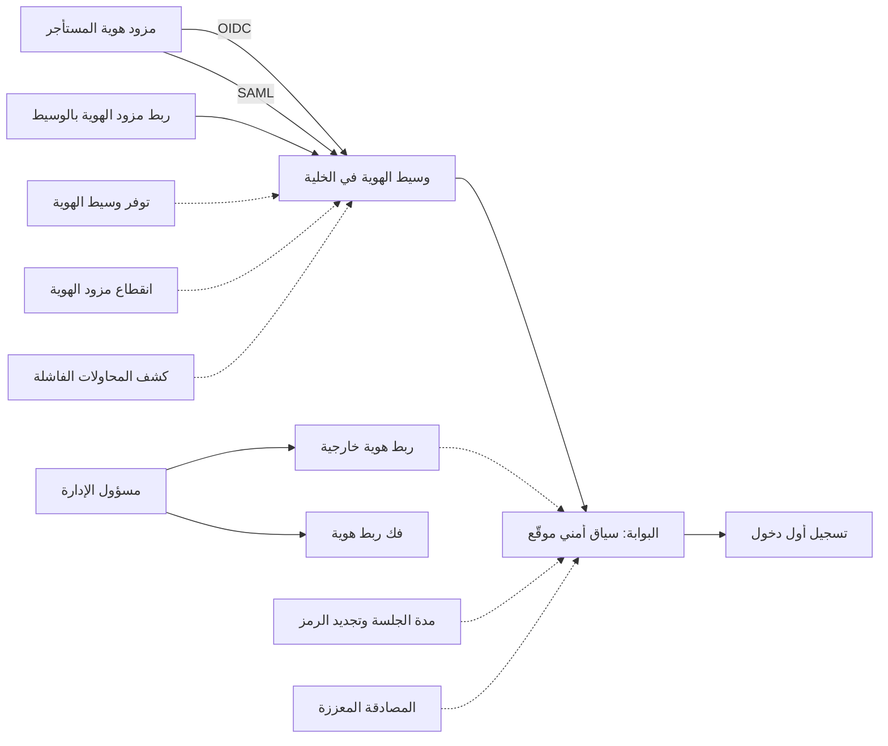
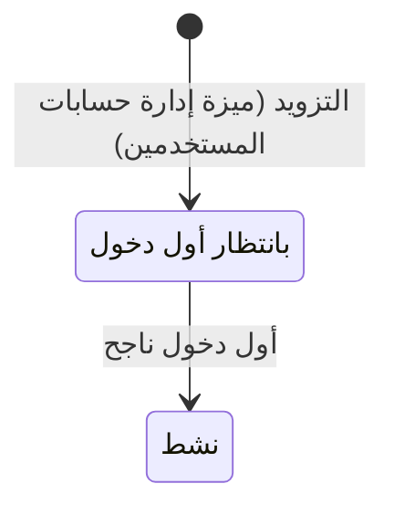

# الدخول الموحد وربط الهويات

<!-- BEGIN GENERATED: doc -->
| البند | القيمة |
|---|---|
| المعرّف | FEAT-ORG-SIGN-IN |
| الإصدار | 0.1 |
| الحالة | مسودة |
| القدرة | CAP-01 إدارة المؤسسة والوصول |
| القدرة الفرعية | CAP-01.02 الهوية والمصادقة والاتحاد (R1) |
| الأدوار | أي مستخدم مخوَّل؛ مسؤول الإدارة؛ النظام |
| الشاشات | SCR-62 المستخدمون والأدوار والسلطة |
| حالات الاستخدام | UC-084 |
| القصص | 11: 3 من المواصفة، و8 جديدة |
<!-- END GENERATED: doc -->

## 1. نظرة عامة

### 1.1 القيمة

يتيح للمستخدم الدخول بحسابه المؤسسي عبر مزود الهوية الخارجي دون كلمة مرور خاصة بالمنصة، ويتيح للمسؤول ربط الهويات الخارجية بالحساب.

### 1.2 النطاق

| البند | القيمة |
|---|---|
| المستخدمون | أي مستخدم مخوَّل يدخل بحسابه المؤسسي؛ مسؤول الإدارة يربط الهويات الخارجية بالحسابات ويفك ربطها؛ النظام يسجّل أول دخول؛ فريق المنصة وفريق التشغيل ومشغّل المنصة في الجلسة والتوفر والإعداد والمراقبة |
| الشاشات | المستخدمون والأدوار والسلطة (ربط الهويات وفكها)، وصفحة الدخول لدى مزود هوية المستأجر |
| حالات الاستخدام | إدارة وصول المستخدمين والاتحاد مع مزود الهوية |
| المتطلبات | دخول البشر عبر مزود هوية خارجي مُعدّ بـOIDC أو SAML فقط (REQ-FND-005)؛ الشخص والهوية والمستخدم وحساب الخدمة سجلات منفصلة بروابط صريحة (REQ-FND-006) |
| خارج النطاق | إنشاء الحسابات وقفلها وتعطيلها وإغلاقها، والتزويد عبر SCIM، وربط الحساب بالشخص («إدارة حسابات المستخدمين»)؛ فحص الصلاحية في كل طلب («فحص الوصول قبل كل طلب»)؛ حسابات الأنظمة («حسابات الخدمة للأنظمة») |

### 1.3 خريطة الميزة

يدخل المستخدم عبر مزود هوية مستأجره بأحد البروتوكولين، فيمر بوسيط الهوية في الخلية ثم البوابة التي تصدر سياقه الأمني. ويربط المسؤول الهويات بالحسابات أو يفك ربطها، ويسجّل النظام أول دخول. والشكل 1 يجمع القصص، والشكل 2 يبيّن الانتقال الوحيد الذي تُحدثه الميزة في حالة الحساب.

**الشكل 1: خريطة ميزة «الدخول الموحد وربط الهويات»**



**الشكل 2: حالة حساب المستخدم في هذه الميزة**



> **ملاحظة:** ربط الهوية وفكها لا يغيّران الحالة، ويُسمحان في كل حالات الحساب غير النهائية: «بانتظار أول دخول» و«نشط» و«مقفل» و«معطّل». أما «مغلق» فحالة نهائية (§2.5). وبقية الانتقالات (القفل والتعطيل والتمكين والإغلاق) في ميزة «إدارة حسابات المستخدمين».

## 2. القواعد المشتركة

تنطبق على كل قصص الميزة، فلا تتكرر داخل القصص. وكل قصة تذكر ما يخصها فقط.

### 2.1 السياق المشترك

كل قصة تبدأ من ثلاثة شروط: مستأجر نشط، وحزمة السياسات الأساسية مفعّلة، ومستخدم مسجّل الدخول ومخوَّل. وتشير إليها القصص بخطوة واحدة: «بفرض السياق المشترك للميزة».

### 2.2 الصلاحية وعدم الإفصاح

- من لا يحق له رؤية العنصر يتلقى ردًا بشكل «غير متاح» تمامًا، فلا يعرف أنه موجود.
- من يرى العنصر ولا يحق له الإجراء يتلقى «لا تملك صلاحية هذا الإجراء».

### 2.3 أوامر تغيير الحالة

- **منع التكرار:** يُرسل كل أمر بمفتاح فريد، فإعادة الطلب نفسه لا تُنفَّذ مرتين.
- **حماية التعديل المتزامن:** يُرسل كل أمر بإصدار البيانات الذي يراه المستخدم. فإن عدّلها غيره في الأثناء، يُرفض الأمر.
- **السجل:** إن نجح الأمر، يُكتب حدثه وسجل التدقيق في المعاملة نفسها.

### 2.4 الرفض المشترك

```gherkin
# language: ar
خاصية: الرفض المشترك لأوامر الميزة

  سيناريو مخطط: رفض مشترك لكل أمر في الميزة
    بفرض السياق المشترك للميزة
    و <الحالة>
    عندما يُرسل المستخدم أي أمر من أوامر الميزة
    اذاً يُرفض برمز <الرمز> ويرى "<الرسالة>"
    و لا يتغير شيء

    امثلة:
      | الحالة                                  | الرمز                  | الرسالة                                                 |
      | العنصر خارج صلاحياته                    | NOT_FOUND              | غير متاح                                                |
      | العنصر مرئي له ولا يحق له الإجراء       | AUTHZ_DENIED           | لا تملك صلاحية هذا الإجراء                              |
      | غيره عدّل العنصر بعد أن فتحه            | VERSION_CONFLICT       | تغيّرت البيانات منذ فتحتها. راجع التغييرات ثم أعد المحاولة |
      | أعاد مفتاح منع التكرار بمحتوى مختلف     | IDEMPOTENCY_KEY_REUSED | طلب مكرر بمحتوى مختلف                                   |
      | البيانات ناقصة أو غير صحيحة             | VALIDATION_FAILED      | بعض البيانات ناقصة أو غير صحيحة. راجع الحقول المعلَّمة      |

  سيناريو: إعادة الطلب نفسه لا تُنفَّذ مرتين
    بفرض السياق المشترك للميزة
    و أمر نجح بمفتاح منع تكرار
    عندما يُعاد الطلب نفسه بالمفتاح نفسه
    اذاً تُعاد النتيجة الأولى ولا يُكتب حدث ثانٍ
```

### 2.5 الحساب المغلق

«مغلق» حالة نهائية لحساب المستخدم، فيُرفض عليه كل أمر من أوامر هذه الميزة الثلاثة، حين يطابق الإصدار المرسَل إصدار الحساب. أما الشاشة التي فتحها المستخدم قبل الإغلاق فتتلقى رفض تعارض الإصدار المشترك (§2.4).

```gherkin
# language: ar
خاصية: الحساب المغلق يرفض أوامر الميزة

  سيناريو مخطط: أمر على حساب مغلق
    بفرض السياق المشترك للميزة
    و حساب مستخدم في حالة "مغلق"
    عندما يُرسل <الأمر> بإصدار الحساب الحالي
    اذاً يُرفض برمز <الرمز> ويرى "<الرسالة>"
    و لا يتغير شيء

    امثلة:
      | الأمر | الرمز | الرسالة |
      | ربط هوية خارجية | USER_INVALID_STATE_TRANSITION | الوضع الحالي لحساب المستخدم لا يسمح بهذا الإجراء |
      | فك ربط هوية | USER_INVALID_STATE_TRANSITION | الوضع الحالي لحساب المستخدم لا يسمح بهذا الإجراء |
      | تسجيل أول دخول | USER_INVALID_STATE_TRANSITION | الوضع الحالي لحساب المستخدم لا يسمح بهذا الإجراء |
```

## 3. الجودة وتعريف الاكتمال

### 3.1 متطلبات الجودة

<!-- BEGIN GENERATED: quality -->
لا متطلبات جودة مرتبطة بمتطلبات هذه الميزة مباشرة. تنطبق متطلبات المنصة العامة (`FEAT-PLT-*`).
<!-- END GENERATED: quality -->

### 3.2 تعريف الاكتمال

القصة مكتملة حين تتحقق الشروط الخمسة:

1. سيناريوهاتها والقواعد المشتركة تمر في الاختبار الآلي.
2. فحوص البنية المعمارية تمر.
3. نصوص الواجهة والرسائل موجودة بالعربية والإنجليزية.
4. مراجعة الكود مكتملة.
5. ما تضيفه القصة نفسها في قسم «القواعد» تحقق.

## 4. فهرس القصص

<!-- BEGIN GENERATED: story-index -->
| المعرّف | القصة | النوع | الحالة |
|---|---|---|---|
| `US-BC01-USR-LINK-IDENTITY` | ربط هوية خارجية بـحساب المستخدم | أمر | مسودة |
| `US-BC01-USR-RECORD-FIRST-SIGN-IN` | تسجيل أول دخول لـحساب المستخدم | أمر | مسودة |
| `US-BC01-USR-UNLINK-IDENTITY` | فك ربط هوية خارجية عن حساب المستخدم | أمر | مسودة |
| `US-PLT-SIGNIN-MFA-STEPUP` | المصادقة المعززة دون فقد المدخلات | منصة | مسودة |
| `US-PLT-SIGNIN-SESSION-LIFETIME` | إنهاء الجلسة بعد مدتها وتجديد الرمز | منصة | مسودة |
| `US-INT-IDP-OIDC-FEDERATION` | الدخول عبر مزود هوية المستأجر بـOIDC | تكامل | مسودة |
| `US-INT-IDP-SAML-FEDERATION` | الدخول عبر مزود هوية المستأجر بـSAML | تكامل | مسودة |
| `US-OPS-IDP-HIGH-AVAILABILITY` | توفر وسيط الهوية دون انقطاع | تشغيل | مسودة |
| `US-OPS-IDP-OUTAGE-BREAKGLASS` | تشغيل المنصة عند انقطاع مزود الهوية | تشغيل | مسودة |
| `US-OPS-IDP-TENANT-SETUP` | ربط مزود هوية المستأجر بوسيط الخلية | تشغيل | مسودة |
| `US-OPS-SIGNIN-BRUTE-FORCE` | كشف محاولات الدخول الفاشلة المتكررة | تشغيل | مسودة |
<!-- END GENERATED: story-index -->

## 5. القصص

### 5.1 US-BC01-USR-LINK-IDENTITY — ربط هوية خارجية بحساب المستخدم

| النوع | الإصدار | الأولوية | دون اتصال | الحالة |
|---|---|---|---|---|
| أمر | R1 | Must | لا | مسودة |

> **كـ** مسؤول الإدارة، **أريد** أن أربط هوية من مزود هوية المستأجر بحساب مستخدم، **حتى** يستطيع صاحب الحساب الدخول بها.

**باختصار:** يربط المسؤول بالحساب هوية خارجية تحددها الجهة المصدرة ومعرّف صاحبها لديها. ولا تتغير حالة الحساب.

#### القواعد

- **متى يُسمح:** الحساب في أي حالة غير «مغلق» (§2.5).
- **من يُسمح له:** مسؤول الإدارة الذي يشمل نطاقه وحدات صاحب الحساب، وحساب خدمة التزويد الذي يأتي من مزود الهوية عبر SCIM.
- **البيانات:** الجهة المصدرة للهوية (إلزامية)، ومعرّف صاحب الهوية لدى الجهة (إلزامي). والجهة يجب أن تكون مزود هوية مُعدًّا للمستأجر.
- **الأثر:** تُضاف الهوية إلى الحساب ويزيد إصداره دون تغيير حالته، ويُسجَّل حدث «رُبطت هوية بالحساب». ويصل الحدث إلى دليل المستخدمين في البحث. والهوية الواحدة لا تُربط إلا بحساب واحد في المستأجر.

> **ملاحظة:** المصدر يرفض الجهة غير المُعدّة بالرمز نفسه الذي يرفض الهوية المرتبطة بحساب آخر، ورسالته لا تناسب هذه الحالة **[Needs Review]**.

#### معايير القبول

```gherkin
# language: ar
خاصية: ربط هوية خارجية بحساب المستخدم

  سيناريو: المسؤول يربط هوية بحساب ينتظر أول دخول
    بفرض السياق المشترك للميزة
    و حساب مستخدم في حالة "بانتظار أول دخول" ضمن نطاق المسؤول
    و هوية من مزود هوية مُعدّ للمستأجر غير مرتبطة بأي حساب
    عندما يربط المسؤول الهوية بالحساب
    اذاً تظهر الهوية بين هويات الحساب
    و تبقى حالة الحساب "بانتظار أول دخول" ويزيد إصداره
    و يُسجَّل حدث "رُبطت هوية بالحساب"

  سيناريو مخطط: رفض خاص بربط الهوية
    بفرض السياق المشترك للميزة
    و <الحالة>
    عندما يحاول المسؤول ربط الهوية بالحساب
    اذاً يُرفض برمز <الرمز> ويرى "<الرسالة>"
    و لا يتغير شيء

    امثلة:
      | الحالة | الرمز | الرسالة |
      | الهوية مرتبطة بحساب آخر في المستأجر | IDENTITY_ALREADY_LINKED | هذه الهوية مرتبطة بحساب آخر |
      | لم تُحدَّد الجهة المصدرة | VALIDATION_FAILED | الجهة المصدرة مطلوبة |
      | لم يُحدَّد معرّف صاحب الهوية | VALIDATION_FAILED | معرّف صاحب الهوية مطلوب |
```

<details><summary>المراجع التقنية والتتبع</summary>

<!-- BEGIN GENERATED: refs US-BC01-USR-LINK-IDENTITY -->
| البند | المعرّف | المعنى |
|---|---|---|
| الواجهة البرمجية | `POST /api/v1/foundation/users/{id}/actions/link-identity` | — |
| الأمر | `CMD-USR-LINK-IDENTITY` | ربط هوية خارجية بـحساب المستخدم |
| السياسة | `POL-USR-LINK-IDENTITY` | Administrator with scope ⊇ user's units \| SCIM service account (provision/disable/enable) \| Security Officer… |
| الحدث | `EVT-USR-IDENTITY-LINKED` | يصل إلى: Search/Directory projection (BC01 read model) |
| الكيان | `AGG-USER` | حساب المستخدم |
| الجدول | `foundation.users` | الجدول الرئيسي لحساب المستخدم |
| وحدة النشر | DU-02 | — |
| المتطلبات | REQ-FND-005، REQ-FND-006 | معانيها في القسم 6. التتبع |
| حالة الاستخدام | UC-084 | Manage User Access & Federation |
| الاختبار | TST-USER-SM، TST-SLC01-INVARIANTS | دورة حالات حساب المستخدم، وثوابت الشريحة SLC-01 |
<!-- END GENERATED: refs US-BC01-USR-LINK-IDENTITY -->

</details>

### 5.2 US-BC01-USR-RECORD-FIRST-SIGN-IN — تسجيل أول دخول لحساب المستخدم

| النوع | الإصدار | الأولوية | دون اتصال | الحالة |
|---|---|---|---|---|
| أمر | R1 | Must | لا | مسودة |

> **كـ** النظام، **أريد** أن أسجّل أول دخول ناجح لحساب ينتظره، **حتى** يصبح الحساب «نشطًا» ويحصل صاحبه على سياقه الأمني.

**باختصار:** حين يدخل صاحب الحساب أول مرة بهوية مرتبطة به، يسجّل النظام هذا الدخول فيصير الحساب «نشطًا».

#### القواعد

- **متى يُسمح:** الحساب «بانتظار أول دخول»، وله هوية مرتبطة واحدة على الأقل، ومستأجره نشط.
- **من يُسمح له:** النظام وحده، بهوية خدمة التزويد أو المجدول. ولا يرسله مستخدم.
- **البيانات:** الجهة المصدرة ومعرّف صاحب الهوية التي دخل بها (إلزاميان).
- **الأثر:** يصير الحساب «نشطًا» ويُسجَّل حدث «فُعِّل الحساب». والحدث يؤثر في الصلاحيات: يرفع الإصدار الأمني للحساب فتُبطَل قرارات الصلاحية المخزنة، ويصل إلى دليل المستخدمين في البحث.

> **ملاحظة:** المصدر لا يذكر رمز رفض حين يكون المستأجر غير نشط أو لا هوية للحساب، مع أنهما من شروط الأمر **[Needs Review]**.

#### معايير القبول

```gherkin
# language: ar
خاصية: تسجيل أول دخول لحساب المستخدم

  سيناريو: أول دخول ناجح يفعّل الحساب
    بفرض السياق المشترك للميزة
    و حساب مستخدم في حالة "بانتظار أول دخول" له هوية مرتبطة
    عندما يدخل صاحبه أول مرة بهذه الهوية عبر مزود الهوية
    اذاً يسجّل النظام أول دخول للحساب
    و تصبح حالة الحساب "نشط"
    و يُسجَّل حدث "فُعِّل الحساب"

  سيناريو مخطط: رفض خاص بتسجيل أول دخول
    بفرض السياق المشترك للميزة
    و <الحالة>
    عندما يرسل النظام تسجيل أول دخول للحساب
    اذاً يُرفض برمز <الرمز> ويرى "<الرسالة>"
    و لا يتغير شيء

    امثلة:
      | الحالة | الرمز | الرسالة |
      | الحساب "نشط" من قبل | USER_INVALID_STATE_TRANSITION | الوضع الحالي لحساب المستخدم لا يسمح بهذا الإجراء |
      | الحساب "مقفل" | USER_INVALID_STATE_TRANSITION | الوضع الحالي لحساب المستخدم لا يسمح بهذا الإجراء |
      | الحساب "معطّل" | USER_INVALID_STATE_TRANSITION | الوضع الحالي لحساب المستخدم لا يسمح بهذا الإجراء |
      | لم تُحدَّد الجهة المصدرة | VALIDATION_FAILED | الجهة المصدرة مطلوبة |
```

<details><summary>المراجع التقنية والتتبع</summary>

<!-- BEGIN GENERATED: refs US-BC01-USR-RECORD-FIRST-SIGN-IN -->
| البند | المعرّف | المعنى |
|---|---|---|
| الواجهة البرمجية | `POST /api/v1/foundation/users/{id}/actions/record-first-sign-in` | — |
| الأمر | `CMD-USR-RECORD-FIRST-SIGN-IN` | تسجيل أول دخول لـحساب المستخدم |
| السياسة | `POL-USR-RECORD-FIRST-SIGN-IN` | workload identity: scheduler / provisioning saga؛ tenant match; subject ACTIVE; tenant ACTIVE (except TEN ope… |
| الحدث | `EVT-USR-ACTIVATED` | يصل إلى: Security-version service (EVT-SEC-VERSION-INCREMENTED); PEP decision caches; Projection security-ver… |
| الكيان | `AGG-USER` | حساب المستخدم |
| الجدول | `foundation.users` | الجدول الرئيسي لحساب المستخدم |
| وحدة النشر | DU-02 | — |
| المتطلبات | REQ-FND-005، REQ-FND-006 | معانيها في القسم 6. التتبع |
| حالة الاستخدام | UC-084 | Manage User Access & Federation |
| الاختبار | TST-USER-SM، TST-SLC01-INVARIANTS | دورة حالات حساب المستخدم، وثوابت الشريحة SLC-01 |
<!-- END GENERATED: refs US-BC01-USR-RECORD-FIRST-SIGN-IN -->

</details>

### 5.3 US-BC01-USR-UNLINK-IDENTITY — فك ربط هوية خارجية عن حساب المستخدم

| النوع | الإصدار | الأولوية | دون اتصال | الحالة |
|---|---|---|---|---|
| أمر | R1 | Must | لا | مسودة |

> **كـ** مسؤول الإدارة، **أريد** أن أفك ربط هوية خارجية عن حساب مستخدم، **حتى** لا يدخل أحد بهوية لم تعد تخص صاحب الحساب.

**باختصار:** يفك المسؤول ربط هوية عن الحساب دون تغيير حالته، على أن يبقى للحساب النشط هوية واحدة على الأقل.

#### القواعد

- **متى يُسمح:** الحساب في أي حالة غير «مغلق» (§2.5). وإن كان «نشطًا» فيجب أن تبقى له هوية أخرى بعد الفك.
- **من يُسمح له:** مسؤول الإدارة الذي يشمل نطاقه وحدات صاحب الحساب، وحساب خدمة التزويد عبر SCIM.
- **البيانات:** الجهة المصدرة للهوية (إلزامية)، ومعرّف صاحب الهوية لدى الجهة (إلزامي).
- **الأثر:** تُزال الهوية من الحساب ويزيد إصداره دون تغيير حالته، ويُسجَّل حدث «فُكّ ربط هوية عن الحساب». والحدث يؤثر في الصلاحيات: يرفع الإصدار الأمني للحساب، فيُعاد بناء سياقه الأمني في الطلب التالي (QAS-SEC-003).
- الحساب غير النشط قد يبقى بلا هوية، لكنه لا يُفعَّل بأول دخول ولا يُمكَّن من جديد حتى تُربط له هوية.

#### معايير القبول

```gherkin
# language: ar
خاصية: فك ربط هوية خارجية عن حساب المستخدم

  سيناريو: المسؤول يفك هوية من حساب نشط له هويتان
    بفرض السياق المشترك للميزة
    و حساب مستخدم في حالة "نشط" ضمن نطاق المسؤول وله هويتان مرتبطتان
    عندما يفك المسؤول ربط إحدى الهويتين
    اذاً تختفي الهوية من هويات الحساب وتبقى الأخرى
    و تبقى حالة الحساب "نشط" ويزيد إصداره
    و يُسجَّل حدث "فُكّ ربط هوية عن الحساب"

  سيناريو مخطط: رفض خاص بفك ربط الهوية
    بفرض السياق المشترك للميزة
    و <الحالة>
    عندما يحاول المسؤول فك ربط الهوية
    اذاً يُرفض برمز <الرمز> ويرى "<الرسالة>"
    و لا يتغير شيء

    امثلة:
      | الحالة | الرمز | الرسالة |
      | الحساب "نشط" والهوية آخر هوية له | LAST_IDENTITY | يجب أن يبقى للحساب النشط هوية واحدة على الأقل |
      | لم تُحدَّد الجهة المصدرة | VALIDATION_FAILED | الجهة المصدرة مطلوبة |
      | لم يُحدَّد معرّف صاحب الهوية | VALIDATION_FAILED | معرّف صاحب الهوية مطلوب |
```

<details><summary>المراجع التقنية والتتبع</summary>

<!-- BEGIN GENERATED: refs US-BC01-USR-UNLINK-IDENTITY -->
| البند | المعرّف | المعنى |
|---|---|---|
| الواجهة البرمجية | `POST /api/v1/foundation/users/{id}/actions/unlink-identity` | — |
| الأمر | `CMD-USR-UNLINK-IDENTITY` | فك ربط هوية خارجية عن حساب المستخدم |
| السياسة | `POL-USR-UNLINK-IDENTITY` | Administrator with scope ⊇ user's units \| SCIM service account (provision/disable/enable) \| Security Officer… |
| الحدث | `EVT-USR-IDENTITY-UNLINKED` | يصل إلى: Security-version service (EVT-SEC-VERSION-INCREMENTED); PEP decision caches; Projection security-ver… |
| الكيان | `AGG-USER` | حساب المستخدم |
| الجدول | `foundation.users` | الجدول الرئيسي لحساب المستخدم |
| وحدة النشر | DU-02 | — |
| المتطلبات | REQ-FND-005، REQ-FND-006 | معانيها في القسم 6. التتبع |
| حالة الاستخدام | UC-084 | Manage User Access & Federation |
| الاختبار | TST-USER-SM، TST-SLC01-INVARIANTS | دورة حالات حساب المستخدم، وثوابت الشريحة SLC-01 |
<!-- END GENERATED: refs US-BC01-USR-UNLINK-IDENTITY -->

</details>

### 5.4 US-PLT-SIGNIN-MFA-STEPUP — المصادقة المعززة دون فقد المدخلات

| النوع | الإصدار | الأولوية | دون اتصال | الحالة |
|---|---|---|---|---|
| منصة | R1 | Should | لا ينطبق | مسودة |

> **كـ** فريق المنصة، **أريد** أن يُطلب من المستخدم تأكيد هويته بمصادقة أقوى حين يشترطها الأمر، **حتى** لا يُنفَّذ أمر حساس بجلسة أضعف، ولا يفقد المستخدم ما أدخله، ولا يُنفَّذ الأمر مرتين.

**باختصار:** الأمر الذي يشترط مصادقة معززة يُرفض قبل تنفيذه إن كانت الجلسة أضعف، ثم يُعاد بعد تأكيد الهوية بمفتاح منع التكرار نفسه.

#### القواعد

- 33 أمرًا تشترط المصادقة المعززة، منها اعتماد منح السلطة، ومنح التصريح الأمني، واعتماد السياسات، ووضع التجميد القانوني. ولا أمر من أوامر هذه الميزة بينها.
- يقع الفحص بعد التخويل الكامل وقبل فحص الإصدار، فلا يُنفَّذ شيء قبله (ADR-P19).
- الرد يحمل قوة المصادقة المطلوبة تحديًا يُرسَل إلى مزود الهوية.
- تُبقي الواجهة النموذج مفتوحًا بما فيه، وتعيد الأمر بعد التأكيد بمفتاح منع التكرار نفسه، فلا يُنفَّذ مرتين.

#### معايير القبول

```gherkin
# language: ar
خاصية: المصادقة المعززة دون فقد المدخلات

  سيناريو: أمر حساس بجلسة أضعف ثم تأكيد الهوية
    بفرض السياق المشترك للميزة
    و جلسة المستخدم بقوة مصادقة أدنى مما يشترطه الأمر
    عندما يرسل أمرًا يشترط المصادقة المعززة
    اذاً يرى "هذا الإجراء يحتاج تأكيد هويتك مرة أخرى" ولا يُنفَّذ الأمر
    و يبقى النموذج مفتوحًا بما أدخله
    عندما يؤكد هويته لدى مزود الهوية
    اذاً يُعاد الأمر بمفتاح منع التكرار نفسه ويُنفَّذ مرة واحدة

  سيناريو: جلسة بقوة كافية
    بفرض السياق المشترك للميزة
    و جلسة المستخدم بقوة المصادقة التي يشترطها الأمر
    عندما يرسل الأمر
    اذاً يُنفَّذ دون طلب تأكيد الهوية
```

<details><summary>المراجع التقنية والتتبع</summary>

<!-- BEGIN GENERATED: refs US-PLT-SIGNIN-MFA-STEPUP -->
| البند | المعرّف | المعنى |
|---|---|---|
| القرار المعماري | ADR-P19 | Handling of Authorization Outcomes (403 vs 404, MFA step-up, approval-required) |
| المصدر | `17-security-design.md §12.3` | — |
| المصدر | `21-ui-design.md §6.2` | — |
<!-- END GENERATED: refs US-PLT-SIGNIN-MFA-STEPUP -->

</details>

### 5.5 US-PLT-SIGNIN-SESSION-LIFETIME — إنهاء الجلسة بعد مدتها وتجديد الرمز

| النوع | الإصدار | الأولوية | دون اتصال | الحالة |
|---|---|---|---|---|
| منصة | R1 | Should | لا ينطبق | مسودة |

> **كـ** فريق المنصة، **أريد** أن تنتهي الجلسة بعد مدة قصيرة وأن يُجدَّد رمزها ما دام الحساب صالحًا، **حتى** لا يبقى رمز مسرَّب صالحًا طويلًا، ولا يبقى صاحب حساب معطّل داخل المنصة.

#### القواعد

- رمز الجلسة الخارجي صالح 15 دقيقة على الأكثر ويُجدَّد، والسياق الأمني الداخلي 60 ثانية على الأكثر ويُعاد بناؤه.
- الرموز قصيرة العمر ومربوطة بالجهاز، ولا يُحفظ أي محتوى في تخزين المتصفح المحلي.
- الحساب «المعطّل» أو «المقفل» أو «المغلق» لا يحصل على سياق أمني، فلا يُجدَّد رمزه **[Derived]**. والتعطيل عبر SCIM نافذ في كل الجلسات خلال 5 دقائق (QAS-SEC-008).
- إذا رد الخادم بأن تسجيل الدخول يلزم، تعيد الواجهة الدخول ثم تعود إلى النموذج الذي كان المستخدم فيه.

#### معايير القبول

```gherkin
# language: ar
خاصية: إنهاء الجلسة بعد مدتها وتجديد الرمز

  سيناريو: تجديد الرمز لحساب نشط
    بفرض السياق المشترك للميزة
    و رمز جلسة يقترب من نهاية مدته وحساب صاحبه "نشط"
    عندما يواصل المستخدم العمل
    اذاً يُجدَّد الرمز دون أن يُطلب منه الدخول من جديد

  سيناريو: رمز انتهت مدته
    بفرض السياق المشترك للميزة
    و رمز جلسة مضت عليه أكثر من 15 دقيقة دون تجديد
    عندما يرسل المستخدم طلبًا
    اذاً يرى "يلزم تسجيل الدخول. سجّل الدخول ثم أعد المحاولة"
    و بعد الدخول يعود إلى النموذج الذي كان فيه

  سيناريو: حساب عُطّل أثناء الجلسة
    بفرض حساب "نشط" له جلسة قائمة
    عندما يُعطَّل الحساب عبر SCIM
    اذاً يُرفض كل طلب له في كل جلساته خلال 5 دقائق
```

<details><summary>المراجع التقنية والتتبع</summary>

<!-- BEGIN GENERATED: refs US-PLT-SIGNIN-SESSION-LIFETIME -->
| البند | المعرّف | المعنى |
|---|---|---|
| المصدر | `17-security-design.md §10` | — |
| المصدر | `12-solution/ui-architecture.md` | — |
| المصدر | `21-ui-design.md §6.2` | — |
<!-- END GENERATED: refs US-PLT-SIGNIN-SESSION-LIFETIME -->

</details>

### 5.6 US-INT-IDP-OIDC-FEDERATION — الدخول عبر مزود هوية المستأجر بـOIDC

| النوع | الإصدار | الأولوية | دون اتصال | الحالة |
|---|---|---|---|---|
| تكامل | R1 | Must | لا ينطبق | مسودة |

> **كـ** أي مستخدم مخوَّل، **أريد** أن أدخل بحسابي المؤسسي عبر مزود هوية جهتي بـOIDC، **حتى** لا أحتاج كلمة مرور خاصة بالمنصة.

**باختصار:** يوجّه وسيط الهوية في الخلية المستخدم إلى مزود هوية مستأجره بـOIDC. وعند عودته بهوية صحيحة تتحقق البوابة من الرمز وتصدر سياقًا أمنيًا موقّعًا للحساب المرتبط بتلك الهوية.

#### القواعد

- **متى يحدث:** حين يفتح المستخدم المنصة دون جلسة صالحة، ومستأجره مضبوط على مزود هوية بـOIDC (القصة 5.10).
- **البيانات:** يعيد مزود الهوية رمزًا يحمل الجهة المصدرة ومعرّف صاحب الهوية. والمستأجر يُستخرج من الرمز لا من الطلب، والاتصال بـTLS 1.3 مع حماية من تزوير الطلبات بين المواقع.
- **الأثر:** تُطابق الهوية بالحساب المرتبط بها في المستأجر، ويصدر سياق أمني موقّع بأدواره وتصريحه. فإن كان الحساب «بانتظار أول دخول» يسجّل النظام أول دخول (القصة 5.2).
- المنصة لا تدير كلمات مرور للبشر، وكل دخول بشري يمر بمزود هوية مُعدّ (REQ-FND-005).
- الرد على الهوية غير المرتبطة بحساب، وعلى الحساب الذي لا يحصل على سياق أمني، لا يحدده المصدر برمز. والمقترح رد «يلزم تسجيل الدخول» **[Derived]** **[Needs Review]**.

#### معايير القبول

```gherkin
# language: ar
خاصية: الدخول عبر مزود هوية المستأجر بـOIDC

  سيناريو: دخول بهوية مرتبطة بحساب نشط
    بفرض مستأجر نشط مضبوط على مزود هوية بـOIDC
    و حساب "نشط" مرتبط بهوية من هذا المزود
    عندما يدخل صاحبه عبر مزود الهوية بنجاح
    اذاً تصدر البوابة سياقًا أمنيًا موقّعًا لحسابه في مستأجره
    و يفتح المنصة دون كلمة مرور خاصة بها

  سيناريو مخطط: دخول لا يمنح سياقًا أمنيًا
    بفرض مستأجر نشط مضبوط على مزود هوية بـOIDC
    و <الحالة>
    عندما يحاول المستخدم فتح المنصة
    اذاً يُرفض برمز <الرمز> ويرى "<الرسالة>"
    و لا يتغير شيء

    امثلة:
      | الحالة | الرمز | الرسالة |
      | الهوية غير مرتبطة بأي حساب في المستأجر | UNAUTHENTICATED | يلزم تسجيل الدخول. سجّل الدخول ثم أعد المحاولة |
      | الحساب المرتبط "معطّل" أو "مقفل" | UNAUTHENTICATED | يلزم تسجيل الدخول. سجّل الدخول ثم أعد المحاولة |
      | محاولات كثيرة من المصدر نفسه في وقت قصير | RATE_LIMITED | طلبات كثيرة في وقت قصير. انتظر قليلًا ثم أعد المحاولة |
```

<details><summary>المراجع التقنية والتتبع</summary>

<!-- BEGIN GENERATED: refs US-INT-IDP-OIDC-FEDERATION -->
| البند | المعرّف | المعنى |
|---|---|---|
| القرار التقني | TD-09 | Keycloak per cell as OIDC/SAML federation broker to tenant IdPs; SCIM via provisioning service in BC01 |
| المصدر | `20-integration-design.md §4` | — |
| المتطلب | REQ-FND-005 | The system shall authenticate human users only through a configured external identity provider using OIDC or… |
| حالة الاستخدام | UC-084 | Manage User Access & Federation |
<!-- END GENERATED: refs US-INT-IDP-OIDC-FEDERATION -->

</details>

### 5.7 US-INT-IDP-SAML-FEDERATION — الدخول عبر مزود هوية المستأجر بـSAML

| النوع | الإصدار | الأولوية | دون اتصال | الحالة |
|---|---|---|---|---|
| تكامل | R1 | Must | لا ينطبق | مسودة |

> **كـ** أي مستخدم مخوَّل، **أريد** أن أدخل بحسابي المؤسسي عبر مزود هوية جهتي بـSAML، **حتى** تستطيع الجهات التي لا تدعم OIDC استخدام المنصة.

**باختصار:** مثل الدخول بـOIDC (القصة 5.6)، لكن مزود الهوية يرد بإقرار SAML، ويحوّله وسيط الهوية في الخلية إلى رمز المنصة نفسه.

#### القواعد

- **متى يحدث:** حين يفتح المستخدم المنصة دون جلسة صالحة، ومستأجره مضبوط على مزود هوية بـSAML.
- **البيانات:** إقرار SAML موقّع من مزود الهوية يحمل الجهة المصدرة ومعرّف صاحب الهوية.
- **الأثر:** يصدر الوسيط رمز المنصة المعتاد، فتمر البوابة والسياق الأمني ومطابقة الحساب كما في القصة 5.6 **[Derived]**.
- الرد على الهوية غير المرتبطة أو الحساب غير النشط كما في القصة 5.6 **[Derived]** **[Needs Review]**.

#### معايير القبول

```gherkin
# language: ar
خاصية: الدخول عبر مزود هوية المستأجر بـSAML

  سيناريو: دخول بإقرار SAML صحيح
    بفرض مستأجر نشط مضبوط على مزود هوية بـSAML
    و حساب "نشط" مرتبط بهوية من هذا المزود
    عندما يدخل صاحبه ويعود بإقرار SAML موقّع
    اذاً يصدر وسيط الهوية رمز المنصة
    و تصدر البوابة سياقًا أمنيًا موقّعًا لحسابه في مستأجره

  سيناريو مخطط: إقرار لا يمنح سياقًا أمنيًا
    بفرض مستأجر نشط مضبوط على مزود هوية بـSAML
    و <الحالة>
    عندما يحاول المستخدم فتح المنصة
    اذاً يُرفض برمز <الرمز> ويرى "<الرسالة>"
    و لا يتغير شيء

    امثلة:
      | الحالة | الرمز | الرسالة |
      | الهوية في الإقرار غير مرتبطة بأي حساب في المستأجر | UNAUTHENTICATED | يلزم تسجيل الدخول. سجّل الدخول ثم أعد المحاولة |
      | الحساب المرتبط "معطّل" أو "مقفل" | UNAUTHENTICATED | يلزم تسجيل الدخول. سجّل الدخول ثم أعد المحاولة |
```

<details><summary>المراجع التقنية والتتبع</summary>

<!-- BEGIN GENERATED: refs US-INT-IDP-SAML-FEDERATION -->
| البند | المعرّف | المعنى |
|---|---|---|
| القرار التقني | TD-09 | Keycloak per cell as OIDC/SAML federation broker to tenant IdPs; SCIM via provisioning service in BC01 |
| المصدر | `20-integration-design.md §4` | — |
| المتطلب | REQ-FND-005 | The system shall authenticate human users only through a configured external identity provider using OIDC or… |
| حالة الاستخدام | UC-084 | Manage User Access & Federation |
<!-- END GENERATED: refs US-INT-IDP-SAML-FEDERATION -->

</details>

### 5.8 US-OPS-IDP-HIGH-AVAILABILITY — توفر وسيط الهوية دون انقطاع

| النوع | الإصدار | الأولوية | دون اتصال | الحالة |
|---|---|---|---|---|
| تشغيل | R1 | Should | لا ينطبق | مسودة |

> **كـ** فريق التشغيل، **أريد** أن يبقى وسيط الهوية في الخلية متاحًا إذا توقفت إحدى نسخه، **حتى** لا يتوقف الدخول الجديد بسبب عطل واحد.

#### القواعد

- وسيط هوية واحد لكل خلية، يربط مزودات هوية المستأجرين بالمنصة (TD-09).
- المصدر لا يحدد توفره العالي ولا نسخه الاحتياطي. والمقترح: نسختان على الأقل، وقاعدة بياناته في عنقود قاعدة بيانات الخلية فيرث نسخه الاحتياطي واستعادته **[Derived]**.
- الجلسات القائمة لا تعتمد على الوسيط حتى تنتهي مدتها (15 دقيقة على الأكثر).

#### معايير القبول

```gherkin
# language: ar
خاصية: توفر وسيط الهوية دون انقطاع

  سيناريو: توقف إحدى نسخ الوسيط
    بفرض وسيط هوية يعمل بنسختين في الخلية
    عندما تتوقف إحدى النسختين
    اذاً يستمر الدخول الجديد عبر النسخة الأخرى
    و لا تنقطع الجلسات القائمة

  سيناريو: استعادة الوسيط بعد فقد بياناته
    بفرض نسخة احتياطية حديثة لقاعدة بيانات الخلية
    عندما تُستعاد قاعدة بيانات الوسيط منها
    اذاً تعود إعدادات مزودات هوية المستأجرين كما كانت
```

<details><summary>المراجع التقنية والتتبع</summary>

<!-- BEGIN GENERATED: refs US-OPS-IDP-HIGH-AVAILABILITY -->
| البند | المعرّف | المعنى |
|---|---|---|
| المصدر | `22-deployment-design.md §5` | — |
| القرار التقني | TD-09 | Keycloak per cell as OIDC/SAML federation broker to tenant IdPs; SCIM via provisioning service in BC01 |
| المصدر | `[Derived]` | — |
<!-- END GENERATED: refs US-OPS-IDP-HIGH-AVAILABILITY -->

</details>

### 5.9 US-OPS-IDP-OUTAGE-BREAKGLASS — تشغيل المنصة عند انقطاع مزود الهوية

| النوع | الإصدار | الأولوية | دون اتصال | الحالة |
|---|---|---|---|---|
| تشغيل | R1 | Should | لا ينطبق | مسودة |

> **كـ** فريق التشغيل، **أريد** إجراء طوارئ محكومًا حين ينقطع مزود الهوية، **حتى** أشغّل المنصة وأستعيد الهوية دون أن يصل أحد إلى بيانات المستأجرين.

#### القواعد

- عند انقطاع مزود الهوية تبقى الجلسات القائمة حتى نهاية مدتها (15 دقيقة على الأكثر)، ويتوقف الدخول الجديد.
- المصدران يختلفان: خطة الاستمرارية تذكر إجراء طوارئ بحسابات لشخصين، ومصفوفة التدهور تقول «لا بديل يدوي» لأسباب أمنية **[Needs Review]**.
- المقترح **[Derived]**: مشغّلان معًا بحسابات طوارئ محلية في الخلية، مختومة مسبقًا ومحفوظة دون اتصال، لا تعتمد على مزود الهوية.
- ما يُمنح: تشغيل المنصة واستعادة الهوية فقط، دون بيانات المستأجرين **[Derived]**.
- كل عملية تُدقَّق، ويراجعها مراجع مستقل خلال يوم عمل، ليس الطالب ولا المعتمِد **[Derived]**.

#### معايير القبول

```gherkin
# language: ar
خاصية: تشغيل المنصة عند انقطاع مزود الهوية

  سيناريو: انقطاع مزود الهوية
    بفرض مزود هوية مستأجر لا يستجيب
    عندما يحاول مستخدم جديد الدخول
    اذاً لا يدخل
    و تستمر الجلسات القائمة حتى نهاية مدتها

  سيناريو: إجراء الطوارئ بشخصين
    بفرض انقطاع مزود الهوية
    عندما يفعّل مشغّلان معًا حسابات الطوارئ المحلية في الخلية
    اذاً يستطيعان تشغيل المنصة واستعادة الهوية دون الوصول إلى بيانات المستأجرين
    و تُدقَّق كل عملية

  سيناريو: مشغّل واحد لا يكفي
    بفرض انقطاع مزود الهوية
    عندما يحاول مشغّل واحد تفعيل حساب طوارئ وحده
    اذاً لا يُفعَّل الحساب
```

<details><summary>المراجع التقنية والتتبع</summary>

<!-- BEGIN GENERATED: refs US-OPS-IDP-OUTAGE-BREAKGLASS -->
| البند | المعرّف | المعنى |
|---|---|---|
| المصدر | `22-deployment-design.md §10` | — |
| المصدر | `09-reliability/dr-and-continuity.md §4` | — |
| المصدر | `09-reliability/degradation-slc01.md §matrix` | — |
| المصدر | `[Derived]` | — |
<!-- END GENERATED: refs US-OPS-IDP-OUTAGE-BREAKGLASS -->

</details>

### 5.10 US-OPS-IDP-TENANT-SETUP — ربط مزود هوية المستأجر بوسيط الخلية

| النوع | الإصدار | الأولوية | دون اتصال | الحالة |
|---|---|---|---|---|
| تشغيل | R1 | Should | لا ينطبق | مسودة |

> **كـ** مشغّل المنصة، **أريد** أن أربط مزود هوية كل مستأجر بوسيط الهوية في خليته، **حتى** يدخل مستخدموه بحساباتهم المؤسسية.

#### القواعد

- يُربط مزود هوية المستأجر بوسيط الخلية بـOIDC أو SAML (TD-09).
- لكل مستأجر إعداد مستقل في الوسيط، فلا يدخل مستخدم مستأجر عبر إعداد غيره **[Derived]**.
- لا تُربط بالحسابات إلا هويات من مزود مُعدّ للمستأجر (القصة 5.1).
- خطوات الإعداد ومن ينفّذها غير موجودة في المصادر **[Derived]**.

#### معايير القبول

```gherkin
# language: ar
خاصية: ربط مزود هوية المستأجر بوسيط الخلية

  سيناريو: إعداد مزود هوية لمستأجر جديد
    بفرض مستأجر نشط في خلية ومزود هوية لجهته
    عندما يربط مشغّل المنصة المزود بوسيط الخلية
    اذاً يدخل مستخدم تجريبي من هذا المزود ويحصل على سياق أمني في مستأجره فقط

  سيناريو: هوية من مزود غير مُعدّ
    بفرض مزود هوية غير مُعدّ لهذا المستأجر
    عندما يحاول مستخدم الدخول منه
    اذاً لا يحصل على سياق أمني في المستأجر
```

<details><summary>المراجع التقنية والتتبع</summary>

<!-- BEGIN GENERATED: refs US-OPS-IDP-TENANT-SETUP -->
| البند | المعرّف | المعنى |
|---|---|---|
| القرار التقني | TD-09 | Keycloak per cell as OIDC/SAML federation broker to tenant IdPs; SCIM via provisioning service in BC01 |
| المصدر | `17-security-design.md §2` | — |
| المصدر | `[Derived]` | — |
<!-- END GENERATED: refs US-OPS-IDP-TENANT-SETUP -->

</details>

### 5.11 US-OPS-SIGNIN-BRUTE-FORCE — كشف محاولات الدخول الفاشلة المتكررة

| النوع | الإصدار | الأولوية | دون اتصال | الحالة |
|---|---|---|---|---|
| تشغيل | R1 | Should | لا ينطبق | مسودة |

> **كـ** فريق الأمن، **أريد** تنبيهًا حين تتكرر محاولات الدخول الفاشلة لمستخدم أو من عنوان، **حتى** أتدخل قبل أن ينجح تخمين الهوية.

#### القواعد

- تُعدّ محاولات الدخول الفاشلة حسب سببها، وينطلق التنبيه عند نمط تخمين لمستخدم أو لعنوان شبكة.
- البوابة تحد عدد الطلبات في الوقت القصير.
- حد النمط ومدته غير محددين في المصادر **[Needs Review]**.
- قفل الحساب في ميزة «إدارة حسابات المستخدمين»، ويقفله مسؤول الأمن أو قاعدة كشف الشذوذ **[Derived]**.

#### معايير القبول

```gherkin
# language: ar
خاصية: كشف محاولات الدخول الفاشلة المتكررة

  سيناريو: نمط تخمين على مستخدم واحد
    بفرض محاولات دخول فاشلة متتالية على مستخدم واحد تطابق نمط التخمين
    عندما تُقيَّم قواعد التنبيه
    اذاً يصل تنبيه إلى فريق الأمن يذكر المستخدم أو العنوان وسبب الفشل

  سيناريو: فشل عادي متفرق
    بفرض محاولات فاشلة قليلة متفرقة لا تطابق نمط التخمين
    عندما تُقيَّم قواعد التنبيه
    اذاً لا يصل أي تنبيه
```

<details><summary>المراجع التقنية والتتبع</summary>

<!-- BEGIN GENERATED: refs US-OPS-SIGNIN-BRUTE-FORCE -->
| البند | المعرّف | المعنى |
|---|---|---|
| المصدر | `09-reliability/observability-slc01.md §signals` | — |
| المصدر | `17-security-design.md §2` | — |
<!-- END GENERATED: refs US-OPS-SIGNIN-BRUTE-FORCE -->

</details>

## 6. التتبع

<!-- BEGIN GENERATED: trace -->
| المتطلب | المعنى | القصص | الاختبار |
|---|---|---|---|
| REQ-FND-005 | The system shall authenticate human users only through a configured external identity provider using OIDC or… | `US-BC01-USR-LINK-IDENTITY`، `US-BC01-USR-RECORD-FIRST-SIGN-IN`، `US-BC01-USR-UNLINK-IDENTITY`، `US-INT-IDP-OIDC-FEDERATION`، `US-INT-IDP-SAML-FEDERATION` | TST-USER-SM |
| REQ-FND-006 | The system shall maintain Person, Identity, User and Service Account as separate records with explicit links. | كل قصص الميزة المأخوذة من المواصفة (3) | TST-PERSON-SM، TST-SERVICE-ACCOUNT-SM، TST-USER-SM |
<!-- END GENERATED: trace -->

## 7. سجل التغييرات

| الإصدار | التاريخ | التغيير |
|---|---|---|
| 0.1 | — | هيكل مولَّد من خريطة الميزات |
| 0.2 | 2026-10-03 | كتابة القصص كاملة بمعيار القصص |
