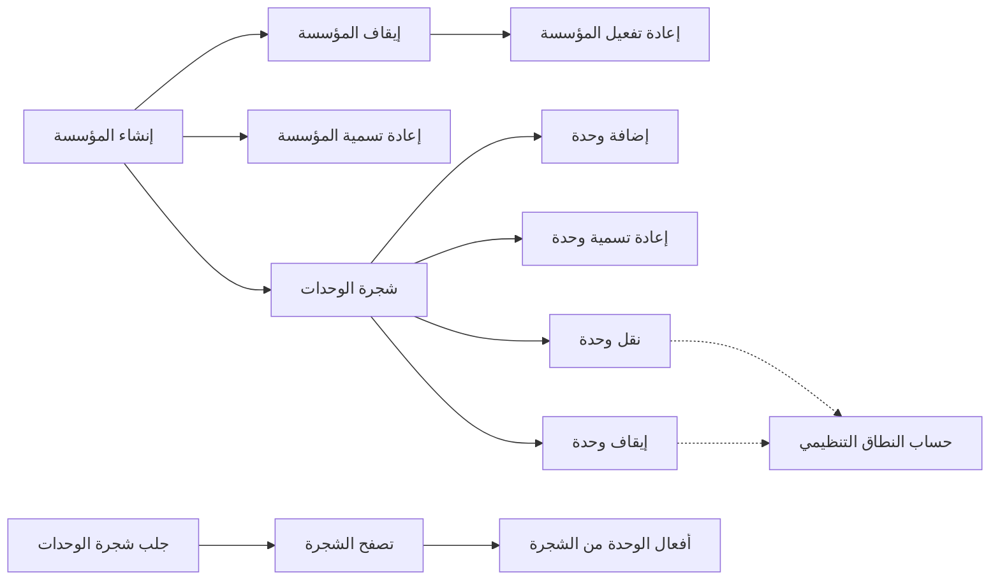
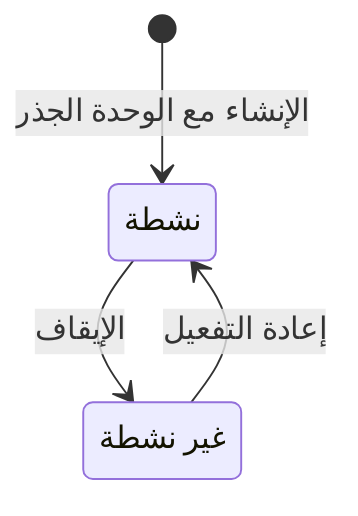
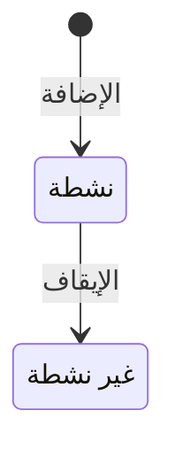

# الهيكل التنظيمي

<!-- BEGIN GENERATED: doc -->
| البند | القيمة |
|---|---|
| المعرّف | FEAT-ORG-STRUCTURE |
| الإصدار | 0.1 |
| الحالة | مسودة |
| القدرة | CAP-01 إدارة المؤسسة والوصول |
| القدرة الفرعية | CAP-01.01 إدارة المستأجرين والمؤسسات (R1) |
| الأدوار | مسؤول الإدارة؛ أي مستخدم مخوَّل |
| الشاشات | SCR-61 شجرة المؤسسة |
| حالات الاستخدام | UC-081 |
| القصص | 12: 9 من المواصفة، و3 جديدة |
<!-- END GENERATED: doc -->

## 1. نظرة عامة

### 1.1 القيمة

يتيح للمسؤول بناء المؤسسة ووحداتها التنظيمية وتعديلها، ويمكّن كل مستخدم من رؤية شجرة المؤسسة.

### 1.2 النطاق

| البند | القيمة |
|---|---|
| المستخدمون | مسؤول الإدارة يبني المؤسسة ووحداتها ويعدّلها؛ أي مستخدم مخوَّل يتصفح الشجرة ضمن نطاقه؛ فريق المنصة في حساب النطاق التنظيمي للصلاحيات |
| الشاشات | شجرة المؤسسة |
| حالات الاستخدام | إدارة المؤسسة ووحداتها |
| المتطلبات | مستأجر فيه مؤسسة أو أكثر، لكل منها شجرة وحدات تنظيمية بلا حد لعمقها، وكل استعلام محصور في مستأجر المستدعي (REQ-FND-002) |
| خارج النطاق | إنشاء المستأجر («دورة حياة المستأجر»)؛ إسناد الأدوار بنطاق وحدة («إسناد الأدوار للمستخدمين»)؛ منح السلطة بنطاق وحدة («منح صلاحيات القرار»)؛ اقتراحات نقل الأشخاص بين الوحدات من الموارد البشرية («مزامنة تغييرات الموارد البشرية») |

### 1.3 خريطة الميزة

ينشئ المسؤول المؤسسة فتُنشأ معها وحدتها الجذر، ثم يبني تحتها شجرة الوحدات ويعدّلها، ويوقف المؤسسة أو يعيد تفعيلها. ويتصفح كل مستخدم الشجرة ضمن نطاقه. والشكل 1 يجمع القصص، والشكل 2 يبيّن حالات المؤسسة، والشكل 3 حالات الوحدة.

**الشكل 1: خريطة ميزة «الهيكل التنظيمي»**



**الشكل 2: حالات المؤسسة**



**الشكل 3: حالات الوحدة التنظيمية**



> **ملاحظة:** المؤسسة لا تُحذف أبدًا ولا حالة نهائية لها، حفظًا للتاريخ المؤسسي. والوحدة الموقوفة لا يُعاد تفعيلها: تُضاف وحدة جديدة بدلها حتى يبقى التاريخ واضحًا. وإعادة التسمية والنقل لا تغيّران حالة المؤسسة ولا الوحدة.

## 2. القواعد المشتركة

تنطبق على كل قصص الميزة، فلا تتكرر داخل القصص. وكل قصة تذكر ما يخصها فقط.

### 2.1 السياق المشترك

كل قصة تبدأ من ثلاثة شروط: مستأجر نشط، وحزمة السياسات الأساسية مفعّلة، ومستخدم مسجّل الدخول ومخوَّل. وتشير إليها القصص بخطوة واحدة: «بفرض السياق المشترك للميزة».

### 2.2 الصلاحية وعدم الإفصاح

- من لا يحق له رؤية العنصر يتلقى ردًا بشكل «غير متاح» تمامًا، فلا يعرف أنه موجود.
- من يرى العنصر ولا يحق له الإجراء يتلقى «لا تملك صلاحية هذا الإجراء».

### 2.3 أوامر تغيير الحالة

- **منع التكرار:** يُرسل كل أمر بمفتاح فريد، فإعادة الطلب نفسه لا تُنفَّذ مرتين.
- **حماية التعديل المتزامن:** يُرسل كل أمر بإصدار البيانات الذي يراه المستخدم. فإن عدّلها غيره في الأثناء، يُرفض الأمر.
- **السجل:** إن نجح الأمر، يُكتب حدثه وسجل التدقيق في المعاملة نفسها.

### 2.4 الرفض المشترك

```gherkin
# language: ar
خاصية: الرفض المشترك لأوامر الميزة

  سيناريو مخطط: رفض مشترك لكل أمر في الميزة
    بفرض السياق المشترك للميزة
    و <الحالة>
    عندما يُرسل المستخدم أي أمر من أوامر الميزة
    اذاً يُرفض برمز <الرمز> ويرى "<الرسالة>"
    و لا يتغير شيء

    امثلة:
      | الحالة                                  | الرمز                  | الرسالة                                                 |
      | العنصر خارج صلاحياته                    | NOT_FOUND              | غير متاح                                                |
      | العنصر مرئي له ولا يحق له الإجراء       | AUTHZ_DENIED           | لا تملك صلاحية هذا الإجراء                              |
      | غيره عدّل العنصر بعد أن فتحه            | VERSION_CONFLICT       | تغيّرت البيانات منذ فتحتها. راجع التغييرات ثم أعد المحاولة |
      | أعاد مفتاح منع التكرار بمحتوى مختلف     | IDEMPOTENCY_KEY_REUSED | طلب مكرر بمحتوى مختلف                                   |
      | البيانات ناقصة أو غير صحيحة             | VALIDATION_FAILED      | بعض البيانات ناقصة أو غير صحيحة. راجع الحقول المعلَّمة      |

  سيناريو: إعادة الطلب نفسه لا تُنفَّذ مرتين
    بفرض السياق المشترك للميزة
    و أمر نجح بمفتاح منع تكرار
    عندما يُعاد الطلب نفسه بالمفتاح نفسه
    اذاً تُعاد النتيجة الأولى ولا يُكتب حدث ثانٍ
```

### 2.5 المؤسسة غير النشطة والوحدة غير النشطة

- **المؤسسة غير النشطة:** يُرفض عليها كل أمر من أوامر الميزة عدا إعادة التفعيل، حين يطابق الإصدار المرسَل إصدار المؤسسة. أما الشاشة التي فُتحت قبل الإيقاف فتتلقى رفض تعارض الإصدار المشترك (§2.4).
- **الوحدة غير النشطة:** لا تستقبل وحدات فرعية ولا إسنادات أدوار ولا منح سلطة.
- **الشجرة:** لها جذر واحد ولا دوران فيها. وأسماء الوحدات الشقيقة فريدة بعد توحيد صيغة الاسم، وكل اسم يُحفظ بلغته الأصلية.
- **الحجم:** 5,000 وحدة على الأكثر في المؤسسة الواحدة، وما زاد يُقسم إلى مؤسسات. والمصدر لا يذكر رمز رفض لتجاوز الحد **[Needs Review]**.

```gherkin
# language: ar
خاصية: المؤسسة غير النشطة ترفض أوامر الميزة

  سيناريو مخطط: أمر على مؤسسة غير نشطة
    بفرض السياق المشترك للميزة
    و مؤسسة في حالة "غير نشطة"
    عندما يحاول المسؤول <الأمر> بإصدار المؤسسة الحالي
    اذاً يُرفض برمز <الرمز> ويرى "<الرسالة>"
    و لا يتغير شيء

    امثلة:
      | الأمر | الرمز | الرسالة |
      | إعادة تسمية المؤسسة | ORGANIZATION_INVALID_STATE_TRANSITION | الوضع الحالي للمؤسسة لا يسمح بهذا الإجراء |
      | إضافة وحدة | ORGANIZATION_INVALID_STATE_TRANSITION | الوضع الحالي للمؤسسة لا يسمح بهذا الإجراء |
      | إعادة تسمية وحدة | ORGANIZATION_INVALID_STATE_TRANSITION | الوضع الحالي للمؤسسة لا يسمح بهذا الإجراء |
      | نقل وحدة | ORGANIZATION_INVALID_STATE_TRANSITION | الوضع الحالي للمؤسسة لا يسمح بهذا الإجراء |
      | إيقاف وحدة | ORGANIZATION_INVALID_STATE_TRANSITION | الوضع الحالي للمؤسسة لا يسمح بهذا الإجراء |
      | إيقاف المؤسسة | ORGANIZATION_INVALID_STATE_TRANSITION | الوضع الحالي للمؤسسة لا يسمح بهذا الإجراء |
```

## 3. الجودة وتعريف الاكتمال

### 3.1 متطلبات الجودة

<!-- BEGIN GENERATED: quality -->
لا متطلبات جودة مرتبطة بمتطلبات هذه الميزة مباشرة. تنطبق متطلبات المنصة العامة (`FEAT-PLT-*`).
<!-- END GENERATED: quality -->

### 3.2 تعريف الاكتمال

القصة مكتملة حين تتحقق الشروط الخمسة:

1. سيناريوهاتها والقواعد المشتركة تمر في الاختبار الآلي.
2. فحوص البنية المعمارية تمر.
3. نصوص الواجهة والرسائل موجودة بالعربية والإنجليزية.
4. مراجعة الكود مكتملة.
5. ما تضيفه القصة نفسها في قسم «القواعد» تحقق.

## 4. فهرس القصص

<!-- BEGIN GENERATED: story-index -->
| المعرّف | القصة | النوع | الحالة |
|---|---|---|---|
| `US-BC01-ORG-ADD-UNIT` | إضافة وحدة تنظيمية إلى المؤسسة | أمر | مسودة |
| `US-BC01-ORG-CREATE` | إنشاء المؤسسة | أمر | مسودة |
| `US-BC01-ORG-DEACTIVATE` | إيقاف تفعيل المؤسسة | أمر | مسودة |
| `US-BC01-ORG-DEACTIVATE-UNIT` | إيقاف وحدة تنظيمية في المؤسسة | أمر | مسودة |
| `US-BC01-ORG-MOVE-UNIT` | نقل وحدة تنظيمية في المؤسسة | أمر | مسودة |
| `US-BC01-ORG-REACTIVATE` | إعادة تفعيل المؤسسة | أمر | مسودة |
| `US-BC01-ORG-RENAME` | إعادة تسمية المؤسسة | أمر | مسودة |
| `US-BC01-ORG-RENAME-UNIT` | إعادة تسمية وحدة تنظيمية في المؤسسة | أمر | مسودة |
| `US-BC01-Q-ORG-TREE` | جلب: Unit tree (cursor pagination on flattened order) | جلب | مسودة |
| `US-UI-SCR61-TREE-NAVIGATION` | تصفح شجرة المؤسسة متعددة المستويات | واجهة | مسودة |
| `US-UI-SCR61-UNIT-ACTIONS` | نقل الوحدات وتعديلها من الشجرة | واجهة | مسودة |
| `US-PLT-ORG-SCOPE-RESOLUTION` | حساب النطاق التنظيمي لصلاحيات الأدوار | منصة | مسودة |
<!-- END GENERATED: story-index -->

## 5. القصص

### 5.1 US-BC01-ORG-ADD-UNIT — إضافة وحدة تنظيمية إلى المؤسسة

| النوع | الإصدار | الأولوية | دون اتصال | الحالة |
|---|---|---|---|---|
| أمر | R1 | Must | لا | مسودة |

> **كـ** مسؤول الإدارة، **أريد** أن أضيف وحدة تنظيمية تحت وحدة قائمة، **حتى** تعكس الشجرة هيكل جهتي الفعلي.

**باختصار:** يضيف المسؤول وحدة جديدة «نشطة» تحت وحدة أم نشطة، بلا حد لعمق الشجرة. ولا تتغير حالة المؤسسة.

#### القواعد

- **متى يُسمح:** المؤسسة «نشطة» (§2.5)، والوحدة الأم «نشطة».
- **من يُسمح له:** مسؤول الإدارة الذي يشمل نطاقه التنظيمي المؤسسة أو الوحدة المعنية.
- **البيانات:** الوحدة الأم (إلزامية)، واسم الوحدة (إلزامي)، ولا يتكرر بين الوحدات الشقيقة.
- **الأثر:** تُضاف الوحدة «نشطة» ويزيد إصدار المؤسسة، ويُسجَّل حدث «أُضيفت وحدة». ويصل الحدث إلى دليل البحث وإلى نسخ النطاق التنظيمي في كل أجزاء النظام.

#### معايير القبول

```gherkin
# language: ar
خاصية: إضافة وحدة تنظيمية إلى المؤسسة

  سيناريو: المسؤول يضيف وحدة تحت وحدة نشطة
    بفرض السياق المشترك للميزة
    و مؤسسة "نشطة" فيها وحدة "نشطة" ضمن نطاق المسؤول
    عندما يضيف تحتها وحدة باسم لا يتكرر بين شقيقاتها
    اذاً تظهر الوحدة الجديدة "نشطة" تحت الوحدة الأم
    و يزيد إصدار المؤسسة
    و يُسجَّل حدث "أُضيفت وحدة"

  سيناريو مخطط: رفض خاص بإضافة الوحدة
    بفرض السياق المشترك للميزة
    و <الحالة>
    عندما يحاول المسؤول إضافة الوحدة
    اذاً يُرفض برمز <الرمز> ويرى "<الرسالة>"
    و لا يتغير شيء

    امثلة:
      | الحالة | الرمز | الرسالة |
      | الوحدة الأم "غير نشطة" | ORG_UNIT_INVALID_PARENT | الوحدة الأم غير نشطة، أو الاسم مستخدم في المستوى نفسه |
      | الاسم مستخدم لوحدة شقيقة | ORG_UNIT_INVALID_PARENT | الوحدة الأم غير نشطة، أو الاسم مستخدم في المستوى نفسه |
      | لم تُحدَّد الوحدة الأم | VALIDATION_FAILED | الوحدة الأم مطلوبة |
      | لم يُكتب اسم الوحدة | VALIDATION_FAILED | اسم الوحدة مطلوب |
```

<details><summary>المراجع التقنية والتتبع</summary>

<!-- BEGIN GENERATED: refs US-BC01-ORG-ADD-UNIT -->
| البند | المعرّف | المعنى |
|---|---|---|
| الواجهة البرمجية | `POST /api/v1/foundation/organizations/{id}/actions/add-unit` | — |
| الأمر | `CMD-ORG-ADD-UNIT` | إضافة وحدة تنظيمية إلى المؤسسة |
| السياسة | `POL-ORG-ADD-UNIT` | Administrator with org scope ⊇ target؛ tenant match; subject ACTIVE; tenant ACTIVE (except TEN operations by… |
| الحدث | `EVT-ORG-UNIT-ADDED` | يصل إلى: Search/Directory projection (BC01 read model); All contexts' org-scope read models |
| الكيان | `AGG-ORGANIZATION` | المؤسسة |
| الجدول | `foundation.organizations` | الجدول الرئيسي للمؤسسة |
| وحدة النشر | DU-02 | — |
| المتطلب | REQ-FND-002 | The system shall allow a tenant to contain one or more organizations, each with a hierarchy of organizational… |
| حالة الاستخدام | UC-081 | Manage Organization & Units |
| الاختبار | TST-ORGANIZATION-SM، TST-SLC01-INVARIANTS | دورة حالات المؤسسة، وثوابت الشريحة SLC-01 |
<!-- END GENERATED: refs US-BC01-ORG-ADD-UNIT -->

</details>

### 5.2 US-BC01-ORG-CREATE — إنشاء المؤسسة

| النوع | الإصدار | الأولوية | دون اتصال | الحالة |
|---|---|---|---|---|
| أمر | R1 | Must | لا | مسودة |

> **كـ** مسؤول الإدارة، **أريد** أن أنشئ مؤسسة في المستأجر مع وحدتها الجذر، **حتى** أبني تحتها هيكل جهتي.

**باختصار:** ينشئ المسؤول مؤسسة باسم لا يتكرر في المستأجر، فتُنشأ «نشطة» ومعها وحدتها الجذر.

#### القواعد

- **متى يُسمح:** المستأجر نشط. والمستأجر قد يضم أكثر من مؤسسة.
- **من يُسمح له:** مسؤول الإدارة الذي يشمل نطاقه التنظيمي المؤسسة أو الوحدة المعنية. وإن رُفض الإنشاء فالرد «لا تملك صلاحية هذا الإجراء»، لأنه لا يوجد مورد يُخفى.
- **البيانات:** اسم المؤسسة (إلزامي)، ولا يتكرر في المستأجر؛ واسم الوحدة الجذر (إلزامي).
- **الأثر:** تُنشأ المؤسسة «نشطة» ومعها الوحدة الجذر «نشطة»، ويُسجَّل حدث «أُنشئت المؤسسة». ويصل الحدث إلى دليل البحث وإلى نسخ النطاق التنظيمي في كل أجزاء النظام.

#### معايير القبول

```gherkin
# language: ar
خاصية: إنشاء المؤسسة

  سيناريو: المسؤول ينشئ مؤسسة ثانية في المستأجر
    بفرض السياق المشترك للميزة
    و مستأجر نشط فيه مؤسسة واحدة
    عندما ينشئ المسؤول مؤسسة باسم جديد واسم لوحدتها الجذر
    اذاً تصبح في المستأجر مؤسستان
    و تكون الجديدة "نشطة" ولها وحدة جذر "نشطة"
    و يُسجَّل حدث "أُنشئت المؤسسة"

  سيناريو مخطط: رفض خاص بإنشاء المؤسسة
    بفرض السياق المشترك للميزة
    و <الحالة>
    عندما يحاول المسؤول إنشاء المؤسسة
    اذاً يُرفض برمز <الرمز> ويرى "<الرسالة>"
    و لا يتغير شيء

    امثلة:
      | الحالة | الرمز | الرسالة |
      | الاسم مستخدم لمؤسسة أخرى في المستأجر | ORG_NAME_TAKEN | اسم المؤسسة مستخدم |
      | لم يُكتب اسم المؤسسة | VALIDATION_FAILED | اسم المؤسسة مطلوب |
      | لم يُكتب اسم الوحدة الجذر | VALIDATION_FAILED | اسم الوحدة الجذر مطلوب |
```

<details><summary>المراجع التقنية والتتبع</summary>

<!-- BEGIN GENERATED: refs US-BC01-ORG-CREATE -->
| البند | المعرّف | المعنى |
|---|---|---|
| الواجهة البرمجية | `POST /api/v1/foundation/organizations` | — |
| الأمر | `CMD-ORG-CREATE` | إنشاء المؤسسة |
| السياسة | `POL-ORG-CREATE` | Administrator with org scope ⊇ target؛ tenant match; subject ACTIVE; tenant ACTIVE (except TEN operations by… |
| الحدث | `EVT-ORG-CREATED` | يصل إلى: Search/Directory projection (BC01 read model); All contexts' org-scope read models |
| الكيان | `AGG-ORGANIZATION` | المؤسسة |
| الجدول | `foundation.organizations` | الجدول الرئيسي للمؤسسة |
| وحدة النشر | DU-02 | — |
| المتطلب | REQ-FND-002 | The system shall allow a tenant to contain one or more organizations, each with a hierarchy of organizational… |
| حالة الاستخدام | UC-081 | Manage Organization & Units |
| الاختبار | TST-ORGANIZATION-SM، TST-SLC01-INVARIANTS | دورة حالات المؤسسة، وثوابت الشريحة SLC-01 |
<!-- END GENERATED: refs US-BC01-ORG-CREATE -->

</details>

### 5.3 US-BC01-ORG-DEACTIVATE — إيقاف تفعيل المؤسسة

| النوع | الإصدار | الأولوية | دون اتصال | الحالة |
|---|---|---|---|---|
| أمر | R1 | Must | لا | مسودة |

> **كـ** مسؤول الإدارة، **أريد** أن أوقف مؤسسة لم تعد تعمل مع ذكر السبب، **حتى** تخرج من الاستخدام ويبقى تاريخها محفوظًا.

**باختصار:** يوقف المسؤول مؤسسة «نشطة» كل وحداتها غير الجذر موقوفة ولا إسنادات نشطة فيها، فتصير «غير نشطة» ولا تُحذف.

#### القواعد

- **متى يُسمح:** المؤسسة «نشطة» (§2.5)، وكل وحداتها عدا الجذر «غير نشطة»، ولا إسنادات نشطة فيها.
- **من يُسمح له:** مسؤول الإدارة الذي يشمل نطاقه التنظيمي المؤسسة أو الوحدة المعنية.
- **البيانات:** السبب (إلزامي).
- **الأثر:** تصير المؤسسة «غير نشطة» ويُسجَّل حدث «أُوقفت المؤسسة». ويصل الحدث إلى دليل البحث وإلى نسخ النطاق التنظيمي. وتبقى المؤسسة وتاريخها، ويمكن إعادة تفعيلها (القصة 5.6).

#### معايير القبول

```gherkin
# language: ar
خاصية: إيقاف تفعيل المؤسسة

  سيناريو: المسؤول يوقف مؤسسة أُوقفت وحداتها
    بفرض السياق المشترك للميزة
    و مؤسسة "نشطة" كل وحداتها عدا الجذر "غير نشطة" ولا إسنادات نشطة فيها
    عندما يوقفها المسؤول ويذكر السبب
    اذاً تصبح حالتها "غير نشطة" وتبقى في المستأجر
    و يُسجَّل حدث "أُوقفت المؤسسة"

  سيناريو مخطط: رفض خاص بإيقاف المؤسسة
    بفرض السياق المشترك للميزة
    و <الحالة>
    عندما يحاول المسؤول إيقاف المؤسسة
    اذاً يُرفض برمز <الرمز> ويرى "<الرسالة>"
    و لا يتغير شيء

    امثلة:
      | الحالة | الرمز | الرسالة |
      | فيها وحدة غير الجذر ما زالت "نشطة" | ORG_IN_USE | المؤسسة مستخدمة: توجد وحدات أو إسنادات نشطة |
      | فيها إسناد نشط | ORG_IN_USE | المؤسسة مستخدمة: توجد وحدات أو إسنادات نشطة |
      | لم يُذكر السبب | VALIDATION_FAILED | السبب مطلوب |
```

<details><summary>المراجع التقنية والتتبع</summary>

<!-- BEGIN GENERATED: refs US-BC01-ORG-DEACTIVATE -->
| البند | المعرّف | المعنى |
|---|---|---|
| الواجهة البرمجية | `POST /api/v1/foundation/organizations/{id}/actions/deactivate` | — |
| الأمر | `CMD-ORG-DEACTIVATE` | إيقاف تفعيل المؤسسة |
| السياسة | `POL-ORG-DEACTIVATE` | Administrator with org scope ⊇ target؛ tenant match; subject ACTIVE; tenant ACTIVE (except TEN operations by… |
| الحدث | `EVT-ORG-DEACTIVATED` | يصل إلى: Search/Directory projection (BC01 read model); All contexts' org-scope read models |
| الكيان | `AGG-ORGANIZATION` | المؤسسة |
| الجدول | `foundation.organizations` | الجدول الرئيسي للمؤسسة |
| وحدة النشر | DU-02 | — |
| المتطلب | REQ-FND-002 | The system shall allow a tenant to contain one or more organizations, each with a hierarchy of organizational… |
| حالة الاستخدام | UC-081 | Manage Organization & Units |
| الاختبار | TST-ORGANIZATION-SM، TST-SLC01-INVARIANTS | دورة حالات المؤسسة، وثوابت الشريحة SLC-01 |
<!-- END GENERATED: refs US-BC01-ORG-DEACTIVATE -->

</details>

### 5.4 US-BC01-ORG-DEACTIVATE-UNIT — إيقاف وحدة تنظيمية في المؤسسة

| النوع | الإصدار | الأولوية | دون اتصال | الحالة |
|---|---|---|---|---|
| أمر | R1 | Must | لا | مسودة |

> **كـ** مسؤول الإدارة، **أريد** أن أوقف وحدة تنظيمية لم تعد قائمة مع ذكر السبب، **حتى** لا يُسند إليها أحد بعد اليوم ويبقى تاريخها.

**باختصار:** يوقف المسؤول وحدة لا وحدات فرعية نشطة لها ولا إسنادات قائمة بنطاقها وحدها، فتصير «غير نشطة» دون إعادة تفعيل.

#### القواعد

- **متى يُسمح:** المؤسسة «نشطة» (§2.5)، ولا وحدات فرعية نشطة للوحدة، ولا إسنادات أدوار ولا منح سلطة ولا تصاريح أمنية نشطة نطاقها هذه الوحدة وحدها.
- **من يُسمح له:** مسؤول الإدارة الذي يشمل نطاقه التنظيمي المؤسسة أو الوحدة المعنية.
- **البيانات:** الوحدة (إلزامية)، والسبب (إلزامي).
- **الأثر:** تصير الوحدة «غير نشطة» ويزيد إصدار المؤسسة، ويُسجَّل حدث «أُوقفت وحدة». والحدث يؤثر في الصلاحيات: يرفع الإصدار الأمني فتُبطَل قرارات الصلاحية المخزنة، ويُعاد حساب النطاق التنظيمي (القصة 5.12). ولا يُعاد تفعيل الوحدة، بل تُضاف وحدة جديدة.

#### معايير القبول

```gherkin
# language: ar
خاصية: إيقاف وحدة تنظيمية في المؤسسة

  سيناريو: المسؤول يوقف وحدة خالية
    بفرض السياق المشترك للميزة
    و وحدة "نشطة" في مؤسسة "نشطة" بلا وحدات فرعية نشطة ولا إسنادات بنطاقها وحدها
    عندما يوقفها المسؤول ويذكر السبب
    اذاً تصبح حالة الوحدة "غير نشطة" ويزيد إصدار المؤسسة
    و يُسجَّل حدث "أُوقفت وحدة"

  سيناريو مخطط: رفض خاص بإيقاف الوحدة
    بفرض السياق المشترك للميزة
    و <الحالة>
    عندما يحاول المسؤول إيقاف الوحدة
    اذاً يُرفض برمز <الرمز> ويرى "<الرسالة>"
    و لا يتغير شيء

    امثلة:
      | الحالة | الرمز | الرسالة |
      | للوحدة وحدة فرعية "نشطة" | ORG_UNIT_IN_USE | الوحدة مستخدمة: لها وحدات فرعية أو إسنادات نشطة |
      | إسناد دور نشط نطاقه هذه الوحدة وحدها | ORG_UNIT_IN_USE | الوحدة مستخدمة: لها وحدات فرعية أو إسنادات نشطة |
      | لم يُذكر السبب | VALIDATION_FAILED | السبب مطلوب |
```

<details><summary>المراجع التقنية والتتبع</summary>

<!-- BEGIN GENERATED: refs US-BC01-ORG-DEACTIVATE-UNIT -->
| البند | المعرّف | المعنى |
|---|---|---|
| الواجهة البرمجية | `POST /api/v1/foundation/organizations/{id}/actions/deactivate-unit` | — |
| الأمر | `CMD-ORG-DEACTIVATE-UNIT` | إيقاف وحدة تنظيمية في المؤسسة |
| السياسة | `POL-ORG-DEACTIVATE-UNIT` | Administrator with org scope ⊇ target؛ tenant match; subject ACTIVE; tenant ACTIVE (except TEN operations by… |
| الحدث | `EVT-ORG-UNIT-DEACTIVATED` | يصل إلى: Security-version service (EVT-SEC-VERSION-INCREMENTED); PEP decision caches; Projection security-ver… |
| الكيان | `AGG-ORGANIZATION` | المؤسسة |
| الجدول | `foundation.organizations` | الجدول الرئيسي للمؤسسة |
| وحدة النشر | DU-02 | — |
| المتطلب | REQ-FND-002 | The system shall allow a tenant to contain one or more organizations, each with a hierarchy of organizational… |
| حالة الاستخدام | UC-081 | Manage Organization & Units |
| الاختبار | TST-ORGANIZATION-SM، TST-SLC01-INVARIANTS | دورة حالات المؤسسة، وثوابت الشريحة SLC-01 |
<!-- END GENERATED: refs US-BC01-ORG-DEACTIVATE-UNIT -->

</details>

### 5.5 US-BC01-ORG-MOVE-UNIT — نقل وحدة تنظيمية في المؤسسة

| النوع | الإصدار | الأولوية | دون اتصال | الحالة |
|---|---|---|---|---|
| أمر | R1 | Must | لا | مسودة |

> **كـ** مسؤول الإدارة، **أريد** أن أنقل وحدة بفروعها تحت وحدة أم أخرى، **حتى** تتبع الشجرة إعادة التنظيم في جهتي.

**باختصار:** ينقل المسؤول وحدة إلى أم نشطة في المؤسسة نفسها، ليست من فروعها. ولا تُنقل الوحدة الجذر.

#### القواعد

- **متى يُسمح:** المؤسسة «نشطة» (§2.5)، والأم الجديدة «نشطة» وفي المؤسسة نفسها وليست الوحدة ولا إحدى فروعها، والوحدة المنقولة ليست الجذر.
- **من يُسمح له:** مسؤول الإدارة الذي يشمل نطاقه التنظيمي المؤسسة أو الوحدة المعنية.
- **البيانات:** الوحدة (إلزامية)، والأم الجديدة (إلزامية).
- **الأثر:** تنتقل الوحدة بفروعها ويزيد إصدار المؤسسة، ويُسجَّل حدث «نُقلت وحدة». والحدث يؤثر في الصلاحيات: يرفع الإصدار الأمني، فيُعاد حساب النطاق التنظيمي لكل من يشمل نطاقه الوحدة في الطلب التالي (القصة 5.12).

> **ملاحظة:** المصدر يرفض بالرمز نفسه الأم غير النشطة، والأم من مؤسسة أخرى، ونقل الجذر، ورسالته تذكر الدوران فقط **[Needs Review]**.

#### معايير القبول

```gherkin
# language: ar
خاصية: نقل وحدة تنظيمية في المؤسسة

  سيناريو: المسؤول ينقل وحدة إلى أم أخرى
    بفرض السياق المشترك للميزة
    و وحدة غير الجذر لها وحدتان فرعيتان في مؤسسة "نشطة"
    و وحدة أخرى "نشطة" ليست من فروعها
    عندما ينقل المسؤول الوحدة تحت الوحدة الأخرى
    اذاً تظهر الوحدة بفرعيها تحت أمها الجديدة
    و يزيد إصدار المؤسسة
    و يُسجَّل حدث "نُقلت وحدة"

  سيناريو مخطط: رفض خاص بنقل الوحدة
    بفرض السياق المشترك للميزة
    و <الحالة>
    عندما يحاول المسؤول نقل الوحدة
    اذاً يُرفض برمز <الرمز> ويرى "<الرسالة>"
    و لا يتغير شيء

    امثلة:
      | الحالة | الرمز | الرسالة |
      | الأم الجديدة إحدى فروع الوحدة | ORG_UNIT_CYCLE | لا يمكن نقل الوحدة تحت إحدى وحداتها الفرعية |
      | لم تُحدَّد الأم الجديدة | VALIDATION_FAILED | الوحدة الأم الجديدة مطلوبة |
```

<details><summary>المراجع التقنية والتتبع</summary>

<!-- BEGIN GENERATED: refs US-BC01-ORG-MOVE-UNIT -->
| البند | المعرّف | المعنى |
|---|---|---|
| الواجهة البرمجية | `POST /api/v1/foundation/organizations/{id}/actions/move-unit` | — |
| الأمر | `CMD-ORG-MOVE-UNIT` | نقل وحدة تنظيمية في المؤسسة |
| السياسة | `POL-ORG-MOVE-UNIT` | Administrator with org scope ⊇ target؛ tenant match; subject ACTIVE; tenant ACTIVE (except TEN operations by… |
| الحدث | `EVT-ORG-UNIT-MOVED` | يصل إلى: Security-version service (EVT-SEC-VERSION-INCREMENTED); PEP decision caches; Projection security-ver… |
| الكيان | `AGG-ORGANIZATION` | المؤسسة |
| الجدول | `foundation.organizations` | الجدول الرئيسي للمؤسسة |
| وحدة النشر | DU-02 | — |
| المتطلب | REQ-FND-002 | The system shall allow a tenant to contain one or more organizations, each with a hierarchy of organizational… |
| حالة الاستخدام | UC-081 | Manage Organization & Units |
| الاختبار | TST-ORGANIZATION-SM، TST-SLC01-INVARIANTS | دورة حالات المؤسسة، وثوابت الشريحة SLC-01 |
<!-- END GENERATED: refs US-BC01-ORG-MOVE-UNIT -->

</details>

### 5.6 US-BC01-ORG-REACTIVATE — إعادة تفعيل المؤسسة

| النوع | الإصدار | الأولوية | دون اتصال | الحالة |
|---|---|---|---|---|
| أمر | R1 | Must | لا | مسودة |

> **كـ** مسؤول الإدارة، **أريد** أن أعيد تفعيل مؤسسة موقوفة، **حتى** تعود إلى العمل بتاريخها كما هو.

**باختصار:** يعيد المسؤول مؤسسة «غير نشطة» إلى «نشطة» ما دام المستأجر نشطًا.

#### القواعد

- **متى يُسمح:** المؤسسة «غير نشطة»، والمستأجر نشط.
- **من يُسمح له:** مسؤول الإدارة الذي يشمل نطاقه التنظيمي المؤسسة أو الوحدة المعنية.
- **البيانات:** لا مدخلات.
- **الأثر:** تصير المؤسسة «نشطة» ويُسجَّل حدث «أُعيد تفعيل المؤسسة». ويصل الحدث إلى دليل البحث وإلى نسخ النطاق التنظيمي. والوحدات الموقوفة تبقى موقوفة، فإعادة تفعيل الوحدة غير ممكنة **[Derived]**.

#### معايير القبول

```gherkin
# language: ar
خاصية: إعادة تفعيل المؤسسة

  سيناريو: المسؤول يعيد تفعيل مؤسسة موقوفة
    بفرض السياق المشترك للميزة
    و مؤسسة "غير نشطة" في مستأجر نشط
    عندما يعيد المسؤول تفعيلها
    اذاً تصبح حالتها "نشطة"
    و يُسجَّل حدث "أُعيد تفعيل المؤسسة"

  سيناريو مخطط: رفض خاص بإعادة تفعيل المؤسسة
    بفرض السياق المشترك للميزة
    و <الحالة>
    عندما يحاول المسؤول إعادة تفعيل المؤسسة
    اذاً يُرفض برمز <الرمز> ويرى "<الرسالة>"
    و لا يتغير شيء

    امثلة:
      | الحالة | الرمز | الرسالة |
      | المؤسسة "نشطة" والإصدار مطابق | ORGANIZATION_INVALID_STATE_TRANSITION | الوضع الحالي للمؤسسة لا يسمح بهذا الإجراء |
```

<details><summary>المراجع التقنية والتتبع</summary>

<!-- BEGIN GENERATED: refs US-BC01-ORG-REACTIVATE -->
| البند | المعرّف | المعنى |
|---|---|---|
| الواجهة البرمجية | `POST /api/v1/foundation/organizations/{id}/actions/reactivate` | — |
| الأمر | `CMD-ORG-REACTIVATE` | إعادة تفعيل المؤسسة |
| السياسة | `POL-ORG-REACTIVATE` | Administrator with org scope ⊇ target؛ tenant match; subject ACTIVE; tenant ACTIVE (except TEN operations by… |
| الحدث | `EVT-ORG-REACTIVATED` | يصل إلى: Search/Directory projection (BC01 read model); All contexts' org-scope read models |
| الكيان | `AGG-ORGANIZATION` | المؤسسة |
| الجدول | `foundation.organizations` | الجدول الرئيسي للمؤسسة |
| وحدة النشر | DU-02 | — |
| المتطلب | REQ-FND-002 | The system shall allow a tenant to contain one or more organizations, each with a hierarchy of organizational… |
| حالة الاستخدام | UC-081 | Manage Organization & Units |
| الاختبار | TST-ORGANIZATION-SM، TST-SLC01-INVARIANTS | دورة حالات المؤسسة، وثوابت الشريحة SLC-01 |
<!-- END GENERATED: refs US-BC01-ORG-REACTIVATE -->

</details>

### 5.7 US-BC01-ORG-RENAME — إعادة تسمية المؤسسة

| النوع | الإصدار | الأولوية | دون اتصال | الحالة |
|---|---|---|---|---|
| أمر | R1 | Must | لا | مسودة |

> **كـ** مسؤول الإدارة، **أريد** أن أغيّر اسم المؤسسة، **حتى** يطابق اسمها الرسمي الحالي.

**باختصار:** يغيّر المسؤول اسم مؤسسة «نشطة» إلى اسم لا يتكرر في المستأجر، دون تغيير حالتها.

#### القواعد

- **متى يُسمح:** المؤسسة «نشطة» (§2.5).
- **من يُسمح له:** مسؤول الإدارة الذي يشمل نطاقه التنظيمي المؤسسة أو الوحدة المعنية.
- **البيانات:** الاسم الجديد (إلزامي)، ولا يتكرر في المستأجر.
- **الأثر:** يتغير الاسم ويزيد إصدار المؤسسة، ويُسجَّل حدث «أُعيدت تسمية المؤسسة». ويصل الحدث إلى دليل البحث وإلى نسخ النطاق التنظيمي.

#### معايير القبول

```gherkin
# language: ar
خاصية: إعادة تسمية المؤسسة

  سيناريو: المسؤول يغيّر اسم المؤسسة
    بفرض السياق المشترك للميزة
    و مؤسسة "نشطة" ضمن نطاق المسؤول
    عندما يغيّر اسمها إلى اسم لا يتكرر في المستأجر
    اذاً يظهر الاسم الجديد وتبقى الحالة "نشطة"
    و يزيد إصدار المؤسسة
    و يُسجَّل حدث "أُعيدت تسمية المؤسسة"

  سيناريو مخطط: رفض خاص بإعادة تسمية المؤسسة
    بفرض السياق المشترك للميزة
    و <الحالة>
    عندما يحاول المسؤول إعادة تسمية المؤسسة
    اذاً يُرفض برمز <الرمز> ويرى "<الرسالة>"
    و لا يتغير شيء

    امثلة:
      | الحالة | الرمز | الرسالة |
      | الاسم مستخدم لمؤسسة أخرى في المستأجر | ORG_NAME_TAKEN | اسم المؤسسة مستخدم |
      | لم يُكتب الاسم الجديد | VALIDATION_FAILED | اسم المؤسسة مطلوب |
```

<details><summary>المراجع التقنية والتتبع</summary>

<!-- BEGIN GENERATED: refs US-BC01-ORG-RENAME -->
| البند | المعرّف | المعنى |
|---|---|---|
| الواجهة البرمجية | `POST /api/v1/foundation/organizations/{id}/actions/rename` | — |
| الأمر | `CMD-ORG-RENAME` | إعادة تسمية المؤسسة |
| السياسة | `POL-ORG-RENAME` | Administrator with org scope ⊇ target؛ tenant match; subject ACTIVE; tenant ACTIVE (except TEN operations by… |
| الحدث | `EVT-ORG-RENAMED` | يصل إلى: Search/Directory projection (BC01 read model); All contexts' org-scope read models |
| الكيان | `AGG-ORGANIZATION` | المؤسسة |
| الجدول | `foundation.organizations` | الجدول الرئيسي للمؤسسة |
| وحدة النشر | DU-02 | — |
| المتطلب | REQ-FND-002 | The system shall allow a tenant to contain one or more organizations, each with a hierarchy of organizational… |
| حالة الاستخدام | UC-081 | Manage Organization & Units |
| الاختبار | TST-ORGANIZATION-SM، TST-SLC01-INVARIANTS | دورة حالات المؤسسة، وثوابت الشريحة SLC-01 |
<!-- END GENERATED: refs US-BC01-ORG-RENAME -->

</details>

### 5.8 US-BC01-ORG-RENAME-UNIT — إعادة تسمية وحدة تنظيمية في المؤسسة

| النوع | الإصدار | الأولوية | دون اتصال | الحالة |
|---|---|---|---|---|
| أمر | R1 | Must | لا | مسودة |

> **كـ** مسؤول الإدارة، **أريد** أن أغيّر اسم وحدة تنظيمية، **حتى** يطابق اسمها الحالي في جهتي.

**باختصار:** يغيّر المسؤول اسم وحدة إلى اسم لا يتكرر بين شقيقاتها، دون تغيير حالتها ولا موقعها.

#### القواعد

- **متى يُسمح:** المؤسسة «نشطة» (§2.5).
- **من يُسمح له:** مسؤول الإدارة الذي يشمل نطاقه التنظيمي المؤسسة أو الوحدة المعنية.
- **البيانات:** الوحدة (إلزامية)، والاسم الجديد (إلزامي)، ولا يتكرر بين الوحدات الشقيقة.
- **الأثر:** يتغير اسم الوحدة ويزيد إصدار المؤسسة، ويُسجَّل حدث «أُعيدت تسمية وحدة». ويصل الحدث إلى دليل البحث وإلى نسخ النطاق التنظيمي.

#### معايير القبول

```gherkin
# language: ar
خاصية: إعادة تسمية وحدة تنظيمية في المؤسسة

  سيناريو: المسؤول يغيّر اسم وحدة
    بفرض السياق المشترك للميزة
    و وحدة في مؤسسة "نشطة" ضمن نطاق المسؤول
    عندما يغيّر اسمها إلى اسم لا يتكرر بين شقيقاتها
    اذاً يظهر الاسم الجديد في الشجرة في موقعها نفسه
    و يزيد إصدار المؤسسة
    و يُسجَّل حدث "أُعيدت تسمية وحدة"

  سيناريو مخطط: رفض خاص بإعادة تسمية الوحدة
    بفرض السياق المشترك للميزة
    و <الحالة>
    عندما يحاول المسؤول إعادة تسمية الوحدة
    اذاً يُرفض برمز <الرمز> ويرى "<الرسالة>"
    و لا يتغير شيء

    امثلة:
      | الحالة | الرمز | الرسالة |
      | الاسم مستخدم لوحدة شقيقة | ORG_UNIT_NAME_TAKEN | اسم الوحدة مستخدم في المستوى نفسه |
      | لم تُحدَّد الوحدة | VALIDATION_FAILED | الوحدة مطلوبة |
      | لم يُكتب الاسم الجديد | VALIDATION_FAILED | اسم الوحدة مطلوب |
```

<details><summary>المراجع التقنية والتتبع</summary>

<!-- BEGIN GENERATED: refs US-BC01-ORG-RENAME-UNIT -->
| البند | المعرّف | المعنى |
|---|---|---|
| الواجهة البرمجية | `POST /api/v1/foundation/organizations/{id}/actions/rename-unit` | — |
| الأمر | `CMD-ORG-RENAME-UNIT` | إعادة تسمية وحدة تنظيمية في المؤسسة |
| السياسة | `POL-ORG-RENAME-UNIT` | Administrator with org scope ⊇ target؛ tenant match; subject ACTIVE; tenant ACTIVE (except TEN operations by… |
| الحدث | `EVT-ORG-UNIT-RENAMED` | يصل إلى: Search/Directory projection (BC01 read model); All contexts' org-scope read models |
| الكيان | `AGG-ORGANIZATION` | المؤسسة |
| الجدول | `foundation.organizations` | الجدول الرئيسي للمؤسسة |
| وحدة النشر | DU-02 | — |
| المتطلب | REQ-FND-002 | The system shall allow a tenant to contain one or more organizations, each with a hierarchy of organizational… |
| حالة الاستخدام | UC-081 | Manage Organization & Units |
| الاختبار | TST-ORGANIZATION-SM، TST-SLC01-INVARIANTS | دورة حالات المؤسسة، وثوابت الشريحة SLC-01 |
<!-- END GENERATED: refs US-BC01-ORG-RENAME-UNIT -->

</details>

### 5.9 US-BC01-Q-ORG-TREE — شجرة وحدات المؤسسة

| النوع | الإصدار | الأولوية | دون اتصال | الحالة |
|---|---|---|---|---|
| جلب | R1 | Must | لا | مسودة |

> **كـ** أي مستخدم مخوَّل، **أريد** أن أرى وحدات المؤسسة التي يشملها نطاقي مرتبة كما في الشجرة، **حتى** أعرف موقع كل وحدة وتبعيتها.

**باختصار:** يعيد النظام وحدات المؤسسة بترتيب الشجرة المسطَّح على صفحات بمؤشر، ولا يعيد إلا ما يقع في نطاق المستخدم.

#### القواعد

- **من يرى ماذا:** أي مستخدم في المستأجر يرى الوحدات التي تقع في النطاق التنظيمي لأدواره، مع قاعدة التصنيف. والمؤسسة خارج نطاقه ترد «غير متاح».
- **المرشحات:** المؤشر وحجم الصفحة فقط. والترقيم بالمؤشر لا برقم الصفحة.
- لا عدد ولا إشارة تكشف وحدة خارج النطاق، وكل نتيجة يُعاد فحصها قبل إرجاعها.
- الاستعلام محصور في مستأجر المستدعي (REQ-FND-002).

#### معايير القبول

```gherkin
# language: ar
خاصية: شجرة وحدات المؤسسة

  سيناريو: المستخدم يرى الوحدات التي يشملها نطاقه فقط
    بفرض السياق المشترك للميزة
    و مؤسسة بخمسة مستويات بعض وحداتها خارج نطاق المستخدم
    عندما يطلب شجرة الوحدات
    اذاً تُعاد الوحدات التي في نطاقه بترتيب الشجرة على صفحات بمؤشر
    و لا يكشف أي عدد أو إشارة وجود الوحدات الأخرى

  سيناريو: مؤسسة خارج نطاق المستخدم
    بفرض السياق المشترك للميزة
    و مؤسسة لا تقع أي من وحداتها في نطاقه
    عندما يطلب شجرة وحداتها
    اذاً يرى "غير متاح" كما لو لم تكن موجودة
```

<details><summary>المراجع التقنية والتتبع</summary>

<!-- BEGIN GENERATED: refs US-BC01-Q-ORG-TREE -->
| البند | المعرّف | المعنى |
|---|---|---|
| الواجهة البرمجية | `GET /api/v1/foundation/organizations/{org_id}/units` | — |
| الاستعلام | `QRY-ORG-TREE` | Unit tree (cursor pagination on flattened order) |
| السياسة | `POL-ORG-TREE` | org scope of subject roles ∩ classification rule |
| الكيان | `AGG-ORGANIZATION` | المؤسسة |
| الجدول | `foundation.organizations` | الجدول الرئيسي للمؤسسة |
| وحدة النشر | DU-02 | — |
| المتطلب | REQ-FND-002 | The system shall allow a tenant to contain one or more organizations, each with a hierarchy of organizational… |
| حالة الاستخدام | UC-081 | Manage Organization & Units |
| الاختبار | TST-ORGANIZATION-SM، TST-SLC01-INVARIANTS | دورة حالات المؤسسة، وثوابت الشريحة SLC-01 |
<!-- END GENERATED: refs US-BC01-Q-ORG-TREE -->

</details>

### 5.10 US-UI-SCR61-TREE-NAVIGATION — تصفح شجرة المؤسسة متعددة المستويات

| النوع | الإصدار | الأولوية | دون اتصال | الحالة |
|---|---|---|---|---|
| واجهة | R1 | Must | لا | مسودة |

> **كـ** المستخدم، **أريد** أن أتصفح شجرة المؤسسة مستوى بعد مستوى وأبحث فيها، **حتى** أصل إلى أي وحدة مهما كان عمقها.

**باختصار:** تعرض شاشة شجرة المؤسسة الوحدات التي يراها المستخدم بتداخلها، ويفتح كل مستوى عند الطلب.

#### القواعد

- تُعرض الوحدات بتداخل الشجرة، ولكل وحدة شارة حالتها «نشطة» أو «غير نشطة» **[Derived]**.
- يُحمَّل كل مستوى عند فتحه بصفحات بمؤشر، لأن العمق غير محدود **[Derived]**.
- لا عدد إجمالي إلا ما يحسبه الخادم من المرئي، ولا «وحدات مخفية» (21-ui-design §6.1).
- الوحدة التي في نطاق المستخدم وأمها خارجه تظهر دون كشف الأم **[Derived]** **[Needs Review]**.
- الأسماء بلغتها الأصلية، والاتجاه من اليمين إلى اليسار للعربية.

#### معايير القبول

```gherkin
# language: ar
خاصية: تصفح شجرة المؤسسة متعددة المستويات

  سيناريو: فتح المستويات واحدًا بعد الآخر
    بفرض السياق المشترك للميزة
    و مؤسسة بخمسة مستويات في نطاق المستخدم
    عندما يفتح شاشة شجرة المؤسسة
    اذاً يرى المستوى الأول مع شارة حالة كل وحدة
    عندما يفتح وحدة
    اذاً تظهر وحداتها الفرعية تحتها دون إعادة تحميل الشاشة

  سيناريو: وحدات خارج النطاق
    بفرض السياق المشترك للميزة
    و وحدات في المؤسسة خارج نطاق المستخدم
    عندما يتصفح الشجرة
    اذاً لا يرى تلك الوحدات ولا عددها ولا أي إشارة إليها
```

<details><summary>المراجع التقنية والتتبع</summary>

<!-- BEGIN GENERATED: refs US-UI-SCR61-TREE-NAVIGATION -->
| البند | المعرّف | المعنى |
|---|---|---|
| حالة الاستخدام | UC-081 | Manage Organization & Units |
| الشاشة | SCR-61 | شاشة شجرة المؤسسة |
| المصدر | `[Derived]` | — |
| المتطلب | REQ-FND-002 | The system shall allow a tenant to contain one or more organizations, each with a hierarchy of organizational… |
| حالة الاستخدام | UC-081 | Manage Organization & Units |
<!-- END GENERATED: refs US-UI-SCR61-TREE-NAVIGATION -->

</details>

### 5.11 US-UI-SCR61-UNIT-ACTIONS — نقل الوحدات وتعديلها من الشجرة

| النوع | الإصدار | الأولوية | دون اتصال | الحالة |
|---|---|---|---|---|
| واجهة | R1 | Should | لا | مسودة |

> **كـ** مسؤول الإدارة، **أريد** أن أضيف الوحدات وأعيد تسميتها وأنقلها وأوقفها من الشجرة مباشرة، **حتى** أعدّل الهيكل وأنا أراه.

**باختصار:** تعرض الشجرة على كل وحدة الأفعال التي تسمح بها حالتها وصلاحيات المسؤول، وتستجيب لرفض الخادم بإعادة تحميل الشجرة.

#### القواعد

- يظهر الفعل إذا شملته صلاحيات المستخدم وسمحت به الحالة المعروضة. وهذا تلميح فقط، ورد الخادم هو الحكم (21-ui-design §6.3).
- الوحدة «غير النشطة» لا تظهر عليها أفعال الإضافة ولا النقل إليها، والمؤسسة «غير النشطة» لا يظهر فيها إلا إعادة التفعيل **[Derived]**.
- النقل يختار الأم الجديدة من الشجرة، ولا يعرض الوحدة نفسها ولا فروعها ولا الجذر للنقل **[Derived]**.
- الإيقاف يطلب السبب في حقل نصي إلزامي.
- عند رد تعارض الإصدار أو الحالة تُعاد الشجرة ويُعرض ما تغيّر.

#### معايير القبول

```gherkin
# language: ar
خاصية: نقل الوحدات وتعديلها من الشجرة

  سيناريو: نقل وحدة من الشجرة
    بفرض السياق المشترك للميزة
    و مؤسسة "نشطة" في نطاق المسؤول
    عندما يختار "نقل" على وحدة
    اذاً لا تُعرض الوحدة نفسها ولا فروعها خيارًا للأم الجديدة
    عندما يختار أمًا نشطة ويؤكد
    اذاً تظهر الوحدة تحت أمها الجديدة في الشجرة

  سيناريو مخطط: استجابة الشجرة لرفض الخادم
    بفرض السياق المشترك للميزة
    و <الحالة>
    عندما يؤكد المسؤول الفعل ويرد الخادم برمز <الرمز>
    اذاً يرى "<الرسالة>"
    و لا يتغير شيء

    امثلة:
      | الحالة | الرمز | الرسالة |
      | أوقف وحدة لها وحدات فرعية نشطة | ORG_UNIT_IN_USE | الوحدة مستخدمة: لها وحدات فرعية أو إسنادات نشطة |
      | سمّى وحدة باسم شقيقة لها | ORG_UNIT_NAME_TAKEN | اسم الوحدة مستخدم في المستوى نفسه |
```

<details><summary>المراجع التقنية والتتبع</summary>

<!-- BEGIN GENERATED: refs US-UI-SCR61-UNIT-ACTIONS -->
| البند | المعرّف | المعنى |
|---|---|---|
| حالة الاستخدام | UC-081 | Manage Organization & Units |
| الشاشة | SCR-61 | شاشة شجرة المؤسسة |
| المصدر | `21-ui-design.md §6.3` | — |
| المصدر | `[Derived]` | — |
<!-- END GENERATED: refs US-UI-SCR61-UNIT-ACTIONS -->

</details>

### 5.12 US-PLT-ORG-SCOPE-RESOLUTION — حساب النطاق التنظيمي لصلاحيات الأدوار

| النوع | الإصدار | الأولوية | دون اتصال | الحالة |
|---|---|---|---|---|
| منصة | R1 | Must | لا ينطبق | مسودة |

> **كـ** فريق المنصة، **أريد** أن يُحسب النطاق التنظيمي لكل دور مسند من الشجرة الحالية، **حتى** تطابق الصلاحيات الهيكل بعد كل نقل أو إيقاف.

#### القواعد

- الدور يمنح الإجراء على نوع المورد داخل نطاق تنظيمي (17-security-design §3.2).
- كل إسناد دور يحمل وحدة النطاق وهل يشمل فروعها. فالنطاق إما الوحدة وحدها، أو الوحدة وكل فروعها في الشجرة الحالية.
- نقل الوحدة وإيقافها يرفعان الإصدار الأمني، فتُبطَل قرارات الصلاحية المخزنة ويُعاد حساب النطاق في الطلب التالي (QAS-SEC-003).
- الوحدة غير النشطة لا تستقبل إسنادات جديدة، ولا تُوقف وحدة عليها إسنادات نشطة نطاقها هي وحدها. فلا يبقى إسناد نشط بنطاق وحدة موقوفة.

#### معايير القبول

```gherkin
# language: ar
خاصية: حساب النطاق التنظيمي لصلاحيات الأدوار

  سيناريو: النطاق يتبع نقل الوحدة
    بفرض مستخدم له دور بنطاق وحدة مع فروعها
    و وحدة خارج هذا النطاق
    عندما تُنقل الوحدة تحت وحدة نطاقه
    اذاً تصبح الوحدة وما فيها ضمن نطاقه في الطلب التالي

  سيناريو: دور بنطاق الوحدة وحدها
    بفرض مستخدم له دور بنطاق وحدة دون فروعها
    عندما يطلب موردًا في وحدة فرعية لها
    اذاً لا يقع المورد في نطاقه
```

<details><summary>المراجع التقنية والتتبع</summary>

<!-- BEGIN GENERATED: refs US-PLT-ORG-SCOPE-RESOLUTION -->
| البند | المعرّف | المعنى |
|---|---|---|
| المصدر | `17-security-design.md §3.2` | — |
| المصدر | `[Derived]` | — |
| المتطلب | REQ-FND-002 | The system shall allow a tenant to contain one or more organizations, each with a hierarchy of organizational… |
| حالة الاستخدام | UC-081 | Manage Organization & Units |
<!-- END GENERATED: refs US-PLT-ORG-SCOPE-RESOLUTION -->

</details>

## 6. التتبع

<!-- BEGIN GENERATED: trace -->
| المتطلب | المعنى | القصص | الاختبار |
|---|---|---|---|
| REQ-FND-002 | The system shall allow a tenant to contain one or more organizations, each with a hierarchy of organizational… | `US-BC01-ORG-ADD-UNIT`، `US-BC01-ORG-CREATE`، `US-BC01-ORG-DEACTIVATE`، `US-BC01-ORG-DEACTIVATE-UNIT`، `US-BC01-ORG-MOVE-UNIT`، `US-BC01-ORG-REACTIVATE`، `US-BC01-ORG-RENAME`، `US-BC01-ORG-RENAME-UNIT`، `US-BC01-Q-ORG-TREE`، `US-PLT-ORG-SCOPE-RESOLUTION`، `US-UI-SCR61-TREE-NAVIGATION` | TST-ORGANIZATION-SM |
<!-- END GENERATED: trace -->

## 7. سجل التغييرات

| الإصدار | التاريخ | التغيير |
|---|---|---|
| 0.1 | — | هيكل مولَّد من خريطة الميزات |
| 0.2 | 2026-10-03 | كتابة القصص كاملة بمعيار القصص |
