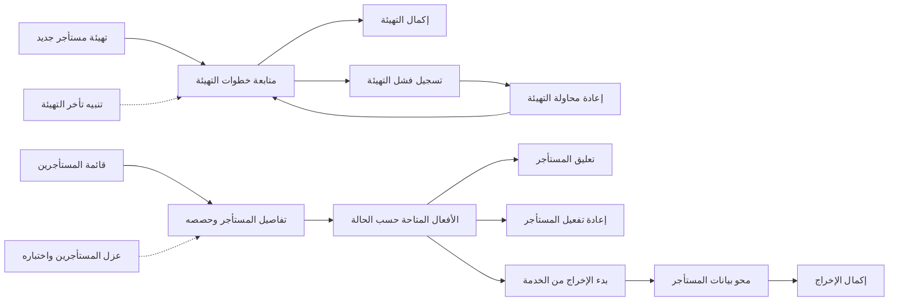
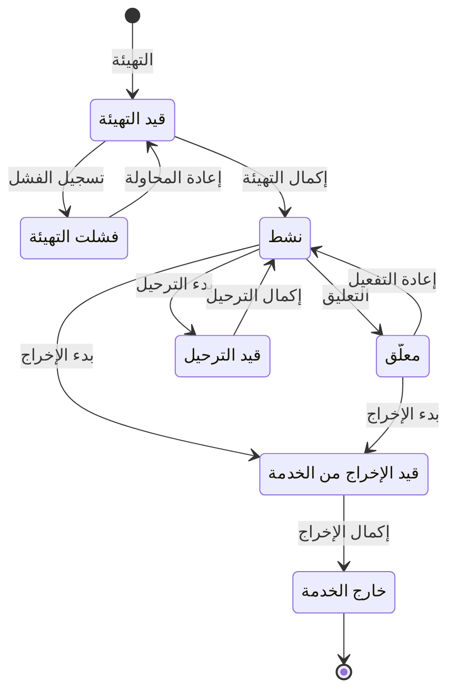

# دورة حياة المستأجر

<!-- BEGIN GENERATED: doc -->
| البند | القيمة |
|---|---|
| المعرّف | FEAT-ORG-TENANT-LIFECYCLE |
| الإصدار | 0.1 |
| الحالة | مسودة |
| القدرة | CAP-01 إدارة المؤسسة والوصول |
| القدرة الفرعية | CAP-01.01 إدارة المستأجرين والمؤسسات (R1) |
| الأدوار | مشغّل المنصة؛ مسؤول الإدارة؛ النظام |
| الشاشات | SCR-60 المستأجر والحصص (واجهة المشغل) |
| حالات الاستخدام | UC-080 |
| القصص | 19: 9 من المواصفة، و10 جديدة |
<!-- END GENERATED: doc -->

## 1. نظرة عامة

### 1.1 القيمة

يتيح لمشغل المنصة إنشاء مستأجر جديد معزول وجاهز للاستخدام ومتابعة حالته وتعليقه أو إعادته أو إخراجه من الخدمة بأمان.

### 1.2 النطاق

| البند | القيمة |
|---|---|
| المستخدمون | مشغّل المنصة من مستأجر المنصة؛ ومسؤول الإدارة يطّلع على مستأجره وحصصه فقط؛ والنظام بهوية خدمة التهيئة الداخلية في إكمال التهيئة وتسجيل فشلها وإكمال الإخراج |
| الشاشات | المستأجر والحصص في واجهة المشغّل |
| حالات الاستخدام | تهيئة مستأجر جديد ومتابعته حتى يصبح نشطًا، وتعليقه وإعادة تفعيله، وإخراجه من الخدمة |
| المتطلبات | عزل بيانات كل مستأجر وسياساته وإعداداته وأحداثه وسجل تدقيقه عن غيره (REQ-FND-001)؛ إنشاء حدود العزل ومخطط التصنيف والأدوار الافتراضية والحصص وتيار التدقيق قبل أن يدخل أي مستخدم (REQ-FND-003)؛ خلية مستقلة للمستأجر المخصص أو السيادي (REQ-FND-004)؛ تهيئة آلية خلال ساعة دون تغيير في الكود (QAS-SCAL-003) |
| خارج النطاق | تحديث حصص المستأجر («حصص المستأجر وحدود الاستخدام») ونقله بين الخلايا («نقل المستأجر بين خلايا التشغيل») في قدرة تشغيل المنصة؛ المؤسسات والوحدات داخل المستأجر («الهيكل التنظيمي»)؛ وصول المشغّل الطارئ إلى بيانات مستأجر |

### 1.3 خريطة الميزة

يهيّئ مشغّل المنصة المستأجر ويتابع خطوات تهيئته حتى يفعّله النظام أو يسجّل فشلها. ثم يعلّقه أو يعيد تفعيله، أو يبدأ إخراجه من الخدمة فتُمحى بياناته ويُكمل النظام الإخراج. والشكل 1 يجمع القصص على هذا المسار، والشكل 2 يبيّن حالات المستأجر.

**الشكل 1: خريطة ميزة «دورة حياة المستأجر»**



**الشكل 2: رحلة المستأجر**



> **ملاحظة:** الترحيل بين الخلايا في ميزة «نقل المستأجر بين خلايا التشغيل»، وظهر في الشكل 2 لاكتمال الرحلة. و«معلّق» هنا حالة للمستأجر، لا علامة التعليق العامة في المسرد: المستأجر المعلّق لا يدخل مستخدموه، ويعود «نشطًا» بإعادة التفعيل.

## 2. القواعد المشتركة

تنطبق على كل قصص الميزة، فلا تتكرر داخل القصص. وكل قصة تذكر ما يخصها فقط.

### 2.1 السياق المشترك

كل قصة تبدأ من ثلاثة شروط: مستأجر نشط، وحزمة السياسات الأساسية مفعّلة، ومستخدم مسجّل الدخول ومخوَّل. وتشير إليها القصص بخطوة واحدة: «بفرض السياق المشترك للميزة».

### 2.2 الصلاحية وعدم الإفصاح

- من لا يحق له رؤية العنصر يتلقى ردًا بشكل «غير متاح» تمامًا، فلا يعرف أنه موجود.
- من يرى العنصر ولا يحق له الإجراء يتلقى «لا تملك صلاحية هذا الإجراء».

### 2.3 أوامر تغيير الحالة

- **منع التكرار:** يُرسل كل أمر بمفتاح فريد، فإعادة الطلب نفسه لا تُنفَّذ مرتين.
- **حماية التعديل المتزامن:** يُرسل كل أمر بإصدار البيانات الذي يراه المستخدم. فإن عدّلها غيره في الأثناء، يُرفض الأمر.
- **السجل:** إن نجح الأمر، يُكتب حدثه وسجل التدقيق في المعاملة نفسها.

### 2.4 الرفض المشترك

```gherkin
# language: ar
خاصية: الرفض المشترك لأوامر الميزة

  سيناريو مخطط: رفض مشترك لكل أمر في الميزة
    بفرض السياق المشترك للميزة
    و <الحالة>
    عندما يُرسل المستخدم أي أمر من أوامر الميزة
    اذاً يُرفض برمز <الرمز> ويرى "<الرسالة>"
    و لا يتغير شيء

    امثلة:
      | الحالة                                  | الرمز                  | الرسالة                                                 |
      | العنصر خارج صلاحياته                    | NOT_FOUND              | غير متاح                                                |
      | العنصر مرئي له ولا يحق له الإجراء       | AUTHZ_DENIED           | لا تملك صلاحية هذا الإجراء                              |
      | غيره عدّل العنصر بعد أن فتحه            | VERSION_CONFLICT       | تغيّرت البيانات منذ فتحتها. راجع التغييرات ثم أعد المحاولة |
      | أعاد مفتاح منع التكرار بمحتوى مختلف     | IDEMPOTENCY_KEY_REUSED | طلب مكرر بمحتوى مختلف                                   |
      | البيانات ناقصة أو غير صحيحة             | VALIDATION_FAILED      | بعض البيانات ناقصة أو غير صحيحة. راجع الحقول المعلَّمة      |

  سيناريو: إعادة الطلب نفسه لا تُنفَّذ مرتين
    بفرض السياق المشترك للميزة
    و أمر نجح بمفتاح منع تكرار
    عندما يُعاد الطلب نفسه بالمفتاح نفسه
    اذاً تُعاد النتيجة الأولى ولا يُكتب حدث ثانٍ
```

### 2.5 الفاعلون ونطاق المستأجر

- **مشغّل المنصة** يعمل من مستأجر المنصة، ويحدد المستأجر الهدف في الطلب. فشرط «مستأجر نشط» في السياق المشترك يخص مستأجر المنصة، والمستأجر الهدف قد يكون في أي حالة.
- **مسؤول الإدارة** في المستأجر يطّلع على مستأجره وحصصه فقط، ولا ينفّذ أي أمر من أوامر الميزة. وأي مستأجر آخر يظهر له «غير متاح».
- **النظام** ينفّذ وحده ثلاثة أوامر بهوية خدمة التهيئة الداخلية: إكمال التهيئة، وتسجيل فشلها، وإكمال الإخراج. وفي قصصها يكون «المستخدم المخوَّل» في السياق المشترك هو هذه الهوية، ولا يملكها أي مستخدم.
- **«خارج الخدمة»** حالة نهائية، فيُرفض فيها كل أمر من أوامر الميزة.

```gherkin
# language: ar
خاصية: المستأجر خارج الخدمة يرفض كل أوامر الميزة

  سيناريو مخطط: أمر على مستأجر خارج الخدمة
    بفرض السياق المشترك للميزة
    و مستأجر في حالة "خارج الخدمة"
    عندما يحاول مشغّل المنصة <الأمر>
    اذاً يُرفض برمز <الرمز> ويرى "<الرسالة>"
    و لا يتغير شيء

    امثلة:
      | الأمر | الرمز | الرسالة |
      | تعليق المستأجر | TENANT_INVALID_STATE_TRANSITION | الوضع الحالي للمستأجر لا يسمح بهذا الإجراء |
      | إعادة تفعيل المستأجر | TENANT_INVALID_STATE_TRANSITION | الوضع الحالي للمستأجر لا يسمح بهذا الإجراء |
      | إعادة محاولة التهيئة | TENANT_INVALID_STATE_TRANSITION | الوضع الحالي للمستأجر لا يسمح بهذا الإجراء |
      | بدء الإخراج من الخدمة | TENANT_INVALID_STATE_TRANSITION | الوضع الحالي للمستأجر لا يسمح بهذا الإجراء |
```

## 3. الجودة وتعريف الاكتمال

### 3.1 متطلبات الجودة

<!-- BEGIN GENERATED: quality -->
| المرجع | الموقف | المطلوب |
|---|---|---|
| QAS-SCAL-003 | provisions a new tenant | automated; ≤ 1 hour; no code or schema change |
| QAS-SEC-001 | attempts to access tenant B data by any path | 0 leaks in tenant-isolation suite |
<!-- END GENERATED: quality -->

### 3.2 تعريف الاكتمال

القصة مكتملة حين تتحقق الشروط الخمسة:

1. سيناريوهاتها والقواعد المشتركة تمر في الاختبار الآلي.
2. فحوص البنية المعمارية تمر.
3. نصوص الواجهة والرسائل موجودة بالعربية والإنجليزية.
4. مراجعة الكود مكتملة.
5. ما تضيفه القصة نفسها في قسم «القواعد» تحقق.

## 4. فهرس القصص

<!-- BEGIN GENERATED: story-index -->
| المعرّف | القصة | النوع | الحالة |
|---|---|---|---|
| `US-BC01-TEN-COMPLETE-DECOMMISSION` | إكمال إخراج المستأجر من الخدمة | أمر | مسودة |
| `US-BC01-TEN-COMPLETE-PROVISIONING` | إكمال تهيئة المستأجر | أمر | مسودة |
| `US-BC01-TEN-FAIL-PROVISIONING` | تسجيل فشل تهيئة المستأجر | أمر | مسودة |
| `US-BC01-TEN-PROVISION` | تهيئة المستأجر | أمر | مسودة |
| `US-BC01-TEN-REACTIVATE` | إعادة تفعيل المستأجر | أمر | مسودة |
| `US-BC01-TEN-RETRY-PROVISIONING` | إعادة محاولة تهيئة المستأجر | أمر | مسودة |
| `US-BC01-TEN-START-DECOMMISSION` | بدء إخراج المستأجر من الخدمة | أمر | مسودة |
| `US-BC01-TEN-SUSPEND` | تعليق المستأجر | أمر | مسودة |
| `US-BC01-Q-TEN-GET` | جلب: Tenant state, cell, quotas | جلب | مسودة |
| `US-DOM-TEN-LIST` | عرض قائمة المستأجرين لمشغل المنصة | جلب | مسودة |
| `US-UI-SCR60-PROVISIONING-PROGRESS` | متابعة خطوات تهيئة المستأجر وسبب فشلها | واجهة | مسودة |
| `US-UI-SCR60-TENANT-ACTIONS` | أفعال المستأجر المتاحة حسب حالته | واجهة | مسودة |
| `US-PLT-TENANT-CELL-BINDING` | رفض طلبات المستأجر من غير خليته | منصة | مسودة |
| `US-PLT-TENANT-DECOMMISSION-PURGE` | محو كل بيانات المستأجر عند إخراجه | منصة | مسودة |
| `US-PLT-TENANT-DEDICATED-CELL` | تشغيل المستأجر المخصص في خلية مستقلة | منصة | مسودة |
| `US-PLT-TENANT-ISOLATION-LAYERS` | عزل بيانات كل مستأجر في كل طبقة | منصة | مسودة |
| `US-PLT-TENANT-PROVISION-ATOMIC` | تهيئة مستأجر آلية ذرية خلال ساعة | منصة | مسودة |
| `US-OPS-TENANT-ISOLATION-SUITE` | اختبار عزل المستأجرين في كل المسارات | تشغيل | مسودة |
| `US-OPS-TENANT-PROVISION-ALERT` | تنبيه عند تأخر تهيئة المستأجر | تشغيل | مسودة |
<!-- END GENERATED: story-index -->

## 5. القصص

### 5.1 US-BC01-TEN-COMPLETE-DECOMMISSION — إكمال إخراج المستأجر من الخدمة

| النوع | الإصدار | الأولوية | دون اتصال | الحالة |
|---|---|---|---|---|
| أمر | R1 | Must | لا | مسودة |

> **كـ** النظام، **أريد** أن أنقل المستأجر إلى «خارج الخدمة» بعد إتلاف مفاتيحه وإزالة مخازنه، **حتى** يُغلق نهائيًا ولا تبقى له بيانات مقروءة.

**باختصار:** حين تؤكد خدمة التهيئة إتلاف مفاتيح المستأجر وإزالة مخازنه، يصير المستأجر «خارج الخدمة»، وهي حالة نهائية لا يُقبل بعدها أي أمر.

#### القواعد

- **متى يُسمح:** المستأجر «قيد الإخراج من الخدمة»، وأُتلفت مفاتيحه وأُزيلت مخازنه (القصة 5.14).
- **من يُسمح له:** النظام وحده، بهوية خدمة التهيئة الداخلية (§2.5).
- **البيانات:** لا مدخلات.
- **الأثر:** يصير المستأجر «خارج الخدمة». ويُسجَّل حدث «أُخرج المستأجر من الخدمة»، ويصل إلى دليل البحث وإلى خدمة التهيئة ومتحكم الخلية.

> **ملاحظة:** لا يحدد المصدر رمز رفض حين يُرسل الأمر قبل اكتمال إتلاف المفاتيح وإزالة المخازن **[Needs Review]**.

#### معايير القبول

```gherkin
# language: ar
خاصية: إكمال إخراج المستأجر من الخدمة

  سيناريو: النظام يُكمل إخراج مستأجر أُتلفت مفاتيحه
    بفرض السياق المشترك للميزة
    و مستأجر "قيد الإخراج من الخدمة" أُتلفت مفاتيحه وأُزيلت مخازنه
    عندما يُكمل النظام إخراجه من الخدمة
    اذاً تصبح حالته "خارج الخدمة"
    و يُسجَّل حدث "أُخرج المستأجر من الخدمة"

  سيناريو مخطط: رفض خاص بإكمال الإخراج
    بفرض السياق المشترك للميزة
    و <الحالة>
    عندما يحاول النظام إكمال إخراج المستأجر
    اذاً يُرفض برمز <الرمز> برسالة "<الرسالة>"
    و لا يتغير شيء

    امثلة:
      | الحالة | الرمز | الرسالة |
      | المستأجر "نشط" أو "معلّق" ولم يبدأ إخراجه | TENANT_INVALID_STATE_TRANSITION | الوضع الحالي للمستأجر لا يسمح بهذا الإجراء |
```

<details><summary>المراجع التقنية والتتبع</summary>

<!-- BEGIN GENERATED: refs US-BC01-TEN-COMPLETE-DECOMMISSION -->
| البند | المعرّف | المعنى |
|---|---|---|
| الواجهة البرمجية | `POST /api/v1/foundation/tenants/{id}/actions/complete-decommission` | — |
| الأمر | `CMD-TEN-COMPLETE-DECOMMISSION` | إكمال إخراج المستأجر من الخدمة |
| السياسة | `POL-TEN-COMPLETE-DECOMMISSION` | workload identity: scheduler / provisioning saga؛ tenant match; subject ACTIVE; tenant ACTIVE (except TEN ope… |
| الحدث | `EVT-TEN-DECOMMISSIONED` | يصل إلى: Search/Directory projection (BC01 read model); Provisioning saga / cell controller |
| الكيان | `AGG-TENANT` | المستأجر |
| الجدول | `foundation.tenants` | الجدول الرئيسي للمستأجر |
| وحدة النشر | DU-02 | — |
| المتطلبات | REQ-FND-001، REQ-FND-003، REQ-FND-004 | معانيها في القسم 6. التتبع |
| حالة الاستخدام | UC-080 | Provision Tenant |
| الاختبار | TST-TENANT-SM، TST-SLC01-INVARIANTS | دورة حالات المستأجر، وثوابت الشريحة SLC-01 |
<!-- END GENERATED: refs US-BC01-TEN-COMPLETE-DECOMMISSION -->

</details>

### 5.2 US-BC01-TEN-COMPLETE-PROVISIONING — إكمال تهيئة المستأجر

| النوع | الإصدار | الأولوية | دون اتصال | الحالة |
|---|---|---|---|---|
| أمر | R1 | Must | لا | مسودة |

> **كـ** النظام، **أريد** أن أفعّل المستأجر حين تكتمل كل خطوات تهيئته، **حتى** يدخل مستخدموه إلى بيئة معزولة وجاهزة.

**باختصار:** حين تؤكد خدمة التهيئة الخطوات الست كلها، يصير المستأجر «نشطًا». ومن تلك اللحظة فقط يستطيع مستخدموه الدخول.

#### القواعد

- **متى يُسمح:** المستأجر «قيد التهيئة»، وأُكِّدت الخطوات الست: حدود العزل، والمفاتيح، ومخطط التصنيف، والأدوار الافتراضية، والحصص، وتيار التدقيق (REQ-FND-003).
- **من يُسمح له:** النظام وحده، بهوية خدمة التهيئة الداخلية (§2.5).
- **البيانات:** قائمة الخطوات المؤكَّدة (إلزامية).
- **الأثر:** يصير المستأجر «نشطًا»، ولا يستطيع مستخدموه الدخول قبل ذلك. ويُسجَّل حدث «فُعِّل المستأجر»، ويصل إلى دليل البحث وإلى خدمة التهيئة ومتحكم الخلية.

#### معايير القبول

```gherkin
# language: ar
خاصية: إكمال تهيئة المستأجر

  سيناريو: النظام يفعّل مستأجرًا اكتملت خطواته
    بفرض السياق المشترك للميزة
    و مستأجر "قيد التهيئة" أُكِّدت خطواته الست
    عندما يُكمل النظام تهيئته
    اذاً تصبح حالته "نشط"
    و يُسجَّل حدث "فُعِّل المستأجر"
    و يستطيع مستخدموه الدخول من الآن

  سيناريو مخطط: رفض خاص بإكمال التهيئة
    بفرض السياق المشترك للميزة
    و <الحالة>
    عندما يحاول النظام إكمال تهيئة المستأجر
    اذاً يُرفض برمز <الرمز> برسالة "<الرسالة>"
    و لا يتغير شيء

    امثلة:
      | الحالة | الرمز | الرسالة |
      | المستأجر ليس "قيد التهيئة" | TENANT_INVALID_STATE_TRANSITION | الوضع الحالي للمستأجر لا يسمح بهذا الإجراء |
      | خطوة من الخطوات الست لم تُؤكَّد | TENANT_PROVISIONING_INCOMPLETE | لم تكتمل خطوات تجهيز المستأجر |
      | قائمة الخطوات غير مرسلة | VALIDATION_FAILED | قائمة الخطوات مطلوبة |
```

<details><summary>المراجع التقنية والتتبع</summary>

<!-- BEGIN GENERATED: refs US-BC01-TEN-COMPLETE-PROVISIONING -->
| البند | المعرّف | المعنى |
|---|---|---|
| الواجهة البرمجية | `POST /api/v1/foundation/tenants/{id}/actions/complete-provisioning` | — |
| الأمر | `CMD-TEN-COMPLETE-PROVISIONING` | إكمال تهيئة المستأجر |
| السياسة | `POL-TEN-COMPLETE-PROVISIONING` | workload identity: scheduler / provisioning saga؛ tenant match; subject ACTIVE; tenant ACTIVE (except TEN ope… |
| الحدث | `EVT-TEN-ACTIVATED` | يصل إلى: Search/Directory projection (BC01 read model); Provisioning saga / cell controller |
| الكيان | `AGG-TENANT` | المستأجر |
| الجدول | `foundation.tenants` | الجدول الرئيسي للمستأجر |
| وحدة النشر | DU-02 | — |
| المتطلبات | REQ-FND-001، REQ-FND-003، REQ-FND-004 | معانيها في القسم 6. التتبع |
| حالة الاستخدام | UC-080 | Provision Tenant |
| الاختبار | TST-TENANT-SM، TST-SLC01-INVARIANTS | دورة حالات المستأجر، وثوابت الشريحة SLC-01 |
<!-- END GENERATED: refs US-BC01-TEN-COMPLETE-PROVISIONING -->

</details>

### 5.3 US-BC01-TEN-FAIL-PROVISIONING — تسجيل فشل تهيئة المستأجر

| النوع | الإصدار | الأولوية | دون اتصال | الحالة |
|---|---|---|---|---|
| أمر | R1 | Must | لا | مسودة |

> **كـ** النظام، **أريد** أن أسجّل فشل تهيئة المستأجر بعد التراجع عن خطواتها، **حتى** يعرف مشغّل المنصة الخطوة التي فشلت وسببها فيقرر إعادة المحاولة.

**باختصار:** إن فشلت خطوة من خطوات التهيئة، تتراجع خدمة التهيئة عمّا نفّذته، ثم تسجّل الفشل بالخطوة والسبب، فيصير المستأجر «فشلت التهيئة».

#### القواعد

- **متى يُسمح:** المستأجر «قيد التهيئة»، واكتمل التراجع عن الخطوات المنفَّذة.
- **من يُسمح له:** النظام وحده، بهوية خدمة التهيئة الداخلية (§2.5).
- **البيانات:** الخطوة التي فشلت، والسبب. وكلاهما إلزامي.
- **الأثر:** يصير المستأجر «فشلت التهيئة»، ولا يبقى منه ما يصلح لاستخدام المستخدمين (REQ-FND-003). ويُسجَّل حدث «فشلت تهيئة المستأجر»، ويصل إلى دليل البحث وإلى خدمة التهيئة. ويعيد المشغّل المحاولة من القصة 5.6.

> **ملاحظة:** لا يحدد المصدر رمز رفض حين يُرسل الأمر قبل اكتمال التراجع **[Needs Review]**.

#### معايير القبول

```gherkin
# language: ar
خاصية: تسجيل فشل تهيئة المستأجر

  سيناريو: النظام يسجّل فشل خطوة بعد التراجع عنها
    بفرض السياق المشترك للميزة
    و مستأجر "قيد التهيئة" فشلت فيه خطوة مخطط التصنيف واكتمل التراجع
    عندما يسجّل النظام الفشل بالخطوة والسبب
    اذاً تصبح حالته "فشلت التهيئة"
    و تُحفظ الخطوة التي فشلت وسببها
    و يُسجَّل حدث "فشلت تهيئة المستأجر"

  سيناريو مخطط: رفض خاص بتسجيل الفشل
    بفرض السياق المشترك للميزة
    و <الحالة>
    عندما يحاول النظام تسجيل فشل التهيئة
    اذاً يُرفض برمز <الرمز> برسالة "<الرسالة>"
    و لا يتغير شيء

    امثلة:
      | الحالة | الرمز | الرسالة |
      | المستأجر ليس "قيد التهيئة" | TENANT_INVALID_STATE_TRANSITION | الوضع الحالي للمستأجر لا يسمح بهذا الإجراء |
      | الخطوة التي فشلت غير مذكورة | VALIDATION_FAILED | الخطوة التي فشلت مطلوبة |
      | السبب غير مذكور | VALIDATION_FAILED | السبب مطلوب |
```

<details><summary>المراجع التقنية والتتبع</summary>

<!-- BEGIN GENERATED: refs US-BC01-TEN-FAIL-PROVISIONING -->
| البند | المعرّف | المعنى |
|---|---|---|
| الواجهة البرمجية | `POST /api/v1/foundation/tenants/{id}/actions/fail-provisioning` | — |
| الأمر | `CMD-TEN-FAIL-PROVISIONING` | تسجيل فشل تهيئة المستأجر |
| السياسة | `POL-TEN-FAIL-PROVISIONING` | workload identity: scheduler / provisioning saga؛ tenant match; subject ACTIVE; tenant ACTIVE (except TEN ope… |
| الحدث | `EVT-TEN-PROVISIONING-FAILED` | يصل إلى: Search/Directory projection (BC01 read model); Provisioning saga / cell controller |
| الكيان | `AGG-TENANT` | المستأجر |
| الجدول | `foundation.tenants` | الجدول الرئيسي للمستأجر |
| وحدة النشر | DU-02 | — |
| المتطلبات | REQ-FND-001، REQ-FND-003، REQ-FND-004 | معانيها في القسم 6. التتبع |
| حالة الاستخدام | UC-080 | Provision Tenant |
| الاختبار | TST-TENANT-SM، TST-SLC01-INVARIANTS | دورة حالات المستأجر، وثوابت الشريحة SLC-01 |
<!-- END GENERATED: refs US-BC01-TEN-FAIL-PROVISIONING -->

</details>

### 5.4 US-BC01-TEN-PROVISION — تهيئة مستأجر جديد

| النوع | الإصدار | الأولوية | دون اتصال | الحالة |
|---|---|---|---|---|
| أمر | R1 | Must | لا | مسودة |

> **كـ** مشغّل المنصة، **أريد** أن أهيّئ مستأجرًا جديدًا ببياناته وحصصه، **حتى** تحصل الجهة على بيئة معزولة دون أي تغيير في الكود.

**باختصار:** يُدخل المشغّل اسمًا فريدًا للمستأجر وبياناته ونمط خليته وحصصه، فيُنشأ المستأجر «قيد التهيئة» وتبدأ خطوات تهيئته الآلية.

#### القواعد

- **متى يُسمح:** لا مستأجر بالاسم نفسه على المنصة كلها. ونمط الخلية يطابق وصف المستأجر: «مخصصة» إلزامية إن كان سياديًا، أو فُعِّل فيه أعلى مستوى تصنيف، أو زاد حمله على 20 % من سعة الخلية (ADR-P04).
- **من يُسمح له:** مشغّل المنصة من مستأجر المنصة (§2.5).
- **البيانات:** الاسم الفريد، ولا يتغير بعد الإنشاء؛ واسم العرض؛ ونمط الخلية (مشتركة أو مخصصة)؛ وهل هو سيادي؛ وهل يُفعَّل أعلى مستوى تصنيف؛ والولاية؛ والحصص. وكلها إلزامية.
- **الأثر:** يُنشأ المستأجر «قيد التهيئة»، ولا يستطيع أحد الدخول إليه بعد. ويُسجَّل حدث «بدأت تهيئة المستأجر»، فتبدأ خدمة التهيئة خطواتها (القصة 5.17).

> **ملاحظة:** المصدر يربط شرط نمط الخلية برمز «اسم المستأجر مستخدم» نفسه، ولا يحدد رمزًا لنمط خلية لا يطابق وصف المستأجر **[Needs Review]**.

#### معايير القبول

```gherkin
# language: ar
خاصية: تهيئة مستأجر جديد

  سيناريو: المشغّل يهيّئ مستأجرًا في خلية مشتركة
    بفرض السياق المشترك للميزة
    و لا مستأجر على المنصة باسم "جهة-أ"
    عندما يهيّئ مستأجرًا باسم "جهة-أ" في خلية مشتركة، غير سيادي، بولايته وحصصه
    اذاً يُنشأ المستأجر في حالة "قيد التهيئة"
    و يُسجَّل حدث "بدأت تهيئة المستأجر"
    و لا يستطيع أي مستخدم الدخول إليه بعد

  سيناريو مخطط: رفض خاص بتهيئة المستأجر
    بفرض السياق المشترك للميزة
    و <الحالة>
    عندما يحاول تهيئة المستأجر
    اذاً يُرفض برمز <الرمز> ويرى "<الرسالة>"
    و لا يتغير شيء

    امثلة:
      | الحالة | الرمز | الرسالة |
      | الاسم مستخدم لمستأجر آخر | TENANT_NAMESPACE_TAKEN | اسم المستأجر مستخدم |
      | لم يُدخل اسم المستأجر | VALIDATION_FAILED | اسم المستأجر مطلوب |
      | لم يحدد الولاية | VALIDATION_FAILED | الولاية مطلوبة |
      | نمط الخلية ليس "مشتركة" ولا "مخصصة" | VALIDATION_FAILED | نمط الخلية غير صحيح |
```

<details><summary>المراجع التقنية والتتبع</summary>

<!-- BEGIN GENERATED: refs US-BC01-TEN-PROVISION -->
| البند | المعرّف | المعنى |
|---|---|---|
| الواجهة البرمجية | `POST /api/v1/foundation/tenants` | — |
| الأمر | `CMD-TEN-PROVISION` | تهيئة المستأجر |
| السياسة | `POL-TEN-PROVISION` | Platform Operator (platform tenant) ; Tenant Administrator for quotas view only؛ tenant match; subject ACTIVE… |
| الحدث | `EVT-TEN-PROVISIONING-STARTED` | يصل إلى: Search/Directory projection (BC01 read model); Provisioning saga / cell controller |
| الكيان | `AGG-TENANT` | المستأجر |
| الجدول | `foundation.tenants` | الجدول الرئيسي للمستأجر |
| وحدة النشر | DU-02 | — |
| المتطلبات | REQ-FND-001، REQ-FND-003، REQ-FND-004 | معانيها في القسم 6. التتبع |
| حالة الاستخدام | UC-080 | Provision Tenant |
| الاختبار | TST-TENANT-SM، TST-SLC01-INVARIANTS | دورة حالات المستأجر، وثوابت الشريحة SLC-01 |
<!-- END GENERATED: refs US-BC01-TEN-PROVISION -->

</details>

### 5.5 US-BC01-TEN-REACTIVATE — إعادة تفعيل المستأجر

| النوع | الإصدار | الأولوية | دون اتصال | الحالة |
|---|---|---|---|---|
| أمر | R1 | Must | لا | مسودة |

> **كـ** مشغّل المنصة، **أريد** أن أعيد تفعيل مستأجر معلّق، **حتى** يعود مستخدموه إلى العمل بعد زوال سبب التعليق.

**باختصار:** يعيد المشغّل المستأجر «المعلّق» إلى «نشط»، فيستطيع مستخدموه الدخول من جديد.

#### القواعد

- **متى يُسمح:** المستأجر «معلّق».
- **من يُسمح له:** مشغّل المنصة (§2.5).
- **البيانات:** لا مدخلات.
- **الأثر:** يصير المستأجر «نشطًا»، ويستطيع مستخدموه الدخول. ويُسجَّل حدث «أُعيد تفعيل المستأجر»، وهو حدث يمس الأمن: يرفع إصدار الأمان فتُبطَل قرارات الصلاحية المحفوظة وتتحدث الإسقاطات، ويصل أيضًا إلى دليل البحث وخدمة التهيئة.

#### معايير القبول

```gherkin
# language: ar
خاصية: إعادة تفعيل المستأجر

  سيناريو: المشغّل يعيد تفعيل مستأجر معلّق
    بفرض السياق المشترك للميزة
    و مستأجر في حالة "معلّق"
    عندما يعيد تفعيله
    اذاً تصبح حالته "نشط"
    و يستطيع مستخدموه الدخول من جديد
    و يُسجَّل حدث "أُعيد تفعيل المستأجر"

  سيناريو مخطط: رفض خاص بإعادة التفعيل
    بفرض السياق المشترك للميزة
    و <الحالة>
    عندما يحاول إعادة تفعيل المستأجر
    اذاً يُرفض برمز <الرمز> ويرى "<الرسالة>"
    و لا يتغير شيء

    امثلة:
      | الحالة | الرمز | الرسالة |
      | المستأجر كان "نشطًا" حين فتحه ولم يتغير | TENANT_INVALID_STATE_TRANSITION | الوضع الحالي للمستأجر لا يسمح بهذا الإجراء |
      | المستأجر "قيد الإخراج من الخدمة" | TENANT_INVALID_STATE_TRANSITION | الوضع الحالي للمستأجر لا يسمح بهذا الإجراء |
```

<details><summary>المراجع التقنية والتتبع</summary>

<!-- BEGIN GENERATED: refs US-BC01-TEN-REACTIVATE -->
| البند | المعرّف | المعنى |
|---|---|---|
| الواجهة البرمجية | `POST /api/v1/foundation/tenants/{id}/actions/reactivate` | — |
| الأمر | `CMD-TEN-REACTIVATE` | إعادة تفعيل المستأجر |
| السياسة | `POL-TEN-REACTIVATE` | Platform Operator (platform tenant) ; Tenant Administrator for quotas view only؛ tenant match; subject ACTIVE… |
| الحدث | `EVT-TEN-REACTIVATED` | يصل إلى: Security-version service (EVT-SEC-VERSION-INCREMENTED); PEP decision caches; Projection security-ver… |
| الكيان | `AGG-TENANT` | المستأجر |
| الجدول | `foundation.tenants` | الجدول الرئيسي للمستأجر |
| وحدة النشر | DU-02 | — |
| المتطلبات | REQ-FND-001، REQ-FND-003، REQ-FND-004 | معانيها في القسم 6. التتبع |
| حالة الاستخدام | UC-080 | Provision Tenant |
| الاختبار | TST-TENANT-SM، TST-SLC01-INVARIANTS | دورة حالات المستأجر، وثوابت الشريحة SLC-01 |
<!-- END GENERATED: refs US-BC01-TEN-REACTIVATE -->

</details>

### 5.6 US-BC01-TEN-RETRY-PROVISIONING — إعادة محاولة تهيئة المستأجر

| النوع | الإصدار | الأولوية | دون اتصال | الحالة |
|---|---|---|---|---|
| أمر | R1 | Must | لا | مسودة |

> **كـ** مشغّل المنصة، **أريد** أن أعيد محاولة تهيئة مستأجر فشلت تهيئته، **حتى** يكتمل إنشاؤه بعد معالجة سبب الفشل.

**باختصار:** يعيد المشغّل المستأجر من «فشلت التهيئة» إلى «قيد التهيئة»، فتبدأ خدمة التهيئة خطواتها من جديد.

#### القواعد

- **متى يُسمح:** المستأجر «فشلت التهيئة».
- **من يُسمح له:** مشغّل المنصة وحده، لا النظام (§2.5).
- **البيانات:** لا مدخلات.
- **الأثر:** يصير المستأجر «قيد التهيئة»، ويُسجَّل حدث «بدأت تهيئة المستأجر» فتبدأ خدمة التهيئة خطواتها من جديد. وكل خطوة قابلة للتكرار دون أثر مضاعف (القصة 5.17).

#### معايير القبول

```gherkin
# language: ar
خاصية: إعادة محاولة تهيئة المستأجر

  سيناريو: المشغّل يعيد محاولة تهيئة فشلت
    بفرض السياق المشترك للميزة
    و مستأجر في حالة "فشلت التهيئة"
    عندما يعيد محاولة تهيئته
    اذاً تصبح حالته "قيد التهيئة"
    و يُسجَّل حدث "بدأت تهيئة المستأجر"

  سيناريو مخطط: رفض خاص بإعادة المحاولة
    بفرض السياق المشترك للميزة
    و <الحالة>
    عندما يحاول إعادة محاولة التهيئة
    اذاً يُرفض برمز <الرمز> ويرى "<الرسالة>"
    و لا يتغير شيء

    امثلة:
      | الحالة | الرمز | الرسالة |
      | المستأجر كان "قيد التهيئة" حين فتحه ولم يتغير | TENANT_INVALID_STATE_TRANSITION | الوضع الحالي للمستأجر لا يسمح بهذا الإجراء |
      | المستأجر "نشط" | TENANT_INVALID_STATE_TRANSITION | الوضع الحالي للمستأجر لا يسمح بهذا الإجراء |
```

<details><summary>المراجع التقنية والتتبع</summary>

<!-- BEGIN GENERATED: refs US-BC01-TEN-RETRY-PROVISIONING -->
| البند | المعرّف | المعنى |
|---|---|---|
| الواجهة البرمجية | `POST /api/v1/foundation/tenants/{id}/actions/retry-provisioning` | — |
| الأمر | `CMD-TEN-RETRY-PROVISIONING` | إعادة محاولة تهيئة المستأجر |
| السياسة | `POL-TEN-RETRY-PROVISIONING` | Platform Operator (platform tenant) ; Tenant Administrator for quotas view only؛ tenant match; subject ACTIVE… |
| الحدث | `EVT-TEN-PROVISIONING-STARTED` | يصل إلى: Search/Directory projection (BC01 read model); Provisioning saga / cell controller |
| الكيان | `AGG-TENANT` | المستأجر |
| الجدول | `foundation.tenants` | الجدول الرئيسي للمستأجر |
| وحدة النشر | DU-02 | — |
| المتطلبات | REQ-FND-001، REQ-FND-003، REQ-FND-004 | معانيها في القسم 6. التتبع |
| حالة الاستخدام | UC-080 | Provision Tenant |
| الاختبار | TST-TENANT-SM، TST-SLC01-INVARIANTS | دورة حالات المستأجر، وثوابت الشريحة SLC-01 |
<!-- END GENERATED: refs US-BC01-TEN-RETRY-PROVISIONING -->

</details>

### 5.7 US-BC01-TEN-START-DECOMMISSION — بدء إخراج المستأجر من الخدمة

| النوع | الإصدار | الأولوية | دون اتصال | الحالة |
|---|---|---|---|---|
| أمر | R1 | Must | لا | مسودة |

> **كـ** مشغّل المنصة، **أريد** أن أبدأ إخراج مستأجر من الخدمة بموافقة مشغّل ثانٍ، **حتى** تُزال بياناته بأمان دون قرار فردي.

**باختصار:** يبدأ المشغّل إخراج مستأجر «نشط» أو «معلّق» بسبب ومعتمِد ثانٍ وتأكيد هويته، بشرط ألا يكون على بياناته تجميد قانوني، فيصير «قيد الإخراج من الخدمة».

#### القواعد

- **متى يُسمح:** المستأجر «نشط» أو «معلّق»، ولا تجميد قانوني نافذ على أي من بياناته.
- **من يُسمح له:** مشغّل المنصة، ومعه مشغّل منصة ثانٍ غيره معتمِدًا. ويؤكد المشغّل هويته بمصادقة معززة.
- **البيانات:** السبب، والمعتمِد الثاني. وكلاهما إلزامي.
- **الأثر:** يصير المستأجر «قيد الإخراج من الخدمة»، فلا يستطيع مستخدموه الدخول. ويُسجَّل حدث «بدأ إخراج المستأجر من الخدمة»، فتبدأ خدمة التهيئة إتلاف المفاتيح وإزالة المخازن (القصة 5.14)، ثم إكمال الإخراج (القصة 5.1).

> **ملاحظة:** المصدر يجعل المعتمِد الثاني حقلًا في الأمر، ولا يصف كيف يؤكد هذا المعتمِد موافقته **[Needs Review]**.

#### معايير القبول

```gherkin
# language: ar
خاصية: بدء إخراج المستأجر من الخدمة

  سيناريو: المشغّل يبدأ إخراج مستأجر معلّق بموافقة مشغّل ثانٍ
    بفرض السياق المشترك للميزة
    و مستأجر في حالة "معلّق" لا تجميد قانوني على بياناته
    و المشغّل أكّد هويته بمصادقة معززة
    عندما يبدأ إخراجه من الخدمة بسبب ومعتمِد ثانٍ من مشغّلي المنصة
    اذاً تصبح حالته "قيد الإخراج من الخدمة"
    و يُسجَّل حدث "بدأ إخراج المستأجر من الخدمة"

  سيناريو مخطط: رفض خاص ببدء الإخراج
    بفرض السياق المشترك للميزة
    و <الحالة>
    عندما يحاول بدء إخراج المستأجر من الخدمة
    اذاً يُرفض برمز <الرمز> ويرى "<الرسالة>"
    و لا يتغير شيء

    امثلة:
      | الحالة | الرمز | الرسالة |
      | المعتمِد الثاني هو المشغّل نفسه | SEGREGATION_OF_DUTIES | لا يجوز أن يعتمد الشخص نفسه ما قدّمه أو طلبه |
      | لم يؤكد هويته بمصادقة معززة | MFA_STEP_UP_REQUIRED | هذا الإجراء يحتاج تأكيد هويتك مرة أخرى |
      | على بيانات المستأجر تجميد قانوني نافذ | LEGAL_HOLD_ACTIVE | يوجد تجميد قانوني يمنع هذا الإجراء |
      | المستأجر "قيد التهيئة" أو "قيد الترحيل" | TENANT_INVALID_STATE_TRANSITION | الوضع الحالي للمستأجر لا يسمح بهذا الإجراء |
      | لم يذكر المعتمِد الثاني | VALIDATION_FAILED | المعتمِد الثاني مطلوب |
      | لم يذكر السبب | VALIDATION_FAILED | السبب مطلوب |
```

<details><summary>المراجع التقنية والتتبع</summary>

<!-- BEGIN GENERATED: refs US-BC01-TEN-START-DECOMMISSION -->
| البند | المعرّف | المعنى |
|---|---|---|
| الواجهة البرمجية | `POST /api/v1/foundation/tenants/{id}/actions/start-decommission` | — |
| الأمر | `CMD-TEN-START-DECOMMISSION` | بدء إخراج المستأجر من الخدمة |
| السياسة | `POL-TEN-START-DECOMMISSION` | Platform Operator (platform tenant) ; Tenant Administrator for quotas view only؛ tenant match; subject ACTIVE… |
| الحدث | `EVT-TEN-DECOMMISSION-STARTED` | يصل إلى: Search/Directory projection (BC01 read model); Provisioning saga / cell controller |
| الكيان | `AGG-TENANT` | المستأجر |
| الجدول | `foundation.tenants` | الجدول الرئيسي للمستأجر |
| وحدة النشر | DU-02 | — |
| المتطلبات | REQ-FND-001، REQ-FND-003، REQ-FND-004 | معانيها في القسم 6. التتبع |
| حالة الاستخدام | UC-080 | Provision Tenant |
| الاختبار | TST-TENANT-SM، TST-SLC01-INVARIANTS | دورة حالات المستأجر، وثوابت الشريحة SLC-01 |
<!-- END GENERATED: refs US-BC01-TEN-START-DECOMMISSION -->

</details>

### 5.8 US-BC01-TEN-SUSPEND — تعليق المستأجر

| النوع | الإصدار | الأولوية | دون اتصال | الحالة |
|---|---|---|---|---|
| أمر | R1 | Must | لا | مسودة |

> **كـ** مشغّل المنصة، **أريد** أن أعلّق مستأجرًا نشطًا مع ذكر السبب، **حتى** يتوقف دخول مستخدميه إلى أن يُعاد تفعيله.

**باختصار:** يعلّق المشغّل مستأجرًا «نشطًا» بسبب يذكره، فيصير «معلّقًا» ولا يستطيع مستخدموه الدخول حتى يُعاد تفعيله (القصة 5.5).

#### القواعد

- **متى يُسمح:** المستأجر «نشط».
- **من يُسمح له:** مشغّل المنصة (§2.5).
- **البيانات:** السبب (إلزامي).
- **الأثر:** يصير المستأجر «معلّقًا»، فلا يدخل مستخدموه لأن الدخول للمستأجر النشط وحده. ويُسجَّل حدث «عُلِّق المستأجر»، وهو حدث يمس الأمن: يرفع إصدار الأمان فتُبطَل قرارات الصلاحية المحفوظة لمستخدميه، ويصل أيضًا إلى دليل البحث وخدمة التهيئة.

#### معايير القبول

```gherkin
# language: ar
خاصية: تعليق المستأجر

  سيناريو: المشغّل يعلّق مستأجرًا نشطًا
    بفرض السياق المشترك للميزة
    و مستأجر في حالة "نشط"
    عندما يعلّقه بسبب يذكره
    اذاً تصبح حالته "معلّق"
    و لا يستطيع مستخدموه الدخول
    و يُسجَّل حدث "عُلِّق المستأجر"

  سيناريو مخطط: رفض خاص بتعليق المستأجر
    بفرض السياق المشترك للميزة
    و <الحالة>
    عندما يحاول تعليق المستأجر
    اذاً يُرفض برمز <الرمز> ويرى "<الرسالة>"
    و لا يتغير شيء

    امثلة:
      | الحالة | الرمز | الرسالة |
      | المستأجر كان "معلّقًا" حين فتحه ولم يتغير | TENANT_INVALID_STATE_TRANSITION | الوضع الحالي للمستأجر لا يسمح بهذا الإجراء |
      | المستأجر "قيد التهيئة" | TENANT_INVALID_STATE_TRANSITION | الوضع الحالي للمستأجر لا يسمح بهذا الإجراء |
      | السبب فارغ | REASON_REQUIRED | اذكر السبب |
```

<details><summary>المراجع التقنية والتتبع</summary>

<!-- BEGIN GENERATED: refs US-BC01-TEN-SUSPEND -->
| البند | المعرّف | المعنى |
|---|---|---|
| الواجهة البرمجية | `POST /api/v1/foundation/tenants/{id}/actions/suspend` | — |
| الأمر | `CMD-TEN-SUSPEND` | تعليق المستأجر |
| السياسة | `POL-TEN-SUSPEND` | Platform Operator (platform tenant) ; Tenant Administrator for quotas view only؛ tenant match; subject ACTIVE… |
| الحدث | `EVT-TEN-SUSPENDED` | يصل إلى: Security-version service (EVT-SEC-VERSION-INCREMENTED); PEP decision caches; Projection security-ver… |
| الكيان | `AGG-TENANT` | المستأجر |
| الجدول | `foundation.tenants` | الجدول الرئيسي للمستأجر |
| وحدة النشر | DU-02 | — |
| المتطلبات | REQ-FND-001، REQ-FND-003، REQ-FND-004 | معانيها في القسم 6. التتبع |
| حالة الاستخدام | UC-080 | Provision Tenant |
| الاختبار | TST-TENANT-SM، TST-SLC01-INVARIANTS | دورة حالات المستأجر، وثوابت الشريحة SLC-01 |
<!-- END GENERATED: refs US-BC01-TEN-SUSPEND -->

</details>

### 5.9 US-BC01-Q-TEN-GET — تفاصيل المستأجر: حالته وخليته وحصصه

| النوع | الإصدار | الأولوية | دون اتصال | الحالة |
|---|---|---|---|---|
| جلب | R1 | Must | لا | مسودة |

> **كـ** مشغّل المنصة، **أريد** أن أرى حالة المستأجر وخليته وحصصه، **حتى** أتابعه وأقرر الإجراء المناسب.

**باختصار:** تُعرض حالة المستأجر الحالية، والخلية المرتبط بها، وحصصه. ويطّلع عليها مسؤول الإدارة لمستأجره وحده.

#### القواعد

- **من يرى ماذا:** مشغّل المنصة يرى أي مستأجر. ومسؤول الإدارة يرى مستأجره وحده، للاطلاع دون أي إجراء. ومن عداهما، ومسؤول إدارة يطلب مستأجرًا آخر، يرى «غير متاح» (§2.2).
- **المرشحات:** لا مرشحات؛ يُطلب المستأجر بمعرّفه.
- **البيانات المعروضة:** الحالة الحالية، والخلية، والحصص.

#### معايير القبول

```gherkin
# language: ar
خاصية: تفاصيل المستأجر

  سيناريو: المشغّل يفتح تفاصيل مستأجر
    بفرض السياق المشترك للميزة
    و مستأجر "نشط" في خلية مشتركة وله حصص
    عندما يفتح مشغّل المنصة تفاصيله
    اذاً تُعرض حالته "نشط" وخليته وحصصه

  سيناريو: مسؤول الإدارة لا يرى إلا مستأجره
    بفرض السياق المشترك للميزة
    و مسؤول إدارة في المستأجر "جهة-أ"
    عندما يطلب تفاصيل المستأجر "جهة-ب"
    اذاً يُعاد "غير متاح" بالشكل نفسه لمستأجر غير موجود
```

<details><summary>المراجع التقنية والتتبع</summary>

<!-- BEGIN GENERATED: refs US-BC01-Q-TEN-GET -->
| البند | المعرّف | المعنى |
|---|---|---|
| الواجهة البرمجية | `GET /api/v1/foundation/tenants/{tenant_id}` | — |
| الاستعلام | `QRY-TEN-GET` | Tenant state, cell, quotas |
| السياسة | `POL-TEN-GET` | org scope of subject roles ∩ classification rule |
| الكيان | `AGG-TENANT` | المستأجر |
| الجدول | `foundation.tenants` | الجدول الرئيسي للمستأجر |
| وحدة النشر | DU-02 | — |
| المتطلب | REQ-FND-001 | The system shall isolate each tenant's data, policies, configuration, projections, files, events and audit re… |
| حالة الاستخدام | UC-080 | Provision Tenant |
| الاختبار | TST-TENANT-SM، TST-SLC01-INVARIANTS | دورة حالات المستأجر، وثوابت الشريحة SLC-01 |
<!-- END GENERATED: refs US-BC01-Q-TEN-GET -->

</details>

### 5.10 US-DOM-TEN-LIST — قائمة المستأجرين لمشغّل المنصة

| النوع | الإصدار | الأولوية | دون اتصال | الحالة |
|---|---|---|---|---|
| جلب | R1 | Should | لا | مسودة |

> **كـ** مشغّل المنصة، **أريد** قائمة بكل المستأجرين وحالة كل منهم وخليته، **حتى** أجد المستأجر الذي أريده وأرى ما يحتاج تدخلي.

**باختصار:** تعرض واجهة المشغّل قائمة المستأجرين صفحةً بعد صفحة، بحالة كل منهم وخليته، ومنها تُفتح تفاصيل المستأجر (القصة 5.9). والمواصفة لا تعرّف استعلام هذه القائمة بعد **[Derived]**.

#### القواعد

- **من يرى ماذا:** مشغّل المنصة وحده **[Derived]**. ومسؤول الإدارة لا يرى القائمة، ويصل إلى مستأجره من تفاصيله.
- **المرشحات:** الحالة، ونمط الخلية **[Derived]**. والترقيم بالمؤشر، ولا عدد إجمالي إلا ما يحسبه الخادم.
- **البيانات المعروضة:** الاسم الفريد، واسم العرض، والحالة، والخلية ونمطها **[Derived]**. ولا تعرض القائمة بيانات أعمال المستأجر، لأن المشغّل لا يقرأ بيانات المستأجرين إلا بإجراء الوصول الطارئ.

> **ملاحظة:** القصة تحتاج استعلامًا جديدًا في المواصفة، وهي مسجَّلة في الأسئلة المفتوحة (§5 من `00-open-questions.md`).

#### معايير القبول

```gherkin
# language: ar
خاصية: قائمة المستأجرين لمشغّل المنصة

  سيناريو: المشغّل يصفّي المستأجرين بالحالة
    بفرض السياق المشترك للميزة
    و على المنصة مستأجرون في حالات مختلفة، اثنان منهم "فشلت التهيئة"
    عندما يطلب مشغّل المنصة القائمة بحالة "فشلت التهيئة"
    اذاً يُعرض المستأجران باسميهما وحالتهما وخليتيهما
    و لا تُعرض أي بيانات أعمال لهما

  سيناريو: الصفحة التالية
    بفرض السياق المشترك للميزة
    و المستأجرون أكثر من صفحة
    عندما يطلب الصفحة التالية بالمؤشر
    اذاً يُعرض المستأجرون التالون دون تكرار ولا فجوة
```

<details><summary>المراجع التقنية والتتبع</summary>

<!-- BEGIN GENERATED: refs US-DOM-TEN-LIST -->
| البند | المعرّف | المعنى |
|---|---|---|
| حالة الاستخدام | UC-080 | Provision Tenant |
| المصدر | `21-ui-design.md §4.6` | — |
| الشاشة | SCR-60 | شاشة المستأجر والحصص (واجهة المشغل) |
| المصدر | `[Derived]` | — |
<!-- END GENERATED: refs US-DOM-TEN-LIST -->

</details>

### 5.11 US-UI-SCR60-PROVISIONING-PROGRESS — متابعة خطوات تهيئة المستأجر وسبب فشلها

| النوع | الإصدار | الأولوية | دون اتصال | الحالة |
|---|---|---|---|---|
| واجهة | R1 | Must | لا | مسودة |

> **كـ** مشغّل المنصة، **أريد** أن أرى خطوات تهيئة المستأجر وما اكتمل منها، وسبب الفشل إن فشلت، **حتى** أعرف متى يصبح جاهزًا وماذا أعالج قبل إعادة المحاولة.

**باختصار:** تعرض شاشة المستأجر خطوات التهيئة الست وحالة كل منها. وإن فشلت التهيئة، تُظهر الخطوة التي فشلت وسببها وزر إعادة المحاولة.

#### القواعد

- تُعرض الخطوات الست بترتيبها: حدود العزل، والمفاتيح، ومخطط التصنيف، والأدوار الافتراضية، والحصص، وتيار التدقيق (REQ-FND-003) **[Derived]**.
- المستأجر «قيد التهيئة»: تظهر الخطوات المؤكَّدة والباقية، ومدة التهيئة حتى الآن مقابل الهدف ساعة واحدة (QAS-SCAL-003) **[Derived]**.
- المستأجر «فشلت التهيئة»: تظهر الخطوة التي فشلت والسبب كما سجّلهما النظام (القصة 5.3)، وزر «إعادة المحاولة» (القصة 5.6).
- المستأجر «نشط»: تظهر الخطوات الست مكتملة.
- **[Needs Review]** لا يذكر المصدر أن تفاصيل المستأجر تعيد حالة كل خطوة، والعرض يحتاج ذلك في رد التفاصيل.

#### معايير القبول

```gherkin
# language: ar
خاصية: متابعة خطوات تهيئة المستأجر

  سيناريو مخطط: العرض حسب حالة المستأجر
    بفرض السياق المشترك للميزة
    و مستأجر في حالة "<الحالة>"
    عندما يفتح مشغّل المنصة شاشة المستأجر
    اذاً يظهر <العرض>

    امثلة:
      | الحالة | العرض |
      | قيد التهيئة | الخطوات المؤكَّدة والباقية ومدة التهيئة حتى الآن |
      | فشلت التهيئة | الخطوة التي فشلت وسببها وزر إعادة المحاولة |
      | نشط | الخطوات الست مكتملة |
```

<details><summary>المراجع التقنية والتتبع</summary>

<!-- BEGIN GENERATED: refs US-UI-SCR60-PROVISIONING-PROGRESS -->
| البند | المعرّف | المعنى |
|---|---|---|
| حالة الاستخدام | UC-080 | Provision Tenant |
| الشاشة | SCR-60 | شاشة المستأجر والحصص (واجهة المشغل) |
| المصدر | `[Derived]` | — |
| المتطلب | REQ-FND-003 | When a tenant is provisioned, the system shall create its isolation boundary, classification scheme, default… |
| حالة الاستخدام | UC-080 | Provision Tenant |
<!-- END GENERATED: refs US-UI-SCR60-PROVISIONING-PROGRESS -->

</details>

### 5.12 US-UI-SCR60-TENANT-ACTIONS — أفعال المستأجر المتاحة حسب حالته

| النوع | الإصدار | الأولوية | دون اتصال | الحالة |
|---|---|---|---|---|
| واجهة | R1 | Should | لا | مسودة |

> **كـ** مشغّل المنصة، **أريد** أن أرى للمستأجر الأفعال التي تسمح بها حالته فقط، **حتى** لا أحاول إجراءً سيُرفض.

**باختصار:** تعرض شاشة المستأجر أزرار الأفعال التي تسمح بها حالته وصلاحيات المستخدم. وهذا تلميح فقط، والخادم يبقى الحكم.

#### القواعد

- يظهر الزر إذا شملت صلاحيات المستخدم الفعل، وسمحت به حالة المستأجر المعروضة.
- الإخفاء للراحة لا للحماية: إن رفض الخادم الفعل لأن الحالة لا تسمح به، تُعاد حالة المستأجر من الخادم ويختفي الزر غير المتاح.
- مسؤول الإدارة يرى مستأجره وحصصه دون أي زر.
- زر «بدء الإخراج من الخدمة» يطلب السبب والمعتمِد الثاني، وينبّه إلى أنه يحتاج تأكيد الهوية **[Derived]**.
- **[Needs Review]** حقل اختياري بالأفعال المسموحة في رد تفاصيل المستأجر، مقترح في تصميم الواجهات ولم يدخل العقد بعد.

> **ملاحظة:** في حالة «نشط» تظهر أيضًا أزرار تحديث الحصص والنقل إلى خلية أخرى من ميزتي «حصص المستأجر وحدود الاستخدام» و«نقل المستأجر بين خلايا التشغيل».

#### معايير القبول

```gherkin
# language: ar
خاصية: أفعال المستأجر المتاحة حسب حالته

  سيناريو مخطط: الأزرار حسب حالة المستأجر
    بفرض السياق المشترك للميزة
    و مستأجر في حالة "<الحالة>"
    عندما يفتحه مشغّل المنصة
    اذاً تظهر من أفعال هذه الميزة: <الأزرار>

    امثلة:
      | الحالة | الأزرار |
      | قيد التهيئة | لا أزرار |
      | فشلت التهيئة | إعادة المحاولة |
      | نشط | تعليق، بدء الإخراج من الخدمة |
      | معلّق | إعادة التفعيل، بدء الإخراج من الخدمة |
      | قيد الإخراج من الخدمة | لا أزرار |
      | خارج الخدمة | لا أزرار |

  سيناريو: مسؤول الإدارة يرى مستأجره دون أزرار
    بفرض السياق المشترك للميزة
    و مسؤول إدارة في مستأجر "نشط"
    عندما يفتح تفاصيل مستأجره
    اذاً تظهر حالته وحصصه ولا يظهر أي زر
```

<details><summary>المراجع التقنية والتتبع</summary>

<!-- BEGIN GENERATED: refs US-UI-SCR60-TENANT-ACTIONS -->
| البند | المعرّف | المعنى |
|---|---|---|
| حالة الاستخدام | UC-080 | Provision Tenant |
| الشاشة | SCR-60 | شاشة المستأجر والحصص (واجهة المشغل) |
| المصدر | `21-ui-design.md §6.3` | — |
<!-- END GENERATED: refs US-UI-SCR60-TENANT-ACTIONS -->

</details>

### 5.13 US-PLT-TENANT-CELL-BINDING — رفض طلبات المستأجر من غير خليته

| النوع | الإصدار | الأولوية | دون اتصال | الحالة |
|---|---|---|---|---|
| منصة | R1 | Should | لا ينطبق | مسودة |

> **كـ** فريق المنصة، **أريد** أن ترفض بوابة كل خلية أي طلب لمستأجر غير مرتبط بها، **حتى** لا يصل طلب مستأجر إلى خلية غير خليته.

#### القواعد

- المستأجر مرتبط بخلية واحدة في أي لحظة، ومعرّف خليته في سجله.
- البوابة ترفض أي رمز دخول لا تطابق خلية مستأجره خليتها، فلا يصل الطلب إلى أي خدمة **[Derived]**.
- لكل خلية نطاق عناوين خاص بها يعرفه المستأجر عند التهيئة، فلا مكوّن مشترك بين الخلايا يوجّه الطلبات، ولا يحمل اسم النطاق اسم المستأجر **[Derived]**.
- لا مسار بيانات بين الخلايا.

#### معايير القبول

```gherkin
# language: ar
خاصية: رفض طلبات المستأجر من غير خليته

  سيناريو: طلب من مستأجر خلية أخرى
    بفرض مستأجر مرتبط بالخلية "ب"
    عندما يصل طلب برمز دخول لمستخدم منه إلى بوابة الخلية "أ"
    اذاً يُرفض الطلب عند البوابة ولا يصل إلى أي خدمة

  سيناريو: طلب من مستأجر الخلية نفسها
    بفرض مستأجر مرتبط بالخلية "أ"
    عندما يصل طلب برمز دخول لمستخدم منه إلى بوابة الخلية "أ"
    اذاً يمر الطلب إلى التخويل المعتاد
```

<details><summary>المراجع التقنية والتتبع</summary>

<!-- BEGIN GENERATED: refs US-PLT-TENANT-CELL-BINDING -->
| البند | المعرّف | المعنى |
|---|---|---|
| المصدر | `22-deployment-design.md §2.1` | — |
| القرار المعماري | ADR-P04 | Tenant Isolation |
| المصدر | `[Derived]` | — |
<!-- END GENERATED: refs US-PLT-TENANT-CELL-BINDING -->

</details>

### 5.14 US-PLT-TENANT-DECOMMISSION-PURGE — محو كل بيانات المستأجر عند إخراجه

| النوع | الإصدار | الأولوية | دون اتصال | الحالة |
|---|---|---|---|---|
| منصة | R1 | Must | لا ينطبق | مسودة |

> **كـ** فريق المنصة، **أريد** أن تصير كل بيانات المستأجر غير مقروءة في كل المخازن والنسخ الاحتياطية عند إخراجه، **حتى** لا يبقى منها ما يمكن استرجاعه.

#### القواعد

- يُفحص التجميد القانوني قبل أي إنهاء لمستأجر، والتجميد النافذ يمنع إتلاف المفاتيح.
- المحو بإتلاف المفتاح: يُتلف مفتاح المستأجر الرئيسي في وحدة أمان العتاد، ومعه كل المفاتيح المشتقة منه، فتصير بياناته غير مقروءة في المخازن والإسقاطات والنسخ الاحتياطية والأرشيف (ADR-P08) **[Derived]**.
- يُكتب كل مفتاح متلَف في سجل إتلاف المفاتيح، وهو سجل إلحاقي لا يُستعاد من نسخ أقدم. وأي استعادة لمخزن المفاتيح تعيد تطبيقه قبل فتح أي خدمة.
- تُزال مخازن المستأجر، ثم يُكمل النظام الإخراج (القصة 5.1).
- **[Needs Review]** لا يحدد المصدر مصير سجل تدقيق المستأجر بعد إخراجه.

#### معايير القبول

```gherkin
# language: ar
خاصية: محو كل بيانات المستأجر عند إخراجه

  سيناريو: إتلاف مفاتيح مستأجر بدأ إخراجه
    بفرض مستأجر "قيد الإخراج من الخدمة" لا تجميد قانوني على بياناته
    عندما تُتلف مفاتيحه وتُزال مخازنه
    اذاً لا تُقرأ أي من بياناته في المخازن ولا في النسخ الاحتياطية
    و تُكتب المفاتيح المتلفة في سجل إتلاف المفاتيح

  سيناريو: استعادة مخزن المفاتيح من نسخة أقدم
    بفرض نسخة احتياطية لمخزن المفاتيح أقدم من إتلاف مفاتيح المستأجر
    عندما يُستعاد مخزن المفاتيح منها
    اذاً يُعاد تطبيق سجل الإتلاف قبل فتح أي خدمة
    و تبقى بيانات المستأجر غير مقروءة
```

<details><summary>المراجع التقنية والتتبع</summary>

<!-- BEGIN GENERATED: refs US-PLT-TENANT-DECOMMISSION-PURGE -->
| البند | المعرّف | المعنى |
|---|---|---|
| القرار المعماري | ADR-P08 | Erasure vs Immutability |
| المصدر | `17-security-design.md §6` | — |
| المصدر | `[Derived]` | — |
| المتطلب | REQ-FND-001 | The system shall isolate each tenant's data, policies, configuration, projections, files, events and audit re… |
| حالة الاستخدام | UC-080 | Provision Tenant |
<!-- END GENERATED: refs US-PLT-TENANT-DECOMMISSION-PURGE -->

</details>

### 5.15 US-PLT-TENANT-DEDICATED-CELL — تشغيل المستأجر المخصص في خلية مستقلة

| النوع | الإصدار | الأولوية | دون اتصال | الحالة |
|---|---|---|---|---|
| منصة | R1 | Must | لا ينطبق | مسودة |

> **كـ** فريق المنصة، **أريد** أن يعمل المستأجر المخصص أو السيادي في خلية خاصة به لا يشارك فيها أي مخزن، **حتى** تُعزل بياناته عزلًا تامًا عن غيره.

#### القواعد

- الخلية المخصصة إلزامية إذا تحقق واحد مما يلي: نشر سيادي، أو بيانات بأعلى مستوى تصنيف في مخطط المستأجر، أو حمل يزيد على 20 % من سعة الخلية (ADR-P04).
- الخلية المخصصة لا تشارك قاعدة بيانات ولا مخزن كائنات ولا فهرسًا ولا تيار أحداث مع غيرها (REQ-FND-004).
- تُنشر من حزمة الإصدار نفسها بملف تهيئة مختلف، وتعمل عليها مجموعة اختبارات القبول نفسها.
- الخلية السيادية لمستأجر واحد، بموقع ومشغّلين محليين.
- النقل من خلية مشتركة إلى مخصصة بتصدير واستيراد على مستوى المستأجر دون تغيير في الكود، في ميزة «نقل المستأجر بين خلايا التشغيل».

#### معايير القبول

```gherkin
# language: ar
خاصية: تشغيل المستأجر المخصص في خلية مستقلة

  سيناريو: نشر مستأجر سيادي
    بفرض مستأجر سيادي نمط خليته "مخصصة"
    عندما تُنشر خليته من حزمة الإصدار المعتمدة
    اذاً تعمل الخلية للمستأجر وحده
    و لا تشارك قاعدة بيانات ولا مخزن كائنات ولا فهرسًا ولا تيار أحداث مع أي خلية أخرى
    و تمر عليها مجموعة اختبارات القبول نفسها التي تمر على الخلايا المشتركة
```

<details><summary>المراجع التقنية والتتبع</summary>

<!-- BEGIN GENERATED: refs US-PLT-TENANT-DEDICATED-CELL -->
| البند | المعرّف | المعنى |
|---|---|---|
| القرار المعماري | ADR-P04 | Tenant Isolation |
| المصدر | `22-deployment-design.md §2.1` | — |
| المتطلب | REQ-FND-004 | Where a tenant is designated dedicated or sovereign, the system shall run that tenant in its own cell with no… |
| حالة الاستخدام | UC-080 | Provision Tenant |
<!-- END GENERATED: refs US-PLT-TENANT-DEDICATED-CELL -->

</details>

### 5.16 US-PLT-TENANT-ISOLATION-LAYERS — عزل بيانات كل مستأجر في كل طبقة

| النوع | الإصدار | الأولوية | دون اتصال | الحالة |
|---|---|---|---|---|
| منصة | R1 | Must | لا ينطبق | مسودة |

> **كـ** فريق المنصة، **أريد** أن يحمل كل سجل ومفتاح وحدث ومسار ملف معرّف مستأجره، مع حاجز ثانٍ في قاعدة البيانات، **حتى** لا يصل مستأجر إلى بيانات غيره ولو أخطأ الكود.

#### القواعد

- مستأجر المستدعي يأتي من سياق الأمان الموقّع الذي تبنيه البوابة، ولا يُقرأ أبدًا من جسم الطلب أو مساره.
- معرّف المستأجر أول عمود في كل مفتاح أساسي وفهرس، ومعه أمان مستوى الصفوف في قاعدة البيانات حاجزًا ثانيًا.
- مفاتيح تشفير لكل مستأجر، ومسارات مخزن الكائنات تبدأ بالمستأجر، ومعرّفه في كل حدث ووثيقة فهرس ومفتاح تقسيم.
- أول خطوة في تقييم الصلاحية مطابقة المستأجر، وإلا يُرفض الطلب بشكل «غير متاح».
- لا استعلام يعبر المستأجرين.
- فحص البنية يوقف البناء إن غاب معرّف المستأجر عن جدول أو مفتاح تقسيم أو وثيقة فهرس أو حدث أو مسار كائن (FIT-02).

#### معايير القبول

```gherkin
# language: ar
خاصية: عزل بيانات كل مستأجر في كل طبقة

  سيناريو: جدول بلا معرّف المستأجر يوقف البناء
    بفرض تغيير يضيف جدولًا لا يبدأ مفتاحه بمعرّف المستأجر
    عندما يعمل فحص البنية
    اذاً يفشل البناء ويُذكر الجدول

  سيناريو: معرّف مستأجر آخر في جسم الطلب
    بفرض مستخدم من المستأجر "جهة-أ"
    عندما يرسل طلبًا يضع في جسمه معرّف المستأجر "جهة-ب"
    اذاً يُنفَّذ الطلب في نطاق "جهة-أ" وحده
    و لا يُقرأ ولا يُكتب شيء من بيانات "جهة-ب"
```

<details><summary>المراجع التقنية والتتبع</summary>

<!-- BEGIN GENERATED: refs US-PLT-TENANT-ISOLATION-LAYERS -->
| البند | المعرّف | المعنى |
|---|---|---|
| القرار المعماري | ADR-P04 | Tenant Isolation |
| فحص البنية | FIT-02 | tenant_id present in every table, partition key, index doc, event and object path |
| المصدر | `23-crosscutting.md §1.1` | — |
| المتطلب | REQ-FND-001 | The system shall isolate each tenant's data, policies, configuration, projections, files, events and audit re… |
| حالة الاستخدام | UC-080 | Provision Tenant |
<!-- END GENERATED: refs US-PLT-TENANT-ISOLATION-LAYERS -->

</details>

### 5.17 US-PLT-TENANT-PROVISION-ATOMIC — تهيئة مستأجر آلية ذرية خلال ساعة

| النوع | الإصدار | الأولوية | دون اتصال | الحالة |
|---|---|---|---|---|
| منصة | R1 | Must | لا ينطبق | مسودة |

> **كـ** فريق المنصة، **أريد** أن تكتمل تهيئة المستأجر آليًا خلال ساعة، أو لا يبقى منها مستأجر صالح للاستخدام، **حتى** لا يدخل مستخدم إلى بيئة ناقصة.

#### القواعد

- التهيئة آلية بالكامل، خلال ساعة أو أقل، دون تغيير في الكود أو مخطط قاعدة البيانات، لما يصل إلى 100 مستأجر (QAS-SCAL-003).
- تُنشئ الخطوات الست قبل أن يدخل أي مستخدم: حدود العزل، والمفاتيح، ومخطط التصنيف، والأدوار الافتراضية، والحصص، وتيار التدقيق (REQ-FND-003).
- كل خطوة قابلة للتكرار دون أثر مضاعف، وقابلة للتراجع.
- فشل أي خطوة يُرجع ما نُفِّذ ثم يُسجَّل الفشل (القصة 5.3)، فلا يبقى مستأجر صالح للاستخدام.
- لا يدخل أي مستخدم إلا إلى مستأجر «نشط».

#### معايير القبول

```gherkin
# language: ar
خاصية: تهيئة مستأجر آلية ذرية خلال ساعة

  سيناريو: تهيئة كاملة دون تدخل
    بفرض منصة عليها 99 مستأجرًا
    عندما يهيّئ مشغّل المنصة مستأجرًا جديدًا
    اذاً تكتمل الخطوات الست آليًا ويصبح المستأجر "نشط" خلال ساعة أو أقل
    و لا يلزم تغيير في الكود ولا في مخطط قاعدة البيانات

  سيناريو: فشل مُدخَل في خطوة من الخطوات
    بفرض تهيئة مستأجر جارية
    عندما يُدخَل فشل في خطوة الأدوار الافتراضية
    اذاً تُرجَع الخطوات المنفَّذة ويصبح المستأجر "فشلت التهيئة"
    و لا يستطيع أي مستخدم الدخول إليه
```

<details><summary>المراجع التقنية والتتبع</summary>

<!-- BEGIN GENERATED: refs US-PLT-TENANT-PROVISION-ATOMIC -->
| البند | المعرّف | المعنى |
|---|---|---|
| الجودة | QAS-SCAL-003 | provisions a new tenant → automated; ≤ 1 hour; no code or schema change |
| المتطلب | REQ-FND-003 | When a tenant is provisioned, the system shall create its isolation boundary, classification scheme, default… |
| حالة الاستخدام | UC-080 | Provision Tenant |
<!-- END GENERATED: refs US-PLT-TENANT-PROVISION-ATOMIC -->

</details>

### 5.18 US-OPS-TENANT-ISOLATION-SUITE — اختبار عزل المستأجرين في كل المسارات

| النوع | الإصدار | الأولوية | دون اتصال | الحالة |
|---|---|---|---|---|
| تشغيل | R1 | Must | لا ينطبق | مسودة |

> **كـ** فريق الأمن، **أريد** مجموعة اختبارات تحاول الوصول إلى بيانات مستأجر آخر من كل مسار، **حتى** نثبت أن التسرب بين المستأجرين صفر.

#### القواعد

- المسارات: الأوامر، والاستعلامات، والبحث، والخريطة، والتصدير، والاشتراك في الأحداث، وسياق الذكاء الاصطناعي (REQ-FND-001).
- المطلوب: لا تسرب، وكل محاولة تُرفض وتُسجَّل في التدقيق (QAS-SEC-001).
- تعمل المجموعة نفسها على الخلايا المشتركة والمخصصة (ADR-P04).
- تفحص المجموعة أيضًا ما يكشف وجود البيانات بطريق غير مباشر: الأعداد والأوجه والترتيب والتوقيت **[Derived]**.

#### معايير القبول

```gherkin
# language: ar
خاصية: اختبار عزل المستأجرين في كل المسارات

  سيناريو مخطط: محاولة الوصول إلى بيانات مستأجر آخر
    بفرض مستخدم مسجّل الدخول في المستأجر "جهة-أ"
    و بيانات للمستأجر "جهة-ب" في الخلية نفسها
    عندما يحاول الوصول إلى بيانات "جهة-ب" عبر <المسار>
    اذاً لا يُعاد أي شيء من بيانات "جهة-ب" ولا ما يكشف وجودها
    و تُسجَّل المحاولة المرفوضة في التدقيق

    امثلة:
      | المسار |
      | أمر على عنصر من "جهة-ب" |
      | استعلام بمعرّف عنصر من "جهة-ب" |
      | البحث |
      | الخريطة |
      | التصدير |
      | الاشتراك في الأحداث |
      | سياق الذكاء الاصطناعي |
```

<details><summary>المراجع التقنية والتتبع</summary>

<!-- BEGIN GENERATED: refs US-OPS-TENANT-ISOLATION-SUITE -->
| البند | المعرّف | المعنى |
|---|---|---|
| الجودة | QAS-SEC-001 | attempts to access tenant B data by any path → 0 leaks in tenant-isolation suite |
| المصدر | `17-security-design.md §9` | — |
| المتطلب | REQ-FND-001 | The system shall isolate each tenant's data, policies, configuration, projections, files, events and audit re… |
| حالة الاستخدام | UC-080 | Provision Tenant |
<!-- END GENERATED: refs US-OPS-TENANT-ISOLATION-SUITE -->

</details>

### 5.19 US-OPS-TENANT-PROVISION-ALERT — تنبيه عند تأخر تهيئة المستأجر

| النوع | الإصدار | الأولوية | دون اتصال | الحالة |
|---|---|---|---|---|
| تشغيل | R1 | Should | لا ينطبق | مسودة |

> **كـ** فريق التشغيل، **أريد** تنبيهًا حين تتجاوز تهيئة مستأجر ساعة واحدة، **حتى** أتدخل قبل أن يتأخر تسليمه أكثر.

#### القواعد

- تُقاس مدة كل تهيئة من بدئها حتى تفعيل المستأجر أو تسجيل فشلها **[Derived]**.
- يُطلق التنبيه حين تتجاوز المدة 3,600 ثانية (QAS-SCAL-003).
- المقياس يحمل معرّفات فقط، بلا بيانات أعمال.

#### معايير القبول

```gherkin
# language: ar
خاصية: تنبيه عند تأخر تهيئة المستأجر

  سيناريو: تهيئة تجاوزت ساعة
    بفرض تهيئة مستأجر بدأت قبل 3,600 ثانية ولم تكتمل
    عندما تُقيَّم قاعدة التنبيه
    اذاً يُطلق تنبيه لفريق التشغيل بمعرّف المستأجر

  سيناريو: تهيئة اكتملت في وقتها
    بفرض تهيئة مستأجر اكتملت خلال 40 دقيقة
    عندما تُقيَّم قاعدة التنبيه
    اذاً لا يُطلق أي تنبيه
```

<details><summary>المراجع التقنية والتتبع</summary>

<!-- BEGIN GENERATED: refs US-OPS-TENANT-PROVISION-ALERT -->
| البند | المعرّف | المعنى |
|---|---|---|
| الجودة | QAS-SCAL-003 | provisions a new tenant → automated; ≤ 1 hour; no code or schema change |
| المصدر | `09-reliability/observability-slc01.md §signals` | — |
<!-- END GENERATED: refs US-OPS-TENANT-PROVISION-ALERT -->

</details>

## 6. التتبع

<!-- BEGIN GENERATED: trace -->
| المتطلب | المعنى | القصص | الاختبار |
|---|---|---|---|
| REQ-FND-001 | The system shall isolate each tenant's data, policies, configuration, projections, files, events and audit re… | `US-BC01-Q-TEN-GET`، `US-BC01-TEN-COMPLETE-DECOMMISSION`، `US-BC01-TEN-COMPLETE-PROVISIONING`، `US-BC01-TEN-FAIL-PROVISIONING`، `US-BC01-TEN-PROVISION`، `US-BC01-TEN-REACTIVATE`، `US-BC01-TEN-RETRY-PROVISIONING`، `US-BC01-TEN-START-DECOMMISSION`، `US-BC01-TEN-SUSPEND`، `US-OPS-TENANT-ISOLATION-SUITE`، `US-PLT-TENANT-DECOMMISSION-PURGE`، `US-PLT-TENANT-ISOLATION-LAYERS` | TST-SLC01-INVARIANTS، TST-TENANT-SM |
| REQ-FND-003 | When a tenant is provisioned, the system shall create its isolation boundary, classification scheme, default… | `US-BC01-TEN-COMPLETE-DECOMMISSION`، `US-BC01-TEN-COMPLETE-PROVISIONING`، `US-BC01-TEN-FAIL-PROVISIONING`، `US-BC01-TEN-PROVISION`، `US-BC01-TEN-REACTIVATE`، `US-BC01-TEN-RETRY-PROVISIONING`، `US-BC01-TEN-START-DECOMMISSION`، `US-BC01-TEN-SUSPEND`، `US-PLT-TENANT-PROVISION-ATOMIC`، `US-UI-SCR60-PROVISIONING-PROGRESS` | TST-SLC01-INVARIANTS، TST-TENANT-SM |
| REQ-FND-004 | Where a tenant is designated dedicated or sovereign, the system shall run that tenant in its own cell with no… | `US-BC01-TEN-COMPLETE-DECOMMISSION`، `US-BC01-TEN-COMPLETE-PROVISIONING`، `US-BC01-TEN-FAIL-PROVISIONING`، `US-BC01-TEN-PROVISION`، `US-BC01-TEN-REACTIVATE`، `US-BC01-TEN-RETRY-PROVISIONING`، `US-BC01-TEN-START-DECOMMISSION`، `US-BC01-TEN-SUSPEND`، `US-PLT-TENANT-DEDICATED-CELL` | TST-TENANT-SM |
<!-- END GENERATED: trace -->

## 7. سجل التغييرات

| الإصدار | التاريخ | التغيير |
|---|---|---|
| 0.1 | — | هيكل مولَّد من خريطة الميزات |
| 0.2 | 2026-10-03 | كتابة القصص كاملة بمعيار القصص |
