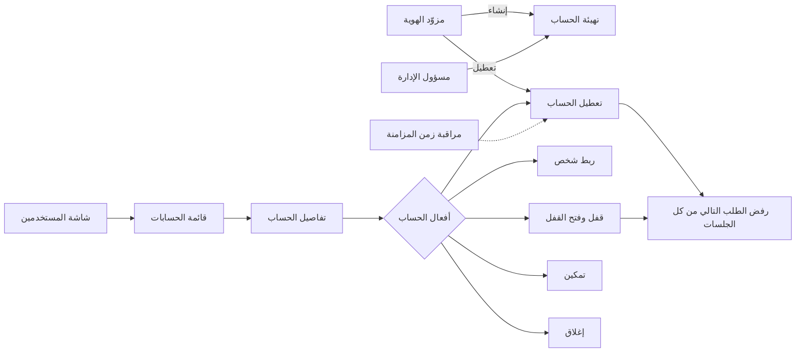
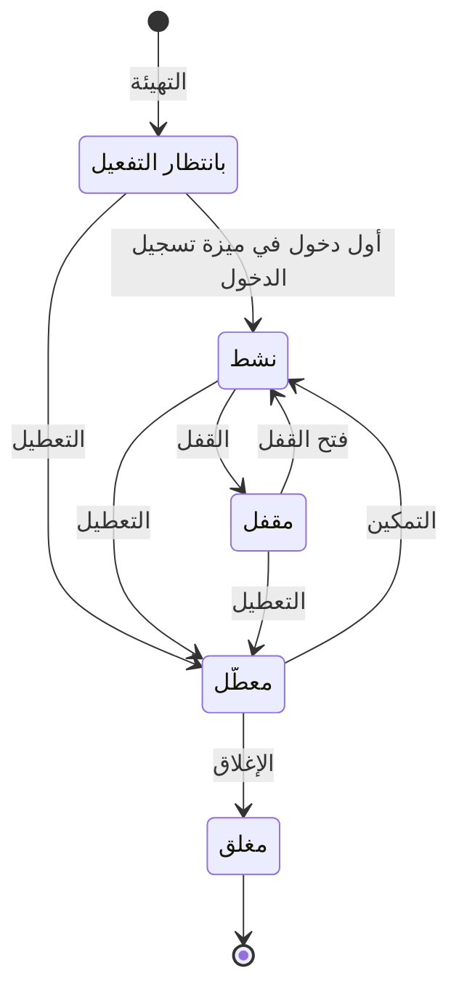

# إدارة حسابات المستخدمين

<!-- BEGIN GENERATED: doc -->
| البند | القيمة |
|---|---|
| المعرّف | FEAT-ORG-USER-ACCOUNTS |
| الإصدار | 0.1 |
| الحالة | مسودة |
| القدرة | CAP-01 إدارة المؤسسة والوصول |
| القدرة الفرعية | CAP-01.02 الهوية والمصادقة والاتحاد (R1) |
| الأدوار | مسؤول الإدارة؛ مسؤول الأمن؛ النظام؛ أي مستخدم مخوَّل |
| الشاشات | SCR-62 المستخدمون والأدوار والسلطة |
| حالات الاستخدام | UC-084 |
| القصص | 14: 9 من المواصفة، و5 جديدة |
<!-- END GENERATED: doc -->

## 1. نظرة عامة

### 1.1 القيمة

يتيح للمسؤول ومسؤول الأمن إنشاء حسابات المستخدمين وتعطيلها وقفلها وإغلاقها والبحث فيها، مع بقائها متزامنة مع مزود الهوية.

### 1.2 النطاق

| البند | القيمة |
|---|---|
| المستخدمون | مسؤول الإدارة في نطاق وحدات الحساب، ومسؤول الأمن للقفل وفتح القفل، والمستخدم نفسه لعرض حسابه، ومزوّد الهوية بحساب خدمة مخصص له، وفريق التشغيل |
| الشاشات | SCR-62 المستخدمون والأدوار والسلطة |
| حالات الاستخدام | إدارة وصول المستخدمين والاتحاد مع مزوّد الهوية (UC-084) |
| المتطلبات | الدخول عبر مزوّد هوية خارجي فقط، والتزويد عبر SCIM بأثر خلال 5 دقائق (REQ-FND-005)، والشخص والهوية والحساب وحساب الخدمة سجلات منفصلة بروابط صريحة (REQ-FND-006)، ورفض الطلب التالي من أي جلسة بعد التعطيل (QAS-SEC-008) |
| داخل النطاق | تهيئة الحساب، وربطه بشخص، وقفله وفتح قفله، وتعطيله وتمكينه، وإغلاقه، وعرض الحساب وقائمة الحسابات، وأفعال الشاشة حسب الحالة والدور، والإنشاء والتعطيل من مزوّد الهوية، وتنبيه تأخر مزامنة الحسابات |
| خارج النطاق | ربط الهوية الخارجية وفكها، وتفعيل الحساب عند أول دخول (ميزة «تسجيل الدخول»)، وإسناد الأدوار (ميزة «إسناد الأدوار»)، وسجل الأشخاص (ميزة «الأشخاص»)، وحسابات الخدمة (ميزة «حسابات الخدمة») |

### 1.3 خريطة الميزة

**الشكل 1: خريطة إدارة حسابات المستخدمين**



**الشكل 2: رحلة حساب المستخدم**



> **ملاحظة:** ربط شخص بالحساب لا يغيّر حالته في الشكل 2، ويُقبل في كل حالة عدا «مغلق».

## 2. القواعد المشتركة

تنطبق على كل قصص الميزة، فلا تتكرر داخل القصص. وكل قصة تذكر ما يخصها فقط.

### 2.1 السياق المشترك

كل قصة تبدأ من ثلاثة شروط: مستأجر نشط، وحزمة السياسات الأساسية مفعّلة، ومستخدم مسجّل الدخول ومخوَّل. وتشير إليها القصص بخطوة واحدة: «بفرض السياق المشترك للميزة».

### 2.2 الصلاحية وعدم الإفصاح

- من لا يحق له رؤية العنصر يتلقى ردًا بشكل «غير متاح» تمامًا، فلا يعرف أنه موجود.
- من يرى العنصر ولا يحق له الإجراء يتلقى «لا تملك صلاحية هذا الإجراء».

### 2.3 أوامر تغيير الحالة

- **منع التكرار:** يُرسل كل أمر بمفتاح فريد، فإعادة الطلب نفسه لا تُنفَّذ مرتين.
- **حماية التعديل المتزامن:** يُرسل كل أمر بإصدار البيانات الذي يراه المستخدم. فإن عدّلها غيره في الأثناء، يُرفض الأمر.
- **السجل:** إن نجح الأمر، يُكتب حدثه وسجل التدقيق في المعاملة نفسها.

### 2.4 الرفض المشترك

```gherkin
# language: ar
خاصية: الرفض المشترك لأوامر الميزة

  سيناريو مخطط: رفض مشترك لكل أمر في الميزة
    بفرض السياق المشترك للميزة
    و <الحالة>
    عندما يُرسل المستخدم أي أمر من أوامر الميزة
    اذاً يُرفض برمز <الرمز> ويرى "<الرسالة>"
    و لا يتغير شيء

    امثلة:
      | الحالة                                  | الرمز                  | الرسالة                                                 |
      | العنصر خارج صلاحياته                    | NOT_FOUND              | غير متاح                                                |
      | العنصر مرئي له ولا يحق له الإجراء       | AUTHZ_DENIED           | لا تملك صلاحية هذا الإجراء                              |
      | غيره عدّل العنصر بعد أن فتحه            | VERSION_CONFLICT       | تغيّرت البيانات منذ فتحتها. راجع التغييرات ثم أعد المحاولة |
      | أعاد مفتاح منع التكرار بمحتوى مختلف     | IDEMPOTENCY_KEY_REUSED | طلب مكرر بمحتوى مختلف                                   |
      | البيانات ناقصة أو غير صحيحة             | VALIDATION_FAILED      | بعض البيانات ناقصة أو غير صحيحة. راجع الحقول المعلَّمة      |

  سيناريو: إعادة الطلب نفسه لا تُنفَّذ مرتين
    بفرض السياق المشترك للميزة
    و أمر نجح بمفتاح منع تكرار
    عندما يُعاد الطلب نفسه بالمفتاح نفسه
    اذاً تُعاد النتيجة الأولى ولا يُكتب حدث ثانٍ
```

### 2.5 الحساب المغلق وأثر الأوامر على الجلسات

- الحساب «المغلق» في حالة نهائية، فلا يُقبل عليه أي أمر من أوامر الميزة، ويبقى سجل تدقيقه محفوظًا.
- الحساب «المقفل» و«المعطّل» و«المغلق» لا يحصل على سياق أمني، فيُرفض طلبه التالي من أي جلسة.
- القفل وفتح القفل والتعطيل والتمكين والإغلاق تغيّر وصول صاحب الحساب. فكل منها يرفع الإصدار الأمني للحساب، فتُبطَل قرارات الصلاحية المحفوظة له فورًا في كل نقاط الفرض، ولا يُنتظر انتهاء مدة حفظها (60 ثانية على الأكثر).
- كل حدث تسجّله قصص الميزة يصل إلى دليل البحث في المؤسسة. وأحداث الأوامر الخمسة السابقة تصل أيضًا إلى خدمة الإصدار الأمني وذاكرة قرارات الصلاحية.

```gherkin
# language: ar
خاصية: رفض أوامر الميزة على حساب مغلق

  سيناريو مخطط: الحساب المغلق لا يقبل أي أمر
    بفرض السياق المشترك للميزة
    و <الحالة>
    عندما يُرسل المستخدم أي أمر من أوامر الميزة على الحساب
    اذاً يُرفض برمز <الرمز> ويرى "<الرسالة>"
    و لا يتغير شيء

    امثلة:
      | الحالة        | الرمز                         | الرسالة                                         |
      | الحساب "مغلق" | USER_INVALID_STATE_TRANSITION | الوضع الحالي لحساب المستخدم لا يسمح بهذا الإجراء |
```

## 3. الجودة وتعريف الاكتمال

### 3.1 متطلبات الجودة

<!-- BEGIN GENERATED: quality -->
| المرجع | الموقف | المطلوب |
|---|---|---|
| QAS-SEC-008 | user disabled via SCIM | next request from any session denied; SCIM-to-effect ≤ 5 min (REQ-FND-005) |
<!-- END GENERATED: quality -->

### 3.2 تعريف الاكتمال

القصة مكتملة حين تتحقق الشروط الخمسة:

1. سيناريوهاتها والقواعد المشتركة تمر في الاختبار الآلي.
2. فحوص البنية المعمارية تمر.
3. نصوص الواجهة والرسائل موجودة بالعربية والإنجليزية.
4. مراجعة الكود مكتملة.
5. ما تضيفه القصة نفسها في قسم «القواعد» تحقق.

## 4. فهرس القصص

<!-- BEGIN GENERATED: story-index -->
| المعرّف | القصة | النوع | الحالة |
|---|---|---|---|
| `US-BC01-USR-CLOSE` | إغلاق حساب المستخدم | أمر | مسودة |
| `US-BC01-USR-DISABLE` | تعطيل حساب المستخدم | أمر | مسودة |
| `US-BC01-USR-ENABLE` | تمكين حساب المستخدم | أمر | مسودة |
| `US-BC01-USR-LINK-PERSON` | ربط شخص بـحساب المستخدم | أمر | مسودة |
| `US-BC01-USR-LOCK` | قفل حساب المستخدم | أمر | مسودة |
| `US-BC01-USR-PROVISION` | تهيئة حساب المستخدم | أمر | مسودة |
| `US-BC01-USR-UNLOCK` | فتح قفل حساب المستخدم | أمر | مسودة |
| `US-BC01-Q-USR-GET` | جلب: User with identities (no secrets) | جلب | مسودة |
| `US-BC01-Q-USR-LIST` | جلب: Users filtered by state, unit, role | جلب | مسودة |
| `US-UI-SCR62-USER-ACTIONS` | أفعال الحساب المتاحة حسب الحالة والدور | واجهة | مسودة |
| `US-UI-SCR62-USER-LIST` | البحث في المستخدمين وتصفيتهم حسب الحالة | واجهة | مسودة |
| `US-INT-SCIM-DEPROVISIONING` | تعطيل الحساب من مزود الهوية خلال خمس دقائق | تكامل | مسودة |
| `US-INT-SCIM-PROVISIONING` | استقبال إنشاء الحسابات من مزود الهوية | تكامل | مسودة |
| `US-OPS-SCIM-SYNC-ALERT` | تنبيه عند تأخر مزامنة الحسابات | تشغيل | مسودة |
<!-- END GENERATED: story-index -->

## 5. القصص

### 5.1 US-BC01-USR-CLOSE — إغلاق حساب المستخدم

| النوع | الإصدار | الأولوية | دون اتصال | الحالة |
|---|---|---|---|---|
| أمر | R1 | Must | لا | مسودة |

> **كـ** مسؤول الإدارة، **أريد** أن أغلق حسابًا معطّلًا لم يعد له استخدام مع ذكر السبب، **حتى** يخرج نهائيًا من دورة الحسابات ويبقى سجله للتدقيق.

**باختصار:** يغلق مسؤول الإدارة حسابًا «معطّلًا» بسبب مكتوب، فيصير «مغلقًا» نهائيًا ولا يُقبل عليه أي أمر بعدها.

#### القواعد

- **متى يُسمح:** الحساب «معطّل». والحساب في غيرها يُعطَّل أولًا (القصة 5.2).
- **من يُسمح له:** مسؤول الإدارة الذي يشمل نطاقه وحدات صاحب الحساب.
- **البيانات:** السبب، إلزامي.
- **الأثر:** يصبح الحساب «مغلقًا»، وهي حالة نهائية، ويبقى سجل تدقيقه محفوظًا. ويُسجَّل حدث «أُغلق الحساب»، ويرتفع الإصدار الأمني للحساب (§2.5).

#### معايير القبول

```gherkin
# language: ar
خاصية: إغلاق حساب المستخدم

  سيناريو: المسؤول يغلق حسابًا معطّلًا
    بفرض السياق المشترك للميزة
    و حساب "معطّل" في نطاق مسؤول الإدارة
    عندما يغلقه مع ذكر السبب
    اذاً تصبح حالة الحساب "مغلق"
    و يُسجَّل حدث "أُغلق الحساب" مع السبب

  سيناريو مخطط: رفض خاص بإغلاق الحساب
    بفرض السياق المشترك للميزة
    و <الحالة>
    عندما يحاول مسؤول الإدارة إغلاق الحساب
    اذاً يُرفض برمز <الرمز> ويرى "<الرسالة>"
    و لا يتغير شيء

    امثلة:
      | الحالة                                       | الرمز                         | الرسالة                                         |
      | لم يذكر السبب                                | VALIDATION_FAILED             | السبب مطلوب                                     |
      | الحساب "نشط" أو "مقفل" أو "بانتظار التفعيل" | USER_INVALID_STATE_TRANSITION | الوضع الحالي لحساب المستخدم لا يسمح بهذا الإجراء |
```

<details><summary>المراجع التقنية والتتبع</summary>

<!-- BEGIN GENERATED: refs US-BC01-USR-CLOSE -->
| البند | المعرّف | المعنى |
|---|---|---|
| الواجهة البرمجية | `POST /api/v1/foundation/users/{id}/actions/close` | — |
| الأمر | `CMD-USR-CLOSE` | إغلاق حساب المستخدم |
| السياسة | `POL-USR-CLOSE` | Administrator with scope ⊇ user's units \| SCIM service account (provision/disable/enable) \| Security Officer… |
| الحدث | `EVT-USR-CLOSED` | يصل إلى: Security-version service (EVT-SEC-VERSION-INCREMENTED); PEP decision caches; Projection security-ver… |
| الكيان | `AGG-USER` | حساب المستخدم |
| الجدول | `foundation.users` | الجدول الرئيسي لحساب المستخدم |
| وحدة النشر | DU-02 | — |
| المتطلبات | REQ-FND-005، REQ-FND-006 | معانيها في القسم 6. التتبع |
| حالة الاستخدام | UC-084 | Manage User Access & Federation |
| الاختبار | TST-USER-SM، TST-SLC01-INVARIANTS | دورة حالات حساب المستخدم، وثوابت الشريحة SLC-01 |
<!-- END GENERATED: refs US-BC01-USR-CLOSE -->

</details>

### 5.2 US-BC01-USR-DISABLE — تعطيل حساب المستخدم

| النوع | الإصدار | الأولوية | دون اتصال | الحالة |
|---|---|---|---|---|
| أمر | R1 | Must | لا | مسودة |

> **كـ** مسؤول الإدارة، **أريد** أن أعطّل حساب مستخدم لم يعد يحق له الدخول، **حتى** يُمنع من النظام في كل جلساته فورًا.

**باختصار:** يعطّل مسؤول الإدارة حسابًا «بانتظار التفعيل» أو «نشطًا» أو «مقفلًا»، فيصير «معطّلًا» ويُرفض طلبه التالي من أي جلسة.

#### القواعد

- **متى يُسمح:** الحساب «بانتظار التفعيل» أو «نشط» أو «مقفل».
- **من يُسمح له:** مسؤول الإدارة الذي يشمل نطاقه وحدات صاحب الحساب. ويعطّله مزوّد الهوية أيضًا (القصة 5.12).
- **البيانات:** السبب، اختياري.
- **الأثر:** يصبح الحساب «معطّلًا» ولا يحصل على سياق أمني. ويُسجَّل حدث «عُطِّل الحساب»، ويرتفع الإصدار الأمني للحساب، فيُرفض طلبه التالي من أي جلسة (§2.5).

#### معايير القبول

```gherkin
# language: ar
خاصية: تعطيل حساب المستخدم

  سيناريو: المسؤول يعطّل حسابًا نشطًا له جلسة مفتوحة
    بفرض السياق المشترك للميزة
    و حساب "نشط" في نطاق مسؤول الإدارة وصاحبه مسجّل الدخول
    عندما يعطّله المسؤول
    اذاً تصبح حالة الحساب "معطّل"
    و يُسجَّل حدث "عُطِّل الحساب"
    و يُرفض الطلب التالي لصاحب الحساب من أي جلسة

  سيناريو مخطط: رفض خاص بتعطيل الحساب
    بفرض السياق المشترك للميزة
    و <الحالة>
    عندما يحاول مسؤول الإدارة تعطيل الحساب
    اذاً يُرفض برمز <الرمز> ويرى "<الرسالة>"
    و لا يتغير شيء

    امثلة:
      | الحالة                | الرمز                         | الرسالة                                         |
      | الحساب "معطّل" أصلًا | USER_INVALID_STATE_TRANSITION | الوضع الحالي لحساب المستخدم لا يسمح بهذا الإجراء |
```

<details><summary>المراجع التقنية والتتبع</summary>

<!-- BEGIN GENERATED: refs US-BC01-USR-DISABLE -->
| البند | المعرّف | المعنى |
|---|---|---|
| الواجهة البرمجية | `POST /api/v1/foundation/users/{id}/actions/disable` | — |
| الأمر | `CMD-USR-DISABLE` | تعطيل حساب المستخدم |
| السياسة | `POL-USR-DISABLE` | Administrator with scope ⊇ user's units \| SCIM service account (provision/disable/enable) \| Security Officer… |
| الحدث | `EVT-USR-DISABLED` | يصل إلى: Security-version service (EVT-SEC-VERSION-INCREMENTED); PEP decision caches; Projection security-ver… |
| الكيان | `AGG-USER` | حساب المستخدم |
| الجدول | `foundation.users` | الجدول الرئيسي لحساب المستخدم |
| وحدة النشر | DU-02 | — |
| المتطلبات | REQ-FND-005، REQ-FND-006 | معانيها في القسم 6. التتبع |
| حالة الاستخدام | UC-084 | Manage User Access & Federation |
| الاختبار | TST-USER-SM، TST-SLC01-INVARIANTS | دورة حالات حساب المستخدم، وثوابت الشريحة SLC-01 |
<!-- END GENERATED: refs US-BC01-USR-DISABLE -->

</details>

### 5.3 US-BC01-USR-ENABLE — تمكين حساب المستخدم

| النوع | الإصدار | الأولوية | دون اتصال | الحالة |
|---|---|---|---|---|
| أمر | R1 | Must | لا | مسودة |

> **كـ** مسؤول الإدارة، **أريد** أن أعيد تمكين حساب معطّل، **حتى** يعود صاحبه إلى عمله دون إنشاء حساب جديد.

**باختصار:** يمكّن مسؤول الإدارة حسابًا «معطّلًا» له هوية خارجية واحدة على الأقل، فيعود «نشطًا» مباشرة.

#### القواعد

- **متى يُسمح:** الحساب «معطّل»، وله هوية خارجية واحدة على الأقل، والمستأجر نشط.
- **من يُسمح له:** مسؤول الإدارة الذي يشمل نطاقه وحدات صاحب الحساب. ويمكّنه مزوّد الهوية أيضًا بحسابه المخصص.
- **البيانات:** لا بيانات.
- **الأثر:** يصبح الحساب «نشطًا»، دون المرور بـ«بانتظار التفعيل». ويُسجَّل حدث «مُكِّن الحساب»، ويرتفع الإصدار الأمني للحساب (§2.5).

#### معايير القبول

```gherkin
# language: ar
خاصية: تمكين حساب المستخدم

  سيناريو: المسؤول يمكّن حسابًا معطّلًا له هوية
    بفرض السياق المشترك للميزة
    و حساب "معطّل" في نطاق مسؤول الإدارة وله هوية خارجية واحدة
    عندما يمكّنه المسؤول
    اذاً تصبح حالة الحساب "نشط"
    و يُسجَّل حدث "مُكِّن الحساب"

  سيناريو مخطط: رفض خاص بتمكين الحساب
    بفرض السياق المشترك للميزة
    و <الحالة>
    عندما يحاول مسؤول الإدارة تمكين الحساب
    اذاً يُرفض برمز <الرمز> ويرى "<الرسالة>"
    و لا يتغير شيء

    امثلة:
      | الحالة                                      | الرمز                         | الرسالة                                         |
      | الحساب "معطّل" وليست له أي هوية خارجية      | LAST_IDENTITY                 | يجب أن يبقى للحساب النشط هوية واحدة على الأقل   |
      | الحساب "نشط" أو "مقفل" أو "بانتظار التفعيل" | USER_INVALID_STATE_TRANSITION | الوضع الحالي لحساب المستخدم لا يسمح بهذا الإجراء |
```

<details><summary>المراجع التقنية والتتبع</summary>

<!-- BEGIN GENERATED: refs US-BC01-USR-ENABLE -->
| البند | المعرّف | المعنى |
|---|---|---|
| الواجهة البرمجية | `POST /api/v1/foundation/users/{id}/actions/enable` | — |
| الأمر | `CMD-USR-ENABLE` | تمكين حساب المستخدم |
| السياسة | `POL-USR-ENABLE` | Administrator with scope ⊇ user's units \| SCIM service account (provision/disable/enable) \| Security Officer… |
| الحدث | `EVT-USR-ENABLED` | يصل إلى: Security-version service (EVT-SEC-VERSION-INCREMENTED); PEP decision caches; Projection security-ver… |
| الكيان | `AGG-USER` | حساب المستخدم |
| الجدول | `foundation.users` | الجدول الرئيسي لحساب المستخدم |
| وحدة النشر | DU-02 | — |
| المتطلبات | REQ-FND-005، REQ-FND-006 | معانيها في القسم 6. التتبع |
| حالة الاستخدام | UC-084 | Manage User Access & Federation |
| الاختبار | TST-USER-SM، TST-SLC01-INVARIANTS | دورة حالات حساب المستخدم، وثوابت الشريحة SLC-01 |
<!-- END GENERATED: refs US-BC01-USR-ENABLE -->

</details>

### 5.4 US-BC01-USR-LINK-PERSON — ربط شخص بحساب المستخدم

| النوع | الإصدار | الأولوية | دون اتصال | الحالة |
|---|---|---|---|---|
| أمر | R1 | Must | لا | مسودة |

> **كـ** مسؤول الإدارة، **أريد** أن أربط حساب الدخول بسجل الشخص الذي يملكه، **حتى** تُعرف هوية صاحب الحساب دون أن يتكرر سجل الشخص.

**باختصار:** يربط مسؤول الإدارة الحساب بشخص نشط غير مرتبط بحساب آخر، فيبقى الشخص والحساب سجلين منفصلين برابط صريح (REQ-FND-006).

#### القواعد

- **متى يُسمح:** الحساب في أي حالة عدا «مغلق» (§2.5). والشخص نشط وغير مرتبط بحساب آخر.
- **من يُسمح له:** مسؤول الإدارة الذي يشمل نطاقه وحدات صاحب الحساب.
- **البيانات:** الشخص، إلزامي.
- **الأثر:** يُربط الشخص بالحساب، ولا تتغير حالة الحساب. ويُسجَّل حدث «رُبط شخص بالحساب» ويصل إلى دليل البحث. ولا يرتفع به الإصدار الأمني.

> **ملاحظة:** المواصفة تعطي رمزًا واحدًا لشرطي الشخص النشط والشخص غير المرتبط. ورسالته تخص الشخص المرتبط بحساب آخر، فرد الشخص غير النشط يحتاج رمزًا أو رسالة خاصة **[Needs Review]**.

#### معايير القبول

```gherkin
# language: ar
خاصية: ربط شخص بحساب المستخدم

  سيناريو: المسؤول يربط حسابًا بشخص نشط
    بفرض السياق المشترك للميزة
    و حساب "بانتظار التفعيل" في نطاق مسؤول الإدارة
    و شخص نشط غير مرتبط بأي حساب
    عندما يربط المسؤول الحساب بالشخص
    اذاً يظهر الشخص في تفاصيل الحساب وتبقى حالته "بانتظار التفعيل"
    و يُسجَّل حدث "رُبط شخص بالحساب"

  سيناريو مخطط: رفض خاص بربط الشخص
    بفرض السياق المشترك للميزة
    و <الحالة>
    عندما يحاول مسؤول الإدارة ربط الحساب بالشخص
    اذاً يُرفض برمز <الرمز> ويرى "<الرسالة>"
    و لا يتغير شيء

    امثلة:
      | الحالة                         | الرمز                 | الرسالة                 |
      | لم يحدد الشخص                  | VALIDATION_FAILED     | الشخص مطلوب             |
      | الشخص مرتبط بحساب آخر          | PERSON_ALREADY_LINKED | هذا الشخص مرتبط بحساب آخر |
```

<details><summary>المراجع التقنية والتتبع</summary>

<!-- BEGIN GENERATED: refs US-BC01-USR-LINK-PERSON -->
| البند | المعرّف | المعنى |
|---|---|---|
| الواجهة البرمجية | `POST /api/v1/foundation/users/{id}/actions/link-person` | — |
| الأمر | `CMD-USR-LINK-PERSON` | ربط شخص بـحساب المستخدم |
| السياسة | `POL-USR-LINK-PERSON` | Administrator with scope ⊇ user's units \| SCIM service account (provision/disable/enable) \| Security Officer… |
| الحدث | `EVT-USR-PERSON-LINKED` | يصل إلى: Search/Directory projection (BC01 read model) |
| الكيان | `AGG-USER` | حساب المستخدم |
| الجدول | `foundation.users` | الجدول الرئيسي لحساب المستخدم |
| وحدة النشر | DU-02 | — |
| المتطلبات | REQ-FND-005، REQ-FND-006 | معانيها في القسم 6. التتبع |
| حالة الاستخدام | UC-084 | Manage User Access & Federation |
| الاختبار | TST-USER-SM، TST-SLC01-INVARIANTS | دورة حالات حساب المستخدم، وثوابت الشريحة SLC-01 |
<!-- END GENERATED: refs US-BC01-USR-LINK-PERSON -->

</details>

### 5.5 US-BC01-USR-LOCK — قفل حساب المستخدم

| النوع | الإصدار | الأولوية | دون اتصال | الحالة |
|---|---|---|---|---|
| أمر | R1 | Must | لا | مسودة |

> **كـ** مسؤول الأمن، **أريد** أن أقفل حسابًا نشطًا يُشتبه في استخدامه مع ذكر السبب، **حتى** يتوقف وصوله فورًا إلى أن يُحسم الأمر.

**باختصار:** يقفل مسؤول الأمن حسابًا «نشطًا» بسبب مكتوب، فيصير «مقفلًا» ويُرفض طلبه التالي من أي جلسة حتى يُفتح القفل.

#### القواعد

- **متى يُسمح:** الحساب «نشط».
- **من يُسمح له:** مسؤول الأمن. وتقفله أيضًا قاعدة آلية لرصد السلوك الشاذ، لكن المصادر لا تعرّف هذه القاعدة ولا متى تعمل **[Needs Review]**.
- **البيانات:** السبب، إلزامي.
- **الأثر:** يصبح الحساب «مقفلًا» ولا يحصل على سياق أمني. ويُسجَّل حدث «قُفل الحساب»، ويرتفع الإصدار الأمني للحساب، فيُرفض طلبه التالي من أي جلسة (§2.5).

> **ملاحظة:** سياسة الصلاحية تذكر مسؤول الإدارة ومسؤول الأمن معًا لأوامر الحساب، وشرط الانتقال يقصر القفل على مسؤول الأمن. وهل يقفل مسؤول الإدارة الحساب أيضًا؟ **[Needs Review]**.

#### معايير القبول

```gherkin
# language: ar
خاصية: قفل حساب المستخدم

  سيناريو: مسؤول الأمن يقفل حسابًا نشطًا
    بفرض السياق المشترك للميزة
    و حساب "نشط" وصاحبه مسجّل الدخول
    عندما يقفله مسؤول الأمن مع ذكر السبب
    اذاً تصبح حالة الحساب "مقفل"
    و يُسجَّل حدث "قُفل الحساب" مع السبب
    و يُرفض الطلب التالي لصاحب الحساب من أي جلسة

  سيناريو مخطط: رفض خاص بقفل الحساب
    بفرض السياق المشترك للميزة
    و <الحالة>
    عندما يحاول مسؤول الأمن قفل الحساب
    اذاً يُرفض برمز <الرمز> ويرى "<الرسالة>"
    و لا يتغير شيء

    امثلة:
      | الحالة                                       | الرمز                         | الرسالة                                         |
      | لم يذكر السبب                                | REASON_REQUIRED               | اذكر السبب                                      |
      | الحساب "مقفل" أو "معطّل" أو "بانتظار التفعيل" | USER_INVALID_STATE_TRANSITION | الوضع الحالي لحساب المستخدم لا يسمح بهذا الإجراء |
```

<details><summary>المراجع التقنية والتتبع</summary>

<!-- BEGIN GENERATED: refs US-BC01-USR-LOCK -->
| البند | المعرّف | المعنى |
|---|---|---|
| الواجهة البرمجية | `POST /api/v1/foundation/users/{id}/actions/lock` | — |
| الأمر | `CMD-USR-LOCK` | قفل حساب المستخدم |
| السياسة | `POL-USR-LOCK` | Administrator with scope ⊇ user's units \| SCIM service account (provision/disable/enable) \| Security Officer… |
| الحدث | `EVT-USR-LOCKED` | يصل إلى: Security-version service (EVT-SEC-VERSION-INCREMENTED); PEP decision caches; Projection security-ver… |
| الكيان | `AGG-USER` | حساب المستخدم |
| الجدول | `foundation.users` | الجدول الرئيسي لحساب المستخدم |
| وحدة النشر | DU-02 | — |
| المتطلبات | REQ-FND-005، REQ-FND-006 | معانيها في القسم 6. التتبع |
| حالة الاستخدام | UC-084 | Manage User Access & Federation |
| الاختبار | TST-USER-SM، TST-SLC01-INVARIANTS | دورة حالات حساب المستخدم، وثوابت الشريحة SLC-01 |
<!-- END GENERATED: refs US-BC01-USR-LOCK -->

</details>

### 5.6 US-BC01-USR-PROVISION — تهيئة حساب المستخدم

| النوع | الإصدار | الأولوية | دون اتصال | الحالة |
|---|---|---|---|---|
| أمر | R1 | Must | لا | مسودة |

> **كـ** مسؤول الإدارة، **أريد** أن أنشئ حساب دخول لمستخدم جديد، **حتى** يستطيع الدخول عبر مزوّد الهوية حين يبدأ عمله.

**باختصار:** ينشئ مسؤول الإدارة حسابًا باسم مستخدم ومصدر، ويمكن ربطه بشخص من البداية. ويبدأ الحساب «بانتظار التفعيل» حتى أول دخول.

#### القواعد

- **متى يُسمح:** المستأجر نشط.
- **من يُسمح له:** مسؤول الإدارة الذي يشمل نطاقه وحدات صاحب الحساب. وينشئ مزوّد الهوية الحسابات أيضًا (القصة 5.13).
- **البيانات:** اسم المستخدم، إلزامي. والمصدر، إلزامي: مزوّد الهوية أو مسؤول الإدارة. والشخص، اختياري.
- **الأثر:** يُنشأ الحساب «بانتظار التفعيل» بلا أي دور. ويُسجَّل حدث «هُيِّئ الحساب» ويصل إلى دليل البحث. ويصير «نشطًا» عند أول دخول (ميزة «تسجيل الدخول»).

> **ملاحظة:** الأدوار لا تُسند عند التهيئة، بل بإسناد دور مستقل (ميزة «إسناد الأدوار»).

#### معايير القبول

```gherkin
# language: ar
خاصية: تهيئة حساب المستخدم

  سيناريو: المسؤول ينشئ حسابًا لمستخدم جديد
    بفرض السياق المشترك للميزة
    عندما ينشئ مسؤول الإدارة حسابًا باسم مستخدم ومصدر "مسؤول الإدارة" مع ربطه بشخص
    اذاً يُنشأ الحساب بحالة "بانتظار التفعيل" مرتبطًا بالشخص وبلا أي دور
    و يُسجَّل حدث "هُيِّئ الحساب"

  سيناريو مخطط: رفض خاص بتهيئة الحساب
    بفرض السياق المشترك للميزة
    و <الحالة>
    عندما يحاول مسؤول الإدارة إنشاء الحساب
    اذاً يُرفض برمز <الرمز> ويرى "<الرسالة>"
    و لا يتغير شيء

    امثلة:
      | الحالة                  | الرمز             | الرسالة              |
      | لم يذكر اسم المستخدم    | VALIDATION_FAILED | اسم المستخدم مطلوب   |
      | لم يحدد المصدر          | VALIDATION_FAILED | المصدر مطلوب         |
      | المستأجر غير نشط        | TENANT_NOT_ACTIVE | المستأجر غير نشط     |
```

<details><summary>المراجع التقنية والتتبع</summary>

<!-- BEGIN GENERATED: refs US-BC01-USR-PROVISION -->
| البند | المعرّف | المعنى |
|---|---|---|
| الواجهة البرمجية | `POST /api/v1/foundation/users` | — |
| الأمر | `CMD-USR-PROVISION` | تهيئة حساب المستخدم |
| السياسة | `POL-USR-PROVISION` | Administrator with scope ⊇ user's units \| SCIM service account (provision/disable/enable) \| Security Officer… |
| الحدث | `EVT-USR-PROVISIONED` | يصل إلى: Search/Directory projection (BC01 read model) |
| الكيان | `AGG-USER` | حساب المستخدم |
| الجدول | `foundation.users` | الجدول الرئيسي لحساب المستخدم |
| وحدة النشر | DU-02 | — |
| المتطلبات | REQ-FND-005، REQ-FND-006 | معانيها في القسم 6. التتبع |
| حالة الاستخدام | UC-084 | Manage User Access & Federation |
| الاختبار | TST-USER-SM، TST-SLC01-INVARIANTS | دورة حالات حساب المستخدم، وثوابت الشريحة SLC-01 |
<!-- END GENERATED: refs US-BC01-USR-PROVISION -->

</details>

### 5.7 US-BC01-USR-UNLOCK — فتح قفل حساب المستخدم

| النوع | الإصدار | الأولوية | دون اتصال | الحالة |
|---|---|---|---|---|
| أمر | R1 | Must | لا | مسودة |

> **كـ** مسؤول الأمن، **أريد** أن أفتح قفل حساب بعد حسم سبب قفله مع ذكر السبب، **حتى** يعود صاحبه إلى عمله.

**باختصار:** يفتح مسؤول الأمن قفل حساب «مقفل» بسبب مكتوب، فيعود «نشطًا».

#### القواعد

- **متى يُسمح:** الحساب «مقفل».
- **من يُسمح له:** مسؤول الأمن.
- **البيانات:** السبب، إلزامي.
- **الأثر:** يعود الحساب «نشطًا». ويُسجَّل حدث «فُتح قفل الحساب»، ويرتفع الإصدار الأمني للحساب (§2.5).

> **ملاحظة:** الحساب النشط يجب أن تكون له هوية خارجية واحدة على الأقل. والمواصفة تمنع فك آخر هوية عن الحساب «النشط» فقط، ولا تفحص الهويات عند فتح القفل. فقد يعود حساب «مقفل» فُكَّت كل هوياته «نشطًا» بلا هوية **[Needs Review]**.

#### معايير القبول

```gherkin
# language: ar
خاصية: فتح قفل حساب المستخدم

  سيناريو: مسؤول الأمن يفتح قفل حساب
    بفرض السياق المشترك للميزة
    و حساب "مقفل"
    عندما يفتح مسؤول الأمن قفله مع ذكر السبب
    اذاً تصبح حالة الحساب "نشط"
    و يُسجَّل حدث "فُتح قفل الحساب" مع السبب

  سيناريو مخطط: رفض خاص بفتح قفل الحساب
    بفرض السياق المشترك للميزة
    و <الحالة>
    عندما يحاول مسؤول الأمن فتح قفل الحساب
    اذاً يُرفض برمز <الرمز> ويرى "<الرسالة>"
    و لا يتغير شيء

    امثلة:
      | الحالة                                       | الرمز                         | الرسالة                                         |
      | لم يذكر السبب                                | VALIDATION_FAILED             | السبب مطلوب                                     |
      | الحساب "نشط" أو "معطّل" أو "بانتظار التفعيل" | USER_INVALID_STATE_TRANSITION | الوضع الحالي لحساب المستخدم لا يسمح بهذا الإجراء |
```

<details><summary>المراجع التقنية والتتبع</summary>

<!-- BEGIN GENERATED: refs US-BC01-USR-UNLOCK -->
| البند | المعرّف | المعنى |
|---|---|---|
| الواجهة البرمجية | `POST /api/v1/foundation/users/{id}/actions/unlock` | — |
| الأمر | `CMD-USR-UNLOCK` | فتح قفل حساب المستخدم |
| السياسة | `POL-USR-UNLOCK` | Administrator with scope ⊇ user's units \| SCIM service account (provision/disable/enable) \| Security Officer… |
| الحدث | `EVT-USR-UNLOCKED` | يصل إلى: Security-version service (EVT-SEC-VERSION-INCREMENTED); PEP decision caches; Projection security-ver… |
| الكيان | `AGG-USER` | حساب المستخدم |
| الجدول | `foundation.users` | الجدول الرئيسي لحساب المستخدم |
| وحدة النشر | DU-02 | — |
| المتطلبات | REQ-FND-005، REQ-FND-006 | معانيها في القسم 6. التتبع |
| حالة الاستخدام | UC-084 | Manage User Access & Federation |
| الاختبار | TST-USER-SM، TST-SLC01-INVARIANTS | دورة حالات حساب المستخدم، وثوابت الشريحة SLC-01 |
<!-- END GENERATED: refs US-BC01-USR-UNLOCK -->

</details>

### 5.8 US-BC01-Q-USR-GET — تفاصيل حساب المستخدم وهوياته

| النوع | الإصدار | الأولوية | دون اتصال | الحالة |
|---|---|---|---|---|
| جلب | R1 | Must | لا | مسودة |

> **كـ** مسؤول الإدارة، **أريد** أن أرى حساب المستخدم وحالته وهوياته الخارجية والشخص المرتبط به، **حتى** أعرف وضعه قبل أي إجراء عليه.

**باختصار:** يُعرض الحساب بحالته، والشخص المرتبط به، وهوياته الخارجية. ولا يُعرض أي سر أو بيانات اعتماد.

#### القواعد

- **من يرى ماذا:** مسؤول الإدارة الذي تقع وحدات صاحب الحساب في نطاقه، وصاحب الحساب نفسه، بشرط أن يسمح تصريحهما بتصنيف البيانات. ومن عداهما يرى «غير متاح» (§2.2).
- **المرشحات:** لا مرشحات؛ يُطلب الحساب بمعرّفه.
- **البيانات المعروضة:** الحالة، والشخص المرتبط إن وُجد، ولكل هوية خارجية مزوّدها ومعرّف صاحبها عنده وتاريخ ربطها. والأسرار لا تُعاد أبدًا.
- **الزمن:** الحالة الحالية فقط.

#### معايير القبول

```gherkin
# language: ar
خاصية: تفاصيل حساب المستخدم

  سيناريو: المسؤول يفتح حسابًا في نطاقه
    بفرض السياق المشترك للميزة
    و حساب "نشط" في نطاق مسؤول الإدارة له هويتان خارجيتان وشخص مرتبط
    عندما يفتح المسؤول تفاصيله
    اذاً تُعرض حالته والشخص المرتبط والهويتان بمزوّد كل منهما وتاريخ ربطها
    لكن لا يُعرض أي سر أو بيانات اعتماد

  سيناريو: صاحب الحساب يفتح حسابه
    بفرض السياق المشترك للميزة
    عندما يفتح المستخدم تفاصيل حسابه
    اذاً تُعرض حالة حسابه وهوياته الخارجية
```

<details><summary>المراجع التقنية والتتبع</summary>

<!-- BEGIN GENERATED: refs US-BC01-Q-USR-GET -->
| البند | المعرّف | المعنى |
|---|---|---|
| الواجهة البرمجية | `GET /api/v1/foundation/users/{user_id}` | — |
| الاستعلام | `QRY-USR-GET` | User with identities (no secrets) |
| السياسة | `POL-USR-GET` | org scope of subject roles ∩ classification rule |
| الكيان | `AGG-USER` | حساب المستخدم |
| الجدول | `foundation.users` | الجدول الرئيسي لحساب المستخدم |
| وحدة النشر | DU-02 | — |
| المتطلب | REQ-FND-006 | The system shall maintain Person, Identity, User and Service Account as separate records with explicit links. |
| حالة الاستخدام | UC-084 | Manage User Access & Federation |
| الاختبار | TST-USER-SM، TST-SLC01-INVARIANTS | دورة حالات حساب المستخدم، وثوابت الشريحة SLC-01 |
<!-- END GENERATED: refs US-BC01-Q-USR-GET -->

</details>

### 5.9 US-BC01-Q-USR-LIST — قائمة حسابات المستخدمين

| النوع | الإصدار | الأولوية | دون اتصال | الحالة |
|---|---|---|---|---|
| جلب | R1 | Must | لا | مسودة |

> **كـ** مسؤول الإدارة، **أريد** قائمة حسابات المستخدمين في نطاقي مصفّاة بالحالة والوحدة والدور، **حتى** أجد الحساب الذي أحتاجه بسرعة.

**باختصار:** تُعرض حسابات المستخدمين التي تقع وحداتها في نطاق المسؤول، صفحةً بعد صفحة.

#### القواعد

- **من يرى ماذا:** مسؤول الإدارة، ويرى الحسابات التي تقع وحداتها في نطاقه ويسمح تصريحه بتصنيفها فقط. والحساب خارج نطاقه لا يظهر ولا يُحسب (§2.2).
- **المرشحات:** الحالة والوحدة والدور، بحسب وصف الاستعلام. لكن العقد لا يعرّف إلا مؤشر الصفحة وحجمها **[Needs Review]**.
- **الصفحات:** بمؤشر لا برقم صفحة، ولا عدد إجمالي إلا ما يحسبه الخادم من المرئي.
- **الزمن:** الحالة الحالية فقط.

#### معايير القبول

```gherkin
# language: ar
خاصية: قائمة حسابات المستخدمين

  سيناريو: المسؤول يعرض الحسابات المعطّلة في نطاقه
    بفرض السياق المشترك للميزة
    و في نطاق مسؤول الإدارة حسابان "معطّلان" وفي وحدة خارج نطاقه حساب "معطّل"
    عندما يعرض قائمة الحسابات بحالة "معطّل"
    اذاً يرى الحسابين اللذين في نطاقه فقط
    و لا يُذكر الحساب الثالث في القائمة ولا في عددها
```

<details><summary>المراجع التقنية والتتبع</summary>

<!-- BEGIN GENERATED: refs US-BC01-Q-USR-LIST -->
| البند | المعرّف | المعنى |
|---|---|---|
| الواجهة البرمجية | `GET /api/v1/foundation/users` | — |
| الاستعلام | `QRY-USR-LIST` | Users filtered by state, unit, role |
| السياسة | `POL-USR-LIST` | org scope of subject roles ∩ classification rule |
| الكيان | `AGG-USER` | حساب المستخدم |
| الجدول | `foundation.users` | الجدول الرئيسي لحساب المستخدم |
| وحدة النشر | DU-02 | — |
| المتطلب | REQ-FND-006 | The system shall maintain Person, Identity, User and Service Account as separate records with explicit links. |
| حالة الاستخدام | UC-084 | Manage User Access & Federation |
| الاختبار | TST-USER-SM، TST-SLC01-INVARIANTS | دورة حالات حساب المستخدم، وثوابت الشريحة SLC-01 |
<!-- END GENERATED: refs US-BC01-Q-USR-LIST -->

</details>

### 5.10 US-UI-SCR62-USER-ACTIONS — أفعال الحساب المتاحة حسب الحالة والدور

| النوع | الإصدار | الأولوية | دون اتصال | الحالة |
|---|---|---|---|---|
| واجهة | R1 | Should | لا | مسودة |

> **كـ** المستخدم، **أريد** أن أرى أفعال الحساب التي يسمح بها دوري وحالة الحساب فقط، **حتى** لا أجرّب فعلًا سيُرفض.

**باختصار:** تعرض تفاصيل الحساب في شاشة المستخدمين أزرار الربط والقفل وفتح القفل والتعطيل والتمكين والإغلاق بحسب صلاحيات المستخدم وحالة الحساب المعروضة. والعرض تلميح، والخادم يبقى الحكم.

#### القواعد

- يظهر الفعل إذا شملته صلاحيات المستخدم في سياقه الأمني، وسمحت به حالة الحساب المعروضة:
  - لمسؤول الإدارة: ربط شخص في كل حالة عدا «مغلق»، والتعطيل في «بانتظار التفعيل» و«نشط» و«مقفل»، والتمكين والإغلاق في «معطّل»؛
  - لمسؤول الأمن: القفل في «نشط»، وفتح القفل في «مقفل».
- الحساب «المغلق» لا تظهر له أي أفعال.
- القفل وفتح القفل والإغلاق تفتح نموذجًا بحقل سبب إلزامي، والتعطيل بسبب اختياري.
- إن رفض الخادم فعلًا لأن الحساب تغيّر بعد عرضه، تُعاد قراءة الحساب ويُعرض ما تغيّر وتُحدَّث الأزرار.
- **[Derived]** قاعدة العرض نفسها وتوزيع الأفعال على الدورين، لأن العقود لا تعيد قائمة بالأفعال المسموحة (21-ui-design.md §5 و§6.3).

#### معايير القبول

```gherkin
# language: ar
خاصية: أفعال الحساب في شاشة المستخدمين

  سيناريو: المسؤول يفتح حسابًا معطّلًا
    بفرض السياق المشترك للميزة
    و حساب "معطّل" في نطاق مسؤول الإدارة
    عندما يفتح تفاصيله
    اذاً تظهر أزرار ربط شخص والتمكين والإغلاق
    لكن لا يظهر زر التعطيل ولا القفل

  سيناريو: مسؤول الأمن يفتح حسابًا نشطًا
    بفرض السياق المشترك للميزة
    و حساب "نشط"
    عندما يفتح مسؤول الأمن تفاصيله
    اذاً يظهر زر القفل
    لكن لا يظهر زر فتح القفل

  سيناريو: الحساب تغيّر بعد عرضه
    بفرض السياق المشترك للميزة
    و حساب عرضه المسؤول "نشطًا" ثم عطّله مزوّد الهوية
    عندما يضغط المسؤول زر التعطيل
    اذاً يرى "تغيّرت البيانات منذ فتحتها. راجع التغييرات ثم أعد المحاولة"
    و تُعاد قراءة الحساب بحالته "معطّل" وتظهر أزراره الجديدة
```

<details><summary>المراجع التقنية والتتبع</summary>

<!-- BEGIN GENERATED: refs US-UI-SCR62-USER-ACTIONS -->
| البند | المعرّف | المعنى |
|---|---|---|
| حالة الاستخدام | UC-084 | Manage User Access & Federation |
| الشاشة | SCR-62 | شاشة المستخدمون والأدوار والسلطة |
| المصدر | `21-ui-design.md §5` | — |
| المصدر | `21-ui-design.md §6.3` | — |
<!-- END GENERATED: refs US-UI-SCR62-USER-ACTIONS -->

</details>

### 5.11 US-UI-SCR62-USER-LIST — البحث في المستخدمين وتصفيتهم حسب الحالة

| النوع | الإصدار | الأولوية | دون اتصال | الحالة |
|---|---|---|---|---|
| واجهة | R1 | Should | لا | مسودة |

> **كـ** مسؤول الإدارة، **أريد** أن أصفّي قائمة المستخدمين حسب حالة الحساب وأتنقل فيها، **حتى** أصل إلى الحسابات التي تحتاج إجراء، مثل المعطّلة أو المقفلة.

**باختصار:** تعرض شاشة المستخدمين قائمة الحسابات المرئية للمسؤول بشارة حالة لكل حساب، ومرشح بالحالة يُحفظ في عنوان الصفحة، وتنقل بين الصفحات بمؤشر.

#### القواعد

- القائمة تعرض الحسابات التي يحق للمسؤول رؤيتها فقط، ولا تذكر عدد ما حُجب عنه.
- لكل حساب شارة بحالته: «بانتظار التفعيل» أو «نشط» أو «مقفل» أو «معطّل» أو «مغلق».
- المرشح في عنوان الصفحة، فيبقى عند التحديث ويمكن مشاركة الرابط.
- الصفحة التالية بمؤشر، ولا عدد إجمالي إلا ما يحسبه الخادم من المرئي.
- الضغط على الحساب يفتح تفاصيله (القصة 5.8).
- **[Derived]** المرشح بالحالة والشارات، لأن العقد لا يعرّف مرشحاته بعد (القصة 5.9).

#### معايير القبول

```gherkin
# language: ar
خاصية: البحث في المستخدمين وتصفيتهم

  سيناريو: المسؤول يصفّي القائمة بالحسابات المقفلة
    بفرض السياق المشترك للميزة
    و في نطاق مسؤول الإدارة حسابات بحالات مختلفة منها حسابان "مقفلان"
    عندما يختار مرشح الحالة "مقفل"
    اذاً تُعرض الحسابات المقفلة المرئية له فقط بشارة "مقفل"
    و يظهر المرشح في عنوان الصفحة

  سيناريو: الانتقال إلى الصفحة التالية
    بفرض السياق المشترك للميزة
    و القائمة المصفّاة أطول من صفحة واحدة
    عندما ينتقل المسؤول إلى الصفحة التالية
    اذاً تُعرض الحسابات التالية بالمرشح نفسه
    لكن لا يُعرض عدد ما حُجب عنه
```

<details><summary>المراجع التقنية والتتبع</summary>

<!-- BEGIN GENERATED: refs US-UI-SCR62-USER-LIST -->
| البند | المعرّف | المعنى |
|---|---|---|
| حالة الاستخدام | UC-084 | Manage User Access & Federation |
| الشاشة | SCR-62 | شاشة المستخدمون والأدوار والسلطة |
| المصدر | `21-ui-design.md §6.1` | — |
| المصدر | `[Derived]` | — |
<!-- END GENERATED: refs US-UI-SCR62-USER-LIST -->

</details>

### 5.12 US-INT-SCIM-DEPROVISIONING — تعطيل الحساب من مزوّد الهوية خلال خمس دقائق

| النوع | الإصدار | الأولوية | دون اتصال | الحالة |
|---|---|---|---|---|
| تكامل | R1 | Must | لا ينطبق | مسودة |

> **كـ** النظام الخارجي (مزوّد الهوية)، **أريد** أن أعطّل حساب مستخدم غادر أو أُوقف عندي، **حتى** يُمنع من المنصة في كل جلساته خلال 5 دقائق على الأكثر.

**باختصار:** يرسل مزوّد الهوية طلب تعطيل عبر SCIM، فيصير الحساب «معطّلًا» ويُرفض طلبه التالي من أي جلسة، والمدة من الطلب إلى الأثر 5 دقائق على الأكثر (QAS-SEC-008).

#### القواعد

- **متى يحدث:** يعطّل مزوّد هوية المستأجر المستخدم عنده، فيرسل طلب التعطيل إلى خدمة التزويد في المنصة.
- **الرسالة المتبادلة:** طلب SCIM يحدد الحساب، ويرسله حساب الخدمة المخصص لمزوّد الهوية. وهذا الحساب يعطّل ويمكّن وينشئ فقط.
- **الأثر:** يصبح الحساب «معطّلًا» كما في القصة 5.2، ويُسجَّل حدث «عُطِّل الحساب»، ويرتفع الإصدار الأمني فتُبطَل قرارات الصلاحية المحفوظة له (§2.5).
- **الزمن:** من وصول الطلب إلى رفض الطلب التالي من أي جلسة 5 دقائق على الأكثر (REQ-FND-005). ويُقاس هذا الزمن ويُنبَّه عند تجاوزه (القصة 5.14).
- الحساب «المعطّل» أصلًا أو «المغلق» يُرفض تعطيله، فلا يتغير شيء ولا يُكتب حدث ثانٍ.

#### معايير القبول

```gherkin
# language: ar
خاصية: تعطيل الحساب من مزوّد الهوية

  سيناريو: مزوّد الهوية يعطّل حسابًا نشطًا له جلستان
    بفرض حساب "نشط" لصاحبه جلستان مفتوحتان على جهازين
    عندما يرسل مزوّد الهوية طلب تعطيل الحساب
    اذاً تصبح حالة الحساب "معطّل"
    و يُسجَّل حدث "عُطِّل الحساب"
    و يُرفض الطلب التالي من كل جلسة خلال 5 دقائق من وصول الطلب

  سيناريو مخطط: طلب تعطيل لا يغيّر شيئًا
    بفرض <الحالة>
    عندما يرسل مزوّد الهوية طلب تعطيل الحساب
    اذاً يُرفض برمز <الرمز> ويُرد عليه "<الرسالة>"
    و لا يتغير شيء

    امثلة:
      | الحالة                          | الرمز                         | الرسالة                                         |
      | الحساب "معطّل" أصلًا أو "مغلق" | USER_INVALID_STATE_TRANSITION | الوضع الحالي لحساب المستخدم لا يسمح بهذا الإجراء |
```

<details><summary>المراجع التقنية والتتبع</summary>

<!-- BEGIN GENERATED: refs US-INT-SCIM-DEPROVISIONING -->
| البند | المعرّف | المعنى |
|---|---|---|
| الجودة | QAS-SEC-008 | user disabled via SCIM → next request from any session denied; SCIM-to-effect ≤ 5 min (REQ-FND-005) |
| المتطلب | REQ-FND-005 | The system shall authenticate human users only through a configured external identity provider using OIDC or… |
| حالة الاستخدام | UC-084 | Manage User Access & Federation |
<!-- END GENERATED: refs US-INT-SCIM-DEPROVISIONING -->

</details>

### 5.13 US-INT-SCIM-PROVISIONING — استقبال إنشاء الحسابات من مزوّد الهوية

| النوع | الإصدار | الأولوية | دون اتصال | الحالة |
|---|---|---|---|---|
| تكامل | R1 | Must | لا ينطبق | مسودة |

> **كـ** النظام الخارجي (مزوّد الهوية)، **أريد** أن أنشئ حساب المستخدم الجديد في المنصة وأربطه بهويته عندي، **حتى** يدخل بها دون إدخال يدوي.

**باختصار:** يرسل مزوّد الهوية طلب إنشاء عبر SCIM، فيُنشأ حساب «بانتظار التفعيل» مرتبط بهويته الخارجية، دون أي دور.

#### القواعد

- **متى يحدث:** يضيف مزوّد هوية المستأجر مستخدمًا ويُرسل طلب الإنشاء إلى خدمة التزويد في المنصة.
- **الرسالة المتبادلة:** طلب SCIM فيه اسم المستخدم والهوية الخارجية: المزوّد ومعرّف المستخدم عنده. ويرسله حساب الخدمة المخصص لمزوّد الهوية.
- **الأثر:** يُنشأ الحساب «بانتظار التفعيل» ومصدره مزوّد الهوية (القصة 5.6)، وتُربط به الهوية الخارجية. ويُسجَّل حدث «هُيِّئ الحساب». ويصير «نشطًا» عند أول دخول (ميزة «تسجيل الدخول»).
- **الأدوار:** لا يُسند أي دور عبر مزوّد الهوية أبدًا، فإسناد الأدوار أمر مستقل. وما يرد في الطلب من أدوار لا يُطبَّق، وهل يُتجاهل أم يُرفض الطلب كله؟ **[Derived]**.
- **الزمن:** يظهر الحساب في المنصة خلال 5 دقائق من الطلب (REQ-FND-005).
- **[Derived]** جمع الإنشاء وربط الهوية في طلب واحد، لأن المواصفة تفصلهما في أمرين.

#### معايير القبول

```gherkin
# language: ar
خاصية: إنشاء الحسابات من مزوّد الهوية

  سيناريو: مزوّد الهوية ينشئ حسابًا جديدًا
    بفرض مستأجر نشط وهوية خارجية غير مرتبطة بأي حساب
    عندما يرسل مزوّد الهوية طلب إنشاء باسم المستخدم وهويته
    اذاً يُنشأ الحساب بحالة "بانتظار التفعيل" ومصدره مزوّد الهوية
    و تُربط به الهوية الخارجية ولا يُسند إليه أي دور
    و يُسجَّل حدث "هُيِّئ الحساب"

  سيناريو مخطط: طلب إنشاء لا يُنشئ حسابًا
    بفرض <الحالة>
    عندما يرسل مزوّد الهوية طلب الإنشاء
    اذاً يُرفض برمز <الرمز> ويُرد عليه "<الرسالة>"
    و لا يتغير شيء

    امثلة:
      | الحالة                         | الرمز                   | الرسالة                     |
      | المستأجر غير نشط               | TENANT_NOT_ACTIVE       | المستأجر غير نشط            |
      | الهوية مرتبطة بحساب آخر        | IDENTITY_ALREADY_LINKED | هذه الهوية مرتبطة بحساب آخر |
```

<details><summary>المراجع التقنية والتتبع</summary>

<!-- BEGIN GENERATED: refs US-INT-SCIM-PROVISIONING -->
| البند | المعرّف | المعنى |
|---|---|---|
| المصدر | `20-integration-design.md §4` | — |
| المصدر | `17-security-design.md §2` | — |
| المتطلب | REQ-FND-005 | The system shall authenticate human users only through a configured external identity provider using OIDC or… |
| حالة الاستخدام | UC-084 | Manage User Access & Federation |
<!-- END GENERATED: refs US-INT-SCIM-PROVISIONING -->

</details>

### 5.14 US-OPS-SCIM-SYNC-ALERT — تنبيه عند تأخر مزامنة الحسابات

| النوع | الإصدار | الأولوية | دون اتصال | الحالة |
|---|---|---|---|---|
| تشغيل | R1 | Should | لا ينطبق | مسودة |

> **كـ** فريق التشغيل، **أريد** تنبيهًا حين يتجاوز زمن تطبيق طلبات مزوّد الهوية 5 دقائق، **حتى** أتدخل قبل أن يبقى مستخدم معطّل قادرًا على الدخول.

#### القواعد

- يُقاس لكل طلب من مزوّد الهوية الزمن من وصوله إلى نفاذ أثره، بمدرّج زمني.
- ينطلق التنبيه حين يتجاوز هذا الزمن 300 ثانية (QAS-SEC-008).
- تأخر بث الإصدار الأمني يؤخر أثر التعطيل أيضًا، وله تنبيه مستقل عند تجاوز ثانيتين.
- **[Derived]** خطورة التنبيه، ومن يستلمه، وزوال التنبيه بعد عودة الزمن تحت الحد.

#### معايير القبول

```gherkin
# language: ar
خاصية: تنبيه تأخر مزامنة الحسابات

  سيناريو: زمن التطبيق فوق الحد
    بفرض أن زمن تطبيق طلبات مزوّد الهوية تجاوز 300 ثانية
    عندما تُقيَّم قواعد التنبيه
    اذاً يصل تنبيه إلى فريق التشغيل يذكر المستأجر ومقدار التأخر

  سيناريو: زمن التطبيق تحت الحد
    بفرض أن زمن تطبيق طلبات مزوّد الهوية 300 ثانية أو أقل
    عندما تُقيَّم قواعد التنبيه
    اذاً لا يصل أي تنبيه
```

<details><summary>المراجع التقنية والتتبع</summary>

<!-- BEGIN GENERATED: refs US-OPS-SCIM-SYNC-ALERT -->
| البند | المعرّف | المعنى |
|---|---|---|
| الجودة | QAS-SEC-008 | user disabled via SCIM → next request from any session denied; SCIM-to-effect ≤ 5 min (REQ-FND-005) |
| المصدر | `09-reliability/observability-slc01.md §signals` | — |
<!-- END GENERATED: refs US-OPS-SCIM-SYNC-ALERT -->

</details>

## 6. التتبع

<!-- BEGIN GENERATED: trace -->
| المتطلب | المعنى | القصص | الاختبار |
|---|---|---|---|
| REQ-FND-005 | The system shall authenticate human users only through a configured external identity provider using OIDC or… | `US-BC01-USR-CLOSE`، `US-BC01-USR-DISABLE`، `US-BC01-USR-ENABLE`، `US-BC01-USR-LINK-PERSON`، `US-BC01-USR-LOCK`، `US-BC01-USR-PROVISION`، `US-BC01-USR-UNLOCK`، `US-INT-SCIM-DEPROVISIONING`، `US-INT-SCIM-PROVISIONING` | TST-USER-SM |
| REQ-FND-006 | The system shall maintain Person, Identity, User and Service Account as separate records with explicit links. | كل قصص الميزة المأخوذة من المواصفة (9) | TST-PERSON-SM، TST-SERVICE-ACCOUNT-SM، TST-USER-SM |
<!-- END GENERATED: trace -->

## 7. سجل التغييرات

| الإصدار | التاريخ | التغيير |
|---|---|---|
| 0.1 | — | هيكل مولَّد من خريطة الميزات |
| 0.2 | 2026-10-03 | كتابة القصص كاملة بمعيار القصص |
