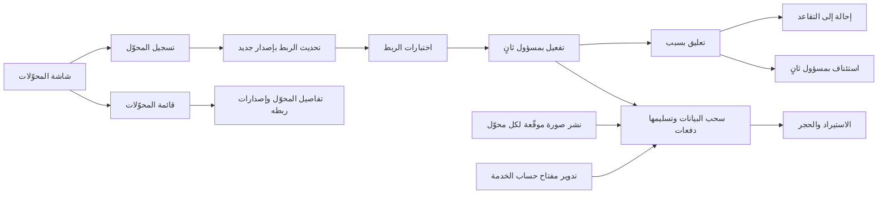
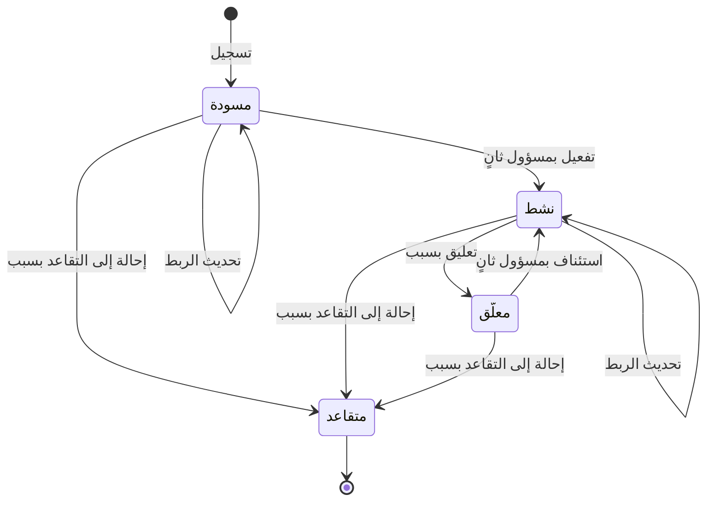

# إدارة محوّلات البيانات

<!-- BEGIN GENERATED: doc -->
| البند | القيمة |
|---|---|
| المعرّف | FEAT-COL-ADAPTERS |
| الإصدار | 0.1 |
| الحالة | مسودة |
| القدرة | CAP-02 جمع المعلومات |
| القدرة الفرعية | CAP-02.04 الاستيعاب والتكامل (R1) |
| الأدوار | مسؤول الإدارة |
| الشاشات | SCR-65 المحوّلات والاتصالات والحساسات |
| حالات الاستخدام | UC-094 |
| القصص | 13: 7 من المواصفة، و6 جديدة |
<!-- END GENERATED: doc -->

## 1. نظرة عامة

### 1.1 القيمة

يتيح للمسؤول تسجيل محوّلات البيانات الخارجية وربط حقولها وتفعيلها بموافقة مسؤول ثان.

### 1.2 النطاق

| البند | القيمة |
|---|---|
| المستخدمون | مسؤول الإدارة يسجّل المحوّل ويحدّث ربطه ويعلّقه ويحيله إلى التقاعد، ومسؤول إدارة ثانٍ يفعّله ويستأنفه، وخدمات المحوّلات تسحب البيانات وتسلّمها، وفريقا التشغيل والأمن ينشران المحوّلات ويحمون مفاتيحها |
| الشاشات | SCR-65 المحوّلات والاتصالات والحساسات: قائمة المحوّلات، وتفاصيل المحوّل بإصدارات ربطه ونتائج اختبارها |
| حالات الاستخدام | استيعاب البيانات الخارجية (UC-094) |
| المتطلبات | لا تدخل بيانات خارجية إلا عبر محوّل مسجّل أو دفعة استيراد تحفظ المصدر والدفعة والتحويل والنسب (REQ-INF-005)، واستيراد البيانات الجغرافية (REQ-INF-008) وبيانات الطقس عبر محوّل (REQ-INF-009)، وربط أنظمة الموارد المؤسسية والموارد البشرية والوثائق بمحوّلات لها اختبارات ربط (REQ-INT-001) |
| خارج النطاق | الاتصال بالنظام الخارجي واختباره وقاعدة الشبكة (ميزة «اتصالات الأنظمة الخارجية»)، ومعالجة دفعات الاستيراد والحجر (ميزة «استيراد البيانات والحجر»)، وإنشاء حساب الخدمة وتجديد بيانات اعتماده (ميزة «حسابات الخدمة للأنظمة»)، وتسجيل المصدر نفسه |

### 1.3 خريطة الميزة

**الشكل 1: خريطة ميزة إدارة محوّلات البيانات**



يمر المحوّل بأربع حالات (الشكل 2). ولا تُقبل دفعاته في الاستيراد إلا وهو «نشط».

**الشكل 2: رحلة المحوّل**



## 2. القواعد المشتركة

تنطبق على كل قصص الميزة، فلا تتكرر داخل القصص. وكل قصة تذكر ما يخصها فقط.

### 2.1 السياق المشترك

كل قصة تبدأ من ثلاثة شروط: مستأجر نشط، وحزمة السياسات الأساسية مفعّلة، ومستخدم مسجّل الدخول ومخوَّل. وتشير إليها القصص بخطوة واحدة: «بفرض السياق المشترك للميزة».

### 2.2 الصلاحية وعدم الإفصاح

- من لا يحق له رؤية العنصر يتلقى ردًا بشكل «غير متاح» تمامًا، فلا يعرف أنه موجود.
- من يرى العنصر ولا يحق له الإجراء يتلقى «لا تملك صلاحية هذا الإجراء».

### 2.3 أوامر تغيير الحالة

- **منع التكرار:** يُرسل كل أمر بمفتاح فريد، فإعادة الطلب نفسه لا تُنفَّذ مرتين.
- **حماية التعديل المتزامن:** يُرسل كل أمر بإصدار البيانات الذي يراه المستخدم. فإن عدّلها غيره في الأثناء، يُرفض الأمر.
- **السجل:** إن نجح الأمر، يُكتب حدثه وسجل التدقيق في المعاملة نفسها.

### 2.4 الرفض المشترك

```gherkin
# language: ar
خاصية: الرفض المشترك لأوامر الميزة

  سيناريو مخطط: رفض مشترك لكل أمر في الميزة
    بفرض السياق المشترك للميزة
    و <الحالة>
    عندما يُرسل المستخدم أي أمر من أوامر الميزة
    اذاً يُرفض برمز <الرمز> ويرى "<الرسالة>"
    و لا يتغير شيء

    امثلة:
      | الحالة                                  | الرمز                  | الرسالة                                                 |
      | العنصر خارج صلاحياته                    | NOT_FOUND              | غير متاح                                                |
      | العنصر مرئي له ولا يحق له الإجراء       | AUTHZ_DENIED           | لا تملك صلاحية هذا الإجراء                              |
      | غيره عدّل العنصر بعد أن فتحه            | VERSION_CONFLICT       | تغيّرت البيانات منذ فتحتها. راجع التغييرات ثم أعد المحاولة |
      | أعاد مفتاح منع التكرار بمحتوى مختلف     | IDEMPOTENCY_KEY_REUSED | طلب مكرر بمحتوى مختلف                                   |
      | البيانات ناقصة أو غير صحيحة             | VALIDATION_FAILED      | بعض البيانات ناقصة أو غير صحيحة. راجع الحقول المعلَّمة      |

  سيناريو: إعادة الطلب نفسه لا تُنفَّذ مرتين
    بفرض السياق المشترك للميزة
    و أمر نجح بمفتاح منع تكرار
    عندما يُعاد الطلب نفسه بالمفتاح نفسه
    اذاً تُعاد النتيجة الأولى ولا يُكتب حدث ثانٍ
```

### 2.5 قواعد المحوّل المشتركة

- **مصدر واحد:** المحوّل مربوط بمصدر واحد فقط، ويكتب ما يستورده عبر أوامر إدارة المعلومات بهوية حساب خدمته، لا مباشرة.
- **إصدارات الربط:** كل ربط يُحفظ إصدارًا لا يُعدَّل، ومعه اختباراته. وسجلات النسب تشير إلى الإصدار الذي استُورد به كل سجل، فلا يُحذف إصدار.
- **ترتيب الفحص:** يُفحص الإصدار قبل الحالة. فإن غيّر غيره حالة المحوّل بعد أن فتحه المستخدم، فالرفض تعارض الإصدار (القسم 2.4). ورفض الحالة في كل قصة يعني أن الإصدار مطابق والحالة لا تسمح بالإجراء.
- **المحوّل المتقاعد:** «متقاعد» حالة نهائية، يُرفض عليها كل أمر.

```gherkin
# language: ar
خاصية: رفض كل أمر على محوّل متقاعد

  سيناريو مخطط: لا يُقبل أي أمر على محوّل متقاعد
    بفرض السياق المشترك للميزة
    و محوّل في حالة "متقاعد" وإصداره مطابق لما يراه المستخدم
    عندما يحاول مسؤول الإدارة <الإجراء>
    اذاً يُرفض برمز <الرمز> ويرى "<الرسالة>"
    و لا يتغير شيء

    امثلة:
      | الإجراء | الرمز | الرسالة |
      | تحديث الربط | ADAPTER_INVALID_STATE_TRANSITION | الوضع الحالي للمحوّل لا يسمح بهذا الإجراء |
      | التفعيل | ADAPTER_INVALID_STATE_TRANSITION | الوضع الحالي للمحوّل لا يسمح بهذا الإجراء |
      | التعليق | ADAPTER_INVALID_STATE_TRANSITION | الوضع الحالي للمحوّل لا يسمح بهذا الإجراء |
      | الاستئناف | ADAPTER_INVALID_STATE_TRANSITION | الوضع الحالي للمحوّل لا يسمح بهذا الإجراء |
      | الإحالة إلى التقاعد | ADAPTER_INVALID_STATE_TRANSITION | الوضع الحالي للمحوّل لا يسمح بهذا الإجراء |
```

## 3. الجودة وتعريف الاكتمال

### 3.1 متطلبات الجودة

<!-- BEGIN GENERATED: quality -->
لا متطلبات جودة مرتبطة بمتطلبات هذه الميزة مباشرة. تنطبق متطلبات المنصة العامة (`FEAT-PLT-*`).
<!-- END GENERATED: quality -->

### 3.2 تعريف الاكتمال

القصة مكتملة حين تتحقق الشروط الخمسة:

1. سيناريوهاتها والقواعد المشتركة تمر في الاختبار الآلي.
2. فحوص البنية المعمارية تمر.
3. نصوص الواجهة والرسائل موجودة بالعربية والإنجليزية.
4. مراجعة الكود مكتملة.
5. ما تضيفه القصة نفسها في قسم «القواعد» تحقق.

## 4. فهرس القصص

<!-- BEGIN GENERATED: story-index -->
| المعرّف | القصة | النوع | الحالة |
|---|---|---|---|
| `US-BC07-ADP-ACTIVATE` | تفعيل المحوّل | أمر | مسودة |
| `US-BC07-ADP-REGISTER` | تسجيل المحوّل | أمر | مسودة |
| `US-BC07-ADP-RESUME` | استئناف المحوّل | أمر | مسودة |
| `US-BC07-ADP-RETIRE` | إحالة المحوّل إلى التقاعد | أمر | مسودة |
| `US-BC07-ADP-SUSPEND` | تعليق المحوّل | أمر | مسودة |
| `US-BC07-ADP-UPDATE-MAPPING` | تحديث ربط حقول المحوّل | أمر | مسودة |
| `US-BC07-Q-ADP-GET` | جلب: Adapter with mapping versions | جلب | مسودة |
| `US-DOM-ADP-LIST` | عرض المحوّلات المسجلة وحالاتها | جلب | مسودة |
| `US-UI-SCR65-ADAPTER-MAPPING` | مراجعة إصدارات الربط ونتائج اختبارها | واجهة | مسودة |
| `US-PLT-ADAPTER-MAPPING-TESTS` | تشغيل اختبارات الربط قبل التفعيل | منصة | مسودة |
| `US-INT-ADAPTER-RUNTIME` | سحب البيانات وترجمتها وتسليمها دفعات | تكامل | مسودة |
| `US-OPS-ADAPTER-CRED-ROTATION` | تدوير مفاتيح حسابات خدمة المحوّلات | تشغيل | مسودة |
| `US-OPS-ADAPTER-DEPLOY` | نشر كل محوّل بصورة موقّعة مستقلة | تشغيل | مسودة |
<!-- END GENERATED: story-index -->

## 5. القصص

### 5.1 US-BC07-ADP-ACTIVATE — تفعيل المحوّل

| النوع | الإصدار | الأولوية | دون اتصال | الحالة |
|---|---|---|---|---|
| أمر | R1 | Must | لا | مسودة |

> **كـ** مسؤول إدارة ثانٍ غير من سجّل المحوّل، **أريد** أن أفعّل محوّلًا في المسودة نجحت اختبارات ربطه، **حتى** يبدأ استيعاب بيانات مصدره بعد مراجعة شخص ثانٍ.

**باختصار:** المحوّل في «مسودة» يصبح «نشطًا» حين تنجح اختبارات ربطه ويفعّله مسؤول غير من سجّله. ومن بعدها تُقبل دفعاته في الاستيراد.

#### القواعد

- **متى يُسمح:** المحوّل «مسودة»، واختبارات إصدار الربط الحالي ناجحة (القصة 5.10).
- **من يُسمح له:** مسؤول إدارة في المستأجر نفسه، يرى المحوّل بتصريحه وله صلاحية الكتابة في نطاقه، وليس من سجّل المحوّل (فصل المهام).
- **الأثر:** يصبح المحوّل «نشطًا»، ويُسجَّل حدث «فُعِّل المحوّل». ويصل إلى عامل الاستيراد، فتُقبل دفعات المحوّل (القصة 5.11).

> **ملاحظة:** شرط نجاح الاختبارات عند التفعيل لا يذكر له المصدر رمز رفض، فالقصة تستعمل رمز فشل اختبارات الربط **[Needs Review]**.

#### معايير القبول

```gherkin
# language: ar
خاصية: تفعيل المحوّل

  سيناريو: مسؤول ثانٍ يفعّل محوّلًا اختُبر ربطه
    بفرض السياق المشترك للميزة
    و محوّل في حالة "مسودة" سجّله مسؤول آخر، واختبارات ربطه ناجحة
    عندما يفعّل مسؤول الإدارة المحوّل
    اذاً تصبح حالة المحوّل "نشط"
    و يُسجَّل حدث "فُعِّل المحوّل"
    و تُقبل دفعات المحوّل في الاستيراد

  سيناريو مخطط: رفض خاص بتفعيل المحوّل
    بفرض السياق المشترك للميزة
    و <الحالة>
    عندما يحاول مسؤول الإدارة تفعيل المحوّل
    اذاً يُرفض برمز <الرمز> ويرى "<الرسالة>"
    و لا يتغير شيء

    امثلة:
      | الحالة | الرمز | الرسالة |
      | المسؤول نفسه سجّل المحوّل | SEGREGATION_OF_DUTIES | لا يجوز أن يعتمد الشخص نفسه ما قدّمه أو طلبه |
      | اختبارات الربط الحالي لم تنجح | MAPPING_TESTS_FAILED | فشلت اختبارات الربط |
      | المحوّل "نشط" من قبل | ADAPTER_INVALID_STATE_TRANSITION | الوضع الحالي للمحوّل لا يسمح بهذا الإجراء |
      | المحوّل "معلّق" | ADAPTER_INVALID_STATE_TRANSITION | الوضع الحالي للمحوّل لا يسمح بهذا الإجراء |
```

<details><summary>المراجع التقنية والتتبع</summary>

<!-- BEGIN GENERATED: refs US-BC07-ADP-ACTIVATE -->
| البند | المعرّف | المعنى |
|---|---|---|
| الواجهة البرمجية | `POST /api/v1/integration/adapters/{id}/actions/activate` | — |
| الأمر | `CMD-ADP-ACTIVATE` | تفعيل المحوّل |
| السياسة | `POL-ADP-ACTIVATE` | Administrator (register, update) · second Administrator (activate)؛ tenant match; object visible to subject (… |
| الحدث | `EVT-ADP-ACTIVATED` | يصل إلى: Import worker |
| الكيان | `AGG-ADAPTER` | المحوّل |
| الجدول | `integration.adapters` | الجدول الرئيسي للمحوّل |
| وحدة النشر | DU-11 | — |
| المتطلبات | REQ-INF-005، REQ-INF-008، REQ-INF-009 | معانيها في القسم 6. التتبع |
| حالة الاستخدام | UC-094 | Ingest External Data |
| الاختبار | TST-ADAPTER-SM، TST-SLC02-INVARIANTS | دورة حالات المحوّل، وثوابت الشريحة SLC-02 |
<!-- END GENERATED: refs US-BC07-ADP-ACTIVATE -->

</details>

### 5.2 US-BC07-ADP-REGISTER — تسجيل المحوّل

| النوع | الإصدار | الأولوية | دون اتصال | الحالة |
|---|---|---|---|---|
| أمر | R1 | Must | لا | مسودة |

> **كـ** مسؤول الإدارة، **أريد** أن أسجّل محوّلًا لمصدر خارجي بحساب خدمته ومواصفة ربطه، **حتى** تدخل بيانات هذا المصدر من قناة مسجّلة يُعرف مصدرها وتحويلها.

**باختصار:** يُنشأ المحوّل في «مسودة» مربوطًا بمصدر نشط واحد وحساب خدمة نشط، ومعه إصدار الربط الأول. ولا يستورد شيئًا حتى يُفعَّل (القصة 5.1).

#### القواعد

- **متى يُسمح:** المصدر «نشط»، وحساب الخدمة «نشط»، ومواصفة الربط مرفقة.
- **من يُسمح له:** مسؤول الإدارة في المستأجر نفسه، وله صلاحية الكتابة في نطاقه.
- **البيانات:** الاسم، والمصدر (مصدر واحد فقط)، وحساب الخدمة، ومواصفة الربط. وكلها إلزامية.
- **الأثر:** محوّل جديد في «مسودة» بإصدار ربطه الأول. ويُسجَّل حدث «سُجِّل المحوّل»، ويصل إلى عامل الاستيراد.

#### معايير القبول

```gherkin
# language: ar
خاصية: تسجيل المحوّل

  سيناريو: تسجيل محوّل لمصدر نشط
    بفرض السياق المشترك للميزة
    و مصدر خارجي "نشط" وحساب خدمة "نشط" في المستأجر
    عندما يسجّل مسؤول الإدارة محوّلًا باسم ومصدر وحساب خدمة ومواصفة ربط
    اذاً يُنشأ المحوّل في حالة "مسودة" مربوطًا بذلك المصدر وحده
    و يُحفظ إصدار الربط الأول
    و يُسجَّل حدث "سُجِّل المحوّل"

  سيناريو مخطط: رفض خاص بتسجيل المحوّل
    بفرض السياق المشترك للميزة
    و <الحالة>
    عندما يحاول مسؤول الإدارة تسجيل المحوّل
    اذاً يُرفض برمز <الرمز> ويرى "<الرسالة>"
    و لا يتغير شيء

    امثلة:
      | الحالة | الرمز | الرسالة |
      | المصدر المختار غير نشط | ADAPTER_INVALID | إعداد المحوّل غير مكتمل: تأكد من المصدر وحساب الخدمة ومواصفة الربط |
      | حساب الخدمة المختار غير نشط | ADAPTER_INVALID | إعداد المحوّل غير مكتمل: تأكد من المصدر وحساب الخدمة ومواصفة الربط |
      | مواصفة الربط غير مرفقة | ADAPTER_INVALID | إعداد المحوّل غير مكتمل: تأكد من المصدر وحساب الخدمة ومواصفة الربط |
      | الاسم فارغ | VALIDATION_FAILED | الاسم مطلوب |
```

<details><summary>المراجع التقنية والتتبع</summary>

<!-- BEGIN GENERATED: refs US-BC07-ADP-REGISTER -->
| البند | المعرّف | المعنى |
|---|---|---|
| الواجهة البرمجية | `POST /api/v1/integration/adapters` | — |
| الأمر | `CMD-ADP-REGISTER` | تسجيل المحوّل |
| السياسة | `POL-ADP-REGISTER` | Administrator (register, update) · second Administrator (activate)؛ tenant match; object visible to subject (… |
| الحدث | `EVT-ADP-REGISTERED` | يصل إلى: Import worker |
| الكيان | `AGG-ADAPTER` | المحوّل |
| الجدول | `integration.adapters` | الجدول الرئيسي للمحوّل |
| وحدة النشر | DU-11 | — |
| المتطلبات | REQ-INF-005، REQ-INF-008، REQ-INF-009 | معانيها في القسم 6. التتبع |
| حالة الاستخدام | UC-094 | Ingest External Data |
| الاختبار | TST-ADAPTER-SM، TST-SLC02-INVARIANTS | دورة حالات المحوّل، وثوابت الشريحة SLC-02 |
<!-- END GENERATED: refs US-BC07-ADP-REGISTER -->

</details>

### 5.3 US-BC07-ADP-RESUME — استئناف المحوّل

| النوع | الإصدار | الأولوية | دون اتصال | الحالة |
|---|---|---|---|---|
| أمر | R1 | Must | لا | مسودة |

> **كـ** مسؤول إدارة ثانٍ غير من علّق المحوّل، **أريد** أن أستأنف محوّلًا معلّقًا، **حتى** يعود استيعاب بيانات مصدره بعد زوال سبب التعليق وبمراجعة شخص ثانٍ.

**باختصار:** المحوّل «المعلّق» يعود «نشطًا». والاستئناف يعادل التفعيل، فلا يملكه من علّق المحوّل.

#### القواعد

- **متى يُسمح:** المحوّل «معلّق»، ولا شروط أخرى.
- **من يُسمح له:** مسؤول إدارة في المستأجر نفسه، يرى المحوّل بتصريحه وله صلاحية الكتابة في نطاقه، وليس من علّق المحوّل (فصل المهام).
- **الأثر:** يصبح المحوّل «نشطًا»، ويُسجَّل حدث «استُؤنف المحوّل». ويصل إلى عامل الاستيراد، فتُقبل دفعات المحوّل من جديد، ويُستأنف السحب من آخر نقطة مؤكدة (القصة 5.11) **[Derived]**.

#### معايير القبول

```gherkin
# language: ar
خاصية: استئناف المحوّل

  سيناريو: مسؤول ثانٍ يستأنف محوّلًا معلّقًا
    بفرض السياق المشترك للميزة
    و محوّل في حالة "معلّق" علّقه مسؤول آخر
    عندما يستأنف مسؤول الإدارة المحوّل
    اذاً تصبح حالة المحوّل "نشط"
    و يُسجَّل حدث "استُؤنف المحوّل"
    و تُقبل دفعات المحوّل في الاستيراد من جديد

  سيناريو مخطط: رفض خاص باستئناف المحوّل
    بفرض السياق المشترك للميزة
    و <الحالة>
    عندما يحاول مسؤول الإدارة استئناف المحوّل
    اذاً يُرفض برمز <الرمز> ويرى "<الرسالة>"
    و لا يتغير شيء

    امثلة:
      | الحالة | الرمز | الرسالة |
      | المسؤول نفسه علّق المحوّل | SEGREGATION_OF_DUTIES | لا يجوز أن يعتمد الشخص نفسه ما قدّمه أو طلبه |
      | المحوّل "نشط" | ADAPTER_INVALID_STATE_TRANSITION | الوضع الحالي للمحوّل لا يسمح بهذا الإجراء |
      | المحوّل "مسودة" | ADAPTER_INVALID_STATE_TRANSITION | الوضع الحالي للمحوّل لا يسمح بهذا الإجراء |
```

<details><summary>المراجع التقنية والتتبع</summary>

<!-- BEGIN GENERATED: refs US-BC07-ADP-RESUME -->
| البند | المعرّف | المعنى |
|---|---|---|
| الواجهة البرمجية | `POST /api/v1/integration/adapters/{id}/actions/resume` | — |
| الأمر | `CMD-ADP-RESUME` | استئناف المحوّل |
| السياسة | `POL-ADP-RESUME` | second Administrator (resume)؛ tenant match; object visible to subject (label ≤ clearance); write permission… |
| الحدث | `EVT-ADP-RESUMED` | يصل إلى: Import worker |
| الكيان | `AGG-ADAPTER` | المحوّل |
| الجدول | `integration.adapters` | الجدول الرئيسي للمحوّل |
| وحدة النشر | DU-11 | — |
| المتطلبات | REQ-INF-005، REQ-INF-008، REQ-INF-009 | معانيها في القسم 6. التتبع |
| حالة الاستخدام | UC-094 | Ingest External Data |
| الاختبار | TST-ADAPTER-SM، TST-SLC02-INVARIANTS | دورة حالات المحوّل، وثوابت الشريحة SLC-02 |
<!-- END GENERATED: refs US-BC07-ADP-RESUME -->

</details>

### 5.4 US-BC07-ADP-RETIRE — إحالة المحوّل إلى التقاعد

| النوع | الإصدار | الأولوية | دون اتصال | الحالة |
|---|---|---|---|---|
| أمر | R1 | Must | لا | مسودة |

> **كـ** مسؤول الإدارة، **أريد** أن أحيل محوّلًا لم يعد مطلوبًا إلى التقاعد مع ذكر السبب، **حتى** يتوقف نهائيًا دون أن يضيع أثر ما استُورد به.

**باختصار:** المحوّل في أي حالة غير نهائية يصبح «متقاعدًا» بسبب مكتوب، ولا يعود بعدها. وإصدارات ربطه تبقى، لأن سجلات النسب تشير إليها.

#### القواعد

- **متى يُسمح:** المحوّل «مسودة» أو «نشط» أو «معلّق». والمتقاعد يُرفض (القسم 2.5).
- **من يُسمح له:** مسؤول الإدارة في المستأجر نفسه، يرى المحوّل بتصريحه وله صلاحية الكتابة في نطاقه.
- **البيانات:** السبب (إلزامي).
- **الأثر:** يصبح المحوّل «متقاعدًا»، وهي حالة نهائية. ويُسجَّل حدث «أُحيل المحوّل إلى التقاعد»، ويصل إلى عامل الاستيراد فلا تُقبل دفعات المحوّل بعدها. وإصدارات الربط والنسب تبقى كما هي.

#### معايير القبول

```gherkin
# language: ar
خاصية: إحالة المحوّل إلى التقاعد

  سيناريو: إحالة محوّل معلّق إلى التقاعد
    بفرض السياق المشترك للميزة
    و محوّل في حالة "معلّق" استُوردت به دفعات من قبل
    عندما يحيله مسؤول الإدارة إلى التقاعد مع سبب
    اذاً تصبح حالة المحوّل "متقاعد"
    و تبقى إصدارات ربطه ونسب ما استُورد به
    و لا تُقبل دفعات المحوّل بعدها
    و يُسجَّل حدث "أُحيل المحوّل إلى التقاعد"

  سيناريو مخطط: رفض خاص بإحالة المحوّل إلى التقاعد
    بفرض السياق المشترك للميزة
    و <الحالة>
    عندما يحاول مسؤول الإدارة إحالة المحوّل إلى التقاعد
    اذاً يُرفض برمز <الرمز> ويرى "<الرسالة>"
    و لا يتغير شيء

    امثلة:
      | الحالة | الرمز | الرسالة |
      | لم يُذكر السبب | REASON_REQUIRED | اذكر السبب |
```

<details><summary>المراجع التقنية والتتبع</summary>

<!-- BEGIN GENERATED: refs US-BC07-ADP-RETIRE -->
| البند | المعرّف | المعنى |
|---|---|---|
| الواجهة البرمجية | `POST /api/v1/integration/adapters/{id}/actions/retire` | — |
| الأمر | `CMD-ADP-RETIRE` | إحالة المحوّل إلى التقاعد |
| السياسة | `POL-ADP-RETIRE` | Administrator (retire)؛ tenant match; object visible to subject (label ≤ clearance); write permission in org… |
| الحدث | `EVT-ADP-RETIRED` | يصل إلى: Import worker |
| الكيان | `AGG-ADAPTER` | المحوّل |
| الجدول | `integration.adapters` | الجدول الرئيسي للمحوّل |
| وحدة النشر | DU-11 | — |
| المتطلبات | REQ-INF-005، REQ-INF-008، REQ-INF-009 | معانيها في القسم 6. التتبع |
| حالة الاستخدام | UC-094 | Ingest External Data |
| الاختبار | TST-ADAPTER-SM، TST-SLC02-INVARIANTS | دورة حالات المحوّل، وثوابت الشريحة SLC-02 |
<!-- END GENERATED: refs US-BC07-ADP-RETIRE -->

</details>

### 5.5 US-BC07-ADP-SUSPEND — تعليق المحوّل

| النوع | الإصدار | الأولوية | دون اتصال | الحالة |
|---|---|---|---|---|
| أمر | R1 | Must | لا | مسودة |

> **كـ** مسؤول الإدارة، **أريد** أن أعلّق محوّلًا نشطًا فورًا مع ذكر السبب، **حتى** أوقف دخول بياناته عند خلل أو اشتباه دون انتظار موافقة أحد.

**باختصار:** المحوّل «النشط» يصبح «معلّقًا» فورًا بسبب مكتوب. ولا تُقبل دفعاته حتى يستأنفه مسؤول ثانٍ (القصة 5.3).

#### القواعد

- **متى يُسمح:** المحوّل «نشط».
- **من يُسمح له:** مسؤول الإدارة في المستأجر نفسه، يرى المحوّل بتصريحه وله صلاحية الكتابة في نطاقه. والتعليق إيقاف للاحتواء، فلا يحتاج شخصًا ثانيًا.
- **البيانات:** السبب (إلزامي).
- **الأثر:** يصبح المحوّل «معلّقًا»، ويُسجَّل حدث «عُلِّق المحوّل». ويصل إلى عامل الاستيراد، فلا تُقبل دفعات المحوّل بعدها.

#### معايير القبول

```gherkin
# language: ar
خاصية: تعليق المحوّل

  سيناريو: تعليق محوّل نشط
    بفرض السياق المشترك للميزة
    و محوّل في حالة "نشط"
    عندما يعلّقه مسؤول الإدارة مع سبب
    اذاً تصبح حالة المحوّل "معلّق"
    و لا تُقبل دفعات المحوّل في الاستيراد
    و يُسجَّل حدث "عُلِّق المحوّل"

  سيناريو مخطط: رفض خاص بتعليق المحوّل
    بفرض السياق المشترك للميزة
    و <الحالة>
    عندما يحاول مسؤول الإدارة تعليق المحوّل
    اذاً يُرفض برمز <الرمز> ويرى "<الرسالة>"
    و لا يتغير شيء

    امثلة:
      | الحالة | الرمز | الرسالة |
      | لم يُذكر السبب | REASON_REQUIRED | اذكر السبب |
      | المحوّل "مسودة" | ADAPTER_INVALID_STATE_TRANSITION | الوضع الحالي للمحوّل لا يسمح بهذا الإجراء |
      | المحوّل "معلّق" من قبل | ADAPTER_INVALID_STATE_TRANSITION | الوضع الحالي للمحوّل لا يسمح بهذا الإجراء |
```

<details><summary>المراجع التقنية والتتبع</summary>

<!-- BEGIN GENERATED: refs US-BC07-ADP-SUSPEND -->
| البند | المعرّف | المعنى |
|---|---|---|
| الواجهة البرمجية | `POST /api/v1/integration/adapters/{id}/actions/suspend` | — |
| الأمر | `CMD-ADP-SUSPEND` | تعليق المحوّل |
| السياسة | `POL-ADP-SUSPEND` | Administrator (suspend)؛ tenant match; object visible to subject (label ≤ clearance); write permission in org… |
| الحدث | `EVT-ADP-SUSPENDED` | يصل إلى: Import worker |
| الكيان | `AGG-ADAPTER` | المحوّل |
| الجدول | `integration.adapters` | الجدول الرئيسي للمحوّل |
| وحدة النشر | DU-11 | — |
| المتطلبات | REQ-INF-005، REQ-INF-008، REQ-INF-009 | معانيها في القسم 6. التتبع |
| حالة الاستخدام | UC-094 | Ingest External Data |
| الاختبار | TST-ADAPTER-SM، TST-SLC02-INVARIANTS | دورة حالات المحوّل، وثوابت الشريحة SLC-02 |
<!-- END GENERATED: refs US-BC07-ADP-SUSPEND -->

</details>

### 5.6 US-BC07-ADP-UPDATE-MAPPING — تحديث ربط حقول المحوّل

| النوع | الإصدار | الأولوية | دون اتصال | الحالة |
|---|---|---|---|---|
| أمر | R1 | Must | لا | مسودة |

> **كـ** مسؤول الإدارة، **أريد** أن أحدّث ربط حقول المحوّل بإصدار جديد مع اختباراته، **حتى** تتبع الترجمة تغيّر النظام الخارجي دون أن يضيع أثر الإصدارات السابقة.

**باختصار:** يُحفظ إصدار ربط جديد لا يُعدَّل بعد نجاح اختباراته. ولا تتغير حالة المحوّل، ويزيد إصداره.

#### القواعد

- **متى يُسمح:** المحوّل «مسودة» أو «نشط»، واختبارات الإصدار الجديد ناجحة (القصة 5.10).
- **من يُسمح له:** مسؤول الإدارة في المستأجر نفسه، يرى المحوّل بتصريحه وله صلاحية الكتابة في نطاقه.
- **البيانات:** مواصفة الربط، والاختبارات. وكلتاهما إلزامية.
- **الأثر:** إصدار ربط جديد، وتبقى الإصدارات السابقة (القسم 2.5). وما يُستورد بعده يُترجم بالإصدار الجديد **[Derived]**. ويُسجَّل حدث «حُدِّث ربط المحوّل»، ويصل إلى عامل الاستيراد.

> **ملاحظة:** تحديث ربط محوّل نشط لا يحتاج في المصدر موافقة مسؤول ثانٍ، بخلاف التفعيل (القصة 5.1) **[Needs Review]**.

#### معايير القبول

```gherkin
# language: ar
خاصية: تحديث ربط حقول المحوّل

  سيناريو: تحديث ربط محوّل نشط
    بفرض السياق المشترك للميزة
    و محوّل في حالة "نشط" له إصدارا ربط
    عندما يرسل مسؤول الإدارة مواصفة ربط جديدة مع اختبارات تنجح كلها
    اذاً يُحفظ إصدار ربط ثالث ولا يتغير الإصداران السابقان
    و تبقى حالة المحوّل "نشط" ويزيد إصداره
    و يُسجَّل حدث "حُدِّث ربط المحوّل"

  سيناريو مخطط: رفض خاص بتحديث ربط المحوّل
    بفرض السياق المشترك للميزة
    و <الحالة>
    عندما يحاول مسؤول الإدارة تحديث ربط المحوّل
    اذاً يُرفض برمز <الرمز> ويرى "<الرسالة>"
    و لا يتغير شيء

    امثلة:
      | الحالة | الرمز | الرسالة |
      | اختبار من اختبارات الإصدار الجديد فشل | MAPPING_TESTS_FAILED | فشلت اختبارات الربط |
      | المحوّل "معلّق" | ADAPTER_INVALID_STATE_TRANSITION | الوضع الحالي للمحوّل لا يسمح بهذا الإجراء |
      | الاختبارات غير مرفقة | VALIDATION_FAILED | الاختبارات مطلوبة |
```

<details><summary>المراجع التقنية والتتبع</summary>

<!-- BEGIN GENERATED: refs US-BC07-ADP-UPDATE-MAPPING -->
| البند | المعرّف | المعنى |
|---|---|---|
| الواجهة البرمجية | `POST /api/v1/integration/adapters/{id}/actions/update-mapping` | — |
| الأمر | `CMD-ADP-UPDATE-MAPPING` | تحديث ربط حقول المحوّل |
| السياسة | `POL-ADP-UPDATE-MAPPING` | Administrator (register, update) · second Administrator (activate)؛ tenant match; object visible to subject (… |
| الحدث | `EVT-ADP-MAPPING-UPDATED` | يصل إلى: Import worker |
| الكيان | `AGG-ADAPTER` | المحوّل |
| الجدول | `integration.adapters` | الجدول الرئيسي للمحوّل |
| وحدة النشر | DU-11 | — |
| المتطلبات | REQ-INF-005، REQ-INF-008، REQ-INF-009 | معانيها في القسم 6. التتبع |
| حالة الاستخدام | UC-094 | Ingest External Data |
| الاختبار | TST-ADAPTER-SM، TST-SLC02-INVARIANTS | دورة حالات المحوّل، وثوابت الشريحة SLC-02 |
<!-- END GENERATED: refs US-BC07-ADP-UPDATE-MAPPING -->

</details>

### 5.7 US-BC07-Q-ADP-GET — عرض المحوّل وإصدارات ربطه

| النوع | الإصدار | الأولوية | دون اتصال | الحالة |
|---|---|---|---|---|
| جلب | R1 | Must | لا | مسودة |

> **كـ** مسؤول الإدارة، **أريد** أن أرى المحوّل بحالته وإصدارات ربطه، **حتى** أعرف كيف تُترجم بيانات مصدره وبأي إصدار.

**باختصار:** يُعاد المحوّل بمصدره وحساب خدمته وحالته وإصداره، ومعه إصدارات ربطه. ويمكن طلبه كما كان في وقت سابق.

#### القواعد

- **من يرى ماذا:** مسؤول الإدارة، ضمن نطاقه في المؤسسة وبما يسمح به تصريحه. وما خارج ذلك يظهر «غير متاح» بشكل غير الموجود نفسه.
- **المرشحات:** وقت السريان ووقت التسجيل، وكلاهما اختياري، لعرض المحوّل كما كان في وقت مضى وكما عرفه النظام حينها.
- **ما يُعاد:** الاسم، والمصدر، وحساب الخدمة، والحالة، والإصدار، وإصدارات الربط بمواصفة كل منها واختباراتها.

> **ملاحظة:** تصميم الواجهات يذكر مهندس التكامل بين مستخدمي شاشة المحوّلات، والسياسة تقصر هذا العرض على مسؤول الإدارة **[Needs Review]**.

#### معايير القبول

```gherkin
# language: ar
خاصية: عرض المحوّل وإصدارات ربطه

  سيناريو: عرض محوّل نشط
    بفرض السياق المشترك للميزة
    و محوّل "نشط" ضمن نطاق مسؤول الإدارة له ثلاثة إصدارات ربط
    عندما يفتح مسؤول الإدارة المحوّل
    اذاً يرى الاسم والمصدر وحساب الخدمة والحالة والإصدار
    و يرى إصدارات الربط الثلاثة بمواصفة كل منها واختباراتها

  سيناريو: عرض المحوّل كما كان في وقت سابق
    بفرض السياق المشترك للميزة
    و محوّل عُلِّق أمس وكان "نشطًا" قبلها
    عندما يطلب مسؤول الإدارة المحوّل بوقت سريان قبل التعليق
    اذاً يُعاد المحوّل بحالة "نشط" وإصدارات الربط التي كانت له حينها
```

<details><summary>المراجع التقنية والتتبع</summary>

<!-- BEGIN GENERATED: refs US-BC07-Q-ADP-GET -->
| البند | المعرّف | المعنى |
|---|---|---|
| الواجهة البرمجية | `GET /api/v1/integration/adapters/{adapter_id}` | — |
| الاستعلام | `QRY-ADP-GET` | Adapter with mapping versions |
| السياسة | `POL-ADP-GET` | org scope ∩ classification rule; claims filtered by label |
| الكيان | `AGG-ADAPTER` | المحوّل |
| الجدول | `integration.adapters` | الجدول الرئيسي للمحوّل |
| وحدة النشر | DU-11 | — |
| المتطلب | REQ-INF-005 | The system shall ingest external data only through registered adapters or bulk import jobs that record source… |
| حالة الاستخدام | UC-094 | Ingest External Data |
| الاختبار | TST-ADAPTER-SM، TST-SLC02-INVARIANTS | دورة حالات المحوّل، وثوابت الشريحة SLC-02 |
<!-- END GENERATED: refs US-BC07-Q-ADP-GET -->

</details>

### 5.8 US-DOM-ADP-LIST — عرض المحوّلات المسجلة وحالاتها

| النوع | الإصدار | الأولوية | دون اتصال | الحالة |
|---|---|---|---|---|
| جلب | R1 | Must | لا | مسودة |

> **كـ** مسؤول الإدارة، **أريد** قائمة بالمحوّلات المسجّلة وحالاتها، **حتى** أتابع ما يُدخل البيانات إلى المستأجر وأصل إلى ما يحتاج تدخلًا.

**باختصار:** تُعاد المحوّلات التي يراها المستخدم صفحةً بعد صفحة، ولكل منها حالته ومصدره. والمواصفة لا تعرّف هذا الاستعلام بعد، فالقصة **[Derived]**.

#### القواعد

- **من يرى ماذا:** كما في عرض المحوّل (القصة 5.7): مسؤول الإدارة، ضمن نطاقه وتصريحه **[Derived]**.
- **المرشحات:** الحالة، والمصدر، والاسم، والمؤشر والحد **[Derived]**.
- **ما يُعاد لكل محوّل:** الاسم، والمصدر، والحالة، والإصدار، وإصدار الربط الحالي.
- **الترقيم:** بالمؤشر، ولا عدد إلا لما يراه المستخدم، ولا إشارة إلى ما أُخفي عنه.

#### معايير القبول

```gherkin
# language: ar
خاصية: عرض المحوّلات المسجلة وحالاتها

  سيناريو: تصفية المحوّلات المعلّقة
    بفرض السياق المشترك للميزة
    و في المستأجر محوّلات "نشطة" وأخرى "معلّقة"
    عندما يطلب مسؤول الإدارة المحوّلات بالحالة "معلّق"
    اذاً تُعاد المحوّلات المعلّقة فقط بمصدر كل منها وإصدار ربطه الحالي

  سيناريو: محوّلات خارج النطاق لا تظهر
    بفرض السياق المشترك للميزة
    و محوّل لمصدر خارج نطاق مسؤول الإدارة
    عندما يطلب قائمة المحوّلات دون مرشح
    اذاً لا يظهر ذلك المحوّل ولا يُحسب في العدد
```

<details><summary>المراجع التقنية والتتبع</summary>

<!-- BEGIN GENERATED: refs US-DOM-ADP-LIST -->
| البند | المعرّف | المعنى |
|---|---|---|
| الشاشة | SCR-65 | شاشة المحوّلات والاتصالات والحساسات |
| حالة الاستخدام | UC-094 | Ingest External Data |
| المصدر | `[Derived]` | — |
| المتطلب | REQ-INF-005 | The system shall ingest external data only through registered adapters or bulk import jobs that record source… |
| حالة الاستخدام | UC-094 | Ingest External Data |
<!-- END GENERATED: refs US-DOM-ADP-LIST -->

</details>

### 5.9 US-UI-SCR65-ADAPTER-MAPPING — مراجعة إصدارات الربط ونتائج اختبارها

| النوع | الإصدار | الأولوية | دون اتصال | الحالة |
|---|---|---|---|---|
| واجهة | R1 | Should | لا | مسودة |

> **كـ** مسؤول الإدارة، **أريد** أن أراجع في شاشة المحوّلات إصدارات ربط المحوّل ونتائج اختبار كل إصدار، **حتى** أقرر التفعيل أو التحديث وأنا أعرف ما تغيّر.

**باختصار:** تعرض تفاصيل المحوّل حالته شارةً، وإصدارات ربطه الأحدث أولًا ولكل منها نتائج اختباراته. وتظهر الأفعال حسب صلاحية المستخدم وحالة المحوّل.

#### القواعد

- إصدارات الربط للعرض فقط، والتغيير يكون بإصدار جديد (القصة 5.6).
- نتائج الاختبار تُعرض لكل إصدار، نجاحًا أو فشلًا لكل اختبار **[Derived]**.
- يظهر الفعل إذا شملته صلاحيات المستخدم وسمحت به الحالة المعروضة: «تفعيل» للمسودة، و«تعليق» للنشط، و«استئناف» للمعلّق، و«إحالة إلى التقاعد» لغير المتقاعد. وهذا تلميح، والحكم للخادم.
- قد يظهر «تفعيل» أو «استئناف» لمن يمنعه فصل المهام، فيرفضه الخادم وتعرض الشاشة رسالته.
- التعليق والإحالة إلى التقاعد يطلبان السبب في حقل نصي إلزامي.
- عند تعارض الإصدار تعيد الشاشة تحميل المحوّل وتعرض ما تغيّر. وعند رفض الحالة تعيد تحميل الحالة وتخفي الفعل غير المتاح.

#### معايير القبول

```gherkin
# language: ar
خاصية: مراجعة إصدارات الربط ونتائج اختبارها

  سيناريو: مراجعة إصدارات محوّل في المسودة
    بفرض السياق المشترك للميزة
    و محوّل في حالة "مسودة" له إصدارا ربط
    عندما يفتح مسؤول الإدارة تفاصيل المحوّل
    اذاً يرى الإصدارين الأحدث أولًا ولكل منهما نتائج اختباراته
    و يظهر له زر "تفعيل" ولا يظهر زر "استئناف"

  سيناريو مخطط: استجابة الشاشة لرفض الخادم
    بفرض السياق المشترك للميزة
    و تفاصيل المحوّل مفتوحة
    و <الحالة>
    عندما يضغط المستخدم زر الإجراء
    اذاً تعرض الشاشة "<الرسالة>"
    و لا يتغير شيء

    امثلة:
      | الحالة | الرمز | الرسالة |
      | المستخدم نفسه سجّل المحوّل وضغط "تفعيل" | SEGREGATION_OF_DUTIES | لا يجوز أن يعتمد الشخص نفسه ما قدّمه أو طلبه |
      | أرسل إصدار ربط فشل أحد اختباراته | MAPPING_TESTS_FAILED | فشلت اختبارات الربط |
```

<details><summary>المراجع التقنية والتتبع</summary>

<!-- BEGIN GENERATED: refs US-UI-SCR65-ADAPTER-MAPPING -->
| البند | المعرّف | المعنى |
|---|---|---|
| الشاشة | SCR-65 | شاشة المحوّلات والاتصالات والحساسات |
| المصدر | `AGG-ADAPTER` | — |
| المصدر | `21-ui-design.md §6.3` | — |
<!-- END GENERATED: refs US-UI-SCR65-ADAPTER-MAPPING -->

</details>

### 5.10 US-PLT-ADAPTER-MAPPING-TESTS — تشغيل اختبارات الربط قبل التفعيل

| النوع | الإصدار | الأولوية | دون اتصال | الحالة |
|---|---|---|---|---|
| منصة | R1 | Must | لا ينطبق | مسودة |

> **كـ** فريق المنصة، **أريد** تشغيل اختبارات كل إصدار ربط داخل المنصة، **حتى** لا يُحفظ إصدار ربط ولا يُفعَّل محوّل دون اختبارات ناجحة.

**باختصار:** كل إصدار ربط يحمل مواصفته واختباراته معًا. وتُشغَّل الاختبارات عند تحديث الربط وعند التفعيل، والفشل يرفض الأمر. والقصة **[Derived]**.

#### القواعد

- الاختبارات تُحفظ مع إصدار الربط ولا تُعدَّل بعده (القسم 2.5).
- تُشغَّل عند تحديث الربط (القصة 5.6) وعند التفعيل (القصة 5.1).
- تعمل على عيّنات مرفقة بها، دون اتصال بالنظام الخارجي ولا بأي شبكة خارجية (FIT-12) **[Derived]**.
- كل تكامل مع أنظمة الموارد المؤسسية والموارد البشرية والوثائق له محوّل نشط واختبارات ربط ونسب (REQ-INT-001).

#### معايير القبول

```gherkin
# language: ar
خاصية: تشغيل اختبارات الربط قبل التفعيل

  سيناريو: اختبارات ناجحة
    بفرض إصدار ربط جديد معه عيّنات ومخرجاتها المتوقعة
    عندما تُشغَّل اختباراته
    اذاً تطابق المخرجات المتوقعة ويُقبل الإصدار

  سيناريو: اختبار فاشل
    بفرض إصدار ربط جديد يترجم عيّنة إلى غير مخرجها المتوقع
    عندما تُشغَّل اختباراته
    اذاً يُرفض الإصدار ولا يُحفظ

  سيناريو: الاختبار في شبكة معزولة
    بفرض مرحلة البناء والاختبار في شبكة معزولة
    عندما تُشغَّل اختبارات الربط
    اذاً تنجح دون أي طلب إلى النظام الخارجي أو إلى شبكة خارجية
```

<details><summary>المراجع التقنية والتتبع</summary>

<!-- BEGIN GENERATED: refs US-PLT-ADAPTER-MAPPING-TESTS -->
| البند | المعرّف | المعنى |
|---|---|---|
| المصدر | `AGG-ADAPTER` | — |
| فحص البنية | FIT-12 | No external network dependency at runtime or build (air-gapped) |
| المصدر | `[Derived]` | — |
| المتطلب | REQ-INT-001 | The system shall integrate ERP, HRIS and DMS through registered adapters that map external records to claims,… |
| حالة الاستخدام | UC-094 | Ingest External Data |
<!-- END GENERATED: refs US-PLT-ADAPTER-MAPPING-TESTS -->

</details>

### 5.11 US-INT-ADAPTER-RUNTIME — سحب البيانات وترجمتها وتسليمها دفعات

| النوع | الإصدار | الأولوية | دون اتصال | الحالة |
|---|---|---|---|---|
| تكامل | R1 | Must | لا ينطبق | مسودة |

> **كـ** مهندس التكامل، **أريد** أن يسحب المحوّل النشط السجلات الجديدة من النظام الخارجي ويترجمها بإصدار ربطه ويسلّمها دفعات، **حتى** تدخل البيانات الخارجية ادعاءاتٍ بمصدرها ونسبها دون تكرار ولا فقد.

**باختصار:** يقرأ المحوّل آخر نقطة مؤكدة للاتصال، ويسحب ما بعدها، ويترجمه ويتحقق من مخططه، ثم يسلّمه دفعة بمعرّف فريد. والنقطة تتقدم بعد تأكيد الدفعة فقط.

#### القواعد

- **متى يحدث:** في كل دورة سحب لمحوّل «نشط» اتصاله نشط. وعند انقطاع الاتصال يتوقف السحب دون فقد، ويعود من آخر نقطة مؤكدة.
- **البيانات:** سجلات النظام الخارجي بعد ترجمتها بإصدار الربط الحالي، في دفعة لها معرّف فريد للمحوّل.
- **الأثر:** السجل الصالح يُكتب بأوامر إدارة المعلومات بهوية حساب خدمة المحوّل، ادعاءً يذكر مصدر المحوّل، مع ربط معرّفه الخارجي ونسب إلى الدفعة وإصدار الربط. والسجل غير الصالح يُحجر بسببه. والقيمة المخالفة لما في المنصة تفتح تعارضًا ولا تكتب فوقه.
- **الجودة:** انقطاع 4 ساعات بلا فقد، ويُعالج التراكم خلال ساعة (QAS-INT-001). ودفعة 1,000 ملاحظة خلال ثانية واحدة في 95 % من الحالات، ولا تكرار عند إعادة المحاولة (QAS-PERF-012).

> **ملاحظة:** الدفعة من محوّل غير نشط لا تُقبل، ولا يذكر المصدر رمزًا خاصًا لهذا الرفض **[Needs Review]**.

#### معايير القبول

```gherkin
# language: ar
خاصية: سحب البيانات وترجمتها وتسليمها دفعات

  سيناريو: سحب دفعة وتسليمها
    بفرض محوّل "نشط" اتصاله نشط وآخر نقطة مؤكدة له معروفة
    و في النظام الخارجي سجلات جديدة بعد تلك النقطة، أحدها غير صالح
    عندما يبدأ المحوّل دورة السحب
    اذاً تُسلَّم السجلات دفعةً بمعرّف فريد مترجمةً بإصدار الربط الحالي
    و تُسجَّل السجلات الصالحة ادعاءات بمصدر المحوّل ونسبها إلى الدفعة وإصدار الربط
    و يُحجر السجل غير الصالح بسببه
    و تتقدم نقطة الاتصال بعد تأكيد الدفعة

  سيناريو: إعادة تسليم الدفعة نفسها لا تكرر السجلات
    بفرض دفعة سُلِّمت ولم يصل تأكيدها إلى المحوّل
    عندما يعيد المحوّل تسليمها بالمعرّف نفسه والمحتوى نفسه
    اذاً تُعاد الدفعة القائمة ولا يتكرر أي سجل

  سيناريو: محوّل معلّق لا يستورد شيئًا
    بفرض محوّل "معلّق"
    عندما تحين دورة السحب
    اذاً لا تُقبل منه دفعة ولا تتقدم نقطة الاتصال

  سيناريو مخطط: رفض خاص بتسليم الدفعة
    بفرض محوّل "نشط" سلّم دفعات من قبل
    و <الحالة>
    عندما يسلّم المحوّل الدفعة
    اذاً تُرفض برمز <الرمز> مع "<الرسالة>"
    و لا يتغير شيء

    امثلة:
      | الحالة | الرمز | الرسالة |
      | أُعيد معرّف دفعة سابقة بمحتوى مختلف | BATCH_KEY_REUSED | استُخدم معرّف هذه الدفعة من قبل بمحتوى مختلف |
```

<details><summary>المراجع التقنية والتتبع</summary>

<!-- BEGIN GENERATED: refs US-INT-ADAPTER-RUNTIME -->
| البند | المعرّف | المعنى |
|---|---|---|
| المصدر | `20-integration-design.md §3` | — |
| المصدر | `INV-ADP-01` | — |
| المصدر | `INV-ADP-02` | — |
| المتطلب | REQ-INF-005 | The system shall ingest external data only through registered adapters or bulk import jobs that record source… |
| حالة الاستخدام | UC-094 | Ingest External Data |
<!-- END GENERATED: refs US-INT-ADAPTER-RUNTIME -->

</details>

### 5.12 US-OPS-ADAPTER-CRED-ROTATION — تدوير مفاتيح حسابات خدمة المحوّلات

| النوع | الإصدار | الأولوية | دون اتصال | الحالة |
|---|---|---|---|---|
| تشغيل | R1 | Should | لا ينطبق | مسودة |

> **كـ** فريق الأمن، **أريد** أن تُدوَّر مفاتيح حسابات خدمة المحوّلات قبل انتهائها وألا تظهر بيانات الاعتماد في أي مواصفة أو سجل أو حدث، **حتى** تبقى مدة استغلال مفتاح مسرَّب 90 يومًا على الأكثر.

**باختصار:** حساب خدمة المحوّل يصادق بمفتاح عام صلاحيته 90 يومًا على الأكثر، ويُدوَّر قبل انتهائه. وبيانات الاعتماد لا تُحفظ إلا في مخزن الأسرار.

#### القواعد

- لكل حساب خدمة مالك مسؤول نشط، وصلاحية مفتاحه 90 يومًا على الأكثر.
- التدوير نفسه أمر في ميزة «حسابات الخدمة للأنظمة». ولا يغيّر حالة المحوّل ولا إصدار ربطه **[Derived]**.
- بيانات الاعتماد لا تُكتب في مواصفة المحوّل أو الاتصال، ولا في السجلات ولا الأحداث. ويُشار إليها في مخزن الأسرار فقط.
- يُدوَّر المفتاح فورًا عند الاشتباه بتسرّبه **[Derived]**.

> **ملاحظة:** خطر تسرّب المفتاح خلال مدة صلاحيته مقبول صراحة، ويُكمَّل لاحقًا برصد الاستعمال الشاذ في مرحلة المراقبة.

#### معايير القبول

```gherkin
# language: ar
خاصية: تدوير مفاتيح حسابات خدمة المحوّلات

  سيناريو: تدوير المفتاح قبل انتهائه
    بفرض محوّل "نشط" ينتهي مفتاح حساب خدمته بعد أيام
    عندما يُدوَّر مفتاح حساب الخدمة بمفتاح عام صلاحيته 90 يومًا
    اذاً يصادق المحوّل بالمفتاح الجديد
    و تبقى حالة المحوّل وإصدار ربطه كما هما

  سيناريو: لا بيانات اعتماد في السجلات
    بفرض محوّل صادق وسلّم دفعة
    عندما تُراجع مواصفة المحوّل وسجلاته التقنية وأحداثه
    اذاً لا تظهر فيها بيانات الاعتماد، بل مرجعها في مخزن الأسرار فقط
```

<details><summary>المراجع التقنية والتتبع</summary>

<!-- BEGIN GENERATED: refs US-OPS-ADAPTER-CRED-ROTATION -->
| البند | المعرّف | المعنى |
|---|---|---|
| المصدر | `17-security-design.md §2` | — |
| المصدر | `THR-S01-11` | — |
| المصدر | `INV-CON-03` | — |
<!-- END GENERATED: refs US-OPS-ADAPTER-CRED-ROTATION -->

</details>

### 5.13 US-OPS-ADAPTER-DEPLOY — نشر كل محوّل بصورة موقّعة مستقلة

| النوع | الإصدار | الأولوية | دون اتصال | الحالة |
|---|---|---|---|---|
| تشغيل | R1 | Should | لا ينطبق | مسودة |

> **كـ** فريق التشغيل، **أريد** أن يُنشر كل محوّل نسخةً مستقلة من صورة موقّعة ومثبتة ببصمتها، **حتى** أحدّث محوّلًا أو أرجع عنه دون المساس بغيره، ولا يعمل في الموقع كود غير موثوق.

**باختصار:** وحدة المحوّلات تُنشر نسخة لكل محوّل، وكودها لكل مصدر ولكل مستأجر. والصورة لا تدخل الموقع إلا موقّعة ومعها قائمة مكوّناتها.

#### القواعد

- وحدة المحوّلات على حد الثقة مع الأنظمة الخارجية، وتُنشر نسخة لكل محوّل. والصورة المستقلة لكل محوّل **[Derived]**.
- الصورة موقّعة ومثبتة ببصمتها، ومعها قائمة مكوّنات البرمجيات، وتُسحب من السجل الداخلي للصور فقط.
- يُتحقق من التوقيع وقائمة المكوّنات قبل إدخال الصورة إلى السجل الداخلي. والبناء يُختبر في شبكة معزولة (FIT-12).
- مستوى الخدمة: توفر 99 %، وفقد بيانات لا يتجاوز 24 ساعة، واستعادة خلال 24 ساعة.
- الرجوع إلى الإصدار السابق خلال ساعة من حزمة الإصدار وحدها (QAS-OPS-001).

#### معايير القبول

```gherkin
# language: ar
خاصية: نشر كل محوّل بصورة موقّعة مستقلة

  سيناريو: تحديث محوّل واحد
    بفرض محوّلان منشوران في الخلية لمصدرين مختلفين
    عندما تُنشر صورة موقّعة جديدة للمحوّل الأول
    اذاً يعمل المحوّل الأول بالصورة الجديدة
    و لا تتغير نسخة المحوّل الثاني

  سيناريو: صورة غير موقّعة لا تدخل الموقع
    بفرض صورة محوّل بلا توقيع صحيح في حزمة الإصدار
    عندما يُتحقق من الحزمة داخل الموقع
    اذاً لا تدخل الصورة السجل الداخلي ولا تُنشر

  سيناريو: الرجوع عن تحديث
    بفرض محوّل حُدِّث إلى صورة جديدة
    عندما يقرر فريق التشغيل الرجوع
    اذاً يعمل المحوّل بالصورة السابقة خلال ساعة
```

<details><summary>المراجع التقنية والتتبع</summary>

<!-- BEGIN GENERATED: refs US-OPS-ADAPTER-DEPLOY -->
| البند | المعرّف | المعنى |
|---|---|---|
| المصدر | `22-deployment-design.md` | — |
| القرار التقني | TD-17 | Signed images (cosign) + SBOM (Syft); offline bundles with Zarf (air-gapped install/upgrade/rollback); GitOps… |
| القرار التقني | TD-12 | Kubernetes Jobs with Kueue (fair sharing, per-tenant quotas); images from internal Harbor registry, signed (c… |
| المصدر | `[Derived]` | — |
<!-- END GENERATED: refs US-OPS-ADAPTER-DEPLOY -->

</details>

## 6. التتبع

<!-- BEGIN GENERATED: trace -->
| المتطلب | المعنى | القصص | الاختبار |
|---|---|---|---|
| REQ-INF-005 | The system shall ingest external data only through registered adapters or bulk import jobs that record source… | `US-BC07-ADP-ACTIVATE`، `US-BC07-ADP-REGISTER`، `US-BC07-ADP-RESUME`، `US-BC07-ADP-RETIRE`، `US-BC07-ADP-SUSPEND`، `US-BC07-ADP-UPDATE-MAPPING`، `US-BC07-Q-ADP-GET`، `US-DOM-ADP-LIST`، `US-INT-ADAPTER-RUNTIME` | TST-ADAPTER-SM، TST-IMPORT-BATCH-SM، TST-SLC02-INVARIANTS |
| REQ-INF-008 | The system shall import geospatial data via OGC API Features/Maps/Tiles, WMS/WFS, GeoJSON, GeoPackage, GeoTIF… | كل قصص الأوامر والنظام في الميزة (6) | TST-ADAPTER-SM، TST-IMPORT-BATCH-SM، TST-SLC02-INVARIANTS |
| REQ-INF-009 | The system shall ingest weather data through an adapter and register the provider as a source. | كل قصص الأوامر والنظام في الميزة (6) | TST-ADAPTER-SM، TST-IMPORT-BATCH-SM، TST-SLC02-INVARIANTS |
| REQ-INT-001 | The system shall integrate ERP, HRIS and DMS through registered adapters that map external records to claims,… | `US-PLT-ADAPTER-MAPPING-TESTS` | TST-INTEGRATION-CONNECTION-SM، TST-SLC16-INVARIANTS |
<!-- END GENERATED: trace -->

## 7. سجل التغييرات

| الإصدار | التاريخ | التغيير |
|---|---|---|
| 0.1 | — | هيكل مولَّد من خريطة الميزات |
| 0.2 | 2026-10-03 | كتابة القصص كاملة بمعيار القصص |
