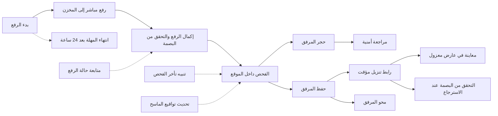
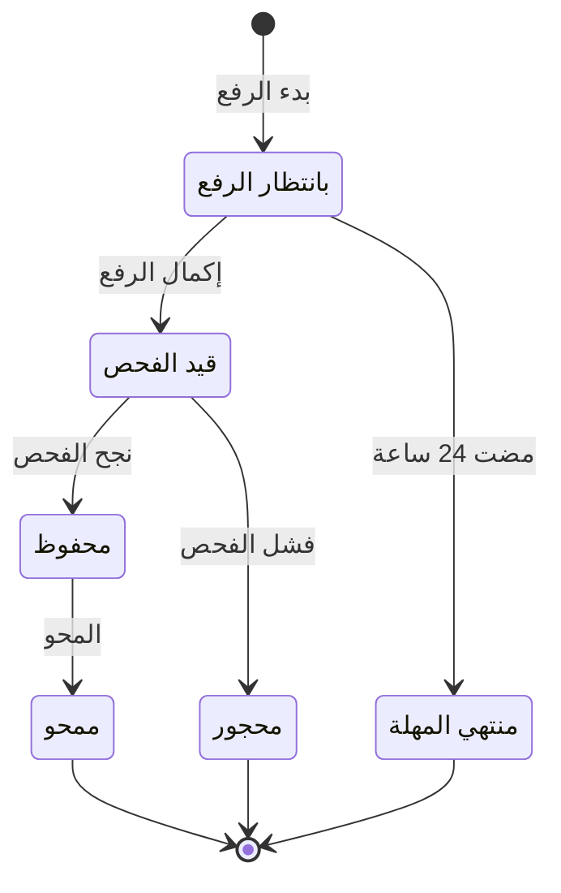

# رفع المرفقات وتنزيلها

<!-- BEGIN GENERATED: doc -->
| البند | القيمة |
|---|---|
| المعرّف | FEAT-COL-ATTACHMENTS |
| الإصدار | 0.1 |
| الحالة | مسودة |
| القدرة | CAP-02 جمع المعلومات |
| القدرة الفرعية | CAP-02.03 تسجيل الملاحظات (بما فيها دون اتصال) (R1) |
| الأدوار | أي مستخدم مخوَّل؛ النظام |
| الشاشات | SCR-22 الادعاء والدليل والمصدر، SCR-23 الملاحظات |
| حالات الاستخدام | UC-005، UC-006، UC-103 |
| القصص | 16: 7 من المواصفة، و9 جديدة |
<!-- END GENERATED: doc -->

## 1. نظرة عامة

### 1.1 القيمة

يتيح رفع الصور والمستندات والفيديو بأمان مع فحصها والتحقق من سلامتها وتنزيلها للمخولين فقط.

### 1.2 النطاق

| البند | القيمة |
|---|---|
| المستخدمون | أي مستخدم مخوَّل يرفع الملف ويطلب تنزيله، ومنه المستخدم الميداني على التطبيق الميداني والمحلل في شاشة الدليل؛ وأي مستخدم مخوَّل ينفّذ أمر محو؛ والنظام في الفحص وانتهاء المهلة؛ وفرق المنصة والتشغيل والأمن |
| الشاشات | الادعاء والدليل والمصدر: معاينة المرفق في عارض معزول؛ والملاحظات: إرفاق الملف ومتابعة رفعه وفحصه، في تطبيق الويب والتطبيق الميداني |
| حالات الاستخدام | تسجيل الملاحظة، وإدارة الأدلة، وتطبيق الاحتفاظ والتجميد القانوني |
| المتطلبات | تخزين المرفقات في مخزن الكائنات والإشارة إليها ببصمة محتواها (REQ-INF-003)؛ حساب البصمة عند التخزين والتحقق منها عند الاسترجاع (REQ-INF-004)؛ محو البيانات الشخصية محوًا لا يُسترجع مع بقاء وقائع التدقيق (REQ-GOV-008) |
| خارج النطاق | تسجيل الملاحظة نفسها وإرفاق الدليل بها (ميزة «تسجيل الملاحظات»)؛ تسجيل الدليل وعهدته (ميزة «الأدلة»)؛ المزامنة وتعارضاتها (ميزتا «المزامنة الميدانية» و«حل تعارضات المزامنة»)؛ طلب المحو بسنده القانوني والتجميد القانوني (قدرة الحوكمة والأمن والامتثال) |

### 1.3 خريطة الميزة

يبدأ المستخدم الرفع بإعلان الملف، ثم يرفعه مباشرة إلى المخزن ويكمل الرفع. فيُفحص الملف داخل الموقع، ويُحفظ أو يُحجر. والمحفوظ وحده يُعاين ويُنزَّل برابط مؤقت، ويُمحى بأمر محو. والشكل 1 يجمع القصص على هذا المسار، والشكل 2 يبيّن حالات المرفق.

**الشكل 1: خريطة ميزة رفع المرفقات وتنزيلها**



**الشكل 2: رحلة المرفق**



## 2. القواعد المشتركة

تنطبق على كل قصص الميزة، فلا تتكرر داخل القصص. وكل قصة تذكر ما يخصها فقط.

### 2.1 السياق المشترك

كل قصة تبدأ من ثلاثة شروط: مستأجر نشط، وحزمة السياسات الأساسية مفعّلة، ومستخدم مسجّل الدخول ومخوَّل. وتشير إليها القصص بخطوة واحدة: «بفرض السياق المشترك للميزة».

### 2.2 الصلاحية وعدم الإفصاح

- من لا يحق له رؤية العنصر يتلقى ردًا بشكل «غير متاح» تمامًا، فلا يعرف أنه موجود.
- من يرى العنصر ولا يحق له الإجراء يتلقى «لا تملك صلاحية هذا الإجراء».

### 2.3 أوامر تغيير الحالة

- **منع التكرار:** يُرسل كل أمر بمفتاح فريد، فإعادة الطلب نفسه لا تُنفَّذ مرتين.
- **حماية التعديل المتزامن:** يُرسل كل أمر بإصدار البيانات الذي يراه المستخدم. فإن عدّلها غيره في الأثناء، يُرفض الأمر.
- **السجل:** إن نجح الأمر، يُكتب حدثه وسجل التدقيق في المعاملة نفسها.

### 2.4 الرفض المشترك

```gherkin
# language: ar
خاصية: الرفض المشترك لأوامر الميزة

  سيناريو مخطط: رفض مشترك لكل أمر في الميزة
    بفرض السياق المشترك للميزة
    و <الحالة>
    عندما يُرسل المستخدم أي أمر من أوامر الميزة
    اذاً يُرفض برمز <الرمز> ويرى "<الرسالة>"
    و لا يتغير شيء

    امثلة:
      | الحالة                                  | الرمز                  | الرسالة                                                 |
      | العنصر خارج صلاحياته                    | NOT_FOUND              | غير متاح                                                |
      | العنصر مرئي له ولا يحق له الإجراء       | AUTHZ_DENIED           | لا تملك صلاحية هذا الإجراء                              |
      | غيره عدّل العنصر بعد أن فتحه            | VERSION_CONFLICT       | تغيّرت البيانات منذ فتحتها. راجع التغييرات ثم أعد المحاولة |
      | أعاد مفتاح منع التكرار بمحتوى مختلف     | IDEMPOTENCY_KEY_REUSED | طلب مكرر بمحتوى مختلف                                   |
      | البيانات ناقصة أو غير صحيحة             | VALIDATION_FAILED      | بعض البيانات ناقصة أو غير صحيحة. راجع الحقول المعلَّمة      |

  سيناريو: إعادة الطلب نفسه لا تُنفَّذ مرتين
    بفرض السياق المشترك للميزة
    و أمر نجح بمفتاح منع تكرار
    عندما يُعاد الطلب نفسه بالمفتاح نفسه
    اذاً تُعاد النتيجة الأولى ولا يُكتب حدث ثانٍ
```

### 2.5 حالات المرفق والرفع دون اتصال

- **الحالات:** يمر المرفق بثلاث حالات غير نهائية: «بانتظار الرفع»، و«قيد الفحص»، و«محفوظ». وينتهي في واحدة من ثلاث نهائية: «محجور»، أو «منتهي المهلة»، أو «ممحو» (الشكل 2). ولا يكون المرفق دليلًا أو جزءًا من ملاحظة إلا وهو «محفوظ».
- **دون اتصال:** بدء الرفع وإكماله يعملان دون اتصال على التطبيق الميداني (القصتان 5.3 و5.1). أما المحو وطلب التنزيل فيحتاجان اتصالًا.
  - يُحفظ الملف على الجهاز مشفرًا، ويأخذ المرفق معرّفًا يولّده الجهاز، فلا يُنشأ مرتين إن أُعيد الأمر.
  - عند الاتصال يُرفع أمر البدء، ثم الملف إلى هدف الرفع المباشر برفع قابل للاستئناف، ثم أمر الإكمال **[Derived]**.
  - الأمران إلحاقيان: يُطبَّقان عند المزامنة ولو تغيّر إصدار المرفق، ما دامت حالته تسمح. وإن رُفض أحدهما لشرط من شروطه يُفتح تعارض مزامنة بسبب الرفض.

## 3. الجودة وتعريف الاكتمال

### 3.1 متطلبات الجودة

<!-- BEGIN GENERATED: quality -->
لا متطلبات جودة مرتبطة بمتطلبات هذه الميزة مباشرة. تنطبق متطلبات المنصة العامة (`FEAT-PLT-*`).
<!-- END GENERATED: quality -->

### 3.2 تعريف الاكتمال

القصة مكتملة حين تتحقق الشروط الخمسة:

1. سيناريوهاتها والقواعد المشتركة تمر في الاختبار الآلي.
2. فحوص البنية المعمارية تمر.
3. نصوص الواجهة والرسائل موجودة بالعربية والإنجليزية.
4. مراجعة الكود مكتملة.
5. ما تضيفه القصة نفسها في قسم «القواعد» تحقق.

## 4. فهرس القصص

<!-- BEGIN GENERATED: story-index -->
| المعرّف | القصة | النوع | الحالة |
|---|---|---|---|
| `US-BC02-ATT-COMPLETE-UPLOAD` | إكمال رفع المرفق | أمر | مسودة |
| `US-BC02-ATT-ERASE` | محو المرفق | أمر | مسودة |
| `US-BC02-ATT-INITIATE-UPLOAD` | بدء رفع المرفق | أمر | مسودة |
| `US-BC02-Q-ATT-DOWNLOAD` | جلب: Short-lived signed download target (≤ 5 min); audited | جلب | مسودة |
| `US-BC02-S-ATTACHMENT-01` | تلقائي: scan passed (المرفق) | نظام | مسودة |
| `US-BC02-S-ATTACHMENT-02` | تلقائي: scan failed (المرفق) | نظام | مسودة |
| `US-BC02-S-ATTACHMENT-03` | تلقائي: upload window 24 h elapsed (المرفق) | نظام | مسودة |
| `US-UI-SCR22-SAFE-VIEWER` | معاينة المرفق في عارض معزول | واجهة | مسودة |
| `US-UI-SCR23-UPLOAD-STATE` | متابعة رفع المرفق وفحصه حتى إتاحته | واجهة | مسودة |
| `US-PLT-ATT-CONTENT-SCANNER` | فحص المرفقات محليًا قبل إتاحتها | منصة | مسودة |
| `US-PLT-ATT-DIRECT-UPLOAD` | رفع المرفقات مباشرة إلى مخزن الكائنات | منصة | مسودة |
| `US-PLT-ATT-INTEGRITY-CHECK` | التحقق من بصمة المرفق عند كل استرجاع | منصة | مسودة |
| `US-PLT-ATT-STORE-DEGRADED` | استمرار التسجيل عند تعطل مخزن الكائنات | منصة | مسودة |
| `US-OPS-ATT-QUARANTINE-REVIEW` | مراجعة أمنية لكل مرفق محجور | تشغيل | مسودة |
| `US-OPS-ATT-SCANNER-BACKLOG` | التنبيه عند تأخر فحص المرفقات | تشغيل | مسودة |
| `US-OPS-ATT-SCANNER-SIGNATURES` | تحديث تواقيع الماسح في بيئة معزولة | تشغيل | مسودة |
<!-- END GENERATED: story-index -->

## 5. القصص

### 5.1 US-BC02-ATT-COMPLETE-UPLOAD — إكمال رفع المرفق

| النوع | الإصدار | الأولوية | دون اتصال | الحالة |
|---|---|---|---|---|
| أمر | R1 | Must | نعم | مسودة |

> **كـ** أي مستخدم مخوَّل، **أريد** أن أُعلم النظام أن الملف وصل كاملًا إلى المخزن، **حتى** يُفحص ثم يصير صالحًا للاستعمال.

**باختصار:** بعد أن يُرفع الملف إلى هدف الرفع المباشر، يُكمل المستخدم الرفع. فيتحقق النظام من أن بصمة الملف المخزَّن وحجمه يطابقان ما أُعلن عند البدء، وينقل المرفق إلى «قيد الفحص».

#### القواعد

- **متى يُسمح:** المرفق «بانتظار الرفع»، وبصمة المحتوى المخزَّن تطابق البصمة المعلنة، والحجم يطابق الحجم المعلن.
- **من يُسمح له:** أي مستخدم في المستأجر نفسه يرى المرفق بتصريحه، وله صلاحية الكتابة في نطاقه على العنصر الذي يُرفق به الملف.
- **البيانات:** لا مدخلات.
- **الأثر:** يصبح المرفق «قيد الفحص»، ويُسجَّل حدث «اكتمل رفع المرفق». ويصل الحدث إلى ماسح المحتوى فيبدأ فحصه (القصتان 5.5 و5.6)، وإلى مسجّل الأدلة. ويعمل الأمر دون اتصال (§2.5).

#### معايير القبول

```gherkin
# language: ar
خاصية: إكمال رفع المرفق

  سيناريو: الملف المرفوع يطابق ما أُعلن
    بفرض السياق المشترك للميزة
    و مرفق في حالة "بانتظار الرفع" رُفع ملفه إلى هدف الرفع المباشر
    و بصمة الملف المخزَّن وحجمه يطابقان ما أُعلن عند البدء
    عندما يُكمل المستخدم الرفع
    اذاً تصبح حالة المرفق "قيد الفحص"
    و يُسجَّل حدث "اكتمل رفع المرفق"

  سيناريو مخطط: رفض خاص بإكمال رفع المرفق
    بفرض السياق المشترك للميزة
    و <الحالة>
    عندما يحاول المستخدم إكمال الرفع
    اذاً يُرفض برمز <الرمز> ويرى "<الرسالة>"
    و لا يتغير شيء

    امثلة:
      | الحالة | الرمز | الرسالة |
      | بصمة الملف المخزَّن لا تطابق البصمة المعلنة | HASH_MISMATCH | الملف المرفوع لا يطابق الملف المعلن. أعد الرفع |
      | حجم الملف المخزَّن لا يطابق الحجم المعلن | HASH_MISMATCH | الملف المرفوع لا يطابق الملف المعلن. أعد الرفع |
      | المرفق "قيد الفحص"، والإصدار المرسل هو الحالي | ATTACHMENT_INVALID_STATE_TRANSITION | الوضع الحالي للمرفق لا يسمح بهذا الإجراء |
```

<details><summary>المراجع التقنية والتتبع</summary>

<!-- BEGIN GENERATED: refs US-BC02-ATT-COMPLETE-UPLOAD -->
| البند | المعرّف | المعنى |
|---|---|---|
| الواجهة البرمجية | `POST /api/v1/information/attachments/{id}/actions/complete-upload` | دون اتصال: نعم |
| الأمر | `CMD-ATT-COMPLETE-UPLOAD` | إكمال رفع المرفق |
| السياسة | `POL-ATT-COMPLETE-UPLOAD` | user with write permission on the target object؛ tenant match; object visible to subject (label ≤ clearance);… |
| الحدث | `EVT-ATT-UPLOADED` | يصل إلى: Content scanner; Evidence registrar |
| الكيان | `AGG-ATTACHMENT` | المرفق |
| الجدول | `information.attachments` | الجدول الرئيسي للمرفق |
| وحدة النشر | DU-05 | — |
| المتطلبات | REQ-INF-003، REQ-INF-004 | معانيها في القسم 6. التتبع |
| حالات الاستخدام | UC-005، UC-006 | Register Observation؛ Manage Evidence |
| الاختبار | TST-ATTACHMENT-SM، TST-SLC02-INVARIANTS | دورة حالات المرفق، وثوابت الشريحة SLC-02 |
<!-- END GENERATED: refs US-BC02-ATT-COMPLETE-UPLOAD -->

</details>

### 5.2 US-BC02-ATT-ERASE — محو المرفق

| النوع | الإصدار | الأولوية | دون اتصال | الحالة |
|---|---|---|---|---|
| أمر | R1 | Must | لا | مسودة |

> **كـ** أي مستخدم مخوَّل ينفّذ أمر محو أو إتلاف، **أريد** أن أمحو مرفقًا محفوظًا، **حتى** يصير محتواه غير قابل للاسترجاع من أي مخزن أو نسخة احتياطية.

**باختصار:** بأمر محو أو قرار إتلاف، يُمحى المرفق «المحفوظ» بإتلاف مفتاح تشفيره، فيصير «ممحوًا». ويمنعه التجميد القانوني، ويحتاج تأكيد الهوية مرة أخرى.

#### القواعد

- **متى يُسمح:** المرفق «محفوظ»، ويوجد أمر محو أو قرار إتلاف بموجب الاحتفاظ، ولا تجميد قانوني على المرفق.
- **من يُسمح له:** أي مستخدم في المستأجر نفسه يرى المرفق بتصريحه، وله صلاحية الكتابة في نطاقه، بعد تأكيد هويته مرة أخرى. والأمر نفسه يصدر عن السلطة القانونية والامتثال **[Derived]**.
- **البيانات:** مرجع أمر المحو (إلزامي).
- **الأثر:** يُتلف مفتاح تشفير المرفق، فلا يُقرأ محتواه من المخازن ولا الإسقاطات ولا النسخ الاحتياطية ولا الأرشيف، وتبقى وقائع التدقيق (REQ-GOV-008). ويصبح المرفق «ممحوًا»، ويُسجَّل حدث «مُحي المرفق». والحدث أمني: يرفع الإصدار الأمني، ويُبطل قرارات الصلاحية المخزَّنة مؤقتًا، ويصل إلى ماسح المحتوى ومسجّل الأدلة.

> **ملاحظة:** المحو يخدم أيضًا قدرة الحوكمة في الخصوصية والمحو. وطلب المحو نفسه، بسنده القانوني، في ميزة تلك القدرة.

#### معايير القبول

```gherkin
# language: ar
خاصية: محو المرفق

  سيناريو: محو مرفق محفوظ بأمر محو
    بفرض السياق المشترك للميزة
    و مرفق في حالة "محفوظ" بلا تجميد قانوني
    و المستخدم أكّد هويته مرة أخرى
    عندما يمحو المرفق ويذكر مرجع أمر المحو
    اذاً يُتلف مفتاح تشفير المرفق فلا يُسترجع محتواه من أي مخزن أو نسخة احتياطية
    و تصبح حالة المرفق "ممحو"
    و يُسجَّل حدث "مُحي المرفق" وتبقى وقائع التدقيق

  سيناريو مخطط: رفض خاص بمحو المرفق
    بفرض السياق المشترك للميزة
    و <الحالة>
    عندما يحاول المستخدم محو المرفق
    اذاً يُرفض برمز <الرمز> ويرى "<الرسالة>"
    و لا يتغير شيء

    امثلة:
      | الحالة | الرمز | الرسالة |
      | لم يؤكد هويته مرة أخرى في هذه الجلسة | MFA_STEP_UP_REQUIRED | هذا الإجراء يحتاج تأكيد هويتك مرة أخرى |
      | على المرفق تجميد قانوني | LEGAL_HOLD_ACTIVE | يوجد تجميد قانوني يمنع هذا الإجراء |
      | لم يذكر مرجع أمر المحو | VALIDATION_FAILED | مرجع أمر المحو مطلوب |
      | المرفق "قيد الفحص"، والإصدار المرسل هو الحالي | ATTACHMENT_INVALID_STATE_TRANSITION | الوضع الحالي للمرفق لا يسمح بهذا الإجراء |
```

<details><summary>المراجع التقنية والتتبع</summary>

<!-- BEGIN GENERATED: refs US-BC02-ATT-ERASE -->
| البند | المعرّف | المعنى |
|---|---|---|
| الواجهة البرمجية | `POST /api/v1/information/attachments/{id}/actions/erase` | — |
| الأمر | `CMD-ATT-ERASE` | محو المرفق |
| السياسة | `POL-ATT-ERASE` | user with write permission on the target object؛ tenant match; object visible to subject (label ≤ clearance);… |
| الحدث | `EVT-ATT-ERASED` | يصل إلى: Security-version service (EVT-SEC-VERSION-INCREMENTED); PEP decision caches; Projection security-ver… |
| الكيان | `AGG-ATTACHMENT` | المرفق |
| الجدول | `information.attachments` | الجدول الرئيسي للمرفق |
| وحدة النشر | DU-05 | — |
| المتطلبات | REQ-INF-003، REQ-INF-004 | معانيها في القسم 6. التتبع |
| حالات الاستخدام | UC-005، UC-006 | Register Observation؛ Manage Evidence |
| الاختبار | TST-ATTACHMENT-SM، TST-SLC02-INVARIANTS | دورة حالات المرفق، وثوابت الشريحة SLC-02 |
<!-- END GENERATED: refs US-BC02-ATT-ERASE -->

</details>

### 5.3 US-BC02-ATT-INITIATE-UPLOAD — بدء رفع المرفق

| النوع | الإصدار | الأولوية | دون اتصال | الحالة |
|---|---|---|---|---|
| أمر | R1 | Must | نعم | مسودة |

> **كـ** أي مستخدم مخوَّل، **أريد** أن أبدأ رفع صورة أو مستند أو فيديو بإعلان بصمته وحجمه ونوعه، **حتى** أحصل على هدف رفع مباشر وأرفق الملف بملاحظة أو دليل.

**باختصار:** يعلن المستخدم بصمة الملف وحجمه ونوعه وتصنيفه، فيُنشأ مرفق «بانتظار الرفع» ويتلقى هدف رفع مباشرًا صالحًا 5 دقائق على الأكثر. وإن كان الملف نفسه محفوظًا من قبل في المستأجر، يُعاد المرفق الموجود.

#### القواعد

- **متى يُسمح:** الحجم المعلن لا يتجاوز حد المستأجر، ونوع الملف من الأنواع المسموحة.
- **من يُسمح له:** أي مستخدم في المستأجر نفسه له صلاحية الكتابة في نطاقه على العنصر الذي يُرفق به الملف، والتصنيف المعلن ضمن تصريحه.
- **البيانات:** بصمة المحتوى، وحجم الملف، ونوعه، وتصنيفه (إلزامية). واسم الملف، ومعرّف يولّده الجهاز (اختياريان).
- **الأثر:** يُنشأ المرفق «بانتظار الرفع»، ويُسجَّل حدث «بدأ رفع المرفق»، ويُعاد هدف رفع مباشر صالح 5 دقائق على الأكثر (القصة 5.11). فإن لم يكتمل الرفع خلال 24 ساعة انتهت مهلته (القصة 5.7). ويعمل الأمر دون اتصال (§2.5).
- **الملف المكرر:** إن كان مرفق بالبصمة نفسها «محفوظًا» في المستأجر، يُعاد هو ولا يُصدر هدف رفع.

> **ملاحظة:** البصمة لا تتكرر بين المرفقات غير النهائية في المستأجر. ولا يحدد المصدر ما يحدث إن بدأ رفع ملف له مرفق «بانتظار الرفع» أو «قيد الفحص» بالبصمة نفسها **[Needs Review]**.

#### معايير القبول

```gherkin
# language: ar
خاصية: بدء رفع المرفق

  سيناريو: بدء رفع ملف جديد
    بفرض السياق المشترك للميزة
    و ملف حجمه دون حد المستأجر ونوعه مسموح، ولا مرفق في المستأجر ببصمته
    عندما يبدأ المستخدم رفعه ويعلن بصمته وحجمه ونوعه وتصنيفه
    اذاً يُنشأ مرفق في حالة "بانتظار الرفع"
    و يتلقى هدف رفع مباشرًا صالحًا 5 دقائق على الأكثر
    و يُسجَّل حدث "بدأ رفع المرفق"

  سيناريو: الملف نفسه محفوظ من قبل
    بفرض السياق المشترك للميزة
    و مرفق "محفوظ" في المستأجر بالبصمة نفسها
    عندما يبدأ المستخدم رفع الملف
    اذاً يُعاد المرفق الموجود
    و لا يُصدر هدف رفع ولا يُنشأ مرفق جديد

  سيناريو مخطط: رفض خاص ببدء رفع المرفق
    بفرض السياق المشترك للميزة
    و <الحالة>
    عندما يحاول المستخدم بدء الرفع
    اذاً يُرفض برمز <الرمز> ويرى "<الرسالة>"
    و لا يتغير شيء

    امثلة:
      | الحالة | الرمز | الرسالة |
      | الحجم المعلن يتجاوز حد المستأجر | ATTACHMENT_REJECTED | لا يمكن قبول الملف: تحقق من حجمه ونوعه |
      | نوع الملف غير مسموح | ATTACHMENT_REJECTED | لا يمكن قبول الملف: تحقق من حجمه ونوعه |
      | لم يعلن تصنيف الملف | VALIDATION_FAILED | التصنيف مطلوب |
      | لم يعلن حجم الملف | VALIDATION_FAILED | حجم الملف مطلوب |
```

<details><summary>المراجع التقنية والتتبع</summary>

<!-- BEGIN GENERATED: refs US-BC02-ATT-INITIATE-UPLOAD -->
| البند | المعرّف | المعنى |
|---|---|---|
| الواجهة البرمجية | `POST /api/v1/information/attachments` | دون اتصال: نعم |
| الأمر | `CMD-ATT-INITIATE-UPLOAD` | بدء رفع المرفق |
| السياسة | `POL-ATT-INITIATE-UPLOAD` | user with write permission on the target object؛ tenant match; object visible to subject (label ≤ clearance);… |
| الحدث | `EVT-ATT-UPLOAD-INITIATED` | يصل إلى: Content scanner; Evidence registrar |
| الكيان | `AGG-ATTACHMENT` | المرفق |
| الجدول | `information.attachments` | الجدول الرئيسي للمرفق |
| وحدة النشر | DU-05 | — |
| المتطلبات | REQ-INF-003، REQ-INF-004 | معانيها في القسم 6. التتبع |
| حالات الاستخدام | UC-005، UC-006 | Register Observation؛ Manage Evidence |
| الاختبار | TST-ATTACHMENT-SM، TST-SLC02-INVARIANTS | دورة حالات المرفق، وثوابت الشريحة SLC-02 |
<!-- END GENERATED: refs US-BC02-ATT-INITIATE-UPLOAD -->

</details>

### 5.4 US-BC02-Q-ATT-DOWNLOAD — جلب: Short-lived signed download target (≤ 5 min); audited

| النوع | الإصدار | الأولوية | دون اتصال | الحالة |
|---|---|---|---|---|
| جلب | R1 | Must | لا | مسودة |

> **كـ** أي مستخدم مخوَّل، **أريد** رابط تنزيل مؤقتًا لمرفق دليل أو ملاحظة أراها، **حتى** أطّلع على الملف دون أن يبقى الرابط صالحًا لغيري.

**باختصار:** يطلب المستخدم تنزيل المرفق، فيُفحص حقه في كل طلب، ويتلقى رابطًا صالحًا 5 دقائق على الأكثر ومربوطًا به وبمستأجره. وكل رابط يُمنح يُسجَّل في سجل التدقيق.

#### القواعد

- **من يرى ماذا:** من يحق له رؤية الدليل أو الملاحظة التي يتبعها المرفق، ضمن نطاق وحدته وتصريحه. ومن لا يحق له يتلقى «غير متاح» كأن المرفق غير موجود.
- **البيانات:** المرفق المطلوب، وغرض الاطلاع.
- **النتيجة:** رابط تنزيل مباشر من المخزن، صالح 5 دقائق على الأكثر، ومربوط بالطالب ومستأجره. ويُفحص الحق في كل طلب، ويُسجَّل كل منح في سجل التدقيق. وتُتحقق بصمة الملف عند استرجاعه (القصة 5.12).

> **ملاحظة:** لا يُستعمل في دليل أو ملاحظة إلا المرفق «المحفوظ»، والملف غير متاح أثناء تعطل الماسح (§2.5). ولا يحدد المصدر رد طلب تنزيل مرفق ليس «محفوظًا» ولا رمز رفضه **[Needs Review]**.

#### معايير القبول

```gherkin
# language: ar
خاصية: رابط تنزيل مؤقت للمرفق

  سيناريو: مخوَّل يطلب تنزيل مرفق محفوظ
    بفرض السياق المشترك للميزة
    و مرفق "محفوظ" يتبع دليلًا ضمن نطاقه وتصريحه
    عندما يطلب تنزيل المرفق ويذكر غرض الاطلاع
    اذاً يتلقى رابط تنزيل صالحًا 5 دقائق على الأكثر ومربوطًا به وبمستأجره
    و يُسجَّل منح الرابط في سجل التدقيق

  سيناريو: الرابط لا يصلح بعد مدته
    بفرض السياق المشترك للميزة
    و رابط تنزيل مُنح له قبل أكثر من 5 دقائق
    عندما يستعمله
    اذاً لا يُنزَّل الملف
    و يلزمه طلب رابط جديد يُفحص فيه حقه من جديد

  سيناريو: الرابط لا يصلح لغير من طلبه
    بفرض السياق المشترك للميزة
    و رابط تنزيل مُنح لمستخدم آخر
    عندما يستعمله المستخدم
    اذاً لا يُنزَّل الملف
```

<details><summary>المراجع التقنية والتتبع</summary>

<!-- BEGIN GENERATED: refs US-BC02-Q-ATT-DOWNLOAD -->
| البند | المعرّف | المعنى |
|---|---|---|
| الواجهة البرمجية | `POST /api/v1/information/attachments/{attachment_id}/download-grants` | — |
| الاستعلام | `QRY-ATT-DOWNLOAD` | Short-lived signed download target (≤ 5 min); audited |
| السياسة | `POL-ATT-DOWNLOAD` | org scope ∩ classification rule; claims filtered by label |
| الكيان | `AGG-ATTACHMENT` | المرفق |
| الجدول | `information.attachments` | الجدول الرئيسي للمرفق |
| وحدة النشر | DU-05 | — |
| المتطلب | REQ-INF-004 | When an attachment is stored or retrieved, the system shall compute or verify its content hash. |
| حالة الاستخدام | UC-006 | Manage Evidence |
| الاختبار | TST-ATTACHMENT-SM، TST-SLC02-INVARIANTS | دورة حالات المرفق، وثوابت الشريحة SLC-02 |
<!-- END GENERATED: refs US-BC02-Q-ATT-DOWNLOAD -->

</details>

### 5.5 US-BC02-S-ATTACHMENT-01 — تلقائي: scan passed (المرفق)

| النوع | الإصدار | الأولوية | دون اتصال | الحالة |
|---|---|---|---|---|
| نظام | R1 | Must | لا ينطبق | مسودة |

> **كـ** النظام، **أريد** أن أحفظ المرفق حين ينجح فحصه، **حتى** يُستعمل في الأدلة والملاحظات ويُنزَّل.

**باختصار:** حين يجتاز الملف فحص البرمجيات الخبيثة والتحقق من صيغته، يصبح المرفق «محفوظًا».

#### القواعد

- **متى يحدث:** المرفق «قيد الفحص»، وأعاد ماسح المحتوى المحلي نتيجة ناجحة بعد فحص البرمجيات الخبيثة والتحقق من صيغة الملف (القصة 5.10).
- **الأثر:** يصبح المرفق «محفوظًا»، ويُسجَّل حدث «حُفظ المرفق» وسجل تدقيق بهوية النظام. ويصل الحدث إلى مسجّل الأدلة، فيصير المرفق صالحًا ليكون دليلًا أو جزءًا من ملاحظة.

#### معايير القبول

```gherkin
# language: ar
خاصية: حفظ المرفق بعد نجاح فحصه

  سيناريو: الفحص ينجح
    بفرض مرفق في حالة "قيد الفحص"
    عندما يعيد ماسح المحتوى نتيجة ناجحة للفحص والتحقق من الصيغة
    اذاً تصبح حالة المرفق "محفوظ"
    و يُسجَّل حدث "حُفظ المرفق" وسجل تدقيق بهوية النظام

  سيناريو: الماسح متوقف
    بفرض مرفق في حالة "قيد الفحص" والماسح متوقف
    عندما يمضي الوقت دون نتيجة فحص
    اذاً يبقى المرفق "قيد الفحص" ولا يُستعمل
    و يُستأنف فحصه تلقائيًا حين يعود الماسح
```

<details><summary>المراجع التقنية والتتبع</summary>

<!-- BEGIN GENERATED: refs US-BC02-S-ATTACHMENT-01 -->
| البند | المعرّف | المعنى |
|---|---|---|
| المحفِّز | `SYS:scan passed` | offline content scanner + format validation |
| الانتقال | SCANNING ← STORED | — |
| الحدث | `EVT-ATT-STORED` | يصل إلى: Content scanner; Evidence registrar |
| الكيان | `AGG-ATTACHMENT` | المرفق |
| الجدول | `information.attachments` | الجدول الرئيسي للمرفق |
| وحدة النشر | DU-05 | — |
| المتطلبات | REQ-INF-003، REQ-INF-004 | معانيها في القسم 6. التتبع |
| حالات الاستخدام | UC-005، UC-006 | Register Observation؛ Manage Evidence |
| الاختبار | TST-ATTACHMENT-SM، TST-SLC02-INVARIANTS | دورة حالات المرفق، وثوابت الشريحة SLC-02 |
<!-- END GENERATED: refs US-BC02-S-ATTACHMENT-01 -->

</details>

### 5.6 US-BC02-S-ATTACHMENT-02 — تلقائي: scan failed (المرفق)

| النوع | الإصدار | الأولوية | دون اتصال | الحالة |
|---|---|---|---|---|
| نظام | R1 | Must | لا ينطبق | مسودة |

> **كـ** النظام، **أريد** أن أحجر المرفق حين يفشل فحصه، **حتى** لا يصل ملف خبيث إلى أي مستخدم.

**باختصار:** حين يحكم الماسح بأن الملف خبيث أو أن صيغته غير صحيحة، يصبح المرفق «محجورًا» نهائيًا، ولا يُنزَّل ولا يُستعمل.

#### القواعد

- **متى يحدث:** المرفق «قيد الفحص»، وحكم الماسح بفشل الفحص: برمجية خبيثة، أو ملف بصيغتين، أو ملف يستغل ثغرة في قارئه.
- **الأثر:** يصبح المرفق «محجورًا»، وهي حالة نهائية. ويُسجَّل حدث «حُجر المرفق» وسجل تدقيق بهوية النظام. وكل حجر يستدعي مراجعة أمنية (القصة 5.14).

#### معايير القبول

```gherkin
# language: ar
خاصية: حجر المرفق عند فشل فحصه

  سيناريو: الفحص يفشل
    بفرض مرفق في حالة "قيد الفحص"
    عندما يحكم ماسح المحتوى بأن الملف خبيث
    اذاً تصبح حالة المرفق "محجور"
    و يُسجَّل حدث "حُجر المرفق" وسجل تدقيق بهوية النظام
    و لا يُمنح رابط تنزيل للملف

  سيناريو: نتيجة فحص تصل بعد الحفظ
    بفرض مرفق في حالة "محفوظ"
    عندما تصل نتيجة فحص فاشلة له
    اذاً يبقى المرفق "محفوظ" ولا يُسجَّل حدث
```

<details><summary>المراجع التقنية والتتبع</summary>

<!-- BEGIN GENERATED: refs US-BC02-S-ATTACHMENT-02 -->
| البند | المعرّف | المعنى |
|---|---|---|
| المحفِّز | `SYS:scan failed` | scanner verdict |
| الانتقال | SCANNING ← QUARANTINED | — |
| الحدث | `EVT-ATT-QUARANTINED` | يصل إلى: Content scanner; Evidence registrar |
| الكيان | `AGG-ATTACHMENT` | المرفق |
| الجدول | `information.attachments` | الجدول الرئيسي للمرفق |
| وحدة النشر | DU-05 | — |
| المتطلبات | REQ-INF-003، REQ-INF-004 | معانيها في القسم 6. التتبع |
| حالات الاستخدام | UC-005، UC-006 | Register Observation؛ Manage Evidence |
| الاختبار | TST-ATTACHMENT-SM، TST-SLC02-INVARIANTS | دورة حالات المرفق، وثوابت الشريحة SLC-02 |
<!-- END GENERATED: refs US-BC02-S-ATTACHMENT-02 -->

</details>

### 5.7 US-BC02-S-ATTACHMENT-03 — تلقائي: upload window 24 h elapsed (المرفق)

| النوع | الإصدار | الأولوية | دون اتصال | الحالة |
|---|---|---|---|---|
| نظام | R1 | Must | لا ينطبق | مسودة |

> **كـ** النظام، **أريد** أن أنهي المرفق الذي لم يكتمل رفعه خلال 24 ساعة، **حتى** لا تبقى مرفقات معلّقة بلا ملف.

**باختصار:** إذا بقي المرفق «بانتظار الرفع» 24 ساعة من بدء رفعه، يجعله المجدول «منتهي المهلة».

#### القواعد

- **متى يحدث:** مضت 24 ساعة على بدء الرفع (القصة 5.3)، والمرفق ما زال «بانتظار الرفع».
- **الأثر:** يصبح المرفق «منتهي المهلة»، وهي حالة نهائية. ويُسجَّل حدث «انتهت مهلة رفع المرفق» وسجل تدقيق بهوية النظام. ولإرفاق الملف يبدأ المستخدم رفعًا جديدًا **[Derived]**.

#### معايير القبول

```gherkin
# language: ar
خاصية: انتهاء مهلة رفع المرفق

  سيناريو: لم يكتمل الرفع خلال 24 ساعة
    بفرض مرفق في حالة "بانتظار الرفع" منذ 24 ساعة
    عندما يفحصه المجدول
    اذاً تصبح حالة المرفق "منتهي المهلة"
    و يُسجَّل حدث "انتهت مهلة رفع المرفق" وسجل تدقيق بهوية النظام

  سيناريو: اكتمل الرفع قبل المهلة
    بفرض مرفق بدأ رفعه قبل 24 ساعة وأصبح "قيد الفحص"
    عندما يفحصه المجدول
    اذاً يبقى المرفق "قيد الفحص" ولا يُسجَّل حدث
```

<details><summary>المراجع التقنية والتتبع</summary>

<!-- BEGIN GENERATED: refs US-BC02-S-ATTACHMENT-03 -->
| البند | المعرّف | المعنى |
|---|---|---|
| المحفِّز | `SYS:upload window 24 h elapsed` | scheduler |
| الانتقال | PENDING ← EXPIRED | — |
| الحدث | `EVT-ATT-EXPIRED` | يصل إلى: Content scanner; Evidence registrar |
| الكيان | `AGG-ATTACHMENT` | المرفق |
| الجدول | `information.attachments` | الجدول الرئيسي للمرفق |
| وحدة النشر | DU-05 | — |
| المتطلبات | REQ-INF-003، REQ-INF-004 | معانيها في القسم 6. التتبع |
| حالات الاستخدام | UC-005، UC-006 | Register Observation؛ Manage Evidence |
| الاختبار | TST-ATTACHMENT-SM، TST-SLC02-INVARIANTS | دورة حالات المرفق، وثوابت الشريحة SLC-02 |
<!-- END GENERATED: refs US-BC02-S-ATTACHMENT-03 -->

</details>

### 5.8 US-UI-SCR22-SAFE-VIEWER — معاينة المرفق في عارض معزول

| النوع | الإصدار | الأولوية | دون اتصال | الحالة |
|---|---|---|---|---|
| واجهة | R1 | Should | لا | مسودة |

> **كـ** المحلل، **أريد** أن أعاين مرفق الدليل داخل عارض معزول، **حتى** لا يضر ملف خبيث لم يكشفه الفحص بجهازي أو بالمنصة.

**باختصار:** في شاشة الادعاء والدليل والمصدر يُعرض المرفق «المحفوظ» في عارض معزول برابط تنزيل مؤقت يُطلب عند كل فتح. وما لم يُحفظ بعد يظهر بحالته دون معاينة.

#### القواعد

- يُعرض الملف في عارض معزول عن الصفحة وعن الجهاز، لأن الفحص لا يكشف كل ثغرة جديدة (الثغرات التي لم تُعرف بعد).
- يُطلب رابط تنزيل جديد عند كل فتح (القصة 5.4)، ولا يُحفظ الرابط ولا يُشارك. وإن انتهت مدته يُطلب غيره **[Derived]**.
- المرفق «قيد الفحص» يظهر بحالته دون معاينة، و«المحجور» يظهر بحالته ولا يُفتح أبدًا **[Derived]**.
- بيانات المرفق الوصفية تبقى ظاهرة حين لا يتاح الملف أثناء تعطل الماسح.
- التنزيل خارج العارض لا تحدده المصادر **[Needs Review]**.

#### معايير القبول

```gherkin
# language: ar
خاصية: معاينة المرفق في عارض معزول

  سيناريو: معاينة مرفق محفوظ
    بفرض السياق المشترك للميزة
    و دليل ضمن نطاقه له مرفق "محفوظ"
    عندما يفتح المحلل المرفق
    اذاً يُطلب رابط تنزيل جديد ويُعرض الملف في العارض المعزول

  سيناريو مخطط: مرفق لا يُعاين
    بفرض السياق المشترك للميزة
    و دليل ضمن نطاقه له مرفق في حالة "<الحالة>"
    عندما يفتح المحلل الدليل
    اذاً يظهر المرفق بحالته وبياناته الوصفية
    و لا يُطلب رابط تنزيل ولا يُعرض الملف

    امثلة:
      | الحالة |
      | قيد الفحص |
      | محجور |
```

<details><summary>المراجع التقنية والتتبع</summary>

<!-- BEGIN GENERATED: refs US-UI-SCR22-SAFE-VIEWER -->
| البند | المعرّف | المعنى |
|---|---|---|
| الشاشة | SCR-22 | شاشة الادعاء والدليل والمصدر |
| المصدر | `THR-S02-04` | — |
| المصدر | `THR-S02-05` | — |
| المصدر | `QRY-ATT-DOWNLOAD` | — |
<!-- END GENERATED: refs US-UI-SCR22-SAFE-VIEWER -->

</details>

### 5.9 US-UI-SCR23-UPLOAD-STATE — متابعة رفع المرفق وفحصه حتى إتاحته

| النوع | الإصدار | الأولوية | دون اتصال | الحالة |
|---|---|---|---|---|
| واجهة | R1 | Should | نعم | مسودة |

> **كـ** المستخدم الميداني، **أريد** أن أرى حالة كل ملف أرفقته بملاحظتي حتى يصير متاحًا، **حتى** أعرف ما وصل وما ينتظر وما رُفض.

**باختصار:** في شاشة الملاحظات يحمل كل مرفق شارة بحالته: لم يُرفع بعد، أو قيد الفحص، أو محفوظ، أو محجور، أو منتهي المهلة. وتُحفظ الملاحظة بنصها وموقعها ولو تأخر الملف.

#### القواعد

- شارة المرفق تتبع حالته (§2.5)، ويُضاف إليها على الجهاز «لم يُرفع بعد» ما دام الملف محفوظًا محليًا **[Derived]**.
- إن تعطل مخزن الكائنات تُسجَّل الملاحظة بنصها وموقعها، ويؤجَّل الملف ويعيد التطبيق رفعه تلقائيًا (القصة 5.13).
- «قيد الفحص» يعني أن الملف وصل ولا يُستعمل حتى يُحفظ. وإن تعطل الماسح يبقى في هذه الحالة حتى يُستأنف الفحص تلقائيًا.
- «المحجور» و«منتهي المهلة» نهائيان، فتعرض الشاشة بدء رفع جديد للملف المنتهي **[Derived]**.
- الحالة لا تعتمد على اللون وحده.

#### معايير القبول

```gherkin
# language: ar
خاصية: متابعة رفع المرفق وفحصه حتى إتاحته

  سيناريو: من الجهاز إلى الحفظ
    بفرض السياق المشترك للميزة
    و المستخدم سجّل ملاحظة بصورة والجهاز دون اتصال
    عندما يعود الاتصال ويُرفع الملف ثم ينجح فحصه
    اذاً تتغير شارة الصورة من "لم يُرفع بعد" إلى "قيد الفحص" ثم إلى "محفوظ"

  سيناريو: مخزن الكائنات معطل
    بفرض السياق المشترك للميزة
    و مخزن الكائنات غير متاح
    عندما يسجّل المستخدم ملاحظة بصورة
    اذاً تُحفظ الملاحظة بنصها وموقعها
    و تبقى الصورة "لم يُرفع بعد" ويُعاد رفعها تلقائيًا

  سيناريو: الملف محجور
    بفرض السياق المشترك للميزة
    و مرفق ملاحظته فشل فحصه
    عندما يفتح المستخدم الملاحظة
    اذاً يظهر المرفق بشارة "محجور" ولا يُفتح
```

<details><summary>المراجع التقنية والتتبع</summary>

<!-- BEGIN GENERATED: refs US-UI-SCR23-UPLOAD-STATE -->
| البند | المعرّف | المعنى |
|---|---|---|
| الشاشة | SCR-23 | شاشة الملاحظات |
| المصدر | `AGG-ATTACHMENT` | — |
| المصدر | `FM-S02-02` | — |
| المصدر | `degradation-slc02.md` | — |
<!-- END GENERATED: refs US-UI-SCR23-UPLOAD-STATE -->

</details>

### 5.10 US-PLT-ATT-CONTENT-SCANNER — فحص المرفقات محليًا قبل إتاحتها

| النوع | الإصدار | الأولوية | دون اتصال | الحالة |
|---|---|---|---|---|
| منصة | R1 | Should | لا ينطبق | مسودة |

> **كـ** فريق المنصة، **أريد** ماسح محتوى يعمل داخل الموقع دون أي شبكة خارجية، **حتى** لا يُتاح مرفق قبل فحصه، ولو كان الموقع معزولًا.

**باختصار:** كل ملف مكتمل الرفع يمر بفحص البرمجيات الخبيثة والتحقق من صيغته داخل الموقع، والنتيجة تحفظ المرفق أو تحجره.

#### القواعد

- الفحص قبل الإتاحة: فحص البرمجيات الخبيثة، والتحقق من أن صيغة الملف هي صيغته المعلنة، فيُكشف الملف بصيغتين.
- النتيجة الناجحة تحفظ المرفق (القصة 5.5)، والفاشلة تحجره (القصة 5.6).
- يعمل الماسح دون أي اعتماد على شبكة خارجية في التشغيل أو البناء (FIT-12)، وتصله تحديثاته في حزم موقّعة (القصة 5.16).
- مجموعة ماسحات لا ماسح واحد، ويُستأنف الفحص تلقائيًا بعد التعطل.

#### معايير القبول

```gherkin
# language: ar
خاصية: فحص المرفقات محليًا قبل إتاحتها

  سيناريو: ملف صيغته غير صيغته المعلنة
    بفرض مرفق "قيد الفحص" أُعلن صورةً وهو ملف بصيغة أخرى
    عندما يفحصه الماسح
    اذاً يفشل الفحص ويُحجر المرفق

  سيناريو: الفحص في شبكة معزولة
    بفرض موقع لا اتصال له بأي شبكة خارجية
    عندما يُفحص ملف مكتمل الرفع
    اذاً يكتمل الفحص دون أي طلب إلى شبكة خارجية
```

<details><summary>المراجع التقنية والتتبع</summary>

<!-- BEGIN GENERATED: refs US-PLT-ATT-CONTENT-SCANNER -->
| البند | المعرّف | المعنى |
|---|---|---|
| المصدر | `THR-S02-04` | — |
| المصدر | `FM-S02-02` | — |
| فحص البنية | FIT-12 | No external network dependency at runtime or build (air-gapped) |
| المصدر | `17-security-design.md §6.1` | — |
<!-- END GENERATED: refs US-PLT-ATT-CONTENT-SCANNER -->

</details>

### 5.11 US-PLT-ATT-DIRECT-UPLOAD — رفع المرفقات مباشرة إلى مخزن الكائنات

| النوع | الإصدار | الأولوية | دون اتصال | الحالة |
|---|---|---|---|---|
| منصة | R1 | Must | لا ينطبق | مسودة |

> **كـ** فريق المنصة، **أريد** أن تنتقل الملفات مباشرة بين العميل ومخزن الكائنات بأهداف موقّعة قصيرة العمر، **حتى** لا تمر بايتات الملفات بخوادم التطبيق ولا تُخزَّن في قاعدة البيانات.

**باختصار:** يُخزَّن كل مرفق في مخزن كائنات بواجهة قياسية، ويُشار إليه ببصمة محتواه. والرفع والتنزيل مباشران بأهداف موقّعة صالحة 5 دقائق على الأكثر.

#### القواعد

- بايتات الملف لا تمر بخوادم التطبيق أبدًا. والرفع والتنزيل بأهداف موقّعة صالحة 5 دقائق على الأكثر.
- لا يُخزَّن في قاعدة البيانات التشغيلية مرفق أكبر من 1 MB، والإشارة إليه ببصمة محتواه (REQ-INF-003).
- المخزن بواجهة متوافقة مع S3 (واجهة تخزين الكائنات الشائعة)، وتنفيذه Ceph في المواقع التي فيها Ceph، أو MinIO في الخلايا الأصغر.
- على التطبيق الميداني تُحفظ المرفقات مشفرة، وتُرفع بعد الاتصال برفع مباشر قابل للاستئناف (§2.5).

#### معايير القبول

```gherkin
# language: ar
خاصية: رفع المرفقات مباشرة إلى مخزن الكائنات

  سيناريو: الملف لا يمر بخادم التطبيق
    بفرض مرفق "بانتظار الرفع" بهدف رفع موقّع
    عندما يرفع العميل ملفًا أكبر من 1 MB
    اذاً تصل البايتات إلى مخزن الكائنات مباشرة
    و لا يُخزَّن الملف في قاعدة البيانات التشغيلية، بل بصمته ومرجعه

  سيناريو: رفع ميداني يُستأنف
    بفرض صورة محفوظة على الجهاز انقطع رفعها في منتصفه
    عندما يعود الاتصال
    اذاً يُستأنف الرفع من حيث توقف
```

<details><summary>المراجع التقنية والتتبع</summary>

<!-- BEGIN GENERATED: refs US-PLT-ATT-DIRECT-UPLOAD -->
| البند | المعرّف | المعنى |
|---|---|---|
| القرار التقني | TD-06 | S3-compatible API as the contract; default implementation Ceph RGW (sites with Ceph) or MinIO (smaller cells)… |
| المصدر | `field-sync-protocol.md §1` | — |
| المتطلب | REQ-INF-003 | The system shall store attachments (documents, images, video, raster) in object storage and reference them by… |
| حالات الاستخدام | UC-005، UC-006 | Register Observation؛ Manage Evidence |
<!-- END GENERATED: refs US-PLT-ATT-DIRECT-UPLOAD -->

</details>

### 5.12 US-PLT-ATT-INTEGRITY-CHECK — التحقق من بصمة المرفق عند كل استرجاع

| النوع | الإصدار | الأولوية | دون اتصال | الحالة |
|---|---|---|---|---|
| منصة | R1 | Must | لا ينطبق | مسودة |

> **كـ** فريق المنصة، **أريد** أن تُحسب بصمة المرفق عند تخزينه وتُتحقق عند كل استرجاع، **حتى** يُكشف أي تلف أو عبث بالملف المخزَّن.

**باختصار:** البصمة تُقارن بالمعلنة عند إكمال الرفع، وتُتحقق مرة أخرى عند كل استرجاع. والملف التالف يُبلَّغ عنه ويُسجَّل في سجل التدقيق.

#### القواعد

- عند التخزين تُقارن بصمة البايتات المخزَّنة بالبصمة المعلنة (القصة 5.1).
- عند كل استرجاع تُتحقق البصمة، والملف الذي تغيّر في المخزن يُكشف ويُبلَّغ عنه بخطأ سلامة، ويُسجَّل في سجل التدقيق (REQ-INF-004).
- رمز خطأ السلامة الذي يذكره المتطلب غير موجود في كتالوج الأخطاء، فلا رسالة له في المسرد **[Needs Review]**.

#### معايير القبول

```gherkin
# language: ar
خاصية: التحقق من بصمة المرفق عند كل استرجاع

  سيناريو: ملف سليم
    بفرض مرفق "محفوظ" لم تتغير بايتاته
    عندما يُستعمل رابط تنزيله
    اذاً تطابق البصمة ويُسلَّم الملف

  سيناريو: ملف تغيّر في المخزن
    بفرض مرفق "محفوظ" تغيّرت بايتاته في المخزن
    عندما يُستعمل رابط تنزيله
    اذاً يُكشف عدم تطابق البصمة ويُبلَّغ عن خطأ في سلامة الملف
    و يُسجَّل ذلك في سجل التدقيق
```

<details><summary>المراجع التقنية والتتبع</summary>

<!-- BEGIN GENERATED: refs US-PLT-ATT-INTEGRITY-CHECK -->
| البند | المعرّف | المعنى |
|---|---|---|
| المتطلب | REQ-INF-004 | When an attachment is stored or retrieved, the system shall compute or verify its content hash. |
| حالة الاستخدام | UC-006 | Manage Evidence |
<!-- END GENERATED: refs US-PLT-ATT-INTEGRITY-CHECK -->

</details>

### 5.13 US-PLT-ATT-STORE-DEGRADED — استمرار التسجيل عند تعطل مخزن الكائنات

| النوع | الإصدار | الأولوية | دون اتصال | الحالة |
|---|---|---|---|---|
| منصة | R1 | Should | لا ينطبق | مسودة |

> **كـ** فريق المنصة، **أريد** أن يستمر تسجيل الملاحظات حين يتعطل مخزن الكائنات أو خدمة المفاتيح، **حتى** لا يتوقف العمل كله بسبب الملفات.

**باختصار:** حين يتعطل مخزن الكائنات تُسجَّل الملاحظة بنصها وموقعها ويؤجَّل الملف. وحين تتعطل خدمة المفاتيح يستمر التنزيل بالمفاتيح المخزنة مؤقتًا حتى 10 دقائق.

#### القواعد

- مخزن الكائنات مكرَّر. فإن تعطل يفشل الرفع والتنزيل، ويستمر تسجيل نص الملاحظات والادعاءات وموقعها، ويظهر المرفق «غير متاح مؤقتًا».
- الملف المؤجَّل يعيد العميل رفعه، ولا تضيع بيانات.
- خدمة المفاتيح عالية الإتاحة. فإن تعطلت تُستعمل مفاتيح البيانات المخزنة مؤقتًا 10 دقائق على الأكثر، ثم يفشل التنزيل حتى تعود.
- إن تعطل الماسح تبقى بيانات المرفق الوصفية ظاهرة، والملف غير متاح.

#### معايير القبول

```gherkin
# language: ar
خاصية: استمرار التسجيل عند تعطل مخزن الكائنات

  سيناريو: مخزن الكائنات معطل
    بفرض مخزن الكائنات غير متاح
    عندما يسجّل مستخدم ميداني ملاحظة بصورة
    اذاً تُسجَّل الملاحظة بنصها وموقعها
    و تؤجَّل الصورة ويعيد العميل رفعها حين يعود المخزن

  سيناريو: خدمة المفاتيح معطلة
    بفرض خدمة المفاتيح غير متاحة منذ أكثر من 10 دقائق
    عندما يُطلب تنزيل مرفق
    اذاً يفشل التنزيل حتى تعود الخدمة
    و لا تضيع أي بيانات
```

<details><summary>المراجع التقنية والتتبع</summary>

<!-- BEGIN GENERATED: refs US-PLT-ATT-STORE-DEGRADED -->
| البند | المعرّف | المعنى |
|---|---|---|
| المصدر | `degradation-slc02.md` | — |
| المصدر | `FM-S02-01` | — |
| المصدر | `FM-S02-08` | — |
<!-- END GENERATED: refs US-PLT-ATT-STORE-DEGRADED -->

</details>

### 5.14 US-OPS-ATT-QUARANTINE-REVIEW — مراجعة أمنية لكل مرفق محجور

| النوع | الإصدار | الأولوية | دون اتصال | الحالة |
|---|---|---|---|---|
| تشغيل | R1 | Should | لا ينطبق | مسودة |

> **كـ** فريق الأمن، **أريد** تنبيهًا بكل مرفق يُحجر، **حتى** أراجع كل ملف خبيث وأتتبع مصدره.

**باختصار:** عداد المرفقات المحجورة ينبّه عند أي زيادة، وكل حجر يذهب إلى مراجعة أمنية.

#### القواعد

- أي زيادة في عدد المرفقات المحجورة تنبّه فريق الأمن للمراجعة.
- الحجر نهائي: المراجعة لا تعيد المرفق إلى الإتاحة، إذ لا أمر في المواصفة يخرجه من الحجر **[Derived]**.
- ما تشمله المراجعة وإجراءاتها لا تحدده المصادر **[Needs Review]**.

#### معايير القبول

```gherkin
# language: ar
خاصية: مراجعة أمنية لكل مرفق محجور

  سيناريو: حجر مرفق ينبّه فريق الأمن
    بفرض مرفق "قيد الفحص"
    عندما يفشل فحصه ويُحجر
    اذاً يزيد عداد المرفقات المحجورة
    و يصل تنبيه إلى فريق الأمن لمراجعته

  سيناريو: المرفق المحجور لا يُتاح بعد المراجعة
    بفرض مرفق "محجور" راجعه فريق الأمن
    عندما يطلب مستخدم تنزيله
    اذاً لا يُمنح رابط تنزيل
```

<details><summary>المراجع التقنية والتتبع</summary>

<!-- BEGIN GENERATED: refs US-OPS-ATT-QUARANTINE-REVIEW -->
| البند | المعرّف | المعنى |
|---|---|---|
| المصدر | `observability-slc02.md` | — |
| المصدر | `THR-S02-04` | — |
<!-- END GENERATED: refs US-OPS-ATT-QUARANTINE-REVIEW -->

</details>

### 5.15 US-OPS-ATT-SCANNER-BACKLOG — التنبيه عند تأخر فحص المرفقات

| النوع | الإصدار | الأولوية | دون اتصال | الحالة |
|---|---|---|---|---|
| تشغيل | R1 | Should | لا ينطبق | مسودة |

> **كـ** فريق التشغيل، **أريد** تنبيهًا حين يطول بقاء المرفقات قيد الفحص، **حتى** أعالج تعطل الماسح قبل أن يتأخر تسجيل الأدلة.

**باختصار:** يُقاس عمر أقدم مرفق «قيد الفحص»، وإن تجاوز 600 ثانية يصل تنبيه.

#### القواعد

- مقياس عمر المرفقات «قيد الفحص» ينبّه إذا تجاوز 600 ثانية (10 دقائق).
- تعطل الماسح يُبقي المرفقات «قيد الفحص» دون فقد بيانات، ويُستأنف الفحص تلقائيًا. والأثر على المستخدم تأخر فقط، وعلى تسجيل الأدلة.

#### معايير القبول

```gherkin
# language: ar
خاصية: التنبيه عند تأخر فحص المرفقات

  سيناريو: الفحص متأخر
    بفرض مرفق "قيد الفحص" منذ أكثر من 600 ثانية
    عندما يُقرأ مقياس عمر الفحص
    اذاً يصل تنبيه إلى فريق التشغيل

  سيناريو: العودة بعد التعطل
    بفرض الماسح عاد بعد تعطل وبقيت مرفقات "قيد الفحص"
    عندما يُستأنف الفحص تلقائيًا
    اذاً تُفحص المرفقات كلها دون إعادة رفعها
```

<details><summary>المراجع التقنية والتتبع</summary>

<!-- BEGIN GENERATED: refs US-OPS-ATT-SCANNER-BACKLOG -->
| البند | المعرّف | المعنى |
|---|---|---|
| المصدر | `observability-slc02.md` | — |
| المصدر | `FM-S02-02` | — |
<!-- END GENERATED: refs US-OPS-ATT-SCANNER-BACKLOG -->

</details>

### 5.16 US-OPS-ATT-SCANNER-SIGNATURES — تحديث تواقيع الماسح في بيئة معزولة

| النوع | الإصدار | الأولوية | دون اتصال | الحالة |
|---|---|---|---|---|
| تشغيل | R1 | Should | لا ينطبق | مسودة |

> **كـ** فريق التشغيل، **أريد** أن أحدّث تواقيع الماسح بحزمة موقّعة تُنقل إلى الموقع المعزول، **حتى** يكشف الماسح البرمجيات الخبيثة الجديدة دون اتصال بالإنترنت.

**باختصار:** تواقيع الماسح تصل في حزمة دون اتصال موقّعة، ويُتحقق من توقيعها قبل تثبيتها. والقصة **[Derived]**.

#### القواعد

- لا يجلب الماسح تحديثاته من شبكة خارجية (FIT-12).
- تصل التحديثات في حزم دون اتصال موقّعة، كما تصل صور المنصة كلها، ولا تُثبَّت حزمة لم يُتحقق من توقيعها **[Derived]**.
- كثافة التحديث ومن يعتمد الحزمة لا تحددهما المصادر **[Needs Review]**.

#### معايير القبول

```gherkin
# language: ar
خاصية: تحديث تواقيع الماسح في بيئة معزولة

  سيناريو: حزمة تواقيع موقّعة
    بفرض حزمة تواقيع جديدة موقّعة نُقلت إلى الموقع
    عندما يثبّتها فريق التشغيل
    اذاً يُتحقق من توقيعها ثم يستعمل الماسح التواقيع الجديدة

  سيناريو: حزمة غير موقّعة
    بفرض حزمة تواقيع لا يصح توقيعها
    عندما يحاول فريق التشغيل تثبيتها
    اذاً لا تُثبَّت ويبقى الماسح على تواقيعه السابقة
```

<details><summary>المراجع التقنية والتتبع</summary>

<!-- BEGIN GENERATED: refs US-OPS-ATT-SCANNER-SIGNATURES -->
| البند | المعرّف | المعنى |
|---|---|---|
| فحص البنية | FIT-12 | No external network dependency at runtime or build (air-gapped) |
| القرار التقني | TD-17 | Signed images (cosign) + SBOM (Syft); offline bundles with Zarf (air-gapped install/upgrade/rollback); GitOps… |
| المصدر | `THR-S02-04` | — |
| المصدر | `[Derived]` | — |
<!-- END GENERATED: refs US-OPS-ATT-SCANNER-SIGNATURES -->

</details>

## 6. التتبع

<!-- BEGIN GENERATED: trace -->
| المتطلب | المعنى | القصص | الاختبار |
|---|---|---|---|
| REQ-INF-003 | The system shall store attachments (documents, images, video, raster) in object storage and reference them by… | `US-BC02-ATT-COMPLETE-UPLOAD`، `US-BC02-ATT-ERASE`، `US-BC02-ATT-INITIATE-UPLOAD`، `US-BC02-S-ATTACHMENT-01`، `US-BC02-S-ATTACHMENT-02`، `US-BC02-S-ATTACHMENT-03`، `US-PLT-ATT-DIRECT-UPLOAD` | TST-ATTACHMENT-SM، TST-EVIDENCE-SM، TST-SLC02-INVARIANTS |
| REQ-INF-004 | When an attachment is stored or retrieved, the system shall compute or verify its content hash. | `US-BC02-ATT-COMPLETE-UPLOAD`، `US-BC02-ATT-ERASE`، `US-BC02-ATT-INITIATE-UPLOAD`، `US-BC02-Q-ATT-DOWNLOAD`، `US-BC02-S-ATTACHMENT-01`، `US-BC02-S-ATTACHMENT-02`، `US-BC02-S-ATTACHMENT-03`، `US-PLT-ATT-INTEGRITY-CHECK` | TST-ATTACHMENT-SM، TST-EVIDENCE-SM، TST-SLC02-INVARIANTS |
<!-- END GENERATED: trace -->

## 7. سجل التغييرات

| الإصدار | التاريخ | التغيير |
|---|---|---|
| 0.1 | — | هيكل مولَّد من خريطة الميزات |
| 0.2 | 2026-10-03 | كتابة القصص كاملة بمعيار القصص |
