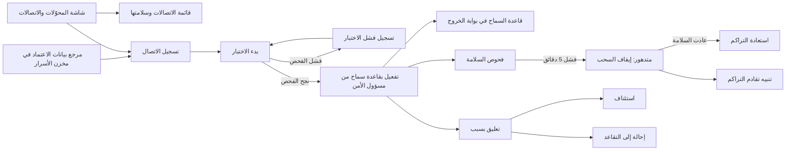
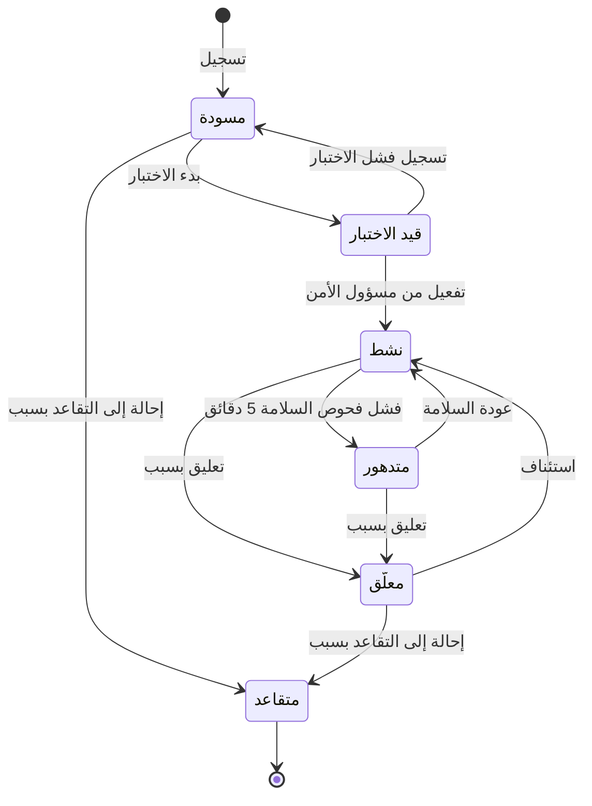

# اتصالات الأنظمة الخارجية

<!-- BEGIN GENERATED: doc -->
| البند | القيمة |
|---|---|
| المعرّف | FEAT-COL-CONNECTIONS |
| الإصدار | 0.1 |
| الحالة | مسودة |
| القدرة | CAP-02 جمع المعلومات |
| القدرة الفرعية | CAP-02.04 الاستيعاب والتكامل (R1) |
| الأدوار | مهندس التكامل؛ مسؤول الأمن؛ مسؤول الإدارة؛ النظام |
| الشاشات | SCR-65 المحوّلات والاتصالات والحساسات |
| حالات الاستخدام | UC-094 |
| القصص | 15: 10 من المواصفة، و5 جديدة |
<!-- END GENERATED: doc -->

## 1. نظرة عامة

### 1.1 القيمة

يتيح لمهندس التكامل تسجيل الاتصال بالأنظمة الخارجية واختباره ومراقبة سلامته مع اعتماد أمني قبل تشغيله.

### 1.2 النطاق

| البند | القيمة |
|---|---|
| المستخدمون | مهندس التكامل يسجّل الاتصال ويختبره ويسجّل فشل اختباره، ومسؤول الأمن غير طالب الاتصال يعتمد قاعدة السماح ويفعّله، ومسؤول الإدارة يعلّقه ويستأنفه ويحيله إلى التقاعد، والنظام يتابع سلامته، وفريقا التشغيل والأمن يتابعان التراكم وبوابة الخروج ومخزن الأسرار |
| الشاشات | SCR-65 المحوّلات والاتصالات والحساسات: قائمة الاتصالات بحالة كل منها وسلامته وقاعدة السماح الخاصة به |
| حالات الاستخدام | استيعاب البيانات الخارجية (UC-094) |
| المتطلبات | ربط أنظمة الموارد المؤسسية والموارد البشرية والوثائق بمحوّلات مسجّلة دون أن تصبح مستودعات للحقيقة (REQ-INT-001)، وبقاء البيانات داخل الولاية وخروج الشبكة بقائمة سماح فقط (REQ-GOV-005)، وانقطاع النظام الخارجي 4 ساعات بلا فقد (QAS-INT-001) |
| خارج النطاق | تسجيل المحوّل وربط حقوله (ميزة «إدارة محوّلات البيانات»)، ومعالجة دفعات الاستيراد والحجر (ميزة «استيراد البيانات والحجر»)، وتدفقات الحساسات (ميزة «تدفقات الحساسات»)، وأنماط كل نظام مؤسسي ومقترحات الموارد البشرية (ميزة «التكامل مع أنظمة المؤسسة»)، وإنشاء حساب الخدمة (ميزة «حسابات الخدمة للأنظمة») |

### 1.3 خريطة الميزة

**الشكل 1: خريطة ميزة اتصالات الأنظمة الخارجية**



يمر الاتصال بست حالات (الشكل 2). ولا يمر عبره شيء إلا وهو «نشط» بقاعدة سماح معتمدة.

**الشكل 2: رحلة اتصال التكامل**



## 2. القواعد المشتركة

تنطبق على كل قصص الميزة، فلا تتكرر داخل القصص. وكل قصة تذكر ما يخصها فقط.

### 2.1 السياق المشترك

كل قصة تبدأ من ثلاثة شروط: مستأجر نشط، وحزمة السياسات الأساسية مفعّلة، ومستخدم مسجّل الدخول ومخوَّل. وتشير إليها القصص بخطوة واحدة: «بفرض السياق المشترك للميزة».

### 2.2 الصلاحية وعدم الإفصاح

- من لا يحق له رؤية العنصر يتلقى ردًا بشكل «غير متاح» تمامًا، فلا يعرف أنه موجود.
- من يرى العنصر ولا يحق له الإجراء يتلقى «لا تملك صلاحية هذا الإجراء».

### 2.3 أوامر تغيير الحالة

- **منع التكرار:** يُرسل كل أمر بمفتاح فريد، فإعادة الطلب نفسه لا تُنفَّذ مرتين.
- **حماية التعديل المتزامن:** يُرسل كل أمر بإصدار البيانات الذي يراه المستخدم. فإن عدّلها غيره في الأثناء، يُرفض الأمر.
- **السجل:** إن نجح الأمر، يُكتب حدثه وسجل التدقيق في المعاملة نفسها.

### 2.4 الرفض المشترك

```gherkin
# language: ar
خاصية: الرفض المشترك لأوامر الميزة

  سيناريو مخطط: رفض مشترك لكل أمر في الميزة
    بفرض السياق المشترك للميزة
    و <الحالة>
    عندما يُرسل المستخدم أي أمر من أوامر الميزة
    اذاً يُرفض برمز <الرمز> ويرى "<الرسالة>"
    و لا يتغير شيء

    امثلة:
      | الحالة                                  | الرمز                  | الرسالة                                                 |
      | العنصر خارج صلاحياته                    | NOT_FOUND              | غير متاح                                                |
      | العنصر مرئي له ولا يحق له الإجراء       | AUTHZ_DENIED           | لا تملك صلاحية هذا الإجراء                              |
      | غيره عدّل العنصر بعد أن فتحه            | VERSION_CONFLICT       | تغيّرت البيانات منذ فتحتها. راجع التغييرات ثم أعد المحاولة |
      | أعاد مفتاح منع التكرار بمحتوى مختلف     | IDEMPOTENCY_KEY_REUSED | طلب مكرر بمحتوى مختلف                                   |
      | البيانات ناقصة أو غير صحيحة             | VALIDATION_FAILED      | بعض البيانات ناقصة أو غير صحيحة. راجع الحقول المعلَّمة      |

  سيناريو: إعادة الطلب نفسه لا تُنفَّذ مرتين
    بفرض السياق المشترك للميزة
    و أمر نجح بمفتاح منع تكرار
    عندما يُعاد الطلب نفسه بالمفتاح نفسه
    اذاً تُعاد النتيجة الأولى ولا يُكتب حدث ثانٍ
```

### 2.5 قواعد الاتصال المشتركة

- **ترتيب الفحص:** يُفحص الإصدار قبل الحالة. فإن غيّر غيره حالة الاتصال بعد أن فتحه المستخدم، يدويًا أو بتحوّل تلقائي إلى «متدهور» أو عودة منه، فالرفض تعارض الإصدار (القسم 2.4). ورفض الحالة في كل قصة يعني أن الإصدار مطابق والحالة لا تسمح بالإجراء.
- **الاتصال المتقاعد:** «متقاعد» حالة نهائية، يُرفض عليها كل أمر.

```gherkin
# language: ar
خاصية: رفض كل أمر على اتصال متقاعد

  سيناريو مخطط: لا يُقبل أي أمر على اتصال متقاعد
    بفرض السياق المشترك للميزة
    و اتصال في حالة "متقاعد" وإصداره مطابق لما يراه المستخدم
    عندما يحاول المستخدم <الإجراء>
    اذاً يُرفض برمز <الرمز> ويرى "<الرسالة>"
    و لا يتغير شيء

    امثلة:
      | الإجراء | الرمز | الرسالة |
      | بدء الاختبار | INTEGRATION_CONNECTION_INVALID_STATE_TRANSITION | الوضع الحالي لاتصال التكامل لا يسمح بهذا الإجراء |
      | تسجيل فشل الاختبار | INTEGRATION_CONNECTION_INVALID_STATE_TRANSITION | الوضع الحالي لاتصال التكامل لا يسمح بهذا الإجراء |
      | التفعيل | INTEGRATION_CONNECTION_INVALID_STATE_TRANSITION | الوضع الحالي لاتصال التكامل لا يسمح بهذا الإجراء |
      | التعليق | INTEGRATION_CONNECTION_INVALID_STATE_TRANSITION | الوضع الحالي لاتصال التكامل لا يسمح بهذا الإجراء |
      | الاستئناف | INTEGRATION_CONNECTION_INVALID_STATE_TRANSITION | الوضع الحالي لاتصال التكامل لا يسمح بهذا الإجراء |
      | الإحالة إلى التقاعد | INTEGRATION_CONNECTION_INVALID_STATE_TRANSITION | الوضع الحالي لاتصال التكامل لا يسمح بهذا الإجراء |
```

## 3. الجودة وتعريف الاكتمال

### 3.1 متطلبات الجودة

<!-- BEGIN GENERATED: quality -->
| المرجع | الموقف | المطلوب |
|---|---|---|
| QAS-INT-001 | ERP adapter outage 4 h | no data loss; backlog processed ≤ 1 h after recovery |
<!-- END GENERATED: quality -->

### 3.2 تعريف الاكتمال

القصة مكتملة حين تتحقق الشروط الخمسة:

1. سيناريوهاتها والقواعد المشتركة تمر في الاختبار الآلي.
2. فحوص البنية المعمارية تمر.
3. نصوص الواجهة والرسائل موجودة بالعربية والإنجليزية.
4. مراجعة الكود مكتملة.
5. ما تضيفه القصة نفسها في قسم «القواعد» تحقق.

## 4. فهرس القصص

<!-- BEGIN GENERATED: story-index -->
| المعرّف | القصة | النوع | الحالة |
|---|---|---|---|
| `US-BC07-CON-ACTIVATE` | تفعيل اتصال التكامل | أمر | مسودة |
| `US-BC07-CON-FAIL-TEST` | تسجيل فشل اختبار اتصال التكامل | أمر | مسودة |
| `US-BC07-CON-REGISTER` | تسجيل اتصال التكامل | أمر | مسودة |
| `US-BC07-CON-RESUME` | استئناف اتصال التكامل | أمر | مسودة |
| `US-BC07-CON-RETIRE` | إحالة اتصال التكامل إلى التقاعد | أمر | مسودة |
| `US-BC07-CON-SUSPEND` | تعليق اتصال التكامل | أمر | مسودة |
| `US-BC07-CON-TEST` | اختبار اتصال التكامل | أمر | مسودة |
| `US-BC07-Q-CON-LIST` | جلب: Connections with state, health, allow-list entry | جلب | مسودة |
| `US-BC07-S-INTEGRATION-CONNECTION-01` | تلقائي: health checks failing 5 min (اتصال التكامل) | نظام | مسودة |
| `US-BC07-S-INTEGRATION-CONNECTION-02` | تلقائي: health restored (اتصال التكامل) | نظام | مسودة |
| `US-UI-SCR65-CONNECTION-HEALTH` | متابعة سلامة الاتصالات وتراكمها | واجهة | مسودة |
| `US-INT-CONN-BACKLOG-REPLAY` | استعادة التراكم بلا فقد بعد انقطاع النظام | تكامل | مسودة |
| `US-OPS-CONN-BACKLOG-ALERT` | التنبيه عند تقادم تراكم الاتصال | تشغيل | مسودة |
| `US-OPS-CONN-EGRESS-RULE` | تطبيق قاعدة السماح لكل اتصال في بوابة الخروج | تشغيل | مسودة |
| `US-OPS-CONN-SECRETS` | حفظ بيانات اعتماد الاتصالات في الخزنة فقط | تشغيل | مسودة |
<!-- END GENERATED: story-index -->

## 5. القصص

### 5.1 US-BC07-CON-ACTIVATE — تفعيل اتصال التكامل

| النوع | الإصدار | الأولوية | دون اتصال | الحالة |
|---|---|---|---|---|
| أمر | R1 | Must | لا | مسودة |

> **كـ** مسؤول الأمن، **أريد** أن أعتمد قاعدة السماح لاتصال نجح فحصه وأفعّله، **حتى** لا يُفتح مسار شبكة إلى نظام خارجي إلا بمراجعة شخص غير طالبه.

**باختصار:** الاتصال «قيد الاختبار» الذي نجح فحصه يصبح «نشطًا» حين يعتمد مسؤول الأمن قاعدة السماح الخاصة به. ولا يجوز أن يكون هو طالب الاتصال.

#### القواعد

- **متى يُسمح:** الاتصال «قيد الاختبار»، ونجح فحص الاتصال والمخطط (القصة 5.7).
- **من يُسمح له:** مسؤول الأمن في المستأجر نفسه، وليس من طلب الاتصال (فصل المهام). ويؤكد هويته مرة أخرى بالمصادقة المعززة قبل التنفيذ.
- **البيانات:** قاعدة السماح للاتصال (إلزامية). وهي القاعدة الوحيدة التي تفتح له المسار في بوابة الخروج أو الدخول (القصة 5.14).
- **الأثر:** يصبح الاتصال «نشطًا» بقاعدة سماح واحدة معتمدة، ويُسجَّل حدث «فُعِّل الاتصال». والحدث يؤثر أمنيًا: يرفع إصدار الأمان فتُبطَل قرارات الصلاحية المخزنة مؤقتًا. ويصل أيضًا إلى بوابة الخروج والمحوّلات وتنبيهات التشغيل.

> **ملاحظة:** شرط نجاح الفحص عند التفعيل لا يذكر له المصدر رمز رفض، ولا أمرًا يسجّل نجاح الفحص **[Needs Review]**.

#### معايير القبول

```gherkin
# language: ar
خاصية: تفعيل اتصال التكامل

  سيناريو: مسؤول الأمن يفعّل اتصالًا نجح فحصه
    بفرض السياق المشترك للميزة
    و اتصال في حالة "قيد الاختبار" طلبه مهندس تكامل، ونجح فحصه
    و مسؤول الأمن أكّد هويته بالمصادقة المعززة
    عندما يفعّل مسؤول الأمن الاتصال بقاعدة سماح
    اذاً تصبح حالة الاتصال "نشط"
    و تُحفظ قاعدة السماح معتمدةً باسم مسؤول الأمن
    و يُسجَّل حدث "فُعِّل الاتصال"

  سيناريو مخطط: رفض خاص بتفعيل الاتصال
    بفرض السياق المشترك للميزة
    و <الحالة>
    عندما يحاول مسؤول الأمن تفعيل الاتصال
    اذاً يُرفض برمز <الرمز> ويرى "<الرسالة>"
    و لا يتغير شيء

    امثلة:
      | الحالة | الرمز | الرسالة |
      | مسؤول الأمن نفسه طلب الاتصال | SEGREGATION_OF_DUTIES | لا يجوز أن يعتمد الشخص نفسه ما قدّمه أو طلبه |
      | لم يؤكد هويته بالمصادقة المعززة | MFA_STEP_UP_REQUIRED | هذا الإجراء يحتاج تأكيد هويتك مرة أخرى |
      | قاعدة السماح غير مرفقة | VALIDATION_FAILED | قاعدة السماح مطلوبة |
      | الاتصال "مسودة" | INTEGRATION_CONNECTION_INVALID_STATE_TRANSITION | الوضع الحالي لاتصال التكامل لا يسمح بهذا الإجراء |
      | الاتصال "معلّق" | INTEGRATION_CONNECTION_INVALID_STATE_TRANSITION | الوضع الحالي لاتصال التكامل لا يسمح بهذا الإجراء |
```

<details><summary>المراجع التقنية والتتبع</summary>

<!-- BEGIN GENERATED: refs US-BC07-CON-ACTIVATE -->
| البند | المعرّف | المعنى |
|---|---|---|
| الواجهة البرمجية | `POST /api/v1/integration/connections/{id}/actions/activate` | — |
| الأمر | `CMD-CON-ACTIVATE` | تفعيل اتصال التكامل |
| السياسة | `POL-CON-ACTIVATE` | integration engineer (register, test) · Security Officer ≠ requester (activate) · Administrator (suspend, res… |
| الحدث | `EVT-CON-ACTIVATED` | يصل إلى: Security-version service (EVT-SEC-VERSION-INCREMENTED); PEP decision caches; Projection security-ver… |
| الكيان | `AGG-INTEGRATION-CONNECTION` | اتصال التكامل |
| الجدول | `integration.integration_connections` | الجدول الرئيسي لاتصال التكامل |
| وحدة النشر | DU-11 | — |
| المتطلب | REQ-INT-001 | The system shall integrate ERP, HRIS and DMS through registered adapters that map external records to claims,… |
| حالة الاستخدام | UC-094 | Ingest External Data |
| الاختبار | TST-INTEGRATION-CONNECTION-SM، TST-SLC16-INVARIANTS | دورة حالات اتصال التكامل، وثوابت الشريحة SLC-16 |
<!-- END GENERATED: refs US-BC07-CON-ACTIVATE -->

</details>

### 5.2 US-BC07-CON-FAIL-TEST — تسجيل فشل اختبار الاتصال

| النوع | الإصدار | الأولوية | دون اتصال | الحالة |
|---|---|---|---|---|
| أمر | R1 | Must | لا | مسودة |

> **كـ** مهندس التكامل، **أريد** أن أسجّل فشل فحص الاتصال بأخطائه، **حتى** يعود الاتصال إلى المسودة فأصلح إعداده وأعيد اختباره.

**باختصار:** إذا فشل فحص الاتصال والمخطط، يسجّل مهندس التكامل الأخطاء، فيعود الاتصال من «قيد الاختبار» إلى «مسودة». ولا يُفعَّل اتصال فشل فحصه.

#### القواعد

- **متى يُسمح:** الاتصال «قيد الاختبار»، وفشل فحصه.
- **من يُسمح له:** مهندس التكامل في المستأجر نفسه.
- **البيانات:** أخطاء الفحص، قائمة إلزامية.
- **الأثر:** يعود الاتصال إلى «مسودة» وتُحفظ معه أخطاء الفحص، ويُسجَّل حدث «فشل اختبار الاتصال». ويصل إلى بوابة الخروج والمحوّلات وتنبيهات التشغيل. ويمكن بعدها بدء اختبار جديد (القصة 5.7).

#### معايير القبول

```gherkin
# language: ar
خاصية: تسجيل فشل اختبار الاتصال

  سيناريو: مهندس التكامل يسجّل فشل الفحص
    بفرض السياق المشترك للميزة
    و اتصال في حالة "قيد الاختبار" فشل فحص مخططه
    عندما يسجّل مهندس التكامل فشل الاختبار مع أخطاء الفحص
    اذاً تصبح حالة الاتصال "مسودة"
    و تُحفظ أخطاء الفحص مع الاتصال
    و يُسجَّل حدث "فشل اختبار الاتصال"

  سيناريو مخطط: رفض خاص بتسجيل فشل الاختبار
    بفرض السياق المشترك للميزة
    و <الحالة>
    عندما يحاول مهندس التكامل تسجيل فشل الاختبار
    اذاً يُرفض برمز <الرمز> ويرى "<الرسالة>"
    و لا يتغير شيء

    امثلة:
      | الحالة | الرمز | الرسالة |
      | أخطاء الفحص غير مرفقة | VALIDATION_FAILED | أخطاء الفحص مطلوبة |
      | الاتصال "مسودة" | INTEGRATION_CONNECTION_INVALID_STATE_TRANSITION | الوضع الحالي لاتصال التكامل لا يسمح بهذا الإجراء |
      | الاتصال "نشط" | INTEGRATION_CONNECTION_INVALID_STATE_TRANSITION | الوضع الحالي لاتصال التكامل لا يسمح بهذا الإجراء |
```

<details><summary>المراجع التقنية والتتبع</summary>

<!-- BEGIN GENERATED: refs US-BC07-CON-FAIL-TEST -->
| البند | المعرّف | المعنى |
|---|---|---|
| الواجهة البرمجية | `POST /api/v1/integration/connections/{id}/actions/fail-test` | — |
| الأمر | `CMD-CON-FAIL-TEST` | تسجيل فشل اختبار اتصال التكامل |
| السياسة | `POL-CON-FAIL-TEST` | integration engineer (register, test) · Security Officer ≠ requester (activate) · Administrator (suspend, res… |
| الحدث | `EVT-CON-TEST-FAILED` | يصل إلى: Egress gateway (allow-list); Adapters (bind/unbind); Operations alerting |
| الكيان | `AGG-INTEGRATION-CONNECTION` | اتصال التكامل |
| الجدول | `integration.integration_connections` | الجدول الرئيسي لاتصال التكامل |
| وحدة النشر | DU-11 | — |
| المتطلب | REQ-INT-001 | The system shall integrate ERP, HRIS and DMS through registered adapters that map external records to claims,… |
| حالة الاستخدام | UC-094 | Ingest External Data |
| الاختبار | TST-INTEGRATION-CONNECTION-SM، TST-SLC16-INVARIANTS | دورة حالات اتصال التكامل، وثوابت الشريحة SLC-16 |
<!-- END GENERATED: refs US-BC07-CON-FAIL-TEST -->

</details>

### 5.3 US-BC07-CON-REGISTER — تسجيل اتصال التكامل

| النوع | الإصدار | الأولوية | دون اتصال | الحالة |
|---|---|---|---|---|
| أمر | R1 | Must | لا | مسودة |

> **كـ** مهندس التكامل، **أريد** أن أسجّل اتصالًا بنظام خارجي داخل شبكة المؤسسة بنوعه وعنوانه وبروتوكوله واتجاهه، **حتى** يُعرف كل مسار للبيانات إلى المنصة قبل أن يُختبر ويُعتمد.

**باختصار:** يُنشأ الاتصال في «مسودة» لنظام من الأنواع المعتمدة، وعنوانه على شبكة داخلية، وبيانات اعتماده مرجعٌ في مخزن الأسرار. ولا يمر عبره شيء حتى يُختبر ويُفعَّل.

#### القواعد

- **متى يُسمح:** نوع النظام واحد من ستة: نظام الموارد المؤسسية، ونظام الموارد البشرية، ونظام إدارة الوثائق، ونظام إدارة الصيانة، وبوابة الحساسات، ونقطة رسائل التنبيه العامة (CAP). والعنوان على شبكة داخلية. والاتجاه وارد أو صادر، والصادر لنقطة رسائل التنبيه العامة وحدها في R2، فالأنظمة الخارجية مصادر لا تكتب فيها المنصة.
- **من يُسمح له:** مهندس التكامل في المستأجر نفسه.
- **البيانات:** الاسم، ونوع النظام، والعنوان، والبروتوكول، والاتجاه، ومرجع بيانات الاعتماد في مخزن الأسرار. وكلها إلزامية، ولا تُرسل بيانات الاعتماد نفسها (القصة 5.15).
- **الأثر:** اتصال جديد في «مسودة»، ويُسجَّل حدث «سُجِّل الاتصال». ويصل إلى بوابة الخروج والمحوّلات وتنبيهات التشغيل.

#### معايير القبول

```gherkin
# language: ar
خاصية: تسجيل اتصال التكامل

  سيناريو: تسجيل اتصال وارد بنظام الموارد المؤسسية
    بفرض السياق المشترك للميزة
    و بيانات اعتماد نظام الموارد المؤسسية محفوظة في مخزن الأسرار
    عندما يسجّل مهندس التكامل اتصالًا واردًا باسم ونوع النظام وعنوان داخلي وبروتوكول ومرجع بيانات الاعتماد
    اذاً يُنشأ الاتصال في حالة "مسودة"
    و يحفظ الاتصال مرجع بيانات الاعتماد وحده
    و يُسجَّل حدث "سُجِّل الاتصال"

  سيناريو مخطط: رفض خاص بتسجيل الاتصال
    بفرض السياق المشترك للميزة
    و <الحالة>
    عندما يحاول مهندس التكامل تسجيل الاتصال
    اذاً يُرفض برمز <الرمز> ويرى "<الرسالة>"
    و لا يتغير شيء

    امثلة:
      | الحالة | الرمز | الرسالة |
      | نوع النظام ليس من الأنواع الستة | CONNECTION_INVALID | إعداد الاتصال غير صحيح |
      | العنوان خارج الشبكة الداخلية | CONNECTION_INVALID | إعداد الاتصال غير صحيح |
      | الاتجاه "صادر" لنظام غير نقطة رسائل التنبيه العامة | CONNECTION_INVALID | إعداد الاتصال غير صحيح |
      | مرجع بيانات الاعتماد لا يشير إلى مخزن الأسرار | CONNECTION_INVALID | إعداد الاتصال غير صحيح |
      | الاسم فارغ | VALIDATION_FAILED | الاسم مطلوب |
      | مرجع بيانات الاعتماد فارغ | VALIDATION_FAILED | مرجع بيانات الاعتماد مطلوب |
```

<details><summary>المراجع التقنية والتتبع</summary>

<!-- BEGIN GENERATED: refs US-BC07-CON-REGISTER -->
| البند | المعرّف | المعنى |
|---|---|---|
| الواجهة البرمجية | `POST /api/v1/integration/connections` | — |
| الأمر | `CMD-CON-REGISTER` | تسجيل اتصال التكامل |
| السياسة | `POL-CON-REGISTER` | integration engineer (register, test) · Security Officer ≠ requester (activate) · Administrator (suspend, res… |
| الحدث | `EVT-CON-REGISTERED` | يصل إلى: Egress gateway (allow-list); Adapters (bind/unbind); Operations alerting |
| الكيان | `AGG-INTEGRATION-CONNECTION` | اتصال التكامل |
| الجدول | `integration.integration_connections` | الجدول الرئيسي لاتصال التكامل |
| وحدة النشر | DU-11 | — |
| المتطلب | REQ-INT-001 | The system shall integrate ERP, HRIS and DMS through registered adapters that map external records to claims,… |
| حالة الاستخدام | UC-094 | Ingest External Data |
| الاختبار | TST-INTEGRATION-CONNECTION-SM، TST-SLC16-INVARIANTS | دورة حالات اتصال التكامل، وثوابت الشريحة SLC-16 |
<!-- END GENERATED: refs US-BC07-CON-REGISTER -->

</details>

### 5.4 US-BC07-CON-RESUME — استئناف اتصال التكامل

| النوع | الإصدار | الأولوية | دون اتصال | الحالة |
|---|---|---|---|---|
| أمر | R1 | Must | لا | مسودة |

> **كـ** مسؤول الإدارة، **أريد** أن أستأنف اتصالًا معلّقًا بعد زوال سبب تعليقه، **حتى** تعود بياناته إلى الدخول عبر قاعدة السماح نفسها بعد إعادة فحصها.

**باختصار:** الاتصال «المعلّق» يعود «نشطًا»، وتُفعَّل قاعدة السماح الخاصة به في بوابة الخروج من جديد بعد إعادة فحصها.

#### القواعد

- **متى يُسمح:** الاتصال «معلّق».
- **من يُسمح له:** مسؤول الإدارة في المستأجر نفسه.
- **الأثر:** يصبح الاتصال «نشطًا»، وتُفعَّل قاعدة السماح من جديد بعد إعادة فحصها، ويُسجَّل حدث «استُؤنف الاتصال». ويصل إلى بوابة الخروج والمحوّلات وتنبيهات التشغيل، فتعود المحوّلات إلى السحب من آخر نقطة مؤكدة **[Derived]**.

> **ملاحظة:** المصدر لا يحدد من يعيد فحص قاعدة السماح عند الاستئناف، ولا رمز رفض إن لم تنجح إعادة الفحص. والاستئناف لا يطلب اعتمادًا جديدًا من مسؤول الأمن، فتبقى القاعدة المعتمدة عند التفعيل **[Needs Review]**.

#### معايير القبول

```gherkin
# language: ar
خاصية: استئناف اتصال التكامل

  سيناريو: مسؤول الإدارة يستأنف اتصالًا معلّقًا
    بفرض السياق المشترك للميزة
    و اتصال في حالة "معلّق" قاعدة السماح الخاصة به معطّلة
    عندما يستأنف مسؤول الإدارة الاتصال
    اذاً تُفعَّل قاعدة السماح في بوابة الخروج بعد إعادة فحصها
    و تصبح حالة الاتصال "نشط"
    و يُسجَّل حدث "استُؤنف الاتصال"

  سيناريو مخطط: رفض خاص باستئناف الاتصال
    بفرض السياق المشترك للميزة
    و <الحالة>
    عندما يحاول مسؤول الإدارة استئناف الاتصال
    اذاً يُرفض برمز <الرمز> ويرى "<الرسالة>"
    و لا يتغير شيء

    امثلة:
      | الحالة | الرمز | الرسالة |
      | الاتصال "نشط" | INTEGRATION_CONNECTION_INVALID_STATE_TRANSITION | الوضع الحالي لاتصال التكامل لا يسمح بهذا الإجراء |
      | الاتصال "متدهور" | INTEGRATION_CONNECTION_INVALID_STATE_TRANSITION | الوضع الحالي لاتصال التكامل لا يسمح بهذا الإجراء |
      | الاتصال "قيد الاختبار" | INTEGRATION_CONNECTION_INVALID_STATE_TRANSITION | الوضع الحالي لاتصال التكامل لا يسمح بهذا الإجراء |
```

<details><summary>المراجع التقنية والتتبع</summary>

<!-- BEGIN GENERATED: refs US-BC07-CON-RESUME -->
| البند | المعرّف | المعنى |
|---|---|---|
| الواجهة البرمجية | `POST /api/v1/integration/connections/{id}/actions/resume` | — |
| الأمر | `CMD-CON-RESUME` | استئناف اتصال التكامل |
| السياسة | `POL-CON-RESUME` | integration engineer (register, test) · Security Officer ≠ requester (activate) · Administrator (suspend, res… |
| الحدث | `EVT-CON-RESUMED` | يصل إلى: Egress gateway (allow-list); Adapters (bind/unbind); Operations alerting |
| الكيان | `AGG-INTEGRATION-CONNECTION` | اتصال التكامل |
| الجدول | `integration.integration_connections` | الجدول الرئيسي لاتصال التكامل |
| وحدة النشر | DU-11 | — |
| المتطلب | REQ-INT-001 | The system shall integrate ERP, HRIS and DMS through registered adapters that map external records to claims,… |
| حالة الاستخدام | UC-094 | Ingest External Data |
| الاختبار | TST-INTEGRATION-CONNECTION-SM، TST-SLC16-INVARIANTS | دورة حالات اتصال التكامل، وثوابت الشريحة SLC-16 |
<!-- END GENERATED: refs US-BC07-CON-RESUME -->

</details>

### 5.5 US-BC07-CON-RETIRE — إحالة اتصال التكامل إلى التقاعد

| النوع | الإصدار | الأولوية | دون اتصال | الحالة |
|---|---|---|---|---|
| أمر | R1 | Must | لا | مسودة |

> **كـ** مسؤول الإدارة، **أريد** أن أحيل إلى التقاعد اتصالًا لم يعد مطلوبًا، **حتى** يُغلق مساره في الشبكة نهائيًا ويبقى سجله.

**باختصار:** الاتصال في «مسودة» أو «معلّق» يصبح «متقاعدًا» بسبب مذكور، إذا لم يرتبط به محوّل أو تدفق حساسات نشط. و«متقاعد» حالة نهائية.

#### القواعد

- **متى يُسمح:** الاتصال «مسودة» أو «معلّق»، ولا يرتبط به محوّل نشط ولا تدفق حساسات نشط. والاتصال النشط أو المتدهور يُعلَّق أولًا (القصة 5.6).
- **من يُسمح له:** مسؤول الإدارة في المستأجر نفسه.
- **البيانات:** السبب (إلزامي).
- **الأثر:** يصبح الاتصال «متقاعدًا»، ولا يُقبل عليه بعدها أي أمر (القسم 2.5). وتُزال قاعدة السماح الخاصة به من بوابة الخروج **[Derived]**، ويُسجَّل حدث «أُحيل الاتصال إلى التقاعد». ويصل إلى بوابة الخروج والمحوّلات وتنبيهات التشغيل.

> **ملاحظة:** المصدر يذكر إزالة قاعدة الشبكة بين شروط هذا الأمر، ولا يوضح أهي شرط يسبقه أم أثر له، ولا يذكر لها رمزًا غير «الاتصال مستخدم». فالقصة تعدّها أثرًا **[Needs Review]**.

#### معايير القبول

```gherkin
# language: ar
خاصية: إحالة اتصال التكامل إلى التقاعد

  سيناريو: إحالة اتصال معلّق لا يرتبط به شيء نشط
    بفرض السياق المشترك للميزة
    و اتصال في حالة "معلّق" لا يرتبط به محوّل ولا تدفق حساسات نشط
    عندما يحيله مسؤول الإدارة إلى التقاعد مع ذكر السبب
    اذاً تصبح حالة الاتصال "متقاعد"
    و تُزال قاعدة السماح الخاصة به من بوابة الخروج
    و يُسجَّل حدث "أُحيل الاتصال إلى التقاعد"

  سيناريو مخطط: رفض خاص بالإحالة إلى التقاعد
    بفرض السياق المشترك للميزة
    و <الحالة>
    عندما يحاول مسؤول الإدارة إحالة الاتصال إلى التقاعد
    اذاً يُرفض برمز <الرمز> ويرى "<الرسالة>"
    و لا يتغير شيء

    امثلة:
      | الحالة | الرمز | الرسالة |
      | يرتبط بالاتصال محوّل نشط | CONNECTION_IN_USE | الاتصال مستخدم في محوّل أو تدفق نشط |
      | يرتبط بالاتصال تدفق حساسات نشط | CONNECTION_IN_USE | الاتصال مستخدم في محوّل أو تدفق نشط |
      | السبب فارغ | VALIDATION_FAILED | السبب مطلوب |
      | الاتصال "نشط" | INTEGRATION_CONNECTION_INVALID_STATE_TRANSITION | الوضع الحالي لاتصال التكامل لا يسمح بهذا الإجراء |
      | الاتصال "قيد الاختبار" | INTEGRATION_CONNECTION_INVALID_STATE_TRANSITION | الوضع الحالي لاتصال التكامل لا يسمح بهذا الإجراء |
```

<details><summary>المراجع التقنية والتتبع</summary>

<!-- BEGIN GENERATED: refs US-BC07-CON-RETIRE -->
| البند | المعرّف | المعنى |
|---|---|---|
| الواجهة البرمجية | `POST /api/v1/integration/connections/{id}/actions/retire` | — |
| الأمر | `CMD-CON-RETIRE` | إحالة اتصال التكامل إلى التقاعد |
| السياسة | `POL-CON-RETIRE` | integration engineer (register, test) · Security Officer ≠ requester (activate) · Administrator (suspend, res… |
| الحدث | `EVT-CON-RETIRED` | يصل إلى: Egress gateway (allow-list); Adapters (bind/unbind); Operations alerting |
| الكيان | `AGG-INTEGRATION-CONNECTION` | اتصال التكامل |
| الجدول | `integration.integration_connections` | الجدول الرئيسي لاتصال التكامل |
| وحدة النشر | DU-11 | — |
| المتطلب | REQ-INT-001 | The system shall integrate ERP, HRIS and DMS through registered adapters that map external records to claims,… |
| حالة الاستخدام | UC-094 | Ingest External Data |
| الاختبار | TST-INTEGRATION-CONNECTION-SM، TST-SLC16-INVARIANTS | دورة حالات اتصال التكامل، وثوابت الشريحة SLC-16 |
<!-- END GENERATED: refs US-BC07-CON-RETIRE -->

</details>

### 5.6 US-BC07-CON-SUSPEND — تعليق اتصال التكامل

| النوع | الإصدار | الأولوية | دون اتصال | الحالة |
|---|---|---|---|---|
| أمر | R1 | Must | لا | مسودة |

> **كـ** مسؤول الإدارة، **أريد** أن أعلّق اتصالًا نشطًا أو متدهورًا بسبب مذكور، **حتى** يُغلق مساره في الشبكة فورًا حين يلزم إيقافه.

**باختصار:** الاتصال «النشط» أو «المتدهور» يصبح «معلّقًا»، وتُعطَّل قاعدة السماح الخاصة به في بوابة الخروج فورًا.

#### القواعد

- **متى يُسمح:** الاتصال «نشط» أو «متدهور».
- **من يُسمح له:** مسؤول الإدارة في المستأجر نفسه.
- **البيانات:** السبب (إلزامي).
- **الأثر:** يصبح الاتصال «معلّقًا»، وتُعطَّل قاعدة السماح فورًا، ويُسجَّل حدث «عُلِّق الاتصال». والحدث يؤثر أمنيًا: يرفع إصدار الأمان فتُبطَل قرارات الصلاحية المخزنة مؤقتًا. ويصل أيضًا إلى بوابة الخروج والمحوّلات وتنبيهات التشغيل.

#### معايير القبول

```gherkin
# language: ar
خاصية: تعليق اتصال التكامل

  سيناريو: مسؤول الإدارة يعلّق اتصالًا نشطًا
    بفرض السياق المشترك للميزة
    و اتصال في حالة "نشط" له قاعدة سماح مفعّلة
    عندما يعلّقه مسؤول الإدارة مع ذكر السبب
    اذاً تصبح حالة الاتصال "معلّق"
    و تُعطَّل قاعدة السماح الخاصة به في بوابة الخروج فورًا
    و يُسجَّل حدث "عُلِّق الاتصال"

  سيناريو مخطط: رفض خاص بتعليق الاتصال
    بفرض السياق المشترك للميزة
    و <الحالة>
    عندما يحاول مسؤول الإدارة تعليق الاتصال
    اذاً يُرفض برمز <الرمز> ويرى "<الرسالة>"
    و لا يتغير شيء

    امثلة:
      | الحالة | الرمز | الرسالة |
      | السبب فارغ | REASON_REQUIRED | اذكر السبب |
      | الاتصال "مسودة" | INTEGRATION_CONNECTION_INVALID_STATE_TRANSITION | الوضع الحالي لاتصال التكامل لا يسمح بهذا الإجراء |
      | الاتصال "قيد الاختبار" | INTEGRATION_CONNECTION_INVALID_STATE_TRANSITION | الوضع الحالي لاتصال التكامل لا يسمح بهذا الإجراء |
      | الاتصال "معلّق" من قبل | INTEGRATION_CONNECTION_INVALID_STATE_TRANSITION | الوضع الحالي لاتصال التكامل لا يسمح بهذا الإجراء |
```

<details><summary>المراجع التقنية والتتبع</summary>

<!-- BEGIN GENERATED: refs US-BC07-CON-SUSPEND -->
| البند | المعرّف | المعنى |
|---|---|---|
| الواجهة البرمجية | `POST /api/v1/integration/connections/{id}/actions/suspend` | — |
| الأمر | `CMD-CON-SUSPEND` | تعليق اتصال التكامل |
| السياسة | `POL-CON-SUSPEND` | integration engineer (register, test) · Security Officer ≠ requester (activate) · Administrator (suspend, res… |
| الحدث | `EVT-CON-SUSPENDED` | يصل إلى: Security-version service (EVT-SEC-VERSION-INCREMENTED); PEP decision caches; Projection security-ver… |
| الكيان | `AGG-INTEGRATION-CONNECTION` | اتصال التكامل |
| الجدول | `integration.integration_connections` | الجدول الرئيسي لاتصال التكامل |
| وحدة النشر | DU-11 | — |
| المتطلب | REQ-INT-001 | The system shall integrate ERP, HRIS and DMS through registered adapters that map external records to claims,… |
| حالة الاستخدام | UC-094 | Ingest External Data |
| الاختبار | TST-INTEGRATION-CONNECTION-SM، TST-SLC16-INVARIANTS | دورة حالات اتصال التكامل، وثوابت الشريحة SLC-16 |
<!-- END GENERATED: refs US-BC07-CON-SUSPEND -->

</details>

### 5.7 US-BC07-CON-TEST — بدء اختبار اتصال التكامل

| النوع | الإصدار | الأولوية | دون اتصال | الحالة |
|---|---|---|---|---|
| أمر | R1 | Must | لا | مسودة |

> **كـ** مهندس التكامل، **أريد** أن أبدأ اختبار اتصال في المسودة، **حتى** يُفحص الوصول إلى النظام الخارجي ومخطط بياناته قبل التفعيل.

**باختصار:** الاتصال في «مسودة» يصبح «قيد الاختبار»، ويُشغَّل فحص الاتصال والمخطط. ثم يفعّله مسؤول الأمن إن نجح الفحص (القصة 5.1)، أو يسجّل مهندس التكامل فشله (القصة 5.2).

#### القواعد

- **متى يُسمح:** الاتصال «مسودة».
- **من يُسمح له:** مهندس التكامل في المستأجر نفسه.
- **الأثر:** يصبح الاتصال «قيد الاختبار»، ويُشغَّل فحص الوصول إلى النظام الخارجي وفحص مخطط بياناته، ويُسجَّل حدث «بدأ اختبار الاتصال». ويصل إلى بوابة الخروج والمحوّلات وتنبيهات التشغيل.

#### معايير القبول

```gherkin
# language: ar
خاصية: بدء اختبار اتصال التكامل

  سيناريو: مهندس التكامل يبدأ اختبار اتصال في المسودة
    بفرض السياق المشترك للميزة
    و اتصال في حالة "مسودة"
    عندما يبدأ مهندس التكامل اختبار الاتصال
    اذاً تصبح حالة الاتصال "قيد الاختبار"
    و يُشغَّل فحص الوصول إلى النظام الخارجي وفحص مخطط بياناته
    و يُسجَّل حدث "بدأ اختبار الاتصال"

  سيناريو مخطط: رفض خاص ببدء الاختبار
    بفرض السياق المشترك للميزة
    و <الحالة>
    عندما يحاول مهندس التكامل بدء اختبار الاتصال
    اذاً يُرفض برمز <الرمز> ويرى "<الرسالة>"
    و لا يتغير شيء

    امثلة:
      | الحالة | الرمز | الرسالة |
      | الاتصال "قيد الاختبار" من قبل | INTEGRATION_CONNECTION_INVALID_STATE_TRANSITION | الوضع الحالي لاتصال التكامل لا يسمح بهذا الإجراء |
      | الاتصال "نشط" | INTEGRATION_CONNECTION_INVALID_STATE_TRANSITION | الوضع الحالي لاتصال التكامل لا يسمح بهذا الإجراء |
      | الاتصال "معلّق" | INTEGRATION_CONNECTION_INVALID_STATE_TRANSITION | الوضع الحالي لاتصال التكامل لا يسمح بهذا الإجراء |
```

<details><summary>المراجع التقنية والتتبع</summary>

<!-- BEGIN GENERATED: refs US-BC07-CON-TEST -->
| البند | المعرّف | المعنى |
|---|---|---|
| الواجهة البرمجية | `POST /api/v1/integration/connections/{id}/actions/test` | — |
| الأمر | `CMD-CON-TEST` | اختبار اتصال التكامل |
| السياسة | `POL-CON-TEST` | integration engineer (register, test) · Security Officer ≠ requester (activate) · Administrator (suspend, res… |
| الحدث | `EVT-CON-TEST-STARTED` | يصل إلى: Egress gateway (allow-list); Adapters (bind/unbind); Operations alerting |
| الكيان | `AGG-INTEGRATION-CONNECTION` | اتصال التكامل |
| الجدول | `integration.integration_connections` | الجدول الرئيسي لاتصال التكامل |
| وحدة النشر | DU-11 | — |
| المتطلب | REQ-INT-001 | The system shall integrate ERP, HRIS and DMS through registered adapters that map external records to claims,… |
| حالة الاستخدام | UC-094 | Ingest External Data |
| الاختبار | TST-INTEGRATION-CONNECTION-SM، TST-SLC16-INVARIANTS | دورة حالات اتصال التكامل، وثوابت الشريحة SLC-16 |
<!-- END GENERATED: refs US-BC07-CON-TEST -->

</details>

### 5.8 US-BC07-Q-CON-LIST — عرض الاتصالات بحالتها وسلامتها وقاعدة السماح

| النوع | الإصدار | الأولوية | دون اتصال | الحالة |
|---|---|---|---|---|
| جلب | R1 | Must | لا | مسودة |

> **كـ** مهندس التكامل، **أريد** قائمة بالاتصالات وحالة كل منها وسلامته وقاعدة السماح الخاصة به، **حتى** أعرف أي مسارات البيانات تعمل وأيها يحتاج تدخلًا.

**باختصار:** تُعاد الاتصالات التي يحق للمستخدم رؤيتها، صفحةً بعد صفحة، بحالتها الحالية وسلامتها وقاعدة السماح الخاصة بها.

#### القواعد

- **من يرى ماذا:** مهندسو التكامل ومسؤول الأمن في المستأجر نفسه. ومن عداهم يتلقى ردًا بشكل غير الموجود نفسه.
- **المرشحات:** المؤشر والحد فقط.
- **ما يُعاد لكل اتصال:** حالته الحالية، وسلامته، وقاعدة السماح الخاصة به.
- **الترقيم:** بالمؤشر، ولا يكشف أي عدد أو ترقيم اتصالًا محجوبًا.

> **ملاحظة:** مسؤول الإدارة يعلّق الاتصال ويستأنفه ويحيله إلى التقاعد، وشاشة المحوّلات والاتصالات تذكره بين مستخدميها، لكن سياسة هذا العرض تقصره على مهندسي التكامل ومسؤول الأمن **[Needs Review]**.

#### معايير القبول

```gherkin
# language: ar
خاصية: عرض الاتصالات بحالتها وسلامتها وقاعدة السماح

  سيناريو: مهندس التكامل يرى الاتصالات بحالتها
    بفرض السياق المشترك للميزة
    و في المستأجر اتصال "نشط" وآخر "متدهور" وثالث "معلّق"
    عندما يطلب مهندس التكامل قائمة الاتصالات
    اذاً تُعاد الاتصالات الثلاثة، ولكل منها حالته وسلامته وقاعدة السماح الخاصة به

  سيناريو: الصفحة التالية
    بفرض السياق المشترك للميزة
    و الاتصالات أكثر من صفحة
    عندما يطلب مسؤول الأمن الصفحة التالية بالمؤشر
    اذاً تُعاد الاتصالات التالية دون تكرار ولا فجوة

  سيناريو: دور غير مخوَّل بالعرض
    بفرض السياق المشترك للميزة
    و مستخدم ليس مهندس تكامل ولا مسؤول أمن
    عندما يطلب قائمة الاتصالات
    اذاً يتلقى ردًا بشكل غير الموجود نفسه
```

<details><summary>المراجع التقنية والتتبع</summary>

<!-- BEGIN GENERATED: refs US-BC07-Q-CON-LIST -->
| البند | المعرّف | المعنى |
|---|---|---|
| الواجهة البرمجية | `GET /api/v1/integration/connections` | — |
| الاستعلام | `QRY-CON-LIST` | Connections with state, health, allow-list entry |
| السياسة | `POL-CON-LIST` | integration engineers, Security Officer |
| الكيان | `AGG-INTEGRATION-CONNECTION` | اتصال التكامل |
| الجدول | `integration.integration_connections` | الجدول الرئيسي لاتصال التكامل |
| وحدة النشر | DU-11 | — |
| المتطلب | REQ-INT-001 | The system shall integrate ERP, HRIS and DMS through registered adapters that map external records to claims,… |
| حالة الاستخدام | UC-094 | Ingest External Data |
| الاختبار | TST-INTEGRATION-CONNECTION-SM، TST-SLC16-INVARIANTS | دورة حالات اتصال التكامل، وثوابت الشريحة SLC-16 |
<!-- END GENERATED: refs US-BC07-Q-CON-LIST -->

</details>

### 5.9 US-BC07-S-INTEGRATION-CONNECTION-01 — تحوّل الاتصال إلى «متدهور» بعد فشل فحوص سلامته 5 دقائق

| النوع | الإصدار | الأولوية | دون اتصال | الحالة |
|---|---|---|---|---|
| نظام | R1 | Must | لا ينطبق | مسودة |

> **كـ** النظام، **أريد** أن أنقل الاتصال النشط إلى «متدهور» إذا فشلت فحوص سلامته 5 دقائق، **حتى** تتوقف المحوّلات عن السحب وتحتفظ بالتراكم دون فقد.

**باختصار:** إذا ظلت فحوص سلامة اتصال «نشط» تفشل 5 دقائق، يصبح «متدهورًا». والمحوّلات تحتفظ بنقطة تقدمها فلا يضيع شيء.

#### القواعد

- **متى يحدث:** الاتصال «نشط»، وفحوص سلامته تفشل طوال 5 دقائق.
- **الأثر:** يصبح الاتصال «متدهورًا»، ويُسجَّل حدث «تدهور الاتصال» وسجل تدقيق بهوية النظام. ويصل إلى بوابة الخروج والمحوّلات وتنبيهات التشغيل. وتتوقف المحوّلات عن السحب وتحتفظ بآخر نقطة مؤكدة، فلا يُفقد شيء (QAS-INT-001).

#### معايير القبول

```gherkin
# language: ar
خاصية: تحوّل الاتصال إلى متدهور بعد فشل فحوص سلامته

  سيناريو: فشل فحوص السلامة 5 دقائق
    بفرض اتصال "نشط" يسحب منه محوّل
    و فحوص سلامته تفشل منذ 5 دقائق
    عندما يتحقق النظام من سلامة الاتصال
    اذاً تصبح حالة الاتصال "متدهور"
    و يُسجَّل حدث "تدهور الاتصال" بهوية النظام
    و يتوقف المحوّل عن السحب محتفظًا بآخر نقطة مؤكدة

  سيناريو: فشل أقصر من 5 دقائق لا يغيّر شيئًا
    بفرض اتصال "نشط"
    و فحوص سلامته تفشل منذ دقيقتين
    عندما يتحقق النظام من سلامة الاتصال
    اذاً يبقى الاتصال "نشط" ولا يُسجَّل حدث
```

<details><summary>المراجع التقنية والتتبع</summary>

<!-- BEGIN GENERATED: refs US-BC07-S-INTEGRATION-CONNECTION-01 -->
| البند | المعرّف | المعنى |
|---|---|---|
| المحفِّز | `SYS:health checks failing 5 min` | backlog buffered by adapters (QAS-INT-001) |
| الانتقال | ACTIVE ← DEGRADED | — |
| الحدث | `EVT-CON-DEGRADED` | يصل إلى: Egress gateway (allow-list); Adapters (bind/unbind); Operations alerting |
| الكيان | `AGG-INTEGRATION-CONNECTION` | اتصال التكامل |
| الجدول | `integration.integration_connections` | الجدول الرئيسي لاتصال التكامل |
| وحدة النشر | DU-11 | — |
| المتطلب | REQ-INT-001 | The system shall integrate ERP, HRIS and DMS through registered adapters that map external records to claims,… |
| حالة الاستخدام | UC-094 | Ingest External Data |
| الاختبار | TST-INTEGRATION-CONNECTION-SM، TST-SLC16-INVARIANTS | دورة حالات اتصال التكامل، وثوابت الشريحة SLC-16 |
<!-- END GENERATED: refs US-BC07-S-INTEGRATION-CONNECTION-01 -->

</details>

### 5.10 US-BC07-S-INTEGRATION-CONNECTION-02 — عودة الاتصال إلى «نشط» عند استعادة سلامته

| النوع | الإصدار | الأولوية | دون اتصال | الحالة |
|---|---|---|---|---|
| نظام | R1 | Must | لا ينطبق | مسودة |

> **كـ** النظام، **أريد** أن أعيد الاتصال المتدهور إلى «نشط» حين تعود فحوص سلامته إلى النجاح، **حتى** يُستعاد التراكم وتستمر البيانات في الدخول.

**باختصار:** حين تنجح فحوص سلامة اتصال «متدهور» من جديد، يعود «نشطًا»، ويُعاد سحب التراكم من آخر نقطة مؤكدة (القصة 5.12).

#### القواعد

- **متى يحدث:** الاتصال «متدهور»، وعادت فحوص سلامته إلى النجاح.
- **الأثر:** يصبح الاتصال «نشطًا»، ويُسجَّل حدث «تعافى الاتصال» وسجل تدقيق بهوية النظام. ويصل إلى بوابة الخروج والمحوّلات وتنبيهات التشغيل، ويُعاد سحب التراكم.

> **ملاحظة:** المصدر يجعل إعادة التراكم شرطًا لهذا الانتقال، ويقول أيضًا إن السحب متوقف ما دام الاتصال متدهورًا. فلا يتضح أتسبق العودة إلى «نشط» إعادة التراكم أم تليها **[Needs Review]**.

#### معايير القبول

```gherkin
# language: ar
خاصية: عودة الاتصال إلى نشط عند استعادة سلامته

  سيناريو: نجاح فحوص السلامة من جديد
    بفرض اتصال "متدهور" له تراكم بعد آخر نقطة مؤكدة
    عندما تنجح فحوص سلامته من جديد
    اذاً تصبح حالة الاتصال "نشط"
    و يُسجَّل حدث "تعافى الاتصال" بهوية النظام
    و يُعاد سحب التراكم من آخر نقطة مؤكدة

  سيناريو: فحوص ما زالت تفشل
    بفرض اتصال "متدهور"
    عندما تفشل فحوص سلامته مرة أخرى
    اذاً يبقى الاتصال "متدهور" ولا يُسجَّل حدث
```

<details><summary>المراجع التقنية والتتبع</summary>

<!-- BEGIN GENERATED: refs US-BC07-S-INTEGRATION-CONNECTION-02 -->
| البند | المعرّف | المعنى |
|---|---|---|
| المحفِّز | `SYS:health restored` | backlog replayed |
| الانتقال | DEGRADED ← ACTIVE | — |
| الحدث | `EVT-CON-RECOVERED` | يصل إلى: Egress gateway (allow-list); Adapters (bind/unbind); Operations alerting |
| الكيان | `AGG-INTEGRATION-CONNECTION` | اتصال التكامل |
| الجدول | `integration.integration_connections` | الجدول الرئيسي لاتصال التكامل |
| وحدة النشر | DU-11 | — |
| المتطلب | REQ-INT-001 | The system shall integrate ERP, HRIS and DMS through registered adapters that map external records to claims,… |
| حالة الاستخدام | UC-094 | Ingest External Data |
| الاختبار | TST-INTEGRATION-CONNECTION-SM، TST-SLC16-INVARIANTS | دورة حالات اتصال التكامل، وثوابت الشريحة SLC-16 |
<!-- END GENERATED: refs US-BC07-S-INTEGRATION-CONNECTION-02 -->

</details>

### 5.11 US-UI-SCR65-CONNECTION-HEALTH — متابعة سلامة الاتصالات وتراكمها

| النوع | الإصدار | الأولوية | دون اتصال | الحالة |
|---|---|---|---|---|
| واجهة | R1 | Should | لا | مسودة |

> **كـ** مهندس التكامل، **أريد** أن أتابع في شاشة المحوّلات والاتصالات حالة كل اتصال وسلامته وتراكمه، وأن أرى الأفعال المتاحة لي، **حتى** أتدخل في الاتصال المتدهور أو المتأخر قبل أن تتقادم بياناته.

**باختصار:** تعرض الشاشة الاتصالات بحالة كل منها شارةً، ومعها سلامته وقاعدة السماح الخاصة به. وتظهر الأفعال حسب صلاحية المستخدم وحالة الاتصال، والحكم للخادم.

#### القواعد

- القائمة بالمؤشر، ولا عدد إلا لما يراه المستخدم (القصة 5.8).
- الحالة شارة، ومعها السلامة وقاعدة السماح.
- عمر التراكم لكل اتصال يُعرض، ويُبرز إذا تجاوز ساعة (القصة 5.13) **[Derived]**.
- يظهر الفعل إذا شملته صلاحيات المستخدم وسمحت به الحالة المعروضة: «اختبار» للمسودة و«تسجيل فشل الاختبار» لما هو قيد الاختبار لمهندس التكامل، و«تفعيل» لما هو قيد الاختبار لمسؤول الأمن، و«تعليق» للنشط والمتدهور و«استئناف» للمعلّق و«إحالة إلى التقاعد» للمسودة والمعلّق لمسؤول الإدارة. وهذا تلميح، والحكم للخادم.
- قد يظهر «تفعيل» لمسؤول أمن يمنعه فصل المهام، فيرفضه الخادم وتعرض الشاشة رسالته.
- «تفعيل» يطلب المصادقة المعززة، فيبقى النموذج مفتوحًا ثم يُعاد الأمر بالمفتاح نفسه فلا يُنفَّذ مرتين.
- التعليق والإحالة إلى التقاعد يطلبان السبب في حقل نصي إلزامي.
- عند تعارض الإصدار تعيد الشاشة تحميل الاتصال وتعرض ما تغيّر. وعند رفض الحالة تعيد تحميل الحالة وتخفي الفعل غير المتاح.

> **ملاحظة:** عرض الاتصالات (القصة 5.8) لا يعيد عمر التراكم، فعرضه في الشاشة يحتاج إضافته إلى العرض أو قراءته من مؤشر المراقبة **[Needs Review]**.

#### معايير القبول

```gherkin
# language: ar
خاصية: متابعة سلامة الاتصالات وتراكمها

  سيناريو: اتصال متدهور يظهر للمتابعة
    بفرض السياق المشترك للميزة
    و اتصال "متدهور" وآخر "نشط"
    عندما يفتح مهندس التكامل قائمة الاتصالات
    اذاً يرى حالة كل اتصال شارةً مع سلامته وقاعدة السماح الخاصة به
    و لا يظهر له زر "تعليق" لأن التعليق لمسؤول الإدارة

  سيناريو مخطط: استجابة الشاشة لرفض الخادم
    بفرض السياق المشترك للميزة
    و قائمة الاتصالات مفتوحة
    و <الحالة>
    عندما يضغط المستخدم زر الإجراء
    اذاً تعرض الشاشة "<الرسالة>"
    و لا يتغير شيء

    امثلة:
      | الحالة | الرمز | الرسالة |
      | مسؤول الأمن نفسه طلب الاتصال وضغط "تفعيل" | SEGREGATION_OF_DUTIES | لا يجوز أن يعتمد الشخص نفسه ما قدّمه أو طلبه |
      | مسؤول الإدارة ضغط "إحالة إلى التقاعد" واتصال يرتبط به محوّل نشط | CONNECTION_IN_USE | الاتصال مستخدم في محوّل أو تدفق نشط |
```

<details><summary>المراجع التقنية والتتبع</summary>

<!-- BEGIN GENERATED: refs US-UI-SCR65-CONNECTION-HEALTH -->
| البند | المعرّف | المعنى |
|---|---|---|
| الشاشة | SCR-65 | شاشة المحوّلات والاتصالات والحساسات |
| المصدر | `QRY-CON-LIST` | — |
| المصدر | `21-ui-design.md §6.3` | — |
<!-- END GENERATED: refs US-UI-SCR65-CONNECTION-HEALTH -->

</details>

### 5.12 US-INT-CONN-BACKLOG-REPLAY — استعادة التراكم بلا فقد بعد انقطاع النظام الخارجي

| النوع | الإصدار | الأولوية | دون اتصال | الحالة |
|---|---|---|---|---|
| تكامل | R1 | Should | لا ينطبق | مسودة |

> **كـ** مهندس التكامل، **أريد** أن تستعيد المحوّلات ما تراكم في النظام الخارجي أثناء انقطاعه من آخر نقطة مؤكدة، **حتى** لا يضيع سجل ولا يتكرر بعد انقطاع حتى 4 ساعات.

**باختصار:** لكل اتصال نقطة تقدم. عند الانقطاع يتوقف السحب عندها، وعند العودة يُسحب ما بعدها دفعاتٍ لا تتكرر، ويُعالج تراكم 4 ساعات خلال ساعة.

#### القواعد

- **متى يحدث:** بعد عودة سلامة اتصال كان «متدهورًا» (القصة 5.10).
- **البيانات:** سجلات النظام الخارجي بعد آخر نقطة مؤكدة، في دفعات لكل منها معرّف فريد. فإعادة تسليم الدفعة لا تكرر سجلاتها.
- **الأثر:** تُعالج الدفعات في الاستيراد، وتتقدم نقطة الاتصال بعد تأكيد كل دفعة فقط. فلا يُفقد سجل ولا يتكرر.
- **الجودة:** انقطاع 4 ساعات بلا فقد، ويُعالج التراكم خلال ساعة من العودة (QAS-INT-001). وأثر الانقطاع على المستخدم بيانات خارجية متقادمة حتى تُستعاد.

> **ملاحظة:** سيناريو الجودة ومتطلب ربط أنظمة المؤسسة (REQ-INT-001) مصنفان R2 في المصدر، والميزة في R1 **[Needs Review]**.

#### معايير القبول

```gherkin
# language: ar
خاصية: استعادة التراكم بلا فقد بعد انقطاع النظام الخارجي

  سيناريو: انقطاع 4 ساعات ثم استعادة
    بفرض اتصال "متدهور" منذ 4 ساعات، وآخر نقطة مؤكدة له محفوظة
    و في النظام الخارجي سجلات جديدة بعد تلك النقطة
    عندما تعود سلامة الاتصال
    اذاً تسحب المحوّلات السجلات من آخر نقطة مؤكدة دفعاتٍ بمعرّفات فريدة
    و يُعالج التراكم كله خلال ساعة
    و لا يُفقد سجل ولا يتكرر

  سيناريو: دفعة لم يُؤكَّد استلامها
    بفرض دفعة من التراكم سُلِّمت ولم يصل تأكيدها
    عندما يعيد المحوّل تسليمها بالمعرّف نفسه
    اذاً لا يتكرر أي سجل
    و لا تتقدم نقطة الاتصال إلا بعد تأكيد الدفعة
```

<details><summary>المراجع التقنية والتتبع</summary>

<!-- BEGIN GENERATED: refs US-INT-CONN-BACKLOG-REPLAY -->
| البند | المعرّف | المعنى |
|---|---|---|
| الجودة | QAS-INT-001 | ERP adapter outage 4 h → no data loss; backlog processed ≤ 1 h after recovery |
| المصدر | `FM-S16-01` | — |
| المصدر | `enterprise-integration-spec.md §3` | — |
| المصدر | `20-integration-design.md §3` | — |
<!-- END GENERATED: refs US-INT-CONN-BACKLOG-REPLAY -->

</details>

### 5.13 US-OPS-CONN-BACKLOG-ALERT — التنبيه عند تقادم تراكم الاتصال

| النوع | الإصدار | الأولوية | دون اتصال | الحالة |
|---|---|---|---|---|
| تشغيل | R1 | Should | لا ينطبق | مسودة |

> **كـ** فريق التشغيل، **أريد** تنبيهًا حين يتجاوز عمر التراكم في أي اتصال ساعة، **حتى** أتدخل قبل أن يتجاوز التأخير مدة الاستعادة المستهدفة.

**باختصار:** يُقاس عمر التراكم لكل اتصال باستمرار، ويُطلق تنبيه إذا تجاوز ساعة.

#### القواعد

- يُقاس عمر التراكم لكل اتصال على حدة.
- يُطلق التنبيه إذا تجاوز العمر ساعة، وهي المدة المستهدفة لمعالجة التراكم بعد عودة النظام الخارجي (QAS-INT-001).
- يذكر التنبيه الاتصال المعني.

#### معايير القبول

```gherkin
# language: ar
خاصية: التنبيه عند تقادم تراكم الاتصال

  سيناريو: تراكم أقدم من ساعة
    بفرض اتصال عمر التراكم فيه 61 دقيقة
    عندما يُقاس عمر التراكم
    اذاً يُطلق تنبيه لفريق التشغيل يذكر الاتصال

  سيناريو: تراكم دون ساعة لا يطلق تنبيهًا
    بفرض اتصال عمر التراكم فيه 20 دقيقة
    عندما يُقاس عمر التراكم
    اذاً لا يُطلق تنبيه
```

<details><summary>المراجع التقنية والتتبع</summary>

<!-- BEGIN GENERATED: refs US-OPS-CONN-BACKLOG-ALERT -->
| البند | المعرّف | المعنى |
|---|---|---|
| المصدر | `observability-slc16.md` | — |
| الجودة | QAS-INT-001 | ERP adapter outage 4 h → no data loss; backlog processed ≤ 1 h after recovery |
<!-- END GENERATED: refs US-OPS-CONN-BACKLOG-ALERT -->

</details>

### 5.14 US-OPS-CONN-EGRESS-RULE — تطبيق قاعدة السماح لكل اتصال في بوابة الخروج

| النوع | الإصدار | الأولوية | دون اتصال | الحالة |
|---|---|---|---|---|
| تشغيل | R1 | Should | لا ينطبق | مسودة |

> **كـ** فريق الأمن، **أريد** أن يكون لكل اتصال قاعدة سماح واحدة في بوابة الخروج يعتمدها مسؤول أمن غير طالبه، وأن يُمنع كل خروج غيرها، **حتى** لا يُفتح مسار جديد لخروج البيانات بصمت.

**باختصار:** كل خروج من الخلية ممنوع إلا عبر قاعدة سماح معتمدة لاتصال مسجّل. وأي محاولة خارج القائمة تطلق تنبيهًا أمنيًا.

#### القواعد

- كل خروج من الخلية ممنوع افتراضيًا. والاستثناءات للمحوّلات إلى أنظمة داخلية مسجّلة فقط، عبر بوابة الخروج بقائمة سماح.
- لكل اتصال نشط قاعدة سماح واحدة بالضبط في بوابة الخروج أو الدخول، يعتمدها مسؤول أمن غير طالب الاتصال (القصة 5.1).
- التعليق يعطّل القاعدة فورًا (القصة 5.6)، والاستئناف يعيد تفعيلها بعد إعادة فحصها (القصة 5.4)، والإحالة إلى التقاعد تزيلها (القصة 5.5).
- أي اتصال خارج القائمة تنبيه أمني من الأولوية الأولى.
- البيانات تبقى داخل الولاية المهيأة، إلا ما تسمح به سياسة المستأجر صراحة (REQ-GOV-005).

#### معايير القبول

```gherkin
# language: ar
خاصية: تطبيق قاعدة السماح لكل اتصال في بوابة الخروج

  سيناريو: خروج عبر قاعدة معتمدة
    بفرض اتصال "نشط" له قاعدة سماح معتمدة
    عندما يطلب محوّله الوصول إلى عنوان النظام الخارجي
    اذاً تسمح بوابة الخروج بالطلب

  سيناريو: محاولة خروج خارج القائمة
    بفرض عنوان لا تشمله أي قاعدة سماح
    عندما تحاول وحدة في الخلية الاتصال به
    اذاً تمنع بوابة الخروج الاتصال
    و يُطلق تنبيه أمني من الأولوية الأولى

  سيناريو: التعليق يغلق المسار فورًا
    بفرض اتصال "نشط" له قاعدة سماح مفعّلة
    عندما يُعلَّق الاتصال
    اذاً تُعطَّل قاعدته في بوابة الخروج فورًا
    و يُمنع أي طلب جديد إلى عنوانه
```

<details><summary>المراجع التقنية والتتبع</summary>

<!-- BEGIN GENERATED: refs US-OPS-CONN-EGRESS-RULE -->
| البند | المعرّف | المعنى |
|---|---|---|
| المصدر | `enterprise-integration-spec.md §5` | — |
| المصدر | `INV-CON-01` | — |
| المصدر | `THR-S16-04` | — |
| المصدر | `17-security-design.md §8` | — |
<!-- END GENERATED: refs US-OPS-CONN-EGRESS-RULE -->

</details>

### 5.15 US-OPS-CONN-SECRETS — حفظ بيانات اعتماد الاتصالات في مخزن الأسرار فقط

| النوع | الإصدار | الأولوية | دون اتصال | الحالة |
|---|---|---|---|---|
| تشغيل | R1 | Should | لا ينطبق | مسودة |

> **كـ** فريق الأمن، **أريد** ألا تُحفظ بيانات اعتماد الاتصال إلا في مخزن الأسرار، وأن يحمل الاتصال مرجعها فقط، **حتى** لا تتسرب من مواصفة أو سجل أو حدث.

**باختصار:** الاتصال يحمل مرجعًا لبيانات اعتماده في مخزن الأسرار، ولا تظهر بيانات الاعتماد نفسها في أي مكان آخر.

#### القواعد

- الاتصال يحمل مرجع بيانات الاعتماد في مخزن الأسرار فقط، ويُرفض تسجيله بغير ذلك (القصة 5.3).
- بيانات الاعتماد لا تظهر في مواصفة الاتصال، ولا في السجلات التقنية، ولا في الأحداث.
- مخزن الأسرار هو OpenBao، ومفاتيح التشفير الرئيسية في وحدة أمن العتاد في الموقع (TD-07).

#### معايير القبول

```gherkin
# language: ar
خاصية: حفظ بيانات اعتماد الاتصالات في مخزن الأسرار فقط

  سيناريو: تسجيل اتصال بمرجع في مخزن الأسرار
    بفرض بيانات اعتماد نظام خارجي محفوظة في مخزن الأسرار
    عندما يُسجَّل الاتصال بمرجعها
    اذاً يحفظ الاتصال المرجع وحده
    و لا تظهر بيانات الاعتماد في حدث "سُجِّل الاتصال"

  سيناريو: مراجعة المواصفة والسجلات والأحداث
    بفرض اتصال "نشط" صادق محوّله عبره مرات
    عندما تُراجع مواصفة الاتصال وسجلاته التقنية وأحداثه
    اذاً لا تظهر فيها بيانات الاعتماد، بل مرجعها في مخزن الأسرار فقط
```

<details><summary>المراجع التقنية والتتبع</summary>

<!-- BEGIN GENERATED: refs US-OPS-CONN-SECRETS -->
| البند | المعرّف | المعنى |
|---|---|---|
| المصدر | `INV-CON-03` | — |
| القرار التقني | TD-07 | OpenBao (MPL, open fork of Vault) Transit engine for envelope encryption; KEKs in site HSM via PKCS#11; DEKs… |
<!-- END GENERATED: refs US-OPS-CONN-SECRETS -->

</details>

## 6. التتبع

<!-- BEGIN GENERATED: trace -->
| المتطلب | المعنى | القصص | الاختبار |
|---|---|---|---|
| REQ-INT-001 | The system shall integrate ERP, HRIS and DMS through registered adapters that map external records to claims,… | كل قصص الميزة المأخوذة من المواصفة (10) | TST-INTEGRATION-CONNECTION-SM، TST-SLC16-INVARIANTS |
<!-- END GENERATED: trace -->

## 7. سجل التغييرات

| الإصدار | التاريخ | التغيير |
|---|---|---|
| 0.1 | — | هيكل مولَّد من خريطة الميزات |
| 0.2 | 2026-10-03 | كتابة القصص كاملة بمعيار القصص |
