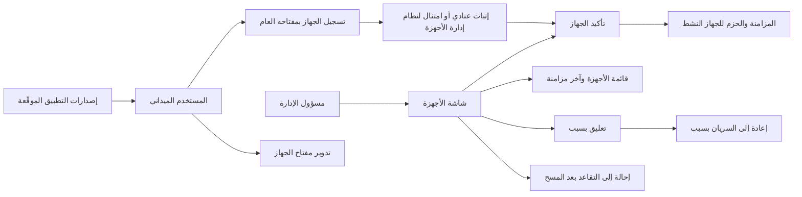
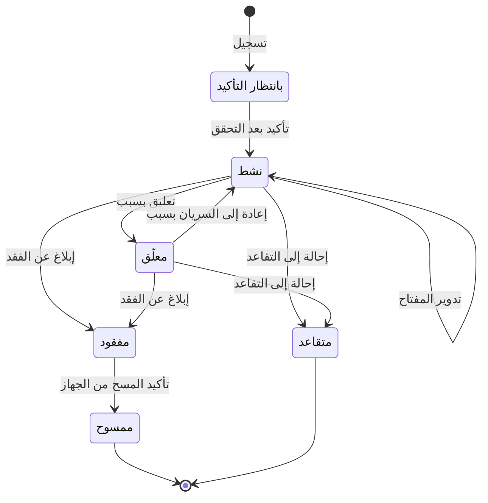

# إدارة الأجهزة الميدانية

<!-- BEGIN GENERATED: doc -->
| البند | القيمة |
|---|---|
| المعرّف | FEAT-COL-DEVICES |
| الإصدار | 0.1 |
| الحالة | مسودة |
| القدرة | CAP-02 جمع المعلومات |
| القدرة الفرعية | CAP-02.03 تسجيل الملاحظات (بما فيها دون اتصال) (R1) |
| الأدوار | المستخدم الميداني؛ مسؤول الإدارة؛ مسؤول الأمن |
| الشاشات | SCR-63 الأجهزة |
| حالات الاستخدام | UC-093 |
| القصص | 12: 7 من المواصفة، و5 جديدة |
<!-- END GENERATED: doc -->

## 1. نظرة عامة

### 1.1 القيمة

يتيح تسجيل الأجهزة الميدانية واعتمادها وتعليقها وتدوير مفاتيحها حتى لا يعمل في الميدان إلا جهاز موثوق.

### 1.2 النطاق

| البند | القيمة |
|---|---|
| المستخدمون | المستخدم الميداني يسجّل جهازه ويدوّر مفتاحه، ومسؤول الإدارة يؤكد الجهاز ويعلّقه ويعيده إلى السريان ويحيله إلى التقاعد، ومسؤول الأمن يحيله إلى التقاعد متجاوزًا شرط المسح، ونظام إدارة الأجهزة المتنقلة يؤكد امتثال الجهاز، وفريقا المنصة والتشغيل يحميان مفتاح الجهاز وإصدارات التطبيق الميداني |
| الشاشات | SCR-63 الأجهزة: قائمة الأجهزة بحالاتها وآخر مزامنة، وتأكيد الأجهزة الجديدة |
| حالات الاستخدام | مسح الجهاز المفقود (UC-093)، وهذه الميزة تمهّد له بجهاز مسجّل مربوط بمستخدم ومفتاح |
| المتطلبات | تشفير كل ما يُحفظ على الأجهزة الميدانية ومسح الجهاز المفقود عن بعد (REQ-OFF-005)، وألا يُقرأ أي سجل من جهاز مسروق دون فتحه، وأن يُمسح عند اتصاله التالي (QAS-SEC-007) |
| خارج النطاق | الإبلاغ عن فقد الجهاز وتأكيد مسحه (ميزة «الإبلاغ عن جهاز مفقود»)، وحزم البيانات على الجهاز (ميزة «تحميل بيانات المنطقة مسبقًا»)، وجلسات المزامنة ورفع الأوامر (ميزة «المزامنة الميدانية») |

### 1.3 خريطة الميزة

**الشكل 1: خريطة ميزة إدارة الأجهزة الميدانية**



يمر الجهاز بست حالات (الشكل 2). ولا يزامن ولا ينزّل الحزم إلا وهو «نشط». والانتقال إلى «مفقود» ثم «ممسوح» من ميزة «الإبلاغ عن جهاز مفقود».

**الشكل 2: رحلة الجهاز الميداني**



## 2. القواعد المشتركة

تنطبق على كل قصص الميزة، فلا تتكرر داخل القصص. وكل قصة تذكر ما يخصها فقط.

### 2.1 السياق المشترك

كل قصة تبدأ من ثلاثة شروط: مستأجر نشط، وحزمة السياسات الأساسية مفعّلة، ومستخدم مسجّل الدخول ومخوَّل. وتشير إليها القصص بخطوة واحدة: «بفرض السياق المشترك للميزة».

### 2.2 الصلاحية وعدم الإفصاح

- من لا يحق له رؤية العنصر يتلقى ردًا بشكل «غير متاح» تمامًا، فلا يعرف أنه موجود.
- من يرى العنصر ولا يحق له الإجراء يتلقى «لا تملك صلاحية هذا الإجراء».

### 2.3 أوامر تغيير الحالة

- **منع التكرار:** يُرسل كل أمر بمفتاح فريد، فإعادة الطلب نفسه لا تُنفَّذ مرتين.
- **حماية التعديل المتزامن:** يُرسل كل أمر بإصدار البيانات الذي يراه المستخدم. فإن عدّلها غيره في الأثناء، يُرفض الأمر.
- **السجل:** إن نجح الأمر، يُكتب حدثه وسجل التدقيق في المعاملة نفسها.

### 2.4 الرفض المشترك

```gherkin
# language: ar
خاصية: الرفض المشترك لأوامر الميزة

  سيناريو مخطط: رفض مشترك لكل أمر في الميزة
    بفرض السياق المشترك للميزة
    و <الحالة>
    عندما يُرسل المستخدم أي أمر من أوامر الميزة
    اذاً يُرفض برمز <الرمز> ويرى "<الرسالة>"
    و لا يتغير شيء

    امثلة:
      | الحالة                                  | الرمز                  | الرسالة                                                 |
      | العنصر خارج صلاحياته                    | NOT_FOUND              | غير متاح                                                |
      | العنصر مرئي له ولا يحق له الإجراء       | AUTHZ_DENIED           | لا تملك صلاحية هذا الإجراء                              |
      | غيره عدّل العنصر بعد أن فتحه            | VERSION_CONFLICT       | تغيّرت البيانات منذ فتحتها. راجع التغييرات ثم أعد المحاولة |
      | أعاد مفتاح منع التكرار بمحتوى مختلف     | IDEMPOTENCY_KEY_REUSED | طلب مكرر بمحتوى مختلف                                   |
      | البيانات ناقصة أو غير صحيحة             | VALIDATION_FAILED      | بعض البيانات ناقصة أو غير صحيحة. راجع الحقول المعلَّمة      |

  سيناريو: إعادة الطلب نفسه لا تُنفَّذ مرتين
    بفرض السياق المشترك للميزة
    و أمر نجح بمفتاح منع تكرار
    عندما يُعاد الطلب نفسه بالمفتاح نفسه
    اذاً تُعاد النتيجة الأولى ولا يُكتب حدث ثانٍ
```

### 2.5 قواعد الجهاز المشتركة

- **ترتيب الفحص:** يُفحص الإصدار قبل الحالة. فإن غيّر غيره حالة الجهاز بعد أن فتحه المستخدم، فالرفض تعارض الإصدار (القسم 2.4). ورفض الحالة في كل قصة يعني أن الإصدار مطابق والحالة لا تسمح بالإجراء.
- **مفتاح الجهاز:** مربوط بالمستخدم والجهاز معًا، وكل أمر يُسجَّل دون اتصال يوقَّع به. وللجهاز مفتاح حالي واحد.
- **الجهاز النشط وحده** يفتح جلسات المزامنة وينزّل حزم التحميل المسبق.
- **الجهاز المفقود والممسوح والمتقاعد:** يُرفض عليه كل أمر من أوامر هذه الميزة. و«ممسوح» و«متقاعد» حالتان نهائيتان، و«مفقود» لا يخرج منها إلا إلى «ممسوح» بتأكيد المسح من الجهاز.

```gherkin
# language: ar
خاصية: رفض أوامر الميزة على جهاز مفقود أو ممسوح أو متقاعد

  سيناريو مخطط: لا يُقبل أي أمر على جهاز مفقود أو ممسوح أو متقاعد
    بفرض السياق المشترك للميزة
    و جهاز في حالة "<الوضع>" وإصداره مطابق لما يراه المستخدم
    عندما يحاول صاحب الصلاحية <الإجراء>
    اذاً يُرفض برمز <الرمز> ويرى "<الرسالة>"
    و لا يتغير شيء

    امثلة:
      | الوضع | الإجراء | الرمز | الرسالة |
      | مفقود | تأكيد الجهاز | DEVICE_INVALID_STATE_TRANSITION | الوضع الحالي للجهاز الميداني لا يسمح بهذا الإجراء |
      | مفقود | تدوير المفتاح | DEVICE_INVALID_STATE_TRANSITION | الوضع الحالي للجهاز الميداني لا يسمح بهذا الإجراء |
      | ممسوح | تعليق الجهاز | DEVICE_INVALID_STATE_TRANSITION | الوضع الحالي للجهاز الميداني لا يسمح بهذا الإجراء |
      | ممسوح | إعادة الجهاز إلى السريان | DEVICE_INVALID_STATE_TRANSITION | الوضع الحالي للجهاز الميداني لا يسمح بهذا الإجراء |
      | متقاعد | إحالة الجهاز إلى التقاعد | DEVICE_INVALID_STATE_TRANSITION | الوضع الحالي للجهاز الميداني لا يسمح بهذا الإجراء |
```

## 3. الجودة وتعريف الاكتمال

### 3.1 متطلبات الجودة

<!-- BEGIN GENERATED: quality -->
| المرجع | الموقف | المطلوب |
|---|---|---|
| QAS-SEC-007 | obtains a field device | 0 readable records without authentication; wipe on next connection |
<!-- END GENERATED: quality -->

### 3.2 تعريف الاكتمال

القصة مكتملة حين تتحقق الشروط الخمسة:

1. سيناريوهاتها والقواعد المشتركة تمر في الاختبار الآلي.
2. فحوص البنية المعمارية تمر.
3. نصوص الواجهة والرسائل موجودة بالعربية والإنجليزية.
4. مراجعة الكود مكتملة.
5. ما تضيفه القصة نفسها في قسم «القواعد» تحقق.

## 4. فهرس القصص

<!-- BEGIN GENERATED: story-index -->
| المعرّف | القصة | النوع | الحالة |
|---|---|---|---|
| `US-BC01-DEV-CONFIRM` | تأكيد الجهاز الميداني | أمر | مسودة |
| `US-BC01-DEV-ENROLL` | تسجيل الجهاز الميداني | أمر | مسودة |
| `US-BC01-DEV-REINSTATE` | إعادة الجهاز الميداني إلى السريان | أمر | مسودة |
| `US-BC01-DEV-RETIRE` | إحالة الجهاز الميداني إلى التقاعد | أمر | مسودة |
| `US-BC01-DEV-ROTATE-KEY` | تدوير مفتاح الجهاز الميداني | أمر | مسودة |
| `US-BC01-DEV-SUSPEND` | تعليق الجهاز الميداني | أمر | مسودة |
| `US-BC01-Q-DEV-LIST` | جلب: Devices of a user (self) or in scope (Administrator) | جلب | مسودة |
| `US-UI-SCR63-DEVICE-LIST` | قائمة الأجهزة وحالتها وآخر مزامنة | واجهة | مسودة |
| `US-UI-SCR63-ENROLL-CONFIRM` | تأكيد تسجيل جهاز جديد بعد التحقق منه | واجهة | مسودة |
| `US-PLT-DEVICE-ATTESTATION` | مفتاح جهاز عتادي غير قابل للتصدير مع إثبات | منصة | مسودة |
| `US-INT-MDM-COMPLIANCE` | قبول الجهاز بناءً على امتثال إدارة الأجهزة | تكامل | مسودة |
| `US-OPS-FIELDAPP-RELEASE` | توزيع إصدارات التطبيق الميداني الموقّعة | تشغيل | مسودة |
<!-- END GENERATED: story-index -->

## 5. القصص

### 5.1 US-BC01-DEV-CONFIRM — تأكيد الجهاز الميداني

| النوع | الإصدار | الأولوية | دون اتصال | الحالة |
|---|---|---|---|---|
| أمر | R1 | Must | لا | مسودة |

> **كـ** مسؤول الإدارة، **أريد** أن أؤكد جهازًا مسجّلًا بعد التحقق من إثباته العتادي أو امتثاله لنظام إدارة الأجهزة، **حتى** لا يصل إلى بيانات المستأجر إلا جهاز موثوق.

**باختصار:** الجهاز «بانتظار التأكيد» يصبح «نشطًا» حين يصح إثباته العتادي أو يُؤكَّد امتثاله لنظام إدارة الأجهزة. ومن بعدها يزامن وينزّل الحزم.

#### القواعد

- **متى يُسمح:** الجهاز «بانتظار التأكيد»، وإثباته العتادي صحيح (القصة 5.10)، أو امتثاله لنظام إدارة الأجهزة مؤكد (القصة 5.11).
- **من يُسمح له:** مسؤول الإدارة في المستأجر نفسه، أو سياسة نظام إدارة الأجهزة. ويؤكد المسؤول هويته بمصادقة معززة قبل التنفيذ.
- **البيانات:** الإثبات (إلزامي).
- **الأثر:** يصبح الجهاز «نشطًا»، ويُسجَّل حدث «فُعِّل الجهاز». ويصل إلى بوابة المزامنة (سجل الأجهزة)، وخدمة حزم التحميل المسبق، وخدمة الإصدار الأمني، فتُقبل جلسات مزامنته.

> **ملاحظة:** الحد الأعلى ثلاثة أجهزة نشطة لكل مستخدم يُفحص في المصدر عند التسجيل وحده، لا عند التأكيد ولا عند الإعادة إلى السريان، فقد يتجاوزه مستخدم سجّل عدة أجهزة قبل تأكيدها **[Needs Review]**.

#### معايير القبول

```gherkin
# language: ar
خاصية: تأكيد الجهاز الميداني

  سيناريو: مسؤول الإدارة يؤكد جهازًا صح إثباته العتادي
    بفرض السياق المشترك للميزة
    و جهاز في حالة "بانتظار التأكيد" إثباته العتادي صحيح
    و مسؤول الإدارة أكد هويته بمصادقة معززة
    عندما يؤكد مسؤول الإدارة الجهاز
    اذاً تصبح حالة الجهاز "نشط"
    و يُسجَّل حدث "فُعِّل الجهاز"
    و تقبل بوابة المزامنة جلسات الجهاز

  سيناريو مخطط: رفض خاص بتأكيد الجهاز
    بفرض السياق المشترك للميزة
    و <الحالة>
    عندما يحاول مسؤول الإدارة تأكيد الجهاز
    اذاً يُرفض برمز <الرمز> ويرى "<الرسالة>"
    و لا يتغير شيء

    امثلة:
      | الحالة | الرمز | الرسالة |
      | الإثبات العتادي غير صحيح والامتثال غير مؤكد | ATTESTATION_FAILED | تعذّر التحقق من سلامة الجهاز |
      | لم يؤكد هويته بمصادقة معززة | MFA_STEP_UP_REQUIRED | هذا الإجراء يحتاج تأكيد هويتك مرة أخرى |
      | الإثبات غير مرفق | VALIDATION_FAILED | الإثبات مطلوب |
      | الجهاز "نشط" من قبل | DEVICE_INVALID_STATE_TRANSITION | الوضع الحالي للجهاز الميداني لا يسمح بهذا الإجراء |
      | الجهاز "معلّق" | DEVICE_INVALID_STATE_TRANSITION | الوضع الحالي للجهاز الميداني لا يسمح بهذا الإجراء |
```

<details><summary>المراجع التقنية والتتبع</summary>

<!-- BEGIN GENERATED: refs US-BC01-DEV-CONFIRM -->
| البند | المعرّف | المعنى |
|---|---|---|
| الواجهة البرمجية | `POST /api/v1/foundation/devices/{id}/actions/confirm` | — |
| الأمر | `CMD-DEV-CONFIRM` | تأكيد الجهاز الميداني |
| السياسة | `POL-DEV-CONFIRM` | user (enroll, report lost) · Administrator / MDM policy (confirm, suspend, reinstate, retire) · Security Offi… |
| الحدث | `EVT-DEV-ACTIVATED` | يصل إلى: Sync gateway (device registry cache); Preload packages (revoke on LOST/SUSPENDED); Security-version… |
| الكيان | `AGG-DEVICE` | الجهاز الميداني |
| الجدول | `foundation.devices` | الجدول الرئيسي للجهاز الميداني |
| وحدة النشر | DU-02 | — |
| المتطلب | REQ-OFF-005 | The system shall encrypt all data stored on field devices and shall support remote wipe of a lost device. |
| حالة الاستخدام | UC-093 | Wipe Lost Device |
| الاختبار | TST-DEVICE-SM، TST-SLC11-INVARIANTS | دورة حالات الجهاز الميداني، وثوابت الشريحة SLC-11 |
<!-- END GENERATED: refs US-BC01-DEV-CONFIRM -->

</details>

### 5.2 US-BC01-DEV-ENROLL — تسجيل الجهاز الميداني

| النوع | الإصدار | الأولوية | دون اتصال | الحالة |
|---|---|---|---|---|
| أمر | R1 | Must | لا | مسودة |

> **كـ** المستخدم الميداني، **أريد** أن أسجّل جهازي بمفتاحه العام ومنصته، **حتى** أعمل عليه في الميدان بعد أن يؤكده المسؤول.

**باختصار:** يُنشأ الجهاز «بانتظار التأكيد» مربوطًا بالمستخدم وبمفتاحه العام الأول. ولا يزامن شيئًا حتى يُؤكَّد (القصة 5.1).

#### القواعد

- **متى يُسمح:** حساب المستخدم نشط، وله أقل من ثلاثة أجهزة نشطة.
- **من يُسمح له:** المستخدم الميداني لجهازه، في المستأجر نفسه.
- **البيانات:** المستخدم، والمفتاح العام للجهاز، والمنصة (Android أو iOS)، وكلها إلزامية. ومرجع الجهاز في نظام إدارة الأجهزة اختياري.
- **الأثر:** جهاز جديد «بانتظار التأكيد» ومعه مفتاحه الأول. ويُسجَّل حدث «طُلب تسجيل الجهاز»، ويصل إلى بوابة المزامنة (سجل الأجهزة)، وخدمة حزم التحميل المسبق، وخدمة الإصدار الأمني.

> **ملاحظة:** شرط الانتقال في المصدر يذكر مرجع نظام إدارة الأجهزة بين الشروط، والعقد يجعله حقلًا اختياريًا **[Needs Review]**.

#### معايير القبول

```gherkin
# language: ar
خاصية: تسجيل الجهاز الميداني

  سيناريو: مستخدم ميداني يسجّل جهازًا جديدًا
    بفرض السياق المشترك للميزة
    و للمستخدم الميداني جهازان نشطان
    عندما يسجّل جهازًا جديدًا بمفتاحه العام ومنصة "Android"
    اذاً يُنشأ الجهاز في حالة "بانتظار التأكيد" مربوطًا بالمستخدم
    و يُحفظ المفتاح العام مفتاحًا حاليًا للجهاز
    و يُسجَّل حدث "طُلب تسجيل الجهاز"

  سيناريو مخطط: رفض خاص بتسجيل الجهاز
    بفرض السياق المشترك للميزة
    و <الحالة>
    عندما يحاول المستخدم الميداني تسجيل الجهاز
    اذاً يُرفض برمز <الرمز> ويرى "<الرسالة>"
    و لا يتغير شيء

    امثلة:
      | الحالة | الرمز | الرسالة |
      | للمستخدم ثلاثة أجهزة نشطة | DEVICE_LIMIT_REACHED | بلغت الحد الأقصى للأجهزة النشطة |
      | المفتاح العام غير مرفق | VALIDATION_FAILED | المفتاح العام مطلوب |
      | المنصة ليست Android ولا iOS | VALIDATION_FAILED | المنصة غير صحيحة |
```

<details><summary>المراجع التقنية والتتبع</summary>

<!-- BEGIN GENERATED: refs US-BC01-DEV-ENROLL -->
| البند | المعرّف | المعنى |
|---|---|---|
| الواجهة البرمجية | `POST /api/v1/foundation/devices` | — |
| الأمر | `CMD-DEV-ENROLL` | تسجيل الجهاز الميداني |
| السياسة | `POL-DEV-ENROLL` | user (enroll, report lost) · Administrator / MDM policy (confirm, suspend, reinstate, retire) · Security Offi… |
| الحدث | `EVT-DEV-ENROLL-REQUESTED` | يصل إلى: Sync gateway (device registry cache); Preload packages (revoke on LOST/SUSPENDED); Security-version… |
| الكيان | `AGG-DEVICE` | الجهاز الميداني |
| الجدول | `foundation.devices` | الجدول الرئيسي للجهاز الميداني |
| وحدة النشر | DU-02 | — |
| المتطلب | REQ-OFF-005 | The system shall encrypt all data stored on field devices and shall support remote wipe of a lost device. |
| حالة الاستخدام | UC-093 | Wipe Lost Device |
| الاختبار | TST-DEVICE-SM، TST-SLC11-INVARIANTS | دورة حالات الجهاز الميداني، وثوابت الشريحة SLC-11 |
<!-- END GENERATED: refs US-BC01-DEV-ENROLL -->

</details>

### 5.3 US-BC01-DEV-REINSTATE — إعادة الجهاز الميداني إلى السريان

| النوع | الإصدار | الأولوية | دون اتصال | الحالة |
|---|---|---|---|---|
| أمر | R1 | Must | لا | مسودة |

> **كـ** مسؤول الإدارة، **أريد** أن أعيد جهازًا معلّقًا إلى السريان مع ذكر السبب، **حتى** يعود صاحبه إلى العمل والمزامنة بعد زوال سبب التعليق.

**باختصار:** الجهاز «المعلّق» يعود «نشطًا» بسبب مكتوب، فتُقبل جلسات مزامنته من جديد.

#### القواعد

- **متى يُسمح:** الجهاز «معلّق».
- **من يُسمح له:** مسؤول الإدارة في المستأجر نفسه.
- **البيانات:** السبب (إلزامي).
- **الأثر:** يصبح الجهاز «نشطًا»، ويُسجَّل حدث «أُعيد الجهاز إلى السريان». ويصل إلى بوابة المزامنة (سجل الأجهزة)، وخدمة حزم التحميل المسبق، وخدمة الإصدار الأمني. والحزم التي سُحبت عند التعليق لا تعود، فيطلب المستخدم حزمًا جديدة **[Derived]**.

#### معايير القبول

```gherkin
# language: ar
خاصية: إعادة الجهاز الميداني إلى السريان

  سيناريو: إعادة جهاز معلّق إلى السريان
    بفرض السياق المشترك للميزة
    و جهاز في حالة "معلّق"
    عندما يعيده مسؤول الإدارة إلى السريان مع سبب
    اذاً تصبح حالة الجهاز "نشط"
    و يُسجَّل حدث "أُعيد الجهاز إلى السريان"
    و تقبل بوابة المزامنة جلسات الجهاز من جديد

  سيناريو مخطط: رفض خاص بإعادة الجهاز إلى السريان
    بفرض السياق المشترك للميزة
    و <الحالة>
    عندما يحاول مسؤول الإدارة إعادة الجهاز إلى السريان
    اذاً يُرفض برمز <الرمز> ويرى "<الرسالة>"
    و لا يتغير شيء

    امثلة:
      | الحالة | الرمز | الرسالة |
      | لم يُذكر السبب | REASON_REQUIRED | اذكر السبب |
      | الجهاز "نشط" | DEVICE_INVALID_STATE_TRANSITION | الوضع الحالي للجهاز الميداني لا يسمح بهذا الإجراء |
      | الجهاز "بانتظار التأكيد" | DEVICE_INVALID_STATE_TRANSITION | الوضع الحالي للجهاز الميداني لا يسمح بهذا الإجراء |
```

<details><summary>المراجع التقنية والتتبع</summary>

<!-- BEGIN GENERATED: refs US-BC01-DEV-REINSTATE -->
| البند | المعرّف | المعنى |
|---|---|---|
| الواجهة البرمجية | `POST /api/v1/foundation/devices/{id}/actions/reinstate` | — |
| الأمر | `CMD-DEV-REINSTATE` | إعادة الجهاز الميداني إلى السريان |
| السياسة | `POL-DEV-REINSTATE` | user (enroll, report lost) · Administrator / MDM policy (confirm, suspend, reinstate, retire) · Security Offi… |
| الحدث | `EVT-DEV-REINSTATED` | يصل إلى: Sync gateway (device registry cache); Preload packages (revoke on LOST/SUSPENDED); Security-version… |
| الكيان | `AGG-DEVICE` | الجهاز الميداني |
| الجدول | `foundation.devices` | الجدول الرئيسي للجهاز الميداني |
| وحدة النشر | DU-02 | — |
| المتطلب | REQ-OFF-005 | The system shall encrypt all data stored on field devices and shall support remote wipe of a lost device. |
| حالة الاستخدام | UC-093 | Wipe Lost Device |
| الاختبار | TST-DEVICE-SM، TST-SLC11-INVARIANTS | دورة حالات الجهاز الميداني، وثوابت الشريحة SLC-11 |
<!-- END GENERATED: refs US-BC01-DEV-REINSTATE -->

</details>

### 5.4 US-BC01-DEV-RETIRE — إحالة الجهاز الميداني إلى التقاعد

| النوع | الإصدار | الأولوية | دون اتصال | الحالة |
|---|---|---|---|---|
| أمر | R1 | Must | لا | مسودة |

> **كـ** مسؤول الإدارة، **أريد** أن أحيل جهازًا لم يعد مستخدمًا إلى التقاعد بعد أن يزامن ما عليه ويُمسح، **حتى** يخرج من الخدمة نهائيًا دون أن يضيع ما سُجّل عليه أو يبقى عليه شيء.

**باختصار:** الجهاز «النشط» أو «المعلّق» يصبح «متقاعدًا» بعد تأكيد مزامنته ومسحه. ولمسؤول الأمن أن يتجاوز هذا الشرط.

#### القواعد

- **متى يُسمح:** الجهاز «نشط» أو «معلّق»، وأُكِّد أنه زامن كل ما عليه ثم مُسح. أو يتجاوز مسؤول الأمن هذا الشرط.
- **من يُسمح له:** مسؤول الإدارة، ومسؤول الأمن وحده للتجاوز. وكلاهما يؤكد هويته بمصادقة معززة.
- **البيانات:** السبب (إلزامي)، والتجاوز (اختياري، لمسؤول الأمن).
- **الأثر:** يصبح الجهاز «متقاعدًا»، وهي حالة نهائية. ويُسجَّل حدث «أُحيل الجهاز إلى التقاعد»، ويصل إلى بوابة المزامنة (سجل الأجهزة)، وخدمة حزم التحميل المسبق، وخدمة الإصدار الأمني، فلا يفتح الجهاز جلسة مزامنة بعدها.

> **ملاحظة:** المصدر لا يحدد كيف يُسجَّل تأكيد المزامنة والمسح لجهاز غير مفقود **[Needs Review]**.

#### معايير القبول

```gherkin
# language: ar
خاصية: إحالة الجهاز الميداني إلى التقاعد

  سيناريو: إحالة جهاز زامن ومُسح إلى التقاعد
    بفرض السياق المشترك للميزة
    و جهاز في حالة "نشط" أُكِّدت مزامنته ومسحه
    و مسؤول الإدارة أكد هويته بمصادقة معززة
    عندما يحيله مسؤول الإدارة إلى التقاعد مع سبب
    اذاً تصبح حالة الجهاز "متقاعد"
    و يُسجَّل حدث "أُحيل الجهاز إلى التقاعد"

  سيناريو: مسؤول الأمن يتجاوز شرط المسح
    بفرض السياق المشترك للميزة
    و جهاز في حالة "معلّق" لم يُؤكَّد مسحه
    و مسؤول الأمن أكد هويته بمصادقة معززة
    عندما يحيله مسؤول الأمن إلى التقاعد مع سبب وتجاوز
    اذاً تصبح حالة الجهاز "متقاعد"
    و يُسجَّل التجاوز في سجل التدقيق

  سيناريو مخطط: رفض خاص بإحالة الجهاز إلى التقاعد
    بفرض السياق المشترك للميزة
    و <الحالة>
    عندما يحاول مسؤول الإدارة إحالة الجهاز إلى التقاعد
    اذاً يُرفض برمز <الرمز> ويرى "<الرسالة>"
    و لا يتغير شيء

    امثلة:
      | الحالة | الرمز | الرسالة |
      | لم يُؤكَّد مسح الجهاز ولا تجاوز | DEVICE_NOT_WIPED | لم يُؤكَّد مسح الجهاز بعد |
      | لم يؤكد هويته بمصادقة معززة | MFA_STEP_UP_REQUIRED | هذا الإجراء يحتاج تأكيد هويتك مرة أخرى |
      | السبب فارغ | VALIDATION_FAILED | السبب مطلوب |
      | الجهاز "بانتظار التأكيد" | DEVICE_INVALID_STATE_TRANSITION | الوضع الحالي للجهاز الميداني لا يسمح بهذا الإجراء |
```

<details><summary>المراجع التقنية والتتبع</summary>

<!-- BEGIN GENERATED: refs US-BC01-DEV-RETIRE -->
| البند | المعرّف | المعنى |
|---|---|---|
| الواجهة البرمجية | `POST /api/v1/foundation/devices/{id}/actions/retire` | — |
| الأمر | `CMD-DEV-RETIRE` | إحالة الجهاز الميداني إلى التقاعد |
| السياسة | `POL-DEV-RETIRE` | user (enroll, report lost) · Administrator / MDM policy (confirm, suspend, reinstate, retire) · Security Offi… |
| الحدث | `EVT-DEV-RETIRED` | يصل إلى: Sync gateway (device registry cache); Preload packages (revoke on LOST/SUSPENDED); Security-version… |
| الكيان | `AGG-DEVICE` | الجهاز الميداني |
| الجدول | `foundation.devices` | الجدول الرئيسي للجهاز الميداني |
| وحدة النشر | DU-02 | — |
| المتطلب | REQ-OFF-005 | The system shall encrypt all data stored on field devices and shall support remote wipe of a lost device. |
| حالة الاستخدام | UC-093 | Wipe Lost Device |
| الاختبار | TST-DEVICE-SM، TST-SLC11-INVARIANTS | دورة حالات الجهاز الميداني، وثوابت الشريحة SLC-11 |
<!-- END GENERATED: refs US-BC01-DEV-RETIRE -->

</details>

### 5.5 US-BC01-DEV-ROTATE-KEY — تدوير مفتاح الجهاز الميداني

| النوع | الإصدار | الأولوية | دون اتصال | الحالة |
|---|---|---|---|---|
| أمر | R1 | Must | لا | مسودة |

> **كـ** المستخدم الميداني، **أريد** أن أدوّر مفتاح جهازي بطلب يوقّعه المفتاح الحالي، **حتى** يبقى الجهاز موثوقًا دون إعادة تسجيله.

**باختصار:** الجهاز «النشط» يأخذ مفتاحًا عامًا جديدًا يوقّع طلبه المفتاح الحالي. ولا تتغير حالته، ويزيد إصداره.

#### القواعد

- **متى يُسمح:** الجهاز «نشط»، والطلب موقّع بمفتاحه الحالي.
- **من يُسمح له:** المستخدم الميداني حامل الجهاز وحده، لأن التوقيع بالمفتاح الحالي لا يملكه غيره.
- **البيانات:** المفتاح العام الجديد والتوقيع، وكلاهما إلزامي.
- **الأثر:** يصبح المفتاح الجديد هو الحالي، ويُسجَّل وقت إبطال السابق **[Derived]**. ويُسجَّل حدث «دُوِّر مفتاح الجهاز»، ويصل إلى بوابة المزامنة (سجل الأجهزة)، وخدمة حزم التحميل المسبق، وخدمة الإصدار الأمني. وما يُسجَّل بعدها دون اتصال يوقَّع بالمفتاح الجديد.

> **ملاحظة:** المصدر لا يذكر حكم الأوامر الموقّعة بالمفتاح السابق التي لم تُرفع بعد عند التدوير **[Needs Review]**.

#### معايير القبول

```gherkin
# language: ar
خاصية: تدوير مفتاح الجهاز الميداني

  سيناريو: تدوير مفتاح جهاز نشط
    بفرض السياق المشترك للميزة
    و جهاز في حالة "نشط" له مفتاح حالي
    عندما يرسل المستخدم الميداني مفتاحًا عامًا جديدًا بطلب موقّع بالمفتاح الحالي
    اذاً يصبح المفتاح الجديد هو المفتاح الحالي للجهاز
    و تبقى حالة الجهاز "نشط" ويزيد إصداره
    و يُسجَّل حدث "دُوِّر مفتاح الجهاز"

  سيناريو مخطط: رفض خاص بتدوير مفتاح الجهاز
    بفرض السياق المشترك للميزة
    و <الحالة>
    عندما يحاول المستخدم الميداني تدوير مفتاح الجهاز
    اذاً يُرفض برمز <الرمز> ويرى "<الرسالة>"
    و لا يتغير شيء

    امثلة:
      | الحالة | الرمز | الرسالة |
      | التوقيع لا يطابق المفتاح الحالي | SIGNATURE_INVALID | توقيع الجهاز غير صحيح |
      | المفتاح العام الجديد غير مرفق | VALIDATION_FAILED | المفتاح العام الجديد مطلوب |
      | الجهاز "معلّق" | DEVICE_INVALID_STATE_TRANSITION | الوضع الحالي للجهاز الميداني لا يسمح بهذا الإجراء |
      | الجهاز "بانتظار التأكيد" | DEVICE_INVALID_STATE_TRANSITION | الوضع الحالي للجهاز الميداني لا يسمح بهذا الإجراء |
```

<details><summary>المراجع التقنية والتتبع</summary>

<!-- BEGIN GENERATED: refs US-BC01-DEV-ROTATE-KEY -->
| البند | المعرّف | المعنى |
|---|---|---|
| الواجهة البرمجية | `POST /api/v1/foundation/devices/{id}/actions/rotate-key` | — |
| الأمر | `CMD-DEV-ROTATE-KEY` | تدوير مفتاح الجهاز الميداني |
| السياسة | `POL-DEV-ROTATE-KEY` | user (rotate key)؛ tenant match; device ACTIVE where applicable; device signature for SYN |
| الحدث | `EVT-DEV-KEY-ROTATED` | يصل إلى: Sync gateway (device registry cache); Preload packages (revoke on LOST/SUSPENDED); Security-version… |
| الكيان | `AGG-DEVICE` | الجهاز الميداني |
| الجدول | `foundation.devices` | الجدول الرئيسي للجهاز الميداني |
| وحدة النشر | DU-02 | — |
| المتطلب | REQ-OFF-005 | The system shall encrypt all data stored on field devices and shall support remote wipe of a lost device. |
| حالة الاستخدام | UC-093 | Wipe Lost Device |
| الاختبار | TST-DEVICE-SM، TST-SLC11-INVARIANTS | دورة حالات الجهاز الميداني، وثوابت الشريحة SLC-11 |
<!-- END GENERATED: refs US-BC01-DEV-ROTATE-KEY -->

</details>

### 5.6 US-BC01-DEV-SUSPEND — تعليق الجهاز الميداني

| النوع | الإصدار | الأولوية | دون اتصال | الحالة |
|---|---|---|---|---|
| أمر | R1 | Must | لا | مسودة |

> **كـ** مسؤول الإدارة، **أريد** أن أعلّق جهازًا نشطًا فورًا مع ذكر السبب، **حتى** أوقف مزامنته وحزمه عند الاشتباه دون أن أحيله إلى التقاعد.

**باختصار:** الجهاز «النشط» يصبح «معلّقًا» بسبب مكتوب. فتُرفض مزامنته وتُسحب حزمه حتى يُعاد إلى السريان (القصة 5.3).

#### القواعد

- **متى يُسمح:** الجهاز «نشط».
- **من يُسمح له:** مسؤول الإدارة في المستأجر نفسه.
- **البيانات:** السبب (إلزامي).
- **الأثر:** يصبح الجهاز «معلّقًا»، ويُسجَّل حدث «عُلِّق الجهاز». ويرتفع الإصدار الأمني فتُبطل قرارات الصلاحية المحفوظة. وترفض بوابة المزامنة جلساته وترسل إليه تعليمة الإيقاف عند اتصاله التالي، وتُسحب كل حزم التحميل المسبق على الجهاز.

#### معايير القبول

```gherkin
# language: ar
خاصية: تعليق الجهاز الميداني

  سيناريو: تعليق جهاز نشط
    بفرض السياق المشترك للميزة
    و جهاز في حالة "نشط" عليه حزمة تحميل مسبق
    عندما يعلّقه مسؤول الإدارة مع سبب
    اذاً تصبح حالة الجهاز "معلّق"
    و تُسحب الحزمة التي على الجهاز
    و يُسجَّل حدث "عُلِّق الجهاز"
    و حين يتصل الجهاز تُرفض جلسة المزامنة ويتلقى تعليمة الإيقاف

  سيناريو مخطط: رفض خاص بتعليق الجهاز
    بفرض السياق المشترك للميزة
    و <الحالة>
    عندما يحاول مسؤول الإدارة تعليق الجهاز
    اذاً يُرفض برمز <الرمز> ويرى "<الرسالة>"
    و لا يتغير شيء

    امثلة:
      | الحالة | الرمز | الرسالة |
      | لم يُذكر السبب | REASON_REQUIRED | اذكر السبب |
      | الجهاز "معلّق" من قبل | DEVICE_INVALID_STATE_TRANSITION | الوضع الحالي للجهاز الميداني لا يسمح بهذا الإجراء |
      | الجهاز "بانتظار التأكيد" | DEVICE_INVALID_STATE_TRANSITION | الوضع الحالي للجهاز الميداني لا يسمح بهذا الإجراء |
```

<details><summary>المراجع التقنية والتتبع</summary>

<!-- BEGIN GENERATED: refs US-BC01-DEV-SUSPEND -->
| البند | المعرّف | المعنى |
|---|---|---|
| الواجهة البرمجية | `POST /api/v1/foundation/devices/{id}/actions/suspend` | — |
| الأمر | `CMD-DEV-SUSPEND` | تعليق الجهاز الميداني |
| السياسة | `POL-DEV-SUSPEND` | user (enroll, report lost) · Administrator / MDM policy (confirm, suspend, reinstate, retire) · Security Offi… |
| الحدث | `EVT-DEV-SUSPENDED` | يصل إلى: Security-version service (EVT-SEC-VERSION-INCREMENTED); PEP decision caches; Projection security-ver… |
| الكيان | `AGG-DEVICE` | الجهاز الميداني |
| الجدول | `foundation.devices` | الجدول الرئيسي للجهاز الميداني |
| وحدة النشر | DU-02 | — |
| المتطلب | REQ-OFF-005 | The system shall encrypt all data stored on field devices and shall support remote wipe of a lost device. |
| حالة الاستخدام | UC-093 | Wipe Lost Device |
| الاختبار | TST-DEVICE-SM، TST-SLC11-INVARIANTS | دورة حالات الجهاز الميداني، وثوابت الشريحة SLC-11 |
<!-- END GENERATED: refs US-BC01-DEV-SUSPEND -->

</details>

### 5.7 US-BC01-Q-DEV-LIST — عرض الأجهزة الميدانية

| النوع | الإصدار | الأولوية | دون اتصال | الحالة |
|---|---|---|---|---|
| جلب | R1 | Must | لا | مسودة |

> **كـ** مسؤول الإدارة، **أريد** قائمة بالأجهزة الميدانية في نطاقي وحالاتها، **حتى** أعرف أي جهاز يعمل وأيها يحتاج تدخلًا.

**باختصار:** يرى المستخدم الميداني أجهزته هو، ويرى مسؤول الإدارة أجهزة المستخدمين في نطاقه، صفحةً بعد صفحة.

#### القواعد

- **من يرى ماذا:** المستخدم الميداني أجهزته فقط، ومسؤول الإدارة أجهزة المستخدمين في نطاقه من المؤسسة. ومن لا تسمح له السياسة يتلقى ردًا بشكل غير الموجود نفسه.
- **المرشحات:** المؤشر والحد فقط.
- **ما يُعاد لكل جهاز:** المستخدم، والمنصة، ومرجعه في نظام إدارة الأجهزة، والحالة، ووقت الفقد إن وُجد، والإصدار.
- **الترقيم:** بالمؤشر، ولا عدد ولا إشارة إلى جهاز خارج ما يراه المستخدم.

#### معايير القبول

```gherkin
# language: ar
خاصية: عرض الأجهزة الميدانية

  سيناريو: المستخدم الميداني يرى أجهزته فقط
    بفرض السياق المشترك للميزة
    و للمستخدم الميداني جهازان ولغيره أجهزة أخرى
    عندما يطلب قائمة الأجهزة
    اذاً يُعاد جهازاه فقط بحالة كل منهما ومنصته

  سيناريو: مسؤول الإدارة يرى أجهزة نطاقه فقط
    بفرض السياق المشترك للميزة
    و أجهزة لمستخدمين داخل نطاق مسؤول الإدارة وأخرى خارجه
    عندما يطلب قائمة الأجهزة بالمؤشر
    اذاً تُعاد الأجهزة داخل نطاقه فقط
    و لا يكشف أي عدد أو إشارة وجود جهاز خارج نطاقه
```

<details><summary>المراجع التقنية والتتبع</summary>

<!-- BEGIN GENERATED: refs US-BC01-Q-DEV-LIST -->
| البند | المعرّف | المعنى |
|---|---|---|
| الواجهة البرمجية | `GET /api/v1/foundation/devices` | — |
| الاستعلام | `QRY-DEV-LIST` | Devices of a user (self) or in scope (Administrator) |
| السياسة | `POL-DEV-LIST` | self; Administrator in scope |
| الكيان | `AGG-DEVICE` | الجهاز الميداني |
| الجدول | `foundation.devices` | الجدول الرئيسي للجهاز الميداني |
| وحدة النشر | DU-02 | — |
| المتطلب | REQ-OFF-005 | The system shall encrypt all data stored on field devices and shall support remote wipe of a lost device. |
| حالة الاستخدام | UC-093 | Wipe Lost Device |
| الاختبار | TST-DEVICE-SM، TST-SLC11-INVARIANTS | دورة حالات الجهاز الميداني، وثوابت الشريحة SLC-11 |
<!-- END GENERATED: refs US-BC01-Q-DEV-LIST -->

</details>

### 5.8 US-UI-SCR63-DEVICE-LIST — قائمة الأجهزة وحالتها وآخر مزامنة

| النوع | الإصدار | الأولوية | دون اتصال | الحالة |
|---|---|---|---|---|
| واجهة | R1 | Should | لا | مسودة |

> **كـ** مسؤول الإدارة، **أريد** أن أرى في شاشة الأجهزة كل جهاز بحالته ومنصته ووقت آخر مزامنة له، **حتى** ألحظ الجهاز المتوقف أو المشبوه وأتصرف فيه.

**باختصار:** تعرض شاشة الأجهزة قائمة بالمؤشر، لكل جهاز شارة حالته ومستخدمه ومنصته ووقت آخر مزامنة. وتظهر الأفعال حسب صلاحية المستخدم وحالة الجهاز.

#### القواعد

- القائمة بالمؤشر، ولا عدد إلا لما يحسبه الخادم من المرئي، ولا إشارة إلى أجهزة مخفية.
- الحالة شارة بإحدى الحالات الست (الشكل 2).
- وقت آخر مزامنة من آخر جلسة مزامنة للجهاز، ويُعرض بتوقيت المستخدم المحلي. والاستعلام لا يعيده اليوم، فهذا الحقل **[Derived]**.
- يظهر الفعل إذا شملته صلاحيات المستخدم وسمحت به الحالة المعروضة: «تعليق» للنشط، و«إعادة إلى السريان» للمعلّق، و«إحالة إلى التقاعد» للنشط والمعلّق، و«تأكيد» لما ينتظر التأكيد (القصة 5.9). وهذا تلميح، والحكم للخادم.
- التعليق والإعادة إلى السريان والإحالة إلى التقاعد تطلب السبب في حقل نصي إلزامي.
- عند تعارض الإصدار تعيد الشاشة تحميل الجهاز وتعرض ما تغيّر. وعند رفض الحالة تعيد تحميل الحالة وتخفي الفعل غير المتاح.

> **ملاحظة:** الاستعلام لا يذكر مرشحًا بالحالة أو بالمستخدم، والشاشة تحتاجه لإيجاد جهاز بعينه **[Needs Review]**.

#### معايير القبول

```gherkin
# language: ar
خاصية: قائمة الأجهزة وحالتها وآخر مزامنة

  سيناريو: عرض الأجهزة بحالاتها
    بفرض السياق المشترك للميزة
    و في نطاق مسؤول الإدارة جهاز "نشط" زامن أمس وجهاز "معلّق"
    عندما يفتح شاشة الأجهزة
    اذاً يرى لكل جهاز شارة حالته ومستخدمه ومنصته ووقت آخر مزامنة
    و يظهر زر "تعليق" للجهاز النشط وزر "إعادة إلى السريان" للمعلّق

  سيناريو مخطط: استجابة الشاشة لرفض الخادم
    بفرض السياق المشترك للميزة
    و شاشة الأجهزة مفتوحة
    و <الحالة>
    عندما يضغط المستخدم زر الإجراء
    اذاً تعرض الشاشة "<الرسالة>"
    و لا يتغير شيء

    امثلة:
      | الحالة | الرمز | الرسالة |
      | ضغط "إحالة إلى التقاعد" لجهاز لم يُؤكَّد مسحه | DEVICE_NOT_WIPED | لم يُؤكَّد مسح الجهاز بعد |
      | ضغط "إحالة إلى التقاعد" ولم يؤكد هويته بعد | MFA_STEP_UP_REQUIRED | هذا الإجراء يحتاج تأكيد هويتك مرة أخرى |
```

<details><summary>المراجع التقنية والتتبع</summary>

<!-- BEGIN GENERATED: refs US-UI-SCR63-DEVICE-LIST -->
| البند | المعرّف | المعنى |
|---|---|---|
| الشاشة | SCR-63 | شاشة الأجهزة |
| المصدر | `QRY-DEV-LIST` | — |
| المصدر | `21-ui-design.md §6.3` | — |
| المصدر | `[Derived]` | — |
<!-- END GENERATED: refs US-UI-SCR63-DEVICE-LIST -->

</details>

### 5.9 US-UI-SCR63-ENROLL-CONFIRM — تأكيد تسجيل جهاز جديد بعد التحقق منه

| النوع | الإصدار | الأولوية | دون اتصال | الحالة |
|---|---|---|---|---|
| واجهة | R1 | Should | لا | مسودة |

> **كـ** مسؤول الإدارة، **أريد** أن أراجع الأجهزة التي تنتظر التأكيد ونتيجة التحقق من كل منها ثم أؤكدها، **حتى** لا أؤكد جهازًا لم يُتحقق منه.

**باختصار:** تعرض الشاشة الأجهزة «بانتظار التأكيد» ومستخدم كل منها ومنصته. وزر «تأكيد» يرسل الإثبات، ويطلب المصادقة المعززة دون أن يضيع ما في النموذج.

#### القواعد

- تُعرض الأجهزة «بانتظار التأكيد» في قسم مستقل من شاشة الأجهزة **[Derived]**.
- يظهر زر «تأكيد» للجهاز «بانتظار التأكيد» فقط، ولمن تشمله صلاحياته.
- التأكيد يحتاج مصادقة معززة: النموذج يبقى مفتوحًا، والأمر يُعاد بالمفتاح نفسه بعد المصادقة فلا يُنفَّذ مرتين.
- الجهاز الذي يؤكده نظام إدارة الأجهزة (القصة 5.11) يخرج من القسم عند تحديث القائمة **[Derived]**.
- رفض الإثبات يظهر برسالته، ويبقى الجهاز «بانتظار التأكيد».

#### معايير القبول

```gherkin
# language: ar
خاصية: تأكيد تسجيل جهاز جديد بعد التحقق منه

  سيناريو: تأكيد جهاز بعد المصادقة المعززة
    بفرض السياق المشترك للميزة
    و جهاز في حالة "بانتظار التأكيد" إثباته العتادي صحيح
    عندما يضغط مسؤول الإدارة "تأكيد"
    اذاً تطلب الشاشة تأكيد هويته ويبقى النموذج مفتوحًا
    عندما يؤكد هويته
    اذاً يُعاد الأمر بالمفتاح نفسه ويصبح الجهاز "نشط"
    و يخرج الجهاز من قسم الأجهزة التي تنتظر التأكيد

  سيناريو مخطط: استجابة الشاشة لرفض التأكيد
    بفرض السياق المشترك للميزة
    و جهاز في حالة "بانتظار التأكيد" معروض للتأكيد
    و <الحالة>
    عندما يضغط مسؤول الإدارة "تأكيد"
    اذاً تعرض الشاشة "<الرسالة>"
    و لا يتغير شيء

    امثلة:
      | الحالة | الرمز | الرسالة |
      | الإثبات العتادي غير صحيح | ATTESTATION_FAILED | تعذّر التحقق من سلامة الجهاز |
```

<details><summary>المراجع التقنية والتتبع</summary>

<!-- BEGIN GENERATED: refs US-UI-SCR63-ENROLL-CONFIRM -->
| البند | المعرّف | المعنى |
|---|---|---|
| الشاشة | SCR-63 | شاشة الأجهزة |
| المصدر | `US-BC01-DEV-CONFIRM` | — |
| حالة الاستخدام | UC-093 | Wipe Lost Device |
| المصدر | `[Derived]` | — |
<!-- END GENERATED: refs US-UI-SCR63-ENROLL-CONFIRM -->

</details>

### 5.10 US-PLT-DEVICE-ATTESTATION — مفتاح جهاز عتادي غير قابل للتصدير مع إثبات

| النوع | الإصدار | الأولوية | دون اتصال | الحالة |
|---|---|---|---|---|
| منصة | R1 | Should | لا ينطبق | مسودة |

> **كـ** فريق المنصة، **أريد** أن يُولَّد مفتاح الجهاز ويبقى في مخزن المفاتيح العتادي، وأن يثبت الجهاز ذلك عند تأكيده، **حتى** لا ينتحل أحد صفة جهاز بأوامر مزوّرة ولا يُقرأ جهاز مسروق.

**باختصار:** مفتاح الجهاز الخاص لا يغادر مخزن المفاتيح العتادي، والخادم يحفظ المفتاح العام وحده. وكل أمر يُسجَّل دون اتصال يوقَّع به.

#### القواعد

- يُولَّد مفتاح الجهاز ويُحفظ في مخزن المفاتيح العتادي (TD-16)، ولا يغادره. وكونه غير قابل للتصدير **[Derived]** من ذلك.
- الخادم يحفظ المفتاح العام ومدة سريانه فقط.
- يُرسل الإثبات العتادي عند تأكيد الجهاز (القصة 5.1)، وفشله يرفض التأكيد.
- كل أمر يُسجَّل دون اتصال يوقَّع بمفتاح الجهاز ويُربط بسابقه في سلسلة بصمات، والخادم يتحقق منهما عند الرفع. وإبطال المفتاح يمنع قبول أوامره.
- المخزن المحلي مشفّر بمفتاح مربوط بالمستخدم والجهاز، ولا يُقرأ منه سجل دون فتح التطبيق (QAS-SEC-007).
- حين لا تكفي مكتبات التطبيق للإثبات والتخزين الآمن، تُستعمل وحدات أصلية لكل منصة (TD-16).

#### معايير القبول

```gherkin
# language: ar
خاصية: مفتاح جهاز عتادي غير قابل للتصدير مع إثبات

  سيناريو: المفتاح يبقى في مخزن المفاتيح العتادي
    بفرض جهاز سُجِّل وأُكِّد
    عندما يُفحص ما حفظه الخادم عن مفتاح الجهاز
    اذاً يجد المفتاح العام ومدة سريانه فقط
    و لا يمكن استخراج المفتاح الخاص من الجهاز

  سيناريو: أمر مزوّر باسم جهاز
    بفرض أمر في دفعة مزامنة لا يحمل توقيعًا صحيحًا بمفتاح الجهاز الحالي
    عندما يتحقق الخادم من الدفعة
    اذاً لا يُطبَّق الأمر

  سيناريو: جهاز مسروق مقفل
    بفرض جهاز مقفل أو مطفأ بيد شخص لا يعرف رمز فتحه
    عندما يحاول قراءة مخزن التطبيق
    اذاً لا يقرأ أي سجل
```

<details><summary>المراجع التقنية والتتبع</summary>

<!-- BEGIN GENERATED: refs US-PLT-DEVICE-ATTESTATION -->
| البند | المعرّف | المعنى |
|---|---|---|
| القرار التقني | TD-16 | Web: React + MapLibre GL JS, i18n with ICU messages, RTL via CSS logical properties, Hijri display via Intl (… |
| المصدر | `TB-07` | — |
| المصدر | `US-BC01-DEV-CONFIRM` | — |
| المصدر | `THR-S11-02` | — |
<!-- END GENERATED: refs US-PLT-DEVICE-ATTESTATION -->

</details>

### 5.11 US-INT-MDM-COMPLIANCE — قبول الجهاز بناءً على امتثال إدارة الأجهزة

| النوع | الإصدار | الأولوية | دون اتصال | الحالة |
|---|---|---|---|---|
| تكامل | R1 | Should | لا ينطبق | مسودة |

> **كـ** مهندس التكامل، **أريد** أن يؤكد نظام إدارة الأجهزة المتنقلة في المؤسسة امتثال الجهاز فيُقبل بناءً عليه، **حتى** تُؤكَّد الأجهزة المُدارة دون انتظار المسؤول.

**باختصار:** الجهاز المسجّل بمرجعه في نظام إدارة الأجهزة يُؤكَّد بسياسة ذلك النظام حين يُبلغ عن امتثاله. والنظام داخل حدود المؤسسة، فلا اعتماد على الإنترنت.

#### القواعد

- **متى يحدث:** حين يُبلغ نظام إدارة الأجهزة عن امتثال جهاز «بانتظار التأكيد» له مرجع فيه **[Derived]**.
- **الرسالة المتبادلة:** واردة إلى المنصة، فيها مرجع الجهاز في نظام إدارة الأجهزة ونتيجة الامتثال **[Derived]**.
- **الأثر:** يُؤكَّد الجهاز بسياسة نظام إدارة الأجهزة كما في القصة 5.1، فيصبح «نشطًا» ويُسجَّل حدث «فُعِّل الجهاز» وسجل تدقيق بهوية النظام. والجهاز غير الممتثل يبقى «بانتظار التأكيد».
- نظام إدارة الأجهزة داخل حدود المؤسسة ولا يحتاج الإنترنت (FIT-12)، واختياره وشراؤه قرار لكل موقع.
- الاتصال به اتصال تكامل مسجّل له قاعدة شبكة واحدة يعتمدها مسؤول أمن (ميزة «اتصالات الأنظمة الخارجية») **[Derived]**.

> **ملاحظة:** المصدر يجعل نظام إدارة الأجهزة فاعلًا في التأكيد، ولا يحدد صيغة رسالته، ولا حكم المصادقة المعززة التي يطلبها التأكيد حين يكون الفاعل نظامًا **[Needs Review]**.

#### معايير القبول

```gherkin
# language: ar
خاصية: قبول الجهاز بناءً على امتثال إدارة الأجهزة

  سيناريو: نظام إدارة الأجهزة يُبلغ عن امتثال جهاز
    بفرض جهاز في حالة "بانتظار التأكيد" له مرجع في نظام إدارة الأجهزة
    عندما يُبلغ نظام إدارة الأجهزة أن الجهاز ممتثل
    اذاً تصبح حالة الجهاز "نشط"
    و يُسجَّل حدث "فُعِّل الجهاز" وسجل تدقيق بهوية النظام

  سيناريو: جهاز بلا مرجع في نظام إدارة الأجهزة
    بفرض جهاز في حالة "بانتظار التأكيد" بلا مرجع في نظام إدارة الأجهزة
    عندما يصل بلاغ امتثال لا يطابق أي جهاز
    اذاً لا يتغير أي جهاز

  سيناريو مخطط: رفض خاص بالتأكيد عبر نظام إدارة الأجهزة
    بفرض جهاز في حالة "بانتظار التأكيد" له مرجع في نظام إدارة الأجهزة
    و <الحالة>
    عندما يصل بلاغ نظام إدارة الأجهزة
    اذاً يُرفض التأكيد برمز <الرمز> مع "<الرسالة>"
    و لا يتغير شيء

    امثلة:
      | الحالة | الرمز | الرسالة |
      | البلاغ يقول إن الجهاز غير ممتثل | ATTESTATION_FAILED | تعذّر التحقق من سلامة الجهاز |
```

<details><summary>المراجع التقنية والتتبع</summary>

<!-- BEGIN GENERATED: refs US-INT-MDM-COMPLIANCE -->
| البند | المعرّف | المعنى |
|---|---|---|
| المصدر | `20-integration-design.md §2` | — |
| المصدر | `US-BC01-DEV-CONFIRM` | — |
| فحص البنية | FIT-12 | No external network dependency at runtime or build (air-gapped) |
| المصدر | `[Derived]` | — |
<!-- END GENERATED: refs US-INT-MDM-COMPLIANCE -->

</details>

### 5.12 US-OPS-FIELDAPP-RELEASE — توزيع إصدارات التطبيق الميداني الموقّعة

| النوع | الإصدار | الأولوية | دون اتصال | الحالة |
|---|---|---|---|---|
| تشغيل | R1 | Should | لا ينطبق | مسودة |

> **كـ** فريق التشغيل، **أريد** أن يصل كل إصدار من التطبيق الميداني موقّعًا ومعه قائمة مكوّناته عبر قناة داخل المؤسسة، **حتى** لا يعمل على الأجهزة الميدانية كود غير موثوق، وأرجع عن الإصدار المعيب.

**باختصار:** التطبيق الميداني واحد لـAndroid وiOS، وكل إصدار منه موقّع ويُتحقق منه قبل توزيعه من داخل المؤسسة. والقصة **[Derived]**.

#### القواعد

- التطبيق الميداني تطبيق واحد لـAndroid وiOS (TD-16).
- كل إصدار موقّع ومعه قائمة مكوّنات البرمجيات، ويُتحقق من التوقيع قبل التوزيع. والقرار التقني يذكر ذلك لصور الخادم، وتطبيقه على التطبيق الميداني **[Derived]** (TD-17).
- التوزيع من داخل المؤسسة دون اعتماد على الإنترنت (FIT-12)، عبر نظام إدارة الأجهزة **[Derived]**.
- الرجوع إلى الإصدار السابق ممكن، كما في حزم إصدار الخادم دون اتصال **[Derived]**.
- تحديث التطبيق لا يغيّر حالة الجهاز ولا مفتاحه، ولا يُفقد الأوامر التي لم تُرفع بعد **[Derived]**.

#### معايير القبول

```gherkin
# language: ar
خاصية: توزيع إصدارات التطبيق الميداني الموقّعة

  سيناريو: توزيع إصدار موقّع
    بفرض إصدار جديد من التطبيق الميداني موقّع ومعه قائمة مكوّناته
    عندما يُتحقق من توقيعه ويُوزَّع من داخل المؤسسة
    اذاً يُثبَّت على الأجهزة الميدانية دون أي طلب إلى الإنترنت

  سيناريو: إصدار غير موقّع لا يُوزَّع
    بفرض إصدار من التطبيق الميداني بلا توقيع صحيح
    عندما يُتحقق منه قبل التوزيع
    اذاً لا يُوزَّع على أي جهاز

  سيناريو: التحديث لا يُفقد ما على الجهاز
    بفرض جهاز "نشط" عليه أوامر لم تُرفع بعد
    عندما يُحدَّث التطبيق الميداني عليه
    اذاً تبقى الأوامر في الطابور بترتيبها وتوقيعها
    و يبقى الجهاز "نشط" بمفتاحه الحالي
```

<details><summary>المراجع التقنية والتتبع</summary>

<!-- BEGIN GENERATED: refs US-OPS-FIELDAPP-RELEASE -->
| البند | المعرّف | المعنى |
|---|---|---|
| القرار التقني | TD-17 | Signed images (cosign) + SBOM (Syft); offline bundles with Zarf (air-gapped install/upgrade/rollback); GitOps… |
| القرار التقني | TD-16 | Web: React + MapLibre GL JS, i18n with ICU messages, RTL via CSS logical properties, Hijri display via Intl (… |
| المصدر | `22-deployment-design.md` | — |
| المصدر | `[Derived]` | — |
<!-- END GENERATED: refs US-OPS-FIELDAPP-RELEASE -->

</details>

## 6. التتبع

<!-- BEGIN GENERATED: trace -->
| المتطلب | المعنى | القصص | الاختبار |
|---|---|---|---|
| REQ-OFF-005 | The system shall encrypt all data stored on field devices and shall support remote wipe of a lost device. | كل قصص الميزة المأخوذة من المواصفة (7) | TST-DEVICE-SM، TST-PRELOAD-PACKAGE-SM، TST-SLC11-INVARIANTS |
<!-- END GENERATED: trace -->

## 7. سجل التغييرات

| الإصدار | التاريخ | التغيير |
|---|---|---|
| 0.1 | — | هيكل مولَّد من خريطة الميزات |
| 0.2 | 2026-10-03 | كتابة القصص كاملة بمعيار القصص |
