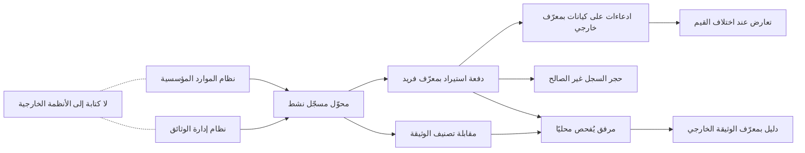

# التكامل مع أنظمة المؤسسة

<!-- BEGIN GENERATED: doc -->
| البند | القيمة |
|---|---|
| المعرّف | FEAT-COL-ENTERPRISE-INT |
| الإصدار | 0.1 |
| الحالة | مسودة |
| القدرة | CAP-02 جمع المعلومات |
| القدرة الفرعية | CAP-02.04 الاستيعاب والتكامل (R1) |
| الأدوار | مهندس التكامل؛ مسؤول الإدارة |
| الشاشات | SCR-65 المحوّلات والاتصالات والحساسات |
| حالات الاستخدام | UC-094 |
| القصص | 4: 0 من المواصفة، و4 جديدة |
<!-- END GENERATED: doc -->

## 1. نظرة عامة

### 1.1 القيمة

يربط أنظمة الموارد البشرية والمالية وإدارة الوثائق بالمنصة دون أن تصبح مرجعًا للحقيقة.

### 1.2 النطاق

| البند | القيمة |
|---|---|
| المستخدمون | مهندس التكامل يبني محوّلَي نظام الموارد المؤسسية (ERP) ونظام إدارة الوثائق ويتابع دفعاتهما، ومسؤول الأمن يحمي تصنيف الوثائق المستوردة، وفريق الأمن يتحقق من غياب أي كتابة إلى الأنظمة الخارجية |
| الشاشات | SCR-65 المحوّلات والاتصالات والحساسات |
| حالات الاستخدام | استيعاب البيانات الخارجية (UC-094) |
| المتطلبات | ربط أنظمة الموارد المؤسسية والموارد البشرية وإدارة الوثائق بمحوّلات مسجّلة تترجم سجلاتها إلى ادعاءات وأشخاص ووثائق دون أن تصبح مرجعًا للحقيقة، ولكل تكامل محوّل نشط واختبارات ربط وسلسلة اشتقاق، والقيم المتعارضة تفتح تعارضات (REQ-INT-001) |
| خارج النطاق | تسجيل المحوّل وتفعيله ودورة سحبه (ميزة «إدارة محوّلات البيانات»)، والاتصال وقاعدة شبكته (ميزة «اتصالات الأنظمة الخارجية»)، ومعالجة الدفعات والحجر (ميزة «استيراد البيانات والحجر»)، ومقترحات الموارد البشرية (ميزة «مزامنة تغييرات الموارد البشرية»)، وحسم التعارضات (ميزة «حل التعارضات») |

### 1.3 خريطة الميزة

**الشكل 1: خريطة ميزة التكامل مع أنظمة المؤسسة**



## 2. القواعد المشتركة

تنطبق على كل قصص الميزة، فلا تتكرر داخل القصص. وكل قصة تذكر ما يخصها فقط.

### 2.1 السياق المشترك

كل قصة تبدأ من ثلاثة شروط: مستأجر نشط، وحزمة السياسات الأساسية مفعّلة، ومستخدم مسجّل الدخول ومخوَّل. وتشير إليها القصص بخطوة واحدة: «بفرض السياق المشترك للميزة».

### 2.2 الصلاحية وعدم الإفصاح

- من لا يحق له رؤية العنصر يتلقى ردًا بشكل «غير متاح» تمامًا، فلا يعرف أنه موجود.
- من يرى العنصر ولا يحق له الإجراء يتلقى «لا تملك صلاحية هذا الإجراء».

### 2.3 أوامر تغيير الحالة

- **منع التكرار:** يُرسل كل أمر بمفتاح فريد، فإعادة الطلب نفسه لا تُنفَّذ مرتين.
- **حماية التعديل المتزامن:** يُرسل كل أمر بإصدار البيانات الذي يراه المستخدم. فإن عدّلها غيره في الأثناء، يُرفض الأمر.
- **السجل:** إن نجح الأمر، يُكتب حدثه وسجل التدقيق في المعاملة نفسها.

### 2.4 الرفض المشترك

```gherkin
# language: ar
خاصية: الرفض المشترك لأوامر الميزة

  سيناريو مخطط: رفض مشترك لكل أمر في الميزة
    بفرض السياق المشترك للميزة
    و <الحالة>
    عندما يُرسل المستخدم أي أمر من أوامر الميزة
    اذاً يُرفض برمز <الرمز> ويرى "<الرسالة>"
    و لا يتغير شيء

    امثلة:
      | الحالة                                  | الرمز                  | الرسالة                                                 |
      | العنصر خارج صلاحياته                    | NOT_FOUND              | غير متاح                                                |
      | العنصر مرئي له ولا يحق له الإجراء       | AUTHZ_DENIED           | لا تملك صلاحية هذا الإجراء                              |
      | غيره عدّل العنصر بعد أن فتحه            | VERSION_CONFLICT       | تغيّرت البيانات منذ فتحتها. راجع التغييرات ثم أعد المحاولة |
      | أعاد مفتاح منع التكرار بمحتوى مختلف     | IDEMPOTENCY_KEY_REUSED | طلب مكرر بمحتوى مختلف                                   |
      | البيانات ناقصة أو غير صحيحة             | VALIDATION_FAILED      | بعض البيانات ناقصة أو غير صحيحة. راجع الحقول المعلَّمة      |

  سيناريو: إعادة الطلب نفسه لا تُنفَّذ مرتين
    بفرض السياق المشترك للميزة
    و أمر نجح بمفتاح منع تكرار
    عندما يُعاد الطلب نفسه بالمفتاح نفسه
    اذاً تُعاد النتيجة الأولى ولا يُكتب حدث ثانٍ
```

### 2.5 قواعد التكامل المشتركة

- **مصادر لا مرجع للحقيقة:** ما يدخل من الأنظمة الخارجية يصبح ادعاءات أو أدلة تذكر مصدرها وموثوقيته، ولا يكتب فوق ما في المنصة. والقيم المتعارضة تفتح تعارضات.
- **عبر محوّل مسجّل فقط:** كل ما يدخل يمر بمحوّل نشط له إصدار ربط واختبارات، ويكتب بأوامر إدارة المعلومات بهوية حساب خدمته، ولكل سجل سلسلة اشتقاق إلى دفعته وإصدار الربط (ميزة «إدارة محوّلات البيانات»).
- **لا كتابة إلى الخارج:** لا تكتب المنصة إلى هذه الأنظمة، والمخرج الوحيد رسائل CAP الصادرة، أي التنبيهات العامة بصيغة بروتوكول التنبيه المشترك (القصة 5.4).
- **أنماط لا أنظمة بعينها:** الأنظمة الفعلية لكل مستأجر وواجهاتها غير معروفة بعد، وتُحدَّد عند تهيئته، ويُبنى محوّلها حينها.

> **ملاحظة:** المتطلب وتصميم التكامل يضعان هذه التكاملات في الإصدار R2، وملف الميزات يضع الميزة في R1. القصص تتبع المصدر (R2) **[Needs Review]**.

## 3. الجودة وتعريف الاكتمال

### 3.1 متطلبات الجودة

<!-- BEGIN GENERATED: quality -->
لا متطلبات جودة مرتبطة بمتطلبات هذه الميزة مباشرة. تنطبق متطلبات المنصة العامة (`FEAT-PLT-*`).
<!-- END GENERATED: quality -->

### 3.2 تعريف الاكتمال

القصة مكتملة حين تتحقق الشروط الخمسة:

1. سيناريوهاتها والقواعد المشتركة تمر في الاختبار الآلي.
2. فحوص البنية المعمارية تمر.
3. نصوص الواجهة والرسائل موجودة بالعربية والإنجليزية.
4. مراجعة الكود مكتملة.
5. ما تضيفه القصة نفسها في قسم «القواعد» تحقق.

## 4. فهرس القصص

<!-- BEGIN GENERATED: story-index -->
| المعرّف | القصة | النوع | الحالة |
|---|---|---|---|
| `US-INT-DMS-CLASS-MAPPING` | تحويل تصنيف الوثائق الخارجية بأمان | تكامل | مسودة |
| `US-INT-DMS-DOCUMENTS` | استيراد الوثائق من نظام إدارة الوثائق | تكامل | مسودة |
| `US-INT-ERP-MASTER-DATA` | استيراد بيانات المؤسسة الرئيسية من ERP | تكامل | مسودة |
| `US-OPS-ENTINT-NO-WRITEBACK` | التحقق من عدم الكتابة إلى الأنظمة الخارجية | تشغيل | مسودة |
<!-- END GENERATED: story-index -->

## 5. القصص

### 5.1 US-INT-DMS-CLASS-MAPPING — تحويل تصنيف الوثائق الخارجية بأمان

| النوع | الإصدار | الأولوية | دون اتصال | الحالة |
|---|---|---|---|---|
| تكامل | R2 | Should | لا ينطبق | مسودة |

> **كـ** مسؤول الأمن، **أريد** أن تأخذ كل وثيقة مستوردة من نظام إدارة الوثائق تصنيفها في المنصة من جدول مقابلة، وأن يأخذ التصنيف غير المطابق أعلى مستوى، **حتى** لا تدخل وثيقة بتصنيف أدنى من حقيقتها فيراها من لا يحق له.

**باختصار:** لكل مستأجر جدول يقابل رمز التصنيف في نظام إدارة الوثائق بمستوى المنصة. والرمز غير الموجود في الجدول يعطي الوثيقة أعلى مستوى افتراضي حتى تُراجع.

#### القواعد

- **متى يحدث:** عند استيراد كل وثيقة من نظام إدارة الوثائق (القصة 5.2).
- **الرسالة المتبادلة:** رمز تصنيف الوثيقة في نظام إدارة الوثائق، ضمن بياناتها الوصفية.
- **الأثر:** تأخذ الوثيقة المستوردة مستوى المنصة والمقصورات (قيود إضافية على من يرى داخل المستوى) المقابلة للرمز. والرمز غير المطابق يعطيها أعلى مستوى افتراضي، فلا يراها إلا من يسمح تصريحه بذلك المستوى.
- الجدول لكل مستأجر، ولكل رمز تصنيف في نظام إدارة الوثائق سطر واحد.
- لا يُخفَّض تصنيف وثيقة آليًا. وتغيير تصنيفها بعد المراجعة إعادة تصنيف للدليل ممن يملك سلطتها في سياسة المستأجر.

> **ملاحظة:** المصدر لا يحدد من يدير جدول المقابلة ولا من يراجع الوثيقة غير المطابقة، والأقرب مسؤول الأمن **[Needs Review]**.

#### معايير القبول

```gherkin
# language: ar
خاصية: تحويل تصنيف الوثائق الخارجية بأمان

  سيناريو: رمز تصنيف موجود في جدول المقابلة
    بفرض جدول المقابلة يقابل رمز تصنيف في نظام إدارة الوثائق بمستوى في المنصة
    و وثيقة في نظام إدارة الوثائق تحمل ذلك الرمز
    عندما يستوردها المحوّل
    اذاً تأخذ الوثيقة المستوردة المستوى المقابل للرمز

  سيناريو: رمز تصنيف غير موجود في الجدول
    بفرض وثيقة في نظام إدارة الوثائق برمز تصنيف لا يقابله سطر في الجدول
    عندما يستوردها المحوّل
    اذاً تأخذ أعلى مستوى افتراضي في المستأجر
    و لا يراها مستخدم تصريحه دون ذلك المستوى
    و تبقى بهذا المستوى حتى تُراجع
```

<details><summary>المراجع التقنية والتتبع</summary>

<!-- BEGIN GENERATED: refs US-INT-DMS-CLASS-MAPPING -->
| البند | المعرّف | المعنى |
|---|---|---|
| المصدر | `THR-S16-03` | — |
| المصدر | `enterprise-integration-spec.md §2` | — |
| المصدر | `20-integration-design.md §3` | — |
<!-- END GENERATED: refs US-INT-DMS-CLASS-MAPPING -->

</details>

### 5.2 US-INT-DMS-DOCUMENTS — استيراد الوثائق من نظام إدارة الوثائق

| النوع | الإصدار | الأولوية | دون اتصال | الحالة |
|---|---|---|---|---|
| تكامل | R2 | Must | لا ينطبق | مسودة |

> **كـ** مهندس التكامل، **أريد** أن يستورد محوّل نظام إدارة الوثائق الوثائق وبياناتها الوصفية فتصير مرفقات مفحوصة وأدلة مربوطة بمعرّفها الخارجي، **حتى** يستند المحللون إليها دون أن يصبح نظام الوثائق مرجعًا للحقيقة.

**باختصار:** كل وثيقة تُرفع مرفقًا يُفحص محليًا، ثم تُسجَّل دليلًا يذكر مصدر المحوّل، ويُربط معرّفها في نظام إدارة الوثائق بالدليل. والوثيقة التي تفشل في الفحص تُحجر.

#### القواعد

- **متى يحدث:** في كل دورة سحب لمحوّل نظام إدارة الوثائق وهو نشط (ميزة «إدارة محوّلات البيانات»).
- **الرسالة المتبادلة:** الوثيقة، وبياناتها الوصفية، ومعرّفها في نظام إدارة الوثائق، ورمز تصنيفها.
- **الأثر:** مرفق تطابق بصمته البصمة المعلنة، يُفحص بفاحص محتوى محلي وتحقق من الصيغة قبل حفظه. ثم دليل يذكر مصدر المحوّل بتصنيف من جدول المقابلة (القصة 5.1)، وربط لمعرّف الوثيقة الخارجي، وسلسلة اشتقاق إلى الدفعة وإصدار الربط.
- حجم الملف ونوعه ضمن حدود المستأجر.
- الوثيقة المحفوظة من قبل في المستأجر بالبصمة نفسها لا تُحفظ مرتين، ويُعاد المرفق القائم.
- معرّف الوثيقة الخارجي يقابل كائنًا واحدًا في أي وقت، وربطه لا يُحذف.
- الوثيقة التي يرفضها الفاحص تُحجر ولا تصير دليلًا.

#### معايير القبول

```gherkin
# language: ar
خاصية: استيراد الوثائق من نظام إدارة الوثائق

  سيناريو: استيراد وثيقة سليمة
    بفرض محوّل نظام إدارة الوثائق "نشط"
    و وثيقة جديدة في نظام إدارة الوثائق ببياناتها الوصفية
    عندما يستوردها المحوّل في دورة السحب
    اذاً تُحفظ مرفقًا بعد نجاح الفحص المحلي
    و تُسجَّل دليلًا يذكر مصدر المحوّل
    و يُربط معرّفها في نظام إدارة الوثائق بالدليل مع سلسلة اشتقاق إلى الدفعة

  سيناريو: وثيقة يرفضها الفاحص
    بفرض وثيقة في نظام إدارة الوثائق يرفض الفاحص المحلي محتواها
    عندما يستوردها المحوّل
    اذاً يُحجر المرفق ولا يُسجَّل دليل

  سيناريو مخطط: رفض خاص باستيراد الوثيقة
    بفرض محوّل نظام إدارة الوثائق "نشط"
    و <الحالة>
    عندما يستورد المحوّل الوثيقة
    اذاً تُرفض برمز <الرمز> مع "<الرسالة>"
    و لا يتغير شيء

    امثلة:
      | الحالة | الرمز | الرسالة |
      | حجم الملف أو نوعه خارج حدود المستأجر | ATTACHMENT_REJECTED | لا يمكن قبول الملف: تحقق من حجمه ونوعه |
      | الملف المرفوع لا يطابق البصمة المعلنة | HASH_MISMATCH | الملف المرفوع لا يطابق الملف المعلن. أعد الرفع |
      | معرّف الوثيقة الخارجي مربوط بكائن آخر | EXTERNAL_ID_TAKEN | هذا المعرّف الخارجي مرتبط بسجل آخر |
```

<details><summary>المراجع التقنية والتتبع</summary>

<!-- BEGIN GENERATED: refs US-INT-DMS-DOCUMENTS -->
| البند | المعرّف | المعنى |
|---|---|---|
| المصدر | `enterprise-integration-spec.md §2` | — |
| المتطلب | REQ-INT-001 | The system shall integrate ERP, HRIS and DMS through registered adapters that map external records to claims,… |
| حالة الاستخدام | UC-094 | Ingest External Data |
<!-- END GENERATED: refs US-INT-DMS-DOCUMENTS -->

</details>

### 5.3 US-INT-ERP-MASTER-DATA — استيراد بيانات المؤسسة الرئيسية من نظام الموارد المؤسسية

| النوع | الإصدار | الأولوية | دون اتصال | الحالة |
|---|---|---|---|---|
| تكامل | R2 | Must | لا ينطبق | مسودة |

> **كـ** مهندس التكامل، **أريد** أن يستورد محوّل نظام الموارد المؤسسية (ERP) المواقع والمرافق والموردين والمخزون ادعاءاتٍ على كيانات المنصة، **حتى** تتوفر البيانات الرئيسية دون أن يكتب النظام الخارجي فوق ما في المنصة.

**باختصار:** سجلات نظام الموارد المؤسسية تدخل دفعات استيراد، وكل سجل صالح يصير ادعاءً على كيان مربوط بمعرّفه في ذلك النظام. والقيمة المخالفة لما في المنصة تفتح تعارضًا ولا تكتب فوقه.

#### القواعد

- **متى يحدث:** في كل دورة سحب لمحوّل نظام الموارد المؤسسية وهو نشط، من آخر نقطة مؤكدة لاتصاله.
- **الرسالة المتبادلة:** سجلات البيانات الرئيسية: المواقع، والمرافق، والموردون، والمخزون.
- **الأثر:** ادعاءات تذكر مصدر المحوّل على كيانات مربوطة بمعرّف السجل في نظام الموارد المؤسسية، مع سلسلة اشتقاق إلى الدفعة وإصدار الربط. والقيمة المخالفة لما في المنصة تفتح تعارضًا يحسمه إنسان (ميزة «حل التعارضات»). والسجل غير الصالح يُحجر بسببه.
- الدفعة بمعرّف فريد للمحوّل، وإعادتها بالمحتوى نفسه لا تكرر أي سجل.
- انقطاع الاتصال 4 ساعات لا يُفقد شيئًا، ويُعالج التراكم خلال ساعة (QAS-INT-001).

#### معايير القبول

```gherkin
# language: ar
خاصية: استيراد بيانات المؤسسة الرئيسية من نظام الموارد المؤسسية

  سيناريو: استيراد موقع جديد
    بفرض محوّل نظام الموارد المؤسسية "نشط"
    و في النظام سجل موقع جديد بعد آخر نقطة مؤكدة
    عندما يستورده المحوّل في دورة السحب
    اذاً يُسجَّل ادعاء يذكر مصدر المحوّل على كيان مربوط بمعرّف الموقع في النظام
    و يُسجَّل للادعاء سلسلة اشتقاق إلى الدفعة وإصدار الربط

  سيناريو: قيمة تخالف ما في المنصة
    بفرض كيان في المنصة له قيمة يدعمها مصدر آخر
    و سجل في نظام الموارد المؤسسية يحمل قيمة مختلفة للخاصية نفسها
    عندما يستورده المحوّل
    اذاً يُسجَّل ادعاء المحوّل إلى جانب القيمة القائمة
    و يُفتح تعارض ولا تُكتب القيمة الجديدة فوق القائمة

  سيناريو: إعادة الدفعة نفسها لا تكرر السجلات
    بفرض دفعة سُلِّمت ولم يصل تأكيدها إلى المحوّل
    عندما يعيد المحوّل تسليمها بالمعرّف نفسه والمحتوى نفسه
    اذاً تُعاد الدفعة القائمة ولا يتكرر أي ادعاء

  سيناريو مخطط: رفض خاص بدفعة نظام الموارد المؤسسية
    بفرض محوّل نظام الموارد المؤسسية "نشط" سلّم دفعات من قبل
    و <الحالة>
    عندما يسلّم المحوّل الدفعة
    اذاً تُرفض برمز <الرمز> مع "<الرسالة>"
    و لا يتغير شيء

    امثلة:
      | الحالة | الرمز | الرسالة |
      | أُعيد معرّف دفعة سابقة بمحتوى مختلف | BATCH_KEY_REUSED | استُخدم معرّف هذه الدفعة من قبل بمحتوى مختلف |
```

<details><summary>المراجع التقنية والتتبع</summary>

<!-- BEGIN GENERATED: refs US-INT-ERP-MASTER-DATA -->
| البند | المعرّف | المعنى |
|---|---|---|
| المصدر | `enterprise-integration-spec.md §2` | — |
| المصدر | `20-integration-design.md §2` | — |
| المصدر | `BRL-013` | — |
| المتطلب | REQ-INT-001 | The system shall integrate ERP, HRIS and DMS through registered adapters that map external records to claims,… |
| حالة الاستخدام | UC-094 | Ingest External Data |
<!-- END GENERATED: refs US-INT-ERP-MASTER-DATA -->

</details>

### 5.4 US-OPS-ENTINT-NO-WRITEBACK — التحقق من عدم الكتابة إلى الأنظمة الخارجية

| النوع | الإصدار | الأولوية | دون اتصال | الحالة |
|---|---|---|---|---|
| تشغيل | R2 | Should | لا ينطبق | مسودة |

> **كـ** فريق الأمن، **أريد** أن أتحقق أن المنصة لا تكتب إلى أنظمة الموارد المؤسسية والموارد البشرية وإدارة الوثائق وإدارة الصيانة، وأن مخرجها الوحيد رسائل CAP الصادرة، **حتى** لا يتسرب محتوى مصنّف عبر تكامل.

**باختصار:** اتصالات هذه الأنظمة واردة فقط، والاتجاه الصادر لنقطة نهاية CAP وحدها. ولكل اتصال قاعدة شبكة واحدة يعتمدها مسؤول أمن.

#### القواعد

- اتصال نظام الموارد المؤسسية أو الموارد البشرية أو إدارة الوثائق أو إدارة الصيانة يُسجَّل واردًا فقط. والاتجاه الصادر مسموح لنقطة نهاية CAP وحدها، وغير ذلك يُرفض عند التسجيل.
- لكل اتصال قاعدة سماح واحدة في بوابة الشبكة يعتمدها مسؤول أمن غير الطالب، وتعليق الاتصال يعطّلها فورًا.
- الرسالة الصادرة تُملأ من قالب بالحقول القابلة للإصدار فقط، ضمن مستوى الإصدار الخارجي للمستأجر، ويصدرها غير من أعدّها.
- بيانات الاعتماد لا تظهر في المواصفات ولا السجلات ولا الأحداث، ويُشار إليها في مخزن الأسرار فقط.
- يُراجع دوريًا أن قواعد الشبكة الصادرة لا تشمل إلا نقاط نهاية CAP **[Derived]**.

#### معايير القبول

```gherkin
# language: ar
خاصية: التحقق من عدم الكتابة إلى الأنظمة الخارجية

  سيناريو: اتصال صادر إلى نظام الموارد المؤسسية لا يُسجَّل
    بفرض مسؤول الإدارة يسجّل اتصالًا بنظام الموارد المؤسسية
    عندما يختار الاتجاه الصادر
    اذاً يُرفض التسجيل ويرى "إعداد الاتصال غير صحيح"
    و لا يُنشأ الاتصال ولا قاعدة شبكته

  سيناريو: مراجعة قواعد الشبكة الصادرة
    بفرض اتصالات نشطة بأنظمة المؤسسة واتصال بنقطة نهاية CAP
    عندما يراجع فريق الأمن قواعد السماح في بوابة الشبكة
    اذاً لا يجد قاعدة صادرة إلا لنقطة نهاية CAP

  سيناريو: تعليق الاتصال يقطع الشبكة فورًا
    بفرض اتصال نشط بنظام إدارة الوثائق
    عندما يُعلَّق الاتصال
    اذاً تتعطل قاعدة السماح الخاصة به فورًا
```

<details><summary>المراجع التقنية والتتبع</summary>

<!-- BEGIN GENERATED: refs US-OPS-ENTINT-NO-WRITEBACK -->
| البند | المعرّف | المعنى |
|---|---|---|
| المصدر | `INV-CON-02` | — |
| المصدر | `THR-S16-01` | — |
| المصدر | `BRL-013` | — |
<!-- END GENERATED: refs US-OPS-ENTINT-NO-WRITEBACK -->

</details>

## 6. التتبع

<!-- BEGIN GENERATED: trace -->
| المتطلب | المعنى | القصص | الاختبار |
|---|---|---|---|
| REQ-INT-001 | The system shall integrate ERP, HRIS and DMS through registered adapters that map external records to claims,… | `US-INT-DMS-DOCUMENTS`، `US-INT-ERP-MASTER-DATA` | TST-INTEGRATION-CONNECTION-SM، TST-SLC16-INVARIANTS |
<!-- END GENERATED: trace -->

## 7. سجل التغييرات

| الإصدار | التاريخ | التغيير |
|---|---|---|
| 0.1 | — | هيكل مولَّد من خريطة الميزات |
| 0.2 | 2026-10-03 | كتابة القصص كاملة بمعيار القصص |
