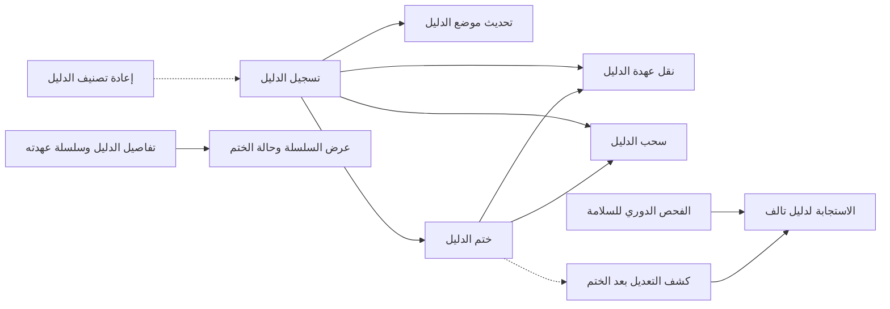
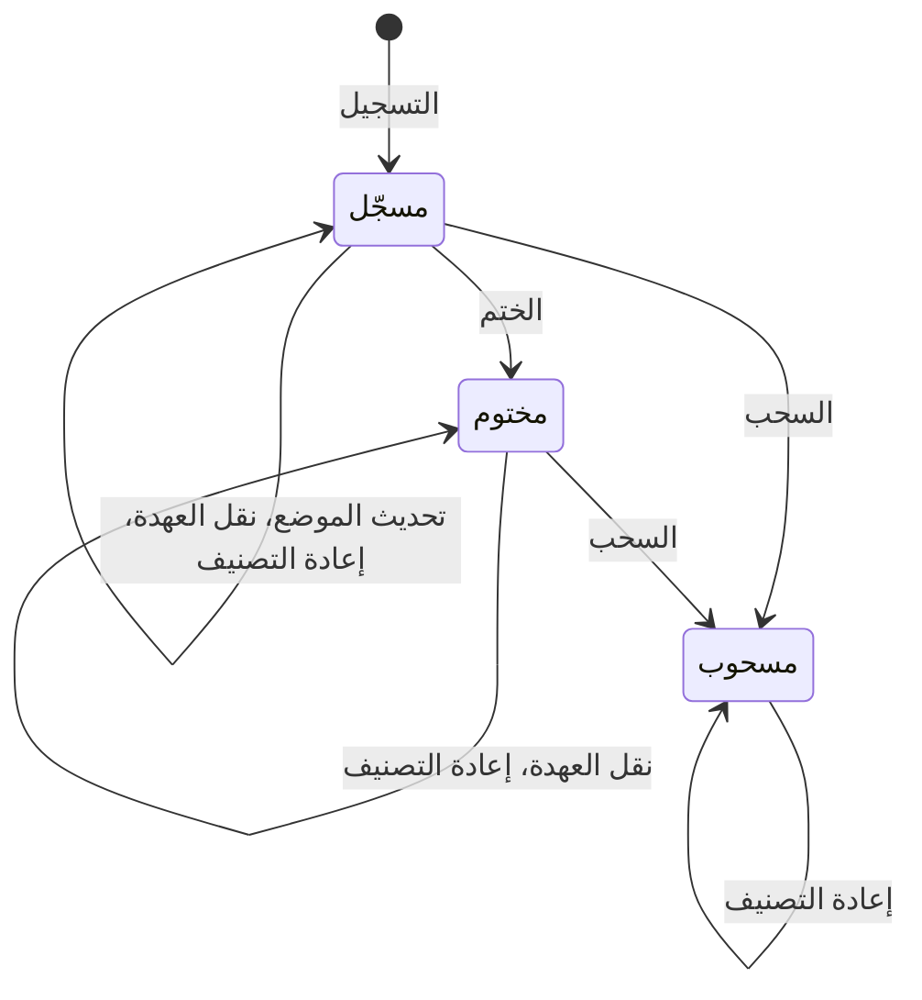

# حفظ الأدلة وسلسلة العهدة

<!-- BEGIN GENERATED: doc -->
| البند | القيمة |
|---|---|
| المعرّف | FEAT-COL-EVIDENCE |
| الإصدار | 0.1 |
| الحالة | مسودة |
| القدرة | CAP-02 جمع المعلومات |
| القدرة الفرعية | CAP-02.03 تسجيل الملاحظات (بما فيها دون اتصال) (R1) |
| الأدوار | المحلل؛ المستخدم الميداني؛ أمين العهدة |
| الشاشات | SCR-22 الادعاء والدليل والمصدر |
| حالات الاستخدام | UC-005، UC-006 |
| القصص | 11: 7 من المواصفة، و4 جديدة |
<!-- END GENERATED: doc -->

## 1. نظرة عامة

### 1.1 القيمة

يحفظ الدليل وموقعه ويختمه ويسجل كل نقل لعهدته حتى يبقى موثوقًا ومقبولًا.

### 1.2 النطاق

| البند | القيمة |
|---|---|
| المستخدمون | المحلل، والمستخدم الميداني في تسجيل الدليل، وأمين العهدة في نقل العهدة، وأي مستخدم مخوَّل في الاطلاع؛ وفريق المنصة والتشغيل والأمن في سلامة الأدلة |
| الشاشات | الادعاء والدليل والمصدر في تطبيق الويب؛ والتقاط الملاحظة في التطبيق الميداني لتسجيل الدليل |
| حالات الاستخدام | تسجيل الملاحظة، وإدارة الأدلة |
| المتطلبات | حفظ المرفقات في مخزن الملفات والإشارة إليها ببصمة محتواها (REQ-INF-003)؛ وحساب البصمة أو التحقق منها عند كل حفظ أو استرجاع، فيُكشف الملف التالف عند استرجاعه (REQ-INF-004)؛ وتغيير التصنيف بالسلطة التي تحددها سياسة المستأجر (REQ-GOV-004) |
| خارج النطاق | رفع الملف نفسه وتنزيله («رفع المرفقات وتنزيلها»)؛ ربط الدليل بالادعاء وحساب حالة التحقق في الادعاء (قدرة إدارة المعلومات)؛ تسجيل الملاحظة («تسجيل الملاحظات»)؛ رفع ما سُجّل دون اتصال («المزامنة الميدانية») |

### 1.3 خريطة الميزة

يبدأ الدليل بتسجيله من مرفق محفوظ أو من ملاحظة. ثم يُحدَّد موضعه داخل الملف ويُختم، وتُنقل عهدته من حائز إلى حائز حتى يُسحب إن ثبت أنه لا يصلح. والمنصة والتشغيل يتحققان من سلامته بعد الختم. والشكل 1 يجمع القصص، والشكل 2 يبيّن حالات الدليل.

**الشكل 1: خريطة ميزة «حفظ الأدلة وسلسلة العهدة»**



**الشكل 2: رحلة الدليل**



> **ملاحظة:** «مسحوب» حالة نهائية، لكن المصدر يسمح فيها بإعادة التصنيف وحدها، حتى يبقى الدليل المسحوب محميًا بالتصنيف الصحيح.

## 2. القواعد المشتركة

تنطبق على كل قصص الميزة، فلا تتكرر داخل القصص. وكل قصة تذكر ما يخصها فقط.

### 2.1 السياق المشترك

كل قصة تبدأ من ثلاثة شروط: مستأجر نشط، وحزمة السياسات الأساسية مفعّلة، ومستخدم مسجّل الدخول ومخوَّل. وتشير إليها القصص بخطوة واحدة: «بفرض السياق المشترك للميزة».

### 2.2 الصلاحية وعدم الإفصاح

- من لا يحق له رؤية العنصر يتلقى ردًا بشكل «غير متاح» تمامًا، فلا يعرف أنه موجود.
- من يرى العنصر ولا يحق له الإجراء يتلقى «لا تملك صلاحية هذا الإجراء».

### 2.3 أوامر تغيير الحالة

- **منع التكرار:** يُرسل كل أمر بمفتاح فريد، فإعادة الطلب نفسه لا تُنفَّذ مرتين.
- **حماية التعديل المتزامن:** يُرسل كل أمر بإصدار البيانات الذي يراه المستخدم. فإن عدّلها غيره في الأثناء، يُرفض الأمر.
- **السجل:** إن نجح الأمر، يُكتب حدثه وسجل التدقيق في المعاملة نفسها.

### 2.4 الرفض المشترك

```gherkin
# language: ar
خاصية: الرفض المشترك لأوامر الميزة

  سيناريو مخطط: رفض مشترك لكل أمر في الميزة
    بفرض السياق المشترك للميزة
    و <الحالة>
    عندما يُرسل المستخدم أي أمر من أوامر الميزة
    اذاً يُرفض برمز <الرمز> ويرى "<الرسالة>"
    و لا يتغير شيء

    امثلة:
      | الحالة                                  | الرمز                  | الرسالة                                                 |
      | العنصر خارج صلاحياته                    | NOT_FOUND              | غير متاح                                                |
      | العنصر مرئي له ولا يحق له الإجراء       | AUTHZ_DENIED           | لا تملك صلاحية هذا الإجراء                              |
      | غيره عدّل العنصر بعد أن فتحه            | VERSION_CONFLICT       | تغيّرت البيانات منذ فتحتها. راجع التغييرات ثم أعد المحاولة |
      | أعاد مفتاح منع التكرار بمحتوى مختلف     | IDEMPOTENCY_KEY_REUSED | طلب مكرر بمحتوى مختلف                                   |
      | البيانات ناقصة أو غير صحيحة             | VALIDATION_FAILED      | بعض البيانات ناقصة أو غير صحيحة. راجع الحقول المعلَّمة      |

  سيناريو: إعادة الطلب نفسه لا تُنفَّذ مرتين
    بفرض السياق المشترك للميزة
    و أمر نجح بمفتاح منع تكرار
    عندما يُعاد الطلب نفسه بالمفتاح نفسه
    اذاً تُعاد النتيجة الأولى ولا يُكتب حدث ثانٍ
```

### 2.5 قواعد الدليل

- **لا حذف:** الدليل لا يُحذف أبدًا. والسحب يبقيه ويبقي روابطه بالادعاءات.
- **بعد الختم:** لا يتغير في الدليل المختوم إلا عهدته وتصنيفه.
- **سلسلة العهدة:** كل نقل يضيف إليها قيدًا بالتسلسل التالي، فلا تكون فيها فجوة.
- **الحالة والإصدار:** يُفحص الإصدار قبل الحالة. فإن تغيّر الدليل بعد أن فتحه المستخدم، كأن خُتم أو سُحب، يُرفض أمره بتعارض الإصدار (§2.4). ورفض الحالة في القصص يخص أمرًا أُرسل على الإصدار الحالي وحالته لا تسمح به.

## 3. الجودة وتعريف الاكتمال

### 3.1 متطلبات الجودة

<!-- BEGIN GENERATED: quality -->
لا متطلبات جودة مرتبطة بمتطلبات هذه الميزة مباشرة. تنطبق متطلبات المنصة العامة (`FEAT-PLT-*`).
<!-- END GENERATED: quality -->

### 3.2 تعريف الاكتمال

القصة مكتملة حين تتحقق الشروط الخمسة:

1. سيناريوهاتها والقواعد المشتركة تمر في الاختبار الآلي.
2. فحوص البنية المعمارية تمر.
3. نصوص الواجهة والرسائل موجودة بالعربية والإنجليزية.
4. مراجعة الكود مكتملة.
5. ما تضيفه القصة نفسها في قسم «القواعد» تحقق.

## 4. فهرس القصص

<!-- BEGIN GENERATED: story-index -->
| المعرّف | القصة | النوع | الحالة |
|---|---|---|---|
| `US-BC02-EVD-RECLASSIFY` | إعادة تصنيف الدليل | أمر | مسودة |
| `US-BC02-EVD-REGISTER` | تسجيل الدليل | أمر | مسودة |
| `US-BC02-EVD-SEAL` | ختم الدليل | أمر | مسودة |
| `US-BC02-EVD-TRANSFER-CUSTODY` | نقل عهدة الدليل | أمر | مسودة |
| `US-BC02-EVD-UPDATE-LOCATOR` | تحديث محدِّد موقع الدليل | أمر | مسودة |
| `US-BC02-EVD-WITHDRAW` | سحب الدليل | أمر | مسودة |
| `US-BC02-Q-EVD-GET` | جلب: Evidence metadata and custody chain | جلب | مسودة |
| `US-UI-SCR22-CUSTODY-CHAIN` | عرض سلسلة عهدة الدليل وحالة ختمه | واجهة | مسودة |
| `US-PLT-EVD-SEAL-VERIFY` | كشف أي تعديل على الدليل بعد ختمه | منصة | مسودة |
| `US-OPS-EVD-FIXITY-CHECK` | فحص دوري لسلامة الأدلة المختومة | تشغيل | مسودة |
| `US-OPS-EVD-INTEGRITY-INCIDENT` | الاستجابة لاكتشاف دليل تالف | تشغيل | مسودة |
<!-- END GENERATED: story-index -->

## 5. القصص

### 5.1 US-BC02-EVD-RECLASSIFY — إعادة تصنيف الدليل

| النوع | الإصدار | الأولوية | دون اتصال | الحالة |
|---|---|---|---|---|
| أمر | R1 | Must | لا | مسودة |

> **كـ** **[للكتابة]**، **أريد** **[للكتابة]**، **حتى** **[للكتابة]**.

**باختصار:** **[للكتابة]**

#### القواعد

**[للكتابة]**

#### معايير القبول

**[للكتابة]**

<details><summary>المراجع التقنية والتتبع</summary>

<!-- BEGIN GENERATED: refs US-BC02-EVD-RECLASSIFY -->
| البند | المعرّف | المعنى |
|---|---|---|
| الواجهة البرمجية | `POST /api/v1/information/evidence/{id}/actions/reclassify` | — |
| الأمر | `CMD-EVD-RECLASSIFY` | إعادة تصنيف الدليل |
| السياسة | `POL-EVD-RECLASSIFY` | Analyst · Field User (register) · custodian role (custody)؛ tenant match; object visible to subject (label ≤… |
| الحدث | `EVT-EVD-RECLASSIFIED` | يصل إلى: Security-version service (EVT-SEC-VERSION-INCREMENTED); PEP decision caches; Projection security-ver… |
| الكيان | `AGG-EVIDENCE` | الدليل |
| الجدول | `information.evidence` | الجدول الرئيسي للدليل |
| وحدة النشر | DU-04 | — |
| المتطلبات | REQ-INF-003، REQ-INF-004 | معانيها في القسم 6. التتبع |
| حالات الاستخدام | UC-005، UC-006 | Register Observation؛ Manage Evidence |
| الاختبار | TST-EVIDENCE-SM، TST-SLC02-INVARIANTS | دورة حالات الدليل، وثوابت الشريحة SLC-02 |
<!-- END GENERATED: refs US-BC02-EVD-RECLASSIFY -->

</details>

### 5.2 US-BC02-EVD-REGISTER — تسجيل الدليل

| النوع | الإصدار | الأولوية | دون اتصال | الحالة |
|---|---|---|---|---|
| أمر | R1 | Must | نعم | مسودة |

> **كـ** **[للكتابة]**، **أريد** **[للكتابة]**، **حتى** **[للكتابة]**.

**باختصار:** **[للكتابة]**

#### القواعد

**[للكتابة]**

#### معايير القبول

**[للكتابة]**

<details><summary>المراجع التقنية والتتبع</summary>

<!-- BEGIN GENERATED: refs US-BC02-EVD-REGISTER -->
| البند | المعرّف | المعنى |
|---|---|---|
| الواجهة البرمجية | `POST /api/v1/information/evidence` | دون اتصال: نعم |
| الأمر | `CMD-EVD-REGISTER` | تسجيل الدليل |
| السياسة | `POL-EVD-REGISTER` | Analyst · Field User (register) · custodian role (custody)؛ tenant match; object visible to subject (label ≤… |
| الحدث | `EVT-EVD-REGISTERED` | يصل إلى: Verification re-evaluator (on WITHDRAWN: issues CMD-CLM-ASSESS as system identity for linked claims,… |
| الكيان | `AGG-EVIDENCE` | الدليل |
| الجدول | `information.evidence` | الجدول الرئيسي للدليل |
| وحدة النشر | DU-04 | — |
| المتطلبات | REQ-INF-003، REQ-INF-004 | معانيها في القسم 6. التتبع |
| حالات الاستخدام | UC-005، UC-006 | Register Observation؛ Manage Evidence |
| الاختبار | TST-EVIDENCE-SM، TST-SLC02-INVARIANTS | دورة حالات الدليل، وثوابت الشريحة SLC-02 |
<!-- END GENERATED: refs US-BC02-EVD-REGISTER -->

</details>

### 5.3 US-BC02-EVD-SEAL — ختم الدليل

| النوع | الإصدار | الأولوية | دون اتصال | الحالة |
|---|---|---|---|---|
| أمر | R1 | Must | لا | مسودة |

> **كـ** **[للكتابة]**، **أريد** **[للكتابة]**، **حتى** **[للكتابة]**.

**باختصار:** **[للكتابة]**

#### القواعد

**[للكتابة]**

#### معايير القبول

**[للكتابة]**

<details><summary>المراجع التقنية والتتبع</summary>

<!-- BEGIN GENERATED: refs US-BC02-EVD-SEAL -->
| البند | المعرّف | المعنى |
|---|---|---|
| الواجهة البرمجية | `POST /api/v1/information/evidence/{id}/actions/seal` | — |
| الأمر | `CMD-EVD-SEAL` | ختم الدليل |
| السياسة | `POL-EVD-SEAL` | Analyst · Field User (register) · custodian role (custody)؛ tenant match; object visible to subject (label ≤… |
| الحدث | `EVT-EVD-SEALED` | يصل إلى: Verification re-evaluator (on WITHDRAWN: issues CMD-CLM-ASSESS as system identity for linked claims,… |
| الكيان | `AGG-EVIDENCE` | الدليل |
| الجدول | `information.evidence` | الجدول الرئيسي للدليل |
| وحدة النشر | DU-04 | — |
| المتطلبات | REQ-INF-003، REQ-INF-004 | معانيها في القسم 6. التتبع |
| حالات الاستخدام | UC-005، UC-006 | Register Observation؛ Manage Evidence |
| الاختبار | TST-EVIDENCE-SM، TST-SLC02-INVARIANTS | دورة حالات الدليل، وثوابت الشريحة SLC-02 |
<!-- END GENERATED: refs US-BC02-EVD-SEAL -->

</details>

### 5.4 US-BC02-EVD-TRANSFER-CUSTODY — نقل عهدة الدليل

| النوع | الإصدار | الأولوية | دون اتصال | الحالة |
|---|---|---|---|---|
| أمر | R1 | Must | لا | مسودة |

> **كـ** **[للكتابة]**، **أريد** **[للكتابة]**، **حتى** **[للكتابة]**.

**باختصار:** **[للكتابة]**

#### القواعد

**[للكتابة]**

#### معايير القبول

**[للكتابة]**

<details><summary>المراجع التقنية والتتبع</summary>

<!-- BEGIN GENERATED: refs US-BC02-EVD-TRANSFER-CUSTODY -->
| البند | المعرّف | المعنى |
|---|---|---|
| الواجهة البرمجية | `POST /api/v1/information/evidence/{id}/actions/transfer-custody` | — |
| الأمر | `CMD-EVD-TRANSFER-CUSTODY` | نقل عهدة الدليل |
| السياسة | `POL-EVD-TRANSFER-CUSTODY` | Analyst · Field User (register) · custodian role (custody)؛ tenant match; object visible to subject (label ≤… |
| الحدث | `EVT-EVD-CUSTODY-TRANSFERRED` | يصل إلى: Verification re-evaluator (on WITHDRAWN: issues CMD-CLM-ASSESS as system identity for linked claims,… |
| الكيان | `AGG-EVIDENCE` | الدليل |
| الجدول | `information.evidence` | الجدول الرئيسي للدليل |
| وحدة النشر | DU-04 | — |
| المتطلبات | REQ-INF-003، REQ-INF-004 | معانيها في القسم 6. التتبع |
| حالات الاستخدام | UC-005، UC-006 | Register Observation؛ Manage Evidence |
| الاختبار | TST-EVIDENCE-SM، TST-SLC02-INVARIANTS | دورة حالات الدليل، وثوابت الشريحة SLC-02 |
<!-- END GENERATED: refs US-BC02-EVD-TRANSFER-CUSTODY -->

</details>

### 5.5 US-BC02-EVD-UPDATE-LOCATOR — تحديث محدِّد موقع الدليل

| النوع | الإصدار | الأولوية | دون اتصال | الحالة |
|---|---|---|---|---|
| أمر | R1 | Must | لا | مسودة |

> **كـ** **[للكتابة]**، **أريد** **[للكتابة]**، **حتى** **[للكتابة]**.

**باختصار:** **[للكتابة]**

#### القواعد

**[للكتابة]**

#### معايير القبول

**[للكتابة]**

<details><summary>المراجع التقنية والتتبع</summary>

<!-- BEGIN GENERATED: refs US-BC02-EVD-UPDATE-LOCATOR -->
| البند | المعرّف | المعنى |
|---|---|---|
| الواجهة البرمجية | `POST /api/v1/information/evidence/{id}/actions/update-locator` | — |
| الأمر | `CMD-EVD-UPDATE-LOCATOR` | تحديث محدِّد موقع الدليل |
| السياسة | `POL-EVD-UPDATE-LOCATOR` | Analyst · Field User (register) · custodian role (custody)؛ tenant match; object visible to subject (label ≤… |
| الحدث | `EVT-EVD-LOCATOR-UPDATED` | يصل إلى: Verification re-evaluator (on WITHDRAWN: issues CMD-CLM-ASSESS as system identity for linked claims,… |
| الكيان | `AGG-EVIDENCE` | الدليل |
| الجدول | `information.evidence` | الجدول الرئيسي للدليل |
| وحدة النشر | DU-04 | — |
| المتطلبات | REQ-INF-003، REQ-INF-004 | معانيها في القسم 6. التتبع |
| حالات الاستخدام | UC-005، UC-006 | Register Observation؛ Manage Evidence |
| الاختبار | TST-EVIDENCE-SM، TST-SLC02-INVARIANTS | دورة حالات الدليل، وثوابت الشريحة SLC-02 |
<!-- END GENERATED: refs US-BC02-EVD-UPDATE-LOCATOR -->

</details>

### 5.6 US-BC02-EVD-WITHDRAW — سحب الدليل

| النوع | الإصدار | الأولوية | دون اتصال | الحالة |
|---|---|---|---|---|
| أمر | R1 | Must | لا | مسودة |

> **كـ** **[للكتابة]**، **أريد** **[للكتابة]**، **حتى** **[للكتابة]**.

**باختصار:** **[للكتابة]**

#### القواعد

**[للكتابة]**

#### معايير القبول

**[للكتابة]**

<details><summary>المراجع التقنية والتتبع</summary>

<!-- BEGIN GENERATED: refs US-BC02-EVD-WITHDRAW -->
| البند | المعرّف | المعنى |
|---|---|---|
| الواجهة البرمجية | `POST /api/v1/information/evidence/{id}/actions/withdraw` | — |
| الأمر | `CMD-EVD-WITHDRAW` | سحب الدليل |
| السياسة | `POL-EVD-WITHDRAW` | Analyst · Field User (register) · custodian role (custody)؛ tenant match; object visible to subject (label ≤… |
| الحدث | `EVT-EVD-WITHDRAWN` | يصل إلى: Verification re-evaluator (on WITHDRAWN: issues CMD-CLM-ASSESS as system identity for linked claims,… |
| الكيان | `AGG-EVIDENCE` | الدليل |
| الجدول | `information.evidence` | الجدول الرئيسي للدليل |
| وحدة النشر | DU-04 | — |
| المتطلبات | REQ-INF-003، REQ-INF-004 | معانيها في القسم 6. التتبع |
| حالات الاستخدام | UC-005، UC-006 | Register Observation؛ Manage Evidence |
| الاختبار | TST-EVIDENCE-SM، TST-SLC02-INVARIANTS | دورة حالات الدليل، وثوابت الشريحة SLC-02 |
<!-- END GENERATED: refs US-BC02-EVD-WITHDRAW -->

</details>

### 5.7 US-BC02-Q-EVD-GET — جلب: Evidence metadata and custody chain

| النوع | الإصدار | الأولوية | دون اتصال | الحالة |
|---|---|---|---|---|
| جلب | R1 | Must | لا | مسودة |

> **كـ** **[للكتابة]**، **أريد** **[للكتابة]**، **حتى** **[للكتابة]**.

**باختصار:** **[للكتابة]**

#### القواعد

**[للكتابة]**

#### معايير القبول

**[للكتابة]**

<details><summary>المراجع التقنية والتتبع</summary>

<!-- BEGIN GENERATED: refs US-BC02-Q-EVD-GET -->
| البند | المعرّف | المعنى |
|---|---|---|
| الواجهة البرمجية | `GET /api/v1/information/evidence/{evidence_id}` | — |
| الاستعلام | `QRY-EVD-GET` | Evidence metadata and custody chain |
| السياسة | `POL-EVD-GET` | org scope ∩ classification rule; claims filtered by label |
| الكيان | `AGG-EVIDENCE` | الدليل |
| الجدول | `information.evidence` | الجدول الرئيسي للدليل |
| وحدة النشر | DU-04 | — |
| المتطلب | REQ-INF-004 | When an attachment is stored or retrieved, the system shall compute or verify its content hash. |
| حالة الاستخدام | UC-006 | Manage Evidence |
| الاختبار | TST-EVIDENCE-SM، TST-SLC02-INVARIANTS | دورة حالات الدليل، وثوابت الشريحة SLC-02 |
<!-- END GENERATED: refs US-BC02-Q-EVD-GET -->

</details>

### 5.8 US-UI-SCR22-CUSTODY-CHAIN — عرض سلسلة عهدة الدليل وحالة ختمه

| النوع | الإصدار | الأولوية | دون اتصال | الحالة |
|---|---|---|---|---|
| واجهة | R1 | Should | لا | مسودة |

> **كـ** **[للكتابة]**، **أريد** **[للكتابة]**، **حتى** **[للكتابة]**.

**باختصار:** **[للكتابة]**

#### القواعد

**[للكتابة]**

#### معايير القبول

**[للكتابة]**

<details><summary>المراجع التقنية والتتبع</summary>

<!-- BEGIN GENERATED: refs US-UI-SCR22-CUSTODY-CHAIN -->
| البند | المعرّف | المعنى |
|---|---|---|
| الشاشة | SCR-22 | شاشة الادعاء والدليل والمصدر |
| المصدر | `QRY-EVD-GET` | — |
| حالة الاستخدام | UC-006 | Manage Evidence |
<!-- END GENERATED: refs US-UI-SCR22-CUSTODY-CHAIN -->

</details>

### 5.9 US-PLT-EVD-SEAL-VERIFY — كشف أي تعديل على الدليل بعد ختمه

| النوع | الإصدار | الأولوية | دون اتصال | الحالة |
|---|---|---|---|---|
| منصة | R1 | Must | لا ينطبق | مسودة |

> **كـ** **[للكتابة]**، **أريد** **[للكتابة]**، **حتى** **[للكتابة]**.

**باختصار:** **[للكتابة]**

#### القواعد

**[للكتابة]**

#### معايير القبول

**[للكتابة]**

<details><summary>المراجع التقنية والتتبع</summary>

<!-- BEGIN GENERATED: refs US-PLT-EVD-SEAL-VERIFY -->
| البند | المعرّف | المعنى |
|---|---|---|
| المصدر | `THR-S02-06` | — |
| المتطلب | REQ-INF-004 | When an attachment is stored or retrieved, the system shall compute or verify its content hash. |
| حالة الاستخدام | UC-006 | Manage Evidence |
<!-- END GENERATED: refs US-PLT-EVD-SEAL-VERIFY -->

</details>

### 5.10 US-OPS-EVD-FIXITY-CHECK — فحص دوري لسلامة الأدلة المختومة

| النوع | الإصدار | الأولوية | دون اتصال | الحالة |
|---|---|---|---|---|
| تشغيل | R1 | Must | لا ينطبق | مسودة |

> **كـ** **[للكتابة]**، **أريد** **[للكتابة]**، **حتى** **[للكتابة]**.

**باختصار:** **[للكتابة]**

#### القواعد

**[للكتابة]**

#### معايير القبول

**[للكتابة]**

<details><summary>المراجع التقنية والتتبع</summary>

<!-- BEGIN GENERATED: refs US-OPS-EVD-FIXITY-CHECK -->
| البند | المعرّف | المعنى |
|---|---|---|
| المصدر | `THR-S02-06` | — |
| المصدر | `[Derived]` | — |
| المتطلبات | REQ-INF-004، REQ-INF-003 | معانيها في القسم 6. التتبع |
| حالات الاستخدام | UC-005، UC-006 | Register Observation؛ Manage Evidence |
<!-- END GENERATED: refs US-OPS-EVD-FIXITY-CHECK -->

</details>

### 5.11 US-OPS-EVD-INTEGRITY-INCIDENT — الاستجابة لاكتشاف دليل تالف

| النوع | الإصدار | الأولوية | دون اتصال | الحالة |
|---|---|---|---|---|
| تشغيل | R1 | Must | لا ينطبق | مسودة |

> **كـ** **[للكتابة]**، **أريد** **[للكتابة]**، **حتى** **[للكتابة]**.

**باختصار:** **[للكتابة]**

#### القواعد

**[للكتابة]**

#### معايير القبول

**[للكتابة]**

<details><summary>المراجع التقنية والتتبع</summary>

<!-- BEGIN GENERATED: refs US-OPS-EVD-INTEGRITY-INCIDENT -->
| البند | المعرّف | المعنى |
|---|---|---|
| المصدر | `THR-S02-06` | — |
| المصدر | `FM-S02-01` | — |
| المصدر | `[Derived]` | — |
| المتطلب | REQ-INF-004 | When an attachment is stored or retrieved, the system shall compute or verify its content hash. |
| حالة الاستخدام | UC-006 | Manage Evidence |
<!-- END GENERATED: refs US-OPS-EVD-INTEGRITY-INCIDENT -->

</details>

## 6. التتبع

<!-- BEGIN GENERATED: trace -->
| المتطلب | المعنى | القصص | الاختبار |
|---|---|---|---|
| REQ-INF-003 | The system shall store attachments (documents, images, video, raster) in object storage and reference them by… | `US-BC02-EVD-RECLASSIFY`، `US-BC02-EVD-REGISTER`، `US-BC02-EVD-SEAL`، `US-BC02-EVD-TRANSFER-CUSTODY`، `US-BC02-EVD-UPDATE-LOCATOR`، `US-BC02-EVD-WITHDRAW`، `US-OPS-EVD-FIXITY-CHECK` | TST-ATTACHMENT-SM، TST-EVIDENCE-SM، TST-SLC02-INVARIANTS |
| REQ-INF-004 | When an attachment is stored or retrieved, the system shall compute or verify its content hash. | `US-BC02-EVD-RECLASSIFY`، `US-BC02-EVD-REGISTER`، `US-BC02-EVD-SEAL`، `US-BC02-EVD-TRANSFER-CUSTODY`، `US-BC02-EVD-UPDATE-LOCATOR`، `US-BC02-EVD-WITHDRAW`، `US-BC02-Q-EVD-GET`، `US-OPS-EVD-FIXITY-CHECK`، `US-OPS-EVD-INTEGRITY-INCIDENT`، `US-PLT-EVD-SEAL-VERIFY` | TST-ATTACHMENT-SM، TST-EVIDENCE-SM، TST-SLC02-INVARIANTS |
<!-- END GENERATED: trace -->

## 7. سجل التغييرات

| الإصدار | التاريخ | التغيير |
|---|---|---|
| 0.1 | — | هيكل مولَّد من خريطة الميزات |
| 0.2 | 2026-10-03 | كتابة القصص كاملة بمعيار القصص |
