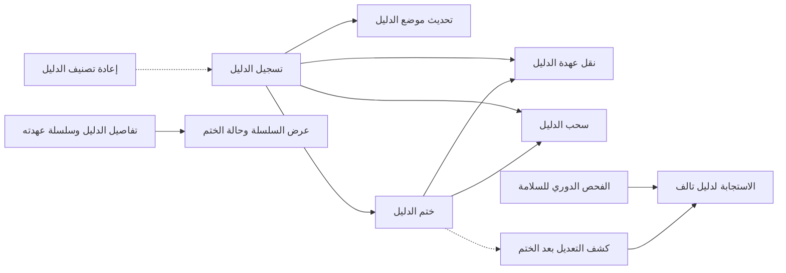
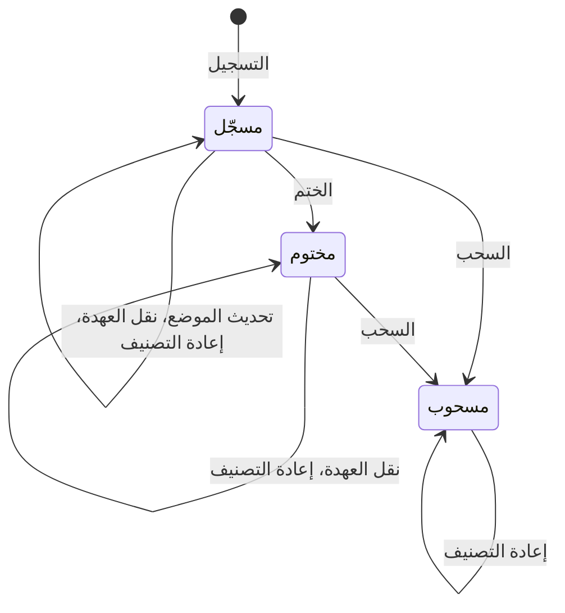

# حفظ الأدلة وسلسلة العهدة

<!-- BEGIN GENERATED: doc -->
| البند | القيمة |
|---|---|
| المعرّف | FEAT-COL-EVIDENCE |
| الإصدار | 0.1 |
| الحالة | مسودة |
| القدرة | CAP-02 جمع المعلومات |
| القدرة الفرعية | CAP-02.03 تسجيل الملاحظات (بما فيها دون اتصال) (R1) |
| الأدوار | المحلل؛ المستخدم الميداني؛ أمين العهدة |
| الشاشات | SCR-22 الادعاء والدليل والمصدر |
| حالات الاستخدام | UC-005، UC-006 |
| القصص | 11: 7 من المواصفة، و4 جديدة |
<!-- END GENERATED: doc -->

## 1. نظرة عامة

### 1.1 القيمة

يحفظ الدليل وموقعه ويختمه ويسجل كل نقل لعهدته حتى يبقى موثوقًا ومقبولًا.

### 1.2 النطاق

| البند | القيمة |
|---|---|
| المستخدمون | المحلل، والمستخدم الميداني في تسجيل الدليل، وأمين العهدة في نقل العهدة، وأي مستخدم مخوَّل في الاطلاع؛ وفريق المنصة والتشغيل والأمن في سلامة الأدلة |
| الشاشات | الادعاء والدليل والمصدر في تطبيق الويب؛ والتقاط الملاحظة في التطبيق الميداني لتسجيل الدليل |
| حالات الاستخدام | تسجيل الملاحظة، وإدارة الأدلة |
| المتطلبات | حفظ المرفقات في مخزن الملفات والإشارة إليها ببصمة محتواها (REQ-INF-003)؛ وحساب البصمة أو التحقق منها عند كل حفظ أو استرجاع، فيُكشف الملف التالف عند استرجاعه (REQ-INF-004)؛ وتغيير التصنيف بالسلطة التي تحددها سياسة المستأجر (REQ-GOV-004) |
| خارج النطاق | رفع الملف نفسه وتنزيله («رفع المرفقات وتنزيلها»)؛ ربط الدليل بالادعاء وحساب حالة التحقق في الادعاء (قدرة إدارة المعلومات)؛ تسجيل الملاحظة («تسجيل الملاحظات»)؛ رفع ما سُجّل دون اتصال («المزامنة الميدانية») |

### 1.3 خريطة الميزة

يبدأ الدليل بتسجيله من مرفق محفوظ أو من ملاحظة. ثم يُحدَّد موضعه داخل الملف ويُختم، وتُنقل عهدته من حائز إلى حائز حتى يُسحب إن ثبت أنه لا يصلح. والمنصة والتشغيل يتحققان من سلامته بعد الختم. والشكل 1 يجمع القصص، والشكل 2 يبيّن حالات الدليل.

**الشكل 1: خريطة ميزة «حفظ الأدلة وسلسلة العهدة»**



**الشكل 2: رحلة الدليل**



> **ملاحظة:** «مسحوب» حالة نهائية، لكن المصدر يسمح فيها بإعادة التصنيف وحدها، حتى يبقى الدليل المسحوب محميًا بالتصنيف الصحيح.

## 2. القواعد المشتركة

تنطبق على كل قصص الميزة، فلا تتكرر داخل القصص. وكل قصة تذكر ما يخصها فقط.

### 2.1 السياق المشترك

كل قصة تبدأ من ثلاثة شروط: مستأجر نشط، وحزمة السياسات الأساسية مفعّلة، ومستخدم مسجّل الدخول ومخوَّل. وتشير إليها القصص بخطوة واحدة: «بفرض السياق المشترك للميزة».

### 2.2 الصلاحية وعدم الإفصاح

- من لا يحق له رؤية العنصر يتلقى ردًا بشكل «غير متاح» تمامًا، فلا يعرف أنه موجود.
- من يرى العنصر ولا يحق له الإجراء يتلقى «لا تملك صلاحية هذا الإجراء».

### 2.3 أوامر تغيير الحالة

- **منع التكرار:** يُرسل كل أمر بمفتاح فريد، فإعادة الطلب نفسه لا تُنفَّذ مرتين.
- **حماية التعديل المتزامن:** يُرسل كل أمر بإصدار البيانات الذي يراه المستخدم. فإن عدّلها غيره في الأثناء، يُرفض الأمر.
- **السجل:** إن نجح الأمر، يُكتب حدثه وسجل التدقيق في المعاملة نفسها.

### 2.4 الرفض المشترك

```gherkin
# language: ar
خاصية: الرفض المشترك لأوامر الميزة

  سيناريو مخطط: رفض مشترك لكل أمر في الميزة
    بفرض السياق المشترك للميزة
    و <الحالة>
    عندما يُرسل المستخدم أي أمر من أوامر الميزة
    اذاً يُرفض برمز <الرمز> ويرى "<الرسالة>"
    و لا يتغير شيء

    امثلة:
      | الحالة                                  | الرمز                  | الرسالة                                                 |
      | العنصر خارج صلاحياته                    | NOT_FOUND              | غير متاح                                                |
      | العنصر مرئي له ولا يحق له الإجراء       | AUTHZ_DENIED           | لا تملك صلاحية هذا الإجراء                              |
      | غيره عدّل العنصر بعد أن فتحه            | VERSION_CONFLICT       | تغيّرت البيانات منذ فتحتها. راجع التغييرات ثم أعد المحاولة |
      | أعاد مفتاح منع التكرار بمحتوى مختلف     | IDEMPOTENCY_KEY_REUSED | طلب مكرر بمحتوى مختلف                                   |
      | البيانات ناقصة أو غير صحيحة             | VALIDATION_FAILED      | بعض البيانات ناقصة أو غير صحيحة. راجع الحقول المعلَّمة      |

  سيناريو: إعادة الطلب نفسه لا تُنفَّذ مرتين
    بفرض السياق المشترك للميزة
    و أمر نجح بمفتاح منع تكرار
    عندما يُعاد الطلب نفسه بالمفتاح نفسه
    اذاً تُعاد النتيجة الأولى ولا يُكتب حدث ثانٍ
```

### 2.5 قواعد الدليل

- **لا حذف:** الدليل لا يُحذف أبدًا. والسحب يبقيه ويبقي روابطه بالادعاءات.
- **بعد الختم:** لا يتغير في الدليل المختوم إلا عهدته وتصنيفه.
- **سلسلة العهدة:** كل نقل يضيف إليها قيدًا بالتسلسل التالي، فلا تكون فيها فجوة.
- **الحالة والإصدار:** يُفحص الإصدار قبل الحالة. فإن تغيّر الدليل بعد أن فتحه المستخدم، كأن خُتم أو سُحب، يُرفض أمره بتعارض الإصدار (§2.4). ورفض الحالة في القصص يخص أمرًا أُرسل على الإصدار الحالي وحالته لا تسمح به.

## 3. الجودة وتعريف الاكتمال

### 3.1 متطلبات الجودة

<!-- BEGIN GENERATED: quality -->
لا متطلبات جودة مرتبطة بمتطلبات هذه الميزة مباشرة. تنطبق متطلبات المنصة العامة (`FEAT-PLT-*`).
<!-- END GENERATED: quality -->

### 3.2 تعريف الاكتمال

القصة مكتملة حين تتحقق الشروط الخمسة:

1. سيناريوهاتها والقواعد المشتركة تمر في الاختبار الآلي.
2. فحوص البنية المعمارية تمر.
3. نصوص الواجهة والرسائل موجودة بالعربية والإنجليزية.
4. مراجعة الكود مكتملة.
5. ما تضيفه القصة نفسها في قسم «القواعد» تحقق.

## 4. فهرس القصص

<!-- BEGIN GENERATED: story-index -->
| المعرّف | القصة | النوع | الحالة |
|---|---|---|---|
| `US-BC02-EVD-RECLASSIFY` | إعادة تصنيف الدليل | أمر | مسودة |
| `US-BC02-EVD-REGISTER` | تسجيل الدليل | أمر | مسودة |
| `US-BC02-EVD-SEAL` | ختم الدليل | أمر | مسودة |
| `US-BC02-EVD-TRANSFER-CUSTODY` | نقل عهدة الدليل | أمر | مسودة |
| `US-BC02-EVD-UPDATE-LOCATOR` | تحديث محدِّد موقع الدليل | أمر | مسودة |
| `US-BC02-EVD-WITHDRAW` | سحب الدليل | أمر | مسودة |
| `US-BC02-Q-EVD-GET` | جلب: Evidence metadata and custody chain | جلب | مسودة |
| `US-UI-SCR22-CUSTODY-CHAIN` | عرض سلسلة عهدة الدليل وحالة ختمه | واجهة | مسودة |
| `US-PLT-EVD-SEAL-VERIFY` | كشف أي تعديل على الدليل بعد ختمه | منصة | مسودة |
| `US-OPS-EVD-FIXITY-CHECK` | فحص دوري لسلامة الأدلة المختومة | تشغيل | مسودة |
| `US-OPS-EVD-INTEGRITY-INCIDENT` | الاستجابة لاكتشاف دليل تالف | تشغيل | مسودة |
<!-- END GENERATED: story-index -->

## 5. القصص

### 5.1 US-BC02-EVD-RECLASSIFY — إعادة تصنيف الدليل

| النوع | الإصدار | الأولوية | دون اتصال | الحالة |
|---|---|---|---|---|
| أمر | R1 | Must | لا | مسودة |

> **كـ** المحلل، **أريد** أن أغيّر تصنيف الدليل الأمني بسبب مكتوب، **حتى** لا يراه إلا من يبلغ تصريحه مستواه الجديد.

**باختصار:** يغيّر المحلل تصنيف الدليل في أي حالة، ومنها «مسحوب»، بالسلطة التي تحددها سياسة المستأجر. ولا تتغير الحالة، ويُحفظ التغيير إصدارًا جديدًا.

#### القواعد

- **متى يُسمح:** الدليل في أي حالة: «مسجّل» أو «مختوم» أو «مسحوب».
- **من يُسمح له:** المحلل الذي يرى الدليل وله صلاحية الكتابة في نطاقه، ويملك سلطة تغيير التصنيف التي تحددها سياسة المستأجر (REQ-GOV-004).
- **البيانات:** التصنيف الجديد (إلزامي)، والسبب (إلزامي).
- **الأثر:** تبقى الحالة كما هي، ويُحفظ التصنيف الجديد إصدارًا جديدًا للدليل، ويُسجَّل حدث «أُعيد تصنيف الدليل». ومن لحظة التغيير لا يعيد أي مسار قراءة الدليلَ لمن لم يعد مصرَّحًا له، ومنها البحث والإسقاطات وذاكرة قرارات الصلاحية (REQ-GOV-004).

> **ملاحظة:** **[Needs Review]** الختم يغطي بيانات الدليل وبصمة ملفه، والتصنيف يتغير بعد الختم. والمصادر لا تحدد هل التصنيف من البيانات التي يغطيها الختم، فيُفترض أنه خارجها حتى لا تكسر إعادة التصنيف الختم.

#### معايير القبول

```gherkin
# language: ar
خاصية: إعادة تصنيف الدليل

  سيناريو: المحلل يرفع تصنيف دليل مختوم
    بفرض السياق المشترك للميزة
    و دليل "مختوم" يراه المحلل، والمحلل يملك سلطة تغيير التصنيف في سياسة المستأجر
    عندما يعيد تصنيفه إلى مستوى أعلى ويذكر السبب
    اذاً تبقى حالته "مختوم" ويُحفظ التصنيف الجديد إصدارًا جديدًا
    و يُسجَّل حدث "أُعيد تصنيف الدليل"
    و لا يعيده بعدها أي مسار قراءة لمن لا يبلغ تصريحه التصنيف الجديد

  سيناريو مخطط: رفض خاص بإعادة تصنيف الدليل
    بفرض السياق المشترك للميزة
    و <الحالة>
    عندما يحاول إعادة تصنيف الدليل
    اذاً يُرفض برمز <الرمز> ويرى "<الرسالة>"
    و لا يتغير شيء

    امثلة:
      | الحالة | الرمز | الرسالة |
      | المحلل لا يملك سلطة تغيير التصنيف في سياسة المستأجر | CLASSIFICATION_CHANGE_NOT_AUTHORIZED | لا تملك صلاحية تغيير التصنيف |
      | لم يُحدَّد التصنيف الجديد | VALIDATION_FAILED | التصنيف الجديد مطلوب |
      | لم يُذكر السبب | VALIDATION_FAILED | السبب مطلوب |
```

<details><summary>المراجع التقنية والتتبع</summary>

<!-- BEGIN GENERATED: refs US-BC02-EVD-RECLASSIFY -->
| البند | المعرّف | المعنى |
|---|---|---|
| الواجهة البرمجية | `POST /api/v1/information/evidence/{id}/actions/reclassify` | — |
| الأمر | `CMD-EVD-RECLASSIFY` | إعادة تصنيف الدليل |
| السياسة | `POL-EVD-RECLASSIFY` | Analyst · Field User (register) · custodian role (custody)؛ tenant match; object visible to subject (label ≤… |
| الحدث | `EVT-EVD-RECLASSIFIED` | يصل إلى: Security-version service (EVT-SEC-VERSION-INCREMENTED); PEP decision caches; Projection security-ver… |
| الكيان | `AGG-EVIDENCE` | الدليل |
| الجدول | `information.evidence` | الجدول الرئيسي للدليل |
| وحدة النشر | DU-04 | — |
| المتطلبات | REQ-INF-003، REQ-INF-004 | معانيها في القسم 6. التتبع |
| حالات الاستخدام | UC-005، UC-006 | Register Observation؛ Manage Evidence |
| الاختبار | TST-EVIDENCE-SM، TST-SLC02-INVARIANTS | دورة حالات الدليل، وثوابت الشريحة SLC-02 |
<!-- END GENERATED: refs US-BC02-EVD-RECLASSIFY -->

</details>

### 5.2 US-BC02-EVD-REGISTER — تسجيل الدليل

| النوع | الإصدار | الأولوية | دون اتصال | الحالة |
|---|---|---|---|---|
| أمر | R1 | Must | نعم | مسودة |

> **كـ** المحلل أو المستخدم الميداني، **أريد** أن أسجّل دليلًا من ملف محفوظ أو من ملاحظة، مع مصدره ووقت جمعه، **حتى** يبدأ سجله وسلسلة عهدته من لحظة جمعه.

**باختصار:** يُنشأ دليل «مسجّل» يشير إلى ملف اكتمل حفظه أو إلى ملاحظة، من مصدر نشط. ويعمل دون اتصال من التطبيق الميداني.

#### القواعد

- **متى يُسمح:** الدليل جديد، ويشير إلى ملف اكتمل حفظه أو إلى ملاحظة، ونوعه من قائمة أنواع الأدلة، ومصدره نشط.
- **من يُسمح له:** المحلل والمستخدم الميداني، بصلاحية الكتابة في نطاقهما، وبتصنيف لا يتجاوز تصريحهما.
- **البيانات:** نوع الدليل، والمصدر، ووقت الجمع، والتصنيف (كلها إلزامية)؛ والملف أو الملاحظة (أحدهما على الأقل)؛ وموضع الدليل داخل الملف (اختياري). ومن التطبيق الميداني معرّف يولّده الجهاز للدليل، فلا يُنشأ مرتين إن أُعيد رفعه.
- **الأثر:** يصير الدليل «مسجّلًا»، ويُسجَّل حدث «سُجّل الدليل»، ويصل الحدث إلى البحث. وأول قيد في سلسلة عهدته لمن سجّله **[Derived]**.
- **دون اتصال:** يُحفظ على الجهاز ويُرفع عند المزامنة. والتسجيل إلحاقي، فيُطبَّق دون مقارنة إصدار، لكن شروطه تبقى سارية: إن لم يتحقق أحدها عند المزامنة يصير تعارض مزامنة بسبب الرفض («حل تعارضات المزامنة»).

#### معايير القبول

```gherkin
# language: ar
خاصية: تسجيل الدليل

  سيناريو: المحلل يسجّل دليلًا من ملف محفوظ
    بفرض السياق المشترك للميزة
    و ملف اكتمل حفظه ومصدر "نشط"
    عندما يسجّل دليلًا يشير إلى الملف بنوعه ومصدره ووقت جمعه وتصنيفه
    اذاً يُنشأ الدليل في حالة "مسجّل"
    و يُسجَّل حدث "سُجّل الدليل"

  سيناريو: المستخدم الميداني يسجّل دليلًا دون اتصال
    بفرض السياق المشترك للميزة
    و الجهاز دون اتصال
    عندما يسجّل دليلًا من ملاحظة التقطها
    اذاً يُحفظ الدليل على الجهاز بمعرّف يولّده الجهاز
    و يُنشأ على الخادم مرة واحدة عند المزامنة ولو أُعيد رفعه

  سيناريو مخطط: رفض خاص بتسجيل الدليل
    بفرض السياق المشترك للميزة
    و <الحالة>
    عندما يحاول تسجيل الدليل
    اذاً يُرفض برمز <الرمز> ويرى "<الرسالة>"
    و لا يتغير شيء

    امثلة:
      | الحالة | الرمز | الرسالة |
      | الملف لم يكتمل حفظه ولا ملاحظة مرتبطة | EVIDENCE_INVALID | بيانات الدليل غير صحيحة |
      | نوع الدليل ليس من قائمة أنواع الأدلة | EVIDENCE_INVALID | بيانات الدليل غير صحيحة |
      | المصدر غير نشط | EVIDENCE_INVALID | بيانات الدليل غير صحيحة |
      | لم يُحدَّد المصدر | VALIDATION_FAILED | المصدر مطلوب |
      | لم يُحدَّد وقت الجمع | VALIDATION_FAILED | وقت الجمع مطلوب |
```

<details><summary>المراجع التقنية والتتبع</summary>

<!-- BEGIN GENERATED: refs US-BC02-EVD-REGISTER -->
| البند | المعرّف | المعنى |
|---|---|---|
| الواجهة البرمجية | `POST /api/v1/information/evidence` | دون اتصال: نعم |
| الأمر | `CMD-EVD-REGISTER` | تسجيل الدليل |
| السياسة | `POL-EVD-REGISTER` | Analyst · Field User (register) · custodian role (custody)؛ tenant match; object visible to subject (label ≤… |
| الحدث | `EVT-EVD-REGISTERED` | يصل إلى: Verification re-evaluator (on WITHDRAWN: issues CMD-CLM-ASSESS as system identity for linked claims,… |
| الكيان | `AGG-EVIDENCE` | الدليل |
| الجدول | `information.evidence` | الجدول الرئيسي للدليل |
| وحدة النشر | DU-04 | — |
| المتطلبات | REQ-INF-003، REQ-INF-004 | معانيها في القسم 6. التتبع |
| حالات الاستخدام | UC-005، UC-006 | Register Observation؛ Manage Evidence |
| الاختبار | TST-EVIDENCE-SM، TST-SLC02-INVARIANTS | دورة حالات الدليل، وثوابت الشريحة SLC-02 |
<!-- END GENERATED: refs US-BC02-EVD-REGISTER -->

</details>

### 5.3 US-BC02-EVD-SEAL — ختم الدليل

| النوع | الإصدار | الأولوية | دون اتصال | الحالة |
|---|---|---|---|---|
| أمر | R1 | Must | لا | مسودة |

> **كـ** المحلل، **أريد** أن أختم الدليل بعد اكتمال تسجيله، **حتى** يُكشف أي تعديل عليه بعد ذلك.

**باختصار:** يختم المحلل الدليل «المسجّل» فيصير «مختومًا». والختم بصمة واحدة تغطي بيانات الدليل وبصمة ملفه.

#### القواعد

- **متى يُسمح:** الدليل «مسجّل».
- **من يُسمح له:** المحلل الذي يرى الدليل وله صلاحية الكتابة في نطاقه.
- **البيانات:** لا مدخلات.
- **الأثر:** تُحسب بصمة الختم من بيانات الدليل وبصمة ملفه وتُحفظ معه، ويصير «مختومًا»، ويُسجَّل حدث «خُتم الدليل». وبعدها لا يتغير فيه إلا العهدة والتصنيف (§2.5)، ويُتحقق من الختم عند كل استرجاع (القصة 5.9).

> **ملاحظة:** الموضع داخل الملف لا يتغير بعد الختم، فيُحدَّد قبله (القصة 5.5).

#### معايير القبول

```gherkin
# language: ar
خاصية: ختم الدليل

  سيناريو: المحلل يختم دليلًا مسجّلًا
    بفرض السياق المشترك للميزة
    و دليل "مسجّل" يراه المحلل
    عندما يختمه
    اذاً تُحفظ معه بصمة ختم تغطي بياناته وبصمة ملفه
    و تصبح حالته "مختوم"
    و يُسجَّل حدث "خُتم الدليل"

  سيناريو مخطط: رفض خاص بختم الدليل
    بفرض السياق المشترك للميزة
    و <الحالة>
    عندما يحاول ختم الدليل
    اذاً يُرفض برمز <الرمز> ويرى "<الرسالة>"
    و لا يتغير شيء

    امثلة:
      | الحالة | الرمز | الرسالة |
      | الدليل "مختوم" في الإصدار الحالي | EVIDENCE_INVALID_STATE_TRANSITION | الوضع الحالي للدليل لا يسمح بهذا الإجراء |
      | الدليل "مسحوب" في الإصدار الحالي | EVIDENCE_INVALID_STATE_TRANSITION | الوضع الحالي للدليل لا يسمح بهذا الإجراء |
```

<details><summary>المراجع التقنية والتتبع</summary>

<!-- BEGIN GENERATED: refs US-BC02-EVD-SEAL -->
| البند | المعرّف | المعنى |
|---|---|---|
| الواجهة البرمجية | `POST /api/v1/information/evidence/{id}/actions/seal` | — |
| الأمر | `CMD-EVD-SEAL` | ختم الدليل |
| السياسة | `POL-EVD-SEAL` | Analyst · Field User (register) · custodian role (custody)؛ tenant match; object visible to subject (label ≤… |
| الحدث | `EVT-EVD-SEALED` | يصل إلى: Verification re-evaluator (on WITHDRAWN: issues CMD-CLM-ASSESS as system identity for linked claims,… |
| الكيان | `AGG-EVIDENCE` | الدليل |
| الجدول | `information.evidence` | الجدول الرئيسي للدليل |
| وحدة النشر | DU-04 | — |
| المتطلبات | REQ-INF-003، REQ-INF-004 | معانيها في القسم 6. التتبع |
| حالات الاستخدام | UC-005، UC-006 | Register Observation؛ Manage Evidence |
| الاختبار | TST-EVIDENCE-SM، TST-SLC02-INVARIANTS | دورة حالات الدليل، وثوابت الشريحة SLC-02 |
<!-- END GENERATED: refs US-BC02-EVD-SEAL -->

</details>

### 5.4 US-BC02-EVD-TRANSFER-CUSTODY — نقل عهدة الدليل

| النوع | الإصدار | الأولوية | دون اتصال | الحالة |
|---|---|---|---|---|
| أمر | R1 | Must | لا | مسودة |

> **كـ** أمين العهدة، **أريد** أن أنقل عهدة الدليل إلى حائز جديد، **حتى** تبيّن سلسلة العهدة من حمل الدليل في كل وقت.

**باختصار:** ينقل الحائز الحالي أو أمين العهدة الدليل «المسجّل» أو «المختوم» إلى حائز جديد. ولا تتغير الحالة، ويُضاف قيد إلى سلسلة العهدة.

#### القواعد

- **متى يُسمح:** الدليل «مسجّل» أو «مختوم». والختم لا يمنع النقل (§2.5).
- **من يُسمح له:** الحائز الحالي للدليل أو أمين العهدة، ممن يرى الدليل وله صلاحية الكتابة في نطاقه.
- **البيانات:** الحائز الجديد (إلزامي)، والإجراء الذي يصف النقل (إلزامي).
- **الأثر:** تبقى الحالة كما هي ويزيد الإصدار. ويُضاف إلى السلسلة قيد بالحائز الجديد والإجراء، بالتسلسل التالي دون فجوة، ويُسجَّل حدث «نُقلت عهدة الدليل».

#### معايير القبول

```gherkin
# language: ar
خاصية: نقل عهدة الدليل

  سيناريو: أمين العهدة ينقل دليلًا مختومًا
    بفرض السياق المشترك للميزة
    و دليل "مختوم" في سلسلة عهدته قيدان
    عندما ينقل أمين العهدة عهدته إلى حائز جديد ويصف الإجراء
    اذاً يُضاف إلى السلسلة قيد ثالث بالحائز الجديد والإجراء
    و تبقى حالته "مختوم" ويزيد إصداره
    و يُسجَّل حدث "نُقلت عهدة الدليل"

  سيناريو مخطط: رفض خاص بنقل عهدة الدليل
    بفرض السياق المشترك للميزة
    و <الحالة>
    عندما يحاول نقل عهدة الدليل
    اذاً يُرفض برمز <الرمز> ويرى "<الرسالة>"
    و لا يتغير شيء

    امثلة:
      | الحالة | الرمز | الرسالة |
      | المستخدم ليس الحائز الحالي ولا أمين العهدة | CUSTODY_INVALID | لا يمكن نقل الحيازة: لست الحائز الحالي أو لم يُحدَّد الحائز الجديد |
      | الدليل "مسحوب" في الإصدار الحالي | EVIDENCE_INVALID_STATE_TRANSITION | الوضع الحالي للدليل لا يسمح بهذا الإجراء |
      | لم يُحدَّد الحائز الجديد | VALIDATION_FAILED | الحائز الجديد مطلوب |
      | لم يُوصف الإجراء | VALIDATION_FAILED | الإجراء مطلوب |
```

<details><summary>المراجع التقنية والتتبع</summary>

<!-- BEGIN GENERATED: refs US-BC02-EVD-TRANSFER-CUSTODY -->
| البند | المعرّف | المعنى |
|---|---|---|
| الواجهة البرمجية | `POST /api/v1/information/evidence/{id}/actions/transfer-custody` | — |
| الأمر | `CMD-EVD-TRANSFER-CUSTODY` | نقل عهدة الدليل |
| السياسة | `POL-EVD-TRANSFER-CUSTODY` | Analyst · Field User (register) · custodian role (custody)؛ tenant match; object visible to subject (label ≤… |
| الحدث | `EVT-EVD-CUSTODY-TRANSFERRED` | يصل إلى: Verification re-evaluator (on WITHDRAWN: issues CMD-CLM-ASSESS as system identity for linked claims,… |
| الكيان | `AGG-EVIDENCE` | الدليل |
| الجدول | `information.evidence` | الجدول الرئيسي للدليل |
| وحدة النشر | DU-04 | — |
| المتطلبات | REQ-INF-003، REQ-INF-004 | معانيها في القسم 6. التتبع |
| حالات الاستخدام | UC-005، UC-006 | Register Observation؛ Manage Evidence |
| الاختبار | TST-EVIDENCE-SM، TST-SLC02-INVARIANTS | دورة حالات الدليل، وثوابت الشريحة SLC-02 |
<!-- END GENERATED: refs US-BC02-EVD-TRANSFER-CUSTODY -->

</details>

### 5.5 US-BC02-EVD-UPDATE-LOCATOR — تحديث موضع الدليل داخل الملف

| النوع | الإصدار | الأولوية | دون اتصال | الحالة |
|---|---|---|---|---|
| أمر | R1 | Must | لا | مسودة |

> **كـ** المحلل، **أريد** أن أحدد موضع الدليل داخل الملف المرفق، **حتى** يصل القارئ مباشرة إلى الجزء الذي يدعم الادعاء.

**باختصار:** يحدّث المحلل موضع الدليل داخل ملفه ما دام «مسجّلًا» لم يُختم. ولا تتغير الحالة.

#### القواعد

- **متى يُسمح:** الدليل «مسجّل». وبعد الختم لا يتغير الموضع (§2.5).
- **من يُسمح له:** المحلل الذي يرى الدليل وله صلاحية الكتابة في نطاقه.
- **البيانات:** الموضع الجديد (إلزامي)، ويقع داخل حدود الملف المرفق.
- **الأثر:** تبقى الحالة كما هي ويزيد الإصدار، ويُسجَّل حدث «حُدّث موضع الدليل».

#### معايير القبول

```gherkin
# language: ar
خاصية: تحديث موضع الدليل داخل الملف

  سيناريو: المحلل يحدّث موضع دليل مسجّل
    بفرض السياق المشترك للميزة
    و دليل "مسجّل" يشير إلى ملف محفوظ
    عندما يحدّث موضعه إلى موضع داخل حدود الملف
    اذاً يُحفظ الموضع الجديد وتبقى حالته "مسجّل" ويزيد إصداره
    و يُسجَّل حدث "حُدّث موضع الدليل"

  سيناريو مخطط: رفض خاص بتحديث موضع الدليل
    بفرض السياق المشترك للميزة
    و <الحالة>
    عندما يحاول تحديث موضع الدليل
    اذاً يُرفض برمز <الرمز> ويرى "<الرسالة>"
    و لا يتغير شيء

    امثلة:
      | الحالة | الرمز | الرسالة |
      | الموضع خارج حدود الملف المرفق | LOCATOR_INVALID | الموضع المحدد خارج حدود الملف |
      | الدليل "مختوم" أو "مسحوب" في الإصدار الحالي | EVIDENCE_INVALID_STATE_TRANSITION | الوضع الحالي للدليل لا يسمح بهذا الإجراء |
      | لم يُحدَّد الموضع | VALIDATION_FAILED | الموضع مطلوب |
```

<details><summary>المراجع التقنية والتتبع</summary>

<!-- BEGIN GENERATED: refs US-BC02-EVD-UPDATE-LOCATOR -->
| البند | المعرّف | المعنى |
|---|---|---|
| الواجهة البرمجية | `POST /api/v1/information/evidence/{id}/actions/update-locator` | — |
| الأمر | `CMD-EVD-UPDATE-LOCATOR` | تحديث محدِّد موقع الدليل |
| السياسة | `POL-EVD-UPDATE-LOCATOR` | Analyst · Field User (register) · custodian role (custody)؛ tenant match; object visible to subject (label ≤… |
| الحدث | `EVT-EVD-LOCATOR-UPDATED` | يصل إلى: Verification re-evaluator (on WITHDRAWN: issues CMD-CLM-ASSESS as system identity for linked claims,… |
| الكيان | `AGG-EVIDENCE` | الدليل |
| الجدول | `information.evidence` | الجدول الرئيسي للدليل |
| وحدة النشر | DU-04 | — |
| المتطلبات | REQ-INF-003، REQ-INF-004 | معانيها في القسم 6. التتبع |
| حالات الاستخدام | UC-005، UC-006 | Register Observation؛ Manage Evidence |
| الاختبار | TST-EVIDENCE-SM، TST-SLC02-INVARIANTS | دورة حالات الدليل، وثوابت الشريحة SLC-02 |
<!-- END GENERATED: refs US-BC02-EVD-UPDATE-LOCATOR -->

</details>

### 5.6 US-BC02-EVD-WITHDRAW — سحب الدليل

| النوع | الإصدار | الأولوية | دون اتصال | الحالة |
|---|---|---|---|---|
| أمر | R1 | Must | لا | مسودة |

> **كـ** المحلل، **أريد** أن أسحب دليلًا ثبت أنه لا يصلح، كدليل مزوّر، بسبب مكتوب، **حتى** لا تستند إليه الادعاءات بعد اليوم ولا يضيع أثره.

**باختصار:** يسحب المحلل الدليل «المسجّل» أو «المختوم» فيصير «مسحوبًا» نهائيًا. ولا يُحذف، وتبقى روابطه، ويُعاد حساب التحقق في الادعاءات التي تستند إليه.

#### القواعد

- **متى يُسمح:** الدليل «مسجّل» أو «مختوم».
- **من يُسمح له:** المحلل الذي يرى الدليل وله صلاحية الكتابة في نطاقه.
- **البيانات:** السبب (إلزامي)، مثل التزوير.
- **الأثر:**
  - يصير الدليل «مسحوبًا»، ولا يُقبل عليه بعدها إلا إعادة التصنيف (الشكل 2). ويُسجَّل حدث «سُحب الدليل».
  - يبقى الدليل وروابطه بالادعاءات، وتُعلَّم الروابط بأن دليلها مسحوب.
  - يعيد النظام حساب حالة التحقق في كل ادعاء مرتبط من الأدلة الداعمة الباقية، فالادعاء الذي لا يدعمه غيره يصير غير متحقق منه. ويُبلَّغ مالكو الادعاءات المرتبطة.

#### معايير القبول

```gherkin
# language: ar
خاصية: سحب الدليل

  سيناريو: المحلل يسحب الدليل الداعم الوحيد لادعاء
    بفرض السياق المشترك للميزة
    و دليل "مختوم" هو الدليل الداعم الوحيد لادعاء متحقق منه
    عندما يسحبه ويذكر السبب "مزوّر"
    اذاً تصبح حالته "مسحوب"
    و يبقى الدليل وروابطه قابلين للاسترجاع
    و يُعاد حساب التحقق في الادعاء فيصير غير متحقق منه
    و يُسجَّل حدث "سُحب الدليل" ويُبلَّغ مالك الادعاء

  سيناريو مخطط: رفض خاص بسحب الدليل
    بفرض السياق المشترك للميزة
    و <الحالة>
    عندما يحاول سحب الدليل
    اذاً يُرفض برمز <الرمز> ويرى "<الرسالة>"
    و لا يتغير شيء

    امثلة:
      | الحالة | الرمز | الرسالة |
      | الدليل "مسحوب" في الإصدار الحالي | EVIDENCE_INVALID_STATE_TRANSITION | الوضع الحالي للدليل لا يسمح بهذا الإجراء |
      | لم يُذكر السبب | REASON_REQUIRED | اذكر السبب |
```

<details><summary>المراجع التقنية والتتبع</summary>

<!-- BEGIN GENERATED: refs US-BC02-EVD-WITHDRAW -->
| البند | المعرّف | المعنى |
|---|---|---|
| الواجهة البرمجية | `POST /api/v1/information/evidence/{id}/actions/withdraw` | — |
| الأمر | `CMD-EVD-WITHDRAW` | سحب الدليل |
| السياسة | `POL-EVD-WITHDRAW` | Analyst · Field User (register) · custodian role (custody)؛ tenant match; object visible to subject (label ≤… |
| الحدث | `EVT-EVD-WITHDRAWN` | يصل إلى: Verification re-evaluator (on WITHDRAWN: issues CMD-CLM-ASSESS as system identity for linked claims,… |
| الكيان | `AGG-EVIDENCE` | الدليل |
| الجدول | `information.evidence` | الجدول الرئيسي للدليل |
| وحدة النشر | DU-04 | — |
| المتطلبات | REQ-INF-003، REQ-INF-004 | معانيها في القسم 6. التتبع |
| حالات الاستخدام | UC-005، UC-006 | Register Observation؛ Manage Evidence |
| الاختبار | TST-EVIDENCE-SM، TST-SLC02-INVARIANTS | دورة حالات الدليل، وثوابت الشريحة SLC-02 |
<!-- END GENERATED: refs US-BC02-EVD-WITHDRAW -->

</details>

### 5.7 US-BC02-Q-EVD-GET — تفاصيل الدليل وسلسلة عهدته

| النوع | الإصدار | الأولوية | دون اتصال | الحالة |
|---|---|---|---|---|
| جلب | R1 | Must | لا | مسودة |

> **كـ** أي مستخدم مخوَّل، **أريد** أن أطّلع على بيانات الدليل وسلسلة عهدته كما هي الآن أو في وقت سابق، **حتى** أحكم على موثوقيته قبل أن أستند إليه.

**باختصار:** يُعاد الدليل ببياناته وحالته وسلسلة عهدته لمن يسمح له نطاقه وتصريحه، ومن لا يحق له يتلقى «غير متاح».

#### القواعد

- **من يرى ماذا:** من يقع الدليل في نطاقه التنظيمي ولا يتجاوز تصنيفه تصريحه. وروابط الادعاءات تُصفّى بتصنيف كل ادعاء، فلا يظهر ادعاء لا يحق له رؤيته. ويُعاد فحص الصلاحية على النتيجة قبل إعادتها. ومن لا يحق له يتلقى «غير متاح» بالشكل نفسه للدليل غير الموجود.
- **المرشحات:** وقت الصلاحية ووقت المعرفة، لعرض الدليل كما كان في وقت سابق أو كما كان معروفًا فيه. والافتراضي الآن لكليهما.
- **السلامة:** يُتحقق من ختم الدليل المختوم عند استرجاعه (القصة 5.9).

#### معايير القبول

```gherkin
# language: ar
خاصية: تفاصيل الدليل وسلسلة عهدته

  سيناريو: المحلل يطّلع على دليل مختوم
    بفرض السياق المشترك للميزة
    و دليل "مختوم" في نطاق المحلل نُقلت عهدته مرتين
    عندما يطلب تفاصيله
    اذاً تُعاد بياناته وحالته وقيود سلسلة عهدته بترتيبها دون فجوة
    و تُعاد نتيجة التحقق من ختمه

  سيناريو: الدليل كما كان معروفًا في وقت سابق
    بفرض السياق المشترك للميزة
    و دليل أُعيد تصنيفه أمس
    عندما يطلبه بوقت معرفة قبل إعادة التصنيف
    اذاً تُعاد بياناته كما كانت معروفة في ذلك الوقت

  سيناريو: دليل فوق تصريح المستخدم
    بفرض السياق المشترك للميزة
    و دليل تصنيفه أعلى من تصريح المستخدم
    عندما يطلب تفاصيله
    اذاً يتلقى "غير متاح" بالشكل نفسه للدليل غير الموجود
```

<details><summary>المراجع التقنية والتتبع</summary>

<!-- BEGIN GENERATED: refs US-BC02-Q-EVD-GET -->
| البند | المعرّف | المعنى |
|---|---|---|
| الواجهة البرمجية | `GET /api/v1/information/evidence/{evidence_id}` | — |
| الاستعلام | `QRY-EVD-GET` | Evidence metadata and custody chain |
| السياسة | `POL-EVD-GET` | org scope ∩ classification rule; claims filtered by label |
| الكيان | `AGG-EVIDENCE` | الدليل |
| الجدول | `information.evidence` | الجدول الرئيسي للدليل |
| وحدة النشر | DU-04 | — |
| المتطلب | REQ-INF-004 | When an attachment is stored or retrieved, the system shall compute or verify its content hash. |
| حالة الاستخدام | UC-006 | Manage Evidence |
| الاختبار | TST-EVIDENCE-SM، TST-SLC02-INVARIANTS | دورة حالات الدليل، وثوابت الشريحة SLC-02 |
<!-- END GENERATED: refs US-BC02-Q-EVD-GET -->

</details>

### 5.8 US-UI-SCR22-CUSTODY-CHAIN — عرض سلسلة عهدة الدليل وحالة ختمه

| النوع | الإصدار | الأولوية | دون اتصال | الحالة |
|---|---|---|---|---|
| واجهة | R1 | Should | لا | مسودة |

> **كـ** المحلل، **أريد** أن أرى في شاشة الدليل سلسلة عهدته وحالة ختمه بوضوح، **حتى** أعرف أن الدليل سليم ومقبول قبل أن أبني عليه.

**باختصار:** تعرض شاشة الادعاء والدليل والمصدر قيود العهدة بترتيبها، وشارة الحالة، ونتيجة التحقق من الختم. والأزرار تتبع حالة الدليل.

#### القواعد

- قيود السلسلة تُعرض بترتيبها، ولكل قيد الحائز والإجراء ووقته **[Derived]**.
- الحالة شارة: «مسجّل» أو «مختوم» أو «مسحوب»، ولا تعتمد على اللون وحده. والمسحوب يظهر مع سبب سحبه **[Derived]**.
- الدليل المختوم يظهر بنتيجة التحقق من ختمه. فإن لم يطابق يظهر تنبيه بأن الدليل قد يكون تالفًا، ولا يظهر سليمًا (القصة 5.11) **[Derived]**.
- الأزرار حسب الحالة تلميح فقط، والخادم يحكم. ونقل العهدة يظهر للحائز الحالي وأمين العهدة، وإعادة التصنيف لمن يملك سلطتها **[Derived]**.
- روابط الادعاءات تظهر لما يحق للمستخدم رؤيته فقط، ولا رسالة عن روابط مخفية.
- الشاشة في تطبيق الويب، ولا تعمل دون اتصال.

#### معايير القبول

```gherkin
# language: ar
خاصية: عرض سلسلة عهدة الدليل وحالة ختمه

  سيناريو: السلسلة وختم سليم
    بفرض السياق المشترك للميزة
    و دليل "مختوم" نُقلت عهدته مرة واحدة ولم يتغير منذ ختمه
    عندما يفتحه المحلل في شاشة الدليل
    اذاً تظهر قيود السلسلة بترتيبها وشارة "مختوم" ونتيجة تحقق سليمة

  سيناريو: ختم لا يطابق
    بفرض السياق المشترك للميزة
    و دليل "مختوم" تغيّر ملفه في المخزن بعد ختمه
    عندما يفتحه المحلل
    اذاً يظهر تنبيه بأن الدليل قد يكون تالفًا
    و لا يظهر الدليل سليمًا

  سيناريو مخطط: الأزرار حسب حالة الدليل
    بفرض السياق المشترك للميزة
    و دليل في حالة "<الحالة>" والمحلل أمين عهدته ويملك سلطة تغيير التصنيف
    عندما يفتحه في شاشة الدليل
    اذاً تظهر الأزرار: <الأزرار>

    امثلة:
      | الحالة | الأزرار |
      | مسجّل | تحديث الموضع، ختم، نقل العهدة، سحب، إعادة تصنيف |
      | مختوم | نقل العهدة، سحب، إعادة تصنيف |
      | مسحوب | إعادة تصنيف |
```

<details><summary>المراجع التقنية والتتبع</summary>

<!-- BEGIN GENERATED: refs US-UI-SCR22-CUSTODY-CHAIN -->
| البند | المعرّف | المعنى |
|---|---|---|
| الشاشة | SCR-22 | شاشة الادعاء والدليل والمصدر |
| المصدر | `QRY-EVD-GET` | — |
| حالة الاستخدام | UC-006 | Manage Evidence |
<!-- END GENERATED: refs US-UI-SCR22-CUSTODY-CHAIN -->

</details>

### 5.9 US-PLT-EVD-SEAL-VERIFY — كشف أي تعديل على الدليل بعد ختمه

| النوع | الإصدار | الأولوية | دون اتصال | الحالة |
|---|---|---|---|---|
| منصة | R1 | Must | لا ينطبق | مسودة |

> **كـ** فريق المنصة، **أريد** أن يُعاد حساب ختم الدليل وبصمة ملفه عند كل استرجاع ويُقارنا بالمحفوظ، **حتى** يُكشف أي تعديل بعد الختم ولا يُعرض دليل معدَّل على أنه سليم.

**باختصار:** التحقق يجري عند كل قراءة للدليل المختوم وكل تنزيل لملفه، وعدم التطابق يُبلَّغ ويُسجَّل.

#### القواعد

- عند كل استرجاع لدليل مختوم تُحسب بصمة الختم من بياناته وبصمة ملفه، وتُقارن بالبصمة المحفوظة. وعند تنزيل ملفه تُحسب بصمة المحتوى وتُقارن ببصمته المحفوظة (REQ-INF-004).
- عدم التطابق يُبلَّغ خطأَ سلامة ويُسجَّل في سجل التدقيق (REQ-INF-004)، ثم يُعامل كما في القصة 5.11.
- يُتحقق عند الاسترجاع أيضًا من أن تسلسل سلسلة العهدة متصل بلا فجوة **[Derived]**.
- هذه الضوابط مع سلسلة العهدة تبقي خطر تعديل الدليل بعد ختمه منخفضًا.

> **ملاحظة:** **[Needs Review]** المتطلب يسمّي خطأ السلامة، لكن رمزه ليس في كتالوج الأخطاء ولا في المسرد، فلا رسالة له بعد.

#### معايير القبول

```gherkin
# language: ar
خاصية: كشف أي تعديل على الدليل بعد ختمه

  سيناريو: دليل سليم
    بفرض دليل "مختوم" لم يتغير ملفه ولا بياناته منذ ختمه
    عندما يُسترجع
    اذاً تطابق بصمة الختم المحسوبة البصمة المحفوظة ويُعاد الدليل

  سيناريو: ملف عُدّل في المخزن بعد الختم
    بفرض دليل "مختوم" عُدّل محتوى ملفه في المخزن
    عندما يُنزَّل ملفه أو يُسترجع الدليل
    اذاً يُكشف عدم التطابق ويُبلَّغ خطأ سلامة
    و يُسجَّل الكشف في سجل التدقيق
    و لا يُعاد الملف على أنه سليم
```

<details><summary>المراجع التقنية والتتبع</summary>

<!-- BEGIN GENERATED: refs US-PLT-EVD-SEAL-VERIFY -->
| البند | المعرّف | المعنى |
|---|---|---|
| المصدر | `THR-S02-06` | — |
| المتطلب | REQ-INF-004 | When an attachment is stored or retrieved, the system shall compute or verify its content hash. |
| حالة الاستخدام | UC-006 | Manage Evidence |
<!-- END GENERATED: refs US-PLT-EVD-SEAL-VERIFY -->

</details>

### 5.10 US-OPS-EVD-FIXITY-CHECK — فحص دوري لسلامة الأدلة المختومة

| النوع | الإصدار | الأولوية | دون اتصال | الحالة |
|---|---|---|---|---|
| تشغيل | R1 | Must | لا ينطبق | مسودة |

> **كـ** فريق التشغيل، **أريد** فحصًا دوريًا يعيد حساب بصمة كل دليل مختوم وملفه، **حتى** يُكشف التلف الصامت في المخزن قبل أن يحتاج أحد إلى الدليل.

**باختصار:** الفحص يكمّل التحقق عند الاسترجاع، فيكشف تلف دليل لا يسترجعه أحد.

#### القواعد

- الفحص كله مستنتج **[Derived]**: المتطلب يفرض التحقق عند الحفظ والاسترجاع فقط (REQ-INF-004).
- يمر الفحص على كل دليل مختوم في كل مستأجر، فيعيد حساب بصمة ملفه وبصمة ختمه ويقارنهما بالمحفوظ **[Derived]**.
- **[Needs Review]** لا يحدد مصدر دورية الفحص. والمقترح مرة في السنة على الأقل، كما يُتحقق من سلامة الأرشيف دوريًا (REQ-ARC-002).
- الفحص لا يغيّر الدليل ولا سلسلة عهدته. وعدم التطابق يُعامل كما في القصة 5.11 **[Derived]**.
- يُسجَّل كل تشغيل بعدد ما فُحص وعدد ما لم يطابق **[Derived]**.

#### معايير القبول

```gherkin
# language: ar
خاصية: فحص دوري لسلامة الأدلة المختومة

  سيناريو: فحص دوري بلا تلف
    بفرض أدلة مختومة كلها سليمة
    عندما يحين موعد الفحص الدوري
    اذاً تطابق بصمة كل دليل وملفه البصمات المحفوظة
    و يُسجَّل التشغيل بعدد ما فُحص ودون عدم تطابق

  سيناريو: كشف تلف صامت
    بفرض دليل "مختوم" تلف ملفه في المخزن ولم يسترجعه أحد
    عندما يمر عليه الفحص الدوري
    اذاً يُكشف عدم التطابق وتبدأ الاستجابة لدليل تالف
    و لا يتغير الدليل ولا سلسلة عهدته
```

<details><summary>المراجع التقنية والتتبع</summary>

<!-- BEGIN GENERATED: refs US-OPS-EVD-FIXITY-CHECK -->
| البند | المعرّف | المعنى |
|---|---|---|
| المصدر | `THR-S02-06` | — |
| المصدر | `[Derived]` | — |
| المتطلبات | REQ-INF-004، REQ-INF-003 | معانيها في القسم 6. التتبع |
| حالات الاستخدام | UC-005، UC-006 | Register Observation؛ Manage Evidence |
<!-- END GENERATED: refs US-OPS-EVD-FIXITY-CHECK -->

</details>

### 5.11 US-OPS-EVD-INTEGRITY-INCIDENT — الاستجابة لاكتشاف دليل تالف

| النوع | الإصدار | الأولوية | دون اتصال | الحالة |
|---|---|---|---|---|
| تشغيل | R1 | Must | لا ينطبق | مسودة |

> **كـ** فريق الأمن، **أريد** استجابة محددة حين يُكشف دليل تالف، **حتى** يُستعاد سليمًا إن أمكن ولا يستند أحد إلى دليل معدَّل.

**باختصار:** تبدأ الاستجابة حين لا تطابق بصمة دليل مختوم، وتنتهي باستعادة نسخة سليمة أو بقرار سحب الدليل.

#### القواعد

- تبدأ حين لا تطابق بصمة دليل مختوم أو ملفه المحفوظ، عند الاسترجاع (القصة 5.9) أو في الفحص الدوري (القصة 5.10). ويُسجَّل الكشف في سجل التدقيق (REQ-INF-004).
- خطوات الاستجابة مستنتجة **[Derived]**:
  - يُعلَّم الدليل «قد يكون تالفًا» في العرض، ولا يظهر سليمًا.
  - يُبلَّغ مسؤول الأمن وأمين العهدة.
  - تُستعاد نسخة من مخزن الملفات المكرر، ولا تُقبل إلا إن طابقت بصمتها المحفوظة.
  - إن لم توجد نسخة سليمة، يقرر المحلل سحب الدليل بسبب مكتوب (القصة 5.6).
- الدليل لا يُحذف ولا يُكتب فوقه بغير نسخة تطابق بصمته، وسلسلة عهدته لا تتغير (§2.5).
- تعذّر الوصول إلى مخزن الملفات ليس تلفًا: تظهر الملفات «غير متاحة مؤقتًا» وتبقى النصوص متاحة، ولا تبدأ هذه الاستجابة.

#### معايير القبول

```gherkin
# language: ar
خاصية: الاستجابة لاكتشاف دليل تالف

  سيناريو: استعادة نسخة سليمة
    بفرض دليل "مختوم" كُشف أن ملفه لا يطابق بصمته المحفوظة
    و في المخزن المكرر نسخة تطابق البصمة
    عندما تُنفَّذ الاستجابة
    اذاً تُستعاد النسخة السليمة ويطابق التحقق بعدها
    و يُبلَّغ مسؤول الأمن وأمين العهدة
    و تبقى سلسلة العهدة كما هي

  سيناريو: لا نسخة سليمة
    بفرض دليل "مختوم" تالف ولا نسخة تطابق بصمته
    عندما تُنفَّذ الاستجابة
    اذاً يبقى الدليل معلَّمًا "قد يكون تالفًا" ولا يُحذف
    و يُعرض على المحلل قرار سحبه

  سيناريو: المخزن غير متاح مؤقتًا
    بفرض مخزن الملفات متوقف مؤقتًا
    عندما يفتح المحلل دليلًا
    اذاً يظهر ملفه "غير متاح مؤقتًا" وتظهر بياناته النصية
    و لا تبدأ الاستجابة لدليل تالف
```

<details><summary>المراجع التقنية والتتبع</summary>

<!-- BEGIN GENERATED: refs US-OPS-EVD-INTEGRITY-INCIDENT -->
| البند | المعرّف | المعنى |
|---|---|---|
| المصدر | `THR-S02-06` | — |
| المصدر | `FM-S02-01` | — |
| المصدر | `[Derived]` | — |
| المتطلب | REQ-INF-004 | When an attachment is stored or retrieved, the system shall compute or verify its content hash. |
| حالة الاستخدام | UC-006 | Manage Evidence |
<!-- END GENERATED: refs US-OPS-EVD-INTEGRITY-INCIDENT -->

</details>

## 6. التتبع

<!-- BEGIN GENERATED: trace -->
| المتطلب | المعنى | القصص | الاختبار |
|---|---|---|---|
| REQ-INF-003 | The system shall store attachments (documents, images, video, raster) in object storage and reference them by… | `US-BC02-EVD-RECLASSIFY`، `US-BC02-EVD-REGISTER`، `US-BC02-EVD-SEAL`، `US-BC02-EVD-TRANSFER-CUSTODY`، `US-BC02-EVD-UPDATE-LOCATOR`، `US-BC02-EVD-WITHDRAW`، `US-OPS-EVD-FIXITY-CHECK` | TST-ATTACHMENT-SM، TST-EVIDENCE-SM، TST-SLC02-INVARIANTS |
| REQ-INF-004 | When an attachment is stored or retrieved, the system shall compute or verify its content hash. | `US-BC02-EVD-RECLASSIFY`، `US-BC02-EVD-REGISTER`، `US-BC02-EVD-SEAL`، `US-BC02-EVD-TRANSFER-CUSTODY`، `US-BC02-EVD-UPDATE-LOCATOR`، `US-BC02-EVD-WITHDRAW`، `US-BC02-Q-EVD-GET`، `US-OPS-EVD-FIXITY-CHECK`، `US-OPS-EVD-INTEGRITY-INCIDENT`، `US-PLT-EVD-SEAL-VERIFY` | TST-ATTACHMENT-SM، TST-EVIDENCE-SM، TST-SLC02-INVARIANTS |
<!-- END GENERATED: trace -->

## 7. سجل التغييرات

| الإصدار | التاريخ | التغيير |
|---|---|---|
| 0.1 | — | هيكل مولَّد من خريطة الميزات |
| 0.2 | 2026-10-03 | كتابة القصص كاملة بمعيار القصص |
