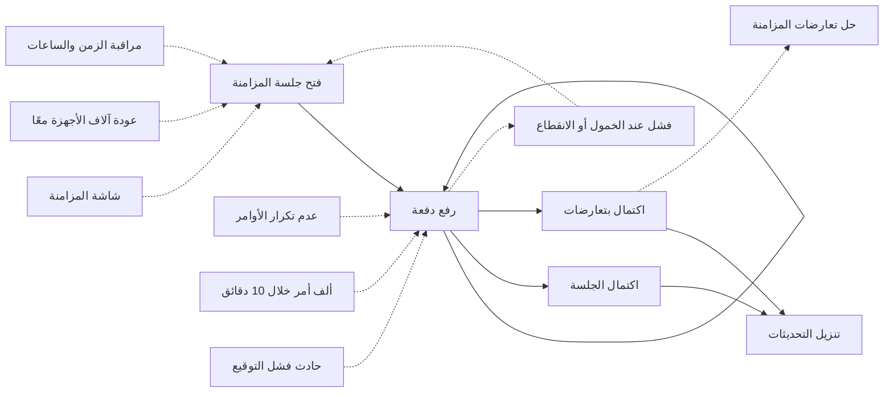
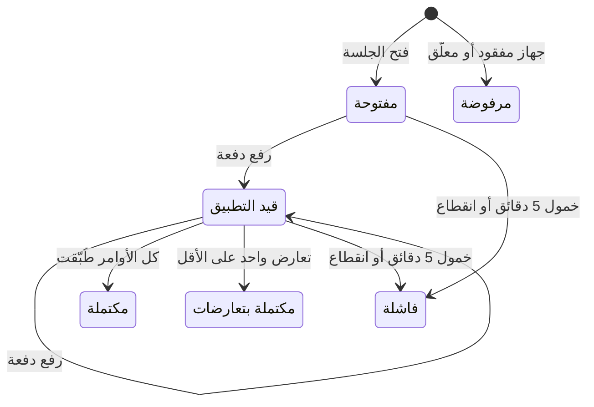

# المزامنة الميدانية

<!-- BEGIN GENERATED: doc -->
| البند | القيمة |
|---|---|
| المعرّف | FEAT-COL-FIELD-SYNC |
| الإصدار | 0.1 |
| الحالة | مسودة |
| القدرة | CAP-02 جمع المعلومات |
| القدرة الفرعية | CAP-02.03 تسجيل الملاحظات (بما فيها دون اتصال) (R1) |
| الأدوار | المستخدم الميداني؛ النظام |
| الشاشات | SCR-01 مهامي |
| حالات الاستخدام | UC-090، UC-091 |
| القصص | 12: 6 من المواصفة، و6 جديدة |
<!-- END GENERATED: doc -->

## 1. نظرة عامة

### 1.1 القيمة

ينقل ما سجله المستخدم الميداني دون اتصال إلى الخادم بترتيبه الأصلي دون تكرار ويجلب له آخر تحديثات مهامه.

### 1.2 النطاق

| البند | القيمة |
|---|---|
| المستخدمون | المستخدم الميداني بجهازه المسجّل؛ والنظام في إنهاء الجلسة؛ وفريق المنصة والتشغيل والأمن |
| الشاشات | المزامنة في التطبيق الميداني، ومهامي التي تعرض ما نزل من تحديثات |
| حالات الاستخدام | التقاط الملاحظة دون اتصال، ومزامنة الجهاز الميداني |
| المتطلبات | التسجيل وتحديث المهام دون اتصال 72 ساعة على الأقل (REQ-OFF-001)؛ استلام الأوامر بترتيبها الأصلي وأزمنة الجهاز، وزمن التسجيل عند الاستلام (REQ-OFF-003)؛ تحويل الأمر المتعارض إلى المراجعة دون أن تغلب آخر كتابة (REQ-OFF-004)؛ استئناف المزامنة المنقطعة دون تكرار (REQ-OFF-006) |
| خارج النطاق | حسم التعارضات («حل تعارضات المزامنة»)؛ رفض جلسة الجهاز المفقود أو المعلّق ومسحه («الإبلاغ عن جهاز مفقود»)؛ تسجيل الجهاز وتعليقه («إدارة الأجهزة الميدانية»)؛ تحميل الحزم مسبقًا («تحميل بيانات المنطقة مسبقًا»)؛ تنفيذ الأوامر على الجهاز دون اتصال («العمل الميداني دون اتصال») |

### 1.3 خريطة الميزة

حين يعود الاتصال يفتح الجهاز جلسة، ويرفع أوامره دفعةً بعد دفعة، ثم ينزّل ما تغيّر عليه. وتنتهي الجلسة مكتملة، أو مكتملة بتعارضات تذهب إلى المراجعة، أو فاشلة تُستأنف في الجلسة التالية. والشكل 1 يجمع القصص، والشكل 2 يبيّن حالات الجلسة.

**الشكل 1: خريطة ميزة «المزامنة الميدانية»**



**الشكل 2: رحلة جلسة المزامنة**



> **ملاحظة:** «مكتملة» و«مكتملة بتعارضات» و«فاشلة» و«مرفوضة» حالات نهائية. والرفض عند المصافحة لجهاز مفقود أو معلّق تغطيه ميزة «الإبلاغ عن جهاز مفقود». والجلسة الفاشلة لا تُستأنف هي، بل تستأنف الجلسة التالية بعد آخر تسلسل أقرّ به الخادم.

## 2. القواعد المشتركة

تنطبق على كل قصص الميزة، فلا تتكرر داخل القصص. وكل قصة تذكر ما يخصها فقط.

### 2.1 السياق المشترك

كل قصة تبدأ من ثلاثة شروط: مستأجر نشط، وحزمة السياسات الأساسية مفعّلة، ومستخدم مسجّل الدخول ومخوَّل. وتشير إليها القصص بخطوة واحدة: «بفرض السياق المشترك للميزة».

### 2.2 الصلاحية وعدم الإفصاح

- من لا يحق له رؤية العنصر يتلقى ردًا بشكل «غير متاح» تمامًا، فلا يعرف أنه موجود.
- من يرى العنصر ولا يحق له الإجراء يتلقى «لا تملك صلاحية هذا الإجراء».

### 2.3 أوامر تغيير الحالة

- **منع التكرار:** يُرسل كل أمر بمفتاح فريد، فإعادة الطلب نفسه لا تُنفَّذ مرتين.
- **حماية التعديل المتزامن:** يُرسل كل أمر بإصدار البيانات الذي يراه المستخدم. فإن عدّلها غيره في الأثناء، يُرفض الأمر.
- **السجل:** إن نجح الأمر، يُكتب حدثه وسجل التدقيق في المعاملة نفسها.

### 2.4 الرفض المشترك

```gherkin
# language: ar
خاصية: الرفض المشترك لأوامر الميزة

  سيناريو مخطط: رفض مشترك لكل أمر في الميزة
    بفرض السياق المشترك للميزة
    و <الحالة>
    عندما يُرسل المستخدم أي أمر من أوامر الميزة
    اذاً يُرفض برمز <الرمز> ويرى "<الرسالة>"
    و لا يتغير شيء

    امثلة:
      | الحالة                                  | الرمز                  | الرسالة                                                 |
      | العنصر خارج صلاحياته                    | NOT_FOUND              | غير متاح                                                |
      | العنصر مرئي له ولا يحق له الإجراء       | AUTHZ_DENIED           | لا تملك صلاحية هذا الإجراء                              |
      | غيره عدّل العنصر بعد أن فتحه            | VERSION_CONFLICT       | تغيّرت البيانات منذ فتحتها. راجع التغييرات ثم أعد المحاولة |
      | أعاد مفتاح منع التكرار بمحتوى مختلف     | IDEMPOTENCY_KEY_REUSED | طلب مكرر بمحتوى مختلف                                   |
      | البيانات ناقصة أو غير صحيحة             | VALIDATION_FAILED      | بعض البيانات ناقصة أو غير صحيحة. راجع الحقول المعلَّمة      |

  سيناريو: إعادة الطلب نفسه لا تُنفَّذ مرتين
    بفرض السياق المشترك للميزة
    و أمر نجح بمفتاح منع تكرار
    عندما يُعاد الطلب نفسه بالمفتاح نفسه
    اذاً تُعاد النتيجة الأولى ولا يُكتب حدث ثانٍ
```

### 2.5 تطبيق الأوامر المرفوعة

تنطبق على رفع الدفعة واكتمال الجلسة وقصص المنصة في هذه الميزة:

- **الترتيب:** تُطبَّق الأوامر بترتيب الجهاز. فالأمر المبني على سابقه، كالبدء ثم التقديم، يجد الإصدار الذي توقعه إن لم يتغير شيء على الخادم.
- **منع التكرار:** معرّف الأمر الذي يولّده الجهاز هو مفتاح منع تكراره. والأمر الذي طُبّق من قبل يُتخطى ولا يُطبَّق مرتين (REQ-OFF-006).
- **الصلاحية والشروط:** يُطبَّق كل أمر عبر الجزء المالك له، بصلاحيات المستخدم نفسه وقت المزامنة، فلا تُتجاوز شروط المالك ولا سياساته. ومن فقد صلاحية وهو دون اتصال يصير أمره تعارضًا.
- **الأوامر الإلحاقية:** تسجيل الملاحظة، ورفع المرفق، وتسجيل الدليل، وإرفاق الدليل بالملاحظة، وإضافة بند نتيجة إلى المهمة. تُطبَّق دون مقارنة إصدار، ما دامت شروط المالك متحققة.
- **أوامر تغيير الحالة:** تُطبَّق فقط إن طابق الإصدار الذي بُنيت عليه الإصدارَ الحالي، وإلا تصير تعارض مزامنة يحسمه إنسان. ولا تغلب آخر كتابة (REQ-OFF-004).
- **رفض المالك:** إن رفض المالك الأمر لشرط غير الإصدار، يصير تعارضًا بسبب رفضه.
- **الجهاز المفقود:** الأمر الذي سُجّل بعد وقت فقد الجهاز يصير تعارضًا دائمًا («الإبلاغ عن جهاز مفقود»).
- **الأزمنة:** زمن التسجيل هو وقت استلام الخادم. ووقت الجهاز يُحفظ كما هو، ويُصحَّح بفرق الساعة المقيس عند فتح الجلسة (REQ-OFF-003). وانحراف الساعة أكثر من 5 دقائق يضع على البيانات علامة «ساعة الجهاز مشكوك فيها».
- **الإقرار:** بعد كل دفعة يُقرّ الخادم بأعلى تسلسل متصل عالجه، ومنه تستأنف الجلسة التالية.

## 3. الجودة وتعريف الاكتمال

### 3.1 متطلبات الجودة

<!-- BEGIN GENERATED: quality -->
| المرجع | الموقف | المطلوب |
|---|---|---|
| QAS-OFF-001 | works 72 h offline then reconnects on a 1 Mbps link | 1,000 queued commands synced ≤ 10 min; 0 silent overwrites; 0 duplicates |
| QAS-OFF-003 | 5,000 devices reconnect within 10 min | all sessions complete ≤ 30 min; oldest-offline devices first; no data loss |
<!-- END GENERATED: quality -->

### 3.2 تعريف الاكتمال

القصة مكتملة حين تتحقق الشروط الخمسة:

1. سيناريوهاتها والقواعد المشتركة تمر في الاختبار الآلي.
2. فحوص البنية المعمارية تمر.
3. نصوص الواجهة والرسائل موجودة بالعربية والإنجليزية.
4. مراجعة الكود مكتملة.
5. ما تضيفه القصة نفسها في قسم «القواعد» تحقق.

## 4. فهرس القصص

<!-- BEGIN GENERATED: story-index -->
| المعرّف | القصة | النوع | الحالة |
|---|---|---|---|
| `US-BC07-SYN-OPEN` | فتح جلسة المزامنة | أمر | مسودة |
| `US-BC07-SYN-UPLOAD-BATCH` | رفع دفعة إلى جلسة المزامنة | أمر | مسودة |
| `US-BC07-Q-SYN-DELTA` | جلب: Server → device: my task changes, package updates, purge list, conflict notices, wipe/stop instruction | جلب | مسودة |
| `US-BC07-S-SYNC-SESSION-02` | تلقائي: all uploaded commands processed without conflict (جلسة المزامنة) | نظام | مسودة |
| `US-BC07-S-SYNC-SESSION-03` | تلقائي: all processed with ≥ 1 sync conflict (جلسة المزامنة) | نظام | مسودة |
| `US-BC07-S-SYNC-SESSION-04` | تلقائي: idle timeout (5 min) or transport loss (جلسة المزامنة) | نظام | مسودة |
| `US-UI-SCR01-SYNC-DETAILS` | شاشة المزامنة وتقدمها وما بقي معلقًا | واجهة | مسودة |
| `US-PLT-SYNC-GATEWAY-SCALE` | استيعاب عودة آلاف الأجهزة معًا | منصة | مسودة |
| `US-PLT-SYNC-IDEMPOTENCY-STORE` | عدم تكرار الأوامر مهما انقطعت المزامنة | منصة | مسودة |
| `US-PLT-SYNC-THROUGHPUT` | مزامنة ألف أمر خلال عشر دقائق | منصة | مسودة |
| `US-OPS-SYNC-HEALTH-ALERTS` | مراقبة زمن المزامنة وانحراف ساعات الأجهزة | تشغيل | مسودة |
| `US-OPS-SYNC-SIGNATURE-INCIDENT` | معاملة فشل توقيع الأوامر كحادث أمني | تشغيل | مسودة |
<!-- END GENERATED: story-index -->

## 5. القصص

### 5.1 US-BC07-SYN-OPEN — فتح جلسة المزامنة

| النوع | الإصدار | الأولوية | دون اتصال | الحالة |
|---|---|---|---|---|
| أمر | R1 | Must | لا | مسودة |

> **كـ** المستخدم الميداني، **أريد** أن يفتح جهازي جلسة مزامنة حين يعود الاتصال، **حتى** يُرفع ما سجّلته من حيث توقف آخر مرة.

**باختصار:** يصافح الجهاز الخادم بتوقيعه ووقته وآخر تسلسل أُقرّ له، فتُفتح جلسة «مفتوحة» ويُقاس فرق ساعته.

#### القواعد

- **متى يُسمح:** الجهاز «نشط»، وجلسة دخول المستخدم حديثة، وتوقيع المصافحة يطابق مفتاح الجهاز. أما الجهاز المفقود أو المعلّق فلا تُفتح له جلسة، بل تُرفض بتعليمة مسح أو توقف («الإبلاغ عن جهاز مفقود»).
- **من يُسمح له:** المستخدم الميداني بجهازه المسجّل، في مستأجره.
- **البيانات:** الجهاز، ووقت الجهاز، وآخر تسلسل أُقرّ له، وطول الطابور، وبصمة رأس الطابور، والتوقيع (كلها إلزامية).
- **الأثر:** تُفتح جلسة «مفتوحة»، ويُحسب فرق الساعة بين الخادم والجهاز. ويُعاد للجهاز معرّف الجلسة وآخر تسلسل مُقرّ ووقت الخادم، فيستأنف الرفع بعد آخر تسلسل مُقرّ. ويُسجَّل حدث «فُتحت جلسة المزامنة».

> **ملاحظة:** **[Needs Review]** المصدر يجمع فشل التوقيع وعدم نشاط الجهاز تحت رمز واحد، فيرى صاحب التوقيع الخاطئ رسالة «الجهاز غير نشط».

#### معايير القبول

```gherkin
# language: ar
خاصية: فتح جلسة المزامنة

  سيناريو: جهاز نشط يعود اتصاله
    بفرض السياق المشترك للميزة
    و جهاز "نشط" أقرّ له الخادم بالتسلسل 120 وفي طابوره 80 أمرًا
    عندما يرسل المصافحة موقّعة بمفتاحه ومعها وقته
    اذاً تُفتح جلسة "مفتوحة" ويُحسب فرق ساعته عن الخادم
    و يُعاد له معرّف الجلسة والتسلسل 120 ووقت الخادم
    و يُسجَّل حدث "فُتحت جلسة المزامنة"

  سيناريو مخطط: رفض خاص بفتح جلسة المزامنة
    بفرض السياق المشترك للميزة
    و <الحالة>
    عندما يحاول الجهاز فتح جلسة مزامنة
    اذاً يُرفض برمز <الرمز> ويرى "<الرسالة>"
    و لا يتغير شيء

    امثلة:
      | الحالة | الرمز | الرسالة |
      | الجهاز لم يُؤكَّد تسجيله بعد أو أُخرج من الخدمة | DEVICE_NOT_ACTIVE | الجهاز غير نشط. تواصل مع المسؤول |
      | توقيع المصافحة لا يطابق مفتاح الجهاز | DEVICE_NOT_ACTIVE | الجهاز غير نشط. تواصل مع المسؤول |
      | لم يُرسل آخر تسلسل مُقرّ | VALIDATION_FAILED | آخر تسلسل مُقرّ مطلوب |
```

<details><summary>المراجع التقنية والتتبع</summary>

<!-- BEGIN GENERATED: refs US-BC07-SYN-OPEN -->
| البند | المعرّف | المعنى |
|---|---|---|
| الواجهة البرمجية | `POST /api/v1/field/sync-sessions` | — |
| الأمر | `CMD-SYN-OPEN` | فتح جلسة المزامنة |
| السياسة | `POL-SYN-OPEN` | field device + user (open, upload)؛ tenant match; device ACTIVE where applicable; device signature for SYN |
| الحدث | `EVT-SYN-OPENED` | يصل إلى: Owner contexts (commands applied via their APIs); Field telemetry |
| الكيان | `AGG-SYNC-SESSION` | جلسة المزامنة |
| الجدول | `field.sync_sessions` | الجدول الرئيسي لجلسة المزامنة |
| وحدة النشر | DU-10 | — |
| المتطلبات | REQ-OFF-001، REQ-OFF-003، REQ-OFF-004، REQ-OFF-006 | معانيها في القسم 6. التتبع |
| حالات الاستخدام | UC-090، UC-091 | Capture Observation Offline؛ Synchronize Field Device |
| الاختبار | TST-SYNC-SESSION-SM، TST-SLC11-INVARIANTS | دورة حالات جلسة المزامنة، وثوابت الشريحة SLC-11 |
<!-- END GENERATED: refs US-BC07-SYN-OPEN -->

</details>

### 5.2 US-BC07-SYN-UPLOAD-BATCH — رفع دفعة إلى جلسة المزامنة

| النوع | الإصدار | الأولوية | دون اتصال | الحالة |
|---|---|---|---|---|
| أمر | R1 | Must | لا | مسودة |

> **كـ** المستخدم الميداني، **أريد** أن يرفع جهازي أوامره دفعةً بعد دفعة بترتيبها، **حتى** يُطبَّق كل ما سجّلته دون اتصال مرة واحدة وبترتيبه.

**باختصار:** يرفع الجهاز دفعة حتى 200 أمر متصلة التسلسل وموقّعة، فتصير الجلسة «قيد التطبيق» وتُطبَّق الأوامر بترتيبها (§2.5).

#### القواعد

- **متى يُسمح:** الجلسة «مفتوحة» أو «قيد التطبيق». والدفعة 200 أمر على الأكثر، تبدأ بعد آخر تسلسل مُقرّ بلا فجوة، وكل أمر فيها موقّع بمفتاح الجهاز، وسلسلة البصمات متصلة.
- **من يُسمح له:** المستخدم الميداني بجهاز الجلسة.
- **البيانات:** الأوامر بترتيبها (إلزامي)، ولكل أمر معرّفه وتسلسله ووقت الجهاز وتوقيعه، ولأوامر تغيير الحالة الإصدار الذي بُنيت عليه؛ وعلامة نهاية الطابور (إلزامية).
- **الأثر:** تصير الجلسة «قيد التطبيق»، ويُسجَّل حدث «استُلمت دفعة مزامنة». وتُطبَّق الأوامر بقواعد §2.5، ويُقرّ الخادم بأعلى تسلسل متصل عالجه. وعند الفجوة يعيد الجهاز الإرسال من بعد آخر تسلسل مُقرّ. وبعد الدفعة الأخيرة تكتمل الجلسة (القصتان 5.4 و5.5).

#### معايير القبول

```gherkin
# language: ar
خاصية: رفع دفعة إلى جلسة المزامنة

  سيناريو: دفعة متصلة فيها أمر سبق تطبيقه
    بفرض السياق المشترك للميزة
    و جلسة "مفتوحة" أقرّ فيها الخادم بالتسلسل 120
    و دفعة موقّعة بالتسلسلات 121 إلى 123، والأمر 121 طُبّق من قبل
    عندما يرفعها الجهاز
    اذاً تصبح حالة الجلسة "قيد التطبيق"
    و يُتخطى الأمر 121 ويُطبَّق الأمران 122 و123 بترتيبهما
    و يُقرّ الخادم بالتسلسل 123
    و يُسجَّل حدث "استُلمت دفعة مزامنة"

  سيناريو مخطط: رفض خاص برفع الدفعة
    بفرض السياق المشترك للميزة
    و <الحالة>
    عندما يحاول الجهاز رفع الدفعة
    اذاً يُرفض برمز <الرمز> ويرى "<الرسالة>"
    و لا يتغير شيء

    امثلة:
      | الحالة | الرمز | الرسالة |
      | الدفعة لا تبدأ بعد آخر تسلسل مُقرّ | SEQUENCE_GAP | الدفعة غير متسلسلة مع ما سبقها. أعد المزامنة |
      | توقيع أمر لا يطابق مفتاح الجهاز أو انقطعت سلسلة البصمات | SEQUENCE_GAP | الدفعة غير متسلسلة مع ما سبقها. أعد المزامنة |
      | الدفعة أكثر من 200 أمر | SEQUENCE_GAP | الدفعة غير متسلسلة مع ما سبقها. أعد المزامنة |
      | الجلسة منتهية في الإصدار الذي يرسله الجهاز | SYNC_SESSION_INVALID_STATE_TRANSITION | الوضع الحالي لجلسة المزامنة لا يسمح بهذا الإجراء |
      | لم تُرسل علامة نهاية الطابور | VALIDATION_FAILED | علامة نهاية الطابور مطلوبة |
```

<details><summary>المراجع التقنية والتتبع</summary>

<!-- BEGIN GENERATED: refs US-BC07-SYN-UPLOAD-BATCH -->
| البند | المعرّف | المعنى |
|---|---|---|
| الواجهة البرمجية | `POST /api/v1/field/sync-sessions/{id}/actions/upload-batch` | — |
| الأمر | `CMD-SYN-UPLOAD-BATCH` | رفع دفعة إلى جلسة المزامنة |
| السياسة | `POL-SYN-UPLOAD-BATCH` | field device + user (open, upload)؛ tenant match; device ACTIVE where applicable; device signature for SYN |
| الحدث | `EVT-SYN-BATCH-RECEIVED` | يصل إلى: Owner contexts (commands applied via their APIs); Field telemetry |
| الكيان | `AGG-SYNC-SESSION` | جلسة المزامنة |
| الجدول | `field.sync_sessions` | الجدول الرئيسي لجلسة المزامنة |
| وحدة النشر | DU-10 | — |
| المتطلبات | REQ-OFF-001، REQ-OFF-003، REQ-OFF-004، REQ-OFF-006 | معانيها في القسم 6. التتبع |
| حالات الاستخدام | UC-090، UC-091 | Capture Observation Offline؛ Synchronize Field Device |
| الاختبار | TST-SYNC-SESSION-SM، TST-SLC11-INVARIANTS | دورة حالات جلسة المزامنة، وثوابت الشريحة SLC-11 |
<!-- END GENERATED: refs US-BC07-SYN-UPLOAD-BATCH -->

</details>

### 5.3 US-BC07-Q-SYN-DELTA — تنزيل تحديثات الجهاز بعد الرفع

| النوع | الإصدار | الأولوية | دون اتصال | الحالة |
|---|---|---|---|---|
| جلب | R1 | Must | لا | مسودة |

> **كـ** المستخدم الميداني، **أريد** أن ينزل إلى جهازي بعد الرفع ما تغيّر في مهامي وحزمي وما يجب حذفه وإشعارات التعارض، **حتى** يعمل جهازي على آخر حالة وينفّذ تعليمات الخادم.

**باختصار:** يُعاد لجهاز الجلسة ومستخدمها، صفحةً بعد صفحة، ما تغيّر عليه: ملخص مهامه، وحالة الحزم، وقائمة الحذف، وإشعارات التعارض، وتعليمة واحدة.

#### القواعد

- **من يرى ماذا:** جهاز الجلسة ومستخدمها فقط، ومن سواهما يتلقى «غير متاح». والمهام نسخة ملخصة مما يحق للمستخدم رؤيته، ويُعاد فحص صلاحية كل عنصر قبل إعادته.
- **المحتوى:** تغييرات مهام المستخدم؛ وحالة الحزم المحمّلة؛ وقائمة حذف بالحزم المنتهية أو الملغاة وبالعناصر التي فقد المستخدم صلاحيتها؛ وإشعارات التعارضات؛ وتعليمة: استمر، أو توقف، أو امسح، أو أعد المصادقة.
- **المرشحات:** المؤشر وحجم الصفحة، والصفحة بمؤشر لا برقم.
- **الاتصال:** يحتاج اتصالًا، فهو جزء من جلسة المزامنة.

#### معايير القبول

```gherkin
# language: ar
خاصية: تنزيل تحديثات الجهاز بعد الرفع

  سيناريو: تحديثات المهام وقائمة الحذف
    بفرض السياق المشترك للميزة
    و أُسندت إلى المستخدم مهمة جديدة وفقد صلاحيته على عنصر في حزمة محمّلة
    عندما يطلب جهازه التحديثات بعد الرفع
    اذاً يُعاد ملخص المهمة الجديدة
    و يُعاد العنصر في قائمة الحذف دون محتواه
    و تُعاد التعليمة "استمر"

  سيناريو: الصفحة التالية
    بفرض السياق المشترك للميزة
    و التحديثات أكثر من صفحة
    عندما يطلب جهازه الصفحة التالية بالمؤشر
    اذاً تُعاد التحديثات التالية دون تكرار ولا فجوة

  سيناريو: جهاز غير جهاز الجلسة
    بفرض السياق المشترك للميزة
    و جلسة مزامنة لجهاز آخر
    عندما يطلب المستخدم تحديثاتها
    اذاً يتلقى "غير متاح"
```

<details><summary>المراجع التقنية والتتبع</summary>

<!-- BEGIN GENERATED: refs US-BC07-Q-SYN-DELTA -->
| البند | المعرّف | المعنى |
|---|---|---|
| الواجهة البرمجية | `GET /api/v1/field/sync-sessions/{session_id}/delta` | — |
| الاستعلام | `QRY-SYN-DELTA` | Server → device: my task changes, package updates, purge list, conflict notices, wipe/stop instruction |
| السياسة | `POL-SYN-DELTA` | device + user of the session |
| الكيان | `AGG-SYNC-SESSION` | جلسة المزامنة |
| الجدول | `field.sync_sessions` | الجدول الرئيسي لجلسة المزامنة |
| وحدة النشر | DU-10 | — |
| المتطلب | REQ-OFF-001 | Where the mobile field application is used, the system shall allow recording observations with location, time… |
| حالة الاستخدام | UC-090 | Capture Observation Offline |
| الاختبار | TST-SYNC-SESSION-SM، TST-SLC11-INVARIANTS | دورة حالات جلسة المزامنة، وثوابت الشريحة SLC-11 |
<!-- END GENERATED: refs US-BC07-Q-SYN-DELTA -->

</details>

### 5.4 US-BC07-S-SYNC-SESSION-02 — اكتمال جلسة المزامنة دون تعارض

| النوع | الإصدار | الأولوية | دون اتصال | الحالة |
|---|---|---|---|---|
| نظام | R1 | Must | لا ينطبق | مسودة |

> **كـ** النظام، **أريد** أن أُكمل جلسة المزامنة حين تُعالج كل أوامرها دون تعارض، **حتى** يعرف الجهاز أن طابوره صار متزامنًا.

**باختصار:** بعد أن يعلن الجهاز نهاية طابوره، وكل أمر طُبّق أو عُرف أنه طُبّق من قبل، تصير الجلسة «مكتملة».

#### القواعد

- **متى يحدث:** الجلسة «قيد التطبيق»، والجهاز أعلن نهاية الطابور، وكل أمر طُبّق أو تُخطّي لأنه طُبّق من قبل، ولم يصر أي أمر تعارضًا.
- **الأثر:** تصير الجلسة «مكتملة»، ويُسجَّل حدث «اكتملت المزامنة» وسجل تدقيق بهوية النظام. ويصل الحدث إلى قياسات الأجهزة الميدانية.

#### معايير القبول

```gherkin
# language: ar
خاصية: اكتمال جلسة المزامنة دون تعارض

  سيناريو: الدفعة الأخيرة طُبّقت كلها
    بفرض جلسة "قيد التطبيق" رفع فيها الجهاز دفعته الأخيرة بعلامة نهاية الطابور
    و كل أوامرها طُبّقت أو تُخطّيت لأنها طُبّقت من قبل
    عندما تنتهي معالجة الدفعة
    اذاً تصبح حالة الجلسة "مكتملة"
    و يُسجَّل حدث "اكتملت المزامنة" وسجل تدقيق بهوية النظام

  سيناريو: الطابور لم ينته بعد
    بفرض جلسة "قيد التطبيق" رفع فيها الجهاز دفعة دون علامة نهاية الطابور
    عندما تنتهي معالجة الدفعة
    اذاً تبقى الجلسة "قيد التطبيق" ولا يتغير شيء
```

<details><summary>المراجع التقنية والتتبع</summary>

<!-- BEGIN GENERATED: refs US-BC07-S-SYNC-SESSION-02 -->
| البند | المعرّف | المعنى |
|---|---|---|
| المحفِّز | `SYS:all uploaded commands processed without conflict` | device declared end of queue; every command applied or idempotently recognized |
| الانتقال | APPLYING ← COMPLETED | — |
| الحدث | `EVT-SYN-COMPLETED` | يصل إلى: Owner contexts (commands applied via their APIs); Field telemetry |
| الكيان | `AGG-SYNC-SESSION` | جلسة المزامنة |
| الجدول | `field.sync_sessions` | الجدول الرئيسي لجلسة المزامنة |
| وحدة النشر | DU-10 | — |
| المتطلبات | REQ-OFF-001، REQ-OFF-003، REQ-OFF-004، REQ-OFF-006 | معانيها في القسم 6. التتبع |
| حالات الاستخدام | UC-090، UC-091 | Capture Observation Offline؛ Synchronize Field Device |
| الاختبار | TST-SYNC-SESSION-SM، TST-SLC11-INVARIANTS | دورة حالات جلسة المزامنة، وثوابت الشريحة SLC-11 |
<!-- END GENERATED: refs US-BC07-S-SYNC-SESSION-02 -->

</details>

### 5.5 US-BC07-S-SYNC-SESSION-03 — اكتمال جلسة المزامنة بتعارضات

| النوع | الإصدار | الأولوية | دون اتصال | الحالة |
|---|---|---|---|---|
| نظام | R1 | Must | لا ينطبق | مسودة |

> **كـ** النظام، **أريد** أن أُكمل جلسة المزامنة بتعارضات حين يصير أمر منها تعارضًا، **حتى** يُحسم الأمر المتعارض بيد إنسان ولا يُكتب شيء بصمت.

**باختصار:** بعد معالجة كل أوامر الجلسة، إن صار أمر واحد على الأقل تعارضًا، تصير الجلسة «مكتملة بتعارضات» ويُفتح كل تعارض للمراجعة.

#### القواعد

- **متى يحدث:** الجلسة «قيد التطبيق»، والجهاز أعلن نهاية الطابور، وعولجت كل الأوامر، وصار أمر واحد على الأقل تعارضًا (§2.5).
- **الأثر:** تصير الجلسة «مكتملة بتعارضات»، ويُسجَّل حدث «اكتملت المزامنة بتعارضات» وسجل تدقيق بهوية النظام. وكل تعارض يُفتح للمراجعة بأمره الأصلي ولقطة الحالة الحالية وسبب الرفض («حل تعارضات المزامنة»)، ويصل إشعاره إلى الجهاز في التنزيل التالي (القصة 5.3). والأوامر الأخرى في الجلسة تبقى مطبَّقة.

#### معايير القبول

```gherkin
# language: ar
خاصية: اكتمال جلسة المزامنة بتعارضات

  سيناريو: أمر مبني على إصدار قديم
    بفرض جلسة "قيد التطبيق" رفع فيها الجهاز دفعته الأخيرة بعلامة نهاية الطابور
    و أحد أوامرها يبدأ مهمة عدّلها المخطِّط على الخادم في الأثناء
    عندما تنتهي معالجة الدفعة
    اذاً تصبح حالة الجلسة "مكتملة بتعارضات"
    و يُفتح تعارض بالأمر الأصلي ولقطة المهمة الحالية وسبب الرفض
    و تبقى الأوامر الأخرى مطبَّقة
    و يُسجَّل حدث "اكتملت المزامنة بتعارضات" وسجل تدقيق بهوية النظام

  سيناريو: لا تعارض في الجلسة
    بفرض جلسة "قيد التطبيق" طُبّقت كل أوامرها بعد إعلان نهاية الطابور
    عندما تنتهي معالجة الدفعة
    اذاً لا تصبح الجلسة "مكتملة بتعارضات" ولا يُفتح أي تعارض
```

<details><summary>المراجع التقنية والتتبع</summary>

<!-- BEGIN GENERATED: refs US-BC07-S-SYNC-SESSION-03 -->
| البند | المعرّف | المعنى |
|---|---|---|
| المحفِّز | `SYS:all processed with ≥ 1 sync conflict` | conflicts opened as AGG-SYNC-CONFLICT |
| الانتقال | APPLYING ← COMPLETED_WITH_CONFLICTS | — |
| الحدث | `EVT-SYN-COMPLETED-WITH-CONFLICTS` | يصل إلى: Owner contexts (commands applied via their APIs); Field telemetry |
| الكيان | `AGG-SYNC-SESSION` | جلسة المزامنة |
| الجدول | `field.sync_sessions` | الجدول الرئيسي لجلسة المزامنة |
| وحدة النشر | DU-10 | — |
| المتطلبات | REQ-OFF-001، REQ-OFF-003، REQ-OFF-004، REQ-OFF-006 | معانيها في القسم 6. التتبع |
| حالات الاستخدام | UC-090، UC-091 | Capture Observation Offline؛ Synchronize Field Device |
| الاختبار | TST-SYNC-SESSION-SM، TST-SLC11-INVARIANTS | دورة حالات جلسة المزامنة، وثوابت الشريحة SLC-11 |
<!-- END GENERATED: refs US-BC07-S-SYNC-SESSION-03 -->

</details>

### 5.6 US-BC07-S-SYNC-SESSION-04 — فشل الجلسة عند الخمول أو انقطاع الاتصال

| النوع | الإصدار | الأولوية | دون اتصال | الحالة |
|---|---|---|---|---|
| نظام | R1 | Must | لا ينطبق | مسودة |

> **كـ** النظام، **أريد** أن أُنهي جلسة المزامنة بالفشل حين تخمل أو ينقطع اتصالها، **حتى** تستأنف الجلسة التالية من آخر تسلسل مُقرّ دون تكرار ولا فقد.

**باختصار:** بعد 5 دقائق دون نشاط، أو عند انقطاع الاتصال، تصير الجلسة «فاشلة» ويبقى آخر تسلسل أقرّ به الخادم.

#### القواعد

- **متى يحدث:** الجلسة «مفتوحة» أو «قيد التطبيق»، ومضت 5 دقائق دون نشاط أو انقطع الاتصال. ومنه أن يتعذر الوصول إلى الجزء المالك للأوامر بعد إعادة المحاولة بتأخير متزايد داخل الجلسة.
- **الأثر:** تصير الجلسة «فاشلة»، ويُسجَّل حدث «فشلت المزامنة» وسجل تدقيق بهوية النظام. ويبقى آخر تسلسل مُقرّ، فتستأنف الجلسة التالية بعده دون تكرار ولا فقد (REQ-OFF-006).

#### معايير القبول

```gherkin
# language: ar
خاصية: فشل الجلسة عند الخمول أو انقطاع الاتصال

  سيناريو: انقطاع الاتصال وسط الرفع
    بفرض جلسة "قيد التطبيق" أقرّ فيها الخادم بالتسلسل 150 من طابور طوله 300
    عندما ينقطع الاتصال
    اذاً تصبح حالة الجلسة "فاشلة" ويبقى التسلسل 150 مُقرًّا
    و يُسجَّل حدث "فشلت المزامنة" وسجل تدقيق بهوية النظام
    و تستأنف الجلسة التالية الرفع من التسلسل 151

  سيناريو: نشاط قبل انقضاء المهلة
    بفرض جلسة "مفتوحة" رفع فيها الجهاز دفعة قبل 3 دقائق
    عندما يفحص النظام خمول الجلسات
    اذاً لا تفشل الجلسة ولا يتغير شيء
```

<details><summary>المراجع التقنية والتتبع</summary>

<!-- BEGIN GENERATED: refs US-BC07-S-SYNC-SESSION-04 -->
| البند | المعرّف | المعنى |
|---|---|---|
| المحفِّز | `SYS:idle timeout (5 min) or transport loss` | acknowledged seq retained; next session resumes (REQ-OFF-006) |
| الانتقال | OPEN, APPLYING ← FAILED | — |
| الحدث | `EVT-SYN-FAILED` | يصل إلى: Owner contexts (commands applied via their APIs); Field telemetry |
| الكيان | `AGG-SYNC-SESSION` | جلسة المزامنة |
| الجدول | `field.sync_sessions` | الجدول الرئيسي لجلسة المزامنة |
| وحدة النشر | DU-10 | — |
| المتطلبات | REQ-OFF-001، REQ-OFF-003، REQ-OFF-004، REQ-OFF-006 | معانيها في القسم 6. التتبع |
| حالات الاستخدام | UC-090، UC-091 | Capture Observation Offline؛ Synchronize Field Device |
| الاختبار | TST-SYNC-SESSION-SM، TST-SLC11-INVARIANTS | دورة حالات جلسة المزامنة، وثوابت الشريحة SLC-11 |
<!-- END GENERATED: refs US-BC07-S-SYNC-SESSION-04 -->

</details>

### 5.7 US-UI-SCR01-SYNC-DETAILS — شاشة المزامنة وتقدمها وما بقي معلقًا

| النوع | الإصدار | الأولوية | دون اتصال | الحالة |
|---|---|---|---|---|
| واجهة | R1 | Should | من النسخة المحلية | مسودة |

> **كـ** المستخدم الميداني، **أريد** شاشة مزامنة تبيّن تقدمها وما بقي معلقًا وما صار قيد المراجعة، **حتى** أعرف أن ما سجّلته وصل، أو لماذا لم يصل.

**باختصار:** شاشة «المزامنة» في التطبيق الميداني تعرض حالة المزامنة، والأوامر المعلقة، وتقدم الجلسة الجارية، والتعارضات وإشعاراتها. وتعمل من النسخة المحلية.

#### القواعد

- الحالة كما في مؤشر المزامنة في ميزة «مهامي»: متزامن مع وقت آخر مزامنة، أو معلّق بعدد الأوامر، أو جارٍ، أو قيد المراجعة، أو منتهي المدة بعد 72 ساعة، أو مقفل بتعليمة من الخادم **[Derived]**.
- الأوامر المعلقة تُعرض من طابور الجهاز بترتيبها، وكل منها بعلامة «لم يُرسل» حتى يُقرّ به الخادم.
- أثناء الجلسة يظهر التقدم بعدد ما أُقرّ به من طول الطابور **[Derived]**.
- العنصر الذي صار تعارضًا يظهر «قيد المراجعة» مع سبب الرفض المسموح عرضه. وحين يُهمَل يُبلَّغ المستخدم بالسبب.
- تتصرف الشاشة بحسب رمز الرفض لا بنص الرسالة، ولا يُفقد أي أمر من الطابور **[Derived]**.

#### معايير القبول

```gherkin
# language: ar
خاصية: شاشة المزامنة وتقدمها وما بقي معلقًا

  سيناريو: تقدم الجلسة الجارية
    بفرض السياق المشترك للميزة
    و في طابور الجهاز 300 أمر بعلامة "لم يُرسل"، وأقرّ الخادم بـ150 منها
    عندما يفتح المستخدم شاشة المزامنة
    اذاً يرى التقدم 150 من 300
    و تبقى علامة "لم يُرسل" على الأوامر الـ150 الباقية فقط

  سيناريو: أمر صار تعارضًا
    بفرض السياق المشترك للميزة
    و اكتملت المزامنة بتعارض على بدء مهمة
    عندما يفتح المستخدم شاشة المزامنة
    اذاً يظهر بدء المهمة "قيد المراجعة" مع سبب الرفض

  سيناريو مخطط: تصرف الشاشة حسب رمز الرفض
    بفرض السياق المشترك للميزة
    و <الحالة>
    عندما يرفض الخادم طلب المزامنة برمز <الرمز>
    اذاً <التصرف>
    و تظهر الرسالة "<الرسالة>"
    و لا يتغير شيء

    امثلة:
      | الحالة | الرمز | الرسالة | التصرف |
      | الخادم وجد فجوة في التسلسل | SEQUENCE_GAP | الدفعة غير متسلسلة مع ما سبقها. أعد المزامنة | يعيد الجهاز الإرسال تلقائيًا من بعد آخر تسلسل مُقرّ |
      | الجهاز لم يعد نشطًا | DEVICE_NOT_ACTIVE | الجهاز غير نشط. تواصل مع المسؤول | تتوقف المزامنة ويبقى الطابور على الجهاز |
      | طلبات كثيرة في وقت قصير | RATE_LIMITED | طلبات كثيرة في وقت قصير. انتظر قليلًا ثم أعد المحاولة | تُعاد المحاولة بعد المهلة التي يحددها الخادم |
```

<details><summary>المراجع التقنية والتتبع</summary>

<!-- BEGIN GENERATED: refs US-UI-SCR01-SYNC-DETAILS -->
| البند | المعرّف | المعنى |
|---|---|---|
| الشاشة | SCR-01 | شاشة مهامي |
| المصدر | `21-ui-design.md §8.1` | — |
| المصدر | `21-ui-design.md §8.2` | — |
| حالة الاستخدام | UC-091 | Synchronize Field Device |
| المصدر | `[Derived]` | — |
<!-- END GENERATED: refs US-UI-SCR01-SYNC-DETAILS -->

</details>

### 5.8 US-PLT-SYNC-GATEWAY-SCALE — استيعاب عودة آلاف الأجهزة معًا

| النوع | الإصدار | الأولوية | دون اتصال | الحالة |
|---|---|---|---|---|
| منصة | R1 | Should | لا ينطبق | مسودة |

> **كـ** فريق المنصة، **أريد** بوابة مزامنة تتوسع أفقيًا وتنظّم عودة آلاف الأجهزة معًا، **حتى** تكتمل كل الجلسات خلال 30 دقيقة دون فقد بيانات.

#### القواعد

- الهدف: 5,000 جهاز يعود اتصالها خلال 10 دقائق عند بداية نوبة الصباح، فتكتمل كل جلساتها خلال 30 دقيقة، بالأقدم انقطاعًا أولًا، ودون فقد بيانات (QAS-OFF-003).
- البوابة لا تحفظ حالة بين الطلبات، فتُضاف نسخ منها عند الحمل.
- لكل جهاز حد لمعدل الطلبات. وعند عاصفة إعادة الاتصال تنتظر الجلسات في طابور يقدّم الأجهزة الأقدم انقطاعًا.
- الحمل الزائد يبطئ المزامنة ولا يفقد شيئًا. ويُكشف بعمق طابور المزامنة، ويُصرَّف الطابور خلال 30 دقيقة.

#### معايير القبول

```gherkin
# language: ar
خاصية: استيعاب عودة آلاف الأجهزة معًا

  سيناريو: عاصفة إعادة الاتصال
    بفرض 5,000 جهاز يعود اتصالها خلال 10 دقائق
    عندما تفتح جلسات المزامنة
    اذاً تكتمل كل الجلسات خلال 30 دقيقة
    و لا يُفقد أي أمر

  سيناريو: الأقدم انقطاعًا أولًا
    بفرض جهازان في طابور العاصفة، أحدهما منقطع منذ 70 ساعة والآخر منذ ساعتين
    عندما تُخدم الجلسات المنتظرة
    اذاً تُخدم جلسة الجهاز المنقطع منذ 70 ساعة أولًا
```

<details><summary>المراجع التقنية والتتبع</summary>

<!-- BEGIN GENERATED: refs US-PLT-SYNC-GATEWAY-SCALE -->
| البند | المعرّف | المعنى |
|---|---|---|
| الجودة | QAS-OFF-003 | 5,000 devices reconnect within 10 min → all sessions complete ≤ 30 min; oldest-offline devices first; no data… |
| المصدر | `FM-S11-01` | — |
| المصدر | `field-sync-protocol.md §6` | — |
<!-- END GENERATED: refs US-PLT-SYNC-GATEWAY-SCALE -->

</details>

### 5.9 US-PLT-SYNC-IDEMPOTENCY-STORE — عدم تكرار الأوامر مهما انقطعت المزامنة

| النوع | الإصدار | الأولوية | دون اتصال | الحالة |
|---|---|---|---|---|
| منصة | R1 | Must | لا ينطبق | مسودة |

> **كـ** فريق المنصة، **أريد** سجلًا بكل أمر ميداني طُبّق، بمعرّفه الذي يولّده الجهاز، يبقى 30 يومًا على الأقل، **حتى** لا يُطبَّق أمر مرتين مهما انقطعت المزامنة وأُعيد الرفع.

#### القواعد

- لكل أمر معالَج قيد بالمستأجر ومعرّف الأمر، ومعه الجهاز والتسلسل والأمر المستهدف والنتيجة: طُبّق، أو صار تعارضًا، أو رُفض.
- يبقى القيد 30 يومًا على الأقل، فيغطي 72 ساعة دون اتصال وإعادة الرفع بعدها.
- الأمر الذي له قيد يُتخطى عند إعادة رفعه، ولا يُطبَّق مرة ثانية (REQ-OFF-006).
- انقطاع الاتصال وسط دفعة يُفشل الجلسة، والتالية تستأنف بعد آخر تسلسل مُقرّ، فلا فقد ولا تكرار.
- إن تعذّر الوصول إلى الجزء المالك، تُعاد المحاولة بتأخير متزايد داخل الجلسة، ثم تفشل الجلسة وتُستأنف لاحقًا.

#### معايير القبول

```gherkin
# language: ar
خاصية: عدم تكرار الأوامر مهما انقطعت المزامنة

  سيناريو: مقاطعة المزامنة 100 مرة
    بفرض جهاز في طابوره 500 أمر
    عندما تُقاطع مزامنته في نقاط عشوائية 100 مرة ثم تكتمل
    اذاً يُطبَّق كل أمر مرة واحدة فقط

  سيناريو: ضاع الإقرار فأُعيد الرفع
    بفرض دفعة طُبّقت على الخادم وانقطع الاتصال قبل أن يصل إقرارها إلى الجهاز
    عندما يعيد الجهاز رفعها في الجلسة التالية
    اذاً تُتخطى أوامرها لأن لها قيودًا ولا يُطبَّق منها شيء مرة ثانية
```

<details><summary>المراجع التقنية والتتبع</summary>

<!-- BEGIN GENERATED: refs US-PLT-SYNC-IDEMPOTENCY-STORE -->
| البند | المعرّف | المعنى |
|---|---|---|
| المصدر | `23-crosscutting.md` | — |
| المصدر | `FM-S11-02` | — |
| المصدر | `FM-S11-03` | — |
| المتطلب | REQ-OFF-006 | When a synchronization is interrupted, the system shall resume it without duplicating commands. |
| حالة الاستخدام | UC-091 | Synchronize Field Device |
<!-- END GENERATED: refs US-PLT-SYNC-IDEMPOTENCY-STORE -->

</details>

### 5.10 US-PLT-SYNC-THROUGHPUT — مزامنة ألف أمر خلال عشر دقائق

| النوع | الإصدار | الأولوية | دون اتصال | الحالة |
|---|---|---|---|---|
| منصة | R1 | Should | لا ينطبق | مسودة |

> **كـ** فريق المنصة، **أريد** أن يزامن جهاز عاد بعد 72 ساعة ألف أمر خلال 10 دقائق على رابط بطيء، دون كتابة صامتة فوق البيانات ولا تكرار، **حتى** لا ينتظر المستخدم الميداني ولا يضيع عمله.

#### القواعد

- الهدف: 1,000 أمر في الطابور بعد 72 ساعة دون اتصال، على رابط 1 Mbps، تُزامن خلال 10 دقائق، بلا كتابة صامتة فوق البيانات ولا تكرار، والتعارضات تذهب إلى المراجعة (QAS-OFF-001).
- الأوامر صغيرة، والملفات المرفقة تُرفع منفصلة برفع قابل للاستئناف، فلا تؤخر الأوامر.
- لا تغلب آخر كتابة في المزامنة على بيانات المستويين الأعلى أهمية، كالمهام والملاحظات والأدلة. ويتحقق من ذلك فحص آلي في حزمة اختبار المزامنة (FIT-15). ولا تغلب آخر كتابة إلا في تفضيلات الواجهة.

#### معايير القبول

```gherkin
# language: ar
خاصية: مزامنة ألف أمر خلال عشر دقائق

  سيناريو: جهاز عاد بعد 72 ساعة
    بفرض جهاز دون اتصال منذ 72 ساعة في طابوره 1,000 أمر
    و رابط سرعته 1 Mbps
    عندما يعود الاتصال وتجري المزامنة
    اذاً تُزامن الأوامر كلها خلال 10 دقائق
    و لا يتكرر أي أمر

  سيناريو: تعديل متزامن لا يُكتب فوقه
    بفرض مهمة عدّلها المخطِّط على الخادم بعد أن غيّر المستخدم الميداني حالتها دون اتصال
    عندما يُرفع أمر المستخدم الميداني
    اذاً يصير تعارضًا للمراجعة
    و يبقى تعديل المخطِّط كما هو
```

<details><summary>المراجع التقنية والتتبع</summary>

<!-- BEGIN GENERATED: refs US-PLT-SYNC-THROUGHPUT -->
| البند | المعرّف | المعنى |
|---|---|---|
| الجودة | QAS-OFF-001 | works 72 h offline then reconnects on a 1 Mbps link → 1,000 queued commands synced ≤ 10 min; 0 silent overwri… |
| فحص البنية | FIT-15 | No last-write-wins merge for T1/T2 in sync |
| المصدر | `field-sync-protocol.md §6` | — |
<!-- END GENERATED: refs US-PLT-SYNC-THROUGHPUT -->

</details>

### 5.11 US-OPS-SYNC-HEALTH-ALERTS — مراقبة زمن المزامنة وانحراف ساعات الأجهزة

| النوع | الإصدار | الأولوية | دون اتصال | الحالة |
|---|---|---|---|---|
| تشغيل | R1 | Should | لا ينطبق | مسودة |

> **كـ** فريق التشغيل، **أريد** تنبيهات على زمن جلسات المزامنة وعمق طابورها وانحراف ساعات الأجهزة، **حتى** أتدخل قبل أن تتأخر المزامنة أو تُشوَّه أزمنة الملاحظات.

#### القواعد

- تنبيه حين يتجاوز زمن الجلسة 600 ثانية عند المئين 95.
- تنبيه عاصفة حين يرتفع عمق طابور المزامنة (القصة 5.8). **[Needs Review]** المصدر لا يحدد عتبة هذا التنبيه.
- تنبيه حين تتجاوز نسبة القياسات التي ينحرف فيها فرق الساعة أكثر من 300 ثانية 2%.
- التلاعب بساعة الجهاز خطر مقبول بدرجة متوسطة: زمن التسجيل من الخادم، والفرق يُقاس، والبيانات تُعلَّم (§2.5)، لكن مستخدمًا موثوقًا قد يخطئ في وقت الحدث نفسه.
- نسبة التعارضات تراقبها ميزة «حل تعارضات المزامنة».

#### معايير القبول

```gherkin
# language: ar
خاصية: مراقبة زمن المزامنة وانحراف ساعات الأجهزة

  سيناريو: جلسات بطيئة
    بفرض زمن جلسات المزامنة عند المئين 95 بلغ 700 ثانية
    عندما تُقيَّم قواعد التنبيه
    اذاً يصل تنبيه بطء المزامنة إلى فريق التشغيل

  سيناريو: انحراف ساعات الأجهزة
    بفرض 3% من فروق الساعة المقيسة تتجاوز 300 ثانية
    عندما تُقيَّم قواعد التنبيه
    اذاً يصل تنبيه انحراف الساعات إلى فريق التشغيل
```

<details><summary>المراجع التقنية والتتبع</summary>

<!-- BEGIN GENERATED: refs US-OPS-SYNC-HEALTH-ALERTS -->
| البند | المعرّف | المعنى |
|---|---|---|
| المصدر | `observability-slc11.md` | — |
| المصدر | `THR-S11-05` | — |
<!-- END GENERATED: refs US-OPS-SYNC-HEALTH-ALERTS -->

</details>

### 5.12 US-OPS-SYNC-SIGNATURE-INCIDENT — معاملة فشل توقيع الأوامر كحادث أمني

| النوع | الإصدار | الأولوية | دون اتصال | الحالة |
|---|---|---|---|---|
| تشغيل | R1 | Should | لا ينطبق | مسودة |

> **كـ** فريق الأمن، **أريد** أن يُعامل كل فشل في توقيع أوامر المزامنة حادثًا أمنيًا، **حتى** لا تُحقن أوامر مزوّرة باسم جهاز.

#### القواعد

- كل أمر يحمل توقيع مفتاح الجهاز ويتصل بسابقه بسلسلة بصمات، ومعه معرّفه والإصدار الذي بُني عليه. فلا يُقبل أمر مزوّر، ولا يُطبَّق أمر مُعاد مرتين.
- كل فشل في توقيع أمر يُعدّ في مؤشر فشل التوقيعات، وفشل واحد يكفي لفتح حادث أمني.
- الدفعة التي فشل توقيع أحد أوامرها تُرفض كلها ولا يُطبَّق منها شيء (القصة 5.2).
- خطوات الاستجابة مستنتجة **[Derived]**: يُبلَّغ مسؤول الأمن، ويُراجع الجهاز، ثم يُعلَّق أو يُبلَّغ عنه مفقودًا فيُلغى مفتاحه («إدارة الأجهزة الميدانية»، «الإبلاغ عن جهاز مفقود»).
- إعادة رفع أمر بمعرّفه نفسه ليست حادثًا: يُتخطى لأنه طُبّق من قبل.
- الأوامر الموقّعة تُحفظ مع التعارضات وسجل التدقيق، فلا ينكر المستخدم ما فعله دون اتصال.

#### معايير القبول

```gherkin
# language: ar
خاصية: معاملة فشل توقيع الأوامر كحادث أمني

  سيناريو: أمر بتوقيع مزوّر
    بفرض دفعة فيها أمر لا يطابق توقيعه مفتاح الجهاز
    عندما يرفعها الجهاز
    اذاً تُرفض الدفعة كلها ولا يُطبَّق منها شيء
    و يزيد مؤشر فشل التوقيعات ويُفتح حادث أمني ويُبلَّغ مسؤول الأمن

  سيناريو: أمر مُعاد بمعرّفه نفسه
    بفرض أمر موقّع طُبّق من قبل
    عندما يُعاد رفعه بمعرّفه نفسه
    اذاً يُتخطى ولا يُطبَّق مرة ثانية
    و لا يُفتح حادث أمني
```

<details><summary>المراجع التقنية والتتبع</summary>

<!-- BEGIN GENERATED: refs US-OPS-SYNC-SIGNATURE-INCIDENT -->
| البند | المعرّف | المعنى |
|---|---|---|
| المصدر | `observability-slc11.md` | — |
| المصدر | `THR-S11-02` | — |
| المصدر | `THR-S03-05` | — |
<!-- END GENERATED: refs US-OPS-SYNC-SIGNATURE-INCIDENT -->

</details>

## 6. التتبع

<!-- BEGIN GENERATED: trace -->
| المتطلب | المعنى | القصص | الاختبار |
|---|---|---|---|
| REQ-OFF-001 | Where the mobile field application is used, the system shall allow recording observations with location, time… | كل قصص الميزة المأخوذة من المواصفة (6) | TST-SLC03-INVARIANTS، TST-SLC11-INVARIANTS، TST-SYNC-SESSION-SM، TST-TASK-SM |
| REQ-OFF-003 | When a device reconnects, the system shall receive the device's recorded commands in their original order wit… | كل قصص الأوامر والنظام في الميزة (5) | TST-SLC11-INVARIANTS، TST-SYNC-SESSION-SM |
| REQ-OFF-004 | If a synchronized command conflicts with the current server state, then the system shall route it to conflict… | كل قصص الأوامر والنظام في الميزة (5) | TST-SLC11-INVARIANTS، TST-SYNC-CONFLICT-SM، TST-SYNC-SESSION-SM |
| REQ-OFF-006 | When a synchronization is interrupted, the system shall resume it without duplicating commands. | `US-BC07-S-SYNC-SESSION-02`، `US-BC07-S-SYNC-SESSION-03`، `US-BC07-S-SYNC-SESSION-04`، `US-BC07-SYN-OPEN`، `US-BC07-SYN-UPLOAD-BATCH`، `US-PLT-SYNC-IDEMPOTENCY-STORE` | TST-SLC11-INVARIANTS، TST-SYNC-SESSION-SM |
<!-- END GENERATED: trace -->

## 7. سجل التغييرات

| الإصدار | التاريخ | التغيير |
|---|---|---|
| 0.1 | — | هيكل مولَّد من خريطة الميزات |
| 0.2 | 2026-10-03 | كتابة القصص كاملة بمعيار القصص |
