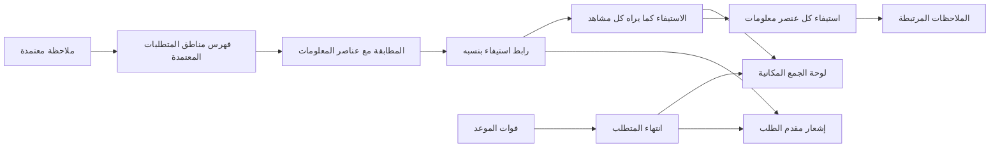
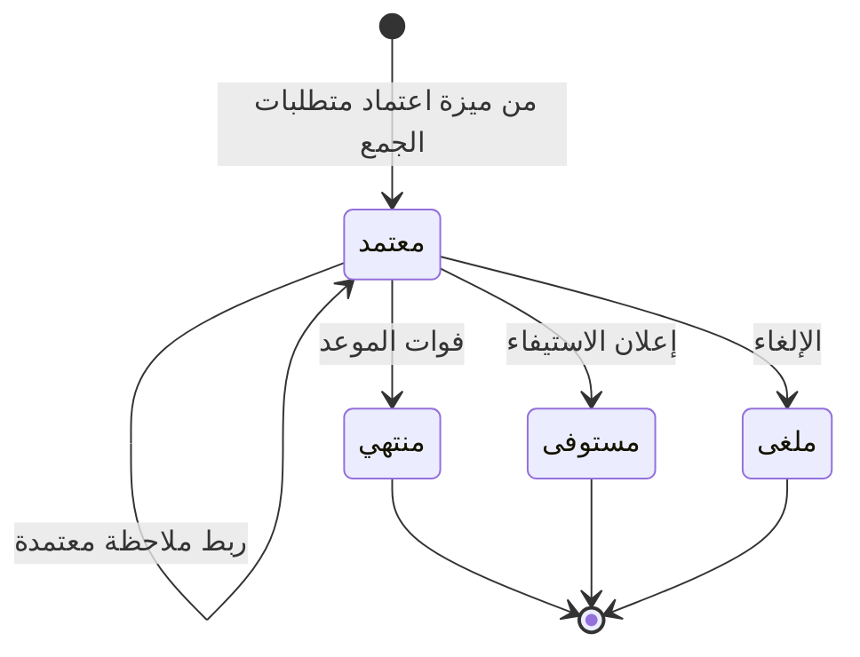

# متابعة استيفاء المتطلبات

<!-- BEGIN GENERATED: doc -->
| البند | القيمة |
|---|---|
| المعرّف | FEAT-COL-FULFILMENT |
| الإصدار | 0.1 |
| الحالة | مسودة |
| القدرة | CAP-02 جمع المعلومات |
| القدرة الفرعية | CAP-02.01 الحاجة المعلوماتية وتخطيط الجمع (R2) |
| الأدوار | مدير الجمع؛ المحلل؛ النظام |
| الشاشات | SCR-13 لوحة الجمع |
| حالات الاستخدام | UC-122 |
| القصص | 7: 4 من المواصفة، و3 جديدة |
<!-- END GENERATED: doc -->

## 1. نظرة عامة

### 1.1 القيمة

يعرض لوحة بالمتطلبات المفتوحة ومدى استيفائها والملاحظات التي أجابت عنها وينبه عند فوات موعدها.

### 1.2 النطاق

| البند | القيمة |
|---|---|
| المستخدمون | مدير الجمع، ومقدم الطلب، والمحلل، والمخطِّط، والنظام (المطابقة والانتهاء)، وفريق المنصة |
| الشاشات | SCR-13 لوحة الجمع |
| حالات الاستخدام | متابعة استيفاء المتطلب (UC-122)، ومن جهة العرض: تعريف متطلب الجمع (UC-120) |
| المتطلبات | تسجيل الحاجة المعلوماتية متطلبَ جمع بسؤال ومنطقة وفترة وأولوية وموعد (REQ-COL-001)، وتحديث استيفاء المتطلب حين تُعتمد ملاحظات تجيب عنه (REQ-COL-003)، وكل رابط استيفاء يعود إلى ملاحظة معتمدة (QAS-COL-001) |
| داخل النطاق | لوحة المتطلبات حسب المنطقة والحالة والأولوية والموعد، واستيفاء كل عنصر معلومات بملاحظاته، والمطابقة التلقائية للملاحظات المعتمدة، وانتهاء المتطلب عند فوات موعده |
| خارج النطاق | إعداد المتطلب وتقديمه وإعلان استيفائه وإلغاؤه (طلب حاجة معلوماتية)، واعتماده ورفضه وتعديله بعد الاعتماد (اعتماد متطلبات الجمع)، وأنشطة الجمع ومهامها (تخطيط أنشطة الجمع)، واعتماد الملاحظات نفسها (التحقق من الملاحظات) |

### 1.3 خريطة الميزة

**الشكل 1: خريطة متابعة استيفاء المتطلبات**



**الشكل 2: متطلب الجمع في هذه الميزة**



القصتان 5.3 و5.4 تغطيان الانتقالين اللذين يبدؤهما النظام في الشكل 2. والانتقالان الآخران من ميزة طلب حاجة معلوماتية.

## 2. القواعد المشتركة

تنطبق على كل قصص الميزة، فلا تتكرر داخل القصص. وكل قصة تذكر ما يخصها فقط.

### 2.1 السياق المشترك

كل قصة تبدأ من ثلاثة شروط: مستأجر نشط، وحزمة السياسات الأساسية مفعّلة، ومستخدم مسجّل الدخول ومخوَّل. وتشير إليها القصص بخطوة واحدة: «بفرض السياق المشترك للميزة».

### 2.2 الصلاحية وعدم الإفصاح

- من لا يحق له رؤية العنصر يتلقى ردًا بشكل «غير متاح» تمامًا، فلا يعرف أنه موجود.
- من يرى العنصر ولا يحق له الإجراء يتلقى «لا تملك صلاحية هذا الإجراء».

### 2.3 عدم الإفصاح في القراءة

- قصص الميزة قراءة وانتقالات يبدؤها النظام، فلا أوامر فيها للمستخدم ولا رفض مشترك للأوامر.
- المتطلب غير المرئي للمستخدم يظهر «غير متاح» تمامًا، كأنه غير موجود، ولا يدل أي جزء من الرد على وجوده.

### 2.4 الاستيفاء كما يراه المشاهد

- روابط الاستيفاء تُسجَّل كلها بهوية النظام، لكن الاستيفاء المعروض يُحسب لكل مشاهد من الروابط التي يرى ملاحظاتها فقط.
- المتطلب «مُجاب» إن كان لكل عنصر معلومات فيه رابط مرئي، و«مُجاب جزئيًا» إن كان لبعضها، وإلا «مفتوح».
- لا يُعرض عدد الروابط غير المرئية ولا ما يدل على وجودها.

## 3. الجودة وتعريف الاكتمال

### 3.1 متطلبات الجودة

<!-- BEGIN GENERATED: quality -->
| المرجع | الموقف | المطلوب |
|---|---|---|
| QAS-COL-001 | collection requirement fulfilment | 100 % of fulfilment links traceable to validated observations |
<!-- END GENERATED: quality -->

### 3.2 تعريف الاكتمال

القصة مكتملة حين تتحقق الشروط الخمسة:

1. سيناريوهاتها والقواعد المشتركة تمر في الاختبار الآلي.
2. فحوص البنية المعمارية تمر.
3. نصوص الواجهة والرسائل موجودة بالعربية والإنجليزية.
4. مراجعة الكود مكتملة.
5. ما تضيفه القصة نفسها في قسم «القواعد» تحقق.

## 4. فهرس القصص

<!-- BEGIN GENERATED: story-index -->
| المعرّف | القصة | النوع | الحالة |
|---|---|---|---|
| `US-BC02-Q-CRQ-BOARD` | جلب: Requirements by area (bbox/polygon), state, priority, due | جلب | مسودة |
| `US-BC02-Q-CRQ-EVIDENCE` | جلب: Fulfilment links per EEI (visible observations only) with lineage | جلب | مسودة |
| `US-BC02-S-COLLECTION-REQUIREMENT-01` | تلقائي: validated observation matched (متطلب الجمع) | نظام | مسودة |
| `US-BC02-S-COLLECTION-REQUIREMENT-02` | تلقائي: due passed (متطلب الجمع) | نظام | مسودة |
| `US-UI-SCR13-BOARD-MAP` | لوحة مكانية للمتطلبات المفتوحة حسب الأولوية والموعد | واجهة | مسودة |
| `US-UI-SCR13-FULFILMENT-EEI` | عرض استيفاء كل عنصر معلومات بملاحظاته | واجهة | مسودة |
| `US-PLT-CRQ-MATCH-INDEX` | مطابقة الملاحظات المعتمدة مع مناطق المتطلبات بسرعة | منصة | مسودة |
<!-- END GENERATED: story-index -->

## 5. القصص

### 5.1 US-BC02-Q-CRQ-BOARD — لوحة المتطلبات حسب المنطقة والحالة والأولوية والموعد

| النوع | الإصدار | الأولوية | دون اتصال | الحالة |
|---|---|---|---|---|
| جلب | R2 | Must | لا | مسودة |

> **كـ** مدير الجمع أو المحلل، **أريد** المتطلبات التي في نطاقي حسب المنطقة والحالة والأولوية والموعد، **حتى** أرى أين الحاجة إلى الجمع وما يقترب موعده.

**باختصار:** يعيد النظام متطلبات الجمع المرئية للمستخدم داخل منطقة يحددها بمستطيل أو مضلع، صفحةً بعد صفحة، مع حالتها وأولويتها وموعدها واستيفائها كما يراه.

#### القواعد

- **من يرى ماذا:** أي مستخدم يقع المتطلب ضمن نطاقه المسموح وتصريحه. والتصفية بالنطاق تسبق العد والترتيب، فلا يدل أي عدد على متطلب محجوب (§2.3).
- **المرشحات:** المنطقة (مستطيل أو مضلع)، والحالة، والأولوية من 1 إلى 5، والموعد، والمؤشر وحد الصفحة. والترقيم بالمؤشر لا بالإزاحة.

#### معايير القبول

```gherkin
# language: ar
خاصية: لوحة المتطلبات حسب المنطقة والحالة والأولوية والموعد

  سيناريو: المحلل يطلب المتطلبات المعتمدة في منطقة
    بفرض السياق المشترك للميزة
    و في المنطقة متطلبات "معتمد" داخل نطاقه وأخرى خارجه
    عندما يطلب المتطلبات المعتمدة في المنطقة مرتبة بالموعد
    اذاً تُعاد المتطلبات داخل نطاقه فقط بأولويتها وموعدها واستيفائها كما يراه
    و لا يكشف أي عدد أو ترتيب وجود المتطلبات خارج نطاقه

  سيناريو: الصفحة التالية
    بفرض السياق المشترك للميزة
    و المتطلبات المطابقة أكثر من صفحة
    عندما يطلب الصفحة التالية بالمؤشر
    اذاً تُعاد المتطلبات التالية دون تكرار ولا فجوة
```

<details><summary>المراجع التقنية والتتبع</summary>

<!-- BEGIN GENERATED: refs US-BC02-Q-CRQ-BOARD -->
| البند | المعرّف | المعنى |
|---|---|---|
| الواجهة البرمجية | `GET /api/v1/information/collection-requirements` | — |
| الاستعلام | `QRY-CRQ-BOARD` | Requirements by area (bbox/polygon), state, priority, due |
| السياسة | `POL-CRQ-BOARD` | allowed_scope |
| الكيان | `AGG-COLLECTION-REQUIREMENT` | متطلب الجمع |
| الجدول | `information.collection_requirements` | الجدول الرئيسي لمتطلب الجمع |
| وحدة النشر | DU-04 | — |
| المتطلب | REQ-COL-001 | The system shall record information needs as collection requirements with question, area, time window, priori… |
| حالة الاستخدام | UC-120 | Define Collection Requirement |
| الاختبار | TST-COLLECTION-REQUIREMENT-SM، TST-SLC14-INVARIANTS | دورة حالات متطلب الجمع، وثوابت الشريحة SLC-14 |
<!-- END GENERATED: refs US-BC02-Q-CRQ-BOARD -->

</details>

### 5.2 US-BC02-Q-CRQ-EVIDENCE — روابط الاستيفاء لكل عنصر معلومات بنسبها

| النوع | الإصدار | الأولوية | دون اتصال | الحالة |
|---|---|---|---|---|
| جلب | R2 | Must | لا | مسودة |

> **كـ** مقدم الطلب أو مدير الجمع، **أريد** الملاحظات التي أجابت عن كل عنصر معلومات في المتطلب، ومن أين جاء كل ربط، **حتى** أحكم هل أُجيب عن حاجتي فعلًا.

**باختصار:** يعيد النظام لكل عنصر معلومات في المتطلب روابط الاستيفاء إلى الملاحظات المرئية للمستخدم فقط، ولكل رابط نسبه: الملاحظة المعتمدة، ووقت الربط، وما طابق فيها.

#### القواعد

- **من يرى ماذا:** مقدم الطلب ومديرو الجمع. وغيرهم يتلقى «غير متاح» كأن المتطلب غير موجود.
- **ما يُعاد:** الروابط إلى ملاحظات يراها المستخدم فقط، ولا عدد للروابط الأخرى ولا إشارة إليها (§2.4). وكل رابط يعود إلى ملاحظة معتمدة، أو ادعاء مشتق منها، بنسبه (QAS-COL-001).
- **المرشحات:** المتطلب، والمؤشر وحد الصفحة.

#### معايير القبول

```gherkin
# language: ar
خاصية: روابط الاستيفاء لكل عنصر معلومات بنسبها

  سيناريو: مقدم الطلب يرى روابط ملاحظاته المرئية
    بفرض السياق المشترك للميزة
    و متطلب "معتمد" لمقدم الطلب فيه عنصرا معلومات، ولأحدهما رابطان أحدهما إلى ملاحظة لا يراها
    عندما يطلب روابط الاستيفاء
    اذاً يُعاد للعنصر الأول الرابط المرئي وحده بملاحظته المعتمدة ووقت الربط وما طابق
    و يُعاد العنصر الثاني بلا روابط
    و لا يدل أي جزء من الرد على الرابط غير المرئي

  سيناريو: مستخدم ليس مقدم الطلب ولا مدير جمع
    بفرض السياق المشترك للميزة
    و محلل لم يطلب المتطلب وليس مدير جمع
    عندما يطلب روابط استيفائه
    اذاً يرى "غير متاح" دون أي تفصيل
```

<details><summary>المراجع التقنية والتتبع</summary>

<!-- BEGIN GENERATED: refs US-BC02-Q-CRQ-EVIDENCE -->
| البند | المعرّف | المعنى |
|---|---|---|
| الواجهة البرمجية | `GET /api/v1/information/collection-requirements/{requirement_id}/fulfilment` | — |
| الاستعلام | `QRY-CRQ-EVIDENCE` | Fulfilment links per EEI (visible observations only) with lineage |
| السياسة | `POL-CRQ-EVIDENCE` | requester, collection managers |
| الكيان | `AGG-COLLECTION-REQUIREMENT` | متطلب الجمع |
| الجدول | `information.collection_requirements` | الجدول الرئيسي لمتطلب الجمع |
| وحدة النشر | DU-04 | — |
| المتطلب | REQ-COL-003 | When observations answering a collection requirement are validated, the system shall update the requirement's… |
| حالة الاستخدام | UC-122 | Track Requirement Fulfilment |
| الاختبار | TST-COLLECTION-REQUIREMENT-SM، TST-SLC14-INVARIANTS | دورة حالات متطلب الجمع، وثوابت الشريحة SLC-14 |
<!-- END GENERATED: refs US-BC02-Q-CRQ-EVIDENCE -->

</details>

### 5.3 US-BC02-S-COLLECTION-REQUIREMENT-01 — ربط الملاحظة المعتمدة بعناصر المعلومات التي تجيب عنها

| النوع | الإصدار | الأولوية | دون اتصال | الحالة |
|---|---|---|---|---|
| نظام | R2 | Must | لا ينطبق | مسودة |

> **كـ** النظام، **أريد** أن أربط كل ملاحظة معتمدة بعناصر المعلومات التي تجيب عنها في المتطلبات المعتمدة، **حتى** يُحدَّث الاستيفاء دون عمل يدوي.

**باختصار:** حين تُعتمد ملاحظة تقع في منطقة متطلب معتمد وفترته، وتطابق عنصر معلومات فيه، يُسجَّل رابط استيفاء بنسبه. ولا تتغير حالة المتطلب.

#### القواعد

- **متى يحدث:** تُعتمد ملاحظة يتقاطع موقعها مع منطقة متطلب «معتمد»، ويقع وقت رصدها داخل فترته، وتطابق عنصر معلومات فيه: بأسلوب الرصد، أو بادعاء مشتق منها بسمة أو نوع كيان يطلبه العنصر، أو بقياس لكمية يطلبها.
- **الأثر:** رابط لكل عنصر مطابق، بهوية النظام ونسبه إلى الملاحظة. ويُسجَّل حدث «تحدّث استيفاء متطلب الجمع» وسجل تدقيق، فتتحدث لوحة الجمع والبحث ويُشعَر مقدم الطلب.
- **[Needs Review]** إشعار مقدم الطلب يجب ألا يكشف رابطًا إلى ملاحظة لا يراها (§2.4)، والمصادر لا تحدد محتوى الإشعار.

#### معايير القبول

```gherkin
# language: ar
خاصية: ربط الملاحظة المعتمدة بعناصر المعلومات

  سيناريو: ملاحظة معتمدة تجيب عن عنصر معلومات
    بفرض متطلب "معتمد" فيه عنصر معلومات يطلب أسلوب رصد بعينه
    عندما تُعتمد ملاحظة بهذا الأسلوب داخل منطقته وفترته
    اذاً يُسجَّل رابط استيفاء بين العنصر والملاحظة بنسبه، ويبقى المتطلب "معتمد"
    و يُسجَّل حدث "تحدّث استيفاء متطلب الجمع" وسجل تدقيق بهوية النظام

  سيناريو مخطط: ملاحظة لا تُربط
    بفرض <الحالة>
    عندما تُعتمد الملاحظة
    اذاً لا يُسجَّل رابط ولا حدث

    امثلة:
      | الحالة |
      | ملاحظة خارج منطقة كل متطلب معتمد |
      | ملاحظة داخل المنطقة ووقت رصدها خارج فترة المتطلب |
      | ملاحظة لا تطابق أي عنصر معلومات في المتطلب |
      | متطلب في المنطقة حالته "منتهي" |
```

<details><summary>المراجع التقنية والتتبع</summary>

<!-- BEGIN GENERATED: refs US-BC02-S-COLLECTION-REQUIREMENT-01 -->
| البند | المعرّف | المعنى |
|---|---|---|
| المحفِّز | `SYS:validated observation matched` | matching engine links observation to EEIs (SPEC-COLLECTION §2); fulfilment recomputed |
| الانتقال | APPROVED ← (بلا تغيير) | — |
| الحدث | `EVT-CRQ-FULFILMENT-UPDATED` | يصل إلى: Matching engine (reload EEIs); Collection board; Search projection (SLC-05); Notification (requester) |
| الكيان | `AGG-COLLECTION-REQUIREMENT` | متطلب الجمع |
| الجدول | `information.collection_requirements` | الجدول الرئيسي لمتطلب الجمع |
| وحدة النشر | DU-04 | — |
| المتطلبات | REQ-COL-001، REQ-COL-003 | معانيها في القسم 6. التتبع |
| حالة الاستخدام | UC-122 | Track Requirement Fulfilment |
| الاختبار | TST-COLLECTION-REQUIREMENT-SM، TST-SLC14-INVARIANTS | دورة حالات متطلب الجمع، وثوابت الشريحة SLC-14 |
<!-- END GENERATED: refs US-BC02-S-COLLECTION-REQUIREMENT-01 -->

</details>

### 5.4 US-BC02-S-COLLECTION-REQUIREMENT-02 — انتهاء المتطلب عند فوات موعده

| النوع | الإصدار | الأولوية | دون اتصال | الحالة |
|---|---|---|---|---|
| نظام | R2 | Must | لا ينطبق | مسودة |

> **كـ** النظام، **أريد** أن أُنهي المتطلب المعتمد حين يفوت موعده، **حتى** لا يبقى الجمع موجهًا إلى حاجة انقضى وقتها.

**باختصار:** يفحص المجدول مواعيد المتطلبات المعتمدة، فيصبح كل متطلب فات موعده «منتهي»، أيًا كان استيفاؤه.

#### القواعد

- **متى يحدث:** يفوت موعد متطلب «معتمد». والحكم بالموعد وحده، لا بالاستيفاء، حتى لا يدل الانتهاء أو عدمه على ملاحظات محجوبة.
- **الأثر:** يصبح المتطلب «منتهي»، وهي حالة نهائية، فيخرج من المطابقة. ويُسجَّل حدث «انتهى متطلب الجمع» وسجل تدقيق بهوية النظام، فتتحدث لوحة الجمع والبحث ويُشعَر مقدم الطلب.

#### معايير القبول

```gherkin
# language: ar
خاصية: انتهاء المتطلب عند فوات موعده

  سيناريو: متطلب معتمد مُجاب جزئيًا يفوت موعده
    بفرض متطلب "معتمد" استيفاؤه "مُجاب جزئيًا"
    عندما يفوت موعده
    اذاً تصبح حالته "منتهي" ولا تُطابق معه ملاحظات بعدها
    و يُسجَّل حدث "انتهى متطلب الجمع" وسجل تدقيق بهوية النظام

  سيناريو مخطط: لا ينتهي المتطلب
    بفرض <الحالة>
    عندما يفحص المجدول المواعيد
    اذاً تبقى حالة المتطلب كما هي ولا يُسجَّل حدث

    امثلة:
      | الحالة |
      | متطلب "معتمد" لم يفت موعده |
      | متطلب "مستوفى" فات موعده |
      | متطلب "ملغى" فات موعده |
```

<details><summary>المراجع التقنية والتتبع</summary>

<!-- BEGIN GENERATED: refs US-BC02-S-COLLECTION-REQUIREMENT-02 -->
| البند | المعرّف | المعنى |
|---|---|---|
| المحفِّز | `SYS:due passed` | scheduler; based on due date only (never on hidden fulfilment) |
| الانتقال | APPROVED ← EXPIRED | — |
| الحدث | `EVT-CRQ-EXPIRED` | يصل إلى: Matching engine (reload EEIs); Collection board; Search projection (SLC-05); Notification (requester) |
| الكيان | `AGG-COLLECTION-REQUIREMENT` | متطلب الجمع |
| الجدول | `information.collection_requirements` | الجدول الرئيسي لمتطلب الجمع |
| وحدة النشر | DU-04 | — |
| المتطلبات | REQ-COL-001، REQ-COL-003 | معانيها في القسم 6. التتبع |
| حالة الاستخدام | UC-122 | Track Requirement Fulfilment |
| الاختبار | TST-COLLECTION-REQUIREMENT-SM، TST-SLC14-INVARIANTS | دورة حالات متطلب الجمع، وثوابت الشريحة SLC-14 |
<!-- END GENERATED: refs US-BC02-S-COLLECTION-REQUIREMENT-02 -->

</details>

### 5.5 US-UI-SCR13-BOARD-MAP — لوحة مكانية للمتطلبات المعتمدة حسب الأولوية والموعد

| النوع | الإصدار | الأولوية | دون اتصال | الحالة |
|---|---|---|---|---|
| واجهة | R2 | Should | لا | مسودة |

> **كـ** المخطِّط أو مدير الجمع، **أريد** خريطة للمتطلبات المعتمدة ملونة بالأولوية والموعد والاستيفاء، **حتى** أوجّه الجمع إلى الفجوات.

**باختصار:** تعرض لوحة الجمع مناطق المتطلبات المعتمدة على الخريطة، ولكل منطقة أولويتها وموعدها واستيفاؤها كما يراه المستخدم، ومعها قائمة بالمتطلبات نفسها.

#### القواعد

- الخريطة والقائمة تعرضان المتطلبات المرئية للمستخدم فقط، والعدادات من المرئي فقط، ولا رسالة عن متطلبات محجوبة (ADR-P06).
- الأولوية والاستيفاء لا يُعرضان باللون وحده، بل برقم أو كلمة معه. والقائمة بديل الخريطة لمن لا يستعملها.
- المرشحات (المنطقة، والحالة، والأولوية، والموعد) في عنوان الصفحة، فيمكن مشاركته، ومن يفتحه يرى ما تسمح به صلاحيته فقط.
- النقر على منطقة يفتح استيفاء المتطلب حسب عناصر معلوماته (القصة 5.6).
- **[Derived]** ترميز الأولوية والموعد على الخريطة، لأن المصادر لا تعرّف رموز الخريطة.

#### معايير القبول

```gherkin
# language: ar
خاصية: لوحة مكانية للمتطلبات المعتمدة

  سيناريو: المخطط يفتح لوحة الجمع
    بفرض السياق المشترك للميزة
    و متطلبات "معتمد" في نطاق المخطط بأولويات ومواعيد مختلفة
    عندما يفتح لوحة الجمع
    اذاً تظهر مناطقها على الخريطة بأولويتها وموعدها واستيفائها كما يراه
    و تظهر المتطلبات نفسها في القائمة برقم الأولوية وكلمة الاستيفاء

  سيناريو: تصفية بالأولوية ومشاركة الرابط
    بفرض السياق المشترك للميزة
    و المخطط صفّى اللوحة بالأولوية 1
    عندما يرسل رابط الصفحة إلى مستخدم نطاقه أضيق
    اذاً يرى المستخدم المتطلبات ذات الأولوية 1 المرئية له فقط دون إشارة إلى غيرها
```

<details><summary>المراجع التقنية والتتبع</summary>

<!-- BEGIN GENERATED: refs US-UI-SCR13-BOARD-MAP -->
| البند | المعرّف | المعنى |
|---|---|---|
| الشاشة | SCR-13 | شاشة لوحة الجمع |
| المصدر | `collection-spec.md §4` | — |
| المصدر | `21-ui-design.md §1` | — |
| القرار المعماري | ADR-P06 | Security Inside Projections |
<!-- END GENERATED: refs US-UI-SCR13-BOARD-MAP -->

</details>

### 5.6 US-UI-SCR13-FULFILMENT-EEI — استيفاء كل عنصر معلومات بملاحظاته

| النوع | الإصدار | الأولوية | دون اتصال | الحالة |
|---|---|---|---|---|
| واجهة | R2 | Must | لا | مسودة |

> **كـ** مقدم الطلب أو مدير الجمع، **أريد** أن أرى استيفاء كل عنصر معلومات في المتطلب والملاحظات التي أجابت عنه، **حتى** أعرف ما بقي مفتوحًا قبل أن أعلن الاستيفاء.

**باختصار:** تعرض صفحة المتطلب في لوحة الجمع حالة الاستيفاء العامة، ثم كل عنصر معلومات بحالته وملاحظاته المرتبطة المرئية، وكل ملاحظة رابط إلى تفاصيلها.

#### القواعد

- الحالة العامة «مُجاب» أو «مُجاب جزئيًا» أو «مفتوح»، محسوبة للمستخدم نفسه (§2.4).
- لكل ملاحظة مرتبطة وقت الربط وما طابق فيها، ورابط إلى الملاحظة المعتمدة نفسها، فيمكن تتبع كل ربط إلى مصدره (QAS-COL-001).
- العنصر الذي لا رابط مرئيًا له يظهر «مفتوح» دون أي إشارة إلى روابط غير مرئية.
- إعلان الاستيفاء من ميزة طلب حاجة معلوماتية، ولا تنفّذه هذه الصفحة.

#### معايير القبول

```gherkin
# language: ar
خاصية: استيفاء كل عنصر معلومات بملاحظاته

  سيناريو: مقدم الطلب يفتح متطلبًا مُجابًا جزئيًا
    بفرض السياق المشترك للميزة
    و متطلب "معتمد" لمقدم الطلب فيه ثلاثة عناصر، لاثنين منها روابط مرئية
    عندما يفتح صفحة استيفائه
    اذاً يرى الحالة العامة "مُجاب جزئيًا"
    و يرى العنصرين بملاحظاتهما ووقت الربط وما طابق، والعنصر الثالث "مفتوح"

  سيناريو: الانتقال إلى الملاحظة
    بفرض السياق المشترك للميزة
    و صفحة استيفاء فيها ملاحظة مرتبطة
    عندما ينقر مقدم الطلب على الملاحظة
    اذاً تُفتح الملاحظة المعتمدة التي قام عليها الربط
```

<details><summary>المراجع التقنية والتتبع</summary>

<!-- BEGIN GENERATED: refs US-UI-SCR13-FULFILMENT-EEI -->
| البند | المعرّف | المعنى |
|---|---|---|
| الشاشة | SCR-13 | شاشة لوحة الجمع |
| الجودة | QAS-COL-001 | collection requirement fulfilment → 100 % of fulfilment links traceable to validated observations |
| المصدر | `collection-spec.md §2` | — |
| المتطلب | REQ-COL-003 | When observations answering a collection requirement are validated, the system shall update the requirement's… |
| حالة الاستخدام | UC-122 | Track Requirement Fulfilment |
<!-- END GENERATED: refs US-UI-SCR13-FULFILMENT-EEI -->

</details>

### 5.7 US-PLT-CRQ-MATCH-INDEX — فهرس مكاني لمطابقة الملاحظات المعتمدة مع مناطق المتطلبات

| النوع | الإصدار | الأولوية | دون اتصال | الحالة |
|---|---|---|---|---|
| منصة | R2 | Must | لا ينطبق | مسودة |

> **كـ** فريق المنصة، **أريد** فهرسًا مكانيًا لمناطق المتطلبات المعتمدة يُحدَّث مع كل تغيير فيها، **حتى** تُطابق كل ملاحظة معتمدة بسرعة ودون تكرار.

#### القواعد

- محرك المطابقة يبحث في فهرس مكاني لمناطق المتطلبات «معتمد» وحدها، ثم يفحص الفترة وعناصر المعلومات.
- يُعاد تحميل المتطلب في الفهرس مع كل تغيير فيه: الاعتماد، والتعديل بعد الاعتماد، والاستيفاء، والانتهاء، والإلغاء، والرفض.
- الحدث قد يصل أكثر من مرة، فالمطابقة تتجاهل المكرر ولا تسجّل رابطًا ثانيًا للعنصر والملاحظة نفسيهما.
- **[Derived]** القصة كلها مستنتجة من وصف المحرك. والمصادر لا تحدد هدف زمن للمطابقة **[Needs Review]**، ولا هل تُطابق الملاحظات السابقة لاعتماد المتطلب **[Needs Review]**.

#### معايير القبول

```gherkin
# language: ar
خاصية: فهرس مكاني لمطابقة الملاحظات

  سيناريو: الفهرس يتبع تعديل منطقة المتطلب
    بفرض متطلب "معتمد" عُدّلت منطقته بعد الاعتماد
    عندما تُعتمد ملاحظة داخل المنطقة الجديدة وخارج القديمة
    اذاً يجد الفهرس المتطلب وتُربط الملاحظة به

  سيناريو: وصول الحدث مرتين
    بفرض ملاحظة معتمدة رُبطت بعنصر معلومات
    عندما يصل حدث اعتمادها مرة ثانية
    اذاً لا يُسجَّل رابط ثانٍ ولا حدث ثانٍ
```

<details><summary>المراجع التقنية والتتبع</summary>

<!-- BEGIN GENERATED: refs US-PLT-CRQ-MATCH-INDEX -->
| البند | المعرّف | المعنى |
|---|---|---|
| المصدر | `collection-spec.md §2` | — |
| الجودة | QAS-COL-001 | collection requirement fulfilment → 100 % of fulfilment links traceable to validated observations |
| المصدر | `[Derived]` | — |
| المتطلب | REQ-COL-003 | When observations answering a collection requirement are validated, the system shall update the requirement's… |
| حالة الاستخدام | UC-122 | Track Requirement Fulfilment |
<!-- END GENERATED: refs US-PLT-CRQ-MATCH-INDEX -->

</details>

## 6. التتبع

<!-- BEGIN GENERATED: trace -->
| المتطلب | المعنى | القصص | الاختبار |
|---|---|---|---|
| REQ-COL-001 | The system shall record information needs as collection requirements with question, area, time window, priori… | `US-BC02-Q-CRQ-BOARD`، `US-BC02-S-COLLECTION-REQUIREMENT-01`، `US-BC02-S-COLLECTION-REQUIREMENT-02` | TST-COLLECTION-REQUIREMENT-SM، TST-SLC14-INVARIANTS |
| REQ-COL-003 | When observations answering a collection requirement are validated, the system shall update the requirement's… | `US-BC02-Q-CRQ-EVIDENCE`، `US-BC02-S-COLLECTION-REQUIREMENT-01`، `US-BC02-S-COLLECTION-REQUIREMENT-02`، `US-PLT-CRQ-MATCH-INDEX`، `US-UI-SCR13-FULFILMENT-EEI` | TST-COLLECTION-REQUIREMENT-SM، TST-SLC14-INVARIANTS |
<!-- END GENERATED: trace -->

## 7. سجل التغييرات

| الإصدار | التاريخ | التغيير |
|---|---|---|
| 0.1 | — | هيكل مولَّد من خريطة الميزات |
| 0.2 | 2026-10-03 | كتابة القصص كاملة بمعيار القصص |
