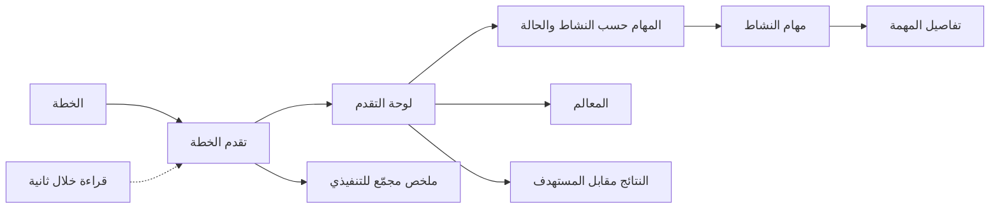

# متابعة تنفيذ الخطة

<!-- BEGIN GENERATED: doc -->
| البند | القيمة |
|---|---|
| المعرّف | FEAT-OPS-EXEC-TRACKING |
| الإصدار | 0.3 |
| الحالة | مسودة |
| القدرة | CAP-07 التخطيط والتنفيذ |
| القدرة الفرعية | CAP-07.05 قياس النتائج (R1) |
| الأدوار | المدير؛ المخطِّط؛ القيادي التنفيذي |
| الشاشات | SCR-35 متابعة التنفيذ |
| حالات الاستخدام | — |
| القصص | 5: 1 من المواصفة، و4 جديدة |
<!-- END GENERATED: doc -->

## 1. نظرة عامة

### 1.1 القيمة

يرى المدير والتنفيذي تقدم الخطة: المهام حسب حالتها، والمعالم، والنتائج مقابل المستهدف.

### 1.2 النطاق

| البند | القيمة |
|---|---|
| المستخدمون | المدير والمخطِّط (اللوحة كاملة)، والقيادي التنفيذي (ملخص مجمّع فقط)، وفريق المنصة |
| الشاشات | SCR-35 متابعة التنفيذ، ومنها إلى SCR-02 تفاصيل المهمة |
| حالات الاستخدام | قياس نتائج الخطة (UC-101)، من جهة عرض التقدم |
| المتطلبات | تسجيل قياسات نتائج الخطة عبر الزمن مقابل أهدافها (REQ-OPS-013)، وصفحة القائمة خلال ثانية (QAS-PERF-002) |
| داخل النطاق | عرض تقدم خطة واحدة: المهام حسب النشاط والحالة، والمعالم، والنتائج مقابل المستهدف، والانتقال من النشاط إلى مهامه، والملخص المجمّع للتنفيذي، وأداء القراءة |
| خارج النطاق | تسجيل القياسات وتعديل الأهداف (نتائج الخطة)، وإعداد الخطة واعتماد إصداراتها، والتدخل في المهام (متابعة المهام والتدخل) |

### 1.3 خريطة الميزة

**الشكل 1: خريطة متابعة تنفيذ الخطة**



## 2. القواعد المشتركة

تنطبق على كل قصص الميزة، فلا تتكرر داخل القصص. وكل قصة تذكر ما يخصها فقط.

### 2.1 السياق المشترك

كل قصة تبدأ من ثلاثة شروط: مستأجر نشط، وحزمة السياسات الأساسية مفعّلة، ومستخدم مسجّل الدخول ومخوَّل. وتشير إليها القصص بخطوة واحدة: «بفرض السياق المشترك للميزة».

### 2.2 الصلاحية وعدم الإفصاح

- من لا يحق له رؤية العنصر يتلقى ردًا بشكل «غير متاح» تمامًا، فلا يعرف أنه موجود.
- يرى المستخدم من الخطة ومهامها ما يسمح به تصريحه ونطاقه فقط.

### 2.3 عدم الإفصاح في القراءة

- قصص الميزة كلها قراءة، فلا أوامر فيها ولا رفض مشترك للأوامر.
- الخطة أو المهمة غير المرئية للمستخدم تظهر «غير متاح» تمامًا، كأنها غير موجودة، ولا يدل أي جزء من الرد على وجودها.

### 2.4 ما يُحسب في التقدم

- كل عدد أو نسبة في التقدم يُحسب من المهام المرئية للمستخدم فقط، ولا يدل أي رقم على وجود مهمة غير مرئية له.
- تقدم النتيجة هو آخر قياس معروف لها مقابل الهدف الساري، ويُعرض معه وقت آخر قياس، فيعرف المستخدم إن كان التقدم متأخرًا.

## 3. الجودة وتعريف الاكتمال

### 3.1 متطلبات الجودة

<!-- BEGIN GENERATED: quality -->
| المرجع | الموقف | المطلوب |
|---|---|---|
| QAS-PERF-002 | reads a single object or a list page | single object p95 ≤ 300 ms; list page p95 ≤ 1 s |
| QAS-PERF-021 | plan version baselined with 500 task-generating activities | task synchronization completes ≤ 60 s; idempotent on retry |
<!-- END GENERATED: quality -->

### 3.2 تعريف الاكتمال

القصة مكتملة حين تتحقق الشروط الخمسة:

1. سيناريوهاتها والقواعد المشتركة تمر في الاختبار الآلي.
2. فحوص البنية المعمارية تمر.
3. نصوص الواجهة والرسائل موجودة بالعربية والإنجليزية.
4. مراجعة الكود مكتملة.
5. ما تضيفه القصة نفسها في قسم «القواعد» تحقق.

## 4. فهرس القصص

<!-- BEGIN GENERATED: story-index -->
| المعرّف | القصة | النوع | الحالة |
|---|---|---|---|
| `US-BC04-Q-PLN-PROGRESS` | تقدم الخطة: المهام والمعالم والنتائج | جلب | مسودة |
| `US-UI-SCR35-DRILLDOWN` | الانتقال من النشاط إلى مهامه | واجهة | مسودة |
| `US-UI-SCR35-EXEC-SUMMARY` | ملخص مجمّع للقيادي التنفيذي | واجهة | مسودة |
| `US-UI-SCR35-PROGRESS-BOARD` | لوحة تقدم الخطة بالمهام والمعالم والنتائج | واجهة | مسودة |
| `US-PLT-OPS-PROGRESS-READ` | قراءة تقدم خطة كبيرة خلال ثانية | منصة | مسودة |
<!-- END GENERATED: story-index -->

## 5. القصص

### 5.1 US-BC04-Q-PLN-PROGRESS — تقدم الخطة: المهام والمعالم والنتائج

| النوع | الإصدار | الأولوية | دون اتصال | الحالة |
|---|---|---|---|---|
| جلب | R1 | Must | لا | مسودة |

> **كـ** المدير أو المخطِّط، **أريد** تقدم الخطة: مهامها حسب النشاط والحالة، ومعالمها، ونتائجها مقابل المستهدف، **حتى** أعرف أين تتقدم الخطة وأين تتعثر.

**باختصار:** يعيد النظام تقدم خطة واحدة صفحةً بعد صفحة، من المهام المرئية للمستخدم فقط، مع المعالم وتقدم كل نتيجة مقابل هدفها.

#### القواعد

- **من يرى ماذا:** من يحق له رؤية الخطة بتصنيفها. والمهام تُعدّ وتُعرض إن كانت مرئية له فقط (§2.4).
- **المرشحات:** الخطة، والمؤشر، وحد الصفحة. والترقيم بالمؤشر لا بالإزاحة.

#### معايير القبول

```gherkin
# language: ar
خاصية: تقدم الخطة

  سيناريو: المدير يطلب تقدم خطة بعض مهامها خارج نطاقه
    بفرض السياق المشترك للميزة
    و خطة مرئية للمدير بعض مهامها خارج نطاقه
    عندما يطلب تقدمها
    اذاً تُعاد المهام المرئية مجمّعة حسب النشاط والحالة مع المعالم
    و يُعاد لكل نتيجة آخر قياس معروف ووقته والهدف الساري
    و لا يكشف أي عدد وجود المهام خارج نطاقه

  سيناريو: الصفحة التالية
    بفرض السياق المشترك للميزة
    و تقدم الخطة أكثر من صفحة
    عندما يطلب الصفحة التالية بالمؤشر
    اذاً تُعاد العناصر التالية دون تكرار ولا فجوة
```

<details><summary>المراجع التقنية والتتبع</summary>

<!-- BEGIN GENERATED: refs US-BC04-Q-PLN-PROGRESS -->
| البند | المعرّف | المعنى |
|---|---|---|
| الواجهة البرمجية | `GET /api/v1/operations/plans/{plan_id}/progress` | — |
| الاستعلام | `QRY-PLN-PROGRESS` | Tasks by activity and state, milestones, outcome progress vs targets |
| السياسة | `POL-PLN-PROGRESS` | label rule; visible tasks only |
| الكيان | `AGG-PLAN` | الخطة |
| الجدول | `operations.plans` | الجدول الرئيسي للخطة |
| وحدة النشر | DU-08 | — |
| المتطلب | REQ-OPS-013 | The system shall record measurements of plan outcomes over time against their targets. |
| حالة الاستخدام | UC-101 | Measure Plan Outcome |
| الاختبار | TST-PLAN-SM، TST-SLC08-INVARIANTS | دورة حالات الخطة، وثوابت الشريحة SLC-08 |
<!-- END GENERATED: refs US-BC04-Q-PLN-PROGRESS -->

</details>

### 5.2 US-UI-SCR35-DRILLDOWN — الانتقال من النشاط إلى مهامه

| النوع | الإصدار | الأولوية | دون اتصال | الحالة |
|---|---|---|---|---|
| واجهة | R1 | Should | لا | مسودة |

> **كـ** المدير أو المخطِّط، **أريد** أن أنتقل من نشاط في لوحة التقدم إلى مهامه ثم إلى تفاصيل أي منها، **حتى** أصل إلى سبب التعثر دون بحث.

**باختصار:** النقر على نشاط يفتح قائمة مهامه المرئية بحالاتها، والنقر على مهمة يفتح تفاصيلها، وعنوان الصفحة يحمل الخطة والنشاط والمرشحات فيمكن مشاركته.

#### القواعد

- القائمة تعرض المهام المرئية للمستخدم فقط، بالترقيم بالمؤشر، ولا تذكر عدد المحجوب.
- كل مهمة رابط إلى صفحة تفاصيلها. فإن لم تعد مرئية يرى المستخدم «غير متاح» دون تفصيل.
- الرابط لا يحمل بيانات، ومن يتلقاه يرى ما تسمح به صلاحيته فقط.
- **[Derived]** مسار الانتقال نفسه، لأن المصادر لا تعرّف نموذج التنقل.

#### معايير القبول

```gherkin
# language: ar
خاصية: الانتقال من النشاط إلى مهامه

  سيناريو: المخطط ينتقل من نشاط متعثر إلى مهمة
    بفرض السياق المشترك للميزة
    و لوحة تقدم خطة يظهر فيها نشاط له مهام في حالة "محجوبة"
    عندما ينقر المخطط على النشاط ثم على إحدى مهامه
    اذاً تُفتح قائمة مهام النشاط المرئية له بحالاتها
    و تُفتح بعدها تفاصيل المهمة المختارة

  سيناريو: رابط مشترك لمستخدم آخر
    بفرض السياق المشترك للميزة
    و رابط قائمة مهام نشاط أرسله مدير إلى مستخدم نطاقه أضيق
    عندما يفتح المستخدم الرابط
    اذاً يرى المهام المرئية له فقط دون أي إشارة إلى غيرها

  سيناريو: مهمة لم تعد مرئية
    بفرض السياق المشترك للميزة
    و مهمة في القائمة أُعيد تصنيفها فوق تصريح المستخدم
    عندما ينقر عليها
    اذاً يرى "غير متاح" دون أي تفصيل
```

<details><summary>المراجع التقنية والتتبع</summary>

<!-- BEGIN GENERATED: refs US-UI-SCR35-DRILLDOWN -->
| البند | المعرّف | المعنى |
|---|---|---|
| الشاشة | SCR-35 | شاشة متابعة التنفيذ |
| الشاشة | SCR-02 | شاشة تفاصيل المهمة وسجلها |
| المصدر | `21-ui-design.md §3` | — |
| المصدر | `[Derived]` | — |
<!-- END GENERATED: refs US-UI-SCR35-DRILLDOWN -->

</details>

### 5.3 US-UI-SCR35-EXEC-SUMMARY — ملخص مجمّع للقيادي التنفيذي

| النوع | الإصدار | الأولوية | دون اتصال | الحالة |
|---|---|---|---|---|
| واجهة | R1 | Should | لا | مسودة |

> **كـ** القيادي التنفيذي، **أريد** ملخصًا مجمّعًا لتقدم الخطة، **حتى** أعرف وضعها العام دون الدخول في تفاصيل المهام.

**باختصار:** يرى التنفيذي في متابعة التنفيذ إحصاءات مجمّعة فقط: أعداد المهام حسب الحالة وتقدم النتائج. وأي إحصاء على البيانات الإثباتية لمجموعة أصغر من 5 لا يُعرض.

#### القواعد

- التنفيذي يرى في هذه الشاشة الأعداد والنسب المجمّعة، لا قائمة المهام ولا تفاصيلها.
- الإحصاء على البيانات الإثباتية لا يُعرض لمجموعة أصغر من 5 عناصر. والبيانات الإثباتية هي المستوى T1 من مستويات أهمية البيانات الأربعة: تُحفظ مع مصدرها ووقت تسجيلها.
- **[Needs Review]** هل تقع إحصاءات المهام تحت هذا القيد: ملف كيان المهمة يذكر لها المستوى الإثباتي (T1) والمستوى المحكوم بالإصدارات (T2) معًا.
- المجموعة غير المعروضة لا تظهر، ولا رسالة تدل عليها.
- هذا القيد يخص الإحصاءات وحدها، لا بقية شاشات التنفيذي.

#### معايير القبول

```gherkin
# language: ar
خاصية: ملخص مجمّع للقيادي التنفيذي

  سيناريو: التنفيذي يفتح متابعة التنفيذ
    بفرض السياق المشترك للميزة
    و خطة مرئية للتنفيذي
    عندما يفتح متابعة تنفيذها
    اذاً يرى أعداد المهام حسب الحالة وتقدم كل نتيجة مقابل هدفها
    لكن لا يرى قائمة المهام ولا رابطًا إلى تفاصيلها

  سيناريو: مجموعة صغيرة من البيانات الإثباتية
    بفرض السياق المشترك للميزة
    و مجموعة من 3 مهام في الحالة نفسها، وبياناتها إثباتية
    عندما يفتح التنفيذي الملخص
    اذاً لا تظهر هذه المجموعة ولا ما يدل عليها
```

<details><summary>المراجع التقنية والتتبع</summary>

<!-- BEGIN GENERATED: refs US-UI-SCR35-EXEC-SUMMARY -->
| البند | المعرّف | المعنى |
|---|---|---|
| الشاشة | SCR-35 | شاشة متابعة التنفيذ |
| المصدر | `21-ui-design.md §5` | — |
| المصدر | `POL-AGG-STATS` | — |
<!-- END GENERATED: refs US-UI-SCR35-EXEC-SUMMARY -->

</details>

### 5.4 US-UI-SCR35-PROGRESS-BOARD — لوحة تقدم الخطة بالمهام والمعالم والنتائج

| النوع | الإصدار | الأولوية | دون اتصال | الحالة |
|---|---|---|---|---|
| واجهة | R1 | Must | لا | مسودة |

> **كـ** المدير أو المخطِّط، **أريد** لوحة واحدة لتقدم الخطة، **حتى** أرى في نظرة المهام المتعثرة والمعالم القريبة والنتائج البعيدة عن هدفها.

**باختصار:** تعرض لوحة متابعة التنفيذ ثلاثة أجزاء: المهام حسب النشاط والحالة، والمعالم بتواريخها، والنتائج مقابل المستهدف مع وقت آخر قياس.

#### القواعد

- المهام: لكل نشاط عدد مهامه المرئية في كل حالة، والمتأخرة منها محسوبة عند القراءة من الموعد.
- المعالم: من الإصدار المعتمد للخطة، بتواريخها.
- النتائج: لكل نتيجة آخر قياس معروف والهدف الساري ووقت القياس (§2.4).
- بعد اعتماد إصدار جديد قد يختلف التقدم مؤقتًا حتى تكتمل مزامنة المهام، فتعرض اللوحة وقت بياناتها.
- **[Derived]** تقسيم اللوحة إلى ثلاثة أجزاء وطريقة عرضها.

#### معايير القبول

```gherkin
# language: ar
خاصية: لوحة تقدم الخطة

  سيناريو: المدير يفتح لوحة خطة جارية
    بفرض السياق المشترك للميزة
    و خطة معتمدة لها أنشطة ومهام ومعالم ونتائج بقياسات
    عندما يفتح المدير لوحة تقدمها
    اذاً يرى لكل نشاط عدد مهامه المرئية في كل حالة وعدد المتأخرة
    و يرى المعالم بتواريخها
    و يرى لكل نتيجة آخر قياس ووقته مقابل الهدف الساري

  سيناريو: نتيجة بلا قياس بعد
    بفرض السياق المشترك للميزة
    و نتيجة في الخطة لم يُسجَّل لها قياس
    عندما يفتح المخطط اللوحة
    اذاً تظهر النتيجة بهدفها دون قيمة ودون نسبة تقدم

  سيناريو: خطة غير مرئية
    بفرض السياق المشترك للميزة
    و رابط لوحة خطة خارج نطاق المستخدم
    عندما يفتحه
    اذاً يرى "غير متاح" دون أي تفصيل
```

<details><summary>المراجع التقنية والتتبع</summary>

<!-- BEGIN GENERATED: refs US-UI-SCR35-PROGRESS-BOARD -->
| البند | المعرّف | المعنى |
|---|---|---|
| الشاشة | SCR-35 | شاشة متابعة التنفيذ |
| المصدر | `QRY-PLN-PROGRESS` | — |
| المصدر | `[Derived]` | — |
| المتطلب | REQ-OPS-013 | The system shall record measurements of plan outcomes over time against their targets. |
| حالة الاستخدام | UC-101 | Measure Plan Outcome |
<!-- END GENERATED: refs US-UI-SCR35-PROGRESS-BOARD -->

</details>

### 5.5 US-PLT-OPS-PROGRESS-READ — قراءة تقدم خطة كبيرة خلال ثانية

| النوع | الإصدار | الأولوية | دون اتصال | الحالة |
|---|---|---|---|---|
| منصة | R1 | Should | لا ينطبق | مسودة |

> **كـ** فريق المنصة، **أريد** أن تُقرأ صفحة تقدم خطة كبيرة خلال ثانية، **حتى** تفتح لوحة المتابعة بسرعة مهما كبرت الخطة.

#### القواعد

- صفحة التقدم صفحة قائمة، فهدفها ثانية واحدة عند المئين 95 تحت حمل التصميم (QAS-PERF-002).
- القراءة تستعمل فهرس المهام الذي يبدأ بالمستأجر ثم الخطة ثم الحالة، والترقيم بالمؤشر.
- **[Derived]** «الخطة الكبيرة» خطة من 500 نشاط يولّد مهام، وهو أكبر حجم في سيناريوهات الجودة (QAS-PERF-021).

#### معايير القبول

```gherkin
# language: ar
خاصية: قراءة تقدم خطة كبيرة

  سيناريو: الهدف تحت حمل التصميم
    بفرض خطة من 500 نشاط يولّد مهام وحمل بحجم التصميم
    عندما يطلب المديرون والمخططون صفحات تقدمها
    اذاً يكون زمن الصفحة ثانية واحدة أو أقل عند المئين 95

  سيناريو: الفهرس يعزل المستأجرين
    بفرض مخطط قاعدة البيانات
    عندما يُفحص فهرس المهام المستعمل للتقدم
    اذاً يبدأ بعمود المستأجر ثم الخطة ثم الحالة
```

<details><summary>المراجع التقنية والتتبع</summary>

<!-- BEGIN GENERATED: refs US-PLT-OPS-PROGRESS-READ -->
| البند | المعرّف | المعنى |
|---|---|---|
| الجودة | QAS-PERF-002 | reads a single object or a list page → single object p95 ≤ 300 ms; list page p95 ≤ 1 s |
| الجودة | QAS-PERF-021 | plan version baselined with 500 task-generating activities → task synchronization completes ≤ 60 s; idempoten… |
| المصدر | `QRY-PLN-PROGRESS` | — |
| المصدر | `[Derived]` | — |
<!-- END GENERATED: refs US-PLT-OPS-PROGRESS-READ -->

</details>

## 6. التتبع

<!-- BEGIN GENERATED: trace -->
| المتطلب | المعنى | القصص | الاختبار |
|---|---|---|---|
| REQ-OPS-013 | The system shall record measurements of plan outcomes over time against their targets. | `US-BC04-Q-PLN-PROGRESS`، `US-UI-SCR35-PROGRESS-BOARD` | TST-OUTCOME-TRACKER-SM، TST-SLC08-INVARIANTS |
<!-- END GENERATED: trace -->

## 7. سجل التغييرات

| الإصدار | التاريخ | التغيير |
|---|---|---|
| 0.1 | — | هيكل مولَّد من خريطة الميزات |
| 0.2 | 2026-10-02 | كتابة القصص كاملة بمعيار القصص |
| 0.3 | 2026-10-03 | تصحيحات المراجعة المستقلة |
