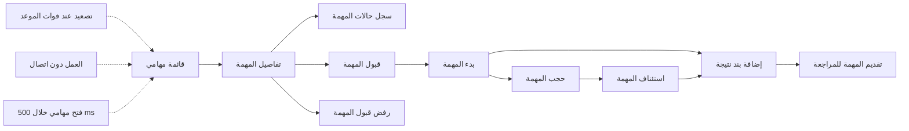
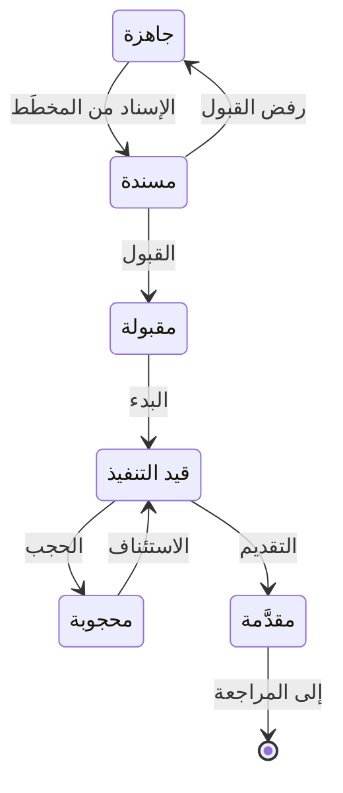

# مهامي

<!-- BEGIN GENERATED: doc -->
| البند | القيمة |
|---|---|
| المعرّف | FEAT-OPS-MY-TASKS |
| الإصدار | 0.2 |
| الحالة | مسودة |
| القدرة | CAP-07 التخطيط والتنفيذ |
| القدرة الفرعية | CAP-07.03 إدارة المهام (R1) |
| الأدوار | المسند إليه؛ المستخدم الميداني؛ النظام |
| الشاشات | SCR-01 مهامي، SCR-02 تفاصيل المهمة وسجلها |
| حالات الاستخدام | UC-042، UC-043، UC-046 |
| القصص | 17: 11 من المواصفة، و6 جديدة |
<!-- END GENERATED: doc -->

## 1. نظرة عامة

### 1.1 القيمة

يرى المسند إليه كل مهامه في قائمة واحدة، وينفّذها خطوة بخطوة حتى تقديم نتيجتها، ولا يضيع شيء مما سجّله.

### 1.2 النطاق

| البند | القيمة |
|---|---|
| المستخدمون | المسند إليه، ومنه المستخدم الميداني على التطبيق الميداني؛ والنظام في التصعيد التلقائي |
| الشاشات | مهامي، وتفاصيل المهمة وسجلها، في تطبيق الويب والتطبيق الميداني |
| حالات الاستخدام | تنفيذ المهمة، وتقديم نتيجتها، وتصعيدها حين يفوت موعدها |
| المتطلبات | دورة حالات محددة للمهمة يُرفض كل انتقال خارجها (REQ-OPS-006)؛ مفتاح منع التكرار والإصدار المتوقع مع كل أمر (REQ-OPS-011)؛ تصعيد المتأخرة دون تغيير حالتها (REQ-OPS-012)؛ تحديث حالة المهام المسندة دون اتصال 72 ساعة على الأقل (REQ-OFF-001) |
| خارج النطاق | إنشاء المهام وإسنادها («تخطيط المهام وإسنادها»)؛ مراجعة النتيجة واعتمادها وإكمال المهمة («مراجعة نتيجة المهمة»)؛ التعليق والإلغاء والتصعيد اليدوي («متابعة المهام والتدخل»)؛ المزامنة وحل تعارضاتها («المزامنة الميدانية» و«حل تعارضات المزامنة» في قدرة الجمع) |

### 1.3 خريطة الميزة

يبدأ المسند إليه من قائمة «مهامي»، ويفتح المهمة فيقبلها أو يرفض قبولها، ثم يبدؤها ويسجّل نتيجتها ويقدّمها. والشكل 1 يجمع القصص على هذا المسار، والشكل 2 يبيّن حالات المهمة التي يمر بها.

**الشكل 1: خريطة ميزة «مهامي»**



**الشكل 2: رحلة المهمة في «مهامي»**



> **ملاحظة:** إضافة بند النتيجة لا تغيّر الحالة، وما بعد «مقدَّمة» في ميزة «مراجعة نتيجة المهمة». والتعليق ليس حالة في الشكل 2. يضعه المسؤول على المهمة في أي حالة غير نهائية، فتبقى في حالتها ويُرفض كل أمر من أوامر هذه الميزة عليها حتى يُرفع التعليق (§2.5).

## 2. القواعد المشتركة

تنطبق على كل قصص الميزة، فلا تتكرر داخل القصص. وكل قصة تذكر ما يخصها فقط.

### 2.1 السياق المشترك

كل قصة تبدأ من ثلاثة شروط: مستأجر نشط، وحزمة السياسات الأساسية مفعّلة، ومستخدم مسجّل الدخول ومخوَّل. وتشير إليها القصص بخطوة واحدة: «بفرض السياق المشترك للميزة».

### 2.2 الصلاحية وعدم الإفصاح

- من لا يحق له رؤية العنصر يتلقى ردًا بشكل «غير متاح» تمامًا، فلا يعرف أنه موجود.
- من يرى العنصر ولا يحق له الإجراء يتلقى «لا تملك صلاحية هذا الإجراء».

### 2.3 أوامر تغيير الحالة

- **منع التكرار:** يُرسل كل أمر بمفتاح فريد، فإعادة الطلب نفسه لا تُنفَّذ مرتين.
- **حماية التعديل المتزامن:** يُرسل كل أمر بإصدار البيانات الذي يراه المستخدم. فإن عدّلها غيره في الأثناء، يُرفض الأمر.
- **السجل:** إن نجح الأمر، يُكتب حدثه وسجل التدقيق في المعاملة نفسها.

### 2.4 الرفض المشترك

```gherkin
# language: ar
خاصية: الرفض المشترك لأوامر الميزة

  سيناريو مخطط: رفض مشترك لكل أمر في الميزة
    بفرض السياق المشترك للميزة
    و <الحالة>
    عندما يُرسل المستخدم أي أمر من أوامر الميزة
    اذاً يُرفض برمز <الرمز> ويرى "<الرسالة>"
    و لا يتغير شيء

    امثلة:
      | الحالة                                  | الرمز                  | الرسالة                                                 |
      | العنصر خارج صلاحياته                    | NOT_FOUND              | غير متاح                                                |
      | العنصر مرئي له ولا يحق له الإجراء       | AUTHZ_DENIED           | لا تملك صلاحية هذا الإجراء                              |
      | غيره عدّل العنصر بعد أن فتحه            | VERSION_CONFLICT       | تغيّرت البيانات منذ فتحتها. راجع التغييرات ثم أعد المحاولة |
      | أعاد مفتاح منع التكرار بمحتوى مختلف     | IDEMPOTENCY_KEY_REUSED | طلب مكرر بمحتوى مختلف                                   |
      | البيانات ناقصة أو غير صحيحة             | VALIDATION_FAILED      | بعض البيانات ناقصة أو غير صحيحة. راجع الحقول المعلَّمة      |

  سيناريو: إعادة الطلب نفسه لا تُنفَّذ مرتين
    بفرض السياق المشترك للميزة
    و أمر نجح بمفتاح منع تكرار
    عندما يُعاد الطلب نفسه بالمفتاح نفسه
    اذاً تُعاد النتيجة الأولى ولا يُكتب حدث ثانٍ
```

### 2.5 التعليق والعمل دون اتصال

- **التعليق:** يضعه المسؤول في ميزة «متابعة المهام والتدخل». وهو علامة لا حالة: تبقى المهمة في حالتها، ويُرفض عليها كل أمر من أوامر هذه الميزة حتى يُرفع التعليق.
- **دون اتصال:** ستة أوامر تعمل دون اتصال: القبول، والبدء، والحجب، والاستئناف، وإضافة بند نتيجة، والتقديم. أما رفض القبول فيحتاج اتصالًا.
  - يُطبَّق الأمر على الجهاز فورًا، ويُرفع عند الاتصال بترتيب الجهاز.
  - الأمر الذي يغيّر الحالة يُطبَّق فقط إن لم تتغير المهمة على الخادم منذ بُني عليها. وإلا يُفتح تعارض مزامنة يحسمه إنسان، ولا يغلب آخر من كتب (QAS-OFF-001).
  - إضافة بند النتيجة إلحاقية، فتُطبَّق ولو تغيّر الإصدار، ما دامت حالة المهمة تسمح.

```gherkin
# language: ar
خاصية: المهمة المعلّقة ترفض أوامر الميزة

  سيناريو مخطط: أمر على مهمة معلّقة
    بفرض السياق المشترك للميزة
    و مهمة مسندة إليه في حالة "<الحالة>" ومعلّقة
    عندما يحاول <الأمر>
    اذاً يُرفض برمز <الرمز> ويرى "<الرسالة>"
    و تبقى المهمة في حالتها دون تغيير

    امثلة:
      | الحالة | الأمر | الرمز | الرسالة |
      | مسندة | قبول المهمة | TASK_SUSPENDED | المهمة معلّقة |
      | مقبولة | بدء المهمة | TASK_SUSPENDED | المهمة معلّقة |
      | محجوبة | إضافة بند نتيجة | TASK_SUSPENDED | المهمة معلّقة |
      | قيد التنفيذ | تقديم المهمة | TASK_SUSPENDED | المهمة معلّقة |
```

## 3. الجودة وتعريف الاكتمال

### 3.1 متطلبات الجودة

<!-- BEGIN GENERATED: quality -->
| المرجع | الموقف | المطلوب |
|---|---|---|
| QAS-OFF-001 | works 72 h offline then reconnects on a 1 Mbps link | 1,000 queued commands synced ≤ 10 min; 0 silent overwrites; 0 duplicates |
| QAS-PERF-016 | field user opens 'my tasks' | p95 ≤ 500 ms |
| QAS-REL-003 | update the same object from the same version | 0 silent overwrites |
| QAS-USA-001 | records an observation with one photo on the mobile app | median ≤ 60 s in usability test with 10 field users |
<!-- END GENERATED: quality -->

### 3.2 تعريف الاكتمال

القصة مكتملة حين تتحقق الشروط الخمسة:

1. سيناريوهاتها والقواعد المشتركة تمر في الاختبار الآلي.
2. فحوص البنية المعمارية تمر.
3. نصوص الواجهة والرسائل موجودة بالعربية والإنجليزية.
4. مراجعة الكود مكتملة.
5. ما تضيفه القصة نفسها في قسم «القواعد» تحقق.

## 4. فهرس القصص

<!-- BEGIN GENERATED: story-index -->
| المعرّف | القصة | النوع | الحالة |
|---|---|---|---|
| `US-BC04-TASK-ACCEPT` | قبول المهمة | أمر | مسودة |
| `US-BC04-TASK-ADD-RESULT-ITEM` | إضافة بند نتيجة إلى المهمة | أمر | مسودة |
| `US-BC04-TASK-BLOCK` | حجب المهمة بسبب عائق | أمر | مسودة |
| `US-BC04-TASK-DECLINE` | رفض قبول المهمة | أمر | مسودة |
| `US-BC04-TASK-RESUME` | استئناف المهمة بعد الحجب | أمر | مسودة |
| `US-BC04-TASK-START` | بدء المهمة | أمر | مسودة |
| `US-BC04-TASK-SUBMIT` | تقديم المهمة للمراجعة | أمر | مسودة |
| `US-BC04-Q-TASK-GET` | تفاصيل المهمة | جلب | مسودة |
| `US-BC04-Q-TASK-HISTORY` | سجل حالات المهمة | جلب | مسودة |
| `US-BC04-Q-TASK-LIST` | قائمة مهامي | جلب | مسودة |
| `US-BC04-S-TASK-05` | تصعيد المهمة عند فوات موعدها | نظام | مسودة |
| `US-UI-SCR01-ACTIONS` | الأزرار المتاحة حسب حالة المهمة | واجهة | مسودة |
| `US-UI-SCR01-ERRORS` | الاستجابة لرفض الخادم في مهامي | واجهة | مسودة |
| `US-UI-SCR01-LIST` | قائمة مهامي مجمّعة حسب الحالة | واجهة | مسودة |
| `US-UI-SCR01-OFFLINE` | العمل وحالة المزامنة دون اتصال | واجهة | مسودة |
| `US-UI-SCR02-RESULT` | تسجيل النتيجة بيد واحدة | واجهة | مسودة |
| `US-PLT-MYTASKS-READ` | فتح مهامي خلال 500 ms | منصة | مسودة |
<!-- END GENERATED: story-index -->

## 5. القصص

### 5.1 US-BC04-TASK-ACCEPT — قبول المهمة

| النوع | الإصدار | الأولوية | دون اتصال | الحالة |
|---|---|---|---|---|
| أمر | R1 | Must | نعم | مسودة |

> **كـ** المسند إليه، **أريد** أن أقبل المهمة التي أُسندت إليّ، **حتى** يعرف المخطِّط أنني سأنفّذها.

**باختصار:** يقبل المسند إليه المهمة وهي «مسندة» فتصير «مقبولة»، ولو كان جهازه دون اتصال.

#### القواعد

- **متى يُسمح:** المهمة «مسندة»، وغير معلّقة (§2.5).
- **من يُسمح له:** المسند إليه وحده، والمهمة في نطاق وحدته.
- **البيانات:** لا مدخلات.
- **الأثر:** تصير المهمة «مقبولة»، ويُسجَّل حدث «قُبلت المهمة». ويصل الحدث إلى الإشعارات ومتابعة تقدم الخطة وقياس النتائج والبحث.

#### معايير القبول

```gherkin
# language: ar
خاصية: قبول المهمة

  سيناريو: المسند إليه يقبل مهمة أُسندت إليه
    بفرض السياق المشترك للميزة
    و مهمة مسندة إليه في حالة "مسندة"
    عندما يقبل المهمة
    اذاً تصبح حالتها "مقبولة"
    و يُسجَّل حدث "قُبلت المهمة"

  سيناريو مخطط: رفض خاص بقبول المهمة
    بفرض السياق المشترك للميزة
    و <الحالة>
    عندما يحاول قبول المهمة
    اذاً يُرفض برمز <الرمز> ويرى "<الرسالة>"

    امثلة:
      | الحالة | الرمز | الرسالة |
      | المهمة ليست في حالة "مسندة" | TASK_INVALID_STATE_TRANSITION | الوضع الحالي للمهمة لا يسمح بهذا الإجراء |
      | المستخدم ليس المسند إليه المهمة | NOT_ASSIGNEE | هذه المهمة ليست مسندة إليك |
```

<details><summary>المراجع التقنية والتتبع</summary>

<!-- BEGIN GENERATED: refs US-BC04-TASK-ACCEPT -->
| البند | المعرّف | المعنى |
|---|---|---|
| الواجهة البرمجية | `POST /api/v1/operations/tasks/{id}/actions/accept` | دون اتصال: نعم |
| الأمر | `CMD-TASK-ACCEPT` | قبول المهمة |
| السياسة | `POL-TASK-ACCEPT` | assignee؛ tenant match; task visible; org scope; offline allowed |
| الحدث | `EVT-TASK-ACCEPTED` | يصل إلى: Notification service (SLC-06); Plan progress (SLC-08); Outcome measurement (SLC-08); Search projecti… |
| الكيان | `AGG-TASK` | المهمة |
| الجدول | `operations.tasks` | الجدول الرئيسي للمهمة |
| وحدة النشر | DU-08 | — |
| المتطلبات | REQ-OPS-006، REQ-OPS-007، REQ-OPS-008، REQ-OPS-009، REQ-OPS-010، REQ-OPS-011، REQ-OPS-012 | معانيها في القسم 6. التتبع |
| حالات الاستخدام | UC-042، UC-043، UC-046 | Execute Task؛ Submit Task Result؛ Escalate Task |
| الاختبار | TST-TASK-SM، TST-SLC03-INVARIANTS | دورة حالات المهمة، وثوابت الشريحة SLC-03 |
<!-- END GENERATED: refs US-BC04-TASK-ACCEPT -->

</details>

### 5.2 US-BC04-TASK-ADD-RESULT-ITEM — إضافة بند نتيجة إلى المهمة

| النوع | الإصدار | الأولوية | دون اتصال | الحالة |
|---|---|---|---|---|
| أمر | R1 | Must | نعم | مسودة |

> **كـ** المسند إليه، **أريد** أن أضيف إلى المهمة بندًا من نتيجتها، **حتى** تحمل المهمة ما يثبت ما أنجزته.

**باختصار:** أثناء التنفيذ أو الحجب يضيف المسند إليه بندًا إلى نتيجة المهمة، فتبقى حالتها كما هي ويزيد إصدارها. ويعمل دون اتصال.

#### القواعد

- **متى يُسمح:** المهمة «قيد التنفيذ» أو «محجوبة»، وغير معلّقة (§2.5).
- **من يُسمح له:** المسند إليه وحده.
- **البيانات:** نوع البند (إلزامي): نص، أو دليل، أو ملاحظة ميدانية، أو قياس. ومع النوع ما يناسبه: النص بلغته الأصلية، أو مرجع الدليل أو الملاحظة، أو قيمة القياس.
- **الأثر:** تبقى الحالة كما هي ويزيد الإصدار، ويُسجَّل حدث «أُضيف بند نتيجة». والإضافة إلحاقية: إن سُجّلت دون اتصال تُطبَّق عند المزامنة ولو تغيّر إصدار المهمة، ما دامت حالتها تسمح (§2.5).

#### معايير القبول

```gherkin
# language: ar
خاصية: إضافة بند نتيجة إلى المهمة

  سيناريو: المسند إليه يضيف قياسًا إلى نتيجة مهمته
    بفرض السياق المشترك للميزة
    و مهمة مسندة إليه في حالة "قيد التنفيذ"
    عندما يضيف إليها بند نتيجة من نوع "قياس" بقيمته
    اذاً يُضاف البند إلى نتيجة المهمة
    و تبقى حالتها "قيد التنفيذ" ويزيد إصدارها
    و يُسجَّل حدث "أُضيف بند نتيجة"

  سيناريو مخطط: رفض خاص بإضافة بند النتيجة
    بفرض السياق المشترك للميزة
    و <الحالة>
    عندما يحاول إضافة بند النتيجة
    اذاً يُرفض برمز <الرمز> ويرى "<الرسالة>"

    امثلة:
      | الحالة | الرمز | الرسالة |
      | المهمة ليست "قيد التنفيذ" ولا "محجوبة" | TASK_INVALID_STATE_TRANSITION | الوضع الحالي للمهمة لا يسمح بهذا الإجراء |
      | نوع البند ليس من الأنواع الأربعة | RESULT_ITEM_INVALID | بند النتيجة غير صحيح |
      | لم يُحدَّد نوع البند | VALIDATION_FAILED | نوع البند مطلوب |
```

<details><summary>المراجع التقنية والتتبع</summary>

<!-- BEGIN GENERATED: refs US-BC04-TASK-ADD-RESULT-ITEM -->
| البند | المعرّف | المعنى |
|---|---|---|
| الواجهة البرمجية | `POST /api/v1/operations/tasks/{id}/actions/add-result-item` | دون اتصال: نعم |
| الأمر | `CMD-TASK-ADD-RESULT-ITEM` | إضافة بند نتيجة إلى المهمة |
| السياسة | `POL-TASK-ADD-RESULT-ITEM` | assignee؛ tenant match; task visible; org scope; offline allowed |
| الحدث | `EVT-TASK-RESULT-ITEM-ADDED` | يصل إلى: Notification service (SLC-06); Plan progress (SLC-08); Outcome measurement (SLC-08); Search projecti… |
| الكيان | `AGG-TASK` | المهمة |
| الجدول | `operations.tasks` | الجدول الرئيسي للمهمة |
| وحدة النشر | DU-08 | — |
| المتطلبات | REQ-OPS-006، REQ-OPS-007، REQ-OPS-008، REQ-OPS-009، REQ-OPS-010، REQ-OPS-011، REQ-OPS-012 | معانيها في القسم 6. التتبع |
| حالات الاستخدام | UC-042، UC-043، UC-046 | Execute Task؛ Submit Task Result؛ Escalate Task |
| الاختبار | TST-TASK-SM، TST-SLC03-INVARIANTS | دورة حالات المهمة، وثوابت الشريحة SLC-03 |
<!-- END GENERATED: refs US-BC04-TASK-ADD-RESULT-ITEM -->

</details>

### 5.3 US-BC04-TASK-BLOCK — حجب المهمة بسبب عائق

| النوع | الإصدار | الأولوية | دون اتصال | الحالة |
|---|---|---|---|---|
| أمر | R1 | Must | نعم | مسودة |

> **كـ** المسند إليه، **أريد** أن أحجب المهمة مع ذكر السبب حين يمنعني عائق من إكمالها، **حتى** يعرف المخطِّط أن العمل توقف ولماذا.

**باختصار:** يحجب المسند إليه مهمة «قيد التنفيذ» بذكر سبب العائق، فتصير «محجوبة» حتى يستأنفها. ويعمل دون اتصال.

#### القواعد

- **متى يُسمح:** المهمة «قيد التنفيذ»، وغير معلّقة (§2.5).
- **من يُسمح له:** المسند إليه وحده.
- **البيانات:** سبب الحجب (إلزامي).
- **الأثر:** تصير المهمة «محجوبة»، ويُسجَّل حدث «حُجبت المهمة». ويستطيع المسند إليه أن يضيف بنود نتيجة وهي محجوبة. والحجب غير التعليق الذي يضعه المسؤول (§2.5).

#### معايير القبول

```gherkin
# language: ar
خاصية: حجب المهمة بسبب عائق

  سيناريو: المسند إليه يحجب مهمة يعترضها عائق
    بفرض السياق المشترك للميزة
    و مهمة مسندة إليه في حالة "قيد التنفيذ"
    عندما يحجبها ويذكر سبب العائق
    اذاً تصبح حالتها "محجوبة" ويُحفظ السبب معها
    و يُسجَّل حدث "حُجبت المهمة"

  سيناريو مخطط: رفض خاص بحجب المهمة
    بفرض السياق المشترك للميزة
    و <الحالة>
    عندما يحاول حجب المهمة
    اذاً يُرفض برمز <الرمز> ويرى "<الرسالة>"

    امثلة:
      | الحالة | الرمز | الرسالة |
      | المهمة ليست "قيد التنفيذ" | TASK_INVALID_STATE_TRANSITION | الوضع الحالي للمهمة لا يسمح بهذا الإجراء |
      | سبب الحجب فارغ | REASON_REQUIRED | اذكر السبب |
```

<details><summary>المراجع التقنية والتتبع</summary>

<!-- BEGIN GENERATED: refs US-BC04-TASK-BLOCK -->
| البند | المعرّف | المعنى |
|---|---|---|
| الواجهة البرمجية | `POST /api/v1/operations/tasks/{id}/actions/block` | دون اتصال: نعم |
| الأمر | `CMD-TASK-BLOCK` | تعليق المهمة كمحجوب |
| السياسة | `POL-TASK-BLOCK` | assignee؛ tenant match; task visible; org scope; offline allowed |
| الحدث | `EVT-TASK-BLOCKED` | يصل إلى: Notification service (SLC-06); Plan progress (SLC-08); Outcome measurement (SLC-08); Search projecti… |
| الكيان | `AGG-TASK` | المهمة |
| الجدول | `operations.tasks` | الجدول الرئيسي للمهمة |
| وحدة النشر | DU-08 | — |
| المتطلبات | REQ-OPS-006، REQ-OPS-007، REQ-OPS-008، REQ-OPS-009، REQ-OPS-010، REQ-OPS-011، REQ-OPS-012 | معانيها في القسم 6. التتبع |
| حالات الاستخدام | UC-042، UC-043، UC-046 | Execute Task؛ Submit Task Result؛ Escalate Task |
| الاختبار | TST-TASK-SM، TST-SLC03-INVARIANTS | دورة حالات المهمة، وثوابت الشريحة SLC-03 |
<!-- END GENERATED: refs US-BC04-TASK-BLOCK -->

</details>

### 5.4 US-BC04-TASK-DECLINE — رفض قبول المهمة

| النوع | الإصدار | الأولوية | دون اتصال | الحالة |
|---|---|---|---|---|
| أمر | R1 | Must | لا | مسودة |

> **كـ** المسند إليه، **أريد** أن أرفض قبول مهمة أُسندت إليّ مع ذكر السبب، **حتى** يعيد المخطِّط إسنادها إلى غيري.

**باختصار:** يرفض المسند إليه قبول مهمة «مسندة» بذكر السبب، فتعود «جاهزة» للإسناد. ويحتاج اتصالًا بالشبكة.

#### القواعد

- **متى يُسمح:** المهمة «مسندة»، وغير معلّقة (§2.5). ولا يعمل دون اتصال، لأنه ليس من الأوامر الستة.
- **من يُسمح له:** المسند إليه وحده.
- **البيانات:** السبب (إلزامي).
- **الأثر:** تعود المهمة «جاهزة» فيستطيع المخطِّط إسنادها من جديد، ويُسجَّل حدث «رُفض قبول المهمة». ويصل الحدث إلى الإشعارات ومتابعة تقدم الخطة.

#### معايير القبول

```gherkin
# language: ar
خاصية: رفض قبول المهمة

  سيناريو: المسند إليه يرفض قبول مهمة أُسندت إليه
    بفرض السياق المشترك للميزة
    و مهمة مسندة إليه في حالة "مسندة"
    عندما يرفض قبولها ويذكر السبب
    اذاً تعود حالتها "جاهزة" ويُحفظ السبب معها
    و يُسجَّل حدث "رُفض قبول المهمة"

  سيناريو مخطط: رفض خاص برفض القبول
    بفرض السياق المشترك للميزة
    و <الحالة>
    عندما يحاول رفض قبول المهمة
    اذاً يُرفض برمز <الرمز> ويرى "<الرسالة>"

    امثلة:
      | الحالة | الرمز | الرسالة |
      | المهمة ليست في حالة "مسندة" | TASK_INVALID_STATE_TRANSITION | الوضع الحالي للمهمة لا يسمح بهذا الإجراء |
      | السبب فارغ | REASON_REQUIRED | اذكر السبب |
```

<details><summary>المراجع التقنية والتتبع</summary>

<!-- BEGIN GENERATED: refs US-BC04-TASK-DECLINE -->
| البند | المعرّف | المعنى |
|---|---|---|
| الواجهة البرمجية | `POST /api/v1/operations/tasks/{id}/actions/decline` | — |
| الأمر | `CMD-TASK-DECLINE` | رفض قبول المهمة |
| السياسة | `POL-TASK-DECLINE` | assignee؛ tenant match; task visible; org scope |
| الحدث | `EVT-TASK-DECLINED` | يصل إلى: Notification service (SLC-06); Plan progress (SLC-08); Outcome measurement (SLC-08); Search projecti… |
| الكيان | `AGG-TASK` | المهمة |
| الجدول | `operations.tasks` | الجدول الرئيسي للمهمة |
| وحدة النشر | DU-08 | — |
| المتطلبات | REQ-OPS-006، REQ-OPS-007، REQ-OPS-008، REQ-OPS-009، REQ-OPS-010، REQ-OPS-011، REQ-OPS-012 | معانيها في القسم 6. التتبع |
| حالات الاستخدام | UC-042، UC-043، UC-046 | Execute Task؛ Submit Task Result؛ Escalate Task |
| الاختبار | TST-TASK-SM، TST-SLC03-INVARIANTS | دورة حالات المهمة، وثوابت الشريحة SLC-03 |
<!-- END GENERATED: refs US-BC04-TASK-DECLINE -->

</details>

### 5.5 US-BC04-TASK-RESUME — استئناف المهمة بعد الحجب

| النوع | الإصدار | الأولوية | دون اتصال | الحالة |
|---|---|---|---|---|
| أمر | R1 | Must | نعم | مسودة |

> **كـ** المسند إليه، **أريد** أن أستأنف المهمة المحجوبة مع ملاحظة بما حلّ العائق، **حتى** يعود العمل ويُعرف كيف زال العائق.

**باختصار:** بعد زوال العائق يستأنف المسند إليه المهمة «المحجوبة» بملاحظة الحل، فتعود «قيد التنفيذ». ويعمل دون اتصال.

#### القواعد

- **متى يُسمح:** المهمة «محجوبة»، وغير معلّقة (§2.5).
- **من يُسمح له:** المسند إليه وحده.
- **البيانات:** ملاحظة الحل (إلزامية).
- **الأثر:** تعود المهمة «قيد التنفيذ»، ويُسجَّل حدث «استُؤنفت المهمة». والاستئناف رجوع من الحجب، لا رفع التعليق الذي يملكه المسؤول.

#### معايير القبول

```gherkin
# language: ar
خاصية: استئناف المهمة بعد الحجب

  سيناريو: المسند إليه يستأنف مهمة زال عائقها
    بفرض السياق المشترك للميزة
    و مهمة مسندة إليه في حالة "محجوبة"
    عندما يستأنفها ويكتب ملاحظة الحل
    اذاً تعود حالتها "قيد التنفيذ" وتُحفظ الملاحظة معها
    و يُسجَّل حدث "استُؤنفت المهمة"

  سيناريو مخطط: رفض خاص باستئناف المهمة
    بفرض السياق المشترك للميزة
    و <الحالة>
    عندما يحاول استئناف المهمة
    اذاً يُرفض برمز <الرمز> ويرى "<الرسالة>"

    امثلة:
      | الحالة | الرمز | الرسالة |
      | المهمة ليست "محجوبة" | TASK_INVALID_STATE_TRANSITION | الوضع الحالي للمهمة لا يسمح بهذا الإجراء |
      | ملاحظة الحل فارغة | REASON_REQUIRED | اذكر السبب |
```

<details><summary>المراجع التقنية والتتبع</summary>

<!-- BEGIN GENERATED: refs US-BC04-TASK-RESUME -->
| البند | المعرّف | المعنى |
|---|---|---|
| الواجهة البرمجية | `POST /api/v1/operations/tasks/{id}/actions/resume` | دون اتصال: نعم |
| الأمر | `CMD-TASK-RESUME` | استئناف المهمة |
| السياسة | `POL-TASK-RESUME` | assignee؛ tenant match; task visible; org scope; offline allowed |
| الحدث | `EVT-TASK-RESUMED` | يصل إلى: Notification service (SLC-06); Plan progress (SLC-08); Outcome measurement (SLC-08); Search projecti… |
| الكيان | `AGG-TASK` | المهمة |
| الجدول | `operations.tasks` | الجدول الرئيسي للمهمة |
| وحدة النشر | DU-08 | — |
| المتطلبات | REQ-OPS-006، REQ-OPS-007، REQ-OPS-008، REQ-OPS-009، REQ-OPS-010، REQ-OPS-011، REQ-OPS-012 | معانيها في القسم 6. التتبع |
| حالات الاستخدام | UC-042، UC-043، UC-046 | Execute Task؛ Submit Task Result؛ Escalate Task |
| الاختبار | TST-TASK-SM، TST-SLC03-INVARIANTS | دورة حالات المهمة، وثوابت الشريحة SLC-03 |
<!-- END GENERATED: refs US-BC04-TASK-RESUME -->

</details>

### 5.6 US-BC04-TASK-START — بدء المهمة

| النوع | الإصدار | الأولوية | دون اتصال | الحالة |
|---|---|---|---|---|
| أمر | R1 | Must | نعم | مسودة |

> **كـ** المسند إليه، **أريد** أن أبدأ تنفيذ المهمة التي قبلتها، **حتى** يعرف المخطِّط أن العمل بدأ.

**باختصار:** بعد قبول المهمة يبدؤها المسند إليه فتصير «قيد التنفيذ»، ولو كان جهازه دون اتصال.

#### القواعد

- **متى يُسمح:** المهمة «مقبولة»، وكل المهام التي تسبقها «مكتملة» أو «مغلقة»، وغير معلّقة (§2.5). وتُفحص المهام السابقة وقت الأمر.
- **من يُسمح له:** المسند إليه وحده.
- **البيانات:** لا مدخلات.
- **الأثر:** تصير المهمة «قيد التنفيذ»، ويُسجَّل حدث «بدأت المهمة». ويصل الحدث إلى الإشعارات ومتابعة تقدم الخطة وقياس النتائج والبحث.

#### معايير القبول

```gherkin
# language: ar
خاصية: بدء المهمة

  سيناريو: المسند إليه يبدأ مهمة قبلها
    بفرض السياق المشترك للميزة
    و مهمة مسندة إليه في حالة "مقبولة" وكل المهام السابقة لها مكتملة
    عندما يبدأ المهمة
    اذاً تصبح حالتها "قيد التنفيذ"
    و يُسجَّل حدث "بدأت المهمة"

  سيناريو مخطط: رفض خاص ببدء المهمة
    بفرض السياق المشترك للميزة
    و <الحالة>
    عندما يحاول بدء المهمة
    اذاً يُرفض برمز <الرمز> ويرى "<الرسالة>"

    امثلة:
      | الحالة | الرمز | الرسالة |
      | المهمة ليست في حالة "مقبولة" | TASK_INVALID_STATE_TRANSITION | الوضع الحالي للمهمة لا يسمح بهذا الإجراء |
      | مهمة سابقة لم تكتمل ولم تُغلق | DEPENDENCIES_NOT_MET | يجب إكمال المهام السابقة أولًا |
```

<details><summary>المراجع التقنية والتتبع</summary>

<!-- BEGIN GENERATED: refs US-BC04-TASK-START -->
| البند | المعرّف | المعنى |
|---|---|---|
| الواجهة البرمجية | `POST /api/v1/operations/tasks/{id}/actions/start` | دون اتصال: نعم |
| الأمر | `CMD-TASK-START` | بدء المهمة |
| السياسة | `POL-TASK-START` | assignee؛ tenant match; task visible; org scope; offline allowed |
| الحدث | `EVT-TASK-STARTED` | يصل إلى: Notification service (SLC-06); Plan progress (SLC-08); Outcome measurement (SLC-08); Search projecti… |
| الكيان | `AGG-TASK` | المهمة |
| الجدول | `operations.tasks` | الجدول الرئيسي للمهمة |
| وحدة النشر | DU-08 | — |
| المتطلبات | REQ-OPS-006، REQ-OPS-007، REQ-OPS-008، REQ-OPS-009، REQ-OPS-010، REQ-OPS-011، REQ-OPS-012 | معانيها في القسم 6. التتبع |
| حالات الاستخدام | UC-042، UC-043، UC-046 | Execute Task؛ Submit Task Result؛ Escalate Task |
| الاختبار | TST-TASK-SM، TST-SLC03-INVARIANTS | دورة حالات المهمة، وثوابت الشريحة SLC-03 |
<!-- END GENERATED: refs US-BC04-TASK-START -->

</details>

### 5.7 US-BC04-TASK-SUBMIT — تقديم المهمة للمراجعة

| النوع | الإصدار | الأولوية | دون اتصال | الحالة |
|---|---|---|---|---|
| أمر | R1 | Must | نعم | مسودة |

> **كـ** المسند إليه، **أريد** أن أقدّم نتيجة المهمة مع ملخص، **حتى** يراجعها المراجع ويعتمدها.

**باختصار:** بعد تسجيل بند نتيجة واحد على الأقل يقدّم المسند إليه المهمة مع ملخص، فتصير «مقدَّمة» بانتظار المراجعة. ويعمل دون اتصال.

#### القواعد

- **متى يُسمح:** المهمة «قيد التنفيذ»، وفيها بند نتيجة واحد على الأقل، وغير معلّقة (§2.5). والمهمة المحجوبة تُستأنف أولًا.
- **من يُسمح له:** المسند إليه وحده.
- **البيانات:** الملخص (إلزامي، بلغته الأصلية).
- **الأثر:** تصير المهمة «مقدَّمة»، ويُسجَّل حدث «قُدِّمت المهمة». والمراجعة في ميزة «مراجعة نتيجة المهمة»، والمراجع غير المسند إليه (REQ-OPS-009).

#### معايير القبول

```gherkin
# language: ar
خاصية: تقديم المهمة للمراجعة

  سيناريو: المسند إليه يقدّم مهمة لها نتيجة
    بفرض السياق المشترك للميزة
    و مهمة مسندة إليه في حالة "قيد التنفيذ" فيها بند نتيجة واحد على الأقل
    عندما يقدّمها مع ملخص
    اذاً تصبح حالتها "مقدَّمة" ويُحفظ الملخص معها
    و يُسجَّل حدث "قُدِّمت المهمة"

  سيناريو مخطط: رفض خاص بتقديم المهمة
    بفرض السياق المشترك للميزة
    و <الحالة>
    عندما يحاول تقديم المهمة
    اذاً يُرفض برمز <الرمز> ويرى "<الرسالة>"

    امثلة:
      | الحالة | الرمز | الرسالة |
      | المهمة ليست "قيد التنفيذ" | TASK_INVALID_STATE_TRANSITION | الوضع الحالي للمهمة لا يسمح بهذا الإجراء |
      | المهمة بلا أي بند نتيجة | RESULT_REQUIRED | أضف بند نتيجة واحدًا على الأقل |
      | الملخص فارغ | VALIDATION_FAILED | الملخص مطلوب |
```

<details><summary>المراجع التقنية والتتبع</summary>

<!-- BEGIN GENERATED: refs US-BC04-TASK-SUBMIT -->
| البند | المعرّف | المعنى |
|---|---|---|
| الواجهة البرمجية | `POST /api/v1/operations/tasks/{id}/actions/submit` | دون اتصال: نعم |
| الأمر | `CMD-TASK-SUBMIT` | تقديم المهمة |
| السياسة | `POL-TASK-SUBMIT` | assignee؛ tenant match; task visible; org scope; offline allowed |
| الحدث | `EVT-TASK-SUBMITTED` | يصل إلى: Notification service (SLC-06); Plan progress (SLC-08); Outcome measurement (SLC-08); Search projecti… |
| الكيان | `AGG-TASK` | المهمة |
| الجدول | `operations.tasks` | الجدول الرئيسي للمهمة |
| وحدة النشر | DU-08 | — |
| المتطلبات | REQ-OPS-006، REQ-OPS-007، REQ-OPS-008، REQ-OPS-009، REQ-OPS-010، REQ-OPS-011، REQ-OPS-012 | معانيها في القسم 6. التتبع |
| حالات الاستخدام | UC-042، UC-043، UC-046 | Execute Task؛ Submit Task Result؛ Escalate Task |
| الاختبار | TST-TASK-SM، TST-SLC03-INVARIANTS | دورة حالات المهمة، وثوابت الشريحة SLC-03 |
<!-- END GENERATED: refs US-BC04-TASK-SUBMIT -->

</details>

### 5.8 US-BC04-Q-TASK-GET — تفاصيل المهمة

| النوع | الإصدار | الأولوية | دون اتصال | الحالة |
|---|---|---|---|---|
| جلب | R1 | Must | من النسخة المحلية | مسودة |

> **كـ** المسند إليه، **أريد** أن أرى تفاصيل مهمتي كاملة، **حتى** أعرف المطلوب مني بالضبط وما الذي يسبقها.

**باختصار:** تُعرض المهمة بمعايير إكمالها وحالة كل معيار، ونتيجتها حتى الآن، والمهام التي تسبقها، ونتيجة فحص الأهلية عند الإسناد. وفي التطبيق الميداني دون اتصال تُعرض الحقول الملخصة فقط.

#### القواعد

- **من يرى ماذا:** المسند إليه، والمراجع، والمخطِّط والمدير في نطاقهما، بشرط أن يسمح تصريحهم بتصنيف المهمة. ومن عداهم يرى «غير متاح» (§2.2). ويُعاد فحص الصلاحية على المهمة قبل عرضها.
- **المرشحات:** لا مرشحات؛ تُطلب المهمة بمعرّفها.
- **التأخر:** يُحسب عند القراءة: المهمة متأخرة إذا تجاوز الوقت الحالي موعدها، فلا يعتمد العرض على وصول التصعيد.
- **دون اتصال:** يعرض التطبيق الميداني النسخة الملخصة التي نزلت في آخر مزامنة. وتوفر التفاصيل كاملة دون اتصال **[Needs Review] (OQ-US-030)**.

#### معايير القبول

```gherkin
# language: ar
خاصية: تفاصيل المهمة

  سيناريو: المسند إليه يفتح تفاصيل مهمته
    بفرض السياق المشترك للميزة
    و مهمة مسندة إليه لها معياران للإكمال ومهمة سابقة
    عندما يفتح تفاصيلها
    اذاً تُعرض المعايير وحالة كل منها، ونتيجة المهمة حتى الآن
    و تُعرض المهمة السابقة وحالتها، ونتيجة فحص الأهلية المسجَّلة عند الإسناد
```

<details><summary>المراجع التقنية والتتبع</summary>

<!-- BEGIN GENERATED: refs US-BC04-Q-TASK-GET -->
| البند | المعرّف | المعنى |
|---|---|---|
| الواجهة البرمجية | `GET /api/v1/operations/tasks/{task_id}` | — |
| الاستعلام | `QRY-TASK-GET` | Task with criteria status, result, eligibility snapshot, dependencies |
| السياسة | `POL-TASK-GET` | assignee, reviewer, Planner/Manager in scope; label rule |
| الكيان | `AGG-TASK` | المهمة |
| الجدول | `operations.tasks` | الجدول الرئيسي للمهمة |
| وحدة النشر | DU-08 | — |
| المتطلب | REQ-OPS-006 | The system shall manage task state according to state machine SM-TASK and reject any transition not defined i… |
| حالات الاستخدام | UC-042، UC-043 | Execute Task؛ Submit Task Result |
| الاختبار | TST-TASK-SM، TST-SLC03-INVARIANTS | دورة حالات المهمة، وثوابت الشريحة SLC-03 |
<!-- END GENERATED: refs US-BC04-Q-TASK-GET -->

</details>

### 5.9 US-BC04-Q-TASK-HISTORY — سجل حالات المهمة

| النوع | الإصدار | الأولوية | دون اتصال | الحالة |
|---|---|---|---|---|
| جلب | R1 | Must | لا | مسودة |

> **كـ** المسند إليه، **أريد** أن أرى سجل حالات مهمتي ومتى تغيّرت، **حتى** أعرف كيف وصلت إلى وضعها الحالي.

**باختصار:** يُعرض تاريخ حالات المهمة صفحةً بعد صفحة. وحالة المهمة في وقت سابق تُعاد معلَّمة بأنها «معاد بناؤها».

#### القواعد

- **من يرى ماذا:** كما في تفاصيل المهمة (§5.8)، ومن لا يحق له يرى «غير متاح».
- **المرشحات:** المؤشر وحجم الصفحة، والصفحة بمؤشر لا برقم.
- **[Needs Review]** الحالة في وقت سابق تُعاد معلَّمة «معاد بناؤها»، لكن العقد لا يعرّف اليوم معاملًا للوقت المطلوب. وشاشة التفاصيل والسجل تعمل من النسخة المحلية في التطبيق الميداني، لكن التنزيل يحمل نسخة ملخصة من المهام فقط، فلا يُعرف إن كان السجل متاحًا دون اتصال.

#### معايير القبول

```gherkin
# language: ar
خاصية: سجل حالات المهمة

  سيناريو: المسند إليه يتصفح سجل مهمته
    بفرض السياق المشترك للميزة
    و مهمة مسندة إليه مرّت بحالات "مسندة" و"مقبولة" و"قيد التنفيذ"
    عندما يطلب سجل حالاتها
    اذاً تُعاد الحالات الثلاث بترتيبها ووقت كل منها
    و يُطلب ما بعدها بالمؤشر دون تكرار ولا فجوة
```

<details><summary>المراجع التقنية والتتبع</summary>

<!-- BEGIN GENERATED: refs US-BC04-Q-TASK-HISTORY -->
| البند | المعرّف | المعنى |
|---|---|---|
| الواجهة البرمجية | `GET /api/v1/operations/tasks/{task_id}/history` | — |
| الاستعلام | `QRY-TASK-HISTORY` | State history; state as of t (RECONSTRUCTED) |
| السياسة | `POL-TASK-HISTORY` | same as QRY-TASK-GET |
| الكيان | `AGG-TASK` | المهمة |
| الجدول | `operations.tasks` | الجدول الرئيسي للمهمة |
| وحدة النشر | DU-08 | — |
| المتطلب | REQ-OPS-006 | The system shall manage task state according to state machine SM-TASK and reject any transition not defined i… |
| حالات الاستخدام | UC-042، UC-043 | Execute Task؛ Submit Task Result |
| الاختبار | TST-TASK-SM، TST-SLC03-INVARIANTS | دورة حالات المهمة، وثوابت الشريحة SLC-03 |
<!-- END GENERATED: refs US-BC04-Q-TASK-HISTORY -->

</details>

### 5.10 US-BC04-Q-TASK-LIST — قائمة مهامي

| النوع | الإصدار | الأولوية | دون اتصال | الحالة |
|---|---|---|---|---|
| جلب | R1 | Must | من النسخة المحلية | مسودة |

> **كـ** المسند إليه، **أريد** قائمة بمهامي حسب الحالة والموعد، **حتى** أعرف ما عليّ الآن.

**باختصار:** تُعاد المهام التي يحق للمستخدم رؤيتها فقط، صفحةً بعد صفحة، ولا يكشف أي عدد أو اقتراح وجود مهمة محجوبة عنه.

#### القواعد

- **من يرى ماذا:** كل مستخدم يرى المهام التي في نطاقه المسموح فقط. يُصفّى النطاق قبل البحث، ويُعاد فحص كل مهمة قبل عرضها.
- **المرشحات:** المسند إليه («أنا» افتراضيًا)، والخطة، والحالة، والموعد قبل تاريخ، والوحدة. والصفحة بمؤشر لا برقم، وحجمها 50 مهمة افتراضيًا و200 على الأكثر. **[Needs Review]** العقد لا يعرّف اليوم إلا المؤشر وحجم الصفحة.
- **التأخر:** يُحسب عند القراءة، كما في تفاصيل المهمة (§5.8).
- **الأداء:** تفتح القائمة خلال 500 ms عند المئين 95 (QAS-PERF-016، §5.17).

#### معايير القبول

```gherkin
# language: ar
خاصية: قائمة مهامي

  سيناريو: يرى المستخدم مهامه المرئية له فقط
    بفرض السياق المشترك للميزة
    و للمستخدم مهام داخل نطاقه وأخرى خارجه
    عندما يطلب قائمة مهامه
    اذاً تُعاد المهام داخل نطاقه فقط، بعد فحص صلاحية كل منها
    و لا يكشف أي عدد أو اقتراح وجود مهمة محجوبة

  سيناريو: الصفحة التالية
    بفرض السياق المشترك للميزة
    و مهامه أكثر من صفحة
    عندما يطلب الصفحة التالية بالمؤشر
    اذاً تُعاد المهام التالية دون تكرار ولا فجوة
```

<details><summary>المراجع التقنية والتتبع</summary>

<!-- BEGIN GENERATED: refs US-BC04-Q-TASK-LIST -->
| البند | المعرّف | المعنى |
|---|---|---|
| الواجهة البرمجية | `GET /api/v1/operations/tasks` | — |
| الاستعلام | `QRY-TASK-LIST` | Tasks by assignee (me), plan, state, due_before, unit |
| السياسة | `POL-TASK-LIST` | allowed_scope pre-filter |
| الكيان | `AGG-TASK` | المهمة |
| الجدول | `operations.tasks` | الجدول الرئيسي للمهمة |
| وحدة النشر | DU-08 | — |
| المتطلب | REQ-OPS-006 | The system shall manage task state according to state machine SM-TASK and reject any transition not defined i… |
| حالات الاستخدام | UC-042، UC-043 | Execute Task؛ Submit Task Result |
| الاختبار | TST-TASK-SM، TST-SLC03-INVARIANTS | دورة حالات المهمة، وثوابت الشريحة SLC-03 |
<!-- END GENERATED: refs US-BC04-Q-TASK-LIST -->

</details>

### 5.11 US-BC04-S-TASK-05 — تصعيد المهمة عند فوات موعدها

| النوع | الإصدار | الأولوية | دون اتصال | الحالة |
|---|---|---|---|---|
| نظام | R1 | Must | لا ينطبق | مسودة |

> **كـ** النظام، **أريد** أن أصعّد المهمة المفتوحة حين يفوت موعدها، **حتى** يعرف المستوى الأعلى في السلطة أنها متأخرة.

**باختصار:** يفحص المجدول المهمة عند موعدها، ثم بعد المهلة التي يحددها نوعها، فيصعّدها إن كانت ما زالت في حالة غير نهائية، دون أن يغيّر حالتها.

#### القواعد

- **متى يحدث:** عند موعد المهمة، ثم عند انقضاء مهلة نوع المهمة بعد الموعد، والمهمة في حالة غير نهائية. وخلال 60 ثانية من كل منهما (QAS-OPS-002).
- **الأثر:** تبقى الحالة كما هي. يُسجَّل حدث «صُعِّدت المهمة» وسجل تدقيق بهوية النظام، ويُبلَّغ المستوى الأعلى في السلطة (REQ-OPS-012). والتصعيد الثاني بعد المهلة يذهب إلى المستوى الذي يليه **[Derived]**.

#### معايير القبول

```gherkin
# language: ar
خاصية: تصعيد المهمة عند فوات موعدها

  سيناريو: حلّ موعد مهمة مفتوحة
    بفرض مهمة في حالة "قيد التنفيذ" حلّ موعدها
    عندما يفحصها المجدول
    اذاً تبقى حالتها "قيد التنفيذ"
    و يُسجَّل حدث "صُعِّدت المهمة" وسجل تدقيق بهوية النظام خلال 60 ثانية
    و يُبلَّغ المستوى الأعلى في السلطة

  سيناريو: انقضت المهلة بعد الموعد
    بفرض مهمة في حالة "محجوبة" صُعِّدت عند موعدها
    و انقضت المهلة التي يحددها نوعها
    عندما يفحصها المجدول
    اذاً تُصعَّد مرة ثانية إلى المستوى الذي يليه وتبقى حالتها "محجوبة"

  سيناريو: مهمة في حالة نهائية لا تُصعَّد
    بفرض مهمة "مغلقة" تجاوزت موعدها
    عندما يفحصها المجدول
    اذاً لا يُسجَّل أي تصعيد ولا يتغير شيء
```

<details><summary>المراجع التقنية والتتبع</summary>

<!-- BEGIN GENERATED: refs US-BC04-S-TASK-05 -->
| البند | المعرّف | المعنى |
|---|---|---|
| المحفِّز | `SYS:due passed (escalation policy)` | scheduler; at due and at due + grace from task type |
| الانتقال | أي حالة غير نهائية ← (بلا تغيير) | — |
| الحدث | `EVT-TASK-ESCALATED` | يصل إلى: Notification service (SLC-06); Plan progress (SLC-08); Outcome measurement (SLC-08); Search projecti… |
| الكيان | `AGG-TASK` | المهمة |
| الجدول | `operations.tasks` | الجدول الرئيسي للمهمة |
| وحدة النشر | DU-08 | — |
| المتطلبات | REQ-OPS-006، REQ-OPS-007، REQ-OPS-008، REQ-OPS-009، REQ-OPS-010، REQ-OPS-011، REQ-OPS-012 | معانيها في القسم 6. التتبع |
| حالات الاستخدام | UC-042، UC-043، UC-046 | Execute Task؛ Submit Task Result؛ Escalate Task |
| الاختبار | TST-TASK-SM، TST-SLC03-INVARIANTS | دورة حالات المهمة، وثوابت الشريحة SLC-03 |
<!-- END GENERATED: refs US-BC04-S-TASK-05 -->

</details>

### 5.12 US-UI-SCR01-ACTIONS — الأزرار المتاحة حسب حالة المهمة

| النوع | الإصدار | الأولوية | دون اتصال | الحالة |
|---|---|---|---|---|
| واجهة | R1 | Must | نعم | مسودة |

> **كـ** المسند إليه، **أريد** أن أرى في كل مهمة الأزرار التي تناسب حالتها فقط، **حتى** لا أحاول إجراءً سيُرفض.

**باختصار:** تعرض الواجهة لكل مهمة أزرار الأفعال التي تسمح بها حالتها وصلاحيات المستخدم. وهذا تلميح فقط، والخادم يبقى الحكم.

#### القواعد

- يظهر الزر إذا شملت صلاحيات المستخدم الفعل، وسمحت به حالة المهمة المعروضة.
- الإخفاء للراحة لا للحماية: قد يظهر زر يرفضه الخادم بسبب نطاق أو تصنيف، فتتصرف الواجهة كما في §5.13.
- المهمة المعلّقة تظهر بشارة «معلّقة» ولا تظهر فيها أزرار التنفيذ **[Derived]**.
- دون اتصال تبقى أزرار الأوامر الستة، ويتعطّل زر «رفض القبول» لأنه يحتاج اتصالًا **[Derived]**.
- **[Needs Review]** حقل اختياري بالأفعال المسموحة في رد تفاصيل المهمة، مقترح في تصميم الواجهات ولم يدخل العقد بعد.

#### معايير القبول

```gherkin
# language: ar
خاصية: الأزرار المتاحة حسب حالة المهمة

  سيناريو مخطط: الأزرار حسب حالة المهمة
    بفرض السياق المشترك للميزة
    و مهمة مسندة إليه في حالة "<الحالة>" وغير معلّقة
    عندما يفتحها
    اذاً تظهر الأزرار: <الأزرار>

    امثلة:
      | الحالة | الأزرار |
      | مسندة | قبول، رفض القبول |
      | مقبولة | بدء |
      | قيد التنفيذ | إضافة بند نتيجة، حجب، تقديم |
      | محجوبة | إضافة بند نتيجة، استئناف |
      | مقدَّمة | لا أزرار تنفيذ |
```

<details><summary>المراجع التقنية والتتبع</summary>

<!-- BEGIN GENERATED: refs US-UI-SCR01-ACTIONS -->
| البند | المعرّف | المعنى |
|---|---|---|
| الشاشة | SCR-01 | شاشة مهامي |
| المصدر | `21-ui-design.md §6.3` | — |
| المصدر | `feature-pilot-my-tasks.md §5` | — |
| المصدر | `[Derived]` | — |
| المتطلب | REQ-OPS-006 | The system shall manage task state according to state machine SM-TASK and reject any transition not defined i… |
| حالات الاستخدام | UC-042، UC-043 | Execute Task؛ Submit Task Result |
<!-- END GENERATED: refs US-UI-SCR01-ACTIONS -->

</details>

### 5.13 US-UI-SCR01-ERRORS — الاستجابة لرفض الخادم في مهامي

| النوع | الإصدار | الأولوية | دون اتصال | الحالة |
|---|---|---|---|---|
| واجهة | R1 | Should | لا | مسودة |

> **كـ** المسند إليه، **أريد** أن تتصرف الواجهة تصرفًا واضحًا حين يرفض الخادم إجرائي، **حتى** أعرف ما حدث ولا أفقد ما أدخلته.

**باختصار:** تتصرف الواجهة بحسب رمز الرفض لا بنص الرسالة: تعرض رسالة المسرد، ثم تعيد التحميل أو تعيد المحاولة أو تطلب تأكيد الهوية بحسب الرمز.

#### القواعد

- تقرأ الواجهة رمز الرفض وتعرض رسالته من المسرد، ولا تعتمد على نص الرد.
- «غير متاح» يظهر دون تفاصيل، ولا يميّز بين مهمة محذوفة ومهمة محجوبة عنه.
- تعارض الإصدار: تُعاد المهمة من الخادم ويظهر ما تغيّر، والإرسال التالي بمفتاح منع تكرار جديد.
- البيانات غير الصحيحة: يظهر الخطأ على الحقل المعني.
- تأكيد الهوية أو إعادة تسجيل الدخول لا يُفقد ما أدخله المستخدم: يبقى النموذج، ويُعاد الأمر بالمفتاح نفسه فلا يُنفَّذ مرتين.

#### معايير القبول

```gherkin
# language: ar
خاصية: الاستجابة لرفض الخادم في مهامي

  سيناريو: تعارض الإصدار يعيد تحميل المهمة
    بفرض السياق المشترك للميزة
    و المخطِّط عدّل المهمة بعد أن فتحها المسند إليه
    عندما يرسل المسند إليه أمرًا ويرفضه الخادم لتعارض الإصدار
    اذاً تُعاد المهمة من الخادم ويظهر ما تغيّر فيها

  سيناريو مخطط: تصرف الواجهة حسب رمز الرفض
    بفرض السياق المشترك للميزة
    و <الحالة>
    عندما يرفض الخادم الأمر برمز <الرمز>
    اذاً <التصرف>
    و تظهر الرسالة "<الرسالة>"

    امثلة:
      | الحالة | الرمز | الرسالة | التصرف |
      | الإجراء لا تسمح به حالة المهمة الحالية | TASK_INVALID_STATE_TRANSITION | الوضع الحالي للمهمة لا يسمح بهذا الإجراء | تُعاد حالة المهمة ويختفي الزر غير المتاح |
      | انتهت جلسته | UNAUTHENTICATED | يلزم تسجيل الدخول. سجّل الدخول ثم أعد المحاولة | يعود إلى النموذج كما تركه بعد تسجيل الدخول |
      | الإجراء يحتاج تأكيد هويته | MFA_STEP_UP_REQUIRED | هذا الإجراء يحتاج تأكيد هويتك مرة أخرى | يُعاد الأمر بعد التأكيد بالمفتاح نفسه |
      | أرسل طلبات كثيرة في وقت قصير | RATE_LIMITED | طلبات كثيرة في وقت قصير. انتظر قليلًا ثم أعد المحاولة | تُعاد المحاولة تلقائيًا بتأخير متزايد |
```

<details><summary>المراجع التقنية والتتبع</summary>

<!-- BEGIN GENERATED: refs US-UI-SCR01-ERRORS -->
| البند | المعرّف | المعنى |
|---|---|---|
| الشاشة | SCR-01 | شاشة مهامي |
| المصدر | `21-ui-design.md §6.2` | — |
| المصدر | `feature-pilot-my-tasks.md §5` | — |
| المصدر | `[Derived]` | — |
<!-- END GENERATED: refs US-UI-SCR01-ERRORS -->

</details>

### 5.14 US-UI-SCR01-LIST — قائمة مهامي مجمّعة حسب الحالة

| النوع | الإصدار | الأولوية | دون اتصال | الحالة |
|---|---|---|---|---|
| واجهة | R1 | Should | من النسخة المحلية | مسودة |

> **كـ** المسند إليه، **أريد** أن أرى مهامي مجمّعة حسب حالتها ومرتبة بموعدها، **حتى** أبدأ بما يستحق الآن.

**باختصار:** تعرض «مهامي» المهام في مجموعات حسب الحالة، وتبرز المتأخرة منها، وتحمّل الصفحات التالية عند التمرير.

#### القواعد

- التجميع حسب الحالة، والترتيب داخل كل مجموعة بالموعد الأقرب **[Derived]**.
- المهمة المتأخرة تظهر بعلامة يحسبها الخادم عند القراءة.
- الحالة والتصنيف شارتان، والحالة لا تعتمد على اللون وحده.
- المرشحات في عنوان الصفحة، فيُشارك الرابط، ولا يرى المتلقي إلا ما تسمح به صلاحيته.
- لا عدد إجمالي إلا ما يحسبه الخادم من المرئي، ولا رسالة عن مهام مخفية.
- في التطبيق الميداني تُعرض القائمة من النسخة المحلية.

#### معايير القبول

```gherkin
# language: ar
خاصية: قائمة مهامي مجمّعة حسب الحالة

  سيناريو: المهام مجمّعة ومرتبة
    بفرض السياق المشترك للميزة
    و للمسند إليه مهمتان "قيد التنفيذ" ومهمة "مسندة"
    عندما يفتح "مهامي"
    اذاً تظهر المهام في مجموعتين حسب الحالة
    و تُرتَّب مهمتا "قيد التنفيذ" بالموعد الأقرب

  سيناريو: مهمة متأخرة
    بفرض السياق المشترك للميزة
    و مهمة مسندة إليه تجاوز الوقت الحالي موعدها
    عندما يفتح "مهامي"
    اذاً تظهر المهمة بعلامة "متأخرة" وبشارة حالتها
```

<details><summary>المراجع التقنية والتتبع</summary>

<!-- BEGIN GENERATED: refs US-UI-SCR01-LIST -->
| البند | المعرّف | المعنى |
|---|---|---|
| الشاشة | SCR-01 | شاشة مهامي |
| المصدر | `21-ui-design.md §4.1` | — |
| المصدر | `21-ui-design.md §6.1` | — |
| المصدر | `feature-pilot-my-tasks.md §5` | — |
| المصدر | `[Derived]` | — |
<!-- END GENERATED: refs US-UI-SCR01-LIST -->

</details>

### 5.15 US-UI-SCR01-OFFLINE — العمل وحالة المزامنة دون اتصال

| النوع | الإصدار | الأولوية | دون اتصال | الحالة |
|---|---|---|---|---|
| واجهة | R1 | Must | نعم | مسودة |

> **كـ** المستخدم الميداني، **أريد** أن أنفّذ مهامي دون اتصال وأرى حالة كل تحديث، **حتى** أعمل مدة تصل إلى 72 ساعة بلا شبكة وأعرف ما لم يُرسل بعد.

**باختصار:** كل تحديث يُطبَّق على الجهاز فورًا ويحمل علامة «لم يُرسل»، ثم يصير «متزامن» بعد المزامنة، أو «قيد المراجعة» إن صار تعارضًا. وبعد 72 ساعة يستمر التسجيل وتتوقف قراءة البيانات المحمّلة.

#### القواعد

- الأوامر الستة (§2.5) تُطبَّق على النسخة المحلية فورًا، وكل تحديث يحمل علامة «لم يُرسل» حتى يُرفع.
- مؤشر المزامنة يعرض: متزامن مع وقت آخر مزامنة، أو عدد الأوامر المعلقة، أو «قيد المراجعة» مع سبب الرفض، أو انتهاء المدة، أو القفل **[Derived]**.
- لا يُكتب تحديث فوق ما على الخادم، ولا يُطبَّق مرتين. و1,000 أمر بعد 72 ساعة على رابط 1 Mbps تُزامن خلال 10 دقائق (QAS-OFF-001).
- البيانات المحلية مشفرة، ولا تُقرأ دون فتح التطبيق بالرقم السري أو البصمة. وتعليمة المسح من الخادم تمسحها وتُظهر شاشة إعادة المصادقة.

#### معايير القبول

```gherkin
# language: ar
خاصية: العمل وحالة المزامنة دون اتصال

  سيناريو: تحديث دون اتصال ثم مزامنة ناجحة
    بفرض السياق المشترك للميزة
    و الجهاز دون اتصال، ثم بدأ المستخدم مهمة وأضاف إليها بند نتيجة
    عندما يعود الاتصال وتكتمل المزامنة
    اذاً يحمل التحديثان علامة "متزامن" بعد أن حملا "لم يُرسل"

  سيناريو: تغيّرت المهمة على الخادم في الأثناء
    بفرض السياق المشترك للميزة
    و المستخدم بدأ مهمة دون اتصال، والمخطِّط علّقها على الخادم في الأثناء
    عندما تكتمل المزامنة
    اذاً تحمل المهمة علامة "قيد المراجعة" مع سبب الرفض
    و لا يُكتب تحديثه فوق ما على الخادم

  سيناريو: تجاوز 72 ساعة دون اتصال
    بفرض السياق المشترك للميزة
    و الجهاز دون اتصال منذ أكثر من 72 ساعة
    عندما يفتح المستخدم التطبيق
    اذاً يستطيع التسجيل
    لكن لا تُعرض البيانات المحمّلة مسبقًا
```

<details><summary>المراجع التقنية والتتبع</summary>

<!-- BEGIN GENERATED: refs US-UI-SCR01-OFFLINE -->
| البند | المعرّف | المعنى |
|---|---|---|
| الشاشة | SCR-01 | شاشة مهامي |
| الجودة | QAS-OFF-001 | works 72 h offline then reconnects on a 1 Mbps link → 1,000 queued commands synced ≤ 10 min; 0 silent overwri… |
| المصدر | `21-ui-design.md §8.2` | — |
| القرار التقني | TD-16 | Web: React + MapLibre GL JS, i18n with ICU messages, RTL via CSS logical properties, Hijri display via Intl (… |
| المصدر | `feature-pilot-my-tasks.md §4` | — |
| المصدر | `[Derived]` | — |
| المتطلب | REQ-OFF-001 | Where the mobile field application is used, the system shall allow recording observations with location, time… |
| حالة الاستخدام | UC-090 | Capture Observation Offline |
<!-- END GENERATED: refs US-UI-SCR01-OFFLINE -->

</details>

### 5.16 US-UI-SCR02-RESULT — تسجيل النتيجة بيد واحدة

| النوع | الإصدار | الأولوية | دون اتصال | الحالة |
|---|---|---|---|---|
| واجهة | R1 | Should | نعم | مسودة |

> **كـ** المستخدم الميداني، **أريد** أن أسجّل نتيجة المهمة بيد واحدة وأنا في الميدان، **حتى** لا أؤجل التسجيل إلى ما بعد العودة.

**باختصار:** في تفاصيل المهمة يضيف المستخدم بند النتيجة بخطوات قليلة وأهداف لمس كبيرة، ويُحفظ على الجهاز إن لم يكن متصلًا.

#### القواعد

- أنواع البند الأربعة (§5.2) خيارات مباشرة، ولا يُطلب إلا النوع وما يناسبه.
- أهداف اللمس 44 px على الأقل للاستعمال بيد واحدة **[Derived]**، والتباين 4.5:1 على الأقل، والحالة لا تعتمد على اللون وحده.
- إضافة ملاحظة ميدانية بصورة واحدة تتم خلال 60 ثانية في الوسيط، في اختبار مع 10 مستخدمين ميدانيين (QAS-USA-001). وتطبيق الهدف على بند النتيجة **[Derived]**.

#### معايير القبول

```gherkin
# language: ar
خاصية: تسجيل النتيجة بيد واحدة

  سيناريو: إضافة قياس دون اتصال
    بفرض السياق المشترك للميزة
    و الجهاز دون اتصال ومهمة مسندة إليه في حالة "قيد التنفيذ"
    عندما يختار "إضافة بند نتيجة" ثم "قياس" ويدخل القيمة ويحفظ
    اذاً يظهر البند في نتيجة المهمة بعلامة "لم يُرسل"

  سيناريو: زمن التسجيل في اختبار الاستخدام
    بفرض السياق المشترك للميزة
    و اختبار استخدام مع 10 مستخدمين ميدانيين يستعمل كل منهم يدًا واحدة
    عندما يسجّل كل منهم ملاحظة ميدانية بصورة واحدة بندًا في نتيجة مهمة
    اذاً يكون الوسيط 60 ثانية أو أقل
```

<details><summary>المراجع التقنية والتتبع</summary>

<!-- BEGIN GENERATED: refs US-UI-SCR02-RESULT -->
| البند | المعرّف | المعنى |
|---|---|---|
| الشاشة | SCR-02 | شاشة تفاصيل المهمة وسجلها |
| الجودة | QAS-USA-001 | records an observation with one photo on the mobile app → median ≤ 60 s in usability test with 10 field users |
| المصدر | `21-ui-design.md §10` | — |
| المصدر | `feature-pilot-my-tasks.md §5` | — |
| المصدر | `[Derived]` | — |
<!-- END GENERATED: refs US-UI-SCR02-RESULT -->

</details>

### 5.17 US-PLT-MYTASKS-READ — فتح مهامي خلال 500 ms

| النوع | الإصدار | الأولوية | دون اتصال | الحالة |
|---|---|---|---|---|
| منصة | R1 | Should | لا ينطبق | مسودة |

> **كـ** فريق المنصة، **أريد** فهرسًا لقائمة المهام يبدأ بالمستأجر ثم المسند إليه ثم الحالة ثم الموعد، **حتى** تفتح «مهامي» خلال 500 ms تحت حمل التصميم.

#### القواعد

- الهدف 500 ms أو أقل عند المئين 95 تحت حمل التصميم (QAS-PERF-016)، ويُقاس باختبار الحمل في استراتيجية اختبار الأداء بأداة k6 أو Gatling.
- عمود المستأجر في الجدول وفي أول الفهرس (FIT-02).

#### معايير القبول

```gherkin
# language: ar
خاصية: فتح مهامي خلال 500 ms

  سيناريو: الهدف تحت حمل التصميم
    بفرض حمل بمزيج استراتيجية اختبار الأداء وبيانات بحجم التصميم
    عندما يفتح المستخدمون الميدانيون "مهامي"
    اذاً يكون زمن الاستجابة 500 ms أو أقل عند المئين 95

  سيناريو: الفهرس يعزل المستأجرين
    بفرض مخطط قاعدة البيانات المنشور
    عندما يُفحص فهرس قائمة المهام
    اذاً يبدأ الفهرس بعمود المستأجر ثم المسند إليه
```

<details><summary>المراجع التقنية والتتبع</summary>

<!-- BEGIN GENERATED: refs US-PLT-MYTASKS-READ -->
| البند | المعرّف | المعنى |
|---|---|---|
| الجودة | QAS-PERF-016 | field user opens 'my tasks' → p95 ≤ 500 ms |
| فحص البنية | FIT-02 | tenant_id present in every table, partition key, index doc, event and object path |
| المصدر | `feature-pilot-my-tasks.md §4` | — |
<!-- END GENERATED: refs US-PLT-MYTASKS-READ -->

</details>

## 6. التتبع

<!-- BEGIN GENERATED: trace -->
| المتطلب | المعنى | القصص | الاختبار |
|---|---|---|---|
| REQ-OFF-001 | Where the mobile field application is used, the system shall allow recording observations with location, time… | `US-UI-SCR01-OFFLINE` | TST-SLC03-INVARIANTS، TST-SLC11-INVARIANTS، TST-SYNC-SESSION-SM، TST-TASK-SM |
| REQ-OPS-006 | The system shall manage task state according to state machine SM-TASK and reject any transition not defined i… | `US-BC04-Q-TASK-GET`، `US-BC04-Q-TASK-HISTORY`، `US-BC04-Q-TASK-LIST`، `US-BC04-S-TASK-05`، `US-BC04-TASK-ACCEPT`، `US-BC04-TASK-ADD-RESULT-ITEM`، `US-BC04-TASK-BLOCK`، `US-BC04-TASK-DECLINE`، `US-BC04-TASK-RESUME`، `US-BC04-TASK-START`، `US-BC04-TASK-SUBMIT`، `US-UI-SCR01-ACTIONS` | TST-SLC03-INVARIANTS، TST-TASK-SM |
| REQ-OPS-007 | When a task is assigned, the system shall verify the assignee's eligibility wherever the task type declares r… | كل قصص الأوامر والنظام في الميزة (8) | TST-SLC03-INVARIANTS، TST-TASK-SM، TST-TASK-TYPE-SM |
| REQ-OPS-008 | If a task's completion criteria are not all met, then the system shall reject its completion. | كل قصص الأوامر والنظام في الميزة (8) | TST-SLC03-INVARIANTS، TST-TASK-SM |
| REQ-OPS-009 | If the approver of a task result is also its assignee, then the system shall reject the approval unless tenan… | كل قصص الأوامر والنظام في الميزة (8) | TST-ROLE-ASSIGNMENT-SM، TST-SLC03-INVARIANTS، TST-TASK-SM |
| REQ-OPS-010 | The system shall link every task to a plan, or record it as an ad-hoc task with an accountable owner and reas… | كل قصص الأوامر والنظام في الميزة (8) | TST-SLC03-INVARIANTS، TST-TASK-SM |
| REQ-OPS-011 | The system shall require an idempotency key and the expected version on every state-changing command, and sha… | كل قصص الأوامر والنظام في الميزة (8) | TST-SLC03-INVARIANTS، TST-TASK-SM |
| REQ-OPS-012 | When a task is escalated, the system shall notify the next authority level and keep the task state unchanged. | كل قصص الأوامر والنظام في الميزة (8) | TST-SLC03-INVARIANTS، TST-TASK-SM |
<!-- END GENERATED: trace -->

## 7. سجل التغييرات

| الإصدار | التاريخ | التغيير |
|---|---|---|
| 0.1 | — | هيكل مولَّد من خريطة الميزات |
| 0.2 | 2026-10-02 | كتابة القصص كاملة بمعيار القصص |
| 0.3 | 2026-10-03 | تصحيحات المراجعة المستقلة |
