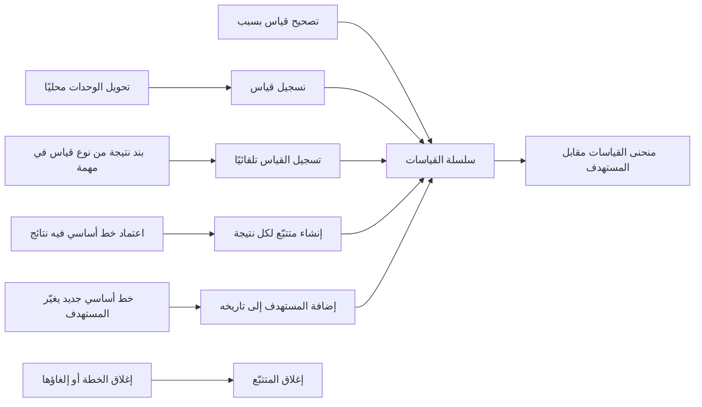
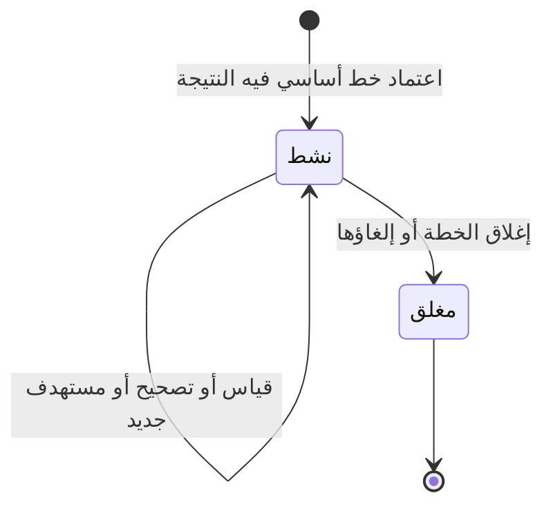

# قياس النتائج

<!-- BEGIN GENERATED: doc -->
| البند | القيمة |
|---|---|
| المعرّف | FEAT-OPS-OUTCOMES |
| الإصدار | 0.1 |
| الحالة | مسودة |
| القدرة | CAP-07 التخطيط والتنفيذ |
| القدرة الفرعية | CAP-07.05 قياس النتائج (R1) |
| الأدوار | المخطِّط؛ مالك الخطة؛ النظام |
| الشاشات | SCR-35 متابعة التنفيذ |
| حالات الاستخدام | UC-101 |
| القصص | 9: 6 من المواصفة، و3 جديدة |
<!-- END GENERATED: doc -->

## 1. نظرة عامة

### 1.1 القيمة

يسجل المخطط قياسات النتائج مقابل أهدافها ويصححها، فتبقى سلسلة القياس صادقة حتى بعد تغيير الخطة.

### 1.2 النطاق

| البند | القيمة |
|---|---|
| المستخدمون | المخطِّط ومالك الخطة يسجّلان القياسات ويصححانها، والمدير والقيادي التنفيذي يتابعون التقدم، والنظام ينشئ المتتبّع ويحدّث مستهدفه ويغلقه |
| الشاشات | SCR-35 متابعة التنفيذ: منحنى القياسات مقابل المستهدف لكل نتيجة |
| حالات الاستخدام | قياس نتيجة الخطة |
| المتطلبات | تسجيل قياسات نتائج الخطة عبر الزمن مقابل أهدافها، سلسلةً زمنية مرتبطة بالنتيجة ومقياسها (REQ-OPS-013) |
| خارج النطاق | تعريف النتائج ومستهدفاتها في إصدار الخطة (`FEAT-OPS-PLAN-AUTHORING`)، وتقدم مهام الخطة ومعالمها (`FEAT-OPS-EXEC-TRACKING`)، وإضافة بند النتيجة إلى المهمة (`FEAT-OPS-MY-TASKS`) |

### 1.3 خريطة الميزة

**الشكل 1: خريطة ميزة قياس النتائج**



ولمتتبّع النتيجة حالتان (الشكل 2): يُنشأ نشطًا، ويُغلق مع الخطة.

**الشكل 2: رحلة متتبّع النتيجة**



## 2. القواعد المشتركة

تنطبق على كل قصص الميزة، فلا تتكرر داخل القصص. وكل قصة تذكر ما يخصها فقط.

### 2.1 السياق المشترك

كل قصة تبدأ من ثلاثة شروط: مستأجر نشط، وحزمة السياسات الأساسية مفعّلة، ومستخدم مسجّل الدخول ومخوَّل. وتشير إليها القصص بخطوة واحدة: «بفرض السياق المشترك للميزة».

### 2.2 الصلاحية وعدم الإفصاح

- من لا يحق له رؤية العنصر يتلقى ردًا بشكل «غير متاح» تمامًا، فلا يعرف أنه موجود.
- من يرى العنصر ولا يحق له الإجراء يتلقى «لا تملك صلاحية هذا الإجراء».

### 2.3 أوامر تغيير الحالة

- **منع التكرار:** يُرسل كل أمر بمفتاح فريد، فإعادة الطلب نفسه لا تُنفَّذ مرتين.
- **حماية التعديل المتزامن:** يُرسل كل أمر بإصدار البيانات الذي يراه المستخدم. فإن عدّلها غيره في الأثناء، يُرفض الأمر.
- **السجل:** إن نجح الأمر، يُكتب حدثه وسجل التدقيق في المعاملة نفسها.

### 2.4 الرفض المشترك

```gherkin
# language: ar
خاصية: الرفض المشترك لأوامر الميزة

  سيناريو مخطط: رفض مشترك لكل أمر في الميزة
    بفرض السياق المشترك للميزة
    و <الحالة>
    عندما يُرسل المستخدم أي أمر من أوامر الميزة
    اذاً يُرفض برمز <الرمز> ويرى "<الرسالة>"
    و لا يتغير شيء

    امثلة:
      | الحالة                                  | الرمز                  | الرسالة                                                 |
      | العنصر خارج صلاحياته                    | NOT_FOUND              | غير متاح                                                |
      | العنصر مرئي له ولا يحق له الإجراء       | AUTHZ_DENIED           | لا تملك صلاحية هذا الإجراء                              |
      | غيره عدّل العنصر بعد أن فتحه            | VERSION_CONFLICT       | تغيّرت البيانات منذ فتحتها. راجع التغييرات ثم أعد المحاولة |
      | أعاد مفتاح منع التكرار بمحتوى مختلف     | IDEMPOTENCY_KEY_REUSED | طلب مكرر بمحتوى مختلف                                   |
      | البيانات ناقصة أو غير صحيحة             | VALIDATION_FAILED      | بعض البيانات ناقصة أو غير صحيحة. راجع الحقول المعلَّمة      |

  سيناريو: إعادة الطلب نفسه لا تُنفَّذ مرتين
    بفرض السياق المشترك للميزة
    و أمر نجح بمفتاح منع تكرار
    عندما يُعاد الطلب نفسه بالمفتاح نفسه
    اذاً تُعاد النتيجة الأولى ولا يُكتب حدث ثانٍ
```

### 2.5 القياس لا يُمحى

- **التصحيح إغلاق وإضافة:** لكل قياس وقتان: وقت القياس في الواقع، ووقت معرفة النظام به. والتصحيح يُغلق السجل السابق ويضيف سجلًا مصحَّحًا، ولا يكتب فوق أي قيمة.
- **التقدم:** تقدم النتيجة في وقت ما هو آخر قياس معروف حتى ذلك الوقت، مقابل المستهدف الساري فيه. لذلك تبقى تقارير التقدم السابقة قابلة لإعادة الإنتاج بعد التصحيح أو تغيير المستهدف.
- **المستهدف:** يُنسخ من الخط الأساسي المعتمد للخطة، ويُحفظ تاريخه كاملًا.

## 3. الجودة وتعريف الاكتمال

### 3.1 متطلبات الجودة

<!-- BEGIN GENERATED: quality -->
لا متطلبات جودة مرتبطة بمتطلبات هذه الميزة مباشرة. تنطبق متطلبات المنصة العامة (`FEAT-PLT-*`).
<!-- END GENERATED: quality -->

### 3.2 تعريف الاكتمال

القصة مكتملة حين تتحقق الشروط الخمسة:

1. سيناريوهاتها والقواعد المشتركة تمر في الاختبار الآلي.
2. فحوص البنية المعمارية تمر.
3. نصوص الواجهة والرسائل موجودة بالعربية والإنجليزية.
4. مراجعة الكود مكتملة.
5. ما تضيفه القصة نفسها في قسم «القواعد» تحقق.

## 4. فهرس القصص

<!-- BEGIN GENERATED: story-index -->
| المعرّف | القصة | النوع | الحالة |
|---|---|---|---|
| `US-BC04-OUT-CORRECT` | تصحيح متتبّع النتائج | أمر | مسودة |
| `US-BC04-OUT-RECORD` | تسجيل متتبّع النتائج | أمر | مسودة |
| `US-BC04-Q-OUT-SERIES` | جلب: Measurement series as known_at | جلب | مسودة |
| `US-BC04-S-OUTCOME-TRACKER-01` | تلقائي: outcome baselined (متتبّع النتائج) | نظام | مسودة |
| `US-BC04-S-OUTCOME-TRACKER-02` | تلقائي: target changed by new baseline (متتبّع النتائج) | نظام | مسودة |
| `US-BC04-S-OUTCOME-TRACKER-03` | تلقائي: plan closed or cancelled (متتبّع النتائج) | نظام | مسودة |
| `US-DOM-OPS-OUTCOME-FROM-TASK` | تسجيل قياس من نتيجة مهمة | نظام | مسودة |
| `US-UI-SCR35-OUTCOME-CHART` | منحنى القياسات مقابل المستهدف | واجهة | مسودة |
| `US-PLT-OPS-OUTCOME-UNITS` | تحويل وحدات القياس محليًا | منصة | مسودة |
<!-- END GENERATED: story-index -->

## 5. القصص

### 5.1 US-BC04-OUT-CORRECT — تصحيح قياس نتيجة

| النوع | الإصدار | الأولوية | دون اتصال | الحالة |
|---|---|---|---|---|
| أمر | R1 | Must | لا | مسودة |

> **كـ** المخطِّط أو مالك الخطة، **أريد** أن أصحّح قياسًا سُجّل خطأً مع ذكر السبب، **حتى** تعكس السلسلة القيمة الصحيحة دون أن يضيع ما عُرف من قبل.

**باختصار:** التصحيح لا يكتب فوق القياس. يُغلق السجل السابق ويُضاف سجل مصحَّح (القسم 2.5).

#### القواعد

- **متى يُسمح:** المتتبّع «نشط». والمغلق لا يُصحَّح.
- **من يُسمح له:** المخطِّط أو مالك الخطة، في المستأجر نفسه وضمن نطاقه في المؤسسة، والمتتبّع مرئي له.
- **البيانات:** القياس المراد تصحيحه، والقيمة المصحَّحة، والوحدة، والسبب. كلها إلزامية.
- **الأثر:** يُغلق السجل السابق بوقت التصحيح، ويُضاف السجل المصحَّح من الوقت نفسه، ولا تتغير حالة المتتبّع. ويُسجَّل حدث «صُحِّح قياس» ويصل إلى عرض تقدم الخطة وقياسات الأعمال.

#### معايير القبول

```gherkin
# language: ar
خاصية: تصحيح قياس نتيجة

  سيناريو: تصحيح قياس بسبب
    بفرض السياق المشترك للميزة
    و متتبّع نتيجة "نشط" فيه قياس قيمته 40
    عندما يصحّح المخطِّط القياس إلى 45 ويذكر السبب
    اذاً تعرض السلسلة الحالية القيمة 45
    و يبقى القياس 40 محفوظًا بوقت تسجيله ووقت إغلاقه
    و يبقى المتتبّع "نشطًا"
    و يُسجَّل حدث "صُحِّح قياس"

  سيناريو مخطط: رفض خاص بتصحيح القياس
    بفرض السياق المشترك للميزة
    و <الحالة>
    عندما يحاول تصحيح القياس
    اذاً يُرفض برمز <الرمز> ويرى "<الرسالة>"
    و تبقى السلسلة كما هي

    امثلة:
      | الحالة | الرمز | الرسالة |
      | السبب فارغ | REASON_REQUIRED | اذكر السبب |
      | المتتبّع "مغلق" | OUTCOME_TRACKER_INVALID_STATE_TRANSITION | الوضع الحالي لمتتبّع النتائج لا يسمح بهذا الإجراء |
      | لم يُحدَّد القياس المراد تصحيحه | VALIDATION_FAILED | القياس المراد تصحيحه مطلوب |
```

<details><summary>المراجع التقنية والتتبع</summary>

<!-- BEGIN GENERATED: refs US-BC04-OUT-CORRECT -->
| البند | المعرّف | المعنى |
|---|---|---|
| الواجهة البرمجية | `POST /api/v1/operations/outcome-trackers/{id}/actions/correct` | — |
| الأمر | `CMD-OUT-CORRECT` | تصحيح متتبّع النتائج |
| السياسة | `POL-OUT-CORRECT` | Planner / owner (record, correct)؛ tenant match; object visible; org scope |
| الحدث | `EVT-OUT-MEASUREMENT-CORRECTED` | يصل إلى: Plan progress view; Business telemetry (OUT-05) |
| الكيان | `AGG-OUTCOME-TRACKER` | متتبّع النتائج |
| الجدول | `operations.outcome_trackers` | الجدول الرئيسي لمتتبّع النتائج |
| وحدة النشر | DU-08 | — |
| المتطلب | REQ-OPS-013 | The system shall record measurements of plan outcomes over time against their targets. |
| حالة الاستخدام | UC-101 | Measure Plan Outcome |
| الاختبار | TST-OUTCOME-TRACKER-SM، TST-SLC08-INVARIANTS | دورة حالات متتبّع النتائج، وثوابت الشريحة SLC-08 |
<!-- END GENERATED: refs US-BC04-OUT-CORRECT -->

</details>

### 5.2 US-BC04-OUT-RECORD — تسجيل قياس نتيجة

| النوع | الإصدار | الأولوية | دون اتصال | الحالة |
|---|---|---|---|---|
| أمر | R1 | Must | لا | مسودة |

> **كـ** المخطِّط أو مالك الخطة، **أريد** أن أسجّل قياسًا لنتيجة الخطة بقيمته ووحدته ووقته ومصدره، **حتى** أتابع التقدم نحو المستهدف عبر الزمن.

**باختصار:** يُضاف القياس إلى سلسلة المتتبّع النشط. وتُقبل أي وحدة يمكن تحويلها إلى وحدة مقياس النتيجة.

#### القواعد

- **متى يُسمح:** المتتبّع «نشط»، ووحدة القياس قابلة للتحويل إلى وحدة مقياس النتيجة.
- **من يُسمح له:** المخطِّط أو مالك الخطة، في المستأجر نفسه وضمن نطاقه في المؤسسة، والمتتبّع مرئي له.
- **البيانات:** القيمة، والوحدة، ووقت القياس، والمصدر (يدوي، أو نتيجة مهمة، أو ملاحظة). كلها إلزامية. ومرجع المصدر والملاحظة اختياريان.
- **الأثر:** قياس جديد في السلسلة يُعرف من وقت تسجيله، ويُقارن بالمستهدف بعد تحويل وحدته **[Derived]**. ولا تتغير حالة المتتبّع. ويُسجَّل حدث «سُجِّل قياس» ويصل إلى عرض تقدم الخطة وقياسات الأعمال.

#### معايير القبول

```gherkin
# language: ar
خاصية: تسجيل قياس نتيجة

  سيناريو: تسجيل قياس بوحدة قابلة للتحويل
    بفرض السياق المشترك للميزة
    و متتبّع "نشط" لنتيجة مقياسها بالكيلومتر
    عندما يسجّل المخطِّط قياسًا قيمته 1500 متر بوقت قياسه ومصدر "يدوي"
    اذاً يُضاف القياس إلى سلسلة المتتبّع
    و يُقارن بالمستهدف بقيمة 1.5 كيلومتر
    و يُسجَّل حدث "سُجِّل قياس"

  سيناريو مخطط: رفض خاص بتسجيل القياس
    بفرض السياق المشترك للميزة
    و <الحالة>
    عندما يحاول تسجيل القياس
    اذاً يُرفض برمز <الرمز> ويرى "<الرسالة>"
    و لا يُضاف أي قياس

    امثلة:
      | الحالة | الرمز | الرسالة |
      | الوحدة لا تتحول إلى وحدة مقياس النتيجة | MEASUREMENT_INVALID | بيانات القياس غير صحيحة |
      | المتتبّع "مغلق" | OUTCOME_TRACKER_INVALID_STATE_TRANSITION | الوضع الحالي لمتتبّع النتائج لا يسمح بهذا الإجراء |
      | وقت القياس فارغ | VALIDATION_FAILED | وقت القياس مطلوب |
```

<details><summary>المراجع التقنية والتتبع</summary>

<!-- BEGIN GENERATED: refs US-BC04-OUT-RECORD -->
| البند | المعرّف | المعنى |
|---|---|---|
| الواجهة البرمجية | `POST /api/v1/operations/outcome-trackers/{id}/actions/record` | — |
| الأمر | `CMD-OUT-RECORD` | تسجيل متتبّع النتائج |
| السياسة | `POL-OUT-RECORD` | Planner / owner (record, correct)؛ tenant match; object visible; org scope |
| الحدث | `EVT-OUT-MEASURED` | يصل إلى: Plan progress view; Business telemetry (OUT-05) |
| الكيان | `AGG-OUTCOME-TRACKER` | متتبّع النتائج |
| الجدول | `operations.outcome_trackers` | الجدول الرئيسي لمتتبّع النتائج |
| وحدة النشر | DU-08 | — |
| المتطلب | REQ-OPS-013 | The system shall record measurements of plan outcomes over time against their targets. |
| حالة الاستخدام | UC-101 | Measure Plan Outcome |
| الاختبار | TST-OUTCOME-TRACKER-SM، TST-SLC08-INVARIANTS | دورة حالات متتبّع النتائج، وثوابت الشريحة SLC-08 |
<!-- END GENERATED: refs US-BC04-OUT-RECORD -->

</details>

### 5.3 US-BC04-Q-OUT-SERIES — سلسلة قياسات النتيجة مقابل المستهدف

| النوع | الإصدار | الأولوية | دون اتصال | الحالة |
|---|---|---|---|---|
| جلب | R1 | Must | لا | مسودة |

> **كـ** أي مستخدم مخوَّل، **أريد** سلسلة قياسات نتيجة الخطة مع مستهدفها، **حتى** أرى التقدم وأثق أن ما عُرض سابقًا يمكن إعادة إنتاجه.

**باختصار:** تُعاد قياسات النتيجة مرتبة بوقت القياس كما يعرفها النظام الآن، صفحةً بعد صفحة، ومع كل قياس المستهدف الساري في وقته (القسم 2.5).

#### القواعد

- **من يرى ماذا:** من يسمح تصريحه الأمني بتصنيف الخطة وتقع ضمن نطاقه. وغيره يتلقى «غير متاح» كأن النتيجة غير موجودة.
- **المرشحات:** الخطة والنتيجة، والمؤشر والحد.
- **ما يُعاد لكل قياس:** القيمة والوحدة، ووقت القياس، والمصدر، والمستهدف الساري.
- **الزمن:** الافتراضي ما يُعرف الآن. والعرض كما عُرف في وقت سابق يذكره وصف الاستعلام، ولا يذكر العقد معاملًا له **[Needs Review]**.

#### معايير القبول

```gherkin
# language: ar
خاصية: سلسلة قياسات النتيجة مقابل المستهدف

  سيناريو: عرض سلسلة فيها تصحيح وتغيير مستهدف
    بفرض السياق المشترك للميزة
    و نتيجة خطة لها ثلاثة قياسات صُحِّح أحدها، وتغيّر مستهدفها مرة
    عندما يطلب المستخدم سلسلة قياسات النتيجة
    اذاً تُعاد القياسات الثلاثة مرتبة بوقت القياس، والمصحَّح بقيمته الجديدة
    و يُعاد مع كل قياس المستهدف الساري في وقته

  سيناريو: الصفحة التالية
    بفرض السياق المشترك للميزة
    و قياسات النتيجة أكثر من صفحة
    عندما يطلب المستخدم الصفحة التالية بالمؤشر
    اذاً تُعاد القياسات التالية دون تكرار ولا فجوة
```

<details><summary>المراجع التقنية والتتبع</summary>

<!-- BEGIN GENERATED: refs US-BC04-Q-OUT-SERIES -->
| البند | المعرّف | المعنى |
|---|---|---|
| الواجهة البرمجية | `GET /api/v1/operations/plans/{plan_id}/outcomes/{outcome_id}/measurements` | — |
| الاستعلام | `QRY-OUT-SERIES` | Measurement series as known_at |
| السياسة | `POL-OUT-SERIES` | label rule |
| الكيان | `AGG-PLAN` | الخطة |
| الجدول | `operations.plans` | الجدول الرئيسي للخطة |
| وحدة النشر | DU-08 | — |
| المتطلب | REQ-OPS-013 | The system shall record measurements of plan outcomes over time against their targets. |
| حالة الاستخدام | UC-101 | Measure Plan Outcome |
| الاختبار | TST-PLAN-SM، TST-SLC08-INVARIANTS | دورة حالات الخطة، وثوابت الشريحة SLC-08 |
<!-- END GENERATED: refs US-BC04-Q-OUT-SERIES -->

</details>

### 5.4 US-BC04-S-OUTCOME-TRACKER-01 — إنشاء متتبّع النتيجة عند اعتماد الخطة

| النوع | الإصدار | الأولوية | دون اتصال | الحالة |
|---|---|---|---|---|
| نظام | R1 | Must | لا ينطبق | مسودة |

> **كـ** النظام، **أريد** أن أنشئ متتبّعًا لكل نتيجة حين يُعتمد الخط الأساسي للخطة، **حتى** تبدأ سلسلة القياس بمستهدف معتمد.

**باختصار:** عند اعتماد إصدار خطة فيه نتيجة لا متتبّع لها، يُنشأ لها متتبّع واحد «نشط»، ويُنسخ مستهدفها من الخط الأساسي.

#### القواعد

- **متى يحدث:** يُعتمد إصدار الخطة خطًّا أساسيًا، وفيه نتيجة لا متتبّع لها في هذه الخطة.
- **الأثر:** متتبّع واحد لكل خطة ونتيجة، حالته «نشط» ومستهدفه من الخط الأساسي. ويُسجَّل حدث «أُنشئ متتبّع النتيجة» وسجل تدقيق بهوية النظام.

#### معايير القبول

```gherkin
# language: ar
خاصية: إنشاء متتبّع النتيجة عند اعتماد الخطة

  سيناريو: اعتماد خط أساسي فيه نتيجة جديدة
    بفرض إصدار خطة قيد الاعتماد فيه نتيجة لا متتبّع لها
    عندما يُعتمد الإصدار خطًّا أساسيًا
    اذاً يُنشأ للنتيجة متتبّع حالته "نشط" ومستهدفه من الخط الأساسي
    و يُسجَّل حدث "أُنشئ متتبّع النتيجة" وسجل تدقيق بهوية النظام

  سيناريو: النتيجة لها متتبّع من قبل
    بفرض نتيجة خطة لها متتبّع "نشط"
    عندما يُعتمد خط أساسي جديد فيه النتيجة نفسها
    اذاً لا يُنشأ متتبّع ثانٍ
```

<details><summary>المراجع التقنية والتتبع</summary>

<!-- BEGIN GENERATED: refs US-BC04-S-OUTCOME-TRACKER-01 -->
| البند | المعرّف | المعنى |
|---|---|---|
| المحفِّز | `SYS:outcome baselined` | one tracker per (plan, outcome id); target copied from baseline |
| الانتقال | ∅ ← ACTIVE | — |
| الحدث | `EVT-OUT-TRACKER-CREATED` | يصل إلى: Plan progress view; Business telemetry (OUT-05) |
| الكيان | `AGG-OUTCOME-TRACKER` | متتبّع النتائج |
| الجدول | `operations.outcome_trackers` | الجدول الرئيسي لمتتبّع النتائج |
| وحدة النشر | DU-08 | — |
| المتطلب | REQ-OPS-013 | The system shall record measurements of plan outcomes over time against their targets. |
| حالة الاستخدام | UC-101 | Measure Plan Outcome |
| الاختبار | TST-OUTCOME-TRACKER-SM، TST-SLC08-INVARIANTS | دورة حالات متتبّع النتائج، وثوابت الشريحة SLC-08 |
<!-- END GENERATED: refs US-BC04-S-OUTCOME-TRACKER-01 -->

</details>

### 5.5 US-BC04-S-OUTCOME-TRACKER-02 — إضافة المستهدف الجديد عند خط أساسي جديد

| النوع | الإصدار | الأولوية | دون اتصال | الحالة |
|---|---|---|---|---|
| نظام | R1 | Must | لا ينطبق | مسودة |

> **كـ** النظام، **أريد** أن أضيف المستهدف الجديد إلى تاريخ المتتبّع حين يغيّره خط أساسي جديد، **حتى** يُقاس التقدم في كل وقت بالمستهدف الذي كان ساريًا فيه.

**باختصار:** إن غيّر خط أساسي جديد مستهدف نتيجة، يُضاف المستهدف الجديد إلى تاريخ المستهدفات ساريًا من وقت الخط الأساسي. ولا تتغير القياسات ولا حالة المتتبّع.

#### القواعد

- **متى يحدث:** يُعتمد خط أساسي جديد يغيّر مستهدف نتيجة لها متتبّع «نشط».
- **الأثر:** يُضاف المستهدف الجديد إلى تاريخه، ووقت سريانه وقت الخط الأساسي، ويبقى المستهدف السابق لما قبله. ويُسجَّل حدث «تغيّر مستهدف النتيجة» وسجل تدقيق بهوية النظام.

#### معايير القبول

```gherkin
# language: ar
خاصية: إضافة المستهدف الجديد عند خط أساسي جديد

  سيناريو: خط أساسي جديد يرفع المستهدف
    بفرض متتبّع "نشط" لنتيجة مستهدفها 100
    عندما يُعتمد خط أساسي جديد مستهدف النتيجة فيه 120
    اذاً يُضاف المستهدف 120 ساريًا من وقت الخط الأساسي الجديد
    و يبقى المستهدف 100 لما قبله، وتبقى القياسات كما هي
    و يُسجَّل حدث "تغيّر مستهدف النتيجة" وسجل تدقيق بهوية النظام

  سيناريو: خط أساسي جديد لا يغيّر المستهدف
    بفرض متتبّع "نشط" لنتيجة مستهدفها 100
    عندما يُعتمد خط أساسي جديد مستهدف النتيجة فيه 100
    اذاً لا يتغير تاريخ المستهدف ولا يُسجَّل حدث
```

<details><summary>المراجع التقنية والتتبع</summary>

<!-- BEGIN GENERATED: refs US-BC04-S-OUTCOME-TRACKER-02 -->
| البند | المعرّف | المعنى |
|---|---|---|
| المحفِّز | `SYS:target changed by new baseline` | target history appended (valid time = baseline time) |
| الانتقال | ACTIVE ← (بلا تغيير) | — |
| الحدث | `EVT-OUT-TARGET-CHANGED` | يصل إلى: Plan progress view; Business telemetry (OUT-05) |
| الكيان | `AGG-OUTCOME-TRACKER` | متتبّع النتائج |
| الجدول | `operations.outcome_trackers` | الجدول الرئيسي لمتتبّع النتائج |
| وحدة النشر | DU-08 | — |
| المتطلب | REQ-OPS-013 | The system shall record measurements of plan outcomes over time against their targets. |
| حالة الاستخدام | UC-101 | Measure Plan Outcome |
| الاختبار | TST-OUTCOME-TRACKER-SM، TST-SLC08-INVARIANTS | دورة حالات متتبّع النتائج، وثوابت الشريحة SLC-08 |
<!-- END GENERATED: refs US-BC04-S-OUTCOME-TRACKER-02 -->

</details>

### 5.6 US-BC04-S-OUTCOME-TRACKER-03 — إغلاق المتتبّع عند إغلاق الخطة أو إلغائها

| النوع | الإصدار | الأولوية | دون اتصال | الحالة |
|---|---|---|---|---|
| نظام | R1 | Must | لا ينطبق | مسودة |

> **كـ** النظام، **أريد** أن أغلق متتبّعات النتائج حين تُغلق الخطة أو تُلغى، **حتى** لا يُسجَّل قياس لخطة انتهت.

**باختصار:** عند إغلاق الخطة أو إلغائها يصبح كل متتبّع نشط لها «مغلقًا»، فلا يُقبل بعده قياس ولا تصحيح.

#### القواعد

- **متى يحدث:** تُغلق الخطة أو تُلغى، ولها متتبّع «نشط».
- **الأثر:** يصبح المتتبّع «مغلقًا»، وهي حالة نهائية. ويُسجَّل حدث «أُغلق متتبّع النتيجة» وسجل تدقيق بهوية النظام.

#### معايير القبول

```gherkin
# language: ar
خاصية: إغلاق المتتبّع عند إغلاق الخطة أو إلغائها

  سيناريو: إلغاء الخطة يغلق متتبّعاتها
    بفرض خطة لها متتبّعا نتيجتين حالتهما "نشط"
    عندما تُلغى الخطة
    اذاً تصبح حالة المتتبّعين "مغلق"
    و يُسجَّل حدث "أُغلق متتبّع النتيجة" لكل منهما وسجل تدقيق بهوية النظام

  سيناريو: تعليق الخطة أو إكمالها لا يغلق المتتبّع
    بفرض خطة لها متتبّع نتيجة "نشط"
    عندما تُعلَّق الخطة أو تُكمَل
    اذاً يبقى المتتبّع "نشطًا"
```

<details><summary>المراجع التقنية والتتبع</summary>

<!-- BEGIN GENERATED: refs US-BC04-S-OUTCOME-TRACKER-03 -->
| البند | المعرّف | المعنى |
|---|---|---|
| المحفِّز | `SYS:plan closed or cancelled` | system |
| الانتقال | ACTIVE ← CLOSED | — |
| الحدث | `EVT-OUT-TRACKER-CLOSED` | يصل إلى: Plan progress view; Business telemetry (OUT-05) |
| الكيان | `AGG-OUTCOME-TRACKER` | متتبّع النتائج |
| الجدول | `operations.outcome_trackers` | الجدول الرئيسي لمتتبّع النتائج |
| وحدة النشر | DU-08 | — |
| المتطلب | REQ-OPS-013 | The system shall record measurements of plan outcomes over time against their targets. |
| حالة الاستخدام | UC-101 | Measure Plan Outcome |
| الاختبار | TST-OUTCOME-TRACKER-SM، TST-SLC08-INVARIANTS | دورة حالات متتبّع النتائج، وثوابت الشريحة SLC-08 |
<!-- END GENERATED: refs US-BC04-S-OUTCOME-TRACKER-03 -->

</details>

### 5.7 US-DOM-OPS-OUTCOME-FROM-TASK — تسجيل قياس من نتيجة مهمة

| النوع | الإصدار | الأولوية | دون اتصال | الحالة |
|---|---|---|---|---|
| نظام | R1 | Must | لا ينطبق | مسودة |

> **كـ** النظام، **أريد** أن أسجّل قياس النتيجة حين يُضاف إلى مهمة بند نتيجة من نوع قياس، **حتى** لا يعيد المخطِّط إدخال ما سجّله المنفّذ.

**باختصار:** بند النتيجة من نوع «قياس» في مهمة من مهام الخطة يُسجَّل قياسًا في متتبّع النتيجة المرتبطة، بمصدر «نتيجة مهمة» ومرجع المهمة. والمواصفة تذكر هذا المصدر ولا تعرّف انتقاله، فالقصة **[Derived]**.

#### القواعد

- **متى يحدث:** يُضاف بند نتيجة من نوع «قياس» إلى مهمة من مهام الخطة، ومتتبّع النتيجة «نشط» **[Derived]**. وكيف يُعرف المقياس الذي يخصه البند **[Needs Review]**، لأن العقد لا يعرّف محتوى بند القياس. وهل ينتظر التسجيل اعتماد نتيجة المهمة **[Needs Review]**.
- **الأثر:** قياس جديد بشروط التسجيل اليدوي نفسها، بمصدر «نتيجة مهمة» ومرجعها. ويُسجَّل حدث «سُجِّل قياس» وسجل تدقيق بهوية النظام.

#### معايير القبول

```gherkin
# language: ar
خاصية: تسجيل قياس من نتيجة مهمة

  سيناريو: بند قياس في مهمة من مهام الخطة
    بفرض متتبّع "نشط" لنتيجة خطة، ومهمة من مهام الخطة قيد التنفيذ
    عندما يُضاف إلى المهمة بند نتيجة من نوع "قياس" لمقياس النتيجة
    اذاً يُضاف القياس إلى سلسلة المتتبّع بمصدر "نتيجة مهمة" ومرجع المهمة
    و يُسجَّل حدث "سُجِّل قياس" وسجل تدقيق بهوية النظام

  سيناريو مخطط: بند لا يُسجَّل قياسًا
    بفرض <الحالة>
    عندما يُضاف البند إلى المهمة
    اذاً لا يُسجَّل أي قياس

    امثلة:
      | الحالة |
      | بند نتيجة من نوع "ملاحظة" في مهمة من مهام الخطة |
      | بند قياس في مهمة خطة متتبّع نتيجتها "مغلق" |
```

<details><summary>المراجع التقنية والتتبع</summary>

<!-- BEGIN GENERATED: refs US-DOM-OPS-OUTCOME-FROM-TASK -->
| البند | المعرّف | المعنى |
|---|---|---|
| المصدر | `decision-plan-spec.md §4` | — |
| المصدر | `[Derived]` | — |
| المتطلب | REQ-OPS-013 | The system shall record measurements of plan outcomes over time against their targets. |
| حالة الاستخدام | UC-101 | Measure Plan Outcome |
<!-- END GENERATED: refs US-DOM-OPS-OUTCOME-FROM-TASK -->

</details>

### 5.8 US-UI-SCR35-OUTCOME-CHART — منحنى القياسات مقابل المستهدف

| النوع | الإصدار | الأولوية | دون اتصال | الحالة |
|---|---|---|---|---|
| واجهة | R1 | Must | لا | مسودة |

> **كـ** المخطِّط، **أريد** منحنى يعرض قياسات كل نتيجة مقابل مستهدفها عبر الزمن، **حتى** أرى بنظرة هل تتقدم الخطة نحو هدفها.

**باختصار:** في شاشة متابعة التنفيذ، لكل نتيجة منحنى قياساتها وخط مستهدفها حتى موعدها، ومعه جدول بالقيم نفسها. والشكل **[Derived]**.

#### القواعد

- المنحنى يعرض القياسات بوقت قياسها، وخط المستهدف بقيمه المتعاقبة كلٌّ من وقت سريانه (القسم 2.5).
- يظهر اتجاه النتيجة (زيادة، أو نقص، أو بلوغ قيمة) وموعدها.
- القياس المصحَّح يظهر بقيمته الجديدة مع علامة «صُحِّح» تكشف القيمة السابقة **[Derived]**.
- المحاور والأرقام لا تنعكس في الواجهة العربية، والحالة لا تُميَّز باللون وحده، ولكل منحنى جدول بديل (21-ui-design §9، §10).
- الشاشة للمخطِّط والمدير، والقيادي التنفيذي يرى العرض المجمّع.
- زرّا «تسجيل قياس» و«تصحيح» يظهران لمن يملك الصلاحية والمتتبّع نشط **[Derived]**.

#### معايير القبول

```gherkin
# language: ar
خاصية: منحنى القياسات مقابل المستهدف

  سيناريو: فتح متابعة التنفيذ لخطة نشطة
    بفرض السياق المشترك للميزة
    و خطة نشطة لنتيجتها قياسات ومستهدف تغيّر مرة
    عندما يفتح المخطِّط شاشة متابعة التنفيذ
    اذاً يرى منحنى القياسات وخط المستهدف بقيمتيه كلٌّ من وقت سريانه
    و يرى موعد النتيجة واتجاهها، وجدولًا بالقيم نفسها
    و يظهر له زرّا "تسجيل قياس" و"تصحيح"

  سيناريو: متتبّع مغلق
    بفرض السياق المشترك للميزة
    و خطة مغلقة متتبّع نتيجتها "مغلق"
    عندما يفتح المخطِّط شاشة متابعة التنفيذ
    اذاً يرى المنحنى والجدول
    لكن لا يظهر زرّا "تسجيل قياس" و"تصحيح"
```

<details><summary>المراجع التقنية والتتبع</summary>

<!-- BEGIN GENERATED: refs US-UI-SCR35-OUTCOME-CHART -->
| البند | المعرّف | المعنى |
|---|---|---|
| الشاشة | SCR-35 | شاشة متابعة التنفيذ |
| المصدر | `decision-plan-spec.md §4` | — |
| المصدر | `[Derived]` | — |
| المتطلب | REQ-OPS-013 | The system shall record measurements of plan outcomes over time against their targets. |
| حالة الاستخدام | UC-101 | Measure Plan Outcome |
<!-- END GENERATED: refs US-UI-SCR35-OUTCOME-CHART -->

</details>

### 5.9 US-PLT-OPS-OUTCOME-UNITS — تحويل وحدات القياس محليًا

| النوع | الإصدار | الأولوية | دون اتصال | الحالة |
|---|---|---|---|---|
| منصة | R1 | Must | لا ينطبق | مسودة |

> **كـ** فريق المنصة، **أريد** تحويل وحدات القياس بتعريفات وحدات قياسية مضمّنة في المنصة، **حتى** يُتحقق من الوحدات وتُحوَّل دون أي اتصال بشبكة خارجية.

**باختصار:** تعريفات الوحدات (UCUM) تُضمَّن في النشر، وتُستعمل عند تسجيل القياس للتحقق من قابلية التحويل وللمقارنة بالمستهدف. والقصة **[Derived]**.

#### القواعد

- التعريفات لا تُجلب من الإنترنت وقت التشغيل ولا وقت البناء (FIT-12).
- الوحدة مقبولة إن أمكن تحويلها إلى وحدة مقياس النتيجة، ومرفوضة إن لم يمكن.
- تحديث التعريفات يأتي مع إصدار المنصة **[Derived]**.

#### معايير القبول

```gherkin
# language: ar
خاصية: تحويل وحدات القياس محليًا

  سيناريو: تحويل وحدة متوافقة
    بفرض مقياس نتيجة وحدته الكيلومتر
    عندما يُطلب تحويل 1500 متر
    اذاً تكون النتيجة 1.5 كيلومتر

  سيناريو: وحدة غير متوافقة
    بفرض مقياس نتيجة وحدته الكيلومتر
    عندما يُطلب التحقق من وحدة الكيلوغرام
    اذاً تُعدّ الوحدة غير قابلة للتحويل

  سيناريو: البناء والتشغيل في شبكة معزولة
    بفرض مرحلة البناء والاختبار في شبكة معزولة
    عندما تُبنى المنصة وتُشغَّل اختبارات التحويل
    اذاً تنجح دون أي طلب إلى شبكة خارجية
```

<details><summary>المراجع التقنية والتتبع</summary>

<!-- BEGIN GENERATED: refs US-PLT-OPS-OUTCOME-UNITS -->
| البند | المعرّف | المعنى |
|---|---|---|
| المصدر | `US-BC04-OUT-RECORD` | — |
| فحص البنية | FIT-12 | No external network dependency at runtime or build (air-gapped) |
| المصدر | `[Derived]` | — |
| المتطلب | REQ-OPS-013 | The system shall record measurements of plan outcomes over time against their targets. |
| حالة الاستخدام | UC-101 | Measure Plan Outcome |
<!-- END GENERATED: refs US-PLT-OPS-OUTCOME-UNITS -->

</details>

## 6. التتبع

<!-- BEGIN GENERATED: trace -->
| المتطلب | المعنى | القصص | الاختبار |
|---|---|---|---|
| REQ-OPS-013 | The system shall record measurements of plan outcomes over time against their targets. | `US-BC04-OUT-CORRECT`، `US-BC04-OUT-RECORD`، `US-BC04-Q-OUT-SERIES`، `US-BC04-S-OUTCOME-TRACKER-01`، `US-BC04-S-OUTCOME-TRACKER-02`، `US-BC04-S-OUTCOME-TRACKER-03`، `US-DOM-OPS-OUTCOME-FROM-TASK`، `US-PLT-OPS-OUTCOME-UNITS`، `US-UI-SCR35-OUTCOME-CHART` | TST-OUTCOME-TRACKER-SM، TST-SLC08-INVARIANTS |
<!-- END GENERATED: trace -->

## 7. سجل التغييرات

| الإصدار | التاريخ | التغيير |
|---|---|---|
| 0.1 | — | هيكل مولَّد من خريطة الميزات |
| 0.2 | 2026-10-02 | كتابة القصص كاملة بمعيار القصص |
