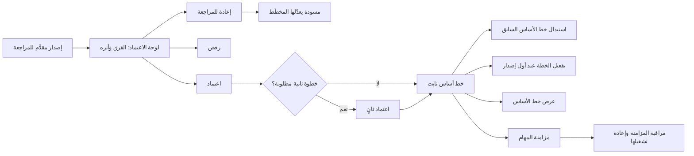
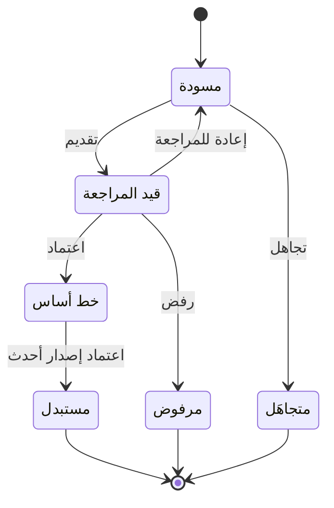

# اعتماد الخطة

<!-- BEGIN GENERATED: doc -->
| البند | القيمة |
|---|---|
| المعرّف | FEAT-OPS-PLAN-APPROVAL |
| الإصدار | 0.2 |
| الحالة | مسودة |
| القدرة | CAP-07 التخطيط والتنفيذ |
| القدرة الفرعية | CAP-07.02 إصدارات الخطة وخط الأساس (R1) |
| الأدوار | صاحب السلطة أو المعتمِد الثاني؛ النظام |
| الشاشات | SCR-34 الخطة ونسخها |
| حالات الاستخدام | UC-034، UC-035، UC-036 |
| القصص | 11: 5 من المواصفة، و6 جديدة |
<!-- END GENERATED: doc -->

## 1. نظرة عامة

### 1.1 القيمة

يعتمد صاحب الصلاحية — غير كاتب الخطة — نسخة الخطة فتصبح خط أساس ثابتًا، أو يعيدها أو يرفضها.

### 1.2 النطاق

| البند | القيمة |
|---|---|
| المستخدمون | صاحب السلطة أو المعتمِد الثاني (يعتمد الإصدار أو يعيده أو يرفضه)، والنظام (يثبّت خط الأساس ويفعّل الخطة ويزامن مهامها)، وفريق التشغيل (يراقب المزامنة) |
| الشاشات | SCR-34 الخطة ونسخها: لوحة الاعتماد وعرض خط الأساس |
| حالات الاستخدام | مراجعة الخطة، واعتمادها، وتثبيت خط الأساس (UC-034، UC-035، UC-036) |
| المتطلبات | الاعتماد ينشئ خط أساس لا يتغير (REQ-OPS-003)؛ التغيير الجوهري يحتاج إصدارًا جديدًا معتمدًا (REQ-OPS-004)؛ لا يعتمد الكاتب ما كتبه (REQ-OPS-005)؛ خطوات اعتماد يضبطها المستأجر (REQ-OPS-014) |
| خارج النطاق | إعداد الإصدار وتقديمه (FEAT-OPS-PLAN-AUTHORING)؛ حساب الفرق والتعديل الطفيف وسجل الإصدارات (FEAT-OPS-PLAN-VERSIONS)؛ تنفيذ المهام المولَّدة (FEAT-OPS-MY-TASKS) |

### 1.3 خريطة الميزة

**الشكل 1: من الإصدار المقدَّم إلى خط الأساس والمهام**



**الشكل 2: رحلة إصدار الخطة**



هذه الميزة تغطي الانتقالات من «قيد المراجعة» وما بعدها في الشكل 2. والتقديم والتجاهل في ميزة إعداد الخطة.

## 2. القواعد المشتركة

تنطبق على كل قصص الميزة، فلا تتكرر داخل القصص. وكل قصة تذكر ما يخصها فقط.

### 2.1 السياق المشترك

كل قصة تبدأ من ثلاثة شروط: مستأجر نشط، وحزمة السياسات الأساسية مفعّلة، ومستخدم مسجّل الدخول ومخوَّل. وتشير إليها القصص بخطوة واحدة: «بفرض السياق المشترك للميزة».

### 2.2 الصلاحية وعدم الإفصاح

- من لا يحق له رؤية العنصر يتلقى ردًا بشكل «غير متاح» تمامًا، فلا يعرف أنه موجود.
- من يرى العنصر ولا يحق له الإجراء يتلقى «لا تملك صلاحية هذا الإجراء».

### 2.3 أوامر تغيير الحالة

- **منع التكرار:** يُرسل كل أمر بمفتاح فريد، فإعادة الطلب نفسه لا تُنفَّذ مرتين.
- **حماية التعديل المتزامن:** يُرسل كل أمر بإصدار البيانات الذي يراه المستخدم. فإن عدّلها غيره في الأثناء، يُرفض الأمر.
- **السجل:** إن نجح الأمر، يُكتب حدثه وسجل التدقيق في المعاملة نفسها.

### 2.4 الرفض المشترك

```gherkin
# language: ar
خاصية: الرفض المشترك لأوامر الميزة

  سيناريو مخطط: رفض مشترك لكل أمر في الميزة
    بفرض السياق المشترك للميزة
    و <الحالة>
    عندما يُرسل المستخدم أي أمر من أوامر الميزة
    اذاً يُرفض برمز <الرمز> ويرى "<الرسالة>"
    و لا يتغير شيء

    امثلة:
      | الحالة                                  | الرمز                  | الرسالة                                                 |
      | العنصر خارج صلاحياته                    | NOT_FOUND              | غير متاح                                                |
      | العنصر مرئي له ولا يحق له الإجراء       | AUTHZ_DENIED           | لا تملك صلاحية هذا الإجراء                              |
      | غيره عدّل العنصر بعد أن فتحه            | VERSION_CONFLICT       | تغيّرت البيانات منذ فتحتها. راجع التغييرات ثم أعد المحاولة |
      | أعاد مفتاح منع التكرار بمحتوى مختلف     | IDEMPOTENCY_KEY_REUSED | طلب مكرر بمحتوى مختلف                                   |
      | البيانات ناقصة أو غير صحيحة             | VALIDATION_FAILED      | بعض البيانات ناقصة أو غير صحيحة. راجع الحقول المعلَّمة      |

  سيناريو: إعادة الطلب نفسه لا تُنفَّذ مرتين
    بفرض السياق المشترك للميزة
    و أمر نجح بمفتاح منع تكرار
    عندما يُعاد الطلب نفسه بالمفتاح نفسه
    اذاً تُعاد النتيجة الأولى ولا يُكتب حدث ثانٍ
```

### 2.5 من يحكم على الإصدار

- الاعتماد والإعادة والرفض لمن يملك سلطة اعتماد الخطط في نطاق الخطة، وليس كاتب الإصدار.
- محتوى الإصدار ثابت منذ تقديمه للمراجعة. فالمعتمِد يحكم على ما قُدِّم كما هو، ولا يعدّله.
- خط الأساس لا يتغير محتواه أبدًا. والتعديلات الطفيفة تُسجَّل ملاحظاتٍ عليه، والتغيير الجوهري يحتاج إصدارًا جديدًا.

## 3. الجودة وتعريف الاكتمال

### 3.1 متطلبات الجودة

<!-- BEGIN GENERATED: quality -->
| المرجع | الموقف | المطلوب |
|---|---|---|
| QAS-PERF-021 | plan version baselined with 500 task-generating activities | task synchronization completes ≤ 60 s; idempotent on retry |
<!-- END GENERATED: quality -->

### 3.2 تعريف الاكتمال

القصة مكتملة حين تتحقق الشروط الخمسة:

1. سيناريوهاتها والقواعد المشتركة تمر في الاختبار الآلي.
2. فحوص البنية المعمارية تمر.
3. نصوص الواجهة والرسائل موجودة بالعربية والإنجليزية.
4. مراجعة الكود مكتملة.
5. ما تضيفه القصة نفسها في قسم «القواعد» تحقق.

## 4. فهرس القصص

<!-- BEGIN GENERATED: story-index -->
| المعرّف | القصة | النوع | الحالة |
|---|---|---|---|
| `US-BC04-PLV-APPROVE` | اعتماد إصدار الخطة | أمر | مسودة |
| `US-BC04-PLV-REJECT` | رفض إصدار الخطة | أمر | مسودة |
| `US-BC04-PLV-RETURN` | إعادة إصدار الخطة إلى كاتبه للتصحيح | أمر | مسودة |
| `US-DOM-OPS-PLAN-MULTI-APPROVAL` | خطوة اعتماد ثانية للخطة حسب إعداد المستأجر | أمر | مسودة |
| `US-BC04-S-PLAN-01` | تفعيل الخطة عند اعتماد أول إصدار لها | نظام | مسودة |
| `US-BC04-S-PLAN-VERSION-01` | استبدال خط الأساس السابق عند اعتماد إصدار أحدث | نظام | مسودة |
| `US-DOM-OPS-PLAN-TASK-SYNC` | مزامنة مهام الخطة عند اعتماد إصدار | نظام | مسودة |
| `US-UI-SCR34-APPROVAL-PANEL` | مراجعة الفرق وأثره قبل اعتماد الخطة | واجهة | مسودة |
| `US-UI-SCR34-BASELINE-VIEW` | عرض خط الأساس الثابت للخطة | واجهة | مسودة |
| `US-PLT-OPS-PLAN-SYNC-LOAD` | مزامنة 500 نشاط خلال دقيقة | منصة | مسودة |
| `US-OPS-PLAN-SYNC-REPLAY` | مراقبة مزامنة المهام وإعادة تشغيلها | تشغيل | مسودة |
<!-- END GENERATED: story-index -->

## 5. القصص

### 5.1 US-BC04-PLV-APPROVE — اعتماد إصدار الخطة

| النوع | الإصدار | الأولوية | دون اتصال | الحالة |
|---|---|---|---|---|
| أمر | R1 | Must | لا | مسودة |

> **كـ** صاحب السلطة أو المعتمِد الثاني، **أريد** أن أعتمد إصدار الخطة المقدَّم للمراجعة، **حتى** يصبح خط أساس ثابتًا يُنفَّذ ويُقاس عليه.

**باختصار:** يعتمد صاحب سلطة اعتماد الخطط، وهو غير كاتب الإصدار، إصدارًا «قيد المراجعة»، فيصير «خط أساس» لا يتغير محتواه، ويُستبدل خط الأساس السابق في الوقت نفسه.

#### القواعد

- **متى يُسمح:** الإصدار «قيد المراجعة».
- **من يُسمح له:** كما في §2.5، بعد تأكيد هويته بمصادقة معززة. والمتطلب يسمح بالاعتماد الذاتي إن أجازته سياسة المستأجر صراحة، بينما المواصفة ترفضه دائمًا (REQ-OPS-005) **[Needs Review]**.
- **البيانات:** ملاحظة اختيارية.
- **الأثر:**
  - يصير الإصدار «خط أساس»، ويبقى قابلًا للاسترجاع بعد الإصدارات اللاحقة (REQ-OPS-003).
  - يُستبدل خط الأساس السابق في المعاملة نفسها، فلا يكون للخطة إلا خط أساس واحد (§5.6).
  - تُفعَّل الخطة إن كان هذا أول إصدار معتمد لها (§5.5)، وتبدأ مزامنة مهامها بعد حفظ الاعتماد (§5.7).
- **ملاحظة:** المصدر يجمع غياب سلطة الاعتماد مع اعتماد الكاتب تحت رمز فصل المهام، ورسالته لا تناسب غياب السلطة **[Needs Review]**.

#### معايير القبول

```gherkin
# language: ar
خاصية: اعتماد إصدار الخطة

  سيناريو: صاحب السلطة يعتمد إصدارًا كتبه غيره
    بفرض السياق المشترك للميزة
    و إصدار خطة "قيد المراجعة" كتبه مخطِّط آخر
    و للمستخدم سلطة اعتماد الخطط في نطاق الخطة وقد أكّد هويته
    عندما يعتمد الإصدار
    اذاً تصبح حالة الإصدار "خط أساس" ولا يقبل محتواه أي تعديل
    و يصبح خط الأساس السابق "مستبدل"
    و يُسجَّل حدث "اعتُمد إصدار الخطة"

  سيناريو مخطط: رفض خاص باعتماد الإصدار
    بفرض السياق المشترك للميزة
    و <الحالة>
    عندما يحاول اعتماد الإصدار
    اذاً يُرفض برمز <الرمز> ويرى "<الرسالة>"

    امثلة:
      | الحالة                         | الرمز                                 | الرسالة                                        |
      | الإصدار ليس "قيد المراجعة"     | PLAN_VERSION_INVALID_STATE_TRANSITION | الوضع الحالي لإصدار الخطة لا يسمح بهذا الإجراء |
      | المستخدم هو كاتب الإصدار       | SEGREGATION_OF_DUTIES                 | لا يجوز أن يعتمد الشخص نفسه ما قدّمه أو طلبه   |
      | لم يؤكد هويته بمصادقة معززة    | MFA_STEP_UP_REQUIRED                  | هذا الإجراء يحتاج تأكيد هويتك مرة أخرى         |
```

<details><summary>المراجع التقنية والتتبع</summary>

<!-- BEGIN GENERATED: refs US-BC04-PLV-APPROVE -->
| البند | المعرّف | المعنى |
|---|---|---|
| الواجهة البرمجية | `POST /api/v1/operations/plan-versions/{id}/actions/approve` | — |
| الأمر | `CMD-PLV-APPROVE` | اعتماد إصدار الخطة |
| السياسة | `POL-PLV-APPROVE` | Planner (draft, edit, submit, discard, minor amend) · approver with plan-approval authority ≠ author (approve… |
| الحدث | `EVT-PLV-BASELINED` | يصل إلى: Task synchronizer (SPEC-PLAN §3); Outcome trackers; Plan identity (activation); Search projection (S… |
| الكيان | `AGG-PLAN-VERSION` | إصدار الخطة |
| الجدول | `operations.plan_versions` | الجدول الرئيسي لإصدار الخطة |
| وحدة النشر | DU-08 | — |
| المتطلبات | REQ-OPS-003، REQ-OPS-004، REQ-OPS-005 | معانيها في القسم 6. التتبع |
| حالات الاستخدام | UC-034، UC-035، UC-036 | Review Plan؛ Approve Plan؛ Baseline Plan |
| الاختبار | TST-PLAN-VERSION-SM، TST-SLC08-INVARIANTS | دورة حالات إصدار الخطة، وثوابت الشريحة SLC-08 |
<!-- END GENERATED: refs US-BC04-PLV-APPROVE -->

</details>

### 5.2 US-BC04-PLV-REJECT — رفض إصدار الخطة

| النوع | الإصدار | الأولوية | دون اتصال | الحالة |
|---|---|---|---|---|
| أمر | R1 | Must | لا | مسودة |

> **كـ** صاحب السلطة أو المعتمِد الثاني، **أريد** أن أرفض إصدار الخطة المقدَّم مع ذكر السبب، **حتى** لا يصبح خط أساس إصدارٌ لا يصلح.

**باختصار:** يرفض المعتمِد إصدارًا «قيد المراجعة» بسبب مكتوب، فيصير «مرفوض» نهائيًا، ويبقى خط الأساس الحالي كما هو.

#### القواعد

- **متى يُسمح:** الإصدار «قيد المراجعة».
- **من يُسمح له:** كما في §2.5.
- **البيانات:** السبب (إلزامي).
- **الأثر:** يصير الإصدار «مرفوض»، وهي حالة نهائية لا يُقبل بعدها تغيير. ولا تتغير الخطة ولا خط أساسها الحالي، وتغييرها بعد ذلك يكون بإصدار جديد.

#### معايير القبول

```gherkin
# language: ar
خاصية: رفض إصدار الخطة

  سيناريو: المعتمِد يرفض إصدارًا بسبب
    بفرض السياق المشترك للميزة
    و إصدار خطة "قيد المراجعة" كتبه مخطِّط آخر
    عندما يرفضه المعتمِد ويذكر السبب
    اذاً تصبح حالة الإصدار "مرفوض"
    و يبقى خط الأساس الحالي للخطة دون تغيير
    و يُسجَّل حدث "رُفض إصدار الخطة"

  سيناريو مخطط: رفض خاص برفض الإصدار
    بفرض السياق المشترك للميزة
    و <الحالة>
    عندما يحاول رفض الإصدار
    اذاً يُرفض برمز <الرمز> ويرى "<الرسالة>"

    امثلة:
      | الحالة                     | الرمز                                 | الرسالة                                        |
      | الإصدار ليس "قيد المراجعة" | PLAN_VERSION_INVALID_STATE_TRANSITION | الوضع الحالي لإصدار الخطة لا يسمح بهذا الإجراء |
      | لم يذكر السبب              | REASON_REQUIRED                       | اذكر السبب                                     |
```

<details><summary>المراجع التقنية والتتبع</summary>

<!-- BEGIN GENERATED: refs US-BC04-PLV-REJECT -->
| البند | المعرّف | المعنى |
|---|---|---|
| الواجهة البرمجية | `POST /api/v1/operations/plan-versions/{id}/actions/reject` | — |
| الأمر | `CMD-PLV-REJECT` | رفض إصدار الخطة |
| السياسة | `POL-PLV-REJECT` | Planner (draft, edit, submit, discard, minor amend) · approver with plan-approval authority ≠ author (approve… |
| الحدث | `EVT-PLV-REJECTED` | يصل إلى: Task synchronizer (SPEC-PLAN §3); Outcome trackers; Plan identity (activation); Search projection (S… |
| الكيان | `AGG-PLAN-VERSION` | إصدار الخطة |
| الجدول | `operations.plan_versions` | الجدول الرئيسي لإصدار الخطة |
| وحدة النشر | DU-08 | — |
| المتطلبات | REQ-OPS-003، REQ-OPS-004، REQ-OPS-005 | معانيها في القسم 6. التتبع |
| حالات الاستخدام | UC-034، UC-035، UC-036 | Review Plan؛ Approve Plan؛ Baseline Plan |
| الاختبار | TST-PLAN-VERSION-SM، TST-SLC08-INVARIANTS | دورة حالات إصدار الخطة، وثوابت الشريحة SLC-08 |
<!-- END GENERATED: refs US-BC04-PLV-REJECT -->

</details>

### 5.3 US-BC04-PLV-RETURN — إعادة إصدار الخطة إلى كاتبه للتصحيح

| النوع | الإصدار | الأولوية | دون اتصال | الحالة |
|---|---|---|---|---|
| أمر | R1 | Must | لا | مسودة |

> **كـ** صاحب السلطة أو المعتمِد الثاني، **أريد** أن أعيد الإصدار المقدَّم إلى المخطِّط مع ذكر السبب، **حتى** يصحّحه ويقدّمه من جديد بدل أن يُرفض.

**باختصار:** يعود الإصدار من «قيد المراجعة» إلى «مسودة»، فيُفتح محتواه للتعديل ثم يُقدَّم مرة أخرى.

#### القواعد

- **متى يُسمح:** الإصدار «قيد المراجعة».
- **من يُسمح له:** كما في §2.5.
- **البيانات:** السبب (إلزامي).
- **الأثر:** يصير الإصدار «مسودة» ويقبل التعديل من جديد. ولا يتغير خط الأساس الحالي للخطة.

#### معايير القبول

```gherkin
# language: ar
خاصية: إعادة إصدار الخطة إلى كاتبه للتصحيح

  سيناريو: المعتمِد يعيد الإصدار بسبب
    بفرض السياق المشترك للميزة
    و إصدار خطة "قيد المراجعة" كتبه مخطِّط آخر
    عندما يعيده المعتمِد ويذكر السبب
    اذاً تصبح حالة الإصدار "مسودة" ويقبل محتواه التعديل
    و يُسجَّل حدث "أُعيد إصدار الخطة للمراجعة"

  سيناريو مخطط: رفض خاص بإعادة الإصدار
    بفرض السياق المشترك للميزة
    و <الحالة>
    عندما يحاول إعادة الإصدار
    اذاً يُرفض برمز <الرمز> ويرى "<الرسالة>"

    امثلة:
      | الحالة                     | الرمز                                 | الرسالة                                        |
      | الإصدار ليس "قيد المراجعة" | PLAN_VERSION_INVALID_STATE_TRANSITION | الوضع الحالي لإصدار الخطة لا يسمح بهذا الإجراء |
      | لم يذكر السبب              | REASON_REQUIRED                       | اذكر السبب                                     |
```

<details><summary>المراجع التقنية والتتبع</summary>

<!-- BEGIN GENERATED: refs US-BC04-PLV-RETURN -->
| البند | المعرّف | المعنى |
|---|---|---|
| الواجهة البرمجية | `POST /api/v1/operations/plan-versions/{id}/actions/return` | — |
| الأمر | `CMD-PLV-RETURN` | إعادة إصدار الخطة للمراجعة |
| السياسة | `POL-PLV-RETURN` | Planner (draft, edit, submit, discard, minor amend) · approver with plan-approval authority ≠ author (approve… |
| الحدث | `EVT-PLV-RETURNED` | يصل إلى: Task synchronizer (SPEC-PLAN §3); Outcome trackers; Plan identity (activation); Search projection (S… |
| الكيان | `AGG-PLAN-VERSION` | إصدار الخطة |
| الجدول | `operations.plan_versions` | الجدول الرئيسي لإصدار الخطة |
| وحدة النشر | DU-08 | — |
| المتطلبات | REQ-OPS-003، REQ-OPS-004، REQ-OPS-005 | معانيها في القسم 6. التتبع |
| حالات الاستخدام | UC-034، UC-035، UC-036 | Review Plan؛ Approve Plan؛ Baseline Plan |
| الاختبار | TST-PLAN-VERSION-SM، TST-SLC08-INVARIANTS | دورة حالات إصدار الخطة، وثوابت الشريحة SLC-08 |
<!-- END GENERATED: refs US-BC04-PLV-RETURN -->

</details>

### 5.4 US-DOM-OPS-PLAN-MULTI-APPROVAL — خطوة اعتماد ثانية للخطة حسب إعداد المستأجر

| النوع | الإصدار | الأولوية | دون اتصال | الحالة |
|---|---|---|---|---|
| أمر | R1 | Should | لا | مسودة |

> **كـ** صاحب السلطة أو المعتمِد الثاني، **أريد** أن أعتمد إصدار الخطة خطوةً ثانية حين يفرضها إعداد المستأجر، **حتى** لا يصبح خط أساس إلا بموافقتين مستقلتين.

**باختصار:** إذا ضبط المستأجر خطوة اعتماد ثانية للخطط، يبقى الإصدار «قيد المراجعة» بعد الاعتماد الأول، ولا يصير «خط أساس» إلا حين يعتمده شخص ثانٍ.

#### القواعد

- **متى يُسمح:** الإصدار «قيد المراجعة»، وسُجِّل له الاعتماد الأول، وإعداد المستأجر الساري يفرض خطوة ثانية **[Derived]**.
- **من يُسمح له:** صاحب سلطة اعتماد الخطط في نطاق الخطة، غير كاتب الإصدار وغير صاحب الاعتماد الأول **[Derived]**.
- **البيانات:** ملاحظة اختيارية **[Derived]**.
- **الأثر:** بعد الاعتماد الثاني تنطبق آثار الاعتماد كلها كما في §5.1 **[Derived]**. ويضيف المستأجر الخطوة الثانية دون تغيير في الكود، وتُحفظ لإعداده إصدارات (REQ-OPS-014).
- **ملاحظة:** دورة حالات الإصدار في المواصفة ليس فيها خطوة اعتماد ثانية ولا أمر لها، فتحتاج تصحيحًا يضيفهما (`00-open-questions.md` §3) **[Needs Review]**.

#### معايير القبول

```gherkin
# language: ar
خاصية: خطوة اعتماد ثانية للخطة حسب إعداد المستأجر

  سيناريو: الاعتماد الثاني يثبّت خط الأساس
    بفرض السياق المشترك للميزة
    و إعداد المستأجر يفرض خطوتين لاعتماد الخطط
    و إصدار "قيد المراجعة" اعتمده معتمِد أول
    عندما يعتمده معتمِد ثانٍ غير الكاتب وغير المعتمِد الأول
    اذاً تصبح حالة الإصدار "خط أساس"
    و يُسجَّل حدث "اعتُمد إصدار الخطة"

  سيناريو: الاعتماد الأول وحده لا يكفي
    بفرض السياق المشترك للميزة
    و إعداد المستأجر يفرض خطوتين لاعتماد الخطط
    عندما يعتمد معتمِد أول إصدارًا "قيد المراجعة"
    اذاً يبقى الإصدار "قيد المراجعة" بانتظار الاعتماد الثاني

  سيناريو مخطط: رفض خاص بالاعتماد الثاني
    بفرض السياق المشترك للميزة
    و <الحالة>
    عندما يحاول تسجيل الاعتماد الثاني
    اذاً يُرفض برمز <الرمز> ويرى "<الرسالة>"

    امثلة:
      | الحالة                          | الرمز                                 | الرسالة                                        |
      | المستخدم هو صاحب الاعتماد الأول | SEGREGATION_OF_DUTIES                 | لا يجوز أن يعتمد الشخص نفسه ما قدّمه أو طلبه   |
      | الإصدار ليس "قيد المراجعة"      | PLAN_VERSION_INVALID_STATE_TRANSITION | الوضع الحالي لإصدار الخطة لا يسمح بهذا الإجراء |
```

<details><summary>المراجع التقنية والتتبع</summary>

<!-- BEGIN GENERATED: refs US-DOM-OPS-PLAN-MULTI-APPROVAL -->
| البند | المعرّف | المعنى |
|---|---|---|
| حالة الاستخدام | UC-034 | Review Plan |
| المصدر | `00-open-questions.md §3` | — |
| المصدر | `[Derived]` | — |
| المتطلب | REQ-OPS-014 | The system shall allow each tenant to configure review and approval steps for plans and tasks within the limi… |
| حالة الاستخدام | UC-034 | Review Plan |
<!-- END GENERATED: refs US-DOM-OPS-PLAN-MULTI-APPROVAL -->

</details>

### 5.5 US-BC04-S-PLAN-01 — تفعيل الخطة عند اعتماد أول إصدار لها

| النوع | الإصدار | الأولوية | دون اتصال | الحالة |
|---|---|---|---|---|
| نظام | R1 | Must | لا ينطبق | مسودة |

> **كـ** النظام، **أريد** أن أفعّل الخطة حين يُعتمد أول إصدار لها، **حتى** يبدأ تنفيذها ومتابعتها.

**باختصار:** عند اعتماد أول إصدار تنتقل الخطة من «مسودة» إلى «نشطة» تلقائيًا.

#### القواعد

- **متى يحدث:** اعتُمد إصدار للخطة وهي «مسودة».
- **الأثر:** تصير الخطة «نشطة» ولها خط أساس واحد بالضبط. ويُسجَّل حدث «فُعِّلت الخطة» وسجل تدقيق بهوية النظام، ويُبلَّغ مالكو الخطة والمسند إليهم.

#### معايير القبول

```gherkin
# language: ar
خاصية: تفعيل الخطة عند اعتماد أول إصدار لها

  سيناريو: اعتماد أول إصدار يفعّل الخطة
    بفرض خطة في حالة "مسودة" ليس لها خط أساس
    عندما يُعتمد أول إصدار لها
    اذاً تصبح حالة الخطة "نشطة"
    و يُسجَّل حدث "فُعِّلت الخطة" وسجل تدقيق بهوية النظام

  سيناريو: خطة نشطة لا يُعاد تفعيلها
    بفرض خطة "نشطة" لها خط أساس
    عندما يُعتمد إصدار أحدث لها
    اذاً تبقى الخطة "نشطة" ولا يُسجَّل حدث تفعيل
```

<details><summary>المراجع التقنية والتتبع</summary>

<!-- BEGIN GENERATED: refs US-BC04-S-PLAN-01 -->
| البند | المعرّف | المعنى |
|---|---|---|
| المحفِّز | `SYS:first version baselined` | EVT-PLV-BASELINED for this plan |
| الانتقال | DRAFT ← ACTIVE | — |
| الحدث | `EVT-PLN-ACTIVATED` | يصل إلى: Task synchronizer (suspend/cancel cascades); Outcome trackers (close); Notification (owners, assigne… |
| الكيان | `AGG-PLAN` | الخطة |
| الجدول | `operations.plans` | الجدول الرئيسي للخطة |
| وحدة النشر | DU-08 | — |
| المتطلب | REQ-OPS-003 | When a plan is approved, the system shall create an immutable baseline of that plan version. |
| حالات الاستخدام | UC-035، UC-036 | Approve Plan؛ Baseline Plan |
| الاختبار | TST-PLAN-SM، TST-SLC08-INVARIANTS | دورة حالات الخطة، وثوابت الشريحة SLC-08 |
<!-- END GENERATED: refs US-BC04-S-PLAN-01 -->

</details>

### 5.6 US-BC04-S-PLAN-VERSION-01 — استبدال خط الأساس السابق عند اعتماد إصدار أحدث

| النوع | الإصدار | الأولوية | دون اتصال | الحالة |
|---|---|---|---|---|
| نظام | R1 | Must | لا ينطبق | مسودة |

> **كـ** النظام، **أريد** أن أنقل خط الأساس السابق إلى «مستبدل» حين يُعتمد إصدار أحدث، **حتى** يبقى للخطة خط أساس واحد ساري.

**باختصار:** في معاملة اعتماد الإصدار الأحدث نفسها، يصير خط الأساس السابق «مستبدل» ويبقى محتواه كما هو.

#### القواعد

- **متى يحدث:** يُعتمد إصدار أحدث للخطة نفسها وهي لها خط أساس.
- **الأثر:** يصير الإصدار السابق «مستبدل»، وهي حالة نهائية. ولا يتغير محتواه ويبقى قابلًا للاسترجاع (REQ-OPS-003). ويُسجَّل حدث «استُبدل إصدار الخطة» وسجل تدقيق بهوية النظام.

#### معايير القبول

```gherkin
# language: ar
خاصية: استبدال خط الأساس السابق عند اعتماد إصدار أحدث

  سيناريو: الإصدار الأحدث يحل محل خط الأساس
    بفرض خطة لها الإصدار 1 "خط أساس" والإصدار 2 "قيد المراجعة"
    عندما يُعتمد الإصدار 2
    اذاً يصبح الإصدار 1 "مستبدل" في المعاملة نفسها ويبقى محتواه كما هو
    و يُسجَّل حدث "استُبدل إصدار الخطة" وسجل تدقيق بهوية النظام

  سيناريو: أول إصدار لا يستبدل شيئًا
    بفرض خطة ليس لها خط أساس
    عندما يُعتمد أول إصدار لها
    اذاً لا يُستبدل أي إصدار ولا يُسجَّل حدث استبدال
```

<details><summary>المراجع التقنية والتتبع</summary>

<!-- BEGIN GENERATED: refs US-BC04-S-PLAN-VERSION-01 -->
| البند | المعرّف | المعنى |
|---|---|---|
| المحفِّز | `SYS:newer version baselined` | system |
| الانتقال | BASELINED ← SUPERSEDED | — |
| الحدث | `EVT-PLV-SUPERSEDED` | يصل إلى: Task synchronizer (SPEC-PLAN §3); Outcome trackers; Plan identity (activation); Search projection (S… |
| الكيان | `AGG-PLAN-VERSION` | إصدار الخطة |
| الجدول | `operations.plan_versions` | الجدول الرئيسي لإصدار الخطة |
| وحدة النشر | DU-08 | — |
| المتطلبات | REQ-OPS-003، REQ-OPS-004، REQ-OPS-005 | معانيها في القسم 6. التتبع |
| حالات الاستخدام | UC-034، UC-035، UC-036 | Review Plan؛ Approve Plan؛ Baseline Plan |
| الاختبار | TST-PLAN-VERSION-SM، TST-SLC08-INVARIANTS | دورة حالات إصدار الخطة، وثوابت الشريحة SLC-08 |
<!-- END GENERATED: refs US-BC04-S-PLAN-VERSION-01 -->

</details>

### 5.7 US-DOM-OPS-PLAN-TASK-SYNC — مزامنة مهام الخطة عند اعتماد إصدار

| النوع | الإصدار | الأولوية | دون اتصال | الحالة |
|---|---|---|---|---|
| نظام | R1 | Must | لا ينطبق | مسودة |

> **كـ** النظام، **أريد** أن أزامن مهام الخطة مع أنشطة خط الأساس الجديد، **حتى** تطابق المهام ما اعتُمد دون عمل يدوي.

**باختصار:** بعد حفظ الاعتماد يقارن النظام أنشطة خط الأساس السابق بالجديد، فينشئ المهام أو يعدّلها أو يستبدلها، خلال 60 ثانية لإصدار فيه 500 نشاط (QAS-PERF-021).

#### القواعد

- **متى يحدث:** بعد حفظ اعتماد إصدار، لا في معاملة الاعتماد نفسها.
- **الأثر:**
  - نشاط جديد يولّد مهامًا: تُنشأ له مهمة وتصير «جاهزة».
  - نشاط محذوف: تُستبدل مهامه غير المنتهية.
  - نشاط تغيّرت معاييره: تُعدَّل مهامه غير المسندة، وتُستبدل المسندة بمهمة جديدة لأن معاييرها مجمّدة.
  - نافذة النشاط تغيّرت: يُحدَّث موعد مهامه غير المنتهية. ونشاط لم يتغير: تُربط مهامه بالإصدار الجديد فقط.
  - المهام تُنشأ بهوية المزامن داخل نطاق الخطة فقط.
  - تشغيل المزامنة مرتين للانتقال نفسه لا ينتج شيئًا إضافيًا.
  - في أول إصدار يُعامل كل نشاط يولّد مهامًا معاملة النشاط الجديد **[Derived]**.

#### معايير القبول

```gherkin
# language: ar
خاصية: مزامنة مهام الخطة عند اعتماد إصدار

  سيناريو: إصدار يضيف نشاطًا ويحذف آخر
    بفرض خطة في خط أساسها نشاط له مهمة "قيد التنفيذ"
    و إصدار جديد يحذف ذلك النشاط ويضيف نشاطًا يولّد مهامًا
    عندما يُعتمد الإصدار الجديد
    اذاً تُنشأ خلال 60 ثانية مهمة "جاهزة" للنشاط الجديد مرتبطة بالإصدار الجديد
    و تصبح مهمة النشاط المحذوف "مستبدلة"

  سيناريو: إعادة تشغيل المزامنة لا تكرر شيئًا
    بفرض مزامنة اكتملت لانتقال الخطة من إصدار إلى الذي يليه
    عندما تُشغَّل المزامنة مرة ثانية للانتقال نفسه
    اذاً لا تُنشأ مهمة ولا تتغير مهمة
```

<details><summary>المراجع التقنية والتتبع</summary>

<!-- BEGIN GENERATED: refs US-DOM-OPS-PLAN-TASK-SYNC -->
| البند | المعرّف | المعنى |
|---|---|---|
| المصدر | `decision-plan-spec.md §3` | — |
| الجودة | QAS-PERF-021 | plan version baselined with 500 task-generating activities → task synchronization completes ≤ 60 s; idempoten… |
| المصدر | `THR-S08-06` | — |
| المصدر | `[Derived]` | — |
| المتطلب | REQ-OPS-003 | When a plan is approved, the system shall create an immutable baseline of that plan version. |
| حالات الاستخدام | UC-035، UC-036 | Approve Plan؛ Baseline Plan |
<!-- END GENERATED: refs US-DOM-OPS-PLAN-TASK-SYNC -->

</details>

### 5.8 US-UI-SCR34-APPROVAL-PANEL — مراجعة الفرق وأثره قبل اعتماد الخطة

| النوع | الإصدار | الأولوية | دون اتصال | الحالة |
|---|---|---|---|---|
| واجهة | R1 | Must | لا | مسودة |

> **كـ** صاحب السلطة أو المعتمِد الثاني، **أريد** أن أرى ما تغيّر عن خط الأساس وأثره على المهام قبل أن أقرر، **حتى** أعتمد أو أعيد أو أرفض عن علم.

**باختصار:** يعرض الإصدار «قيد المراجعة» في شاشة الخطة فرقه عن خط الأساس وتصنيفه جوهريًا أو طفيفًا، ومعاينة المهام التي ستُنشأ أو تُستبدل، مع أفعال الاعتماد والإعادة والرفض.

#### القواعد

- تظهر الأفعال حسب صلاحيات المستخدم وحالة الإصدار المعروضة. وهذا تلميح فقط، ورد الخادم هو الحكم.
- الإعادة والرفض يطلبان حقل سبب نصيًا إلزاميًا.
- كاتب الإصدار يرى تنبيهًا بأنه لا يستطيع اعتماد ما كتبه **[Derived]**.
- المصادقة المعززة لا تُضيّع ما أدخله المستخدم: يبقى النموذج مفتوحًا، ويُعاد الأمر بالمفتاح نفسه فلا يُنفَّذ مرتين.
- إذا رد الخادم بأن الحالة تغيّرت، يُعاد تحميل الإصدار ويختفي الفعل غير المتاح.

#### معايير القبول

```gherkin
# language: ar
خاصية: مراجعة الفرق وأثره قبل اعتماد الخطة

  سيناريو: المعتمِد يرى الفرق والأثر
    بفرض السياق المشترك للميزة
    و إصدار "قيد المراجعة" يغيّر هدف نتيجة وملاحظة
    عندما يفتحه المعتمِد في شاشة الخطة
    اذاً يرى التغييرين وتصنيف الإصدار "جوهري"
    و يرى معاينة المهام التي ستُنشأ أو تُستبدل عند الاعتماد
    و يرى أفعال الاعتماد والإعادة والرفض

  سيناريو: المصادقة المعززة لا تُضيّع الاعتماد
    بفرض السياق المشترك للميزة
    و المعتمِد ضغط "اعتماد" وطُلب منه تأكيد هويته
    عندما يؤكد هويته
    اذاً يُعاد الأمر بالمفتاح نفسه ويُعتمد الإصدار مرة واحدة

  سيناريو مخطط: استجابة اللوحة لرفض الخادم
    بفرض السياق المشترك للميزة
    و <الحالة>
    عندما يضغط المعتمِد "اعتماد" ويرد الخادم برمز <الرمز>
    اذاً يرى "<الرسالة>" وتبقى اللوحة مفتوحة

    امثلة:
      | الحالة                         | الرمز                                 | الرسالة                                        |
      | المستخدم هو كاتب الإصدار       | SEGREGATION_OF_DUTIES                 | لا يجوز أن يعتمد الشخص نفسه ما قدّمه أو طلبه   |
      | غيره حسم الإصدار قبل لحظات     | PLAN_VERSION_INVALID_STATE_TRANSITION | الوضع الحالي لإصدار الخطة لا يسمح بهذا الإجراء |
```

<details><summary>المراجع التقنية والتتبع</summary>

<!-- BEGIN GENERATED: refs US-UI-SCR34-APPROVAL-PANEL -->
| البند | المعرّف | المعنى |
|---|---|---|
| الشاشة | SCR-34 | شاشة الخطة ونسخها |
| المصدر | `QRY-PLV-DIFF` | — |
| المصدر | `21-ui-design.md §6.2` | — |
| المصدر | `[Derived]` | — |
| المتطلب | REQ-OPS-005 | If the approver of a plan is also its author, then the system shall reject the approval unless tenant policy… |
| حالة الاستخدام | UC-035 | Approve Plan |
<!-- END GENERATED: refs US-UI-SCR34-APPROVAL-PANEL -->

</details>

### 5.9 US-UI-SCR34-BASELINE-VIEW — عرض خط الأساس الثابت للخطة

| النوع | الإصدار | الأولوية | دون اتصال | الحالة |
|---|---|---|---|---|
| واجهة | R1 | Must | لا | مسودة |

> **كـ** المخطِّط، **أريد** أن أرى خط الأساس الساري كما اعتُمد، والإصدارات السابقة كما كانت، **حتى** أعرف بالضبط ما التُزم به.

**باختصار:** يُعرض خط الأساس للقراءة فقط، وتظهر التعديلات الطفيفة ملاحظاتٍ منفصلة عنه، وتبقى الإصدارات المستبدلة قابلة للفتح.

#### القواعد

- خط الأساس يُعرض بشارة «خط أساس» وبلا أدوات تحرير **[Derived]**.
- التعديلات الطفيفة تظهر ملاحظاتٍ مستقلة عن محتوى خط الأساس، لأنها لا تغيّره.
- الإصدارات المستبدلة تُفتح للقراءة بمحتواها الأصلي (REQ-OPS-003).
- أي تغيير جوهري يبدأ بإصدار جديد من خط الأساس، لا بتعديله (REQ-OPS-004).

#### معايير القبول

```gherkin
# language: ar
خاصية: عرض خط الأساس الثابت للخطة

  سيناريو: خط الأساس للقراءة فقط
    بفرض السياق المشترك للميزة
    و خطة لها خط أساس عليه ملاحظة تعديل طفيف
    عندما يفتح المخطِّط خط الأساس
    اذاً يرى المحتوى بشارة "خط أساس" دون أدوات تحرير
    و يرى ملاحظة التعديل الطفيف منفصلة عن المحتوى

  سيناريو: الإصدار المستبدل يبقى متاحًا كما كان
    بفرض السياق المشترك للميزة
    و خطة لها إصدار "مستبدل"
    عندما يفتح المخطِّط ذلك الإصدار
    اذاً يرى محتواه كما اعتُمد للقراءة فقط
```

<details><summary>المراجع التقنية والتتبع</summary>

<!-- BEGIN GENERATED: refs US-UI-SCR34-BASELINE-VIEW -->
| البند | المعرّف | المعنى |
|---|---|---|
| الشاشة | SCR-34 | شاشة الخطة ونسخها |
| المصدر | `THR-S08-03` | — |
| المصدر | `[Derived]` | — |
| المتطلب | REQ-OPS-003 | When a plan is approved, the system shall create an immutable baseline of that plan version. |
| حالات الاستخدام | UC-035، UC-036 | Approve Plan؛ Baseline Plan |
<!-- END GENERATED: refs US-UI-SCR34-BASELINE-VIEW -->

</details>

### 5.10 US-PLT-OPS-PLAN-SYNC-LOAD — مزامنة 500 نشاط خلال دقيقة

| النوع | الإصدار | الأولوية | دون اتصال | الحالة |
|---|---|---|---|---|
| منصة | R1 | Should | لا ينطبق | مسودة |

> **كـ** فريق المنصة، **أريد** أن تكتمل مزامنة مهام إصدار فيه 500 نشاط يولّد مهامًا خلال 60 ثانية، **حتى** تجد الفرق مهامها بعد الاعتماد بوقت قصير.

**باختصار:** هدف أداء للمزامنة في §5.7، ومعه أمان إعادة المحاولة.

#### القواعد

- الحمل: اعتماد إصدار فيه 500 نشاط يولّد مهامًا، في الظروف العادية وبمزيج الحمل المرجعي WL-01.
- الهدف: اكتمال المزامنة خلال 60 ثانية، وإعادة المحاولة لا تكرر شيئًا (QAS-PERF-021).

#### معايير القبول

```gherkin
# language: ar
خاصية: مزامنة 500 نشاط خلال دقيقة

  سيناريو: الهدف تحت الحمل المرجعي
    بفرض إصدار خطة فيه 500 نشاط يولّد مهامًا
    عندما يُعتمد الإصدار في الظروف العادية
    اذاً تكتمل مزامنة مهامه خلال 60 ثانية

  سيناريو: إعادة المحاولة بعد انقطاع
    بفرض مزامنة انقطعت بعد إنشاء جزء من المهام
    عندما تُعاد المحاولة
    اذاً تكتمل المهام الباقية ولا تتكرر أي مهمة
```

<details><summary>المراجع التقنية والتتبع</summary>

<!-- BEGIN GENERATED: refs US-PLT-OPS-PLAN-SYNC-LOAD -->
| البند | المعرّف | المعنى |
|---|---|---|
| الجودة | QAS-PERF-021 | plan version baselined with 500 task-generating activities → task synchronization completes ≤ 60 s; idempoten… |
| المصدر | `decision-plan-spec.md §3` | — |
<!-- END GENERATED: refs US-PLT-OPS-PLAN-SYNC-LOAD -->

</details>

### 5.11 US-OPS-PLAN-SYNC-REPLAY — مراقبة مزامنة المهام وإعادة تشغيلها

| النوع | الإصدار | الأولوية | دون اتصال | الحالة |
|---|---|---|---|---|
| تشغيل | R1 | Should | لا ينطبق | مسودة |

> **كـ** فريق التشغيل، **أريد** أن أُنبَّه حين تفشل مزامنة مهام خطة وأعيد تشغيلها، **حتى** لا تبقى خطة معتمدة دون مهامها ولا تضيع رسالة بصمت.

**باختصار:** المزامنة تُعاد آليًا عند الفشل العابر، ثم تُحجز الرسالة وينبَّه فريق التشغيل ليعيد تشغيلها بعد الإصلاح (ADR-P20).

#### القواعد

- الفشل العابر يُعاد حتى 5 مرات بتأخير متزايد (نحو 1، 2، 4، 8، 16 ثانية)، ثم تُنقل الرسالة إلى قائمة الرسائل الميتة.
- تتوقف رسائل الخطة نفسها التالية لدى المزامن حتى تُحسم الأولى، حفاظًا على الترتيب. وتستمر بقية الخطط.
- كل رسالة ميتة تطلق تنبيهًا بأولوية P2، لأن المزامن ليس على مسار من الطبقة الحرجة **[Derived]**.
- يرى المشغّل البيانات الوصفية فقط، لا محتوى المستأجر. وإعادة التشغيل عملية مدقَّقة تعيد الرسالة ثم ما توقف بعدها بالترتيب، دون تكرار أي أثر.
- تجاهل رسالة لا تُصلح قرار مدقَّق يحتاج دورًا من المستأجر مع المشغّل، ولا يكون آليًا أبدًا.
- إذا رفض المجال أمرًا أصدره المزامن، كمهمة تغيّرت حالتها، يُسجَّل الرفض ويُنبَّه عنه، ولا يُعاد ولا يُنقل إلى الرسائل الميتة.

#### معايير القبول

```gherkin
# language: ar
خاصية: مراقبة مزامنة المهام وإعادة تشغيلها

  سيناريو: فشل متكرر يُحجز وينبَّه عنه
    بفرض مزامنة خطة تفشل في كل محاولة لخلل في معالجتها
    عندما تنتهي المحاولات الخمس الإضافية
    اذاً تُنقل الرسالة إلى قائمة الرسائل الميتة ويُطلق تنبيه
    و تتوقف رسائل الخطة نفسها التالية وتستمر بقية الخطط

  سيناريو: إعادة التشغيل بعد الإصلاح
    بفرض رسالة مزامنة في قائمة الرسائل الميتة بعد إصلاح الخلل
    عندما يعيد المشغّل تشغيلها
    اذاً تُطبَّق هي ثم الرسائل الموقوفة بعدها بالترتيب، مرة واحدة لكل منها
    و تُسجَّل إعادة التشغيل في سجل التدقيق
```

<details><summary>المراجع التقنية والتتبع</summary>

<!-- BEGIN GENERATED: refs US-OPS-PLAN-SYNC-REPLAY -->
| البند | المعرّف | المعنى |
|---|---|---|
| المصدر | `decision-plan-spec.md §3` | — |
| المصدر | `23-crosscutting.md §6` | — |
| القرار المعماري | ADR-P20 | Event Consumer Retry and Dead-Letter Policy |
| المصدر | `[Derived]` | — |
<!-- END GENERATED: refs US-OPS-PLAN-SYNC-REPLAY -->

</details>

## 6. التتبع

<!-- BEGIN GENERATED: trace -->
| المتطلب | المعنى | القصص | الاختبار |
|---|---|---|---|
| REQ-OPS-003 | When a plan is approved, the system shall create an immutable baseline of that plan version. | `US-BC04-PLV-APPROVE`، `US-BC04-PLV-REJECT`، `US-BC04-PLV-RETURN`، `US-BC04-S-PLAN-01`، `US-BC04-S-PLAN-VERSION-01`، `US-DOM-OPS-PLAN-TASK-SYNC`، `US-UI-SCR34-BASELINE-VIEW` | TST-PLAN-SM، TST-PLAN-VERSION-SM، TST-SLC08-INVARIANTS |
| REQ-OPS-004 | When a major change is made to a baselined plan, the system shall create a new plan version that requires app… | `US-BC04-PLV-APPROVE`، `US-BC04-PLV-REJECT`، `US-BC04-PLV-RETURN`، `US-BC04-S-PLAN-VERSION-01` | TST-PLAN-VERSION-SM، TST-SLC08-INVARIANTS |
| REQ-OPS-005 | If the approver of a plan is also its author, then the system shall reject the approval unless tenant policy… | `US-BC04-PLV-APPROVE`، `US-BC04-PLV-REJECT`، `US-BC04-PLV-RETURN`، `US-BC04-S-PLAN-VERSION-01`، `US-UI-SCR34-APPROVAL-PANEL` | TST-PLAN-VERSION-SM، TST-ROLE-ASSIGNMENT-SM، TST-SLC08-INVARIANTS |
| REQ-OPS-014 | The system shall allow each tenant to configure review and approval steps for plans and tasks within the limi… | `US-DOM-OPS-PLAN-MULTI-APPROVAL` | TST-PLAN-VERSION-SM، TST-SLC03-INVARIANTS، TST-SLC08-INVARIANTS، TST-TASK-TYPE-SM |
<!-- END GENERATED: trace -->

## 7. سجل التغييرات

| الإصدار | التاريخ | التغيير |
|---|---|---|
| 0.1 | — | هيكل مولَّد من خريطة الميزات |
| 0.2 | 2026-10-02 | كتابة القصص كاملة بمعيار القصص |
