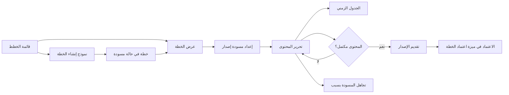
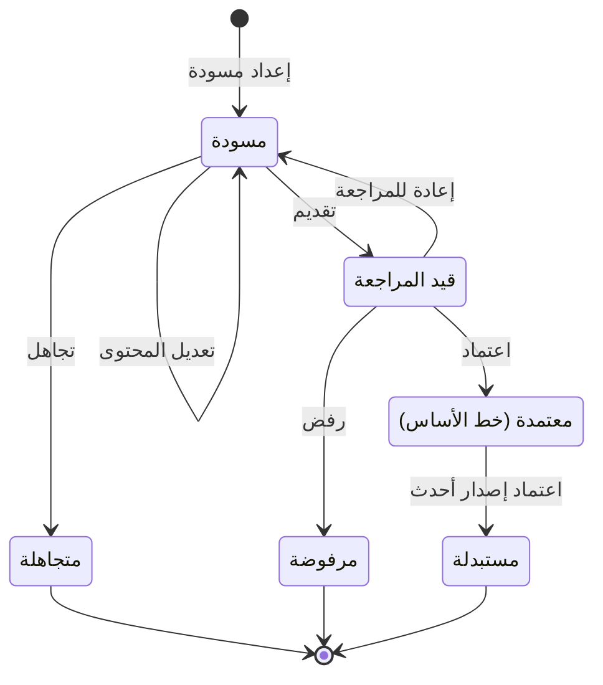

# إعداد الخطة

<!-- BEGIN GENERATED: doc -->
| البند | القيمة |
|---|---|
| المعرّف | FEAT-OPS-PLAN-AUTHORING |
| الإصدار | 0.1 |
| الحالة | مسودة |
| القدرة | CAP-07 التخطيط والتنفيذ |
| القدرة الفرعية | CAP-07.01 الأهداف والتخطيط (R1) |
| الأدوار | المخطِّط؛ مالك الخطة |
| الشاشات | SCR-34 الخطة ونسخها |
| حالات الاستخدام | UC-033 |
| القصص | 11: 6 من المواصفة، و5 جديدة |
<!-- END GENERATED: doc -->

## 1. نظرة عامة

### 1.1 القيمة

يصوغ المخطط خطة بأهدافها ومراحلها وأنشطتها ومواردها وجدولها، ثم يقدمها للاعتماد.

### 1.2 النطاق

| البند | القيمة |
|---|---|
| المستخدمون | المخطِّط ومالك الخطة يعدّانها، وأي مستخدم مخوَّل يقرؤها |
| الشاشات | SCR-34 الخطة ونسخها: قائمة الخطط، ونموذج الإنشاء، ومحرر المحتوى، والجدول الزمني |
| حالات الاستخدام | إنشاء الخطة (UC-033) |
| المتطلبات | تسجيل مكونات الخطة كلها: الأهداف والنتائج والقيود والافتراضات والمراحل والأنشطة والمعالم والموارد والجدول والاعتماديات والمقاييس (REQ-OPS-001)؛ وربط الخطة بالقرارات أو الأهداف التي تنفذها (REQ-OPS-002) |
| خارج النطاق | اعتماد الإصدار وإعادته ورفضه ومزامنة المهام بعده (FEAT-OPS-PLAN-APPROVAL)؛ تعليق الخطة وإكمالها وإغلاقها وإلغاؤها وإعادة تصنيفها (FEAT-OPS-PLAN-LIFECYCLE)؛ التعديل الطفيف على خط الأساس والفرق عنه (FEAT-OPS-PLAN-VERSIONS) |

### 1.3 خريطة الميزة

يبدأ المخطط من قائمة الخطط أو من نموذج الإنشاء، ثم يعدّ مسودة إصدار ويكتب محتواها حتى تكتمل، ثم يقدّمها للاعتماد (الشكل 1). ويمر إصدار الخطة بالحالات في الشكل 2: الإعداد والتعديل والتقديم والتجاهل في هذه الميزة، والباقي في ميزة اعتماد الخطة.

**الشكل 1: خريطة إعداد الخطة**



**الشكل 2: رحلة إصدار الخطة**



## 2. القواعد المشتركة

تنطبق على كل قصص الميزة، فلا تتكرر داخل القصص. وكل قصة تذكر ما يخصها فقط.

### 2.1 السياق المشترك

كل قصة تبدأ من ثلاثة شروط: مستأجر نشط، وحزمة السياسات الأساسية مفعّلة، ومستخدم مسجّل الدخول ومخوَّل. وتشير إليها القصص بخطوة واحدة: «بفرض السياق المشترك للميزة».

### 2.2 الصلاحية وعدم الإفصاح

- من لا يحق له رؤية العنصر يتلقى ردًا بشكل «غير متاح» تمامًا، فلا يعرف أنه موجود.
- من يرى العنصر ولا يحق له الإجراء يتلقى «لا تملك صلاحية هذا الإجراء».

### 2.3 أوامر تغيير الحالة

- **منع التكرار:** يُرسل كل أمر بمفتاح فريد، فإعادة الطلب نفسه لا تُنفَّذ مرتين.
- **حماية التعديل المتزامن:** يُرسل كل أمر بإصدار البيانات الذي يراه المستخدم. فإن عدّلها غيره في الأثناء، يُرفض الأمر.
- **السجل:** إن نجح الأمر، يُكتب حدثه وسجل التدقيق في المعاملة نفسها.

### 2.4 الرفض المشترك

```gherkin
# language: ar
خاصية: الرفض المشترك لأوامر الميزة

  سيناريو مخطط: رفض مشترك لكل أمر في الميزة
    بفرض السياق المشترك للميزة
    و <الحالة>
    عندما يُرسل المستخدم أي أمر من أوامر الميزة
    اذاً يُرفض برمز <الرمز> ويرى "<الرسالة>"
    و لا يتغير شيء

    امثلة:
      | الحالة                                  | الرمز                  | الرسالة                                                 |
      | العنصر خارج صلاحياته                    | NOT_FOUND              | غير متاح                                                |
      | العنصر مرئي له ولا يحق له الإجراء       | AUTHZ_DENIED           | لا تملك صلاحية هذا الإجراء                              |
      | غيره عدّل العنصر بعد أن فتحه            | VERSION_CONFLICT       | تغيّرت البيانات منذ فتحتها. راجع التغييرات ثم أعد المحاولة |
      | أعاد مفتاح منع التكرار بمحتوى مختلف     | IDEMPOTENCY_KEY_REUSED | طلب مكرر بمحتوى مختلف                                   |
      | البيانات ناقصة أو غير صحيحة             | VALIDATION_FAILED      | بعض البيانات ناقصة أو غير صحيحة. راجع الحقول المعلَّمة      |

  سيناريو: إعادة الطلب نفسه لا تُنفَّذ مرتين
    بفرض السياق المشترك للميزة
    و أمر نجح بمفتاح منع تكرار
    عندما يُعاد الطلب نفسه بالمفتاح نفسه
    اذاً تُعاد النتيجة الأولى ولا يُكتب حدث ثانٍ
```

### 2.5 الخطة وإصداراتها

- **الخطة هوية بلا محتوى:** عنوانها ومالكها ونطاقها ونوعها وفترتها وتصنيفها وما تنفذه. والمحتوى كله في إصداراتها.
- **مسودة واحدة:** لكل خطة مسودة واحدة على الأكثر أو إصدار واحد قيد المراجعة.
- **تجميد المحتوى:** المحتوى يُعدَّل في المسودة فقط، ويتجمد من لحظة التقديم. ومحتوى خط الأساس لا يتغير أبدًا (REQ-OPS-003).
- **معرّفات ثابتة:** معرّف النشاط ثابت من إصدار إلى آخر، فيُعرف ما أُضيف وما حُذف وما تغيّر.

## 3. الجودة وتعريف الاكتمال

### 3.1 متطلبات الجودة

<!-- BEGIN GENERATED: quality -->
لا متطلبات جودة مرتبطة بمتطلبات هذه الميزة مباشرة. تنطبق متطلبات المنصة العامة (`FEAT-PLT-*`).
<!-- END GENERATED: quality -->

### 3.2 تعريف الاكتمال

القصة مكتملة حين تتحقق الشروط الخمسة:

1. سيناريوهاتها والقواعد المشتركة تمر في الاختبار الآلي.
2. فحوص البنية المعمارية تمر.
3. نصوص الواجهة والرسائل موجودة بالعربية والإنجليزية.
4. مراجعة الكود مكتملة.
5. ما تضيفه القصة نفسها في قسم «القواعد» تحقق.

## 4. فهرس القصص

<!-- BEGIN GENERATED: story-index -->
| المعرّف | القصة | النوع | الحالة |
|---|---|---|---|
| `US-BC04-PLN-CREATE` | إنشاء الخطة | أمر | مسودة |
| `US-BC04-PLV-DISCARD` | تجاهل مسودة إصدار الخطة | أمر | مسودة |
| `US-BC04-PLV-DRAFT` | إعداد مسودة إصدار الخطة | أمر | مسودة |
| `US-BC04-PLV-EDIT` | تعديل إصدار الخطة | أمر | مسودة |
| `US-BC04-PLV-SUBMIT` | تقديم إصدار الخطة | أمر | مسودة |
| `US-BC04-Q-PLN-GET` | جلب: Plan with current baseline, draft (if any), implemented decisions | جلب | مسودة |
| `US-DOM-OPS-PLAN-LIST` | قائمة الخطط المرئية حسب الحالة والنوع | جلب | مسودة |
| `US-UI-SCR34-CREATE-FORM` | إنشاء خطة مرتبطة بقرار أو هدف | واجهة | مسودة |
| `US-UI-SCR34-EDITOR` | تحرير محتوى الخطة وفحص اكتماله قبل التقديم | واجهة | مسودة |
| `US-UI-SCR34-PLAN-LIST` | تصفح الخطط وتصفيتها حسب الحالة والنوع | واجهة | مسودة |
| `US-UI-SCR34-TIMELINE` | الجدول الزمني للمراحل والأنشطة والمعالم | واجهة | مسودة |
<!-- END GENERATED: story-index -->

## 5. القصص

### 5.1 US-BC04-PLN-CREATE — إنشاء الخطة

| النوع | الإصدار | الأولوية | دون اتصال | الحالة |
|---|---|---|---|---|
| أمر | R1 | Must | لا | مسودة |

> **كـ** المخطِّط، **أريد** أن أنشئ خطة مرتبطة بالقرار أو الهدف الذي تنفذه، **حتى** يكون لكل عمل مخطط أساس معروف يُحاسَب عليه.

**باختصار:** ينشئ المخطط هوية الخطة، فتنشأ في حالة «مسودة» بلا محتوى. ويُكتب محتواها في إصدار لاحق (§2.5).

#### القواعد

- **متى يُسمح:** في أي وقت، بشرط أن تنفذ الخطة قرارًا مسجَّلًا أو هدفًا واحدًا على الأقل (REQ-OPS-002). وخطة الطوارئ تحتاج بدلًا من ذلك خطرًا أو حادثة تطلقها.
- **من يُسمح له:** المخطِّط داخل نطاقه في المؤسسة.
- **البيانات:** العنوان، والمالك، والنطاق في المؤسسة، والنوع (عمليات أو طوارئ)، وفترة الخطة، والتصنيف: كلها إلزامية. ثم ما تنفذه الخطة، ومرجع الإطلاق لخطة الطوارئ فقط. والنوع لا يتغير بعد الإنشاء. وتصنيف الخطة لا يقل عن تصنيف القرارات التي تنفذها، أو تصنيف نطاق الإطلاق.
- **الأثر:** الخطة «مسودة»، ويُسجَّل حدث «أُنشئت الخطة» ويصل إشعاره إلى المالكين. وتصير «نشطة» تلقائيًا حين يُعتمد أول إصدار لها.

#### معايير القبول

```gherkin
# language: ar
خاصية: إنشاء الخطة

  سيناريو: المخطط ينشئ خطة تنفذ قرارًا مسجَّلًا
    بفرض السياق المشترك للميزة
    و قرار مسجَّل داخل نطاق المخطط
    عندما ينشئ خطة عمليات بعنوان ومالك ونطاق وفترة وتصنيف، تنفذ ذلك القرار
    اذاً تنشأ الخطة في حالة "مسودة" دون محتوى
    و يُسجَّل حدث "أُنشئت الخطة"

  سيناريو مخطط: رفض خاص بإنشاء الخطة
    بفرض السياق المشترك للميزة
    و <الحالة>
    عندما يحاول إنشاء الخطة
    اذاً يُرفض برمز <الرمز> ويرى "<الرسالة>"
    و لا تنشأ خطة

    امثلة:
      | الحالة                                      | الرمز             | الرسالة                 |
      | الخطة لا تنفذ أي قرار مسجَّل أو هدف          | PLAN_INVALID      | بيانات الخطة غير مكتملة |
      | خطة طوارئ بلا خطر أو حادثة تطلقها            | PLAN_INVALID      | بيانات الخطة غير مكتملة |
      | تصنيف الخطة أقل من تصنيف القرار الذي تنفذه   | PLAN_INVALID      | بيانات الخطة غير مكتملة |
      | العنوان فارغ                                 | VALIDATION_FAILED | العنوان مطلوب           |
      | فترة الخطة غائبة                             | VALIDATION_FAILED | فترة الخطة مطلوبة       |
      | التصنيف غائب                                 | VALIDATION_FAILED | التصنيف مطلوب           |
```

<details><summary>المراجع التقنية والتتبع</summary>

<!-- BEGIN GENERATED: refs US-BC04-PLN-CREATE -->
| البند | المعرّف | المعنى |
|---|---|---|
| الواجهة البرمجية | `POST /api/v1/operations/plans` | — |
| الأمر | `CMD-PLN-CREATE` | إنشاء الخطة |
| السياسة | `POL-PLN-CREATE` | Planner / owner (create, suspend, resume, complete, close) · authority (cancel) · Security Officer (reclassif… |
| الحدث | `EVT-PLN-CREATED` | يصل إلى: Task synchronizer (suspend/cancel cascades); Outcome trackers (close); Notification (owners, assigne… |
| الكيان | `AGG-PLAN` | الخطة |
| الجدول | `operations.plans` | الجدول الرئيسي للخطة |
| وحدة النشر | DU-08 | — |
| المتطلبات | REQ-OPS-001، REQ-OPS-002 | معانيها في القسم 6. التتبع |
| حالة الاستخدام | UC-033 | Create Plan |
| الاختبار | TST-PLAN-SM، TST-SLC08-INVARIANTS | دورة حالات الخطة، وثوابت الشريحة SLC-08 |
<!-- END GENERATED: refs US-BC04-PLN-CREATE -->

</details>

### 5.2 US-BC04-PLV-DISCARD — تجاهل مسودة إصدار الخطة

| النوع | الإصدار | الأولوية | دون اتصال | الحالة |
|---|---|---|---|---|
| أمر | R1 | Must | لا | مسودة |

> **كـ** المخطِّط، **أريد** أن أتجاهل مسودة إصدار لم أعد أحتاجها مع ذكر السبب، **حتى** أبدأ مسودة جديدة ويبقى أثر القديمة محفوظًا.

**باختصار:** كاتب المسودة يتجاهلها بسبب مكتوب، فتصير «متجاهلة» نهائيًا. وبعدها يمكن إعداد مسودة أخرى للخطة (§2.5).

#### القواعد

- **متى يُسمح:** الإصدار في حالة «مسودة» فقط. فالإصدار المقدَّم أو المعتمد لا يُتجاهل.
- **من يُسمح له:** المخطِّط الذي كتب المسودة. **[Needs Review]**: المصادر لا تذكر رمز رفض خاصًا بغير الكاتب، فيقع تحت الرفض المشترك.
- **البيانات:** السبب (إلزامي).
- **الأثر:** الإصدار «متجاهل»، وهي حالة نهائية لا يُقبل بعدها تغيير، ويبقى في سجل نسخ الخطة. ويُسجَّل حدث «تُجوهلت مسودة إصدار الخطة».

#### معايير القبول

```gherkin
# language: ar
خاصية: تجاهل مسودة إصدار الخطة

  سيناريو: الكاتب يتجاهل مسودته بسبب
    بفرض السياق المشترك للميزة
    و إصدار للخطة في حالة "مسودة" كتبه المستخدم
    عندما يتجاهله ويذكر السبب
    اذاً تصبح حالة الإصدار "متجاهلة"
    و يُسجَّل حدث "تُجوهلت مسودة إصدار الخطة"
    و يصبح ممكنًا إعداد مسودة جديدة للخطة

  سيناريو مخطط: رفض خاص بتجاهل المسودة
    بفرض السياق المشترك للميزة
    و <الحالة>
    عندما يحاول تجاهل الإصدار
    اذاً يُرفض برمز <الرمز> ويرى "<الرسالة>"
    و لا يتغير شيء

    امثلة:
      | الحالة                                  | الرمز                                 | الرسالة                                        |
      | الإصدار قيد المراجعة أو معتمد أو منتهٍ  | PLAN_VERSION_INVALID_STATE_TRANSITION | الوضع الحالي لإصدار الخطة لا يسمح بهذا الإجراء |
      | السبب فارغ                              | REASON_REQUIRED                       | اذكر السبب                                     |
```

<details><summary>المراجع التقنية والتتبع</summary>

<!-- BEGIN GENERATED: refs US-BC04-PLV-DISCARD -->
| البند | المعرّف | المعنى |
|---|---|---|
| الواجهة البرمجية | `POST /api/v1/operations/plan-versions/{id}/actions/discard` | — |
| الأمر | `CMD-PLV-DISCARD` | تجاهل مسودة إصدار الخطة |
| السياسة | `POL-PLV-DISCARD` | Planner (draft, edit, submit, discard, minor amend) · approver with plan-approval authority ≠ author (approve… |
| الحدث | `EVT-PLV-DISCARDED` | يصل إلى: Task synchronizer (SPEC-PLAN §3); Outcome trackers; Plan identity (activation); Search projection (S… |
| الكيان | `AGG-PLAN-VERSION` | إصدار الخطة |
| الجدول | `operations.plan_versions` | الجدول الرئيسي لإصدار الخطة |
| وحدة النشر | DU-08 | — |
| المتطلب | REQ-OPS-001 | The system shall record for each plan its objectives, outcomes, constraints, assumptions, phases, activities,… |
| حالة الاستخدام | UC-033 | Create Plan |
| الاختبار | TST-PLAN-VERSION-SM، TST-SLC08-INVARIANTS | دورة حالات إصدار الخطة، وثوابت الشريحة SLC-08 |
<!-- END GENERATED: refs US-BC04-PLV-DISCARD -->

</details>

### 5.3 US-BC04-PLV-DRAFT — إعداد مسودة إصدار الخطة

| النوع | الإصدار | الأولوية | دون اتصال | الحالة |
|---|---|---|---|---|
| أمر | R1 | Must | لا | مسودة |

> **كـ** المخطِّط، **أريد** أن أفتح مسودة إصدار للخطة، فارغة أو منسوخة من خط الأساس، **حتى** أكتب محتوى الخطة أو أراجعه دون المساس بالمعتمد.

**باختصار:** تُفتح مسودة إصدار جديدة للخطة. فإن بُنيت على خط الأساس، نُسخ محتواه إليها بمعرّفات الأنشطة نفسها.

#### القواعد

- **متى يُسمح:** الخطة ليست «مغلقة» ولا «ملغاة»، وليس لها مسودة أو إصدار قيد المراجعة (§2.5).
- **من يُسمح له:** المخطِّط داخل نطاق الخطة.
- **البيانات:** الخطة (إلزامية)، والإصدار الذي تُبنى عليه (اختياري، للمراجعة على خط الأساس).
- **الأثر:** إصدار جديد في حالة «مسودة» كاتبه المستخدم، ويُسجَّل حدث «أُعدّت مسودة إصدار الخطة». وخط الأساس الحالي يبقى ساريًا حتى يُعتمد إصدار أحدث.

> **ملاحظة:** رفض المسودة لخطة مغلقة أو ملغاة شرط في المصدر بلا رمز خطأ خاص به **[Needs Review]**، فلا يظهر في جدول الرفض.

#### معايير القبول

```gherkin
# language: ar
خاصية: إعداد مسودة إصدار الخطة

  سيناريو: مسودة مراجعة منسوخة من خط الأساس
    بفرض السياق المشترك للميزة
    و خطة نشطة لها خط أساس وليس لها مسودة
    عندما يعدّ المخطط مسودة إصدار مبنية على خط الأساس
    اذاً ينشأ إصدار في حالة "مسودة" بمحتوى خط الأساس ومعرّفات أنشطته نفسها
    و يبقى خط الأساس كما هو
    و يُسجَّل حدث "أُعدّت مسودة إصدار الخطة"

  سيناريو مخطط: رفض خاص بإعداد المسودة
    بفرض السياق المشترك للميزة
    و <الحالة>
    عندما يحاول إعداد مسودة إصدار
    اذاً يُرفض برمز <الرمز> ويرى "<الرسالة>"
    و لا ينشأ إصدار

    امثلة:
      | الحالة                         | الرمز             | الرسالة                       |
      | للخطة مسودة لم تُحسم           | DRAFT_EXISTS      | توجد مسودة قائمة لم تُحسم بعد |
      | للخطة إصدار قيد المراجعة       | DRAFT_EXISTS      | توجد مسودة قائمة لم تُحسم بعد |
      | الخطة غير محددة في الطلب       | VALIDATION_FAILED | الخطة مطلوبة                  |
```

<details><summary>المراجع التقنية والتتبع</summary>

<!-- BEGIN GENERATED: refs US-BC04-PLV-DRAFT -->
| البند | المعرّف | المعنى |
|---|---|---|
| الواجهة البرمجية | `POST /api/v1/operations/plan-versions` | — |
| الأمر | `CMD-PLV-DRAFT` | إعداد مسودة إصدار الخطة |
| السياسة | `POL-PLV-DRAFT` | Planner (draft, edit, submit, discard, minor amend) · approver with plan-approval authority ≠ author (approve… |
| الحدث | `EVT-PLV-DRAFTED` | يصل إلى: Task synchronizer (SPEC-PLAN §3); Outcome trackers; Plan identity (activation); Search projection (S… |
| الكيان | `AGG-PLAN-VERSION` | إصدار الخطة |
| الجدول | `operations.plan_versions` | الجدول الرئيسي لإصدار الخطة |
| وحدة النشر | DU-08 | — |
| المتطلب | REQ-OPS-001 | The system shall record for each plan its objectives, outcomes, constraints, assumptions, phases, activities,… |
| حالة الاستخدام | UC-033 | Create Plan |
| الاختبار | TST-PLAN-VERSION-SM، TST-SLC08-INVARIANTS | دورة حالات إصدار الخطة، وثوابت الشريحة SLC-08 |
<!-- END GENERATED: refs US-BC04-PLV-DRAFT -->

</details>

### 5.4 US-BC04-PLV-EDIT — تعديل محتوى مسودة إصدار الخطة

| النوع | الإصدار | الأولوية | دون اتصال | الحالة |
|---|---|---|---|---|
| أمر | R1 | Must | لا | مسودة |

> **كـ** المخطِّط، **أريد** أن أكتب محتوى الخطة في المسودة وأحفظه، **حتى** تكتمل الخطة بكل مكوناتها قبل تقديمها.

**باختصار:** يحفظ المخطط محتوى المسودة، فيتحقق النظام من سلامته عند كل حفظ، وتبقى الحالة «مسودة».

#### القواعد

- **متى يُسمح:** الإصدار في حالة «مسودة». ومن التقديم فصاعدًا لا يُعدَّل المحتوى (§2.5).
- **من يُسمح له:** المخطِّط داخل نطاق الخطة.
- **البيانات:** إلزامية: الأهداف، والنتائج (لكل منها مقياس ووحدة وقيمة مستهدفة وموعد)، والمراحل، والأنشطة (لكل منها معرّف ثابت، وهل تولّد مهام، ونوع المهمة). واختيارية: القيود، والافتراضات، والمعالم، والاعتماديات، وملاحظات الموارد (نص في R1). وكل التواريخ داخل فترة الخطة، والاعتماديات بلا دوائر.
- **الأثر:** يُحفظ المحتوى ويزيد إصدار البيانات بواحد، ويُسجَّل حدث «عُدّل إصدار الخطة».

#### معايير القبول

```gherkin
# language: ar
خاصية: تعديل محتوى مسودة إصدار الخطة

  سيناريو: حفظ محتوى صحيح في المسودة
    بفرض السياق المشترك للميزة
    و إصدار للخطة في حالة "مسودة"
    عندما يحفظ المخطط أهدافًا ونتائج ومراحل وأنشطة تقع تواريخها داخل فترة الخطة
    اذاً يُحفظ المحتوى وتبقى الحالة "مسودة"
    و يُسجَّل حدث "عُدّل إصدار الخطة"

  سيناريو مخطط: رفض خاص بتعديل المحتوى
    بفرض السياق المشترك للميزة
    و <الحالة>
    عندما يحاول حفظ المحتوى
    اذاً يُرفض برمز <الرمز> ويرى "<الرسالة>"
    و يبقى المحتوى المحفوظ كما كان

    امثلة:
      | الحالة                              | الرمز                                 | الرسالة                                        |
      | نشاط أو معلم خارج فترة الخطة        | PLAN_VERSION_INVALID                  | بيانات إصدار الخطة غير صحيحة                   |
      | الاعتماديات تكوّن دائرة             | PLAN_VERSION_INVALID                  | بيانات إصدار الخطة غير صحيحة                   |
      | نتيجة بلا مقياس أو قيمة مستهدفة     | PLAN_VERSION_INVALID                  | بيانات إصدار الخطة غير صحيحة                   |
      | الإصدار قيد المراجعة أو معتمد       | PLAN_VERSION_INVALID_STATE_TRANSITION | الوضع الحالي لإصدار الخطة لا يسمح بهذا الإجراء |
      | الأهداف غائبة                       | VALIDATION_FAILED                     | الأهداف مطلوبة                                 |
      | الأنشطة غائبة                       | VALIDATION_FAILED                     | الأنشطة مطلوبة                                 |
```

<details><summary>المراجع التقنية والتتبع</summary>

<!-- BEGIN GENERATED: refs US-BC04-PLV-EDIT -->
| البند | المعرّف | المعنى |
|---|---|---|
| الواجهة البرمجية | `POST /api/v1/operations/plan-versions/{id}/actions/edit` | — |
| الأمر | `CMD-PLV-EDIT` | تعديل إصدار الخطة |
| السياسة | `POL-PLV-EDIT` | Planner (draft, edit, submit, discard, minor amend) · approver with plan-approval authority ≠ author (approve… |
| الحدث | `EVT-PLV-EDITED` | يصل إلى: Task synchronizer (SPEC-PLAN §3); Outcome trackers; Plan identity (activation); Search projection (S… |
| الكيان | `AGG-PLAN-VERSION` | إصدار الخطة |
| الجدول | `operations.plan_versions` | الجدول الرئيسي لإصدار الخطة |
| وحدة النشر | DU-08 | — |
| المتطلب | REQ-OPS-001 | The system shall record for each plan its objectives, outcomes, constraints, assumptions, phases, activities,… |
| حالة الاستخدام | UC-033 | Create Plan |
| الاختبار | TST-PLAN-VERSION-SM، TST-SLC08-INVARIANTS | دورة حالات إصدار الخطة، وثوابت الشريحة SLC-08 |
<!-- END GENERATED: refs US-BC04-PLV-EDIT -->

</details>

### 5.5 US-BC04-PLV-SUBMIT — تقديم إصدار الخطة للاعتماد

| النوع | الإصدار | الأولوية | دون اتصال | الحالة |
|---|---|---|---|---|
| أمر | R1 | Must | لا | مسودة |

> **كـ** المخطِّط، **أريد** أن أقدّم المسودة المكتملة للاعتماد، **حتى** يراجعها صاحب سلطة الاعتماد فتصير خط الأساس.

**باختصار:** يتحقق النظام من اكتمال المحتوى، ويحسب تصنيف التغيير عن خط الأساس الحالي إن وُجد (جوهري أو طفيف). ثم يصير الإصدار «قيد المراجعة» ويتجمد محتواه.

#### القواعد

- **متى يُسمح:** الإصدار في حالة «مسودة»، وفيه أهداف ونتائج على الأقل (REQ-OPS-001).
- **من يُسمح له:** المخطِّط داخل نطاق الخطة. ولا يعتمد الإصدار من كتبه (REQ-OPS-005)، والاعتماد في ميزة اعتماد الخطة.
- **البيانات:** لا مدخلات.
- **الأثر:** الإصدار «قيد المراجعة» ولا يقبل محتواه أي تعديل (§2.5). ويُحفظ معه تصنيف التغيير، ويُسجَّل حدث «قُدّم إصدار الخطة».

#### معايير القبول

```gherkin
# language: ar
خاصية: تقديم إصدار الخطة للاعتماد

  سيناريو: تقديم مسودة مكتملة
    بفرض السياق المشترك للميزة
    و إصدار للخطة في حالة "مسودة" فيه أهداف ونتائج ومراحل وأنشطة
    عندما يقدّمه المخطط للاعتماد
    اذاً تصبح حالته "قيد المراجعة" ولا يقبل محتواه أي تعديل
    و يُحفظ معه تصنيف التغيير عن خط الأساس الحالي
    و يُسجَّل حدث "قُدّم إصدار الخطة"

  سيناريو مخطط: رفض خاص بالتقديم
    بفرض السياق المشترك للميزة
    و <الحالة>
    عندما يحاول تقديم الإصدار
    اذاً يُرفض برمز <الرمز> ويرى "<الرسالة>"
    و يبقى الإصدار كما كان

    امثلة:
      | الحالة                          | الرمز                                 | الرسالة                                        |
      | المسودة بلا أهداف أو بلا نتائج  | PLAN_VERSION_INCOMPLETE               | إصدار الخطة غير مكتمل                          |
      | الإصدار ليس في حالة مسودة       | PLAN_VERSION_INVALID_STATE_TRANSITION | الوضع الحالي لإصدار الخطة لا يسمح بهذا الإجراء |
```

<details><summary>المراجع التقنية والتتبع</summary>

<!-- BEGIN GENERATED: refs US-BC04-PLV-SUBMIT -->
| البند | المعرّف | المعنى |
|---|---|---|
| الواجهة البرمجية | `POST /api/v1/operations/plan-versions/{id}/actions/submit` | — |
| الأمر | `CMD-PLV-SUBMIT` | تقديم إصدار الخطة |
| السياسة | `POL-PLV-SUBMIT` | Planner (draft, edit, submit, discard, minor amend) · approver with plan-approval authority ≠ author (approve… |
| الحدث | `EVT-PLV-SUBMITTED` | يصل إلى: Task synchronizer (SPEC-PLAN §3); Outcome trackers; Plan identity (activation); Search projection (S… |
| الكيان | `AGG-PLAN-VERSION` | إصدار الخطة |
| الجدول | `operations.plan_versions` | الجدول الرئيسي لإصدار الخطة |
| وحدة النشر | DU-08 | — |
| المتطلب | REQ-OPS-001 | The system shall record for each plan its objectives, outcomes, constraints, assumptions, phases, activities,… |
| حالة الاستخدام | UC-033 | Create Plan |
| الاختبار | TST-PLAN-VERSION-SM، TST-SLC08-INVARIANTS | دورة حالات إصدار الخطة، وثوابت الشريحة SLC-08 |
<!-- END GENERATED: refs US-BC04-PLV-SUBMIT -->

</details>

### 5.6 US-BC04-Q-PLN-GET — عرض الخطة بخط أساسها ومسودتها والقرارات التي تنفذها

| النوع | الإصدار | الأولوية | دون اتصال | الحالة |
|---|---|---|---|---|
| جلب | R1 | Must | لا | مسودة |

> **كـ** أي مستخدم مخوَّل، **أريد** أن أفتح الخطة فأرى خط أساسها ومسودتها والقرارات التي تنفذها، **حتى** أعرف ما المعتمد وما يجري إعداده.

**باختصار:** تُعرض بيانات الخطة وحالتها، ومحتوى خط الأساس الحالي، والمسودة إن وُجدت، والقرارات التي تنفذها، كما هي الآن.

#### القواعد

- **من يرى ماذا:** من يقع تصنيف الخطة ضمن تصريحه ونطاقه. وتُفحص الصلاحية مرة أخرى بعد تحميل الخطة. ومن لا يحق له يرى «غير متاح» كأنها غير موجودة.
- **البيانات:** معرّف الخطة فقط.

#### معايير القبول

```gherkin
# language: ar
خاصية: عرض الخطة بخط أساسها ومسودتها والقرارات التي تنفذها

  سيناريو: خطة نشطة لها خط أساس ومسودة
    بفرض السياق المشترك للميزة
    و خطة نشطة مرئية للمستخدم لها خط أساس ومسودة مراجعة
    عندما يفتح الخطة
    اذاً يرى بياناتها وحالتها ومحتوى خط الأساس والمسودة والقرارات التي تنفذها

  سيناريو: خطة لم يُعتمد لها إصدار بعد
    بفرض السياق المشترك للميزة
    و خطة في حالة "مسودة" لم يُعتمد لها أي إصدار
    عندما يفتح الخطة
    اذاً تظهر بلا خط أساس، ومعها مسودتها إن وُجدت
```

<details><summary>المراجع التقنية والتتبع</summary>

<!-- BEGIN GENERATED: refs US-BC04-Q-PLN-GET -->
| البند | المعرّف | المعنى |
|---|---|---|
| الواجهة البرمجية | `GET /api/v1/operations/plans/{plan_id}` | — |
| الاستعلام | `QRY-PLN-GET` | Plan with current baseline, draft (if any), implemented decisions |
| السياسة | `POL-PLN-GET` | label rule |
| الكيان | `AGG-PLAN` | الخطة |
| الجدول | `operations.plans` | الجدول الرئيسي للخطة |
| وحدة النشر | DU-08 | — |
| المتطلب | REQ-OPS-001 | The system shall record for each plan its objectives, outcomes, constraints, assumptions, phases, activities,… |
| حالة الاستخدام | UC-033 | Create Plan |
| الاختبار | TST-PLAN-SM، TST-SLC08-INVARIANTS | دورة حالات الخطة، وثوابت الشريحة SLC-08 |
<!-- END GENERATED: refs US-BC04-Q-PLN-GET -->

</details>

### 5.7 US-DOM-OPS-PLAN-LIST — قائمة الخطط المرئية حسب الحالة والنوع

| النوع | الإصدار | الأولوية | دون اتصال | الحالة |
|---|---|---|---|---|
| جلب | R1 | Must | لا | مسودة |

> **كـ** المخطِّط، **أريد** قائمة بالخطط التي يحق لي رؤيتها مصفاة بالحالة والنوع، **حتى** أصل إلى الخطة التي أعمل عليها.

**باختصار:** تُعاد الخطط المرئية للمستخدم فقط، صفحة بعد صفحة، مصفاة بالحالة ونوع الخطة.

#### القواعد

- **من يرى ماذا:** الخطط التي يقع تصنيفها ضمن تصريحه ونطاقه فقط. ولا يكشف أي عدد أو اقتراح وجود خطة محجوبة.
- **البيانات:** الحالة، ونوع الخطة (عمليات أو طوارئ)، والمؤشر، وحجم الصفحة حتى 200 (50 افتراضيًا، كبقية قوائم الشريحة).

> **ملاحظة:** القصة كلها **[Derived]**: المواصفة لا تعرّف استعلامًا لقائمة الخطط، والشاشة SCR-34 تحتاجه. وهي مسجلة في `00-open-questions.md` §5 حتى يُضاف الاستعلام.

#### معايير القبول

```gherkin
# language: ar
خاصية: قائمة الخطط المرئية حسب الحالة والنوع

  سيناريو: قائمة مصفاة بالحالة والنوع
    بفرض السياق المشترك للميزة
    و خطط نشطة داخل نطاق المستخدم وأخرى خارجه
    عندما يطلب الخطط النشطة من نوع العمليات
    اذاً تُعاد الخطط النشطة من هذا النوع داخل نطاقه فقط
    و لا يكشف أي عدد أو اقتراح وجود خطة محجوبة

  سيناريو: الصفحة التالية
    بفرض السياق المشترك للميزة
    و الخطط المرئية له أكثر من صفحة
    عندما يطلب الصفحة التالية بالمؤشر
    اذاً تُعاد الخطط التالية دون تكرار ولا فجوة
```

<details><summary>المراجع التقنية والتتبع</summary>

<!-- BEGIN GENERATED: refs US-DOM-OPS-PLAN-LIST -->
| البند | المعرّف | المعنى |
|---|---|---|
| حالة الاستخدام | UC-033 | Create Plan |
| الشاشة | SCR-34 | شاشة الخطة ونسخها |
| المصدر | `[Derived]` | — |
| المتطلب | REQ-OPS-001 | The system shall record for each plan its objectives, outcomes, constraints, assumptions, phases, activities,… |
| حالة الاستخدام | UC-033 | Create Plan |
<!-- END GENERATED: refs US-DOM-OPS-PLAN-LIST -->

</details>

### 5.8 US-UI-SCR34-CREATE-FORM — نموذج إنشاء خطة مرتبطة بقرار أو هدف

| النوع | الإصدار | الأولوية | دون اتصال | الحالة |
|---|---|---|---|---|
| واجهة | R1 | Must | لا | مسودة |

> **كـ** المخطِّط، **أريد** نموذجًا يقودني إلى ربط الخطة بقرار أو هدف قبل إنشائها، **حتى** لا أنشئ خطة بلا أساس فيرفضها النظام.

**باختصار:** يطلب النموذج الحقول الإلزامية والتصنيف، ويتغير ما يطلبه بحسب نوع الخطة. وبعد النجاح تُفتح صفحة الخطة الجديدة.

#### القواعد

- الحقول الإلزامية: العنوان، والمالك، والنطاق، والنوع، والفترة، والتصنيف. والتصنيف إلزامي في كل نموذج إنشاء (REQ-GOV-002).
- خطة العمليات: يختار المخطط قرارًا مسجَّلًا أو هدفًا واحدًا على الأقل. وخطة الطوارئ: يختار خطرًا أو حادثة تطلقها، وهذا الحقل لا يظهر لخطة العمليات.
- قائمة الاختيار تعرض القرارات والأهداف المرئية للمستخدم فقط **[Derived]**.
- ينبّه النموذج إلى أن نوع الخطة لا يتغير بعد الإنشاء **[Derived]**.
- يُرسل النموذج بمفتاح منع تكرار جديد لكل حمولة. وأخطاء الحقول تظهر على الحقول نفسها، ويبقى ما أدخله المستخدم عند الرفض.
- بعد النجاح تُفتح صفحة الخطة في حالة «مسودة»، ومعها دعوة لإعداد أول مسودة إصدار **[Derived]**.

#### معايير القبول

```gherkin
# language: ar
خاصية: نموذج إنشاء خطة مرتبطة بقرار أو هدف

  سيناريو: إنشاء خطة طوارئ من النموذج
    بفرض السياق المشترك للميزة
    و المخطط فتح نموذج إنشاء خطة
    عندما يختار النوع "طوارئ"
    اذاً يُطلب منه خطر أو حادثة تطلق الخطة بدل القرار أو الهدف
    عندما يكمل الحقول ويرسل النموذج
    اذاً تُفتح صفحة الخطة الجديدة في حالة "مسودة"

  سيناريو مخطط: رفض الخادم يظهر في النموذج
    بفرض السياق المشترك للميزة
    و <الحالة>
    عندما يرسل المخطط النموذج
    اذاً يُرفض برمز <الرمز> ويرى "<الرسالة>"
    و يبقى ما أدخله في النموذج

    امثلة:
      | الحالة                                | الرمز             | الرسالة                 |
      | لم يختر قرارًا ولا هدفًا لخطة عمليات  | PLAN_INVALID      | بيانات الخطة غير مكتملة |
      | ترك العنوان فارغًا                    | VALIDATION_FAILED | العنوان مطلوب           |
```

<details><summary>المراجع التقنية والتتبع</summary>

<!-- BEGIN GENERATED: refs US-UI-SCR34-CREATE-FORM -->
| البند | المعرّف | المعنى |
|---|---|---|
| الشاشة | SCR-34 | شاشة الخطة ونسخها |
| حالة الاستخدام | UC-033 | Create Plan |
| المصدر | `[Derived]` | — |
| المتطلب | REQ-OPS-002 | The system shall link every approved plan to the decisions or objectives it implements. |
| حالة الاستخدام | UC-033 | Create Plan |
<!-- END GENERATED: refs US-UI-SCR34-CREATE-FORM -->

</details>

### 5.9 US-UI-SCR34-EDITOR — محرر محتوى الخطة وفحص اكتماله قبل التقديم

| النوع | الإصدار | الأولوية | دون اتصال | الحالة |
|---|---|---|---|---|
| واجهة | R1 | Must | لا | مسودة |

> **كـ** المخطِّط، **أريد** محررًا لأقسام الخطة يبيّن ما ينقصها قبل التقديم، **حتى** أقدّم خطة مكتملة من أول مرة.

**باختصار:** يعرض المحرر أقسام المسودة ويحفظها، ويبيّن قبل التقديم ما ينقص. والحكم النهائي للخادم.

#### القواعد

- الأقسام: الأهداف، والنتائج، والقيود، والافتراضات، والمراحل، والأنشطة، والمعالم، والاعتماديات، وملاحظات الموارد (REQ-OPS-001).
- قائمة الاكتمال تعلّم الأقسام الإلزامية الناقصة، وتعطّل التقديم حتى توجد أهداف ونتائج **[Derived]**. وهي تلميح فقط، ورد الخادم هو الحكم.
- المسودة وحدها قابلة للتحرير. والإصدار المقدَّم أو المعتمد يُعرض للقراءة فقط (§2.5).
- يُرسل الحفظ بإصدار البيانات المعروض. فإن عدّلها غيره، تُعاد تحميلها ويُعرض ما تغيّر قبل إعادة الحفظ.
- تجاهل المسودة يفتح حقل سبب إلزاميًا.

#### معايير القبول

```gherkin
# language: ar
خاصية: محرر محتوى الخطة وفحص اكتماله قبل التقديم

  سيناريو: قائمة الاكتمال توقف التقديم حتى تكتمل النتائج
    بفرض السياق المشترك للميزة
    و مسودة إصدار فيها أهداف ومراحل وأنشطة وليس فيها نتائج
    عندما يفتح المخطط المحرر
    اذاً يرى قسم النتائج معلَّمًا "ناقص" وزر التقديم معطّلًا
    عندما يضيف نتيجة بمقياس ووحدة وقيمة مستهدفة وموعد ويحفظ
    اذاً يصبح زر التقديم متاحًا

  سيناريو: الإصدار المقدَّم للقراءة فقط
    بفرض السياق المشترك للميزة
    و إصدار للخطة في حالة "قيد المراجعة"
    عندما يفتحه المخطط في المحرر
    اذاً تظهر الأقسام للقراءة فقط دون أزرار حفظ أو تقديم

  سيناريو مخطط: رفض الخادم عند الحفظ أو التقديم
    بفرض السياق المشترك للميزة
    و <الحالة>
    عندما يرسل المخطط الحفظ أو التقديم
    اذاً يُرفض برمز <الرمز> ويرى "<الرسالة>"
    و يبقى المحرر مفتوحًا بما أدخله

    امثلة:
      | الحالة                          | الرمز                   | الرسالة                      |
      | نشاط خارج فترة الخطة            | PLAN_VERSION_INVALID    | بيانات إصدار الخطة غير صحيحة |
      | المحتوى غير مكتمل عند التقديم   | PLAN_VERSION_INCOMPLETE | إصدار الخطة غير مكتمل        |
```

<details><summary>المراجع التقنية والتتبع</summary>

<!-- BEGIN GENERATED: refs US-UI-SCR34-EDITOR -->
| البند | المعرّف | المعنى |
|---|---|---|
| الشاشة | SCR-34 | شاشة الخطة ونسخها |
| حالة الاستخدام | UC-033 | Create Plan |
| المصدر | `[Derived]` | — |
| المتطلب | REQ-OPS-001 | The system shall record for each plan its objectives, outcomes, constraints, assumptions, phases, activities,… |
| حالة الاستخدام | UC-033 | Create Plan |
<!-- END GENERATED: refs US-UI-SCR34-EDITOR -->

</details>

### 5.10 US-UI-SCR34-PLAN-LIST — تصفح الخطط وتصفيتها حسب الحالة والنوع

| النوع | الإصدار | الأولوية | دون اتصال | الحالة |
|---|---|---|---|---|
| واجهة | R1 | Should | لا | مسودة |

> **كـ** المخطِّط، **أريد** أن أتصفح الخطط وأصفيها بالحالة والنوع، **حتى** أجد الخطة بسرعة وأشارك رابط القائمة المصفاة.

**باختصار:** تعرض القائمة الخطط المرئية فقط، بترقيم بالمؤشر، والمرشحات في عنوان الصفحة. وتقوم على قائمة الخطط المرئية (§5.7).

#### القواعد

- كل صف: العنوان، وشارة الحالة، وشارة التصنيف، والنوع، والفترة، والمالك **[Derived]**.
- المرشحات (الحالة والنوع) تُحفظ في عنوان الصفحة فيُشارَك الرابط. ومن يفتح الرابط يرى ما تسمح به صلاحيته فقط.
- لا عدد إجمالي إلا ما يحسبه الخادم من المرئي، ولا رسالة عن خطط مخفية.
- زر «خطة جديدة» يظهر لمن يملك صلاحية الإنشاء. وهو تلميح، والحكم للخادم.
- تفتح صفحة القائمة خلال 1 ثانية عند المئين 95 (QAS-PERF-002).

#### معايير القبول

```gherkin
# language: ar
خاصية: تصفح الخطط وتصفيتها حسب الحالة والنوع

  سيناريو: تصفية القائمة ومشاركة الرابط
    بفرض السياق المشترك للميزة
    و خطط مرئية للمخطط في حالات وأنواع مختلفة
    عندما يختار الحالة "نشطة" والنوع "طوارئ"
    اذاً تظهر خطط الطوارئ النشطة المرئية له فقط
    و يحمل عنوان الصفحة المرشحين

  سيناريو: مستلم الرابط يرى ما يحق له فقط
    بفرض السياق المشترك للميزة
    و رابط قائمة مصفاة أرسله مخطط إلى زميل نطاقه أضيق
    عندما يفتح الزميل الرابط
    اذاً يرى الخطط المرئية له فقط بالمرشحات نفسها
    و لا يظهر أي أثر للخطط المحجوبة
```

<details><summary>المراجع التقنية والتتبع</summary>

<!-- BEGIN GENERATED: refs US-UI-SCR34-PLAN-LIST -->
| البند | المعرّف | المعنى |
|---|---|---|
| الشاشة | SCR-34 | شاشة الخطة ونسخها |
| المصدر | `21-ui-design.md §6.1` | — |
| المصدر | `[Derived]` | — |
<!-- END GENERATED: refs US-UI-SCR34-PLAN-LIST -->

</details>

### 5.11 US-UI-SCR34-TIMELINE — الجدول الزمني للمراحل والأنشطة والمعالم

| النوع | الإصدار | الأولوية | دون اتصال | الحالة |
|---|---|---|---|---|
| واجهة | R1 | Must | لا | مسودة |

> **كـ** المخطِّط، **أريد** أن أرى المراحل والأنشطة والمعالم على جدول زمني داخل فترة الخطة، **حتى** أرى التسلسل والاعتماديات والتداخل قبل التقديم.

**باختصار:** يرسم الجدول الزمني محتوى الإصدار المعروض، مسودة أو خط أساس، على محور فترة الخطة مع الاعتماديات. وله بديل جدولي.

#### القواعد

- يعرض المراحل والأنشطة بفتراتها، والمعالم بتواريخها، والاعتماديات أسهمًا بين الأنشطة **[Derived]**.
- المحور هو فترة الخطة. والجدول للقراءة، والتعديل في المحرر (§5.9) **[Derived]**.
- الأوقات بتوقيت المستخدم المحلي، والتوقيت العالمي عند التمرير، والتقويم الهجري اختياري.
- الرسم لا ينعكس في الواجهة العربية، كالخرائط والرسوم الأخرى **[Derived]**.
- سهولة الوصول بمستوى WCAG 2.2 AA: بديل جدولي بالترتيب الزمني، وتنقل كامل بلوحة المفاتيح، والحالة لا تُعرف باللون وحده (QAS-ACC-001) **[Derived]**.

#### معايير القبول

```gherkin
# language: ar
خاصية: الجدول الزمني للمراحل والأنشطة والمعالم

  سيناريو: عرض الإصدار على الجدول الزمني
    بفرض السياق المشترك للميزة
    و مسودة إصدار فيها مرحلتان وأربعة أنشطة بينها اعتمادية ومعلم واحد
    عندما يفتح المخطط الجدول الزمني
    اذاً تظهر المراحل والأنشطة بفتراتها والمعلم بتاريخه على محور فترة الخطة
    و تظهر الاعتمادية سهمًا بين النشاطين

  سيناريو: البديل الجدولي
    بفرض السياق المشترك للميزة
    و المخطط يستخدم لوحة المفاتيح أو قارئ الشاشة
    عندما ينتقل إلى البديل الجدولي
    اذاً يرى كل مرحلة ونشاط ومعلم صفًا بالترتيب الزمني ببدايته ونهايته وحالته نصًا
```

<details><summary>المراجع التقنية والتتبع</summary>

<!-- BEGIN GENERATED: refs US-UI-SCR34-TIMELINE -->
| البند | المعرّف | المعنى |
|---|---|---|
| الشاشة | SCR-34 | شاشة الخطة ونسخها |
| المصدر | `21-ui-design.md §10` | — |
| المصدر | `[Derived]` | — |
| المتطلب | REQ-OPS-001 | The system shall record for each plan its objectives, outcomes, constraints, assumptions, phases, activities,… |
| حالة الاستخدام | UC-033 | Create Plan |
<!-- END GENERATED: refs US-UI-SCR34-TIMELINE -->

</details>

## 6. التتبع

<!-- BEGIN GENERATED: trace -->
| المتطلب | المعنى | القصص | الاختبار |
|---|---|---|---|
| REQ-OPS-001 | The system shall record for each plan its objectives, outcomes, constraints, assumptions, phases, activities,… | `US-BC04-PLN-CREATE`، `US-BC04-PLV-DISCARD`، `US-BC04-PLV-DRAFT`، `US-BC04-PLV-EDIT`، `US-BC04-PLV-SUBMIT`، `US-BC04-Q-PLN-GET`، `US-DOM-OPS-PLAN-LIST`، `US-UI-SCR34-EDITOR`، `US-UI-SCR34-TIMELINE` | TST-PLAN-SM، TST-PLAN-VERSION-SM، TST-SLC08-INVARIANTS |
| REQ-OPS-002 | The system shall link every approved plan to the decisions or objectives it implements. | `US-BC04-PLN-CREATE`، `US-UI-SCR34-CREATE-FORM` | TST-PLAN-SM، TST-SLC08-INVARIANTS |
<!-- END GENERATED: trace -->

## 7. سجل التغييرات

| الإصدار | التاريخ | التغيير |
|---|---|---|
| 0.1 | — | هيكل مولَّد من خريطة الميزات |
| 0.2 | 2026-10-02 | كتابة القصص كاملة بمعيار القصص |
