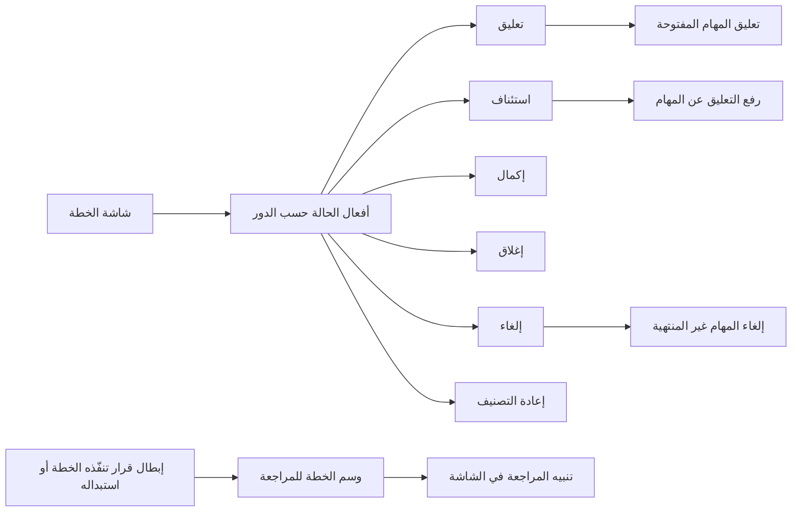
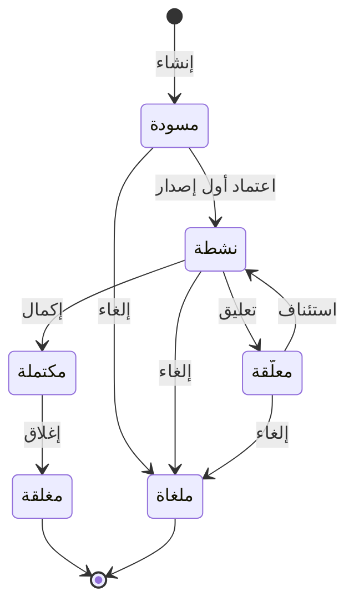

# إدارة حالة الخطة

<!-- BEGIN GENERATED: doc -->
| البند | القيمة |
|---|---|
| المعرّف | FEAT-OPS-PLAN-LIFECYCLE |
| الإصدار | 0.2 |
| الحالة | مسودة |
| القدرة | CAP-07 التخطيط والتنفيذ |
| القدرة الفرعية | CAP-07.01 الأهداف والتخطيط (R1) |
| الأدوار | المخطِّط؛ مالك الخطة؛ صاحب السلطة أو المعتمِد الثاني؛ مسؤول الأمن؛ النظام |
| الشاشات | SCR-34 الخطة ونسخها |
| حالات الاستخدام | UC-033 |
| القصص | 9: 7 من المواصفة، و2 جديدة |
<!-- END GENERATED: doc -->

## 1. نظرة عامة

### 1.1 القيمة

يعلّق المخطط الخطة أو يستأنفها أو يكملها أو يغلقها، ويُنبَّه إن أُبطل قرار تقوم عليه.

### 1.2 النطاق

| البند | القيمة |
|---|---|
| المستخدمون | مالك الخطة والمخطِّط (يعلّقان ويستأنفان ويكملان ويغلقان)، وصاحب السلطة أو المعتمِد الثاني (يلغي)، ومسؤول الأمن (يعيد التصنيف)، والنظام (يسم الخطة للمراجعة) |
| الشاشات | SCR-34 الخطة ونسخها: أفعال حالة الخطة وتنبيه المراجعة |
| حالات الاستخدام | إنشاء الخطة ومتابعتها حتى إغلاقها (UC-033) |
| المتطلبات | الخطة تسجّل أهدافها ونتائجها ومكوناتها كاملة (REQ-OPS-001)؛ كل خطة معتمدة مرتبطة بالقرارات أو الأهداف التي تنفّذها (REQ-OPS-002) |
| خارج النطاق | إنشاء الخطة وإعداد إصداراتها (FEAT-OPS-PLAN-AUTHORING)؛ اعتماد الإصدار وتفعيل الخطة (FEAT-OPS-PLAN-APPROVAL)؛ قياس النتائج (FEAT-OPS-OUTCOMES)؛ التحكم في المهام منفردة (FEAT-OPS-TASK-CONTROL) |

### 1.3 خريطة الميزة

**الشكل 1: أفعال حالة الخطة وأثرها**



**الشكل 2: رحلة الخطة**



الإنشاء والتفعيل في ميزتين أخريين، وبقية الانتقالات في الشكل 2 هنا. وإعادة التصنيف ووسم المراجعة لا يغيّران الحالة.

## 2. القواعد المشتركة

تنطبق على كل قصص الميزة، فلا تتكرر داخل القصص. وكل قصة تذكر ما يخصها فقط.

### 2.1 السياق المشترك

كل قصة تبدأ من ثلاثة شروط: مستأجر نشط، وحزمة السياسات الأساسية مفعّلة، ومستخدم مسجّل الدخول ومخوَّل. وتشير إليها القصص بخطوة واحدة: «بفرض السياق المشترك للميزة».

### 2.2 الصلاحية وعدم الإفصاح

- من لا يحق له رؤية العنصر يتلقى ردًا بشكل «غير متاح» تمامًا، فلا يعرف أنه موجود.
- من يرى العنصر ولا يحق له الإجراء يتلقى «لا تملك صلاحية هذا الإجراء».

### 2.3 أوامر تغيير الحالة

- **منع التكرار:** يُرسل كل أمر بمفتاح فريد، فإعادة الطلب نفسه لا تُنفَّذ مرتين.
- **حماية التعديل المتزامن:** يُرسل كل أمر بإصدار البيانات الذي يراه المستخدم. فإن عدّلها غيره في الأثناء، يُرفض الأمر.
- **السجل:** إن نجح الأمر، يُكتب حدثه وسجل التدقيق في المعاملة نفسها.

### 2.4 الرفض المشترك

```gherkin
# language: ar
خاصية: الرفض المشترك لأوامر الميزة

  سيناريو مخطط: رفض مشترك لكل أمر في الميزة
    بفرض السياق المشترك للميزة
    و <الحالة>
    عندما يُرسل المستخدم أي أمر من أوامر الميزة
    اذاً يُرفض برمز <الرمز> ويرى "<الرسالة>"
    و لا يتغير شيء

    امثلة:
      | الحالة                                  | الرمز                  | الرسالة                                                 |
      | العنصر خارج صلاحياته                    | NOT_FOUND              | غير متاح                                                |
      | العنصر مرئي له ولا يحق له الإجراء       | AUTHZ_DENIED           | لا تملك صلاحية هذا الإجراء                              |
      | غيره عدّل العنصر بعد أن فتحه            | VERSION_CONFLICT       | تغيّرت البيانات منذ فتحتها. راجع التغييرات ثم أعد المحاولة |
      | أعاد مفتاح منع التكرار بمحتوى مختلف     | IDEMPOTENCY_KEY_REUSED | طلب مكرر بمحتوى مختلف                                   |
      | البيانات ناقصة أو غير صحيحة             | VALIDATION_FAILED      | بعض البيانات ناقصة أو غير صحيحة. راجع الحقول المعلَّمة      |

  سيناريو: إعادة الطلب نفسه لا تُنفَّذ مرتين
    بفرض السياق المشترك للميزة
    و أمر نجح بمفتاح منع تكرار
    عندما يُعاد الطلب نفسه بالمفتاح نفسه
    اذاً تُعاد النتيجة الأولى ولا يُكتب حدث ثانٍ
```

### 2.5 أثر حالة الخطة على مهامها

- تعليق الخطة يعلّق مهامها المفتوحة، فيُرفض كل تغيير عليها عدا الإلغاء ورفع التعليق.
- استئناف الخطة يرفع التعليق عن مهامها.
- إلغاء الخطة يلغي مهامها غير المنتهية.

## 3. الجودة وتعريف الاكتمال

### 3.1 متطلبات الجودة

<!-- BEGIN GENERATED: quality -->
لا متطلبات جودة مرتبطة بمتطلبات هذه الميزة مباشرة. تنطبق متطلبات المنصة العامة (`FEAT-PLT-*`).
<!-- END GENERATED: quality -->

### 3.2 تعريف الاكتمال

القصة مكتملة حين تتحقق الشروط الخمسة:

1. سيناريوهاتها والقواعد المشتركة تمر في الاختبار الآلي.
2. فحوص البنية المعمارية تمر.
3. نصوص الواجهة والرسائل موجودة بالعربية والإنجليزية.
4. مراجعة الكود مكتملة.
5. ما تضيفه القصة نفسها في قسم «القواعد» تحقق.

## 4. فهرس القصص

<!-- BEGIN GENERATED: story-index -->
| المعرّف | القصة | النوع | الحالة |
|---|---|---|---|
| `US-BC04-PLN-CANCEL` | إلغاء الخطة | أمر | مسودة |
| `US-BC04-PLN-CLOSE` | إغلاق الخطة | أمر | مسودة |
| `US-BC04-PLN-COMPLETE` | إكمال الخطة | أمر | مسودة |
| `US-BC04-PLN-RECLASSIFY` | إعادة تصنيف الخطة | أمر | مسودة |
| `US-BC04-PLN-RESUME` | استئناف الخطة | أمر | مسودة |
| `US-BC04-PLN-SUSPEND` | تعليق الخطة | أمر | مسودة |
| `US-BC04-S-PLAN-02` | وسم الخطة للمراجعة عند إبطال قرارها أو استبداله | نظام | مسودة |
| `US-UI-SCR34-LIFECYCLE-ACTIONS` | أفعال حالة الخطة وأثرها على المهام | واجهة | مسودة |
| `US-UI-SCR34-REVIEW-FLAG` | تنبيه الخطة عند إبطال قرارها | واجهة | مسودة |
<!-- END GENERATED: story-index -->

## 5. القصص

### 5.1 US-BC04-PLN-CANCEL — إلغاء الخطة

| النوع | الإصدار | الأولوية | دون اتصال | الحالة |
|---|---|---|---|---|
| أمر | R1 | Must | لا | مسودة |

> **كـ** صاحب السلطة أو المعتمِد الثاني، **أريد** أن ألغي خطة لم تعد مطلوبة مع ذكر السبب، **حتى** تتوقف هي ومهامها المفتوحة.

**باختصار:** تُلغى الخطة وهي «مسودة» أو «نشطة» أو «معلّقة»، فتصير «ملغاة» نهائيًا، وتُلغى مهامها غير المنتهية.

#### القواعد

- **متى يُسمح:** الخطة «مسودة» أو «نشطة» أو «معلّقة».
- **من يُسمح له:** صاحب السلطة على الخطة في نطاقها، لا المخطِّط وحده.
- **البيانات:** السبب (إلزامي).
- **الأثر:** تصير الخطة «ملغاة»، وهي حالة نهائية. وتُلغى مهامها غير المنتهية (§2.5)، ويُبلَّغ مالكو الخطة والمسند إليهم.

#### معايير القبول

```gherkin
# language: ar
خاصية: إلغاء الخطة

  سيناريو: صاحب السلطة يلغي خطة نشطة
    بفرض السياق المشترك للميزة
    و خطة "نشطة" لها مهام مفتوحة
    عندما يلغيها صاحب السلطة ويذكر السبب
    اذاً تصبح حالة الخطة "ملغاة"
    و تُلغى مهامها غير المنتهية
    و يُسجَّل حدث "أُلغيت الخطة"

  سيناريو مخطط: رفض خاص بإلغاء الخطة
    بفرض السياق المشترك للميزة
    و <الحالة>
    عندما يحاول إلغاء الخطة
    اذاً يُرفض برمز <الرمز> ويرى "<الرسالة>"

    امثلة:
      | الحالة                                  | الرمز                         | الرسالة                                 |
      | الخطة "مكتملة" أو "مغلقة" أو "ملغاة"    | PLAN_INVALID_STATE_TRANSITION | الوضع الحالي للخطة لا يسمح بهذا الإجراء |
      | لم يذكر السبب                           | REASON_REQUIRED               | اذكر السبب                              |
```

<details><summary>المراجع التقنية والتتبع</summary>

<!-- BEGIN GENERATED: refs US-BC04-PLN-CANCEL -->
| البند | المعرّف | المعنى |
|---|---|---|
| الواجهة البرمجية | `POST /api/v1/operations/plans/{id}/actions/cancel` | — |
| الأمر | `CMD-PLN-CANCEL` | إلغاء الخطة |
| السياسة | `POL-PLN-CANCEL` | Planner / owner (create, suspend, resume, complete, close) · authority (cancel) · Security Officer (reclassif… |
| الحدث | `EVT-PLN-CANCELLED` | يصل إلى: Task synchronizer (suspend/cancel cascades); Outcome trackers (close); Notification (owners, assigne… |
| الكيان | `AGG-PLAN` | الخطة |
| الجدول | `operations.plans` | الجدول الرئيسي للخطة |
| وحدة النشر | DU-08 | — |
| المتطلبات | REQ-OPS-001، REQ-OPS-002 | معانيها في القسم 6. التتبع |
| حالة الاستخدام | UC-033 | Create Plan |
| الاختبار | TST-PLAN-SM، TST-SLC08-INVARIANTS | دورة حالات الخطة، وثوابت الشريحة SLC-08 |
<!-- END GENERATED: refs US-BC04-PLN-CANCEL -->

</details>

### 5.2 US-BC04-PLN-CLOSE — إغلاق الخطة

| النوع | الإصدار | الأولوية | دون اتصال | الحالة |
|---|---|---|---|---|
| أمر | R1 | Must | لا | مسودة |

> **كـ** مالك الخطة، **أريد** أن أغلق الخطة المكتملة مع ملاحظات ما بعد التنفيذ، **حتى** تُحفظ بصورتها النهائية ويُستفاد من دروسها.

**باختصار:** الخطة «مكتملة» تُغلق فتصير «مغلقة»، ولا يُقبل بعدها أي تغيير.

#### القواعد

- **متى يُسمح:** الخطة «مكتملة» ومتتبعات نتائجها مغلقة. والمصدر لا يحدد رمز الرفض إن بقي متتبع مفتوح **[Needs Review]**.
- **من يُسمح له:** مالك الخطة أو المخطِّط في نطاقها.
- **البيانات:** ملاحظات ما بعد التنفيذ، اختيارية في R1.
- **الأثر:** تصير الخطة «مغلقة»، وهي حالة نهائية.

#### معايير القبول

```gherkin
# language: ar
خاصية: إغلاق الخطة

  سيناريو: المالك يغلق خطة مكتملة
    بفرض السياق المشترك للميزة
    و خطة "مكتملة" متتبعات نتائجها مغلقة
    عندما يغلقها المالك مع ملاحظات ما بعد التنفيذ
    اذاً تصبح حالة الخطة "مغلقة" ولا تقبل أي تغيير
    و يُسجَّل حدث "أُغلقت الخطة"

  سيناريو مخطط: رفض خاص بإغلاق الخطة
    بفرض السياق المشترك للميزة
    و <الحالة>
    عندما يحاول إغلاق الخطة
    اذاً يُرفض برمز <الرمز> ويرى "<الرسالة>"

    امثلة:
      | الحالة                  | الرمز                         | الرسالة                                 |
      | الخطة ليست "مكتملة"     | PLAN_INVALID_STATE_TRANSITION | الوضع الحالي للخطة لا يسمح بهذا الإجراء |
```

<details><summary>المراجع التقنية والتتبع</summary>

<!-- BEGIN GENERATED: refs US-BC04-PLN-CLOSE -->
| البند | المعرّف | المعنى |
|---|---|---|
| الواجهة البرمجية | `POST /api/v1/operations/plans/{id}/actions/close` | — |
| الأمر | `CMD-PLN-CLOSE` | إغلاق الخطة |
| السياسة | `POL-PLN-CLOSE` | Planner / owner (create, suspend, resume, complete, close) · authority (cancel) · Security Officer (reclassif… |
| الحدث | `EVT-PLN-CLOSED` | يصل إلى: Task synchronizer (suspend/cancel cascades); Outcome trackers (close); Notification (owners, assigne… |
| الكيان | `AGG-PLAN` | الخطة |
| الجدول | `operations.plans` | الجدول الرئيسي للخطة |
| وحدة النشر | DU-08 | — |
| المتطلبات | REQ-OPS-001، REQ-OPS-002 | معانيها في القسم 6. التتبع |
| حالة الاستخدام | UC-033 | Create Plan |
| الاختبار | TST-PLAN-SM، TST-SLC08-INVARIANTS | دورة حالات الخطة، وثوابت الشريحة SLC-08 |
<!-- END GENERATED: refs US-BC04-PLN-CLOSE -->

</details>

### 5.3 US-BC04-PLN-COMPLETE — إكمال الخطة

| النوع | الإصدار | الأولوية | دون اتصال | الحالة |
|---|---|---|---|---|
| أمر | R1 | Must | لا | مسودة |

> **كـ** مالك الخطة، **أريد** أن أعلن اكتمال الخطة حين تنتهي مهامها وتُقاس نتائجها، **حتى** يُعرف أن ما خُطط له نُفِّذ وقيس.

**باختصار:** الخطة «نشطة» تصير «مكتملة» إذا كانت كل مهامها في حالة نهائية، ولكل نتيجة فيها قياس واحد على الأقل.

#### القواعد

- **متى يُسمح:** الخطة «نشطة»، وكل مهامها في حالة نهائية، ولكل نتيجة قياس واحد على الأقل.
- **من يُسمح له:** مالك الخطة أو المخطِّط في نطاقها.
- **البيانات:** ملاحظة اختيارية.
- **الأثر:** تصير الخطة «مكتملة»، ولا يبقى بعدها إلا إغلاقها.

#### معايير القبول

```gherkin
# language: ar
خاصية: إكمال الخطة

  سيناريو: المالك يكمل خطة انتهت مهامها وقيست نتائجها
    بفرض السياق المشترك للميزة
    و خطة "نشطة" كل مهامها في حالة نهائية ولكل نتيجة قياس
    عندما يكملها المالك
    اذاً تصبح حالة الخطة "مكتملة"
    و يُسجَّل حدث "اكتملت الخطة"

  سيناريو مخطط: رفض خاص بإكمال الخطة
    بفرض السياق المشترك للميزة
    و <الحالة>
    عندما يحاول إكمال الخطة
    اذاً يُرفض برمز <الرمز> ويرى "<الرسالة>"

    امثلة:
      | الحالة                   | الرمز                         | الرسالة                                            |
      | الخطة ليست "نشطة"        | PLAN_INVALID_STATE_TRANSITION | الوضع الحالي للخطة لا يسمح بهذا الإجراء            |
      | للخطة مهمة غير منتهية    | PLAN_NOT_COMPLETABLE          | لا يمكن إكمال الخطة: مهام مفتوحة أو نتائج بلا قياس |
      | نتيجة في الخطة بلا قياس  | PLAN_NOT_COMPLETABLE          | لا يمكن إكمال الخطة: مهام مفتوحة أو نتائج بلا قياس |
```

<details><summary>المراجع التقنية والتتبع</summary>

<!-- BEGIN GENERATED: refs US-BC04-PLN-COMPLETE -->
| البند | المعرّف | المعنى |
|---|---|---|
| الواجهة البرمجية | `POST /api/v1/operations/plans/{id}/actions/complete` | — |
| الأمر | `CMD-PLN-COMPLETE` | إكمال الخطة |
| السياسة | `POL-PLN-COMPLETE` | Planner / owner (create, suspend, resume, complete, close) · authority (cancel) · Security Officer (reclassif… |
| الحدث | `EVT-PLN-COMPLETED` | يصل إلى: Task synchronizer (suspend/cancel cascades); Outcome trackers (close); Notification (owners, assigne… |
| الكيان | `AGG-PLAN` | الخطة |
| الجدول | `operations.plans` | الجدول الرئيسي للخطة |
| وحدة النشر | DU-08 | — |
| المتطلبات | REQ-OPS-001، REQ-OPS-002 | معانيها في القسم 6. التتبع |
| حالة الاستخدام | UC-033 | Create Plan |
| الاختبار | TST-PLAN-SM، TST-SLC08-INVARIANTS | دورة حالات الخطة، وثوابت الشريحة SLC-08 |
<!-- END GENERATED: refs US-BC04-PLN-COMPLETE -->

</details>

### 5.4 US-BC04-PLN-RECLASSIFY — إعادة تصنيف الخطة

| النوع | الإصدار | الأولوية | دون اتصال | الحالة |
|---|---|---|---|---|
| أمر | R1 | Must | لا | مسودة |

> **كـ** مسؤول الأمن، **أريد** أن أغيّر التصنيف الأمني للخطة مع ذكر السبب، **حتى** لا يراها إلا من يحمل التصريح المناسب.

**باختصار:** يغيّر مسؤول الأمن تصنيف خطة غير منتهية دون أن تتغير حالتها، ويسري التصنيف الجديد على الوصول من الطلب التالي.

#### القواعد

- **متى يُسمح:** الخطة «مسودة» أو «نشطة» أو «معلّقة».
- **من يُسمح له:** مسؤول الأمن الذي يملك صلاحية تغيير التصنيف.
- **البيانات:** التصنيف الجديد (إلزامي)، ولا يقل عن تصنيف القرارات التي تنفّذها الخطة. والسبب (إلزامي).
- **الأثر:**
  - لا تتغير حالة الخطة، ويزيد إصدارها واحدًا.
  - يسري التصنيف الجديد في كل مسارات الوصول من الطلب التالي (QAS-SEC-003).
  - المسند إليهم الذين لا يحملون التصريح الكافي تلزم إعادة إسناد مهامهم.
- **ملاحظة:** المصدر لا يحدد رمز رفض التصنيف الأدنى من تصنيف القرارات، ولا كيف تُفرض إعادة الإسناد **[Needs Review]**.

#### معايير القبول

```gherkin
# language: ar
خاصية: إعادة تصنيف الخطة

  سيناريو: مسؤول الأمن يرفع تصنيف خطة نشطة
    بفرض السياق المشترك للميزة
    و خطة "نشطة" تصنيفها أدنى مما تحتاجه
    عندما يغيّر مسؤول الأمن تصنيفها ويذكر السبب
    اذاً يصبح للخطة التصنيف الجديد وتبقى "نشطة"
    و لا يصل إليها من لا يحمل التصريح الكافي من الطلب التالي
    و يُسجَّل حدث "أُعيد تصنيف الخطة"

  سيناريو مخطط: رفض خاص بإعادة التصنيف
    بفرض السياق المشترك للميزة
    و <الحالة>
    عندما يحاول تغيير تصنيف الخطة
    اذاً يُرفض برمز <الرمز> ويرى "<الرسالة>"

    امثلة:
      | الحالة                                | الرمز                                | الرسالة                                 |
      | الخطة "مكتملة" أو "مغلقة" أو "ملغاة"  | PLAN_INVALID_STATE_TRANSITION        | الوضع الحالي للخطة لا يسمح بهذا الإجراء |
      | لا يملك صلاحية تغيير التصنيف          | CLASSIFICATION_CHANGE_NOT_AUTHORIZED | لا تملك صلاحية تغيير التصنيف            |
      | لم يحدد التصنيف الجديد                | VALIDATION_FAILED                    | التصنيف مطلوب                           |
      | لم يذكر السبب                         | VALIDATION_FAILED                    | السبب مطلوب                             |
```

<details><summary>المراجع التقنية والتتبع</summary>

<!-- BEGIN GENERATED: refs US-BC04-PLN-RECLASSIFY -->
| البند | المعرّف | المعنى |
|---|---|---|
| الواجهة البرمجية | `POST /api/v1/operations/plans/{id}/actions/reclassify` | — |
| الأمر | `CMD-PLN-RECLASSIFY` | إعادة تصنيف الخطة |
| السياسة | `POL-PLN-RECLASSIFY` | Planner / owner (create, suspend, resume, complete, close) · authority (cancel) · Security Officer (reclassif… |
| الحدث | `EVT-PLN-RECLASSIFIED` | يصل إلى: Security-version service (EVT-SEC-VERSION-INCREMENTED); PEP decision caches; Projection security-ver… |
| الكيان | `AGG-PLAN` | الخطة |
| الجدول | `operations.plans` | الجدول الرئيسي للخطة |
| وحدة النشر | DU-08 | — |
| المتطلبات | REQ-OPS-001، REQ-OPS-002 | معانيها في القسم 6. التتبع |
| حالة الاستخدام | UC-033 | Create Plan |
| الاختبار | TST-PLAN-SM، TST-SLC08-INVARIANTS | دورة حالات الخطة، وثوابت الشريحة SLC-08 |
<!-- END GENERATED: refs US-BC04-PLN-RECLASSIFY -->

</details>

### 5.5 US-BC04-PLN-RESUME — استئناف الخطة

| النوع | الإصدار | الأولوية | دون اتصال | الحالة |
|---|---|---|---|---|
| أمر | R1 | Must | لا | مسودة |

> **كـ** مالك الخطة، **أريد** أن أستأنف خطة معلّقة مع ذكر السبب، **حتى** يعود تنفيذها وتعود مهامها للعمل.

**باختصار:** الخطة «معلّقة» تعود «نشطة»، ويُرفع التعليق عن مهامها.

#### القواعد

- **متى يُسمح:** الخطة «معلّقة».
- **من يُسمح له:** مالك الخطة أو المخطِّط في نطاقها.
- **البيانات:** السبب (إلزامي).
- **الأثر:** تصير الخطة «نشطة»، ويُرفع التعليق عن مهامها (§2.5).

#### معايير القبول

```gherkin
# language: ar
خاصية: استئناف الخطة

  سيناريو: المالك يستأنف خطة معلّقة
    بفرض السياق المشترك للميزة
    و خطة "معلّقة" مهامها المفتوحة معلّقة
    عندما يستأنفها المالك ويذكر السبب
    اذاً تصبح حالة الخطة "نشطة"
    و يُرفع التعليق عن مهامها
    و يُسجَّل حدث "استُؤنفت الخطة"

  سيناريو مخطط: رفض خاص باستئناف الخطة
    بفرض السياق المشترك للميزة
    و <الحالة>
    عندما يحاول استئناف الخطة
    اذاً يُرفض برمز <الرمز> ويرى "<الرسالة>"

    امثلة:
      | الحالة                | الرمز                         | الرسالة                                 |
      | الخطة ليست "معلّقة"   | PLAN_INVALID_STATE_TRANSITION | الوضع الحالي للخطة لا يسمح بهذا الإجراء |
      | لم يذكر السبب         | REASON_REQUIRED               | اذكر السبب                              |
```

<details><summary>المراجع التقنية والتتبع</summary>

<!-- BEGIN GENERATED: refs US-BC04-PLN-RESUME -->
| البند | المعرّف | المعنى |
|---|---|---|
| الواجهة البرمجية | `POST /api/v1/operations/plans/{id}/actions/resume` | — |
| الأمر | `CMD-PLN-RESUME` | استئناف الخطة |
| السياسة | `POL-PLN-RESUME` | Planner / owner (create, suspend, resume, complete, close) · authority (cancel) · Security Officer (reclassif… |
| الحدث | `EVT-PLN-RESUMED` | يصل إلى: Task synchronizer (suspend/cancel cascades); Outcome trackers (close); Notification (owners, assigne… |
| الكيان | `AGG-PLAN` | الخطة |
| الجدول | `operations.plans` | الجدول الرئيسي للخطة |
| وحدة النشر | DU-08 | — |
| المتطلبات | REQ-OPS-001، REQ-OPS-002 | معانيها في القسم 6. التتبع |
| حالة الاستخدام | UC-033 | Create Plan |
| الاختبار | TST-PLAN-SM، TST-SLC08-INVARIANTS | دورة حالات الخطة، وثوابت الشريحة SLC-08 |
<!-- END GENERATED: refs US-BC04-PLN-RESUME -->

</details>

### 5.6 US-BC04-PLN-SUSPEND — تعليق الخطة

| النوع | الإصدار | الأولوية | دون اتصال | الحالة |
|---|---|---|---|---|
| أمر | R1 | Must | لا | مسودة |

> **كـ** مالك الخطة، **أريد** أن أعلّق خطة نشطة مع ذكر السبب، **حتى** يتوقف العمل على مهامها مؤقتًا دون أن تُلغى.

**باختصار:** الخطة «نشطة» تصير «معلّقة»، وتُعلَّق مهامها المفتوحة حتى تُستأنف.

#### القواعد

- **متى يُسمح:** الخطة «نشطة».
- **من يُسمح له:** مالك الخطة أو المخطِّط في نطاقها.
- **البيانات:** السبب (إلزامي).
- **الأثر:** تصير الخطة «معلّقة»، وتُعلَّق مهامها المفتوحة (§2.5)، ويُبلَّغ مالكو الخطة والمسند إليهم.

#### معايير القبول

```gherkin
# language: ar
خاصية: تعليق الخطة

  سيناريو: المالك يعلّق خطة نشطة
    بفرض السياق المشترك للميزة
    و خطة "نشطة" لها مهام مفتوحة
    عندما يعلّقها المالك ويذكر السبب
    اذاً تصبح حالة الخطة "معلّقة"
    و تُعلَّق مهامها المفتوحة فلا تقبل تغييرًا عدا الإلغاء ورفع التعليق
    و يُسجَّل حدث "عُلِّقت الخطة"

  سيناريو مخطط: رفض خاص بتعليق الخطة
    بفرض السياق المشترك للميزة
    و <الحالة>
    عندما يحاول تعليق الخطة
    اذاً يُرفض برمز <الرمز> ويرى "<الرسالة>"

    امثلة:
      | الحالة              | الرمز                         | الرسالة                                 |
      | الخطة ليست "نشطة"   | PLAN_INVALID_STATE_TRANSITION | الوضع الحالي للخطة لا يسمح بهذا الإجراء |
      | لم يذكر السبب       | REASON_REQUIRED               | اذكر السبب                              |
```

<details><summary>المراجع التقنية والتتبع</summary>

<!-- BEGIN GENERATED: refs US-BC04-PLN-SUSPEND -->
| البند | المعرّف | المعنى |
|---|---|---|
| الواجهة البرمجية | `POST /api/v1/operations/plans/{id}/actions/suspend` | — |
| الأمر | `CMD-PLN-SUSPEND` | تعليق الخطة |
| السياسة | `POL-PLN-SUSPEND` | Planner / owner (create, suspend, resume, complete, close) · authority (cancel) · Security Officer (reclassif… |
| الحدث | `EVT-PLN-SUSPENDED` | يصل إلى: Task synchronizer (suspend/cancel cascades); Outcome trackers (close); Notification (owners, assigne… |
| الكيان | `AGG-PLAN` | الخطة |
| الجدول | `operations.plans` | الجدول الرئيسي للخطة |
| وحدة النشر | DU-08 | — |
| المتطلبات | REQ-OPS-001، REQ-OPS-002 | معانيها في القسم 6. التتبع |
| حالة الاستخدام | UC-033 | Create Plan |
| الاختبار | TST-PLAN-SM، TST-SLC08-INVARIANTS | دورة حالات الخطة، وثوابت الشريحة SLC-08 |
<!-- END GENERATED: refs US-BC04-PLN-SUSPEND -->

</details>

### 5.7 US-BC04-S-PLAN-02 — وسم الخطة للمراجعة عند إبطال قرارها أو استبداله

| النوع | الإصدار | الأولوية | دون اتصال | الحالة |
|---|---|---|---|---|
| نظام | R1 | Must | لا ينطبق | مسودة |

> **كـ** النظام، **أريد** أن أسم الخطة للمراجعة حين يُبطَل قرار تنفّذه أو يُستبدل، **حتى** يراجعها مالكها بدل أن تستمر على أساس لم يعد قائمًا.

**باختصار:** إذا أُبطل قرار تنفّذه خطة «نشطة» أو «معلّقة» أو استُبدل، تُوسم الخطة للمراجعة دون أي تغيير آلي في حالتها أو مهامها.

#### القواعد

- **متى يحدث:** أُبطل قرار تنفّذه خطة «نشطة» أو «معلّقة»، أو استُبدل بقرار أحدث.
- **الأثر:** لا تتغير حالة الخطة ولا مهامها. ويُسجَّل حدث «وُسمت الخطة للمراجعة» وسجل تدقيق بهوية النظام، ويُبلَّغ مالكو الخطة.

#### معايير القبول

```gherkin
# language: ar
خاصية: وسم الخطة للمراجعة عند إبطال قرارها أو استبداله

  سيناريو: إبطال قرار تنفّذه خطة نشطة
    بفرض خطة "نشطة" تنفّذ قرارًا مسجّلًا
    عندما يُبطَل ذلك القرار
    اذاً تُوسم الخطة للمراجعة وتبقى "نشطة"
    و يُسجَّل حدث "وُسمت الخطة للمراجعة" وسجل تدقيق بهوية النظام

  سيناريو: خطة مغلقة لا تُوسم
    بفرض خطة "مغلقة" كانت تنفّذ قرارًا
    عندما يُستبدل ذلك القرار
    اذاً لا تُوسم الخطة ولا يتغير فيها شيء
```

<details><summary>المراجع التقنية والتتبع</summary>

<!-- BEGIN GENERATED: refs US-BC04-S-PLAN-02 -->
| البند | المعرّف | المعنى |
|---|---|---|
| المحفِّز | `SYS:implemented decision annulled or superseded` | plan flagged for review (no automatic change) |
| الانتقال | ACTIVE, SUSPENDED ← (بلا تغيير) | — |
| الحدث | `EVT-PLN-REVIEW-FLAGGED` | يصل إلى: Task synchronizer (suspend/cancel cascades); Outcome trackers (close); Notification (owners, assigne… |
| الكيان | `AGG-PLAN` | الخطة |
| الجدول | `operations.plans` | الجدول الرئيسي للخطة |
| وحدة النشر | DU-08 | — |
| المتطلبات | REQ-OPS-001، REQ-OPS-002 | معانيها في القسم 6. التتبع |
| حالة الاستخدام | UC-033 | Create Plan |
| الاختبار | TST-PLAN-SM، TST-SLC08-INVARIANTS | دورة حالات الخطة، وثوابت الشريحة SLC-08 |
<!-- END GENERATED: refs US-BC04-S-PLAN-02 -->

</details>

### 5.8 US-UI-SCR34-LIFECYCLE-ACTIONS — أفعال حالة الخطة وأثرها على المهام

| النوع | الإصدار | الأولوية | دون اتصال | الحالة |
|---|---|---|---|---|
| واجهة | R1 | Should | لا | مسودة |

> **كـ** مالك الخطة، **أريد** أن أرى أفعال الحالة المتاحة لي وأثر كل منها على المهام قبل التأكيد، **حتى** لا أعلّق مهام الفرق أو ألغيها دون قصد.

**باختصار:** تعرض شاشة الخطة الأفعال التي تسمح بها حالة الخطة وصلاحيات المستخدم، وتذكر قبل التأكيد ما سيحدث لمهامها.

#### القواعد

- الأفعال حسب الحالة المعروضة: «نشطة» تعليق وإكمال، و«معلّقة» استئناف، و«مكتملة» إغلاق. والإلغاء لصاحب السلطة، وإعادة التصنيف لمسؤول الأمن.
- ظهور الفعل تلميح فقط، ورد الخادم هو الحكم.
- نافذة التأكيد تذكر الأثر على المهام كما في §2.5 **[Derived]**، دون عدد يكشف مهامًا لا يراها المستخدم **[Derived]**.
- حقل السبب نصي إلزامي في التعليق والاستئناف والإلغاء وإعادة التصنيف.
- إذا رد الخادم بأن الحالة تغيّرت، يُعاد تحميل الخطة ويختفي الفعل غير المتاح.

#### معايير القبول

```gherkin
# language: ar
خاصية: أفعال حالة الخطة وأثرها على المهام

  سيناريو: المالك يعلّق خطة نشطة من الشاشة
    بفرض السياق المشترك للميزة
    و خطة "نشطة" يملكها المستخدم
    عندما يفتح شاشة الخطة
    اذاً يرى فعلي "تعليق" و"إكمال" ولا يرى "استئناف" ولا "إغلاق"
    عندما يختار "تعليق"
    اذاً تذكر نافذة التأكيد أن مهام الخطة المفتوحة ستُعلَّق
    و لا يُرسل الأمر قبل أن يكتب السبب

  سيناريو مخطط: استجابة الشاشة لرفض الخادم
    بفرض السياق المشترك للميزة
    و <الحالة>
    عندما يؤكد المالك الفعل ويرد الخادم برمز <الرمز>
    اذاً يرى "<الرسالة>"

    امثلة:
      | الحالة                                     | الرمز                         | الرسالة                                            |
      | اختار "إكمال" وللخطة مهام مفتوحة           | PLAN_NOT_COMPLETABLE          | لا يمكن إكمال الخطة: مهام مفتوحة أو نتائج بلا قياس |
      | غيّر غيره حالة الخطة بعد أن فتحها          | PLAN_INVALID_STATE_TRANSITION | الوضع الحالي للخطة لا يسمح بهذا الإجراء            |
```

<details><summary>المراجع التقنية والتتبع</summary>

<!-- BEGIN GENERATED: refs US-UI-SCR34-LIFECYCLE-ACTIONS -->
| البند | المعرّف | المعنى |
|---|---|---|
| الشاشة | SCR-34 | شاشة الخطة ونسخها |
| المصدر | `21-ui-design.md §6.3` | — |
| المصدر | `decision-plan-spec.md §3` | — |
| المصدر | `[Derived]` | — |
<!-- END GENERATED: refs US-UI-SCR34-LIFECYCLE-ACTIONS -->

</details>

### 5.9 US-UI-SCR34-REVIEW-FLAG — تنبيه الخطة عند إبطال قرارها

| النوع | الإصدار | الأولوية | دون اتصال | الحالة |
|---|---|---|---|---|
| واجهة | R1 | Must | لا | مسودة |

> **كـ** مالك الخطة، **أريد** أن أرى تنبيهًا واضحًا في الخطة حين يُبطَل قرار تقوم عليه أو يُستبدل، **حتى** أقرر هل أعدّلها أو أعلّقها أو ألغيها.

**باختصار:** الخطة الموسومة للمراجعة تُظهر شريط تنبيه يذكر أن قرارها أُبطل أو استُبدل، مع رابط القرار لمن يحق له رؤيته.

#### القواعد

- التنبيه لا يغيّر حالة الخطة ولا يمنع أفعالها **[Derived]**.
- رابط القرار يظهر لمن يرى القرار فقط. ومن لا يراه يرى التنبيه دون تفاصيل القرار **[Derived]**.
- الخيارات أمام المالك هي أفعال الخطة المعتادة: إصدار جديد، أو تعليق، أو إلغاء **[Derived]**.
- المصدر لا يحدد متى يزول الوسم **[Needs Review]**.

#### معايير القبول

```gherkin
# language: ar
خاصية: تنبيه الخطة عند إبطال قرارها

  سيناريو: المالك يرى تنبيه المراجعة
    بفرض السياق المشترك للميزة
    و خطة "نشطة" وُسمت للمراجعة لأن قرارها أُبطل
    عندما يفتح المالك شاشة الخطة
    اذاً يرى شريط تنبيه بأن القرار الذي تنفّذه الخطة أُبطل
    و يرى رابط القرار
    و تبقى أفعال الخطة المعتادة متاحة

  سيناريو: مستخدم لا يرى القرار
    بفرض السياق المشترك للميزة
    و خطة موسومة للمراجعة قرارها خارج صلاحيات المستخدم
    عندما يفتح شاشة الخطة
    اذاً يرى شريط التنبيه دون رابط القرار ولا تفاصيله
```

<details><summary>المراجع التقنية والتتبع</summary>

<!-- BEGIN GENERATED: refs US-UI-SCR34-REVIEW-FLAG -->
| البند | المعرّف | المعنى |
|---|---|---|
| الشاشة | SCR-34 | شاشة الخطة ونسخها |
| المصدر | `US-BC04-S-PLAN-02` | — |
| المصدر | `[Derived]` | — |
| المتطلب | REQ-OPS-002 | The system shall link every approved plan to the decisions or objectives it implements. |
| حالة الاستخدام | UC-033 | Create Plan |
<!-- END GENERATED: refs US-UI-SCR34-REVIEW-FLAG -->

</details>

## 6. التتبع

<!-- BEGIN GENERATED: trace -->
| المتطلب | المعنى | القصص | الاختبار |
|---|---|---|---|
| REQ-OPS-001 | The system shall record for each plan its objectives, outcomes, constraints, assumptions, phases, activities,… | كل قصص الميزة المأخوذة من المواصفة (7) | TST-PLAN-SM، TST-PLAN-VERSION-SM، TST-SLC08-INVARIANTS |
| REQ-OPS-002 | The system shall link every approved plan to the decisions or objectives it implements. | `US-BC04-PLN-CANCEL`، `US-BC04-PLN-CLOSE`، `US-BC04-PLN-COMPLETE`، `US-BC04-PLN-RECLASSIFY`، `US-BC04-PLN-RESUME`، `US-BC04-PLN-SUSPEND`، `US-BC04-S-PLAN-02`، `US-UI-SCR34-REVIEW-FLAG` | TST-PLAN-SM، TST-SLC08-INVARIANTS |
<!-- END GENERATED: trace -->

## 7. سجل التغييرات

| الإصدار | التاريخ | التغيير |
|---|---|---|
| 0.1 | — | هيكل مولَّد من خريطة الميزات |
| 0.2 | 2026-10-02 | كتابة القصص كاملة بمعيار القصص |
