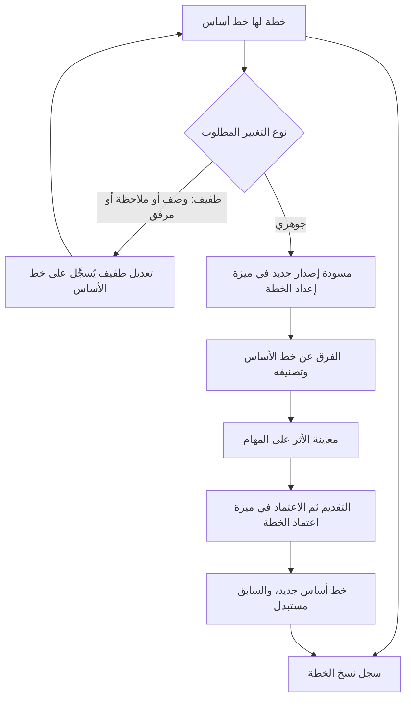
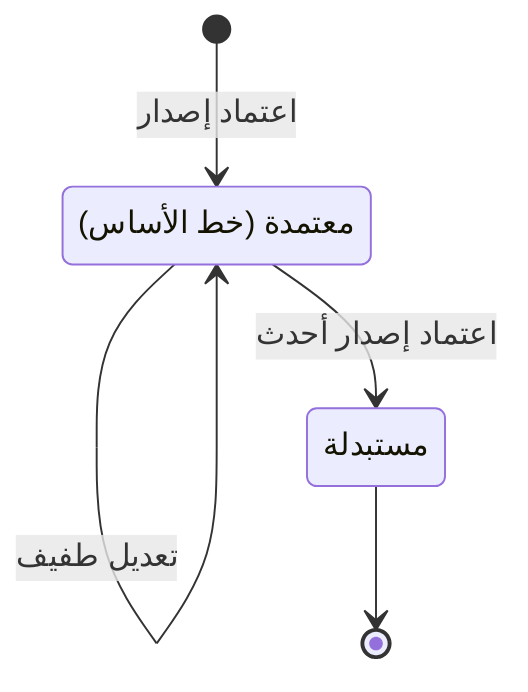

# تعديل الخطة المعتمدة ونسخها

<!-- BEGIN GENERATED: doc -->
| البند | القيمة |
|---|---|
| المعرّف | FEAT-OPS-PLAN-VERSIONS |
| الإصدار | 0.1 |
| الحالة | مسودة |
| القدرة | CAP-07 التخطيط والتنفيذ |
| القدرة الفرعية | CAP-07.02 إصدارات الخطة وخط الأساس (R1) |
| الأدوار | المخطِّط؛ المدير |
| الشاشات | SCR-34 الخطة ونسخها |
| حالات الاستخدام | UC-034، UC-036 |
| القصص | 6: 3 من المواصفة، و3 جديدة |
<!-- END GENERATED: doc -->

## 1. نظرة عامة

### 1.1 القيمة

يعدّل المخطط خطة معتمدة تعديلًا طفيفًا أو يرى الفرق عن خط الأساس وأثره على المهام قبل اعتماد نسخة جديدة.

### 1.2 النطاق

| البند | القيمة |
|---|---|
| المستخدمون | المخطِّط يعدّل الخطة المعتمدة ويقارن نسخها، والمدير يراجع الفرق وأثره قبل الاعتماد |
| الشاشات | SCR-34 الخطة ونسخها: سجل النسخ، والفرق عن خط الأساس |
| حالات الاستخدام | مراجعة الخطة (UC-034)، وتثبيت خط الأساس (UC-036) |
| المتطلبات | خط أساس ثابت لكل إصدار معتمد، يبقى قابلًا للاسترجاع بعد الإصدارات اللاحقة (REQ-OPS-003)؛ والتغيير الجوهري يحتاج إصدارًا جديدًا يُعتمد قبل سريانه، والطفيف لا يحتاج (REQ-OPS-004)؛ ولا يعتمد الكاتب ما كتبه (REQ-OPS-005) |
| خارج النطاق | إعداد المسودة وتعديلها وتقديمها (FEAT-OPS-PLAN-AUTHORING)؛ اعتماد الإصدار وإعادته ورفضه، وتنفيذ مزامنة المهام بعد الاعتماد (FEAT-OPS-PLAN-APPROVAL) |

### 1.3 خريطة الميزة

حين تحتاج الخطة المعتمدة تغييرًا، يحدد نوعه المسار: الطفيف يُسجَّل على خط الأساس مباشرة، والجوهري يمر بإصدار جديد يُقارن بخط الأساس ويُعتمد (الشكل 1). ويبقى خط الأساس ساريًا حتى يُعتمد إصدار أحدث فيُستبدل (الشكل 2).

**الشكل 1: خريطة تعديل الخطة المعتمدة ونسخها**



**الشكل 2: رحلة خط الأساس**



## 2. القواعد المشتركة

تنطبق على كل قصص الميزة، فلا تتكرر داخل القصص. وكل قصة تذكر ما يخصها فقط.

### 2.1 السياق المشترك

كل قصة تبدأ من ثلاثة شروط: مستأجر نشط، وحزمة السياسات الأساسية مفعّلة، ومستخدم مسجّل الدخول ومخوَّل. وتشير إليها القصص بخطوة واحدة: «بفرض السياق المشترك للميزة».

### 2.2 الصلاحية وعدم الإفصاح

- من لا يحق له رؤية العنصر يتلقى ردًا بشكل «غير متاح» تمامًا، فلا يعرف أنه موجود.
- من يرى العنصر ولا يحق له الإجراء يتلقى «لا تملك صلاحية هذا الإجراء».

### 2.3 أوامر تغيير الحالة

- **منع التكرار:** يُرسل كل أمر بمفتاح فريد، فإعادة الطلب نفسه لا تُنفَّذ مرتين.
- **حماية التعديل المتزامن:** يُرسل كل أمر بإصدار البيانات الذي يراه المستخدم. فإن عدّلها غيره في الأثناء، يُرفض الأمر.
- **السجل:** إن نجح الأمر، يُكتب حدثه وسجل التدقيق في المعاملة نفسها.

### 2.4 الرفض المشترك

```gherkin
# language: ar
خاصية: الرفض المشترك لأوامر الميزة

  سيناريو مخطط: رفض مشترك لكل أمر في الميزة
    بفرض السياق المشترك للميزة
    و <الحالة>
    عندما يُرسل المستخدم أي أمر من أوامر الميزة
    اذاً يُرفض برمز <الرمز> ويرى "<الرسالة>"
    و لا يتغير شيء

    امثلة:
      | الحالة                                  | الرمز                  | الرسالة                                                 |
      | العنصر خارج صلاحياته                    | NOT_FOUND              | غير متاح                                                |
      | العنصر مرئي له ولا يحق له الإجراء       | AUTHZ_DENIED           | لا تملك صلاحية هذا الإجراء                              |
      | غيره عدّل العنصر بعد أن فتحه            | VERSION_CONFLICT       | تغيّرت البيانات منذ فتحتها. راجع التغييرات ثم أعد المحاولة |
      | أعاد مفتاح منع التكرار بمحتوى مختلف     | IDEMPOTENCY_KEY_REUSED | طلب مكرر بمحتوى مختلف                                   |
      | البيانات ناقصة أو غير صحيحة             | VALIDATION_FAILED      | بعض البيانات ناقصة أو غير صحيحة. راجع الحقول المعلَّمة      |

  سيناريو: إعادة الطلب نفسه لا تُنفَّذ مرتين
    بفرض السياق المشترك للميزة
    و أمر نجح بمفتاح منع تكرار
    عندما يُعاد الطلب نفسه بالمفتاح نفسه
    اذاً تُعاد النتيجة الأولى ولا يُكتب حدث ثانٍ
```

### 2.5 تصنيف التغيير

يُصنَّف كل فرق بين إصدار وخط الأساس الحالي بهذا الجدول (BRL-005):

| العنصر | ما يتغير | التصنيف |
|---|---|---|
| الأهداف والنتائج | أي تغيير، ومنه مقياس النتيجة وقيمتها المستهدفة وموعدها | جوهري |
| المراحل | إضافة أو حذف أو تغيير الفترة | جوهري |
| المعالم | التاريخ | جوهري |
| الأنشطة | إضافة أو حذف، أو توليد المهام، أو الفترة، أو معايير الإكمال | جوهري |
| ملاحظات الموارد | التزامات الموارد | جوهري |
| الأوصاف والملاحظات والمرفقات | أي تغيير | طفيف |

- التغيير الجوهري لا يكون إلا بإصدار جديد يُعتمد قبل سريانه (REQ-OPS-004).
- التغيير الطفيف يُسجَّل على خط الأساس تعليقًا توضيحيًا، ولا يمس محتواه المعتمد (REQ-OPS-003).

## 3. الجودة وتعريف الاكتمال

### 3.1 متطلبات الجودة

<!-- BEGIN GENERATED: quality -->
| المرجع | الموقف | المطلوب |
|---|---|---|
| QAS-PERF-002 | reads a single object or a list page | single object p95 ≤ 300 ms; list page p95 ≤ 1 s |
| QAS-PERF-021 | plan version baselined with 500 task-generating activities | task synchronization completes ≤ 60 s; idempotent on retry |
<!-- END GENERATED: quality -->

### 3.2 تعريف الاكتمال

القصة مكتملة حين تتحقق الشروط الخمسة:

1. سيناريوهاتها والقواعد المشتركة تمر في الاختبار الآلي.
2. فحوص البنية المعمارية تمر.
3. نصوص الواجهة والرسائل موجودة بالعربية والإنجليزية.
4. مراجعة الكود مكتملة.
5. ما تضيفه القصة نفسها في قسم «القواعد» تحقق.

## 4. فهرس القصص

<!-- BEGIN GENERATED: story-index -->
| المعرّف | القصة | النوع | الحالة |
|---|---|---|---|
| `US-BC04-PLV-AMEND-MINOR` | تعديل طفيف على إصدار الخطة | أمر | مسودة |
| `US-BC04-Q-PLV-DIFF` | جلب: Diff vs baseline with major/minor classification and task synchronization preview | جلب | مسودة |
| `US-BC04-Q-PLV-LIST` | جلب: Versions with states and times | جلب | مسودة |
| `US-UI-SCR34-VERSION-DIFF` | الفرق عن خط الأساس بتصنيف التغيير | واجهة | مسودة |
| `US-UI-SCR34-VERSION-HISTORY` | سجل نسخ الخطة وحالاتها | واجهة | مسودة |
| `US-PLT-OPS-PLAN-DIFF-READ` | حساب الفرق ومعاينة المزامنة لخطة كبيرة | منصة | مسودة |
<!-- END GENERATED: story-index -->

## 5. القصص

### 5.1 US-BC04-PLV-AMEND-MINOR — تعديل طفيف على خط الأساس

| النوع | الإصدار | الأولوية | دون اتصال | الحالة |
|---|---|---|---|---|
| أمر | R1 | Must | لا | مسودة |

> **كـ** المخطِّط، **أريد** أن أصحح وصفًا أو أضيف ملاحظة أو مرفقًا على الخطة المعتمدة، **حتى** أحدّثها دون إصدار جديد ودورة اعتماد كاملة.

**باختصار:** يُسجَّل التعديل الطفيف على خط الأساس تعليقًا توضيحيًا، ويبقى المحتوى المعتمد كما هو. وأي تغيير جوهري يُرفض ويُوجَّه إلى إصدار جديد.

#### القواعد

- **متى يُسمح:** الإصدار هو خط الأساس الحالي للخطة، والتعديل في الأوصاف والملاحظات والمرفقات فقط (§2.5).
- **من يُسمح له:** المخطِّط داخل نطاق الخطة، دون حاجة إلى اعتماد.
- **البيانات:** بنود التعديل (إلزامية): ما يُضاف من وصف أو ملاحظة أو مرفق.
- **الأثر:** يُسجَّل التعليق التوضيحي، ويبقى محتوى خط الأساس وحالته كما هما، ويزيد إصدار البيانات بواحد. ويُسجَّل حدث «سُجّل تعديل طفيف على خط الأساس».

#### معايير القبول

```gherkin
# language: ar
خاصية: تعديل طفيف على خط الأساس

  سيناريو: إضافة ملاحظة ومرفق إلى خط الأساس
    بفرض السياق المشترك للميزة
    و إصدار للخطة هو خط أساسها الحالي
    عندما يضيف المخطط ملاحظة ومرفقًا تعديلًا طفيفًا
    اذاً تُسجَّل الإضافة تعليقًا توضيحيًا على خط الأساس
    و يبقى محتوى خط الأساس وحالته دون تغيير
    و يُسجَّل حدث "سُجّل تعديل طفيف على خط الأساس"

  سيناريو مخطط: رفض خاص بالتعديل الطفيف
    بفرض السياق المشترك للميزة
    و <الحالة>
    عندما يحاول تسجيل التعديل الطفيف
    اذاً يُرفض برمز <الرمز> ويرى "<الرسالة>"
    و يبقى خط الأساس كما كان

    امثلة:
      | الحالة                                     | الرمز                                 | الرسالة                                        |
      | التعديل يغيّر هدفًا أو تاريخ معلم          | MAJOR_CHANGE_REQUIRES_VERSION         | هذا تغيير جوهري ويحتاج إصدارًا جديدًا من الخطة |
      | الإصدار مسودة أو قيد المراجعة أو مستبدل    | PLAN_VERSION_INVALID_STATE_TRANSITION | الوضع الحالي لإصدار الخطة لا يسمح بهذا الإجراء |
      | الطلب بلا بنود تعديل                       | VALIDATION_FAILED                     | بنود التعديل مطلوبة                            |
```

<details><summary>المراجع التقنية والتتبع</summary>

<!-- BEGIN GENERATED: refs US-BC04-PLV-AMEND-MINOR -->
| البند | المعرّف | المعنى |
|---|---|---|
| الواجهة البرمجية | `POST /api/v1/operations/plan-versions/{id}/actions/amend-minor` | — |
| الأمر | `CMD-PLV-AMEND-MINOR` | تعديل طفيف على إصدار الخطة |
| السياسة | `POL-PLV-AMEND-MINOR` | Planner (draft, edit, submit, discard, minor amend) · approver with plan-approval authority ≠ author (approve… |
| الحدث | `EVT-PLV-MINOR-AMENDED` | يصل إلى: Task synchronizer (SPEC-PLAN §3); Outcome trackers; Plan identity (activation); Search projection (S… |
| الكيان | `AGG-PLAN-VERSION` | إصدار الخطة |
| الجدول | `operations.plan_versions` | الجدول الرئيسي لإصدار الخطة |
| وحدة النشر | DU-08 | — |
| المتطلبات | REQ-OPS-003، REQ-OPS-004، REQ-OPS-005 | معانيها في القسم 6. التتبع |
| حالات الاستخدام | UC-034، UC-036 | Review Plan؛ Baseline Plan |
| الاختبار | TST-PLAN-VERSION-SM، TST-SLC08-INVARIANTS | دورة حالات إصدار الخطة، وثوابت الشريحة SLC-08 |
<!-- END GENERATED: refs US-BC04-PLV-AMEND-MINOR -->

</details>

### 5.2 US-BC04-Q-PLV-DIFF — الفرق عن خط الأساس بتصنيف التغيير ومعاينة أثره على المهام

| النوع | الإصدار | الأولوية | دون اتصال | الحالة |
|---|---|---|---|---|
| جلب | R1 | Must | لا | مسودة |

> **كـ** المخطِّط، **أريد** أن أرى الفرق بين إصدار وخط الأساس الحالي مصنفًا، مع أثره المتوقع على المهام، **حتى** أعرف قبل الاعتماد ما سيتغير في الخطة وفي العمل الجاري.

**باختصار:** لكل عنصر تغيّر: ما كان، وما صار، وتصنيفه (§2.5). ومعه معاينة لما ستفعله مزامنة المهام عند الاعتماد. والنتيجة صفحة بعد صفحة.

#### القواعد

- **من يرى ماذا:** من يقع تصنيف الخطة ضمن تصريحه ونطاقه، كالمخطط والمدير الذي يراجعها. ومن لا يحق له يرى «غير متاح».
- **البيانات:** الخطة، ورقم الإصدار المقارن، والمؤشر، وحجم الصفحة حتى 200.
- **معاينة المهام:** نشاط جديد يولّد مهام تنشأ له مهمة. ونشاط محذوف تُستبدل مهامه غير المنتهية. ونشاط تغيرت معاييره تُعدَّل مهامه غير المسندة، وتُستبدل المسندة بمهمة جديدة. ونشاط تغيرت فترته يُحدَّث موعد مهامه غير المنتهية. ونشاط بلا تغيير لا يمس مهامه.
- المعاينة لا تغيّر شيئًا. والمزامنة نفسها تجري بعد الاعتماد.

#### معايير القبول

```gherkin
# language: ar
خاصية: الفرق عن خط الأساس بتصنيف التغيير ومعاينة أثره على المهام

  سيناريو: فرق إصدار فيه تغييرات جوهرية وطفيفة
    بفرض السياق المشترك للميزة
    و مسودة إصدار أضافت نشاطًا يولّد مهام، وغيّرت تاريخ معلم، وعدّلت وصف مرحلة
    عندما يطلب المخطط الفرق عن خط الأساس
    اذاً يرى النشاط والمعلم مصنفين "جوهري" ووصف المرحلة مصنفًا "طفيف"
    و تبيّن المعاينة مهمة جديدة ستنشأ للنشاط المضاف
    و لا تتغير أي مهمة قبل الاعتماد

  سيناريو: الصفحة التالية من الفرق
    بفرض السياق المشترك للميزة
    و فرق الإصدار أكثر من صفحة
    عندما يطلب الصفحة التالية بالمؤشر
    اذاً تُعاد الفروق التالية دون تكرار ولا فجوة
```

<details><summary>المراجع التقنية والتتبع</summary>

<!-- BEGIN GENERATED: refs US-BC04-Q-PLV-DIFF -->
| البند | المعرّف | المعنى |
|---|---|---|
| الواجهة البرمجية | `GET /api/v1/operations/plans/{plan_id}/versions/{version}/diff` | — |
| الاستعلام | `QRY-PLV-DIFF` | Diff vs baseline with major/minor classification and task synchronization preview |
| السياسة | `POL-PLV-DIFF` | label rule |
| الكيان | `AGG-PLAN` | الخطة |
| الجدول | `operations.plans` | الجدول الرئيسي للخطة |
| وحدة النشر | DU-08 | — |
| المتطلب | REQ-OPS-004 | When a major change is made to a baselined plan, the system shall create a new plan version that requires app… |
| حالات الاستخدام | UC-034، UC-036 | Review Plan؛ Baseline Plan |
| الاختبار | TST-PLAN-SM، TST-SLC08-INVARIANTS | دورة حالات الخطة، وثوابت الشريحة SLC-08 |
<!-- END GENERATED: refs US-BC04-Q-PLV-DIFF -->

</details>

### 5.3 US-BC04-Q-PLV-LIST — نسخ الخطة بحالاتها وأوقاتها

| النوع | الإصدار | الأولوية | دون اتصال | الحالة |
|---|---|---|---|---|
| جلب | R1 | Must | لا | مسودة |

> **كـ** المخطِّط، **أريد** قائمة نسخ الخطة بحالاتها وأوقاتها، **حتى** أعرف أي نسخة هي خط الأساس وما سبقها وما ينتظر الاعتماد.

**باختصار:** تُعاد نسخ الخطة كلها بحالاتها وأوقات تقديمها واعتمادها، صفحة بعد صفحة. وخطوط الأساس السابقة تبقى في القائمة بعد استبدالها (REQ-OPS-003).

#### القواعد

- **من يرى ماذا:** من يقع تصنيف الخطة ضمن تصريحه ونطاقه. ومن لا يحق له يرى «غير متاح».
- **البيانات:** الخطة، والمؤشر، وحجم الصفحة حتى 200 (50 افتراضيًا).

#### معايير القبول

```gherkin
# language: ar
خاصية: نسخ الخطة بحالاتها وأوقاتها

  سيناريو: خطة لها خط أساس مستبدل وخط أساس حالي ومسودة
    بفرض السياق المشترك للميزة
    و خطة اعتُمدت لها نسختان ولها مسودة ثالثة
    عندما يطلب المخطط نسخ الخطة
    اذاً تظهر الأولى "مستبدلة" والثانية "معتمدة" والثالثة "مسودة"
    و يظهر مع كل نسخة وقت تقديمها ووقت اعتمادها إن اعتُمدت

  سيناريو: الصفحة التالية
    بفرض السياق المشترك للميزة
    و نسخ الخطة أكثر من صفحة
    عندما يطلب الصفحة التالية بالمؤشر
    اذاً تُعاد النسخ التالية دون تكرار ولا فجوة
```

<details><summary>المراجع التقنية والتتبع</summary>

<!-- BEGIN GENERATED: refs US-BC04-Q-PLV-LIST -->
| البند | المعرّف | المعنى |
|---|---|---|
| الواجهة البرمجية | `GET /api/v1/operations/plans/{plan_id}/versions` | — |
| الاستعلام | `QRY-PLV-LIST` | Versions with states and times |
| السياسة | `POL-PLV-LIST` | label rule |
| الكيان | `AGG-PLAN` | الخطة |
| الجدول | `operations.plans` | الجدول الرئيسي للخطة |
| وحدة النشر | DU-08 | — |
| المتطلب | REQ-OPS-003 | When a plan is approved, the system shall create an immutable baseline of that plan version. |
| حالة الاستخدام | UC-036 | Baseline Plan |
| الاختبار | TST-PLAN-SM، TST-SLC08-INVARIANTS | دورة حالات الخطة، وثوابت الشريحة SLC-08 |
<!-- END GENERATED: refs US-BC04-Q-PLV-LIST -->

</details>

### 5.4 US-UI-SCR34-VERSION-DIFF — شاشة الفرق عن خط الأساس بتصنيف التغيير

| النوع | الإصدار | الأولوية | دون اتصال | الحالة |
|---|---|---|---|---|
| واجهة | R1 | Must | لا | مسودة |

> **كـ** المخطِّط، **أريد** شاشة تبيّن الفرق عن خط الأساس عنصرًا عنصرًا مع تصنيفه وأثره على المهام، **حتى** أختار المسار الصحيح: تعديل طفيف أو إصدار جديد للاعتماد.

**باختصار:** تعرض الشاشة كل تغيير قبل وبعد، بشارة «جوهري» أو «طفيف»، مع معاينة أثره على المهام. وإن كانت الفروق كلها طفيفة، تقترح التعديل الطفيف على خط الأساس.

#### القواعد

- كل تغيير: العنصر، وما كان، وما صار، وشارة التصنيف بالنص لا باللون وحده.
- الشاشة تعرض التصنيف كما يحسبه الخادم ولا تحسبه بنفسها.
- إن وُجد تغيير جوهري واحد، تبيّن الشاشة أن الإصدار يحتاج اعتمادًا قبل سريانه (REQ-OPS-004).
- إن كانت الفروق كلها طفيفة، يظهر اقتراح «تعديل طفيف على خط الأساس» لأنه الأبسط (مواصفة الخطة §2).
- معاينة المهام تُعرض بجوار الفروق: ما سينشأ، وما سيُستبدل، وما سيُعدَّل **[Derived]**.
- الفروق تُحمَّل صفحة بعد صفحة في الخطط الكبيرة.

#### معايير القبول

```gherkin
# language: ar
خاصية: شاشة الفرق عن خط الأساس بتصنيف التغيير

  سيناريو: تغيير جوهري يقود إلى الاعتماد
    بفرض السياق المشترك للميزة
    و مسودة إصدار غيّرت القيمة المستهدفة لنتيجة وأضافت ملاحظة
    عندما يفتح المخطط شاشة الفرق
    اذاً يرى تغيير النتيجة بشارة "جوهري" وقيمتيها قبل وبعد
    و يرى الملاحظة بشارة "طفيف"
    و يرى أن الإصدار يحتاج اعتمادًا قبل سريانه

  سيناريو: فروق طفيفة فقط
    بفرض السياق المشترك للميزة
    و مسودة إصدار لم تغيّر إلا أوصافًا وملاحظات
    عندما يفتح المخطط شاشة الفرق
    اذاً يرى الفروق كلها بشارة "طفيف"
    و يرى اقتراح التعديل الطفيف على خط الأساس بدل إصدار جديد
```

<details><summary>المراجع التقنية والتتبع</summary>

<!-- BEGIN GENERATED: refs US-UI-SCR34-VERSION-DIFF -->
| البند | المعرّف | المعنى |
|---|---|---|
| الشاشة | SCR-34 | شاشة الخطة ونسخها |
| المصدر | `decision-plan-spec.md §2` | — |
| المتطلب | REQ-OPS-004 | When a major change is made to a baselined plan, the system shall create a new plan version that requires app… |
| حالات الاستخدام | UC-034، UC-036 | Review Plan؛ Baseline Plan |
<!-- END GENERATED: refs US-UI-SCR34-VERSION-DIFF -->

</details>

### 5.5 US-UI-SCR34-VERSION-HISTORY — سجل نسخ الخطة وحالاتها

| النوع | الإصدار | الأولوية | دون اتصال | الحالة |
|---|---|---|---|---|
| واجهة | R1 | Must | لا | مسودة |

> **كـ** المخطِّط، **أريد** سجلًا لنسخ الخطة يميّز خط الأساس الحالي، **حتى** أرجع إلى أي نسخة سابقة وأعرف متى اعتُمدت.

**باختصار:** يعرض السجل نسخ الخطة بشارة الحالة ووقت التقديم والاعتماد. وفتح أي نسخة منتهية يعرضها للقراءة فقط.

#### القواعد

- خط الأساس الحالي مميز في رأس السجل **[Derived]**.
- كل نسخة: رقمها، وشارة حالتها، ووقت تقديمها واعتمادها بتوقيت المستخدم، والتوقيت العالمي عند التمرير.
- النسخ المستبدلة والمرفوضة والمتجاهلة تبقى في السجل، ومحتواها يُفتح كما هو للقراءة فقط (REQ-OPS-003).
- من كل نسخة رابط إلى فرقها عن خط الأساس الحالي **[Derived]**.
- السجل مرقّم بالمؤشر.

#### معايير القبول

```gherkin
# language: ar
خاصية: سجل نسخ الخطة وحالاتها

  سيناريو: الرجوع إلى خط أساس مستبدل
    بفرض السياق المشترك للميزة
    و خطة لها خط أساس حالي وخط أساس سابق مستبدل
    عندما يفتح المخطط سجل النسخ
    اذاً يرى خط الأساس الحالي مميزًا في رأس السجل
    عندما يفتح النسخة المستبدلة
    اذاً يرى محتواها كما اعتُمد للقراءة فقط دون أي فعل تعديل

  سيناريو: من النسخة إلى فرقها
    بفرض السياق المشترك للميزة
    و للخطة مسودة إصدار في السجل
    عندما يختار المخطط عرض فرقها
    اذاً تُفتح شاشة الفرق عن خط الأساس لتلك النسخة
```

<details><summary>المراجع التقنية والتتبع</summary>

<!-- BEGIN GENERATED: refs US-UI-SCR34-VERSION-HISTORY -->
| البند | المعرّف | المعنى |
|---|---|---|
| الشاشة | SCR-34 | شاشة الخطة ونسخها |
| المصدر | `QRY-PLV-LIST` | — |
| المصدر | `[Derived]` | — |
| المتطلب | REQ-OPS-003 | When a plan is approved, the system shall create an immutable baseline of that plan version. |
| حالة الاستخدام | UC-036 | Baseline Plan |
<!-- END GENERATED: refs US-UI-SCR34-VERSION-HISTORY -->

</details>

### 5.6 US-PLT-OPS-PLAN-DIFF-READ — حساب الفرق ومعاينة المزامنة لخطة كبيرة

| النوع | الإصدار | الأولوية | دون اتصال | الحالة |
|---|---|---|---|---|
| منصة | R1 | Should | لا ينطبق | مسودة |

> **كـ** فريق المنصة، **أريد** أن يُحسب فرق الإصدار ومعاينة مزامنة المهام لخطة فيها 500 نشاط يولّد مهام ضمن أهداف الأداء، **حتى** يراجع المخطط والمدير الخطط الكبيرة دون انتظار.

**باختصار:** يُقارن كل نشاط بنظيره في خط الأساس بمعرّفه الثابت، فالفرق حتمي، ويُعاد صفحة بعد صفحة.

#### القواعد

- صفحة الفرق تُعاد خلال 1 ثانية عند المئين 95 تحت حمل التصميم (QAS-PERF-002).
- المعاينة تطابق ما تفعله المزامنة بعد الاعتماد **[Derived]**. والمزامنة لـ500 نشاط تكتمل خلال 60 ثانية، وإعادتها لا تنتج شيئًا إضافيًا (QAS-PERF-021).

#### معايير القبول

```gherkin
# language: ar
خاصية: حساب الفرق ومعاينة المزامنة لخطة كبيرة

  سيناريو: صفحة الفرق لخطة كبيرة ضمن الهدف
    بفرض خطة خط أساسها فيه 500 نشاط يولّد مهام، ومسودة غيّرت كثيرًا منها
    و حمل بحجم التصميم
    عندما يطلب المخططون صفحات الفرق ومعاينة المهام
    اذاً تُعاد كل صفحة خلال 1 ثانية أو أقل عند المئين 95

  سيناريو: المعاينة تطابق المزامنة الفعلية
    بفرض مسودة لها معاينة مهام محسوبة
    عندما يُعتمد الإصدار وتكتمل مزامنة المهام
    اذاً تطابق المهام المنشأة والمستبدلة والمعدلة ما بيّنته المعاينة
    و تكتمل المزامنة خلال 60 ثانية
```

<details><summary>المراجع التقنية والتتبع</summary>

<!-- BEGIN GENERATED: refs US-PLT-OPS-PLAN-DIFF-READ -->
| البند | المعرّف | المعنى |
|---|---|---|
| الجودة | QAS-PERF-002 | reads a single object or a list page → single object p95 ≤ 300 ms; list page p95 ≤ 1 s |
| الجودة | QAS-PERF-021 | plan version baselined with 500 task-generating activities → task synchronization completes ≤ 60 s; idempoten… |
| المصدر | `QRY-PLV-DIFF` | — |
| المصدر | `[Derived]` | — |
<!-- END GENERATED: refs US-PLT-OPS-PLAN-DIFF-READ -->

</details>

## 6. التتبع

<!-- BEGIN GENERATED: trace -->
| المتطلب | المعنى | القصص | الاختبار |
|---|---|---|---|
| REQ-OPS-003 | When a plan is approved, the system shall create an immutable baseline of that plan version. | `US-BC04-PLV-AMEND-MINOR`، `US-BC04-Q-PLV-LIST`، `US-UI-SCR34-VERSION-HISTORY` | TST-PLAN-SM، TST-PLAN-VERSION-SM، TST-SLC08-INVARIANTS |
| REQ-OPS-004 | When a major change is made to a baselined plan, the system shall create a new plan version that requires app… | `US-BC04-PLV-AMEND-MINOR`، `US-BC04-Q-PLV-DIFF`، `US-UI-SCR34-VERSION-DIFF` | TST-PLAN-VERSION-SM، TST-SLC08-INVARIANTS |
| REQ-OPS-005 | If the approver of a plan is also its author, then the system shall reject the approval unless tenant policy… | `US-BC04-PLV-AMEND-MINOR` | TST-PLAN-VERSION-SM، TST-ROLE-ASSIGNMENT-SM، TST-SLC08-INVARIANTS |
<!-- END GENERATED: trace -->

## 7. سجل التغييرات

| الإصدار | التاريخ | التغيير |
|---|---|---|
| 0.1 | — | هيكل مولَّد من خريطة الميزات |
| 0.2 | 2026-10-02 | كتابة القصص كاملة بمعيار القصص |
