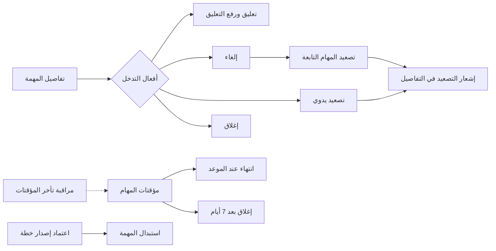
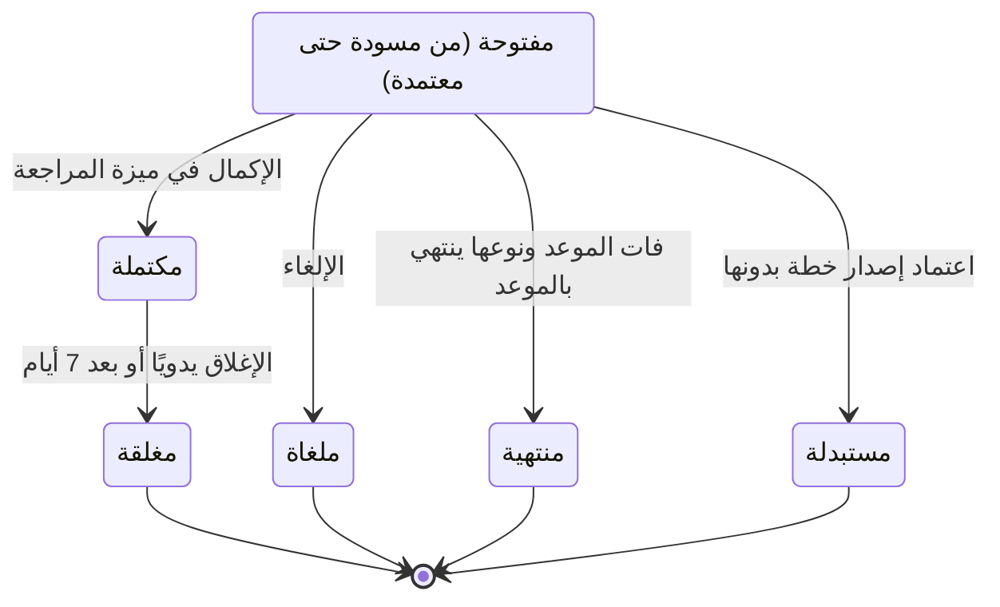

# متابعة المهام والتدخل

<!-- BEGIN GENERATED: doc -->
| البند | القيمة |
|---|---|
| المعرّف | FEAT-OPS-TASK-CONTROL |
| الإصدار | 0.2 |
| الحالة | مسودة |
| القدرة | CAP-07 التخطيط والتنفيذ |
| القدرة الفرعية | CAP-07.03 إدارة المهام (R1) |
| الأدوار | المخطِّط؛ المدير؛ مالك المهمة؛ المسند إليه؛ النظام |
| الشاشات | SCR-02 تفاصيل المهمة وسجلها |
| حالات الاستخدام | UC-046 |
| القصص | 13: 8 من المواصفة، و5 جديدة |
<!-- END GENERATED: doc -->

## 1. نظرة عامة

### 1.1 القيمة

يتدخل المخطط أو المدير في مهام جارية فيعلّقها أو يلغيها أو يصعّدها، ويغلق النظام المهام المنتهية أو المتجاوزة آليًا.

### 1.2 النطاق

| البند | القيمة |
|---|---|
| المستخدمون | المخطِّط والمدير ضمن نطاقهما، ومالك المهمة، والمسند إليه (للتصعيد فقط)، والنظام، وفريق المنصة والتشغيل |
| الشاشات | SCR-02 تفاصيل المهمة وسجلها |
| حالات الاستخدام | تصعيد المهمة (UC-046) |
| المتطلبات | المهمة تتبع دورة حالات محددة (REQ-OPS-006)، والتصعيد يبلّغ المستوى الأعلى ولا يغيّر الحالة (REQ-OPS-012)، والتصعيد خلال 60 ثانية من الموعد (QAS-OPS-002) |
| داخل النطاق | تعليق المهمة ورفع تعليقها، وإلغاؤها، وتصعيدها يدويًا، وإغلاقها، وما يفعله النظام آليًا: الإغلاق بعد 7 أيام، والانتهاء عند الموعد، والاستبدال باعتماد إصدار خطة، وتصعيد المهام التابعة، ومؤقتات المهام ومراقبتها |
| خارج النطاق | إنشاء المهمة وإسنادها وتعديل موعدها (تخطيط المهام)، وتنفيذها وتقديمها («مهامي»)، ومراجعتها وإكمالها (مراجعة نتيجة المهمة)، والتصعيد الآلي عند فوات الموعد (قصة «تصعيد المهمة عند فوات موعدها» في ميزة «مهامي») |

### 1.3 خريطة الميزة

**الشكل 1: خريطة متابعة المهام والتدخل**



**الشكل 2: الحالات التي تنقل إليها الميزة المهمة**



> **ملاحظة:** الانتهاء لا يشمل المهمة «المعتمدة»، والإلغاء والاستبدال لا يشملان «المكتملة». والتعليق والتصعيد لا يغيّران الحالة في الشكل 2: التعليق علامة على المهمة، والتصعيد إشعار وسجل.

## 2. القواعد المشتركة

تنطبق على كل قصص الميزة، فلا تتكرر داخل القصص. وكل قصة تذكر ما يخصها فقط.

### 2.1 السياق المشترك

كل قصة تبدأ من ثلاثة شروط: مستأجر نشط، وحزمة السياسات الأساسية مفعّلة، ومستخدم مسجّل الدخول ومخوَّل. وتشير إليها القصص بخطوة واحدة: «بفرض السياق المشترك للميزة».

### 2.2 الصلاحية وعدم الإفصاح

- من لا يحق له رؤية العنصر يتلقى ردًا بشكل «غير متاح» تمامًا، فلا يعرف أنه موجود.
- من يرى العنصر ولا يحق له الإجراء يتلقى «لا تملك صلاحية هذا الإجراء».

### 2.3 أوامر تغيير الحالة

- **منع التكرار:** يُرسل كل أمر بمفتاح فريد، فإعادة الطلب نفسه لا تُنفَّذ مرتين.
- **حماية التعديل المتزامن:** يُرسل كل أمر بإصدار البيانات الذي يراه المستخدم. فإن عدّلها غيره في الأثناء، يُرفض الأمر.
- **السجل:** إن نجح الأمر، يُكتب حدثه وسجل التدقيق في المعاملة نفسها.

### 2.4 الرفض المشترك

```gherkin
# language: ar
خاصية: الرفض المشترك لأوامر الميزة

  سيناريو مخطط: رفض مشترك لكل أمر في الميزة
    بفرض السياق المشترك للميزة
    و <الحالة>
    عندما يُرسل المستخدم أي أمر من أوامر الميزة
    اذاً يُرفض برمز <الرمز> ويرى "<الرسالة>"
    و لا يتغير شيء

    امثلة:
      | الحالة                                  | الرمز                  | الرسالة                                                 |
      | العنصر خارج صلاحياته                    | NOT_FOUND              | غير متاح                                                |
      | العنصر مرئي له ولا يحق له الإجراء       | AUTHZ_DENIED           | لا تملك صلاحية هذا الإجراء                              |
      | غيره عدّل العنصر بعد أن فتحه            | VERSION_CONFLICT       | تغيّرت البيانات منذ فتحتها. راجع التغييرات ثم أعد المحاولة |
      | أعاد مفتاح منع التكرار بمحتوى مختلف     | IDEMPOTENCY_KEY_REUSED | طلب مكرر بمحتوى مختلف                                   |
      | البيانات ناقصة أو غير صحيحة             | VALIDATION_FAILED      | بعض البيانات ناقصة أو غير صحيحة. راجع الحقول المعلَّمة      |

  سيناريو: إعادة الطلب نفسه لا تُنفَّذ مرتين
    بفرض السياق المشترك للميزة
    و أمر نجح بمفتاح منع تكرار
    عندما يُعاد الطلب نفسه بالمفتاح نفسه
    اذاً تُعاد النتيجة الأولى ولا يُكتب حدث ثانٍ
```

### 2.5 الحالات النهائية والتعليق

- المهمة «المغلقة» و«الملغاة» و«المرفوضة» و«المنتهية» و«المستبدلة» في حالة نهائية، فلا يُقبل عليها أي أمر من أوامر الميزة.
- المهمة المعلّقة ترفض كل تغيير عدا الإلغاء ورفع التعليق. ورفع التعليق يعيدها إلى حالتها نفسها.
- ما يفعله النظام آليًا يُسجَّل بهوية النظام، ويخضع للقواعد نفسها. وأثر التعليق على الانتقالات الآلية (الإغلاق والانتهاء والاستبدال والتصعيد الآلي) لا تحسمه المصادر **[Needs Review]**.
- كل حدث تسجّله قصص هذه الميزة يصل إلى خمسة مستقبلين: الإشعارات، ومتابعة الخطة، وقياس النتائج، والبحث، وتحرير الموارد (R2).

```gherkin
# language: ar
خاصية: رفض أوامر الميزة على مهمة معلّقة

  سيناريو مخطط: المهمة المعلّقة لا تقبل أوامر الميزة عدا الإلغاء ورفع التعليق
    بفرض السياق المشترك للميزة
    و <الحالة>
    عندما يُرسل المستخدم أي أمر من أوامر الميزة على المهمة عدا الإلغاء ورفع التعليق
    اذاً يُرفض برمز <الرمز> ويرى "<الرسالة>"
    و لا يتغير شيء

    امثلة:
      | الحالة        | الرمز          | الرسالة       |
      | المهمة معلّقة | TASK_SUSPENDED | المهمة معلّقة |
```

## 3. الجودة وتعريف الاكتمال

### 3.1 متطلبات الجودة

<!-- BEGIN GENERATED: quality -->
| المرجع | الموقف | المطلوب |
|---|---|---|
| QAS-OPS-002 | task reaches due_at | escalation event ≤ 60 s after due |
| QAS-REL-003 | update the same object from the same version | 0 silent overwrites |
<!-- END GENERATED: quality -->

### 3.2 تعريف الاكتمال

القصة مكتملة حين تتحقق الشروط الخمسة:

1. سيناريوهاتها والقواعد المشتركة تمر في الاختبار الآلي.
2. فحوص البنية المعمارية تمر.
3. نصوص الواجهة والرسائل موجودة بالعربية والإنجليزية.
4. مراجعة الكود مكتملة.
5. ما تضيفه القصة نفسها في قسم «القواعد» تحقق.

## 4. فهرس القصص

<!-- BEGIN GENERATED: story-index -->
| المعرّف | القصة | النوع | الحالة |
|---|---|---|---|
| `US-BC04-TASK-CANCEL` | إلغاء المهمة | أمر | مسودة |
| `US-BC04-TASK-CLOSE` | إغلاق المهمة | أمر | مسودة |
| `US-BC04-TASK-ESCALATE` | تصعيد المهمة يدويًا | أمر | مسودة |
| `US-BC04-TASK-SUSPEND` | تعليق المهمة | أمر | مسودة |
| `US-BC04-TASK-UNSUSPEND` | رفع تعليق المهمة | أمر | مسودة |
| `US-BC04-S-TASK-02` | إغلاق المهمة المكتملة آليًا بعد 7 أيام | نظام | مسودة |
| `US-BC04-S-TASK-03` | انتهاء المهمة عند موعدها حين يقرر نوعها ذلك | نظام | مسودة |
| `US-BC04-S-TASK-04` | استبدال المهمة عند اعتماد إصدار خطة لا يتضمنها | نظام | مسودة |
| `US-DOM-OPS-TASK-DEP-ESCALATE` | تصعيد المهام التابعة عند إلغاء سابقتها | نظام | مسودة |
| `US-UI-SCR02-CONTROL-ACTIONS` | أفعال التدخل في المهمة حسب الدور والحالة | واجهة | مسودة |
| `US-UI-SCR02-ESCALATION-NOTICE` | إظهار تصعيد المهمة ومستواه وسببه | واجهة | مسودة |
| `US-PLT-TASK-TIMERS` | مؤقتات المهام تعمل خلال 60 ثانية | منصة | مسودة |
| `US-OPS-TASK-TIMER-LAG` | تنبيه عند تأخر مؤقتات المهام | تشغيل | مسودة |
<!-- END GENERATED: story-index -->

## 5. القصص

### 5.1 US-BC04-TASK-CANCEL — إلغاء المهمة

| النوع | الإصدار | الأولوية | دون اتصال | الحالة |
|---|---|---|---|---|
| أمر | R1 | Must | لا | مسودة |

> **كـ** المخطِّط أو المدير، **أريد** أن ألغي مهمة لم تعد مطلوبة مع ذكر السبب، **حتى** يتوقف العمل عليها ويعرف المعنيون لماذا.

**باختصار:** يلغي المخطط أو المدير مهمة مفتوحة بسبب مكتوب، ولو كانت معلّقة، فتصير «ملغاة» نهائيًا.

#### القواعد

- **متى يُسمح:** المهمة في أي حالة غير نهائية عدا «مكتملة». والتعليق لا يمنع الإلغاء (§2.5).
- **من يُسمح له:** المخطِّط أو المدير الذي تقع المهمة في نطاقه التنظيمي.
- **البيانات:** السبب، إلزامي.
- **الأثر:** تصبح المهمة «ملغاة» ولا يُقبل عليها أمر بعد ذلك. ويُسجَّل حدث «أُلغيت المهمة» (§2.5). وتُصعَّد المهام التي تعتمد عليها آليًا (القصة 5.9).

#### معايير القبول

```gherkin
# language: ar
خاصية: إلغاء المهمة

  سيناريو: المخطط يلغي مهمة معلّقة قيد التنفيذ
    بفرض السياق المشترك للميزة
    و مهمة "قيد التنفيذ" معلّقة في نطاق المخطط
    عندما يلغيها مع ذكر السبب
    اذاً تصبح حالتها "ملغاة"
    و يُسجَّل حدث "أُلغيت المهمة" مع السبب

  سيناريو مخطط: رفض خاص بإلغاء المهمة
    بفرض السياق المشترك للميزة
    و <الحالة>
    عندما يحاول المخطط إلغاء المهمة
    اذاً يُرفض برمز <الرمز> ويرى "<الرسالة>"
    و لا يتغير شيء

    امثلة:
      | الحالة                                  | الرمز                         | الرسالة                                   |
      | لم يذكر السبب                           | REASON_REQUIRED               | اذكر السبب                                |
      | المهمة "مكتملة" أو في حالة نهائية       | TASK_INVALID_STATE_TRANSITION | الوضع الحالي للمهمة لا يسمح بهذا الإجراء |
```

<details><summary>المراجع التقنية والتتبع</summary>

<!-- BEGIN GENERATED: refs US-BC04-TASK-CANCEL -->
| البند | المعرّف | المعنى |
|---|---|---|
| الواجهة البرمجية | `POST /api/v1/operations/tasks/{id}/actions/cancel` | — |
| الأمر | `CMD-TASK-CANCEL` | إلغاء المهمة |
| السياسة | `POL-TASK-CANCEL` | Planner/Manager in scope (create, edit, assign, set due, cancel, suspend)؛ tenant match; task visible; org sc… |
| الحدث | `EVT-TASK-CANCELLED` | يصل إلى: Notification service (SLC-06); Plan progress (SLC-08); Outcome measurement (SLC-08); Search projecti… |
| الكيان | `AGG-TASK` | المهمة |
| الجدول | `operations.tasks` | الجدول الرئيسي للمهمة |
| وحدة النشر | DU-08 | — |
| المتطلبات | REQ-OPS-006، REQ-OPS-007، REQ-OPS-008، REQ-OPS-009، REQ-OPS-010، REQ-OPS-011، REQ-OPS-012 | معانيها في القسم 6. التتبع |
| حالة الاستخدام | UC-046 | Escalate Task |
| الاختبار | TST-TASK-SM، TST-SLC03-INVARIANTS | دورة حالات المهمة، وثوابت الشريحة SLC-03 |
<!-- END GENERATED: refs US-BC04-TASK-CANCEL -->

</details>

### 5.2 US-BC04-TASK-CLOSE — إغلاق المهمة

| النوع | الإصدار | الأولوية | دون اتصال | الحالة |
|---|---|---|---|---|
| أمر | R1 | Must | لا | مسودة |

> **كـ** مالك المهمة أو المخطِّط، **أريد** أن أغلق مهمة مكتملة انتهت متابعاتها، **حتى** تخرج من المتابعة دون انتظار الإغلاق الآلي.

**باختصار:** بعد اكتمال المهمة وانتهاء كل مهام المتابعة المرتبطة بها، يغلقها مالكها أو المخطط إداريًا فتصير «مغلقة».

#### القواعد

- **متى يُسمح:** المهمة «مكتملة»، وغير معلّقة، ولا مهمة متابعة مفتوحة مرتبطة بها.
- **من يُسمح له:** مالك المهمة أو المخطِّط، والمهمة في نطاقه التنظيمي.
- **البيانات:** ملاحظة اختيارية.
- **الأثر:** تصبح المهمة «مغلقة»، وهي حالة نهائية. ويُسجَّل حدث «أُغلقت المهمة» (§2.5). وإن لم يغلقها أحد، يغلقها النظام بعد 7 أيام (القصة 5.6).

#### معايير القبول

```gherkin
# language: ar
خاصية: إغلاق المهمة

  سيناريو: المالك يغلق مهمة مكتملة بلا متابعات مفتوحة
    بفرض السياق المشترك للميزة
    و مهمة "مكتملة" يملكها المستخدم ولا مهمة متابعة مفتوحة لها
    عندما يغلقها مع ملاحظة
    اذاً تصبح حالتها "مغلقة"
    و يُسجَّل حدث "أُغلقت المهمة"

  سيناريو مخطط: رفض خاص بإغلاق المهمة
    بفرض السياق المشترك للميزة
    و <الحالة>
    عندما يحاول المالك إغلاق المهمة
    اذاً يُرفض برمز <الرمز> ويرى "<الرسالة>"
    و لا يتغير شيء

    امثلة:
      | الحالة                                   | الرمز                         | الرسالة                                   |
      | للمهمة مهمة متابعة مفتوحة                | OPEN_FOLLOW_UPS               | توجد مهام متابعة مفتوحة                   |
      | المهمة ليست "مكتملة"                     | TASK_INVALID_STATE_TRANSITION | الوضع الحالي للمهمة لا يسمح بهذا الإجراء |
```

<details><summary>المراجع التقنية والتتبع</summary>

<!-- BEGIN GENERATED: refs US-BC04-TASK-CLOSE -->
| البند | المعرّف | المعنى |
|---|---|---|
| الواجهة البرمجية | `POST /api/v1/operations/tasks/{id}/actions/close` | — |
| الأمر | `CMD-TASK-CLOSE` | إغلاق المهمة |
| السياسة | `POL-TASK-CLOSE` | owner / Planner؛ tenant match; task visible; org scope |
| الحدث | `EVT-TASK-CLOSED` | يصل إلى: Notification service (SLC-06); Plan progress (SLC-08); Outcome measurement (SLC-08); Search projecti… |
| الكيان | `AGG-TASK` | المهمة |
| الجدول | `operations.tasks` | الجدول الرئيسي للمهمة |
| وحدة النشر | DU-08 | — |
| المتطلبات | REQ-OPS-006، REQ-OPS-007، REQ-OPS-008، REQ-OPS-009، REQ-OPS-010، REQ-OPS-011، REQ-OPS-012 | معانيها في القسم 6. التتبع |
| حالة الاستخدام | UC-046 | Escalate Task |
| الاختبار | TST-TASK-SM، TST-SLC03-INVARIANTS | دورة حالات المهمة، وثوابت الشريحة SLC-03 |
<!-- END GENERATED: refs US-BC04-TASK-CLOSE -->

</details>

### 5.3 US-BC04-TASK-ESCALATE — تصعيد المهمة يدويًا

| النوع | الإصدار | الأولوية | دون اتصال | الحالة |
|---|---|---|---|---|
| أمر | R1 | Must | لا | مسودة |

> **كـ** المسند إليه أو مالك المهمة أو المخطِّط، **أريد** أن أصعّد مهمة متعثرة مع ذكر السبب، **حتى** يعلم المستوى الأعلى ويتدخل.

**باختصار:** يصعّد أحد المعنيين بالمهمة مهمة مفتوحة بسبب مكتوب، فيُبلَّغ المستوى الأعلى وتبقى حالة المهمة كما هي (REQ-OPS-012).

#### القواعد

- **متى يُسمح:** المهمة في أي حالة غير نهائية، بما فيها «مكتملة»، وغير معلّقة.
- **من يُسمح له:** المسند إليه، أو مالك المهمة، أو المخطِّط، والمهمة في نطاقه التنظيمي.
- **البيانات:** السبب، إلزامي.
- **الأثر:** لا تتغير حالة المهمة، ويرتفع إصدارها. ويُسجَّل حدث «صُعِّدت المهمة» (§2.5)، فتبلّغ خدمة الإشعارات المستوى الأعلى. ويظهر التصعيد في تفاصيل المهمة (القصة 5.11).

#### معايير القبول

```gherkin
# language: ar
خاصية: تصعيد المهمة يدويًا

  سيناريو: المسند إليه يصعّد مهمة محجوبة
    بفرض السياق المشترك للميزة
    و مهمة "محجوبة" مسندة إلى المستخدم وغير معلّقة
    عندما يصعّدها مع ذكر السبب
    اذاً تبقى حالتها "محجوبة" ويرتفع إصدارها
    و يُسجَّل حدث "صُعِّدت المهمة" ويُبلَّغ المستوى الأعلى

  سيناريو مخطط: رفض خاص بتصعيد المهمة
    بفرض السياق المشترك للميزة
    و <الحالة>
    عندما يحاول المستخدم تصعيد المهمة
    اذاً يُرفض برمز <الرمز> ويرى "<الرسالة>"
    و لا يتغير شيء

    امثلة:
      | الحالة                         | الرمز                         | الرسالة                                   |
      | لم يذكر السبب                  | REASON_REQUIRED               | اذكر السبب                                |
      | المهمة في حالة نهائية          | TASK_INVALID_STATE_TRANSITION | الوضع الحالي للمهمة لا يسمح بهذا الإجراء |
```

<details><summary>المراجع التقنية والتتبع</summary>

<!-- BEGIN GENERATED: refs US-BC04-TASK-ESCALATE -->
| البند | المعرّف | المعنى |
|---|---|---|
| الواجهة البرمجية | `POST /api/v1/operations/tasks/{id}/actions/escalate` | — |
| الأمر | `CMD-TASK-ESCALATE` | تصعيد المهمة |
| السياسة | `POL-TASK-ESCALATE` | assignee, owner, Planner؛ tenant match; task visible; org scope |
| الحدث | `EVT-TASK-ESCALATED` | يصل إلى: Notification service (SLC-06); Plan progress (SLC-08); Outcome measurement (SLC-08); Search projecti… |
| الكيان | `AGG-TASK` | المهمة |
| الجدول | `operations.tasks` | الجدول الرئيسي للمهمة |
| وحدة النشر | DU-08 | — |
| المتطلبات | REQ-OPS-006، REQ-OPS-007، REQ-OPS-008، REQ-OPS-009، REQ-OPS-010، REQ-OPS-011، REQ-OPS-012 | معانيها في القسم 6. التتبع |
| حالة الاستخدام | UC-046 | Escalate Task |
| الاختبار | TST-TASK-SM، TST-SLC03-INVARIANTS | دورة حالات المهمة، وثوابت الشريحة SLC-03 |
<!-- END GENERATED: refs US-BC04-TASK-ESCALATE -->

</details>

### 5.4 US-BC04-TASK-SUSPEND — تعليق المهمة

| النوع | الإصدار | الأولوية | دون اتصال | الحالة |
|---|---|---|---|---|
| أمر | R1 | Must | لا | مسودة |

> **كـ** المخطِّط أو المدير، **أريد** أن أعلّق مهمة مؤقتًا مع ذكر السبب، **حتى** يتوقف أي تغيير عليها إلى أن أقرر استئنافها أو إلغاءها.

**باختصار:** يضع المخطط أو المدير علامة التعليق على مهمة مفتوحة، فتبقى في حالتها ويُرفض كل تغيير عليها عدا الإلغاء ورفع التعليق.

#### القواعد

- **متى يُسمح:** المهمة في أي حالة غير نهائية، وغير معلّقة من قبل.
- **من يُسمح له:** المخطِّط أو المدير الذي تقع المهمة في نطاقه التنظيمي.
- **البيانات:** السبب، إلزامي.
- **الأثر:** تُعلَّم المهمة «معلّقة» دون تغيير حالتها، ويرتفع إصدارها. ويُسجَّل حدث «عُلِّقت المهمة» (§2.5). ويتلقى المسند إليه «المهمة معلّقة» إن حاول أي فعل عليها.

#### معايير القبول

```gherkin
# language: ar
خاصية: تعليق المهمة

  سيناريو: المدير يعلّق مهمة قيد التنفيذ
    بفرض السياق المشترك للميزة
    و مهمة "قيد التنفيذ" غير معلّقة في نطاق المدير
    عندما يعلّقها مع ذكر السبب
    اذاً تبقى حالتها "قيد التنفيذ" وتحمل علامة "معلّقة"
    و يُسجَّل حدث "عُلِّقت المهمة"

  سيناريو مخطط: رفض خاص بتعليق المهمة
    بفرض السياق المشترك للميزة
    و <الحالة>
    عندما يحاول المدير تعليق المهمة
    اذاً يُرفض برمز <الرمز> ويرى "<الرسالة>"
    و لا يتغير شيء

    امثلة:
      | الحالة                         | الرمز                         | الرسالة                                   |
      | لم يذكر السبب                  | REASON_REQUIRED               | اذكر السبب                                |
      | المهمة في حالة نهائية          | TASK_INVALID_STATE_TRANSITION | الوضع الحالي للمهمة لا يسمح بهذا الإجراء |
      | المهمة معلّقة من قبل           | TASK_SUSPENDED                | المهمة معلّقة                             |
```

<details><summary>المراجع التقنية والتتبع</summary>

<!-- BEGIN GENERATED: refs US-BC04-TASK-SUSPEND -->
| البند | المعرّف | المعنى |
|---|---|---|
| الواجهة البرمجية | `POST /api/v1/operations/tasks/{id}/actions/suspend` | — |
| الأمر | `CMD-TASK-SUSPEND` | تعليق المهمة |
| السياسة | `POL-TASK-SUSPEND` | Planner/Manager in scope (create, edit, assign, set due, cancel, suspend)؛ tenant match; task visible; org sc… |
| الحدث | `EVT-TASK-SUSPENDED` | يصل إلى: Notification service (SLC-06); Plan progress (SLC-08); Outcome measurement (SLC-08); Search projecti… |
| الكيان | `AGG-TASK` | المهمة |
| الجدول | `operations.tasks` | الجدول الرئيسي للمهمة |
| وحدة النشر | DU-08 | — |
| المتطلبات | REQ-OPS-006، REQ-OPS-007، REQ-OPS-008، REQ-OPS-009، REQ-OPS-010، REQ-OPS-011، REQ-OPS-012 | معانيها في القسم 6. التتبع |
| حالة الاستخدام | UC-046 | Escalate Task |
| الاختبار | TST-TASK-SM، TST-SLC03-INVARIANTS | دورة حالات المهمة، وثوابت الشريحة SLC-03 |
<!-- END GENERATED: refs US-BC04-TASK-SUSPEND -->

</details>

### 5.5 US-BC04-TASK-UNSUSPEND — رفع تعليق المهمة

| النوع | الإصدار | الأولوية | دون اتصال | الحالة |
|---|---|---|---|---|
| أمر | R1 | Must | لا | مسودة |

> **كـ** المخطِّط أو المدير، **أريد** أن أرفع التعليق عن مهمة مع ذكر السبب، **حتى** يستأنف المسند إليه العمل من حيث توقف.

**باختصار:** يرفع المخطط أو المدير علامة التعليق، فتعود المهمة إلى حالتها نفسها وتُقبل عليها الأوامر من جديد.

#### القواعد

- **متى يُسمح:** المهمة معلّقة، وفي حالة غير نهائية.
- **من يُسمح له:** المخطِّط أو المدير الذي تقع المهمة في نطاقه التنظيمي.
- **البيانات:** السبب، إلزامي.
- **الأثر:** تُزال علامة التعليق وتبقى الحالة كما كانت عند التعليق، ويرتفع الإصدار. ويُسجَّل حدث «رُفع تعليق المهمة» (§2.5).

#### معايير القبول

```gherkin
# language: ar
خاصية: رفع تعليق المهمة

  سيناريو: المخطط يرفع التعليق عن مهمة مقبولة
    بفرض السياق المشترك للميزة
    و مهمة "مقبولة" معلّقة في نطاق المخطط
    عندما يرفع تعليقها مع ذكر السبب
    اذاً تبقى حالتها "مقبولة" دون علامة التعليق
    و يُسجَّل حدث "رُفع تعليق المهمة"

  سيناريو مخطط: رفض خاص برفع التعليق
    بفرض السياق المشترك للميزة
    و <الحالة>
    عندما يحاول المخطط رفع تعليق المهمة
    اذاً يُرفض برمز <الرمز> ويرى "<الرسالة>"
    و لا يتغير شيء

    امثلة:
      | الحالة                         | الرمز                         | الرسالة                                   |
      | المهمة غير معلّقة              | NOT_SUSPENDED                 | المهمة غير معلّقة                         |
      | لم يذكر السبب                  | VALIDATION_FAILED             | السبب مطلوب                               |
      | المهمة في حالة نهائية          | TASK_INVALID_STATE_TRANSITION | الوضع الحالي للمهمة لا يسمح بهذا الإجراء |
```

<details><summary>المراجع التقنية والتتبع</summary>

<!-- BEGIN GENERATED: refs US-BC04-TASK-UNSUSPEND -->
| البند | المعرّف | المعنى |
|---|---|---|
| الواجهة البرمجية | `POST /api/v1/operations/tasks/{id}/actions/unsuspend` | — |
| الأمر | `CMD-TASK-UNSUSPEND` | رفع تعليق المهمة |
| السياسة | `POL-TASK-UNSUSPEND` | Planner/Manager in scope (create, edit, assign, set due, cancel, suspend)؛ tenant match; task visible; org sc… |
| الحدث | `EVT-TASK-UNSUSPENDED` | يصل إلى: Notification service (SLC-06); Plan progress (SLC-08); Outcome measurement (SLC-08); Search projecti… |
| الكيان | `AGG-TASK` | المهمة |
| الجدول | `operations.tasks` | الجدول الرئيسي للمهمة |
| وحدة النشر | DU-08 | — |
| المتطلبات | REQ-OPS-006، REQ-OPS-007، REQ-OPS-008، REQ-OPS-009، REQ-OPS-010، REQ-OPS-011، REQ-OPS-012 | معانيها في القسم 6. التتبع |
| حالة الاستخدام | UC-046 | Escalate Task |
| الاختبار | TST-TASK-SM، TST-SLC03-INVARIANTS | دورة حالات المهمة، وثوابت الشريحة SLC-03 |
<!-- END GENERATED: refs US-BC04-TASK-UNSUSPEND -->

</details>

### 5.6 US-BC04-S-TASK-02 — إغلاق المهمة المكتملة آليًا بعد 7 أيام

| النوع | الإصدار | الأولوية | دون اتصال | الحالة |
|---|---|---|---|---|
| نظام | R1 | Must | لا ينطبق | مسودة |

> **كـ** النظام، **أريد** أن أغلق المهمة المكتملة بعد 7 أيام بلا متابعات مفتوحة، **حتى** لا تبقى المهام المنتهية في المتابعة بلا داعٍ.

**باختصار:** يفحص المجدول يوميًا المهام المكتملة منذ 7 أيام، ويغلق منها ما ليست له مهمة متابعة مفتوحة.

#### القواعد

- **متى يحدث:** مرت 7 أيام على اكتمال المهمة، ولا مهمة متابعة مفتوحة مرتبطة بها. والفحص يومي.
- **الأثر:** تصبح المهمة «مغلقة»، ويُسجَّل حدث «أُغلقت المهمة» (§2.5) وسجل تدقيق بهوية النظام. وإن بقيت متابعة مفتوحة تبقى المهمة «مكتملة» حتى تُغلق يدويًا أو في فحص لاحق.

#### معايير القبول

```gherkin
# language: ar
خاصية: إغلاق المهمة المكتملة آليًا

  سيناريو: مرت 7 أيام بلا متابعات مفتوحة
    بفرض مهمة "مكتملة" منذ 7 أيام ولا مهمة متابعة مفتوحة لها
    عندما يحين الفحص اليومي للمجدول
    اذاً تصبح حالتها "مغلقة"
    و يُسجَّل حدث "أُغلقت المهمة" وسجل تدقيق بهوية النظام

  سيناريو: متابعة مفتوحة تمنع الإغلاق
    بفرض مهمة "مكتملة" منذ 7 أيام ولها مهمة متابعة مفتوحة
    عندما يحين الفحص اليومي للمجدول
    اذاً تبقى حالتها "مكتملة" ولا يُسجَّل أي حدث
```

<details><summary>المراجع التقنية والتتبع</summary>

<!-- BEGIN GENERATED: refs US-BC04-S-TASK-02 -->
| البند | المعرّف | المعنى |
|---|---|---|
| المحفِّز | `SYS:follow-up window (7 d) elapsed without open follow-ups` | scheduler |
| الانتقال | COMPLETED ← CLOSED | — |
| الحدث | `EVT-TASK-CLOSED` | يصل إلى: Notification service (SLC-06); Plan progress (SLC-08); Outcome measurement (SLC-08); Search projecti… |
| الكيان | `AGG-TASK` | المهمة |
| الجدول | `operations.tasks` | الجدول الرئيسي للمهمة |
| وحدة النشر | DU-08 | — |
| المتطلبات | REQ-OPS-006، REQ-OPS-007، REQ-OPS-008، REQ-OPS-009، REQ-OPS-010، REQ-OPS-011، REQ-OPS-012 | معانيها في القسم 6. التتبع |
| حالة الاستخدام | UC-046 | Escalate Task |
| الاختبار | TST-TASK-SM، TST-SLC03-INVARIANTS | دورة حالات المهمة، وثوابت الشريحة SLC-03 |
<!-- END GENERATED: refs US-BC04-S-TASK-02 -->

</details>

### 5.7 US-BC04-S-TASK-03 — انتهاء المهمة عند موعدها حين يقرر نوعها ذلك

| النوع | الإصدار | الأولوية | دون اتصال | الحالة |
|---|---|---|---|---|
| نظام | R1 | Must | لا ينطبق | مسودة |

> **كـ** النظام، **أريد** أن أنهي المهمة حين يفوت موعدها ونوعها لا قيمة له بعد وقته، **حتى** لا يُنفَّذ عمل فات أوانه.

**باختصار:** عند موعد المهمة، إن كان نوعها يعلن أنها تنتهي بالموعد، ينقلها النظام إلى «منتهية» خلال 60 ثانية. وفي غير ذلك يكون التصعيد هو الافتراضي.

#### القواعد

- **متى يحدث:** حلّ موعد المهمة، ونوعها يعلن الانتهاء بالموعد، وحالتها من «مسودة» حتى «قيد المراجعة».
- **الأثر:** تصبح المهمة «منتهية»، وهي حالة نهائية، خلال 60 ثانية من الموعد. ويُسجَّل حدث «انتهت المهمة» (§2.5) وسجل تدقيق بهوية النظام.

#### معايير القبول

```gherkin
# language: ar
خاصية: انتهاء المهمة عند موعدها

  سيناريو: فات موعد مهمة نوعها ينتهي بالموعد
    بفرض مهمة "قيد التنفيذ" نوعها يعلن الانتهاء بالموعد
    عندما يحل موعدها
    اذاً تصبح حالتها "منتهية" خلال 60 ثانية
    و يُسجَّل حدث "انتهت المهمة" وسجل تدقيق بهوية النظام

  سيناريو: نوع لا ينتهي بالموعد أو مهمة معتمدة
    بفرض مهمة فات موعدها ونوعها لا يعلن الانتهاء بالموعد أو حالتها "معتمدة"
    عندما يحين وقت فحص المجدول
    اذاً لا تنتهي المهمة وتبقى حالتها كما هي
```

<details><summary>المراجع التقنية والتتبع</summary>

<!-- BEGIN GENERATED: refs US-BC04-S-TASK-03 -->
| البند | المعرّف | المعنى |
|---|---|---|
| المحفِّز | `SYS:due passed and task type expires_on_due` | scheduler; only when the task type declares expires_on_due = true (OQ-032) |
| الانتقال | DRAFT, READY, ASSIGNED, ACCEPTED, IN_PROGRESS, BLOCKED, SUBMITTED, UNDER_REVIEW ← EXPIRED | — |
| الحدث | `EVT-TASK-EXPIRED` | يصل إلى: Notification service (SLC-06); Plan progress (SLC-08); Outcome measurement (SLC-08); Search projecti… |
| الكيان | `AGG-TASK` | المهمة |
| الجدول | `operations.tasks` | الجدول الرئيسي للمهمة |
| وحدة النشر | DU-08 | — |
| المتطلبات | REQ-OPS-006، REQ-OPS-007، REQ-OPS-008، REQ-OPS-009، REQ-OPS-010، REQ-OPS-011، REQ-OPS-012 | معانيها في القسم 6. التتبع |
| حالة الاستخدام | UC-046 | Escalate Task |
| الاختبار | TST-TASK-SM، TST-SLC03-INVARIANTS | دورة حالات المهمة، وثوابت الشريحة SLC-03 |
<!-- END GENERATED: refs US-BC04-S-TASK-03 -->

</details>

### 5.8 US-BC04-S-TASK-04 — استبدال المهمة عند اعتماد إصدار خطة لا يتضمنها

| النوع | الإصدار | الأولوية | دون اتصال | الحالة |
|---|---|---|---|---|
| نظام | R1 | Must | لا ينطبق | مسودة |

> **كـ** النظام، **أريد** أن أعلّم المهمة «مستبدلة» حين يُعتمد إصدار خطة لم تعد فيه، **حتى** تطابق المهام الخطة السارية.

**باختصار:** بعد اعتماد إصدار جديد للخطة، تقارن مزامنة المهام بينه وبين السابق، فتستبدل المهام المفتوحة لنشاط حُذف، أو لنشاط تغيرت معاييره بعد الإسناد.

#### القواعد

- **متى يحدث:** اعتُمد إصدار خطة حذف نشاط المهمة، أو غيّر معاييرها وهي مسندة أو بعد ذلك. والمهمة في حالة من «مسودة» حتى «معتمدة».
- **الأثر:** تصبح المهمة «مستبدلة»، وهي حالة نهائية، ويُسجَّل حدث «استُبدلت المهمة» (§2.5) وسجل تدقيق بهوية النظام. وفي حالة تغيّر المعايير تُنشأ مهمة جديدة بالمعايير الجديدة. وتكتمل المزامنة لخطة من 500 نشاط خلال 60 ثانية، وإعادة تشغيلها لا تضيف شيئًا (QAS-PERF-021).

#### معايير القبول

```gherkin
# language: ar
خاصية: استبدال المهمة عند اعتماد إصدار خطة

  سيناريو: نشاط المهمة حُذف من الإصدار المعتمد
    بفرض مهمة "مسندة" لنشاط في الإصدار المعتمد للخطة
    عندما يُعتمد إصدار جديد حُذف منه هذا النشاط
    اذاً تصبح حالتها "مستبدلة"
    و يُسجَّل حدث "استُبدلت المهمة" وسجل تدقيق بهوية النظام

  سيناريو: نشاط باقٍ بلا تغيير في معاييره
    بفرض مهمة "قيد التنفيذ" لنشاط لم تتغير معاييره في الإصدار الجديد
    عندما يُعتمد الإصدار الجديد
    اذاً تبقى المهمة في حالتها ولا يُسجَّل استبدال
```

<details><summary>المراجع التقنية والتتبع</summary>

<!-- BEGIN GENERATED: refs US-BC04-S-TASK-04 -->
| البند | المعرّف | المعنى |
|---|---|---|
| المحفِّز | `SYS:plan version baselined without this task` | SLC-08 trigger |
| الانتقال | DRAFT, READY, ASSIGNED, ACCEPTED, IN_PROGRESS, BLOCKED, SUBMITTED, UNDER_REVIEW, APPROVED ← SUPERSEDED | — |
| الحدث | `EVT-TASK-SUPERSEDED` | يصل إلى: Notification service (SLC-06); Plan progress (SLC-08); Outcome measurement (SLC-08); Search projecti… |
| الكيان | `AGG-TASK` | المهمة |
| الجدول | `operations.tasks` | الجدول الرئيسي للمهمة |
| وحدة النشر | DU-08 | — |
| المتطلبات | REQ-OPS-006، REQ-OPS-007، REQ-OPS-008، REQ-OPS-009، REQ-OPS-010، REQ-OPS-011، REQ-OPS-012 | معانيها في القسم 6. التتبع |
| حالة الاستخدام | UC-046 | Escalate Task |
| الاختبار | TST-TASK-SM، TST-SLC03-INVARIANTS | دورة حالات المهمة، وثوابت الشريحة SLC-03 |
<!-- END GENERATED: refs US-BC04-S-TASK-04 -->

</details>

### 5.9 US-DOM-OPS-TASK-DEP-ESCALATE — تصعيد المهام التابعة عند إلغاء سابقتها

| النوع | الإصدار | الأولوية | دون اتصال | الحالة |
|---|---|---|---|---|
| نظام | R1 | Must | لا ينطبق | مسودة |

> **كـ** النظام، **أريد** أن أصعّد المهام التي تعتمد على مهمة أُلغيت، **حتى** يقرر المستوى الأعلى مصيرها، لأنها لا تبدأ إلا بعد اكتمال سابقتها، وقد أُلغيت.

**باختصار:** حين تُلغى مهمة، يصعّد النظام كل مهمة مفتوحة تعتمد عليها، دون تغيير حالتها.

#### القواعد

- **متى يحدث:** سُجِّل حدث «أُلغيت المهمة» لمهمة هي سابقة لمهمة أخرى أو أكثر.
- **الأثر:** لكل مهمة تابعة في حالة غير نهائية يُسجَّل حدث «صُعِّدت المهمة» بهوية النظام، فيُبلَّغ المستوى الأعلى، وتبقى حالتها كما هي (REQ-OPS-012).
- **[Derived]** اقتصار التصعيد على التابعة غير النهائية، وذكر إلغاء السابقة سببًا للتصعيد. والمواصفة لا تعرّف أمرًا أو انتقالًا لهذا التصعيد.

#### معايير القبول

```gherkin
# language: ar
خاصية: تصعيد المهام التابعة عند إلغاء سابقتها

  سيناريو: أُلغيت مهمة لها تابعة مفتوحة
    بفرض مهمة "مقبولة" تعتمد على مهمة سابقة
    عندما تُلغى المهمة السابقة
    اذاً تبقى التابعة "مقبولة"
    و يُسجَّل لها حدث "صُعِّدت المهمة" بسبب إلغاء سابقتها ويُبلَّغ المستوى الأعلى

  سيناريو: التابعة في حالة نهائية
    بفرض مهمة "ملغاة" تعتمد على مهمة سابقة
    عندما تُلغى المهمة السابقة
    اذاً لا يُسجَّل للتابعة أي تصعيد
```

<details><summary>المراجع التقنية والتتبع</summary>

<!-- BEGIN GENERATED: refs US-DOM-OPS-TASK-DEP-ESCALATE -->
| البند | المعرّف | المعنى |
|---|---|---|
| المصدر | `task-lifecycle-rules.md §4` | — |
| المصدر | `[Derived]` | — |
| المتطلب | REQ-OPS-012 | When a task is escalated, the system shall notify the next authority level and keep the task state unchanged. |
| حالة الاستخدام | UC-046 | Escalate Task |
<!-- END GENERATED: refs US-DOM-OPS-TASK-DEP-ESCALATE -->

</details>

### 5.10 US-UI-SCR02-CONTROL-ACTIONS — أفعال التدخل في المهمة حسب الدور والحالة

| النوع | الإصدار | الأولوية | دون اتصال | الحالة |
|---|---|---|---|---|
| واجهة | R1 | Must | لا | مسودة |

> **كـ** المستخدم، **أريد** أن أرى أفعال التدخل التي يسمح بها دوري وحالة المهمة فقط، **حتى** لا أجرّب فعلًا سيُرفض.

**باختصار:** تعرض شاشة تفاصيل المهمة أزرار الإلغاء والتعليق ورفع التعليق والتصعيد والإغلاق بحسب صلاحيات المستخدم وحالة المهمة المعروضة. والعرض تلميح، والخادم يبقى الحكم.

#### القواعد

- يظهر الفعل إذا شملته صلاحيات المستخدم في سياقه الأمني، وسمحت به حالة المهمة المعروضة (§2.5):
  - الإلغاء في كل حالة غير نهائية عدا «مكتملة»، ولو كانت معلّقة؛
  - التعليق والتصعيد في كل حالة غير نهائية إن لم تكن معلّقة؛
  - رفع التعليق إن كانت معلّقة، والإغلاق إن كانت «مكتملة» وغير معلّقة.
- الإلغاء والتعليق ورفع التعليق والتصعيد تفتح نموذجًا بحقل سبب إلزامي، والإغلاق بملاحظة اختيارية.
- هذه الأفعال لا تعمل دون اتصال، فلا تظهر في التطبيق الميداني وهو دون اتصال.
- **[Derived]** قاعدة العرض نفسها، لأن العقود لا تعيد قائمة بالأفعال المسموحة (21-ui-design.md §6.3).

#### معايير القبول

```gherkin
# language: ar
خاصية: أفعال التدخل في تفاصيل المهمة

  سيناريو: المخطط يفتح مهمة قيد التنفيذ
    بفرض السياق المشترك للميزة
    و مهمة "قيد التنفيذ" غير معلّقة في نطاق المخطط
    عندما يفتح تفاصيلها
    اذاً تظهر أزرار الإلغاء والتعليق والتصعيد
    لكن لا يظهر زر رفع التعليق ولا زر الإغلاق

  سيناريو: مهمة معلّقة
    بفرض السياق المشترك للميزة
    و مهمة معلّقة في نطاق المدير
    عندما يفتح تفاصيلها
    اذاً يظهر زرا الإلغاء ورفع التعليق فقط

  سيناريو مخطط: الخادم يرفض فعلًا ظاهرًا
    بفرض السياق المشترك للميزة
    و <الحالة>
    عندما ينفّذ المستخدم الفعل
    اذاً يرى "<الرسالة>" برمز <الرمز>
    و تُعاد قراءة المهمة ويُخفى الفعل غير المتاح

    امثلة:
      | الحالة                                   | الرمز                         | الرسالة                                   |
      | تغيّرت حالة المهمة أو عُلِّقت بعد عرضها | VERSION_CONFLICT | تغيّرت البيانات منذ فتحتها. راجع التغييرات ثم أعد المحاولة |
```

<details><summary>المراجع التقنية والتتبع</summary>

<!-- BEGIN GENERATED: refs US-UI-SCR02-CONTROL-ACTIONS -->
| البند | المعرّف | المعنى |
|---|---|---|
| الشاشة | SCR-02 | شاشة تفاصيل المهمة وسجلها |
| المصدر | `21-ui-design.md §6.3` | — |
| المصدر | `task-lifecycle-rules.md §1` | — |
| المصدر | `[Derived]` | — |
| المتطلب | REQ-OPS-006 | The system shall manage task state according to state machine SM-TASK and reject any transition not defined i… |
| حالات الاستخدام | UC-040، UC-042، UC-043، UC-044، UC-045 | Create Task؛ Execute Task؛ Submit Task Result؛ Review Task؛ Complete Task |
<!-- END GENERATED: refs US-UI-SCR02-CONTROL-ACTIONS -->

</details>

### 5.11 US-UI-SCR02-ESCALATION-NOTICE — إظهار تصعيد المهمة ومستواه وسببه

| النوع | الإصدار | الأولوية | دون اتصال | الحالة |
|---|---|---|---|---|
| واجهة | R1 | Must | لا | مسودة |

> **كـ** المستخدم، **أريد** أن أرى أنها صُعِّدت، وإلى أي مستوى، ولماذا، **حتى** أعرف أن المستوى الأعلى أُبلغ وأتصرف على هذا الأساس.

**باختصار:** تعرض تفاصيل المهمة شارة تصعيد بجانب شارة الحالة، ومعها المستوى والسبب ومن صعّد ومتى، وتعرض «متأخرة» محسوبة عند القراءة.

#### القواعد

- شارة الحالة لا تتغير بالتصعيد، وشارة التصعيد منفصلة عنها (REQ-OPS-012).
- المستوى: الأول عند الموعد أو بالتصعيد اليدوي، والثاني عند الموعد مع مهلة نوع المهمة.
- السبب: نص التصعيد اليدوي، أو «فات الموعد»، أو «أُلغيت المهمة السابقة». ومن صعّد: اسم المستخدم، أو «النظام».
- شارة «متأخرة» تُحسب عند القراءة من الموعد، فلا تتأخر بتأخر المجدول.
- كل تصعيد يظهر في سجل المهمة بوقته.
- **[Derived]** شكل الشارة وتسمية المستويات ونصوص الأسباب.

#### معايير القبول

```gherkin
# language: ar
خاصية: إظهار تصعيد المهمة

  سيناريو: مهمة صعّدها النظام عند موعدها
    بفرض السياق المشترك للميزة
    و مهمة "قيد التنفيذ" فات موعدها وصعّدها النظام
    عندما يفتح المخطط تفاصيلها
    اذاً تبقى شارة الحالة "قيد التنفيذ"
    و تظهر شارة "متأخرة" وشارة تصعيد بالمستوى الأول والسبب "فات الموعد" ومن صعّد "النظام"

  سيناريو: تصعيد يدوي في السجل
    بفرض السياق المشترك للميزة
    و مهمة صعّدها المسند إليه بسبب مكتوب
    عندما يفتح المالك سجلها
    اذاً يرى التصعيد بوقته واسم من صعّد وسببه

  سيناريو: المجدول متأخر
    بفرض السياق المشترك للميزة
    و مهمة فات موعدها ولم يصعّدها المجدول بعد
    عندما يفتح المخطط تفاصيلها
    اذاً تظهر شارة "متأخرة" دون شارة تصعيد
```

<details><summary>المراجع التقنية والتتبع</summary>

<!-- BEGIN GENERATED: refs US-UI-SCR02-ESCALATION-NOTICE -->
| البند | المعرّف | المعنى |
|---|---|---|
| الشاشة | SCR-02 | شاشة تفاصيل المهمة وسجلها |
| حالة الاستخدام | UC-046 | Escalate Task |
| المصدر | `[Derived]` | — |
| المتطلب | REQ-OPS-012 | When a task is escalated, the system shall notify the next authority level and keep the task state unchanged. |
| حالة الاستخدام | UC-046 | Escalate Task |
<!-- END GENERATED: refs US-UI-SCR02-ESCALATION-NOTICE -->

</details>

### 5.12 US-PLT-TASK-TIMERS — مؤقتات المهام تعمل خلال 60 ثانية

| النوع | الإصدار | الأولوية | دون اتصال | الحالة |
|---|---|---|---|---|
| منصة | R1 | Should | لا ينطبق | مسودة |

> **كـ** فريق المنصة، **أريد** مؤقتات للمهام في قاعدة البيانات يعالجها أكثر من عامل بحجز مؤقت للدلو، **حتى** يقع التصعيد والانتهاء خلال 60 ثانية من الموعد ولا يضيع مؤقت إن توقف عامل.

#### القواعد

- المؤقتات في دلاء زمنية بالدقيقة لكل مستأجر داخل وحدة نشر المهام، بلا محرك سير عمل (TD-13).
- أربعة مؤقتات: الموعد (تصعيد أول)، والموعد مع المهلة (تصعيد ثانٍ)، والموعد للأنواع المنتهية بالموعد (انتهاء)، والاكتمال مع 7 أيام (إغلاق، يوميًا).
- الهدف 60 ثانية من الموعد للثلاثة الأولى (QAS-OPS-002).
- يأخذ العامل الدلو بحجز مؤقت، وإن توقف يأخذه عامل آخر ويعالج المتأخر عند الاستئناف.
- **[Derived]** معالجة المؤقت الواحد مرة واحدة فقط بعد انتقال الحجز.

#### معايير القبول

```gherkin
# language: ar
خاصية: مؤقتات المهام

  سيناريو: التصعيد في الوقت تحت الحمل العادي
    بفرض مهام كثيرة تحل مواعيدها في الدقيقة نفسها
    عندما تحل المواعيد
    اذاً يُسجَّل تصعيد كل مهمة خلال 60 ثانية من موعدها

  سيناريو: توقف عامل أثناء المعالجة
    بفرض عامل يحمل حجزًا مؤقتًا لدلو حلّ وقته
    عندما يتوقف قبل أن ينهي الدلو
    اذاً يأخذ عامل آخر الدلو بعد انتهاء الحجز
    و يُعالج كل مؤقت فيه مرة واحدة فقط
```

<details><summary>المراجع التقنية والتتبع</summary>

<!-- BEGIN GENERATED: refs US-PLT-TASK-TIMERS -->
| البند | المعرّف | المعنى |
|---|---|---|
| الجودة | QAS-OPS-002 | task reaches due_at → escalation event ≤ 60 s after due |
| القرار التقني | TD-13 | PostgreSQL time buckets + leased workers inside owning units (no workflow engine) |
| المصدر | `task-lifecycle-rules.md §3` | — |
<!-- END GENERATED: refs US-PLT-TASK-TIMERS -->

</details>

### 5.13 US-OPS-TASK-TIMER-LAG — تنبيه عند تأخر مؤقتات المهام

| النوع | الإصدار | الأولوية | دون اتصال | الحالة |
|---|---|---|---|---|
| تشغيل | R1 | Should | لا ينطبق | مسودة |

> **كـ** فريق التشغيل، **أريد** تنبيهًا حين يتأخر المجدول عن مواعيد المهام أو يتوقف، **حتى** أتدخل قبل أن تتأخر التصعيدات عن 60 ثانية دون أن يعلم أحد.

#### القواعد

- يُقاس تأخر المجدول بمدرّج زمني، وينطلق التنبيه حين يتجاوز المئين 95 منه 60 ثانية.
- توقف المجدول يُكتشف بنبضات الحياة.
- لوحة وحدة نشر المهام تعرض التأخر وعدد المهام المتأخرة حسب الوحدة.
- **[Derived]** خطورة التنبيه وزوال التنبيه بعد عودة التأخر تحت الحد. وتعريف درجات الخطورة نفسه ناقص في المصادر.

#### معايير القبول

```gherkin
# language: ar
خاصية: تنبيه تأخر مؤقتات المهام

  سيناريو: تأخر المجدول فوق الحد
    بفرض أن المئين 95 لتأخر المجدول تجاوز 60 ثانية
    عندما تُقيَّم قواعد التنبيه
    اذاً يصل تنبيه إلى فريق التشغيل يذكر وحدة النشر ومقدار التأخر

  سيناريو: التأخر تحت الحد
    بفرض أن المئين 95 لتأخر المجدول 60 ثانية أو أقل
    عندما تُقيَّم قواعد التنبيه
    اذاً لا يصل أي تنبيه
```

<details><summary>المراجع التقنية والتتبع</summary>

<!-- BEGIN GENERATED: refs US-OPS-TASK-TIMER-LAG -->
| البند | المعرّف | المعنى |
|---|---|---|
| الجودة | QAS-OPS-002 | task reaches due_at → escalation event ≤ 60 s after due |
| المصدر | `23-crosscutting.md §7` | — |
| القرار التقني | TD-14 | OpenTelemetry SDK + Collector; VictoriaMetrics (metrics), VictoriaLogs (logs), Jaeger (traces), Grafana dashb… |
| المصدر | `[Derived]` | — |
<!-- END GENERATED: refs US-OPS-TASK-TIMER-LAG -->

</details>

## 6. التتبع

<!-- BEGIN GENERATED: trace -->
| المتطلب | المعنى | القصص | الاختبار |
|---|---|---|---|
| REQ-OPS-006 | The system shall manage task state according to state machine SM-TASK and reject any transition not defined i… | `US-BC04-S-TASK-02`، `US-BC04-S-TASK-03`، `US-BC04-S-TASK-04`، `US-BC04-TASK-CANCEL`، `US-BC04-TASK-CLOSE`، `US-BC04-TASK-ESCALATE`، `US-BC04-TASK-SUSPEND`، `US-BC04-TASK-UNSUSPEND`، `US-UI-SCR02-CONTROL-ACTIONS` | TST-SLC03-INVARIANTS، TST-TASK-SM |
| REQ-OPS-007 | When a task is assigned, the system shall verify the assignee's eligibility wherever the task type declares r… | كل قصص الميزة المأخوذة من المواصفة (8) | TST-SLC03-INVARIANTS، TST-TASK-SM، TST-TASK-TYPE-SM |
| REQ-OPS-008 | If a task's completion criteria are not all met, then the system shall reject its completion. | كل قصص الميزة المأخوذة من المواصفة (8) | TST-SLC03-INVARIANTS، TST-TASK-SM |
| REQ-OPS-009 | If the approver of a task result is also its assignee, then the system shall reject the approval unless tenan… | كل قصص الميزة المأخوذة من المواصفة (8) | TST-ROLE-ASSIGNMENT-SM، TST-SLC03-INVARIANTS، TST-TASK-SM |
| REQ-OPS-010 | The system shall link every task to a plan, or record it as an ad-hoc task with an accountable owner and reas… | كل قصص الميزة المأخوذة من المواصفة (8) | TST-SLC03-INVARIANTS، TST-TASK-SM |
| REQ-OPS-011 | The system shall require an idempotency key and the expected version on every state-changing command, and sha… | كل قصص الميزة المأخوذة من المواصفة (8) | TST-SLC03-INVARIANTS، TST-TASK-SM |
| REQ-OPS-012 | When a task is escalated, the system shall notify the next authority level and keep the task state unchanged. | `US-BC04-S-TASK-02`، `US-BC04-S-TASK-03`، `US-BC04-S-TASK-04`، `US-BC04-TASK-CANCEL`، `US-BC04-TASK-CLOSE`، `US-BC04-TASK-ESCALATE`، `US-BC04-TASK-SUSPEND`، `US-BC04-TASK-UNSUSPEND`، `US-DOM-OPS-TASK-DEP-ESCALATE`، `US-UI-SCR02-ESCALATION-NOTICE` | TST-SLC03-INVARIANTS، TST-TASK-SM |
<!-- END GENERATED: trace -->

## 7. سجل التغييرات

| الإصدار | التاريخ | التغيير |
|---|---|---|
| 0.1 | — | هيكل مولَّد من خريطة الميزات |
| 0.2 | 2026-10-02 | كتابة القصص كاملة بمعيار القصص |
| 0.3 | 2026-10-03 | تصحيحات المراجعة المستقلة |
