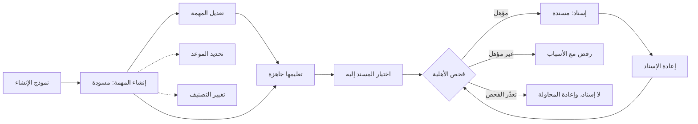
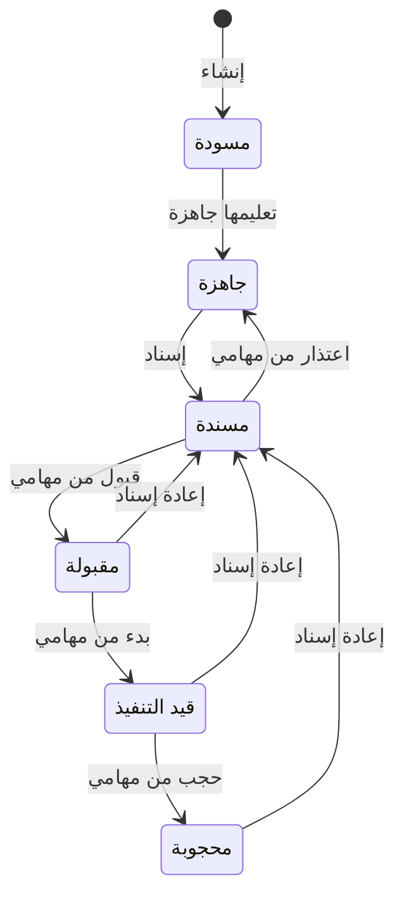

# تخطيط المهام وإسنادها

<!-- BEGIN GENERATED: doc -->
| البند | القيمة |
|---|---|
| المعرّف | FEAT-OPS-TASK-PLANNING |
| الإصدار | 0.2 |
| الحالة | مسودة |
| القدرة | CAP-07 التخطيط والتنفيذ |
| القدرة الفرعية | CAP-07.03 إدارة المهام (R1) |
| الأدوار | المخطِّط؛ المدير |
| الشاشات | SCR-02 تفاصيل المهمة وسجلها، SCR-42 التأهيل والأهلية |
| حالات الاستخدام | UC-040، UC-041، UC-102 |
| القصص | 11: 7 من المواصفة، و4 جديدة |
<!-- END GENERATED: doc -->

## 1. نظرة عامة

### 1.1 القيمة

ينشئ المخطط المهام ويحدد مواعيدها ويسندها لمن هو مؤهل لها، ويعيد إسنادها عند الحاجة.

### 1.2 النطاق

| البند | القيمة |
|---|---|
| المستخدمون | المخطِّط، والمدير ضمن نطاقه |
| الشاشات | تفاصيل المهمة وسجلها (SCR-02)، والتأهيل والأهلية (SCR-42) |
| حالات الاستخدام | إنشاء المهمة (UC-040)، وإسناد المهمة (UC-041)، والتحقق من الأهلية (UC-102) |
| المتطلبات | ربط كل مهمة بخطة أو بسبب ومالك (REQ-OPS-010)، والتحقق من أهلية المسند إليه (REQ-OPS-007)، ودورة حالات المهمة (REQ-OPS-006) |
| الجودة | الإسناد مع فحص الأهلية خلال 500 ms (QAS-PERF-017)، ولا كتابة صامتة فوق تعديل غيره (QAS-REL-003) |
| خارج النطاق | قبول المهمة وتنفيذها (FEAT-OPS-MY-TASKS)، والمراجعة والإكمال (FEAT-OPS-TASK-REVIEW)، والتعليق والإلغاء والتصعيد (FEAT-OPS-TASK-CONTROL)، وتعريف أنواع المهام (FEAT-OPS-TASK-TYPES)، والإسناد لفريق: الإسناد لشخص واحد في R1 |

### 1.3 خريطة الميزة

ينشئ المخطط المهمة ويكملها ثم يسندها بعد فحص الأهلية (الشكل 1). والموعد والتصنيف يتغيران دون تغيير الحالة، وإعادة الإسناد تعيد المهمة «مسندة» (الشكل 2).

**الشكل 1: خريطة تخطيط المهام وإسنادها**



**الشكل 2: حالات المهمة في التخطيط والإسناد**



## 2. القواعد المشتركة

تنطبق على كل قصص الميزة، فلا تتكرر داخل القصص. وكل قصة تذكر ما يخصها فقط.

### 2.1 السياق المشترك

كل قصة تبدأ من ثلاثة شروط: مستأجر نشط، وحزمة السياسات الأساسية مفعّلة، ومستخدم مسجّل الدخول ومخوَّل. وتشير إليها القصص بخطوة واحدة: «بفرض السياق المشترك للميزة».

### 2.2 الصلاحية وعدم الإفصاح

- من لا يحق له رؤية العنصر يتلقى ردًا بشكل «غير متاح» تمامًا، فلا يعرف أنه موجود.
- من يرى العنصر ولا يحق له الإجراء يتلقى «لا تملك صلاحية هذا الإجراء».

### 2.3 أوامر تغيير الحالة

- **منع التكرار:** يُرسل كل أمر بمفتاح فريد، فإعادة الطلب نفسه لا تُنفَّذ مرتين.
- **حماية التعديل المتزامن:** يُرسل كل أمر بإصدار البيانات الذي يراه المستخدم. فإن عدّلها غيره في الأثناء، يُرفض الأمر.
- **السجل:** إن نجح الأمر، يُكتب حدثه وسجل التدقيق في المعاملة نفسها.

### 2.4 الرفض المشترك

```gherkin
# language: ar
خاصية: الرفض المشترك لأوامر الميزة

  سيناريو مخطط: رفض مشترك لكل أمر في الميزة
    بفرض السياق المشترك للميزة
    و <الحالة>
    عندما يُرسل المستخدم أي أمر من أوامر الميزة
    اذاً يُرفض برمز <الرمز> ويرى "<الرسالة>"
    و لا يتغير شيء

    امثلة:
      | الحالة                                  | الرمز                  | الرسالة                                                 |
      | العنصر خارج صلاحياته                    | NOT_FOUND              | غير متاح                                                |
      | العنصر مرئي له ولا يحق له الإجراء       | AUTHZ_DENIED           | لا تملك صلاحية هذا الإجراء                              |
      | غيره عدّل العنصر بعد أن فتحه            | VERSION_CONFLICT       | تغيّرت البيانات منذ فتحتها. راجع التغييرات ثم أعد المحاولة |
      | أعاد مفتاح منع التكرار بمحتوى مختلف     | IDEMPOTENCY_KEY_REUSED | طلب مكرر بمحتوى مختلف                                   |
      | البيانات ناقصة أو غير صحيحة             | VALIDATION_FAILED      | بعض البيانات ناقصة أو غير صحيحة. راجع الحقول المعلَّمة      |

  سيناريو: إعادة الطلب نفسه لا تُنفَّذ مرتين
    بفرض السياق المشترك للميزة
    و أمر نجح بمفتاح منع تكرار
    عندما يُعاد الطلب نفسه بالمفتاح نفسه
    اذاً تُعاد النتيجة الأولى ولا يُكتب حدث ثانٍ
```

### 2.5 المهمة المعلّقة

كل أوامر الميزة على مهمة قائمة تُرفض ما دامت المهمة معلّقة، ولا يتغير شيء. ورفع التعليق والإلغاء في ميزة متابعة المهام والتدخل (FEAT-OPS-TASK-CONTROL). فلا يتكرر هذا الرفض في القصص.

```gherkin
# language: ar
خاصية: رفض أوامر الميزة على مهمة معلّقة

  سيناريو مخطط: المهمة المعلّقة لا تقبل أوامر الميزة
    بفرض السياق المشترك للميزة
    و <الحالة>
    عندما يُرسل المستخدم أي أمر من أوامر الميزة على المهمة
    اذاً يُرفض برمز <الرمز> ويرى "<الرسالة>"
    و لا يتغير شيء

    امثلة:
      | الحالة        | الرمز          | الرسالة       |
      | المهمة معلّقة | TASK_SUSPENDED | المهمة معلّقة |
```

## 3. الجودة وتعريف الاكتمال

### 3.1 متطلبات الجودة

<!-- BEGIN GENERATED: quality -->
| المرجع | الموقف | المطلوب |
|---|---|---|
| QAS-PERF-017 | assignment with eligibility check | p95 ≤ 500 ms including BC05 call |
| QAS-REL-003 | update the same object from the same version | 0 silent overwrites |
<!-- END GENERATED: quality -->

### 3.2 تعريف الاكتمال

القصة مكتملة حين تتحقق الشروط الخمسة:

1. سيناريوهاتها والقواعد المشتركة تمر في الاختبار الآلي.
2. فحوص البنية المعمارية تمر.
3. نصوص الواجهة والرسائل موجودة بالعربية والإنجليزية.
4. مراجعة الكود مكتملة.
5. ما تضيفه القصة نفسها في قسم «القواعد» تحقق.

## 4. فهرس القصص

<!-- BEGIN GENERATED: story-index -->
| المعرّف | القصة | النوع | الحالة |
|---|---|---|---|
| `US-BC04-TASK-ASSIGN` | إسناد المهمة لشخص مؤهل | أمر | مسودة |
| `US-BC04-TASK-CREATE` | إنشاء المهمة | أمر | مسودة |
| `US-BC04-TASK-EDIT` | تعديل المهمة قبل إسنادها | أمر | مسودة |
| `US-BC04-TASK-MARK-READY` | تعليم المهمة جاهزة للإسناد | أمر | مسودة |
| `US-BC04-TASK-REASSIGN` | إعادة إسناد المهمة | أمر | مسودة |
| `US-BC04-TASK-RECLASSIFY` | تغيير التصنيف الأمني للمهمة | أمر | مسودة |
| `US-BC04-TASK-SET-DUE` | تحديد موعد استحقاق المهمة | أمر | مسودة |
| `US-UI-SCR02-ASSIGNEE-PICKER` | اختيار المسند إليه مع أهليته وسببها | واجهة | مسودة |
| `US-UI-SCR02-CREATE-FORM` | نموذج إنشاء المهمة بنوعها وارتباطها | واجهة | مسودة |
| `US-UI-SCR02-ELIG-UNAVAILABLE` | تعذّر فحص الأهلية دون فقد الإسناد | واجهة | مسودة |
| `US-PLT-TASK-ASSIGN-ELIG` | إسناد مع فحص الأهلية خلال 500 ms | منصة | مسودة |
<!-- END GENERATED: story-index -->

## 5. القصص

### 5.1 US-BC04-TASK-ASSIGN — إسناد المهمة لشخص مؤهل

| النوع | الإصدار | الأولوية | دون اتصال | الحالة |
|---|---|---|---|---|
| أمر | R1 | Must | لا | مسودة |

> **كـ** المخطِّط، **أريد** أن أسند المهمة الجاهزة لشخص مؤهل لها، **حتى** يتولاها من يملك التأهيل والتصريح اللازمين.

**باختصار:** يختار المخطط المسند إليه، فيتحقق النظام من أهليته لنوع المهمة ومن تصريحه، ثم تصبح المهمة «مسندة». وإن تعذّر التحقق لا يتم الإسناد.

#### القواعد

- **متى يُسمح:** المهمة «جاهزة».
- **من يُسمح له:** المخطِّط أو المدير ضمن نطاقه.
- **البيانات:** المسند إليه (إلزامي)، وملاحظة (اختيارية).
- **الأهلية:** المسند إليه مستخدم نشط، وتصريحه الأمني لا يقل عن تصنيف المهمة، ونتيجة فحص أهليته لنوع المهمة «مؤهل»، أو «مؤهل بشرط» تحقق شرطه (REQ-OPS-007). ونوع المهمة الذي لا يطلب تأهيلًا يجعل الجميع مؤهلين. و«مؤهل بشرط» يعني الحاجة إلى مشرف مؤهل، وأمر الإسناد لا يحمل اليوم حقلًا للمشرف **[Needs Review]**.
- **الفشل المغلق:** إن لم تُجب خدمة الأهلية يُرفض الإسناد، فلا يُسند أحد دون تحقق (THR-S03-04).
- **الأثر:** تصبح المهمة «مسندة»، وتُحفظ معها نتيجة فحص الأهلية للتدقيق. ويُسجَّل حدث «أُسندت المهمة»، فيصل إلى الإشعار ومتابعة الخطة وقياس النتائج والبحث.

#### معايير القبول

```gherkin
# language: ar
خاصية: إسناد المهمة لشخص مؤهل

  سيناريو: إسناد مهمة جاهزة لشخص مؤهل
    بفرض السياق المشترك للميزة
    و مهمة "جاهزة" ضمن نطاق المخطط
    و شخص نشط مؤهل لنوعها وتصريحه لا يقل عن تصنيفها
    عندما يسندها المخطط إليه
    اذاً تصبح حالتها "مسندة"
    و تُحفظ نتيجة فحص الأهلية مع المهمة
    و يُسجَّل حدث "أُسندت المهمة"

  سيناريو مخطط: رفض خاص بالإسناد
    بفرض السياق المشترك للميزة
    و <الحالة>
    عندما يحاول المخطط إسناد المهمة
    اذاً يُرفض برمز <الرمز> ويرى "<الرسالة>"
    و لا يتغير شيء

    امثلة:
      | الحالة                                  | الرمز                         | الرسالة                                             |
      | الشخص المختار غير مؤهل لنوع المهمة      | ASSIGNEE_NOT_ELIGIBLE         | الشخص المختار غير مؤهل لهذه المهمة                  |
      | تصريح الشخص المختار أقل من تصنيف المهمة | ASSIGNEE_NOT_ELIGIBLE         | الشخص المختار غير مؤهل لهذه المهمة                  |
      | خدمة الأهلية لم تُجب                    | ELIGIBILITY_UNAVAILABLE       | تعذّر التحقق من الأهلية الآن. أعد المحاولة بعد قليل |
      | المهمة ليست "جاهزة"                     | TASK_INVALID_STATE_TRANSITION | الوضع الحالي للمهمة لا يسمح بهذا الإجراء            |
      | لم يُحدَّد المسند إليه                  | VALIDATION_FAILED             | المسند إليه مطلوب                                   |
```

<details><summary>المراجع التقنية والتتبع</summary>

<!-- BEGIN GENERATED: refs US-BC04-TASK-ASSIGN -->
| البند | المعرّف | المعنى |
|---|---|---|
| الواجهة البرمجية | `POST /api/v1/operations/tasks/{id}/actions/assign` | — |
| الأمر | `CMD-TASK-ASSIGN` | إسناد المهمة |
| السياسة | `POL-TASK-ASSIGN` | Planner/Manager in scope (create, edit, assign, set due, cancel, suspend)؛ tenant match; task visible; org sc… |
| الحدث | `EVT-TASK-ASSIGNED` | يصل إلى: Notification service (SLC-06); Plan progress (SLC-08); Outcome measurement (SLC-08); Search projecti… |
| الكيان | `AGG-TASK` | المهمة |
| الجدول | `operations.tasks` | الجدول الرئيسي للمهمة |
| وحدة النشر | DU-08 | — |
| المتطلبات | REQ-OPS-006، REQ-OPS-007، REQ-OPS-008، REQ-OPS-009، REQ-OPS-010، REQ-OPS-011، REQ-OPS-012 | معانيها في القسم 6. التتبع |
| حالات الاستخدام | UC-040، UC-041، UC-102 | Create Task؛ Assign Task؛ Check Eligibility |
| الاختبار | TST-TASK-SM، TST-SLC03-INVARIANTS | دورة حالات المهمة، وثوابت الشريحة SLC-03 |
<!-- END GENERATED: refs US-BC04-TASK-ASSIGN -->

</details>

### 5.2 US-BC04-TASK-CREATE — إنشاء المهمة

| النوع | الإصدار | الأولوية | دون اتصال | الحالة |
|---|---|---|---|---|
| أمر | R1 | Must | لا | مسودة |

> **كـ** المخطِّط، **أريد** أن أنشئ مهمة من نوع نشط وأربطها بخطة أو حادثة أو أذكر سببها، **حتى** يكون لكل عمل مرجع ومسؤول واضح.

**باختصار:** ينشئ المخطط مهمة بنوعها وعنوانها ومالكها ونطاقها وتصنيفها، فتبدأ «مسودة». ولا تُنشأ مهمة بلا خطة أو حادثة أو سبب ومالك.

#### القواعد

- **متى يُسمح:** نوع المهمة المختار نشط، وتُثبَّت المهمة على إصداره الحالي.
- **من يُسمح له:** المخطِّط أو المدير ضمن نطاقه.
- **البيانات:** نوع المهمة والعنوان والمالك والنطاق التنظيمي والتصنيف (إلزامية). والوصف وموعد الاستحقاق والاعتماديات والمهمة التي تتابعها (اختيارية).
- **الارتباط:** واحد من ثلاثة: خطة عمليات أو جمع أو طوارئ، أو حادثة لمهمة استجابة مباشرة، أو سبب لمهمة خاصة مع مالك مسؤول (REQ-OPS-010).
- **التصنيف:** لا يزيد على تصريح المنشئ.
- **الأثر:** تُنشأ المهمة «مسودة»، ويُسجَّل حدث «أُنشئت المهمة».

#### معايير القبول

```gherkin
# language: ar
خاصية: إنشاء المهمة

  سيناريو: إنشاء مهمة مرتبطة بخطة
    بفرض السياق المشترك للميزة
    و نوع مهمة نشط وخطة ضمن نطاق المخطط
    عندما ينشئ مهمة من هذا النوع مرتبطة بالخطة بعنوان ومالك ونطاق وتصنيف
    اذاً تُنشأ المهمة في حالة "مسودة" على إصدار النوع الحالي
    و يُسجَّل حدث "أُنشئت المهمة"

  سيناريو مخطط: رفض خاص بالإنشاء
    بفرض السياق المشترك للميزة
    و <الحالة>
    عندما يحاول المخطط إنشاء المهمة
    اذاً يُرفض برمز <الرمز> ويرى "<الرسالة>"
    و لا تُنشأ أي مهمة

    امثلة:
      | الحالة                                    | الرمز             | الرسالة                 |
      | نوع المهمة غير نشط                        | TASK_INVALID      | بيانات المهمة غير صحيحة |
      | لا خطة ولا حادثة ولا سبب ومالك لمهمة خاصة | TASK_INVALID      | بيانات المهمة غير صحيحة |
      | التصنيف أعلى من تصريح المنشئ              | TASK_INVALID      | بيانات المهمة غير صحيحة |
      | العنوان فارغ                              | VALIDATION_FAILED | العنوان مطلوب           |
      | لم يُحدَّد التصنيف                        | VALIDATION_FAILED | التصنيف مطلوب           |
```

<details><summary>المراجع التقنية والتتبع</summary>

<!-- BEGIN GENERATED: refs US-BC04-TASK-CREATE -->
| البند | المعرّف | المعنى |
|---|---|---|
| الواجهة البرمجية | `POST /api/v1/operations/tasks` | — |
| الأمر | `CMD-TASK-CREATE` | إنشاء المهمة |
| السياسة | `POL-TASK-CREATE` | Planner/Manager in scope (create, edit, assign, set due, cancel, suspend)؛ tenant match; task visible; org sc… |
| الحدث | `EVT-TASK-CREATED` | يصل إلى: Notification service (SLC-06); Plan progress (SLC-08); Outcome measurement (SLC-08); Search projecti… |
| الكيان | `AGG-TASK` | المهمة |
| الجدول | `operations.tasks` | الجدول الرئيسي للمهمة |
| وحدة النشر | DU-08 | — |
| المتطلبات | REQ-OPS-006، REQ-OPS-007، REQ-OPS-008، REQ-OPS-009، REQ-OPS-010، REQ-OPS-011، REQ-OPS-012 | معانيها في القسم 6. التتبع |
| حالات الاستخدام | UC-040، UC-041، UC-102 | Create Task؛ Assign Task؛ Check Eligibility |
| الاختبار | TST-TASK-SM، TST-SLC03-INVARIANTS | دورة حالات المهمة، وثوابت الشريحة SLC-03 |
<!-- END GENERATED: refs US-BC04-TASK-CREATE -->

</details>

### 5.3 US-BC04-TASK-EDIT — تعديل المهمة قبل إسنادها

| النوع | الإصدار | الأولوية | دون اتصال | الحالة |
|---|---|---|---|---|
| أمر | R1 | Must | لا | مسودة |

> **كـ** المخطِّط، **أريد** أن أعدّل عنوان المهمة ووصفها ومعاييرها واعتمادياتها قبل إسنادها، **حتى** تصل إلى المنفّذ مكتملة وصحيحة.

**باختصار:** يعدّل المخطط المهمة وهي «مسودة» أو «جاهزة»، فيُحفظ إصدار جديد منها بالحالة نفسها. وبعد الإسناد تُجمَّد معايير الإكمال.

#### القواعد

- **متى يُسمح:** المهمة «مسودة» أو «جاهزة». ومن «مسندة» فصاعدًا تُجمَّد معايير الإكمال، وتغييرها يكون بإلغاء المهمة وإنشاء غيرها، أو بإصدار خطة جديد.
- **من يُسمح له:** منشئ المهمة أو المخطِّط ضمن نطاقه. والسياسة تذكر «المخطِّط أو المدير»، وشرط الانتقال يذكر «المنشئ أو المخطِّط» **[Needs Review]**.
- **البيانات:** العنوان والوصف ومعايير الإكمال والاعتماديات، وكلها اختيارية.
- **الاعتماديات:** لا تكوّن حلقة، وتُفحص عند التعديل.
- **الأثر:** يُحفظ إصدار جديد بالحالة نفسها، ويُسجَّل حدث «عُدِّلت المهمة».

#### معايير القبول

```gherkin
# language: ar
خاصية: تعديل المهمة قبل إسنادها

  سيناريو: تعديل معايير مهمة جاهزة
    بفرض السياق المشترك للميزة
    و مهمة "جاهزة" ضمن نطاق المخطط
    عندما يضيف إليها معيار إكمال ويعدّل وصفها
    اذاً يُحفظ إصدار جديد من المهمة وتبقى حالتها "جاهزة"
    و يُسجَّل حدث "عُدِّلت المهمة"

  سيناريو مخطط: رفض خاص بالتعديل
    بفرض السياق المشترك للميزة
    و <الحالة>
    عندما يحاول المخطط تعديل المهمة
    اذاً يُرفض برمز <الرمز> ويرى "<الرسالة>"
    و لا يتغير شيء

    امثلة:
      | الحالة                          | الرمز                         | الرسالة                                  |
      | المهمة "مسندة" أو في حالة بعدها | TASK_INVALID_STATE_TRANSITION | الوضع الحالي للمهمة لا يسمح بهذا الإجراء |
      | الاعتماديات الجديدة تكوّن حلقة  | TASK_INVALID                  | بيانات المهمة غير صحيحة                  |
```

<details><summary>المراجع التقنية والتتبع</summary>

<!-- BEGIN GENERATED: refs US-BC04-TASK-EDIT -->
| البند | المعرّف | المعنى |
|---|---|---|
| الواجهة البرمجية | `POST /api/v1/operations/tasks/{id}/actions/edit` | — |
| الأمر | `CMD-TASK-EDIT` | تعديل المهمة |
| السياسة | `POL-TASK-EDIT` | Planner/Manager in scope (create, edit, assign, set due, cancel, suspend)؛ tenant match; task visible; org sc… |
| الحدث | `EVT-TASK-EDITED` | يصل إلى: Notification service (SLC-06); Plan progress (SLC-08); Outcome measurement (SLC-08); Search projecti… |
| الكيان | `AGG-TASK` | المهمة |
| الجدول | `operations.tasks` | الجدول الرئيسي للمهمة |
| وحدة النشر | DU-08 | — |
| المتطلبات | REQ-OPS-006، REQ-OPS-007، REQ-OPS-008، REQ-OPS-009، REQ-OPS-010، REQ-OPS-011، REQ-OPS-012 | معانيها في القسم 6. التتبع |
| حالات الاستخدام | UC-040، UC-041، UC-102 | Create Task؛ Assign Task؛ Check Eligibility |
| الاختبار | TST-TASK-SM، TST-SLC03-INVARIANTS | دورة حالات المهمة، وثوابت الشريحة SLC-03 |
<!-- END GENERATED: refs US-BC04-TASK-EDIT -->

</details>

### 5.4 US-BC04-TASK-MARK-READY — تعليم المهمة جاهزة للإسناد

| النوع | الإصدار | الأولوية | دون اتصال | الحالة |
|---|---|---|---|---|
| أمر | R1 | Must | لا | مسودة |

> **كـ** المخطِّط، **أريد** أن أعلّم المسودة المكتملة «جاهزة»، **حتى** يمكن إسنادها.

**باختصار:** حين يكون للمسودة عنوان ومعيار إكمال واحد على الأقل ومالك، واعتماديات سليمة، يعلّمها المخطط «جاهزة».

#### القواعد

- **متى يُسمح:** المهمة «مسودة»، ولها عنوان ومعيار إكمال واحد على الأقل ومالك، واعتمادياتها تشير إلى مهام موجودة دون حلقة.
- **من يُسمح له:** المخطِّط أو المدير ضمن نطاقه.
- **الأثر:** تصبح المهمة «جاهزة»، ويُسجَّل حدث «أصبحت المهمة جاهزة».

#### معايير القبول

```gherkin
# language: ar
خاصية: تعليم المهمة جاهزة للإسناد

  سيناريو: مسودة مكتملة تصبح جاهزة
    بفرض السياق المشترك للميزة
    و مهمة "مسودة" لها عنوان ومعيار إكمال ومالك واعتماديات سليمة
    عندما يعلّمها المخطط جاهزة
    اذاً تصبح حالتها "جاهزة"
    و يُسجَّل حدث "أصبحت المهمة جاهزة"

  سيناريو مخطط: رفض خاص بتعليم المهمة جاهزة
    بفرض السياق المشترك للميزة
    و <الحالة>
    عندما يحاول المخطط تعليمها جاهزة
    اذاً يُرفض برمز <الرمز> ويرى "<الرسالة>"
    و تبقى المهمة على حالها

    امثلة:
      | الحالة                                    | الرمز                         | الرسالة                                                     |
      | المهمة بلا معيار إكمال                    | TASK_NOT_READY                | المهمة تحتاج عنوانًا ومعيار إكمال ومالكًا قبل أن تصبح جاهزة |
      | إحدى اعتمادياتها تشير إلى مهمة غير موجودة | TASK_NOT_READY                | المهمة تحتاج عنوانًا ومعيار إكمال ومالكًا قبل أن تصبح جاهزة |
      | اعتمادياتها تكوّن حلقة                    | TASK_NOT_READY                | المهمة تحتاج عنوانًا ومعيار إكمال ومالكًا قبل أن تصبح جاهزة |
      | المهمة ليست "مسودة"                       | TASK_INVALID_STATE_TRANSITION | الوضع الحالي للمهمة لا يسمح بهذا الإجراء                    |
```

<details><summary>المراجع التقنية والتتبع</summary>

<!-- BEGIN GENERATED: refs US-BC04-TASK-MARK-READY -->
| البند | المعرّف | المعنى |
|---|---|---|
| الواجهة البرمجية | `POST /api/v1/operations/tasks/{id}/actions/mark-ready` | — |
| الأمر | `CMD-TASK-MARK-READY` | تعليم المهمة كجاهز |
| السياسة | `POL-TASK-MARK-READY` | Planner/Manager in scope (create, edit, assign, set due, cancel, suspend)؛ tenant match; task visible; org sc… |
| الحدث | `EVT-TASK-READIED` | يصل إلى: Notification service (SLC-06); Plan progress (SLC-08); Outcome measurement (SLC-08); Search projecti… |
| الكيان | `AGG-TASK` | المهمة |
| الجدول | `operations.tasks` | الجدول الرئيسي للمهمة |
| وحدة النشر | DU-08 | — |
| المتطلبات | REQ-OPS-006، REQ-OPS-007، REQ-OPS-008، REQ-OPS-009، REQ-OPS-010، REQ-OPS-011، REQ-OPS-012 | معانيها في القسم 6. التتبع |
| حالات الاستخدام | UC-040، UC-041، UC-102 | Create Task؛ Assign Task؛ Check Eligibility |
| الاختبار | TST-TASK-SM، TST-SLC03-INVARIANTS | دورة حالات المهمة، وثوابت الشريحة SLC-03 |
<!-- END GENERATED: refs US-BC04-TASK-MARK-READY -->

</details>

### 5.5 US-BC04-TASK-REASSIGN — إعادة إسناد المهمة

| النوع | الإصدار | الأولوية | دون اتصال | الحالة |
|---|---|---|---|---|
| أمر | R1 | Must | لا | مسودة |

> **كـ** المخطِّط، **أريد** أن أنقل المهمة إلى شخص آخر مؤهل مع ذكر السبب، **حتى** يستمر العمل حين يتعذّر على المسند إليه إكماله.

**باختصار:** من «مسندة» حتى «محجوبة» يعيد المخطط إسناد المهمة بفحوص الإسناد نفسها، فتعود «مسندة» للشخص الجديد ويُبلَّغ السابق.

#### القواعد

- **متى يُسمح:** المهمة «مسندة» أو «مقبولة» أو «قيد التنفيذ» أو «محجوبة».
- **من يُسمح له:** المخطِّط أو المدير ضمن نطاقه.
- **البيانات:** المسند إليه الجديد والسبب (إلزاميان).
- **الأهلية:** فحوص الإسناد نفسها على الشخص الجديد، ومنها الفشل المغلق (القصة 5.1).
- **الأثر:** تصبح المهمة «مسندة» للشخص الجديد، فيقبلها هو من جديد. ويُبلَّغ المسند إليه السابق، ويُسجَّل حدث «أُعيد إسناد المهمة».

#### معايير القبول

```gherkin
# language: ar
خاصية: إعادة إسناد المهمة

  سيناريو: نقل مهمة قيد التنفيذ إلى شخص مؤهل
    بفرض السياق المشترك للميزة
    و مهمة "قيد التنفيذ" ضمن نطاق المخطط
    و شخص آخر نشط مؤهل لنوعها وتصريحه لا يقل عن تصنيفها
    عندما يعيد المخطط إسنادها إليه مع ذكر السبب
    اذاً تصبح حالتها "مسندة" للشخص الجديد
    و يُبلَّغ المسند إليه السابق
    و يُسجَّل حدث "أُعيد إسناد المهمة"

  سيناريو مخطط: رفض خاص بإعادة الإسناد
    بفرض السياق المشترك للميزة
    و <الحالة>
    عندما يحاول المخطط إعادة إسناد المهمة
    اذاً يُرفض برمز <الرمز> ويرى "<الرسالة>"
    و يبقى المسند إليه كما هو

    امثلة:
      | الحالة                            | الرمز                         | الرسالة                                             |
      | الشخص الجديد غير مؤهل لنوع المهمة | ASSIGNEE_NOT_ELIGIBLE         | الشخص المختار غير مؤهل لهذه المهمة                  |
      | خدمة الأهلية لم تُجب              | ELIGIBILITY_UNAVAILABLE       | تعذّر التحقق من الأهلية الآن. أعد المحاولة بعد قليل |
      | المهمة "جاهزة" لم تُسند بعد       | TASK_INVALID_STATE_TRANSITION | الوضع الحالي للمهمة لا يسمح بهذا الإجراء            |
      | المهمة "مقدَّمة" أو في حالة بعدها | TASK_INVALID_STATE_TRANSITION | الوضع الحالي للمهمة لا يسمح بهذا الإجراء            |
      | لم يُذكر السبب                    | VALIDATION_FAILED             | السبب مطلوب                                         |
```

<details><summary>المراجع التقنية والتتبع</summary>

<!-- BEGIN GENERATED: refs US-BC04-TASK-REASSIGN -->
| البند | المعرّف | المعنى |
|---|---|---|
| الواجهة البرمجية | `POST /api/v1/operations/tasks/{id}/actions/reassign` | — |
| الأمر | `CMD-TASK-REASSIGN` | إعادة إسناد المهمة |
| السياسة | `POL-TASK-REASSIGN` | Planner/Manager in scope (create, edit, assign, set due, cancel, suspend)؛ tenant match; task visible; org sc… |
| الحدث | `EVT-TASK-REASSIGNED` | يصل إلى: Notification service (SLC-06); Plan progress (SLC-08); Outcome measurement (SLC-08); Search projecti… |
| الكيان | `AGG-TASK` | المهمة |
| الجدول | `operations.tasks` | الجدول الرئيسي للمهمة |
| وحدة النشر | DU-08 | — |
| المتطلبات | REQ-OPS-006، REQ-OPS-007، REQ-OPS-008، REQ-OPS-009، REQ-OPS-010، REQ-OPS-011، REQ-OPS-012 | معانيها في القسم 6. التتبع |
| حالات الاستخدام | UC-040، UC-041، UC-102 | Create Task؛ Assign Task؛ Check Eligibility |
| الاختبار | TST-TASK-SM، TST-SLC03-INVARIANTS | دورة حالات المهمة، وثوابت الشريحة SLC-03 |
<!-- END GENERATED: refs US-BC04-TASK-REASSIGN -->

</details>

### 5.6 US-BC04-TASK-RECLASSIFY — تغيير التصنيف الأمني للمهمة

| النوع | الإصدار | الأولوية | دون اتصال | الحالة |
|---|---|---|---|---|
| أمر | R1 | Must | لا | مسودة |

> **كـ** المخطِّط، **أريد** أن أغيّر تصنيف المهمة مع ذكر السبب، **حتى** يطابق تصنيفها حساسية ما تحويه.

**باختصار:** في أي حالة غير نهائية يغيّر صاحب السلطة تصنيف المهمة دون تغيير حالتها، فتُحدَّث بذلك قرارات الوصول إليها.

#### القواعد

- **متى يُسمح:** المهمة في أي حالة غير نهائية.
- **من يُسمح له:** المخطِّط أو المدير ضمن نطاقه، إذا منحته سياسة المستأجر سلطة تغيير التصنيف.
- **البيانات:** التصنيف الجديد والسبب (إلزاميان).
- **المسند إليه:** تصريحه لا يقل عن التصنيف الجديد، وإلا تُعاد إسناد المهمة أولًا. ورمز رفض هذه الحالة ورسالتها غير محددين في المصدر **[Needs Review]**.
- **الأثر:** يتغير التصنيف وتبقى الحالة. ويُسجَّل حدث «أُعيد تصنيف المهمة»، وهو حدث يؤثر أمنيًا، فتُحدَّث به نسخة الأمن وذاكرة قرارات الوصول والإسقاطات.

#### معايير القبول

```gherkin
# language: ar
خاصية: تغيير التصنيف الأمني للمهمة

  سيناريو: رفع تصنيف مهمة مسندة
    بفرض السياق المشترك للميزة
    و مهمة "مسندة" وتصريح المسند إليه لا يقل عن التصنيف الجديد
    و سياسة المستأجر تمنح المخطط سلطة تغيير التصنيف
    عندما يغيّر تصنيفها مع ذكر السبب
    اذاً يصبح تصنيفها الجديد وتبقى حالتها "مسندة"
    و يُسجَّل حدث "أُعيد تصنيف المهمة"

  سيناريو مخطط: رفض خاص بتغيير التصنيف
    بفرض السياق المشترك للميزة
    و <الحالة>
    عندما يحاول المخطط تغيير التصنيف
    اذاً يُرفض برمز <الرمز> ويرى "<الرسالة>"
    و يبقى التصنيف كما هو

    امثلة:
      | الحالة                                     | الرمز                                | الرسالة                                  |
      | سياسة المستأجر لا تمنحه سلطة تغيير التصنيف | CLASSIFICATION_CHANGE_NOT_AUTHORIZED | لا تملك صلاحية تغيير التصنيف             |
      | المهمة في حالة نهائية                      | TASK_INVALID_STATE_TRANSITION        | الوضع الحالي للمهمة لا يسمح بهذا الإجراء |
      | لم يُذكر السبب                             | VALIDATION_FAILED                    | السبب مطلوب                              |
```

<details><summary>المراجع التقنية والتتبع</summary>

<!-- BEGIN GENERATED: refs US-BC04-TASK-RECLASSIFY -->
| البند | المعرّف | المعنى |
|---|---|---|
| الواجهة البرمجية | `POST /api/v1/operations/tasks/{id}/actions/reclassify` | — |
| الأمر | `CMD-TASK-RECLASSIFY` | إعادة تصنيف المهمة |
| السياسة | `POL-TASK-RECLASSIFY` | Planner/Manager in scope (create, edit, assign, set due, cancel, suspend)؛ tenant match; task visible; org sc… |
| الحدث | `EVT-TASK-RECLASSIFIED` | يصل إلى: Security-version service (EVT-SEC-VERSION-INCREMENTED); PEP decision caches; Projection security-ver… |
| الكيان | `AGG-TASK` | المهمة |
| الجدول | `operations.tasks` | الجدول الرئيسي للمهمة |
| وحدة النشر | DU-08 | — |
| المتطلبات | REQ-OPS-006، REQ-OPS-007، REQ-OPS-008، REQ-OPS-009، REQ-OPS-010، REQ-OPS-011، REQ-OPS-012 | معانيها في القسم 6. التتبع |
| حالات الاستخدام | UC-040، UC-041، UC-102 | Create Task؛ Assign Task؛ Check Eligibility |
| الاختبار | TST-TASK-SM، TST-SLC03-INVARIANTS | دورة حالات المهمة، وثوابت الشريحة SLC-03 |
<!-- END GENERATED: refs US-BC04-TASK-RECLASSIFY -->

</details>

### 5.7 US-BC04-TASK-SET-DUE — تحديد موعد استحقاق المهمة

| النوع | الإصدار | الأولوية | دون اتصال | الحالة |
|---|---|---|---|---|
| أمر | R1 | Must | لا | مسودة |

> **كـ** المخطِّط، **أريد** أن أحدّد موعد استحقاق المهمة أو أغيّره مع ذكر السبب، **حتى** يعرف المنفّذ متى يجب إنجازها ويُصعَّد التأخير في وقته.

**باختصار:** قبل تقديم النتيجة يحدّد المخطط موعد الاستحقاق دون تغيير حالة المهمة. ومن الموعد الجديد يُحسب التصعيد.

#### القواعد

- **متى يُسمح:** المهمة «مسودة» أو «جاهزة» أو «مسندة» أو «مقبولة» أو «قيد التنفيذ» أو «محجوبة».
- **من يُسمح له:** المخطِّط أو المدير ضمن نطاقه. وشرط الانتقال يذكر مالك المهمة أيضًا، والسياسة لا تذكره **[Needs Review]**.
- **البيانات:** الموعد الجديد والسبب (إلزاميان).
- **الأثر:** يتغير الموعد وتبقى الحالة، ويُسجَّل حدث «تغيّر موعد المهمة». ويصعّد المجدول المهمة عند الموعد ثم بعد مهلة نوعها، خلال 60 ثانية من كل منهما (QAS-OPS-002). وتنتهي المهمة عند الموعد بدل التصعيد إن أعلن نوعها ذلك.

#### معايير القبول

```gherkin
# language: ar
خاصية: تحديد موعد استحقاق المهمة

  سيناريو: تأجيل موعد مهمة قيد التنفيذ
    بفرض السياق المشترك للميزة
    و مهمة "قيد التنفيذ" ضمن نطاق المخطط
    عندما يحدّد لها موعدًا جديدًا مع ذكر السبب
    اذاً يتغير موعدها وتبقى حالتها "قيد التنفيذ"
    و يُسجَّل حدث "تغيّر موعد المهمة"
    و يُحسب التصعيد من الموعد الجديد

  سيناريو مخطط: رفض خاص بتحديد الموعد
    بفرض السياق المشترك للميزة
    و <الحالة>
    عندما يحاول المخطط تحديد الموعد
    اذاً يُرفض برمز <الرمز> ويرى "<الرسالة>"
    و يبقى الموعد كما هو

    امثلة:
      | الحالة                            | الرمز                         | الرسالة                                  |
      | المهمة "مقدَّمة" أو في حالة بعدها | TASK_INVALID_STATE_TRANSITION | الوضع الحالي للمهمة لا يسمح بهذا الإجراء |
      | لم يُذكر السبب                    | REASON_REQUIRED               | اذكر السبب                               |
      | لم يُحدَّد الموعد                 | VALIDATION_FAILED             | موعد الاستحقاق مطلوب                     |
```

<details><summary>المراجع التقنية والتتبع</summary>

<!-- BEGIN GENERATED: refs US-BC04-TASK-SET-DUE -->
| البند | المعرّف | المعنى |
|---|---|---|
| الواجهة البرمجية | `POST /api/v1/operations/tasks/{id}/actions/set-due` | — |
| الأمر | `CMD-TASK-SET-DUE` | تحديد موعد استحقاق المهمة |
| السياسة | `POL-TASK-SET-DUE` | Planner/Manager in scope (create, edit, assign, set due, cancel, suspend)؛ tenant match; task visible; org sc… |
| الحدث | `EVT-TASK-DUE-CHANGED` | يصل إلى: Notification service (SLC-06); Plan progress (SLC-08); Outcome measurement (SLC-08); Search projecti… |
| الكيان | `AGG-TASK` | المهمة |
| الجدول | `operations.tasks` | الجدول الرئيسي للمهمة |
| وحدة النشر | DU-08 | — |
| المتطلبات | REQ-OPS-006، REQ-OPS-007، REQ-OPS-008، REQ-OPS-009، REQ-OPS-010، REQ-OPS-011، REQ-OPS-012 | معانيها في القسم 6. التتبع |
| حالات الاستخدام | UC-040، UC-041، UC-102 | Create Task؛ Assign Task؛ Check Eligibility |
| الاختبار | TST-TASK-SM، TST-SLC03-INVARIANTS | دورة حالات المهمة، وثوابت الشريحة SLC-03 |
<!-- END GENERATED: refs US-BC04-TASK-SET-DUE -->

</details>

### 5.8 US-UI-SCR02-ASSIGNEE-PICKER — اختيار المسند إليه مع أهليته وسببها

| النوع | الإصدار | الأولوية | دون اتصال | الحالة |
|---|---|---|---|---|
| واجهة | R1 | Must | لا | مسودة |

> **كـ** المخطِّط، **أريد** أن أرى أهلية المرشح لنوع المهمة وسببها قبل أن أسند، **حتى** أختار من يقبله النظام من أول مرة.

**باختصار:** في تفاصيل المهمة الجاهزة يختار المخطط مرشحًا، فتعرض الشاشة نتيجة فحص أهليته وأسبابها. والإسناد نفسه يبقى قرار الخادم.

#### القواعد

- تفحص الشاشة أهلية المرشح لإصدار نوع المهمة في وقت الفحص، وتعرض النتيجة بكلمة واضحة: مؤهل، أو يحتاج إشرافًا، أو انتهى تأهيله، أو يحتاج شهادة، أو يحتاج تدريبًا، أو غير معروف، أو غير مؤهل، ومعها أسبابها (UC-102).
- النتيجة تلميح فقط. زر الإسناد يرسل الأمر، والخادم يعيد الفحص ويقرر (REQ-OPS-007).
- رفض الخادم يُعرض برسالته ومعه أسباب عدم الأهلية التي أعادها.
- مصدر قائمة المرشحين وترتيبها غير محددين في المصادر **[Derived]**.
- عند «يحتاج إشرافًا» تعرض الشاشة الحاجة إلى مشرف مؤهل. وأمر الإسناد لا يحمل اليوم حقلًا للمشرف **[Needs Review]**.

#### معايير القبول

```gherkin
# language: ar
خاصية: اختيار المسند إليه مع أهليته وسببها

  سيناريو: عرض أهلية المرشح وسببها
    بفرض السياق المشترك للميزة
    و المخطط يفتح تفاصيل مهمة "جاهزة"
    عندما يختار مرشحًا للإسناد
    اذاً تعرض الشاشة نتيجة فحص أهليته لنوع المهمة وأسبابها

  سيناريو مخطط: رفض الخادم للمرشح
    بفرض السياق المشترك للميزة
    و <الحالة>
    عندما يضغط المخطط "إسناد"
    اذاً تعرض الشاشة "<الرسالة>" مع أسباب الرفض
    و تبقى المهمة "جاهزة"

    امثلة:
      | الحالة                                 | الرمز                 | الرسالة                            |
      | الخادم وجد المرشح غير مؤهل عند الإسناد | ASSIGNEE_NOT_ELIGIBLE | الشخص المختار غير مؤهل لهذه المهمة |
```

<details><summary>المراجع التقنية والتتبع</summary>

<!-- BEGIN GENERATED: refs US-UI-SCR02-ASSIGNEE-PICKER -->
| البند | المعرّف | المعنى |
|---|---|---|
| الشاشة | SCR-02 | شاشة تفاصيل المهمة وسجلها |
| الشاشة | SCR-42 | شاشة التأهيل والأهلية |
| حالة الاستخدام | UC-041 | Assign Task |
| المصدر | `[Derived]` | — |
| المتطلب | REQ-OPS-007 | When a task is assigned, the system shall verify the assignee's eligibility wherever the task type declares r… |
| حالات الاستخدام | UC-041، UC-102 | Assign Task؛ Check Eligibility |
<!-- END GENERATED: refs US-UI-SCR02-ASSIGNEE-PICKER -->

</details>

### 5.9 US-UI-SCR02-CREATE-FORM — نموذج إنشاء المهمة بنوعها وارتباطها

| النوع | الإصدار | الأولوية | دون اتصال | الحالة |
|---|---|---|---|---|
| واجهة | R1 | Must | لا | مسودة |

> **كـ** المخطِّط، **أريد** نموذجًا يطلب نوع المهمة وارتباطها بخطة أو حادثة أو سببها، **حتى** لا أنشئ مهمة يرفضها النظام لنقص في ارتباطها.

**باختصار:** النموذج مولَّد من عقد الإنشاء. يطلب اختيار ارتباط واحد من ثلاثة، والتصنيف فيه إلزامي، وبعد الحفظ تُفتح تفاصيل المسودة.

#### القواعد

- الحقول وأنواعها من عقد الإنشاء، وحقل التصنيف إلزامي (REQ-GOV-002).
- الارتباط اختيار واحد: خطة، أو حادثة، أو مهمة خاصة. واختيار «مهمة خاصة» يجعل السبب والمالك المسؤول إلزاميين (REQ-OPS-010). وشكل هذا الاختيار **[Derived]**.
- قائمة أنواع المهام تعرض الأنواع النشطة **[Derived]**.
- عند الرفض تبقى المدخلات، وتُعلَّم الحقول المرفوضة.

#### معايير القبول

```gherkin
# language: ar
خاصية: نموذج إنشاء المهمة بنوعها وارتباطها

  سيناريو: إنشاء مهمة مرتبطة بخطة من النموذج
    بفرض السياق المشترك للميزة
    و المخطط يفتح نموذج إنشاء مهمة
    عندما يختار نوعًا نشطًا ويربطها بخطة ويملأ العنوان والمالك والنطاق والتصنيف ثم يحفظ
    اذاً تُنشأ المهمة "مسودة" وتُفتح تفاصيلها

  سيناريو: المهمة الخاصة تطلب سببها ومالكها
    بفرض السياق المشترك للميزة
    و المخطط يفتح نموذج إنشاء مهمة
    عندما يختار "مهمة خاصة"
    اذاً يصبح السبب والمالك المسؤول حقلين إلزاميين

  سيناريو مخطط: رفض خاص بنموذج الإنشاء
    بفرض السياق المشترك للميزة
    و <الحالة>
    عندما يحفظ المخطط النموذج
    اذاً تعرض الشاشة "<الرسالة>" وتبقى المدخلات كما هي

    امثلة:
      | الحالة                       | الرمز             | الرسالة                 |
      | الخادم رفض النوع أو الارتباط | TASK_INVALID      | بيانات المهمة غير صحيحة |
      | ترك التصنيف فارغًا           | VALIDATION_FAILED | التصنيف مطلوب           |
```

<details><summary>المراجع التقنية والتتبع</summary>

<!-- BEGIN GENERATED: refs US-UI-SCR02-CREATE-FORM -->
| البند | المعرّف | المعنى |
|---|---|---|
| الشاشة | SCR-02 | شاشة تفاصيل المهمة وسجلها |
| حالة الاستخدام | UC-040 | Create Task |
| المصدر | `[Derived]` | — |
| المتطلب | REQ-OPS-010 | The system shall link every task to a plan, or record it as an ad-hoc task with an accountable owner and reas… |
| حالة الاستخدام | UC-040 | Create Task |
<!-- END GENERATED: refs US-UI-SCR02-CREATE-FORM -->

</details>

### 5.10 US-UI-SCR02-ELIG-UNAVAILABLE — تعذّر فحص الأهلية دون فقد الإسناد

| النوع | الإصدار | الأولوية | دون اتصال | الحالة |
|---|---|---|---|---|
| واجهة | R1 | Should | لا | مسودة |

> **كـ** المخطِّط، **أريد** ألا أفقد ما اخترته حين يتعذّر فحص الأهلية، **حتى** أعيد الإسناد دون إدخاله من جديد ودون أن يُنفَّذ مرتين.

**باختصار:** إن لم تُجب خدمة الأهلية يُرفض الإسناد وتبقى المهمة «جاهزة». فتعيد الشاشة المحاولة تلقائيًا بالمفتاح نفسه، ثم تعرض الرسالة وتُبقي الاختيار.

#### القواعد

- الرفض مغلق: لا إسناد دون تحقق من الأهلية (THR-S03-04).
- الرد قابل لإعادة المحاولة، فتعيد الشاشة الإرسال تلقائيًا بتأخير متزايد، ثم تعرض الرسالة.
- كل إعادة تحمل مفتاح منع التكرار نفسه والحمولة نفسها، فلا يُنفَّذ الإسناد مرتين.
- يبقى المسند إليه المختار والملاحظة في النموذج حتى ينجح الإسناد أو يغيّرهما المخطط **[Derived]**.
- عدد الإعادات التلقائية وفتراتها غير محددة في المصادر **[Derived]**.

#### معايير القبول

```gherkin
# language: ar
خاصية: تعذّر فحص الأهلية دون فقد الإسناد

  سيناريو: نجاح الإسناد بعد إعادة تلقائية
    بفرض السياق المشترك للميزة
    و المخطط أسند مهمة "جاهزة" وخدمة الأهلية لم تُجب
    عندما تعود الخدمة خلال الإعادات التلقائية
    اذاً يُنفَّذ الإسناد مرة واحدة بالمفتاح نفسه
    و تصبح المهمة "مسندة"

  سيناريو مخطط: استمرار تعذّر فحص الأهلية
    بفرض السياق المشترك للميزة
    و <الحالة>
    عندما تنتهي الإعادات التلقائية
    اذاً يُرفض الإسناد برمز <الرمز> وتعرض الشاشة "<الرسالة>"
    و تبقى المهمة "جاهزة" ويبقى المسند إليه المختار في النموذج

    امثلة:
      | الحالة                       | الرمز                   | الرسالة                                             |
      | خدمة الأهلية ما زالت لا تجيب | ELIGIBILITY_UNAVAILABLE | تعذّر التحقق من الأهلية الآن. أعد المحاولة بعد قليل |
```

<details><summary>المراجع التقنية والتتبع</summary>

<!-- BEGIN GENERATED: refs US-UI-SCR02-ELIG-UNAVAILABLE -->
| البند | المعرّف | المعنى |
|---|---|---|
| الشاشة | SCR-02 | شاشة تفاصيل المهمة وسجلها |
| المصدر | `THR-S03-04` | — |
| المصدر | `21-ui-design.md §6.2` | — |
| المصدر | `[Derived]` | — |
<!-- END GENERATED: refs US-UI-SCR02-ELIG-UNAVAILABLE -->

</details>

### 5.11 US-PLT-TASK-ASSIGN-ELIG — إسناد مع فحص الأهلية خلال 500 ms

| النوع | الإصدار | الأولوية | دون اتصال | الحالة |
|---|---|---|---|---|
| منصة | R1 | Should | لا ينطبق | مسودة |

> **كـ** فريق المنصة، **أريد** أن يكتمل الإسناد مع فحص الأهلية خلال 500 ms عند المئين 95، **حتى** لا ينتظر المخطط، ولا يُسند أحد دون تحقق.

#### القواعد

- الهدف يشمل استدعاء فحص الأهلية (QAS-PERF-017). وفي R1 تعمل خدمة الأهلية داخل وحدة نشر العمليات نفسها.
- تعطّل خدمة الأهلية أو بطؤها يرفض الإسناد مغلقًا (THR-S03-04).
- مهلة الاستدعاء ما بقي من ميزانية الطلب، بلا إعادة داخل الأمر، وبقاطع دائرة لكل اعتمادية **[Derived]**.
- مسار الإسناد يذكر 300 ms (QAS-PERF-001)، ومقترح المهلة 250 ms على هذه الميزانية، وسيناريو الجودة الخاص يذكر 500 ms مع فحص الأهلية **[Needs Review]**.

#### معايير القبول

```gherkin
# language: ar
خاصية: إسناد مع فحص الأهلية خلال 500 ms

  سيناريو: الهدف تحت حمل التصميم
    بفرض حمل التصميم وبيانات بحجمه
    عندما ينفّذ المخططون إسنادات تتطلب فحص الأهلية
    اذاً يكون زمن الإسناد 500 ms أو أقل عند المئين 95 شاملًا فحص الأهلية

  سيناريو: خدمة الأهلية لا تجيب ضمن المهلة
    بفرض أن فحص الأهلية لا يجيب ضمن مهلة الاستدعاء
    عندما يُرسل أمر إسناد
    اذاً يُرفض الأمر مغلقًا دون إسناد
    و لا يُعاد الاستدعاء داخل الأمر
```

<details><summary>المراجع التقنية والتتبع</summary>

<!-- BEGIN GENERATED: refs US-PLT-TASK-ASSIGN-ELIG -->
| البند | المعرّف | المعنى |
|---|---|---|
| الجودة | QAS-PERF-017 | assignment with eligibility check → p95 ≤ 500 ms including BC05 call |
| المصدر | `THR-S03-04` | — |
| المصدر | `23-crosscutting.md §6` | — |
<!-- END GENERATED: refs US-PLT-TASK-ASSIGN-ELIG -->

</details>

## 6. التتبع

<!-- BEGIN GENERATED: trace -->
| المتطلب | المعنى | القصص | الاختبار |
|---|---|---|---|
| REQ-OPS-006 | The system shall manage task state according to state machine SM-TASK and reject any transition not defined i… | كل قصص الميزة المأخوذة من المواصفة (7) | TST-SLC03-INVARIANTS، TST-TASK-SM |
| REQ-OPS-007 | When a task is assigned, the system shall verify the assignee's eligibility wherever the task type declares r… | `US-BC04-TASK-ASSIGN`، `US-BC04-TASK-CREATE`، `US-BC04-TASK-EDIT`، `US-BC04-TASK-MARK-READY`، `US-BC04-TASK-REASSIGN`، `US-BC04-TASK-RECLASSIFY`، `US-BC04-TASK-SET-DUE`، `US-UI-SCR02-ASSIGNEE-PICKER` | TST-SLC03-INVARIANTS، TST-TASK-SM، TST-TASK-TYPE-SM |
| REQ-OPS-008 | If a task's completion criteria are not all met, then the system shall reject its completion. | كل قصص الميزة المأخوذة من المواصفة (7) | TST-SLC03-INVARIANTS، TST-TASK-SM |
| REQ-OPS-009 | If the approver of a task result is also its assignee, then the system shall reject the approval unless tenan… | كل قصص الميزة المأخوذة من المواصفة (7) | TST-ROLE-ASSIGNMENT-SM، TST-SLC03-INVARIANTS، TST-TASK-SM |
| REQ-OPS-010 | The system shall link every task to a plan, or record it as an ad-hoc task with an accountable owner and reas… | `US-BC04-TASK-ASSIGN`، `US-BC04-TASK-CREATE`، `US-BC04-TASK-EDIT`، `US-BC04-TASK-MARK-READY`، `US-BC04-TASK-REASSIGN`، `US-BC04-TASK-RECLASSIFY`، `US-BC04-TASK-SET-DUE`، `US-UI-SCR02-CREATE-FORM` | TST-SLC03-INVARIANTS، TST-TASK-SM |
| REQ-OPS-011 | The system shall require an idempotency key and the expected version on every state-changing command, and sha… | كل قصص الميزة المأخوذة من المواصفة (7) | TST-SLC03-INVARIANTS، TST-TASK-SM |
| REQ-OPS-012 | When a task is escalated, the system shall notify the next authority level and keep the task state unchanged. | كل قصص الميزة المأخوذة من المواصفة (7) | TST-SLC03-INVARIANTS، TST-TASK-SM |
<!-- END GENERATED: trace -->

## 7. سجل التغييرات

| الإصدار | التاريخ | التغيير |
|---|---|---|
| 0.1 | — | هيكل مولَّد من خريطة الميزات |
| 0.2 | 2026-10-02 | كتابة القصص كاملة بمعيار القصص |
