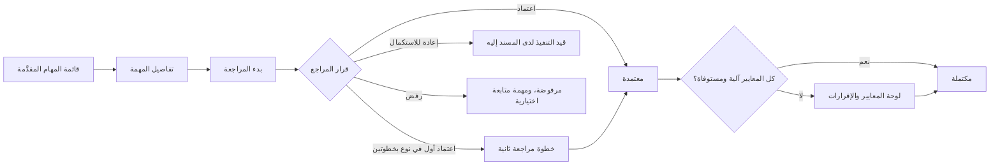
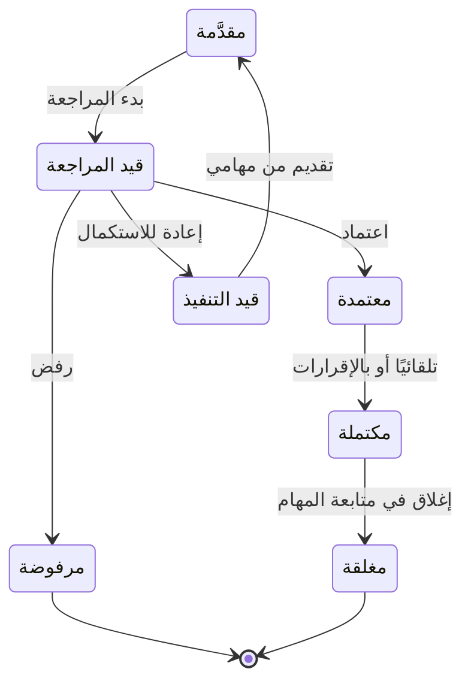

# مراجعة نتيجة المهمة

<!-- BEGIN GENERATED: doc -->
| البند | القيمة |
|---|---|
| المعرّف | FEAT-OPS-TASK-REVIEW |
| الإصدار | 0.1 |
| الحالة | مسودة |
| القدرة | CAP-07 التخطيط والتنفيذ |
| القدرة الفرعية | CAP-07.03 إدارة المهام (R1) |
| الأدوار | المراجع؛ صاحب دور الإقرار؛ النظام |
| الشاشات | SCR-02 تفاصيل المهمة وسجلها، SCR-06 قوائم المراجعة |
| حالات الاستخدام | UC-044، UC-045 |
| القصص | 9: 6 من المواصفة، و3 جديدة |
<!-- END GENERATED: doc -->

## 1. نظرة عامة

### 1.1 القيمة

يراجع المراجع — غير منفّذ المهمة — نتيجتها فيعتمدها أو يعيدها أو يرفضها، ولا تكتمل إلا باستيفاء معاييرها.

### 1.2 النطاق

| البند | القيمة |
|---|---|
| المستخدمون | المراجع، وصاحب دور الإقرار، والنظام |
| الشاشات | تفاصيل المهمة وسجلها (SCR-02)، وقوائم المراجعة (SCR-06) |
| حالات الاستخدام | مراجعة المهمة (UC-044)، وإكمال المهمة (UC-045) |
| المتطلبات | لا إكمال قبل استيفاء كل المعايير (REQ-OPS-008)، والمعتمِد غير المسند إليه (REQ-OPS-009)، وخطوات مراجعة يضبطها المستأجر (REQ-OPS-014)، ودورة حالات المهمة (REQ-OPS-006) |
| الجودة | لا كتابة صامتة فوق تعديل غيره (QAS-REL-003) |
| خارج النطاق | تقديم النتيجة (FEAT-OPS-MY-TASKS)، وإغلاق المهمة بعد الإكمال وإلغاؤها وتعليقها (FEAT-OPS-TASK-CONTROL)، وتعريف معايير الإكمال وعدد خطوات المراجعة في نوع المهمة (FEAT-OPS-TASK-TYPES) |

### 1.3 خريطة الميزة

يبدأ المراجع من قائمة المهام المقدَّمة، ثم يعتمد أو يعيد أو يرفض. والمعتمدة تكتمل تلقائيًا أو بالإقرارات (الشكل 1). ورحلة المهمة في المراجعة في الشكل 2.

**الشكل 1: خريطة مراجعة نتيجة المهمة**



**الشكل 2: رحلة المهمة في المراجعة**



## 2. القواعد المشتركة

تنطبق على كل قصص الميزة، فلا تتكرر داخل القصص. وكل قصة تذكر ما يخصها فقط.

### 2.1 السياق المشترك

كل قصة تبدأ من ثلاثة شروط: مستأجر نشط، وحزمة السياسات الأساسية مفعّلة، ومستخدم مسجّل الدخول ومخوَّل. وتشير إليها القصص بخطوة واحدة: «بفرض السياق المشترك للميزة».

### 2.2 الصلاحية وعدم الإفصاح

- من لا يحق له رؤية العنصر يتلقى ردًا بشكل «غير متاح» تمامًا، فلا يعرف أنه موجود.
- من يرى العنصر ولا يحق له الإجراء يتلقى «لا تملك صلاحية هذا الإجراء».

### 2.3 أوامر تغيير الحالة

- **منع التكرار:** يُرسل كل أمر بمفتاح فريد، فإعادة الطلب نفسه لا تُنفَّذ مرتين.
- **حماية التعديل المتزامن:** يُرسل كل أمر بإصدار البيانات الذي يراه المستخدم. فإن عدّلها غيره في الأثناء، يُرفض الأمر.
- **السجل:** إن نجح الأمر، يُكتب حدثه وسجل التدقيق في المعاملة نفسها.

### 2.4 الرفض المشترك

```gherkin
# language: ar
خاصية: الرفض المشترك لأوامر الميزة

  سيناريو مخطط: رفض مشترك لكل أمر في الميزة
    بفرض السياق المشترك للميزة
    و <الحالة>
    عندما يُرسل المستخدم أي أمر من أوامر الميزة
    اذاً يُرفض برمز <الرمز> ويرى "<الرسالة>"
    و لا يتغير شيء

    امثلة:
      | الحالة                                  | الرمز                  | الرسالة                                                 |
      | العنصر خارج صلاحياته                    | NOT_FOUND              | غير متاح                                                |
      | العنصر مرئي له ولا يحق له الإجراء       | AUTHZ_DENIED           | لا تملك صلاحية هذا الإجراء                              |
      | غيره عدّل العنصر بعد أن فتحه            | VERSION_CONFLICT       | تغيّرت البيانات منذ فتحتها. راجع التغييرات ثم أعد المحاولة |
      | أعاد مفتاح منع التكرار بمحتوى مختلف     | IDEMPOTENCY_KEY_REUSED | طلب مكرر بمحتوى مختلف                                   |
      | البيانات ناقصة أو غير صحيحة             | VALIDATION_FAILED      | بعض البيانات ناقصة أو غير صحيحة. راجع الحقول المعلَّمة      |

  سيناريو: إعادة الطلب نفسه لا تُنفَّذ مرتين
    بفرض السياق المشترك للميزة
    و أمر نجح بمفتاح منع تكرار
    عندما يُعاد الطلب نفسه بالمفتاح نفسه
    اذاً تُعاد النتيجة الأولى ولا يُكتب حدث ثانٍ
```

### 2.5 المهمة المعلّقة

كل أوامر الميزة تُرفض ما دامت المهمة معلّقة، ولا يتغير شيء. ورفع التعليق والإلغاء في ميزة متابعة المهام والتدخل (FEAT-OPS-TASK-CONTROL). فلا يتكرر هذا الرفض في القصص.

```gherkin
# language: ar
خاصية: رفض أوامر الميزة على مهمة معلّقة

  سيناريو مخطط: المهمة المعلّقة لا تقبل أوامر الميزة
    بفرض السياق المشترك للميزة
    و <الحالة>
    عندما يُرسل المستخدم أي أمر من أوامر الميزة على المهمة
    اذاً يُرفض برمز <الرمز> ويرى "<الرسالة>"
    و لا يتغير شيء

    امثلة:
      | الحالة        | الرمز          | الرسالة       |
      | المهمة معلّقة | TASK_SUSPENDED | المهمة معلّقة |
```

## 3. الجودة وتعريف الاكتمال

### 3.1 متطلبات الجودة

<!-- BEGIN GENERATED: quality -->
| المرجع | الموقف | المطلوب |
|---|---|---|
| QAS-REL-003 | update the same object from the same version | 0 silent overwrites |
<!-- END GENERATED: quality -->

### 3.2 تعريف الاكتمال

القصة مكتملة حين تتحقق الشروط الخمسة:

1. سيناريوهاتها والقواعد المشتركة تمر في الاختبار الآلي.
2. فحوص البنية المعمارية تمر.
3. نصوص الواجهة والرسائل موجودة بالعربية والإنجليزية.
4. مراجعة الكود مكتملة.
5. ما تضيفه القصة نفسها في قسم «القواعد» تحقق.

## 4. فهرس القصص

<!-- BEGIN GENERATED: story-index -->
| المعرّف | القصة | النوع | الحالة |
|---|---|---|---|
| `US-BC04-TASK-APPROVE` | اعتماد المهمة | أمر | مسودة |
| `US-BC04-TASK-COMPLETE` | إكمال المهمة | أمر | مسودة |
| `US-BC04-TASK-REJECT` | رفض المهمة | أمر | مسودة |
| `US-BC04-TASK-RETURN` | إعادة المهمة للمراجعة | أمر | مسودة |
| `US-BC04-TASK-START-REVIEW` | بدء مراجعة المهمة | أمر | مسودة |
| `US-DOM-OPS-TASK-MULTI-REVIEW` | خطوة مراجعة ثانية للمهمة حسب نوعها | أمر | مسودة |
| `US-BC04-S-TASK-01` | تلقائي: all completion criteria satisfied (المهمة) | نظام | مسودة |
| `US-UI-SCR02-REVIEW-PANEL` | مراجعة المعايير والإقرارات قبل الإكمال | واجهة | مسودة |
| `US-UI-SCR06-TASK-REVIEWS` | مهام مقدَّمة تنتظر مراجعتي | واجهة | مسودة |
<!-- END GENERATED: story-index -->

## 5. القصص

### 5.1 US-BC04-TASK-APPROVE — اعتماد نتيجة المهمة

| النوع | الإصدار | الأولوية | دون اتصال | الحالة |
|---|---|---|---|---|
| أمر | R1 | Must | لا | مسودة |

> **كـ** المراجع، **أريد** أن أعتمد نتيجة المهمة التي راجعتها، **حتى** تمضي المهمة إلى الإكمال.

**باختصار:** بعد المراجعة يعتمد المراجع النتيجة، فتصبح المهمة «معتمدة». وإن كانت كل معاييرها آلية ومستوفاة تكتمل تلقائيًا (القصة 5.7).

#### القواعد

- **متى يُسمح:** المهمة «قيد المراجعة».
- **من يُسمح له:** المراجع ضمن نطاقه، على ألا يكون المسند إليه، إلا إذا سمحت سياسة المستأجر بذلك صراحة (REQ-OPS-009).
- **البيانات:** ملاحظة (اختيارية).
- **الأثر:** تصبح المهمة «معتمدة»، ويُسجَّل حدث «اعتُمدت المهمة»، فيصل إلى الإشعار ومتابعة الخطة وقياس النتائج. ثم تُفحص معايير الإكمال الآلية.

#### معايير القبول

```gherkin
# language: ar
خاصية: اعتماد نتيجة المهمة

  سيناريو: المراجع يعتمد نتيجة مهمة راجعها
    بفرض السياق المشترك للميزة
    و مهمة "قيد المراجعة" والمراجع ليس المسند إليه
    عندما يعتمد المراجع نتيجتها
    اذاً تصبح حالتها "معتمدة"
    و يُسجَّل حدث "اعتُمدت المهمة"

  سيناريو مخطط: رفض خاص بالاعتماد
    بفرض السياق المشترك للميزة
    و <الحالة>
    عندما يحاول المراجع اعتماد المهمة
    اذاً يُرفض برمز <الرمز> ويرى "<الرسالة>"
    و لا يتغير شيء

    امثلة:
      | الحالة                                         | الرمز                         | الرسالة                                      |
      | المراجع هو المسند إليه وسياسة المستأجر لا تسمح | SEGREGATION_OF_DUTIES         | لا يجوز أن يعتمد الشخص نفسه ما قدّمه أو طلبه |
      | المهمة ليست "قيد المراجعة"                     | TASK_INVALID_STATE_TRANSITION | الوضع الحالي للمهمة لا يسمح بهذا الإجراء     |
```

<details><summary>المراجع التقنية والتتبع</summary>

<!-- BEGIN GENERATED: refs US-BC04-TASK-APPROVE -->
| البند | المعرّف | المعنى |
|---|---|---|
| الواجهة البرمجية | `POST /api/v1/operations/tasks/{id}/actions/approve` | — |
| الأمر | `CMD-TASK-APPROVE` | اعتماد المهمة |
| السياسة | `POL-TASK-APPROVE` | reviewer؛ tenant match; task visible; org scope |
| الحدث | `EVT-TASK-APPROVED` | يصل إلى: Notification service (SLC-06); Plan progress (SLC-08); Outcome measurement (SLC-08); Search projecti… |
| الكيان | `AGG-TASK` | المهمة |
| الجدول | `operations.tasks` | الجدول الرئيسي للمهمة |
| وحدة النشر | DU-08 | — |
| المتطلبات | REQ-OPS-006، REQ-OPS-007، REQ-OPS-008، REQ-OPS-009، REQ-OPS-010، REQ-OPS-011، REQ-OPS-012 | معانيها في القسم 6. التتبع |
| حالات الاستخدام | UC-044، UC-045 | Review Task؛ Complete Task |
| الاختبار | TST-TASK-SM، TST-SLC03-INVARIANTS | دورة حالات المهمة، وثوابت الشريحة SLC-03 |
<!-- END GENERATED: refs US-BC04-TASK-APPROVE -->

</details>

### 5.2 US-BC04-TASK-COMPLETE — إكمال المهمة بإثبات معاييرها

| النوع | الإصدار | الأولوية | دون اتصال | الحالة |
|---|---|---|---|---|
| أمر | R1 | Must | لا | مسودة |

> **كـ** صاحب دور الإقرار، **أريد** أن أثبت المعايير التي تحتاج تأكيدًا بشريًا وأكمل المهمة، **حتى** لا تُعدّ المهمة مكتملة إلا وكل معاييرها مستوفاة.

**باختصار:** المهمة المعتمدة التي فيها قائمة تحقق أو إقرار لا تكتمل تلقائيًا. فيرسل المراجع أو صاحب دور الإقرار الإقرارات، وتكتمل المهمة إن استوفت كل معاييرها.

#### القواعد

- **متى يُسمح:** المهمة «معتمدة»، وكل معاييرها مستوفاة بعد الإقرارات (REQ-OPS-008).
- **من يُسمح له:** المراجع، أو صاحب دور الإقرار الذي يحدده المعيار.
- **البيانات:** الإقرارات (إلزامية): تأكيد كل بنود قائمة التحقق، وإقرار الدور المحدد لكل معيار إقرار.
- **المعايير الآلية:** بند نتيجة من النوع المطلوب، وعدد أدلة غير مسحوبة لا يقل عن المطلوب، وقياس سُجِّل بعد بدء المهمة. ويحسبها الخادم.
- **الأثر:** تصبح المهمة «مكتملة»، ويُسجَّل حدث «اكتملت المهمة»، فيصل إلى الإشعار ومتابعة الخطة وقياس النتائج.

#### معايير القبول

```gherkin
# language: ar
خاصية: إكمال المهمة بإثبات معاييرها

  سيناريو: إكمال مهمة معتمدة بإقرار الدور المحدد
    بفرض السياق المشترك للميزة
    و مهمة "معتمدة" معاييرها الآلية مستوفاة ولها معيار إقرار
    عندما يرسل صاحب دور الإقرار إقراره ويكمل المهمة
    اذاً تصبح حالتها "مكتملة"
    و يُسجَّل حدث "اكتملت المهمة"

  سيناريو مخطط: رفض خاص بالإكمال
    بفرض السياق المشترك للميزة
    و <الحالة>
    عندما يحاول إكمال المهمة
    اذاً يُرفض برمز <الرمز> ويرى "<الرسالة>"
    و تبقى المهمة على حالها

    امثلة:
      | الحالة                                  | الرمز                         | الرسالة                                  |
      | بند في قائمة التحقق لم يُؤكَّد          | TASK_CRITERIA_NOT_MET         | لم تُستوفَ كل معايير إكمال المهمة        |
      | الإقرار من غير الدور الذي يحدده المعيار | TASK_CRITERIA_NOT_MET         | لم تُستوفَ كل معايير إكمال المهمة        |
      | معيار آلي غير مستوفى                    | TASK_CRITERIA_NOT_MET         | لم تُستوفَ كل معايير إكمال المهمة        |
      | المهمة ليست "معتمدة"                    | TASK_INVALID_STATE_TRANSITION | الوضع الحالي للمهمة لا يسمح بهذا الإجراء |
      | لم تُرسل أي إقرارات                     | VALIDATION_FAILED             | الإقرارات مطلوبة                         |
```

<details><summary>المراجع التقنية والتتبع</summary>

<!-- BEGIN GENERATED: refs US-BC04-TASK-COMPLETE -->
| البند | المعرّف | المعنى |
|---|---|---|
| الواجهة البرمجية | `POST /api/v1/operations/tasks/{id}/actions/complete` | — |
| الأمر | `CMD-TASK-COMPLETE` | إكمال المهمة |
| السياسة | `POL-TASK-COMPLETE` | reviewer or attestation role؛ tenant match; task visible; org scope |
| الحدث | `EVT-TASK-COMPLETED` | يصل إلى: Notification service (SLC-06); Plan progress (SLC-08); Outcome measurement (SLC-08); Search projecti… |
| الكيان | `AGG-TASK` | المهمة |
| الجدول | `operations.tasks` | الجدول الرئيسي للمهمة |
| وحدة النشر | DU-08 | — |
| المتطلبات | REQ-OPS-006، REQ-OPS-007، REQ-OPS-008، REQ-OPS-009، REQ-OPS-010، REQ-OPS-011، REQ-OPS-012 | معانيها في القسم 6. التتبع |
| حالات الاستخدام | UC-044، UC-045 | Review Task؛ Complete Task |
| الاختبار | TST-TASK-SM، TST-SLC03-INVARIANTS | دورة حالات المهمة، وثوابت الشريحة SLC-03 |
<!-- END GENERATED: refs US-BC04-TASK-COMPLETE -->

</details>

### 5.3 US-BC04-TASK-REJECT — رفض نتيجة المهمة

| النوع | الإصدار | الأولوية | دون اتصال | الحالة |
|---|---|---|---|---|
| أمر | R1 | Must | لا | مسودة |

> **كـ** المراجع، **أريد** أن أرفض نتيجة لا تصلح مع ذكر السبب، **حتى** يُغلق مسارها بتاريخ واضح، وتُعاد المحاولة في مهمة متابعة.

**باختصار:** يرفض المراجع المهمة وهي «قيد المراجعة»، فتصبح «مرفوضة»، وهي حالة نهائية. ويختار هل تُنشأ مهمة متابعة مرتبطة بها.

#### القواعد

- **متى يُسمح:** المهمة «قيد المراجعة».
- **من يُسمح له:** المراجع ضمن نطاقه.
- **البيانات:** السبب، واختيار إنشاء مهمة متابعة (إلزاميان).
- **النهائية:** المرفوضة لا تعود. وإعادة المحاولة مهمة جديدة مرتبطة بالمرفوضة. وكيف تُنشأ مهمة المتابعة، في الأمر نفسه أم بعده، غير محدد في المصدر **[Needs Review]**.
- **الأثر:** تصبح المهمة «مرفوضة»، ويُسجَّل حدث «رُفضت المهمة»، فيصل إلى الإشعار ومتابعة الخطة وقياس النتائج.

#### معايير القبول

```gherkin
# language: ar
خاصية: رفض نتيجة المهمة

  سيناريو: المراجع يرفض نتيجة لا تصلح
    بفرض السياق المشترك للميزة
    و مهمة "قيد المراجعة"
    عندما يرفضها المراجع مع ذكر السبب دون طلب مهمة متابعة
    اذاً تصبح حالتها "مرفوضة" ولا تقبل بعدها أي تغيير
    و يُسجَّل حدث "رُفضت المهمة"

  سيناريو مخطط: رفض خاص برفض النتيجة
    بفرض السياق المشترك للميزة
    و <الحالة>
    عندما يحاول المراجع رفض المهمة
    اذاً يُرفض برمز <الرمز> ويرى "<الرسالة>"
    و لا يتغير شيء

    امثلة:
      | الحالة                        | الرمز                         | الرسالة                                  |
      | لم يُذكر السبب                | REASON_REQUIRED               | اذكر السبب                               |
      | لم يُحدَّد خيار مهمة المتابعة | VALIDATION_FAILED             | خيار مهمة المتابعة مطلوب                 |
      | المهمة ليست "قيد المراجعة"    | TASK_INVALID_STATE_TRANSITION | الوضع الحالي للمهمة لا يسمح بهذا الإجراء |
```

<details><summary>المراجع التقنية والتتبع</summary>

<!-- BEGIN GENERATED: refs US-BC04-TASK-REJECT -->
| البند | المعرّف | المعنى |
|---|---|---|
| الواجهة البرمجية | `POST /api/v1/operations/tasks/{id}/actions/reject` | — |
| الأمر | `CMD-TASK-REJECT` | رفض المهمة |
| السياسة | `POL-TASK-REJECT` | reviewer؛ tenant match; task visible; org scope |
| الحدث | `EVT-TASK-REJECTED` | يصل إلى: Notification service (SLC-06); Plan progress (SLC-08); Outcome measurement (SLC-08); Search projecti… |
| الكيان | `AGG-TASK` | المهمة |
| الجدول | `operations.tasks` | الجدول الرئيسي للمهمة |
| وحدة النشر | DU-08 | — |
| المتطلبات | REQ-OPS-006، REQ-OPS-007، REQ-OPS-008، REQ-OPS-009، REQ-OPS-010، REQ-OPS-011، REQ-OPS-012 | معانيها في القسم 6. التتبع |
| حالات الاستخدام | UC-044، UC-045 | Review Task؛ Complete Task |
| الاختبار | TST-TASK-SM، TST-SLC03-INVARIANTS | دورة حالات المهمة، وثوابت الشريحة SLC-03 |
<!-- END GENERATED: refs US-BC04-TASK-REJECT -->

</details>

### 5.4 US-BC04-TASK-RETURN — إعادة المهمة إلى المسند إليه لاستكمالها

| النوع | الإصدار | الأولوية | دون اتصال | الحالة |
|---|---|---|---|---|
| أمر | R1 | Must | لا | مسودة |

> **كـ** المراجع، **أريد** أن أعيد المهمة إلى المسند إليه مع سبب ما يلزم استكماله، **حتى** يصحح النتيجة بدل أن تُرفض.

**باختصار:** يعيد المراجع المهمة من «قيد المراجعة» إلى «قيد التنفيذ» مع السبب، فيستكملها المسند إليه ويقدّمها من جديد.

#### القواعد

- **متى يُسمح:** المهمة «قيد المراجعة».
- **من يُسمح له:** المراجع ضمن نطاقه.
- **البيانات:** سبب الإعادة (إلزامي).
- **الأثر:** تصبح المهمة «قيد التنفيذ»، ويُسجَّل حدث «أُعيدت المهمة للاستكمال»، فيصل إلى المسند إليه عبر الإشعار وإلى متابعة الخطة.

#### معايير القبول

```gherkin
# language: ar
خاصية: إعادة المهمة إلى المسند إليه لاستكمالها

  سيناريو: المراجع يعيد المهمة للاستكمال
    بفرض السياق المشترك للميزة
    و مهمة "قيد المراجعة"
    عندما يعيدها المراجع مع سبب ما يلزم استكماله
    اذاً تصبح حالتها "قيد التنفيذ"
    و يُسجَّل حدث "أُعيدت المهمة للاستكمال"

  سيناريو مخطط: رفض خاص بإعادة المهمة
    بفرض السياق المشترك للميزة
    و <الحالة>
    عندما يحاول المراجع إعادة المهمة
    اذاً يُرفض برمز <الرمز> ويرى "<الرسالة>"
    و لا يتغير شيء

    امثلة:
      | الحالة                     | الرمز                         | الرسالة                                  |
      | لم يُذكر سبب الإعادة       | REASON_REQUIRED               | اذكر السبب                               |
      | المهمة ليست "قيد المراجعة" | TASK_INVALID_STATE_TRANSITION | الوضع الحالي للمهمة لا يسمح بهذا الإجراء |
```

<details><summary>المراجع التقنية والتتبع</summary>

<!-- BEGIN GENERATED: refs US-BC04-TASK-RETURN -->
| البند | المعرّف | المعنى |
|---|---|---|
| الواجهة البرمجية | `POST /api/v1/operations/tasks/{id}/actions/return` | — |
| الأمر | `CMD-TASK-RETURN` | إعادة المهمة للمراجعة |
| السياسة | `POL-TASK-RETURN` | reviewer؛ tenant match; task visible; org scope |
| الحدث | `EVT-TASK-RETURNED-FOR-REWORK` | يصل إلى: Notification service (SLC-06); Plan progress (SLC-08); Outcome measurement (SLC-08); Search projecti… |
| الكيان | `AGG-TASK` | المهمة |
| الجدول | `operations.tasks` | الجدول الرئيسي للمهمة |
| وحدة النشر | DU-08 | — |
| المتطلبات | REQ-OPS-006، REQ-OPS-007، REQ-OPS-008، REQ-OPS-009، REQ-OPS-010، REQ-OPS-011، REQ-OPS-012 | معانيها في القسم 6. التتبع |
| حالات الاستخدام | UC-044، UC-045 | Review Task؛ Complete Task |
| الاختبار | TST-TASK-SM، TST-SLC03-INVARIANTS | دورة حالات المهمة، وثوابت الشريحة SLC-03 |
<!-- END GENERATED: refs US-BC04-TASK-RETURN -->

</details>

### 5.5 US-BC04-TASK-START-REVIEW — بدء مراجعة المهمة

| النوع | الإصدار | الأولوية | دون اتصال | الحالة |
|---|---|---|---|---|
| أمر | R1 | Must | لا | مسودة |

> **كـ** المراجع، **أريد** أن أبدأ مراجعة مهمة مقدَّمة، **حتى** يعرف المسند إليه والمخطط أن نتيجتها قيد المراجعة.

**باختصار:** يبدأ مراجع غير المسند إليه مراجعة المهمة المقدَّمة، فتصبح «قيد المراجعة».

#### القواعد

- **متى يُسمح:** المهمة «مقدَّمة».
- **من يُسمح له:** من يملك صلاحية المراجعة ضمن نطاقه، على ألا يكون المسند إليه. وهذا الشرط لا يستثني سياسة المستأجر كما يستثنيها الاعتماد (REQ-OPS-009) **[Needs Review]**.
- **الأثر:** تصبح المهمة «قيد المراجعة»، ويُسجَّل حدث «بدأت مراجعة المهمة».

#### معايير القبول

```gherkin
# language: ar
خاصية: بدء مراجعة المهمة

  سيناريو: مراجع يبدأ مراجعة مهمة مقدَّمة
    بفرض السياق المشترك للميزة
    و مهمة "مقدَّمة" ضمن نطاق المراجع وهو ليس المسند إليه
    عندما يبدأ مراجعتها
    اذاً تصبح حالتها "قيد المراجعة"
    و يُسجَّل حدث "بدأت مراجعة المهمة"

  سيناريو مخطط: رفض خاص ببدء المراجعة
    بفرض السياق المشترك للميزة
    و <الحالة>
    عندما يحاول بدء مراجعة المهمة
    اذاً يُرفض برمز <الرمز> ويرى "<الرسالة>"
    و لا يتغير شيء

    امثلة:
      | الحالة                | الرمز                         | الرسالة                                      |
      | هو المسند إليه نفسه   | SEGREGATION_OF_DUTIES         | لا يجوز أن يعتمد الشخص نفسه ما قدّمه أو طلبه |
      | المهمة ليست "مقدَّمة" | TASK_INVALID_STATE_TRANSITION | الوضع الحالي للمهمة لا يسمح بهذا الإجراء     |
```

<details><summary>المراجع التقنية والتتبع</summary>

<!-- BEGIN GENERATED: refs US-BC04-TASK-START-REVIEW -->
| البند | المعرّف | المعنى |
|---|---|---|
| الواجهة البرمجية | `POST /api/v1/operations/tasks/{id}/actions/start-review` | — |
| الأمر | `CMD-TASK-START-REVIEW` | بدء مراجعة المهمة |
| السياسة | `POL-TASK-START-REVIEW` | reviewer role in scope؛ tenant match; task visible; org scope |
| الحدث | `EVT-TASK-REVIEW-STARTED` | يصل إلى: Notification service (SLC-06); Plan progress (SLC-08); Outcome measurement (SLC-08); Search projecti… |
| الكيان | `AGG-TASK` | المهمة |
| الجدول | `operations.tasks` | الجدول الرئيسي للمهمة |
| وحدة النشر | DU-08 | — |
| المتطلبات | REQ-OPS-006، REQ-OPS-007، REQ-OPS-008، REQ-OPS-009، REQ-OPS-010، REQ-OPS-011، REQ-OPS-012 | معانيها في القسم 6. التتبع |
| حالات الاستخدام | UC-044، UC-045 | Review Task؛ Complete Task |
| الاختبار | TST-TASK-SM، TST-SLC03-INVARIANTS | دورة حالات المهمة، وثوابت الشريحة SLC-03 |
<!-- END GENERATED: refs US-BC04-TASK-START-REVIEW -->

</details>

### 5.6 US-DOM-OPS-TASK-MULTI-REVIEW — خطوة مراجعة ثانية حسب نوع المهمة

| النوع | الإصدار | الأولوية | دون اتصال | الحالة |
|---|---|---|---|---|
| أمر | R1 | Should | لا | مسودة |

> **كـ** المراجع، **أريد** أن تمر المهمة بخطوة مراجعة ثانية حين يطلبها نوعها، **حتى** تُعتمد النتائج الحساسة بمراجعين مستقلين.

**باختصار:** إذا أعلن إصدار نوع المهمة خطوتي مراجعة، لا تصبح المهمة «معتمدة» باعتماد المراجع الأول، بل باعتماد مراجع ثانٍ غيره وغير المسند إليه **[Derived]**.

#### القواعد

- **متى يُسمح:** المهمة «قيد المراجعة»، واعتمدها المراجع الأول، وإصدار نوعها المثبَّت يعلن خطوتي مراجعة **[Derived]**.
- **من يُسمح له:** مراجع ثانٍ ضمن نطاقه، ليس المراجع الأول ولا المسند إليه **[Derived]**.
- **البيانات:** ملاحظة (اختيارية) **[Derived]**.
- **الضبط:** عدد خطوات المراجعة يُضبط في نوع المهمة دون تغيير الكود، ولكل تعديل إصدار جديد، والمهام القائمة تبقى على إصدارها (REQ-OPS-014).
- **الأثر:** تصبح المهمة «معتمدة» بعد الخطوة الأخيرة، ويُسجَّل حدث «اعتُمدت المهمة» **[Derived]**.
- **المواصفة:** دورة حالات المهمة لا تعرّف خطوة ثانية ولا أمرًا لها، فتحتاج تصحيحًا يضيفهما **[Needs Review]**.

#### معايير القبول

```gherkin
# language: ar
خاصية: خطوة مراجعة ثانية حسب نوع المهمة

  سيناريو: الخطوة الثانية تعتمد المهمة
    بفرض السياق المشترك للميزة
    و مهمة "قيد المراجعة" يعلن نوعها خطوتي مراجعة واعتمدها المراجع الأول
    عندما يعتمدها مراجع ثانٍ غير المراجع الأول وغير المسند إليه
    اذاً تصبح حالتها "معتمدة"
    و يُسجَّل حدث "اعتُمدت المهمة"

  سيناريو: الخطوة الأولى وحدها لا تكفي
    بفرض السياق المشترك للميزة
    و مهمة "قيد المراجعة" يعلن نوعها خطوتي مراجعة
    عندما يعتمدها المراجع الأول
    اذاً تبقى حالتها "قيد المراجعة" بانتظار الخطوة الثانية

  سيناريو مخطط: رفض خاص بالخطوة الثانية
    بفرض السياق المشترك للميزة
    و <الحالة>
    عندما يحاول اعتماد الخطوة الثانية
    اذاً يُرفض برمز <الرمز> ويرى "<الرسالة>"

    امثلة:
      | الحالة                | الرمز                 | الرسالة                                      |
      | هو المراجع الأول نفسه | SEGREGATION_OF_DUTIES | لا يجوز أن يعتمد الشخص نفسه ما قدّمه أو طلبه |
      | هو المسند إليه نفسه   | SEGREGATION_OF_DUTIES | لا يجوز أن يعتمد الشخص نفسه ما قدّمه أو طلبه |
```

<details><summary>المراجع التقنية والتتبع</summary>

<!-- BEGIN GENERATED: refs US-DOM-OPS-TASK-MULTI-REVIEW -->
| البند | المعرّف | المعنى |
|---|---|---|
| حالة الاستخدام | UC-044 | Review Task |
| المصدر | `US-BC04-TTY-EDIT` | — |
| المصدر | `[Derived]` | — |
| المتطلب | REQ-OPS-014 | The system shall allow each tenant to configure review and approval steps for plans and tasks within the limi… |
| حالة الاستخدام | UC-044 | Review Task |
<!-- END GENERATED: refs US-DOM-OPS-TASK-MULTI-REVIEW -->

</details>

### 5.7 US-BC04-S-TASK-01 — إكمال المهمة تلقائيًا عند استيفاء معاييرها

| النوع | الإصدار | الأولوية | دون اتصال | الحالة |
|---|---|---|---|---|
| نظام | R1 | Must | لا ينطبق | مسودة |

> **كـ** النظام، **أريد** أن أكمل المهمة المعتمدة حين تُستوفى كل معاييرها الآلية، **حتى** لا تنتظر إكمالًا يدويًا لا حاجة إليه.

**باختصار:** عند اعتماد المهمة، وكلما تغيّرت أدلة نتيجتها، يفحص النظام معاييرها. فإن كانت كلها آلية ومستوفاة تصبح «مكتملة».

#### القواعد

- **متى يحدث:** المهمة «معتمدة»، وكل معاييرها من الأنواع الآلية (بند نتيجة، عدد أدلة، قياس مسجَّل) ومستوفاة. ويُفحص ذلك عند الاعتماد وكلما تغيّرت أدلة النتيجة.
- **الأثر:** تصبح المهمة «مكتملة»، ويُسجَّل حدث «اكتملت المهمة» وسجل تدقيق بهوية النظام.

#### معايير القبول

```gherkin
# language: ar
خاصية: إكمال المهمة تلقائيًا عند استيفاء معاييرها

  سيناريو: استيفاء آخر معيار آلي
    بفرض مهمة "معتمدة" كل معاييرها آلية، وبقي منها معيار عدد الأدلة غير مستوفى
    عندما يُربط بها الدليل الذي يستوفيه
    اذاً تصبح حالتها "مكتملة"
    و يُسجَّل حدث "اكتملت المهمة" وسجل تدقيق بهوية النظام

  سيناريو مخطط: لا تكتمل المهمة تلقائيًا
    بفرض مهمة "معتمدة"
    و <الحالة>
    عندما يُفحص استيفاء معاييرها
    اذاً تبقى حالتها "معتمدة"
    و لا يُسجَّل أي حدث

    امثلة:
      | الحالة                         |
      | فيها معيار إقرار أو قائمة تحقق |
      | أحد معاييرها الآلية غير مستوفى |
```

<details><summary>المراجع التقنية والتتبع</summary>

<!-- BEGIN GENERATED: refs US-BC04-S-TASK-01 -->
| البند | المعرّف | المعنى |
|---|---|---|
| المحفِّز | `SYS:all completion criteria satisfied` | system-checkable criteria evaluated at approval and whenever result evidence changes (BRL-006) |
| الانتقال | APPROVED ← COMPLETED | — |
| الحدث | `EVT-TASK-COMPLETED` | يصل إلى: Notification service (SLC-06); Plan progress (SLC-08); Outcome measurement (SLC-08); Search projecti… |
| الكيان | `AGG-TASK` | المهمة |
| الجدول | `operations.tasks` | الجدول الرئيسي للمهمة |
| وحدة النشر | DU-08 | — |
| المتطلبات | REQ-OPS-006، REQ-OPS-007، REQ-OPS-008، REQ-OPS-009، REQ-OPS-010، REQ-OPS-011، REQ-OPS-012 | معانيها في القسم 6. التتبع |
| حالات الاستخدام | UC-044، UC-045 | Review Task؛ Complete Task |
| الاختبار | TST-TASK-SM، TST-SLC03-INVARIANTS | دورة حالات المهمة، وثوابت الشريحة SLC-03 |
<!-- END GENERATED: refs US-BC04-S-TASK-01 -->

</details>

### 5.8 US-UI-SCR02-REVIEW-PANEL — مراجعة المعايير والإقرارات قبل الإكمال

| النوع | الإصدار | الأولوية | دون اتصال | الحالة |
|---|---|---|---|---|
| واجهة | R1 | Must | لا | مسودة |

> **كـ** صاحب دور الإقرار، **أريد** أن أرى حالة كل معيار إكمال وأؤكد ما يحتاج تأكيدي، **حتى** أكمل المهمة وأنا أعرف ما استُوفي وما لم يُستوفَ.

**باختصار:** في تفاصيل المهمة المعتمدة تعرض الشاشة معاييرها: الآلية بحالتها كما يحسبها الخادم، والبشرية بحقول تأكيد. ثم يرسل الإكمال بالإقرارات.

#### القواعد

- المعايير الآلية تُعرض بحالتها من الخادم «مستوفى» أو «غير مستوفى»، ولا تحسبها الواجهة.
- بنود قائمة التحقق والإقرارات تظهر حقول تأكيد لمن يملك دورها **[Derived]**.
- زر الإكمال يرسل الإقرارات، والخادم وحده يحكم على الاستيفاء (REQ-OPS-008).
- المعايير مجمّدة منذ الإسناد، فلا تُعدَّل من اللوحة.

#### معايير القبول

```gherkin
# language: ar
خاصية: مراجعة المعايير والإقرارات قبل الإكمال

  سيناريو: إكمال مهمة بعد تأكيد قائمة التحقق
    بفرض السياق المشترك للميزة
    و مهمة "معتمدة" فيها معايير آلية مستوفاة وقائمة تحقق
    عندما يؤكد صاحب دور الإقرار كل بنود القائمة ويضغط "إكمال"
    اذاً تصبح المهمة "مكتملة" وتعرض اللوحة كل المعايير مستوفاة

  سيناريو مخطط: رفض الخادم للإكمال
    بفرض السياق المشترك للميزة
    و <الحالة>
    عندما يضغط "إكمال"
    اذاً تعرض الشاشة "<الرسالة>"
    و تبقى المهمة "معتمدة"

    امثلة:
      | الحالة                           | الرمز                 | الرسالة                           |
      | بقي بند في قائمة التحقق غير مؤكد | TASK_CRITERIA_NOT_MET | لم تُستوفَ كل معايير إكمال المهمة |
```

<details><summary>المراجع التقنية والتتبع</summary>

<!-- BEGIN GENERATED: refs US-UI-SCR02-REVIEW-PANEL -->
| البند | المعرّف | المعنى |
|---|---|---|
| الشاشة | SCR-02 | شاشة تفاصيل المهمة وسجلها |
| المصدر | `task-lifecycle-rules.md §2` | — |
| المصدر | `[Derived]` | — |
| المتطلب | REQ-OPS-008 | If a task's completion criteria are not all met, then the system shall reject its completion. |
| حالة الاستخدام | UC-045 | Complete Task |
<!-- END GENERATED: refs US-UI-SCR02-REVIEW-PANEL -->

</details>

### 5.9 US-UI-SCR06-TASK-REVIEWS — مهام مقدَّمة تنتظر مراجعتي

| النوع | الإصدار | الأولوية | دون اتصال | الحالة |
|---|---|---|---|---|
| واجهة | R1 | Must | لا | مسودة |

> **كـ** المراجع، **أريد** قائمة بالمهام المقدَّمة في نطاقي التي تنتظر المراجعة، **حتى** أبدأ مراجعتها دون بحث.

**باختصار:** في قوائم المراجعة تظهر المهام «المقدَّمة» التي يحق للمراجع رؤيتها، ومنها يفتح تفاصيل المهمة ويبدأ المراجعة.

#### القواعد

- القائمة من قائمة المهام مصفّاة بحالة «مقدَّمة» وبنطاق المراجع، والتصفية في الخادم قبل القراءة **[Derived]**.
- لا عدد ولا إشارة إلى مهام محجوبة عنه.
- المهام التي هو المسند إليه فيها لا تُعرض له، لأن فصل المهام يمنعه من مراجعتها **[Derived]** (REQ-OPS-009).
- الترقيم بالمؤشر، والمرشحات في عنوان الصفحة.
- فتح مهمة ينقل إلى تفاصيلها (SCR-02)، وفيها «بدء المراجعة» (القصة 5.5).

#### معايير القبول

```gherkin
# language: ar
خاصية: مهام مقدَّمة تنتظر مراجعتي

  سيناريو: المراجع يرى المهام المقدَّمة في نطاقه
    بفرض السياق المشترك للميزة
    و في نطاق المراجع مهام "مقدَّمة" وأخرى في حالات غيرها
    عندما يفتح قائمة مراجعة المهام
    اذاً تُعرض المهام "المقدَّمة" في نطاقه فقط
    و لا يكشف أي عدد وجود مهام محجوبة عنه

  سيناريو مخطط: رفض خاص بقائمة المراجعة
    بفرض السياق المشترك للميزة
    و <الحالة>
    عندما يبدأ مراجعتها من تفاصيلها
    اذاً تعرض الشاشة "<الرسالة>"
    و تبقى المهمة "مقدَّمة"

    امثلة:
      | الحالة                                | الرمز                 | الرسالة                                      |
      | فتح عبر رابط مهمة هو المسند إليه فيها | SEGREGATION_OF_DUTIES | لا يجوز أن يعتمد الشخص نفسه ما قدّمه أو طلبه |
```

<details><summary>المراجع التقنية والتتبع</summary>

<!-- BEGIN GENERATED: refs US-UI-SCR06-TASK-REVIEWS -->
| البند | المعرّف | المعنى |
|---|---|---|
| الشاشة | SCR-06 | شاشة قوائم المراجعة |
| الشاشة | SCR-02 | شاشة تفاصيل المهمة وسجلها |
| حالة الاستخدام | UC-044 | Review Task |
| المصدر | `[Derived]` | — |
| المتطلب | REQ-OPS-009 | If the approver of a task result is also its assignee, then the system shall reject the approval unless tenan… |
| حالة الاستخدام | UC-044 | Review Task |
<!-- END GENERATED: refs US-UI-SCR06-TASK-REVIEWS -->

</details>

## 6. التتبع

<!-- BEGIN GENERATED: trace -->
| المتطلب | المعنى | القصص | الاختبار |
|---|---|---|---|
| REQ-OPS-006 | The system shall manage task state according to state machine SM-TASK and reject any transition not defined i… | كل قصص الميزة المأخوذة من المواصفة (6) | TST-SLC03-INVARIANTS، TST-TASK-SM |
| REQ-OPS-007 | When a task is assigned, the system shall verify the assignee's eligibility wherever the task type declares r… | كل قصص الميزة المأخوذة من المواصفة (6) | TST-SLC03-INVARIANTS، TST-TASK-SM، TST-TASK-TYPE-SM |
| REQ-OPS-008 | If a task's completion criteria are not all met, then the system shall reject its completion. | `US-BC04-S-TASK-01`، `US-BC04-TASK-APPROVE`، `US-BC04-TASK-COMPLETE`، `US-BC04-TASK-REJECT`، `US-BC04-TASK-RETURN`، `US-BC04-TASK-START-REVIEW`، `US-UI-SCR02-REVIEW-PANEL` | TST-SLC03-INVARIANTS، TST-TASK-SM |
| REQ-OPS-009 | If the approver of a task result is also its assignee, then the system shall reject the approval unless tenan… | `US-BC04-S-TASK-01`، `US-BC04-TASK-APPROVE`، `US-BC04-TASK-COMPLETE`، `US-BC04-TASK-REJECT`، `US-BC04-TASK-RETURN`، `US-BC04-TASK-START-REVIEW`، `US-UI-SCR06-TASK-REVIEWS` | TST-ROLE-ASSIGNMENT-SM، TST-SLC03-INVARIANTS، TST-TASK-SM |
| REQ-OPS-010 | The system shall link every task to a plan, or record it as an ad-hoc task with an accountable owner and reas… | كل قصص الميزة المأخوذة من المواصفة (6) | TST-SLC03-INVARIANTS، TST-TASK-SM |
| REQ-OPS-011 | The system shall require an idempotency key and the expected version on every state-changing command, and sha… | كل قصص الميزة المأخوذة من المواصفة (6) | TST-SLC03-INVARIANTS، TST-TASK-SM |
| REQ-OPS-012 | When a task is escalated, the system shall notify the next authority level and keep the task state unchanged. | كل قصص الميزة المأخوذة من المواصفة (6) | TST-SLC03-INVARIANTS، TST-TASK-SM |
| REQ-OPS-014 | The system shall allow each tenant to configure review and approval steps for plans and tasks within the limi… | `US-DOM-OPS-TASK-MULTI-REVIEW` | TST-PLAN-VERSION-SM، TST-SLC03-INVARIANTS، TST-SLC08-INVARIANTS، TST-TASK-TYPE-SM |
<!-- END GENERATED: trace -->

## 7. سجل التغييرات

| الإصدار | التاريخ | التغيير |
|---|---|---|
| 0.1 | — | هيكل مولَّد من خريطة الميزات |
| 0.2 | 2026-10-02 | كتابة القصص كاملة بمعيار القصص |
