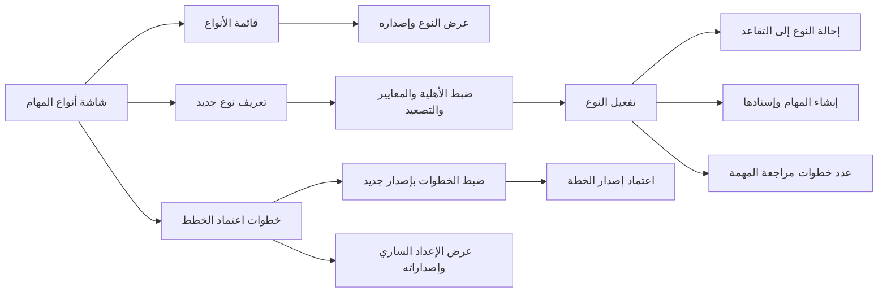
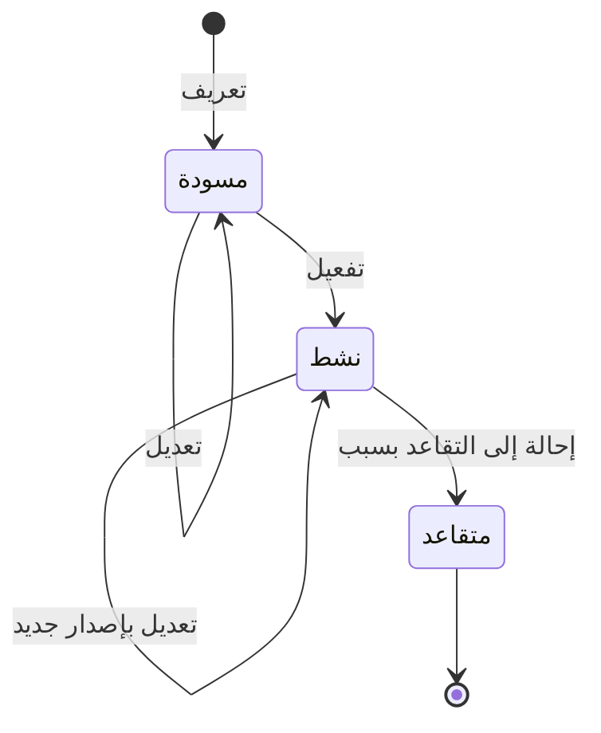

# أنواع المهام وخطوات اعتمادها

<!-- BEGIN GENERATED: doc -->
| البند | القيمة |
|---|---|
| المعرّف | FEAT-OPS-TASK-TYPES |
| الإصدار | 0.2 |
| الحالة | مسودة |
| القدرة | CAP-07 التخطيط والتنفيذ |
| القدرة الفرعية | CAP-07.04 سير العمل (R1) |
| الأدوار | مسؤول الإدارة؛ قائد المخططين؛ أي مستخدم مخوَّل |
| الشاشات | SCR-66 أنواع المهام |
| حالات الاستخدام | UC-034، UC-041، UC-044، UC-102 |
| القصص | 10: 5 من المواصفة، و5 جديدة |
<!-- END GENERATED: doc -->

## 1. نظرة عامة

### 1.1 القيمة

يحدد المسؤول لكل نوع مهمة متطلبات الأهلية ومعايير الإكمال وخطوات المراجعة والاعتماد الخاصة بالجهة.

### 1.2 النطاق

| البند | القيمة |
|---|---|
| المستخدمون | قائد المخططين ومسؤول الإدارة يعرّفون أنواع المهام ويُعدّونها، ومسؤول الإدارة يضبط خطوات اعتماد الخطط، وكل مستخدم في المستأجر يطّلع على الأنواع |
| الشاشات | SCR-66 أنواع المهام: قائمة الأنواع، ومحرّر النوع، وقسم خطوات اعتماد الخطط |
| حالات الاستخدام | مراجعة الخطة ومراجعة المهمة (عدد خطواتهما)، وإنشاء المهمة وإسنادها والتحقق من الأهلية (النوع يحدد المعايير ومتطلبات الأهلية) |
| المتطلبات | ضبط خطوات المراجعة والاعتماد لكل مستأجر دون تغيير الكود وبإصدارات محفوظة (REQ-OPS-014)، والتحقق من أهلية المسند إليه حيث يعلن نوع المهمة متطلباتها (REQ-OPS-007) |
| خارج النطاق | فحص الأهلية عند الإسناد (`FEAT-OPS-TASK-PLANNING`)، وتنفيذ خطوة المراجعة الثانية للمهمة (`FEAT-OPS-TASK-REVIEW`)، وتنفيذ خطوة الاعتماد الثانية للخطة (`FEAT-OPS-PLAN-APPROVAL`)، وسجل الكفاءات والمؤهلات نفسه (CAP-08) |

### 1.3 خريطة الميزة

**الشكل 1: خريطة ميزة أنواع المهام وخطوات الاعتماد**



يمر نوع المهمة بثلاث حالات (الشكل 2). ولا تُنشأ المهام إلا من نوع نشط.

**الشكل 2: رحلة نوع المهمة**



## 2. القواعد المشتركة

تنطبق على كل قصص الميزة، فلا تتكرر داخل القصص. وكل قصة تذكر ما يخصها فقط.

### 2.1 السياق المشترك

كل قصة تبدأ من ثلاثة شروط: مستأجر نشط، وحزمة السياسات الأساسية مفعّلة، ومستخدم مسجّل الدخول ومخوَّل. وتشير إليها القصص بخطوة واحدة: «بفرض السياق المشترك للميزة».

### 2.2 الصلاحية وعدم الإفصاح

- من لا يحق له رؤية العنصر يتلقى ردًا بشكل «غير متاح» تمامًا، فلا يعرف أنه موجود.
- من يرى العنصر ولا يحق له الإجراء يتلقى «لا تملك صلاحية هذا الإجراء».

### 2.3 أوامر تغيير الحالة

- **منع التكرار:** يُرسل كل أمر بمفتاح فريد، فإعادة الطلب نفسه لا تُنفَّذ مرتين.
- **حماية التعديل المتزامن:** يُرسل كل أمر بإصدار البيانات الذي يراه المستخدم. فإن عدّلها غيره في الأثناء، يُرفض الأمر.
- **السجل:** إن نجح الأمر، يُكتب حدثه وسجل التدقيق في المعاملة نفسها.

### 2.4 الرفض المشترك

```gherkin
# language: ar
خاصية: الرفض المشترك لأوامر الميزة

  سيناريو مخطط: رفض مشترك لكل أمر في الميزة
    بفرض السياق المشترك للميزة
    و <الحالة>
    عندما يُرسل المستخدم أي أمر من أوامر الميزة
    اذاً يُرفض برمز <الرمز> ويرى "<الرسالة>"
    و لا يتغير شيء

    امثلة:
      | الحالة                                  | الرمز                  | الرسالة                                                 |
      | العنصر خارج صلاحياته                    | NOT_FOUND              | غير متاح                                                |
      | العنصر مرئي له ولا يحق له الإجراء       | AUTHZ_DENIED           | لا تملك صلاحية هذا الإجراء                              |
      | غيره عدّل العنصر بعد أن فتحه            | VERSION_CONFLICT       | تغيّرت البيانات منذ فتحتها. راجع التغييرات ثم أعد المحاولة |
      | أعاد مفتاح منع التكرار بمحتوى مختلف     | IDEMPOTENCY_KEY_REUSED | طلب مكرر بمحتوى مختلف                                   |
      | البيانات ناقصة أو غير صحيحة             | VALIDATION_FAILED      | بعض البيانات ناقصة أو غير صحيحة. راجع الحقول المعلَّمة      |

  سيناريو: إعادة الطلب نفسه لا تُنفَّذ مرتين
    بفرض السياق المشترك للميزة
    و أمر نجح بمفتاح منع تكرار
    عندما يُعاد الطلب نفسه بالمفتاح نفسه
    اذاً تُعاد النتيجة الأولى ولا يُكتب حدث ثانٍ
```

### 2.5 إصدارات الإعداد

- **إصدار نوع المهمة:** كل تعديل يحفظ إصدارًا جديدًا ولا يمحو السابق. والمهمة تثبّت إصدار نوعها عند إنشائها، فلا يغيّر تعديلُ النوع أو إحالته إلى التقاعد المهامَ القائمة.
- **القيم الافتراضية للنوع:** المهمة لا تنتهي عند موعدها، وتُصعَّد عند الموعد ثم بعده بـ24 ساعة.
- **إصدار خطوات اعتماد الخطط:** كل ضبط يحفظ إصدارًا جديدًا (REQ-OPS-014). ويسري على إصدارات الخطط المقدَّمة بعده، وما قُدِّم قبله يكمل بالإعداد الذي قُدِّم به **[Derived]**.

## 3. الجودة وتعريف الاكتمال

### 3.1 متطلبات الجودة

<!-- BEGIN GENERATED: quality -->
لا متطلبات جودة مرتبطة بمتطلبات هذه الميزة مباشرة. تنطبق متطلبات المنصة العامة (`FEAT-PLT-*`).
<!-- END GENERATED: quality -->

### 3.2 تعريف الاكتمال

القصة مكتملة حين تتحقق الشروط الخمسة:

1. سيناريوهاتها والقواعد المشتركة تمر في الاختبار الآلي.
2. فحوص البنية المعمارية تمر.
3. نصوص الواجهة والرسائل موجودة بالعربية والإنجليزية.
4. مراجعة الكود مكتملة.
5. ما تضيفه القصة نفسها في قسم «القواعد» تحقق.

## 4. فهرس القصص

<!-- BEGIN GENERATED: story-index -->
| المعرّف | القصة | النوع | الحالة |
|---|---|---|---|
| `US-BC04-TTY-ACTIVATE` | تفعيل نوع المهمة | أمر | مسودة |
| `US-BC04-TTY-DEFINE` | تعريف نوع المهمة | أمر | مسودة |
| `US-BC04-TTY-EDIT` | تعديل نوع المهمة | أمر | مسودة |
| `US-BC04-TTY-RETIRE` | إحالة نوع المهمة إلى التقاعد | أمر | مسودة |
| `US-DOM-OPS-APPROVAL-STEPS-SET` | ضبط خطوات اعتماد الخطط للمستأجر | أمر | مسودة |
| `US-BC04-Q-TTY-GET` | عرض نوع المهمة وإصداره | جلب | مسودة |
| `US-DOM-OPS-APPROVAL-STEPS-GET` | عرض خطوات الاعتماد السارية وإصداراتها | جلب | مسودة |
| `US-DOM-OPS-TTY-LIST` | قائمة أنواع المهام النشطة | جلب | مسودة |
| `US-UI-SCR66-APPROVAL-STEPS` | شاشة خطوات اعتماد الخطط | واجهة | مسودة |
| `US-UI-SCR66-EDITOR` | تحرير نوع المهمة ومعاييره وتصعيده | واجهة | مسودة |
<!-- END GENERATED: story-index -->

## 5. القصص

### 5.1 US-BC04-TTY-ACTIVATE — تفعيل نوع المهمة

| النوع | الإصدار | الأولوية | دون اتصال | الحالة |
|---|---|---|---|---|
| أمر | R1 | Should | لا | مسودة |

> **كـ** قائد المخططين أو مسؤول الإدارة، **أريد** أن أفعّل نوع مهمة اكتمل إعداده، **حتى** يستطيع المخططون إنشاء مهام منه.

**باختصار:** نوع المهمة في المسودة يصبح «نشطًا» حين يكون فيه معيار إكمال واحد على الأقل. ومن بعدها يظهر بين الأنواع المتاحة لإنشاء المهام.

#### القواعد

- **متى يُسمح:** النوع في حالة «مسودة»، وفيه قالب معيار إكمال واحد على الأقل.
- **من يُسمح له:** قائد المخططين أو مسؤول الإدارة، في المستأجر نفسه وضمن نطاقه في المؤسسة.
- **الأثر:** يصبح النوع «نشطًا»، ويُسجَّل حدث «فُعِّل نوع المهمة». ويصل إلى معالجة أوامر المهام فتقبل إنشاء مهام منه.

#### معايير القبول

```gherkin
# language: ar
خاصية: تفعيل نوع المهمة

  سيناريو: تفعيل نوع مكتمل الإعداد
    بفرض السياق المشترك للميزة
    و نوع مهمة في حالة "مسودة" فيه معيار إكمال واحد على الأقل
    عندما يفعّل قائد المخططين النوع
    اذاً تصبح حالة النوع "نشط"
    و يُسجَّل حدث "فُعِّل نوع المهمة"
    و يظهر النوع بين الأنواع المتاحة لإنشاء المهام

  سيناريو مخطط: رفض خاص بتفعيل نوع المهمة
    بفرض السياق المشترك للميزة
    و <الحالة>
    عندما يحاول تفعيل النوع
    اذاً يُرفض برمز <الرمز> ويرى "<الرسالة>"
    و يبقى النوع على حالته

    امثلة:
      | الحالة | الرمز | الرسالة |
      | النوع بلا أي معيار إكمال | TASK_TYPE_INVALID | بيانات نوع المهمة غير صحيحة |
      | النوع "نشط" من قبل | TASK_TYPE_INVALID_STATE_TRANSITION | الوضع الحالي لنوع المهمة لا يسمح بهذا الإجراء |
      | النوع "متقاعد" | TASK_TYPE_INVALID_STATE_TRANSITION | الوضع الحالي لنوع المهمة لا يسمح بهذا الإجراء |
```

<details><summary>المراجع التقنية والتتبع</summary>

<!-- BEGIN GENERATED: refs US-BC04-TTY-ACTIVATE -->
| البند | المعرّف | المعنى |
|---|---|---|
| الواجهة البرمجية | `POST /api/v1/operations/task-types/{id}/actions/activate` | — |
| الأمر | `CMD-TTY-ACTIVATE` | تفعيل نوع المهمة |
| السياسة | `POL-TTY-ACTIVATE` | Administrator / Planner lead؛ tenant match; task visible; org scope |
| الحدث | `EVT-TTY-ACTIVATED` | يصل إلى: Task command handler cache |
| الكيان | `AGG-TASK-TYPE` | نوع المهمة |
| الجدول | `operations.task_types` | الجدول الرئيسي لنوع المهمة |
| وحدة النشر | DU-08 | — |
| المتطلب | REQ-OPS-014 | The system shall allow each tenant to configure review and approval steps for plans and tasks within the limi… |
| حالات الاستخدام | UC-034، UC-044 | Review Plan؛ Review Task |
| الاختبار | TST-TASK-TYPE-SM، TST-SLC03-INVARIANTS | دورة حالات نوع المهمة، وثوابت الشريحة SLC-03 |
<!-- END GENERATED: refs US-BC04-TTY-ACTIVATE -->

</details>

### 5.2 US-BC04-TTY-DEFINE — تعريف نوع المهمة

| النوع | الإصدار | الأولوية | دون اتصال | الحالة |
|---|---|---|---|---|
| أمر | R1 | Should | لا | مسودة |

> **كـ** قائد المخططين أو مسؤول الإدارة، **أريد** أن أعرّف نوع مهمة جديدًا برمز واسم، **حتى** أبدأ إعداد متطلباته قبل أن يُستعمل.

**باختصار:** يُنشأ النوع في حالة «مسودة» برمز فريد في المستأجر واسم بالعربية والإنجليزية. ولا تُنشأ منه مهام حتى يُعدّ ويُفعَّل.

#### القواعد

- **متى يُسمح:** الرمز غير مستخدم لنوع آخر في المستأجر.
- **من يُسمح له:** قائد المخططين أو مسؤول الإدارة، في المستأجر نفسه وضمن نطاقه في المؤسسة.
- **البيانات:** الرمز (إلزامي، فريد في المستأجر)، والاسم (إلزامي، بالعربية والإنجليزية).
- **الأثر:** نوع جديد في حالة «مسودة» بالقيم الافتراضية (القسم 2.5). ويُسجَّل حدث «عُرِّف نوع المهمة».

#### معايير القبول

```gherkin
# language: ar
خاصية: تعريف نوع المهمة

  سيناريو: تعريف نوع برمز جديد
    بفرض السياق المشترك للميزة
    و لا يوجد في المستأجر نوع مهمة بالرمز "INSPECT"
    عندما يعرّف قائد المخططين نوعًا بالرمز "INSPECT" واسم بالعربية والإنجليزية
    اذاً يُنشأ النوع في حالة "مسودة"
    و تكون قيمه الافتراضية: لا انتهاء عند الموعد، وتصعيد عند الموعد وبعده بـ24 ساعة
    و يُسجَّل حدث "عُرِّف نوع المهمة"

  سيناريو مخطط: رفض خاص بتعريف نوع المهمة
    بفرض السياق المشترك للميزة
    و <الحالة>
    عندما يحاول تعريف النوع
    اذاً يُرفض برمز <الرمز> ويرى "<الرسالة>"
    و لا يُنشأ أي نوع

    امثلة:
      | الحالة | الرمز | الرسالة |
      | الرمز مستخدم لنوع آخر في المستأجر | TASK_TYPE_CODE_TAKEN | رمز نوع المهمة مستخدم |
      | الرمز فارغ | VALIDATION_FAILED | الرمز مطلوب |
      | الاسم فارغ | VALIDATION_FAILED | الاسم مطلوب |
```

<details><summary>المراجع التقنية والتتبع</summary>

<!-- BEGIN GENERATED: refs US-BC04-TTY-DEFINE -->
| البند | المعرّف | المعنى |
|---|---|---|
| الواجهة البرمجية | `POST /api/v1/operations/task-types` | — |
| الأمر | `CMD-TTY-DEFINE` | تعريف نوع المهمة |
| السياسة | `POL-TTY-DEFINE` | Administrator / Planner lead؛ tenant match; task visible; org scope |
| الحدث | `EVT-TTY-DEFINED` | يصل إلى: Task command handler cache |
| الكيان | `AGG-TASK-TYPE` | نوع المهمة |
| الجدول | `operations.task_types` | الجدول الرئيسي لنوع المهمة |
| وحدة النشر | DU-08 | — |
| المتطلب | REQ-OPS-014 | The system shall allow each tenant to configure review and approval steps for plans and tasks within the limi… |
| حالات الاستخدام | UC-034، UC-044 | Review Plan؛ Review Task |
| الاختبار | TST-TASK-TYPE-SM، TST-SLC03-INVARIANTS | دورة حالات نوع المهمة، وثوابت الشريحة SLC-03 |
<!-- END GENERATED: refs US-BC04-TTY-DEFINE -->

</details>

### 5.3 US-BC04-TTY-EDIT — تعديل نوع المهمة

| النوع | الإصدار | الأولوية | دون اتصال | الحالة |
|---|---|---|---|---|
| أمر | R1 | Should | لا | مسودة |

> **كـ** قائد المخططين أو مسؤول الإدارة، **أريد** أن أحدد لنوع المهمة متطلبات الأهلية ومعايير الإكمال والتصعيد والانتهاء وخطوات المراجعة، **حتى** تُنشأ مهامه وتُسند وتُراجع بقواعد الجهة دون تغيير في الكود.

**باختصار:** يُعدَّل النوع في المسودة أو وهو نشط. وكل تعديل يحفظ إصدارًا جديدًا، والمهام القائمة تبقى على الإصدار الذي ثبّتته عند إنشائها (القسم 2.5).

#### القواعد

- **متى يُسمح:** النوع «مسودة» أو «نشط»، وكل مؤهل مطلوب موجود في سجل الكفاءات والمؤهلات للمستأجر، وقوالب معايير الإكمال صحيحة.
- **من يُسمح له:** قائد المخططين أو مسؤول الإدارة، في المستأجر نفسه وضمن نطاقه في المؤسسة.
- **البيانات:**
  - متطلبات الأهلية (إلزامية): لكل مؤهل المستوى الأدنى، وهل يُقبل العمل تحت إشراف (REQ-OPS-007).
  - قوالب معايير الإكمال (إلزامية): بند نتيجة، أو عدد أدلة، أو قياس مسجَّل، أو قائمة تحقق، أو إقرار من دور محدد.
  - التصعيد والانتهاء عند الموعد (إلزاميان): التصعيد عند الموعد ثم بعده بمهلة، والانتهاء للمهام التي لا قيمة لها بعد وقتها.
  - عدد خطوات المراجعة (اختياري): يضيف خطوة مراجعة ثانية للمهمة (REQ-OPS-014).
- **الأثر:** لا تتغير حالة النوع، ويزيد إصداره. ويُسجَّل حدث «عُدِّل نوع المهمة».

#### معايير القبول

```gherkin
# language: ar
خاصية: تعديل نوع المهمة

  سيناريو: تعديل نوع نشط يحفظ إصدارًا جديدًا
    بفرض السياق المشترك للميزة
    و نوع مهمة "نشط" في إصداره 3، ومهام قائمة أُنشئت منه
    عندما يضيف قائد المخططين معيار إكمال من نوع "قياس مسجَّل"
    اذاً يبقى النوع "نشطًا" ويصبح إصداره 4
    و تبقى المهام القائمة على الإصدار 3
    و تُنشأ المهام الجديدة على الإصدار 4
    و يُسجَّل حدث "عُدِّل نوع المهمة"

  سيناريو مخطط: رفض خاص بتعديل نوع المهمة
    بفرض السياق المشترك للميزة
    و <الحالة>
    عندما يحاول تعديل النوع
    اذاً يُرفض برمز <الرمز> ويرى "<الرسالة>"
    و يبقى النوع وإصداره كما هما

    امثلة:
      | الحالة | الرمز | الرسالة |
      | مؤهل مطلوب غير موجود في سجل الكفاءات والمؤهلات | TASK_TYPE_INVALID | بيانات نوع المهمة غير صحيحة |
      | قالب معيار إكمال غير صحيح | TASK_TYPE_INVALID | بيانات نوع المهمة غير صحيحة |
      | النوع "متقاعد" | TASK_TYPE_INVALID_STATE_TRANSITION | الوضع الحالي لنوع المهمة لا يسمح بهذا الإجراء |
      | التصعيد غير محدد | VALIDATION_FAILED | التصعيد مطلوب |
```

<details><summary>المراجع التقنية والتتبع</summary>

<!-- BEGIN GENERATED: refs US-BC04-TTY-EDIT -->
| البند | المعرّف | المعنى |
|---|---|---|
| الواجهة البرمجية | `POST /api/v1/operations/task-types/{id}/actions/edit` | — |
| الأمر | `CMD-TTY-EDIT` | تعديل نوع المهمة |
| السياسة | `POL-TTY-EDIT` | Administrator / Planner lead؛ tenant match; task visible; org scope |
| الحدث | `EVT-TTY-EDITED` | يصل إلى: Task command handler cache |
| الكيان | `AGG-TASK-TYPE` | نوع المهمة |
| الجدول | `operations.task_types` | الجدول الرئيسي لنوع المهمة |
| وحدة النشر | DU-08 | — |
| المتطلب | REQ-OPS-014 | The system shall allow each tenant to configure review and approval steps for plans and tasks within the limi… |
| حالات الاستخدام | UC-034، UC-044 | Review Plan؛ Review Task |
| الاختبار | TST-TASK-TYPE-SM، TST-SLC03-INVARIANTS | دورة حالات نوع المهمة، وثوابت الشريحة SLC-03 |
<!-- END GENERATED: refs US-BC04-TTY-EDIT -->

</details>

### 5.4 US-BC04-TTY-RETIRE — إحالة نوع المهمة إلى التقاعد

| النوع | الإصدار | الأولوية | دون اتصال | الحالة |
|---|---|---|---|---|
| أمر | R1 | Should | لا | مسودة |

> **كـ** قائد المخططين أو مسؤول الإدارة، **أريد** أن أحيل نوع مهمة لم يعد مستعملًا إلى التقاعد مع ذكر السبب، **حتى** لا تُنشأ منه مهام جديدة دون أن تتأثر المهام القائمة.

**باختصار:** النوع النشط يصبح «متقاعدًا» بسبب مكتوب. ولا تُنشأ منه مهام بعدها، والمهام القائمة تكمل على إصدارها.

#### القواعد

- **متى يُسمح:** النوع «نشط». والمسودة لا تُحال إلى التقاعد.
- **من يُسمح له:** قائد المخططين أو مسؤول الإدارة، في المستأجر نفسه وضمن نطاقه في المؤسسة.
- **البيانات:** السبب (إلزامي).
- **الأثر:** يصبح النوع «متقاعدًا»، وهي حالة نهائية. ويُسجَّل حدث «أُحيل نوع المهمة إلى التقاعد»، فترفض معالجة أوامر المهام إنشاء مهام منه.

#### معايير القبول

```gherkin
# language: ar
خاصية: إحالة نوع المهمة إلى التقاعد

  سيناريو: إحالة نوع نشط له مهام قائمة
    بفرض السياق المشترك للميزة
    و نوع مهمة "نشط" له مهام قائمة غير منتهية
    عندما يحيله قائد المخططين إلى التقاعد مع سبب
    اذاً تصبح حالة النوع "متقاعد"
    و تبقى المهام القائمة على حالتها وإصدار نوعها
    و لا يظهر النوع بين الأنواع المتاحة لإنشاء المهام
    و يُسجَّل حدث "أُحيل نوع المهمة إلى التقاعد"

  سيناريو مخطط: رفض خاص بإحالة نوع المهمة إلى التقاعد
    بفرض السياق المشترك للميزة
    و <الحالة>
    عندما يحاول إحالة النوع إلى التقاعد
    اذاً يُرفض برمز <الرمز> ويرى "<الرسالة>"
    و يبقى النوع على حالته

    امثلة:
      | الحالة | الرمز | الرسالة |
      | السبب فارغ | REASON_REQUIRED | اذكر السبب |
      | النوع "مسودة" | TASK_TYPE_INVALID_STATE_TRANSITION | الوضع الحالي لنوع المهمة لا يسمح بهذا الإجراء |
      | النوع "متقاعد" من قبل | TASK_TYPE_INVALID_STATE_TRANSITION | الوضع الحالي لنوع المهمة لا يسمح بهذا الإجراء |
```

<details><summary>المراجع التقنية والتتبع</summary>

<!-- BEGIN GENERATED: refs US-BC04-TTY-RETIRE -->
| البند | المعرّف | المعنى |
|---|---|---|
| الواجهة البرمجية | `POST /api/v1/operations/task-types/{id}/actions/retire` | — |
| الأمر | `CMD-TTY-RETIRE` | إحالة نوع المهمة إلى التقاعد |
| السياسة | `POL-TTY-RETIRE` | Administrator / Planner lead؛ tenant match; task visible; org scope |
| الحدث | `EVT-TTY-RETIRED` | يصل إلى: Task command handler cache |
| الكيان | `AGG-TASK-TYPE` | نوع المهمة |
| الجدول | `operations.task_types` | الجدول الرئيسي لنوع المهمة |
| وحدة النشر | DU-08 | — |
| المتطلب | REQ-OPS-014 | The system shall allow each tenant to configure review and approval steps for plans and tasks within the limi… |
| حالات الاستخدام | UC-034، UC-044 | Review Plan؛ Review Task |
| الاختبار | TST-TASK-TYPE-SM، TST-SLC03-INVARIANTS | دورة حالات نوع المهمة، وثوابت الشريحة SLC-03 |
<!-- END GENERATED: refs US-BC04-TTY-RETIRE -->

</details>

### 5.5 US-DOM-OPS-APPROVAL-STEPS-SET — ضبط خطوات اعتماد الخطط للمستأجر

| النوع | الإصدار | الأولوية | دون اتصال | الحالة |
|---|---|---|---|---|
| أمر | R1 | Should | لا | مسودة |

> **كـ** مسؤول الإدارة، **أريد** أن أضبط عدد خطوات اعتماد الخطط في جهتي ومن يعتمد في كل خطوة، **حتى** تضيف الجهة خطوة اعتماد ثانية دون تغيير في الكود.

**باختصار:** يحفظ المسؤول إعداد خطوات اعتماد الخطط للمستأجر إصدارًا جديدًا، يسري على إصدارات الخطط التي تُقدَّم بعده. والمواصفة لا تعرّف هذا الأمر بعد، فالقصة كلها **[Derived]** من REQ-OPS-014.

#### القواعد

- **متى يُسمح:** في أي وقت، والمستأجر نشط **[Derived]**.
- **من يُسمح له:** مسؤول الإدارة في المستأجر **[Derived]**.
- **البيانات:**
  - عدد الخطوات: خطوة واحدة على الأقل، والأولى هي الاعتماد الحالي بصاحب سلطة اعتماد الخطط **[Derived]**. والحد الأعلى **[Needs Review]**.
  - المعتمِد في كل خطوة إضافية: الدور أو نوع السلطة المطلوب **[Derived]**.
- **الأثر:** يُحفظ الإعداد إصدارًا جديدًا، ويبقى كل إصدار سابق محفوظًا (REQ-OPS-014). ويسري كما في القسم 2.5، ويُكتب سجل التدقيق. واسم الحدث المسجَّل **[Needs Review]**: لا حدث له في المواصفة.

#### معايير القبول

```gherkin
# language: ar
خاصية: ضبط خطوات اعتماد الخطط للمستأجر

  سيناريو: إضافة خطوة اعتماد ثانية
    بفرض السياق المشترك للميزة
    و إعداد خطوات اعتماد الخطط في المستأجر خطوة واحدة في إصداره 1
    و إصدار خطة قُدِّم للاعتماد ولم يُعتمد بعد
    عندما يضبط مسؤول الإدارة الإعداد على خطوتين ويحدد المعتمِد في الخطوة الثانية
    اذاً يُحفظ الإعداد في إصداره 2 ويبقى الإصدار 1 محفوظًا
    و تمر إصدارات الخطط المقدَّمة بعده بخطوتي اعتماد
    و يكمل إصدار الخطة المقدَّم قبله بخطوة واحدة

  سيناريو مخطط: رفض خاص بضبط خطوات الاعتماد
    بفرض السياق المشترك للميزة
    و <الحالة>
    عندما يحاول حفظ الإعداد
    اذاً يُرفض برمز <الرمز> ويرى "<الرسالة>"
    و يبقى الإصدار الساري كما هو

    امثلة:
      | الحالة | الرمز | الرسالة |
      | عدد الخطوات أقل من واحدة | VALIDATION_FAILED | عدد خطوات الاعتماد غير صحيح |
      | خطوة إضافية بلا معتمِد محدد | VALIDATION_FAILED | معتمِد الخطوة مطلوب |
```

<details><summary>المراجع التقنية والتتبع</summary>

<!-- BEGIN GENERATED: refs US-DOM-OPS-APPROVAL-STEPS-SET -->
| البند | المعرّف | المعنى |
|---|---|---|
| المصدر | `00-open-questions.md §3` | — |
| حالة الاستخدام | UC-034 | Review Plan |
| المصدر | `[Derived]` | — |
| المتطلب | REQ-OPS-014 | The system shall allow each tenant to configure review and approval steps for plans and tasks within the limi… |
| حالات الاستخدام | UC-034، UC-044 | Review Plan؛ Review Task |
<!-- END GENERATED: refs US-DOM-OPS-APPROVAL-STEPS-SET -->

</details>

### 5.6 US-BC04-Q-TTY-GET — عرض نوع المهمة وإصداره

| النوع | الإصدار | الأولوية | دون اتصال | الحالة |
|---|---|---|---|---|
| جلب | R1 | Should | لا | مسودة |

> **كـ** أي مستخدم مخوَّل في المستأجر، **أريد** أن أرى نوع المهمة بإصداره، **حتى** أعرف متطلبات الأهلية ومعايير الإكمال والتصعيد التي تحكم مهامه.

**باختصار:** يُعاد نوع المهمة بحالته وإصداره وكل إعداداته. ويبقى النوع المتقاعد قابلًا للعرض، لأن مهامًا قائمة ما زالت تشير إليه **[Derived]**.

#### القواعد

- **من يرى ماذا:** كل مستخدم في المستأجر يرى أنواع مهام مستأجره. ونوع مستأجر آخر يظهر «غير متاح».
- **ما يُعاد:** الرمز والاسم، والحالة والإصدار، ومتطلبات الأهلية، وقوالب معايير الإكمال، والتصعيد، والانتهاء عند الموعد، وعدد خطوات المراجعة.
- **الإصدار:** يُعاد الإصدار الحالي. وعرض إصدار سابق ثبّتته مهمة قائمة لا يذكره العقد **[Needs Review]**.

#### معايير القبول

```gherkin
# language: ar
خاصية: عرض نوع المهمة وإصداره

  سيناريو: عرض نوع نشط
    بفرض السياق المشترك للميزة
    و نوع مهمة "نشط" في المستأجر
    عندما يفتح المستخدم النوع
    اذاً يرى الرمز والاسم والحالة والإصدار
    و يرى متطلبات الأهلية ومعايير الإكمال والتصعيد والانتهاء عند الموعد وعدد خطوات المراجعة

  سيناريو: النوع المتقاعد يبقى قابلًا للعرض
    بفرض السياق المشترك للميزة
    و نوع مهمة "متقاعد" ما زالت مهام قائمة تشير إليه
    عندما يفتح المستخدم النوع
    اذاً يُعاد النوع بحالة "متقاعد" وإعداداته كما كانت
```

<details><summary>المراجع التقنية والتتبع</summary>

<!-- BEGIN GENERATED: refs US-BC04-Q-TTY-GET -->
| البند | المعرّف | المعنى |
|---|---|---|
| الواجهة البرمجية | `GET /api/v1/operations/task-types/{task_type_id}` | — |
| الاستعلام | `QRY-TTY-GET` | Task type version |
| السياسة | `POL-TTY-GET` | any user of tenant |
| الكيان | `AGG-TASK-TYPE` | نوع المهمة |
| الجدول | `operations.task_types` | الجدول الرئيسي لنوع المهمة |
| وحدة النشر | DU-08 | — |
| المتطلب | REQ-OPS-014 | The system shall allow each tenant to configure review and approval steps for plans and tasks within the limi… |
| حالات الاستخدام | UC-034، UC-044 | Review Plan؛ Review Task |
| الاختبار | TST-TASK-TYPE-SM، TST-SLC03-INVARIANTS | دورة حالات نوع المهمة، وثوابت الشريحة SLC-03 |
<!-- END GENERATED: refs US-BC04-Q-TTY-GET -->

</details>

### 5.7 US-DOM-OPS-APPROVAL-STEPS-GET — عرض خطوات الاعتماد السارية وإصداراتها

| النوع | الإصدار | الأولوية | دون اتصال | الحالة |
|---|---|---|---|---|
| جلب | R1 | Should | لا | مسودة |

> **كـ** أي مستخدم مخوَّل في المستأجر، **أريد** أن أرى خطوات اعتماد الخطط السارية وتاريخ إصداراتها، **حتى** أعرف بأي خطوات سيمر إصدار الخطة الذي أقدّمه.

**باختصار:** يُعرض الإعداد الساري ومعه إصداراته السابقة ووقت سريان كل منها. والمواصفة لا تعرّف هذا الاستعلام بعد، فالقصة **[Derived]** من REQ-OPS-014.

#### القواعد

- **من يرى ماذا:** كل مستخدم في المستأجر يرى إعداد مستأجره، كما في عرض نوع المهمة **[Derived]**.
- **المرشحات:** لا مرشحات. والإصدارات تُعاد صفحةً بعد صفحة بالمؤشر، الأحدث أولًا.
- **ما يُعاد:** لكل إصدار عدد الخطوات والمعتمِد في كل خطوة، ومن ضبطه، ووقت سريانه.
- **قبل أي ضبط:** يُعاد إعداد بخطوة واحدة، وهي الاعتماد الحالي بصاحب سلطة اعتماد الخطط **[Derived]**.

#### معايير القبول

```gherkin
# language: ar
خاصية: عرض خطوات الاعتماد السارية وإصداراتها

  سيناريو: عرض الإعداد الساري وتاريخه
    بفرض السياق المشترك للميزة
    و إعداد خطوات اعتماد الخطط في المستأجر له إصداران
    عندما يطلب المستخدم خطوات الاعتماد
    اذاً يُعاد الإصدار الساري أولًا بعدد خطواته والمعتمِد في كل خطوة
    و يُعاد الإصدار السابق بوقت سريانه ومن ضبطه

  سيناريو: مستأجر لم يضبط خطوات الاعتماد
    بفرض السياق المشترك للميزة
    و لم يُضبط إعداد خطوات اعتماد الخطط في المستأجر
    عندما يطلب المستخدم خطوات الاعتماد
    اذاً يُعاد إعداد بخطوة اعتماد واحدة
```

<details><summary>المراجع التقنية والتتبع</summary>

<!-- BEGIN GENERATED: refs US-DOM-OPS-APPROVAL-STEPS-GET -->
| البند | المعرّف | المعنى |
|---|---|---|
| المصدر | `00-open-questions.md §3` | — |
| المصدر | `[Derived]` | — |
| المتطلب | REQ-OPS-014 | The system shall allow each tenant to configure review and approval steps for plans and tasks within the limi… |
| حالات الاستخدام | UC-034، UC-044 | Review Plan؛ Review Task |
<!-- END GENERATED: refs US-DOM-OPS-APPROVAL-STEPS-GET -->

</details>

### 5.8 US-DOM-OPS-TTY-LIST — قائمة أنواع المهام النشطة

| النوع | الإصدار | الأولوية | دون اتصال | الحالة |
|---|---|---|---|---|
| جلب | R1 | Must | لا | مسودة |

> **كـ** المخطِّط، **أريد** قائمة بأنواع المهام النشطة، **حتى** أختار نوع المهمة حين أنشئها.

**باختصار:** تُعاد أنواع المهام النشطة في المستأجر، صفحةً بعد صفحة. وقائد المخططين ومسؤول الإدارة يستطيعان عرض المسودات والمتقاعدة أيضًا. والمواصفة لا تعرّف هذا الاستعلام بعد، فالقصة **[Derived]**.

#### القواعد

- **من يرى ماذا:** كل مستخدم في المستأجر يرى الأنواع النشطة. والمسودات والمتقاعدة لقائد المخططين ومسؤول الإدارة فقط **[Derived]**.
- **المرشحات:** الحالة («نشط» افتراضيًا)، والرمز أو الاسم، والمؤشر والحد.
- **ما يُعاد لكل نوع:** الرمز والاسم والحالة والإصدار، وهل يعلن متطلبات أهلية (REQ-OPS-007).
- **الترقيم:** بالمؤشر، ولا عدد إلا لما يراه المستخدم.

#### معايير القبول

```gherkin
# language: ar
خاصية: قائمة أنواع المهام النشطة

  سيناريو: المخطِّط يختار من الأنواع النشطة
    بفرض السياق المشترك للميزة
    و في المستأجر أنواع مهام نشطة وأخرى في المسودة وأخرى متقاعدة
    عندما يطلب المخطِّط قائمة الأنواع دون مرشح
    اذاً تُعاد الأنواع النشطة فقط مرتبة صفحةً بعد صفحة

  سيناريو: قائد المخططين يعرض المسودات
    بفرض السياق المشترك للميزة
    و في المستأجر أنواع مهام في المسودة
    عندما يطلب قائد المخططين الأنواع بالحالة "مسودة"
    اذاً تُعاد المسودات بحالتها وإصدارها
```

<details><summary>المراجع التقنية والتتبع</summary>

<!-- BEGIN GENERATED: refs US-DOM-OPS-TTY-LIST -->
| البند | المعرّف | المعنى |
|---|---|---|
| الشاشة | SCR-66 | شاشة أنواع المهام |
| حالة الاستخدام | UC-040 | Create Task |
| المصدر | `[Derived]` | — |
| المتطلب | REQ-OPS-007 | When a task is assigned, the system shall verify the assignee's eligibility wherever the task type declares r… |
| حالات الاستخدام | UC-041، UC-102 | Assign Task؛ Check Eligibility |
<!-- END GENERATED: refs US-DOM-OPS-TTY-LIST -->

</details>

### 5.9 US-UI-SCR66-APPROVAL-STEPS — شاشة خطوات اعتماد الخطط

| النوع | الإصدار | الأولوية | دون اتصال | الحالة |
|---|---|---|---|---|
| واجهة | R1 | Should | لا | مسودة |

> **كـ** مسؤول الإدارة، **أريد** قسمًا في شاشة أنواع المهام أرى فيه خطوات اعتماد الخطط وأعدّلها، **حتى** أضبطها بنفسي دون تدخل فني.

**باختصار:** يعرض القسم الإعداد الساري وإصداراته، ونموذجًا لتعديله يُحفظ إصدارًا جديدًا. والقسم كله **[Derived]**، لأن الشاشة لا تذكر غير عرض أنواع المهام.

#### القواعد

- يظهر القسم في واجهة الإدارة. ونموذج التعديل لمن يملك صلاحية الضبط فقط، وغيره يرى الإعداد للعرض. والإخفاء للراحة، والحماية في الخادم.
- النموذج: عدد الخطوات، والمعتمِد في كل خطوة إضافية. وقبل الحفظ تنبيه بأن الإعداد يسري على ما يُقدَّم بعده فقط.
- قائمة الإصدارات الأحدث أولًا، ولكل إصدار وقت سريانه ومن ضبطه، والوقت بتوقيت المستخدم.
- عند تعارض الإصدار تعيد الشاشة تحميل الإعداد وتعرض ما تغيّر، ولا تحفظ فوقه.

#### معايير القبول

```gherkin
# language: ar
خاصية: شاشة خطوات اعتماد الخطط

  سيناريو: حفظ إعداد جديد من الشاشة
    بفرض السياق المشترك للميزة
    و مسؤول الإدارة فتح قسم خطوات اعتماد الخطط
    عندما يغيّر عدد الخطوات إلى خطوتين ويحدد المعتمِد في الثانية ويؤكد التنبيه
    اذاً يظهر الإصدار الجديد في رأس قائمة الإصدارات بوقت سريانه
    و يبقى الإصدار السابق في القائمة

  سيناريو: مستخدم بلا صلاحية الضبط
    بفرض السياق المشترك للميزة
    و مستخدم لا يملك صلاحية ضبط خطوات الاعتماد
    عندما يفتح قسم خطوات اعتماد الخطط
    اذاً يرى الإعداد الساري وإصداراته
    لكن لا يظهر له نموذج التعديل
```

<details><summary>المراجع التقنية والتتبع</summary>

<!-- BEGIN GENERATED: refs US-UI-SCR66-APPROVAL-STEPS -->
| البند | المعرّف | المعنى |
|---|---|---|
| الشاشة | SCR-66 | شاشة أنواع المهام |
| المصدر | `00-open-questions.md §3` | — |
| المصدر | `[Derived]` | — |
| المتطلب | REQ-OPS-014 | The system shall allow each tenant to configure review and approval steps for plans and tasks within the limi… |
| حالات الاستخدام | UC-034، UC-044 | Review Plan؛ Review Task |
<!-- END GENERATED: refs US-UI-SCR66-APPROVAL-STEPS -->

</details>

### 5.10 US-UI-SCR66-EDITOR — تحرير نوع المهمة ومعاييره وتصعيده

| النوع | الإصدار | الأولوية | دون اتصال | الحالة |
|---|---|---|---|---|
| واجهة | R1 | Must | لا | مسودة |

> **كـ** قائد المخططين، **أريد** محرّرًا لنوع المهمة أضبط فيه الأهلية ومعايير الإكمال والتصعيد، **حتى** أُعدّ النوع وأفعّله من مكان واحد.

**باختصار:** يعرض المحرّر النوع بحالته وإصداره، ونموذجًا لإعداداته، وأزرار التفعيل والإحالة إلى التقاعد حسب الحالة.

#### القواعد

- المؤهلات تُختار من سجل الكفاءات والمؤهلات للمستأجر، ولا تُكتب نصًا **[Derived]**.
- معيار الإكمال يُختار من أنواعه الخمسة، ولكل نوع حقوله: نوع بند النتيجة، أو عدد الأدلة، أو المقياس، أو بنود قائمة التحقق، أو دور الإقرار.
- التصعيد والانتهاء عند الموعد يظهران بقيمهما الافتراضية (القسم 2.5).
- تعديل نوع نشط يعرض قبل الحفظ تنبيهًا بأن إصدارًا جديدًا سيُحفظ، وأن المهام القائمة تبقى على إصدارها **[Derived]**.
- زر «تفعيل» في المسودة فقط، وزر «إحالة إلى التقاعد» للنوع النشط فقط، ومعه حقل سبب إلزامي.
- رفض الخادم يُعرض بنص رسالته، ولا يُغلق النموذج ولا يضيع ما أدخله المستخدم.

#### معايير القبول

```gherkin
# language: ar
خاصية: تحرير نوع المهمة ومعاييره وتصعيده

  سيناريو: إعداد نوع في المسودة ثم تفعيله
    بفرض السياق المشترك للميزة
    و قائد المخططين فتح نوع مهمة في حالة "مسودة"
    عندما يختار مؤهلًا من سجل الكفاءات ويضيف معيار إكمال ويحفظ
    اذاً يظهر الإصدار الجديد للنوع ويصبح زر "تفعيل" متاحًا
    عندما يضغط "تفعيل"
    اذاً تظهر حالة النوع "نشط" ويختفي زر "تفعيل" ويظهر زر "إحالة إلى التقاعد"

  سيناريو مخطط: استجابة المحرّر لرفض الخادم
    بفرض السياق المشترك للميزة
    و المحرّر مفتوح على نوع مهمة
    و <الحالة>
    عندما يحفظ المستخدم أو يضغط زر الإجراء
    اذاً تعرض الشاشة "<الرسالة>"
    و يبقى النموذج مفتوحًا بما أدخله المستخدم

    امثلة:
      | الحالة | الرمز | الرسالة |
      | أحال مستخدم آخر النوع إلى التقاعد قبل الحفظ | TASK_TYPE_INVALID_STATE_TRANSITION | الوضع الحالي لنوع المهمة لا يسمح بهذا الإجراء |
      | المؤهل المختار أُزيل من سجل الكفاءات | TASK_TYPE_INVALID | بيانات نوع المهمة غير صحيحة |
```

<details><summary>المراجع التقنية والتتبع</summary>

<!-- BEGIN GENERATED: refs US-UI-SCR66-EDITOR -->
| البند | المعرّف | المعنى |
|---|---|---|
| الشاشة | SCR-66 | شاشة أنواع المهام |
| المصدر | `task-lifecycle-rules.md §2` | — |
| المصدر | `[Derived]` | — |
| المتطلبات | REQ-OPS-007، REQ-OPS-014 | معانيها في القسم 6. التتبع |
| حالات الاستخدام | UC-034، UC-041، UC-044، UC-102 | Review Plan؛ Assign Task؛ Review Task؛ Check Eligibility |
<!-- END GENERATED: refs US-UI-SCR66-EDITOR -->

</details>

## 6. التتبع

<!-- BEGIN GENERATED: trace -->
| المتطلب | المعنى | القصص | الاختبار |
|---|---|---|---|
| REQ-OPS-007 | When a task is assigned, the system shall verify the assignee's eligibility wherever the task type declares r… | `US-DOM-OPS-TTY-LIST`، `US-UI-SCR66-EDITOR` | TST-SLC03-INVARIANTS، TST-TASK-SM، TST-TASK-TYPE-SM |
| REQ-OPS-014 | The system shall allow each tenant to configure review and approval steps for plans and tasks within the limi… | `US-BC04-Q-TTY-GET`، `US-BC04-TTY-ACTIVATE`، `US-BC04-TTY-DEFINE`، `US-BC04-TTY-EDIT`، `US-BC04-TTY-RETIRE`، `US-DOM-OPS-APPROVAL-STEPS-GET`، `US-DOM-OPS-APPROVAL-STEPS-SET`، `US-UI-SCR66-APPROVAL-STEPS`، `US-UI-SCR66-EDITOR` | TST-PLAN-VERSION-SM، TST-SLC03-INVARIANTS، TST-SLC08-INVARIANTS، TST-TASK-TYPE-SM |
<!-- END GENERATED: trace -->

## 7. سجل التغييرات

| الإصدار | التاريخ | التغيير |
|---|---|---|
| 0.1 | — | هيكل مولَّد من خريطة الميزات |
| 0.2 | 2026-10-02 | كتابة القصص كاملة بمعيار القصص |
