# 06 — نماذج العمليات (Process Models)

## 0. ما هذه الوثيقة وكيف تُقرأ

تحوّل هذه الوثيقة تيارات القيمة السبعة (`01-business/value-streams.md`) إلى نماذج عمليات قابلة للتنفيذ. كل مرحلة في التيار تُربط بما يحققها فعلًا في المواصفات: العمليات (`BP*`)، وحالات الاستخدام (`UC-*`)، وأوامر الـAggregates وأحداثها. مصدر السلوك الحقيقي هو **جداول الانتقالات** في ملفات `AGG-*.md`: الحالات والأوامر والشروط (Guards) والأحداث. عمود «الفاعل» في كتالوجات الأوامر يحدد المسارات، ويحدد عمود «المستهلكون» في كتالوجات الأحداث مواضع التسليم بين السياقات. لا يضيف هذا الملف أي سلوك. كل فرع في المخططات شرط انتقال أو انتقال بديل موجود في المصدر.

| العنصر | المعنى والمصدر |
|---|---|
| جدول المراحل | مرحلة ← `BP*` ← `UC-*` ← Aggregate وأوامره وأحداثه ← الإصدار. `processes.md` يحمل أسماء العمليات فقط («name only — W1/W4») ويربطها بالتيار، فربط `BP` بمرحلة بعينها يتم بمطابقة الاسم **[Derived]**. أما إسناد `UC` إلى التيار فمأخوذ من حقل `value_stream` في `use-cases.md`. حالات الاستخدام التي قيمة هذا الحقل فيها `cross-cutting` (UC-070..UC-132 وUC-150..UC-152) وُضعت في المرحلة الأقرب إليها **[Derived]** |
| الإصدار | إصدار الشريحة المالكة للـAggregate (`14-slices/slices.md`): R1 = SLC-01..08 و11 (جزئيًا) و12a؛ R2 = SLC-09 و10 و12 و14 و15 و16؛ R3 = SLC-17 و18 و19 |
| مخطط النشاط (Activity) | `flowchart TD`: البداية والنهاية عقد بيضاوية، والنشاط أمر (`CMD-*`) أو انتقال تلقائي (`SYS:`)، والمعيّن قرار مأخوذ من شرط انتقال أو من انتقالين بديلين من الحالة نفسها. تسمية السهم هي الحدث (`EVT-*`) الذي يحمل التسليم |
| مخطط المسارات (Swimlane) | `flowchart LR` بمسار (`subgraph`) لكل فاعل بشري، بأسماء الفاعلين كما وردت في عمود «الفاعل» بكتالوج الأوامر، ومعرّف `ACT-*` حيث يطابق الاسم `stakeholders.md`. ومسارات «النظام» للمجدول والعمال والسياقات المالكة |
| وسوم المعرفة | **[Derived]** تجميع أو ربط مشتق من المصدر · **[Missing]** لا يحقق المرحلة أي Aggregate أو أمر · **[Needs Review]** تعارض بين مصدرين، مع المسارات. لم يُستخدم **[Inferred]** |

### 0.1 ملخص التغطية

| التيار | المراحل | العمليات | حالات الاستخدام (حقل `value_stream`) | التغطية في `value-streams.md` | التغطية الفعلية في المواصفات **[Derived]** | الإصدارات |
|---|---|---|---|---|---|---|
| VS01 Information → Understanding | 8 | BP01–BP10 | UC-001..008، UC-020..024 | partial | 8/8 مراحل؛ BP10 بلا أمر نشر (إسقاطات) | R1، R2 |
| VS02 Understanding → Decision | 12 | BP11–BP20 | UC-010..016، UC-020..024، UC-030..036 | partial | 12/12؛ «Impact» حقل فقط | R1 |
| VS03 Decision → Execution | 14 | BP21–BP30 | UC-030..036، UC-040..046، UC-050..055 | partial | 14/14؛ «Work Packages» عبر الأنشطة؛ الموارد والسعة R2 | R1، R2 |
| VS04 Risk → Resilience | 11 | BP31–BP38 | UC-140..144 | UC-140..144 (صُحح بـCR-81) | 10/11 عبر AGG-RISK وAGG-INCIDENT؛ «Threshold» **[Missing]** | R3 |
| VS05 Capability → Readiness | 10 | BP39–BP48 | UC-160..163 | UC-160..163 (صُحح بـCR-81) | 10/10 عبر AGG-ROLE-REQUIREMENT وAGG-QUALIFICATION-RECORD وAGG-EXERCISE؛ BP42 «Training Plan» **[Missing]** | R1، R2، R3 |
| VS06 Experience → Knowledge | 10 | BP49–BP55 | UC-060..065 | partial | 10/10 | R1 (المصادر)، R2 |
| VS07 Record → Institutional Memory | 9 | BP56–BP62 | UC-060..065 | partial | 8/9؛ «Institutional Memory» **[Missing]** | R1، R2 |

**NR-01 (حُسم بـCR-81):** كان عمود `use_case_coverage` في `01-business/value-streams.md` ما زال يقول «none — CR-09» لـVS04 وVS05. لكن `02-requirements/use-cases.md` أضاف UC-140..144 (VS04) وUC-160..163 (VS05) في CR-70، وجدول `gaps` فيه يحيل VS04 إلى «R3 (SLC-17)» وVS05 إلى «UC-102 eligibility (R1); rest R3». الموجود الآن في المواصفات هو AGG-RISK وAGG-INCIDENT (SLC-17) وAGG-SCENARIO وAGG-EXERCISE وAGG-SIMULATION (SLC-19)، يضاف إليها AGG-QUALIFICATION-RECORD (SLC-03) وAGG-ROLE-REQUIREMENT (SLC-09) المعاد استخدامهما. لذلك يُعامَل التياران في هذه الوثيقة على أنهما **متحققان [Derived]**. حدّث CR-81 `value-streams.md` ليذكر UC-140..144 وUC-160..163.

---

## 1. VS01 — Information → Understanding

### 1.1 المراحل

| # | المرحلة | BP | UC | ما يحققها: Aggregate — الأوامر والأحداث | الإصدار |
|---|---|---|---|---|---|
| 1 | Need | BP01 Define Information Need، BP02 Collection Requirement (المتطلب REQ-COL-001 مصدره «DOM-05; BP01–BP02») | UC-120 **[Derived]** | AGG-COLLECTION-REQUIREMENT: `CMD-CRQ-DRAFT` ← `CMD-CRQ-EDIT` ← `CMD-CRQ-SUBMIT` ← `CMD-CRQ-APPROVE` أو `CMD-CRQ-REJECT` (EVT-CRQ-APPROVED / EVT-CRQ-REJECTED) | R2 (SLC-14) |
| 2 | Source | — (لا BP بالاسم) | UC-004، UC-095 **[Derived]** | AGG-SOURCE: `CMD-SRC-REGISTER`، `CMD-SRC-RATE-RELIABILITY` (EVT-SRC-RELIABILITY-RATED)، `CMD-SRC-SET-PROTECTION` | R1 (SLC-02) |
| 3 | Collection | BP03 Plan Collection، BP04 Execute Collection (REQ-COL-002 مصدره «BP03–BP04») | UC-121، UC-122، UC-090، UC-091، UC-094 **[Derived]** | AGG-COLLECTION-PLAN: `CMD-CPL-CREATE`، `CMD-CPL-ADD-ACTIVITY`، `CMD-CPL-ACTIVATE` (EVT-CPL-ACTIVATED ← «Task creation (SLC-03)»). الجمع الميداني عبر AGG-SYNC-SESSION `CMD-SYN-UPLOAD-BATCH`، والاستيراد عبر AGG-IMPORT-BATCH `CMD-IMP-SUBMIT`، والحساسات عبر AGG-SENSOR-STREAM | R2 (SLC-14، SLC-16)؛ R1 (SLC-02، SLC-11) |
| 4 | Observation | BP05 Register Observation | UC-005، UC-006 | AGG-OBSERVATION `CMD-OBS-RECORD` (EVT-OBS-RECORDED)، `CMD-OBS-ATTACH-EVIDENCE`؛ AGG-EVIDENCE `CMD-EVD-REGISTER`؛ AGG-ATTACHMENT `CMD-ATT-INITIATE-UPLOAD` | R1 (SLC-02) |
| 5 | Validation | BP06 Validate Information | UC-005 | `CMD-OBS-VALIDATE` أو `CMD-OBS-REJECT` (EVT-OBS-VALIDATED / EVT-OBS-REJECTED)؛ AGG-COLLECTION-REQUIREMENT `SYS:validated observation matched` ← EVT-CRQ-FULFILMENT-UPDATED | R1؛ الاستيفاء R2 |
| 6 | Correlation | BP07 Entity Resolution، BP08 Correlation | UC-007، UC-008، UC-104، UC-132، UC-001..003 | AGG-ER-CASE (`SYS:candidate generator…` أو `CMD-ER-PROPOSE` من Analyst أو من اقتراح AI بمستوى AIL1 ← `CMD-ER-DECIDE-MATCH` ← EVT-ER-MATCHED)؛ AGG-CONFLICT (`SYS:conflict rule matched` ← EVT-CNF-DETECTED ← `CMD-CNF-RESOLVE`)؛ AGG-CORRELATION-PROPOSAL (`CMD-CRP-ACCEPT` ← EVT-CRP-ACCEPTED)؛ AGG-ENTITY `CMD-ENT-REGISTER`، AGG-CLAIM `CMD-CLM-ASSERT` | R1 (SLC-02، SLC-04)؛ R2 (SLC-15) |
| 7 | Context | — | UC-020، UC-021، UC-022، UC-023 | AGG-SITUATION `CMD-SIT-CREATE` ← `CMD-SIT-ACTIVATE` (EVT-SIT-ACTIVATED). العضوية تُحسب من EVT-OBS-* وEVT-ER-MATCHED (المستهلك «Situation membership (SLC-06)»)؛ AGG-ALERT `SYS:rule condition met` ← EVT-ALR-RAISED | R1 (SLC-06) |
| 8 | Understanding | BP09 Confidence Assessment، BP10 Publish Information | UC-024، UC-096، UC-097، UC-098 | BP09: `CMD-CLM-ASSESS` (EVT-CLM-ASSESSED). BP10: لا يوجد أمر «نشر». الإتاحة تتم عبر الإسقاطات المؤمَّنة `QRY-SIT-COP` و`QRY-SRCH-QUERY` **[Derived]**. إغلاق الحاجة: `CMD-CRQ-MARK-SATISFIED` (EVT-CRQ-SATISFIED) | R1؛ R2 |

### 1.2 مخطط النشاط — (أ) الحاجة والجمع والتحقق

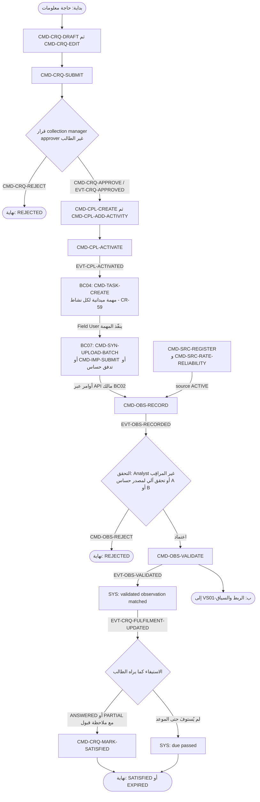

الأمر المرسل من جهاز ميداني وقد أصبح `base_version` فيه قديمًا لا يُكتب فوق الحالة الحالية. بدلًا من ذلك يُفتح له AGG-SYNC-CONFLICT (`SYS:stale state-changing command` ← EVT-SCF-OPENED) ويُحسم بأحد ثلاثة أوامر: `CMD-SCF-REAPPLY` أو `CMD-SCF-DISCARD` أو `CMD-SCF-RESOLVE-MANUALLY`، ولا يُطبَّق مبدأ «آخر كتابة تفوز» (LWW) (ADR-P09). وتنتهي خطة الجمع بـ`SYS:all activity tasks terminal` استجابةً لأحداث SLC-03، أو بـ`CMD-CPL-COMPLETE`.

### 1.3 مخطط النشاط — (ب) الربط والسياق والفهم

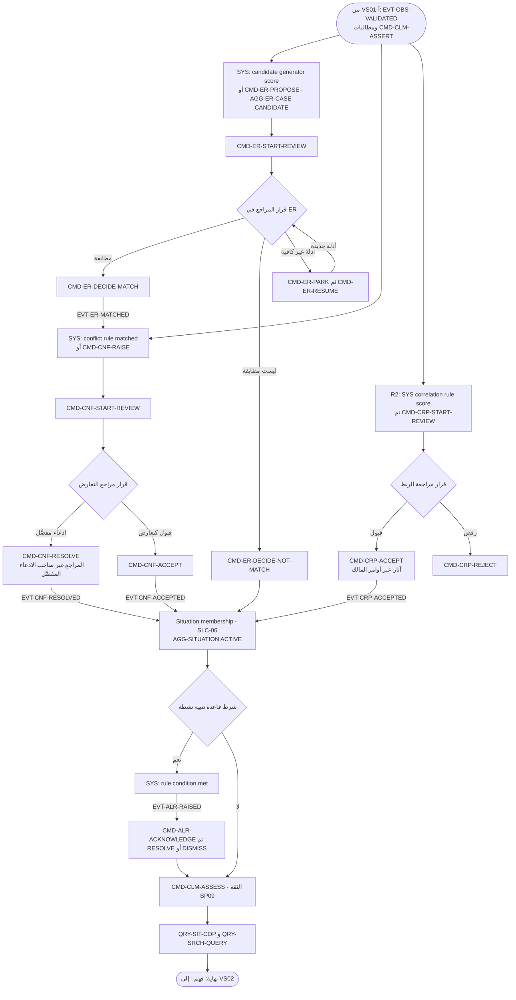

`CMD-ER-DECIDE-MATCH` يستهلك EVT-ER-MATCHED بمكوّنَين: «Cluster maintainer» و«Conflict detector (re-run on cluster change)». لهذا يعاد تشغيل كشف التعارض بعد كل دمج (`03-domain/contexts/BC02/events-slc04.md`).

### 1.4 مخطط المسارات

```mermaid
flowchart LR
  subgraph LAN["Analyst ACT-04 أو أي طالب"]
    s1["CMD-CRQ-DRAFT و CMD-CRQ-SUBMIT"]
    s8["CMD-OBS-VALIDATE"]
    s12["CMD-ER-DECIDE-MATCH و CMD-CNF-RESOLVE"]
    s14["CMD-SIT-CREATE و CMD-SIT-ACTIVATE"]
    s9["CMD-CRQ-MARK-SATISFIED"]
  end
  subgraph LCM["collection manager"]
    s2["CMD-CRQ-APPROVE"]
  end
  subgraph LCP["collection planner"]
    s3["CMD-CPL-CREATE و CMD-CPL-ACTIVATE"]
  end
  subgraph LFU["Field User ACT-06"]
    s5["CMD-TASK-ACCEPT و CMD-TASK-START"]
    s6["CMD-OBS-RECORD دون اتصال"]
  end
  subgraph SG_S4["النظام: BC04 Task - SLC-03"]
    s4["CMD-TASK-CREATE"]
  end
  subgraph SG_S7["النظام: BC07 Field sync DU-10"]
    s7["CMD-SYN-UPLOAD-BATCH<br/>يطبَّق عبر API المالك"]
  end
  subgraph SG_S2["النظام: BC02 matching و candidate generator و conflict detector"]
    s10["SYS: validated observation matched"]
    s11["SYS: candidate score و conflict rule matched"]
  end
  subgraph SG_S3["النظام: BC03 Evaluators DU-07"]
    s13["membership و SYS: rule condition met"]
  end
  s1 -->|"EVT-CRQ-SUBMITTED"| s2
  s2 -->|"EVT-CRQ-APPROVED"| s3
  s3 -->|"EVT-CPL-ACTIVATED"| s4
  s4 -->|"EVT-TASK-ASSIGNED"| s5
  s5 --> s6 --> s7
  s7 -->|"EVT-OBS-RECORDED"| s8
  s8 -->|"EVT-OBS-VALIDATED"| s10
  s8 -->|"EVT-OBS-VALIDATED"| s11
  s11 -->|"EVT-ER-PROPOSED و EVT-CNF-DETECTED"| s12
  s14 -->|"EVT-SIT-ACTIVATED"| s13
  s12 -->|"EVT-ER-MATCHED"| s13
  s10 -->|"EVT-CRQ-FULFILMENT-UPDATED"| s9
```

---

## 2. VS02 — Understanding → Decision

### 2.1 المراحل

| # | المرحلة | BP | UC | ما يحققها: Aggregate — الأوامر والأحداث | الإصدار |
|---|---|---|---|---|---|
| 1 | Question | BP11 Define Analytical Question | UC-011 | AGG-ANALYSIS-CASE `CMD-ACS-CREATE`، `CMD-ACS-DEFINE` (EVT-ACS-DEFINED) | R1 (SLC-07) |
| 2 | Analysis Case | BP12 Create Analysis Case | UC-010 | `CMD-ACS-OPEN` (الشرط: «question and scope present (REQ-ANL-001)») ← EVT-ACS-OPENED | R1 |
| 3 | Evidence | BP13 Select Evidence | UC-012 | `CMD-ACS-SELECT-EVIDENCE` (مثبّت بـ `known_at = now`) ← EVT-ACS-EVIDENCE-SELECTED | R1 |
| 4 | Hypotheses | BP14 Develop Hypotheses | UC-013 **[Derived]** | `CMD-ACS-ADD-HYPOTHESIS`، `CMD-ACS-UPDATE-HYPOTHESIS` | R1 |
| 5 | Assumptions | — (لا BP بالاسم) | UC-013 **[Derived]** | `CMD-ACS-ADD-ASSUMPTION`، `CMD-ACS-RETIRE-ASSUMPTION` | R1 |
| 6 | Analysis | BP15 Execute Analysis | UC-013 | AGG-ANALYSIS-RUN `CMD-RUN-SUBMIT` ← `SYS:worker lease acquired` ← EVT-RUN-SUCCEEDED أو EVT-RUN-FAILED؛ AGG-FINDING `CMD-FND-RECORD` ← `CMD-FND-ACCEPT` (EVT-FND-ACCEPTED) | R1 |
| 7 | Uncertainty | BP16 Assess Uncertainty | UC-014 | `CMD-FND-RECORD` (عدم اليقين حقل إلزامي)؛ `CMD-ASM-EDIT` (ثقة تحليلية low/moderate/high) | R1 |
| 8 | Assessment | BP17 Produce Assessment | UC-015 | AGG-ASSESSMENT `CMD-ASM-DRAFT` ← `CMD-ASM-SUBMIT` ← `CMD-ASM-RETURN` أو `CMD-ASM-PUBLISH` (EVT-ASM-PUBLISHED) | R1 |
| 9 | Options | BP18 Develop Options | UC-016، UC-031 | `CMD-ACS-DEFINE-SCENARIO` (REQ-ANL-007)؛ `CMD-DRQ-ADD-OPTION` | R1 (SLC-07، SLC-08) |
| 10 | Impact | — | UC-031 **[Derived]** | حقل `expected_impact` في حمولة `CMD-DRQ-ADD-OPTION` فقط، دون تحليل أثر مستقل **[Derived]** | R1 |
| 11 | Decision Support | BP19 Decision Support | UC-030، UC-131 | AGG-DECISION-REQUEST `CMD-DRQ-CREATE`، `CMD-DRQ-CITE`، `CMD-DRQ-OPEN` (EVT-DRQ-OPENED)؛ `SYS:deadline passed` ← EVT-DRQ-ESCALATED؛ وفي R2: `CMD-CRD-REQUEST-DECISION` ينشئ طلب قرار | R1؛ R2 (SLC-15) |
| 12 | Decision | BP20 Record Decision | UC-032 | AGG-DECISION `CMD-DEC-RECORD` (AuthorityCheck من BC01) ← EVT-DEC-RECORDED ← `SYS:decision recorded for this request` ← EVT-DRQ-DECIDED | R1 (SLC-08) |

### 2.2 مخطط النشاط

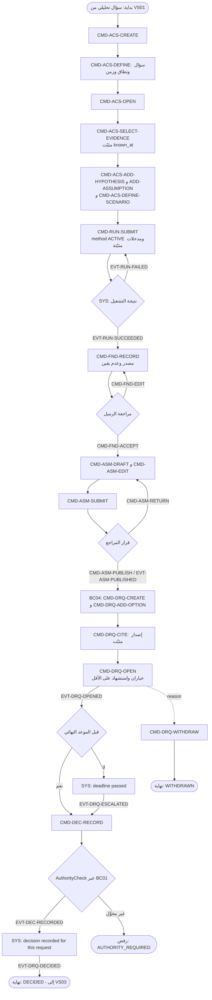

من شروط `CMD-ASM-PUBLISH` أن يكون المراجع غير المؤلف، وأن يصير الإصدار المنشور السابق `SUPERSEDED` في المعاملة نفسها. ومن شروط `CMD-ASM-SUBMIT` وجود نتيجة واحدة على الأقل بحالة ACCEPTED، إضافة إلى الأدلة والافتراضات وعدم اليقين والثقة والمنهجية والقيود (REQ-ANL-005). ولا يُقبل `CMD-DEC-RECORD` إلا إذا أعاد `AuthorityCheck` النتيجة «authorized»، وتُخزَّن سلسلة المنح لقطةً للسلطة (BRL-003، REQ-DEC-002). يمكن أيضًا تسجيل قرار ad-hoc دون طلب إذا صحبه مبرر واستشهاد واحد على الأقل.

### 2.3 مخطط المسارات

```mermaid
flowchart LR
  subgraph LAO["Analyst ACT-04 - مالك الحالة"]
    a1["CMD-ACS-CREATE و OPEN و SELECT-EVIDENCE"]
    a2["CMD-RUN-SUBMIT"]
    a3["CMD-FND-RECORD"]
    a4["CMD-ASM-DRAFT و CMD-ASM-SUBMIT"]
  end
  subgraph LPA["peer Analyst"]
    a5["CMD-FND-ACCEPT"]
  end
  subgraph LRV["reviewer أو Analysis lead"]
    a6["CMD-ASM-PUBLISH أو CMD-ASM-RETURN"]
  end
  subgraph LDQ["Analyst أو Planner أو Manager"]
    a7["CMD-DRQ-CREATE و CITE و OPEN"]
  end
  subgraph LAH["authority holder: Manager ACT-02 أو Executive ACT-01"]
    a8["CMD-DEC-RECORD"]
  end
  subgraph SG_SJ["النظام: BC03 Analysis jobs DU-13"]
    a9["SYS: worker lease ثم completed"]
  end
  subgraph SG_SF["النظام: BC01 OHS"]
    a10["AuthorityCheck"]
  end
  subgraph SG_SO["النظام: BC04"]
    a11["SYS: deadline passed و decision recorded"]
  end
  a1 --> a2 -->|"EVT-RUN-QUEUED"| a9
  a9 -->|"EVT-RUN-SUCCEEDED"| a3
  a3 -->|"EVT-FND-RECORDED"| a5
  a5 -->|"EVT-FND-ACCEPTED"| a4
  a4 -->|"EVT-ASM-SUBMITTED"| a6
  a6 -->|"EVT-ASM-PUBLISHED"| a7
  a7 -->|"EVT-DRQ-OPENED"| a8
  a8 --> a10
  a10 -->|"authorized: EVT-DEC-RECORDED"| a11
  a11 -->|"EVT-DRQ-ESCALATED"| a8
```

المسؤوليات في الجدول المقابل مطابقة لـ`decision_rights` في `stakeholders.md`: «Business Decision» (R = Manager / Executive حسب Authority؛ A = صاحب السلطة المسجل في BC01) و«Assessment publication» (R = Analyst؛ A = Analysis lead / Manager).

---

## 3. VS03 — Decision → Execution

### 3.1 المراحل

| # | المرحلة | BP | UC | ما يحققها: Aggregate — الأوامر والأحداث | الإصدار |
|---|---|---|---|---|---|
| 1 | Decision | — (BP20 في VS02) | UC-032 | EVT-DEC-RECORDED؛ مرجع `implements` في `CMD-PLN-CREATE` | R1 (SLC-08) |
| 2 | Objective | BP21 Define Objective | UC-033 | `CMD-PLN-CREATE` (الشرط: «implements ≥ 1 decision (RECORDED) or objective (REQ-OPS-002)»)؛ `CMD-PLV-EDIT` (objectives) | R1 |
| 3 | Outcome | BP22 Define Outcomes | UC-033 | `CMD-PLV-EDIT` (outcomes: metric, unit, target, due) | R1 |
| 4 | Plan | BP23 Develop Plan | UC-033 | AGG-PLAN-VERSION `CMD-PLV-DRAFT` (EVT-PLV-DRAFTED)، `CMD-PLV-EDIT` | R1 |
| 5 | Resources | BP24 Validate Resources | UC-050، UC-051، UC-052، UC-053 | `QRY-AST-AVAILABILITY`؛ AGG-ASSET-RESERVATION `CMD-RSV-HOLD` ← `CMD-RSV-CONFIRM`؛ AGG-ASSET-ASSIGNMENT `CMD-ASG-ASSIGN`. في R1: ملاحظات نصية `resource_notes` (DEBT-001، `allocation-readiness-spec.md` §6) | R2 (SLC-09) |
| 6 | Capacity | BP24 **[Derived]** | UC-054 | AGG-ALLOCATION `CMD-ALC-REQUEST` ← `SYS:all checks passed` (COMMITTED) أو `SYS:checks passed, policy requires approval` (PENDING_APPROVAL) أو `SYS:a check failed` (REJECTED)؛ `QRY-POL-TIMELINE` | R2 |
| 7 | Schedule | — | UC-033 **[Derived]** | `CMD-PLV-EDIT` (phases, milestones, schedule within plan window, acyclic dependencies)؛ `CMD-TASK-SET-DUE` | R1 |
| 8 | Approval | BP25 Approve / Baseline | UC-034، UC-035 | `CMD-PLV-SUBMIT` ← `CMD-PLV-RETURN` أو `CMD-PLV-APPROVE` أو `CMD-PLV-REJECT` | R1 |
| 9 | Baseline | BP25 | UC-036 | EVT-PLV-BASELINED ← AGG-PLAN `SYS:first version baselined` (EVT-PLN-ACTIVATED)؛ AGG-OUTCOME-TRACKER `SYS:outcome baselined` (EVT-OUT-TRACKER-CREATED)؛ الإصدار السابق ← SUPERSEDED | R1 |
| 10 | Work Packages | BP26 Decompose Plan | — | لا Aggregate باسم «حزمة عمل». التفكيك يتم عبر أنشطة الإصدار ذات العلم `task_generating` ومزامنة المهام (`decision-plan-spec.md` §3) **[Derived]** | R1 |
| 11 | Tasks | BP26، BP27 Assign Work | UC-040، UC-041، UC-102 | AGG-TASK `CMD-TASK-CREATE` ← `CMD-TASK-MARK-READY` ← `CMD-TASK-ASSIGN` (EligibilityCheck، REQ-OPS-007) ← EVT-TASK-ASSIGNED | R1 (SLC-03) |
| 12 | Execution | BP28 Execute | UC-042، UC-043، UC-046، UC-055 | `CMD-TASK-ACCEPT`/`DECLINE`، `START`، `BLOCK`/`RESUME`، `ADD-RESULT-ITEM`، `SUBMIT`؛ `CMD-TASK-ESCALATE`؛ `CMD-ALC-RECORD-CONSUMPTION` (R2) | R1؛ R2 |
| 13 | Measurement | BP29 Review Execution، BP30 Measure Outcome | UC-044، UC-101 | `CMD-TASK-START-REVIEW` ← `RETURN` أو `APPROVE` أو `REJECT`؛ AGG-OUTCOME-TRACKER `CMD-OUT-RECORD` (EVT-OUT-MEASURED)؛ `QRY-PLN-PROGRESS` | R1 |
| 14 | Outcome | BP30 | UC-045، UC-101 | `SYS:all completion criteria satisfied` أو `CMD-TASK-COMPLETE` ← EVT-TASK-COMPLETED ← `CMD-TASK-CLOSE`؛ `CMD-PLN-COMPLETE` (كل المهام نهائية ولكل نتيجة قياس) ← `CMD-PLN-CLOSE` (EVT-PLN-CLOSED) | R1 |

### 3.2 مخطط النشاط — (أ) من القرار إلى الخط الأساسي

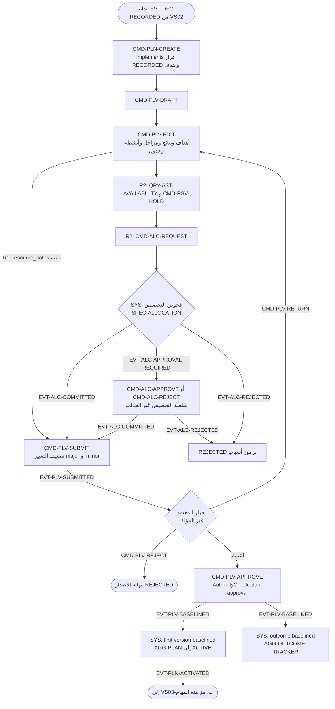

### 3.3 مخطط النشاط — (ب) من المهام إلى النتيجة

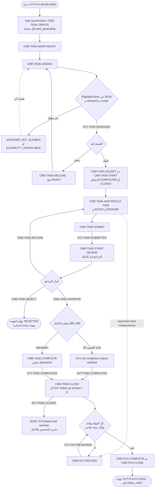

المصدر في الحالات التالية جدول انتقالات AGG-TASK، وليست المسارات المرسومة. `CMD-TASK-CANCEL` والانتقال التلقائي `SYS:due passed and task type expires_on_due` ممكنان من كل حالة غير نهائية تقريبًا. ويُنقل إلى SUPERSEDED بـ`SYS:plan version baselined without this task` كل مهمة حُذف نشاطها من الخط الأساسي الجديد. أما `CMD-TASK-SUSPEND` و`CMD-TASK-ESCALATE` فلا يغيّران الحالة. قاعدة REJECT التي تسمح بمهمة متابعة مرتبطة مذكورة في OQ-033.

### 3.4 مخطط المسارات

```mermaid
flowchart LR
  subgraph LPL["Planner ACT-03 أو owner"]
    p1["CMD-PLN-CREATE و CMD-PLV-DRAFT و EDIT"]
    p2["CMD-PLV-SUBMIT"]
    p3["CMD-TASK-ASSIGN"]
    p4["CMD-OUT-RECORD"]
    p5["CMD-PLN-COMPLETE و CMD-PLN-CLOSE"]
  end
  subgraph LAP["approver بسلطة plan-approval: Manager ACT-02"]
    p6["CMD-PLV-APPROVE أو RETURN أو REJECT"]
  end
  subgraph LRM["Resource Manager ACT-07 أو allocation authority - R2"]
    p7["CMD-RSV-HOLD و CMD-ALC-APPROVE"]
  end
  subgraph LAS["assignee: Field User ACT-06 أو Operator ACT-05"]
    p8["CMD-TASK-ACCEPT و START و SUBMIT"]
  end
  subgraph LRV["reviewer"]
    p9["CMD-TASK-START-REVIEW و APPROVE"]
  end
  subgraph SG_S4["النظام: BC04"]
    p10["Task synchronizer"]
    p11["SYS: first version baselined"]
  end
  subgraph SG_S5["النظام: BC05"]
    p12["EligibilityCheck"]
    p13["SYS: linked task terminal"]
  end
  p1 --> p2 -->|"EVT-PLV-SUBMITTED"| p6
  p1 -.->|"R2 CMD-ALC-REQUEST"| p7
  p6 -->|"EVT-PLV-BASELINED"| p10
  p6 -->|"EVT-PLV-BASELINED"| p11
  p10 -->|"EVT-TASK-CREATED"| p3
  p3 --> p12
  p12 -->|"EVT-TASK-ASSIGNED"| p8
  p8 -->|"EVT-TASK-SUBMITTED"| p9
  p9 -->|"EVT-TASK-COMPLETED"| p13
  p9 -->|"EVT-TASK-COMPLETED"| p4
  p4 -->|"EVT-OUT-MEASURED"| p5
```

إسناد «assignee» إلى ACT-06 وACT-05 **[Derived]**: كتالوج الأوامر يسميه «assignee» فقط. مسؤوليات «Plan approval & baseline» (R = Planner؛ A = Manager ≠ المُعد) و«Task approval» (R = Reviewer؛ A = Manager ≠ المنفذ) مطابقة لـ`stakeholders.md`.

---

## 4. VS04 — Risk → Resilience (متحقق في R3 **[Derived]**)

### 4.1 المراحل

| # | المرحلة | BP | UC | ما يحققها: Aggregate — الأوامر والأحداث | الإصدار |
|---|---|---|---|---|---|
| 1 | Hazard | BP31 Identify Risk | UC-140 | بيانات مرجعية `RD-HAZARD-CATEGORIES` تُستهلك في `category_ref`. غياب Aggregate خاص بـHazard قرار صريح (`risk-contingency-spec.md` §2) | R3 (SLC-17) |
| 2 | Risk | BP31، BP32 Assess Risk | UC-140 | AGG-RISK `CMD-RIS-IDENTIFY` (EVT-RIS-IDENTIFIED) ← `CMD-RIS-ASSESS` (EVT-RIS-ASSESSED؛ `risk_score` محسوب، INV-RIS-02) | R3 |
| 3 | Treatment | BP33 Treat Risk | UC-141 | `CMD-RIS-PLAN-TREATMENT` (EVT-RIS-TREATMENT-PLANNED؛ strategy ∈ {avoid, reduce, transfer, accept}، INV-RIS-03)؛ خطة استمرارية `CMD-PLN-CREATE` بـ`plan_kind=CONTINGENCY` و`risk_ref` (CR-60) | R3 |
| 4 | Monitoring | BP34 Monitor Risk | UC-140 | `CMD-RIS-REASSESS` (EVT-RIS-REASSESSED)؛ `QRY-RIS-REGISTER` | R3 |
| 5 | Threshold | — | — | **[Missing]**: لا شرط ولا انتقال `SYS:` في AGG-RISK يستند إلى عتبة على `risk_score`، ولا يعرّف `risk-contingency-spec.md` عتبة تطلق حادثة أو تنبيهًا | — |
| 6 | Incident | BP35 Manage Incident | UC-142 | AGG-INCIDENT `CMD-INC-REPORT` (`risk_ref` اختياري) ← `CMD-INC-ASSESS` أو `CMD-INC-CANCEL`؛ على الخطر: `SYS:incident references this risk as risk_ref` ← EVT-RIS-MATERIALIZATION-LINKED (لا يغيّر حالته، INV-RIS-05) | R3 |
| 7 | Response | BP36 Emergency | UC-143 | `CMD-INC-DISPATCH-RESPONSE` (مهام SLC-03 بـ`incident_ref`، CR-61) ← EVT-INC-RESPONSE-DISPATCHED؛ `CMD-INC-ESCALATE` و`CMD-INC-DE-ESCALATE` (INV-INC-01)؛ `SYS:response SLA elapsed without dispatch` ← EVT-INC-SLA-BREACHED | R3 |
| 8 | Stabilization | BP36 **[Derived]** | UC-143 | `CMD-INC-CONTAIN` (EVT-INC-CONTAINED). اسم المرحلة غير اسم الحالة CONTAINED، والمطابقة **[Derived]** | R3 |
| 9 | Recovery | BP37 Recovery | UC-144 | `CMD-INC-ACTIVATE-CONTINGENCY` (EVT-INC-CONTINGENCY-ACTIVATED؛ أمر صريح، INV-INC-03) ← AGG-PLAN بـ`CONTINGENCY` في VS03؛ التعافي محسوب بـ`QRY-INC-RECOVERY-STATUS` (R3-Q4)؛ `CMD-INC-RESOLVE` (كل مهام الاستجابة نهائية، INV-INC-02) | R3 |
| 10 | Review | BP38 After Action Review | UC-143 | `CMD-INC-CLOSE` (`after_action_ref` اختياري)؛ `CMD-RIS-CLOSE` بـrationale `materialized` و`incident_ref` إلزامي (INV-RIS-04) | R3 |
| 11 | Lesson | BP38 | UC-060 **[Derived]** | AGG-KNOWLEDGE-OBJECT `CMD-KNO-DRAFT` من نوع lesson ومصدره حادثة نهائية (R3-Q5)؛ EVT-INC-CLOSED يستهلكه «اقتراحات كائن المعرفة (SLC-12)» | R2 (BC06) / R3 |

### 4.2 مخطط النشاط

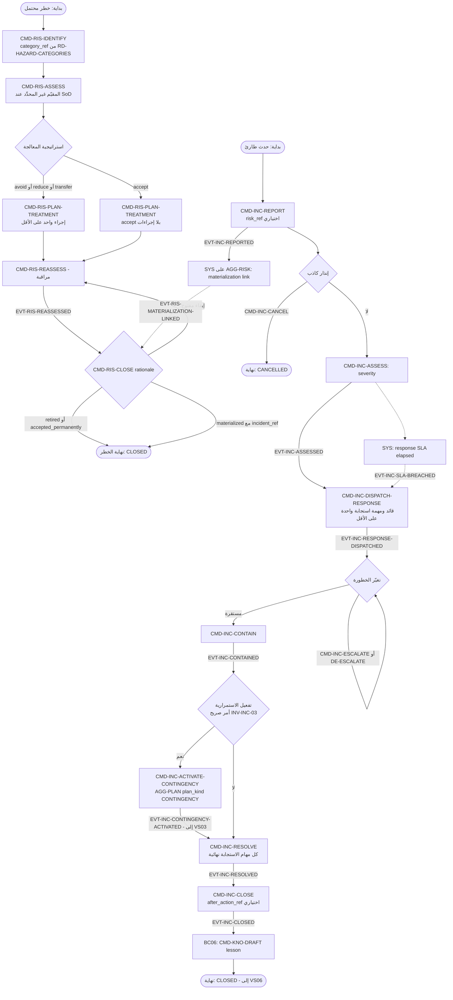

`CMD-INC-ESCALATE` و`CMD-INC-DE-ESCALATE` و`CMD-INC-ACTIVATE-CONTINGENCY` مسموحة من كل حالة غير نهائية (`*NT` في جدول الانتقالات). وُضعت في المخطط بعد الإرسال لتبقى الصورة مقروءة فقط. لإغلاق الحادثة لا يلزم إغلاق خطة الاستمرارية المرتبطة (FM-S17-02، `risk-contingency-spec.md` §4). **S-01** (قائمة `states` في AGG-INCIDENT لا تذكر CLOSED وCANCELLED) مسجّل أصلًا في `00-index.md` §6.

### 4.3 مخطط المسارات

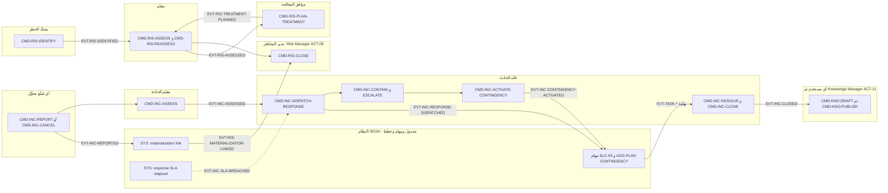

أسماء الفاعلين منقولة حرفيًا من عمود «الفاعل» في `commands-slc17.md` (UC-140..144). وحده «مدير المخاطر» يطابق فاعلًا في `stakeholders.md` هو ACT-09 Risk Manager **[Derived]**. أما البقية فلا معرّف `ACT-*` لها (NR-02).

---

## 5. VS05 — Capability → Readiness (متحقق في R1 وR2 وR3 **[Derived]**)

### 5.1 المراحل

| # | المرحلة | BP | UC | ما يحققها: Aggregate — الأوامر والأحداث | الإصدار |
|---|---|---|---|---|---|
| 1 | Role | BP39 Competency Requirement | — | AGG-ROLE (BC01) `CMD-ROL-DEFINE` ← `CMD-ROL-ACTIVATE`؛ AGG-ROLE-REQUIREMENT `CMD-RRQ-DEFINE` (الدور موجود في BC01) ← `CMD-RRQ-ACTIVATE` (approver ≠ author) ← EVT-RRQ-ACTIVATED | R1 (SLC-01)؛ R2 (SLC-09) |
| 2 | Competencies | BP39 | UC-160 **[Derived]** | `RD-COMPETENCIES` يُستهلك في `CMD-RRQ-EDIT` و`CMD-TTY-EDIT` (required qualifications) و`CMD-SCN-DEFINE` (target_competencies) | R1؛ R2؛ R3 |
| 3 | Gap | BP41 Gap Analysis | UC-102 **[Derived]** (عبر REQ-RES-013) | `QRY-READINESS` («Readiness of a person or unit for a role at time t, with gaps»، `allocation-readiness-spec.md` §5)؛ حالات EligibilityCheck من نوع `REQUIRES_TRAINING` و`REQUIRES_CERTIFICATION` | R2 |
| 4 | Training | BP42 Training Plan، BP43 Training | UC-160، UC-161، UC-162 | AGG-SCENARIO `CMD-SCN-DEFINE` ← `CMD-SCN-ACTIVATE`؛ AGG-EXERCISE `CMD-EXR-PLAN` ← `CMD-EXR-SCHEDULE` ← `CMD-EXR-START` (+`CMD-SIM-START` في وحدة العمل نفسها)؛ AGG-SIMULATION `CMD-SIM-DELIVER-INJECT`. BP42 **[Missing]**: التدريب في المواصفات «نشاط» (`training-exercise-spec.md` §1)، ولا يوجد كائن خطة تدريب يربط فجوة شخص بتمرين | R3 (SLC-19) |
| 5 | Assessment | BP40 Assess Competency، BP44 Learning Assessment | UC-162 | `CMD-SIM-RECORD-EVALUATION` (MET/PARTIAL/NOT_MET؛ evaluator ≠ participant، INV-SIM-03) ← EVT-SIM-EVALUATION-RECORDED؛ `CMD-SIM-COMPLETE` (كل مشارك له تقييم، INV-SIM-02) | R3 |
| 6 | Qualification | BP45 Qualification | UC-163 | AGG-QUALIFICATION-RECORD `CMD-QUAL-RECORD` أو `CMD-QUAL-RENEW` (evidence قد يكون محاكاة مكتملة؛ EVT-SIM-EVALUATION-RECORDED يستهلكه «Qualification Record (optional evidence source)») | R1 (SLC-03)؛ الدليل من المحاكاة R3 |
| 7 | Certification | BP46 Certification | UC-163 | الـAggregate نفسه: «Competency/Qualification/Certification = AGG-QUALIFICATION-RECORD» (`training-exercise-spec.md` §1)؛ ويميّز EligibilityCheck الحالة `REQUIRES_CERTIFICATION` | R1 |
| 8 | Readiness | BP47 Readiness | UC-102 **[Derived]** | `QRY-READINESS` (نسبة الجاهزين لكل دور في الوحدة) | R2 |
| 9 | Eligibility | BP48 Eligibility | UC-102 | `QRY-ELIG-CHECK` (`eligibility-rules.md`، الأسوأ يغلب) | R1 |
| 10 | Assignment | — | UC-041 **[Derived]** | `CMD-TASK-ASSIGN` بشرط EligibilityCheck ∈ {ELIGIBLE, CONDITIONALLY_ELIGIBLE} ← EVT-TASK-ASSIGNED (تسليم إلى VS03) | R1 |

### 5.2 مخطط النشاط

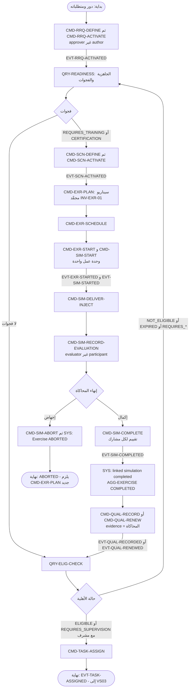

`SYS:valid_to reached` ينقل سجل التأهيل إلى EXPIRED، ويُفحص الأمر نفسه عند القراءة أيضًا. `CMD-QUAL-SUSPEND` و`CMD-QUAL-REVOKE` يجعلان الأهلية `NOT_ELIGIBLE`. وتستهلك «Eligibility cache invalidation» و«Task assignment re-check report» كل حدث EVT-QUAL-* (`events-slc03.md` في BC05).

### 5.3 مخطط المسارات

```mermaid
flowchart LR
  subgraph LTA["Training Manager ACT-10 أو Administrator ACT-15"]
    v1["CMD-RRQ-DEFINE و CMD-RRQ-ACTIVATE"]
  end
  subgraph LTM["Training Manager ACT-10"]
    v2["CMD-SCN-DEFINE و CMD-SCN-EDIT"]
  end
  subgraph LED["Exercise Director"]
    v3["CMD-SCN-ACTIVATE"]
    v4["CMD-EXR-PLAN و CMD-EXR-SCHEDULE"]
  end
  subgraph LEC["Exercise Controller"]
    v5["CMD-EXR-START و DELIVER-INJECT"]
    v6["CMD-SIM-COMPLETE أو CMD-SIM-ABORT"]
  end
  subgraph LEV["Evaluator"]
    v7["CMD-SIM-RECORD-EVALUATION"]
  end
  subgraph LRM["Resource Manager ACT-07 أو Training Manager ACT-10"]
    v8["CMD-QUAL-RECORD أو CMD-QUAL-RENEW"]
  end
  subgraph LMG["Manager ACT-02 أو Planner ACT-03"]
    v9["QRY-ELIG-CHECK و CMD-TASK-ASSIGN"]
  end
  subgraph SG_S5["النظام: BC05"]
    v10["CMD-SIM-START داخلي"]
    v11["SYS: linked simulation completed"]
    v12["QRY-READINESS و SYS: valid_to reached"]
  end
  v1 -->|"EVT-RRQ-ACTIVATED"| v12
  v12 -->|"فجوات"| v2
  v2 -->|"EVT-SCN-DEFINED"| v3
  v3 -->|"EVT-SCN-ACTIVATED"| v4
  v4 -->|"EVT-EXR-SCHEDULED"| v5
  v5 --> v10
  v10 -->|"EVT-SIM-STARTED"| v7
  v7 -->|"EVT-SIM-EVALUATION-RECORDED"| v6
  v6 -->|"EVT-SIM-COMPLETED"| v11
  v11 -->|"EVT-EXR-COMPLETED"| v8
  v8 -->|"EVT-QUAL-RECORDED"| v9
```

الفاعلون مأخوذون من `commands-slc19.md` و`commands-slc03.md` و`commands-slc09.md` في BC05، ومن UC-163. أما «Exercise Director» و«Exercise Controller» و«Evaluator» فلا معرّف `ACT-*` لها (NR-02). `CMD-SIM-START` داخلي (`داخلي = نعم`، مسجَّل S-08).

---

## 6. VS06 — Experience → Knowledge

### 6.1 المراحل

| # | المرحلة | BP | UC | ما يحققها: Aggregate — الأوامر والأحداث | الإصدار |
|---|---|---|---|---|---|
| 1 | Execution | — | UC-042 **[Derived]** | المصادر النهائية المسموحة في شرط `CMD-KNO-DRAFT`: مهمة أو خطة أو حادثة أو محاكاة مكتملة (CR-63، REQ-KNW-002) | R1؛ R3 |
| 2 | Observation | — | UC-005 **[Derived]** | `CMD-TASK-ADD-RESULT-ITEM` (item = observation URN أو evidence URN)؛ `CMD-OBS-RECORD` | R1 |
| 3 | Result | — | UC-043 | `CMD-TASK-SUBMIT` (النتيجة فيها عنصر واحد على الأقل) ← EVT-TASK-SUBMITTED | R1 |
| 4 | Review | — | UC-044 **[Derived]** | `CMD-TASK-START-REVIEW` ← `CMD-TASK-APPROVE`؛ `CMD-PLN-CLOSE` (after-action notes)؛ `CMD-INC-CLOSE` (`after_action_ref`) | R1؛ R3 |
| 5 | Lesson | BP49 Capture Lesson | UC-060 | AGG-KNOWLEDGE-OBJECT `CMD-KNO-DRAFT` (type = lesson؛ label ≥ source label) ← EVT-KNO-DRAFTED | R2 (SLC-12) |
| 6 | Knowledge Candidate | BP51 Create Knowledge، BP52 Link Evidence | UC-060 | `CMD-KNO-EDIT` (statements with evidence links؛ علاقات بأنواع المهام والخطط والكيانات والمناطق) | R2 |
| 7 | Validation | BP50 Validate Lesson، BP53 Review | UC-061 | `CMD-KNO-SUBMIT` (عبارة واحدة على الأقل؛ ولـlessons رابط دليل واحد على الأقل) ← `CMD-KNO-RETURN` أو `CMD-KNO-REJECT` | R2 |
| 8 | Approval | BP53 | UC-061 | `CMD-KNO-PUBLISH` (reviewer ≠ author؛ ويشترط للإجراءات ومعرفة السياسات السلطة المالكة) | R2 |
| 9 | Publication | BP54 Publish | UC-062 | EVT-KNO-PUBLISHED (المستهلك «Knowledge suggestion index»)؛ الإصدار السابق ← `SYS:newer version published` ← SUPERSEDED | R2 |
| 10 | Reuse | BP55 Reuse | UC-062 **[Derived]** | `QRY-KNO-SUGGEST`، `QRY-KNO-SEARCH`؛ `CMD-KNO-RECORD-REUSE` (EVT-KNO-REUSED، مؤشر OUT-06) | R2 |

### 6.2 مخطط النشاط

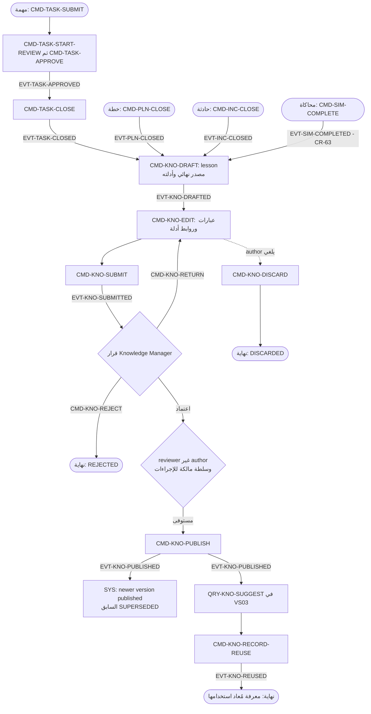

المعرفة المنشورة تنتهي بـ`CMD-KNO-RETIRE` (obsolete أو wrong)، أو بـSUPERSEDED إذا نُشر إصدار أحدث.

### 6.3 مخطط المسارات

```mermaid
flowchart LR
  subgraph LAS["assignee"]
    k1["CMD-TASK-ADD-RESULT-ITEM و CMD-TASK-SUBMIT"]
  end
  subgraph LRV["reviewer"]
    k2["CMD-TASK-APPROVE"]
  end
  subgraph LAU["أي مستخدم - author"]
    k3["CMD-KNO-DRAFT و CMD-KNO-EDIT"]
    k4["CMD-KNO-SUBMIT"]
  end
  subgraph LKM["Knowledge Manager ACT-11"]
    k5["CMD-KNO-RETURN أو REJECT"]
    k6["CMD-KNO-PUBLISH"]
  end
  subgraph LPL["planner"]
    k7["QRY-KNO-SUGGEST و CMD-KNO-RECORD-REUSE"]
  end
  subgraph SG_SSRC["النظام: BC04 و BC05 مصادر نهائية"]
    k8["EVT-TASK-CLOSED و EVT-PLN-CLOSED<br/>و EVT-INC-CLOSED و EVT-SIM-COMPLETED"]
  end
  subgraph SG_S6["النظام: BC06"]
    k9["Knowledge suggestion index<br/>و SYS: newer version published"]
  end
  k1 -->|"EVT-TASK-SUBMITTED"| k2
  k2 -->|"EVT-TASK-APPROVED"| k8
  k8 --> k3
  k3 --> k4
  k4 -->|"EVT-KNO-SUBMITTED"| k5
  k5 -->|"EVT-KNO-RETURNED"| k3
  k4 --> k6
  k6 -->|"EVT-KNO-PUBLISHED"| k9
  k9 --> k7
```

الفاعلون مأخوذون من `commands-slc12.md`: «any user (draft lessons) · Knowledge Manager (review, publish, retire) · planner (record reuse)».

---

## 7. VS07 — Record → Institutional Memory

### 7.1 المراحل

| # | المرحلة | BP | UC | ما يحققها: Aggregate — الأوامر والأحداث | الإصدار |
|---|---|---|---|---|---|
| 1 | Operational Record | BP56 Register Record | — | لا أمر «تسجيل سجل». كل أمر يكتب الحالة وسجل `_history` والـoutbox وaudit outbox في معاملة واحدة (FIT-04؛ قسم «الحفظ» في كل AGG) **[Derived]** | R1 |
| 2 | Classification | BP57 Classify | UC-085 | `label` في شروط كل إنشاء؛ أوامر `CMD-*-RECLASSIFY` (تزيد `security_version`)؛ AGG-CLASSIFICATION-SCHEME `CMD-CLS-DRAFT` ← `CMD-CLS-ACTIVATE` | R1 (SLC-01) |
| 3 | Retention | BP58 Retention | UC-103 | AGG-RETENTION-SCHEDULE `CMD-RTS-DRAFT` ← `CMD-RTS-EDIT` ← `CMD-RTS-ACTIVATE` (Legal/Compliance ≠ drafter؛ قاعدة واحدة لكل record class، REQ-GOV-006) ← EVT-RTS-ACTIVATED؛ AGG-LEGAL-HOLD `CMD-LHD-PLACE` | R1 (SLC-12a) |
| 4 | Closure | — | — | الانتقالات إلى حالات نهائية، مثل `CMD-PLN-CLOSE` و`CMD-TASK-CLOSE` و`CMD-INC-CLOSE`؛ ومن محفزات قاعدة الاحتفاظ في `CMD-RTS-EDIT` المحفز `closed` **[Derived]** | R1 |
| 5 | Preservation | BP59 Preserve | UC-063 | AGG-ARCHIVE-PACKAGE `SYS:package validated` (fixity SHA-256، صيغ حفظ R2-Q6) ← EVT-ARC-ARCHIVED؛ `SYS:integrity check failed` ← `CMD-ARC-REPAIR`؛ `CMD-ARC-MIGRATE-FORMAT` | R2 (SLC-12) |
| 6 | Archive | BP60 Archive | UC-063 | AGG-DISPOSITION-RUN `SYS:scheduled evaluation (daily)` ← `CMD-DSP-SUBMIT` ← `CMD-DSP-APPROVE` ← `SYS:execution started`؛ إجراء ARCHIVE ← AGG-ARCHIVE-PACKAGE `SYS:disposition action ARCHIVE…` (EVT-ARC-INGEST-STARTED)؛ `CMD-ARC-TRANSFER` | R1 (DSP)؛ R2 (ARCHIVE وARC) |
| 7 | Historical Retrieval | BP61 Historical Retrieval | UC-064، UC-096 | `QRY-ARC-SEARCH`، `QRY-ARC-RETRIEVE` (الوصول مسجَّل)؛ استعلامات as-of مثل `QRY-TASK-HISTORY` و`QRY-ENT-CLAIMS` | R2؛ R1 |
| 8 | Reconstruction | BP62 Historical Reconstruction | UC-065 | AGG-RECONSTRUCTION `CMD-REC-REQUEST` ← `SYS:worker started` ← `SYS:completed` أو `SYS:failed`؛ `QRY-REC-REPORT`؛ `QRY-DEC-BASIS` | R2؛ R1 |
| 9 | Institutional Memory | — | — | **[Missing]**: لا أمر ولا Aggregate ولا استعلام يحمل هذا الاسم أو يجمّعه. أقرب ما يوجد: كتالوج الأرشيف (المستهلك «Archive catalogue») والمعرفة المنشورة **[Derived]** | — |

### 7.2 مخطط النشاط

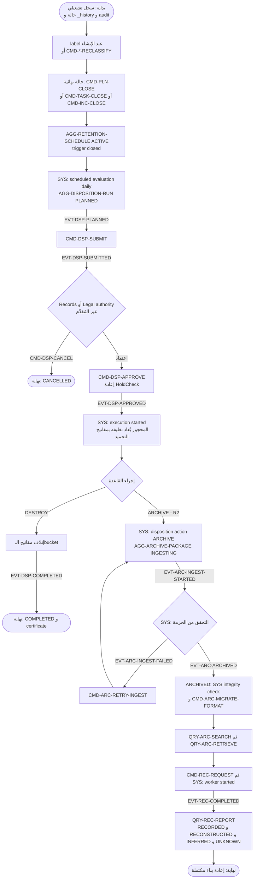

قاعدة الاحتفاظ تحدد الإجراء من بين `DESTROY` و`REVIEW` و`ARCHIVE (R2)` (`CMD-RTS-EDIT`). عناصر REVIEW تُعرض على Archivist في ملخص `CMD-DSP-SUBMIT`. والتنفيذ الذي يفشل في بعض الـbuckets ينتهي بـ`COMPLETED_WITH_EXCEPTIONS`، ويُعاد في التشغيل التالي. لم يُرسم في المخطط مسار المحو (AGG-ERASURE-REQUEST) لأنه لا ينتمي إلى مراحل التيار. **[Needs Review] NR-03:** لا يُذكر اسم الحدث الذي ينقل إجراء ARCHIVE من BC08 إلى BC06. فالانتقال في AGG-ARCHIVE-PACKAGE هو `SYS:disposition action ARCHIVE for a bucket or record set`، بينما لا يذكر عمود مستهلكي EVT-DSP-* في `BC08/events-slc12a.md` سوى «Key manager» و«Owner contexts» و«Audit»، ولا يذكر BC06.

### 7.3 مخطط المسارات

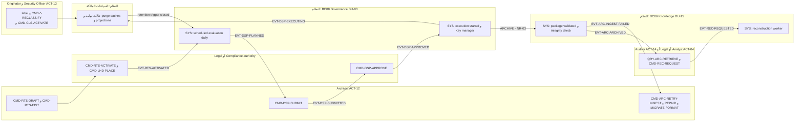

المسؤوليات مطابقة لـ`decision_rights` في `stakeholders.md`: «Retention / Legal hold» (R = Archivist؛ A = Legal / Compliance authority) و«Classification change» (R = Originator؛ A = Security Officer).

---

## 8. DFD المستوى 1

العمليات هي السياقات الثمانية، ومخازن البيانات هي الـschemas المملوكة لها (`16-database-schema.md` §8). الكيانات الخارجية مأخوذة من `12-solution/c4-context.md`، والتدفقات بين العمليات من `03-domain/context-map.md` وكتالوجات الأحداث. مخطط DFD 0 (السياق) مكانه `01-system-overview.md`.

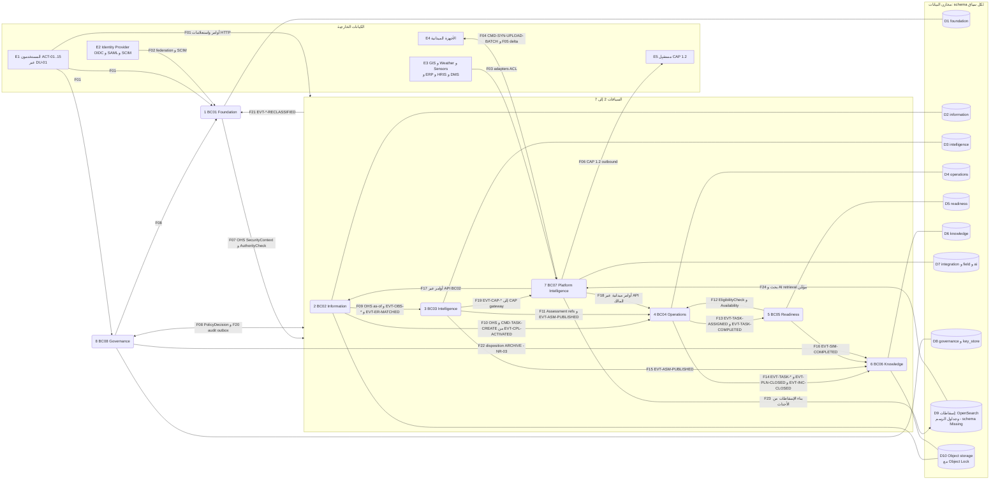

الوصلة `---` بين عملية ومخزن معناها قراءة وكتابة من المالك وحده. السهم ثنائي الاتجاه يجمع تدفقين متقابلين مذكورين في الجدول (F04 وF05، F08 وF20). الأسهم التي تخرج من الـsubgraph `CORE` أو تدخله اختصار لتدفق يخص كل سياق فيه.

### 8.1 جدول التدفقات

| # | من | إلى | التدفق | النوع | المصدر |
|---|---|---|---|---|---|
| F01 | E1 | كل السياقات | أوامر `CMD-*` واستعلامات `QRY-*` عبر DU-01 (SecurityContext، حدود المعدل) | HTTP متزامن | `12-solution/deployment-units.md` (DU-01)؛ `05-contracts/openapi-*.md` |
| F02 | E2 | BC01 | اتحاد الهوية وتزويد SCIM | متزامن | `12-solution/c4-context.md`؛ UC-084 |
| F03 | E3 | BC07 | محوّلات ACL (DU-11)؛ HRIS ← `SYS:HRIS change received` (AGG-HR-SYNC-PROPOSAL في BC01) | غير متزامن مع lineage | `context-map.md` (External → BC07)؛ `enterprise-integration-spec.md` |
| F04 | E4 | BC07 | جلسة مزامنة: `CMD-SYN-OPEN`، `CMD-SYN-UPLOAD-BATCH` (أظرف موقّعة، سلسلة hash) | دفعات | AGG-SYNC-SESSION؛ `field-sync-protocol.md` |
| F05 | BC07 | E4 | delta وإشعار تعارض (EVT-SCF-* ← «Sync delta»)، وتعليمة wipe أو stop (`SYS:device LOST or SUSPENDED at handshake`) | دفعات | AGG-SYNC-SESSION؛ AGG-SYNC-CONFLICT |
| F06 | BC07 | E5 | CAP 1.2 صادر فقط لـ`cap_endpoint` (INV-CON-02) | متزامن مع إعادة محاولة | AGG-INTEGRATION-CONNECTION؛ AGG-CAP-MESSAGE |
| F07 | BC01 | BC02..BC07 | `SecurityContext`، `AuthorityCheck(actor, decision_type, scope, at)` | OHS متزامن | `context-map.md` |
| F08 | BC08 | BC01..BC07 | `PolicyDecision(subject, action, resource, context)`، labels | OHS متزامن، fail-closed | `context-map.md` |
| F09 | BC02 | BC03 | استعلامات Entity/Claim/Observation (as-of)؛ EVT-OBS-* وEVT-ER-MATCHED ← «Situation membership (SLC-06)» | OHS + أحداث | `context-map.md`؛ `BC02/events-slc02.md`، `events-slc04.md` |
| F10 | BC02 | BC04 | OHS؛ و`CMD-CPL-ACTIVATE` ينشئ مهمة لكل نشاط عبر SLC-03 (EVT-CPL-ACTIVATED ← «Task creation (SLC-03)») | OHS + أمر | `context-map.md`؛ AGG-COLLECTION-PLAN؛ `BC02/events-slc14.md` |
| F11 | BC03 | BC04 | مراجع تقييم بإصدار ثابت؛ EVT-ASM-PUBLISHED/WITHDRAWN ← «Decision requests (SLC-08: pinned references)» | Customer/Supplier | `context-map.md`؛ `BC03/events-slc07.md` |
| F12 | BC05 | BC04 | `EligibilityCheck(person, task_type, at)`، availability | Customer/Supplier متزامن | `context-map.md`؛ `eligibility-rules.md` §3 |
| F13 | BC04 | BC05 | TaskAssigned وTaskCompleted لتحرير الموارد (`SYS:linked task terminal` في AGG-ALLOCATION وAGG-ASSET-ASSIGNMENT وAGG-ASSET-RESERVATION) | أحداث | `context-map.md`؛ `BC04/events-slc03.md` |
| F14 | BC04 | BC06 | أحداث المصادر النهائية للدروس؛ EVT-INC-* ← «اقتراحات كائن المعرفة (SLC-12)» | أحداث | `context-map.md` (BC04 → BC06)؛ `BC04/events-slc17.md` |
| F15 | BC03 | BC06 | EVT-ASM-PUBLISHED ← «Products (SLC-12, R2)» | أحداث | `context-map.md` (BC03 → BC06)؛ `BC03/events-slc07.md` |
| F16 | BC05 | BC06 | EVT-SIM-COMPLETED ← «Knowledge Object (optional AAR terminal source, SLC-12 — CR-63)» | أحداث | `BC05/events-slc19.md` |
| F17 | BC07 | BC02 | المحوّلات والحساسات والمزامنة وقبول نتائج AI تكتب كلها بأوامر BC02، مثل `CMD-OBS-RECORD` و`CMD-IMP-SUBMIT` و`CMD-CLM-ASSERT` | أوامر | `context-map.md` قاعدة 3؛ REQ-INF-005؛ AGG-AI-RESULT (`CMD-AIRS-ACCEPT`) |
| F18 | BC07 | BC04 | حالة المهام من الميدان، ضمن نطاق R1 «observation capture + task status only» | أوامر | EVT-SYN-* ← «Owner contexts (commands applied via their APIs)»؛ `14-slices/slices.md` (SLC-11) |
| F19 | BC03 | BC07 | EVT-CAP-* ← «CAP gateway». الـgateway جزء من محوّلات DU-11 (SLC-16) **[Derived]** | أحداث | `BC03/events-slc16.md`؛ `deployment-units.md` (DU-11) |
| F20 | BC02..BC07 وBC01 | BC08 | audit outbox في معاملة الأمر نفسها (FIT-04) ثم الاستيعاب في DU-03 | outbox | قسم «الحفظ» في كل AGG؛ `deployment-units.md` (DU-03) |
| F21 | السياقات | BC01 | EVT-*-RECLASSIFIED ← «Security-version service (EVT-SEC-VERSION-INCREMENTED)»؛ المخزن `security_versions` (slc-01) | أحداث | كتالوجات الأحداث؛ `16-database-schema.md` §8 |
| F22 | BC08 | BC06 | إجراء ARCHIVE من تشغيل الإتلاف ← `SYS:disposition action ARCHIVE…`؛ الحدث الحامل غير مسمّى **[Needs Review] NR-03** | SYS | AGG-ARCHIVE-PACKAGE؛ AGG-DISPOSITION-RUN |
| F23 | BC07 | D9 | بناة الإسقاطات يستهلكون أحداث كل السياقات («Search projection (SLC-05)») ومعها التسميات و`security_version` | أحداث ← إسقاط | AGG-PROJECTION-VERSION؛ `16-database-schema.md` («وثائق OpenSearch») |
| F24 | D9 | BC07 | البحث (`QRY-SRCH-QUERY`) واسترجاع AI المصرَّح «as the user» من الإسقاطات المؤمَّنة وحدها | قراءة | `context-map.md` قاعدة 4؛ AGG-AI-REQUEST (`SYS:retrieval started`)؛ ADR-P06 |
| — | كل عملية | مخزنها | قراءة وكتابة حالة + `_history` + outbox | — | `16-database-schema.md` §2 (القاعدة 5) و§8 |
| — | BC02، BC06 (وBC07 الميداني) | D10 | المرفقات وحزم الأرشيف (BagIt، WORM) | — | `12-solution/c4-containers.md`؛ `products-knowledge-archive-spec.md` §4 |

### 8.2 التحقق من قواعد الحدود

| القاعدة | كيف تظهر في المخطط | المصدر |
|---|---|---|
| لا قراءة من مخزن سياق آخر (FIT-01) | كل مخزن D1..D8 موصول بمالكه وحده. التدفقات بين العمليات OHS أو أحداث أو أوامر، ولا مفاتيح أجنبية عبر الـschemas | `context-map.md` قاعدة 1؛ `16-database-schema.md` §5 |
| BC07 يكتب عبر أوامر BC02 | F17 سهم أوامر إلى العملية 2، ولا سهم من BC07 إلى D2 | `context-map.md` قاعدة 3 |
| AI يقرأ الإسقاطات المؤمَّنة فقط | F24 من D9 وحده. كتابة AI تمر بأوامر المالك بصلاحيات المراجع (F17) | `context-map.md` قاعدة 4؛ AGG-AI-RESULT |
| مخزن الإسقاطات قابل لإعادة البناء | D9 يُغذّى من الأحداث (F23) ولا يُكتب بأوامر عمل | FIT-11؛ AGG-PROJECTION-VERSION |
| اسم schema الإسقاطات في PostgreSQL | موسوم «schema Missing» في D9 | S-11 في `00-index.md` §6 |

---

## 9. التسليمات بين التيارات

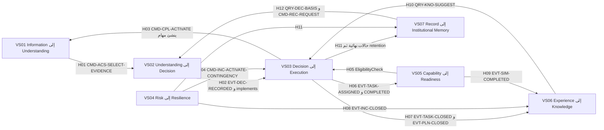

| # | من ← إلى | ما يُسلَّم | الحامل (حدث أو مرجع) | المصدر |
|---|---|---|---|---|
| H01 | VS01 ← VS02 | ملاحظات وأدلة ومطالبات مُتحقَّق منها تدخل حالة التحليل | مرجع URN مثبّت بـ`known_at` في `CMD-ACS-SELECT-EVIDENCE`؛ واستعلامات BC02 as-of | AGG-ANALYSIS-CASE؛ `context-map.md` (BC02 → BC03) |
| H02 | VS02 ← VS03 | القرار الذي تنفذه الخطة | مرجع `implements` في `CMD-PLN-CREATE` (القرار RECORDED)؛ وEVT-DEC-SUPERSEDED/ANNULLED ← `SYS:implemented decision annulled or superseded` ← EVT-PLN-REVIEW-FLAGGED | AGG-PLAN؛ `BC04/events-slc08.md` |
| H03 | VS03 ← VS01 | جهاز المهام يخدم الجمع | EVT-CPL-ACTIVATED ← `CMD-TASK-CREATE` (plan_ref = خطة الجمع، CR-59)؛ وعودة بأحداث EVT-TASK-* ← `SYS:all activity tasks terminal` | AGG-COLLECTION-PLAN؛ AGG-TASK |
| H04 | VS04 ← VS03 | الاستجابة والتعافي ينفَّذان بخطط ومهام | `CMD-INC-ACTIVATE-CONTINGENCY` ← AGG-PLAN (`plan_kind=CONTINGENCY`، `triggered_by`، CR-60)؛ `CMD-INC-DISPATCH-RESPONSE` ← مهام بـ`incident_ref` (CR-61) | AGG-INCIDENT؛ `risk-contingency-spec.md` §4 |
| H05 | VS05 ← VS03 | أهلية الشخص شرط للإسناد | `EligibilityCheck` (OHS BC05 → BC04) في شرط `CMD-TASK-ASSIGN`؛ لقطة EligibilitySnapshot في المهمة | `eligibility-rules.md` §3؛ AGG-TASK |
| H06 | VS03 ← VS05 | الإسناد والإكمال يحرّران الموارد ويغذيان «الخبرة» في الجاهزية | EVT-TASK-ASSIGNED وEVT-TASK-COMPLETED (`context-map.md`)؛ الخبرة «من سجل التعيينات» **[Derived]** | `allocation-readiness-spec.md` §5 |
| H07 | VS03 ← VS06 | تنفيذ منتهٍ مصدرًا لدرس | EVT-TASK-CLOSED وEVT-PLN-CLOSED مصدرًا نهائيًا في شرط `CMD-KNO-DRAFT` (REQ-KNW-002) | AGG-KNOWLEDGE-OBJECT |
| H08 | VS04 ← VS06 | مراجعة ما بعد الحادثة | EVT-INC-CLOSED ← «اقتراحات كائن المعرفة (SLC-12)»؛ `after_action_ref` (R3-Q5) | `BC04/events-slc17.md`؛ AGG-INCIDENT |
| H09 | VS05 ← VS06 | مراجعة ما بعد التمرين | EVT-SIM-COMPLETED (CR-63) | `BC05/events-slc19.md`؛ `training-exercise-spec.md` §4 |
| H10 | VS06 ← VS03 | إعادة استخدام المعرفة في التخطيط | `QRY-KNO-SUGGEST` (نوع المهمة، الخطة، المنطقة) ← `CMD-KNO-RECORD-REUSE` (OUT-06) | `products-knowledge-archive-spec.md` §3 |
| H11 | VS03 وVS04 ← VS07 | السجلات المغلقة تدخل الاحتفاظ والإتلاف أو الأرشفة | الحالات النهائية (`CMD-PLN-CLOSE`، `CMD-TASK-CLOSE`، `CMD-INC-CLOSE`) مع محفز الاحتفاظ `closed`، ثم `SYS:scheduled evaluation (daily)` **[Derived]** | AGG-RETENTION-SCHEDULE؛ AGG-DISPOSITION-RUN |
| H12 | VS07 ← VS02 | «ماذا كنا نعرف لحظة القرار» | `QRY-DEC-BASIS`؛ `CMD-REC-REQUEST` (scope يشمل «decision basis»؛ purpose ∈ {audit, legal, lessons}) | AGG-RECONSTRUCTION؛ `queries-slc08.md` |
| — | VS01 ← VS04 | تنبيه أو موقف يطلق حادثة | **[Missing]**: لا ربط بين AGG-ALERT أو AGG-SITUATION وبين `CMD-INC-REPORT`، ولا مستهلك لـEVT-ALR-RAISED في BC04 | `BC03/events-slc06.md`؛ AGG-INCIDENT |

---

## 10. البنود المفتوحة

| # | الوسم | البند | المسارات |
|---|---|---|---|
| NR-01 | محسوم (CR-81) | كان `use_case_coverage` لـVS04 وVS05 «none — CR-09»، بينما هناك UC-140..144 وUC-160..163 (CR-70) وAggregates في R3 تحقق التيارين | `01-business/value-streams.md`؛ `02-requirements/use-cases.md` (UC-140..163، جدول `gaps`) |
| NR-02 | **[Needs Review]** | فاعلون في عمود «الفاعل» بكتالوجات الأوامر ليس لهم معرّف `ACT-*` بين الخمسة عشر، ومنهم: collection manager، collection planner، Analysis lead، reviewer، authority holder، محدِّد الخطر، مقيّم، موافق المعالجة، أي مُبلِّغ مخوَّل، مقيّم الحادثة، قائد الحادثة، Exercise Director، Exercise Controller، Evaluator، dispatcher / carrier operator، Legal/Compliance authority، release authority، integration engineer، AI platform engineer. يُحسم الربط في `02-actors-roles.md` | `01-business/stakeholders.md`؛ `03-domain/contexts/BC*/commands-*.md` |
| NR-03 | **[Needs Review]** | الحدث الحامل لإجراء ARCHIVE من BC08 إلى BC06 غير مسمّى، ومستهلكو EVT-DSP-* لا يذكرون BC06 | `BC06/aggregates/AGG-ARCHIVE-PACKAGE.md`؛ `BC08/events-slc12a.md`؛ `BC08/aggregates/AGG-DISPOSITION-RUN.md` |
| M-01 | **[Missing]** | VS04 «Threshold»: لا عتبة ولا انتقال تلقائي على `risk_score` | `BC04/aggregates/AGG-RISK.md`؛ `BC04/risk-contingency-spec.md` |
| M-02 | **[Missing]** | VS05 BP42 «Training Plan»: لا كائن يربط فجوة شخص بتمرين أو سيناريو | `BC05/training-exercise-spec.md` §1؛ `01-business/processes.md` |
| M-03 | **[Missing]** | VS07 «Institutional Memory»: لا أمر ولا استعلام يجمع الأرشيف والمعرفة تحت هذه المرحلة | `01-business/value-streams.md`؛ `BC06/` |
| M-04 | **[Missing]** | لا تسليم من VS01 (تنبيه أو موقف) إلى VS04 (حادثة) | `BC03/events-slc06.md`؛ `BC04/aggregates/AGG-INCIDENT.md` |
| D-01 | **[Derived]** | مراحل بلا أمر خاص وتتحقق بتجميع: VS01 BP10 (عبر الإسقاطات)، وVS02 «Impact» (حقل)، وVS03 «Work Packages» (أنشطة `task_generating`)، وVS04 «Hazard» (بيانات مرجعية، قرار صريح)، وVS07 «Operational Record» و«Closure» | الأقسام 1.1، 2.1، 3.1، 4.1، 7.1 |
| D-02 | **[Derived]** | مراحل بلا BP بالاسم: VS01 «Source» و«Context»، وVS02 «Assumptions» و«Impact»، وVS03 «Schedule»، وVS05 «Assignment»، وVS06 «Execution» إلى «Review»، وVS07 «Closure» و«Institutional Memory». السبب أن `processes.md` أسماء فقط («name only — W1/W4») | `01-business/processes.md` |
| — | مسجَّل سابقًا | S-01 وS-08 محسومان (CR-81، CR-76)؛ S-11 (اسم schema الإسقاطات) ما زال مفتوحًا | `00-index.md` §6 |
