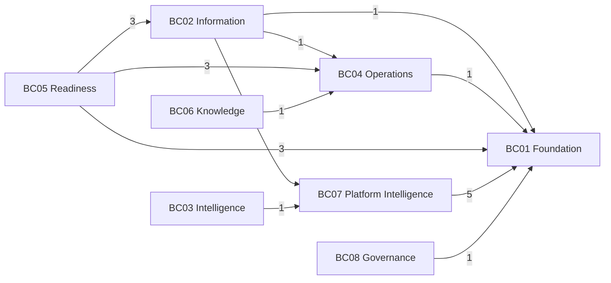
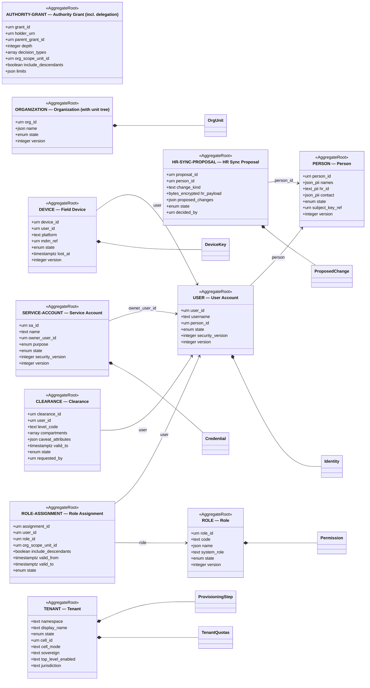
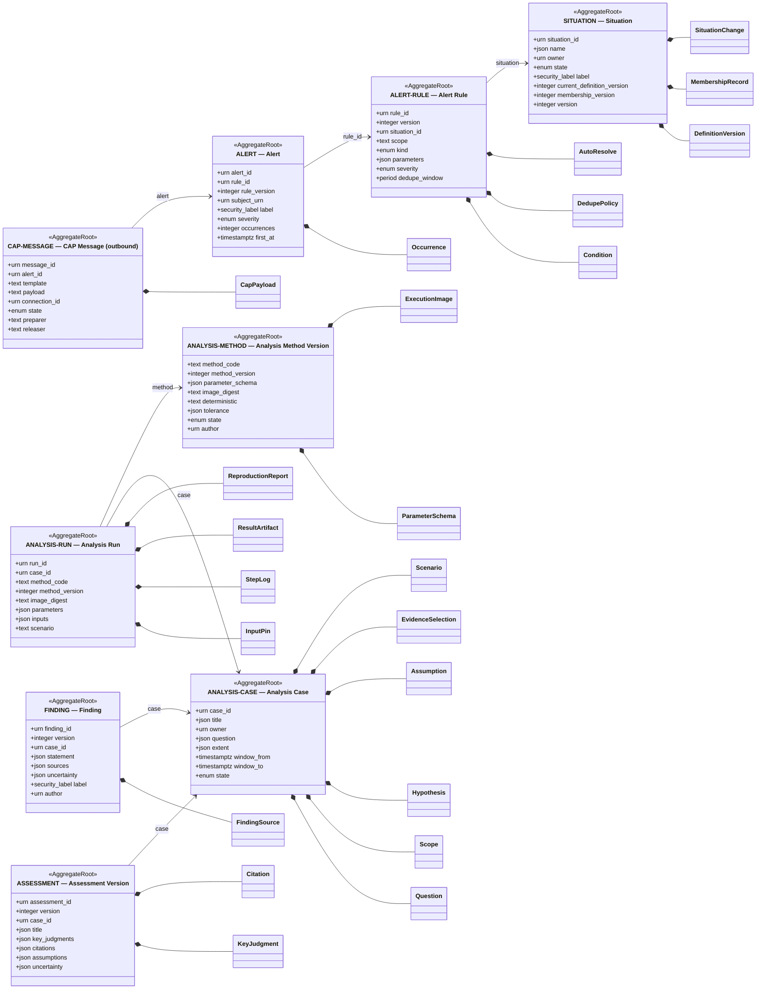
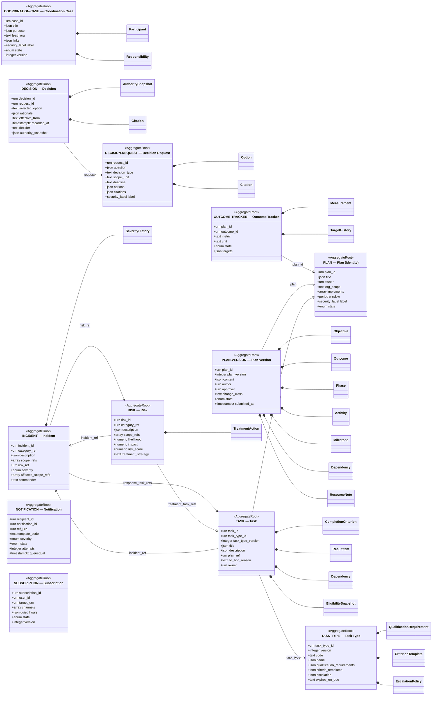
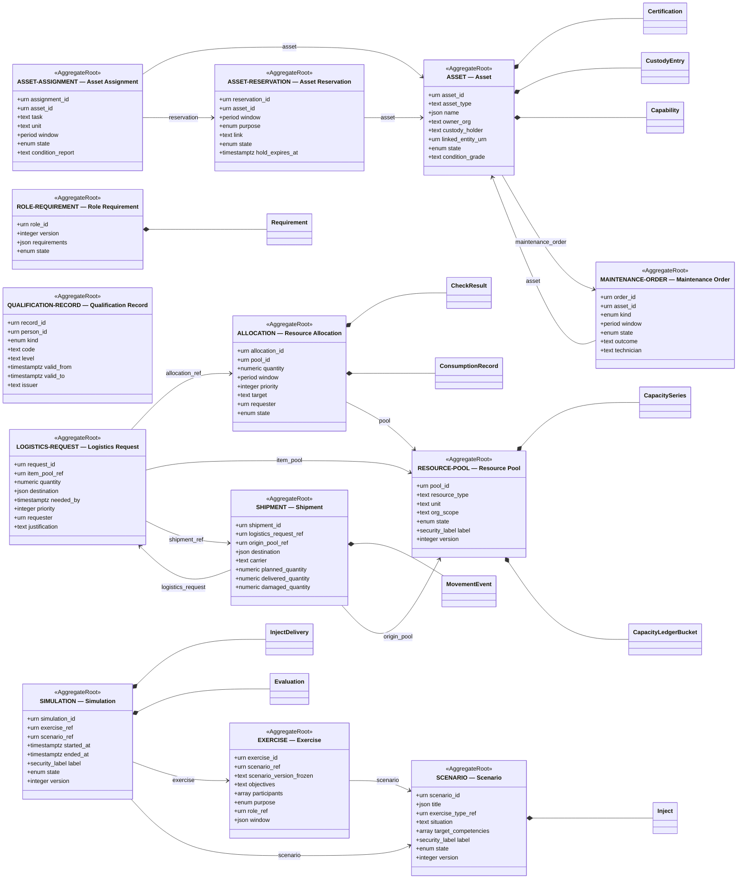
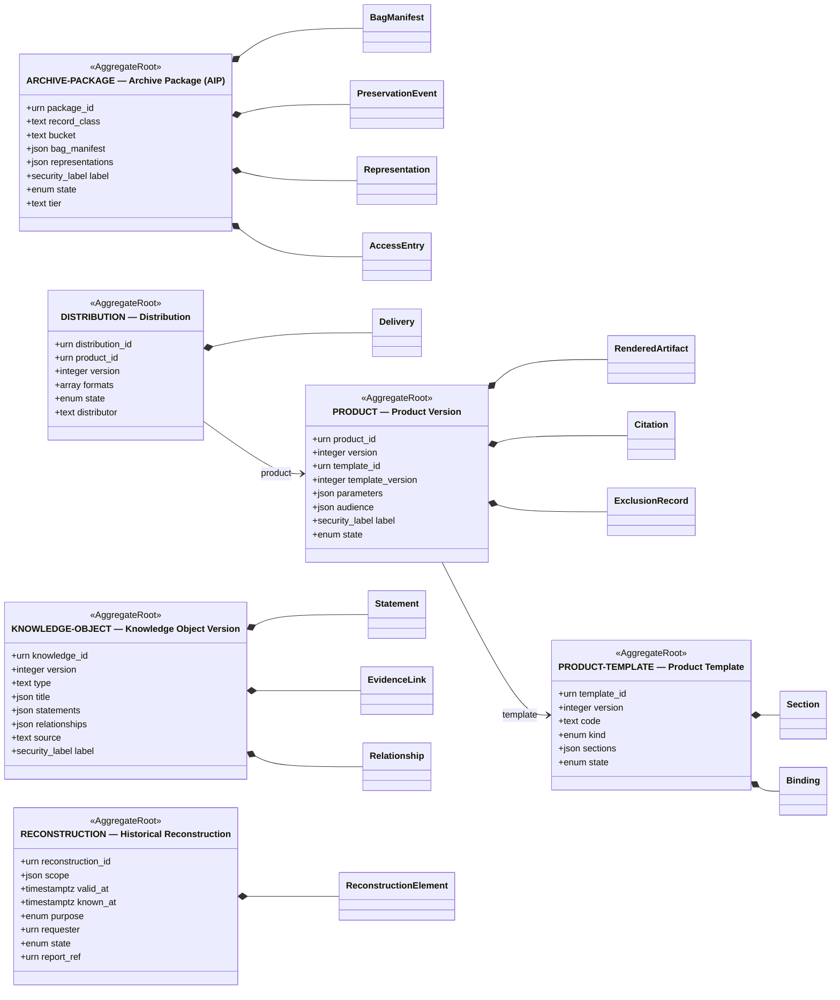

# النموذج المفاهيمي (Domain Model)

كيف يُقسَّم المجال: 26 مجالًا (DOM) في 8 سياقات محددة (BC)، و89 Aggregate بمكوناتها الداخلية ومراجعها. هو النموذج المفاهيمي لحلقة المجال في `11-hexagonal-reference.md`؛ الحالات في `08-state-models.md` والجداول في `16-database-schema.md`.

## 1. قواعد النموذج

| القاعدة | المصدر |
|---|---|
| كل Aggregate حدّ اتساق: يُعدَّل بأمر واحد في معاملة واحدة، ويُحفظ مع تاريخه وحدثه وتدقيقه معًا | ADR-P02، FIT-04 |
| الـAggregate يشير إلى غيره بـURN (وبإصدار أو `known_at` عند الحاجة لثبات الدليل)، لا بمرجع كائن ولا بمفتاح أجنبي عبر السياقات | `03-domain/context-map.md` القاعدة 2، FIT-01 |
| أكثر من 7 كيانات داخلية في Aggregate يتطلب قرارًا | FIT-17 |
| المعرّفات ULID + URN، ولا إعادة كتابة للمعرّف عند الدمج | ADR-P13، FIT-07 |
| لكل سمة مستوى أهمية (T1 Evidential، T2 Governed، T3 Operational، T4 Ephemeral) | ADR-P03، FIT-06 |

## 2. خريطة السياقات المعتمدة

الخريطة المعتمدة ومخططها في `03-domain/context-map.md`، وتُلخَّص علاقاتها هنا:

| من (upstream) | إلى (downstream) | النمط | العقد |
|---|---|---|---|
| BC01 | الكل | Open Host Service + Published Language | `SecurityContext`، `AuthorityCheck` |
| BC08 | الكل | Open Host Service (PDP) | `PolicyDecision`، التصنيفات |
| BC02 | BC03، BC04، BC06، BC07 | OHS + أحداث | استعلامات الكيانات والادعاءات والملاحظات (as-of) |
| BC03 | BC04 | Customer / Supplier | مراجع التقييمات (URN بإصدار) |
| BC05 | BC04 | Customer / Supplier | `EligibilityCheck`، التوفر |
| BC04 | BC05 | أحداث | إسناد المهمة واكتمالها (تحرير الموارد) |
| خارجي | BC07 | Anti-Corruption Layer | المحوّلات ← أوامر BC02 |

ومخطط الخريطة يضيف حواف أحداث غير مذكورة في جدولها: BC03 ← BC06 وBC04 ← BC06 (أحداث)، وBC07 ← BC02 (أوامر عبر واجهة BC02).

§3.2 أدناه يضيف المراجع المشتقة من البيانات نفسها ويقارن اتجاهها بهذه الخريطة. هي **جزئية** **[Derived]**: تلتقط الأعمدة وحقول الحمولة التي يدل اسمها على Aggregate (مثل `device_id`، `case_id`، `pool_ref`)، ولا تلتقط المراجع العامة أو المتعددة الأنواع (`target_urn`، `subject_urn`، `source_ref` حين يكون طرفًا في علاقة، `after_action_ref`) ولا المراجع التي لا يطابق اسمها اسم Aggregate.

## 3. النموذج

<!-- BEGIN GENERATED: build_analysis_design.py -->

### 3.1 المجالات والسياقات

| السياق | المجالات (DOM) | عناصرها في `03-domain/domains.md` | الـAggregates |
|---|---|---|---|
| BC01 Foundation — الأساس | DOM-01 Organization & Command DOM-02 Identity & Access | Organization, Organizational Unit, Team, Role, Responsibility, Authority, Delegation, Tenant, Workspace, Quota Identity, User, Service Account, Authentication, Authorization, Access Policy, Device | AUTHORITY-GRANT, CLEARANCE, DEVICE, HR-SYNC-PROPOSAL, ORGANIZATION, PERSON, ROLE, ROLE-ASSIGNMENT, SERVICE-ACCOUNT, TENANT, USER |
| BC02 Information — نواة المعلومات | DOM-03 Information Fabric DOM-04 Geospatial DOM-05 Sources & Collection DOM-06 Observation & Field | Entity, Event, Relationship, Claim, Evidence, Provenance, Version, Metadata, SameAsLink, Conflict, EntityResolutionCase Location, Geometry, CRS, Spatial Representation, Spatial Analysis Source, Collection Requirement, Collection Method, Collection Activity Observation, Field Session, Measurement, Evidence (reference to DOM-03), Offline Capture | ATTACHMENT, CLAIM, COLLECTION-PLAN, COLLECTION-REQUIREMENT, CONFLICT, CORRELATION-PROPOSAL, CORRELATION-RULE, ENTITY, ER-CASE, EVIDENCE, EVIDENCE-LINK, EXTERNAL-ID, IMPORT-BATCH, MATCH-RULESET, OBSERVATION, REALWORLD-EVENT, RELATIONSHIP, SOURCE |
| BC03 Intelligence — الوعي والتحليل | DOM-07 Intelligence DOM-08 Analysis & Assessment DOM-09 Situation Management | Information Processing, Entity Resolution proposals, Correlation, Fusion, Intelligence Product Analysis Case, Analytical Question, Hypothesis, Assumption, Analysis Run, Finding, Assessment, Uncertainty Situation, Situation Member, Situation Change, Alert, Current Context | ALERT, ALERT-RULE, ANALYSIS-CASE, ANALYSIS-METHOD, ANALYSIS-RUN, ASSESSMENT, CAP-MESSAGE, FINDING, SITUATION |
| BC04 Operations — التخطيط والتنفيذ | DOM-10 Command & Coordination DOM-11 Communications DOM-12 Planning DOM-13 Tasks & Workflow DOM-17 Risk & Emergency | Decision, Decision Request, Coordination Case, Authority check (consumes BC01), Approval Communication, Message, Channel, Notification, Distribution Objective, Outcome, Plan, Plan Version, Phase, Activity, Milestone, Baseline Task, Assignment, Requirement, Dependency, Workflow, Result, Exception Risk, Hazard, Incident, Emergency, Crisis, Response, Recovery, Continuity | COORDINATION-CASE, DECISION, DECISION-REQUEST, INCIDENT, NOTIFICATION, OUTCOME-TRACKER, PLAN, PLAN-VERSION, RISK, SUBSCRIPTION, TASK, TASK-TYPE |
| BC05 Readiness — الموارد والجاهزية | DOM-14 Assets DOM-15 Resources DOM-16 Logistics DOM-18 Training & Competency DOM-19 Exercises & Simulation | Asset, Capability, Ownership, Custody, Status, Condition, Maintenance Resource, Pool, Capacity, Availability, Allocation, Consumption Inventory, Shipment, Movement, Supply, Storage, Logistics Request Competency, Training, Qualification, Certification, Readiness, Eligibility Exercise, Scenario, Simulation, Evaluation, After Action Review | ALLOCATION, ASSET, ASSET-ASSIGNMENT, ASSET-RESERVATION, EXERCISE, LOGISTICS-REQUEST, MAINTENANCE-ORDER, QUALIFICATION-RECORD, RESOURCE-POOL, ROLE-REQUIREMENT, SCENARIO, SHIPMENT, SIMULATION |
| BC06 Knowledge — المعرفة والمنتجات | DOM-20 Reports & Operational Products DOM-21 Knowledge Management DOM-22 Archive & Institutional Memory | Report, Dashboard, Map Product, Briefing, Analytical Product Knowledge Object, Procedure, Policy Knowledge, Lesson, Best Practice, Semantic Relationships Archive Record, Retention, Legal Hold, Preservation, Historical Retrieval, Historical Reconstruction | ARCHIVE-PACKAGE, DISTRIBUTION, KNOWLEDGE-OBJECT, PRODUCT, PRODUCT-TEMPLATE, RECONSTRUCTION |
| BC07 Platform Intelligence — التكامل والذكاء الاصطناعي | DOM-23 AI DOM-24 Integration & Event Bus | AI Request, AI Run, Context Package, AI Result, AI Review, AI Evaluation, AI Tool Registry API, Event Bus, Integration, Adapter, CDC, Synchronization, Webhook | ADAPTER, AI-REQUEST, AI-RESULT, AI-ROUTING, AI-TOOL, EVAL-SUITE, INTEGRATION-CONNECTION, MODEL-VERSION, PRELOAD-PACKAGE, PROJECTION-VERSION, SENSOR-STREAM, SYNC-CONFLICT, SYNC-SESSION |
| BC08 Governance — الحوكمة والأمن | DOM-25 Security & Governance DOM-26 Observability & Infrastructure | Policy, Security Classification, Privacy, Compliance, Audit, Governance, Sovereignty Logging, Metrics, Tracing, Monitoring, Reliability, DR, Infrastructure, Platform Operations | CLASSIFICATION-SCHEME, DISPOSITION-RUN, ERASURE-REQUEST, LEGAL-HOLD, POLICY-SET, RETENTION-SCHEDULE, SECURITY-EXCEPTION |

**تعارض بين عناصر المجالات وملكية الـAggregates** **[Needs Review]** — عنصر مذكور في مجال سياق ويملكه Aggregate في سياق آخر:

- DOM-07 (BC03) يذكر «Correlation» بينما `AGG-CORRELATION-PROPOSAL` في BC02
- DOM-07 (BC03) يذكر «Correlation» بينما `AGG-CORRELATION-RULE` في BC02
- DOM-11 (BC04) يذكر «Distribution» بينما `AGG-DISTRIBUTION` في BC06
- DOM-19 (BC05) يذكر «Evaluation» بينما `AGG-EVAL-SUITE` في BC07
- DOM-22 (BC06) يذكر «Legal Hold» بينما `AGG-LEGAL-HOLD` في BC08

### 3.2 المراجع بين السياقات (مشتقة من البيانات)

كل عمود مفتاح أو عمود أو حقل حمولة يشير اسمه إلى Aggregate في سياق آخر **[Derived]** (القاعدة في `ref_target` بالمولِّد). المرجع URN يُتحقق منه عبر عقد السياق المالك، لا قيد قاعدة بيانات (FIT-01). العمود الأخير يقارن اتجاه الاعتماد بخريطة السياقات المعتمدة (§2): السياق الذي يحمل المرجع يعتمد على السياق المشار إليه، فيجب أن يكون الثاني upstream له، أو BC01/BC08 اللذين يخدمان الكل.

| من | إلى | المراجع | في الخريطة المعتمدة |
|---|---|---|---|
| BC02 | BC01 | OBSERVATION → DEVICE (device) | نعم |
| BC02 | BC04 | COLLECTION-PLAN → TASK-TYPE (task_type) | **لا — [Needs Review]** |
| BC02 | BC07 | IMPORT-BATCH → ADAPTER (adapter, adapter_id) | **لا — [Needs Review]** |
| BC03 | BC07 | CAP-MESSAGE → INTEGRATION-CONNECTION (connection, connection_id) | **لا — [Needs Review]** |
| BC04 | BC01 | SUBSCRIPTION → USER (user_id) | نعم |
| BC05 | BC01 | EXERCISE → ROLE (role_ref)؛ QUALIFICATION-RECORD → PERSON (person, person_id)؛ ROLE-REQUIREMENT → ROLE (role) | نعم |
| BC05 | BC02 | ASSET → EVIDENCE (evidence)؛ QUALIFICATION-RECORD → EVIDENCE (evidence)؛ SHIPMENT → EVIDENCE (evidence) | **لا — [Needs Review]** |
| BC05 | BC04 | ALLOCATION → DECISION (decision)؛ ASSET → DECISION (decision)؛ ASSET-ASSIGNMENT → TASK (task) | نعم |
| BC06 | BC04 | ARCHIVE-PACKAGE → DECISION (decision) | نعم |
| BC07 | BC01 | ADAPTER → SERVICE-ACCOUNT (service_account, service_account_urn)؛ PRELOAD-PACKAGE → DEVICE (device, device_id)؛ PRELOAD-PACKAGE → USER (user_id)؛ SYNC-SESSION → DEVICE (device, device_id)؛ SYNC-SESSION → USER (user_id) | نعم |
| BC08 | BC01 | ERASURE-REQUEST → PERSON (person) | نعم |

### 3.3 مخططات الأصناف (Class diagrams) لكل سياق

لكل Aggregate صنف جذر `<<AggregateRoot>>` بمفتاحه وأول ثمانية أعمدة من جدوله الرئيسي في النموذج المنطقي، بأنواع مستنتَجة وفق `16-database-schema.md` §4 **[Derived]**؛ ومكوناته الداخلية بعلاقة تركيب (`*--`)؛ ومراجعه إلى Aggregates السياق نفسه (`-->` باسم العمود). المراجع العابرة في §3.2.

#### BC01 — Foundation — الأساس

| Aggregate | المستوى | بيانات شخصية | الجدول الرئيسي | المكونات الداخلية |
|---|---|---|---|---|
| AGG-AUTHORITY-GRANT | T2 | — | `foundation.authority_grants` | — |
| AGG-CLEARANCE | T2 | — | `foundation.clearances` | — |
| AGG-DEVICE | T2 | — | `foundation.devices` | DeviceKey |
| AGG-HR-SYNC-PROPOSAL | T2 | نعم | `foundation.hr_sync_proposals` | ProposedChange |
| AGG-ORGANIZATION | T2 | — | `foundation.organizations` | OrgUnit |
| AGG-PERSON | T2 | نعم | `foundation.persons` | — |
| AGG-ROLE | T2 | — | `foundation.roles` | Permission |
| AGG-ROLE-ASSIGNMENT | T2 | — | `foundation.role_assignments` | — |
| AGG-SERVICE-ACCOUNT | T2 | — | `foundation.service_accounts` | Credential |
| AGG-TENANT | T2 | — | `foundation.tenants` | TenantQuotas, ProvisioningStep |
| AGG-USER | T2 | — | `foundation.users` | Identity |

#### BC02 — Information — نواة المعلومات

```mermaid
classDiagram
  direction LR
  class AGG_ATTACHMENT["ATTACHMENT — Attachment"] {
    <<AggregateRoot>>
    +urn attachment_id
    +text sha256
    +text size
    +text mime
    +text object_key
    +urn key_ref
    +security_label label
    +enum state
  }
  class AGG_CLAIM["CLAIM — Claim"] {
    <<AggregateRoot>>
    +text subject_hash_bucket
    +urn claim_id
    +urn subject_urn
    +text predicate
    +json value
    +text value_norm
    +text unit_canonical
    +timestamptz valid_from
  }
  class AGG_CLAIM__Value["Value"]
  AGG_CLAIM *-- AGG_CLAIM__Value
  class AGG_CLAIM__ConfidenceAssessment["ConfidenceAssessment"]
  AGG_CLAIM *-- AGG_CLAIM__ConfidenceAssessment
  class AGG_COLLECTION_PLAN["COLLECTION-PLAN — Collection Plan"] {
    <<AggregateRoot>>
    +urn plan_id
    +array requirements
    +json title
    +security_label label
    +enum state
    +integer version
  }
  class AGG_COLLECTION_PLAN__CollectionActivity["CollectionActivity"]
  AGG_COLLECTION_PLAN *-- AGG_COLLECTION_PLAN__CollectionActivity
  class AGG_COLLECTION_REQUIREMENT["COLLECTION-REQUIREMENT — Collection Requirement"] {
    <<AggregateRoot>>
    +urn requirement_id
    +integer version
    +json question
    +text area
    +period window
    +integer priority
    +timestamptz due
    +json eeis
  }
  class AGG_COLLECTION_REQUIREMENT__EEI["EEI"]
  AGG_COLLECTION_REQUIREMENT *-- AGG_COLLECTION_REQUIREMENT__EEI
  class AGG_COLLECTION_REQUIREMENT__FulfilmentLink["FulfilmentLink"]
  AGG_COLLECTION_REQUIREMENT *-- AGG_COLLECTION_REQUIREMENT__FulfilmentLink
  class AGG_CONFLICT["CONFLICT — Conflict"] {
    <<AggregateRoot>>
    +urn conflict_id
    +urn cluster_id
    +text predicate
    +timestamptz window_from
    +timestamptz window_to
    +urn detected_by
    +security_label label
    +enum state
  }
  class AGG_CONFLICT__ResolutionRecord["ResolutionRecord"]
  AGG_CONFLICT *-- AGG_CONFLICT__ResolutionRecord
  class AGG_CONFLICT__MemberClaim["MemberClaim"]
  AGG_CONFLICT *-- AGG_CONFLICT__MemberClaim
  class AGG_CORRELATION_PROPOSAL["CORRELATION-PROPOSAL — Correlation Proposal"] {
    <<AggregateRoot>>
    +urn proposal_id
    +enum kind
    +json inputs
    +json score
    +integer rule_version
    +security_label label
    +enum state
    +urn reviewer
  }
  class AGG_CORRELATION_PROPOSAL__ProposalInput["ProposalInput"]
  AGG_CORRELATION_PROPOSAL *-- AGG_CORRELATION_PROPOSAL__ProposalInput
  class AGG_CORRELATION_PROPOSAL__ScoreBreakdown["ScoreBreakdown"]
  AGG_CORRELATION_PROPOSAL *-- AGG_CORRELATION_PROPOSAL__ScoreBreakdown
  class AGG_CORRELATION_RULE["CORRELATION-RULE — Correlation Rule"] {
    <<AggregateRoot>>
    +urn rule_id
    +integer version
    +enum kind
    +json parameters
    +json evaluation
    +enum state
  }
  class AGG_CORRELATION_RULE__Parameters["Parameters"]
  AGG_CORRELATION_RULE *-- AGG_CORRELATION_RULE__Parameters
  class AGG_CORRELATION_RULE__EvaluationReport["EvaluationReport"]
  AGG_CORRELATION_RULE *-- AGG_CORRELATION_RULE__EvaluationReport
  class AGG_ENTITY["ENTITY — Entity (identity)"] {
    <<AggregateRoot>>
    +urn entity_id
    +urn urn
    +text entity_type
    +security_label label
    +enum state
    +integer version
  }
  class AGG_ER_CASE["ER-CASE — Entity Resolution Case"] {
    <<AggregateRoot>>
    +urn case_id
    +text left_entity
    +text right_entity
    +numeric score
    +integer ruleset_version
    +json feature_comparison
    +text proposer
    +text agent
  }
  class AGG_ER_CASE__SameAsLink["SameAsLink"]
  AGG_ER_CASE *-- AGG_ER_CASE__SameAsLink
  class AGG_ER_CASE__FeatureComparison["FeatureComparison"]
  AGG_ER_CASE *-- AGG_ER_CASE__FeatureComparison
  class AGG_EVIDENCE["EVIDENCE — Evidence"] {
    <<AggregateRoot>>
    +urn evidence_id
    +text type
    +urn attachment_id
    +urn observation_ref
    +json locator
    +urn source_id
    +timestamptz collected_at
    +text seal_hash
  }
  class AGG_EVIDENCE__CustodyEntry["CustodyEntry"]
  AGG_EVIDENCE *-- AGG_EVIDENCE__CustodyEntry
  class AGG_EVIDENCE__Locator["Locator"]
  AGG_EVIDENCE *-- AGG_EVIDENCE__Locator
  class AGG_EVIDENCE_LINK["EVIDENCE-LINK — Evidence Link"] {
    <<AggregateRoot>>
    +urn link_id
    +urn evidence_id
    +urn claim_id
    +text stance
    +timestamptz recorded_from
    +timestamptz recorded_to
    +security_label label
    +enum state
  }
  class AGG_EXTERNAL_ID["EXTERNAL-ID — External Identifier Mapping"] {
    <<AggregateRoot>>
    +urn mapping_id
    +text system
    +urn external_id
    +urn object_urn
    +timestamptz valid_from
    +timestamptz valid_to
    +enum state
  }
  class AGG_IMPORT_BATCH["IMPORT-BATCH — Import Batch"] {
    <<AggregateRoot>>
    +urn batch_id
    +urn adapter_id
    +text batch_key
    +text content_sha256
    +integer mapping_version
    +json counts
    +enum state
    +text lease_owner
  }
  class AGG_IMPORT_BATCH__QuarantineRecord["QuarantineRecord"]
  AGG_IMPORT_BATCH *-- AGG_IMPORT_BATCH__QuarantineRecord
  class AGG_MATCH_RULESET["MATCH-RULESET — Match Ruleset"] {
    <<AggregateRoot>>
    +urn ruleset_id
    +text entity_type
    +integer version
    +json blocking_keys
    +json features
    +json thresholds
    +json evaluation
    +enum state
  }
  class AGG_MATCH_RULESET__BlockingKey["BlockingKey"]
  AGG_MATCH_RULESET *-- AGG_MATCH_RULESET__BlockingKey
  class AGG_MATCH_RULESET__Feature["Feature"]
  AGG_MATCH_RULESET *-- AGG_MATCH_RULESET__Feature
  class AGG_MATCH_RULESET__Thresholds["Thresholds"]
  AGG_MATCH_RULESET *-- AGG_MATCH_RULESET__Thresholds
  class AGG_OBSERVATION["OBSERVATION — Observation"] {
    <<AggregateRoot>>
    +timestamptz observed_month
    +urn observation_id
    +urn source_id
    +text observer
    +timestamptz observed_at
    +json event_time
    +timestamptz recorded_from
    +geometry geom
  }
  class AGG_OBSERVATION__Measurement["Measurement"]
  AGG_OBSERVATION *-- AGG_OBSERVATION__Measurement
  class AGG_OBSERVATION__Location["Location"]
  AGG_OBSERVATION *-- AGG_OBSERVATION__Location
  class AGG_REALWORLD_EVENT["REALWORLD-EVENT — Real-World Event (identity)"] {
    <<AggregateRoot>>
    +urn event_id
    +urn urn
    +text event_type
    +security_label label
    +enum state
    +integer version
  }
  class AGG_RELATIONSHIP["RELATIONSHIP — Relationship (identity)"] {
    <<AggregateRoot>>
    +urn relationship_id
    +urn urn
    +text type
    +urn source_urn
    +urn target_urn
    +security_label label
    +enum state
    +integer version
  }
  class AGG_SOURCE["SOURCE — Source"] {
    <<AggregateRoot>>
    +urn source_id
    +text type
    +json name
    +text owner_org
    +text protection_level
    +json label
    +enum state
    +integer version
  }
  class AGG_SOURCE__ReliabilityRating["ReliabilityRating"]
  AGG_SOURCE *-- AGG_SOURCE__ReliabilityRating
  class AGG_SOURCE__Profile["Profile"]
  AGG_SOURCE *-- AGG_SOURCE__Profile
  AGG_CLAIM --> AGG_SOURCE : source_refs
  AGG_CONFLICT --> AGG_CLAIM : preferred_claim
  AGG_EVIDENCE --> AGG_ATTACHMENT : attachment
  AGG_EVIDENCE --> AGG_OBSERVATION : observation_ref
  AGG_EVIDENCE_LINK --> AGG_CLAIM : claim
  AGG_EVIDENCE_LINK --> AGG_EVIDENCE : evidence
  AGG_IMPORT_BATCH --> AGG_ATTACHMENT : payload_attachment
  AGG_MATCH_RULESET --> AGG_ATTACHMENT : evaluation_attachment
  AGG_OBSERVATION --> AGG_EVIDENCE : evidence
  AGG_RELATIONSHIP --> AGG_CLAIM : existence_claim_id
```

| Aggregate | المستوى | بيانات شخصية | الجدول الرئيسي | المكونات الداخلية |
|---|---|---|---|---|
| AGG-ATTACHMENT | T1 metadata | — | `information.attachments` | — |
| AGG-CLAIM | T1 | — | `information.claims` | Value, ConfidenceAssessment |
| AGG-COLLECTION-PLAN | T2 | — | `information.collection_plans` | CollectionActivity |
| AGG-COLLECTION-REQUIREMENT | T2 | — | `information.collection_requirements` | EEI, FulfilmentLink |
| AGG-CONFLICT | T2 (bitemporal resolution records) | — | `information.conflicts` | ResolutionRecord, MemberClaim |
| AGG-CORRELATION-PROPOSAL | T1 | — | `information.correlation_proposals` | ProposalInput, ScoreBreakdown |
| AGG-CORRELATION-RULE | T2 | — | `information.correlation_rules` | Parameters, EvaluationReport |
| AGG-ENTITY | T2 identity; attributes T1 as claims | — | `information.entities` | — |
| AGG-ER-CASE | T2 | — | `information.er_cases` | SameAsLink, FeatureComparison |
| AGG-EVIDENCE | T1 | — | `information.evidence` | CustodyEntry, Locator |
| AGG-EVIDENCE-LINK | T1 | — | `information.evidence_links` | — |
| AGG-EXTERNAL-ID | T2 | — | `information.external_ids` | — |
| AGG-IMPORT-BATCH | T2 | — | `information.import_batches` | QuarantineRecord |
| AGG-MATCH-RULESET | T2 | — | `information.match_rulesets` | BlockingKey, Feature, Thresholds |
| AGG-OBSERVATION | T1 | — | `information.observations` | Measurement, Location |
| AGG-REALWORLD-EVENT | T2 identity; attributes T1 | — | `information.realworld_events` | — |
| AGG-RELATIONSHIP | T1 | — | `information.relationships` | — |
| AGG-SOURCE | T1 reliability / T2 profile | — | `information.sources` | ReliabilityRating, Profile |

#### BC03 — Intelligence — الوعي والتحليل

| Aggregate | المستوى | بيانات شخصية | الجدول الرئيسي | المكونات الداخلية |
|---|---|---|---|---|
| AGG-ALERT | T2 | — | `intelligence.alerts` | Occurrence |
| AGG-ALERT-RULE | T2 | — | `intelligence.alert_rules` | Condition, DedupePolicy, AutoResolve |
| AGG-ANALYSIS-CASE | T2 lifecycle; T1 selections | — | `intelligence.analysis_cases` | Question, Scope, Hypothesis, Assumption, EvidenceSelection, Scenario |
| AGG-ANALYSIS-METHOD | T2 | — | `intelligence.analysis_methods` | ParameterSchema, ExecutionImage |
| AGG-ANALYSIS-RUN | T1 results / T2 lifecycle | — | `intelligence.analysis_runs` | InputPin, StepLog, ResultArtifact, ReproductionReport |
| AGG-ASSESSMENT | T1 content / T2 lifecycle | — | `intelligence.assessment_versions` | KeyJudgment, Citation |
| AGG-CAP-MESSAGE | T2 | — | `intelligence.cap_messages` | CapPayload |
| AGG-FINDING | T1 | — | `intelligence.findings` | FindingSource |
| AGG-SITUATION | T2 definition; content is a projection | — | `intelligence.situations` | DefinitionVersion, MembershipRecord, SituationChange |

#### BC04 — Operations — التخطيط والتنفيذ

| Aggregate | المستوى | بيانات شخصية | الجدول الرئيسي | المكونات الداخلية |
|---|---|---|---|---|
| AGG-COORDINATION-CASE | T2 | — | `operations.coordination_cases` | Participant, Responsibility |
| AGG-DECISION | T2 | — | `operations.decisions` | AuthoritySnapshot, Citation |
| AGG-DECISION-REQUEST | T2 | — | `operations.decision_requests` | Option, Citation |
| AGG-INCIDENT | T1 | — | `operations.incidents` | SeverityHistory |
| AGG-NOTIFICATION | T3 | — | `operations.notifications` | — |
| AGG-OUTCOME-TRACKER | T2 | — | `operations.outcome_trackers` | Measurement, TargetHistory |
| AGG-PLAN | T2 | — | `operations.plans` | — |
| AGG-PLAN-VERSION | T2 | — | `operations.plan_versions` | Objective, Outcome, Phase, Activity, Milestone, Dependency, ResourceNote |
| AGG-RISK | T2 | — | `operations.risks` | TreatmentAction |
| AGG-SUBSCRIPTION | T3 | — | `operations.subscriptions` | — |
| AGG-TASK | T2 | — | `operations.tasks` | CompletionCriterion, ResultItem, Dependency, EligibilitySnapshot |
| AGG-TASK-TYPE | T2 | — | `operations.task_types` | QualificationRequirement, CriterionTemplate, EscalationPolicy |

#### BC05 — Readiness — الموارد والجاهزية

| Aggregate | المستوى | بيانات شخصية | الجدول الرئيسي | المكونات الداخلية |
|---|---|---|---|---|
| AGG-ALLOCATION | T2 | — | `readiness.allocations` | CheckResult, ConsumptionRecord |
| AGG-ASSET | T2 (location as T1 claims on the linked entity) | — | `readiness.assets` | Certification, CustodyEntry, Capability |
| AGG-ASSET-ASSIGNMENT | T2 | — | `readiness.asset_assignments` | — |
| AGG-ASSET-RESERVATION | T2 | — | `readiness.asset_reservations` | — |
| AGG-EXERCISE | T2 | — | `readiness.exercises` | — |
| AGG-LOGISTICS-REQUEST | T2 | — | `readiness.logistics_requests` | — |
| AGG-MAINTENANCE-ORDER | T2 | — | `readiness.maintenance_orders` | — |
| AGG-QUALIFICATION-RECORD | T2 | نعم | `readiness.qualification_records` | — |
| AGG-RESOURCE-POOL | T2 | — | `readiness.resource_pools` | CapacitySeries, CapacityLedgerBucket |
| AGG-ROLE-REQUIREMENT | T2 | — | `readiness.role_requirements` | Requirement |
| AGG-SCENARIO | T2 | — | `readiness.scenarios` | Inject |
| AGG-SHIPMENT | T2 | — | `readiness.shipments` | MovementEvent |
| AGG-SIMULATION | T2 | — | `readiness.simulations` | InjectDelivery, Evaluation |

#### BC06 — Knowledge — المعرفة والمنتجات

| Aggregate | المستوى | بيانات شخصية | الجدول الرئيسي | المكونات الداخلية |
|---|---|---|---|---|
| AGG-ARCHIVE-PACKAGE | T1 | — | `knowledge.archive_packages` | BagManifest, PreservationEvent, Representation, AccessEntry |
| AGG-DISTRIBUTION | T2 | — | `knowledge.distributions` | Delivery |
| AGG-KNOWLEDGE-OBJECT | T1 content / T2 lifecycle | — | `knowledge.knowledge_objects` | Statement, EvidenceLink, Relationship |
| AGG-PRODUCT | T1 content / T2 lifecycle | — | `knowledge.products` | RenderedArtifact, Citation, ExclusionRecord |
| AGG-PRODUCT-TEMPLATE | T2 | — | `knowledge.product_templates` | Section, Binding |
| AGG-RECONSTRUCTION | T2 | — | `knowledge.reconstructions` | ReconstructionElement |

#### BC07 — Platform Intelligence — التكامل والذكاء الاصطناعي

```mermaid
classDiagram
  direction LR
  class AGG_ADAPTER["ADAPTER — Adapter"] {
    <<AggregateRoot>>
    +urn adapter_id
    +text name
    +urn source_urn
    +urn service_account_urn
    +enum state
    +integer version
  }
  class AGG_ADAPTER__MappingVersion["MappingVersion"]
  AGG_ADAPTER *-- AGG_ADAPTER__MappingVersion
  class AGG_AI_REQUEST["AI-REQUEST — AI Request"] {
    <<AggregateRoot>>
    +urn request_id
    +text user
    +text operation
    +enum purpose
    +bytes_encrypted input
    +enum state
    +integer routing_version
    +integer model_version
  }
  class AGG_AI_REQUEST__ContextPackage["ContextPackage"]
  AGG_AI_REQUEST *-- AGG_AI_REQUEST__ContextPackage
  class AGG_AI_REQUEST__ContextItem["ContextItem"]
  AGG_AI_REQUEST *-- AGG_AI_REQUEST__ContextItem
  class AGG_AI_REQUEST__Statement["Statement"]
  AGG_AI_REQUEST *-- AGG_AI_REQUEST__Statement
  class AGG_AI_REQUEST__GuardResult["GuardResult"]
  AGG_AI_REQUEST *-- AGG_AI_REQUEST__GuardResult
  class AGG_AI_RESULT["AI-RESULT — AI Result (reviewable)"] {
    <<AggregateRoot>>
    +urn result_id
    +urn request_id
    +text operation
    +text target
    +json items
    +enum state
    +urn reviewer
    +json decisions
  }
  class AGG_AI_RESULT__ResultItem["ResultItem"]
  AGG_AI_RESULT *-- AGG_AI_RESULT__ResultItem
  class AGG_AI_ROUTING["AI-ROUTING — AI Routing Configuration"] {
    <<AggregateRoot>>
    +integer routing_version
    +json routes
    +enum state
    +urn author
    +urn approver
  }
  class AGG_AI_ROUTING__Route["Route"]
  AGG_AI_ROUTING *-- AGG_AI_ROUTING__Route
  class AGG_AI_TOOL["AI-TOOL — AI Tool"] {
    <<AggregateRoot>>
    +urn tool_id
    +text name
    +json input_schema
    +text binding
    +text effect
    +text permission
    +text max_ail
    +enum state
  }
  class AGG_EVAL_SUITE["EVAL-SUITE — Evaluation Suite"] {
    <<AggregateRoot>>
    +urn suite_id
    +integer version
    +json sets
    +enum state
  }
  class AGG_EVAL_SUITE__EvalItem["EvalItem"]
  AGG_EVAL_SUITE *-- AGG_EVAL_SUITE__EvalItem
  class AGG_INTEGRATION_CONNECTION["INTEGRATION-CONNECTION — Integration Connection"] {
    <<AggregateRoot>>
    +urn connection_id
    +text name
    +text system_kind
    +text endpoint
    +enum protocol
    +enum direction
    +urn credentials_ref
    +json allow_list
  }
  class AGG_INTEGRATION_CONNECTION__HealthCheck["HealthCheck"]
  AGG_INTEGRATION_CONNECTION *-- AGG_INTEGRATION_CONNECTION__HealthCheck
  class AGG_INTEGRATION_CONNECTION__AllowListEntry["AllowListEntry"]
  AGG_INTEGRATION_CONNECTION *-- AGG_INTEGRATION_CONNECTION__AllowListEntry
  class AGG_MODEL_VERSION["MODEL-VERSION — Model Version"] {
    <<AggregateRoot>>
    +urn model_id
    +integer version
    +text family
    +text weights_digest
    +text licence
    +array languages
    +text context_tokens
    +text hosting
  }
  class AGG_MODEL_VERSION__EvaluationReport["EvaluationReport"]
  AGG_MODEL_VERSION *-- AGG_MODEL_VERSION__EvaluationReport
  class AGG_MODEL_VERSION__CanaryMetrics["CanaryMetrics"]
  AGG_MODEL_VERSION *-- AGG_MODEL_VERSION__CanaryMetrics
  class AGG_PRELOAD_PACKAGE["PRELOAD-PACKAGE — Preload Package"] {
    <<AggregateRoot>>
    +urn package_id
    +urn device_id
    +urn user_id
    +json area
    +array layers
    +period window
    +text level
    +json manifest
  }
  class AGG_PRELOAD_PACKAGE__Manifest["Manifest"]
  AGG_PRELOAD_PACKAGE *-- AGG_PRELOAD_PACKAGE__Manifest
  class AGG_PROJECTION_VERSION["PROJECTION-VERSION — Projection Version"] {
    <<AggregateRoot>>
    +text tenant_group
    +enum kind
    +integer version
    +enum state
    +integer schema_version
    +integer normalization_version
    +json checkpoints
    +json verification
  }
  class AGG_PROJECTION_VERSION__SourceCheckpoint["SourceCheckpoint"]
  AGG_PROJECTION_VERSION *-- AGG_PROJECTION_VERSION__SourceCheckpoint
  class AGG_PROJECTION_VERSION__VerificationReport["VerificationReport"]
  AGG_PROJECTION_VERSION *-- AGG_PROJECTION_VERSION__VerificationReport
  class AGG_SENSOR_STREAM["SENSOR-STREAM — Sensor Stream"] {
    <<AggregateRoot>>
    +urn stream_id
    +urn connection_id
    +urn source_urn
    +numeric quantity
    +text unit
    +text expected_rate
    +text location
    +text linked_entity
  }
  class AGG_SENSOR_STREAM__QualityRules["QualityRules"]
  AGG_SENSOR_STREAM *-- AGG_SENSOR_STREAM__QualityRules
  class AGG_SYNC_CONFLICT["SYNC-CONFLICT — Sync Conflict"] {
    <<AggregateRoot>>
    +urn conflict_id
    +json envelope
    +json state_snapshot
    +text owner_reason
    +urn reviewer
    +enum state
    +integer version
  }
  class AGG_SYNC_CONFLICT__OriginalEnvelope["OriginalEnvelope"]
  AGG_SYNC_CONFLICT *-- AGG_SYNC_CONFLICT__OriginalEnvelope
  class AGG_SYNC_CONFLICT__StateSnapshot["StateSnapshot"]
  AGG_SYNC_CONFLICT *-- AGG_SYNC_CONFLICT__StateSnapshot
  class AGG_SYNC_SESSION["SYNC-SESSION — Sync Session"] {
    <<AggregateRoot>>
    +urn session_id
    +urn device_id
    +urn user_id
    +text clock_offset_ms
    +timestamptz opened_at
    +text acked_seq
    +enum state
  }
  class AGG_SYNC_SESSION__CommandEnvelope["CommandEnvelope"]
  AGG_SYNC_SESSION *-- AGG_SYNC_SESSION__CommandEnvelope
  class AGG_SYNC_SESSION__BatchReceipt["BatchReceipt"]
  AGG_SYNC_SESSION *-- AGG_SYNC_SESSION__BatchReceipt
  AGG_AI_RESULT --> AGG_AI_REQUEST : request_id
  AGG_MODEL_VERSION --> AGG_EVAL_SUITE : suite
  AGG_SENSOR_STREAM --> AGG_INTEGRATION_CONNECTION : connection
```

| Aggregate | المستوى | بيانات شخصية | الجدول الرئيسي | المكونات الداخلية |
|---|---|---|---|---|
| AGG-ADAPTER | T2 | — | `integration.adapters` | MappingVersion |
| AGG-AI-REQUEST | T1 (when its output is used) / T2 | — | `ai.ai_requests` | ContextPackage, ContextItem, Statement, GuardResult |
| AGG-AI-RESULT | T1 | — | `ai.ai_results` | ResultItem |
| AGG-AI-ROUTING | T2 | — | `ai.ai_routings` | Route |
| AGG-AI-TOOL | T2 | — | `ai.ai_tools` | — |
| AGG-EVAL-SUITE | T2 | — | `ai.eval_suites` | EvalItem |
| AGG-INTEGRATION-CONNECTION | T2 | — | `integration.integration_connections` | HealthCheck, AllowListEntry |
| AGG-MODEL-VERSION | T2 | — | `ai.model_versions` | EvaluationReport, CanaryMetrics |
| AGG-PRELOAD-PACKAGE | T2 | — | `field.preload_packages` | Manifest |
| AGG-PROJECTION-VERSION | T3 | — | `(مخزن الإسقاطات).projection_versions` | SourceCheckpoint, VerificationReport |
| AGG-SENSOR-STREAM | T2 | — | `integration.sensor_streams` | QualityRules |
| AGG-SYNC-CONFLICT | T2 | — | `field.sync_conflicts` | OriginalEnvelope, StateSnapshot |
| AGG-SYNC-SESSION | T2 | — | `field.sync_sessions` | CommandEnvelope, BatchReceipt |

#### BC08 — Governance — الحوكمة والأمن

```mermaid
classDiagram
  direction LR
  class AGG_CLASSIFICATION_SCHEME["CLASSIFICATION-SCHEME — Classification Scheme Version"] {
    <<AggregateRoot>>
    +integer scheme_version
    +enum state
    +json levels
    +json compartments
    +json caveats
    +text audit_threshold
    +text default_level
    +text effective_from
  }
  class AGG_CLASSIFICATION_SCHEME__Level["Level"]
  AGG_CLASSIFICATION_SCHEME *-- AGG_CLASSIFICATION_SCHEME__Level
  class AGG_CLASSIFICATION_SCHEME__Compartment["Compartment"]
  AGG_CLASSIFICATION_SCHEME *-- AGG_CLASSIFICATION_SCHEME__Compartment
  class AGG_CLASSIFICATION_SCHEME__Caveat["Caveat"]
  AGG_CLASSIFICATION_SCHEME *-- AGG_CLASSIFICATION_SCHEME__Caveat
  class AGG_DISPOSITION_RUN["DISPOSITION-RUN — Disposition Run"] {
    <<AggregateRoot>>
    +urn run_id
    +integer schedule_version
    +json candidates
    +json exceptions
    +json certificate
    +enum state
    +urn submitted_by
    +urn approved_by
  }
  class AGG_DISPOSITION_RUN__BucketCandidate["BucketCandidate"]
  AGG_DISPOSITION_RUN *-- AGG_DISPOSITION_RUN__BucketCandidate
  class AGG_DISPOSITION_RUN__DispositionCertificate["DispositionCertificate"]
  AGG_DISPOSITION_RUN *-- AGG_DISPOSITION_RUN__DispositionCertificate
  class AGG_ERASURE_REQUEST["ERASURE-REQUEST — Erasure Request"] {
    <<AggregateRoot>>
    +urn request_id
    +text legal_basis
    +text subject_refs
    +json scope_counts
    +json confirmations
    +enum state
    +urn registered_by
    +urn approved_by
  }
  class AGG_ERASURE_REQUEST__SubjectKeyRef["SubjectKeyRef"]
  AGG_ERASURE_REQUEST *-- AGG_ERASURE_REQUEST__SubjectKeyRef
  class AGG_ERASURE_REQUEST__ContextConfirmation["ContextConfirmation"]
  AGG_ERASURE_REQUEST *-- AGG_ERASURE_REQUEST__ContextConfirmation
  class AGG_LEGAL_HOLD["LEGAL-HOLD — Legal Hold"] {
    <<AggregateRoot>>
    +urn hold_id
    +text name
    +text legal_reference
    +json scope
    +enum state
    +urn placed_by
    +urn release_requested_by
    +urn released_by
  }
  class AGG_LEGAL_HOLD__HoldScopeItem["HoldScopeItem"]
  AGG_LEGAL_HOLD *-- AGG_LEGAL_HOLD__HoldScopeItem
  class AGG_POLICY_SET["POLICY-SET — Policy Set Version"] {
    <<AggregateRoot>>
    +integer policy_version
    +enum state
    +json decision_tables
    +json tests
    +text effective_from
    +urn author
    +urn approver
  }
  class AGG_POLICY_SET__DecisionTable["DecisionTable"]
  AGG_POLICY_SET *-- AGG_POLICY_SET__DecisionTable
  class AGG_POLICY_SET__PolicyTest["PolicyTest"]
  AGG_POLICY_SET *-- AGG_POLICY_SET__PolicyTest
  class AGG_RETENTION_SCHEDULE["RETENTION-SCHEDULE — Retention Schedule Version"] {
    <<AggregateRoot>>
    +integer schedule_version
    +json rules
    +enum state
    +urn drafted_by
    +urn approved_by
    +text effective_from
    +array retroactive_classes
  }
  class AGG_RETENTION_SCHEDULE__RetentionRule["RetentionRule"]
  AGG_RETENTION_SCHEDULE *-- AGG_RETENTION_SCHEDULE__RetentionRule
  class AGG_SECURITY_EXCEPTION["SECURITY-EXCEPTION — Security Exception"] {
    <<AggregateRoot>>
    +urn exception_id
    +text policy_rule
    +json subject_scope
    +text justification
    +timestamptz starts_at
    +timestamptz ends_at
    +enum state
    +urn requested_by
  }
```

| Aggregate | المستوى | بيانات شخصية | الجدول الرئيسي | المكونات الداخلية |
|---|---|---|---|---|
| AGG-CLASSIFICATION-SCHEME | T2 | — | `governance.classification_schemes` | Level, Compartment, Caveat |
| AGG-DISPOSITION-RUN | T2 | — | `governance.disposition_runs` | BucketCandidate, DispositionCertificate |
| AGG-ERASURE-REQUEST | T2 | نعم | `governance.erasure_requests` | SubjectKeyRef, ContextConfirmation |
| AGG-LEGAL-HOLD | T2 | — | `governance.legal_holds` | HoldScopeItem |
| AGG-POLICY-SET | T2 | — | `governance.policy_sets` | DecisionTable, PolicyTest |
| AGG-RETENTION-SCHEDULE | T2 | — | `governance.retention_schedules` | RetentionRule |
| AGG-SECURITY-EXCEPTION | T2 | — | `governance.security_exceptions` | — |

<!-- END GENERATED: build_analysis_design.py -->
