# نماذج الحالات

مخطط حالات (UML State Machine بصيغة Mermaid `stateDiagram-v2`) لكل Aggregate من الـ89، مولَّد من جدول الانتقالات في ملف الـAggregate. المصدر المعتمد هو جدول الانتقالات ومصفوفة الحالة × الأمر في الملف نفسه؛ المخطط عرض بصري لهما.

## قراءة المخطط

| العنصر | المعنى |
|---|---|
| `[*] --> S` | الإنشاء: الانتقال من `∅` إلى الحالة الأولى |
| `S --> [*]` | `S` حالة نهائية لا تقبل أي أمر يغيّر الحالة |
| تسمية بلا بادئة (`ASSIGN`) | فعل الأمر بلا `CMD-<prefix>-`؛ الأمر الكامل في جدول الانتقالات |
| تسمية تبدأ بـ`SYS` | انتقال تلقائي يطلقه النظام؛ النص بعده هو المحفِّز، وقصته في `05-user-stories/` بمعرّف `US-BCnn-S-…` |
| `any non-terminal state` | الانتقال مسموح من كل حالة غير نهائية |
| `any of N states` (G1، G2…) | الانتقال مسموح من مجموعة حالات (4 فأكثر)؛ أعضاء كل مجموعة مذكورون تحت المخطط |
| «أوامر لا تغيّر الحالة» | أوامر مقبولة في الحالات المذكورة لكنها لا تنقل الحالة (تعديل، إضافة عنصر، إعادة تصنيف…)؛ تُسرد تحت المخطط بدل حلقات ذاتية تزحم الرسم |
| **SL-06 EXEMPT** | Aggregate بلا حالة نهائية بالتصميم (سجل دائم) |

## موقع نموذج الحالات في التنفيذ

وفق `11-hexagonal-reference.md` §2: جدول الانتقالات والثوابت في **حلقة المجال** داخل الـAggregate، ويُختبر دون بنية تحتية. الحالات المرفوضة (خلايا ✗ في المصفوفة) تُرفض بخطأ `*_INVALID_STATE_TRANSITION` (409). الانتقالات التلقائية تدخل عبر نفس خط الأوامر بهوية عبء عمل (ADR-P17، القاعدة 5). ملفات القبول في `13-verification/acceptance/` تغطي كل انتقال مسموح ومرفوض، ومنها 175 انتقالًا تلقائيًا (CR-72).

<!-- BEGIN GENERATED: build_analysis_design.py -->

## الفهرس

| BC | Aggregates |
|---|---|
| BC01 | [AUTHORITY-GRANT](#agg-authority-grant) · [CLEARANCE](#agg-clearance) · [DEVICE](#agg-device) · [HR-SYNC-PROPOSAL](#agg-hr-sync-proposal) · [ORGANIZATION](#agg-organization) · [PERSON](#agg-person) · [ROLE](#agg-role) · [ROLE-ASSIGNMENT](#agg-role-assignment) · [SERVICE-ACCOUNT](#agg-service-account) · [TENANT](#agg-tenant) · [USER](#agg-user) |
| BC02 | [ATTACHMENT](#agg-attachment) · [CLAIM](#agg-claim) · [COLLECTION-PLAN](#agg-collection-plan) · [COLLECTION-REQUIREMENT](#agg-collection-requirement) · [CONFLICT](#agg-conflict) · [CORRELATION-PROPOSAL](#agg-correlation-proposal) · [CORRELATION-RULE](#agg-correlation-rule) · [ENTITY](#agg-entity) · [ER-CASE](#agg-er-case) · [EVIDENCE](#agg-evidence) · [EVIDENCE-LINK](#agg-evidence-link) · [EXTERNAL-ID](#agg-external-id) · [IMPORT-BATCH](#agg-import-batch) · [MATCH-RULESET](#agg-match-ruleset) · [OBSERVATION](#agg-observation) · [REALWORLD-EVENT](#agg-realworld-event) · [RELATIONSHIP](#agg-relationship) · [SOURCE](#agg-source) |
| BC03 | [ALERT](#agg-alert) · [ALERT-RULE](#agg-alert-rule) · [ANALYSIS-CASE](#agg-analysis-case) · [ANALYSIS-METHOD](#agg-analysis-method) · [ANALYSIS-RUN](#agg-analysis-run) · [ASSESSMENT](#agg-assessment) · [CAP-MESSAGE](#agg-cap-message) · [FINDING](#agg-finding) · [SITUATION](#agg-situation) |
| BC04 | [COORDINATION-CASE](#agg-coordination-case) · [DECISION](#agg-decision) · [DECISION-REQUEST](#agg-decision-request) · [INCIDENT](#agg-incident) · [NOTIFICATION](#agg-notification) · [OUTCOME-TRACKER](#agg-outcome-tracker) · [PLAN](#agg-plan) · [PLAN-VERSION](#agg-plan-version) · [RISK](#agg-risk) · [SUBSCRIPTION](#agg-subscription) · [TASK](#agg-task) · [TASK-TYPE](#agg-task-type) |
| BC05 | [ALLOCATION](#agg-allocation) · [ASSET](#agg-asset) · [ASSET-ASSIGNMENT](#agg-asset-assignment) · [ASSET-RESERVATION](#agg-asset-reservation) · [EXERCISE](#agg-exercise) · [LOGISTICS-REQUEST](#agg-logistics-request) · [MAINTENANCE-ORDER](#agg-maintenance-order) · [QUALIFICATION-RECORD](#agg-qualification-record) · [RESOURCE-POOL](#agg-resource-pool) · [ROLE-REQUIREMENT](#agg-role-requirement) · [SCENARIO](#agg-scenario) · [SHIPMENT](#agg-shipment) · [SIMULATION](#agg-simulation) |
| BC06 | [ARCHIVE-PACKAGE](#agg-archive-package) · [DISTRIBUTION](#agg-distribution) · [KNOWLEDGE-OBJECT](#agg-knowledge-object) · [PRODUCT](#agg-product) · [PRODUCT-TEMPLATE](#agg-product-template) · [RECONSTRUCTION](#agg-reconstruction) |
| BC07 | [ADAPTER](#agg-adapter) · [AI-REQUEST](#agg-ai-request) · [AI-RESULT](#agg-ai-result) · [AI-ROUTING](#agg-ai-routing) · [AI-TOOL](#agg-ai-tool) · [EVAL-SUITE](#agg-eval-suite) · [INTEGRATION-CONNECTION](#agg-integration-connection) · [MODEL-VERSION](#agg-model-version) · [PRELOAD-PACKAGE](#agg-preload-package) · [PROJECTION-VERSION](#agg-projection-version) · [SENSOR-STREAM](#agg-sensor-stream) · [SYNC-CONFLICT](#agg-sync-conflict) · [SYNC-SESSION](#agg-sync-session) |
| BC08 | [CLASSIFICATION-SCHEME](#agg-classification-scheme) · [DISPOSITION-RUN](#agg-disposition-run) · [ERASURE-REQUEST](#agg-erasure-request) · [LEGAL-HOLD](#agg-legal-hold) · [POLICY-SET](#agg-policy-set) · [RETENTION-SCHEDULE](#agg-retention-schedule) · [SECURITY-EXCEPTION](#agg-security-exception) |

## BC01 — Foundation — الأساس

### AGG-AUTHORITY-GRANT

**منح السلطة** — Authority Grant (incl. delegation) · `03-domain/contexts/BC01/aggregates/AGG-AUTHORITY-GRANT.md`

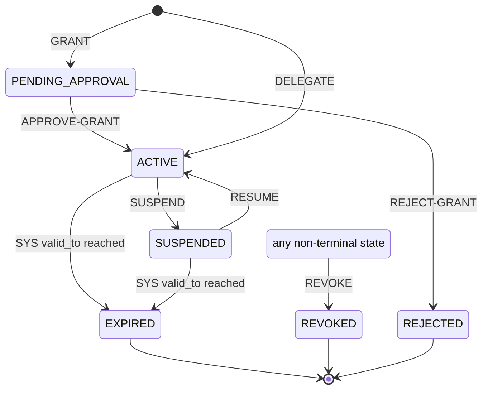
```mermaid
stateDiagram-v2
  state "any non-terminal state" as ANY_NT
  [*] --> PENDING_APPROVAL : GRANT
  PENDING_APPROVAL --> ACTIVE : APPROVE-GRANT
  PENDING_APPROVAL --> REJECTED : REJECT-GRANT
  [*] --> ACTIVE : DELEGATE
  ACTIVE --> SUSPENDED : SUSPEND
  SUSPENDED --> ACTIVE : RESUME
  ANY_NT --> REVOKED : REVOKE
  ACTIVE --> EXPIRED : SYS valid_to reached
  SUSPENDED --> EXPIRED : SYS valid_to reached
  EXPIRED --> [*]
  REVOKED --> [*]
  REJECTED --> [*]
```

### AGG-CLEARANCE

**التصريح الأمني** — Clearance · `03-domain/contexts/BC01/aggregates/AGG-CLEARANCE.md`

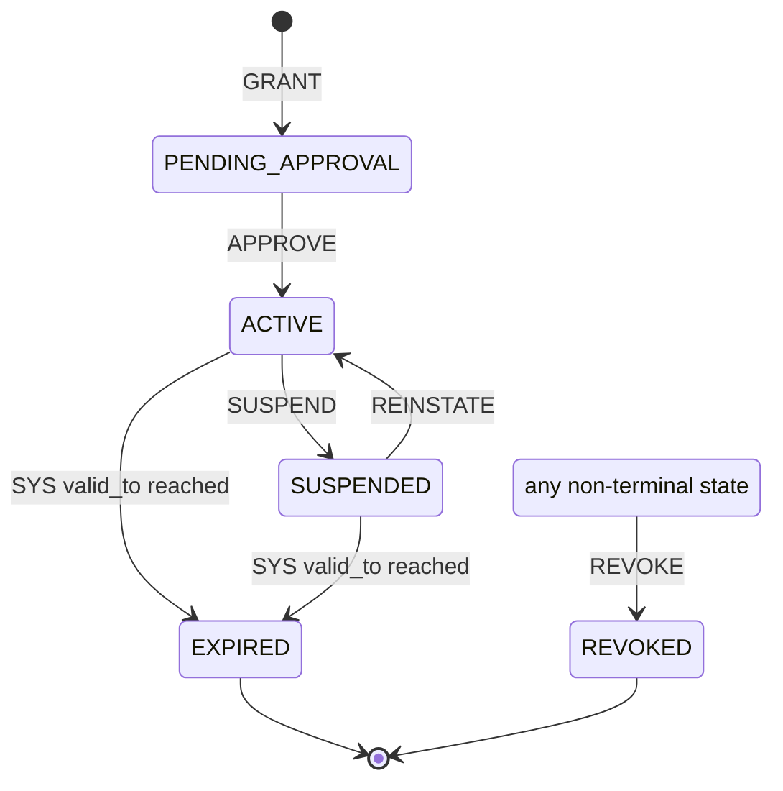
```mermaid
stateDiagram-v2
  state "any non-terminal state" as ANY_NT
  [*] --> PENDING_APPROVAL : GRANT
  PENDING_APPROVAL --> ACTIVE : APPROVE
  ACTIVE --> SUSPENDED : SUSPEND
  SUSPENDED --> ACTIVE : REINSTATE
  ANY_NT --> REVOKED : REVOKE
  ACTIVE --> EXPIRED : SYS valid_to reached
  SUSPENDED --> EXPIRED : SYS valid_to reached
  EXPIRED --> [*]
  REVOKED --> [*]
```

أوامر لا تغيّر الحالة: «MODIFY» في ACTIVE

### AGG-DEVICE

**الجهاز الميداني** — Field Device · `03-domain/contexts/BC01/aggregates/AGG-DEVICE.md`

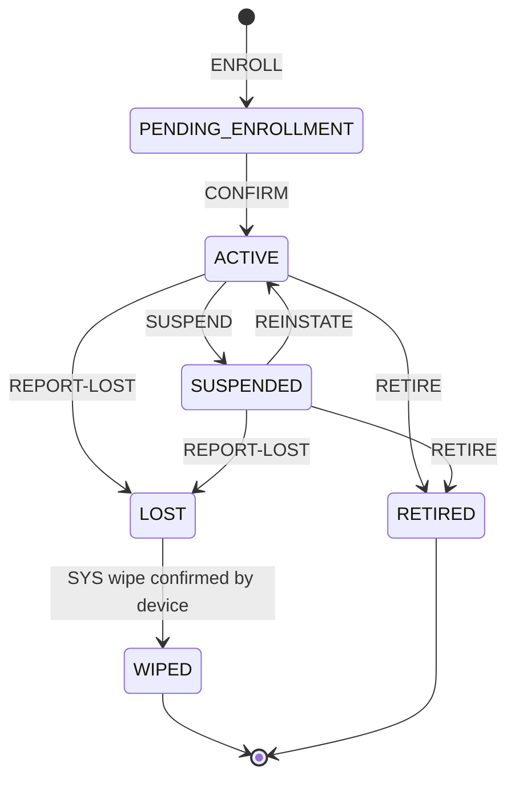
```mermaid
stateDiagram-v2
  [*] --> PENDING_ENROLLMENT : ENROLL
  PENDING_ENROLLMENT --> ACTIVE : CONFIRM
  ACTIVE --> SUSPENDED : SUSPEND
  SUSPENDED --> ACTIVE : REINSTATE
  ACTIVE --> LOST : REPORT-LOST
  SUSPENDED --> LOST : REPORT-LOST
  LOST --> WIPED : SYS wipe confirmed by device
  ACTIVE --> RETIRED : RETIRE
  SUSPENDED --> RETIRED : RETIRE
  WIPED --> [*]
  RETIRED --> [*]
```

أوامر لا تغيّر الحالة: «ROTATE-KEY» في ACTIVE

### AGG-HR-SYNC-PROPOSAL

**مقترح مزامنة الموارد البشرية** — HR Sync Proposal · `03-domain/contexts/BC01/aggregates/AGG-HR-SYNC-PROPOSAL.md`

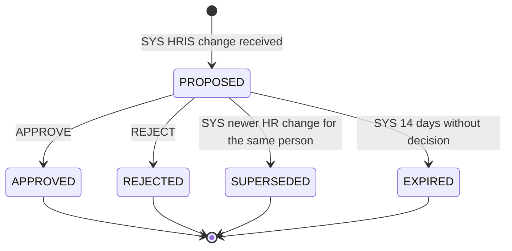
```mermaid
stateDiagram-v2
  [*] --> PROPOSED : SYS HRIS change received
  PROPOSED --> APPROVED : APPROVE
  PROPOSED --> REJECTED : REJECT
  PROPOSED --> SUPERSEDED : SYS newer HR change for the same person
  PROPOSED --> EXPIRED : SYS 14 days without decision
  APPROVED --> [*]
  REJECTED --> [*]
  SUPERSEDED --> [*]
  EXPIRED --> [*]
```

### AGG-ORGANIZATION

**المؤسسة** — Organization (with unit tree) · `03-domain/contexts/BC01/aggregates/AGG-ORGANIZATION.md` · **SL-06 EXEMPT** (لا حالة نهائية بالتصميم)

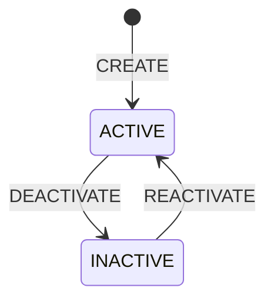
```mermaid
stateDiagram-v2
  [*] --> ACTIVE : CREATE
  ACTIVE --> INACTIVE : DEACTIVATE
  INACTIVE --> ACTIVE : REACTIVATE
```

أوامر لا تغيّر الحالة: «ADD-UNIT» في ACTIVE؛ «DEACTIVATE-UNIT» في ACTIVE؛ «MOVE-UNIT» في ACTIVE؛ «RENAME» في ACTIVE؛ «RENAME-UNIT» في ACTIVE

### AGG-PERSON

**الشخص** — Person · `03-domain/contexts/BC01/aggregates/AGG-PERSON.md`

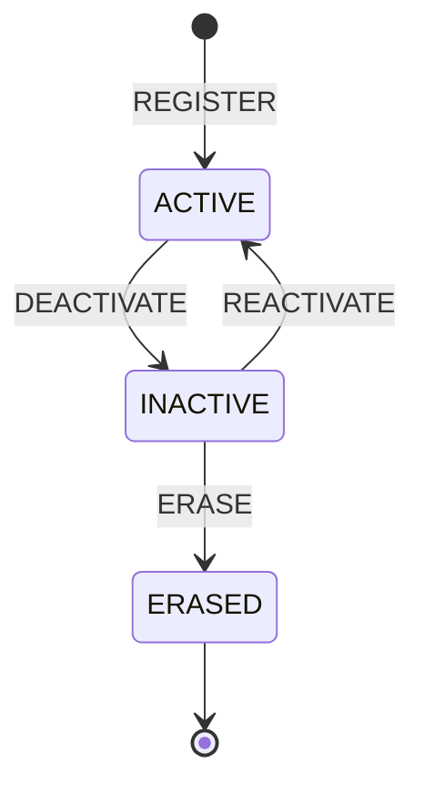
```mermaid
stateDiagram-v2
  [*] --> ACTIVE : REGISTER
  ACTIVE --> INACTIVE : DEACTIVATE
  INACTIVE --> ACTIVE : REACTIVATE
  INACTIVE --> ERASED : ERASE
  ERASED --> [*]
```

أوامر لا تغيّر الحالة: «UPDATE-DETAILS» في ACTIVE

### AGG-ROLE

**الدور** — Role · `03-domain/contexts/BC01/aggregates/AGG-ROLE.md`

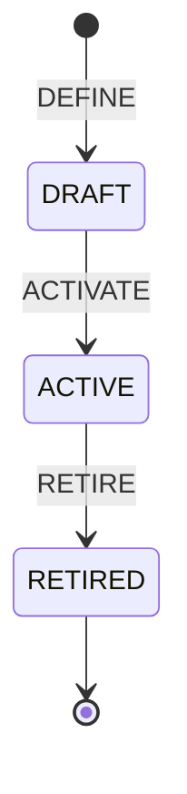
```mermaid
stateDiagram-v2
  [*] --> DRAFT : DEFINE
  DRAFT --> ACTIVE : ACTIVATE
  ACTIVE --> RETIRED : RETIRE
  RETIRED --> [*]
```

أوامر لا تغيّر الحالة: «SET-PERMISSIONS» في ACTIVE, DRAFT

### AGG-ROLE-ASSIGNMENT

**إسناد الدور** — Role Assignment · `03-domain/contexts/BC01/aggregates/AGG-ROLE-ASSIGNMENT.md`

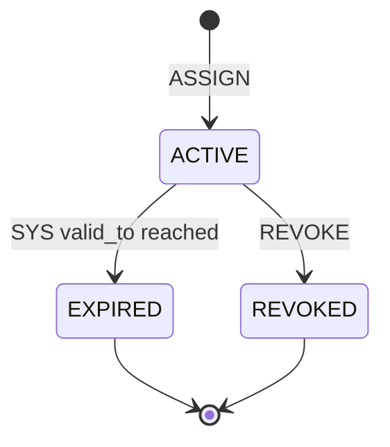
```mermaid
stateDiagram-v2
  [*] --> ACTIVE : ASSIGN
  ACTIVE --> REVOKED : REVOKE
  ACTIVE --> EXPIRED : SYS valid_to reached
  EXPIRED --> [*]
  REVOKED --> [*]
```

### AGG-SERVICE-ACCOUNT

**حساب الخدمة** — Service Account · `03-domain/contexts/BC01/aggregates/AGG-SERVICE-ACCOUNT.md`

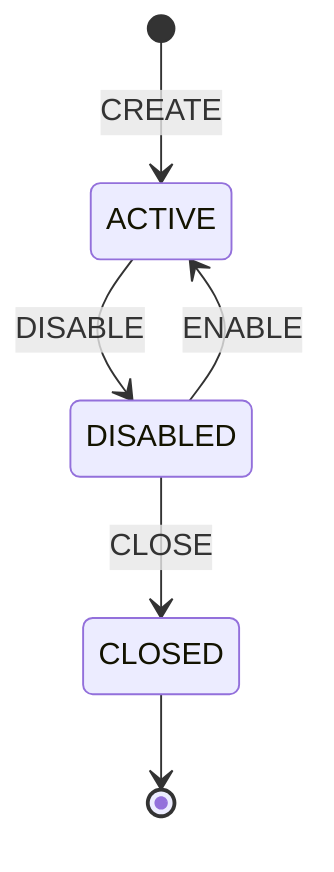
```mermaid
stateDiagram-v2
  [*] --> ACTIVE : CREATE
  ACTIVE --> DISABLED : DISABLE
  DISABLED --> ACTIVE : ENABLE
  DISABLED --> CLOSED : CLOSE
  CLOSED --> [*]
```

أوامر لا تغيّر الحالة: «ROTATE-CREDENTIAL» في ACTIVE

### AGG-TENANT

**المستأجر** — Tenant · `03-domain/contexts/BC01/aggregates/AGG-TENANT.md`

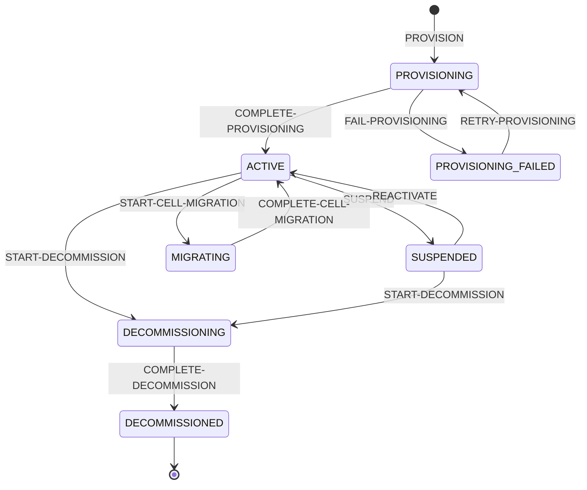
```mermaid
stateDiagram-v2
  [*] --> PROVISIONING : PROVISION
  PROVISIONING --> ACTIVE : COMPLETE-PROVISIONING
  PROVISIONING --> PROVISIONING_FAILED : FAIL-PROVISIONING
  PROVISIONING_FAILED --> PROVISIONING : RETRY-PROVISIONING
  ACTIVE --> SUSPENDED : SUSPEND
  SUSPENDED --> ACTIVE : REACTIVATE
  ACTIVE --> MIGRATING : START-CELL-MIGRATION
  MIGRATING --> ACTIVE : COMPLETE-CELL-MIGRATION
  ACTIVE --> DECOMMISSIONING : START-DECOMMISSION
  SUSPENDED --> DECOMMISSIONING : START-DECOMMISSION
  DECOMMISSIONING --> DECOMMISSIONED : COMPLETE-DECOMMISSION
  DECOMMISSIONED --> [*]
```

أوامر لا تغيّر الحالة: «UPDATE-QUOTAS» في ACTIVE, SUSPENDED

### AGG-USER

**حساب المستخدم** — User Account · `03-domain/contexts/BC01/aggregates/AGG-USER.md`

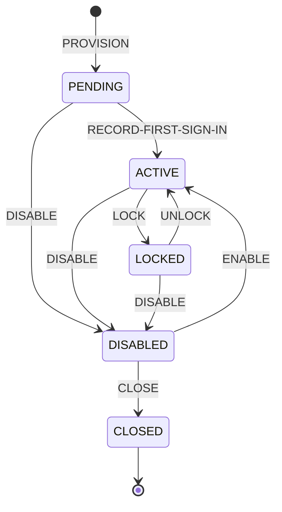
```mermaid
stateDiagram-v2
  [*] --> PENDING : PROVISION
  PENDING --> ACTIVE : RECORD-FIRST-SIGN-IN
  ACTIVE --> LOCKED : LOCK
  LOCKED --> ACTIVE : UNLOCK
  PENDING --> DISABLED : DISABLE
  ACTIVE --> DISABLED : DISABLE
  LOCKED --> DISABLED : DISABLE
  DISABLED --> ACTIVE : ENABLE
  DISABLED --> CLOSED : CLOSE
  CLOSED --> [*]
```

أوامر لا تغيّر الحالة: «LINK-IDENTITY» في ACTIVE, DISABLED, LOCKED, PENDING؛ «LINK-PERSON» في ACTIVE, DISABLED, LOCKED, PENDING؛ «UNLINK-IDENTITY» في ACTIVE, DISABLED, LOCKED, PENDING

## BC02 — Information — نواة المعلومات

### AGG-ATTACHMENT

**المرفق** — Attachment · `03-domain/contexts/BC02/aggregates/AGG-ATTACHMENT.md`

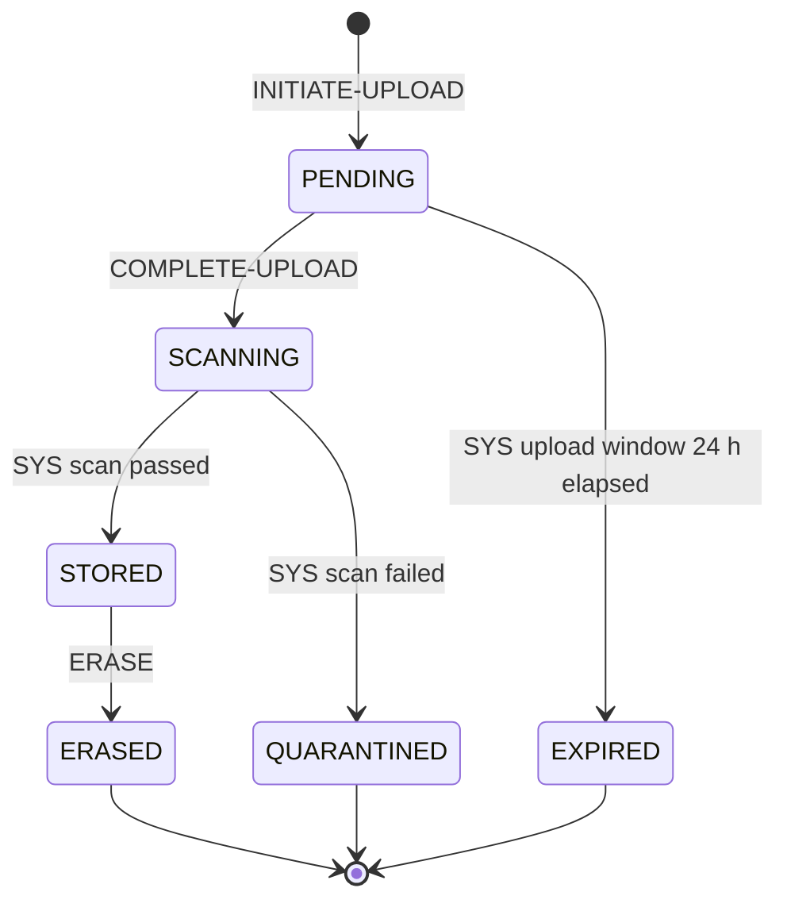
```mermaid
stateDiagram-v2
  [*] --> PENDING : INITIATE-UPLOAD
  PENDING --> SCANNING : COMPLETE-UPLOAD
  SCANNING --> STORED : SYS scan passed
  SCANNING --> QUARANTINED : SYS scan failed
  PENDING --> EXPIRED : SYS upload window 24 h elapsed
  STORED --> ERASED : ERASE
  QUARANTINED --> [*]
  EXPIRED --> [*]
  ERASED --> [*]
```

### AGG-CLAIM

**الادعاء** — Claim · `03-domain/contexts/BC02/aggregates/AGG-CLAIM.md`

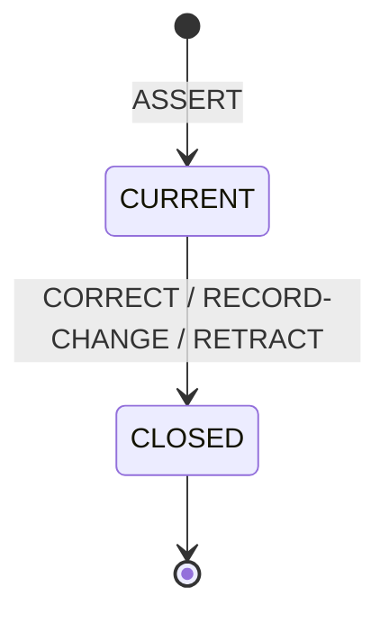
```mermaid
stateDiagram-v2
  [*] --> CURRENT : ASSERT
  CURRENT --> CLOSED : CORRECT / RECORD-CHANGE / RETRACT
  CLOSED --> [*]
```

أوامر لا تغيّر الحالة: «ASSESS» في CURRENT؛ «RECLASSIFY» في CLOSED, CURRENT

### AGG-COLLECTION-PLAN

**خطة الجمع** — Collection Plan · `03-domain/contexts/BC02/aggregates/AGG-COLLECTION-PLAN.md`

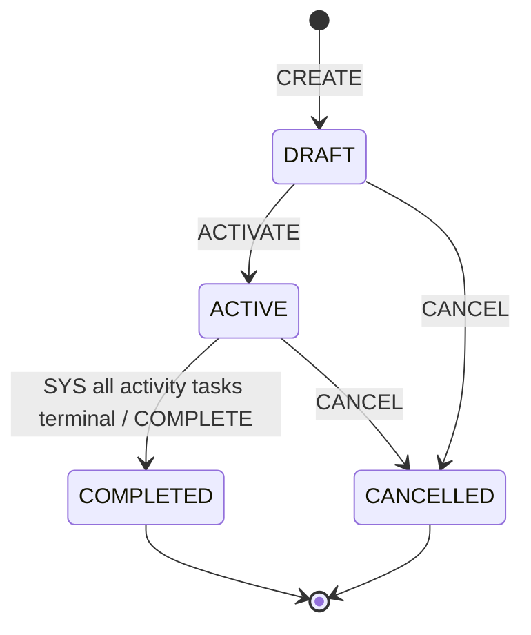
```mermaid
stateDiagram-v2
  [*] --> DRAFT : CREATE
  DRAFT --> ACTIVE : ACTIVATE
  ACTIVE --> COMPLETED : SYS all activity tasks terminal / COMPLETE
  DRAFT --> CANCELLED : CANCEL
  ACTIVE --> CANCELLED : CANCEL
  COMPLETED --> [*]
  CANCELLED --> [*]
```

أوامر لا تغيّر الحالة: «ADD-ACTIVITY» في ACTIVE, DRAFT؛ «REMOVE-ACTIVITY» في DRAFT

### AGG-COLLECTION-REQUIREMENT

**متطلب الجمع** — Collection Requirement · `03-domain/contexts/BC02/aggregates/AGG-COLLECTION-REQUIREMENT.md`

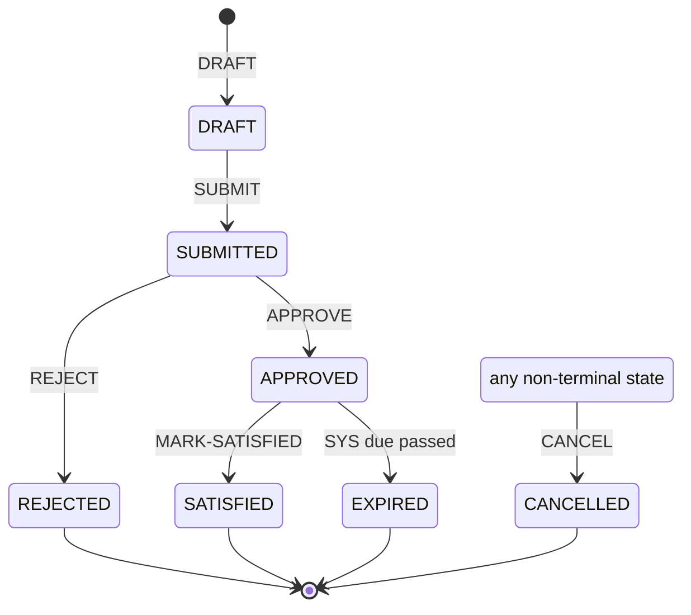
```mermaid
stateDiagram-v2
  state "any non-terminal state" as ANY_NT
  [*] --> DRAFT : DRAFT
  DRAFT --> SUBMITTED : SUBMIT
  SUBMITTED --> APPROVED : APPROVE
  SUBMITTED --> REJECTED : REJECT
  APPROVED --> SATISFIED : MARK-SATISFIED
  APPROVED --> EXPIRED : SYS due passed
  ANY_NT --> CANCELLED : CANCEL
  REJECTED --> [*]
  SATISFIED --> [*]
  EXPIRED --> [*]
  CANCELLED --> [*]
```

أوامر لا تغيّر الحالة: «AMEND» في APPROVED؛ «EDIT» في DRAFT؛ «SYS validated observation matched» في APPROVED

### AGG-CONFLICT

**التعارض** — Conflict · `03-domain/contexts/BC02/aggregates/AGG-CONFLICT.md`

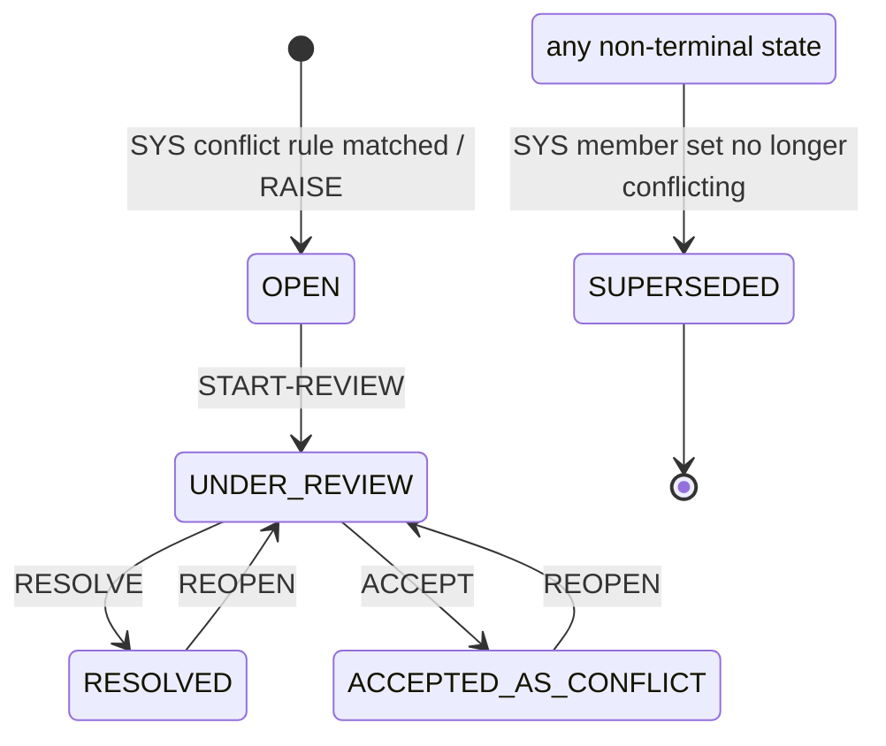
```mermaid
stateDiagram-v2
  state "any non-terminal state" as ANY_NT
  [*] --> OPEN : SYS conflict rule matched / RAISE
  OPEN --> UNDER_REVIEW : START-REVIEW
  UNDER_REVIEW --> RESOLVED : RESOLVE
  UNDER_REVIEW --> ACCEPTED_AS_CONFLICT : ACCEPT
  RESOLVED --> UNDER_REVIEW : REOPEN
  ACCEPTED_AS_CONFLICT --> UNDER_REVIEW : REOPEN
  ANY_NT --> SUPERSEDED : SYS member set no longer conflicting
  SUPERSEDED --> [*]
```

أوامر لا تغيّر الحالة: «ASSIGN» في OPEN, UNDER_REVIEW؛ «SYS incompatible claim joined» في OPEN, UNDER_REVIEW

### AGG-CORRELATION-PROPOSAL

**مقترح الربط** — Correlation Proposal · `03-domain/contexts/BC02/aggregates/AGG-CORRELATION-PROPOSAL.md`

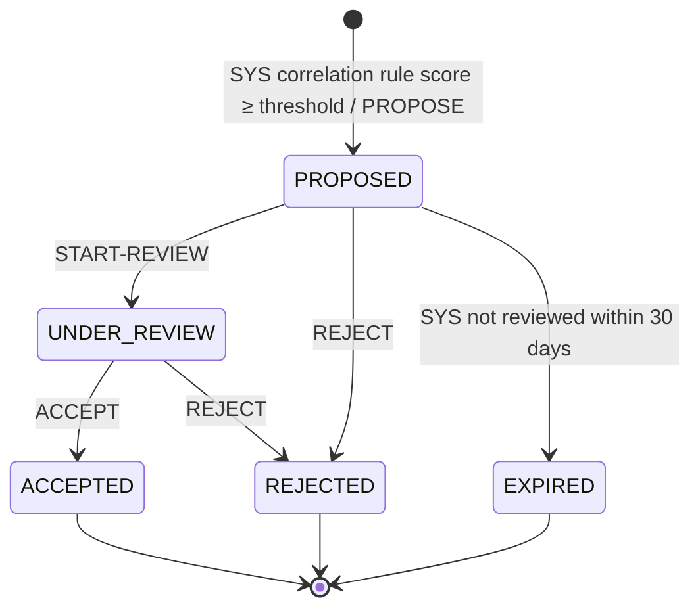
```mermaid
stateDiagram-v2
  [*] --> PROPOSED : SYS correlation rule score ≥ threshold / PROPOSE
  PROPOSED --> UNDER_REVIEW : START-REVIEW
  UNDER_REVIEW --> ACCEPTED : ACCEPT
  UNDER_REVIEW --> REJECTED : REJECT
  PROPOSED --> REJECTED : REJECT
  PROPOSED --> EXPIRED : SYS not reviewed within 30 days
  ACCEPTED --> [*]
  REJECTED --> [*]
  EXPIRED --> [*]
```

### AGG-CORRELATION-RULE

**قاعدة الربط** — Correlation Rule · `03-domain/contexts/BC02/aggregates/AGG-CORRELATION-RULE.md`

```mermaid
stateDiagram-v2
  [*] --> DRAFT : DEFINE
  DRAFT --> ACTIVE : ACTIVATE
  ACTIVE --> RETIRED : RETIRE
  RETIRED --> [*]
```

أوامر لا تغيّر الحالة: «EDIT» في ACTIVE, DRAFT

### AGG-ENTITY

**الكيان** — Entity (identity) · `03-domain/contexts/BC02/aggregates/AGG-ENTITY.md` · **SL-06 EXEMPT** (لا حالة نهائية بالتصميم)

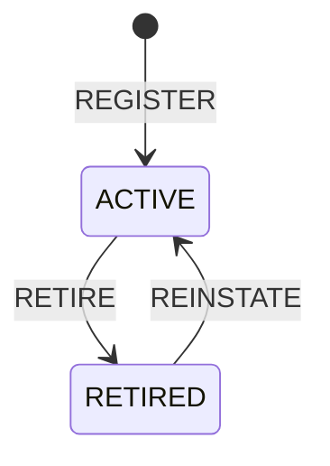
```mermaid
stateDiagram-v2
  [*] --> ACTIVE : REGISTER
  ACTIVE --> RETIRED : RETIRE
  RETIRED --> ACTIVE : REINSTATE
```

أوامر لا تغيّر الحالة: «CHANGE-TYPE» في ACTIVE؛ «RECLASSIFY» في ACTIVE, RETIRED

### AGG-ER-CASE

**حالة مطابقة الكيانات** — Entity Resolution Case · `03-domain/contexts/BC02/aggregates/AGG-ER-CASE.md`

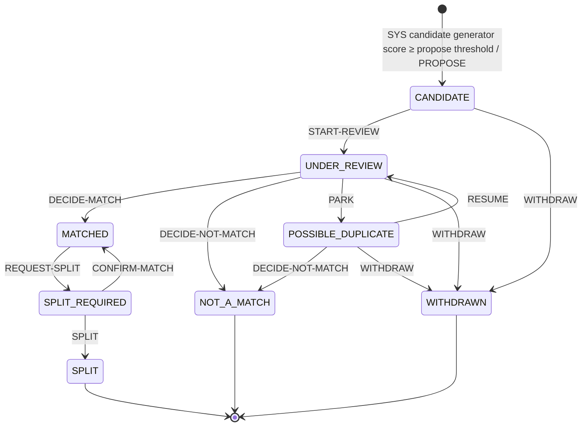
```mermaid
stateDiagram-v2
  [*] --> CANDIDATE : SYS candidate generator score ≥ propose threshold / PROPOSE
  CANDIDATE --> UNDER_REVIEW : START-REVIEW
  UNDER_REVIEW --> MATCHED : DECIDE-MATCH
  UNDER_REVIEW --> NOT_A_MATCH : DECIDE-NOT-MATCH
  UNDER_REVIEW --> POSSIBLE_DUPLICATE : PARK
  POSSIBLE_DUPLICATE --> UNDER_REVIEW : RESUME
  POSSIBLE_DUPLICATE --> NOT_A_MATCH : DECIDE-NOT-MATCH
  MATCHED --> SPLIT_REQUIRED : REQUEST-SPLIT
  SPLIT_REQUIRED --> MATCHED : CONFIRM-MATCH
  SPLIT_REQUIRED --> SPLIT : SPLIT
  CANDIDATE --> WITHDRAWN : WITHDRAW
  UNDER_REVIEW --> WITHDRAWN : WITHDRAW
  POSSIBLE_DUPLICATE --> WITHDRAWN : WITHDRAW
  NOT_A_MATCH --> [*]
  SPLIT --> [*]
  WITHDRAWN --> [*]
```

### AGG-EVIDENCE

**الدليل** — Evidence · `03-domain/contexts/BC02/aggregates/AGG-EVIDENCE.md`

```mermaid
stateDiagram-v2
  [*] --> REGISTERED : REGISTER
  REGISTERED --> SEALED : SEAL
  REGISTERED --> WITHDRAWN : WITHDRAW
  SEALED --> WITHDRAWN : WITHDRAW
  WITHDRAWN --> [*]
```

أوامر لا تغيّر الحالة: «RECLASSIFY» في REGISTERED, SEALED, WITHDRAWN؛ «TRANSFER-CUSTODY» في REGISTERED, SEALED؛ «UPDATE-LOCATOR» في REGISTERED

### AGG-EVIDENCE-LINK

**رابط الدليل** — Evidence Link · `03-domain/contexts/BC02/aggregates/AGG-EVIDENCE-LINK.md`

```mermaid
stateDiagram-v2
  [*] --> ACTIVE : LINK
  ACTIVE --> REMOVED : UNLINK
  REMOVED --> [*]
```

### AGG-EXTERNAL-ID

**ربط المعرّف الخارجي** — External Identifier Mapping · `03-domain/contexts/BC02/aggregates/AGG-EXTERNAL-ID.md`

```mermaid
stateDiagram-v2
  [*] --> ACTIVE : MAP
  ACTIVE --> ENDED : END
  ENDED --> [*]
```

### AGG-IMPORT-BATCH

**دفعة الاستيراد** — Import Batch · `03-domain/contexts/BC02/aggregates/AGG-IMPORT-BATCH.md`

```mermaid
stateDiagram-v2
  [*] --> RECEIVED : SUBMIT
  RECEIVED --> PROCESSING : SYS processing started
  PROCESSING --> COMPLETED : SYS all records applied
  PROCESSING --> COMPLETED_WITH_QUARANTINE : SYS finished with invalid records
  PROCESSING --> FAILED : SYS unrecoverable error
  COMPLETED_WITH_QUARANTINE --> PROCESSING : REPROCESS-QUARANTINE
  COMPLETED_WITH_QUARANTINE --> COMPLETED : ACCEPT-QUARANTINE
  RECEIVED --> CANCELLED : CANCEL
  COMPLETED --> [*]
  FAILED --> [*]
  CANCELLED --> [*]
```

### AGG-MATCH-RULESET

**مجموعة قواعد المطابقة** — Match Ruleset · `03-domain/contexts/BC02/aggregates/AGG-MATCH-RULESET.md`

```mermaid
stateDiagram-v2
  [*] --> DRAFT : DRAFT
  DRAFT --> ACTIVE : ACTIVATE
  ACTIVE --> SUPERSEDED : SYS successor activated
  SUPERSEDED --> [*]
```

أوامر لا تغيّر الحالة: «EDIT» في DRAFT

### AGG-OBSERVATION

**الملاحظة** — Observation · `03-domain/contexts/BC02/aggregates/AGG-OBSERVATION.md`

```mermaid
stateDiagram-v2
  [*] --> RECORDED : RECORD
  RECORDED --> VALIDATED : VALIDATE
  RECORDED --> REJECTED : REJECT
  VALIDATED --> [*]
  REJECTED --> [*]
```

أوامر لا تغيّر الحالة: «AMEND» في RECORDED؛ «ATTACH-EVIDENCE» في RECORDED؛ «RECLASSIFY» في RECORDED, REJECTED, VALIDATED

### AGG-REALWORLD-EVENT

**الحدث الواقعي** — Real-World Event (identity) · `03-domain/contexts/BC02/aggregates/AGG-REALWORLD-EVENT.md` · **SL-06 EXEMPT** (لا حالة نهائية بالتصميم)

```mermaid
stateDiagram-v2
  [*] --> ACTIVE : REGISTER
  ACTIVE --> RETIRED : RETIRE
  RETIRED --> ACTIVE : REINSTATE
```

أوامر لا تغيّر الحالة: «CHANGE-TYPE» في ACTIVE؛ «RECLASSIFY» في ACTIVE, RETIRED

### AGG-RELATIONSHIP

**العلاقة** — Relationship (identity) · `03-domain/contexts/BC02/aggregates/AGG-RELATIONSHIP.md` · **SL-06 EXEMPT** (لا حالة نهائية بالتصميم)

```mermaid
stateDiagram-v2
  [*] --> ACTIVE : REGISTER
  ACTIVE --> RETIRED : RETIRE
  RETIRED --> ACTIVE : REINSTATE
```

أوامر لا تغيّر الحالة: «RECLASSIFY» في ACTIVE, RETIRED

### AGG-SOURCE

**المصدر** — Source · `03-domain/contexts/BC02/aggregates/AGG-SOURCE.md`

```mermaid
stateDiagram-v2
  [*] --> ACTIVE : REGISTER
  ACTIVE --> SUSPENDED : SUSPEND
  SUSPENDED --> ACTIVE : REINSTATE
  ACTIVE --> RETIRED : RETIRE
  SUSPENDED --> RETIRED : RETIRE
  RETIRED --> [*]
```

أوامر لا تغيّر الحالة: «RATE-RELIABILITY» في ACTIVE, SUSPENDED؛ «RECLASSIFY» في ACTIVE, SUSPENDED؛ «SET-PROTECTION» في ACTIVE, SUSPENDED؛ «UPDATE-PROFILE» في ACTIVE, SUSPENDED

## BC03 — Intelligence — الوعي والتحليل

### AGG-ALERT

**التنبيه** — Alert · `03-domain/contexts/BC03/aggregates/AGG-ALERT.md`

```mermaid
stateDiagram-v2
  [*] --> RAISED : SYS rule condition met
  RAISED --> ACKNOWLEDGED : ACKNOWLEDGE
  RAISED --> RESOLVED : RESOLVE / SYS condition cleared and rule auto_resolve
  ACKNOWLEDGED --> RESOLVED : RESOLVE / SYS condition cleared and rule auto_resolve
  RAISED --> DISMISSED : DISMISS
  ACKNOWLEDGED --> DISMISSED : DISMISS
  RESOLVED --> [*]
  DISMISSED --> [*]
```

أوامر لا تغيّر الحالة: «SYS condition met again within dedupe window» في ACKNOWLEDGED, RAISED؛ «SYS unacknowledged beyond escalation delay» في RAISED

### AGG-ALERT-RULE

**قاعدة التنبيه** — Alert Rule · `03-domain/contexts/BC03/aggregates/AGG-ALERT-RULE.md`

```mermaid
stateDiagram-v2
  state "any non-terminal state" as ANY_NT
  [*] --> DRAFT : DEFINE
  DRAFT --> ACTIVE : ACTIVATE
  ACTIVE --> DISABLED : DISABLE
  DISABLED --> ACTIVE : ENABLE
  ANY_NT --> RETIRED : RETIRE
  RETIRED --> [*]
```

أوامر لا تغيّر الحالة: «EDIT» في DISABLED, DRAFT

### AGG-ANALYSIS-CASE

**حالة التحليل** — Analysis Case · `03-domain/contexts/BC03/aggregates/AGG-ANALYSIS-CASE.md`

```mermaid
stateDiagram-v2
  [*] --> DRAFT : CREATE
  DRAFT --> OPEN : OPEN
  OPEN --> CLOSED : CLOSE
  CLOSED --> OPEN : REOPEN
  DRAFT --> CANCELLED : CANCEL
  OPEN --> CANCELLED : CANCEL
  CANCELLED --> [*]
```

أوامر لا تغيّر الحالة: «ADD-ASSUMPTION» في OPEN؛ «ADD-HYPOTHESIS» في OPEN؛ «DEFINE» في DRAFT, OPEN؛ «DEFINE-SCENARIO» في OPEN؛ «DESELECT-EVIDENCE» في OPEN؛ «RECLASSIFY» في CLOSED, DRAFT, OPEN؛ «RETIRE-ASSUMPTION» في OPEN؛ «SELECT-EVIDENCE» في OPEN؛ «UPDATE-HYPOTHESIS» في OPEN

### AGG-ANALYSIS-METHOD

**طريقة التحليل** — Analysis Method Version · `03-domain/contexts/BC03/aggregates/AGG-ANALYSIS-METHOD.md`

```mermaid
stateDiagram-v2
  [*] --> DRAFT : REGISTER
  DRAFT --> ACTIVE : ACTIVATE
  ACTIVE --> DEPRECATED : DEPRECATE
  DEPRECATED --> RETIRED : RETIRE
  RETIRED --> [*]
```

### AGG-ANALYSIS-RUN

**تشغيل التحليل** — Analysis Run · `03-domain/contexts/BC03/aggregates/AGG-ANALYSIS-RUN.md`

```mermaid
stateDiagram-v2
  [*] --> QUEUED : SUBMIT / REPRODUCE
  QUEUED --> RUNNING : SYS worker lease acquired
  RUNNING --> SUCCEEDED : SYS completed
  RUNNING --> FAILED : SYS error or timeout
  QUEUED --> CANCELLED : CANCEL
  RUNNING --> CANCELLED : CANCEL
  SUCCEEDED --> [*]
  FAILED --> [*]
  CANCELLED --> [*]
```

### AGG-ASSESSMENT

**التقييم** — Assessment Version · `03-domain/contexts/BC03/aggregates/AGG-ASSESSMENT.md`

```mermaid
stateDiagram-v2
  [*] --> DRAFT : DRAFT
  DRAFT --> IN_REVIEW : SUBMIT
  IN_REVIEW --> DRAFT : RETURN
  IN_REVIEW --> PUBLISHED : PUBLISH
  PUBLISHED --> SUPERSEDED : SYS newer version published
  PUBLISHED --> WITHDRAWN : WITHDRAW
  DRAFT --> DISCARDED : DISCARD
  SUPERSEDED --> [*]
  WITHDRAWN --> [*]
  DISCARDED --> [*]
```

أوامر لا تغيّر الحالة: «EDIT» في DRAFT

### AGG-CAP-MESSAGE

**رسالة CAP الصادرة** — CAP Message (outbound) · `03-domain/contexts/BC03/aggregates/AGG-CAP-MESSAGE.md`

```mermaid
stateDiagram-v2
  [*] --> PREPARED : PREPARE
  PREPARED --> SENT : RELEASE
  PREPARED --> FAILED : SYS delivery failed after retries
  FAILED --> PREPARED : RETRY
  PREPARED --> CANCELLED : CANCEL
  FAILED --> CANCELLED : CANCEL
  SENT --> [*]
  CANCELLED --> [*]
```

### AGG-FINDING

**النتيجة التحليلية** — Finding · `03-domain/contexts/BC03/aggregates/AGG-FINDING.md`

```mermaid
stateDiagram-v2
  [*] --> DRAFT : RECORD
  DRAFT --> ACCEPTED : ACCEPT
  DRAFT --> WITHDRAWN : WITHDRAW
  ACCEPTED --> WITHDRAWN : WITHDRAW
  WITHDRAWN --> [*]
```

أوامر لا تغيّر الحالة: «EDIT» في DRAFT

### AGG-SITUATION

**الموقف** — Situation · `03-domain/contexts/BC03/aggregates/AGG-SITUATION.md`

```mermaid
stateDiagram-v2
  state "any non-terminal state" as ANY_NT
  [*] --> DRAFT : CREATE
  DRAFT --> ACTIVE : ACTIVATE
  ACTIVE --> PAUSED : PAUSE
  PAUSED --> ACTIVE : RESUME
  ANY_NT --> CLOSED : CLOSE
  CLOSED --> [*]
```

أوامر لا تغيّر الحالة: «EDIT-DEFINITION» في ACTIVE, DRAFT, PAUSED؛ «RECLASSIFY» في ACTIVE, DRAFT, PAUSED

## BC04 — Operations — التخطيط والتنفيذ

### AGG-COORDINATION-CASE

**حالة التنسيق** — Coordination Case · `03-domain/contexts/BC04/aggregates/AGG-COORDINATION-CASE.md`

```mermaid
stateDiagram-v2
  [*] --> OPEN : OPEN
  OPEN --> ACTIVE : ACTIVATE
  ACTIVE --> CLOSED : CLOSE
  OPEN --> CANCELLED : CANCEL
  ACTIVE --> CANCELLED : CANCEL
  CLOSED --> [*]
  CANCELLED --> [*]
```

أوامر لا تغيّر الحالة: «ADD-PARTICIPANT» في ACTIVE, OPEN؛ «ASSIGN-RESPONSIBILITY» في ACTIVE؛ «REMOVE-PARTICIPANT» في ACTIVE, OPEN؛ «REQUEST-DECISION» في ACTIVE؛ «SYS linked decision recorded» في ACTIVE؛ «UPDATE-RESPONSIBILITY» في ACTIVE

### AGG-DECISION

**القرار** — Decision · `03-domain/contexts/BC04/aggregates/AGG-DECISION.md`

```mermaid
stateDiagram-v2
  [*] --> RECORDED : RECORD
  RECORDED --> SUPERSEDED : SYS superseding decision recorded
  RECORDED --> ANNULLED : ANNUL
  SUPERSEDED --> [*]
  ANNULLED --> [*]
```

### AGG-DECISION-REQUEST

**طلب القرار** — Decision Request · `03-domain/contexts/BC04/aggregates/AGG-DECISION-REQUEST.md`

```mermaid
stateDiagram-v2
  [*] --> DRAFT : CREATE
  DRAFT --> OPEN : OPEN
  OPEN --> DECIDED : SYS decision recorded for this request
  DRAFT --> WITHDRAWN : WITHDRAW
  OPEN --> WITHDRAWN : WITHDRAW
  DECIDED --> [*]
  WITHDRAWN --> [*]
```

أوامر لا تغيّر الحالة: «ADD-OPTION» في DRAFT, OPEN؛ «CITE» في DRAFT, OPEN؛ «SYS deadline passed» في OPEN

### AGG-INCIDENT

**الحادثة** — Incident · `03-domain/contexts/BC04/aggregates/AGG-INCIDENT.md`

```mermaid
stateDiagram-v2
  [*] --> REPORTED : REPORT
  REPORTED --> ASSESSED : ASSESS
  ASSESSED --> RESPONDING : DISPATCH-RESPONSE
  RESPONDING --> CONTAINED : CONTAIN
  CONTAINED --> RESOLVED : RESOLVE
  RESOLVED --> CLOSED : CLOSE
  REPORTED --> CANCELLED : CANCEL
  CLOSED --> [*]
  CANCELLED --> [*]
```

أوامر لا تغيّر الحالة: «ACTIVATE-CONTINGENCY» في ASSESSED, CONTAINED, REPORTED, RESOLVED, RESPONDING؛ «DE-ESCALATE» في ASSESSED, CONTAINED, REPORTED, RESOLVED, RESPONDING؛ «ESCALATE» في ASSESSED, CONTAINED, REPORTED, RESOLVED, RESPONDING؛ «SYS response SLA elapsed without dispatch» في ASSESSED, REPORTED

### AGG-NOTIFICATION

**الإشعار** — Notification · `03-domain/contexts/BC04/aggregates/AGG-NOTIFICATION.md`

```mermaid
stateDiagram-v2
  [*] --> QUEUED : SYS notifiable event for recipient
  QUEUED --> SENT : SYS delivered to channel
  QUEUED --> WITHHELD : SYS recipient no longer authorized at delivery
  QUEUED --> FAILED : SYS delivery failed after retries
  SENT --> READ : MARK-READ
  QUEUED --> EXPIRED : SYS TTL (30 d) elapsed
  SENT --> EXPIRED : SYS TTL (30 d) elapsed
  READ --> [*]
  FAILED --> [*]
  WITHHELD --> [*]
  EXPIRED --> [*]
```

### AGG-OUTCOME-TRACKER

**متتبّع النتائج** — Outcome Tracker · `03-domain/contexts/BC04/aggregates/AGG-OUTCOME-TRACKER.md`

```mermaid
stateDiagram-v2
  [*] --> ACTIVE : SYS outcome baselined
  ACTIVE --> CLOSED : SYS plan closed or cancelled
  CLOSED --> [*]
```

أوامر لا تغيّر الحالة: «CORRECT» في ACTIVE؛ «RECORD» في ACTIVE؛ «SYS target changed by new baseline» في ACTIVE

### AGG-PLAN

**الخطة** — Plan (identity) · `03-domain/contexts/BC04/aggregates/AGG-PLAN.md`

```mermaid
stateDiagram-v2
  [*] --> DRAFT : CREATE
  DRAFT --> ACTIVE : SYS first version baselined
  ACTIVE --> SUSPENDED : SUSPEND
  SUSPENDED --> ACTIVE : RESUME
  ACTIVE --> COMPLETED : COMPLETE
  COMPLETED --> CLOSED : CLOSE
  DRAFT --> CANCELLED : CANCEL
  ACTIVE --> CANCELLED : CANCEL
  SUSPENDED --> CANCELLED : CANCEL
  CLOSED --> [*]
  CANCELLED --> [*]
```

أوامر لا تغيّر الحالة: «RECLASSIFY» في ACTIVE, DRAFT, SUSPENDED؛ «SYS implemented decision annulled or superseded» في ACTIVE, SUSPENDED

### AGG-PLAN-VERSION

**إصدار الخطة** — Plan Version · `03-domain/contexts/BC04/aggregates/AGG-PLAN-VERSION.md`

```mermaid
stateDiagram-v2
  [*] --> DRAFT : DRAFT
  DRAFT --> IN_REVIEW : SUBMIT
  IN_REVIEW --> DRAFT : RETURN
  IN_REVIEW --> BASELINED : APPROVE
  IN_REVIEW --> REJECTED : REJECT
  BASELINED --> SUPERSEDED : SYS newer version baselined
  DRAFT --> DISCARDED : DISCARD
  SUPERSEDED --> [*]
  REJECTED --> [*]
  DISCARDED --> [*]
```

أوامر لا تغيّر الحالة: «AMEND-MINOR» في BASELINED؛ «EDIT» في DRAFT

### AGG-RISK

**الخطر** — Risk · `03-domain/contexts/BC04/aggregates/AGG-RISK.md`

```mermaid
stateDiagram-v2
  state "any non-terminal state" as ANY_NT
  [*] --> IDENTIFIED : IDENTIFY
  IDENTIFIED --> ASSESSED : ASSESS
  ASSESSED --> TREATED : PLAN-TREATMENT
  ASSESSED --> ASSESSED : REASSESS
  TREATED --> ASSESSED : REASSESS
  ANY_NT --> CLOSED : CLOSE
  CLOSED --> [*]
```

أوامر لا تغيّر الحالة: «SYS incident references this risk as risk_ref» في ASSESSED, IDENTIFIED, TREATED

### AGG-SUBSCRIPTION

**الاشتراك** — Subscription · `03-domain/contexts/BC04/aggregates/AGG-SUBSCRIPTION.md`

```mermaid
stateDiagram-v2
  [*] --> ACTIVE : SUBSCRIBE
  ACTIVE --> PAUSED : PAUSE
  PAUSED --> ACTIVE : RESUME
  ACTIVE --> ENDED : UNSUBSCRIBE / SYS subscriber lost visibility of target
  PAUSED --> ENDED : UNSUBSCRIBE / SYS subscriber lost visibility of target
  ENDED --> [*]
```

أوامر لا تغيّر الحالة: «UPDATE-CHANNELS» في ACTIVE, PAUSED

### AGG-TASK

**المهمة** — Task · `03-domain/contexts/BC04/aggregates/AGG-TASK.md`

```mermaid
stateDiagram-v2
  state "any of 4 states" as G1
  state "any of 9 states" as G2
  state "any of 8 states" as G3
  [*] --> DRAFT : CREATE
  DRAFT --> READY : MARK-READY
  READY --> ASSIGNED : ASSIGN
  G1 --> ASSIGNED : REASSIGN
  ASSIGNED --> ACCEPTED : ACCEPT
  ASSIGNED --> READY : DECLINE
  ACCEPTED --> IN_PROGRESS : START
  IN_PROGRESS --> BLOCKED : BLOCK
  BLOCKED --> IN_PROGRESS : RESUME
  IN_PROGRESS --> SUBMITTED : SUBMIT
  SUBMITTED --> UNDER_REVIEW : START-REVIEW
  UNDER_REVIEW --> IN_PROGRESS : RETURN
  UNDER_REVIEW --> APPROVED : APPROVE
  UNDER_REVIEW --> REJECTED : REJECT
  APPROVED --> COMPLETED : SYS all completion criteria satisfied / COMPLETE
  COMPLETED --> CLOSED : CLOSE / SYS follow-up window (7 d) elapsed without open follow-ups
  G2 --> CANCELLED : CANCEL
  G3 --> EXPIRED : SYS due passed and task type expires_on_due
  G2 --> SUPERSEDED : SYS plan version baselined without this task
  CLOSED --> [*]
  CANCELLED --> [*]
  REJECTED --> [*]
  EXPIRED --> [*]
  SUPERSEDED --> [*]
```

مجموعات الحالات في المخطط: **G1** = ACCEPTED, ASSIGNED, BLOCKED, IN_PROGRESS؛ **G2** = ACCEPTED, APPROVED, ASSIGNED, BLOCKED, DRAFT, IN_PROGRESS, READY, SUBMITTED, UNDER_REVIEW؛ **G3** = ACCEPTED, ASSIGNED, BLOCKED, DRAFT, IN_PROGRESS, READY, SUBMITTED, UNDER_REVIEW

أوامر لا تغيّر الحالة: «ADD-RESULT-ITEM» في BLOCKED, IN_PROGRESS؛ «EDIT» في DRAFT, READY؛ «ESCALATE» في ACCEPTED, APPROVED, ASSIGNED, BLOCKED, COMPLETED, DRAFT, IN_PROGRESS, READY, SUBMITTED, UNDER_REVIEW؛ «RECLASSIFY» في ACCEPTED, APPROVED, ASSIGNED, BLOCKED, COMPLETED, DRAFT, IN_PROGRESS, READY, SUBMITTED, UNDER_REVIEW؛ «SET-DUE» في ACCEPTED, ASSIGNED, BLOCKED, DRAFT, IN_PROGRESS, READY؛ «SUSPEND» في ACCEPTED, APPROVED, ASSIGNED, BLOCKED, COMPLETED, DRAFT, IN_PROGRESS, READY, SUBMITTED, UNDER_REVIEW؛ «SYS due passed (escalation policy)» في ACCEPTED, APPROVED, ASSIGNED, BLOCKED, COMPLETED, DRAFT, IN_PROGRESS, READY, SUBMITTED, UNDER_REVIEW؛ «UNSUSPEND» في ACCEPTED, APPROVED, ASSIGNED, BLOCKED, COMPLETED, DRAFT, IN_PROGRESS, READY, SUBMITTED, UNDER_REVIEW

### AGG-TASK-TYPE

**نوع المهمة** — Task Type · `03-domain/contexts/BC04/aggregates/AGG-TASK-TYPE.md`

```mermaid
stateDiagram-v2
  [*] --> DRAFT : DEFINE
  DRAFT --> ACTIVE : ACTIVATE
  ACTIVE --> RETIRED : RETIRE
  RETIRED --> [*]
```

أوامر لا تغيّر الحالة: «EDIT» في ACTIVE, DRAFT

## BC05 — Readiness — الموارد والجاهزية

### AGG-ALLOCATION

**تخصيص الموارد** — Resource Allocation · `03-domain/contexts/BC05/aggregates/AGG-ALLOCATION.md`

```mermaid
stateDiagram-v2
  [*] --> REQUESTED : REQUEST
  REQUESTED --> COMMITTED : SYS all checks passed
  REQUESTED --> PENDING_APPROVAL : SYS checks passed, policy requires approval
  REQUESTED --> REJECTED : SYS a check failed
  PENDING_APPROVAL --> COMMITTED : APPROVE
  PENDING_APPROVAL --> REJECTED : REJECT / SYS provisional hold (1 h) elapsed
  COMMITTED --> PREEMPTED : PREEMPT
  COMMITTED --> RELEASED : RELEASE / SYS linked task terminal
  REJECTED --> [*]
  PREEMPTED --> [*]
  RELEASED --> [*]
```

أوامر لا تغيّر الحالة: «RECORD-CONSUMPTION» في COMMITTED

### AGG-ASSET

**الأصل** — Asset · `03-domain/contexts/BC05/aggregates/AGG-ASSET.md`

```mermaid
stateDiagram-v2
  [*] --> IN_SERVICE : REGISTER
  IN_SERVICE --> UNSERVICEABLE : MARK-UNSERVICEABLE
  IN_SERVICE --> UNDER_MAINTENANCE : START-MAINTENANCE
  UNSERVICEABLE --> UNDER_MAINTENANCE : START-MAINTENANCE
  UNDER_MAINTENANCE --> IN_SERVICE : RETURN-TO-SERVICE
  UNDER_MAINTENANCE --> UNSERVICEABLE : FAIL-MAINTENANCE
  IN_SERVICE --> LOST : REPORT-LOST
  UNSERVICEABLE --> LOST : REPORT-LOST
  LOST --> UNSERVICEABLE : RECOVER
  UNSERVICEABLE --> DISPOSED : DISPOSE
  LOST --> DISPOSED : DISPOSE
  DISPOSED --> [*]
```

أوامر لا تغيّر الحالة: «RECLASSIFY» في IN_SERVICE, LOST, UNDER_MAINTENANCE, UNSERVICEABLE؛ «SET-CERTIFICATION» في IN_SERVICE, UNDER_MAINTENANCE, UNSERVICEABLE؛ «TRANSFER-CUSTODY» في IN_SERVICE, UNDER_MAINTENANCE, UNSERVICEABLE؛ «UPDATE-CONDITION» في IN_SERVICE, UNDER_MAINTENANCE, UNSERVICEABLE

### AGG-ASSET-ASSIGNMENT

**إسناد الأصل** — Asset Assignment · `03-domain/contexts/BC05/aggregates/AGG-ASSET-ASSIGNMENT.md`

```mermaid
stateDiagram-v2
  [*] --> ACTIVE : ASSIGN
  ACTIVE --> RETURNED : RETURN / SYS linked task terminal
  ACTIVE --> CANCELLED : CANCEL
  RETURNED --> [*]
  CANCELLED --> [*]
```

### AGG-ASSET-RESERVATION

**حجز الأصل** — Asset Reservation · `03-domain/contexts/BC05/aggregates/AGG-ASSET-RESERVATION.md`

```mermaid
stateDiagram-v2
  [*] --> HELD : HOLD
  HELD --> CONFIRMED : CONFIRM
  HELD --> EXPIRED : SYS hold expiry (24 h) reached
  CONFIRMED --> RELEASED : RELEASE / SYS linked task or plan terminal
  HELD --> CANCELLED : CANCEL
  CONFIRMED --> CANCELLED : CANCEL
  RELEASED --> [*]
  EXPIRED --> [*]
  CANCELLED --> [*]
```

### AGG-EXERCISE

**التمرين** — Exercise · `03-domain/contexts/BC05/aggregates/AGG-EXERCISE.md`

```mermaid
stateDiagram-v2
  [*] --> PLANNED : PLAN
  PLANNED --> SCHEDULED : SCHEDULE
  SCHEDULED --> IN_PROGRESS : START
  IN_PROGRESS --> COMPLETED : SYS linked simulation completed
  IN_PROGRESS --> ABORTED : SYS linked simulation aborted
  PLANNED --> CANCELLED : CANCEL
  SCHEDULED --> CANCELLED : CANCEL
  COMPLETED --> [*]
  ABORTED --> [*]
  CANCELLED --> [*]
```

### AGG-LOGISTICS-REQUEST

**طلب الإمداد** — Logistics Request · `03-domain/contexts/BC05/aggregates/AGG-LOGISTICS-REQUEST.md`

```mermaid
stateDiagram-v2
  [*] --> REQUESTED : REQUEST
  REQUESTED --> APPROVED : SYS linked allocation committed
  REQUESTED --> PENDING_APPROVAL : SYS linked allocation requires approval
  REQUESTED --> REJECTED : SYS linked allocation rejected
  PENDING_APPROVAL --> APPROVED : SYS linked allocation committed
  PENDING_APPROVAL --> REJECTED : SYS linked allocation rejected
  APPROVED --> IN_TRANSIT : DISPATCH
  IN_TRANSIT --> FULFILLED : SYS linked shipment delivered in full
  IN_TRANSIT --> PARTIALLY_FULFILLED : SYS linked shipment resolved short
  REQUESTED --> CANCELLED : CANCEL
  PENDING_APPROVAL --> CANCELLED : CANCEL
  APPROVED --> CANCELLED : CANCEL
  FULFILLED --> [*]
  PARTIALLY_FULFILLED --> [*]
  REJECTED --> [*]
  CANCELLED --> [*]
```

### AGG-MAINTENANCE-ORDER

**أمر الصيانة** — Maintenance Order · `03-domain/contexts/BC05/aggregates/AGG-MAINTENANCE-ORDER.md`

```mermaid
stateDiagram-v2
  [*] --> PLANNED : PLAN
  PLANNED --> IN_PROGRESS : START
  IN_PROGRESS --> COMPLETED : COMPLETE
  PLANNED --> CANCELLED : CANCEL
  COMPLETED --> [*]
  CANCELLED --> [*]
```

أوامر لا تغيّر الحالة: «RESCHEDULE» في PLANNED

### AGG-QUALIFICATION-RECORD

**سجل التأهيل** — Qualification Record · `03-domain/contexts/BC05/aggregates/AGG-QUALIFICATION-RECORD.md`

```mermaid
stateDiagram-v2
  [*] --> ACTIVE : RECORD
  ACTIVE --> SUSPENDED : SUSPEND
  SUSPENDED --> ACTIVE : REINSTATE
  ACTIVE --> REVOKED : REVOKE
  SUSPENDED --> REVOKED : REVOKE
  ACTIVE --> EXPIRED : SYS valid_to reached
  SUSPENDED --> EXPIRED : SYS valid_to reached
  EXPIRED --> [*]
  REVOKED --> [*]
```

أوامر لا تغيّر الحالة: «RENEW» في ACTIVE

### AGG-RESOURCE-POOL

**مجمع الموارد** — Resource Pool · `03-domain/contexts/BC05/aggregates/AGG-RESOURCE-POOL.md`

```mermaid
stateDiagram-v2
  [*] --> ACTIVE : CREATE
  ACTIVE --> SUSPENDED : SUSPEND
  SUSPENDED --> ACTIVE : RESUME
  ACTIVE --> CLOSED : CLOSE
  SUSPENDED --> CLOSED : CLOSE
  CLOSED --> [*]
```

أوامر لا تغيّر الحالة: «ADJUST-CAPACITY» في ACTIVE, SUSPENDED

### AGG-ROLE-REQUIREMENT

**متطلبات الدور** — Role Requirement · `03-domain/contexts/BC05/aggregates/AGG-ROLE-REQUIREMENT.md`

```mermaid
stateDiagram-v2
  [*] --> DRAFT : DEFINE
  DRAFT --> ACTIVE : ACTIVATE
  ACTIVE --> RETIRED : RETIRE
  RETIRED --> [*]
```

أوامر لا تغيّر الحالة: «EDIT» في ACTIVE, DRAFT

### AGG-SCENARIO

**سيناريو التدريب** — Scenario · `03-domain/contexts/BC05/aggregates/AGG-SCENARIO.md`

```mermaid
stateDiagram-v2
  [*] --> DRAFT : DEFINE
  DRAFT --> ACTIVE : ACTIVATE
  ACTIVE --> RETIRED : RETIRE
  RETIRED --> [*]
```

أوامر لا تغيّر الحالة: «EDIT» في ACTIVE, DRAFT

### AGG-SHIPMENT

**الشحنة** — Shipment · `03-domain/contexts/BC05/aggregates/AGG-SHIPMENT.md`

```mermaid
stateDiagram-v2
  [*] --> PLANNED : PLAN
  PLANNED --> IN_TRANSIT : DEPART
  IN_TRANSIT --> DELIVERED : DELIVER
  IN_TRANSIT --> DAMAGED : REPORT-DAMAGE
  IN_TRANSIT --> LOST : REPORT-LOST
  PLANNED --> CANCELLED : CANCEL
  DELIVERED --> [*]
  DAMAGED --> [*]
  LOST --> [*]
  CANCELLED --> [*]
```

أوامر لا تغيّر الحالة: «RECORD-CHECKPOINT» في IN_TRANSIT

### AGG-SIMULATION

**تشغيل المحاكاة** — Simulation · `03-domain/contexts/BC05/aggregates/AGG-SIMULATION.md`

```mermaid
stateDiagram-v2
  [*] --> IN_PROGRESS : START
  IN_PROGRESS --> PAUSED : PAUSE
  PAUSED --> IN_PROGRESS : RESUME
  IN_PROGRESS --> COMPLETED : COMPLETE
  PAUSED --> COMPLETED : COMPLETE
  IN_PROGRESS --> ABORTED : ABORT
  PAUSED --> ABORTED : ABORT
  COMPLETED --> [*]
  ABORTED --> [*]
```

أوامر لا تغيّر الحالة: «DELIVER-INJECT» في IN_PROGRESS؛ «RECORD-EVALUATION» في IN_PROGRESS, PAUSED

## BC06 — Knowledge — المعرفة والمنتجات

### AGG-ARCHIVE-PACKAGE

**الحزمة الأرشيفية** — Archive Package (AIP) · `03-domain/contexts/BC06/aggregates/AGG-ARCHIVE-PACKAGE.md`

```mermaid
stateDiagram-v2
  [*] --> INGESTING : SYS disposition action ARCHIVE for a bucket or record set
  INGESTING --> ARCHIVED : SYS package validated
  INGESTING --> INGEST_FAILED : SYS validation failed
  INGEST_FAILED --> INGESTING : RETRY-INGEST
  ARCHIVED --> INTEGRITY_FAILED : SYS integrity check failed
  INTEGRITY_FAILED --> ARCHIVED : REPAIR
  ARCHIVED --> TRANSFERRED : TRANSFER
  ARCHIVED --> DISPOSED : SYS disposition DESTROY executed for the package bucket
  INTEGRITY_FAILED --> DISPOSED : SYS disposition DESTROY executed for the package bucket
  TRANSFERRED --> [*]
  DISPOSED --> [*]
```

أوامر لا تغيّر الحالة: «MIGRATE-FORMAT» في ARCHIVED

### AGG-DISTRIBUTION

**التوزيع** — Distribution · `03-domain/contexts/BC06/aggregates/AGG-DISTRIBUTION.md`

```mermaid
stateDiagram-v2
  [*] --> PREPARING : DISTRIBUTE
  PREPARING --> COMPLETED : SYS all recipients authorized and delivered
  PREPARING --> COMPLETED_WITH_EXCLUSIONS : SYS some recipients not authorized
  PREPARING --> CANCELLED : CANCEL
  COMPLETED --> [*]
  COMPLETED_WITH_EXCLUSIONS --> [*]
  CANCELLED --> [*]
```

### AGG-KNOWLEDGE-OBJECT

**كائن المعرفة** — Knowledge Object Version · `03-domain/contexts/BC06/aggregates/AGG-KNOWLEDGE-OBJECT.md`

```mermaid
stateDiagram-v2
  [*] --> DRAFT : DRAFT
  DRAFT --> IN_REVIEW : SUBMIT
  IN_REVIEW --> DRAFT : RETURN
  IN_REVIEW --> PUBLISHED : PUBLISH
  IN_REVIEW --> REJECTED : REJECT
  PUBLISHED --> SUPERSEDED : SYS newer version published
  PUBLISHED --> RETIRED : RETIRE
  DRAFT --> DISCARDED : DISCARD
  REJECTED --> [*]
  SUPERSEDED --> [*]
  RETIRED --> [*]
  DISCARDED --> [*]
```

أوامر لا تغيّر الحالة: «EDIT» في DRAFT؛ «RECORD-REUSE» في PUBLISHED

### AGG-PRODUCT

**المنتج** — Product Version · `03-domain/contexts/BC06/aggregates/AGG-PRODUCT.md`

```mermaid
stateDiagram-v2
  [*] --> DRAFT : CREATE
  DRAFT --> GENERATING : GENERATE
  GENERATED --> GENERATING : GENERATE
  GENERATION_FAILED --> GENERATING : GENERATE
  GENERATING --> GENERATED : SYS generation succeeded
  GENERATING --> GENERATION_FAILED : SYS generation failed
  GENERATED --> IN_REVIEW : SUBMIT
  IN_REVIEW --> GENERATED : RETURN
  IN_REVIEW --> APPROVED : APPROVE
  APPROVED --> SUPERSEDED : SYS newer version approved
  APPROVED --> WITHDRAWN : WITHDRAW
  DRAFT --> DISCARDED : DISCARD
  GENERATED --> DISCARDED : DISCARD
  GENERATION_FAILED --> DISCARDED : DISCARD
  SUPERSEDED --> [*]
  WITHDRAWN --> [*]
  DISCARDED --> [*]
```

أوامر لا تغيّر الحالة: «EDIT-NARRATIVE» في GENERATED

### AGG-PRODUCT-TEMPLATE

**قالب المنتج** — Product Template · `03-domain/contexts/BC06/aggregates/AGG-PRODUCT-TEMPLATE.md`

```mermaid
stateDiagram-v2
  [*] --> DRAFT : DEFINE
  DRAFT --> ACTIVE : ACTIVATE
  ACTIVE --> RETIRED : RETIRE
  RETIRED --> [*]
```

أوامر لا تغيّر الحالة: «EDIT» في ACTIVE, DRAFT

### AGG-RECONSTRUCTION

**إعادة البناء التاريخي** — Historical Reconstruction · `03-domain/contexts/BC06/aggregates/AGG-RECONSTRUCTION.md`

```mermaid
stateDiagram-v2
  [*] --> REQUESTED : REQUEST
  REQUESTED --> RUNNING : SYS worker started
  RUNNING --> COMPLETED : SYS completed
  RUNNING --> FAILED : SYS failed
  REQUESTED --> CANCELLED : CANCEL
  RUNNING --> CANCELLED : CANCEL
  COMPLETED --> [*]
  FAILED --> [*]
  CANCELLED --> [*]
```

## BC07 — Platform Intelligence — التكامل والذكاء الاصطناعي

### AGG-ADAPTER

**المحوّل** — Adapter · `03-domain/contexts/BC07/aggregates/AGG-ADAPTER.md`

```mermaid
stateDiagram-v2
  state "any non-terminal state" as ANY_NT
  [*] --> DRAFT : REGISTER
  DRAFT --> ACTIVE : ACTIVATE
  ACTIVE --> SUSPENDED : SUSPEND
  SUSPENDED --> ACTIVE : RESUME
  ANY_NT --> RETIRED : RETIRE
  RETIRED --> [*]
```

أوامر لا تغيّر الحالة: «UPDATE-MAPPING» في ACTIVE, DRAFT

### AGG-AI-REQUEST

**طلب الذكاء الاصطناعي** — AI Request · `03-domain/contexts/BC07/aggregates/AGG-AI-REQUEST.md`

```mermaid
stateDiagram-v2
  state "any non-terminal state" as ANY_NT
  [*] --> RECEIVED : SUBMIT
  RECEIVED --> REFUSED : SYS policy denied
  RECEIVED --> RETRIEVING : SYS retrieval started
  RETRIEVING --> GENERATING : SYS context package sealed
  RETRIEVING --> INSUFFICIENT_EVIDENCE : SYS no sufficient evidence retrieved
  GENERATING --> COMPLETED : SYS output grounded
  GENERATING --> INSUFFICIENT_EVIDENCE : SYS output not grounded
  RETRIEVING --> FAILED : SYS error or timeout
  GENERATING --> FAILED : SYS error or timeout
  ANY_NT --> CANCELLED : CANCEL
  COMPLETED --> [*]
  INSUFFICIENT_EVIDENCE --> [*]
  REFUSED --> [*]
  FAILED --> [*]
  CANCELLED --> [*]
```

### AGG-AI-RESULT

**نتيجة الذكاء الاصطناعي** — AI Result (reviewable) · `03-domain/contexts/BC07/aggregates/AGG-AI-RESULT.md`

```mermaid
stateDiagram-v2
  [*] --> PROPOSED : SYS request COMPLETED for a reviewable operation
  PROPOSED --> UNDER_REVIEW : START-REVIEW
  UNDER_REVIEW --> ACCEPTED : ACCEPT
  UNDER_REVIEW --> PARTIALLY_ACCEPTED : ACCEPT-PARTIALLY
  PROPOSED --> REJECTED : REJECT
  UNDER_REVIEW --> REJECTED : REJECT
  ACCEPTED --> [*]
  PARTIALLY_ACCEPTED --> [*]
  REJECTED --> [*]
```

### AGG-AI-ROUTING

**توجيه الذكاء الاصطناعي** — AI Routing Configuration · `03-domain/contexts/BC07/aggregates/AGG-AI-ROUTING.md`

```mermaid
stateDiagram-v2
  [*] --> DRAFT : DRAFT
  DRAFT --> ACTIVE : ACTIVATE
  DRAFT --> DISCARDED : DISCARD
  ACTIVE --> SUPERSEDED : SYS successor activated
  SUPERSEDED --> [*]
  DISCARDED --> [*]
```

أوامر لا تغيّر الحالة: «EDIT» في DRAFT

### AGG-AI-TOOL

**أداة الذكاء الاصطناعي** — AI Tool · `03-domain/contexts/BC07/aggregates/AGG-AI-TOOL.md`

```mermaid
stateDiagram-v2
  state "any non-terminal state" as ANY_NT
  [*] --> DRAFT : REGISTER
  DRAFT --> ACTIVE : ACTIVATE
  ACTIVE --> DISABLED : DISABLE
  DISABLED --> ACTIVE : ENABLE
  ANY_NT --> RETIRED : RETIRE
  RETIRED --> [*]
```

### AGG-EVAL-SUITE

**حزمة التقييم** — Evaluation Suite · `03-domain/contexts/BC07/aggregates/AGG-EVAL-SUITE.md`

```mermaid
stateDiagram-v2
  [*] --> DRAFT : DRAFT
  DRAFT --> ACTIVE : ACTIVATE
  ACTIVE --> SUPERSEDED : SYS successor activated
  SUPERSEDED --> [*]
```

أوامر لا تغيّر الحالة: «EDIT» في DRAFT

### AGG-INTEGRATION-CONNECTION

**اتصال التكامل** — Integration Connection · `03-domain/contexts/BC07/aggregates/AGG-INTEGRATION-CONNECTION.md`

```mermaid
stateDiagram-v2
  [*] --> DRAFT : REGISTER
  DRAFT --> TESTING : TEST
  TESTING --> ACTIVE : ACTIVATE
  TESTING --> DRAFT : FAIL-TEST
  ACTIVE --> DEGRADED : SYS health checks failing 5 min
  DEGRADED --> ACTIVE : SYS health restored
  ACTIVE --> SUSPENDED : SUSPEND
  DEGRADED --> SUSPENDED : SUSPEND
  SUSPENDED --> ACTIVE : RESUME
  DRAFT --> RETIRED : RETIRE
  SUSPENDED --> RETIRED : RETIRE
  RETIRED --> [*]
```

### AGG-MODEL-VERSION

**إصدار النموذج** — Model Version · `03-domain/contexts/BC07/aggregates/AGG-MODEL-VERSION.md`

```mermaid
stateDiagram-v2
  [*] --> REGISTERED : REGISTER
  REGISTERED --> EVALUATING : START-EVALUATION
  EVALUATING --> APPROVED : APPROVE
  EVALUATING --> EVALUATION_FAILED : FAIL-EVALUATION
  APPROVED --> STAGED : STAGE
  STAGED --> PRODUCTION : PROMOTE
  PRODUCTION --> DEPRECATED : DEPRECATE
  STAGED --> DEPRECATED : DEPRECATE
  APPROVED --> DEPRECATED : DEPRECATE
  DEPRECATED --> PRODUCTION : REINSTATE
  DEPRECATED --> RETIRED : RETIRE
  EVALUATION_FAILED --> [*]
  RETIRED --> [*]
```

أوامر لا تغيّر الحالة: «SYS monitoring drift detected» في PRODUCTION

### AGG-PRELOAD-PACKAGE

**حزمة التحميل المسبق** — Preload Package · `03-domain/contexts/BC07/aggregates/AGG-PRELOAD-PACKAGE.md`

```mermaid
stateDiagram-v2
  state "any non-terminal state" as ANY_NT
  [*] --> REQUESTED : REQUEST
  REQUESTED --> BUILDING : SYS build started
  BUILDING --> READY : SYS build finished
  READY --> DOWNLOADED : CONFIRM-DOWNLOAD
  READY --> EXPIRED : SYS expires_at reached
  DOWNLOADED --> EXPIRED : SYS expires_at reached
  ANY_NT --> REVOKED : SYS user security_version changed or device not ACTIVE / REVOKE
  EXPIRED --> [*]
  REVOKED --> [*]
```

### AGG-PROJECTION-VERSION

**إصدار الإسقاط** — Projection Version · `03-domain/contexts/BC07/aggregates/AGG-PROJECTION-VERSION.md`

```mermaid
stateDiagram-v2
  [*] --> BUILDING : CREATE-VERSION
  BUILDING --> READY : SYS full rebuild reached live checkpoint
  BUILDING --> FAILED : SYS build failed / CANCEL-BUILD
  READY --> ACTIVE : PROMOTE
  ACTIVE --> DEGRADED : SYS lag above threshold
  DEGRADED --> ACTIVE : SYS lag back within target
  READY --> RETIRED : RETIRE
  ACTIVE --> RETIRED : RETIRE
  DEGRADED --> RETIRED : RETIRE
  FAILED --> [*]
  RETIRED --> [*]
```

### AGG-SENSOR-STREAM

**تدفق الحسّاس** — Sensor Stream · `03-domain/contexts/BC07/aggregates/AGG-SENSOR-STREAM.md`

```mermaid
stateDiagram-v2
  [*] --> DRAFT : REGISTER
  DRAFT --> ACTIVE : ACTIVATE
  PAUSED --> ACTIVE : ACTIVATE
  ACTIVE --> PAUSED : PAUSE
  DRAFT --> RETIRED : RETIRE
  PAUSED --> RETIRED : RETIRE
  RETIRED --> [*]
```

أوامر لا تغيّر الحالة: «SET-QUALITY-RULES» في ACTIVE, DRAFT, PAUSED؛ «SYS no data beyond stale-after» في ACTIVE

### AGG-SYNC-CONFLICT

**تعارض المزامنة** — Sync Conflict · `03-domain/contexts/BC07/aggregates/AGG-SYNC-CONFLICT.md`

```mermaid
stateDiagram-v2
  [*] --> OPEN : SYS stale state-changing command
  OPEN --> RESOLVED_APPLIED : REAPPLY
  OPEN --> RESOLVED_DISCARDED : DISCARD
  OPEN --> RESOLVED_MANUAL : RESOLVE-MANUALLY
  RESOLVED_APPLIED --> [*]
  RESOLVED_DISCARDED --> [*]
  RESOLVED_MANUAL --> [*]
```

أوامر لا تغيّر الحالة: «ASSIGN» في OPEN

### AGG-SYNC-SESSION

**جلسة المزامنة** — Sync Session · `03-domain/contexts/BC07/aggregates/AGG-SYNC-SESSION.md`

```mermaid
stateDiagram-v2
  [*] --> OPEN : OPEN
  [*] --> REJECTED : SYS device LOST or SUSPENDED at handshake
  OPEN --> APPLYING : UPLOAD-BATCH
  APPLYING --> APPLYING : UPLOAD-BATCH
  APPLYING --> COMPLETED : SYS all uploaded commands processed without conflict
  APPLYING --> COMPLETED_WITH_CONFLICTS : SYS all processed with ≥ 1 sync conflict
  OPEN --> FAILED : SYS idle timeout (5 min) or transport loss
  APPLYING --> FAILED : SYS idle timeout (5 min) or transport loss
  COMPLETED --> [*]
  COMPLETED_WITH_CONFLICTS --> [*]
  FAILED --> [*]
  REJECTED --> [*]
```

## BC08 — Governance — الحوكمة والأمن

### AGG-CLASSIFICATION-SCHEME

**مخطط التصنيف** — Classification Scheme Version · `03-domain/contexts/BC08/aggregates/AGG-CLASSIFICATION-SCHEME.md`

```mermaid
stateDiagram-v2
  [*] --> DRAFT : DRAFT
  DRAFT --> ACTIVE : ACTIVATE
  DRAFT --> DISCARDED : DISCARD
  ACTIVE --> SUPERSEDED : SYS successor activated
  SUPERSEDED --> [*]
  DISCARDED --> [*]
```

أوامر لا تغيّر الحالة: «EDIT» في DRAFT

### AGG-DISPOSITION-RUN

**تشغيل الإتلاف** — Disposition Run · `03-domain/contexts/BC08/aggregates/AGG-DISPOSITION-RUN.md`

```mermaid
stateDiagram-v2
  [*] --> PLANNED : SYS scheduled evaluation (daily)
  PLANNED --> AWAITING_APPROVAL : SUBMIT
  AWAITING_APPROVAL --> APPROVED : APPROVE
  APPROVED --> EXECUTING : SYS execution started
  EXECUTING --> COMPLETED : SYS all buckets processed
  EXECUTING --> COMPLETED_WITH_EXCEPTIONS : SYS some buckets failed
  PLANNED --> CANCELLED : CANCEL
  AWAITING_APPROVAL --> CANCELLED : CANCEL
  APPROVED --> CANCELLED : CANCEL
  COMPLETED --> [*]
  COMPLETED_WITH_EXCEPTIONS --> [*]
  CANCELLED --> [*]
```

### AGG-ERASURE-REQUEST

**طلب المحو** — Erasure Request · `03-domain/contexts/BC08/aggregates/AGG-ERASURE-REQUEST.md`

```mermaid
stateDiagram-v2
  [*] --> RECEIVED : REGISTER
  RECEIVED --> SCOPED : SYS subject scope resolved
  SCOPED --> APPROVED : APPROVE
  SCOPED --> REJECTED : REJECT
  APPROVED --> BLOCKED_BY_HOLD : SYS hold matches subject
  BLOCKED_BY_HOLD --> APPROVED : SYS hold released
  APPROVED --> EXECUTING : SYS execution started
  EXECUTING --> COMPLETED : SYS all contexts confirmed
  COMPLETED --> [*]
  REJECTED --> [*]
```

### AGG-LEGAL-HOLD

**التجميد القانوني** — Legal Hold · `03-domain/contexts/BC08/aggregates/AGG-LEGAL-HOLD.md`

```mermaid
stateDiagram-v2
  [*] --> ACTIVE : PLACE
  ACTIVE --> RELEASE_REQUESTED : REQUEST-RELEASE
  RELEASE_REQUESTED --> RELEASED : APPROVE-RELEASE
  RELEASE_REQUESTED --> ACTIVE : CANCEL-RELEASE
  RELEASED --> [*]
```

أوامر لا تغيّر الحالة: «EXTEND» في ACTIVE

### AGG-POLICY-SET

**مجموعة السياسات** — Policy Set Version · `03-domain/contexts/BC08/aggregates/AGG-POLICY-SET.md`

```mermaid
stateDiagram-v2
  [*] --> DRAFT : DRAFT
  DRAFT --> IN_REVIEW : SUBMIT
  IN_REVIEW --> APPROVED : APPROVE
  IN_REVIEW --> REJECTED : REJECT
  APPROVED --> ACTIVE : SYS effective_from reached
  ACTIVE --> SUPERSEDED : SYS successor activated
  SUPERSEDED --> [*]
  REJECTED --> [*]
```

أوامر لا تغيّر الحالة: «EDIT» في DRAFT

### AGG-RETENTION-SCHEDULE

**جدول الاحتفاظ** — Retention Schedule Version · `03-domain/contexts/BC08/aggregates/AGG-RETENTION-SCHEDULE.md`

```mermaid
stateDiagram-v2
  [*] --> DRAFT : DRAFT
  DRAFT --> ACTIVE : ACTIVATE
  DRAFT --> DISCARDED : DISCARD
  ACTIVE --> SUPERSEDED : SYS successor activated
  SUPERSEDED --> [*]
  DISCARDED --> [*]
```

أوامر لا تغيّر الحالة: «EDIT» في DRAFT

### AGG-SECURITY-EXCEPTION

**الاستثناء الأمني** — Security Exception · `03-domain/contexts/BC08/aggregates/AGG-SECURITY-EXCEPTION.md`

```mermaid
stateDiagram-v2
  [*] --> REQUESTED : REQUEST
  REQUESTED --> FIRST_APPROVED : APPROVE
  FIRST_APPROVED --> ACTIVE : APPROVE
  REQUESTED --> REJECTED : REJECT
  FIRST_APPROVED --> REJECTED : REJECT
  ACTIVE --> REVOKED : REVOKE
  ACTIVE --> EXPIRED : SYS end reached
  REJECTED --> [*]
  EXPIRED --> [*]
  REVOKED --> [*]
```

<!-- END GENERATED: build_analysis_design.py -->
